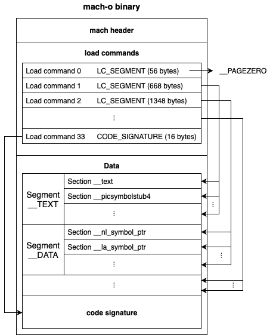
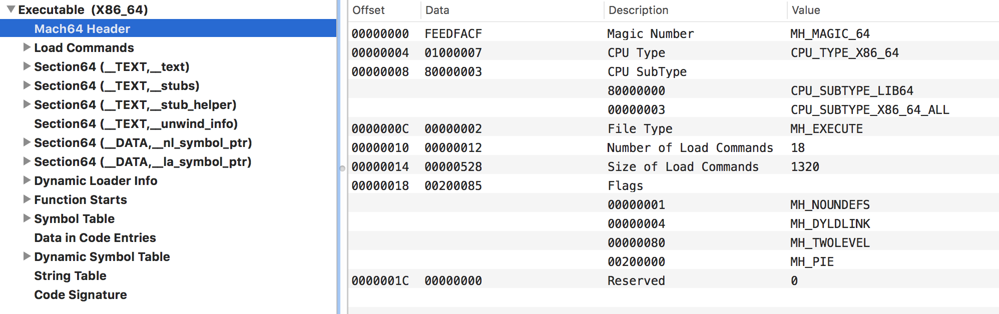
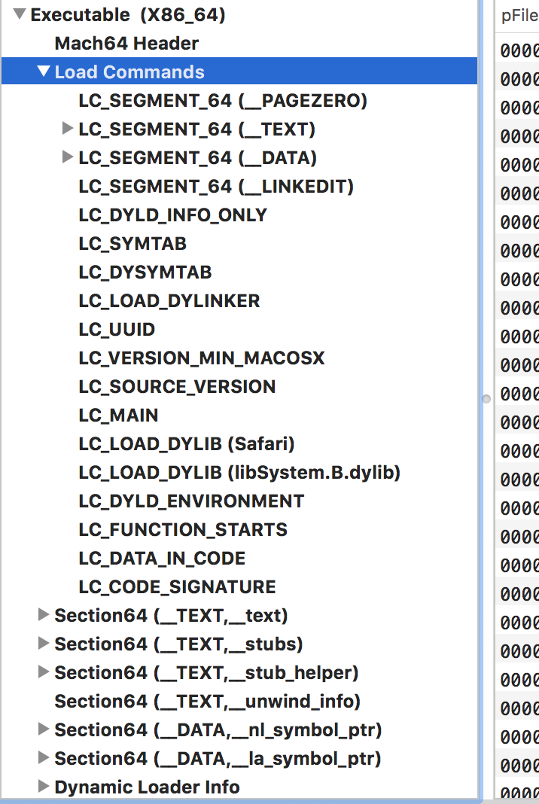
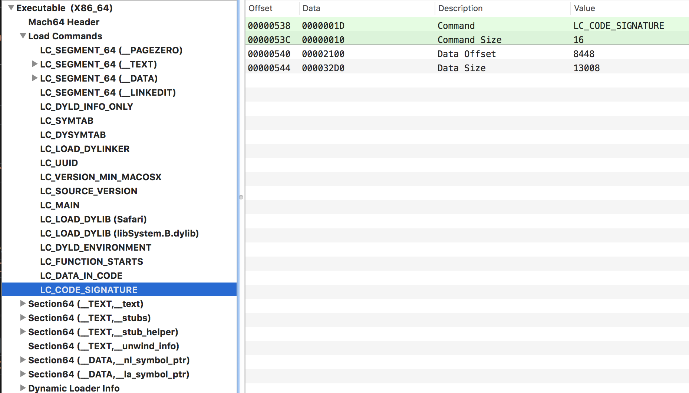
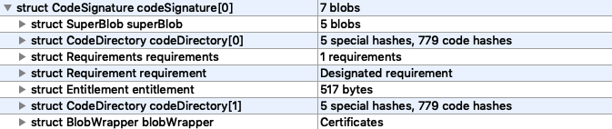
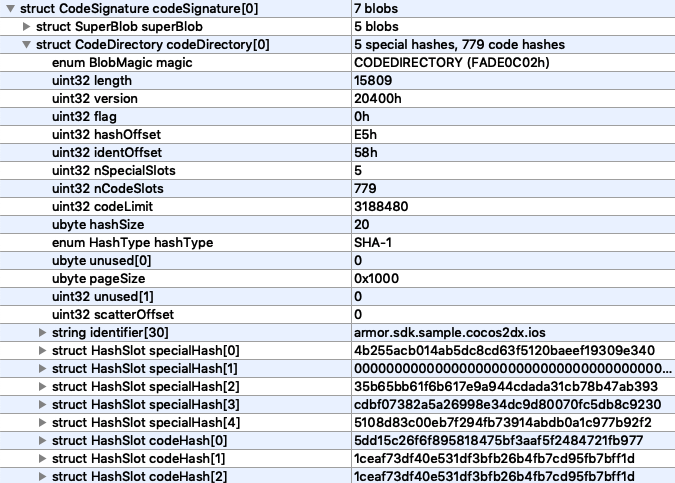
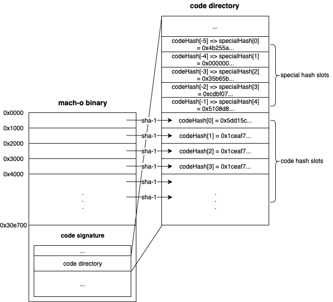
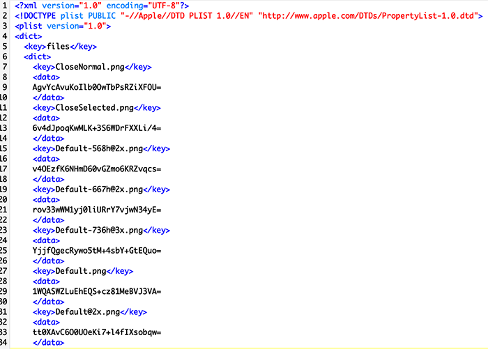
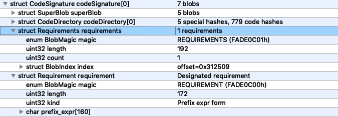
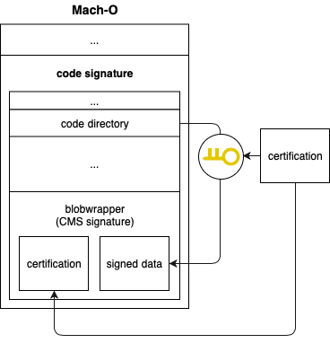

- [Abstract](#abstract)
- [Materials](#materials)
- [Developer Certificate](#developer-certificate)
- [Mobile Provisioning Profile](#mobile-provisioning-profile)
- [Mach-O](#mach-o)

-----

# Abstract

`ipa, Mach-O` 의 구조를 코드 서명의 관점에서 기술한다.

# Materials

* [iOS 코드 서명에 대해서](https://engineering.linecorp.com/ko/blog/ios-code-signing/)

# Developer Certificate

ios app 을 xcode 로 빌드하기 위해서 개발자 인증서가 필요하다. Developer Certificate 은 `iOS Development` 와 `iOS Distribution` 의 두가지 type 이 있다.

`iOS Distribution` type 의 Developer Cerificate 은 apple appstore 에서 판매할 app 을 빌드할 때 필요하다. 

`iOS Development` type 의 Developer Cerificate 은 허락된 기기에서 실행할 app 을 빌드할 때 필요하다. 허락된 기기의 목록은 `mobile provisioning profile` 에 기록되어 있다.

# Mobile Provisioning Profile

`a.ipa` 의 압축을 풀면 `~/Payload/a.app/embedded.mobileprovision` 에 존재한다. 아래와 같이 내용을 확인 할 수 있다.

```bash
security cms -D -i embedded.mobileprovision
```

Mobile Provisioning Profile 은 인증서 (Developer Certificate), Device List, Entitlements, Expiration Date 등이 포함되어 있다.

* Developer Certificate in the Mobile Provisioning Profile

```xml
<key>DeveloperCertificates</key>
<array>
  <data>XXXYYYZZZ</data>
</array>
```

`XXXYYYZZZ` 는 base64 로 인코딩되어 있다. 이것을 이용하여 다음과 같이 `PEM (Privacy-Enhanced Mail)` 형태의 파일 `a.txt` 를 제작한다.

```
-----BEGIN CERTIFICATE-----
XXXYYYZZZ
-----END CERTIFICATE-----
```

 `openssl` 을 이용하여 `PEM` 파일을 해석할 수 있다.

```
openssl x509 -in a.txt -text
```

* Entitlements in the Mobile Provisioning Profile
  
```xml
<key>Entitlements</key>
<dict>
  <key>keychain-access-groups</key>
  <array>
    <string>XXX.*</string>
  </array>
  <key>get-task-allow</key>
  <true/>
  <key>application-identifier</key>
  <string>YYY.*</string>  <key>com.apple.developer.team-identifier</key>
  <string>ZZZ</string>
</dict>
```

* Device List in the Mobile Provisioning Profile

```xml
<key>ExpirationDate</key>
<date>2019-12-12T10::11:08Z</date>
```

* Expiration Date in the Mobile Provisioning Profile

```xml
<key>ProvisionedDevices</key>
<array>
  <string>XXXXXXXXXXXX</string>
  <string>YYYYYYYYYYYY</string>
</array>
```

Ad Hoc 등 모든 기기에서 실행 가능한 앱의 Mobile Provisioning Profile 은 아래와 같이 `ProvisionsAllDevices` 가 `true` 이다.

```xml
<key>ProvisionedAllDevices</key>
<true/>
```

# Mach-O 

`a.ipa` 의 압축을 풀면 `~/Payload/a.app/Info.plist` 가 존재한다. `Excecutable file` 의 값이 실행할 `Mac-O` binary 파일이다. 다음은 `mach-o` 의 대강의 구조이다. 자세한 구조는 [macho101.pdf | github](https://github.com/corkami/pics/blob/master/binary/macho101/macho101.pdf) 를 참고한다.



[machoview | sourceforge](https://sourceforge.net/projects/machoview/) 는 `Mach-O` 뷰어이다.

`Mach-O` 는 크게 `mach header, load commands, Data` 로 구분된다. 

* 다음은 `Mach64Header` 의 주요 항목이다.



* `Load Command` 의 중요 항목은 다음과 같다. 그중 code signing 과 관계있는 것은 `LC_CODE_SIGNATURE` 이다.



`otool` 을 이용하여 `LC_CODE_SIGNATURE` 의 내용을 확인할 수 있다.

```bash
$ otool -l Payload/a.app/a | grep LC_CODE_SIGNATURE -A3
      cmd LC_CODE_SIGNATURE
  cmdsize 16
  dataoff 3188480
 datasize 59808
```



* `LC_CODE_SIGNATURE` 가 가리키는 `Code Signature` 의 중요 항목은 `CodeDirectory, Entitlement, Requirements, BlobWrapper` 등이 있다. 다음은 `CodeSignature` 의 대강의 구조이다.



* CodeDirectory

`CodeDirectory` 는 특정 파일과 실행 파일 조각들의 해시값들이 모여있다. 다음은 `CodeDirectory` 의 구조이다. `struct HashSlot specialHash[]` 와 `struct HashSlot codeHash[]` 를 주목하자.



* `struct HashSlot codeHash[]`

`codeHash[]` 는 실행 파일을 `pageSize (0x1000)` 의 크기로 나누고 각각의 해시를 포함한다.



* `struct HashSlot specialHash[]`

`specialHash[]` 는 인덱스에 따라 특별한 대상의 해시값을 가지고 있다.

| index | description | example value |
|:------|:------------|:--|
| 0 | Entitlement (bound in code signature) | 4b255acb014ab5dc8cd63f5120baeef19309e340 |
| 1 | Application Specific (largely unused) | 0000000000000000000000000000000000000000 |
| 2 | Resource Directory (_CodeResources) | 35b65bb61f6b617e9a944cdada31cb78b47ab393 |
| 3 | Internal requirements | cdbf07382a5a26998e34dc9d80070fc5db8c9230 |
| 4 | Bound Info.plist (Manifest) | 5108d83c00eb7f294fb73914abdb0a1c977b92f2 |

* `specialHash[0] Entitlement`

`Entitlement` 는 `CodeSignature` 안에 존재한다.


`Entitlement` 내용 (`enum BlobMagic magic, uin32 length, char data[510]`) 을 복사하여 `Entitlement.txt` 를 제작하면 `shasum` command
를 이용하여 `SHA-1` 값을 확인할 수 있고 이것은 앞서 언급한 예제의 값과 같다.

```bash
$ shasum Entitlement.txt
4b255acb014ab5dc8cd63f5120baeef19309e340  Entitlement.txt
```

* `specialHash[1] Application Specific`

not used yet

* `specialHash[1] Resource Directory`

`a.ipa` 의 `Payload/a.app/_CodeSignature/CodeResources` 파일의 해시값을 포함한다. 



`CodeResources` 파일은 `a.ipa` 에 존재하는 리소스 파일들에 대한 checksum 이 포함되어 있다. 다음과 같이 `shasum` command 로 해시값을 확인해볼 수 있다.

```bash
$ shasum Payload/a.app/_CodeSignature/CodeResources
35b65bb61f6b617e9a944cdada31cb78b47ab393  Payload/a.app/_CodeSignature/CodeResources
```

앞서 언급한 예제의 값과 동일하다.

* `specialHash[2] Internal requirements`

`a.ipa` 에 존재하는 `Requirements` 부분을 가리킨다. `Requirement` 는 코드 서명을 검증하기 위한 규칙이다. 규칙은 여러개일 수 있고 그 숫자는 `struct Requirements` 의 `uint32 length` 의 값과 같다.
`Requirements` 는 `codesign` command 를 이용하여 확인할 수 있다.

```bash
$ codesign --display -r- Payload/a.app/a
Executable=Payload/a.app/a
designated => identifier "com.iamslash.a" and anchor apple generic and certificate leaf[subject.CN] = "iPhone Distribution: XXXXXXX (XXXXXXX)" and certificate 1[field.1.2.840.113635.100.6.2.1] /* exists */
```



`Requirements` 와 `Requirement` 를 복사하여 `Requirements.txt` 파일로 저장하면 `shasum` command 를 이용하여 해시값을 확인할 수 있다.

```bash
$ shasum Requirements.txt
cdbf07382a5a26998e34dc9d80070fc5db8c9230  Requirements.txt
```

앞서 언급한 예제의 값과 같다.

* `specialHash[3] Bound Info.plist`

`a.ipa` 의 `Info.plist` 의 해시값이다. 다음과 같이 확인할 수 있다.

```bash
$ shasum Payload/a.app/Info.plist
5108d83c00eb7f294fb73914abdb0a1c977b92f2  Payload/a.app/Info.plist
```

* BlobWrapper

`BlogWrapper` 안에 `CMS (Cryptographic Message Syntax` 서명이 있다. `jtool` command 를 이용하면 CMS 서명을 확인할 수 있다.

```bash
$ jtool --sig -v Payload/a.app/a
    ...
    Blob 4: Type: 10000 @41788: Blob Wrapper (4802 bytes) (0x10000 is CMS (RFC3852) signature)
```


`BlogWrapper` 의 `data` 를 추출하여 `blobwrapper_data.txt` 로 저장하면 `openssl` 을 이용하여 내용을 확인할 수 있다.

```bash
$ openssl pkcs7 -inform der -in blobwrapper_data.txt -print -noout
PKCS7:
  type: pkcs7-signedData (1.2.840.113549.1.7.2)
  d.sign:
    version: 1
    md_algs: 
        algorithm: sha256 (2.16.840.1.101.3.4.2.1)
        parameter: NULL
    contents:
      type: pkcs7-data (1.2.840.113549.1.7.1)
      d.data: <ABSENT>
    cert:
        cert_info:
          version: 2
          serialNumber: 134752589830791184
          signature:
            algorithm: sha1WithRSAEncryption (1.2.840.113549.1.1.5)
            parameter: NULL
          issuer: C=US, O=Apple Inc., OU=Apple Certification Authority, CN=Apple Root CA
          validity:
            notBefore: Feb  7 21:48:47 2013 GMT
            notAfter: Feb  7 21:48:47 2023 GMT
          subject: C=US, O=Apple Inc., OU=Apple Worldwide Developer Relations, CN=Apple Worldwide Developer Relations Certification Authority
          key:
            algor:
              algorithm: rsaEncryption (1.2.840.113549.1.1.1)
              parameter: NULL
            public_key:  (0 unused bits)
              0000 - 30 82 01 0a 02 82 01 01-00 ca 38 54 a6 cb   0.........8T..
```

`CodeDirectory` 의 내용을 변경하고 동일한 Developer Certificate 으로 서명해도 `CMS` 서명이 달라진다. 따라서 공격자가 코드를 변경하고 `CodeDirectory` 를 그에 맞게 수정하더라도 최초 작성자가 가지고 있는 Developer Certificate 이 없기 때문에 `CMS` 서명은 달라질 수 밖에 없다. 따라서 `CMS` 서명을 검증하면 앱의 무결성을 보장할 수 있다.



`iOS` 는 앱을 실행하기 전에 `Mach-O` 의 해시값을 확인하고 `CMS` 서명을 검증한다.
