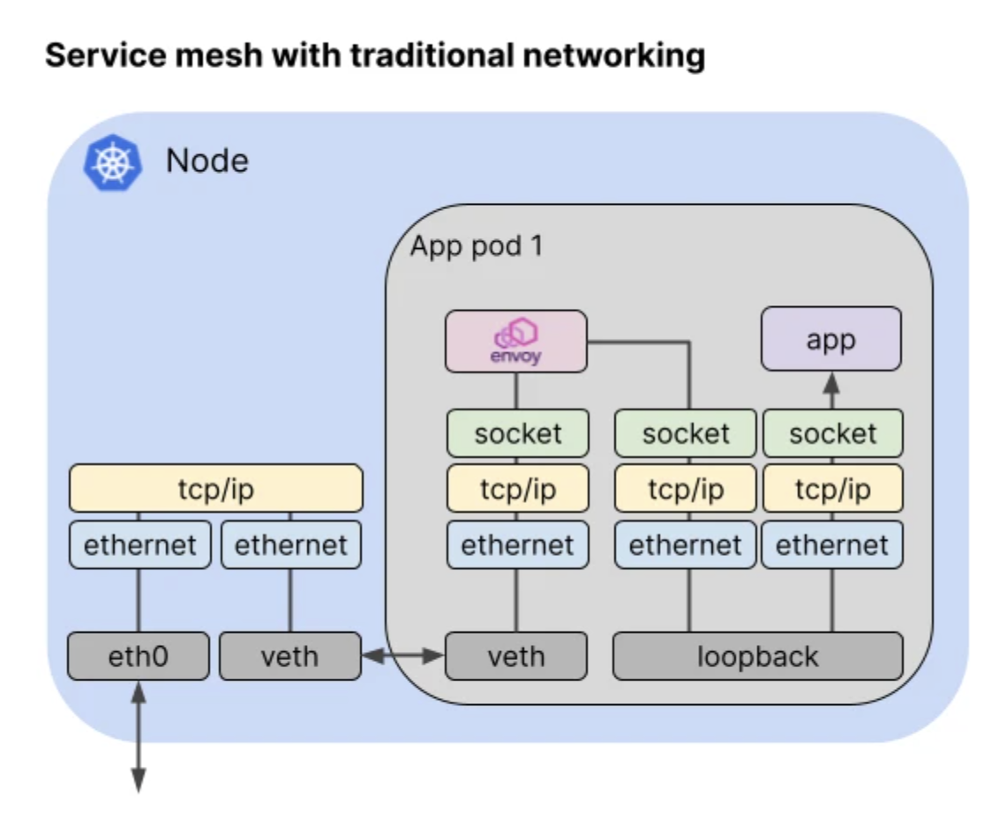
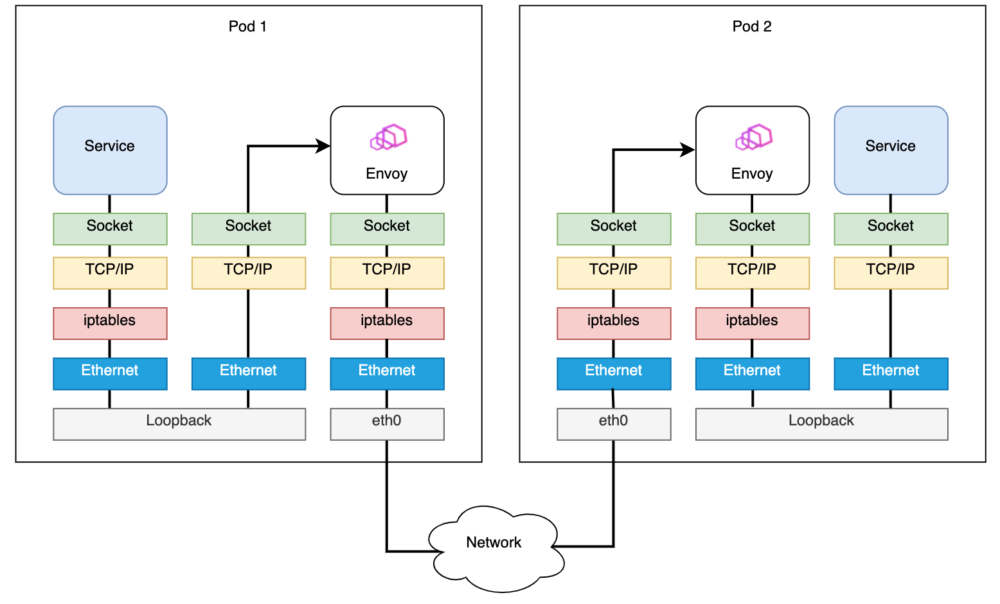

- [Abstract](#abstract)
- [References](#references)
- [Materials](#materials)
- [Basic](#basic)
  - [Install](#install)
  - [Architecture](#architecture)
  - [Traffic Management](#traffic-management)
    - [Virtual services](#virtual-services)
    - [Destination rules](#destination-rules)
    - [Gateways](#gateways)
  - [Basic Istio Traffic Routing](#basic-istio-traffic-routing)
    - [Kubernetes Service, RoundRobin](#kubernetes-service-roundrobin)
    - [Kubernetes Service, spec.selector](#kubernetes-service-specselector)
    - [Istio VirtualService](#istio-virtualservice)
    - [Istio VirtualService, weight](#istio-virtualservice-weight)
    - [Istio VirtualService, DestinationRule](#istio-virtualservice-destinationrule)
  - [BookInfo Examples](#bookinfo-examples)
  - [Dive Deep Into Istio Traffics](#dive-deep-into-istio-traffics)
    - [Request from Client to POD](#request-from-client-to-pod)
    - [Response from POD to Client](#response-from-pod-to-client)
    - [Request from POD to External Server](#request-from-pod-to-external-server)
    - [Response from External to POD](#response-from-external-to-pod)
    - [Optimization Of Traffics](#optimization-of-traffics)
      - [Merbridge](#merbridge)
      - [Cilium CNI](#cilium-cni)

----

# Abstract

**Istio** is a completely open source service mesh that layers transparently onto existing distributed applications.

A **service mesh** is a dedicated infrastructure layer for handling service-to-service communication. A service mesh is consisted of **control plane** and **data plane**.

* The **data plane** is composed of a set of **intelligent proxies (Envoy)** deployed as sidecars.
* The **control plane** manages and configures the proxies to route traffic.

Istio provides these features. [Feature Status](https://istio.io/latest/docs/releases/feature-stages/)

* Traffic Management
  * Request Routing
  * Fault Injection
  * Traffic Shifting
  * TCP Traffic Shifting
  * Request Timeouts
  * Circuit Breaking
  * Mirroring
  * Locality Load Balancing
  * Ingress
  * Egress
* Security
  * Certificate Management
  * Authentication
  * Authorization
* Observability
  * Telemetry API
  * Metrics
  * Logs
  * Distributed Tracing
  * Visualizing Your Mesh
  * Remotely Accessing Telemetry Addons 
* Extensibility
  * WebAssembly

# References

* [Documentation](https://istio.io/latest/docs/)
  * [src](https://github.com/istio/istio)

# Materials

* [간단한 예제로 보는 Istio VirtualService와 Destination 을 활용한 Istio Traffic Routing의 이해](https://itnp.kr/post/istio-routing-api)
  * 킹왕짱 설명
* [Istio 트래픽 흐름 @ youtube](https://www.youtube.com/playlist?list=PLDoAIZhHTMvPIY7PHDtMaqbUUWEbE6-6H)
  * [Istio 🌶️ 트래픽 흐름 Life of a packet @ notion](https://gasidaseo.notion.site/Istio-Life-of-a-packet-6ad9808e14594296bf854dcc203cab71)
* [Getting Started @ istio.io](https://istio.io/latest/docs/setup/getting-started/)
* [Service Mesh Comparison](https://servicemesh.es/)
  * comparison of Istio, Linkerd, Kuma
* [istio @ eksworkshop](https://www.eksworkshop.com/advanced/310_servicemesh_with_istio/)
* [Istio Service Mesh](https://daddyprogrammer.org/post/13721/istio-service-mesh/)

# Basic

## Install

[Getting Started @ istio.io](https://istio.io/latest/docs/setup/getting-started/) 를 참고하여 minikube 에 install 해보자.

## Architecture

> [Architecture](https://istio.io/latest/docs/ops/deployment/architecture/)


## Traffic Management

Istio 가 제공하는 기능중 Traffic Management 는 기본적인 것이다. 잘 알아두자.
Istio 는 Traffic Management 를 위해 다음과 같은 Resource 들을 이용한다.

* Virtual services
* Destination rules
* Gateways
* Service entries
* Sidecars

### Virtual services

Protocol (http/tls/tcp) 별로 Traffic Route Rule 을 정의한다.

### Destination rules

subset 별로 Traffic Policy Rule 을 정의한다.

* Load-Balancing
* Connection-Pool
* Pool 에서 Unhealty 한 서비스 발견 및 제거

### Gateways

## Basic Istio Traffic Routing

> [간단한 예제로 보는 Istio VirtualService와 Destination 을 활용한 Istio Traffic Routing의 이해](https://itnp.kr/post/istio-routing-api)

Kubernetes, Istio Traffic Routing 은 복잡하다. 다음과 같은 예를 하나씩
살펴보면서 Kubernetes, Istio Traffic Routing 을 이해해보자.

* Kubernetes Service 를 이용한다.
  * endpoints 가 여러개인 경우 Round Robin 으로 traffic 을 분배한다.
* Kubernetes Service, sepc.selector 를 이용한다.
  * Manual Routing Rule 
* Istio Virtual Service 를 이용
  * `match` for Routing Rule
* Istio Virtual Service, weight 를 이용
  * `weight` for Routing Rule
* Istio Virtual Service, DestinationRule 을 이용
  * `subset` for Routing Rule

먼저 다음과 같이 Pod 들을 설치하자. 2 개의 Pod 는 Server 이고 1 개의 Pod 는 
Client 이다.

```bash
$ kubectl apply -f - <<EOF
apiVersion: v1
kind: Pod
metadata:
  name: hello-server-v1
  labels:
    app: hello
    version: v1
spec:
  containers:
  - image: docker.io/honester/hello-server:v1
    imagePullPolicy: IfNotPresent
    name: hello-server-v1
---
apiVersion: v1
kind: Pod
metadata:
  name: hello-server-v2
  labels:
    app: hello
    version: v2
spec:
  containers:
  - image: docker.io/honester/hello-server:v2
    imagePullPolicy: IfNotPresent
    name: hello-server-v2
---
apiVersion: v1
kind: Pod
metadata:
  name: httpbin
  labels:
    app: httpbin
spec:
  containers:
  - image: docker.io/honester/httpbin:latest
    imagePullPolicy: IfNotPresent
    name: httpbin
EOF

$ kubectl get all -l app=hello
NAME                  READY   STATUS    RESTARTS   AGE
pod/hello-server-v1   2/2     Running   0          20m
pod/hello-server-v2   2/2     Running   0          20m
```

### Kubernetes Service, RoundRobin

`svc-hello` Service 는 `app: hello` Label 이 부착된 POD 들에게 Traffic 을 Round Robin 한다.


다음과 같이 Service 를 설치한다.

```bash
$ kubectl apply -f - <<EOF
apiVersion: v1
kind: Service
metadata:
  name: svc-hello
  labels:
    app: hello
spec:
  selector:
    app: hello
  ports:
  - name: http
    protocol: TCP
    port: 8080
EOF
```

다음과 같이 endpoint 를 확인하자.

```bash
$ kubectl get endpoints -l app=hello

NAME           ENDPOINTS                         AGE
svc-hello      172.17.0.5:8080,172.17.0.6:8080   92m
```

다음과 같이 트래픽을 전달해 보자.

```bash
$ for i in {1..5}; do kubectl exec -it httpbin -c httpbin -- curl http://svc-hello.default.svc.cluster.local:8080; sleep 0.5; done

Hello server - v2
Hello server - v1
Hello server - v2
Hello server - v1
Hello server - v1
```

### Kubernetes Service, spec.selector

`svc-hello` Service 의 Label 설정을 바꾸어서 Traffic 을 `version: v1` 이 부착된 POD 으로 보내거나 `version: v2` 가 부착된 POD 으로 보낸다.


다음과 같이 Service 를 설치한다.

```bash
$ kubectl apply -f - <<EOF
apiVersion: v1
kind: Service
metadata:
  name: svc-hello
  labels:
    app: hello
spec:
  selector:
    app: hello
    version: v1
  ports:
  - name: http
    protocol: TCP
    port: 8080
EOF
```

다음과 같이 endpoints 를 확인한다.

```bash
$ kubectl get endpoints -l app=hello

NAME        ENDPOINTS                         AGE
svc-hello      172.17.0.5:8080                   92m
```

다음과 같이 Traffic 을 전달하자. 모두 `version: v1` 이 부착된 POD 으로 전달되었다.

```bash
$ for i in {1..5}; do kubectl exec -it httpbin -c httpbin -- curl http://svc-hello.default.svc.cluster.local:8080; sleep 0.5; done

Hello server - v1
Hello server - v1
Hello server - v1
Hello server - v1
Hello server - v1
```

이제 다음과 같이 Service 를 수정한다.

```bash
$ kubectl apply -f - <<EOF
apiVersion: v1
kind: Service
metadata:
  name: svc-hello
  labels:
    app: hello
spec:
  selector:
    app: hello
    version: v2
  ports:
  - name: http
    protocol: TCP
    port: 8080
EOF
```

다음과 같이 endpoints 를 확인한다.

```bash
$ kubectl get endpoints -l app=hello

NAME        ENDPOINTS                         AGE
svc-hello      172.17.0.6:8080                   92m
```

다음과 같이 Traffic 을 전달한다. 모두 `version: v2` 가 부착된 POD 으로 전달되었다.

```bash
$ for i in {1..5}; do kubectl exec -it httpbin -c httpbin -- curl http://svc-hello.default.svc.cluster.local:8080; sleep 0.5; done

Hello server - v2
Hello server - v2
Hello server - v2
Hello server - v2
Hello server - v2
```

### Istio VirtualService


### Istio VirtualService, weight


### Istio VirtualService, DestinationRule


## BookInfo Examples

## Dive Deep Into Istio Traffics

> * [Istio 트래픽 흐름 @ youtube](https://www.youtube.com/playlist?list=PLDoAIZhHTMvPIY7PHDtMaqbUUWEbE6-6H)
>   * [Istio 🌶️ 트래픽 흐름 Life of a packet @ notion](https://gasidaseo.notion.site/Istio-Life-of-a-packet-6ad9808e14594296bf854dcc203cab71)
> * [How eBPF will solve Service Mesh - Goodbye Sidecars](https://isovalent.com/blog/post/2021-12-08-ebpf-servicemesh)
> * [Try eBPF-powered Cilium Service Mesh - join the beta program!](https://cilium.io/blog/2021/12/01/cilium-service-mesh-beta)

다음은 Kubernetes Node 의 Traffic 흐름을 표현한 것이다. Node 의 `eth0` network
interface 으로 넘어온 패킷이 `veth, veth, loopback` network interface 를 거쳐
app 으로 전달된다. 많은 수의 Network Interface 를 지나기 때문에 비효율적이다.



다음은 Kubernetes Node 의 POD 에서 외부로 Request 를 요청했을 때 Traffic 의 흐름이다. 역시 많은 수의 Network Interface 를 지나기 때문에 비효율적이다.


### Request from Client to POD

* [1.1 클라이언트(요청) → 파드(인입)](https://gasidaseo.notion.site/Istio-Life-of-a-packet-6ad9808e14594296bf854dcc203cab71#5ed7095cfbf74fe3b89d8c96f66d780b)

### Response from POD to Client

* [1.2 파드(리턴 트래픽) → 클라이언트](https://gasidaseo.notion.site/Istio-Life-of-a-packet-6ad9808e14594296bf854dcc203cab71#710f224348d2435e806bb1bc4d14a5f5)

### Request from POD to External Server

* [2.1 파드(요청) → 외부 웹서버](https://gasidaseo.notion.site/Istio-Life-of-a-packet-6ad9808e14594296bf854dcc203cab71#d51cdb24177c4c25952e08f4486132b7)

### Response from External to POD

* [2.2 외부 웹서버(리턴 트래픽) → 파드](https://gasidaseo.notion.site/Istio-Life-of-a-packet-6ad9808e14594296bf854dcc203cab71#97bfb642beea4cdab6daa87b4c962763)

### Optimization Of Traffics

#### Merbridge

[Merbridge](https://istio.io/latest/blog/2022/merbridge/) 를 사용하면 [eBPF](/bpf/README.md) 을 이용하여 Traffic 을 최적화 할 수 있다고 한다.

아래는 [Merbridge](https://istio.io/latest/blog/2022/merbridge/) 를 사용하기 전의 모습이다.



아래는 [Merbridge](https://istio.io/latest/blog/2022/merbridge/) 를 사용한 모습이다.


아래는 [Merbridge](https://istio.io/latest/blog/2022/merbridge/) 를 사용하고 같은 Node 위에서 실행된 POD 들의 모습이다.


#### Cilium CNI

[Cilium CNI](https://cilium.io/blog/2021/12/01/cilium-service-mesh-beta) 을 사용하면 다음과 같이 sidecar 없이 traffic routing 이 가능하다고 한다. [Cilium CNI](https://cilium.io/blog/2021/12/01/cilium-service-mesh-beta) 은 [eBPF](/bpf/README.md) 를 이용한다.


