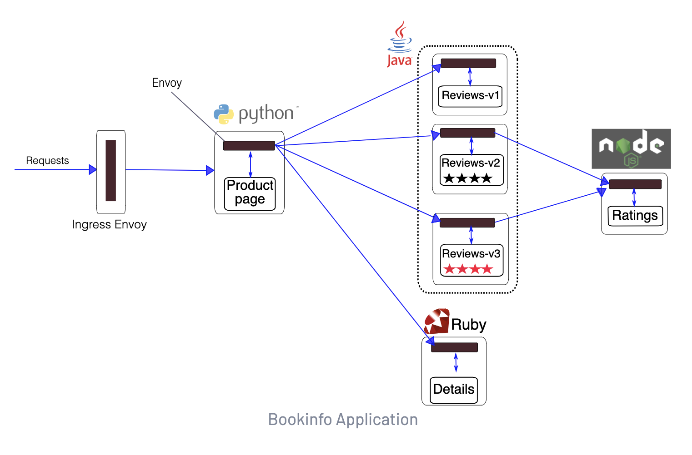

# Abstract

**Istio** is a completely open source service mesh that layers transparently onto existing distributed applications.

A **service mesh** is a dedicated infrastructure layer for handling service-to-service communication. A service mesh is consisted of **control plane** and **data plane**.

* The **data plane** is composed of a set of **intelligent proxies (Envoy)** deployed as sidecars.
* The **control plane** manages and configures the proxies to route traffic.

# References

* [Documentation](https://istio.io/latest/docs/)
  * [src](https://github.com/istio/istio)

# Materials

* [Istio 트래픽 흐름 @ youtube](https://www.youtube.com/playlist?list=PLDoAIZhHTMvPIY7PHDtMaqbUUWEbE6-6H)
  * [Istio 🌶️ 트래픽 흐름 Life of a packet @ notion](https://gasidaseo.notion.site/Istio-Life-of-a-packet-6ad9808e14594296bf854dcc203cab71)
* [Getting Started @ istio.io](https://istio.io/latest/docs/setup/getting-started/)
* [Service Mesh Comparison](https://servicemesh.es/)
  * comparison of Istio, Linkerd, Kuma
* [istio @ eksworkshop](https://www.eksworkshop.com/advanced/310_servicemesh_with_istio/)
* [Istio Service Mesh](https://daddyprogrammer.org/post/13721/istio-service-mesh/)

# Install

[Getting Started @ istio.io](https://istio.io/latest/docs/setup/getting-started/) 를 참고하여 minikube 에 install 해보자.

# Basic

## Bookinfo Application

* [Bookinfo Application @ istio.io](https://istio.io/latest/docs/examples/bookinfo/)
  * [src](https://github.com/istio/istio/tree/master/samples/bookinfo) 

[Bookinfo Application @ istio.io](https://istio.io/latest/docs/examples/bookinfo/) 를 참고로 중요한 manifest file 을 익혀본다.

istio 를 적용하기 전 system architecture 는 다음과 같다. 


다음은 istio 를 적용한 system architecture 이다. 



각 POD 에 istio proxy conntainer 가 side 로 inject 되어 있다. 이렇게 istio proxy container 가 포함된 POD 들을 **data plane** 이라고 한다. 또한 istiod 와 같이 istio proxy 와 통신하면서 service mesh 의 control tower 역할을 하는 것을 **control plane** 이라고 한다.

이제 [Bookinfo Application @ istio.io](https://istio.io/latest/docs/examples/bookinfo/)를 참고하여 bookinfo service 를 설치해보자.

[samples/bookinfo/platform/kube/bookinfo.yaml](https://raw.githubusercontent.com/istio/istio/release-1.10/samples/bookinfo/platform/kube/bookinfo.yaml) 을 이용하여 Service, Deployment 를 설치한다.

[samples/bookinfo/networking/bookinfo-gateway.yaml](https://raw.githubusercontent.com/istio/istio/release-1.10/samples/bookinfo/networking/bookinfo-gateway.yaml) 을 이용하여 Gateway, VirtualService 를 설치한다. 이제 외부 트래픽을 Pod 에서 받을 수 있다.

```yml
# samples/bookinfo/networking/bookinfo-gateway.yaml
apiVersion: networking.istio.io/v1alpha3
kind: Gateway
metadata:
  name: bookinfo-gateway
spec:
  selector:
    istio: ingressgateway # use istio default controller
  servers:
  - port:
      number: 80
      name: http
      protocol: HTTP
    hosts:
    - "*"
---
apiVersion: networking.istio.io/v1alpha3
kind: VirtualService
metadata:
  name: bookinfo
spec:
  hosts:
  - "*"
  gateways:
  - bookinfo-gateway
  http:
  - match:
    - uri:
        exact: /productpage
    - uri:
        prefix: /static
    - uri:
        exact: /login
    - uri:
        exact: /logout
    - uri:
        prefix: /api/v1/products
    route:
    - destination:
        host: productpage
        port:
          number: 9080
```

[samples/bookinfo/networking/destination-rule-all.yaml](https://raw.githubusercontent.com/istio/istio/release-1.10/samples/bookinfo/networking/destination-rule-all.yaml) 을 이용하여 DestinationRule 을 설치한다. version 에 따라 traffic 을 management 하는 rule 을 생성할 수 있다.

```yaml
apiVersion: networking.istio.io/v1alpha3
kind: DestinationRule
metadata:
  name: productpage
spec:
  host: productpage
  subsets:
  - name: v1
    labels:
      version: v1
---
apiVersion: networking.istio.io/v1alpha3
kind: DestinationRule
metadata:
  name: reviews
spec:
  host: reviews
  subsets:
  - name: v1
    labels:
      version: v1
  - name: v2
    labels:
      version: v2
  - name: v3
    labels:
      version: v3
---
apiVersion: networking.istio.io/v1alpha3
kind: DestinationRule
metadata:
  name: ratings
spec:
  host: ratings
  subsets:
  - name: v1
    labels:
      version: v1
  - name: v2
    labels:
      version: v2
  - name: v2-mysql
    labels:
      version: v2-mysql
  - name: v2-mysql-vm
    labels:
      version: v2-mysql-vm
---
apiVersion: networking.istio.io/v1alpha3
kind: DestinationRule
metadata:
  name: details
spec:
  host: details
  subsets:
  - name: v1
    labels:
      version: v1
  - name: v2
    labels:
      version: v2
---
```

istio 를 적용한 bookinfo example 의 network traffic 흐름은 다음과 같다.


