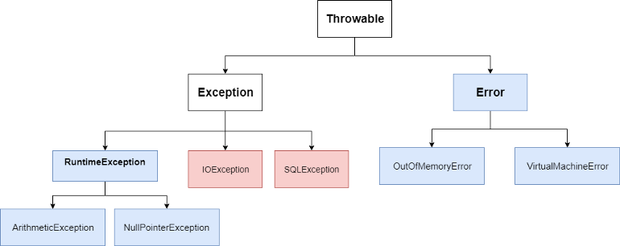
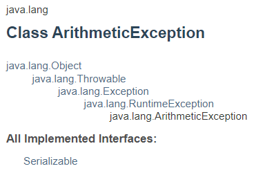

- [Abstract](#abstract)
- [References](#references)
- [Materials](#materials)
- [Basic Usages](#basic-usages)
  - [Compile, Execution](#compile-execution)
  - [Reserved Words](#reserved-words)
  - [Useful Keywords](#useful-keywords)
  - [min, max values](#min-max-values)
  - [abs vs fabs](#abs-vs-fabs)
  - [Bit Manipulation](#bit-manipulation)
  - [String](#string)
  - [Random](#random)
  - [Print Out](#print-out)
  - [Collections compared c++ container](#collections-compared-c-container)
  - [Collection Examples](#collection-examples)
  - [Collection Conversions](#collection-conversions)
  - [Sort](#sort)
  - [Search](#search)
  - [Multi Dimensional Array](#multi-dimensional-array)
  - [Collection Framework](#collection-framework)
  - [Collection Implementations](#collection-implementations)
  - [Data Types](#data-types)
  - [Decision Making](#decision-making)
  - [Loops](#loops)
  - [Inner Classes](#inner-classes)
  - [java 8 Interface Changes](#java-8-interface-changes)
  - [Marker Interfaces](#marker-interfaces)
  - [Functional Interfaces](#functional-interfaces)
  - [Anonymous Classes](#anonymous-classes)
  - [Enum](#enum)
  - [Annotation](#annotation)
  - [Generics](#generics)
  - [Concurrency](#concurrency)
    - [ReentrantLock](#reentrantlock)
    - [Semaphore](#semaphore)
    - [CountDownLatch](#countdownlatch)
  - [Static Class](#static-class)
  - [Test](#test)
  - [Multithread](#multithread)
  - [Effective Java Programming](#effective-java-programming)
  - [What's new Java8](#whats-new-java8)
    - [Interface Default and Static Methods](#interface-default-and-static-methods)
    - [Functional Interfaces](#functional-interfaces-1)
    - [Method References](#method-references)
    - [Optional<T>](#optionalt)
- [Advanced Usage](#advanced-usage)
  - [Instant, ZonedDateTime](#instant-zoneddatetime)
  - [arraycopy](#arraycopy)
  - [Integer.valueOf vs Integer.parseInt](#integervalueof-vs-integerparseint)
  - [Exception](#exception)
  - [Dynamic Proxy](#dynamic-proxy)
  - [AOP](#aop)
  - [@Transactional and Dynamic Proxy](#transactional-and-dynamic-proxy)
  - [ArrayList vs CopyOnWriteArrayList](#arraylist-vs-copyonwritearraylist)
  - [jvm architecture](#jvm-architecture)
  - [jvm garbage collector](#jvm-garbage-collector)
  - [Stream](#stream)
  - [Java code coverage library](#java-code-coverage-library)
  - [Java Byte Code Manipulation library](#java-byte-code-manipulation-library)
  - [Java Lombok](#java-lombok)
  - [JVM Options](#jvm-options)
  - [Thread Dump, Heap Dump](#thread-dump-heap-dump)
  - [BigInteger](#biginteger)
  - [Comparable vs Comparator](#comparable-vs-comparator)
  - [Class literal, Type Token, Super Type Token](#class-literal-type-token-super-type-token)
  - [CompletableFuture](#completablefuture)
  - [Caffeine](#caffeine)
  - [Cache2k](#cache2k)
  - [JCache](#jcache)
- [Quiz](#quiz)

-------------------------------------------------------------------------------

# Abstract

This is about JAVA.

# References

* [effective java @ TIL](/java/effectivejava/README.md)
* [java annotation @ TIL](/java/javaannotation.md)
* [java gc @ TIL](/java/javagc.md)
* [java multithread @ TIL](/java/javamultithread.md)
* [java test @ TIL](/java/java_test.md)
* [jvm @ TIL](/jvm/README.md)

# Materials

* [Java magazine](https://blogs.oracle.com/javamagazine/issue-archives)
  * [Java magazine - Reactive programming](file:///Users/davidsun/Documents/java-magazine-jan-feb-2018.pdf) 
* [java-examples](https://github.com/iamslash/java-examples)
* [더 자바, 코드를 조작하는 다양한 방법 by 백기선](https://www.inflearn.com/course/the-java-code-manipulation/dashboard)
* [더 자바, 애플리케이션을 테스트하는 다양한 방법 by 백기선](https://www.inflearn.com/course/the-java-application-test)
* [Parallel, Concurrent, and Distributed Programming in Java Specialization @ coursera](https://www.coursera.org/specializations/pcdp)
  * [Parallel Programming in Java](https://www.coursera.org/learn/parallel-programming-in-java)
  * [Concurrent Programming in Java](https://www.coursera.org/learn/concurrent-programming-in-java#syllabus)
  * [Distributed Programming in Java](https://www.coursera.org/learn/distributed-programming-in-java)
* [자바 프로그래밍 언어 코딩 규칙](https://myeonguni.tistory.com/1596)
* [Advanced Java](http://enos.itcollege.ee/~jpoial/allalaadimised/reading/Advanced-java.pdf)
  * java 의 고급내용
* [learn java in Y minutes](https://learnxinyminutes.com/docs/java/)
* [java @ tutorialspoint](https://www.tutorialspoint.com/java/)
* [초보자를 위한 Java 200제 (2판)](http://www.infopub.co.kr/index.asp)
  * [목차](http://www.infopub.co.kr/common/book_contents/05000262.html)
  * [src](http://www.infopub.co.kr/index.asp)
* [JAVA 의 정석](http://www.yes24.com/Product/goods/24259565)
  * [video](https://www.youtube.com/watch?v=xRkCbqR0v84&list=PLW2UjW795-f5LNeTO6VQB1ZIeZJ_kwEG1)
  * [src](https://github.com/castello/javajungsuk3)
  * [blog](https://codechobo.tistory.com/1?category=645496)
  
# Basic Usages

## Compile, Execution

```bash
> javac A.java
> java A
```

## Reserved Words

```java
abstract    assert      boolean     break 
byte        case        catch       char
class       const       continue    default
do          double      else        enum
extends     final       finally     float
for         goto        if          implements
import      instanceof  int         interface
long        native      new         package
private     protected   public      return
short       static      strictfp    super
switch      synchronized    this    throw
throws      transient   try         void
volatile    while
```

## Useful Keywords

- volatile
  - 데이터를 읽을 때 cahe 에서 읽지 않고 memory 에서 읽는다. 그리고 데이터를 쓸 때 cache 에 쓰지 않고 memory 에 쓴다.
  - thread 들이 여러개의 cache 때문에 데이터의 원자성이 보장되지 않을 때 사용한다.

```java
public class SharedFoo {
    public volatile int counter = 0;
}
```

- strictfp
  - JVM 은 host platform 에 따라 부동 소수점 표현방식이 다양할 수 있다. IEEE 754 로 표준화 하기 위해 필요하다.

```java
strictfp class Example {
  public static void main(String[] args) {
    double d = Double.MAX_VALUE;
    System.out.println(d*1.1);
  }
}
strictfp class A {...} 
strictfp interface B {...} 
strictfp void method() {...} 
```

- native
  - [참고](https://www.baeldung.com/java-native)
  - java 에서 c/cpp library 와 같은 platform dependent api 를 이용할 때 선언한다.

```java
public class DateTimeUtils {
    public native String getSystemTime();
 
    static {
        System.loadLibrary("nativedatetimeutils");
    }
}

public class DateTimeUtilsManualTest {
 
   @BeforeClass
    public static void setUpClass() {
        // .. load other dependent libraries  
        System.loadLibrary("nativedatetimeutils");
    }
 
    @Test
    public void givenNativeLibsLoaded_thenNativeMethodIsAccessible() {
        DateTimeUtils dateTimeUtils = new DateTimeUtils();
        LOG.info("System time is : " + dateTimeUtils.getSystemTime());
        assertNotNull(dateTimeUtils.getSystemTime());
    }
}
```

- transient
  - serialize 의 대상이 되지 않도록 한다.

```java
class Person implements Serializable {
    private transient String name; // thi shoul be null
    private String email;
    private int age;

    public Member(String name, String email, int age) {
        this.name = name;
        this.email = email;
        this.age = age;
    }
    @Override
    public String toString() {
        return String.format("Person{name='%s', email='%s', age='%s'}", name, email, age);
    }
}
...
  public static void main(String[] args) throws IOException, ClassNotFoundException {
        Person p = new Person("iamslash", "iamslash@gmail.com", 28); 
        String s = serializeTest(p);
        deSerializeTest(s);
    }
```

## min, max values

```java
// int
System.out.println(Integer.MIN_VALUE); // -2,147,483,648  -2^31
System.out.println(Integer.MAX_VALUE); // 2,147,483,647   2^31 - 1
System.out.println(Integer.MAX_VALUE == ((1 << 31)-1)); // 0111 1111 ...
System.out.println(Integer.MIN_VALUE == (1 << 31));     // 1000 0000 ...
System.out.println(Integer.MIN_VALUE - 1); // 2,147,483,647  2^31 - 1
System.out.println(Integer.MAX_VALUE + 1); // -2,147,483,648   -2^31

// float
System.out.println(Float.MIN_VALUE);
System.out.println(Float.MAX_VALUE);
```

## abs vs fabs

```java
// abs
int x = 175;
int y = -184;
System.out.println("Math.abs(" + x + ")=" + Math.abs(x));
System.out.println("Math.abs(" + y + ")=" + Math.abs(y));
System.out.println("Math.abs(-0)=" + Math.abs(-0));

// fabs
Integer a = -8;
double d = -100;
float f = -90;
System.out.println(Math.abs(a));
System.out.println(Math.abs(d));     
System.out.println(Math.abs(f)); 
```

## Bit Manipulation

> [Difference between >>> and >>](https://stackoverflow.com/questions/2811319/difference-between-and)

`>>` arithmatic bit shift vs `>>>` logical bit shift

```java
int a = -2; // 1111 1110

// Arithmatic bit shift
int b = a >> 1; // 1111 1111

// Logical bit shift
int c = a >>> 1; // 0111 1111
```

## String

```java
// StringBuffer is thread-safe but StringBuilder is not thread-safe
StringBuffer sb = new StringBuffer();
StringBuilder sb = new StringBuilder();
sb.append("a");
sb.deleteCharAt(sb.length()-1);
sb.setCharAt(0, '*');

// StringBuilder right trim
int last = sb.length()-1;
while (last >= 0 && sb.charAt(last) == ' ') {
   sb.deleteCharAt(last--);
}

// substring(int beginIndex)
// substring(int beginIndex, int endIndex)
"hamburger".substring(4, 8) // "urge"
"smiles".substring(1, 5) // "mile"
s = s.substring(0, s.length() - 1);
// Convert String, Integer
Integer n = Integer.parseInt("12");
String s = Integer.toString(12);
// Remove string
s.replaceAll("\\*", "");
// Join string
String[] words = new String[]{"Hello", "World"};
String s = String.join(" ", words);

// Remove not words and split as lower case letters
// \W : not word. same as [^_[:alnum:]]
// \s : not whitespace. sam as [[:space:]]
s = "Foo. Bar, BAz";
String[] words = s.replaceAll("\\W+", " ")
                  .toLowerCase()
                  .split("\\s+");

// Convert char[] to String
char[] chars = words.split("\\s+");
String s = String.valueOf(chars);                   

// convert char[], int[] to String
char[] chars = new char[]{'H','E','L','L','O'};
int[] cells = new int[]{0,0,1,1};
System.out.println(String.valueOf(cells));  // [I@59f95c5d
System.out.println(Arrays.toString(cells)); // [0, 0, 1, 1]
System.out.println(String.valueOf(chars));  // HELLO
```

## Random

```java
Random rnd = new Random();
System.out.println(rnd.nextInt()); // 0~Integer.MAX_VALUE
System.out.println(rnd.nextInt(10)); // 0~9
System.out.println(rnd.nextFloat()); // 0.0~1.0
```

## Print Out

> [Formatting Numeric Print Output @ oracle](https://docs.oracle.com/javase/tutorial/java/data/numberformat.html)

```java
// %n means system dependent line breaks.
System.out.printf("%s : %d%n", "age", 11);
```

## Collections compared c++ container

| c++                  | java                                   |
| :------------------- | :------------------------------------- |
| `if, else`           | `if, else`                             |
| `for, while`         | `for, while`                           |
| `array`              | `Collections.unmodifiableList`         |
| `vector`             | `Vector, ArrayList`                    |
| `deque`              | `Deque, ArrayDeque`                    |
| `forward_list`       |  |
| `list`               | `List, LinkedList`                     |
| `stack`              | `Stack, Deque, ArrayDeque, LinkedList` |
| `queue`              | `Queue, LinkedList`                    |
| `priority_queue`     | `Queue, PriorityQueue`                 |
| `set`                | `SortedSet, TreeSet`                   |
| `multiset`           |                                      |
| `map`                | `SortedMap, TreeMap`                   |
| `multimap`           |                                      |
| `unordered_set`      | `Set, HashSet`                         |
| `unordered_multiset` |                                      |
| `unordered_map`      | `Map, HashMap`                         |
| `unordered_multimap` |                                      |

* core interfaces in Collections

```
             Iterable
                |
            Collection        Map
         /    |    |           |
       Set List  Queue     SortedMap 
        |          | 
       SortedSet Deque
```

* core classes in Collections
  * [Collections in java @ geeksforgeeks](https://www.geeksforgeeks.org/collections-in-java-2/)
  * [Collections in Java @ javapoint](https://www.javatpoint.com/collections-in-java)

* Legacy classes
  * Collection 이 개발되기 전에 container 들이다. 사용을 추천하지 않는다.
  * Vector, Dictionary, HashTable, Properties, Stack 은 모두 lgacy class 이다.
* Vector vs ArrayList
  * Vector 는 legacy class 이다. ArrayList 는 새로 개발된 Collection 이다.
  * Vector 는 thread safe 하다. ArrayList 그렇지 않다. 그래서 ArrayList 가 더 빠르다.
* Stack vs Deque
  * Stack 은 legacy class 이다. Degue 는 새로 개발된 Collection 이다.
  * Deque 은 LIFO queue 를 지원한다. Deque 의 사용을 추천한다. 

## Collection Examples

* unmodifiableList

```java
   // create array list
   List<Character> list = new ArrayList<Character>();

   // populate the list
   list.add('X');
   list.add('Y');

   System.out.println("Initial list: "+ list);

   // make the list unmodifiable
   List<Character> immutablelist = Collections.unmodifiableList(list);
```

* Vector

```java
   Vector<Integer> D = new Vector<Integer>(Collections.nCopies(N,  1));
   Integer a = D.get(0);
   D.set(0, 1);
   D.add(1);
```

* List, ArrayList

```java
   List<Integer> D = new ArrayList<Integer>(Collections.nCopies(N,  1));
   Integer a = D.get(0);
   D.set(0, 1);
   D.add(1);
   // remove last
   D.remove(D.size()-1);
```

* Deque, ArrayDeque
  * [Deque @ java8](https://docs.oracle.com/javase/8/docs/api/java/util/Deque.html)
  * Each of these methods exists in two forms: one throws an exception if the operation fails, the other returns a special value (either null or false, depending on the operation)

| | First Element | | Last Element | |
|--|--|--|--|--|
|  | Throws exception | special value | Throws exception | special value |
| Insert | addFirst(e) | offerFirst(e) | addLast(e) | offerLast(e) |
| Remove | removeFirst() | pollFirst() | removeLast() | pollLast() |
| Examine | getFirst() | peekFirst() | getLast() | peekLast() |

* Comparison of Queue and Deque methods
  
| Queue Method | Equivalent Deque Method | Throws Exception |
| ------------ | ----------------------- | ---------------- |
| add(e)       | addLast(e)              |                  |
| offer(e)     | offerLast(e)            |                  |
| remove()     | removeFirst()           |                  |
| poll()       | pollFirst()             | x                |
| element()    | getfirst()              |                  |
| peek()       | peekFirst()             | x                |

* Comparison of Stack and Deque methods

| Stack Method | Equivalent Deque Method | Throws Exception |
| ------------ | ----------------------- | ---------------- |
| push(e)      | addFirst(e)             |                  |
| pop(e)       | removeFirst(e)          |                  |
| peek(e)      | peekFirst(e)            | x                |

```java
   Deque<Integer> deque = new ArrayDeque<>();
   int n     = deque.size();
   int first = deque.getFirst();
   int last  = deque.getLast();
   deque.addFirst(3);
   deque.addLast(4);
   deque.pollFirst();
   deque.pollLast();
```

* List, LinkedList

```java
   List<Integer> D = new LinkedList<Integer>(Collections.nCopies(N,  1));
   D.set(0, 1);
   D.add(1);
   D.addFirst(2);
   D.addLast(3);
   Integer a = D.get(0);
   Integer b = D.getFirst();
   Integer c = D.getLast();
   D.remove(0);
   D.removeFirst();
   D.removeLast();
```

* Stack

```java
   Stack<String> stack = new Stack<>();
   stack.push("fly");
   stack.push("worm");
   stack.push("butterfly");
   String peekResult = stack.peek();
   String popResult = stack.pop();
   popResult = stack.pop();
```

* Queue, ArrayDeque

```java
   Queue<Integer> queue = new ArrayDeque<>();
   boolean bOffer = queue.offer(2); // Add element.
   boolean bAdd = queue.add(1); // Add element and throw IllegalStateException if no space available.
   int peeked = queue.peek(); // Return head of queue or null or 0 if empty.
   int a = queue.element(); // Return head of queue. it throws an exception if this queue is empty.
   while (queue.size() > 0) {
      int polled = queue.poll(); // Retrieves and remove or return null or 0 if queue is empty.
      int remove = queue.remove(); // Retrieves and remove. only in that it throws an exception if this queue is empty.
      System.out.println(polled);
   }
```

* Queue, PriorityQueue

`작은 값이 꼭대기이다.` 를 기억하라. a, b 를 뒤집으면 `큰 값이 꼭대기이다.`
참고로 [priority_queue of cpp](/cpp/README.md) 는 `참이 꼭대기이다.`.

```java
		// Less top. 작은 값이 꼭대기다.
		Queue<Integer> pqLess = new PriorityQueue<>();
		// Great top. 큰 값이 꼭대기다
		Queue<Integer> pqGreat = new PriorityQueue<>((a,b) -> b - a);
		pqLess.offer(1);   pqGreat.offer(1);
		pqLess.offer(10);  pqGreat.offer(10);
		pqLess.offer(0);   pqGreat.offer(0);
		pqLess.offer(100); pqGreat.offer(100);
		// 0 1 10 100
		System.out.println(pqLess.peek());
		while (pqLess.size() > 0) {
      System.out.println(pqLess.poll());
		}
		// 100 10 1 0
		System.out.println(pqGreat.peek());
		while (pqGreat.size() > 0) {
      System.out.println(pqGreat.poll());
		}		
```

```java
class Pair {
	String word;
	Integer cnt;
	public Pair(String s, int t) {
		this.word = s;
		this.cnt = t;
	}
}

public class MainApp {
  public static void main(String[] args) {
		// Great cnt, less word top
		Queue<Pair> pq = new PriorityQueue<>((a, b) -> {
				if (a.cnt == b.cnt) {
               // 사전순으로 작은 값이 꼭대기다.
					return a.word.compareTo(b.word);
				}
            // a,b 를 뒤집었다.
            // 큰 값이 꼭대기다.
				return b.cnt - a.cnt;
		});
		pq.offer(new Pair("Hello", 1));
		pq.offer(new Pair("World", 2));
		pq.offer(new Pair("Foo", 3));
		pq.offer(new Pair("Bar", 3));
		// Bar Foo World Hello
		while (!pq.isEmpty()) {
			System.out.println(pq.poll().word);
		}
  }
}
```

* SortedSet, TreeSet

```java
   SortedSet<String> set = new TreeSet<String>();
   set.add("perls");
   set.add("net");
   set.add("dot");
   set.add("sam");
   set.remove("sam");
   for (String val : set) // ... Alphabetical order.
   {
      System.out.println(val);
   }    
```

* SortedMap, TreeMap
  * [SortedMap Interface in Java with Examples](https://www.geeksforgeeks.org/sortedmap-java-examples/)

```java
   SortedMap<String, String> map = new TreeMap<>();
   map.put(".com", "International");
   map.put(".us", "United States");
   System.out.println(map.get(".au"));
   map.remove(".us");
   System.out.println(map.containsKey(".au"));
   System.out.println(map.containsValue("International"));
   System.out.println(map);

   SortedMap<String, String> map2 = new TreeMap<>();
   map2.put(".net", "iamslash");
   map.putAll(map2);
   Set<String> keySet = map.keySet();

   String firstKey = map.firstKey();
   String lastKey = map.lastKey();
   List<String> values = new ArrayList<>(map.values());

   TreeMap<Integer, Integer> map = new TreeMap<>();
   map.put(1, 1);
   map.put(5, 5);
   Integer key0 = map.ceilingKey(2); // 5
   Integer key1 = map.floorKey(2);   // 1
   // return a key-value mapping associated with the least key greater than 
   // or equal to the given key, or null if there is no such key.
   Map.Entry<Integer, Integer> hiFirst = map3.ceilingEntry(3);
   System.out.println(hiFirst.getKey());  // 5
   // return a key-value mapping associated with the greatest key less than 
   // or equal to the given key, or null if there is no such key.
   Map.Entry<Integer, Integer> loFirst = map3.floorEntry(3);
   System.out.println(loFirst.getKey());  // 1

   Comparator comp = sotreemap.comparator();
   System.out.println(comp); // null
   SortedMap<String, String> map2 = new TreeMap<Integer, String>(Collections.reverseOrder()); 
   comp = sotreemap.comparator();   
   System.out.println(comp); // 

   // Constructor with lambda
   SortedMap<Integer, Integer> cnts =
      new TreeMap<Integer, Integer>(
            (a, b) -> {
               return a - b;
            });

   // Loops
   // import java.util.Map.Entry
   Set<Entry<Integer,Integer>> sss = map.entrySet();
   Set sst = map.entrySet();
   Iterator it = sst.iterator();
   while (it.hasNext()) {
      Map.Entry m = (Map.Entry)it.next();
      String key = (String)m.getKey();
      String val = (String)m.getValue();
   }
```

* Set, HashSet

```java
   Set<String> set = new HashSet<String>();
   set.add("perls");
   System.out.println(set.add("perls")); // return false for same key
   System.out.println(set.contains("perls")); // true
   System.out.println(set.isEmpty()); // false 
   set.add("net");
   set.add("dot");
   set.add("sam");
   set.remove("sam"); // true
   set.remove("Alice"); // false
   for (String val : set) {  // ... Alphabetical order.
      System.out.println(val);
   }

   // Set<int[]> 는 같은 값을 갖는 int[] 가 삽입된다.
   // Set<List<Integer>> 는 같은 값을 갖는 List<Integer> 가 삽입되지 못한다.
   // Set<List<Integer>> 를 사용해야 한다.
   Set<int[]> aSet = new HashSet();
   Set<List<Integer>> bSet = new HashSet();
   aSet.add(new int[]{1, 2, 3});
   System.out.println(aSet.add(new int[]{1, 2, 3})); // true
   bSet.add(List.of(1, 2, 3));
   System.out.println(bSet.add(List.of(1, 2, 3)));   // false
```

* Map, HashMap
  * [자바 HashMap을 효과적으로 사용하는 방법](http://tech.javacafe.io/2018/12/03/HashMap/)

```java
   Map<String, String> map = new HashMap<>();
   map.put(".com", "International");
   map.remove(".com");
   map.putIfAbsent("aaa", "bbb");
   map.computeIfAbset("aaa", key -> "bbb");
   map.put(".au", map.getOrDefault(".au", "Australia"));
   map.entrySet().removeIf(e -> e.getKey() == ".com");
   System.out.println(map);
   System.out.println(map.get(".au"));
   System.out.println(map.containsKey(".au"));

   // loop with forEach
   map.forEach(key -> System.out.println(key));
   Collection<String> values = map.values();  
   values.forEach(val -> System.out.println(val));  
   map.forEach((key, val) -> {
      System.out.print("key: "+ key);
      System.out.println(", val: "+ val);
   });
   // loop with hasNext
   Iterator<String> keys = map.keySet().iterator();
   while (keys.hasNext()) {
      String key = keys.next();
      System.out.print("key: "+ key);
      System.out.println(", val: "+ map.get(key));      
   }
   // loop with Map.Entry
   for (Map.Entry<String, String> e : map.entrySet()) {
      System.out.print("key: "+ e.getKey());
      System.out.println(", val: "+ e.getValue();
   }
   // loop with keySet
   for (String key : map.keySet()) {
      System.out.print("key: "+ key);
      System.out.println(", val: "+ map.get(key));
   }
```

* Set, LinkedHashSet

LinkedList 처럼 입력된 순서대로 저장

```java
Set<String> set = new LinkedHashSet<String>();
set.add("perls");
set.add("net");
set.add("dot");
set.add("sam");
set.remove("sam");
for (String val : set)
{
   System.out.println(val);
}
// get first element
String first = set.iterator().next();
```

* Map, LinkedHashMap

LinkedList 처럼 입력된 순서대로 저장

```java
Map<String, String> map = new LinkedHashMap<>();
map.put(".com", "International");
map.put(".us", "United States");
map.put(".uk", "United Kingdom");
map.put(".jp", "Japan");
map.put(".au", "Australia");
System.out.println(map.get(".au"));
```

`protected boolean removeEldestEntry(Map.Entry eldest)` 를 override 하면
오래된 값을 지울 때를 조정할 수 있다. 이것을 이용해 [LRUCache](https://github.com/iamslash/learntocode/blob/master/leetcode/LRUCache/README.md) 를 간단히 구현할 수 있다.

```java
class LRUCache extends LinkedHashMap<Integer, Integer> {
  private int cap;

  public LRUCache(int capacity) {
    // public LinkedHashMap(int initialCapacity,
    //                      float loadFactor,
    //                      boolean accessOrder)
    //    initialCapacity - the initial capacity
    //         loadFactor - the load factor
    //        accessOrder - the ordering mode - true for access-order, false for insertion-order
    super(capacity, 0.75f, true);
    this.cap = capacity;
  }

  public int get(int key) {
    Integer val = super.get(key);
    return val == null ? -1 : val;
  }

  @Override
  protected boolean removeEldestEntry(Map.Entry eldest) {
    return size() > cap;
  }
}
```

* Arrays

```java
int[] A = new int[10];
Arrays.fill(A, 0);
Arrays.sort(A);
int a = Arrays.binarySearch(A, 437);
int[] b = Arrays.copyOf(A, 3);
int[] c = Arrays.copyOfRange(A, 2, 4);
```

* Collections

```java
List<String> A = new ArrayList<String>(); 
Collections.fill(A, "Foo");
Collections.sort(A); 
Collections.sort(A, Collections.reverseOrder()); 
Collections.sort(A, (a, b) -> String.compareTo(a, b));
Collections.reverse(A);
String s = Collections.min(A);

Map<String, Integer> wordMap = new HashMap<>();
wordMap("foo", 1);
wordMap("bar", 2);
wordMap("baz", 3);
int maxWord = Collections.max(wordMap.entrySet(), Map.Entry.comparingByValue()).getKey();
```

## Collection Conversions

* [Java - Set를 List로, List를 Set로 변환하는 방법](https://codechacha.com/ko/java-convert-set-to-list-and-list-to-set/)
* [Initializing a List in Java](https://www.geeksforgeeks.org/initializing-a-list-in-java/)

----

```java
// List to Set
List<Integer> sourceList = Arrays.asList(0, 1, 2, 3, 4, 5);
Set<Integer> targetSet = new HashSet<>(sourceList);

// List to Set (Guava)
List<Integer> sourceList = Lists.newArrayList(0, 1, 2, 3, 4, 5);
Set<Integer> targetSet = Sets.newHashSet(sourceList);

// Set to List
Set<Integer> sourceSet = new HashSet<>(Arrays.asList(0, 1, 2, 3, 4, 5));
List<Integer> targetList = new ArrayList<>(sourceSet);

// Set to List (Guava)
Set<Integer> sourceSet = Sets.newHashSet(0, 1, 2, 3, 4, 5);
List<Integer> targetList = Lists.newArrayList(sourceSet);

// Array to Set
Integer[] array = {1, 2, 3};
Set<Integer> set = Arrays.stream(array).collect(Collectors.toSet());
System.out.println("Set: " + set);
// Set: [1, 2, 3]

// Set to Array
Set<Integer> set = Sets.newHashSet(1, 2, 3);
Integer[] array = new Integer[set.size()];

set.toArray(array);
System.out.println("Array: " + Arrays.toString(array));
// Array: [1, 2, 3]

// Array to List
Integer[] array = {1, 2, 3};
List<Integer> list = Arrays.stream(array)
                           .collect(Collectors.toList());

// List to Array
List<Integer> list = Arrays.asList(1, 2, 3);
list.toArray(new Integer[list.size()]);

// List to array of int
// https://www.techiedelight.com/convert-list-integer-array-int/
int[] l = list.stream()
  .mapToInt(Integer::intValue)
  .toArray();

// List to array of int[]
// https://docs.oracle.com/javase/8/docs/api/java/util/List.html#toArray-T:A-
// new String[0] 은 empty array 를 생성한다.
// List::toArray 는 argument 로 전달된 new String[0] 가 비어있더라도 List<String> 의
//   개수만큼 확장하고 채운다. 
List<String> x = Arrays.asList("Hello", "World");
String[] y = x.toArray(new String[0]);
String[] z = x.toArray(new String[5]);
System.out.println(y.length); // 2
System.out.println(z.length); // 5
```

## Sort

* sort
  * [Sorting in Java @ baeldung](https://www.baeldung.com/java-sorting)

```java
// Sort the array of primitive types ascending
int[] A = new int[]{1, 4, 5, 3, 1};
Arrays.sort(A);
System.out.println(Arrays.toString(A));  // 1 2 3 4 5
// It's not possible to sort the array of primitive types descending with Arrays.sort.
// There 2 ways to sort the array of primitive types.
// 0) You should convert the array of primitive types 
//    to the array of wrapper class types to use Comparator.
Integer[] B = new Integer[]{1, 4, 5, 3, 1};
Arrays.sort(B, Collections.reverseOrder());
System.out.println(Arrays.toString(B));  // 5 4 3 2 1
// 1) You should use stream API.
A = Arrays.stream(A)
      .boxed()
      .sorted(Collections.reverseOrder())
      .mapToInt(Integer::intValue)
      .toArray();
System.out.println(Arrays.toString(A));  // 5 4 3 2 1

// Create a list of strings 
List<String> al = new ArrayList<String>(); 
al.add("Geeks For Geeks"); 
al.add("Friends"); 
al.add("Dear"); 
al.add("Is"); 
al.add("Superb"); 
Collections.sort(al); 
Collections.sort(al, Collections.reverseOrder()); 
// sort by length ascending
Collections.sort(a1, (a, b) -> Integer.valueOf(a.length()).compareTo(b.length()));

// comparator class
class CompDsc implements Comparator<Integer> 
{ 
   public int compare(Integer a, Integer b) 
   { 
      return b - a;
   } 
}
Collections.sort(al, new CompDsc()); 

// anonymous comparator class
Collections.sort(rec, new Comparator() {
   public int compare(Object o1, Object o2) {
      Integer a = (Integer)o1;
      Integer b = (Integer)o2;
      return a.compareTo(b);
   }
});

// sort characters of a string by frequency
class Solution {
	public String frequencySort(String s) {
		int[] freqs = new int[256];
		for (int i = 0; i < s.length(); ++i) {
			freqs[s.charAt(i)]++;
		}
		List<Character> charList = s
				.chars()
				.mapToObj(e->(char)e)
				.collect(Collectors.toList());
		Collections.sort(charList,
										 (a, b) -> {
											 if (freqs[a] == freqs[b]) {
												 return -Integer.compare(a, b);
											 }
											 return -Integer.compare(freqs[a], freqs[b]);
										 });
		return charList
				.stream()
				.map(e->e.toString())
				.collect(Collectors.joining());						
	}
}

// Arrays.sort with labmda
int n = 10;
// Dosn't work. javac -Xdiags:verbose Solution.java
//  method Arrays.sort(int[]) is not applicable
//      (actual and formal argument lists differ in length)
// Argument type of lambda should be object ???
int[] A = new int[n];
Arrays.sort(A, (a, b) -> Integer.compare(a, b)); // ERROR
// Does work
Integer[] A = new Integer[n];
Arrays.sort(A, (a, b) -> Integer.compare(a, b));
// serveral examples which work
Integer[] B = {5, 3, 8, 1, 4, 6, 9};
Arrays.sort(B, (Integer a, Integer b) -> Integer.compare(a, b));
// Does work
int[][] B  = new int[n][];
Arrays.sort(B, (a, b) -> Integer.compare(a[0], b[0]));
// Does work??? Why???
int[][][] C  = new int[n][n][];
Arrays.sort(B, (a, b) -> Integer.compare(a[0], b[0]));

// Arrays.sort with Lambda and Anonymous Comparator
int[][] A = new int[n][];
Arrays.sort(A, (a, b) -> {
      if (a[0] != b[0])
         return a[0] - b[0];
      if (a[1] != b[1])
         return a[1] - b[1];
      return a[2] - b[2];
   });
Arrays.sort(A, new Comparator<int[]>() {
   public int compare(int[] a, int[] b) {
      if (a[0] != b[0])
         return a[0] - b[0];
      if (a[1] != b[1])
         return a[1] - b[1];
      return a[2] - b[2];
   }
});

// Sort Map.Entry<String, Integer>
class Solution {
    public List<String> topKFrequent(String[] words, int k) {
        Map<String, Integer> freqMap = new HashMap<>();
        for (String word : words) {
            freqMap.put(word, freqMap.getOrDefault(word, 0) + 1);
        }
        List<Map.Entry<String, Integer>> wordList = new ArrayList<>();
        for (Map.Entry<String, Integer> entry : freqMap.entrySet()) {
            wordList.add(entry);
        }
        Collections.sort(wordList, (a, b) -> {
                if (a.getValue() == b.getValue()) {
                    return a.getKey().compareTo(b.getKey());
                }
                return b.getValue() - a.getValue();
            });
        List<String> ans = new ArrayList<>();
        for (Map.Entry<String, Integer> entry : wordList) {
            ans.add(entry.getKey());
            if (--k <= 0) {
                break;
            }
        }
        return ans;
    }
}
```

## Search

* [Binary Search Algorithm in Java @ baeldung](https://www.baeldung.com/java-binary-search)

```java
// binary search int
int[] a = new int[]{2, 4, 6, 8};
int i = Arrays.binarySearch(a, 4);
int j = Arrays.binarySearch(a, 5);
// Bitwise complement (~): inverts ones and zeroes in a number
//                     ~j: (-j) - 1
int k = ~j; 
System.out.printf("i: %d, j: %d, k: %d\n", i, j, k);
// i: 1, j: -3, k: 2

List<Integer> b = new ArrayList<>(Arrays.asList(2, 4, 6, 8));
i = Collections.binarySearch(b, 4);
j = Collections.binarySearch(b, 5);
k = ~j; // ~j means (-j) + 1
System.out.printf("i: %d, j: %d, k: %d\n", i, j, k);
// i: 1, j: -3, k: 2

// binary search String
String[] products = {"mobile","mouse","moneypot","monitor","mousepad"};
String searchWord = "mouse";
Arrays.sort(products);
dump(products);
for (int i = 1; i <= searchWord.length(); ++i) {
   String word = searchWord.substring(0, i);
   System.out.printf("%2d: %s\n",
                     Arrays.binarySearch(products, word), word);
// Output:
// mobile moneypot monitor mouse mousepad 
// -1: m
// -1: mo
// -4: mou
// -4: mous
//  3: mouse
```

## Multi Dimensional Array

* [Multi Dimensional ArrayList in Java](https://www.baeldung.com/java-multi-dimensional-arraylist)
* [Initializing a List in Java](https://www.geeksforgeeks.org/initializing-a-list-in-java/)

----

```java
// init with values
int[][] moves = {
   {4, 6},
   {6, 8},
};

// 2d Integer
int vertexCount = 3;
ArrayList<ArrayList<Integer>> graph = new ArrayList<>(vertexCount);
for(int i=0; i < vertexCount; i++) {
    graph.add(new ArrayList());
}
graph.get(0).add(1);
graph.get(1).add(2);
graph.get(2).add(0);
graph.get(1).add(0);
graph.get(2).add(1);
graph.get(0).add(2);
int vertexCount = graph.size();
for (int i = 0; i < vertexCount; i++) {
    int edgeCount = graph.get(i).size();
    for (int j = 0; j < edgeCount; j++) {
        Integer startVertex = i;
        Integer endVertex = graph.get(i).get(j);
        System.out.printf("Vertex %d is connected to vertex %d%n", startVertex, endVertex);
    }
}

// 3d String
int x_axis_length = 2;
int y_axis_length = 2;
int z_axis_length = 2;  
ArrayList<ArrayList<ArrayList<String>>> space = new ArrayList<>(x_axis_length);
for (int i = 0; i < x_axis_length; i++) {
    space.add(new ArrayList<ArrayList<String>>(y_axis_length));
    for (int j = 0; j < y_axis_length; j++) {
        space.get(i).add(new ArrayList<String>(z_axis_length));
    }
}
space.get(0).get(0).add(0,"Red");
space.get(0).get(0).add(1,"Red");
space.get(0).get(1).add(0,"Blue");
space.get(0).get(1).add(1,"Blue");
space.get(i).get(j).get(k)

// 2d string
String a = "abac";
String b = "cab";

int m = a.length(), n = b.length();
String[][] C = new String[m+1][n+1];
for (int i = 0; i < m; ++i) {
   for (int j = 0; j < n; ++j) {
      C[i][j] = "";
   }
}
for (int i = 0; i < m; ++i) {
   for (int j = 0; j < n; ++j) {
      System.out.print(String.format("%s ", C[i][j]));
   }
   System.out.println("");
}

// initialization with one value
int[][] C = new int[10][1024];
for (int[] item : C) {
   Arrays.fill(item, -1);
}
```

## Collection Framework

- [Java Collection Framework Technote](https://docs.oracle.com/javase/8/docs/technotes/guides/collections/)
- [Outline of the Collections Framework](http://docs.oracle.com/javase/8/docs/technotes/guides/collections/reference.html)
- [Collection Framework](https://upload.wikimedia.org/wikibooks/en/thumb/c/ca/Java_collection_implementation.jpg/700px-Java_collection_implementation.jpg)
- [Collections in Java](https://www.javatpoint.com/collections-in-java)


## Collection Implementations

| Interface | Hash Table | Resizable Array | Balanced Tree | Linked List | Hash Table + Linked List |
| :-------- | :--------- | :-------------: | :------------ | :---------- | :----------------------: |
| Set       | HashSet    |                 | TreeSet       |             |      LinkedHashSet       |
| List      |            |    ArrayList    |               | LinkedList  |                          |
| Deque     |            |   ArrayDeque    |               | LinkedList  |                          |
| Map       | HashMap    |                 | TreeMap       |             |      LinkedHashMap       |


## Data Types

```java
// 
byte short int long float double
boolean char

// Literals
byte a = 68;
char a = 'A';
int decimal = 100;
int octal = 0144;
int hexa  = 0x64;
char a = '\u001';
String a = "\u001";
```

## Decision Making

```java
//// if
int x = 30;
if (x == 10) {
   System.out.print("Value of X is 10");
} else if ( x == 20 ) {
   System.out.print("Value of X is 20");
} else if ( x == 30 ) {
   System.out.print("Value of X is 30");
} else {
   System.out.print("This is else statement");
}
//// switch
// char grade = args[0].charAt(0);
char grade = 'C';
switch (grade) {
   case 'A' :
      System.out.println("Excellent!"); 
      break;
   case 'B' :
   case 'C' :
      System.out.println("Well done");
      break;
   case 'D' :
      System.out.println("You passed");
   case 'F' :
      System.out.println("Better try again");
      break;
   default :
      System.out.println("Invalid grade");
}
System.out.println("Your grade is " + grade);
```

## Loops

```java
//// while
int x = 10;
while (x < 20) {
   System.out.print("value of x : " + x );
   x++;
   System.out.print("\n");
}
//// for
for (int x = 10; x < 20; x = x + 1) {
   System.out.print("value of x : " + x );
   System.out.print("\n");
}
//// do while 
int x = 10;
do {
   System.out.print("value of x : " + x );
   x++;
   System.out.print("\n");
} while ( x < 20 );
//// break
int [] numbers = {10, 20, 30, 40, 50};
for (int x : numbers) {
   if( x == 30 ) {
      break;
   }
   System.out.print( x );
   System.out.print("\n");
}
//// continue
int [] numbers = {10, 20, 30, 40, 50};
for (int x : numbers) {
   if( x == 30 ) {
      continue;
   }
   System.out.print( x );
   System.out.print("\n");
}
//// range based for
int [] numbers = {10, 20, 30, 40, 50};
for(int x : numbers) {
   System.out.print( x );
   System.out.print(",");
}
System.out.print("\n");
String [] names = {"James", "Larry", "Tom", "Lacy"};
for(String name : names) {
   System.out.print( name );
   System.out.print(",");
}
```

## Inner Classes

```java
//// Anonymous Inner Class
// AnonymousInner an_inner = new AnonymousInner() {
//    public void my_method() {
//       ........
//       ........
//    }   
// };
abstract class AnonymousInner {
   public abstract void mymethod();
}

public class Outer_class {
   public static void main(String args[]) {
      AnonymousInner inner = new AnonymousInner() {
         public void mymethod() {
            System.out.println("This is an example of anonymous inner class");
         }
      };
      inner.mymethod();	
   }
}

//// Anonymous Inner Class as Argument
// obj.my_Method(new My_Class() {
//    public void Do() {
//       .....
//       .....
//    }
// });
interface Message {
   String greet();
}

public class My_class {
   // method which accepts the object of interface Message
   public void displayMessage(Message m) {
      System.out.println(m.greet() +
         ", This is an example of anonymous inner class as an argument");  
   }

   public static void main(String args[]) {
      // Instantiating the class
      My_class obj = new My_class();

      // Passing an anonymous inner class as an argument
      obj.displayMessage(new Message() {
         public String greet() {
            return "Hello";
         }
      });
   }
}
```

## java 8 Interface Changes

java 8 의 interface 는 `default methods, static methods` 가 가능하다.

```java
public interface IA {

	void foo(String str);

	default void bar(String str){
	}
   
   static void baz(String str) {      
   }
}
```

## Marker Interfaces

다음과 같이 몸체가 없는 interface 를 marker interface 라고 한다. 이것을 상속받으면 단지 상속받았다는 표시만 하기 때문에 marker interface 라고 한다.

```java
public interface Cloneable {
}
public interface Serializable {   
}
```

## Functional Interfaces

single abstract method 를 갖는 interface 를 특별히 functional interface 라고 한다. 다음과 같이 `@FunctionalInterface` 를 사용하면 compiler 에게 functional interface 라는 힌트를 줄 수 있다.

```java
@FunctionalInterface
public interface Runnable {
  void run();
}
```

java 8 부터 다음과 같이 functional interface 를 구현한 anonymous class instance 를 lambda expression 으로 생성할 수 있다.

```java
public void runMe(final Runnable r) {
  r.run();
}
...
runMe(() -> System.out.println( "Run!" ));
```

## Anonymous Classes

anonymous function 처럼 interface 를 구현한 class 의 instance 를 이름없이 생성할 수 있다. 다음은 `Runnable` interface 를 상속받는 class 의 instance 를 이름없이 생성하는 예이다.

```java
public class AnonymousClass {
  public static void main( String[] args ) {
    new Thread(
      new Runnable() {
        @Override
        public void run() {
          // Implementation here
        }
      }
    ).start();
  }
}
```

## Enum

> [java enum 의 뿌리를 찾아서 @ nextree](https://www.nextree.co.kr/p11686/)

> [A Guide to Java Enums @ baeldung](https://www.baeldung.com/a-guide-to-java-enums)

Java 의 enum 은 특수한 class 와 같다. 예를 들어 다음은 요일은 추상화한 `Day` 라는 class 이다. class `Day` 의 instance 는 `switch` 에 사용할 수 없다.

```java
class Day {
   public final static Day MONDAY    = new Day();
   public final static Day TUESDAY   = new Day();
   public final static Day WEDNESDAY = new Day();
}
```

이것은 다음과 같은 `enum` 으로 표현가능하다. enum `Day` 의 instance 는 `switch` 에 사용할 수 있다.

```java
enum Day {
   MONDAY, TUESDAY, WEDNESDAY;
}
```

또한 java 의 `enum` 은 class 이기 때문에 field, method 등을 가질 수 있다.

```java
public enum PowerSwitch {
   ON("turn on"),
   OFF("turn off");
   private String name;
   private PowerSwitch() {}
   private PowerSwitch(String name) {
      this.name = name;
   }
   public String getName() {
      return name;
   }
   public PowerSiwtch opposite() {
      if (this == PowerSwitch.ON) {
         return PowerSwitch.OFF;
      } else {
         return PowerSwitch.ON;
      }
   }
}
```

## Annotation

* [Java Annotation @ TIL](javaannotation.md)

## Generics

다음은 generic interface 의 예이다. actual type 은 generic interface 를 구현한 class 를 작성할 때 사용한다.

```java
public interface GenericInterfaceOneType<T> {
   void performAction(final T action);
}

public interface GenericInterfaceSeveralTypes<T, R> {
   R performAction(final T action);
}

public class ClassImplementingGenericInterface implements GenericInterfaceOneType<String> {
   @Override
   public void performAction(final String action) {
      // Implementation here
   }
}
```

다음은 generic class 의 예이다. actual type 은 generic class 의 instance 를 생성하거나 class 에서 상속받을 때 사용한다.

```java
public class GenericClassOneType<T> {
   public void performAction(final T action) {
      // Implementation here
   }
}

public class GenericClassImplementingGenericInterface<T> implements GenericInterfaceOneType<T> {
   @Override
   public void performAction(final T action) {
      // Implementation here
   }
}
```

다음은 generic method 의 예이다. actual type 은 generic method 를
호출할 때 사용한다.

```java
public<T, R> R performAction(final T action) {
   final R result = ...;
   // Implementation here
   return result;
}

protected abstract<T, R> R performAction(final T action);
static<T, R> R performActionOn(final Collection<T> action) {
   final R result = ...;
   // Implementation here
   return result;
}  

public class GenericMethods<T> {
   public<R> R performAction(final T action) {
      final R result = ...;
      // Implementation here
      return result;
   }
   public<U, R> R performAnotherAction(final U action) {
      final R result = ...;
      // Implementation here
      return result;
   }
}

public class GenericMethods<T> {
   public GenericMethods(final T initialAction) {
      // Implementation here
   }
   public<J> GenericMethods(final T initialAction, final J nextAction) {
      // Implementation here
   }
}
```

generic 의 type 에 primitive type 은 사용할 수 없다. primitive Wrapper type 를 사용해야 한다. generic method 의 경우 argument 로 primitive type 이 전달될 때 primitive wrapper type 으로 형변환 된다. 이것을 boxing 이라고 한다.

```java
final List<Long> longs = new ArrayList<>();
final Set<Integer> integers = new HashSet<>();

final List<Long> longs = new ArrayList<>();
longs.add(0L); // ’long’ is boxed to ’Long’
long value = longs.get(0); // ’Long’ is unboxed to ’long’
// Do something with value
```

generic 은 compile time 에 type erasure 를 한다. 즉 type 결정을 runtime 에 하기 위해 compile time 에 generic type 을 지운다. 따라서 다음과 같은 코드는 compile 할 때 method 가 중복 선언되었다는 오류를 발생한다.

```java
void sort(Collection<String> strings) {
   // Some implementation over strings heres
}
void sort(Collection<Number> numbers) {
   // Some implementation over numbers here
}
```
generic 의 array 는 만들 수 없다.

```java
public<T> void performAction(final T action) {
   T[] actions = new T[0];
}
```

generic type 을 `extends` 를 사용하여 자신 혹은 후손으로 제한할 수 있다.

```java
public<T extends InputStream> void read(final T stream) {
   // Some implementation here
}
public<T extends Serializable> void store(final T object) {
   // Some implementation here
}  
public<T, J extends T> void action(final T initial, final J next) {
   // Some implementation here
}
public<T extends InputStream & Serializable> 
void storeToRead(final T stream) {
   // Some implementation here
}
public<T extends Serializable & Externalizable & Cloneable> 
void persist(final T object) {
   // Some implementation here
}
```

다음은 method 의 argument 에 wildcard declaration 과 함께 generic type 을 사용한 예이다.

```java
// objects's type is a Collection<T> and T is Serializable or T extends Serializable.
public void store(final Collection<? extends Serializable> objects) {
   // Some implementation here
}
// objects's type is a Collection<T> and T is anything.
public void store( final Collection<?> objects) {
   // Some implementation here
}
// objects's type is a Collection<T> and T is Integer or Integer extends T.
public void interate( final Collection<? super Integer> objects) {
   // Some implementation here
}
```

Wildcard declaration 은 [Difference between <? super T> and <? extends T> in Java @ stackoverflow](https://stackoverflow.com/questions/4343202/difference-between-super-t-and-extends-t-in-java) 을 참고하여 이해하자. 항상 PECS: "Producer Extends, Consumer Super" 를 기억해야 함.

```java
public class Collections { 
  public static <T> void copy(List<? super T> dest, List<? extends T> src) {
      for (int i = 0; i < src.size(); i++) 
        dest.set(i, src.get(i)); 
  } 
}
```

예를 들어 다음과 같이 Zoo 및 Zoo 의 Actual Type 으로 사용할 수 있는 class 들의 diagram 이 있다고 하자. [[Java] 제네릭(generic) - 제한된 타입 파라미터, 와일드카드 타입](https://palpit.tistory.com/668)

```java
public class Zoo<T> {
  private String name;
  private T[] animals;
  ...
}
```

```
        Animal
          |
        ------
       |      |
    Predator Herbivore
              |
             Rabbit
```

* `Zoo<?>` 는 Animal, Predator, Herbivore, Rabbit, Dog 이 가능하다. 아무거나 가능하다. 
* `Zoo<? extends Herbivore>` 는 Herbivore, Rabbit 만 가능하다.
* `Zoo<? super Predator` 는 Predator, Animal 만 가능하다.

## Concurrency

* [동시성](https://github.com/Yooii-Studios/Clean-Code/blob/master/Chapter%2013%20-%20%EB%8F%99%EC%8B%9C%EC%84%B1.md)
  * [blog](https://nesoy.github.io/articles/2018-04/CleanCode-ConCurrency)
* [Java Concurrency and Multithreading Tutorial](http://tutorials.jenkov.com/java-concurrency)
  * Java 의 Concurrency 에 대해 기가 막히게 설명한 글

----

### ReentrantLock

WIP

### Semaphore

WIP

### CountDownLatch

```java
import java.util.concurrent.CountDownLatch;

class Foo {
	private CountDownLatch lock2 = new CountDownLatch(1);
	private CountDownLatch lock3 = new CountDownLatch(1);

	public Foo() {
        
	}

	public void first(Runnable printFirst) throws InterruptedException {
        
		printFirst.run();
		lock2.countDown();
	}

	public void second(Runnable printSecond) throws InterruptedException {
		lock2.await();
		printSecond.run();
		lock3.countDown();
	}

	public void third(Runnable printThird) throws InterruptedException {
		lock3.await();
		printThird.run();
	}
}
```

## Static Class

* [Static class in Java](https://www.geeksforgeeks.org/static-class-in-java/)

Nested Class 는 static 혹은 non-static class 일 수 있다. non-static class 를 특별히 Inner class 라고도 한다. Nested class 를 품고 있는 것을 Outer class 라고 하자. static Nested class 의 instance 는 Outer class instance 없이 생성할 수 있다. 그러나 non-static Nested class 의 instance 는 반드시 Outer class 의 instance 를 생성한 후에 만들 수 있다.

```java
// Java program to demonstrate how to 
// implement static and non-static 
// classes in a Java program. 
class OuterClass { 
	private static String msg = "GeeksForGeeks"; 

	// Static nested class 
	public static class NestedStaticClass { 

		// Only static members of Outer class 
		// is directly accessible in nested 
		// static class 
		public void printMessage() 
		{ 

			// Try making 'message' a non-static 
			// variable, there will be compiler error 
			System.out.println( 
				"Message from nested static class: "
				+ msg); 
		} 
	} 

	// Non-static nested class - 
	// also called Inner class 
	public class InnerClass { 

		// Both static and non-static members 
		// of Outer class are accessible in 
		// this Inner class 
		public void display() 
		{ 
			System.out.println( 
				"Message from non-static nested class: "
				+ msg); 
		} 
	} 
} 
class Main { 
	// How to create instance of static 
	// and non static nested class? 
	public static void main(String args[]) 
	{ 

		// Create instance of nested Static class 
		OuterClass.NestedStaticClass printer 
			= new OuterClass.NestedStaticClass(); 

		// Call non static method of nested 
		// static class 
		printer.printMessage(); 

		// In order to create instance of 
		// Inner class we need an Outer class 
		// instance. Let us create Outer class 
		// instance for creating 
		// non-static nested class 
		OuterClass outer = new OuterClass(); 
		OuterClass.InnerClass inner 
			= outer.new InnerClass(); 

		// Calling non-static method of Inner class 
		inner.display(); 

		// We can also combine above steps in one 
		// step to create instance of Inner class 
		OuterClass.InnerClass innerObject 
			= new OuterClass().new InnerClass(); 

		// Similarly we can now call Inner class method 
		innerObject.display(); 
	} 
} 
```

## Test

* [java test @ TIL](java_test.md)

## Multithread

* [java multithread @ TIL](javamultithread.md)

## Effective Java Programming

* [effective java @ TIL](effectivejava/README.md)

## What's new Java8

* [What's New in JDK 8 @ oracle](https://www.oracle.com/technetwork/java/javase/8-whats-new-2157071.html)
* [New Features in Java 8](https://www.baeldung.com/java-8-new-features)

----

### Interface Default and Static Methods

```java
//// static method
interface Vehicle {
  static String producer() {
    return "N&F Vehicles";
  }
}

class A {
  public static void main(String[] args) {
    String producer = Vehicle.producer();
  }
}

//// default method
interface Vehicle {
  static String producer() {
    return "N&F Vehicles";
  }
  default String getOverview() {
    return "ATV made by " + producer();
  }
}

class VehicleImpl implements Vehicle {
}

class A {
  public static void main(String[] args) {
    Vehicle v = new VehicleImpl();
    String overview = v.getOverview();
  }
}
```

### Functional Interfaces

> [Java8#02. 함수형 인터페이스(Functional Interface)](https://multifrontgarden.tistory.com/125?category=471239)

```java
// Runnable
// arguments void return void
Runnable r = () -> System.out.println("Hello World");
r.run();

// Supplier<T>
// arguments void return T
Supplier<String> s = () -> "hello supplier";
String result = s.get();

// Consumer<T>
// arguments T return void
Consumer<String> c = str -> System.out.println(str);
c.accept("hello consumer");

// Function<T, R>
// arguments T return R
Function<String, Integer> f = str -> Integer.parseInt(str);
Integer result = f.apply("1");

// Predicate<T>
// arguments T return boolean
Predicate<String> p = str -> str.isEmpty();
boolean result = p.test("hello");

// UnaryOperator<T>
// arguments T return T
UnaryOperator<String> u = str -> str + " operator";
String result = u.apply("hello unary");

// BinaryOperator<T>
// arguments T, T return T
BinaryOperator<String> b = (str1, str2) -> str1 + " " + str2;
String result = b.apply("hello", "binary");

// BiPredicate<T, U>
// arguments T, U return boolean
BiPredicate<String, Integer> bp = (str, num) -> str.equals(Integer.toString(num));
boolean result = bp.test("1", 1);

// BiConsumer<T, U>
// arguments T, U return void
BiConsumer<String, Integer> bc = (str, num) -> System.out.println(str + " :: " + num);
bc.accept("숫자", 5);

// BiFunction<T, U, R> 
// arguments T, U return R
BiFunction<Integer, String, String> bf = (num, str) -> String.valueOf(num) + str;
String result = bf.apply(5, "999");

// Comparator<T>
Comparator<String> c = (str1, str2) -> str1.compareTo(str2);
int result = c.compare("foo", "bar");
```

### Method References

If you use method references you can reduce the size of code.

* [Java8#03. 메서드 레퍼런스(Method Reference)](https://multifrontgarden.tistory.com/126?category=471239)

```java
//// Reference to a Static Method
// boolean isReal = list.stream().anyMatch(u -> User.isRealUser(u));
boolean isReal = list.stream().anyMatch(User::isRealUser);

//// Reference to an Instance Method
User user = new User();
boolean isLegalName = list.stream().anyMatch(user::isLegalName);

//// Reference to an Instance Method of an Object of a Particular Type
long count = list.stream().filter(String::isEmpty).count();

//// Reference to a Constructor
Stream<User> stream = list.stream().map(User::new);

// Reference to a lambda method
// You will make it simpler than before with method refereces.
Function<String, Integer> f = str -> Integer.parseInt(str);

// Reference to a instance method of an object of a particular type
Function<String, Integer> f = Integer::parseInt;
Integer result = f.apply("123");

// Reference to a instance method of an object of a particular type
Function<String, Boolean> f = String::isEmpty;
Boolean result = f.apply("123");

// Reference to a static method
Function<String, Integer> f = Integer::parseInt;
Integer result = f.apply("123");

// Reference to a constructor
Supplier<String> s = String::new;

// Reference to a instance method
String str = "hello";
Predicate<String> p = str::equals;
p.test("world");

// Reference to a instance method of an object of a particular type
Comparator<String> c = String::compareTo;
```

### Optional<T>

```java
//// Creation of the Optional<T>
Optional<String> optional = Optional.empty();
String str = "value";
Optional<String> optional = Optional.of(str);
Optional<String> optional = Optional.ofNullable(getString());

//// Optional<T> usage
// List<String> list = getList();
// List<String> listOpt = list != null ? list : new ArrayList<>();
List<String> listOpt = getList().orElseGet(() -> new ArrayList<>());

// User user = getUser();
// if (user != null) {
//     Address address = user.getAddress();
//     if (address != null) {
//         String street = address.getStreet();
//         if (street != null) {
//             return street;
//         }
//     }
// }
// return "not specified";
Optional<User> user = Optional.ofNullable(getUser());
String result = user
  .map(User::getAddress)
  .map(Address::getStreet)
  .orElse("not specified");

// Optional<T>
Optional<OptionalUser> optionalUser = Optional.ofNullable(getOptionalUser());
String result = optionalUser
  .flatMap(OptionalUser::getAddress)
  .flatMap(OptionalAddress::getStreet)
  .orElse("not specified");

// handling NPE
// String value = null;
// String result = "";
// try {
//     result = value.toUpperCase();
// } catch (NullPointerException exception) {
//     throw new CustomException();
// }
String value = null;
Optional<String> valueOpt = Optional.ofNullable(value);
String result = valueOpt.orElseThrow(CustomException::new).toUpperCase();

```

# Advanced Usage

## Instant, ZonedDateTime

* [What's the difference between Instant and LocalDateTime? @ stackoverflow](https://stackoverflow.com/questions/32437550/whats-the-difference-between-instant-and-localdatetime)
* [(Java8) 날짜와 시간 API](https://perfectacle.github.io/2018/09/26/java8-date-time/)

----

**Instant** and **LocalDateTime** are two entirely different animals: One represents a moment, the other does not.

**Instant** represents a moment, a specific point in the timeline.
**LocalDateTime** represents a date and a time-of-day. But lacking a time zone or offset-from-UTC, this class cannot represent a moment. It represents potential moments along a range of about 26 to 27 hours, the range of all time zones around the globe. A **LocalDateTime** value is inherently ambiguous.

## arraycopy

```java
char[] src = new char[16];
char[] dst = new char[16];
System.arraycopy(arc, 0, dst, 0, 4);
```

## Integer.valueOf vs Integer.parseInt

* [Integer.valueOf() vs Integer.parseInt() with Examples @ geeksforgeeks](https://www.geeksforgeeks.org/integer-valueof-vs-integer-parseint-with-examples/)

-----

```java
// 1. Integer.valueOf() returns an Integer object while Integer.parseInt() returns a primitive int.
        String s = "77";
  
        // Primitive int is returned
        int str = Integer.parseInt(s);
        System.out.print(str);
  
        // Integer object is returned
        int str1 = Integer.valueOf(s);
        System.out.print(str1);
        
// 2. Both String and integer can be passed a parameter to Integer.valueOf() whereas only a String can be passed as parameter to Integer.parseInt().
        int val = 99;
  
        try {
            // It can take int as a parameter
            int str1 = Integer.valueOf(val);
            System.out.print(str1);
  
            // It cannot take an int as a parameter
            // Hence will throw an exception
            int str = Integer.parseInt(val);
            System.out.print(str);
        }
        catch (Exception e) {
            System.out.print(e);
        }

// 3. Integer.valueOf() can take a character as parameter and will return its corresponding unicode value whereas Integer.parseInt() will produce an error on passing a character as parameter.
        char val = 'A';
  
        try {  
            // It can take char as a parameter
            int str1 = Integer.valueOf(val);
            System.out.print(str1);
  
            // It cannot take char as a parameter
            // Hence will throw an exception
            int str = Integer.parseInt(val);
            System.out.print(str);
        }
        catch (Exception e) {
            System.out.print(e);
        }
```

## Exception

* [Java - 예외 (11/12) : checked와 unchecked @ 생활코딩](https://edu.goorm.io/learn/lecture/41/%EB%B0%94%EB%A1%9C%EC%8B%A4%EC%8A%B5-%EC%83%9D%ED%99%9C%EC%BD%94%EB%94%A9-%EC%9E%90%EB%B0%94-java/lesson/39411/%EC%98%88%EC%99%B8%EC%9D%98-%EC%84%A0%EC%A1%B0-throwable)
* [Checked and Unchecked Exceptions in Java](https://www.baeldung.com/java-checked-unchecked-exceptions)
* [TIL-19: Checked vs Unchecked Exceptions @ medium](https://medium.com/@recepinancc/til-19-checked-vs-unchecked-exceptions-731c10ce4ec2)

----



The **Throwable** class is the superclass of all errors and exceptions in the Java language. 

`Throwable` 은 `String getMessage(), void printStackTrace(), String toString()` 를 Method 로 가지고 있다. [Throwable @ jdk8](https://docs.oracle.com/javase/8/docs/api/java/lang/Throwable.html)

모든 예외 클래스들은 `Throwable` 을 부모로 하고 `Error, Exception` 이 존재한다. 

`Error` 의 자식들은 application 과는 관계 없이 JVM 에서 발생하는 예외들이다. 예를 들어 `OutOfMemoryError, StackOverflowError` 등이 해당된다. 

`Exception` 의 자식들은 Checked Exception 과 UnChecked Exception 으로 구분된다. UnChecked Exception 은 `RuntimeException` 을 상속받은 클래스들이다.

Checked Exception 은 반드시 복구되어야 하는 예외들이다. 주로 application 외부에 원인이 있다. UnChecked Exception 은 복구되지 않아도 되는 예외들이다. 주로 application 내부에 원인이 있다. 

한편 Checked Exception 이 catch 되지 않는다면 Java Compile Time 에 error 가 발생된다.

다음은 JDK 의 권고사항이다.

If a client can reasonably be expected to recover from an exception, make it a checked exception. If a client cannot do anything to recover from the exception, make it an unchecked exception.

예를 들어 다음과 같은 경우를 살펴보자. `fileName` 이 옳바르지 않은 경우 유저가 잘못 입력한 것이다. application 외부에 오류가 발생된 것이다. client 가 반드시 복구해주길 원한다면 `IncorrectFileNameException` 을 Checked Exception 으로 정의하여 throw 한다.

```java
if (!isCorrectFileName(fileName)) {
    throw new IncorrectFileNameException("Incorrect filename : " + fileName );
}
```

또한 다음과 같은 경우를 살펴보자. `fileName` 이 `null` 이거나 `isEmpty()` 라면 application 내부에 오류가 발생된 것이다. UnChecked Exception 인 `NullOrEmptyException` 을 throw 한다. client 는 recover 해도 좋고 안해도 좋다.

```java
if (fileName == null || fileName.isEmpty())  {
    throw new NullOrEmptyException("The filename is null or empty.");
}
```



`java.lang.ArithmeticException` 은 `RuntimeException` 이다.

## Dynamic Proxy

* [Dynamic Proxies in Java @ baeldung](https://www.baeldung.com/java-dynamic-proxies)
  * [src @ github](https://github.com/eugenp/tutorials/blob/master/core-java-modules/core-java-reflection/src/test/java/com/baeldung/dynamicproxy/DynamicProxyIntegrationTest.java)

-----

클래스 `HashMap` 가 있고 `HashMap.put()` 라는 Method 가 있다. `HashMap` 를 수청하지 않고 `HashMap.put()` 를 호출하기 전 혹은 후에 특별한 처리를 하고 싶다. 예를 들어서 `HashMap.put()` 가 처리되는 시간을 logging 하고 싶다. 어떻게 해야할 것인가?

Proxy Class 를 만들어서 쉽게 해결할 수 있다.
예를 들어 `TimingDynamicInvocationHandler` 를 만들어서 `HashMap.put` 대신 `TimingDynamicInvocationHandler.put` 의 Method 를 호출한다.

```java
public class TimingDynamicInvocationHandler implements InvocationHandler {

    private static Logger LOGGER = LoggerFactory.getLogger(
      TimingDynamicInvocationHandler.class);
    
    private final Map<String, Method> methods = new HashMap<>();

    private Object target;

    public TimingDynamicInvocationHandler(Object target) {
        this.target = target;

        for(Method method: target.getClass().getDeclaredMethods()) {
            this.methods.put(method.getName(), method);
        }
    }

    @Override
    public Object invoke(Object proxy, Method method, Object[] args) 
      throws Throwable {
        long start = System.nanoTime();
        Object result = methods.get(method.getName()).invoke(target, args);
        long elapsed = System.nanoTime() - start;

        LOGGER.info("Executing {} finished in {} ns", method.getName(), 
          elapsed);

        return result;
    }
}
....
Map mapProxyInstance = (Map) Proxy.newProxyInstance(
  DynamicProxyTest.class.getClassLoader(), new Class[] { Map.class }, 
  new TimingDynamicInvocationHandler(new HashMap<>()));

mapProxyInstance.put("hello", "world");

CharSequence csProxyInstance = (CharSequence) Proxy.newProxyInstance(
  DynamicProxyTest.class.getClassLoader(), 
  new Class[] { CharSequence.class }, 
  new TimingDynamicInvocationHandler("Hello World"));

csProxyInstance.length()
//
// Executing put finished in 19153 ns 
// Executing get finished in 8891 ns 
// Executing charAt finished in 11152 ns 
// Executing length finished in 10087 ns
```

## AOP

* [AOP (Aspect Oriented Programming) @ TIL](/spring/README.md#aop-aspect-oriented-programming)
* [Introduction to Spring AOP](https://www.baeldung.com/spring-aop)
* [Spring에서 AOP를 구현하는 방법과 Transactional](https://private-space.tistory.com/98)

----

python 의 decorator 와 비슷하다.

JAVA 의 AOP 는 DynamicProxy 혹은 CGLIB 을 이용해서 구현한다.

## @Transactional and Dynamic Proxy

* [Spring에서 AOP를 구현하는 방법과 Transactional](https://private-space.tistory.com/98)

----

Spring Boot 는 기본적으로 AOP 로 구현된 `@Transactional` 실행시 CGLIB 을 사용한다. 그러나 다음과 같이 `application.yaml` 을 변경하면 CGLIB 대신 DynamicProxy 를 사용하여 실행한다.

```yaml
spring: 
   aop: 
      proxy-target-class: false
```

## ArrayList vs CopyOnWriteArrayList

* [Java List 인터페이스 중 CopyOnWriteArrayList 소개](https://wedul.site/350)

----

ArrayList 와 CopyOnWriteArrayList 는 둘다 List interface 를 implement 한다.
CopyOnWriteArrayList 는 내용이 update 되면 instance 를 복제하여 update 한다.
따라서 thread 에 argument 로 전달될때 복제본이 전달되기 때문에 thread safety 가
해결된다.

## jvm architecture

* [jvm @ TIL](/jvm/README.md)

## jvm garbage collector

* [java garbage collector](javagc.md)

## Stream

* [Guide to Java 8’s Collectors](https://www.baeldung.com/java-8-collectors)
* [자바 스트림(Stream) API 정리, 스트림을 이용한 가독성 좋은 코드 만들기(feat. 자바 람다, 함수형 프로그래밍, 자바8)](https://jeong-pro.tistory.com/165)
* [자바8 스트림 API 소개](https://www.slideshare.net/madvirus/8-api)
* [Java 8 Parallel Streams Examples](https://mkyong.com/java8/java-8-parallel-streams-examples/)
* [[Java8] 스트림(Stream) 중간 연산자 @ velog](https://velog.io/@sa833591/Java8-%EC%8A%A4%ED%8A%B8%EB%A6%BCStream-%EC%A4%91%EA%B0%84-%EC%97%B0%EC%82%B0%EC%9E%90)

----

다음은 legacy code 를 stream 을 사용하여 compact 하게 만든 예이다.

```java
// Legacy
List<String> names = Arrays.asList("foo", "bar", "baz");
long cnt = 0;
for (String name : names) {
   if (name.contains("f")) {
      cnt++;
   }
}
System.out.println("Count is " + cnt);
// Stream
cnt = 0;
cnt = names.stream().filter(x -> x.contains("f")).count();
System.out.println("Count is " + cnt);
```

다음은 stream 을 생성하는 방법의 예이다.

```java
// Stream 은 주로 Collection, Arrays 에서 생성한다.
// I/o resources(ex, File), Generators, Stream ranges, Pattern 등에서도 생성할 수 있다.
List<string> names = Arrays.asList("foo", "bar", "baz");
names.stream();

// Array 에서 stream 생성
Double[] d = {3.1, 3.2, 3.3};
Arrays.stream(d);

// 직접 stream 생성
Stream<Intger> str = Stream.of(1, 2);
```

Stream 은 스트림생성, 중개연산, 최종연산 과 같이 3 가지로 구분한다. 마치 `스트림생성().중개연산().최종연산()` 과 같은 모양이다.

다음은 중개연산의 예이다.

```java
// Filter
List<string> names = Arrays.asList("foo", "bar", "baz");
Stream<String> a = names.stream().filter(x -> x.contains("f"));

// Map
// 기존 데이터를 수정한다.
names.parallelStream().map(x -> return x.concat("s")).forEach(x -> System.out.println(x));

// flatMap
// 중첩 구조를 한 단계 제거하고, 단일 컬렉션으로 만들어준다.
		String[][] namesArray = new String[][] {
			{"foo", "hello"},
			{"bar", "world"},
			{"baz", "bye"},
			{"hey", "past"}
		};
		Arrays.stream(namesArray)
				.flatMap(innerArray -> Arrays.stream(innerArray))
				.filter(name -> name.length() <= 3 )
				.collect(Collectors.toList())
				.forEach(System.out::println);
// Output:		
// foo
// bar
// baz
// bye
// hey

// Peek
// 원소 하나 처리할 때 마다 수행한다. 주로 debug 용
names.stream().peek(System.out::println);
		IntStream intStream1 = IntStream.of(7,5,5,2,1,2,3,5,4,6);
		intStream1
				.skip(2) 
				.peek(s -> System.out.println("After skip(2): " + s)) 
        .limit(5)
        .forEach(n -> System.out.println(n));
// Outputs:
// After skip(2): 5
// 5
// After skip(2): 2
// 2
// After skip(2): 1
// 1
// After skip(2): 2
// 2
// After skip(2): 3
// 3

// Sorted
names.stream().sorted().peek(System.out::println);
names.stream().sorted(Comparator.reverseOrder(0)).peek(System.out::println);

// Limit
names.stream().filter(x -> return x.contains("f")).limit(1);

// Distinct
names.stream().distinct().peek(System.out::println);

// Skip
names.stream().skip(1).peek(System.out::println);

// mapToInt, mapToLong, mapToDouble
// map returns Stream object, mapToInt returns IntStream object
List<string> nums = Arrays.asList("1", "2", "3");
nums.stream().mapToInt().peek(System.out::println); 
```

다음은 최종연산의 예이다.

```java
// count, min, max, sum, average
List<Integer> nums = Arrays.asList(1, 2, 3);
System.out.println(nums.stream().count());
System.out.println(nums.stream().min());
System.out.println(nums.stream().max());
System.out.println(nums.stream().sum());
System.out.println(nums.stream().average());

// reduce
System.out.println(nums.stream().reduce());

// forEach
nums.stream().forEach(x -> System.out.println(x));

// collect
Set<Integer> set = nums.stream().collect(Collectors.toSet());

// iterator
Iterator<String> it = nums.stream().iterator();
while(it.hasNext()) {
   System.out.println(iter.next());
}

// noneMatch, anyMatch, allMatch
System.out.println(nums.stream().noneMatch(x -> x > 10)); //false
System.out.println(nums.stream().anyMatch(x -> x > 10)); //false
System.out.println(nums.stream().allMatch(x -> x > 10)); //false
```

`Stream::parallelStream` 을 이용하면 병렬연산을 쉽게 할 수 있다.

```java
public class Solution {
	private Stream<String> crawlMulti(String startUrl, HtmlParser htmlParser,
													String hostname, Set<String> seen) {
		Stream<String> stream = htmlParser.getUrls(startUrl)
				.parallelStream()
				.filter(url -> url.substring(7, url.length()).startsWith(hostname))
				.filter(url -> seen.add(url))
				.flatMap(url -> crawlMulti(url, htmlParser, hostname, seen));
		return Stream.concat(Stream.of(startUrl), stream);
	}
	private String getHostname(String url) {
		return url.substring(7).split("/")[0];
	}
	public List<String> crawl(String startUrl, HtmlParser htmlParser) {
		String hostname = getHostname(startUrl);
		Set<String> seen = ConcurrentHashMap.newKeySet();
		seen.add(startUrl);
		return crawlMulti(startUrl, htmlParser, hostname, seen)
				.collect(Collectors.toList());
	}	
}
```

## Java code coverage library

test code 가 어느정도 코드를 covering 하고 있는지 보여주는 library 이다.

* [JaCoCo Java Code Coverage Library](https://www.eclemma.org/jacoco/)

## Java Byte Code Manipulation library

java byte code 를 수정할 수 있는 library 이다. 

* [Byte Buddy](https://bytebuddy.net)
  * Byte Buddy 는 [ASM](https://asm.ow2.io/) 보다 쉽다.

## Java Lombok

* [Project Lombok](https://projectlombok.org/)
* [lombok을 잘 써보자! (1)](http://wonwoo.ml/index.php/post/1607)

Class 에 Annotation 을 추가하면 getter, setter, toString, hasCode, equals, constructor 를 생성한다.

* `@Data` 
  * `staticConstructor` 속성을 이용하면 static constructor 를 생성해 준다.
  * `canEuqal` 도 생성해준다. 이것은 instanceof 와 같다.  

```java
@Data(staticConstructor = "of")
public class DataObject {
  private final Long id;
  private String name;
}
```

다음과 같이 사용할 수 있다.

```java
DataObject dataObject = DataObject.of(1L);
```

그러나 다음과 같이 생성할 수는 없다.

```java
DataObject dataObject = new DataObject();
```

* `XXXXArgsConstroctor`
  * `NoArgsConstructor`
    * Default constructor 를 생성해 준다.
  * `AllArgsConstructor`
    * 모든 필드의 생성자를 생성해 준다. 
  * `RequiredArgsConstructor`
    * Required constructor (필수생성자) 를 생성해 준다.
    * final field 의 constructor 를 만들어 준다???

  * `staticName` 속성은 static constructor 를 만들어 준다.
  * `access` 속성은 접근제한을 할 수 있다.
  * ``onConstructor` constructor 에 annotation 을 달아준다.
  
```java
@RequiredArgsConstructor(staticName = "of", onConstructor = @__(@Inject))
public class Foo {
  private final Long id;
  private final String name;
}
```

이 코드는 Annotation process 가 수행되면 다음과 같은 코드가 만들어 진다.

```java
class Foo {
  private final Long id;
  private final String name;

  @Inject
  private Foo(Long id, String name) {
    this.id = id;
    this.name = name;
  }
  public static Foo of(Long id, String name) {
    return new Foo(id, name);
  }
}
```

* `@Getter, @Setter`
  * getter, setter 를 만들어 준다.
  * `value` 속성은 접근을 제한할 수 있다.
  * `onMethod` 속성은 method 에 annotation 을 달 수 있다.

```java
public class Foo {
  @Getter(value = AccessLevel.PACKAGE, onMethod = @__({@NonNull, @Id}))
  private Long id;
}
```

의 코드는 Annotatoin process 가 수행되면 다음과 같은 코드를 생성한다.

```java
class Foo {
  private Long id;

  @Id
  @NonNull
  Long getId() {
    return id;
  }
}
```

`@Getter` 는 `lazy` 속성을 갖는다. `@Setter` 는 `onParam` 속성을 갖는다.

```java
@Getter(value = AccessLevel.PUBLIC, lazy = true)
private final String name = bar();

private String bar() {
  return "BAR";
}
```

final field 에만 `lazy=true` 를 적용할 수 있다. `lazy=false` 이면 Object 를 생성할 때 `bar()` 를 호출한다. 그러나 `lazy=true` 이면 `getName()` 를 호출할 때 `bar()` 를 호출한다.

다음은 `@Setter` 의 `onParam` 이다.

```java
@Setter(onParam = @__(@NotNull))
private Long id;
```

Annotation process 가 수행되면 다음과 같은 코드가 만들어 진다.

```java
class Baz {
  private Long id;

  public void setId(@NotNull Long id) {
    this.id = id;
  }
}
```

Parameter 에 Annotaion 을 달아준다.

* `@EqualsAndHashCode, @ToString`
  * `@EqualsAndHashCode` 는 `hashcode, equals` 를 생성한다.
  * `@ToString` 은 `toString()` 을 생성한다.
  * `exclude` 속성은 특정 field 를 제외한다.
  * `of` 속성은 특정 field 를 포함한다.
  * `callSuper` 속성은 상위 클래스의 호출여부를 정한다.
  * `doNotUseGetters` 속성은 getter 사용여부를 정한다.

다음의 코드는 `id` 만 `hashCode, equals, toString` 을 생성한다. 

```java
@EqualsAndHashCode(of = "id")
@ToString(exclude = "name")
public class Foo {
  private Long id;
  private String name;
}
```

## JVM Options

* `-XX:+UseG1GC`
  * [JVM 메모리 구조와 GC](https://johngrib.github.io/wiki/jvm-memory/)

* `-XX:+HeapDumpOnOutOfMemoryError -XX:HeapDumpPath=${BASEPATH}/heapdump_$(date '+%Y%m%d%H%M').hprof"`
  * JVM 이 OutOfMemoryError 로 종료되었을 때 지정된 경로로 heap dump 가 생성된다.
  * [Java Memory Analysis](https://kwonnam.pe.kr/wiki/java/memory)

* `-Xms1024m -Xmx1024m`
  * memory start size and memory max size
  * [JVM 메모리 관련 설정](https://epthffh.tistory.com/entry/JVM-%EB%A9%94%EB%AA%A8%EB%A6%AC-%EA%B4%80%EB%A0%A8-%EC%84%A4%EC%A0%95)

* `-XX:InitialRAMPercentage / -XX:MaxRAMPercentage`
  * System available memory 중 init heap percentage / max heap percentage
  * `-XX:+UseContainerSupport` 가 포함되어 있다면 System available memory 가 Container available memory 로 바뀐다.
  * `-Xms, -Xmx` 가 설정되었다면 무시된다.
  * [JVM Parameters InitialRAMPercentage, MinRAMPercentage, and MaxRAMPercentage](https://www.baeldung.com/java-jvm-parameters-rampercentage)
  * [-XX:InitialRAMPercentage / -XX:MaxRAMPercentage](https://www.eclipse.org/openj9/docs/xxinitialrampercentage/)

## Thread Dump, Heap Dump

* [스레드 덤프 분석하기](https://d2.naver.com/helloworld/10963)
* [THREAD DUMP, HEAP DUMP 생성 및 분석 방법](https://yenaworldblog.wordpress.com/2018/05/09/thread-dump-%EC%83%9D%EC%84%B1-%EB%B0%8F-%EB%B6%84%EC%84%9D-%EB%B0%A9%EB%B2%95/)

----

Java application 이 느려졌다면 thread 들이 dead lock 인지 waiting 상태인지 확인해 보아야 한다.
thread dump 를 확인해 보자. [Visual VM](https://visualvm.github.io/) 을 이용하면 JMX 를 이용하여
remote application 의 Thread Dump 를 실시간으로 확인 가능하다. 물론 snapshot 도 가능하다.

다음은 jcmd 로 thread dump 를 확인하는 방법이다.

```bash
$ sudo ps -aux | grep java
$ jcmd ${pid} Thread.print > a.txt
```

Java application 의 Heap 상태를 보고 싶다면 heap dump 를 확인해 보자. 역시 [Visual VM](https://visualvm.github.io/)
를 이용하면 JMX 를 이용하여 Heap Dump 의 snapshot 을 확인할 수 있다.

다음은 jamp 으로 heap dump file 을 생성하는 방법이다. [7 Ways to Capture Java Heap Dumps](https://dzone.com/articles/how-to-capture-java-heap-dumps-7-options)

```bash
# jmap -dump:format=b,file=<file-path> <pid>
$ jmap -dump:format=b,file=/home/iamslash/tmp/heapdump.bin 1111
```

## BigInteger

* [무한대 정수 BigInteger 사용하기](https://elena90.tistory.com/entry/JAVA-%EB%AC%B4%ED%95%9C%EB%8C%80-%EC%A0%95%EC%88%98-BigInteger-%EC%82%AC%EC%9A%A9%ED%95%98%EA%B8%B0)

-----

long 은 64 bit 이다. long 보다 큰 숫자를 표현할 수 있다. 무한대임.

```java
BigInteger a = BigInteger.ZERO;
BigInteger b = BigInteger.ONE;
BigInteger c = BigInteger.TEN;
BigInteger d = BigInteger.valueOf(1);

BigInteger e = a.add(b);
BigInteger f = a.subtract(b);
BigInteger g = a.multiply(b);
BigInteger h = a.divide(b);

int i = e.intValue();
```

## Comparable vs Comparator

* [Comparator and Comparable in Java](https://www.baeldung.com/java-comparator-comparable)

----

When you design a class and want to sort using `Collections.sort()` without `Comparator`, please implement `Comparable<T>`.

```java
public class Player implements Comparable<Player> {
    @Override
    public int compareTo(Player otherPlayer) {
        return Integer.compare(getRanking(), otherPlayer.getRanking());
    }
}

public static void main(String[] args) {
    List<Player> footballTeam = new ArrayList<>();
    Player player1 = new Player(59, "John", 20);
    Player player2 = new Player(67, "Roger", 22);
    Player player3 = new Player(45, "Steven", 24);
    footballTeam.add(player1);
    footballTeam.add(player2);
    footballTeam.add(player3);

    System.out.println("Before Sorting : " + footballTeam);
    Collections.sort(footballTeam);
    System.out.println("After Sorting : " + footballTeam);
}
```

When you want to sort the collection of the class without implementing `Comparable`, please give the argument `Comparator<T>`. Or you can provide it with Lambda Function.

```java
public class PlayerRankingComparator implements Comparator<Player> {
    @Override
    public int compare(Player firstPlayer, Player secondPlayer) {
       return Integer.compare(firstPlayer.getRanking(), secondPlayer.getRanking());
    }
}

public class PlayerAgeComparator implements Comparator<Player> {
    @Override
    public int compare(Player firstPlayer, Player secondPlayer) {
       return Integer.compare(firstPlayer.getAge(), secondPlayer.getAge());
    }
}

PlayerRankingComparator playerComparator = new PlayerRankingComparator();
Collections.sort(footballTeam, playerComparator);

PlayerAgeComparator playerComparator = new PlayerAgeComparator();
Collections.sort(footballTeam, playerComparator);

Comparator byRanking = 
  (Player player1, Player player2) -> Integer.compare(player1.getRanking(), player2.getRanking());
Collections.sort(footballTeam, byRanking);
```

## Class literal, Type Token, Super Type Token

> [클래스 리터럴, 타입 토큰, 수퍼 타입 토큰](https://homoefficio.github.io/2016/11/30/%ED%81%B4%EB%9E%98%EC%8A%A4-%EB%A6%AC%ED%84%B0%EB%9F%B4-%ED%83%80%EC%9E%85-%ED%86%A0%ED%81%B0-%EC%88%98%ED%8D%BC-%ED%83%80%EC%9E%85-%ED%86%A0%ED%81%B0/)

**Class Literal** is a literal like **String.class**, **Integer.class**. **Type Token** is a type of **Class Literal**. 

The type of **String.class** is **Class<String>**, The type of **Integer.class** is **Class<Integer>**.

`myMethod(Class<?> clazz)` is a method whose argument is the **Type Token**. We can call this like `method(String.class)`.

Super Type Toke???

## CompletableFuture

* [CompletableFuture](java_completable_future.md)

## Caffeine

* [Caffeine](java_caffeine.md)

## Cache2k

* [Cache2k](java_cache2k.md)

## JCache

* [JCache](java_jcache.md)

# Quiz

* Private Constructor
* Return from Finally
* Final, etc.
* Generics vs. Templates
* TreeMap, HashMap, LinkedHashMap
* Object Reflection
* Lambda Expressions
* Lambda Random
