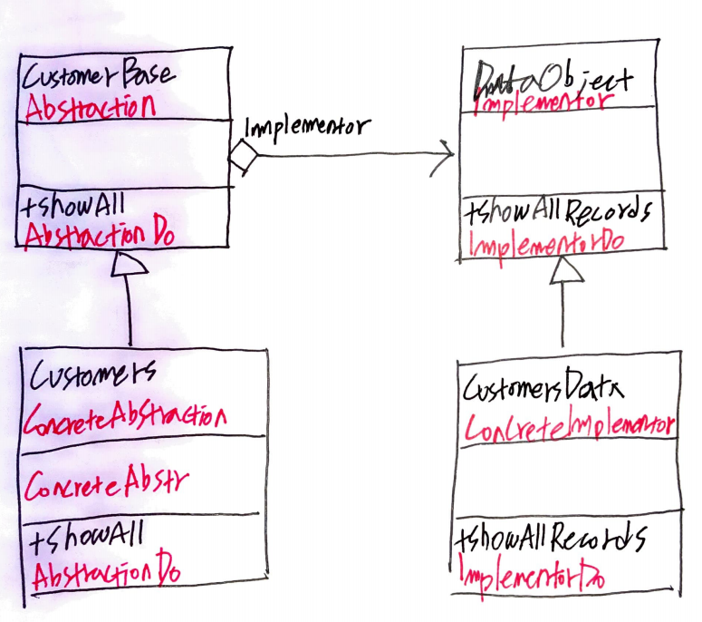

# Real World Example



```java
package com.iamslash;

abstract class CustomersBase {
    private DataObject dataObject;
    protected String group;
    public CustomersBase(String group) {
     	this.group = group;
     }
    public void ShowAll() {
        System.out.println("Customer Group: " + group);
        dataObject.ShowData();
    }
    public void SetDataObject(DataObject dataObject) {
        this.dataObject = dataObject;
    }
}

class Customers extends CustomersBase {

    public Customers(String group) {
        super(group);
    }

    public void ShowAll() {
        System.out.println("----------");
        super.ShowAll();
        System.out.println("----------");
    }
}

interface DataObject {
    void ShowData();
}

class CustomersData implements DataObject {
    @Override
    public void ShowData() {
        System.out.println("CustomerData::ShowAll");
    }
}

public class Main {

    public static void main(String[] args) {
        Customers customers = new Customers("John");
        customers.SetDataObject(new CustomersData());
        customers.ShowAll();
    }
}
```
