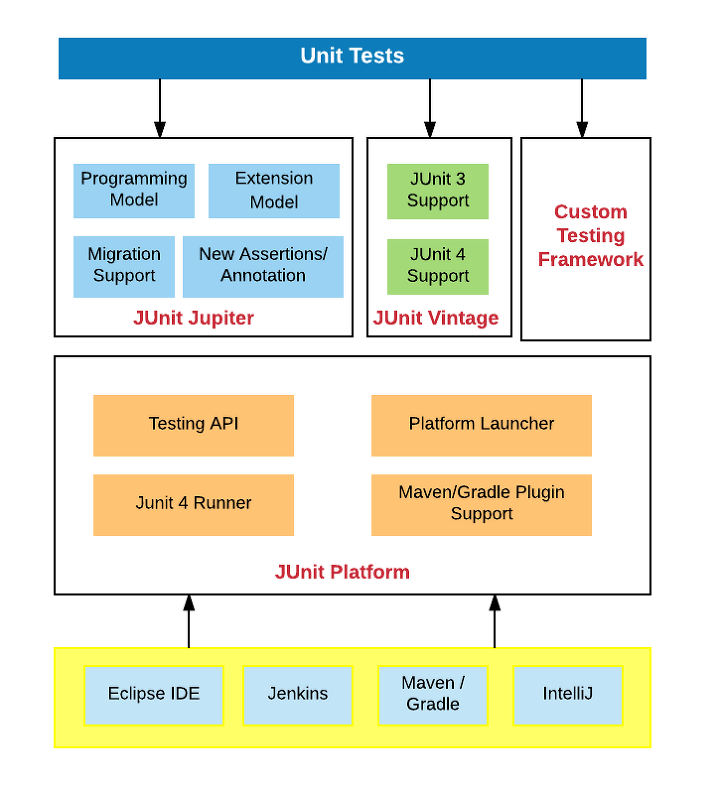

- [Abstract](#abstract)
- [Materials](#materials)
- [JUnit5](#junit5)
  - [Junit 5 소개](#junit-5-소개)
  - [JUnit 5 시작하기](#junit-5-시작하기)
  - [JUnit 5 테스트 이름 표시하기](#junit-5-테스트-이름-표시하기)
  - [JUnit 5 Assertion](#junit-5-assertion)
  - [JUnit 5 조건에 따라 테스트 실행하기](#junit-5-조건에-따라-테스트-실행하기)
  - [JUnit 5 태깅과 필터링](#junit-5-태깅과-필터링)
  - [JUnit 5 커스텀 태그](#junit-5-커스텀-태그)
  - [JUnit 5 테스트 반복하기 1부](#junit-5-테스트-반복하기-1부)
  - [JUnit 5 테스트 반복하기 2부](#junit-5-테스트-반복하기-2부)
  - [JUnit 5 테스트 인스턴스](#junit-5-테스트-인스턴스)
  - [JUnit 5 테스트 순서](#junit-5-테스트-순서)
  - [JUnit 5 junit-platform.properties](#junit-5-junit-platformproperties)
  - [JUnit 5 확장 모델](#junit-5-확장-모델)
  - [JUnit 5 migration](#junit-5-migration)
  - [Junit 5 연습문제](#junit-5-연습문제)
- [Mockito](#mockito)
  - [Mockito 소개](#mockito-소개)
  - [Mockito 시작하기](#mockito-시작하기)
  - [Mock 객체 만들기](#mock-객체-만들기)
  - [Mock 객체 Stubbing](#mock-객체-stubbing)
  - [Mock 객체 Stubbing 연습 문제](#mock-객체-stubbing-연습-문제)
  - [Mock 객체 확인](#mock-객체-확인)
  - [BDD 스타일 Mockito API](#bdd-스타일-mockito-api)
  - [Mockito 연습문제](#mockito-연습문제)
- [Docker and Test](#docker-and-test)
  - [Testcontainers 소개](#testcontainers-소개)
  - [Testcontainers 설치](#testcontainers-설치)
  - [컨테이너 정보를 스프링 테스트에서 참조하기](#컨테이너-정보를-스프링-테스트에서-참조하기)
  - [Testcontainers Docker Compose 사용하기 1 부](#testcontainers-docker-compose-사용하기-1-부)
  - [Testcontainers Docker Compose 사용하기 2 부](#testcontainers-docker-compose-사용하기-2-부)
- [Performance Test](#performance-test)
  - [JMeter 소개](#jmeter-소개)
  - [JMeter 설치](#jmeter-설치)
  - [JMeter 사용하기](#jmeter-사용하기)
- [Operation Issue Test](#operation-issue-test)
  - [Chaos Monkey 소개](#chaos-monkey-소개)
  - [CM4SB 설치](#cm4sb-설치)
  - [CM4SB 응답 지연](#cm4sb-응답-지연)
  - [CM4SB 에러 발생](#cm4sb-에러-발생)
- [Architecture Test](#architecture-test)
  - [ArchUnit 소개](#archunit-소개)
  - [ArchUnit 설치](#archunit-설치)
  - [ArchUnit 패키지 의존성 확인하기](#archunit-패키지-의존성-확인하기)
  - [ArchUnit JUnit 5 연동](#archunit-junit-5-연동)
  - [ArchUnit 클래스 의존성 확인하기](#archunit-클래스-의존성-확인하기)

----

# Abstract

java TDD 를 정리한다.

# Materials

* [더 자바, 애플리케이션을 테스트하는 다양한 방법 by 백기선](https://www.inflearn.com/course/the-java-application-test)
  * [src](https://github.com/keesun/inflearn-the-java-test)
* [JUnit5 in Spring](https://brunch.co.kr/@springboot/77)

# JUnit5

## Junit 5 소개

* [Junit5-samples](https://github.com/junit-team/junit5-samples/tree/master/junit5-jupiter-starter-gradle)
  * [junit5-jupiter-starter-gradle](https://github.com/junit-team/junit5-samples/tree/master/junit5-jupiter-starter-gradle)

----



JUnit 5 는 JUnitPlatform, Jupiter, Vintage 과 같이 3 개의 component 로 구성된다. 
JUnit Vintage 는 JUnit3, JUnit4 를 위한 test engine 을 제공한다.
JUnit Jupiter 는 JUnit5 를 위한 test engine 을 제공한다.
JUnit Platform 은 test engine interface 를 제공한다.

## JUnit 5 시작하기

[02. JUnit 시작하기 src](https://github.com/keesun/inflearn-the-java-test/commit/cf41bcd4b2d85d6c956e31d8af5e2f2e339d92fa)

----

만약 spring boot application 이 아니라면 즉, `org.springframework.boot:spring-boot-starter-test` 가 dpendency 에 없다면  `org.junit.jupiter:junit-jupiter-engine:5.5.2` 를 dependency 에 추가해 준다.

다음은 기본적인 JUnit 5 code 이다. `@Disabled` 는 test 실행을 잠시 꺼둘 수 있다.

```java
class FooServiceTest {
  @Test
  void create() {
    FooService fooService = new FooService();
    assertNotNull(fooService);
  }

  @Before All
  static void beforeAll() {
    System.out.println("before all");
  }

  @AfterAll
  static void afterAll() {
    System.out.println("after all");
  }

  @BeforeEach
  @Disabled
  static void beforeEach() {
    System.out.println("before each");
  }

  @AfterEach
  static void afterEach() {
    System.out.println("after each");
  }
}
```

## JUnit 5 테스트 이름 표시하기

* [03. 테스트 이름 표기 src](https://github.com/keesun/inflearn-the-java-test/commit/d9b5f3b51c2788365d2bdbeecbb0b2b5c50fdf5f)

----

`DisplayNameGeneration` 을 사용하면 global 하게 test 실행시 표시된 이름을 조작할 수 있다. `@DisplayName` 을 사용하면 특정 method 의 test 실행시 표시될 이름을 조작할 수 있다.

```java
@DisplayNameGeneration(DisplayNameGenerator.ReplaceUnderscores.class)
class FooServiceTest {} {
  @Test
  @DisplayName("푸 만들기")
  void create_new_foo() {
    FooService fooService = new FooService();
    assertNotNull(fooService);
    System.out.println("create");
  }
}
```

## JUnit 5 Assertion

* [04. Assertion src](https://github.com/keesun/inflearn-the-java-test/commit/fce5cc4e381ba65fc3a566453fd427cea64aaced)

----


`assertEquals, assertNotNull, assertTrue, assertAll, assertThrows, assertTimeout` 을 이용하며 asserting 하자.

```java
@DisplayNameGeneration(DisplayNameGenerator.ReplaceUnderscores.class)
class FooServiceTest {} {
  @Test
  @DisplayName("푸 만들기")
  void create_new_foo() {
    FooService fooService = new FooService();
    assertNotNull(fooService);
    assertEquals(fooService.DRAFT, fooService.getStatus(), () -> "Done.");
    assertTrue(fooService.age > 0, "Exceeded age.")
    System.out.println("create");
  }
}
```

`assertAll` 은 여러 lambda expression 을 이용하여 asserting 을 한번에 할 수 있다.

```java
@DisplayNameGeneration(DisplayNameGenerator.ReplaceUnderscores.class)
class FooServiceTest {
  @Test
  @DisplayName("푸 만들기")
  void create_new_foo() {
    FooService fooService = new FooService();
    assertAll(
      () -> assertNotNull(fooService),
      () -> assertEquals(fooService.DRAFT, fooService.getStatus(), () -> "Done."),
      () -> assertTrue(fooService.age > 0, "Exceeded age.")
    );
  }
}
```

`assertThrows` 는 특정 조건에 특정 exception 이 발생하는지 asserting 할 수 있다. `assertTimeout`
은 특정 구문을 실행했을 때 timeout 을 asserting 할 수 있다.

```java
@DisplayNameGeneration(DisplayNameGenerator.ReplaceUnderscores.class)
class FooServiceTest {
  @Test
  @DisplayName("푸 만들기")
  void create_new_foo() {
    assertThrows(IllegalArgumentException.class, () -> new FooService(-1));
    assertTimeout(Duration.ofMillis(100), () -> {
      new FooService(10);
      Thread.Sleep(300);
    });
  }
  ...
}
```

`assumeTrue, assumingThat` 은 특정 조건에서만 asserting 할 수 있게 한다.

```java
@DisplayNameGeneration(DisplayNameGenerator.ReplaceUnderscores.class)
class FooServiceTest {
  @Test
  @DisplayName("푸 만들기")
  void create_new_foo() {
    String env = System.getenv("FOO");
    System.out.println(env);
    assumeTrue("LOCAL".equalsIgnoreCase(env));
  }
  ...
}
```

```java
@DisplayNameGeneration(DisplayNameGenerator.ReplaceUnderscores.class)
class FooServiceTest {
  @Test
  @DisplayName("푸 만들기")
  void create_new_foo() {
    String env = System.getenv("FOO");
    assumingThat("LOCAL".equalsIgnoreCase(env), () -> {
      System.out.println("local");
      ...
    });
  }
  ...
}
```

## JUnit 5 조건에 따라 테스트 실행하기

* [05. Assumption](https://github.com/keesun/inflearn-the-java-test/commit/c6fefff3364c2b9f92727cd10f86fa639a0e5bd0)

----

조건에 따라 Test 가 실행되게 한다. 예를 들어 다음과 같이 `export TEST_ENV=LOCAL` 을 이용하여 Test 를 실행되게 해보자.

```java
@DisplayNameGeneration(DisplayNameGenerator.ReplaceUnderscores.class)
class FooTest {
  
  @Test
  @DisplayName("푸 테스트")
  void create_new_foo() {
    String test_env = System.getenv("TEST_ENV");
    System.out.println(test_env);
    assumeTrue("LOCAL".euqalsIgnoreCase(test_env));

    Foo actual = new Foo(10);
    assertThat(actual.getLimit()).isGreaterThen(0);
  }

}
```

다음과 같이 `assumingThat` 을 이용하면 조건에 따라 Test 를 다양하게 실행할 수 있다.

```java
@DisplayNameGeneration(DisplayNameGenerator.ReplaceUnderscores.class)
class FooTest {
  
  @Test
  @DisplayName("푸 테스트")
  void create_new_foo() {
    String test_env = System.getenv("TEST_ENV");

    assumingThat("LOCAL".equalsIgnoreCase(test_env), () -> {
      System.out.println("local");
      Study actual = new Foo(100);
      assertThat(actual.getLimit()).isGreaterThan(0);
    })

    assumingThat("iamslash".equalsIgnoreCase(test_env), () -> {
      System.out.println("iamslash");
      Study actual = new Foo(10);
      assertThat(actual.getLimit()).isGreaterThan(0);
    })
  }
}
```

`@EnabledOnOS, @DisabledOnOS, @EnabledOnJre, @EnabledIfEnvironmentVariable` 를 이용하면 조건을 annotation 으로 handling 할 수 있다.

```java
@DisplayNameGeneration(DisplayNameGenerator.ReplaceUnderscores.class)
class FooTest {
  
  @Test
  @DisplayName("푸 테스트")
  @EnabledOnOs(OS.MAC)
  void create_new_foo() {
    String test_env = System.getenv("TEST_ENV");
    System.out.println(test_env);
    assumeTrue("LOCAL".euqalsIgnoreCase(test_env));

    Foo actual = new Foo(10);
    assertThat(actual.getLimit()).isGreaterThen(0);
  }

  @Test
  @DisplayName("푸 테스트 다시")
  @EnabledOnJre(JRE.JAVA_8, JRE.JAVA_9, JRE.JAVA_10, JRE.JAVA_11 )
  void create_new_foo_again() {
    String test_env = System.getenv("TEST_ENV");
    System.out.println(test_env);
    assumeTrue("LOCAL".euqalsIgnoreCase(test_env));

    Foo actual = new Foo(10);
    assertThat(actual.getLimit()).isGreaterThen(0);
  }  

  @Test
  @DisplayName("푸 테스트 다시 다시")
  @@EnabledIfEnvironmentVariable(named = "TEST_ENV", matches = "LOCAL")
  void create_new_foo_yet_another() {
    String test_env = System.getenv("TEST_ENV");
    System.out.println(test_env);
    assumeTrue("LOCAL".euqalsIgnoreCase(test_env));

    Foo actual = new Foo(10);
    assertThat(actual.getLimit()).isGreaterThen(0);
  }  
}
```

`@Enabled__, @Disabled__, EnabledIfEnvironmentVariable` 는 특정 OS, JRE, ENV 등등에서 test code 실행을 제어한다.

```java
@DisplayNameGeneration(DisplayNameGenerator.ReplaceUnderscores.class)
class FooServiceTest {
  @Test
  @DisplayName("푸 만들기")
  @EnabledOnOS({OS.MAX, OS.LINUX})
  @EnabledOnJre({JRE.JAVA_8})
  @EnabledIfEnvironmentVariable(named = "FOO")
  void create_new_foo() {
    String env = System.getenv("FOO");
    assumingThat("LOCAL".equalsIgnoreCase(env), () -> {
      System.out.println("local");
      ...
    });
  }
  ...
}
```

## JUnit 5 태깅과 필터링

* [06. Tagging and Filtering](https://github.com/keesun/inflearn-the-java-test/commit/edb2649a3efe1d3fdf73e57e958301ec92e9800f)

----

`@Tag` 를 이용하여 코드를 작성한다. 그리고 intelliJ 에서 `EditConfiguration | Test kind | Tags | Tag expression` 에 특정 tag expression ("slow | fast") 을 입력하고 test 를 실행하면 특정 tag 의 test code 만 실행된다.

```java
@DisplayNameGeneration(DisplayNameGenerator.ReplaceUnderscores.class)
class FooServiceTest {
  @Test
  @DisplayName("푸 만들기")
  @Tag("bar")
  void create_new_foo() {
    String env = System.getenv("FOO");
    assumingThat("LOCAL".equalsIgnoreCase(env), () -> {
      System.out.println("local");
      ...
    });
  }
  ...
}
```

Tag 를 활용하면 local 에서 실행할 Test, CI 에서 실행할 Test 등을 별도로 구현할 수 있다.

## JUnit 5 커스텀 태그

다음과 같이 Annotation 을 이용하여 Custom tag 를 만들어 보자.

```java
@Target(ElementType.METHOD)
@Retention(RetentionPolicy.RUNTIME)
@Tag("bar")
@Test
public @interface BarTest {  
}
```

```java
@BarTest
@DisplayName("Bar test")
void create_new_bar() {
}
```

## JUnit 5 테스트 반복하기 1부

* [07. Custom Annotation](https://github.com/keesun/inflearn-the-java-test/commit/ce8e9b32148694972394283d7f6ef791f43639f0)

----

`@RepeatedTest, @ParameterizedTest` 를 이용하여 반복 테스트를 할 수 있다.

```java
@RepeatedTest(10)
void repeatTest(RepetitionInfo repetitionInfo) {
  System.out.println("Test " + repetitionInfo.getCurrentRepetition() + "/" + repetitionInfo.getTotalRepetitions());
}

@RepeatedTest(value=10, name = "{displayName}, {currentRepetition}/{totalRepetition}")
void repeatTest(RepetitionInfo repetitionInfo) {
  System.out.println("Test " + repetitionInfo.getCurrentRepetition() + "/" + repetitionInfo.getTotalRepetitions());
}

@ParameterizedTest
@ValueSource(string = {"Foo", "Bar", "Baz"})
void parameterizedTest(String msg) {
  System.out.println(msg);
}

@DisplayName("Parameterized Test")
@ParameterizedTest(name = "{index} {displayName} message={0}")
@ValueSource(string = {"Foo", "Bar", "Baz"})
void parameterizedTest(String msg) {
  System.out.println(msg);
}
```

`@ValueSource, @NullSource, @EmptySource, @NullAndEmptySource, @EnumSource, @MethodSource, @CvsSource, @CvsFileSource, @ArgumentSource` 를 이용하여 ParameterizedTest 의 argument value source 를 다양하게 설정할 수 있다.

## JUnit 5 테스트 반복하기 2부

* [08. RepetitionTest and ParameterizedTest](https://github.com/keesun/inflearn-the-java-test/commit/c1640ee20fb5ef23013362f7ca135c08619c8b0d)
* [09. Converter and Aggregator](https://github.com/keesun/inflearn-the-java-test/commit/6e396705b041586e040cf68033f1522a687ad6b3)

----

## JUnit 5 테스트 인스턴스

* [10. Test instance lifecycle](https://github.com/keesun/inflearn-the-java-test/commit/cf98cf6039fd83a71c0d082a37a83aad1f11f660)

----

JUnit 은 test method 마다 test class 의 instance 를 새로 생성한다. test method 의 실행 순서에 상관없이 test 가 가능하도록 하기 위함이다. `@TestInstance` 를 이용하면 test class 하나에 instance 를 하나만 생성할 수 있다. 따라서 `@BeforeAll, @AfterAll, @BeforeEach, @AfterEach` 가 부착된 method 들은 static 일 필요가 없다.

```java
@TestInstance(Lifecycle.PER_CLASS)
class FooServiceTest {
}
```

## JUnit 5 테스트 순서

* [11. Test order](https://github.com/keesun/inflearn-the-java-test/commit/f1cd247464e0950d7c15a4ae65c7ee05273f8e48)

----

`@TestMethodOrder` 를 이용하여 test method 의 실행순서를 변경할 수 있다.

```java
@TestInstance(TestInstance.LifeCycle.PER_CLASS)
@TestMethodOrder(MethodOrder.OrderAnnotation.class)
class FooServiceTest {
  @Order(1)
  void create_new_foo() {
  }
  @Order(2)
  void create_new_bar() {
  }
}
```

## JUnit 5 junit-platform.properties

* [12. JUnit properties](https://github.com/keesun/inflearn-the-java-test/commit/056d92609a14fa03fc310fd8e950d82be0c0aa2a)

----

`test/resources/junit-platform.properties` 를 생성하여 JUnit 설정을 저장하자.

```conf
junit.jupiter.testinstance.lifecycle.default = per_class
junit.jupiter.extensions.autodetection.enabled = true
junit.jupiter.conditions.deactivate = org.junit."DisabledCondition"
junit.jupiter.displayname.generator.default = org.junit.jupiter.api.DisplayNameGenerator@REplaceUnderscores
```

## JUnit 5 확장 모델

* [13. Extension model](https://github.com/keesun/inflearn-the-java-test/commit/9457f56dc30125c15444e3bfab47fc7d82458a64)

----

JUnit 5 는 `Extension` 을 이용하여 확장할 수 있다.

```java

public class FindSlowTestExtention implements BeforeTestExecutionCallback, AfterTestExecutionCallback {
  @Override 
  public void beforeTestExecution(ExtensionContext ctx) throws Exception {
    ExtensionContext.Store store = getStore(ctx);
    store.put("START_TIME", System.currentTimeMillis());
  }

  @Override
  public void afterTestExecution(ExtensionContext ctx) throws Exception {
    String testMethodName = ctx.getRequiredTestMethod().getName();
    ExtensionContext.Store store = getStore(ctx)
    long start_time = store.remove("START_TIME", long.class);
    long duration = System.currentTimeMillis() - start_time;
    if (duration > THRESHOLD) {
      System.out.printf("Please consider mark method [%s] with @SlowTest.\n", testMethodName);
    }
  }

  private ExtensionContext.Store getStore(ExtensionContext ctx) {
    String testClassName = ctx.getRequiredTestClass().getName();
    String testMethodName = ctx.getRequiredTestMethod().getName();
    return ctx.getStore(ExtensionContext.Namespace.create(testClassName, testMethodName));
  }
}
```

## JUnit 5 migration

* [14. Migration](https://github.com/keesun/inflearn-the-java-test/commit/189276f2566e73e035da1f241a65ba7b130294c2)

----

`junit-vintage-engine` 을 build.gradle 의 dependency 에 추가하면 JUnit5 의 junit-platform 으로 JUnit 3, 4 로 작성된 test code 를 실행할 수 있다.

`@Rule` 은 기본적으로 지원하지 않는다. `junit-jupiter-migrationsupport` module 의 `@EnableRuleMigrationSupport` 를 사용하면 다음 타입의 Rule 을 지원한다.

* `ExternalResource`
* `Verifier`
* `ExpectedException`

다음은 JUnit4 와 JUnit5 가 지원하는 annotation 을 비교해 놓은 것이다.

| JUnit 4            | JUnit 5        |
| ------------------ | -------------- |
| `@Category(Class)` | `@Tag(String)` |
| `@RunWith, @Rule, @ClassRule` | `@ExtendWith, @RegisterExtension` |
| `@Ignore` | `@Disabled` |
| `@Before, @After, @BeforeClass, @AfterClass` | `@BeforeEach, @AfterEach, @BeforeAll, @AfterAll` |

## Junit 5 연습문제

* [15. Test](https://github.com/keesun/inflearn-the-java-test/commit/fd1eed1457c6d84a9e7d9d14cec90fc5dbe00855)

----

# Mockito

## Mockito 소개

* [Prepare Mockito example](https://github.com/keesun/inflearn-the-java-test/commit/d1d556b72090bb51e0c1b6e6a161e16f32c4bf4c)

----

## Mockito 시작하기

다음과 같이 build.gradle 에 dependencies 설정을 하면 `org.mockito.mockito-core` 가 import 된다.

```gradle
dependencies {
  implementation 'org.springframework.boot:spring-boot-starter-test'
  implementation 'org.mockito:mockito-junit-jupiter'
}
```

## Mock 객체 만들기

* [18. Creating mocks](https://github.com/keesun/inflearn-the-java-test/commit/4f626230a716b3d438bdd17e54879e8b9065fa29)

----

다음과 같이 `HelloServiceTest` 를 작성해 보자.

```java
class HelloServiceTest {
  
  @Test
  void createHelloService() {
    MemberService memberService = mock(MemberService.class);
    HelloService helloService = mock(HelloService.class);
    HelloService helloService = new HelloService(memberService, HelloRepository);
    assertNotNull(helloService);
  }
}
```

`@Mock, @ExtendWith(MockitoExtension.class)` 을 사용하여 더욱 간결하게 만들어 보자.

```java
@ExtendWith(MockitoExtension.class)
class HelloServiceTest {

  @Mock
  MemberService memberService;

  @Mock
  HelloService helloService;  
  
  @Test
  void createHelloService() {

    HelloService helloService = new HelloService(memberService, HelloRepository);
    assertNotNull(helloService);
  }
}
```

Mock object 를 method 의 arguement 로 주입하자.

```java
@ExtendWith(MockitoExtension.class)
class HelloServiceTest {
  
  @Test
  void createHelloService(@Mock MemberService memberService, @Mock HelloService helloService;) {

    HelloService helloService = new HelloService(memberService, HelloRepository);
    assertNotNull(helloService);
  }
}
```

## Mock 객체 Stubbing

* [19. Stubbing](https://github.com/keesun/inflearn-the-java-test/commit/4b27718d4f7e4acce4a8c91a20c418e37ef392c8)

----

## Mock 객체 Stubbing 연습 문제

* [Prepare quiz for stubbing](https://github.com/keesun/inflearn-the-java-test/commit/216112f5706fef76f56c735faed200f311b8d919)
* [20. Stubbing answers](https://github.com/keesun/inflearn-the-java-test/commit/bf51d7d89e35f7310fceba912cdfa0f8997d0b82)

----

## Mock 객체 확인

* [21. Verifying](https://github.com/keesun/inflearn-the-java-test/commit/7bff7b1d29ae6a5fd79e4c42d699358a75539df3)

----

## BDD 스타일 Mockito API

* [22. BDDMockito](https://github.com/keesun/inflearn-the-java-test/commit/3399abcc89ce150b48dcfbcac54d418350467760)

----

## Mockito 연습문제

* [Prepare Mockto quiz](https://github.com/keesun/inflearn-the-java-test/commits/master)
* [23. Mockito answers](https://github.com/keesun/inflearn-the-java-test/commit/952b4b9deb0cb8aca60c4dfcf1c50df12b8d2e99)

----

# Docker and Test

## Testcontainers 소개

* [24. TestContainers intro](https://github.com/keesun/inflearn-the-java-test/commit/253fba50f3f494a5a108bfd59014cfc675176615)

----

## Testcontainers 설치

* [25. Testcontainers install](https://github.com/keesun/inflearn-the-java-test/commit/58df5e727fb5ade8ebdb555affd22a5ec3020356)

----

## 컨테이너 정보를 스프링 테스트에서 참조하기

* [Testcontainers features](https://github.com/keesun/inflearn-the-java-test/commit/943ddb4786621025ef4060dd88cdac14e7ef81ba)

----

## Testcontainers Docker Compose 사용하기 1 부

* [27. Spring test context initializer](https://github.com/keesun/inflearn-the-java-test/commit/69cf8f7ca76f5d20f167476ee936832afdf23dd4)

----

## Testcontainers Docker Compose 사용하기 2 부

* [29, Testcontainers with Docker Compose](https://github.com/keesun/inflearn-the-java-test/commit/8e3252b33a4de3ee599e7adc2b52d1298c2a122f)

----

# Performance Test

## JMeter 소개

* [Prepare perf test](https://github.com/keesun/inflearn-the-java-test/commit/bfa54b1ecf66c2dc52974973f571ba7ec8af94c9)

----

## JMeter 설치


## JMeter 사용하기


# Operation Issue Test

## Chaos Monkey 소개


## CM4SB 설치

* [34. Install CM4SB](https://github.com/keesun/inflearn-the-java-test/commit/297a7223d3a2d2f0a89ea93c6fcc809db27b5e6d)

----

## CM4SB 응답 지연

* [36. Using CM4SB](https://github.com/keesun/inflearn-the-java-test/commit/4e5831d1d0bf4e108d26fa82534a28c14ee392b3)

----

## CM4SB 에러 발생

* []()

----

# Architecture Test

## ArchUnit 소개

* []()

----

## ArchUnit 설치

* []()

----

## ArchUnit 패키지 의존성 확인하기

* [39. ArchUnit: package dependency test](https://github.com/keesun/inflearn-the-java-test/commit/ac21b15f325efe14996d2324e185c1db79c8a7ff)

----

## ArchUnit JUnit 5 연동

* [40. ArchUnit JUnit 5](https://github.com/keesun/inflearn-the-java-test/commits/master)

----

## ArchUnit 클래스 의존성 확인하기

* [41. ArchUnit class dependency tests](https://github.com/keesun/inflearn-the-java-test/commits/master)

----


가짜 객체를 Mock 객체라고 한다. [Mockito](https://site.mockito.org/) 는 Mock 객체를 쉽게 만들고 관리할 수 있도록 하는 library 이다.
spring boot 를 사용하지 않는다면 `org.mockito:mockito-core:3.1.0` 과 `org.mockito:mockito-junit-jupiter:3.1.0` 를 dependency 로 추가한다.

```java
BarService barService = mock(BarService.class)
FooRepository fooRepository = mock(FooRepository.class)
```

```java
@ExtendWith(MockitoExtension.clas)
class FooServiceTest {
  @Mock BarService barService;
  @Mock FooRepository fooRepository;
}
```

```java
@ExtendWith(MockitoExtension.clas)
class FooServiceTest {

  @Test
  void createFooService(@Mock BarService barService,
                        @Mock FooRepository fooRespotiry) {
    FooService fooService = new FooService(barService, fooRepository);
    assertNotNull(fooService);
  }
}
```

Mock 객체의 행동을 조작하는 것을 Stubbing 이라고 한다.

```java
@ExtendWith(MockitoExtension.clas)
class FooServiceTest {

  @Test
  void createFooService(@Mock BarService barService,
                        @Mock FooRepository fooRespotiry) {
    FooService fooService = new FooService(barService, fooRespository);
    assertNotNull(fooService);

    Person person = new Person();
    person.setId(1L);
    person.setEmail("iamslash@gmail.com");
    when(barService.findById(1L)).thenReturn(Optional.of(member))
    Lecture lecture = new Lecture(10, "java");
    Optional<Person> findId = barService.findById(1L);
    assertEquals("iamslash@gmail.com", findById.get().getEmail());
  }
}
```
