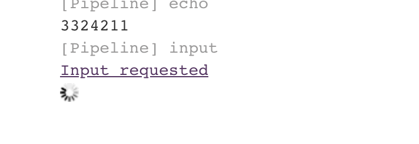
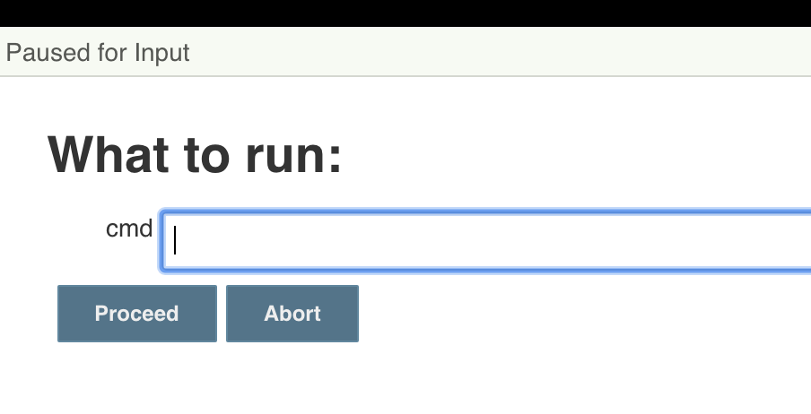
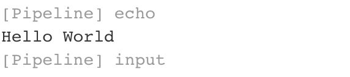

- [Abstract](#abstract)
- [Materials](#materials)
- [Install](#install)
  - [Install with 2.190.1 docker on windows10](#install-with-21901-docker-on-windows10)
  - [Install Jenkins 2.190.1 with docker on macOS](#install-jenkins-21901-with-docker-on-macos)
  - [Install Jenkins 2.190.1 on macOS](#install-jenkins-21901-on-macos)
  - [Install Jenkins Operator with minikube](#install-jenkins-operator-with-minikube)
- [Basic](#basic)
  - [jenkin_home structure](#jenkin_home-structure)
    - [directories](#directories)
    - [files](#files)
  - [Build Now Process](#build-now-process)
  - [Setting](#setting)
    - [Locale](#locale)
    - [GitHub secret text](#github-secret-text)
    - [Simple Job with Pipeline value](#simple-job-with-pipeline-value)
    - [Simple Job with pipeline script from scm](#simple-job-with-pipeline-script-from-scm)
  - [Contribution](#contribution)
  - [JenkinsCLI](#jenkinscli)
  - [Pipeline as a code](#pipeline-as-a-code)
  - [Declaritive pipeline](#declaritive-pipeline)
  - [Scripted pipeline](#scripted-pipeline)
- [Advanced](#advanced)
  - [How to reload configs without restart](#how-to-reload-configs-without-restart)
  - [How to provision Jenkins with AWS Cloudformation](#how-to-provision-jenkins-with-aws-cloudformation)
  - [How to make a Jenkins-plugin](#how-to-make-a-jenkins-plugin)
  - [Script Console](#script-console)
  - [How to backup and restore](#how-to-backup-and-restore)
    - [How to backup for configs](#how-to-backup-for-configs)
    - [How to restore configs](#how-to-restore-configs)
    - [How to backup plugins](#how-to-backup-plugins)
    - [How to restore plugins](#how-to-restore-plugins)
  - [Jenkins with Docker](#jenkins-with-docker)
  - [How to debug Jenkins Pipeline Script](#how-to-debug-jenkins-pipeline-script)
  - [Password injection](#password-injection)
  - [Job Scheduling](#job-scheduling)
  - [How to extract password from credentials](#how-to-extract-password-from-credentials)
  - [High Availability](#high-availability)

----

# Abstract

jenkins 에 대해 정리한다.

# Materials

* [XECon2016 - GitHub + Jenkins + Docker로 자동배포 시스템 구축하기. 조정현 @ youtube](https://www.youtube.com/watch?v=ZM9sU3nqCMM)
* [도커(Docker) 활용 및 배포 자동화 실전 초급 @ youtube](https://www.youtube.com/playlist?list=PLRx0vPvlEmdChjc6N3JnLaX-Gihh5pHcx)
* [Jenkins Handbook](https://jenkins.io/doc/book/)
  * 꼭 읽어야할 필독서
  * [pdf](https://jenkins.io/user-handbook.pdf)
* [Jenkins doc](https://jenkins.io/doc/)
* [jenkins @ github](https://github.com/jenkinsci/jenkins)
* [Jenkins World 2017: Mastering the Jenkins Script Console @ youtube](https://www.youtube.com/watch?v=qaUPESDcsGg)
  * jenkins script console

# Install

## Install with 2.190.1 docker on windows10

```bash
$ docker pull jenkins/jenkins:lts
$ docker run -d -p 50000:50000 -p 8080:8080 -v D:\my\dockervolume\jenkins_home:/var/jenkins_home --name jenkins jenkins/jenkins:lts
$ docker logs jenkins -f
```

browser 로 `localhost:8080` 으로 접속한다. docker 실행창에 출력된 key 를 입력한다. install suggested plugins 하면 끝. 플러그인 설치를 실패할 때가 있다. 그렇다면 `C:\my\dockervolume\jenkins_home/*` 를 모두 지우고 `docker stop, rm` 이후 다시 실행해본다. 잘 된다.

## Install Jenkins 2.190.1 with docker on macOS

```bash
$ docker pull jenkins/jenkins:lts
$ docker run -d -p 50000:50000 -p 8080:8080 -v /Users/davidsun/my/> dockervolume/jenkins_home:/var/jenkins_home --name jenkins jenkins/jenkins:lts
$ docker logs jenkins -f
```

## Install Jenkins 2.190.1 on macOS

* [Mac에 Homebrew를 사용하여 Jenkins 설치하기](http://theeye.pe.kr/archives/2783)
  
-----

```bash
$ brew install jenkins
$ brew services start jenkins
$ brew services stop jenkins
$ brew remove jenkins
```

## Install Jenkins Operator with minikube

* [[ Kube 82 ] Kubernetes Jenkins Operator to manage Jenkins instances @ youtube](https://www.youtube.com/watch?v=0x-vgNagfw0)
* [Instsall Jenkins Operator](https://jenkinsci.github.io/kubernetes-operator/docs/installation/)

```bash
# Install Jenkins Custom Resource Definition
$ kubectl apply -f https://raw.githubusercontent.com/jenkinsci/kubernetes-operator/master/config/crd/bases/jenkins.io_jenkins.yaml 

# Install Jenkins operator using helm
$ helm repo add jenkins https://raw.githubusercontent.com/jenkinsci/kubernetes-operator/master/chart
$ helm install jenkins-operator jenkins/jenkins-operator
NAME: jenkins-operator
LAST DEPLOYED: Tue Aug 10 19:27:51 2021
NAMESPACE: default
STATUS: deployed
REVISION: 1
TEST SUITE: None
NOTES:
1. Watch Jenkins instance being created:
$ kubectl --namespace default get pods -w

2. Get Jenkins credentials:
$ kubectl --namespace default get secret jenkins-operator-credentials-jenkins -o 'jsonpath={.data.user}' | base64 -d
$ kubectl --namespace default get secret jenkins-operator-credentials-jenkins -o 'jsonpath={.data.password}' | base64 -d

3. Connect to Jenkins (actual Kubernetes cluster):
$ kubectl --namespace default port-forward jenkins-jenkins 8080:8080

Now open the browser and enter http://localhost:8080

# Export jenkins-operator-values
$ helm show values jenkins/jenkins-operator > ~/tmp/jenkins-operator-values.yaml
$ code ~/tmp/jenkins-operator-values.yaml

# Upgrade jenkins-operator-values
$ code ~/tmp/jenkins-operator-values.yaml
...
  # image: jenkins/jenkins:2.277.4-lts-alpine
  image: jenkins/jenkins:2.289.1-lts-alpine
...

# How can I restore data from backup container???
$ helm upgrade -f ~/tmp/jenkins-operator-values.yaml jenkins-operator jenkins/jenkins-operator

# Uninstall
$ helm uninstall jenkins-operator
```

# Basic

## jenkin_home structure

### directories

| directory | description |
|-----------|-------------|
| `/jobs` | list of jobs |
| `/nodes` | list of nodes |
| `/logs` | log files |
| `/plugins` | list of plugins |
| `/workspace` | list of job worksspacees |

### files

| directory | description |
|-----------|-------------|
| `/config.xml` | global configuration |

## Build Now Process

* make workspace direcotry at `/jenkins_home/worksspace/<job-name>`
* execute Pipeline script

## Setting

### Locale 

* MENU | Manage Plugins | Install Locale plugin
* MENU | Configure System
* Locale | Default Language | en or ENGLISH
* check `Ignore browser preference and force this language to all users`

### GitHub secret text

* [gitHub와 Jenkins 연결하기](https://webcache.googleusercontent.com/search?q=cache:P6VRZNmJqRkJ:https://bcho.tistory.com/1237+&cd=1&hl=ko&ct=clnk&gl=kr)


### Simple Job with Pipeline value

* Jenkins | New Item | "HelloWorld.pipeline" with Pipeline template
* Pipeline | Pipeline script

```groovy
node {
    def hello = 'Hello World'
    stage ('clone') {
        git 'https://github.com/welearntocode/HelloWorld.git'
    }
    dir ('sh') {
        stage ('sh/execute') {
            sh './a.sh'
        }
    }
    stage ('print') {
        print(hello) 
    }
}

// void for no return
// def for return
void print(message) {
    echo "${message}"
}
```

* Build Now

### Simple Job with pipeline script from scm

* Jenkinsfile

```groovy
node {
    def hello = 'Hello World'
    stage ('clone') {
        git 'https://github.com/welearntocode/HelloWorld.git'
    }
    dir ('sh') {
        stage ('sh/execute') {
            sh './a.sh'
        }
    }
    stage ('print') {
        print(hello) 
    }
}

// void for no return
// def for return
void print(message) {
    echo "${message}"
}
```

* Jenkins | New Item | "HelloWorld.pipeline" with Pipeline template
* Pipeline | Pipeline script from SCM
* Build Now

## Contribution

* [Beginners Guide to Contributing](https://wiki.jenkins.io/display/JENKINS/Beginners+Guide+to+Contributing)

## JenkinsCLI

```bash
$ java -jar jenkins-cli.jar -s http://localhost:8080/ -auth iamslash:?????? help
```

## Pipeline as a code

* [Learning Jenkins Pipeline @ github](https://github.com/mcpaint/learning-jenkins-pipeline)
  * declaritive pipeline script 연구
* [Jenkinsfile 을 이용한 젠킨스 Pipeline 설정](https://limsungmook.github.io/2016/11/09/jenkins-pipeline/)
* [Pipeline as Code with Jenkins](https://jenkins.io/solutions/pipeline/)
* [Using a Jenkinsfile ](https://jenkins.io/doc/book/pipeline/jenkinsfile/)

----

`Jenkinsfile` 이라는 이름의 text file 이다. repository root 에 groovy 로 작성한다. `Declarative Pipeline`, `Scripted Pipeline` 과 같은 두가지 형식으로 작성한다. 

browser 로 `http://localhost:8080/pipeline-syntax` 를 접속하면 자세한 reference 들을 확인할 수 있다.

`Jenkinsfile` 의 문법은 [DSL with Groovy](/groovy/README.md) 를 참고하자.

## Declaritive pipeline

* [Pipeline Syntax](https://jenkins.io/doc/book/pipeline/syntax)
* [Pipeline Steps Reference](https://jenkins.io/doc/pipeline/steps/)

----

Declarative Pipeline follow the same rules.

* The top-level of the Pipeline must be a block, specifically: `pipeline { }`
* No semicolons as statement separators. Each statement has to be on its own line
* Blocks must only consist of **Sections**, **Directives**, **Steps**, or assignment statements.
* A property reference statement is treated as no-argument method invocation. So for example, `input` is treated as `input()`

Sections in Declarative Pipeline typically contain one or more Directives or Steps.

* agent, post, stages, steps

Directives are consisted of these.

* environment, options, parameters, triggers, jenkins cron syntax, stage, tools, input, when

Sequential stages is a list of nested stages to be run within them in sequential order. 

```groovy
// Jenkinsfile (Declarative Pipeline)
pipeline {
    agent none
    stages {
        stage('Non-Sequential Stage') {
            agent {
                label 'for-non-sequential'
            }
            steps {
                echo "On Non-Sequential Stage"
            }
        }
        stage('Sequential') {
            agent {
                label 'for-sequential'
            }
            environment {
                FOR_SEQUENTIAL = "some-value"
            }
            stages {
                stage('In Sequential 1') {
                    steps {
                        echo "In Sequential 1"
                    }
                }
                stage('In Sequential 2') {
                    steps {
                        echo "In Sequential 2"
                    }
                }
                stage('Parallel In Sequential') {
                    parallel {
                        stage('In Parallel 1') {
                            steps {
                                echo "In Parallel 1"
                            }
                        }
                        stage('In Parallel 2') {
                            steps {
                                echo "In Parallel 2"
                            }
                        }
                    }
                }
            }
        }
    }
}
```

Parallel block will be executed in parallel.

```groovy
// Jenkinsfile (Declarative Pipeline)
pipeline {
    agent any
    stages {
        stage('Non-Parallel Stage') {
            steps {
                echo 'This stage will be executed first.'
            }
        }
        stage('Parallel Stage') {
            when {
                branch 'master'
            }
            failFast true
            parallel {
                stage('Branch A') {
                    agent {
                        label "for-branch-a"
                    }
                    steps {
                        echo "On Branch A"
                    }
                }
                stage('Branch B') {
                    agent {
                        label "for-branch-b"
                    }
                    steps {
                        echo "On Branch B"
                    }
                }
                stage('Branch C') {
                    agent {
                        label "for-branch-c"
                    }
                    stages {
                        stage('Nested 1') {
                            steps {
                                echo "In stage Nested 1 within Branch C"
                            }
                        }
                        stage('Nested 2') {
                            steps {
                                echo "In stage Nested 2 within Branch C"
                            }
                        }
                    }
                }
            }
        }
    }
}
```

Declarative Pipelines may use all the avilable steps in the [Pipeline Steps Reference](https://jenkins.io/doc/pipeline/steps/). The `script` step is only supported in Declaritive Piepline.

```groovy
// Jenkinsfile (Declarative Pipeline)
pipeline {
    agent any
    stages {
        stage('Example') {
            steps {
                echo 'Hello World'

                script {
                    def browsers = ['chrome', 'firefox']
                    for (int i = 0; i < browsers.size(); ++i) {
                        echo "Testing the ${browsers[i]} browser"
                    }
                }
            }
        }
    }
}
```

## Scripted pipeline

* [Pipeline Examples](https://jenkins.io/doc/pipeline/examples/)
  * 킹왕짱 예제들
* [젠킨스 파이프라인 정리 - 2. Scripted 문법 소개 @ tistory](https://jojoldu.tistory.com/356)
* [scripted-pipeline @ jenkins](https://jenkins.io/doc/book/pipeline/syntax/#scripted-pipeline)

----

Scripted Pipeline should start `node {...}` block. And It is effectively a general pupose DSL built with Groovy.

* This is an example of Flow Control

```groovy
// Jenkinsfile (Scripted Pipeline)
node {
    stage('Example') {
        if (env.BRANCH_NAME == 'master') {
            echo 'I only execute on the master branch'
        } else {
            echo 'I execute elsewhere'
        }
    }
}
```

* This is an example of try/catch. 

```groovy
// Jenkinsfile (Scripted Pipeline)
node {
    stage('Example') {
        try {
            sh 'exit 1'
        }
        catch (exc) {
            echo 'Something failed, I should sound the klaxons!'
            throw
        }
    }
}
```

* Archive Build Output Artifacts 

```groovy
// This shows a simple example of how to archive the build output artifacts.
node {
    stage "Create build output"
    
    // Make the output directory.
    sh "mkdir -p output"

    // Write an useful file, which is needed to be archived.
    writeFile file: "output/usefulfile.txt", text: "This file is useful, need to archive it."

    // Write an useless file, which is not needed to be archived.
    writeFile file: "output/uselessfile.md", text: "This file is useless, no need to archive it."

    stage "Archive build output"
    
    // Archive the build output artifacts.
    archiveArtifacts artifacts: 'output/*.txt', excludes: 'output/*.md'
}
```
# Advanced

## How to reload configs without restart

* [](https://stackoverflow.com/questions/35405625/change-number-of-executors-on-existing-jenkins-node-by-script)

----

Execute this code in https://localhost/script.

```groovy
Jenkins.instance.reload()
```

## How to provision Jenkins with AWS Cloudformation

* [Launching a Jenkins Master using AWS CloudFormation](http://beta.awsdocs.com/infrastructure_as_code/cloudformation/applications/jenkins_cf_deployment/)

## How to make a Jenkins-plugin

* [IntelliJ setup for Jenkins Plugin Development](https://medium.com/@baymac/setting-up-intellij-idea-for-jenkins-plugin-development-66a074bbe4a9)
* [Writing a Jenkins Plugin @ baeldung](https://www.baeldung.com/jenkins-custom-plugin)

----

* Configure Maven Settings
  * vim `~/.m2/settings.xml`

```xml
<settings>
  <pluginGroups>
    <pluginGroup>org.jenkins-ci.tools</pluginGroup>
  </pluginGroups>
 
  <profiles>
    <!-- Give access to Jenkins plugins -->
    <profile>
      <id>jenkins</id>
      <activation>
        <activeByDefault>true</activeByDefault> <!-- change this to false, if you don't like to have it on per default -->
      </activation>
      <repositories>
        <repository>
          <id>repo.jenkins-ci.org</id>
          <url>https://repo.jenkins-ci.org/public/</url>
        </repository>
      </repositories>
      <pluginRepositories>
        <pluginRepository>
          <id>repo.jenkins-ci.org</id>
          <url>https://repo.jenkins-ci.org/public/</url>
        </pluginRepository>
      </pluginRepositories>
    </profile>
  </profiles>
  <mirrors>
    <mirror>
      <id>repo.jenkins-ci.org</id>
      <url>https://repo.jenkins-ci.org/public/</url>
      <mirrorOf>m.g.o-public</mirrorOf>
    </mirror>
  </mirrors>
</settings>
```

* Generate an empty skeleton plugin

```bash
$ mvn archetype:generate -Dfilter=io.jenkins.archetypes:empty-plugin
$ cd <artiface-id>
$ idea pom.xml
```

* Install, run/debug plugin

```bash
$ mvn install
$ mvn hpi:run
```

open browser with url `http://localhost:8080/jenkins`

* Next time you open your project

```bash
$ cd my/java/aaa
$ idea pom.xml
```

* Plugins to aid development
  * Stapler
  * Jenkins Control Plugin

## Script Console

* [Jenkins World 2017: Mastering the Jenkins Script Console](https://www.youtube.com/watch?v=qaUPESDcsGg)
* [Jenkins Area Meetup - Hacking on Jenkins Internals - Jenkins Script Console](https://www.youtube.com/watch?v=T1x2kCGRY1w)
* [jenkins-scripts @ github](https://github.com/jenkinsci/jenkins-scripts)
  * This is a collection of utility scripts for use with Jenkins.

----

* open browser with url `http://localhost:8080/script`

* list methods on a class instance
  * [introspection @ TIL](/groovy/README.md#introspection)

```groovy
a.metaClass.methods*.name.sort().unique()
```

* determine a class from an instance

```groovy
a.class
a.getClass()
```

* set GithubSecurityRealm after install Github Auth plugin.

```groovy
import org.jenkinsci.plugins.GithubSecurityRealm

def J = Jenkins.instance
println(J.getSecurityRealm())

def github = new GithubSecurityRealm('https://a.foo.com',
               'https://a.foo.com/api/v3',
               'foo',
               'bar',
               'do not care')
Jenkins.instance.setSecurityRealm(github)                    
```

This is `/jenkins_home/config.xml` after running above script.

```xml
...
<securityRealm class="org.jenkinsci.plugins.GithubSecurityRealm">
    <githubWebUri>https://a.foo.com</githubWebUri>
    <githubApiUri>https://a.foo.com/api/v3</githubApiUri>
    <clientID>foo</clientID>
    <clientSecret>????????????????</clientSecret>
    <oauthScopes>do not care</oauthScopes>
  </securityRealm>
...  
```

* remove bulk build history of a job

```groovy
def jobName = "EmbedJenkinsSupport"  
def job = Jenkins.instance.getItem(jobName)  
job.getBuilds().each { it.delete() }  
job.nextBuildNumber = 1   
job.save()
```

* Clear specific pending jobs

```groovy
import hudson.model.*
def matchedJobs = Hudson.instance.queue.items.findAll { job ->
    job.name =~ /my_regex_here/
}
    
matchedJobs.each { job ->
    println job.name
    //job.delete()
}
```

## How to backup and restore

### How to backup for configs

This is a backup Jenkins job for configurations.

```groovy
# Delete all files in the workspace
rm -rf *
# Create a directory for the job definitions
mkdir -p $BUILD_ID/jobs
# Copy global configuration files into the workspace
cp $JENKINS_HOME/*.xml $BUILD_ID/
# Copy keys and secrets into the workspace
cp $JENKINS_HOME/identity.key.enc $BUILD_ID/
cp $JENKINS_HOME/secret.key $BUILD_ID/
cp $JENKINS_HOME/secret.key.not-so-secret $BUILD_ID/
cp -r $JENKINS_HOME/secrets $BUILD_ID/
# Copy user configuration files into the workspace
cp -r $JENKINS_HOME/users $BUILD_ID/
# Copy job definitions into the workspace
rsync -am --include='config.xml' --include='*/' --prune-empty-dirs --exclude='*' $JENKINS_HOME/jobs/ $BUILD_ID/jobs/
# Create an archive from all copied files (since the S3 plugin cannot copy folders recursively)
tar czf $BUILD_ID.tar.gz $BUILD_ID/
# Remove the directory so only the archive gets copied to S3
rm -rf $BUILD_ID
```

### How to restore configs

```bash
$ tar xzf 333.tar.gz
$ cp -r 333/* $JENKINS_HOME/
```

### How to backup plugins

Sometimes you need to backup ~/plugins/* with `tar czf ~/tmp/plugins.tar.gz plugins` and restore it.

* Plugins

save plugin names into plugins.txt. don't need to add version because want to install latest versions.

```groovy
String path = '~/tmp/plugins.txt'
File data = new File(path)
if (data.exists()) {
  data.write('')
} else {
  data.createNewFile()
}
for (config in Jenkins.instance.pluginManager.activePlugins) {   
  data.append(config.getShortName() + '\n')
}
```

* plugins.txt

```
...
jdk-tool
script-security
command-launcher
bouncycastle-api
ace-editor
structs
ant
workflow-step-api
scm-api
workflow-api
...
```

### How to restore plugins

install plugins using `/usr/local/bin/install-plugins.sh`.

```Dockerfile
...
FROM jenkins/jenkins:lts
COPY plugins.txt /usr/share/jenkins/ref/plugins.txt
RUN /usr/local/bin/install-plugins.sh < /usr/share/jenkins/ref/plugins.txt
...
```

## Jenkins with Docker

* [Jenkins Building Docker Image and Sending to Registry](https://medium.com/@gustavo.guss/jenkins-building-docker-image-and-sending-to-registry-64b84ea45ee9)
* [Using Docker with Pipeline](https://jenkins.io/doc/book/pipeline/docker/)

----

This is a script which build, test and build, push, remove image.

```groovy
pipeline {
  environment {
    registry = "gustavoapolinario/docker-test"
    registryCredential = 'dockerhub'
    dockerImage = ''
  }
  agent any
  tools {nodejs "node" }
  stages {
    stage('Cloning Git') {
      steps {
        git 'https://github.com/gustavoapolinario/node-todo-frontend'
      }
    }
    stage('Build') {
       steps {
         sh 'npm install'
       }
    }
    stage('Test') {
      steps {
        sh 'npm test'
      }
    }
    stage('Building image') {
      steps{
        script {
          dockerImage = docker.build registry + ":$BUILD_NUMBER"
        }
      }
    }
    stage('Deploy Image') {
      steps{
         script {
            docker.withRegistry( '', registryCredential ) {
            dockerImage.push()
          }
        }
      }
    }
    stage('Remove Unused docker image') {
      steps{
        sh "docker rmi $registry:$BUILD_NUMBER"
      }
    }
  }
}
```

## How to debug Jenkins Pipeline Script 

* [Debugging Jenkins pipeline](https://notes.asaleh.net/posts/debugging-jenkins-pipeline/)

-----

Replay 를 선택하면 특정 Job 을 다시 실행할 수 있다. 

다음과 같은 code snippet 을 삽입하면 break point 를 흉내낼 수 있다.

```groovy
input 'stop'
```

또한 다음과 같은 code snippet 을 삽입하면 repl 이 가능하다.

```groovy
while (true) {
  def cmd = input message: 'What to run:', parameters: [string(defaultValue: '', description: '', name: 'cmd')]
  try {
      print Eval.x(this, cmd)
  } catch (e) {
      print e
  }
}
```

Replay 를 실행하고 Console output 을 선택하면 다음과 같다.



Input requested 를 선택하면 다음과 같이 cmd 를 입력할 수 있다. `Hello World` 라고 입력하자.



cmd 를 입력하면 Evaluation 이 Console output 으로 출력된다.



`http://local.iamslash.com:8080/scriptApproval/` 에서 `Eval.x` 를 approve 해주어야 한다.

## Password injection

* [Injecting Secrets into Jenkins Build Jobs](https://support.cloudbees.com/hc/en-us/articles/203802500-Injecting-Secrets-into-Jenkins-Build-Jobs)
* [credentials-plugin @ github](https://github.com/jenkinsci/credentials-plugin/blob/master/docs/user.adoc)

-----

You have to install credential plugin but it is almost default plugin. Just make a credentials. There are several types of credentials.

For an example, Make a username-password credential and import in pipeline block.

```groovy
withCredentials([usernamePassword(credentialsId: 'iamslash-foo', passwordVariable: 'pass', usernameVariable: 'user')]) {

}
```

For an example, Make a secret-text credential and import in xxecute shell block.

```bash
set +x
echo "My secret is $IAMSLASH_SECRET"
```

## Job Scheduling

* [Jenkins 빌드 스케쥴 설정하기](https://khie74.tistory.com/1169521477)
* [crontab guru](https://crontab.guru/)
  * The quick and simple editor for cron schedule expressions by Cronitor
  
----

* `0 * * * * `
  * 매시각
* `H * * * *`
  * 한시간 간격. Jenkins 가 시간을 정해서 한시간 간격을 보장한다.    
* `H H * * *`
  * 하루 간격
* `H/20 * * * *`
  * 20 분 간격    
* `00 23 * * 0`
  * 일요일 밤 23 시    
* `H(0-29)/10 * * * *`
  * 매 시간 전반 30 분에 10 분 간격. 범위와 간격을 동시에 정한다.
* `H 9-16/2 * * 1-5`
  * 월요일부터 금요일까지 오전 9시 부터 오후 4시 까지 2 시간 간격
* `H H 1,15 1-11 *`
  * 1 월 부터 11 월까지 각 월의 1 일과 15 일 하루 한번    

## How to extract password from credentials

* [Extract passphrase from Jenkins' credentials.xml](https://stackoverflow.com/questions/37683143/extract-passphrase-from-jenkins-credentials-xml)

-----

Find the encrypted password with chrome debugger.

`{Axxxx....xxxxT}`

Execute this with the encrypted password.

```
println( hudson.util.Secret.decrypt("{Axxxx....xxxxT}") )
```

## High Availability

* [Jenkins High Availability setup](https://skalable.net/blogs/technology/jenkins_ha.html)
* [Installing CloudBees Jenkins Platform](https://docs.cloudbees.com/docs/cloudbees-jenkins-platform/latest/install-guide/#high-availability)
* [Jenkins HA in AWS — a proven architecture](https://medium.com/@sebolabs/jenkins-ha-aws-cd55d82057c8)
  * [src](https://github.com/sebolabs/jenkins-bg-tf)

----

HaPoroxy, Samba
