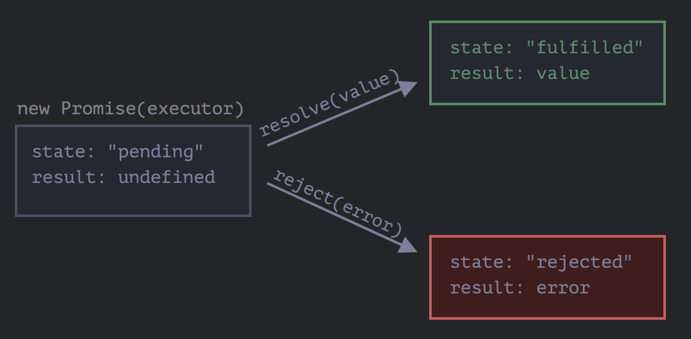

# Materials

* [프라미스 | javascript.info](https://ko.javascript.info/promise-basics)
  * 제일 쉬운 설명

----

비동기를 구현하기 위한 object 이다. `Promise` 는 `pending, fullfield (resolved),
rejected` 와 같이 3 가지 상태를 갖는다. 

`Promise` 는 다음과 같이 선언한다. `Promise constructor` 의 arg 를 `executor`
라고 한다. `executor` 는 함수이다. `Promise` object 가 생성될 때 바로 실행된다.

```js
let promise = new Promise(function(resolve, reject) {
  ...
});
```

`Promise` object 는 `status, result` 라는 숨겨진 property 를 갖는다. 접근할 수
없다.



`executor()` 의 arg 인 `resolve(), reject()` 는 모두 함수이다. `resolve(1)` 를
호출하면 `Promise` object 의 `status` 는 `fullfield (resolved)`, `result` 는 `1`
이 된다. `reject(2)` 를 호출하면 `Promise` object 의 `status` 는 `rejected`,
`result` 는 `2` 가 된다.

다음은 `executor` 에서 `resolve` 를 실행한 예이다. `1s` 뒤에
`resolve("done")` 이 호출된다. `promise.status == fullfield` 이고
`promise.result == "done"` 이다.   

```js
let promise = new Promise(function(resolve, reject) {
  setTimeout(() => resolve("done"), 1000);
});
```

다음은 `executor` 에서 `reject()` 를 호출한 예이다. `1s` 뒤에 `reject(new
Error("..."))` 가 호출된다. `promise.status == rejected` 이고 `promise.result ==
Error("Critical Error.")` 이다. 주로 `reject` 의 arg 는 `Error` 를 상속한 object
를 사용한다.

```js
let promise = new Promise(function(resolve, reject) {
  setTimeout(() => reject(new Error("Critical error.")), 1000);
});
```

이렇게 `Promise` object 의 status 가 `resolved` 혹은 `rejected` 되었을 때를
`settled` 되었다고 한다.

`then()` 을 사용하면 `Promise` object 를 subscript 할 수 있다. 다음과 같이
사용한다. `onFulfilled()` 는 `Promise` object 의 status 가 `fulfilled` 일 때
호출된다. `onRejected()` 는 `Promise` object 의 status 가 `rejected` 일 때
호출된다. `onFulfilled(), onRejected()` 의 arg 는 `Promise` object 의 `result`
와 같다.

```js
p.then(onFulfilled, onRejected);

p.then(function(value) {
}, function(reason) {
});

let promise = new Promise(function(resolve, reject) {
  setTimeout(() => resolve("done"), 1000);
});

promise.then(
  result => alert(result),
  error => alert(error) 
);
// -- 1s later
// done

let promise = new Promise(function(resolve, reject) {
  setTimeout(() => reject(new Error("failed")), 1000);
});

promise.then(
  result => alert(result), 
  error => alert(error)
);
// -- 1s later
// Eror: failed

// Just for onFulfilled()
let promise = new Promise(resolve => {
  setTimeout(() => resolve("done"), 1000);
});
promise.then(alert);
// -- 1s later
// done

// Use catch just for onRejected()
let promise = new Promise((resolve, reject) => {
  setTimeout(() => reject(new Error("failed")), 1000);
});
// This is same with promise.then(null, alert)
promise.catch(alert); 
// -- 1s later
// done

// Use finally
function fn() {}
let promise = new Promise((resolve, reject) => {
});
// This is same with promise.then(fn, fn).
// fn has no args.
promise.finally(fn); 
```

다음은 주요 `Promise` static methods 이다.

* `Promise.all(promises)` – 모든 `Promise` object 가 resolved 될 때까지
  기다렸다가 그 결괏값을 담은 배열을 반환한다. 주어진 `Promise` 중 하나라도
  실패하면 `Promise.all` 는 거부되고, 나머지 `Promise` 의 결과는 무시됩니다.
* `Promise.allSettled(promises)` – 모든 `Promise` object 가 처리될 때까지
  기다렸다가 그 결과(객체)를 담은 배열을 반환한다. 객체엔 다음과 같은 정보가  
  담긴다. `status: "fulfilled" | "rejected" , result: value | reason`
* `Promise.race(promises)` – 가장 먼저 처리된 `Promise` 를 리턴한다.
* `Promise.resolve(value)` – 주어진 값을 사용해 resolved 상태의 `Promise` 를 생성한다.
* `Promise.reject(error)` – 주어진 에러를 사용해 rejected 상태의 `Promise` 를 생성한다.

```js
// Promise.all
const promise1 = Promise.resolve(3);
const promise2 = 42;
const promise3 = new Promise((resolve, reject) => {
  setTimeout(resolve, 100, 'foo');
});

Promise.all([promise1, promise2, promise3]).then((values) => {
  console.log(values);
});
// Array [3, 42, "foo"]

// Promise.allSettled
let urls = [
  'https://api.github.com/users/iliakan',
  'https://api.github.com/users/Violet-Bora-Lee',
  'https://no-such-url'
];
Promise.allSettled(urls.map(url => fetch(url)))
  .then(results => { // (*)
    results.forEach((result, num) => {
      if (result.status == "fulfilled") {
        alert(`${urls[num]}: ${result.value.status}`);
      }
      if (result.status == "rejected") {
        alert(`${urls[num]}: ${result.reason}`);
      }
    });
  });
// [
//   {status: 'fulfilled', value: ...response...},
//   {status: 'fulfilled', value: ...response...},
//   {status: 'rejected', reason: ...Error...}
// ]  

// Polyfill for Promise.all when the browser doesn't support it.
if(!Promise.allSettled) {
  Promise.allSettled = function(promises) {
    return Promise.all(promises.map(p => Promise.resolve(p).then(value => ({
      status: 'fulfilled',
      value
    }), reason => ({
      status: 'rejected',
      reason
    }))));
  };
}

// Promise.race
Promise.race([
  new Promise((resolve, reject) => setTimeout(() => resolve(1), 1000)),
  new Promise((resolve, reject) => setTimeout(() => reject(new Error("failed")), 2000)),
  new Promise((resolve, reject) => setTimeout(() => resolve(3), 3000))
]).then(alert); 
// 1
```

다음은 Promise Chaining 의 예이다. `then()` 에서 다시 `promise` 를 리턴한다. 그
`promise` 가 `resolved` 상태로 전환되면 다음 `then()` 이 호출되고 `rejected`
상태로 전환되면 `catch()` 가 호출된다. 

```js
function promiseBar(name, stuff) {
  return new Promise((resolve, reject) => {
    setTimeout(() => {
      if (stuff.energy > 50) {
         resolve({result: `${name} alive, ${stuff.energy} energy`, loss: 10});
      } else {
         reject(new Error(`${name} died`));
      }
    }, 3000);
  });
}
const bar = { energy: 70 };
promiseBar('jane', bar)
  .then(a => {
    console.log(a.result);
    bar.energy -= a.loss;
    return promiseBar('john', bar);
  })
  .then(a => {
     console.log(a.result);
     bar.energy -= a.loss;
     return promiseBar('paul', bar);
  })
  .then(a => {
     console.log(a.result);
     bar.energy -= a.loss;
     return promiseBar('sam', bar);
  })
  .catch(e => console.error(e));
// jane alive, 70 energy
// john alive, 60 energy
// Error: paul died
//     at Timeout._onTimeout (/.../tmp/a.js:7:17)
//     at listOnTimeout (node:internal/timers:573:17)
//     at process.processTimers (node:internal/timers:514:7) 
```

`then()` 에서 not `Promise` object 를 리턴할 수도 있다. 이 것은 resolved or
rejected `Promise` object 를 생성한다???

```js
var p = new Promise((resolve, reject) => resolve(1))
          .then((r) => r + 1)
          .then((r) => r + 2)
          .then((r) => console.log(r));
// 4
```

`Promise` 의 `executor` 에서 `throw` 를 호출하면 `implicit try..catch` 작동한다.

```js
// There is a implicit try..catch in throw call.
// This implicit try..catch will call reject.
new Promise((resolve, reject) => {
  throw new Error("failed");
}).catch(alert); 
// Error: failed
// Same with throw new Error("failed");
new Promise((resolve, reject) => {
  reject(new Error("failed"));
}).catch(alert); 
// Error: failed
```
