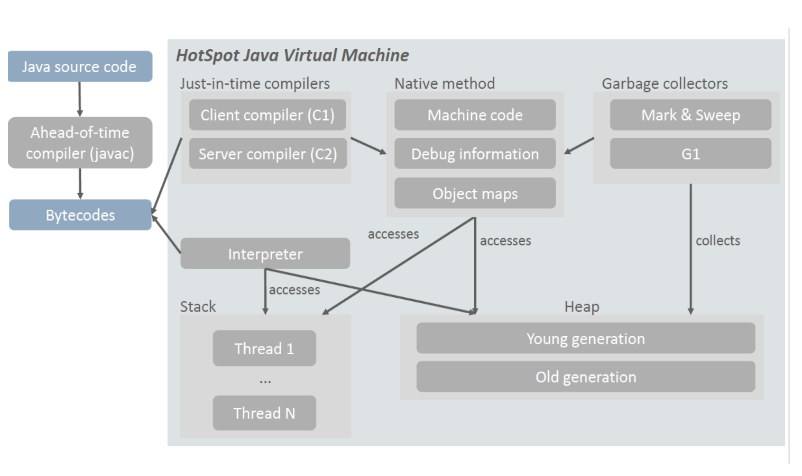

- [Abstract](#abstract)
- [Materials](#materials)
- [Overview](#overview)
- [Class Loader](#class-loader)
- [Example](#example)
- [java class architecture](#java-class-architecture)
- [JIT](#jit)
- [Graal VM](#graal-vm)

----

# Abstract

jvm 에 대해 적는다.

# Materials

* [JVM 밑바닥까지 파헤치기 자동 메모리 관리, 실행 서브시스템, 컴파일, 동시성 | yes24](https://www.yes24.com/Product/Goods/126114513)
* [더 자바, 코드를 조작하는 다양한 방법 by 백기선](https://www.inflearn.com/course/the-java-code-manipulation/dashboard)
* [The JVM Architecture Explained](https://dzone.com/articles/jvm-architecture-explained)
* [The Java® Virtual Machine Specification
Java SE 7 Edition](https://docs.oracle.com/javase/specs/jvms/se7/html/index.html)
* [자바 바이트코드 소개](https://iamsang.com/blog/2012/08/19/introduction-to-java-bytecode/)
* [C# Java Virtual Machine @ sourceforge](https://sourceforge.net/projects/szjavavm/)
  * opensource jvm in cs
* [A toy JVM written in Go @ github](https://github.com/zxh0/jvm.go)
  * opensource jvm in go
* [Java Virtual Machine implementation in Python @github](https://github.com/gkbrk/python-jvm-interpreter)
  * opensource jvm in python
* [A toy Java Virtual Machine implement by C++](https://github.com/XUranus/JVM)
  * opensource jvm in c++

# Overview


# Class Loader

class loader 는 `AppClassloader`, `PlatformClassLoader`, `BootstrapClassLoader` 와 같이 3 가지가 존재한다.

```java
public class App {
  public static void main(String[] args) {
    ClassLoad classLoader = App.class.getClassLoader();
    System.out.println(classLoader);
    System.out.println(classLoader.getParent());
    System.out.println(classLoader.getParent().getParent()); // null
  }
}
```

Class Loader 의 Linking 은 다음과 같이 3 단계로 구성된다.

* `Verify`: `.class` 가 유효한가?
* `Prepare`: allocate memory for class variables, static variables
* `Resolve`: exchange symbolic memory references with real memory references in method area

Initialization 은 static variables 의 값을 할당한다. static block 도 실행한다.

# Example

다음은 `Foo.java, Main.java` 를 작성하여 `javac Foo.java Main.java` 와 `javap -l
-v Foo Main` 을 수행하여 disassemble 된 것이다. constant pool 과 java byte code
를 구경할 수 있다.

> `Foo.java`

```java
class Foo {
	public void Hello() {
		System.out.println("Hello World");
	}
}
```

> Main.java

```java
public class Main {

	public static void main(String args[]) {
		Foo f = new Foo();
		f.Hello();
	}
}
```

> Foo.class

```
Classfile /C:/temp/Foo.class
  Last modified 2019. 5. 7; size 387 bytes
  MD5 checksum a71df214fd9d74a08493e309a450405b
  Compiled from "Foo.java"
class Foo
  minor version: 0
  major version: 52
  flags: ACC_SUPER
Constant pool:
   #1 = Methodref          #6.#14         // java/lang/Object."<init>":()V
   #2 = Fieldref           #15.#16        // java/lang/System.out:Ljava/io/PrintStream;
   #3 = String             #17            // Hello World
   #4 = Methodref          #18.#19        // java/io/PrintStream.println:(Ljava/lang/String;)V
   #5 = Class              #20            // Foo
   #6 = Class              #21            // java/lang/Object
   #7 = Utf8               <init>
   #8 = Utf8               ()V
   #9 = Utf8               Code
  #10 = Utf8               LineNumberTable
  #11 = Utf8               Hello
  #12 = Utf8               SourceFile
  #13 = Utf8               Foo.java
  #14 = NameAndType        #7:#8          // "<init>":()V
  #15 = Class              #22            // java/lang/System
  #16 = NameAndType        #23:#24        // out:Ljava/io/PrintStream;
  #17 = Utf8               Hello World
  #18 = Class              #25            // java/io/PrintStream
  #19 = NameAndType        #26:#27        // println:(Ljava/lang/String;)V
  #20 = Utf8               Foo
  #21 = Utf8               java/lang/Object
  #22 = Utf8               java/lang/System
  #23 = Utf8               out
  #24 = Utf8               Ljava/io/PrintStream;
  #25 = Utf8               java/io/PrintStream
  #26 = Utf8               println
  #27 = Utf8               (Ljava/lang/String;)V
{
  Foo();
    descriptor: ()V
    flags:
    Code:
      stack=1, locals=1, args_size=1
         0: aload_0
         1: invokespecial #1                  // Method java/lang/Object."<init>":()V
         4: return
      LineNumberTable:
        line 1: 0

  public void Hello();
    descriptor: ()V
    flags: ACC_PUBLIC
    Code:
      stack=2, locals=1, args_size=1
         0: getstatic     #2                  // Field java/lang/System.out:Ljava/io/PrintStream;
         3: ldc           #3                  // String Hello World
         5: invokevirtual #4                  // Method java/io/PrintStream.println:(Ljava/lang/String;)V
         8: return
      LineNumberTable:
        line 3: 0
        line 4: 8
}
SourceFile: "Foo.java"
```

> `Main.class`

```
Classfile /C:/temp/Main.class
  Last modified 2019. 5. 7; size 305 bytes
  MD5 checksum 9db60d538675a632bf0d17b242a45b28
  Compiled from "Main.java"
public class Main
  minor version: 0
  major version: 52
  flags: ACC_PUBLIC, ACC_SUPER
Constant pool:
   #1 = Methodref          #6.#15         // java/lang/Object."<init>":()V
   #2 = Class              #16            // Foo
   #3 = Methodref          #2.#15         // Foo."<init>":()V
   #4 = Methodref          #2.#17         // Foo.Hello:()V
   #5 = Class              #18            // Main
   #6 = Class              #19            // java/lang/Object
   #7 = Utf8               <init>
   #8 = Utf8               ()V
   #9 = Utf8               Code
  #10 = Utf8               LineNumberTable
  #11 = Utf8               main
  #12 = Utf8               ([Ljava/lang/String;)V
  #13 = Utf8               SourceFile
  #14 = Utf8               Main.java
  #15 = NameAndType        #7:#8          // "<init>":()V
  #16 = Utf8               Foo
  #17 = NameAndType        #20:#8         // Hello:()V
  #18 = Utf8               Main
  #19 = Utf8               java/lang/Object
  #20 = Utf8               Hello
{
  public Main();
    descriptor: ()V
    flags: ACC_PUBLIC
    Code:
      stack=1, locals=1, args_size=1
         0: aload_0
         1: invokespecial #1                  // Method java/lang/Object."<init>":()V
         4: return
      LineNumberTable:
        line 1: 0

  public static void main(java.lang.String[]);
    descriptor: ([Ljava/lang/String;)V
    flags: ACC_PUBLIC, ACC_STATIC
    Code:
      stack=2, locals=2, args_size=1
         0: new           #2                  // class Foo
         3: dup
         4: invokespecial #3                  // Method Foo."<init>":()V
         7: astore_1
         8: aload_1
         9: invokevirtual #4                  // Method Foo.Hello:()V
        12: return
      LineNumberTable:
        line 4: 0
        line 5: 8
        line 6: 12
}
SourceFile: "Main.java"
```

# java class architecture

* [Java Executable Workthrough](https://github.com/corkami/pics/blob/master/binary/class101/class101.pdf)


# JIT

* [JIT Compiler Design](http://www.ittc.ku.edu/~kulkarni/teaching/EECS768/19-Spring/Idhaya_Elango_JIT.pdf)
  * [jvm-mecchanics](https://github.com/dougqh/jvm-mechanics/tree/d3483e5f54ea3a5ebf3e84caa1b55437f34ee635)
    * Presentation & Code Samples Showing Compilation & Deoptimization Behavior of HotSpot
    * 예제 코드와 함께 JIT 원리를 설명한다.
  * [Compilation in the HotSpot VM](https://ethz.ch/content/dam/ethz/special-interest/infk/inst-cs/lst-dam/documents/Education/Classes/Fall2015/210_Compiler_Design/Slides/hotspot.pdf)
  * [Understanding JIT compiler (just-in-time compiler)](https://aboullaite.me/understanding-jit-compiler-just-in-time-compiler/)

---

HotSpot JVM 에서 도입되었다. 자주 사용하는 code 를 미리 compile 한다. JIT C1, JIT c2 로 나눠진다.

다음은 HotSpot JVM 의 Architecture 이다. JIT 를 주목하자.



JIT C1 은 다음과 같은 특징을 갖는다.

* Fast compilation
* Small footprint
* Code could be better
* 주로 Client 에서 사용

JIT C2 는 다음과 같은 특징을 갖는다.

* High resource demands
* High performance code
* 주로 server 에서 사용

[jitwatch](https://github.com/AdoptOpenJDK/jitwatch/) 를 이용하면 JIT log 을 JavaFX 로 볼 수 있다. 다음과 같이 실행한다.

```bash
$ git clone https://github.com/AdoptOpenJDK/jitwatch.git
$ cd jitwatch
$ ./gradlew clean build run
```

# Graal VM

* [Reboot JAVA = GraalVM](https://techblog.cjenm.com/reboot-java-graalvm-ec8404ed6ed1)

JVM 을 최적화하려는 노력은 계속되었다. HostSpot JVM 은 JIT 을 이용하여 Optimization 한 기술이다. 

PyPy 는 Python 을 Python 으로 구현한 것이다. JIT 를 이용했다.

JVM 은 cpp 로 구현되었다. 최적화를 위해 assembly 를 사용할 단계까지 왔다. 

Graal VM 은 Java 를 Java 로 구현한 JVM 이다. `([HotSpot JVM] — C2)`, JVMCI, Graal JIT 으로 구성된다. 성능이 개선되었다.
