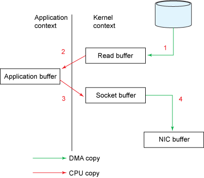
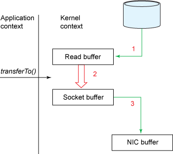
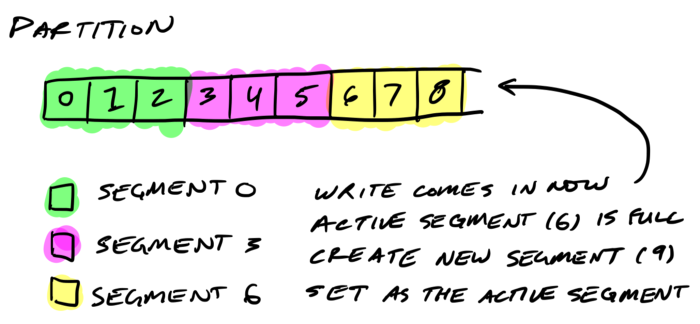
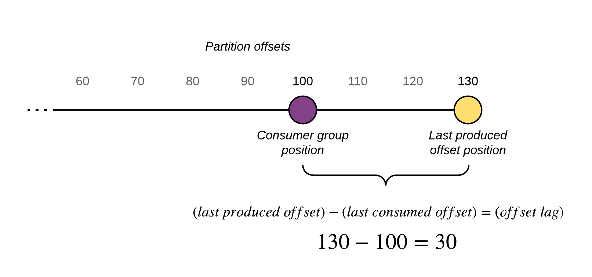
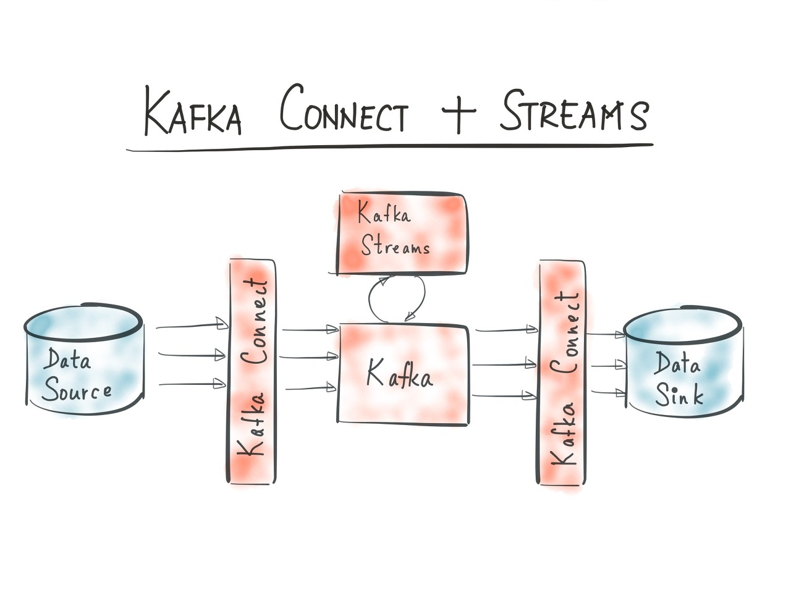

- [References](#references)
- [Materials](#materials)
- [Install](#install)
  - [Recommended Options](#recommended-options)
  - [Install on Ubuntu](#install-on-ubuntu)
  - [Install with docker](#install-with-docker)
    - [Single Zookeeper / Single Kafka](#single-zookeeper--single-kafka)
    - [Single Zookeeper / Multiple Kafka](#single-zookeeper--multiple-kafka)
    - [Multiple Zookeeper / Single Kafka](#multiple-zookeeper--single-kafka)
    - [Multiple Zookeeper / Multiple Kafka](#multiple-zookeeper--multiple-kafka)
    - [Full stack](#full-stack)
- [Feature](#feature)
  - [Core Concepts](#core-concepts)
  - [Advantages](#advantages)
  - [Zero Copy](#zero-copy)
  - [Zookeeper](#zookeeper)
  - [Topic](#topic)
  - [Partition](#partition)
  - [Rebalance](#rebalance)
  - [Producer](#producer)
  - [Consumer Group](#consumer-group)
  - [ACK](#ack)
  - [Exactly once](#exactly-once)
  - [Record Key](#record-key)
  - [Consumer Lag](#consumer-lag)
  - [Dead Letter Queue](#dead-letter-queue)
  - [Batch](#batch)
  - [Kafka GUI](#kafka-gui)
- [Basic](#basic)
  - [Usual configs of server.properties](#usual-configs-of-serverproperties)
  - [Useful Client Commands](#useful-client-commands)
  - [Useful Server Commands](#useful-server-commands)
  - [Producer application integration](#producer-application-integration)
  - [Consumer application integration](#consumer-application-integration)
  - [How to prevent Duplicated messages in consumer](#how-to-prevent-duplicated-messages-in-consumer)
- [Advanced](#advanced)
  - [Kafka Storage Internals](#kafka-storage-internals)
  - [Log Compacted Topics](#log-compacted-topics)
  - [Kafka Delete Internals](#kafka-delete-internals)
  - [Gurantee order of messages, no duplicates](#gurantee-order-of-messages-no-duplicates)
  - [How many partitions ???](#how-many-partitions-)
  - [Monitoring Kafka](#monitoring-kafka)
  - [Kafka Connect](#kafka-connect)
  - [Kafka Streams](#kafka-streams)
  - [ksqlDB](#ksqldb)

-----

# References

* [DOCUMENTATION](https://kafka.apache.org/documentation/)
  * [src](https://github.com/apache/kafka)
* [카프카, 데이터 플랫폼의 최강자](http://www.yes24.com/Product/goods/59789254)
  * [src](https://github.com/onlybooks/kafka)
* [Jocko @ github](https://github.com/travisjeffery/jocko)
  * Kafka 를 go 로 구현함. Zookeeper 의존성이 없다. 

# Materials

* [Kafka Internals](https://developer.confluent.io/learn-kafka/architecture/get-started/)
  * Videos
* [아파치 카프카 입문 @ Tacademy](https://tacademy.skplanet.com/live/player/onlineLectureDetail.action?seq=183)
  * [src](https://github.com/AndersonChoi/tacademy-kafka)
  * [토크ON 77차. 아파치 카프카 입문 1강 - Kafka 기본개념 및 생태계 | T아카데미 @ youtube](https://www.youtube.com/watch?v=VJKZvOASvUA)
  * [유튜브 ™ 를위한 애드 블록 에 의해 청소 Share 토크ON 77차. 아파치 카프카 입문 2강 - Kafka 설치, 실행, CLI | T아카데미 @ youtube](https://www.youtube.com/watch?v=iUX6d14bvj0)
  * [토크ON 77차. 아파치 카프카 입문 3강 - Kafka Producer application @ youtube](https://www.youtube.com/watch?v=dubFjEXuK6w)
  * [토크ON 77차. 아파치 카프카 입문 4강 - Kafka Consumer application @ youtube](https://www.youtube.com/watch?v=oyNjiQ2q2CE)
  * [토크ON 77차. 아파치 카프카 입문 5강 - Kafka 활용 실습 @ youtube](https://www.youtube.com/watch?v=3OPZ7_sHtWo)
* [How To Install Apache Kafka on Ubuntu 18.04](https://www.digitalocean.com/community/tutorials/how-to-install-apache-kafka-on-ubuntu-18-04)
* [kafka @ joinc](https://www.joinc.co.kr/w/man/12/Kafka)
* [Core Concepts](https://kafka.apache.org/0110/documentation/streams/core-concepts)
* [Kafka 이해하기](https://medium.com/@umanking/%EC%B9%B4%ED%94%84%EC%B9%B4%EC%97%90-%EB%8C%80%ED%95%B4%EC%84%9C-%EC%9D%B4%EC%95%BC%EA%B8%B0-%ED%95%98%EA%B8%B0%EC%A0%84%EC%97%90-%EB%A8%BC%EC%A0%80-data%EC%97%90-%EB%8C%80%ED%95%B4%EC%84%9C-%EC%9D%B4%EC%95%BC%EA%B8%B0%ED%95%B4%EB%B3%B4%EC%9E%90-d2e3ca2f3c2)
* [Kafka 운영자가 말하는 처음 접하는 Kafka](https://www.popit.kr/kafka-%EC%9A%B4%EC%98%81%EC%9E%90%EA%B0%80-%EB%A7%90%ED%95%98%EB%8A%94-%EC%B2%98%EC%9D%8C-%EC%A0%91%ED%95%98%EB%8A%94-kafka/)
  * [Kafka 운영자가 말하는 Topic Replication](https://www.popit.kr/kafka-%EC%9A%B4%EC%98%81%EC%9E%90%EA%B0%80-%EB%A7%90%ED%95%98%EB%8A%94-topic-replication/) 
  * [Kafka 운영자가 말하는 TIP](https://www.popit.kr/kafka-%EC%9A%B4%EC%98%81%EC%9E%90%EA%B0%80-%EB%A7%90%ED%95%98%EB%8A%94-tip/) 
  * [Kafka 운영자가 말하는 Producer ACKS](https://www.popit.kr/kafka-%EC%9A%B4%EC%98%81%EC%9E%90%EA%B0%80-%EB%A7%90%ED%95%98%EB%8A%94-producer-acks/)
* [kafka 조금 아는 척하기 1 (개발자용) @ youtube](https://www.youtube.com/watch?v=0Ssx7jJJADI)
  * [kafka 조금 아는 척하기 2 (개발자용) @ youtube](https://www.youtube.com/watch?v=geMtm17ofPY)
  * [kafka 조금 아는 척하기 3 (개발자용) @ youtube](https://www.youtube.com/watch?v=xqrIDHbGjOY)

# Install

## Recommended Options

**Recommended Options from LinkedIn** 

* [Kafka Optimization](https://dattell.com/data-architecture-blog/apache-kafka-optimization/)

----

```bash
-Xmx6g -Xms6g -XX:MetaspaceSize=96m -XX:+UseG1GC
-XX:MaxGCPauseMillis=20 -XX:InitiatingHeapOccupancyPercent=35 -XX:G1HeapRegionSize=16M
-XX:MinMetaspaceFreeRatio=50 -XX:MaxMetaspaceFreeRatio=80
```

60 대의 Broker, 5 만개의 Partition, Replication-factor 2 로 구성하면 다음과 같은 throughput 을 갖는다.

* `300 MB/sec` inbound
* `1 GB/sec` outbound

## Install on Ubuntu

* [How To Install Apache Kafka on Ubuntu 18.04](https://www.digitalocean.com/community/tutorials/how-to-install-apache-kafka-on-ubuntu-18-04)

## Install with docker

* [kafka-stack-docker-compose](https://github.com/simplesteph/kafka-stack-docker-compose)
  * zookeeper, kafka cluter

```console
$ git clone git@github.com:simplesteph/kafka-stack-docker-compose.git
```

### Single Zookeeper / Single Kafka

```bash
# If you didn't remove this directory It might fail to start
$ rm -rf zk-single-kafka-single
$ docker-compose -f zk-single-kafka-single.yml up
$ docker-compose -f zk-single-kafka-single.yml down
```

### Single Zookeeper / Multiple Kafka

```console
$ docker-compose -f zk-single-kafka-multiple.yml up
$ docker-compose -f zk-single-kafka-multiple.yml down
```

### Multiple Zookeeper / Single Kafka

```console
$ docker-compose -f zk-multiple-kafka-single.yml up
$ docker-compose -f zk-multiple-kafka-single.yml down
```

### Multiple Zookeeper / Multiple Kafka

```console
$ docker-compose -f zk-multiple-kafka-multiple.yml up
$ docker-compose -f zk-multiple-kafka-multiple.yml down
```

### Full stack

* Single Zookeeper: $DOCKER_HOST_IP:2181
* Single Kafka: $DOCKER_HOST_IP:9092
* Kafka Schema Registry: $DOCKER_HOST_IP:8081
* Kafka Schema Registry UI: $DOCKER_HOST_IP:8001
* Kafka Rest Proxy: $DOCKER_HOST_IP:8082
* Kafka Topics UI: $DOCKER_HOST_IP:8000
* Kafka Connect: $DOCKER_HOST_IP:8083
* Kafka Connect UI: $DOCKER_HOST_IP:8003
* KSQL Server: $DOCKER_HOST_IP:8088
* Zoonavigator Web: $DOCKER_HOST_IP:8004

```console
$ docker-compose -f full-stack.yml up
$ docker-compose -f full-stack.yml down
```

# Feature

## Core Concepts

Kafka 는 Pub/Sub 을 지원하는 Message Queue 이다. scala 로 만들어 졌다. 


* **Broker**: Kafka Application Server
* **Topic**: RDBMS 의 Table 과 같다. data 의 logical 모음이다. 하나의 Topic 은 여러 Data 를 갖는다. 여러 Data 는 여러 Partition 에 나누어 저장된다.
* **Partition**: data 의 physical 모음이다. 하나의 Partition 은 여러개의 Segment file 들로 나누어진다.
* **Offset**: Partition 에서 Record Data 의 번호이다.
* **Consumer**: Record Data 를 특정 Partition 에서 polling 하는 application 이다.
* **Consumer Group**: 여러 Consumer Intsnace 들을 묶은 것이다.
* **Consumer offset**: 특정 Consumer Instance 가 특정 Partition 에서 몇번째 Record Data 까지 읽었는지를 의미한다.
* **Producer**: Record Data 를 Broker 에 저장하는 application 이다.
* **Replication**: 하나의 Partition 를 여러개로 복제하는 것이다. Leader Partition 한개와 여러개의 Follower Partition 으로 나누어진다.
* **ISR (In Sync Replication)**: Replication 를 구성하는 Leader, Follower Partition 묶음
* **Rack-awareness**: IDC 에서 하나의 server 에 장애가 생기면 보통 하나의 Server Rack 이 모두 장애가 생긴다. Server Rack Incident 를 막기 위해 서로다른 Server Rack 에 application 들을 배치해야 한다.


## Advantages

kafka 는 disk 에서 데이터를 caching 한다. 따라서 저렴한 비용으로 대량의 데이터를
보관할 수 있다. 실제로 disk 에 random access 는 100 KB/sec 이지만 linear writing
은 600 MB/sec 이다. 6000 배이다. 따라서 random access 보다 linear writing 을
많이 한다면 disk 를 이용해도 좋다.


## Zero Copy



데이터를 읽어서 네트워크로 전송할 때 kernel mode -> user mode -> kernel mode 순서로 OS 의 mode 변환이 필요하다.



이때 user mode 변환 없이 데이터를 네트워크로 전송하는 것을 zero copy 라고 한다.

## Zookeeper

zookeeper 는 kafka node 를 관리하고 topic 의 offset 을 저장한다. 

zookeeper 제거 작업이 진행중이다. [KIP-500: Replace ZooKeeper with a Self-Managed Metadata Quorum](https://cwiki.apache.org/confluence/display/KAFKA/KIP-500:+Replace+ZooKeeper+with+a+Self-Managed+Metadata+Quorum)

## Topic

topic 은 RDBMS 의 Table 과 같다. 하나의 topic 에 저장된 Record data 는 여러 partition 에 나누어 저장된다. `consumer_offsets` topic 은 자동으로 생성되는 topic 이다.

다음과 같이 토픽을 생성하고 토픽의 목록을 조회할 수 있다.

```bash
## Create the topic
$ /usr/bin/kafka-topics --create --bootstrap-server localhost:9092 --replication-factor 1 --partitions 1 --topic my-topic

## Show topic list
$ /usr/bin/kafka-topics --list --zookeeper zoo1:2181
__confluent.support.metrics
__consumer_offsets
my-topic
```

다음과 같이 메시지를 전송할 수 있다.

```bash
$ /usr/bin/kafka-console-producer --broker-list localhost:9092 --topic my-topic
> Hello
> World
```

다음과 같이 메시지를 가져올 수 있다.

```console
$ /usr/bin/kafka-console-consumer --bootstrap-server localhost:9092 --from-beginning --topic my-topic
```

topic 과 관련된 여러 설정들이 있다. [3.2 Topic-Level Configs @ kafka](https://kafka.apache.org/documentation/#topicconfigs)

## Partition

> * [How Kafka’s Storage Internals Work](https://thehoard.blog/how-kafkas-storage-internals-work-3a29b02e026)
> * [A Practical Introduction to Kafka Storage Internals @ medium](https://medium.com/@durgaswaroop/a-practical-introduction-to-kafka-storage-internals-d5b544f6925f)

-----



하나의 Topic 은 여러개의 Partition 으로 나누어 저장된다. 다시 하나의 Partition 은 여러개의 segment file 로 나누어 저장된다. segment file 을 append only file 이라고 한다.
Partition 의 message 는 일정시간이 지나면 지워진다. 일정한 기간동안 보관된다.

Producer 는 여러개의 Partition 에 병렬로 메시지를 전송할 수 있다. Consumer
입장에서 Message 순서가 보장될 수 없다. Partition 의 개수는 한번 늘리면 줄일 수
없다. partition 과 consumer group 을 사용하면 topic 을 parallel 하게 처리하여
수행성능을 높일 수 있다.  

Message 의 순서가 중요 하다면 하나의 Topic 을 하나의 Partition 으로 구성한다.

Message 순서에 대해 Deep Dive 해보자. 다음과 같이 8 개의 partition 에 my-topic-8 을 만들어 보자.

```console
$ /usr/bin/kafka-topics --create --bootstrap-server localhost:9092 --replication-factor 1 --partitions 8 --topic my-topic-8
```

이제 Message 를 보내자. 

```console
$ /usr/bin/kafka-console-producer --broker-list localhost:9092 --topic my-topic-8
>1
>2
>3
>4
>5
>6
>7
>8
```

이제 가져와보자. 순서가 보장되지 않는다. 

```console
$ /usr/bin/kafka-console-consumer --bootstrap-server localhost:9092 --from-beginning --topic my-topic-8
4
5
6
7
1
2
3
8
9
0
```

## Rebalance

Kafka 가 partition 을 Consumer Instance 에 다시 할당하는 과정이다. 예를 들어 Consumer Group 의 특정 Consumer Instance 가 장애가 발생했다면 Kafka 는 잠깐 시간을 내어 살아있는 Consumer Instance 들에게 Partition 을 다시 할당한다. 이때 Rebalance 도중에 Record Data 를 consumming 할 수 없다.

## Producer

> * [KafkaProducer Client Internals @ naver.d2](https://d2.naver.com/helloworld/6560422)
> * [Kafka producer overview @ linkedin](https://www.linkedin.com/pulse/kafka-producer-overview-sylvester-daniel)

-----


Producer 는 Kafka Broker 에게 message 를 공급하는 application 이다. 

Producer Record 가 만들어지면 Serializer, Partitioner, Compression 과정을 지나 하나의 Batch 를 구성한다. 그리고 Batch 단위로 특정 Kafka Broker Partition 으로 전송된다.

Producer 와 관련된 여러 설정들을 확인할 수 있다. [3.3 Producer Configs @ kafka](https://kafka.apache.org/documentation/#producerconfigs)

## Consumer Group

> * [Kafka 운영자가 말하는 Kafka Consumer Group](https://www.popit.kr/kafka-consumer-group/)


하나의 Consumer Group 은 여러개의 Consumer Instance 들로 구성된다. Consumer Group 은 Consumer Instance 의 High Availability 를 위해 필요하다. 예를 들어 하나의 Consumer Group `Hello` 는 4 개의 Consumer Instance 로 구성되어 있다. `Hello` 는 `world-topic` 에서 message 를 가져온다. Consumer Instance 하나가 장애가 발생해도 서비스의 지장은 없다.

Consumer 와 관련된 여러 설정들을 확인할 수 있다. [3.4 Consumer Configs @ kafka](https://kafka.apache.org/documentation/#consumerconfigs)

## ACK

Producer application 의 설정이다.

Kafka Partitions 는 replication factor 만큼 하나의 leader partition 와 여러개의 follower partition 들로 구성된다. leader 가 Producer 로 부터 Message 를 넘겨 받으면 follower 들은 leader partition 에게서 데이터를 가져와 동기화 한다. 

* `ack=0`: producer 는 message 의 ack 를 필요로 하지 않는다.
* `ack=1`: producer 는 leader partition 에게 Message 가 전송되었음을 보장한다. 
* `ack=all(-1)`: producer 는 leader 및 follower 에게 모두 Message 가 전송되었음을 보장한다. 

## Exactly once

* configuration file 에서 `processing.guarantee=exactly_once` 로 설정하면 된다.
  * [PROCESSING GUARANTEES @ manual](https://kafka.apache.org/0110/documentation/streams/core-concepts)
  * In order to achieve exactly-once semantics when running Kafka Streams applications, users can simply set the processing.guarantee config value to exactly_once (default value is at_least_once). More details can be found in the Kafka Streams Configs section.

## Record Key

Message 를 구분하는 구분자이다. Record Data 는 key, Value 로 이루어진다. 같은
Key 의 Record Data 는 같은 Partition 에 저장된다.

예를 들어 `Key=주문/value=키보드` 와 `Key=주문/Value=마우스` 는 같은 Partition 에
저장된다. 

## Consumer Lag

> * [Monitor Kafka Consumer Group Latency with Kafka Lag Exporter](https://www.lightbend.com/blog/monitor-kafka-consumer-group-latency-with-kafka-lag-exporter)



특정 Partition 에서 Producer 가 마지막으로 저장한 Record offset 과 Consumer 가 가져간 마지막 Record offset 의 차이이다. monitoring 해야한다. LAG 이 크다는 것은 consumming 이 제대로 되지 않고 있다는 것을 의미한다.

## Dead Letter Queue

> * [Kafka Connect Deep Dive – Error Handling and Dead Letter Queues](https://www.confluent.io/blog/kafka-connect-deep-dive-error-handling-dead-letter-queues/)
> * [Spring Kafka Non-Blocking Retries and Dead Letter Topics](https://evgeniy-khist.github.io/spring-kafka-non-blocking-retries-and-dlt/)
> * [src](https://github.com/evgeniy-khist/spring-kafka-non-blocking-retries-and-dlt)

----

Kafka Topic `orders, orders-retry-0, orders-retry-1, orders-retry-2, orders-dlt` 을 생성한다. `orders` 에서 consuming 한 후 처리하다가 에러가 발생하면 `orders-retry-0` 으로 보낸다. `orders-retry-0` 에서 consuming 한 후 처리하다가 에러가 발생하면 `orders-retry-1` 로 보낸다. `orders-retry-1` 에서 consuming 한 후 처리하다가 에러가 발생하면 `orders-retry-2` 로 보낸다. `orders-retry-2` 에서 처리하다가 에러가 발생하면 `orders-dlt` 로 보낸다. 

이것은 [Spring Retry](/spring/springretry.md) 를 통해 쉽게 구현할 수 있다. [src](https://github.com/evgeniy-khist/spring-kafka-non-blocking-retries-and-dlt) 참고

```java
@Component
@Slf4j
public class RetryableKafkaListener {

  @RetryableTopic(
      attempts = "4",
      backoff = @Backoff(delay = 1000, multiplier = 2.0),
      autoCreateTopics = "false",
      topicSuffixingStrategy = TopicSuffixingStrategy.SUFFIX_WITH_INDEX_VALUE)
  @KafkaListener(topics = "orders")
  public void listen(String in, @Header(KafkaHeaders.RECEIVED_TOPIC) String topic) {
    log.info(in + " from " + topic);
    throw new RuntimeException("test");
  }

  @DltHandler
  public void dlt(String in, @Header(KafkaHeaders.RECEIVED_TOPIC) String topic) {
    log.info(in + " from " + topic);
  }
}
```

이후 `orders-dlt` 의 message 들을 `orders` 로 보내거나 batch 에서 처리한다. 

## Batch

* [[Kafka] Producer Config 정리](https://devidea.tistory.com/90)

Producer 는 record 를 batch 로 묶어서 보낸다. `batch.size` 를 설정하여 batch 의 크기를 조정한다. 

## Kafka GUI

* [CMAK (Cluster Manager for Apache Kafka, previously known as Kafka Manager)](https://github.com/yahoo/CMAK#deployment)
  * yahoo 에서 개발한 Web GUI

# Basic

## Usual configs of server.properties

* `broker.id`: The id of broker
* `listeners`: `host:port`
* `advertised.listerners`: Kafka client 가 접속할 `host:port`
* `log.dirs`: The directory of segment files
* `log.segment.bytes`: The size of segment files
* `log.retention.ms`: The retention of segment files
* `zookeeper.connect`: zookeeper `host:port`
* `auto.create.topics.enable`: ???
* `num.partitions`: The default count of partitions
* `message.max.bytes`: The max size of the message

## Useful Client Commands

```bash
# Show version
$ docker run --rm -it confluentinc/cp-kafka:latest sh -c "kafka-topics --bootstrap-server kafka.iamslash.com --version" 

# List topics
$ docker run --rm -it confluentinc/cp-kafka:latest sh -c "kafka-topics --list --bootstrap-server kafka.iamslash.com" 

# Describe topic
$ docker run --rm -it confluentinc/cp-kafka:latest sh -c "kafka-topics --describe --topic basictopic --bootstrap-server kafka.iamslash.com" 

# Produce messages interactively
$ docker run --rm -it --network host confluentinc/cp-kafka:latest sh -c "kafka-console-producer --broker-list localhost:9092 --topic orders"

# Consume message interactively
$ docker run --rm -it --network host confluentinc/cp-kafka:latest sh -c "kafka-console-consumer --bootstrap-server localhost:9092 --from-beginning --partition 1 --topic orders"
```

## Useful Server Commands

> * [Apache Kafka CLI commands cheat sheet](https://medium.com/@TimvanBaarsen/apache-kafka-cli-commands-cheat-sheet-a6f06eac01b#09e8)

* kafka-topics.sh
  * Create, read, update topics
  * `--bootstrap-server`: Target broker `IP:port`
  * `--replication-factor`: The count of replication. This should be equal or lesser than the count of brokers.
  * `--partitions`: The count of partitions
  * `--config`: `retentions.ms, segment.byte`
  * `--create`: Create topic
  * `--delete`: Delete topic
  * `--describe`: Describe topic
  * `--list`: Show list of topics
  * `--version`: Show the version of the cluster
* kafka-console-consumer.sh
  * Read records from the topic
* kafka-console-producer.sh
  * Write records to the topic
* kafka-consumer-groups.sh
  * Read and update consumer groups, consumer offsets
  * `--shift-by <Long>`: Move consumer offset with `+ <Long>` or `- <Long>`
  * `--to-offset <Long>`: Update consumer offset with `<Long>`.
  * `--to-latest`: ???
  * `--to-earliest`: ???

```bash
## Start zookeeper, kafka server
## But You don't need this when you use docker-compose
$ /usr/bin/zookeeper-server-start -daemon /etc/kafka/config/zookeeper.properties
$ /usr/bin/kafka-server-start -daemon /etc/kafka/config/server.properties

## Connect kafka docker container
$ docker exec -it kafka-stack-docker-compose_kafka1_1 bash

## Show topic list
$ /usr/bin/kafka-topics --list --zookeeper zoo1:2181

## Create the topic
$ /usr/bin/kafka-topics --create --bootstrap-server localhost:9092 --replication-factor 1 --partitions 1 --topic my-topic

## Pull message from topic
$ /usr/bin/kafka-console-consumer --bootstrap-server localhost:9092 --from-beginning --topic my-topic

## Send message to topic
$ /usr/bin/kafka-console-producer --broker-list localhost:9092 --topic my-topic
> Hello
> World

## Pull message from topic with partition 1
$ /usr/bin/kafka-console-consumer --bootstrap-server localhost:9092 --from-beginning --partition 1 --topic my-topic

## Delete the topic
$ /usr/bin/kafka-topics --zookeeper zoo1:2181 --delete --topic my-topic

## Stop kafka, zookeeper
## But You don't need this when you use docker-compose
$ /usr/bin/zookeeper-server-stop /etc/kafka/config/zookeeper.properties
$ /usr/bin/kafka-server-stop /etc/kafka/config/server.properties

## Show consumer groups
$ /usr/bin/kafka-consumer-groups --bootstrap-server localhost:9092 --list

## Describe consumer group
$ /usr/bin/kafka-consumer-groups --bootstrap-server localhost:9092 --group <group-name> --describe

## Delete consumer group
$ /usr/bin/kafka-consumer-groups --zookeeper zoo1:2181 --delete --group <group-name>

## Check topic leader follower
$ /usr/bin/kafka-topics --zookeeper zoo1:2181 --topic my-topic --describe

## server log check ???
$ cat /usr/local/bin/kafka/logs/server.log 
```

## Producer application integration

> * [src](https://github.com/AndersonChoi/tacademy-kafka)

**Producer mandatory options**

* `bootstrap.servers`: The list of brokers
* `key.serializer`: Serialize Class
* `value.serializer`: Deserialize Class

**Producer secondary options**

* `acks`: Record reliability
* `compression.type`: `snappy, gzip, lz4`
* `retries`: The count of retry
* `buffer.memory`: The size of buffer
* `batch.size`: The size of batch
* `linger.ms`: Waiting time for current batch to be sended
* `client.id`: The unique client id

**Simple Producer**

```java
public class SimpleProducer {
    private static String TOPIC_NAME = "test";
    private static String BOOTSTRAP_SERVERS = "127.0.0.1:9092";

    public static void main(String[] args) {
        Properties configs = new Properties();
        configs.put(ProducerConfig.BOOTSTRAP_SERVERS_CONFIG, BOOTSTRAP_SERVERS);
        configs.put(ProducerConfig.KEY_SERIALIZER_CLASS_CONFIG, StringSerializer.class.getName());
        configs.put(ProducerConfig.VALUE_SERIALIZER_CLASS_CONFIG, StringSerializer.class.getName());

        KafkaProducer<String, String> producer = new KafkaProducer<>(configs);

        for (int index = 0; index < 10; index++) {
            String data = "This is record " + index;
            ProducerRecord<String, String> record = new ProducerRecord<>(TOPIC_NAME, data);
            try {
                producer.send(record);
                System.out.println("Send to " + TOPIC_NAME + " | data : " + data);
                Thread.sleep(1000);
            } catch (Exception e) {
                System.out.println(e);
            }
        }
    }
}
```

## Consumer application integration

> * [src](https://github.com/AndersonChoi/tacademy-kafka)

**Consumer mandatory options**

* `bootstrap.servers`: The list of brokers
* `key.serializer`: Serialize Class
* `value.serializer`: Deserialize Class
* `group.id`: consumer group id

**Consumer secondary options**

* `enable.auto.commit`: auto commit
* `auto.commit.interval.ms`: auto commit interval time
* `auto.offset.reset`: consumer offset for new consumer group
* `client.id`: The unique client id
* `max.poll.records`: The max count of records per one `poll()`
* `session.timeout.ms`: The timeout of connection between broker and consumer

**Simple Consumer**

```java
public class SimpleConsumer {
    private static String TOPIC_NAME = "test";
    private static String GROUP_ID = "testgroup";
    private static String BOOTSTRAP_SERVERS = "127.0.0.1:9092";

    public static void main(String[] args) {
        Properties configs = new Properties();
        configs.put(ConsumerConfig.BOOTSTRAP_SERVERS_CONFIG, BOOTSTRAP_SERVERS);
        configs.put(ConsumerConfig.GROUP_ID_CONFIG, GROUP_ID);
        configs.put(ConsumerConfig.KEY_DESERIALIZER_CLASS_CONFIG, StringDeserializer.class.getName());
        configs.put(ConsumerConfig.VALUE_DESERIALIZER_CLASS_CONFIG, StringDeserializer.class.getName());

        KafkaConsumer<String, String> consumer = new KafkaConsumer<>(configs);

        consumer.subscribe(Arrays.asList(TOPIC_NAME));

        while (true) {
            ConsumerRecords<String, String> records = consumer.poll(Duration.ofSeconds(1));
            for (ConsumerRecord<String, String> record : records) {
                System.out.println(record.value());
            }
        }
    }
}
```

## How to prevent Duplicated messages in consumer

Please use `commitSync(), commitAsync()` instead of `enable.auto.commit=true`.

Please use `wakeup()` for graceful shutdown. SIGTERM will shutdown gracefully.
SIGKILL will not shutdown gracefully.

```java
Runtime.getRuntime().addShutdownHook(new Thread() {
  public void run() {
    consumer.wakeup();
  }
});

try {
  while (true) {
    ConsumerRecords<String, String> records = consumer.poll(Duration.ofSeconds(1));
    for (ConsumerRecord<String, String> record : records) {
      System.out.println(record.value());
    } 
    consumer.commitSync();
  }
} catch (WakeupException e) {
  System.out.println("poll() method trigger WakeupException");
} finally {
  consumer.commitSync();
  consumer.close();
}
```

# Advanced

## Kafka Storage Internals

* [Kafka Storage Internals](kafka_storage_internals.md)

## Log Compacted Topics

* [Kafka Log Compacted Topics Internals](kafka_log_compacted_topic.md)

## Kafka Delete Internals

> * [Deleting records in Kafka (aka tombstones) @ medium](https://medium.com/@damienthomlutz/deleting-records-in-kafka-aka-tombstones-651114655a16)

특정 key 를 갖는 Kafka Record Data 는 어떻게 지울 수 있을까? 동일한 key 를 갖고 payload 가 0 인 Kafka Record Data 를 보내면 된다. 이러한 Data 를 Tombstone 이라고 한다.나머지는 Kafka 가 알아서 지운다.

반드시 Tombstone 이 지우고 싶은 Kafka Record Data 와 같은 Topic, Partition 에 보내져야 한다. 이것은 log compacted mechanism 에 의해 지워진다. [Kafka Log Compacted Topics Internals](kafka_log_compacted_topic.md) 참고.

## Gurantee order of messages, no duplicates

* 하나의 Topic 에 하나의 Partition 을 구성한다.
* Kafka 가 죽었다가 살아날 때 중복 소비를 방지하기 위해 `processing.guarantee=exactly_once` 를 설정한다.

## How many partitions ???

* [Kafka Optimization — How many partitions are needed?](https://dattell.com/data-architecture-blog/kafka-optimization-how-many-partitions-are-needed/)

Partition 의 개수는 어떻게 계산해야 하는지 정리해 본다.

하나의 Consumer Instance 는 하나의 partition 과 mapping 된다. Partition 의 개수가 1 인데 Consumer 의 개수가 4 개이면 3 개는 일을 하지 않는다. 이때 Partition 의 개수가 4개로 증가한다면, consumer 는 리밸런싱이 일어나서 4 개의 컨슈머가 4 개의 Partition 을 `1 : 1` 로 처리한다. 

Partition 의 개수가 많으면 throughput 이 높아진다. 동시에 많은 수의 Consumer 들이 message 를 consumming 할 수 있기 때문이다. 그러나 replication latency 가 늘어날 수 있다.

보통 하나의 Partition 은 `10 MB/s` 의 속도로 수행된다. 이것을 기반으로 다음과 같이 희망하는 Partition 의 개수를 계산해 보자.

```
Partition Count = Desired Throughput / Partition Speed

Partition Speed = 10 MB / s

A Single Kafka Topic runs at 10 MB / s
```

예를 들어 `5 TB/day` 를 원한다고 해보자. 이것은 `58 MB/s` 와 같다. 즉 `58 MB/s / 10 MB/ = 6s` 이므로 `6` 개의 partition 이 필요하다.

`6` 개의 partition 으로 topic 을 생성해 보자.

```bash
$ bin/kafka-topics.sh –zookeeper ip_addr_of_zookeeper:2181 –create –topic my-topic –partitions 6 –replication-factor 3 –config max.message.bytes=64000 –config flush.messages=1
```

## Monitoring Kafka

* [Kafka Monitoring With Elasticsearch and Kibana](https://dattell.com/data-architecture-blog/kafka-monitoring-with-elasticsearch-and-kibana/)

## Kafka Connect

* [# Kafka Connect란?](https://scorpio-mercury.tistory.com/30)



Kafka Connect는 데이터소스와 Kafka를 연결해준다. Connector를 이용하여 데이터소스와 연결한다. 즉, Kafka Connector가 Producer와 Consumer 역할을 한다. **Producer** 역할을 하는 Kafka Connector를 **Source Connector**라 하고, **Consumer** 역할을 하는 Kafka Connector를 **Sink Connector**라 한다.

## Kafka Streams

* [[Kafka 101] 카프카 스트림즈 (Kafka Streams)](https://always-kimkim.tistory.com/entry/kafka101-streams)


Kafka Streams Application 은 Kafka Sreams API 를 사용한 Application 이다. Kafka Streams Application 은 Kafka Cluster 의 특정 topic 을 consume 한 것을 가공한다. 그리고 다른 topic 으로 produce 한다.

주로 message 를 실시간으로 처리할 때 사용한다. 즉, 잠깐 훔쳐서 가공하고 다시 보낸다. 

다음과 같은 경우 사용하면 좋다.

* message 를 masking 한다.
* message 를 규격화 한다.
* 5 분간격으로 특정 message 를 수신했는지 검사한다.
* message 에 특정한 값이 있다면 새로운 pipeline 으로 보낸다.

## ksqlDB

* [ksqlDB Quickstart](https://ksqldb.io/quickstart.html)
* [[Kafka 101] KSQL (KSqlDB)](https://always-kimkim.tistory.com/entry/kafka101-ksql)

----

ksqkDB 는 Kafka stream 으로 읽어들인 data 를 KSQL 로 분석할 수 있게 해주는 application 이다. 

data 분석용으로 사용할 만 하다.
