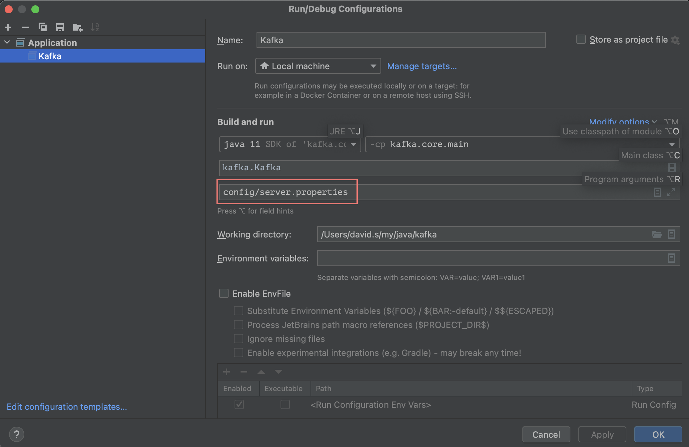

- [Abstract](#abstract)
- [Debug On IntelliJ](#debug-on-intellij)
- [Entry Point](#entry-point)
- [Process Incomming Message](#process-incomming-message)

----

# Abstract

[kafka src](https://github.com/apache/kafka) 를 분석한다.

# Debug On IntelliJ

IntelliJ 로 kafka 를 debugging 해보자. [Zookeeper](/zookeeper/README.md) Mode 로 실행한다.

```bash
$ git clone https://github.com/apache/kafka.git
# Open kafka
```

Download and run zookeeper. kafka src 에서 [Zookeeper](/zookeeper/README.md) 는 실행이 잘 안된다. Download 받고 하면 잘된다.

```bash
$ bin/zookeeper-server-start.sh config/zookeeper.properties
```

IntelliJ 의 configuration 을 다음과 같이 수정한다. debugging 시작.



```scala
// kafka/Kafka.scala
  def main(args: Array[String]): Unit = {
    try {
      val serverProps = getPropsFromArgs(args)
      val server = buildServer(serverProps)
```

# Entry Point

```scala
// kafka/Kafka.scala
  def main(args: Array[String]): Unit = {
    try {
      val serverProps = getPropsFromArgs(args)
      val server = buildServer(serverProps)

      try {
        if (!OperatingSystem.IS_WINDOWS && !Java.isIbmJdk)
          new LoggingSignalHandler().register()
      } catch {
        case e: ReflectiveOperationException =>
          warn("Failed to register optional signal handler that logs a message when the process is terminated " +
            s"by a signal. Reason for registration failure is: $e", e)
      }

      // attach shutdown handler to catch terminating signals as well as normal termination
      Exit.addShutdownHook("kafka-shutdown-hook", {
        try server.shutdown()
        catch {
          case _: Throwable =>
            fatal("Halting Kafka.")
            // Calling exit() can lead to deadlock as exit() can be called multiple times. Force exit.
            Exit.halt(1)
        }
      })

      try server.startup()
```

# Process Incomming Message

```java
// kafka/server/KafkaApis.scala
  /**
   * Top-level method that handles all requests and multiplexes to the right api
   */
  override def handle(request: RequestChannel.Request, requestLocal: RequestLocal): Unit = {
    def handleError(e: Throwable): Unit = {
      error(s"Unexpected error handling request ${request.requestDesc(true)} " +
        s"with context ${request.context}", e)
      requestHelper.handleError(request, e)
    }

    try {
      trace(s"Handling request:${request.requestDesc(true)} from connection ${request.context.connectionId};" +
        s"securityProtocol:${request.context.securityProtocol},principal:${request.context.principal}")

      if (!apiVersionManager.isApiEnabled(request.header.apiKey, request.header.apiVersion)) {
        // The socket server will reject APIs which are not exposed in this scope and close the connection
        // before handing them to the request handler, so this path should not be exercised in practice
        throw new IllegalStateException(s"API ${request.header.apiKey} with version ${request.header.apiVersion} is not enabled")
      }

      request.header.apiKey match {
        case ApiKeys.PRODUCE => handleProduceRequest(request, requestLocal)
        case ApiKeys.FETCH => handleFetchRequest(request)
        case ApiKeys.LIST_OFFSETS => handleListOffsetRequest(request)
        case ApiKeys.METADATA => handleTopicMetadataRequest(request)
        case ApiKeys.LEADER_AND_ISR => handleLeaderAndIsrRequest(request)
        case ApiKeys.STOP_REPLICA => handleStopReplicaRequest(request)
        case ApiKeys.UPDATE_METADATA => handleUpdateMetadataRequest(request, requestLocal)
        case ApiKeys.CONTROLLED_SHUTDOWN => handleControlledShutdownRequest(request)
        case ApiKeys.OFFSET_COMMIT => handleOffsetCommitRequest(request, requestLocal).exceptionally(handleError)
        case ApiKeys.OFFSET_FETCH => handleOffsetFetchRequest(request).exceptionally(handleError)
        case ApiKeys.FIND_COORDINATOR => handleFindCoordinatorRequest(request)
        case ApiKeys.JOIN_GROUP => handleJoinGroupRequest(request, requestLocal).exceptionally(handleError)
        case ApiKeys.HEARTBEAT => handleHeartbeatRequest(request).exceptionally(handleError)
        case ApiKeys.LEAVE_GROUP => handleLeaveGroupRequest(request).exceptionally(handleError)
        case ApiKeys.SYNC_GROUP => handleSyncGroupRequest(request, requestLocal).exceptionally(handleError)
        case ApiKeys.DESCRIBE_GROUPS => handleDescribeGroupsRequest(request).exceptionally(handleError)
        case ApiKeys.LIST_GROUPS => handleListGroupsRequest(request).exceptionally(handleError)
        case ApiKeys.SASL_HANDSHAKE => handleSaslHandshakeRequest(request)
        case ApiKeys.API_VERSIONS => handleApiVersionsRequest(request)
        case ApiKeys.CREATE_TOPICS => maybeForwardToController(request, handleCreateTopicsRequest)
        case ApiKeys.DELETE_TOPICS => maybeForwardToController(request, handleDeleteTopicsRequest)
        case ApiKeys.DELETE_RECORDS => handleDeleteRecordsRequest(request)
...
```
