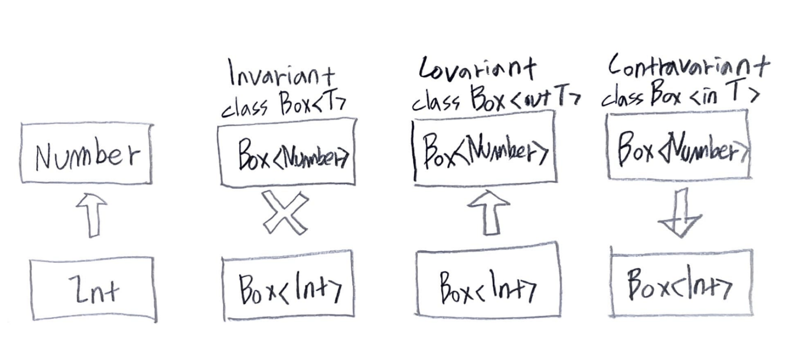
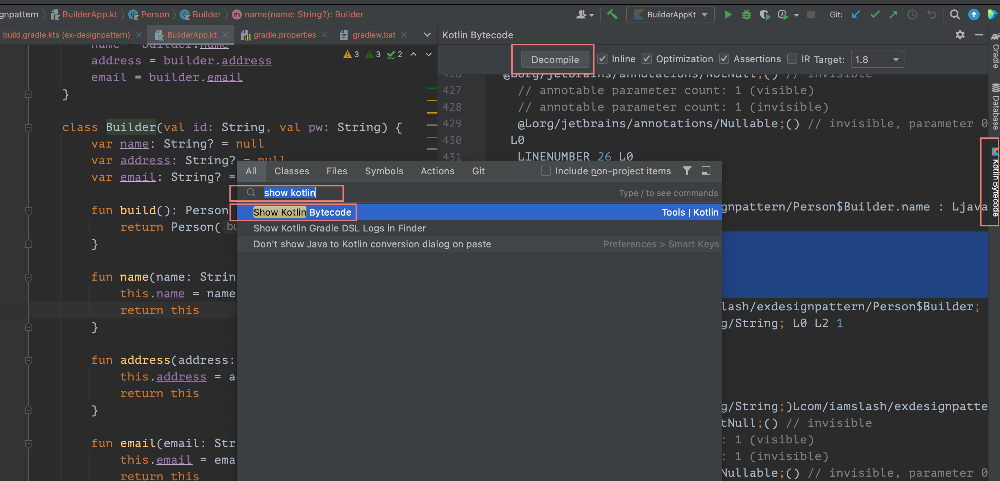

- [Abstract](#abstract)
- [References](#references)
- [Materials](#materials)
- [Install on windows 10](#install-on-windows-10)
- [Basic](#basic)
  - [Basic Syntax](#basic-syntax)
  - [Idioms](#idioms)
  - [Keywords](#keywords)
  - [Basic types](#basic-types)
  - [String](#string)
  - [min max values](#min-max-values)
  - [Null safety](#null-safety)
  - [Collections compared to c++](#collections-compared-to-c)
  - [Multi Dimensional Array](#multi-dimensional-array)
  - [Collections](#collections)
    - [List](#list)
    - [Set](#set)
    - [Map](#map)
    - [PriorityQueue](#priorityqueue)
    - [filter](#filter)
    - [map](#map-1)
    - [any, all, none](#any-all-none)
    - [find, findLast](#find-findlast)
    - [first, last](#first-last)
    - [count](#count)
    - [associateBy, groupBy](#associateby-groupby)
    - [partition](#partition)
    - [flatMap](#flatmap)
    - [minOrNull, maxOrNull](#minornull-maxornull)
    - [sorted](#sorted)
    - [Map Element Access](#map-element-access)
    - [zip](#zip)
    - [getOrElse](#getorelse)
  - [Scope Functions](#scope-functions)
    - [let](#let)
    - [run](#run)
    - [with](#with)
    - [apply](#apply)
    - [also](#also)
  - [Collection APIs](#collection-apis)
  - [Collection Conversions](#collection-conversions)
  - [Init Array](#init-array)
  - [Infix Functions](#infix-functions)
  - [Operator Functions](#operator-functions)
  - [Functions with vararg Parameters](#functions-with-vararg-parameters)
  - [Classes](#classes)
  - [Generics](#generics)
  - [Generics in,out,*](#generics-inout)
  - [Notation for platform types](#notation-for-platform-types)
  - [Inheritance](#inheritance)
  - [Control Flow](#control-flow)
    - [When](#when)
    - [Loops](#loops)
    - [Ranges](#ranges)
    - [Equality Checks](#equality-checks)
  - [Special Classes](#special-classes)
    - [Data Classes](#data-classes)
    - [Enum classes](#enum-classes)
    - [Sealed Classes](#sealed-classes)
    - [Object Keyword](#object-keyword)
  - [Functional](#functional)
    - [Higher-Order Functions](#higher-order-functions)
    - [Lambda Functions](#lambda-functions)
    - [Anonymous Functions](#anonymous-functions)
    - [Inline Functions](#inline-functions)
    - [Extension Functions and Properties](#extension-functions-and-properties)
  - [Delegation](#delegation)
    - [Delegation Pattern](#delegation-pattern)
    - [Delegated Properties](#delegated-properties)
  - [Lazy Initialization (lateinit vs by lazy)](#lazy-initialization-lateinit-vs-by-lazy)
  - [Sort](#sort)
  - [min max](#min-max)
  - [Formatted String](#formatted-string)
- [Advanced](#advanced)
  - [Show kotlin decompile](#show-kotlin-decompile)
  - [Smart casts](#smart-casts)
  - [Parameter vs Argument](#parameter-vs-argument)
  - [delegate pattern with by](#delegate-pattern-with-by)
  - [Passing trailing lambdas](#passing-trailing-lambdas)
  - [map vs flatmap](#map-vs-flatmap)
  - [fold](#fold)
  - [coroutine](#coroutine)
  - [Null safety](#null-safety-1)
  - [@JvmOverloads](#jvmoverloads)
  - [`@JvmStatic` vs Companion](#jvmstatic-vs-companion)
- [Effective Kotlin](#effective-kotlin)
- [Design Pattern](#design-pattern)
- [Coding Convention](#coding-convention)

----

# Abstract

kotlin 에 대해 정리한다. kotlin 은 종합백화점같다. 없는게 없다. Documentation,  [Coding conventions](https://kotlinlang.org/docs/coding-conventions.html), 
[Effective Kotlin](kotlin_effective.md), [Design Pattern](kotlin_design_pattern.md), [stdlib](kotlin_stdlib.md) 을 차례로 공부하자.

# References

* [Learning materials overview](https://kotlinlang.org/docs/learning-materials-overview.html)
  * [Basic Syntax @ Kotlin](https://kotlinlang.org/docs/reference/basic-syntax.html)
  * [Idioms @ kotlin](https://kotlinlang.org/docs/idioms.html)
  * [Kotlin Koans @ kotlin](https://kotlinlang.org/docs/koans.html)
  * [Kotlin by example @ kotlin](https://play.kotlinlang.org/byExample/overview?_gl=1*1ch7m8k*_ga*MTU0MzU1NjQ4My4xNjIyNTAwNzUy*_ga_J6T75801PF*MTYyMjUzMDg0OC4yLjEuMTYyMjUzMTg2NS4zMg..&_ga=2.220493660.593975675.1622500752-1543556483.1622500752)
  * [Kotlin books @ kotlin](https://kotlinlang.org/docs/books.html)
    * [Atomic Kotlin](https://www.atomickotlin.com/atomickotlin/)
  * [Kotlin hands-on tutorials @ kotlin](https://play.kotlinlang.org/hands-on/overview?_gl=1*1ch7m8k*_ga*MTU0MzU1NjQ4My4xNjIyNTAwNzUy*_ga_J6T75801PF*MTYyMjUzMDg0OC4yLjEuMTYyMjUzMTg2NS4zMg..&_ga=2.220493660.593975675.1622500752-1543556483.1622500752)
* [Kotlin Reference](https://kotlinlang.org/docs/reference/)
* [Effective Kotlin](https://kt.academy/book/effectivekotlin)
  * [Effective Kotlin @ amazon](https://www.amazon.com/Effective-Kotlin-practices-Marcin-Moskala/dp/8395452837)
  * [Moskala Marcin](https://marcinmoskala.com/#page-top)
* [The Joy of Kotlin](https://livebook.manning.com/book/the-joy-of-kotlin/about-this-book/8)
  * [src](https://github.com/pysaumont/fpinkotlin)
* [코틀린을 다루는 기술](http://www.yes24.com/Product/Goods/89564200)
  * [The Joy of Kotlin](https://livebook.manning.com/book/the-joy-of-kotlin/about-this-book/8) 의 한글 번역서
  * [src](https://github.com/gilbutITbook/080208)

# Materials

* [Kotlin Playground](https://play.kotlinlang.org/#eyJ2ZXJzaW9uIjoiMS40LjEwIiwicGxhdGZvcm0iOiJqYXZhIiwiYXJncyI6IiIsImpzQ29kZSI6IiIsIm5vbmVNYXJrZXJzIjp0cnVlLCJ0aGVtZSI6ImlkZWEiLCJjb2RlIjoiLyoqXG4gKiBZb3UgY2FuIGVkaXQsIHJ1biwgYW5kIHNoYXJlIHRoaXMgY29kZS4gXG4gKiBwbGF5LmtvdGxpbmxhbmcub3JnIFxuICovXG5cbmZ1biBtYWluKCkge1xuICAgIHByaW50bG4oXCJIZWxsbywgd29ybGQhISFcIilcbn0ifQ==)
* [Kotlin @ baeldung](https://www.baeldung.com/kotlin/)
  * [Kotlin Basics @ baeldung](https://www.baeldung.com/kotlin/category/kotlin)
  * [Collections @ baeldung](https://www.baeldung.com/kotlin/category/kotlin)
  * [Patterns @ baeldung](https://www.baeldung.com/kotlin/category/patterns)
* [Effective Kotlin 글 정리 내역 @ medium](https://taehwandev.medium.com/effective-kotlin-%EA%B8%80-%EC%A0%95%EB%A6%AC-%EB%82%B4%EC%97%AD-620d13946c81)

# Install on windows 10

* Install JDK 1.8.
* Install IntelliJ Community Edition.
* Register `C:\Program Files\JetBrains\IntelliJ IDEA Community Edition 2019.2.2\plugins\Kotlin\kotlinc\bin` to `Path`.

```bash
# kotlinc is alias of kotlinc-jvm
# build with kotlinc run with java
$ kotlinc a.kt -include-runtime -d a.jar
$ java -jar a.jar

# build with kotlinc run with kotlin
$ kotlinc a.kt
$ kotlin AKt
```

# Basic

## Basic Syntax

* [Basic syntax @ kotlin](https://kotlinlang.org/docs/basic-syntax.html)

## Idioms

* [Idioms @ kotlin](https://kotlinlang.org/docs/idioms.html)

## Keywords

* [Keywords and operators](https://kotlinlang.org/docs/keyword-reference.html#operators-and-special-symbols)

----

[Kotlin Keywords @ TIL](KotlinKeyword.md)

```java
// Hard keywords
//   always interpreted as keywords and cannot be used as identifiers
as        
as?
break
class
continue
do
else
false
for
fun

if
in
!in
interface
is
!is
null
object
package
return

super
this
throw
true
try
typealias
typeof
val
var
when
while
```

```java
// Soft keywords
//   can be used as identifiers in other contexts
by
catch
constructor
delegate
dynamic
field
file
finally
get
import
init
param
property
receiver
set
setparam
value
where

// Modifier keywords
//   modifier lists of declarations and can be used as identifiers in other contexts
actual
abstract
annotation
companion
const
crossinline
data
enum
expect
external
final
infix
inline
inner
internal
lateinit
noinline
open
operator
out
override
private
protected
public 
reified
sealed
suspend
tailrec
vararg

// Special keywords
//   are defined by the compiler in specific contexts and can be used as regular identifiers in other contexts
field
it

// Operators and special symbols
+, -, *, /, %
=
+=, -=, *=, /=, %=
++, --
&&, ||, !
==, !=
===, !==
<, >, <=, >=         comparison op
[, ]
!!                   non-null assertion op
?.
?:                   elvis op
::
..
:
?
->
@
;
$
_
```

## Basic types

* [Basic types](https://kotlinlang.org/docs/basic-types.html)

----

```kotlin
// Byte, Short, Int, Long
val one = 1 // Int
val threeBillion = 3000000000 // Long
val oneLong = 1L // Long
val oneByte: Byte = 1

// Float, Double
val pi = 3.14 // Double
// val one: Double = 1 // Error: type mismatch
val oneDouble = 1.0 // Double

val e = 2.7182818284 // Double
val eFloat = 2.7182818284f // Float, actual value is 2.7182817
```

## String

```kotlin
val sb: StringBuilder() = StringBuilder()
sb.append('a' + 1) // OK
sb.append(1 + 'a') // ERROR
```

## min max values

```kotlin
// int
println(Int.MIN_VALUE);
println(Int.MAX_VALUE);
println(Int.MIN_VALUE - 1);
println(Int.MAX_VALUE + 1);

// float
println(Float.MIN_VALUE);
println(Float.MAX_VALUE);
```

## Null safety

* [Null safety @ kotlin](https://kotlinlang.org/docs/null-safety.html#the-operator)

----

```kotlin
// safe call operator ?.
val b: String? = null
println(b?.length)

// Elivis operator ?: which looks like elvis' hair
val l: b?.length ?: -1

// not-null assertion operator !! 
// if b is null NPE will be thrown.
val l = b!!.length

// safe casts
val aInt: Int? = a as? Int

// filter not nullable elements
val nullablelist: List<Int?> = listOf(1, 2, null, 5)
val intList: List<Int> = nullableList.filterNotNull()
```

## Collections compared to c++

| c++                  | java                                   |
| :------------------- | :------------------------------------- |
| `if, else`           | `if, else`                             |
| `for, while`         | `for, while`                           |
| `array`              | `Collections.unmodifiableList`         |
| `vector`             | `java.util.Vector, java.util.ArrayList` |
| `deque`              | `java.util.Deque, java.util.ArrayDeque` |
| `forward_list`       | ``                                     |
| `list`               | `List, MutableList, java.util.LinkedList` |
| `stack`              | `java.util.Stack, java.util.Deque, java.util.ArrayDeque, java.util.LinkedList` |
| `queue`              | `java.util.Queue, java.util.LinkedList` |
| `priority_queue`     | `java.util.Queue, java.util.PriorityQueue` |
| `set`                | `java.util.SortedSet, java.util.TreeSet` |
| `multiset`           | ``                                     |
| `map`                | `java.util.SortedMap, java.util.TreeMap` |
| `multimap`           | ``                                     |
| `unordered_set`      | `Set, MutableSet, java.util.HashSet`  |
| `unordered_multiset` | ``                                     |
| `unordered_map`      | `Map, MutableMap, java.util.HashMap` |
| `unordered_multimap` | ``                                     |

## Multi Dimensional Array

* `Array<Int>` is same with `Integer[]` of java.
* `IntArray` is same with `int[]` of java.

```kotlin
    
    // 1d array
    val a = Array(3, {i -> 0})
    val b = Array(3, {0})
    val c = IntArray(3, {i -> 0})
    val d = IntArray(3, {0})
    val e = arrayOf(1, 2, 3)
    val f = intArrayOf(1, 2, 3)
    // late initialization
    val h = arrayOfNulls<Number>(3)
    for (i in h.indices) {
        h[i] = i * i
    }

    // 2d array
    val aa = Array(3, {Array(3, {i -> 0})})
    val bb = Array(3, {Array(3, {0})})
    val cc = Array(3, {IntArray(3, {i -> 0})})
    val dd = Array(3, {IntArray(3, {0})})
    val ee = Array(3, {arrayOf(1, 2, 3)})
    val ff = Array(3, {intArrayOf(1, 2, 3)})
    // late initialization
    val hh = Array(3, {arrayOfNulls<Number>(3)})
    for (i in hh.indices) {
        for (j in hh[0].indices) {
            hh[i][j] = i * j
        }
    }
    for (i in 0 until 3) {
        for (j in 0 until 3) {
            hh[i][j] = i * j
        }
    }

    // 3d array
    // thanks to type infer
    val aaa = Array(3, {Array(3, {Array(3, {i -> 0})})})
    val bbb = Array(3, {Array(3, {IntArray(3, {i -> 0})})})
```

## Collections


### List

* [Concepts.Standard Library.Collections.Overview](https://kotlinlang.org/docs/collections-overview.html)

-----

A **List** is an ordered collection of items. **List** is immutable, **MutableList** is mutable.

```kotlin
val systemUsers: MutableList<Int> = mutableListOf(1, 2, 3)        
val sudoers: List<Int> = systemUsers                              
fun addSystemUser(newUser: Int) {                 
    systemUsers.add(newUser)                      
}
fun getSysSudoers(): List<Int> {                  
    return sudoers
}
fun main() {
    addSystemUser(4)                               
    println("Tot sudoers: ${getSysSudoers().size}")
    getSysSudoers().forEach {                      
        i -> println("Some useful info on user $i")
    }
    // getSysSudoers().add(5) <- Error!            
}
```

### Set

* [Concepts.Standard Library.Collections.Overview](https://kotlinlang.org/docs/collections-overview.html)

----

A **set** is an unordered collection that does not support duplicates. **Set** is immutable, **MutableSet** is mutable.

```kotlin
val openIssues: MutableSet<String> = mutableSetOf("uniqueDescr1", "uniqueDescr2", "uniqueDescr3")
fun addIssue(uniqueDesc: String): Boolean {
    return openIssues.add(uniqueDesc)
}
fun getStatusLog(isAdded: Boolean): String {
    return if (isAdded) "registered correctly." else "marked as duplicate and rejected."
}
fun main() {
    val aNewIssue: String = "uniqueDescr4"
    val anIssueAlreadyIn: String = "uniqueDescr2" 

    println("Issue $aNewIssue ${getStatusLog(addIssue(aNewIssue))}")                              
    println("Issue $anIssueAlreadyIn ${getStatusLog(addIssue(anIssueAlreadyIn))}")                 
}
```

### Map

A map is a collection of key/value pairs. **Map** is immutable, **MutableMap** is mutable.

```kotlin
//
const val POINTS_X_PASS: Int = 15
val EZPassAccounts: MutableMap<Int, Int> = mutableMapOf(1 to 100, 2 to 100, 3 to 100)   
val EZPassReport: Map<Int, Int> = EZPassAccounts                                        
fun updatePointsCredit(accountId: Int) {
    if (EZPassAccounts.containsKey(accountId)) {                                        
        println("Updating $accountId...")                                               
        EZPassAccounts[accountId] = EZPassAccounts.getValue(accountId) + POINTS_X_PASS  
    } else {
        println("Error: Trying to update a non-existing account (id: $accountId)")
    } 
}
fun accountsReport() {
    println("EZ-Pass report:")
    EZPassReport.forEach {                                                              
        k, v -> println("ID $k: credit $v")
    }
}
fun main() {
    accountsReport()                                                                    
    updatePointsCredit(1)                                                               
    updatePointsCredit(1)                                                               
    updatePointsCredit(5)                                                                
    accountsReport()                                                                    
}

// immutable map
val map = mapOf("Vanilla" to 24)
assertEquals(24, map.get("Vanilla"))
assertEquals(24, map["Vanilla"])

// mutable map
val iceCreamSales = mutableMapOf<String, Int>()
iceCreamSales.put("Chocolate", 1)
iceCreamSales["Vanilla"] = 2
iceCreamSales.putAll(setOf("Strawberry" to 3, "Rocky Road" to 2))
iceCreamSales += mapOf("Maple Walnut" to 1, "Mint Chocolate" to 4)
val iceCreamSales = mutableMapOf("Chocolate" to 2)
iceCreamSales.merge("Chocolate", 1, Int::plus)
assertEquals(3, iceCreamSales["Chocolate"])

// Remove entries
val map = mutableMapOf("Chocolate" to 14, "Strawberry" to 9)
map.remove("Strawberry")
map -= "Chocolate"
assertNull(map["Strawberry"])
assertNull(map["Chocolate"])

// Filter
val inventory = mutableMapOf(
  "Vanilla" to 24,
  "Chocolate" to 14,
  "Strawberry" to 9,
)
val lotsLeft = inventory.filterValues { qty -> qty > 10 }
assertEquals(setOf("Vanilla", "Chocolate"), lotsLeft.keys)

// Mapping
val asStrings = inventory.map { (flavor, qty) -> "$qty tubs of $flavor" }
assertTrue(asStrings.containsAll(setOf("24 tubs of Vanilla", "14 tubs of Chocolate", "9 tubs of Strawberry")))
assertEquals(3, asStrings.size)

// forEach
val sales = mapOf("Vanilla" to 7, "Chocolate" to 4, "Strawberry" to 5)
val shipments = mapOf("Chocolate" to 3, "Strawberry" to 7, "Rocky Road" to 5)
with(inventory) {
    sales.forEach { merge(it.key, it.value, Int::minus) }
    shipments.forEach { merge(it.key, it.value, Int::plus) }
}
assertEquals(17, inventory["Vanilla"]) // 24 - 7 + 0
assertEquals(13, inventory["Chocolate"]) // 14 - 4 + 3
assertEquals(11, inventory["Strawberry"]) // 9 - 5 + 7
assertEquals(5, inventory["Rocky Road"]) // 0 - 0 + 5
```

### PriorityQueue

```kotlin
// IntArray PriorityQueue with comparator
val pq: PriorityQueue<IntArray> = PriorityQueue<IntArray>(0, { a, b -> b[0] - a[0] })
```

### filter

```kotlin
val numbers = listOf(1, -2, 3, -4, 5, -6)      
val positives = numbers.filter { x -> x > 0 }  
val negatives = numbers.filter { it < 0 }      
```

### map

```kotlin
val numbers = listOf(1, -2, 3, -4, 5, -6)     
val doubled = numbers.map { x -> x * 2 }      
val tripled = numbers.map { it * 3 }          
```

### any, all, none

```kotlin
// any
val numbers = listOf(1, -2, 3, -4, 5, -6)     
val anyNegative = numbers.any { it < 0 }      
val anyGT6 = numbers.any { it > 6 }         

// all
val numbers = listOf(1, -2, 3, -4, 5, -6)            
val allEven = numbers.all { it % 2 == 0 }            
val allLess6 = numbers.all { it < 6 }                

// none
val numbers = listOf(1, -2, 3, -4, 5, -6)            
val allEven = numbers.none { it % 2 == 1 }           
val allLess6 = numbers.none { it > 6 }               
```

### find, findLast

```kotlin
val words = listOf("Lets", "find", "something", "in", "collection", "somehow")
val first = words.find { it.startsWith("some") }
val last = words.findLast { it.startsWith("some") }
val nothing = words.find { it.contains("nothing") }
```

### first, last

```kotlin
// first, last
val numbers = listOf(1, -2, 3, -4, 5, -6)
val first = numbers.first()              
val last = numbers.last()                
val firstEven = numbers.first { it % 2 == 0 }
val lastOdd = numbers.last { it % 2 != 0 }

// first, last with null
val words = listOf("foo", "bar", "baz", "faz")         
val empty = emptyList<String>()                        
val first = empty.firstOrNull()                        
val last = empty.lastOrNull()                          
val firstF = words.firstOrNull { it.startsWith('f') }  
val firstZ = words.firstOrNull { it.startsWith('z') }  
val lastF = words.lastOrNull { it.endsWith('f') }      
val lastZ = words.lastOrNull { it.endsWith('z') }      
```

### count

```kotlin
val numbers = listOf(1, -2, 3, -4, 5, -6)            
val totalCount = numbers.count()                     
val evenCount = numbers.count { it % 2 == 0 }        
```

### associateBy, groupBy

* [associateBy @ kotlin](https://kotlinlang.org/api/latest/jvm/stdlib/kotlin.collections/associate-by.html)
* [groupBy @ kotlin](https://kotlinlang.org/api/latest/jvm/stdlib/kotlin.collections/group-by.html)

----

```kotlin
data class Person(val name: String, val city: String, val phone: String) 
val people = listOf(                                                     
    Person("John", "Boston", "+1-888-123456"),
    Person("Sarah", "Munich", "+49-777-789123"),
    Person("Svyatoslav", "Saint-Petersburg", "+7-999-456789"),
    Person("Vasilisa", "Saint-Petersburg", "+7-999-123456"))
val phoneBook = people.associateBy { it.phone }                // {phone: person}
val cityBook = people.associateBy(Person::phone, Person::city) // {phone: city}
val peopleCities = people.groupBy(Person::city, Person::name)  // {city: [name,...]}          
val lastPersonCity = people.associateBy(Person::city, Person::name) // {city, name}

```

### partition

```kotlin
val numbers = listOf(1, -2, 3, -4, 5, -6)                
// [[-2,-4,-6],[1,3,5]]
val evenOdd = numbers.partition { it % 2 == 0 }          
// Destructuring declaration
val (positives, negatives) = numbers.partition { it > 0 } 
```

### flatMap

```kotlin
val fruitsBag = listOf("apple","orange","banana","grapes")  
val clothesBag = listOf("shirts","pants","jeans")           
val cart = listOf(fruitsBag, clothesBag)                    
val mapBag = cart.map { it }                                
val flatMapBag = cart.flatMap { it }                        
```

### minOrNull, maxOrNull

```kotlin
val numbers = listOf(1, 2, 3)
val empty = emptyList<Int>()
val only = listOf(3)
println("Numbers: $numbers, min = ${numbers.minOrNull()} max = ${numbers.maxOrNull()}")
println("Empty: $empty, min = ${empty.minOrNull()}, max = ${empty.maxOrNull()}")
println("Only: $only, min = ${only.minOrNull()}, max = ${only.maxOrNull()}")
```

### sorted

```kotlin
val shuffled = listOf(5, 4, 2, 1, 3, -10)                   
val natural = shuffled.sorted()                             
val inverted = shuffled.sortedBy { -it }                    
val descending = shuffled.sortedDescending()                
val descendingBy = shuffled.sortedByDescending { abs(it)  } 
```

### Map Element Access

```kotlin
val map = mapOf("key" to 42)
val value1 = map["key"]                                     
val value2 = map["key2"]                                    
val value3: Int = map.getValue("key")                       
val mapWithDefault = map.withDefault { k -> k.length }
val value4 = mapWithDefault.getValue("key2")                
try {
    map.getValue("anotherKey")                              
} catch (e: NoSuchElementException) {
    println("Message: $e")
}
```

### zip

```kotlin
val A = listOf("a", "b", "c")                  
val B = listOf(1, 2, 3, 4)                     
val resultPairs = A zip B                      
val resultReduce = A.zip(B) { a, b -> "$a$b" } 
```

### getOrElse

```kotlin
val list = listOf(0, 10, 20)
println(list.getOrElse(1) { 42 })  // 42  
println(list.getOrElse(10) { 42 }) // 10

val map = mutableMapOf<String, Int?>()
println(map.getOrElse("x") { 1 })       
map["x"] = 3
println(map.getOrElse("x") { 1 })       
map["x"] = null
println(map.getOrElse("x") { 1 })       
```

## Scope Functions

Scope functions 는 code block 을 실행하는 함수이다.

### let

* [Concepts.Standard library.Scope functions.let](https://kotlinlang.org/docs/scope-functions.html#let)

-----

**let** executes the given block of code and returns the result of its last expression. The object is accessible inside the block by the reference **it** (by default) or a custom name.

```kotlin
val empty = "test".let {               
    customPrint(it)                    
    it.isEmpty()                       
}
println(" is empty: $empty")
fun printNonNull(str: String?) {
    println("Printing \"$str\":")

    str?.let {                         
        print("\t")
        customPrint(it)
        println()
    }
}
fun printIfBothNonNull(strOne: String?, strTwo: String?) {
    strOne?.let { firstString ->        
        strTwo?.let { secondString ->
            customPrint("$firstString : $secondString")
            println()
        }
    }
}
printNonNull(null)
printNonNull("my string") 
printIfBothNonNull("First","Second") 
```

### run

* [Concepts.Standard library.Scope functions.run](https://kotlinlang.org/docs/scope-functions.html#run)

-----
**let** is same with **run** but the difference is that inside run the object is accessed by **this**. 

```kotlin
fun getNullableLength(ns: String?) {
    println("for \"$ns\":")
    ns?.run {                                                  // 1
        println("\tis empty? " + isEmpty())                    // 2
        println("\tlength = $length")                           
        length                                                 // 3
    }
}
getNullableLength(null)
getNullableLength("")
getNullableLength("some string with Kotlin")
```

### with

* [Concepts.Standard library.Scope functions.with](https://kotlinlang.org/docs/scope-functions.html#with)

-----

**with** 의 argument 로 사용된 instance 의 member 를 간단히 접근할 때 사용한다.

```kotlin
with(configuration) {
    println("$host:$port")
}
// instead of:
println("${configuration.host}:${configuration.port}")  
```

### apply

* [Concepts.Standard library.Scope functions.apply](https://kotlinlang.org/docs/scope-functions.html#apply)

-----

**apply** executes a block of code on an object and returns the object itself. Inside the block, the object is referenced by **this**.

```kotlin
val jake = Person()
val stringDescription = jake.apply {
    name = "Jake"                   
    age = 30
    about = "Android developer"
}.toString()                        
```

### also

* [Concepts.Standard library.Scope functions.also](https://kotlinlang.org/docs/scope-functions.html#also)

-----

**also** works like apply: it executes a given block and returns the object called. Inside the block, the object is referenced by **it**

```kotlin
val jake = Person("Jake", 30, "Android developer")   
    .also {                                           
        writeCreationLog(it)                         
    }
```

## Collection APIs

* [Collections @ kotlin Koans](https://play.kotlinlang.org/koans/Collections/Introduction/Task.kt)
* [Collection @ kotlin](https://kotlinlang.org/api/latest/jvm/stdlib/kotlin.collections/-collection/#kotlin.collections.Collection)

----

kotlin 은 [functional programming](/fp/REAME.md) 의 function combinator 를 통해 간결한 coding 을 할 수 있다.

```kt
// Shop.kt
data class Shop(val name: String, val customers: List<Customer>)
data class Customer(val name: String, val city: City, val orders: List<Order>) {
  override fun toString() = "${name} from ${city.name}"
}
data class Order(val products: List<Product>, val isDelivered: Boolean)
data class Product(val name: String, val price: Double) {
  override fun toString() = "'${name}' for ${price}"
}
data class city(val name: String) {
  override fun toString() = name
}

// Make set
fun Shop.getSetOfCustomers(): Set<Customer> = customers.toSet()

// Sort
fun Shop.getCustomersSortedByNumberOfOrders(): List<Customer> = customers.sortedBy { it.orders.size }

// Filter  map
fun Shop.getCitiesCustomersAreFrom(): Set<City> = customers.map { it.city }.toSet()
fun Shop.getCustomersFrom(city: City): List<Customer> = cusotmers.filter { it.city == city }

var l = listOf(1, 2, 3, 4, 5)
// sortedBy
l.sortedBy { it * -1 }.forEach { println(it) }
l.sortedByDescending { it * -1 }.forEach { println(it) }
// sortedWith
l.sortedWith(Comparator<Int>{ a, b ->
    when {
        a < b -> -1
        a > b -> 1
        else -> 0
    }
}).forEach { println(it) }

// map, flatMap
l.map { it * it }.forEach { println(it) }
l.flatMap { listOf(it, it) }.forEach { println(it) }

// All Any and other predicates
println(l.all { it > 0 })  // false
println(l.any { it > 0 })  // true

// Max min
println(l.maxOrNull())
println(l.maxByOrNull { it * -1})

// Sum
println(l.sum())

// Associate
l.associate { Pair(it, it * it) }.forEach { t, u -> println("${t}: ${u}") }
l.associateBy { it * it }.forEach { t, u -> println("${t}: ${u}")}
l.associateWith { it * it}.forEach { t, u -> println("${t}: ${u}")}

// GroupBy
l.groupBy { it % 2 }.forEach { (t, u) -> println("key: ${t}"); u.forEach { println(it)} }

// Partition
l.partition { (it % 2) == 0 }.first.forEach { println(it) }

// Fold
println(l.fold(0) { a, b -> a + b })

// Compound tasks
var customer = Customer("John", City("Seoul"), listOf())
println(customer
        .orders
        .filter(Order::isDelivered)
        .flatMap(Order::products)
        .maxBy(Product::price))
val customers = listOf(Customer("John", City("Seoul"), listOf()),
        Customer("Michael", City("Busan"), listOf()))

// Sequences
println(listOf(1, 2, 3, 4)
        .map { it * it }
        .find { it > 3 })
println(listOf(1, 2, 3, 4)
        .asSequence()
        .map { it * it }
        .find { it > 3 })

// Getting used to new style
```

## Collection Conversions

WIP

## Init Array

* [Initializing Arrays in Kotlin](https://www.baeldung.com/kotlin/initialize-array)

----

```kt
// String array
val strings = arrayOf("January", "February", "March")
// Primitive array
val integers = intArrayOf(1, 2, 3, 4)
// Late Initialize. the array is initialized with nulls
val array = arrayOfNulls<Number>(5)
for (i in array.indices) {
    array[i] = i * i
}
// Generate values with indices
val generatedArray = IntArray(10) { i -> i * i }
val generatedStringArray = Array(10) { i -> "Number of index: $i"  }
```

## Infix Functions

* [Concepts.functions.Functions.Functions usage.infix notation](https://kotlinlang.org/docs/functions.html#infix-notation)

-----

하나의 parameter 를 갖는 member functions, extensions 을 `infix` 를 이용하여 정의하면  infix function 으로 사용할 수 있다.

```kotlin
fun main() {

  infix fun Int.times(str: String) = str.repeat(this)        
  println(2 times "Bye ")                                    

  val pair = "Ferrari" to "Katrina"                          
  println(pair)

  infix fun String.onto(other: String) = Pair(this, other)   
  val myPair = "McLaren" onto "Lucas"
  println(myPair)

  val sophia = Person("Sophia")
  val claudia = Person("Claudia")
  sophia likes claudia                                       
}

class Person(val name: String) {
  val likedPeople = mutableListOf<Person>()
  infix fun likes(other: Person) { likedPeople.add(other) }  
}
```

## Operator Functions

* [concepts.DSL.Operator overloading](https://kotlinlang.org/docs/operator-overloading.html)

-----

Unity operations, Binary opertaions 들을 functions 으로 overloading 할 수 있다. overloading 은 function 의 이름은 같고 protoype 을 다르게 해서 정의하는 것이다.

```kotlin
operator fun Int.times(str: String) = str.repeat(this)       // 1
println(2 * "Bye ")                                          // 2

operator fun String.get(range: IntRange) = substring(range)  // 3
val str = "Always forgive your enemies; nothing annoys them so much."
println(str[0..14])
```

## Functions with vararg Parameters

* [Concepts.functions.Functions.Functions usage.Variable number of arguments (Varargs)](https://kotlinlang.org/docs/functions.html#variable-number-of-arguments-varargs)

----

```kotlin
fun printAll(vararg messages: String) {                           
    for (m in messages) {
        println(m)
    }
}
printAll("Hello", "Hallo", "Salut", "Hola", "你好")               

fun printAllWithPrefix(vararg messages: String, prefix: String) { 
    for (m in messages) {
        println(prefix + m)
    }
}
printAllWithPrefix(
    "Hello", "Hallo", "Salut", "Hola", "你好",
    prefix = "Greeting: "                                          
)

fun log(vararg entries: String) {
    printAll(*entries)
}
```

## Classes

* [Concepts.Classes and objects.Classes](https://kotlinlang.org/docs/classes.html#classes)

-----

Class 는 name, header, body 로 구성된다. header 는 properties, primary constructor 를 의미한다. body 는 curly braces 로 둘러쌓인다. header, body 는 생략할 수 있다. body 의 내용이 없다면 curly braces 도 생략할 수 있다.

```kotlin
class Customer                           

// Declares a class with two properties: immutable id and mutable email
// and a constructor with two parameters id and email.
class Contact(val id: Int, var email: String) 

fun main() {

    val customer = Customer()    
    val contact = Contact(1, "foo@gmail.com")
    println(contact.id)                       
    contact.email = "iamslash@gmail.com"          
}
```

## Generics

* [Concepts.Classes and objects.Generics: in, out, where](https://kotlinlang.org/docs/generics.html)

-----

Generic classes, functions 를 이용하면 특정 type 에 종속적이지 않는 code 를
만들어 낼 수 있다.

```kotlin
// Generic classes
class MutableStack<E>(vararg items: E) {              

  private val elements = items.toMutableList()
  fun push(element: E) = elements.add(element)        
  fun peek(): E = elements.last()                     
  fun pop(): E = elements.removeAt(elements.size - 1)
  fun isEmpty() = elements.isEmpty()
  fun size() = elements.size
  override fun toString() = "MutableStack(${elements.joinToString()})"
}

// Generic functions
fun <E> mutableStackOf(vararg elements: E) = MutableStack(*elements)
fun main() {
  val stack = mutableStackOf(0.62, 3.14, 2.7)
  println(stack)
}
```

## Generics in,out,*

* [[Kotlin] in/out 키워드 및 .. 연산자와 범위 표현식](https://csjung.tistory.com/239)

----

variance 는 invariant, covariant, contravariant 가 있다. 다음의
그림을 참고하여 이해하자.



* `Int` 는 `Number` 의 자식이다. `Int` instance 는 `Number` 로 casting 이 가능하다.
* `class Box<T>` 로 선언했다. `Box<Number>` instance 는 `Box<Int>` 로 casting 될
  수 없다. 반대도 불가하다. 둘은 전혀 관계가 없다. 이 것을 invariant(불공변성) 라고 한다.
* `class Box<out T>` 로 선언했다. `Box<Int>` instance 는 `Box<Number>` 로 casting 될
  수 있다. 즉, up-casting 이 가능하다. 이 것을 covariant(공변성) 라고 한다.
* `class Box<in T>` 로 선언했다. `Box<Number>` instance 는 `Box<Int>` 로 casting 될
  수 있다. 즉, down-casting 이 가능하다. 이 것을 contravariant(반공변성) 라고 한다.

이 것을 다음과 같이 정리할 수도 있다.

* `Nothing` : no-casting, invariant
* `in`: down-casting, contravariant
* `out`: up-casting, covariant
* `*`: any-casting

```kotlin
class Bar<in T>
class Foo<out T>
class Baz<T>

fun main(args: Array<String>) {
    // in, down-casting, contravariant
    val barSuper = Bar<Any>()
    val barSub: Bar<Int> = barSuper

    // out, up-casting, covariant
    val fooSub = Foo<Int>()
    val fooSuper: Foo<Any> = fooSub

    // *, any-casting
    val star: Foo<*> = fooSub
}
```

Kotlin 함수 타입의 파라미터 타입은 `contravariant (down-casting)` 이다. 모든 리턴타칩은 `covariant (up-casting)` 이다. 

## Notation for platform types

* [Notation for platform types](https://kotlinlang.org/docs/java-interop.html#notation-for-platform-types)

-----

* `T! means "T or T?"`
  * `(Mutable)Collection<T>! means "Java collection of T may be mutable or not, may be nullable or not"`
  * `Array<(out) T>! means "Java array of T (or a subtype of T), nullable or not"`

## Inheritance

open class 는 subclassing 할 수 있다. open fun 은 override 할 수 있다.

```kotlin
open class Dog {                
    open fun sayHello() {       
        println("wow wow!")
    }
}
class Yorkshire : Dog() {       
    override fun sayHello() {   
        println("wif wif!")
    }
}
fun main() {
    val dog: Dog = Yorkshire()
    dog.sayHello()
}

// Inheritance with Parameterized Constructor
open class Tiger(val origin: String) {
    fun sayHello() {
        println("A tiger from $origin says: grrhhh!")
    }
}
class SiberianTiger : Tiger("Siberia")
fun main() {
    val tiger: Tiger = SiberianTiger()
    tiger.sayHello()
}

// Passing Constructor Arguments to Superclass
open class Lion(val name: String, val origin: String) {
    fun sayHello() {
        println("$name, the lion from $origin says: graoh!")
    }
}
class Asiatic(name: String) : Lion(name = name, origin = "India") 
fun main() {
    val lion: Lion = Asiatic("Rufo")                              
    lion.sayHello()
}
```

## Control Flow

### When

```kotlin
fun main() {
    cases("Hello")
    cases(1)
    cases(0L)
    cases(MyClass())
    cases("hello")
}
fun cases(obj: Any) {                                
    when (obj) {                                      
        1 -> println("One")                          
        "Hello" -> println("Greeting")               
        is Long -> println("Long")                   
        !is String -> println("Not a string")        
        else -> println("Unknown")                   
    }   
}
class MyClass

fun main() {
    println(whenAssign("Hello"))
    println(whenAssign(3.4))
    println(whenAssign(1))
    println(whenAssign(MyClass()))
}

fun whenAssign(obj: Any): Any {
    val result = when (obj) {                  
        1 -> "one"                              
        "Hello" -> 1                            
        is Long -> false                        
        else -> 42                              
    }
    return result
}

class MyClass
```

### Loops

```kotlin
// for
val cakes = listOf("carrot", "cheese", "chocolate")
for (cake in cakes) {                               
    println("Yummy, it's a $cake cake!")
}

// while, do-while
fun eatACake() = println("Eat a Cake")
fun bakeACake() = println("Bake a Cake")
fun main(args: Array<String>) {
    var cakesEaten = 0
    var cakesBaked = 0
    while (cakesEaten < 5) {                    
        eatACake()
        cakesEaten ++
    }
    do {                                        
        bakeACake()
        cakesBaked++
    } while (cakesBaked < cakesEaten)
}

// iterators
class Animal(val name: String)
class Zoo(val animals: List<Animal>) {
    operator fun iterator(): Iterator<Animal> {             
        return animals.iterator()                           
    }
}
fun main() {
    val zoo = Zoo(listOf(Animal("zebra"), Animal("lion")))
    for (animal in zoo) {                                   
        println("Watch out, it's a ${animal.name}")
    }
}
```

### Ranges

```kotlin
// int ranges
for (i in 0..3) {  // Output: 0 1 2 3             
    print("$i ")
}
println()
for (i in 0 until 3) {  // Output: 0 1 2
    print("$i ")
}
println()
for(i in 2..8 step 2) { // Output: 2 4 6 8 
    print("$i ")
}
println()
for (i in 3 downTo 0) { // Output: 3 2 1 0
    print("$i ")
}
println()

// char ranges
for (c in 'a'..'d') {
    print(c)
}
print(" ")
for (c in 'z' downTo 's' step 2) { 
    print(c)
}
print(" ")

// ranges with if statements
val x = 2
if (x in 1..5) {            
    print("x is in range from 1 to 5")
}
println()
if (x !in 6..10) {          
    print("x is not in range from 6 to 10")
}
```

### Equality Checks

* `==` for structural comparison
  * `if (a == null) b == null else a.equals(b)`
* `===` for referential comparison

```kotlin
val authors = setOf("Shakespeare", "Hemingway", "Twain")
val writers = setOf("Twain", "Shakespeare", "Hemingway")
println(authors == writers)   // true
println(authors === writers)  // false
```

## Special Classes

### Data Classes

* [Data classes](https://kotlinlang.org/docs/data-classes.html)

-----

```kotlin
data class User(val name: String, val id: Int) {           
    override fun equals(other: Any?) =
        other is User && other.id == this.id               
}
fun main() {
    val user = User("Alex", 1)
    println(user)                                          

    val secondUser = User("Alex", 1)
    val thirdUser = User("Max", 2)

    println("user == secondUser: ${user == secondUser}")   
    println("user == thirdUser: ${user == thirdUser}")

    // hashCode() function
    println(user.hashCode())                               
    println(secondUser.hashCode())
    println(thirdUser.hashCode())

    // copy() function
    println(user.copy())                                   
    println(user === user.copy())                          
    println(user.copy("Max"))                              
    println(user.copy(id = 3))                             

    println("name = ${user.component1()}")                 
    println("id = ${user.component2()}")
}
```

### Enum classes

* [Enum classes](https://kotlinlang.org/docs/reference/enum-classes.html)

----

```kotlin
enum class State {
    IDLE, RUNNING, FINISHED                           
}
fun main() {
    val state = State.RUNNING                         
    val message = when (state) {                      
        State.IDLE -> "It's idle"
        State.RUNNING -> "It's running"
        State.FINISHED -> "It's finished"
    }
    println(message)
}

enum class Color(val rgb: Int) {                      
    RED(0xFF0000),                                    
    GREEN(0x00FF00),
    BLUE(0x0000FF),
    YELLOW(0xFFFF00);

    fun containsRed() = (this.rgb and 0xFF0000 != 0)
}
fun main() {
    val red = Color.RED
    println(red)                                      
    println(red.containsRed())                        
    println(Color.BLUE.containsRed())                 
    println(Color.YELLOW.containsRed())               
}
```

### Sealed Classes

* [Concepts.Classes and objects.Sealed classes](https://kotlinlang.org/docs/sealed-classes.html)

----

`sealed class` 는 같은 file 이 아니면 inheritance 할 수 없다.

```kotlin
sealed class Mammal(val name: String)                                                   
class Cat(val catName: String) : Mammal(catName)                                        
class Human(val humanName: String, val job: String) : Mammal(humanName)
fun greetMammal(mammal: Mammal): String {
    when (mammal) {                                                                     
        is Human -> return "Hello ${mammal.name}; You're working as a ${mammal.job}"    
        is Cat -> return "Hello ${mammal.name}"                                              
    }                                                                                   
}
fun main() {
    println(greetMammal(Cat("Snowy")))
}
```

### Object Keyword

* [Concepts.Classes and objects.Object expressions and declarations](https://kotlinlang.org/docs/object-declarations.html)

-----

`object` 는 lazy single ton instance 를 생성한다.

```kotlin
// traditional ways of classes, objects
import java.util.Random
class LuckDispatcher {                  
    fun getNumber() {                    
        var objRandom = Random()
        println(objRandom.nextInt(90))
    }
}
fun main() {
    val d1 = LuckDispatcher()             
    val d2 = LuckDispatcher()
    
    d1.getNumber()                        
    d2.getNumber()
}

// object expression is similar with anonymous class instance of java
fun rentPrice(standardDays: Int, festivityDays: Int, specialDays: Int): Unit {  
    val dayRates = object {                                                     
        var standard: Int = 30 * standardDays
        var festivity: Int = 50 * festivityDays
        var special: Int = 100 * specialDays
    }
    val total = dayRates.standard + dayRates.festivity + dayRates.special
    print("Total price: $$total")
}
fun main() {
    rentPrice(10, 2, 1)
}

// object declaration
object DoAuth {                                                 
    fun takeParams(username: String, password: String) {         
        println("input Auth parameters = $username:$password")
    }
}
fun main(){
    DoAuth.takeParams("foo", "qwerty")                          
}

// Companion Objects
// it's similar to the static methods in Java
// If you plan to use a companion object in Kotlin, 
// consider using a package-level function instead.
class BigBen {                                  
    companion object Bonger {                   
        fun getBongs(nTimes: Int) {             
            for (i in 1 .. nTimes) {
                print("BONG ")
            }
        }
    }
}
fun main() {
    BigBen.getBongs(12) 
}
```

## Functional

### Higher-Order Functions

* [Concepts.Functions.High-order functions and lambdas](https://kotlinlang.org/docs/lambdas.html)

----

higer-order function 은 다른 function 을 argument 로 받거나 다른 function 을 리턴하는 함수이다.

```kotlin
// Taking Functions as Parameters
fun calculate(x: Int, y: Int, operation: (Int, Int) -> Int): Int {
    return operation(x, y)
}
fun sum(x: Int, y: Int) = x + y                          
fun main() {
    val sumResult = calculate(4, 5, ::sum)
    val mulResult = calculate(4, 5) { a, b -> a * b }               
    println("sumResult $sumResult, mulResult $mulResult")
}

// Returning Functions
fun operation(): (Int) -> Int {
    return ::square
}
fun square(x: Int) = x * x
fun main() {
    val func = operation()
    println(func(2))
}
```

### Lambda Functions

* [Concepts.Functions.High-order functions and lambdas](https://kotlinlang.org/docs/lambdas.html)

-----

lambda function 은 **type inference** 와 **it** 덕분에 다양한 방법으로 간결히 표현할 수 있다.

```kotlin
val upperCase1: (String) -> String = { str: String -> str.toUpperCase() } 
val upperCase2: (String) -> String = { str -> str.toUpperCase() }         
val upperCase3 = { str: String -> str.toUpperCase() }
// val upperCase4 = { str -> str.toUpperCase() }
val upperCase5: (String) -> String = { it.toUpperCase() }
val upperCase6: (String) -> String = String::toUpperCase
println(upperCase1("hello"))
println(upperCase2("hello"))
println(upperCase3("hello"))
println(upperCase5("hello"))
println(upperCase6("hello"))
```

### Anonymous Functions

* [Lambdas | Anonymous functions @ kotlin.io](https://kotlinlang.org/docs/lambdas.html#anonymous-functions)

Anonymous Function 은 return type 표기가 가능하다. 한편 Lambda 는 return type 을 표기할 수 없다.

```kotlin
val a = { x: Int, y: Int -> x + y }
val b = fun(x: Int, y: Int) -> Int {
    return x + y
}
```

### Inline Functions

> [[Kotlin] inline에 대하여 - inline, noinline, crossinline, reified](https://leveloper.tistory.com/171)

----

함수를 인자로 받는 함수를 Higher-order function 이라고 한다. Higher-order
function 은 runtime 에 희생이 따른다. 인자로 넘겨받는 함수때문에 Function
interface object 를 생성하고 closure 도 캡처한다. runtime 에 memory 를 많이
사용한다. closure 는 function body 에서 접근하는 function body 밖의 변수를
말한다. 

이때 Higher-order function 에 inline 을 추가하면 runtime overhead 를 제거할 수 있다. 

```kotlin
inline fun <T> lock(lock: Lock, body: () -> T): T { ... }

l.lock()
try {
    foo()
} finally {
    l.unlock()
}
```

만약 inline function 의 function argument 중 inline 을 원하지 않는 function argument 가 있다면 **noinline** 을 사용하자.

```kotlin
inline fun foo(inlined: () -> Unit, noinline notInlined: () -> Unit) { ... }
```

한편 inline function 의 function argument 를 inline function body 안의 local object 혹은 nested function 에서 호출하는 것은 허락되지 않는다. crossline 을 사용하면 허락된다.

```kotlin
inline fun f(crossline body: () -> Unit) {
    val g = object: Runnable {
        override fun run() = body()
    }
}
```

또한 type parameter 를 inline function body 에서 사용하고 싶다면 type parameter 에 **reified** 를 추가한다.

```kotlin
// clazz 는 굳이 필요하지 않다.
fun <T> TreeNode.findParentOfType(clazz: Class<T>): T? {
    var p = parent
    while (p != null && !clazz.isInstance(p)) {
        p = p.parent
    }
    @Suppress("UNCHECKED_CAST")
    return p as T?
}

// 이렇게 호출해야 한다.
treeNode.findParentOfType(MyTreeNode::class.java)

// 이렇게 호출하고 싶다. type parameter 를 이용해서 findParentOfType 을 
// refactoring 해보자. 
treeNode.findParentOfType<MyTreeNode>()

// T 에 reified 를 추가해야 한다.
inline fun <reified T> TreeNode.findParentOfType(): T? {
    var p = parent
    while (p != null && p !is T) {
        p = p.parent
    }
    return p as T?
}

// 이번에는 type paremeter T 를 이용하여 reflection 해보자.
inline fun <reified T> membersOf() = T::class.members

fun main(s: Array<String>) {
    println(membersOf<StringBuilder>().joinToString("\n"))
}
```

### Extension Functions and Properties

* [Concepts.Functions.Extensions](https://kotlinlang.org/docs/extensions.html)

-----

임의의 class 에 extension function 혹은 extension property 를 추가할 수 있다. 

```kotlin
data class Item(val name: String, val price: Float)                                         
data class Order(val items: Collection<Item>)  
// extension functions
fun Order.maxPricedItemValue(): Float = this.items.maxByOrNull { it.price }?.price ?: 0F 
fun Order.maxPricedItemName() = this.items.maxByOrNull { it.price }?.name ?: "NO_PRODUCTS"
// extension properties
val Order.commaDelimitedItemNames: String
    get() = items.map { it.name }.joinToString()
fun main() {
    val order = Order(listOf(Item("Bread", 25.0F), Item("Wine", 29.0F), Item("Water", 12.0F)))
    println("Max priced item name: ${order.maxPricedItemName()}")
    println("Max priced item value: ${order.maxPricedItemValue()}")
    println("Items: ${order.commaDelimitedItemNames}")
}
```

## Delegation

### Delegation Pattern

* [Concepts.Classes and objects.Delegation](https://kotlinlang.org/docs/delegation.html)

----

임의의 class 에 `by` 로 `delegate class` 를 선언한다. 그 class 의 function 을 호출하면 delegate object 의 
function 을 호출한다.

```kotlin
interface SoundBehavior {                                                          // 1
    fun makeSound()
}
class ScreamBehavior(val n:String): SoundBehavior {                                // 2
    override fun makeSound() = println("${n.toUpperCase()} !!!")
}
class RockAndRollBehavior(val n:String): SoundBehavior {                           // 2
    override fun makeSound() = println("I'm The King of Rock 'N' Roll: $n")
}

// Tom Araya is the "singer" of Slayer
class TomAraya(n:String): SoundBehavior by ScreamBehavior(n)                       // 3
// You should know ;)
class ElvisPresley(n:String): SoundBehavior by RockAndRollBehavior(n)              // 3
fun main() {
    val tomAraya = TomAraya("Thrash Metal")
    tomAraya.makeSound() // ScreamBehavior object 의 makeSound() 를 호출한다.          // 4
    val elvisPresley = ElvisPresley("Dancin' to the Jailhouse Rock.")
    elvisPresley.makeSound() // RockAndRollBehavior object 의 makeSound() 호출한다.
}
```

### Delegated Properties

* [Concepts.Classes and objects.Delegated properties](https://kotlinlang.org/docs/delegated-properties.html)

-----

`property` 에 `by` 와 `delegate class` 를 선언한다. `val property` 의 경우 `getValue()` 가 호출되면 `delegate object` 의 `getValue()` 가 호출된다. `var property` 의 경우 `getValue(), setValue()` 가 호출되면 `delegate object` 의 `getValue(), setValue()` 가 호출된다.

```kotlin
// deletegated properties
import kotlin.reflect.KProperty
class Example {
    var p: String by Delegate()                                               // 1
    override fun toString() = "Example Class"
}
class Delegate() {
    operator fun getValue(thisRef: Any?, prop: KProperty<*>): String {        // 2     
        return "$thisRef, thank you for delegating '${prop.name}' to me!"
    }
    operator fun setValue(thisRef: Any?, prop: KProperty<*>, value: String) { // 2
        println("$value has been assigned to ${prop.name} in $thisRef")
    }
}
fun main() {
    val e = Example()
    println(e.p)
    e.p = "NEW"
}

// Standard delegates
// lazy is delegates from the standard library
class LazySample {
    init {
      println("created!")
    }
    val lazyStr: String by lazy {
        println("computed!")          
        "my lazy"
    }
}
fun main() {
    val sample = LazySample()         
    println("lazyStr = ${sample.lazyStr}")
    println(" = ${sample.lazyStr}")  
}

// Property delegation can be used for storing properties in a map. 
// This is handy for tasks like parsing JSON or doing other "dynamic" stuff.
class User(val map: Map<String, Any?>) {
    val name: String by map                
    val age:  Int    by map                
}
fun main() {
    val user = User(mapOf(
            "name" to "John Doe",
            "age"  to 25
    ))
    println("name = ${user.name}, age = ${user.age}")
}
```

## Lazy Initialization (lateinit vs by lazy)

```kotlin
// lateinit: Init later
//   var 에만 사용
//   null 값으로 초기화 할 수 없다.
//   초기화 전에는 변수를 사용할 수 없다.
//   Int, Long, Double, Float 에는 사용할 수 없다. 
lateinit var p: String
p = "Hello"

// by lazy: Init just once
//   val 에만 사용. 그래서 한번 초기화하면 다시 저장할 수 없다.
val q: String by lazy {
    "World"
}
println(p)  // 초기화
println(q)  
```

* `lateinit` 은 초기화 이후 값이 변할 수 있는 변수 에 사용한다. 
* `by lazy` 는 초기화 이후 읽기만 할 변수에 사용한다.

## Sort

* [Guide to Sorting in Kotlin @ baeldung](https://www.baeldung.com/kotlin/sort)
* [Kotlin sortedWith syntax and lambda examples](https://alvinalexander.com/source-code-kotlin-sortedWith-syntax-lambda-examples/)

-----

```kt
// Sort primitive array
val integers = intArrayOf(1, 2, 3, 4)
integers.sort()
integers.sortDescending()

// Sort with comparator
val list = listOf(7,3,5,9,1,3)
list.sortedWith(Comparator<Int>{ a, b ->
    when {
        a > b -> 1
        a < b -> -1
        else -> 0
    }
})
// list: [1, 3, 3, 5, 7, 9]

// Sort string
val names = listOf("kim", "julia", "jim", "hala")
names.sortedWith(Comparator<String>{ a, b ->
    when {
        a > b -> 1
        a < b -> -1
        else -> 0
    }
})
// names: [hala, jim, julia, kim]
// Sort string by length
names.sortedWith(Comparator<String>{ a, b ->
    when {
        a.length > b.length -> 1
        a.length < b.length -> -1
        else -> 0
    }
})
// names: [kim, jim, hala, julia]
```

## min max

* [Kotlin pi, 절댓값, 대소 비교 - PI, abs, max, min](https://notepad96.tistory.com/entry/Kotlin-pi-%EC%A0%88%EB%8C%93%EA%B0%92-%EB%8C%80%EC%86%8C-%EB%B9%84%EA%B5%90-PI-abs-max-min)

----

```kt
import kotlin.math.*

fun main(args : Array<String>) {
    var a = 10
    var b = 30
    var c = 40
    println("max val is ${max(a, b)}")    // kotlin.math.max
    println("min val is ${min(c, b)}")   // kotlin.math.min
}
```

## Formatted String

```kt
val pi = 3.14159265358979323
val fi = "pi = %.2f".format(pi)

println("pi is ${pi}")
println("fi is ${fi}")
```

# Advanced

## Show kotlin decompile

kotlin 의 code 를 java 의 code 로 transpile 해보는 습관을 갖자. kotlin syntax 를 보다 명확히 이해할 수 있다. 



## Smart casts

다음과 같이 type 을 check 하고 나서 그 type 으로 casting 되는 것을 [Smart
casts](https://kotlinlang.org/docs/typecasts.html#smart-casts) 이라고 한다.
주로 `if, when` 에서 가능함.

```kotlin
// smart casts in if
fun demo(x: Any) {
    if (x is String) {
        print(x.length) // x is automatically cast to String
    }
}
// smart casts in when
when (x) {
    is Int -> print(x + 1)
    is String -> print(x.length + 1)
    is IntArray -> print(x.sum())
}
```

## Parameter vs Argument

**parameter** 는 함수로 전달되는 입력의 변수이름이다. **argument** 는 실제로 전달되는
값이다. 

예를 들어 다음의 경우 `length` 가 **parameter** 이고 `10` 이 **argument** 이다.

```kotlin
fun randomString(length: Int): String {
    //...
}
randomString(10)
```

다음과 같이 generic 의 경우 `T` 가 **type parameter** 이고 `String` 이
**type argument** 이다.

```kotlin
inline fun <reified T> printName() {
    print(T::class.simpleName)
}
fun main() {
    printName<String>()  // Output: String
}
```

## delegate pattern with by

* [Kotlin - by로 Delegate Pattern 쉽게 구현하기](https://codechacha.com/ko/kotlin-deligation-using-by/)

-----

`by` 를 사용하면 delegate boiler plate code 들을 생성해준다.

```kotlin
// AS-IS
interface IWindow {
    fun getWidth() : Int
    fun getHeight() : Int
}
open class TransparentWindow : IWindow {
    override fun getWidth(): Int {
        return 100
    }

    override fun getHeight() : Int{
        return 150
    }
}
class UI(window: IWindow) : IWindow {
    val mWindow: IWindow = window

    override fun getWidth(): Int {
        return mWindow.getWidth()
    }

    override fun getHeight(): Int {
        return mWindow.getHeight()
    }
}
fun main(args: Array<String>) {
    val window: IWindow = TransparentWindow()
    val ui = UI(window)
    System.out.println("Width : ${ui.getWidth()}, height: ${ui.getHeight()}")
}

// TO-BE
interface IWindow {
    fun getWidth() : Int
    fun getHeight() : Int
}
open class TransparentWindow() : IWindow {
    override fun getWidth(): Int {
        return 100
    }

    override fun getHeight() : Int{
        return 150
    }
}
class UI(window: IWindow) : IWindow by window {
}
fun main(args: Array<String>) {
    val window: IWindow = TransparentWindow()
    val ui = UI(window)
    System.out.println("Width : ${ui.getWidth()}, height: ${ui.getHeight()}")
}

// Generated code
public interface IWindow {
   int getWidth();
   int getHeight();
}
public class TransparentWindow implements IWindow {
   public int getWidth() {
      return 100;
   }

   public int getHeight() {
      return 150;
   }
}
public final class UI implements IWindow {
   private final IWindow $$delegate_0;

   public UI(@NotNull IWindow window) {
      Intrinsics.checkParameterIsNotNull(window, "window");
      super();
      this.$$delegate_0 = window;
   }

   public int getHeight() {
      return this.$$delegate_0.getHeight();
   }

   public int getWidth() {
      return this.$$delegate_0.getWidth();
   }
}
public final class Kotlin20Kt {
   public static final void main(@NotNull String[] args) {
      Intrinsics.checkParameterIsNotNull(args, "args");
      IWindow window = (IWindow)(new TransparentWindow());
      UI ui = new UI(window);
      System.out.println("Width : " + ui.getWidth() + ", height: " + ui.getHeight());
   }
}
```

## Passing trailing lambdas

if the last parameter of a function is a function, then a lambda expression passed as the corresponding argument can be placed outside the parentheses:

```kt
val product = items.fold(1) { acc, e -> acc * e }
```

Such syntax is also known as trailing lambda.

If the lambda is the only argument to that call, the parentheses can be omitted entirely:

```kt
run { println("...") }
```

## map vs flatmap

flatMap 의 argument 인 lambda 는 return value 가 iteratable 해야 한다.

```kt
val A  = listOf("A", "B", "C")
val AA = A.map{ "$it!" }
println(AA) // [A!, B!, C!]

val A  = listOf("A", "B", "C")
val AA = A.flatMap{ "$it!".toList() }
println(AA) // [A, !, B, !, C, !]
```

## fold

fold is similar with accumulate from cpp.

```kt
package com.bezkoder.kotlin.fold

fun main(args: Array<String>) {

  println(listOf(1, 2, 3, 4, 5).fold(0) { total, item -> total + item })
  // 15

  println(listOf(1, 2, 3, 4, 5).foldRight(0) { item, total -> total + item })
  // 15

  println(listOf(1, 2, 3, 4, 5).fold(1) { mul, item -> mul * item })
  // 120

  println(listOf(1, 2, 3, 4, 5).foldRight(1) { item, mul -> mul * item })
  // 120

  println(listOf(0, 1, 2, 3, 4, 5)
          .foldIndexed(0) { index, total, item -> if (index % 2 == 0) (total + item) else total })
  // 6

  println(listOf(0, 1, 2, 3, 4, 5)
          .foldRightIndexed(0) { index, item, total -> if (index % 2 == 0) (total + item) else total })
  // 6
}
```

## coroutine

* [kotlin coroutine](/kotlin/kotlincoroutine.md)

## Null safety

`?.`

## @JvmOverloads

* [JvmOverloads @ kotlin](https://kotlinlang.org/api/latest/jvm/stdlib/kotlin.jvm/-jvm-overloads/)
* [Learn in 2 minutes: @JvmOverloads in Kotlin.](https://medium.com/android-news/demystifying-the-jvmoverloads-in-kotlin-10dd098e6f72)
* [Creating multiple constructors for Data classes in Kotlin](https://proandroiddev.com/creating-multiple-constructors-for-data-classes-in-kotlin-32ad27e58cac)

constructor 혹은 method 에 @JvmOverloads 를 사용하면 multiple overload methods 가 생성된다.

N 개의 인자를 받는 method 가 있다고 하자. 그 중 M 개가 default value 를 갖고 있다고 하자. @JvmOverloads 를 method 에 추가하면 M 개의 overloads 가 생성된다.

```kotlin
@JvmOverloads fun bar(a: Int = 0, b: Double = 0.0, c: String = "default value"){
    println("a=$a , b=$b ,c = $c")
}

data class Event @JvmOverloads constructor (var name: String? = "", var date: Date? = Date(), var isPrivate: Boolean = false)
```

## `@JvmStatic` vs Companion

* [Why use @JvmStatic rather than Companion](https://swatiomar09.medium.com/why-use-jvmstatic-rather-than-companion-919eb3407408)

----

```kotlin
class DemoClass {
    companion object {
        @JvmStatic
        fun callStatic() {
        }

        fun callNonStatic() {}
    }
}
```

`DemoClass` 를 Decompile 해보자.

```java
public final class DemoClass {
   @NotNull
   public static final DemoClass.Companion Companion = new DemoClass.Companion((DefaultConstructorMarker)null);

    @JvmStatic
   public static final void callStatic() {
      Companion.callStatic();
   }
   
   public static final class Companion {
      @JvmStatic
      public final void callStatic() {
      }

      public final void callNonStatic() {
      }

      private Companion() {
      }
   }
}
```

Java 에서 Kotlin class 의 static method 를 호출한다고 하자. Kotlin class 의 method 에 `@JvmStatic` 을 사용하자. Companion class 가 만들어지지 않아서 효율적이다.

# Effective Kotlin

* [Effective Kotlin](/kotlin/kotlin_effective.md)

# Design Pattern

* [Kotlin Design Pattern](/kotlin/kotlin_design_pattern.md)

# Coding Convention

* [Coding conventions @ Kotlin](https://kotlinlang.org/docs/coding-conventions.html)
