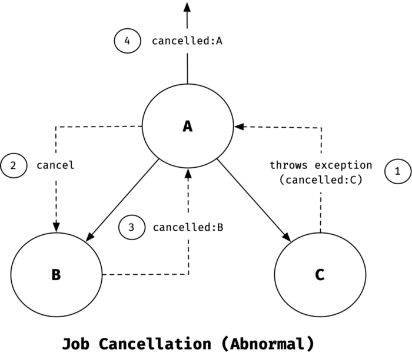

- [Abstract](#abstract)
- [Materials](#materials)
- [Basic](#basic)
  - [First coroutine](#first-coroutine)
  - [Coroutine Scopes](#coroutine-scopes)
  - [Coroutine Contexts](#coroutine-contexts)
  - [Coroutine Builders](#coroutine-builders)
  - [Structured concurrency](#structured-concurrency)
  - [Coroutines ARE light-weight](#coroutines-are-light-weight)
  - [Handling Exceptions](#handling-exceptions)
  - [Suspend](#suspend)
  - [Continuation](#continuation)

----

# Abstract

kotlin 의 coroutine 에 대해 정리한다. 

kotlin 의 coroutine 은 suspendable computation 의 instance 를 말한다. suspend/resume 이 가능한 code block 이라고 생각하면 쉽다. kotlin 의 coroutine 은 특정 thread 에 종속적이지 않다. 여러 thread 에 의해 suspend/resume 된다.

kotlin 의 coroutine 은 coroutine scope, coroutine builder 에 의해 만들어 진다. coroutine scope 은 coroutine 의 환경을 말한다. 예를 들어 coroutine 이 어떤 thread pool 에서 실행될지 결정할 수 있다. [참고](https://gist.github.com/djspiewak/46b543800958cf61af6efa8e072bfd5c)로 JVM 은 CPU-bound, Blocking IO, Non-blocking IO polling 를 포함한 3 가지 종류의 thread pool 을 갖는다. coroutine builder 는 schedule 이 가능한 Job instance 를 생성하는 factory 라고 생각하면 쉽다. 

coroutine scope 의 종류는 MainScope, CoroutineScope(ctx), coroutineScope(block), GlobalScope 이 있다. coroutine scope 이 만들어지면 Job instance 가 하나 생성되고 coroutine scope 에 연결된다. 그러나 GlobalScope 은 Job instance 가 생성되지 않는다. 이후 coroutine builder 로 Job instance 를 생성하면 앞서 언급한 Job instance 의 자식으로 등록된다. coroutine builder 의 종류는 runBlocking, launch, async, withContext 등이 있다.

suspend function 은 coroutine 혹은 또 다른 suspend function 에서만 호출될 수 있다. subroutine 에서 suspend function 을 호출할 수는 없다. suspend function 은 JVM Byte Code 로 compile 되면 Continuation argument 를 넘겨받는 함수와 같다.

# Materials

* [Everything you need to know about kotlin coroutines @ medium](https://medium.com/swlh/everything-you-need-to-know-about-kotlin-coroutines-b3d94f2bc982)
  * [kor, 코틀린 코루틴 소개](https://blog.burt.pe.kr/posts/everything-you-need-to-know-about-kotlin-coroutines/)
  * [Coroutine Context and Scope @ medium](https://elizarov.medium.com/coroutine-context-and-scope-c8b255d59055)
  * [Notes on structured concurrency, or: Go statement considered harmful](https://vorpus.org/blog/notes-on-structured-concurrency-or-go-statement-considered-harmful/)
  * [KotlinConf 2017 - Deep Dive into Coroutines on JVM by Roman Elizarov @ youtube](https://www.youtube.com/watch?v=YrrUCSi72E8)
* [Non-Blocking Spring Boot with Kotlin Coroutines @ baeldung](https://www.baeldung.com/kotlin/spring-boot-kotlin-coroutines)
* [Going Reactive with Spring, Coroutines and Kotlin Flow @ spring.io](https://spring.io/blog/2019/04/12/going-reactive-with-spring-coroutines-and-kotlin-flow)
* [코틀린(kotlin) + 스프링부트(springboot) + 웹플럭스(webflux) + 코루틴(coroutine) - 웹플럭스에서 코루틴 사용해보기](https://appleg1226.tistory.com/16)


# Basic

## First coroutine

다음과 같이 간단한 예를 살펴보자. 

```kotlin
fun main() = runBlocking { // this: CoroutineScope
    launch { // launch a new coroutine and continue
        delay(1000L) // non-blocking delay for 1 second (default time unit is ms)
        println("World!") // print after delay
    }
    println("Hello") // main coroutine continues while a previous one is delayed
}
// Hello
// World!
```

다음과 같은 특징들을 생각할 수 있다.

* [runBlocking](https://kotlin.github.io/kotlinx.coroutines/kotlinx-coroutines-core/kotlinx.coroutines/run-blocking.html) 는 coroutine builder 이다. suspend code block 을 입력으로 받아서 coroutine 을 생성한다. 즉, CoroutineScope, Job instance 를 생성한다. main thread 는 Job instance 가 실행될 때까지 blocking 된다.
* [launch](https://kotlin.github.io/kotlinx.coroutines/kotlinx-coroutines-core/kotlinx.coroutines/launch.html) 역시 coroutine builder 이다. suspend code block 을 입력으로 받아서 coroutine 을 생성한다. main thread 는 blocking 되지 않고 `launch` block 의 다음줄 부터 바로 실행한다.
* `delay` 는 suspend function 이다. coroutine 에서 실행된 suspend function 은 실행의 흐름이 완료될 때까지 return 되지 않는다.

이번에는 `launch` block 을 `doWorld` 라는 suspend function 으로 refactoring 해보자. 다음과 같은 특징들을 생각할 수 있다.

* `doWorld` 는 suspend function 이다. `Hello` 가 출력되고 한참 후에 `World!`, `Done` 이 출력된다.
  
```kotlin
import kotlinx.coroutines.*

fun main() = runBlocking { // this: CoroutineScope
    println("Hello")
    doWorld()
//  launch { doWorld() }
    println("Done")
}

// this is your first suspending function
suspend fun doWorld() {
    delay(5000L)
    println("World!")
}
// Outputs:
// Hello
// World!
// Done
```

만약 다음과 같이 `launch` 에서 `doWorld` 를 실행하면 위의 code 와 출력 순서가 달라진다. `launch` 에 의해 자식 coroutine 을 생성하고 바로 실행의 흐름을 바로 이어간다. `doWorld()` 는 자식 coroutine 에서 실행된다.

```kotlin
import kotlinx.coroutines.*

fun main() = runBlocking { // this: CoroutineScope
    println("Hello")
//  doWorld()
    launch { doWorld() }
    println("Done")
}

// this is your first suspending function
suspend fun doWorld() {
    delay(5000L)
    println("World!")
}
// Outputs:
// Hello
// Done
// World!
```

이번에는 susend function 을 여러개 호출하는 경우를 살펴보자. `doWorld()` 는 suspend function 이다. `doWorld(), doHello()` 가 모두 완료되면 return 된다.

```kotlin
import kotlinx.coroutines.*

fun main() = runBlocking { // this: CoroutineScope
	doWorld()
//  launch { doWorld() }
    println("Done")
}

suspend fun doWorld() {
    doHello()
    println("World!")
    delay(1000L)
}

suspend fun doHello() {
    delay(1000L)
    println("Hello!")
}
// Hello!
// World!
// Done
```

## Coroutine Scopes

CoroutineScope 은 다음과 같은 interface 이다. CoroutineScope 은 coroutineContext property 를 갖는다. CoroutineContext 는 key, val 로 구성된 map 이라고 생각하자. CoroutineScope, CoroutineContext 의 자세한 설명은 [Coroutine Context and Scope @ medium](https://elizarov.medium.com/coroutine-context-and-scope-c8b255d59055) 를 참고하자.

```kotlin
//kotlinx\coroutines\CoroutineScope.class
public interface CoroutineScope {
    public abstract val coroutineContext: CoroutineContext
}
```

CoroutineScope instance 가 하나 만들어지면 Job instance 가 하나 만들어지고 coroutineContext 에 key, val 형태로 저장된다. key 는 `Job` 이다. 이후 앞서 생성된 CoroutineScope 을 이용하여 만들어지는 Job instance 들은 처음 만들어진 Job instance 의 자식들로 등록된다. 자식 Job instance 가 취소되면 부모 Job instance 역시 취소된다. 이것을 [Structured concurrency](#structured-concurrency) 라고 한다.

CoroutineScope instance 를 생성하는 coroutine scope builder (function) 의 종류는 다음과 같다.

* `MainScope(): CoroutineScope`
* `CoroutineScope(context: CoroutineContext): CoroutineScope`
* `coroutineScope(block: suspend CoroutineScope.() -> R): R`
* `GlobalScope`

`MainScope()` 는 다음과 같다. 

```kotlin
public fun MainScope(): CoroutineScope = 
  ContextScope(SupervisorJob() + Dispatchers.Main)
```

`MainScope` 는 UI components 에만 해당하는 coroutine scope 이다. [SupervisorJob](https://kotlin.github.io/kotlinx.coroutines/kotlinx-coroutines-core/kotlinx.coroutines/-supervisor-job.html) instance 를 하나 생성한다. [SupervisorJob](https://kotlin.github.io/kotlinx.coroutines/kotlinx-coroutines-core/kotlinx.coroutines/-supervisor-job.html) instance 는 취소되더라도 다른 coroutine 에 영향을 주지는 않는다. 즉, [Structured concurrency](#structured-concurrency) 를 따르지 않는다. 자식 coroutine 의 실패는 [CoroutineExceptionHandler](https://kotlin.github.io/kotlinx.coroutines/kotlinx-coroutines-core/kotlinx.coroutines/-coroutine-exception-handler/) 를 이용하여 처리한다.

[CoroutineScope()](https://kotlin.github.io/kotlinx.coroutines/kotlinx-coroutines-core/kotlinx.coroutines/-coroutine-scope/index.html) 는 다음과 같다. 

```kotlin
public fun CoroutineScope(context: CoroutineContext): CoroutineScope = 
  ContextScope(if (context[Job] != null) context else context + Job())
```

새로운 CoroutineScope instance 를 생성한다. 기존의 coroutineContext 를 상속한다. `context` argument 는 추가할 Element 이다??? Job instance 가 있다면 그대로 사용하고 없다면 새로 생성하여 context 에 연결한다. `context + Job()` 은 Job instance 를 만들어서 context 에 포함시키는 것을 의미한다.

다음은 `CoroutineScope()` 의 예이다. `launch(CoroutineName("Child-A"))` 는 this.coroutineContext 에 "Child-A" 라는 coroutine name 을 추가한다고 생각하면 쉽다.

```kotlin
val scope = CoroutineScope(CoroutineName("Parent"))
// New job gets created if not provided explicitely
if (scope.coroutineContext[Job] != null) {
    println("New job is created!")
}

scope.launch {
    launch(CoroutineName("Child-A")) {
        delay(100)
        println("${Thread.currentThread().name} throwing exception")
        throw MyException
    }

    launch(CoroutineName("Child-B")) {
        println("${Thread.currentThread().name} before exception...")
        delay(500)
        println("${Thread.currentThread().name} after exception...")
    }
}
// Outputs:
// New job is created!
// DefaultDispatcher-worker-2 @Child-B#3 before exception...
// DefaultDispatcher-worker-1 @Child-A#2 throwing exception
// Exception in thread "DefaultDispatcher-worker-2 @Child-B#3" MyException: Dummy exception
```

`coroutineScope()` 는 다음과 같다. 새로운 CoroutineScope, Job instance 들을 생성한다. `block` argument 는 샐항할 suspend code block 이다. 이것이 모두 실행될 때까지 return 되지 않는다. `runBlocking()` 과 달리 suspend function 이다. suspend/resume 된다.

```kotlin
public suspend fun <R> coroutineScope(block: suspend CoroutineScope.() -> R): R
```

다음은 `coroutineScope()` 의 사용예이다.

```kotlin
// simulate some compute sensitive task
suspend fun task1(): Int {
    delay(100)
    return 10
}

// simulate some compute sensitive task
suspend fun task2(): Int {
    delay(200)
    return 20
}

// 1. performs tasks parallely
// 2. waits for all tasks to finish
// 3. usage computed results of all tasks and returns addition of those
suspend fun doTask() = coroutineScope {
    val result1 = async { task1() }
    val result2 = async { task2() }
    result1.await() + result2.await()
}

println(doTask())
// Outputs:
// 30
```

[GlobalScope](https://kotlin.github.io/kotlinx.coroutines/kotlinx-coroutines-core/kotlinx.coroutines/-global-scope/index.html) 은 다음과 같다. [GlobalScope](https://kotlin.github.io/kotlinx.coroutines/kotlinx-coroutines-core/kotlinx.coroutines/-global-scope/index.html) 은 SingleTon 이다. 어떠한 Job instance 와 연결되지 않는다.  [Structured concurrency](#structured-concurrency) 를 따르지 않기 때문에 사용하지 말 것을 추천한다. [The reason to avoid GlobalScope @ medium](https://elizarov.medium.com/the-reason-to-avoid-globalscope-835337445abc)

```kotlin
public object GlobalScope : CoroutineScope {
    override val coroutineContext: CoroutineContext get() =      
      EmptyCoroutineContext
}
```

다음은 [GlobalScope](https://kotlin.github.io/kotlinx.coroutines/kotlinx-coroutines-core/kotlinx.coroutines/-global-scope/index.html) 의 사용예이다. `throw MyException` 를 수행해도 두번째 `GlobalScope.launch` 이 취소되지 않는다. 즉, [Structured concurrency](#structured-concurrency) 를 따르지 않는다.

```kotlin
val job = GlobalScope.coroutineContext[Job]
if (job == null) {
    println("No Job associated with GlobalScope!")
}

// exception thrown in this coroutine does not affect other coroutines
GlobalScope.launch {
    delay(500)
    println("throwing exception")
    throw MyException
}

GlobalScope.launch {
    println("before exception...")
    delay(1000)
    println("after exception...")
}
// Outputs:
// No Job associated with GlobalScope!
// before exception...
// throwing exception
// Exception in thread "DefaultDispatcher-worker-2 @coroutine#1" MyException: Dummy exception
// after exception...
```

## Coroutine Contexts

[CoroutineContext](https://kotlinlang.org/api/latest/jvm/stdlib/kotlin.coroutines/-coroutine-context/) 는 다음과 같다. 

* **Key**: Key for the elements of type CoroutineContext
* **Element**: Subtype of CoroutineContext, for example, **Job**, **Deferred**, **CoroutineDispacher**, **ActorCoroutine**, etc.

```kotlin
// kotlin\coroutines\CoroutineContext.kotlin_metadata
public interface CoroutineContext {
    interface Element : CoroutineContext
    interface Key<E : Element>
}
```

## Coroutine Builders

coroutine builder 는 coroutine 을 만들어낼 수 있는 function 이다. coroutine 을 만든다는 것은 Job instance 를 생성한다는 것과 같다. `launch, async, runBlocking, withContext` 등이 있다. 

[launch](https://kotlin.github.io/kotlinx.coroutines/kotlinx-coroutines-core/kotlinx.coroutines/launch.html) 는 Job instance 를 생성하고 return 한다. 멈추지 않고 바로 다음 줄을 실행한다. 이후 return 된 job instance 를 cancel, join 할 수 있다. 주로 return 할 value 가 없을 때 사용한다.

`context` argument 는 현재 coroutineContext 에 추가할 context 를 의미한다. `start` argument 는 생성된 Job instance 가 언제 실행될지에 관한 것이다. `CoroutineStart.DEFAULT` 이면 바로 실행되고 `CoroutineStart.LAZY` 이면 나중에 실행한다. `block` argument 는 coroutine 에서 실행할 suspend code block 이다.

```kotlin
fun CoroutineScope.launch(
    context: CoroutineContext = EmptyCoroutineContext,
    start: CoroutineStart = CoroutineStart.DEFAULT,
    block: suspend CoroutineScope.() -> Unit
): Job (source)
```

다음은 간단한 사용 예이다.

```kotlin
val job = launch { // launch a new coroutine and keep a reference to its Job
    delay(1000L)
    println("World!")
}
println("Hello")
job.join() // wait until child coroutine completes
println("Done") 
```

[async](https://kotlin.github.io/kotlinx.coroutines/kotlinx-coroutines-core/kotlinx.coroutines/async.html) 는 Deferred instance 를 생성하고 return 한다. Deferred 는 Job 를 상속한다. 멈추지 않고 바로 다음 줄을 실행한다. 이후 return 된 Deferred instance 를 cancel, join, await 할 수 있다. 주로 return 할 value 가 있을 때 사용한다. await 를 사용하여 return value 를 얻어온다.

```kotlin
public fun <T> CoroutineScope.async(
  context: CoroutineContext = EmptyCoroutineContext,
  start: CoroutineStart = CoroutineStart.DEFAULT,
  block: suspend CoroutineScope.() -> T
): Deferred<T>
```

[withContext](https://kotlin.github.io/kotlinx.coroutines/kotlinx-coroutines-core/kotlinx.coroutines/with-context.html) 는 suspend code block 이 모두 완료될 때까지 기다린다. Dispatcher 를 argument 로 넘겨서 서로 다른 thread pool 에서 실행시키고 싶을 때 사용한다.

```kotlin
suspend fun <T> withContext(
    context: CoroutineContext,
    block: suspend CoroutineScope.() -> T
): T (source)
```

다음은 [withContext](https://kotlin.github.io/kotlinx.coroutines/kotlinx-coroutines-core/kotlinx.coroutines/with-context.html) 의 사용예이다. 첫번째 `println` 은 Default Dispatcher 의 thread 에서 실행된다. 두번째 `println` 은 `withContext(Dispatchers.IO)` 덕분에 IO Dispatcher 의 thread 에서 실행된다. Default Dispatcher 와 IO Dispatcher 는 서로 thread 를 공유한다. 이렇게 하면 context switching cost 를 아낄 수 있다. 

그러나 두번째 `println` 의 샐행을 마치면 마지막에 실행된 `DefaultDispatcher-worker-1` thread 는 IO thread 로 분류되어 thread pool 에서 제거 된다. 따라서 세번째 `println` 은 Default Dispatcher 의 thread 에서 실행되는데 thread 이름은 다르다.

```kotlin
// 1. create new coroutine scope with default dispatcher
val scope = CoroutineScope(Dispatchers.Default)

scope.launch {
    // 2. do some cpu bound operations, runs on Default thread pool
    println("${Thread.currentThread().name} doing CPU work...")

    // 3. shifts to IO thread pool
    withContext(Dispatchers.IO) {
        // 4. do some io operations like file read, network calls  etc
        println("${Thread.currentThread().name} doing IO work...")
    }

    // 5. shifts back to Default thread pool
    println("${Thread.currentThread().name} back to doing CPU work...")
}
// Outputs:
// DefaultDispatcher-worker-1 @coroutine#1 doing CPU work...
// DefaultDispatcher-worker-1 @coroutine#1 doing IO work...
// DefaultDispatcher-worker-2 @coroutine#1 back to doing CPU work...
```

[runBlocking](https://kotlin.github.io/kotlinx.coroutines/kotlinx-coroutines-core/kotlinx.coroutines/run-blocking.html) 은 다음과 같다. suspend code block 의 실행이 종료될 때까지 blocking 된다. coroutine 에서 호출할 수 없다. 주로 main, test function 에서 사용한다.

```kotlin
fun <T> runBlocking(
    context: CoroutineContext = EmptyCoroutineContext,
    block: suspend CoroutineScope.() -> T
): T (source)
```

다음은 [runBlocking](https://kotlin.github.io/kotlinx.coroutines/kotlinx-coroutines-core/kotlinx.coroutines/run-blocking.html) 의 사용예이다.

```kotlin
// ==== SUT: System Under Test ====
var counter = 0
suspend fun incrment() {
    delay(10)
    counter += 1
}
// ================================

@Test
fun `should able to increment counter`() = runBlocking {
    repeat(50) { incrment() }
    println("counter = $counter")
    assert(counter == 50) { "Assertion failed, expected=50 but actual=$counter" }
}
// Outputs:
// counter = 50
```

## Structured concurrency



kotlin 의 coroutine 은 다음과 같은 규칙을 따른다. coroutine 이 생성되면 Job instance 가 만들어 진다. coroutine builder 에 의해 다시 Job instance 가 만들어지면 이것은 처음 만들어진 Job instance 의 자식으로 등록된다. 자식 Job instance 들의 실행이 완료되야 부로 Job instance 의 실행이 완료된다.

만약 자식 Job instance 중 하나가 CancellationException 이외의 Exception 을 throw 하면 부모 Job instnace 를 포함한 자식 Job instance 들이 모두 취소된다. CancellationException 는 정상적으로 취소된 것으로 생각한다. 따라서 부모 Job instance 가 자식 Job instance 들에게 CancellationException 를 전달하지는 않는다. 이와 같은 규칙을 structured concurrency 라고 한다.

```kotlin
import kotlinx.coroutines.*

// Sequentially executes doWorld followed by "Done"
fun main() = runBlocking {
    doWorld()
    println("Done")
}

// Concurrently executes both sections
suspend fun doWorld() = coroutineScope { // this: CoroutineScope
    launch {
        delay(2000L)
        println("World 2")
    }
    launch {
        delay(1000L)
        println("World 1")
    }
    println("Hello")
}
// Outputs:
// Hello
// World 1
// World 2
// Done
```

다음은 CancellationException 을 throw 하는 예이다. 부모 Job instance 가 자식 Job instance 들을 취소하지 않는다.

```kotlin
import kotlinx.coroutines.*

// Sequentially executes doWorld followed by "Done"
fun main() = runBlocking {
    doWorld()
    println("Done")
}

// Concurrently executes both sections
suspend fun doWorld() = coroutineScope { // this: CoroutineScope
    launch {
        delay(2000L)
        println("World 2")
    }
    val a = launch {
        delay(1000L)
        println("World 1")
    }
    println("Hello")
    a.cancelAndJoin()
}
// Outputs:
// Hello
// World 2
// Done
```

다음은 MyException 을 throw 하는 예이다. 부모 Job instance 가 자식 Job instance 들을 취소한다.

```kotlin
import kotlinx.coroutines.coroutineScope
import kotlinx.coroutines.delay
import kotlinx.coroutines.launch
import kotlinx.coroutines.runBlocking

class MyException(message:String): Exception(message)

// Sequentially executes doWorld followed by "Done"
fun main() = runBlocking {
    doWorld()
    println("Done")
}

// Concurrently executes both sections
suspend fun doWorld() = coroutineScope { // this: CoroutineScope
    launch {
        delay(2000L)
        println("World 2")
    }
    launch {
        delay(1000L)
        println("World 1")
        throw MyException("I got it")
    }
    println("Hello")
}
// Outputs:
// Hello
// World 1
// Exception in thread "main" MyException: I got it
// 	at MainKt$doWorld$2$2.invokeSuspend(main.kt:23)
// 	at kotlin.coroutines.jvm.internal.BaseContinuationImpl.resumeWith(ContinuationImpl.kt:33)
// 	at kotlinx.coroutines.DispatchedTaskKt.resume(DispatchedTask.kt:175)
// 	at kotlinx.coroutines.DispatchedTaskKt.dispatch(DispatchedTask.kt:111)
// 	at kotlinx.coroutines.CancellableContinuationImpl.dispatchResume(CancellableContinuationImpl.kt:308)
// 	at kotlinx.coroutines.CancellableContinuationImpl.resumeImpl(CancellableContinuationImpl.kt:318)
// 	at kotlinx.coroutines.CancellableContinuationImpl.resumeUndispatched(CancellableContinuationImpl.kt:400)
// 	at kotlinx.coroutines.EventLoopImplBase$DelayedResumeTask.run(EventLoop.common.kt:489)
// 	at kotlinx.coroutines.EventLoopImplBase.processNextEvent(EventLoop.common.kt:274)
// 	at kotlinx.coroutines.BlockingCoroutine.joinBlocking(Builders.kt:84)
// 	at kotlinx.coroutines.BuildersKt__BuildersKt.runBlocking(Builders.kt:59)
// 	at kotlinx.coroutines.BuildersKt.runBlocking(Unknown Source)
// 	at kotlinx.coroutines.BuildersKt__BuildersKt.runBlocking$default(Builders.kt:38)
// 	at kotlinx.coroutines.BuildersKt.runBlocking$default(Unknown Source)
// 	at MainKt.main(main.kt:9)
// 	at MainKt.main(main.kt)

// Process finished with exit code 1
```

## Coroutines ARE light-weight

coroutine 은 light-weight 하다. 매우 많은 수의 coroutine 을 생성해도 문제없다. coroutine 은 특정 thread 에 종속되지 않는다. 

```kotlin
import kotlinx.coroutines.*

//sampleStart
fun main() = runBlocking {
    repeat(100_000) { // launch a lot of coroutines
        launch {
            delay(5000L)
            print(".")
        }
    }
}
//sampleEnd
```

## Handling Exceptions

* [Coroutine exceptions handling](https://kotlinlang.org/docs/exception-handling.html)

## Suspend

suspend function 은 coroutine 혹은 또 다른 suspend function 에서만 호출될 수 있다. subroutine 에서 suspend function 을 호출할 수는 없다. suspend function 은 JVM Byte Code 로 compile 되면 Continuation argument 를 넘겨받는 함수와 같다.

다은은 `updateUserInfo` 가 JVM byte code 로 compile 되었을 때의 prototype 이다. `Continuation<User>` argument 가 추가되었음을 주의하자. `Continuation` 은 단지 implicit callback 이다. thread 에서 resume 할 때 필요한 정보가 포함되어 있다.

```kotlin
// kotlin
suspend fun updateUserInfo(name: String, id: Long): User
// JVM
public final Object updateUserInfo(String name, long id, Continuation<User> $completion)
```

## Continuation

[Continuation](https://kotlinlang.org/api/latest/jvm/stdlib/kotlin.coroutines/-continuation/) 은 `resumeWith` function 을 갖는 interface 이다. `resumeWith` 는 `Result<T>` [monad](/monad/README.md) 를 argument 로 전달한다. [Continuation](https://kotlinlang.org/api/latest/jvm/stdlib/kotlin.coroutines/-continuation/) 는 thread 에서 실행하기 위한 callback interface 일 뿐이다. [KotlinConf 2017 - Deep Dive into Coroutines on JVM by Roman Elizarov @ youtube](https://www.youtube.com/watch?v=YrrUCSi72E8)

```kotlin
// kotlin\coroutines\Continuation.kt
public interface Continuation<in T> {
    public val context: CoroutineContext
    public fun resumeWith(result: Result<T>)
}
```
