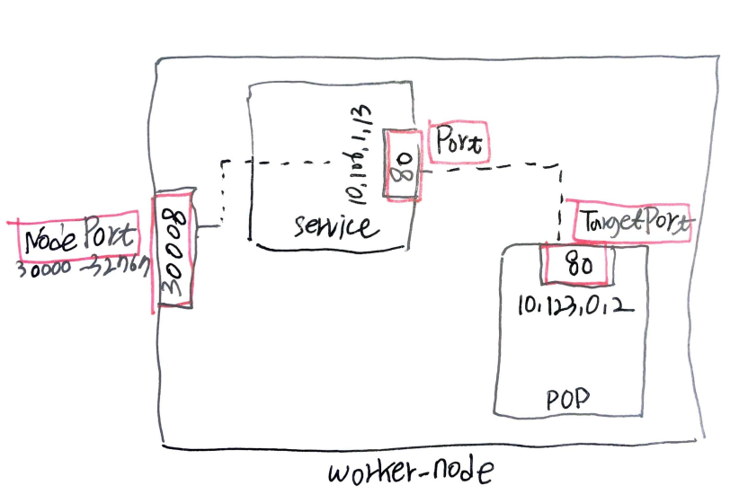

- [Abstract](#abstract)
- [References](#references)
- [Materials](#materials)
- [Kubernetes Addons](#kubernetes-addons)
- [Architecture](#architecture)
  - [Sequence Diagram](#sequence-diagram)
  - [Overview](#overview)
  - [Kubernetes Components](#kubernetes-components)
    - [Master Node](#master-node)
    - [Worker Node](#worker-node)
    - [Addons](#addons)
- [Install](#install)
  - [AWS EKS](#aws-eks)
  - [Google GCP](#google-gcp)
  - [Microsoft AZURE](#microsoft-azure)
  - [Install on Win64](#install-on-win64)
  - [Install on macOS](#install-on-macos)
- [AWS EKS Basic](#aws-eks-basic)
- [Basic](#basic)
  - [Useful Commands](#useful-commands)
  - [Launch Single Pod](#launch-single-pod)
  - [Launch Pods with livnessprobe, readynessprobe](#launch-pods-with-livnessprobe-readynessprobe)
    - [key commands](#key-commands)
    - [Launch Simple Pod](#launch-simple-pod)
    - [Launch Simple Pod with LivenessProbe](#launch-simple-pod-with-livenessprobe)
    - [Launch Simple Pod with ReadinessProbe](#launch-simple-pod-with-readinessprobe)
    - [Launch Simple Pod with HealthCheck](#launch-simple-pod-with-healthcheck)
    - [Launch Simple Pod with Multi Containers](#launch-simple-pod-with-multi-containers)
    - [Delete All resources](#delete-all-resources)
  - [Launch Replicaset](#launch-replicaset)
    - [Launch Simple Replicaset](#launch-simple-replicaset)
    - [Launch ReplicaSet Scale out](#launch-replicaset-scale-out)
  - [Launch Deployment](#launch-deployment)
    - [Launch Simple Deployment](#launch-simple-deployment)
    - [Launch Deployment with RollingUpdate](#launch-deployment-with-rollingupdate)
  - [How to generate Deployment yaml files](#how-to-generate-deployment-yaml-files)
  - [Launch Service](#launch-service)
    - [Launch Simple Service with ClusterIp type](#launch-simple-service-with-clusterip-type)
    - [Launch Service with NodePort type](#launch-service-with-nodeport-type)
    - [Launch Service with LoadBalaner](#launch-service-with-loadbalaner)
    - [????](#)
    - [???](#-1)
    - [???](#-2)
    - [externalTrafficPolicy](#externaltrafficpolicy)
    - [ExternalName](#externalname)
  - [Kubernetes Managing Commands](#kubernetes-managing-commands)
    - [Imperative Commands](#imperative-commands)
    - [Declarative Commands](#declarative-commands)
  - [Launch Namespace](#launch-namespace)
  - [Launch Configmap](#launch-configmap)
  - [Launch Secret](#launch-secret)
- [Continue...](#continue)

----

# Abstract

Kubernetes 는 여러개의 Container 들을 협업시킬 수 있는 도구이다. 

# References

* [checkov @ github](https://github.com/bridgecrewio/checkov)
  * Kubernetes manifest file 의 문법을 검사해줌
* [Certified Kubernetes Administrator (CKA)](https://www.cncf.io/certification/cka/)
  * [Certified Kubernetes Administrator (CKA) with Practice Tests @ udemy](https://www.udemy.com/course/certified-kubernetes-administrator-with-practice-tests/)
    * [Labs - Certified Kubernetes Administrator @ Kodcloud](https://kodekloud.com/courses/enrolled/675080)
  * [Open Source Curriculum for CNCF Certification Courses](https://github.com/cncf/curriculum)
  * [Linux Foundation Certification Exams: Candidate Handbook](https://docs.linuxfoundation.org/tc-docs/certification/lf-candidate-handbook)
  * [Important Instructions: CKA and CKAD](https://docs.linuxfoundation.org/tc-docs/certification/tips-cka-and-ckad)

# Materials

* [Certified Kubernetes Administrator (CKA) with Practice Tests](https://kodekloud.com/p/certified-kubernetes-administrator-with-practice-tests/?coupon_code=KUBARCHYT50)
* [쿠버네티스(kubernetes) 설치 및 환경 구성하기](https://medium.com/finda-tech/overview-8d169b2a54ff)
  * 쿠버네티스 설치 Deep Dive
* [시작하세요! 도커/쿠버네티스](http://www.yes24.com/Product/Goods/84927385)
  * [src](https://github.com/alicek106/start-docker-kubernetes)
  * 한글책 중 최고
* [A few things I've learned about Kubernetes](https://jvns.ca/blog/2017/06/04/learning-about-kubernetes/)
  * [What even is a kubelet?](http://kamalmarhubi.com/blog/2015/08/27/what-even-is-a-kubelet/#n2)
  * [Kubernetes from the ground up: the API server](http://kamalmarhubi.com/blog/2015/09/06/kubernetes-from-the-ground-up-the-api-server/)
  * [Kubernetes from the ground up: the scheduler](http://kamalmarhubi.com/blog/2015/11/17/kubernetes-from-the-ground-up-the-scheduler/)
  * [Authenticating](https://kubernetes.io/docs/reference/access-authn-authz/authentication/)
  * [A container networking overview](https://jvns.ca/blog/2016/12/22/container-networking/)
* [Kubernetes in Action](http://acornpub.co.kr/book/k8s-in-action)
  * [src](https://github.com/luksa/kubernetes-in-action?files=1)
* [Comprehensive Guide to EKS Worker Nodes ](https://blog.gruntwork.io/comprehensive-guide-to-eks-worker-nodes-94e241092cbe)
  * About kernetes worker node management
* [CNCF @ youtube](https://www.youtube.com/channel/UCvqbFHwN-nwalWPjPUKpvTA)
  * Cloud Native Computing Foundation
* [Kubernetes Blog](https://kubernetes.io/blog/)
* [EKS workshop](https://eksworkshop.com/010_introduction/basics/concepts_nodes/)
  * This explains about K8s
* [[토크ON세미나] 쿠버네티스 살펴보기 @ youtube](https://www.youtube.com/watch?v=xZ3tcFvbUGc&list=PLinIyjMcdO2SRxI4VmoU6gwUZr1XGMCyB&index=2)
  * 한글로 설명한 자세한 강의
  * [Workshop 개발 환경 셋팅하기 @ github](https://github.com/subicura/workshop-init)
  * [kubernetes 기본 가이드 @ github](https://github.com/subicura/workshop-k8s-basic)
* [AWS Kubernetes 서비스 자세히 살펴보기 - 정영준 솔루션즈 아키텍트(AWS), 이창수 솔루션즈 아키텍트(AWS)](https://www.youtube.com/watch?v=iAP_pTrm4Eo)
  * [slide](https://www.slideshare.net/awskorea/aws-kubernetes-aws-aws-devday2018)
* [Kubernetes Deconstructed: Understanding Kubernetes by Breaking It Down - Carson Anderson, DOMO](https://www.youtube.com/watch?v=90kZRyPcRZw&fbclid=IwAR0InYUnMQD-t-o8JhS5U5KRRaJvSQQc1fBDeBCb8cv6eRk62vsG2Si_Ijo)
  * [slide](http://kube-decon.carson-anderson.com/Layers/3-Network.sozi.html#frame4156)
* [Comprehensive Guide to EKS Worker Nodes](https://blog.gruntwork.io/comprehensive-guide-to-eks-worker-nodes-94e241092cbe)
  * Self Managed Worker Nodes, Managed Node groups, Serverless Worker Nodes
* [A Practical Step-by-Step Guide to Understanding Kubernetes](https://medium.com/better-programming/a-practical-step-by-step-guide-to-understanding-kubernetes-d8be7f82e533)
  * Launch Django, PostgreSQL, Redis on Kubernetes.

# Kubernetes Addons

* [kubernetes addon @ TIL](kubernetes_addon.md)

# Architecture

## Sequence Diagram

> * [Exploring the Flexibility of Kubernetes @ medium](https://medium.com/cloud-heroes/exploring-the-flexibility-of-kubernetes-9f65db2360a0)


## Overview

> * [Understanding Kubernetes Architecture With Diagrams](https://phoenixnap.com/kb/understanding-kubernetes-architecture-diagrams)

Kubernetes cluster 는 Master-node, Workder-node 와 같이 두 가지 종류의 Node 를 갖는다. 

* A Master-node type, which makes up the Control Plane, acts as the “brains” of the cluster.
* A Worker-node type, which makes up the Data Plane, runs the actual container images (via pods).

Master-Node 는 **etcd, kube-apiserver, kube-scheduler, kube-controller-manager, kubelet, kube-proxy, docker** 등이 실행된다. Master 장비 1 대에 앞서 언급한 프로세스들 한 묶음을 같이 실행하는게 일반적인 구성이다. Master-Node 는 일반적으로 High Availibility 를 위해 3 대 실행한다. 평소 1 대를 활성시키고 나머지 2 대는 대기시킨다.

Worker-Node 는 초기에 미니언(minion) 이라고 불렀다. **kubelet, kube-proxy, docker** 등이 실행된다. 대부분의 컨테이너들은 Worker-Node 에서 실행된다.


위의 그림은 Kubernetes System Diagram 이다. Master-Node 와 여러개의 Worker-Node 들로 구성된다. Operator 는 오로지 Master-Node 의 API Server 와 통신한다. Worker-Node 들 역시 마찬가지이다.

Kubernetes cluster 는 current state 을 object 로 표현한다. Kubernetes 는 current state 의 object 들을 예의 주시하다가 desired state 의 object 가 발견되면 지체 없이 current state object 들을 desired state state 으로 변경한다. 

Kubernetes object 는 Pod, DaemonSet, Deployment, ReplicaSet, Job, Service, Label 등이 있다.

* Pod
  * A thin wrapper around one or more containers
* DaemonSet
  * Implements a single instance of a pod on every worker node
* Deployment
  * Details how to roll out (or roll back) across versions of your application
* ReplicaSet
  * Ensures a defined number of pods are always running
* Job
  * Ensures a pod properly runs to completion
* Service
  * Maps a fixed IP address to a logical group of pods
* Label
  * Key/Value pairs used for association and filtering

Kubernetes 는 Control Plane 과 Data Plane 으로 나눌 수 있다.


Ctonrol Plane 은 Master-Node 를 의미한다. Scheduler, Controller Manager, API Server, etcd 등이 실행된다.

* One or More API Servers: Entry point for REST / kubectl
* etcd: Distributed key/value store
* Controller-manager: Always evaluating current vs desired state
* Scheduler: Schedules pods to worker nodes

Data Plane 은 Worker-Node 를 의미한다. kube-proxy, kubelet 등이 실행된다.

* Made up of worker nodes
* kubelet: Acts as a conduit between the API server and the node
* kube-proxy: Manages IP translation and routing

Kubernetes 는 yaml 파일을 사용하여 설정한다.

```yaml
apiVersion: v1
Kind: Pod
metadata:
spec:
```

* **Kind**: Kubernetes Object 의 type 이다. Pod, Deployment, ReplicaSet, Service 등이 있다.
* **apiVersion**: Kind 에 따라 다르다.
* **metadata**: Kind type 의 Kubernetes Object 의 meta data 이다. name 등등이 해당된다.
* **spec**: Kind type 의 Kubernetes Object 의 세부항목들이다. 당연히 Kind 에 따라 내용이 다르다.

## Kubernetes Components

### Master Node

* ETCD
  * key-value 저장소
* kube-apiserver
  * kubernetes cluster api 를 사용할 수 있게 해주는 gateway 이다. 들어오는 요청의 유효성을 검증하고 다른 곳으로 전달한다.
* kube-scheduler
  * 현재 cluster 안에서 자원할당이 가능한 Node 를 하나 선택하여 그곳에 pod 를 실행한다. Pod 가 하나 실행할 때 여러가지 조건이 지정되는데 kube-scheduler 가 그 조건에 맞는 Node 를 찾아준다. 예를 들어 필요한 하드웨어 요구사항, affinity, anti-affinity, 특정 데이터가 있는가 등이 해당된다.
* kube-controller-manager
  * kubernetes 는 controller 들이 Pod 들을 관리한다. kube-controller-manager 는 controller 들을 실행한다.
* cloud-controller-manager
  * 또 다른 cloud 와 연동할 때 사용한다. 
  * Node Controller, Route Controller, Service Controller, Volume Controller 등이 관련되어 있다.

### Worker Node

* kubelet
  * 모든 Worker Node 에서 실행되는 agent 이다. Pod 의 Container 가 실행되는 것을 관리한다. PodSpecs 라는 설정을 받아서 그 조건에 맞게 Container 를 실행하고 Container 가 정상적으로 실행되고 있는지 상태 체크를 한다.
* kube-proxy 
  * kubernetes 는 cluster 안의 virtual network 를 설정하고 관리한다. kube-proxy 는 virtual network 가 동작할 수 있도록하는 process 이다. host 의 network 규칙을 관리하거나 connection forwarding 을 한다.
* container runtime
  * container 를 실행한다. 가장 많이 알려진 container runtime 은 docker 이다. container 에 관한 표준을 제정하는 [OCI(Open Container Initiative)](https://www.opencontainers.org/) 의 runtime-spec 을 구현하는 container runtime 이라면 kubernetes 에서 사용할 수 있다.
* cAdvisor (container advisor)
  * 리소스 사용, 성능 통계를 제공

### Addons

cluster 안에서 필요한 기능들을 위해 실행되는 Pod 들이다. 주로 Deployment Controller, Replication Controller 에 의해 관리된다. Addon 이 사용하는 namespace 는 kub-system 이다.

* Networking Addon
* DNS Addon
* Dashboard Addon
* Container resource monitoring
* cluster logging

# Install

## AWS EKS

* [Kubernetes On AWS | AWS Kubernetes Tutorial | AWS EKS Tutorial | AWS Training | Edureka](https://www.youtube.com/watch?v=6H5sXQoJiso)
  * [Getting Started with the AWS Management Console](https://docs.aws.amazon.com/eks/latest/userguide/getting-started-console.html#w243aac11b9b7c11b7b1)
* [Amazon EKS 시작하기](https://aws.amazon.com/ko/eks/getting-started/)
* [Amazon EKS Starter: Docker on AWS EKS with Kubernetes @ udemy](https://www.udemy.com/course/amazon-eks-starter-kubernetes-on-aws/)
* [AWS 기반 Kubernetes 정복하기 - 정영준 솔루션즈 아키텍트(AWS)](https://www.youtube.com/watch?v=lGw2y-GLBbs)
* [Getting Started with Amazon EKS](https://docs.aws.amazon.com/en_en/eks/latest/userguide/getting-started.html)

----

AWS eks 를 사용한다면 다음과 같은 순서로 Kubernetes cluster 를 만들어 낼 수 있다.

* Create EKS cluster
* Provision worker nodes
* Launch add-ons
* Launch workloads

AWS eks 를 사용하여 Kubernetes cluster 를 만들면 다음과 같은 일이 벌어진다.

* Create HA Control Plane
* IAM integration
* Certificate Management
* Setup LB
  
다음은 AWS EKS 의 Architecture 이다.


AWS EKS cluster 가 만들어지고 나면 다음과 같이 kubectl 을 통해 API endpoint 와 통신할 수 있다.


* create IAM role "`eks-role`" 
  * with policies "`AmazonEKSClusterPolicy, AmazonEKSServicePolicy`"
* create Network (VPC, subnets, security groups) "`eks-net`" with CloudFormation
  * with the template body `https://amazon-eks.s3-us-west-2.amazonaws.com/cloudformation/2019-11-15/amazon-eks-vpc-sample.yaml`
* create EKS cluster "`nginx-cluster`"
* install kubectl

  ```bash
  $ kubectl version --short --client
  ```

* install aws cli

  ```bash
  $ aws --version
  ```

* install aws-iam-authenticator

   ```bash
   $ brew install aws-iam-authenticator
   $ aws-iam-authenticator --help
   ```

* Create a kubeconfig File

  ```bash
  $ aws --region ap-northeast-2 eks update-kubeconfig --name nginx-cluster
  Added new context arn:aws:eks:ap-northeast-2:612149981322:cluster/nginx-cluster to /Users/davidsun/.kube/config
  ```

* create worker nodes "`nginx-cluster-worker-nodes`" with CloudFormation
  * with the template body `https://amazon-eks.s3-us-west-2.amazonaws.com/cloudformation/2019-11-15/amazon-eks-nodegroup-role.yaml`

* create k8s ConfigMap and connect `nginx-cluster-worker-nodes` to `nginx-cluster`
  
  * `aws-iam-authenticator.yaml`

    ```yaml
    apiVersion: v1
    kind: ConfigMap
    metadata:
      name: aws-auth
      namespace: kube-system
    data:
      mapRoles:
        - rolearn: <NodeInstanceRole of CloudFormation nginx-cluster-worker-nodes>
          username: system:node:{{EC2PrivateDNSName}}
          groups:
            - system:bootstrappers
            - system:nodes
    ```

  * apply

    ```bash
    $ kubectl apply -f aws-iam-authenticator.yaml
    $ kubectl get nodes
    ```

* create k8s Deployment, Service 

  * `nginx-deploy.yaml`

    ```yaml
    apiVersion: apps/v1
    kind: Deployment
    metadata:
      name: nginx
    spec:
      selector:
        matchlabels:
          run: nginx
      replicas: 2
      template:
        metadata:
          labels:
            run: nginx
        spec:
          containers:
          - name: nginx
            image: nginx:1.7.9
            ports:
            - containerPort: 80 
    ```

  * `nginx-service.yaml`

    ```yaml
    apiVersion: v1
    kind: Service
    metadata:
      name: nginx
      labels:
        run: nginx
    spec:
      ports:
      - port: 80
        protocol: TCP
      selector:
        run: nginx
      type: LoadBalancer
    ```

  * apply

    ```bash
    $ kubectl create -f nginx-deploy.yaml
    $ kubectl create -f nginx-service.yaml
    $ kubectl get services -o wide
    # copy LoadBalancer Ingress
    $ kubectl describe svc nginx
    ```

* open browser copied url

## Google GCP

Updating...

## Microsoft AZURE

Updating...

## Install on Win64

* Install docker, enable kubernetes. That's all.
* If you meet the issue like following, set env `%KUBECONFIG%` as `c:\Users\iamslash\.kube\config`

```bash
> kubectl config get-contexts
CURRENT   NAME      CLUSTER   AUTHINFO   NAMESPACE
> kubectl version
...
Unable to connect to the server: dial tcp [::1]:8080: connectex: No connection could be made because the target machine actively refused it.
```

## Install on macOS

* [도커(Docker), 쿠버네티스(Kubernetes) 통합 도커 데스크톱을 스테이블 채널에 릴리즈 @ 44bits](https://www.44bits.io/ko/post/news--release-docker-desktop-with-kubernetes-to-stable-channel)

* Install docker, enable kubernetes. That's all.

# AWS EKS Basic

* [EKS workshop beginner](https://eksworkshop.com/beginner/)
  * AWS EKS handsson
  * [src](https://github.com/aws-samples/eks-workshop)

# Basic

## Useful Commands

* [workshop-k8s-basic/guide/guide-03/task-01.md](https://github.com/subicura/workshop-k8s-basic/blob/master/guide/guide-03/task-01.md)
  * [[토크ON세미나] 쿠버네티스 살펴보기 6강 - Kubernetes(쿠버네티스) 실습 1 | T아카데미](https://www.youtube.com/watch?v=G0-VoHbunks&list=PLinIyjMcdO2SRxI4VmoU6gwUZr1XGMCyB&index=6)
* [kubectl 치트 시트](https://kubernetes.io/ko/docs/reference/kubectl/cheatsheet/)

----

* config

```bash
# show current cluster
$ kubectl config view
$ kubectl config get-contexts
$ kubectl config use-context iamslash
```

* api-resources

```bash
# Show all objects
$ kubectl api-resources
# Show server, client version
$ kubectl api-versions
# Show deploy object in detail
$ kubectl explain deploy
$ kubectl explain deploy --api-version apps/v1
$ kubectl api-resources | awk '{print $3}' | sort | uniq
APIGROUP
Binding
PodTemplate
Secret
apiextensions.k8s.io
apps
autoscaling
awslb.coupang.com
batch
certificates.k8s.io
events.k8s.io
extensions
false
networking.k8s.io
policy
scheduling.k8s.io
storage.k8s.io
true
workload.coupang.com
```

* inspecting clusters

```bash
# Check current cluster
$ kubectl config view
# Check namespaces
$ kubectl get namespaces
# Get all resources
$ kubectl get all --namespace kube-system 
$ kubectl get nodes --namespace kube-system
$ kubectl get pods --namespace kube-system
$ kubectl --namespace kube-system get pods -o wide # wide format
$ kubectl --namespace <ns> get pod/my-pod -o yaml # show pod's yaml
$ kubectl --namespace <ns> get pod/my-pod -o json # show pod's json
# get nodes with all namespaces
$ kubectl get nodes -A
# describe nodes
$ kubectl --namespace <ns> describe nodes <pn> 
# dscribe pods
$ kubectl --namespace <ns> describe pods <pn>
# show manifest of resource
$ kubectl explain pods,svc

# sort by name
$ kubectl --namespace <ns> get services --sort-by=.metadata.name
# sort by restartCount
$ kubectl --namespace <ns> get pods --sort-by='.status.containerStatuses[0].restartCount'

# logs
$ kubectl --namespace <ns> logs <pod-name>
$ kubectl --namespace <ns> logs <pod-name> -c <container-name>
$ kubectl --namespace <ns> logs -f <pod-name>
$ kubectl --namespace <ns> logs -f <pod-name> -c <container-name>

# run
$ kubectl --namespace <ns> run -it busybox --image=busybox -- sh

# attach
$ kubectl --namespace <ns> attach <pod-name> -i

# forward port
$ kubectl --namespace <ns> port-forward <pod-name> 5000:6000

# Exec shell with interactive terminal
$ kubectl --namespace <ns> exec -it <pod-name> -- /bin/bash
$ kubectl --namespace <ns> exec -it <pod-name> -c <container-name> -- /bin/bash
$ kubectl --namespace <ns> exec --stdin --tty <pod-name> -- /bin/bash
# exec
$ kubectl --namespace <ns> exec <pod-name> -- ls /
$ kubectl --namespace <ns> exec <pod-name> -c <container-name> -- ls /

$ kubectl top pod <pod-name> --containers
```

* get

```bash
# show recent pod, replicaset, deployment, service not all
$ kubectl get all

# show nodes
$ kubectl get no
$ kubectl get node
$ kubectl get nodes

# change result format
$ kubectl get nodes -o wide
$ kubectl get nodes -o yaml
$ kubectl get nodes -o json
$ kubectl get nodes -o json |
      jq ".items[].metadata.name"
$ kubectl get nodes -o json |
      jq ".items[] | {name:.metadata.name} + .status.capacity"

# show pods with the namespace
$ k get pods --all-namespace
$ k get pods --namespace kube-system
```

* describe

```bash
# Show k8s object in detail
# kubectl describe type/name
# kubectl describe type name
kubectl describe node <node name>
kubectl describe node/<node name>
```

* etc

```bash
kubectl exec -it <POD_NAME>
kubectl logs -f <POD_NAME|TYPE/NAME>

kubectl apply -f <FILENAME>
kubectl delete -f <FILENAME>
```

## Launch Single Pod

```bash
# Create my-nginx-* pod and my-nginx deployment
> kubectl run my-nginx --image nginx --port=80
# Create "debug" pod and run bash
> kubectl run -it --rm debug --image=alicek106/ubuntu:curl --restart=Never bash
# Execute bash on my-nginx pod.
> kubectl exec -it my-ngnix bash
# Show logs of my-nginx pod.
> kubectl logs my-nginx
# Show running pods
> kubectl get pods
# Show deployments. Deployment is a specification for deploying pods.
> kubectl get dployments
# Scale out my-nginx deployment.
> kubectl scale deploy my-nginx --replicas=2
# Create a service to expose my-nginx pods. These are kinds of services. ClusterIP, NodePort, LoadBalancer, ExteralName
> kubectl expose deployment my-nginx --type=NodePort
# show services
> kubectl get services
# show details of my-nginx service
> kubectl describe service my-nginx
# Delete my-nginx deployment including pods.
> kubectl delete deployment my-nginx
# Delete my-nginx service
> kubectl delete service my-nginx
```

* [Difference between Docker ENTRYPOINT and Kubernetes container spec COMMAND?](https://stackoverflow.com/questions/44316361/difference-between-docker-entrypoint-and-kubernetes-container-spec-command)
  * [Define a Command and Arguments for a Container](https://kubernetes.io/docs/tasks/inject-data-application/define-command-argument-container/)
  * If you do not supply command or args for a Container, the defaults defined in the Docker image are used.
  * If you supply only args for a Container, the default Entrypoint defined in the Docker image is run with the args that you supplied.
  * If you supply a command for a Container, only the supplied command is used. The default EntryPoint and the default Cmd defined in the Docker image are ignored. Your command is run with the args supplied (or no args if none supplied).

## Launch Pods with livnessprobe, readynessprobe

* [workshop-k8s-basic/guide/guide-03/task-02.md](https://github.com/subicura/workshop-k8s-basic/blob/master/guide/guide-03/task-02.md)
  * [[토크ON세미나] 쿠버네티스 살펴보기 6강 - Kubernetes(쿠버네티스) 실습 1 | T아카데미](https://www.youtube.com/watch?v=G0-VoHbunks&list=PLinIyjMcdO2SRxI4VmoU6gwUZr1XGMCyB&index=6)

----

### key commands

```bash
$ kubectl run whoami --image subicura/whoami:1 
$ kubectl get po
$ kubectl get pod
$ kubectl get pods
$ kubectl get pods -o wide
$ kubectl get pods -o yaml
$ kubectl get pods -o json
$ kubectl logs whoami-<xxxx>
$ kubectl logs -f whoami-<xxxx>
$ kubectl exec -it whoami-<xxxx> sh
$ kubectl describe pods whoami-<xxxx>
$ kubectl delete pods whoami-<xxxx>
$ kubectl get pods
$ kubectl get all
$ kubectl delete deployment/whoami
```

### Launch Simple Pod

* whoami-pod.yml
   
```yml
apiVersion: v1
kind: Pod
metadata:
  name: whoami
  labels:
    type: app
spec:
  containers:
  - name: app
    image: subicura/whoami:1
```
* launch

```bash
$ kubectl apply -f whoami-pod.yml
```

### Launch Simple Pod with LivenessProbe

컨테이너가 동작 중인지 여부를 나타낸다. 만약 liveness probe 에 실패하면 kubelet은 컨테이너를 정지하고, 해당 컨테이너는 재시작 정책의 대상이 된다. 만약 컨테이너가 liveness probe 를 제공하지 않는 경우, 기본 상태는 Success 이다.

* whoami-pod-lp.yml

```yml
apiVersion: v1
kind: Pod
metadata:
  name: whoami-lp
  labels:
    type: app
spec:
  containers:
  - name: app
    image: subicura/whoami:1
    livenessProbe:
      httpGet:
        path: /not/exist
        port: 8080
      initialDelaySeconds: 5
      timeoutSeconds: 2 # Default 1
      periodSeconds: 5 # Defaults 10
      failureThreshold: 1 # Defaults 3
```

* launch

```bash
$ kubectl apply -f whoami-pod-lp.yml
```

### Launch Simple Pod with ReadinessProbe

컨테이너가 요청을 처리할 준비가 되었는지 여부를 나타낸다. 만약 readiness probe가 실패하면, Endpoint Controller는 Pod에 연관된 모든 서비스들의 엔드포인트에서 Pods의 IP를 제거한다. rediness probe 의 초기값은 Failure 이다.만약 컨테이너가 Rediness Probe 를 지원하지 않는다면, 기본 상태는 Success 이다.

* whoami-pod-rp.yml

```yml
apiVersion: v1
kind: Pod
metadata:
  name: whoami-rp
  labels:
    type: app
spec:
  containers:
  - name: app
    image: subicura/whoami:1
    readinessProbe:
      httpGet:
        path: /not/exist
        port: 8080
      initialDelaySeconds: 5
      timeoutSeconds: 2 # Default 1
      periodSeconds: 5 # Defaults 10
      failureThreshold: 1 # Defaults 3
```

* launch

```bash
$ kubectl apply -f whoami-pod-rp.yml
```

### Launch Simple Pod with HealthCheck

* whoami-pod-health.yml

```yml
apiVersion: v1
kind: Pod
metadata:
  name: whoami-health
  labels:
    type: app
spec:
  containers:
  - name: app
    image: subicura/whoami:1
    livenessProbe:
      httpGet:
        path: /
        port: 4567
    readinessProbe:
      httpGet:
        path: /
        port: 4567
```

* launch

```bash
$ kubectl apply -f whoami-pod-health.yml
```

### Launch Simple Pod with Multi Containers

* whoami-pod-redis.yml

```yml
apiVersion: v1
kind: Pod
metadata:
  name: whoami-redis
  labels:
    type: stack
spec:
  containers:
  - name: app
    image: subicura/whoami-redis:1
    env:
    - name: REDIS_HOST
      value: "localhost"
  - name: db
    image: redis
```

* launch

```bash
$ kubectl apply -f whoami-pod-redis.yml
$ kubectl get all
$ kubectl logs whoami-redis
$ kubectl logs whoami-redis app
$ kubectl logs whoami-redis db
$ kubectl exec -it whoami-redis
$ kubectl exec -it whoami-redis -c db sh
$ kubectl exec -it whoami-redis -c app sh
  apk add curl busybox-extras # install telnet
  curl localhost:4567
  telnet localhost 6379
    dbsize
    KEYS *
    GET count
    quit
$ kubectl get pod/whoami-redis
$ kubectl get pod/whoami-redis -o yaml
$ kubectl get pod/whoami-redis -o jsonpath="{.spec.containers[0].name}"
$ kubectl get pod/whoami-redis -o jsonpath="{.spec.containers[*].name}"
$ kubectl describe pod/whoami-redis
```

### Delete All resources

```bash
$ kubectl delete -f ./
```

## Launch Replicaset

* [workshop-k8s-basic/guide/guide-03/task-03.md](https://github.com/subicura/workshop-k8s-basic/blob/master/guide/guide-03/task-03.md)
  * [[토크ON세미나] 쿠버네티스 살펴보기 6강 - Kubernetes(쿠버네티스) 실습 1 | T아카데미](https://www.youtube.com/watch?v=G0-VoHbunks&list=PLinIyjMcdO2SRxI4VmoU6gwUZr1XGMCyB&index=6)

----

동일한 spec 의 pod 를 여러개 실행할 수 있게 해준다. Replicaset 이 없다면 pod 의 metadata 및 spec 을 여러번 작성해야 한다. Replicaset 의 yml 의 spec 은 `spec.template, spec.replicas, spec.selector` 로 구성된다. `spec.template` 이하가 pod 의 `metadata, spec` 이다.

### Launch Simple Replicaset

We use Deployment more than Replicaset. ReplicaSet is used in Deployment.

* whoami-rs.yml
  * ReplicaSet is still beta.
  * If there is no pod such as selector, Launch pod with template. 

```yml
apiVersion: apps/v1beta2
kind: ReplicaSet
metadata:
  name: whoami-rs
spec:
  replicas: 1
  selector:
    matchLabels:
      type: app
      service: whoami
  template:
    metadata:
      labels:
        type: app
        service: whoami
    spec:
      containers:
      - name: whoami
        image: subicura/whoami:1
        livenessProbe:
          httpGet:
            path: /
            port: 4567
```

* launch

```bash
$ kubectl apply -f whoami-rs.yml
$ kubectl get pods --show-labels
# If remove service from label, ReplicatSet launch another pod
$ kubectl label pod/whoami-rs-<xxxx> service-
# set label
$ kubectl label pod/whoami-rs-<xxxx> service=whoami
# modify replicas as 3 and apply again
#   It is same with kubectl scale --replicas=3 -f whoami-rs.yml
$ kubectl apply -f whoami-rs.yml
```

### Launch ReplicaSet Scale out

* whoami-rs-scaled.yml

```yml
apiVersion: apps/v1beta2
kind: ReplicaSet
metadata:
  name: whoami-rs
spec:
  replicas: 4
  selector:
    matchLabels:
      type: app
      service: whoami
  template:
    metadata:
      labels:
        type: app
        service: whoami
    spec:
      containers:
      - name: whoami
        image: subicura/whoami:1
        livenessProbe:
          httpGet:
            path: /
            port: 4567
```

* launch

```bash
$ kubectl apply -f whoami-rs-scaled.yml
$ kubectl replace -f whoami-rs-scaled.yml
$ kubectl scale --replicas=6 -f whoami-rs-scaled.yml
$ kubectl scale --replicas=6 replicaset whoami-rs
```

## Launch Deployment

* [workshop-k8s-basic/guide/guide-03/task-04.md](https://github.com/subicura/workshop-k8s-basic/blob/master/guide/guide-03/task-04.md)
  * [[토크ON세미나] 쿠버네티스 살펴보기 6강 - Kubernetes(쿠버네티스) 실습 1 | T아카데미](https://www.youtube.com/watch?v=G0-VoHbunks&list=PLinIyjMcdO2SRxI4VmoU6gwUZr1XGMCyB&index=6)

----

Deployment is for deploying stateless applications. and StatefulSet is for deploying stateful applicaions.
`template` of Deployment will include `metadata, spec` of Pod.

### Launch Simple Deployment

* whoami-deploy.yml
  * It is almost same with ReplicaSet.
  * Deployment manages versions of ReplicaSet.

```yml
apiVersion: apps/v1beta2
kind: Deployment
metadata:
  name: whoami-deploy
spec:
  replicas: 3
  selector:
    matchLabels:
      type: app
      service: whoami
  template:
    metadata:
      labels:
        type: app
        service: whoami
    spec:
      containers:
      - name: whoami
        image: subicura/whoami:1
        livenessProbe:
          httpGet:
            path: /
            port: 4567
```

* launch

```bash
$ kubectl apply -f whoami-deploy.yml --record
# set image and rollout
$ kubectl set image deploy/whoami-deploy whoami=subicura/whoami:2 --record
# rollout with files
$ kubectl apply -f whoami-deploy.yml
# get replicaset and watch continuously
$ kubectl get rs -w
# Show Deployment in detail.
$ kubectl describe deploy/whoami-deploy
# Show history. If you used --record before, you can find out command.
$ kubectl rollout history deploy/whoami-deploy
$ kubectl rollout history -f whoami-deploy.yml
$ kubectl set image deploy/whoami-deploy whoami=subicura/whoami:1 --record=true
$ kubectl rollout history -f whoami-deploy.yml
$ kubectl rollout history -f whoami-deploy.yml --revision=2
$ kubectl rollout status deploy/whoami-deploy
# inspect rolling update status and watch continuously
$ kubectl rollout status deploy/whoami-deploy -w
# rollback to prev version
$ kubectl rollout undo deploy/whoami-deploy
# rollback to specific version
$ kubectl rollout undo deploy/whoami-deploy --to-revision=3
```

### Launch Deployment with RollingUpdate

* whoami-deploy-strategy.yml

```yml
apiVersion: apps/v1beta2
kind: Deployment
metadata:
  name: whoami-deploy
spec:
  replicas: 3
  selector:
    matchLabels:
      type: app
      service: whoami
  minReadySeconds: 5
  strategy:
    type: RollingUpdate
    rollingUpdate:
      maxSurge: 1
      maxUnavailable: 1
  template:
    metadata:
      labels:
        type: app
        service: whoami
    spec:
      containers:
      - name: whoami
        image: subicura/whoami:1
        livenessProbe:
          httpGet:
            path: /
            port: 4567
```

* launch

```bash
$ kubectl apply -f whoami-deploy-strategy --record
$ kubectl describe deploy/whoami-deploy
$ kubectl set image deploy/whoami-deploy whoami=subicura/whoami:2 --record
$ kubectl get rs -w
# Delete everything including Pod, ReplicaSet, Deployment
$ kubectl delete deployment,pod,rs --all
```


## How to generate Deployment yaml files

* [kubectl Usage Conventions](https://kubernetes.io/docs/reference/kubectl/conventions/)

----

```bash
# Create an NGINX Pod
$ kubectl run nginx --image=nginx

# Generate POD Manifest YAML file (-o yaml). Don't create it(--dry-run)
$ kubectl run nginx --image=nginx --dry-run=client -o yaml

# Create a deployment
$ kubectl create deployment --image=nginx nginx

# Generate Deployment YAML file (-o yaml). Don't create it(--dry-run)
$ kubectl create deployment --image=nginx nginx --dry-run=client -o yaml

# Generate Deployment YAML file (-o yaml). Don't create it(--dry-run) with 4 Replicas (--replicas=4)
$ kubectl create deployment --image=nginx nginx --dry-run=client -o yaml > nginx-deployment.yaml

# Save it to a file, make necessary changes to the file (for example, adding more replicas) and then create the deployment.
```

## Launch Service

* [workshop-k8s-basic/guide/guide-03/task-05.md](https://github.com/subicura/workshop-k8s-basic/blob/master/guide/guide-05/task-05.md)
  * [[토크ON세미나] 쿠버네티스 살펴보기 7강 - Kubernetes(쿠버네티스) 실습 2 | T아카데미](https://www.youtube.com/watch?v=v6TUgqfV3Fo&list=PLinIyjMcdO2SRxI4VmoU6gwUZr1XGMCyB&index=7)
* [Kubernetes NodePort vs LoadBalancer vs Ingress? When should I use what?](https://medium.com/google-cloud/kubernetes-nodeport-vs-loadbalancer-vs-ingress-when-should-i-use-what-922f010849e0)

----

There are 3 kinds of Service typs.

* ClusterIP type is used for internal communication.
* NodePort type is used for external communication.
* LoadBalancer type is used for external communication with provision of load balancer in Cloud such as AWS, GCP. LoadBalancer is similar with NodePort except provision of load blanacer.

Service will make Endpoint object. You can find out Endpoints with `$ kubectl get endpoints` or `$ kubectl get ep`.

But we use Ingress object more than Service object. Because Service object is lack of SSL, routing config.

### Launch Simple Service with ClusterIp type


* redis-app.yml

```yml
apiVersion: apps/v1beta2
kind: Deployment
metadata:
  name: redis
spec:
  selector:
    matchLabels:
      type: db
      service: redis
  template:
    metadata:
      labels:
        type: db
        service: redis
    spec:
      containers:
      - name: redis
        image: redis
        ports:
        - containerPort: 6379
          protocol: TCP
---
# This is for ClusterIP
# ClusterIP is used for internal communication
apiVersion: v1
kind: Service
metadata:
  name: redis
spec:
  ports:
  - port: 6379
    protocol: TCP
  selector:
    type: db
    service: redis
```

* whoami.yml

```yml
apiVersion: apps/v1beta2
kind: Deployment
metadata:
  name: whoami
spec:
  selector:
    matchLabels:
      type: app
      service: whoami
  template:
    metadata:
      labels:
        type: app
        service: whoami
    spec:
      containers:
      - name: whoami
        image: subicura/whoami-redis:1
        env:
        - name: REDIS_HOST
          value: "redis"
        - name: REDIS_PORT
          value: "6379"
```

* launch

```bash
$ kubectl apply -f redis-app.yml
$ kubectl apply -f whoami.yml
# Show endpoints
$ kubectl get ep
$ kubectl get endpoints
$ kubectl exec -it whoami-<xxxxx> sh
  apk add curl busybox-extras # install telnet
  curl localhost:4567
  curl localhost:4567
  telnet localhost 6379
  telnet redis 6379
    dbsize
    KEYS *
    GET count
    quit
```

### Launch Service with NodePort type



* whoami-svc.yml

```yml
apiVersion: v1
kind: Service
metadata:
  name: whoami
spec:
  type: NodePort
  ports:
  - port: 4567
    protocol: TCP
  selector:
    type: app
    service: whoami
```

```bash
$ kubectl expose deployment simple-webapp-deployment --name=webapp-service --target-port=8080 --type=NodePort --port=8080 --dry-run=client -o yaml > svc.yaml

$ vim svc.yaml
spec:
  ports:
  - nodePort: 30080
$ kubectl apply -f svc.yaml  
```

### Launch Service with LoadBalaner

* [workshop-k8s-basic/guide/guide-03/task-06.md](https://github.com/subicura/workshop-k8s-basic/blob/master/guide/guide-05/task-06.md)
  * [[토크ON세미나] 쿠버네티스 살펴보기 7강 - Kubernetes(쿠버네티스) 실습 2 | T아카데미](https://www.youtube.com/watch?v=v6TUgqfV3Fo&list=PLinIyjMcdO2SRxI4VmoU6gwUZr1XGMCyB&index=7)

----

* `whoami-svc-lb.yml`
  * If you launch this on AWS, ELB will attached to service.
  * NodePort is just a external port of Node But LoadBalancer is a external resource to load balancers.
  * You need to use this just with AWS not on-premise.

```yml
apiVersion: apps/v1beta2
kind: Deployment
metadata:
  name: whoami
spec:
  selector:
    matchLabels:
      type: app
      service: whoami
  template:
    metadata:
      labels:
        type: app
        service: whoami
    spec:
      containers:
      - name: whoami
        image: subicura/whoami-redis:1
        env:
        - name: REDIS_HOST
          value: "redis"
        - name: REDIS_PORT
          value: "6379"
---

apiVersion: v1
kind: Service
metadata:
  name: whoami
spec:
  type: LoadBalancer
  ports:
  - port: 8000
    targetPort: 4567
    protocol: TCP
  selector:
    type: app
    service: whoami

---

apiVersion: apps/v1beta2
kind: Deployment
metadata:
  name: redis
spec:
  selector:
    matchLabels:
      type: db
      service: redis
  template:
    metadata:
      labels:
        type: db
        service: redis
    spec:
      containers:
      - name: redis
        image: redis
        ports:
        - containerPort: 6379
          protocol: TCP
---

apiVersion: v1
kind: Service
metadata:
  name: redis
spec:
  ports:
  - port: 6379
    protocol: TCP
  selector:
    type: db
    service: redis
```

* launch

```bash
$ kubectl apply -f whoami-svc-lb.yml --record
$ kubectl get svc
# Check load balancing.
$ curl a5f81...ap-northeast-2.elb.amazonaws.com --slient
$ curl a5f81...ap-northeast-2.elb.amazonaws.com --slient
```

### ????

* whoami-svc-v1-v2.yml

```yml
apiVersion: apps/v1beta2
kind: Deployment
metadata:
  name: whoami-v1
spec:
  replicas: 3
  selector:
    matchLabels:
      type: app
      service: whoami
      version: v1
  template:
    metadata:
      labels:
        type: app
        service: whoami
        version: v1
    spec:
      containers:
      - name: whoami
        image: subicura/whoami:1
        livenessProbe:
          httpGet:
            path: /
            port: 4567

---

apiVersion: apps/v1beta2
kind: Deployment
metadata:
  name: whoami-v2
spec:
  replicas: 3
  selector:
    matchLabels:
      type: app
      service: whoami
      version: v2
  template:
    metadata:
      labels:
        type: app
        service: whoami
        version: v2
    spec:
      containers:
      - name: whoami
        image: subicura/whoami:2
        livenessProbe:
          httpGet:
            path: /
            port: 4567
```

* launch

```bash
```

### ???

* whoami-svc-v1.yml

```yml
apiVersion: v1
kind: Service
metadata:
  name: whoami
spec:
  type: LoadBalancer
  ports:
  - port: 8000
    targetPort: 4567
    protocol: TCP
  selector:
    type: app
    service: whoami
    version: v1
```

* launch

```bash
```

### ???

* whoami-svc-all.yml

```yml
apiVersion: v1
kind: Service
metadata:
  name: whoami
spec:
  type: LoadBalancer
  ports:
  - port: 8000
    targetPort: 4567
    protocol: TCP
  selector:
    type: app
    service: whoami
```

* launch

```bash
```

### externalTrafficPolicy

* `hostname-svc-lb-local.yaml`

```yml
apiVersion: v1
kind: Service
metadata:
  name: hostname-svc-lb-local
spec:
  externalTrafficPolicy: Local
  ports:
    - name: web-port
      port: 80
      targetPort: 80
  selector:
    app: webserver
  type: LoadBalancer
```

* launch

```bash
$ kubectl apply -f hostname-svc-lb-local.yaml
$ kubectl scale --replicas=1 deployment hostname-deployment
$ kubectl get deploy
$ kubectl get pods -o wide
```

### ExternalName

ExternalName routes to `externalName`.

* `external-svc.yaml`

```yml
apiVersion: v1
kind: Service
metadata:
  name: externalname-svc
spec:
  type: ExternalName
  externalName: my.database.com
```

## Kubernetes Managing Commands

* [kubectl Usage Conventions](https://kubernetes.io/docs/reference/kubectl/conventions/)

### Imperative Commands

Sometimes you cat get one time tasks done quickly with imperative commands.

```bash
####################################
# POD
# Create an NGINX Pod
$ kubectl run --image-nginx nginx
# Generate POD Manifest YAML file (-o yaml). Don't create it(--dry-run)
$ kubectl run nginx --image=nginx  --dry-run=client -o yaml

####################################
# Deployment
# Create a deployment
$ kubectl create deployment --image=nginx nginx
# Generate Deployment YAML file (-o yaml). Don't create it(--dry-run)
$ kubectl create deployment --image=nginx nginx --dry-run -o yaml
# Generate Deployment with 4 Replicas
$ kubectl create deployment nginx --image=nginx --replicas=4
$ kubectl scale deployment nginx --replicas=4
# Another way to do this is to save the YAML definition to a file.
$ kubectl create deployment nginx --image=nginx--dry-run=client -o yaml > nginx-deployment.yaml

####################################
# Service
# Create a Service named redis-service of type ClusterIP to expose pod redis on port 6379
$ kubectl expose pod redis --port=6379 --name redis-service --dry-run=client -o yaml
# Create a Service named nginx of type NodePort to expose pod nginx's port 80 on port 30080 on the nodes:
$ kubectl expose pod nginx --port=80 --name nginx-service --type=NodePort --dry-run=client -o yaml
$ kubectl create service nodeport nginx --tcp=80:80 --node-port=30080 --dry-run=client -o yaml
```

### Declarative Commands

```bash
# Create Objects
$ kubectl apply -f nginx.yaml
# Update Objects
$ kubectl apply -f nginx.yaml
```

## Launch Namespace

Namespace 는 Kubernetes 의 resource 를 논리적으로 묶을 수 있는 단위이다. 가상 클러스터처럼 사용할 수 있다. 각 Namespace 의 resource 들은 논리적으로 구분이 되어있을 뿐이지 물리적으로 격리된 것은 아니다. 예를 들어 서로 다른 Namespace 에서 생성된 pods 가 같은 node 에 존재할 수 있다.

Linux 의 Namespace 는 container 의 격리된 공간을 생성하기 위해 kernel 에서 지원하는 기능이다. 주로 network, mmount, process namespace 를 의미한다. Kubernetes 의 Namespace 와는 다르다.

* commands

```bash
# Show namespaces objects
$ kubectl get namespaces
$ kubectl get ns
$ kubectl get ns --no-headers | wc -l

# Show pods objects with specific namespace
$ kubectl get pods --namespace default
$ kubectl get pods -n kube-system
$ kubectl get service -n kube-system

# Namespace is different with label
$ kubectl get pods -l app=webserver

$ kubectl run redis --image=redis --dry-run=client -o yaml > pod.yaml
$ vim pod.yaml
$ kubectl apply -f pod.yaml
$ kubectl -n finance get pod rdis

$ kubectl get pods --all-namespaces | grep blue

$ kubectl -n dev svc
```

* `production-namespace.yml`

```yml
apiVersion: v1
kind: Namespace
metadata:
  name: production
```

* launch `production-namespace.yml`

```bash
$ kubectl apply -f production-namespace.yaml
$ kubectl create namespace production
$ kubectl get ns | grep production
```

* `hostname-deploy-svc-ns.yaml`
  * Launch Deployment, Service in production namespace.

```yaml
apiVersion: apps/v1
kind: Deployment
metadata:
  name: hostname-deployment-ns
  namespace: production
spec:
  replicas: 1
  selector:
    matchLabels:
      app: webserver
  template:
    metadata:
      name: my-webserver
      labels:
        app: webserver
    spec:
      containers:
      - name: my-webserver
        image: alicek106/rr-test:echo-hostname
        ports:
        - containerPort: 80
---
apiVersion: v1
kind: Service
metadata:
  name: hostname-svc-clusterip-ns
  namespace: production
spec:
  ports:
    - name: web-port
      port: 8080
      targetPort: 80
  selector:
    app: webserver
  type: ClusterIP
```

* launch `hostname-deploy-svc-ns.yaml`

```bash
$ kubectl apply -f hostname-deploy-svc-ns.yaml
$ kubectl get pods, services -n production
$ kubectl get pods --all-namespaces

$ kubectl run -i --tty --rm debug --image=alicek106/ubuntu:curl --restart=Never -- bash
# ERROR
> curl hostname-svc-clusterip-ns:8080
# OK, You need to add Namespace like <service-name><namespace-name>.svc.cluster.local
> curl hostname-svc-clusterip-ns.production.svc:8080 --silent

# Delete Namespace with included all resources.
$ kubectl delete namespace production
```

* Namespaced resources, un-namespased resources
  * Node, Namespace are un-namespaced resources.

```bash
# Show namespaced resources
$ kubectl api-resources --namespaced=true
# Show un-namespaced resources
$ kubectl api-resources --namespaced=false
```

## Launch Configmap

configmap 은 설정값의 모음이다. key, value 가 많다면 volume 을 활용하여 configmap 을 사용하는 것이 좋다.

* commands

```bash
# kubectl create configmap <config-name> <config-key=value>
$ kubectl create configmap log-level-configmap --form-literal LOG_LEVEL=DEBUG
$ kubectl create configmap start-k8s --from-linteral k8s=kubernetes \
  --from-literal container=docker
$ kubectl get cm
$ kubectl get configmap
$ kubectl get configmap log-level-configmap -o yaml
```

* `all-evn-from-configmap.yaml`
  * configmap 의 모든 key-value 들을 environment variables 으로 읽어온다.
  * `envFrom`

```yml
apiVersion: v1
kind: Pod
metadata:
  name: container-env-example
spec:
  containers:
    - name: my-container
      image: busybox
      args: ['tail', '-f', '/dev/null']
      envFrom:
      - configMapRef:
          name: log-level-configmap
      - configMapRef:
          name: start-k8s
```

```bash
$ kubectl apply -f all-env-from-configmap.yaml
$ kubectl exec container-env-example env
```

* `selective-env-from-configmap.yaml`
  * configmap 의 일부 key-value 들을 environment variables 으로 읽어온다.
  * `valueFrom, configMapKeyRef`

```yml
apiVersion: v1
kind: Pod
metadata:
  name: container-selective-env-example
spec:
  containers:
    - name: my-container
      image: busybox
      args: ['tail', '-f', '/dev/null']
      env:
      - name: ENV_KEYNAME_1     # (1.1) 컨테이너에 새롭게 등록될 환경 변수 이름
        valueFrom: 
          configMapKeyRef:
            name: log-level-configmap
            key: LOG_LEVEL
      - name: ENV_KEYNAME_2  # (1.2) 컨테이너에 새롭게 등록될 환경 변수 이름
        valueFrom: 
          configMapKeyRef:
            name: start-k8s      # (2) 참조할 컨피그맵의 이름
            key: k8s             # (3) 가져올 데이터 값의 키
                                 # 최종 결과 -> ENV_KEYNAME_2=$(k8s 키에 해당하는 값)
                                 #              ENV_KEYNAME_2=kubernetes
```

```bash
$ kubectl apply -f selective-env-from-configmap.yaml
$ kubectl exec container-selective-env-example env | grep ENV
```

* `volume-mount-configmap.yaml` 
  * `spec.volumes` 는 Volume resource ???

```yaml
apiVersion: v1
kind: Pod
metadata:
  name: configmap-volume-pod
spec:
  containers:
    - name: my-container
      image: busybox
      args: [ "tail", "-f", "/dev/null" ]
      volumeMounts:
      - name: configmap-volume          # volumes에서 정의한 컨피그맵 볼륨 이름 
        mountPath: /etc/config             # 컨피그맵의 데이터가 위치할 경로

  volumes:
    - name: configmap-volume            # 컨피그맵 볼륨 이름
      configMap:
        name: start-k8s
```

```bash
$ kubectl apply -f volume-mount-configmap.yaml
$ kubectl exec configmap-volume-pod ls /etc/config
```

* `selective-volume-configmap.yaml`

```yml
apiVersion: v1
kind: Pod
metadata:
  name: selective-cm-volume-pod 
spec:
  containers:
    - name: my-container
      image: busybox
      args: [ "tail", "-f", "/dev/null" ]
      volumeMounts:
      - name: configmap-volume
        mountPath: /etc/config       # 마운트되는 위치는 변경되지 않았습니다.
  volumes:
    - name: configmap-volume
      configMap:
        name: start-k8s
        items:                       # 컨피그맵에서 가져올 키-값의 목록을 나열합니다.
        - key: k8s                    # k8s라는 키에 대응하는 값을 가져옵니다.
          path: k8s_fullname         # 최종 파일 이름은 k8s_fullname이 됩니다
```

```bash
$ kubectl apply -f selective-volume-configmap.yaml
$ kubectl exec selective-cm-volume-pod ls /etc/config
$ kubectl exec selective-cm-volume-pod cat /etc/config/k8s_fullname
```

* Create configmap from file

```bash
# kubectl create configmap <configmap-name> --from-file <file-name> ...
$ echo Hello, world! >> index.html
$ kubectl create configmap index-file --from-file index.html
$ kubectl describe configmap index-file
# Create configmap with specific key-value
$ kubectl create configmap index-file-customkey --from-file myindex=index.html

$ cat multiple-keyvalue.env
key1=val1
key2=val2
key3=val3
$ kubectl create configmap from-envfile --from-env-file multiple-keyvalue.env
$ kubectl get cm from-envfile -o yaml
```

* Define configmap with yaml file

```bash
$ kubectl create configmap -my-configmap \
  --from-literal mykey=myvalue --dry-run -o yaml > my-configmap.yaml
$ kubectl apply -f my-configmap.yaml   
```

## Launch Secret

This is very similar with ConfigMap except data are credntials.

* commands

```bash
$ kubectl create secret generic \
  my-password --from-literal password=iamslash
$ echo mypassword > pw1 && echo yourpassword > pw2
$ kubectl create secret generic \
  out-password --from-file pw1 --from-file pw2
$ kubectl get secrets
$ kubectl describe secret my-password
# Password is encoded with base64
$ kubectl get secret my-password -o yaml
$ echo WXEydzNlNHI= | base64 -d

$ kubectl create secret generic \
  my-password --from-literal password=iamslash \
  --dry-run -o yaml
```

* `env-from-secret.yaml`

```yml
apiVersion: v1
kind: Pod
metadata:
  name: secret-env-example
spec:
  containers:
    - name: my-container
      image: busybox
      args: ['tail', '-f', '/dev/null']
      envFrom:
      - secretRef:
          name: my-password
```

* `selective-env-from-secret.yaml`

```yml
apiVersion: v1
kind: Pod
metadata:
  name: selective-secret-env-example
spec:
  containers:
  - name: my-container
    image: busybox
    args: ['tail', '-f', '/dev/null']
    env:
    - name: YOUR_PASSWORD
      valueFrom:
        secretKeyRef:
          name: our-password
          key: pw2
```

* `volume-mount-secret.yaml`

```yml
apiVersion: v1
kind: Pod
metadata:
  name: secret-volume-pod
spec:
  containers:
    - name: my-container
      image: busybox
      args: [ "tail", "-f", "/dev/null" ]
      volumeMounts:
      - name: secret-volume          #  volumes에서 정의한 시크릿 볼륨 이름
        mountPath: /etc/secret             # 시크릿의 데이터가 위치할 경로
  volumes:
  - name: secret-volume            # 시크릿 볼륨 이름
    secret:
      secretName: our-password                  # 키-값 쌍을 가져올 컨피그맵 이름
```

* `selective-mount-secret.yaml`

```yaml
apiVersion: v1
kind: Pod
metadata:
  name: selective-volume-pod
spec:
  containers:
  - name: my-container
    image: busybox
    args: [ "tail", "-f", "/dev/null" ]
    volumeMounts:
    - name: secret-volume
      mountPath: /etc/secret
  volumes:
  - name: secret-volume
    secret:
      secretName: our-password          # our-password 라는 시크릿을 사용
      items:                       # 시크릿에서 가져올 키-값의 목록
      - key: pw1                    # pw1라는 키에 대응하는 값이 사용됨.
        path: password1           # 최종 파일은 /etc/config/password1이 됨
```

* launch

```bash
$ kubectl apply -f selective-mount-secret.yaml
$ kubectl exec selective-volume-pod cat /etc/secret/password1
```

* Using docker-registry type secrets

```bash
$ kubectl get secrets
$ kubectl create secret generic my-password --from-literal password=iamslash

$ kubectl create secret generic registry-auth \
  --from-file=.dockerconfigjson=/root/.docker/config.json \
  --type=kubernetes.io/dockerfonigjson

# Create docker-registry type secret with docker.io.
$ kubectl create secret docker-registry registry-auth-by-cmd \
  --docker-username=iamslash \
  --docker-password=iamslash  

$ kubectl create secret docker-registry registry-auth-registry \
  --docker-username=iamslash \
  --docker-password=iamslash \
  --docker-server=iamslash.registry.com

$ kubectl get secrets
```

* `deployment-from-private-repo.yaml`

```yml
apiVersion: apps/v1
kind: Deployment
metadata:
  name: deployment-from-prvate-repo
spec:
  selector:
    matchLabels:
      app: myapp
  template:
    metadata:
      name: mypod
      labels:
        app: myapp
    spec:
      containers:
      - name: test-container
        image: alicek106.ipdisk.co.kr/busybox:latest
        args: ['tail', '-f', '/dev/null']
      imagePullSecrets:
      - name: registry-auth-registry
```

* Using TLS type secrets

```bash
# Create key pairs
$ openssl req -new -newkey rsa:4096 -days 365 -nodes \
  -x509 -subj "/CN=example.com" -keyout cert.key -out cert.crt
$ ls
cert.crt cert.key
$ kubectl create secret tls my-tls-secret \
  --cert cert.crt --key cert.key

$ kubectl get secrets my-tls-secret
$ kubectl get secrets my-tls-secret -o yaml
```

* Distributing Secret

If you want to distribute Secrets with YAML file, you need to save Secret data in YAML file. But it is very unconvinent if Secret data are big. Use kustomize.

```bash
$ kubectl create secret tls my-tls-secret --cert cert.crt --key cert.key --dry-run -o yaml
```

* `kustomization.yaml` with secretGenerator
  * kubsomize generate Secret yaml file.

```yml
secretGenerator:                # 시크릿을 생성하기 위한 지시문
- name: kustomize-secret
  type: kubernetes.io/tls       # tls 타입의 시크릿을 생성 
  files:
  - tls.crt=cert.crt            # tls.crt 라는 키에 cert.crt 파일의 내용을 저장
  - tls.key=cert.key            # tls.key 라는 키에 cert.key 파일의 내용을 저장
```

```bash
$ kubectl kustomize ./

$ ls
$ kubectl apply -k ./
$ kubectl delete -k ./
```

* `kustomization.yaml` with configMapGenerator
  * kubsomize generate ConfigMap yaml file.

```yml
configMapGenerator:                # 시크릿을 생성하기 위한 지시문
- name: kustomize-configmap
  files:
  - tls.crt=cert.crt            # tls.crt 라는 키에 cert.crt 파일의 내용을 저장
  - tls.key=cert.key            # tls.key 라는 키에 cert.key 파일의 내용을 저장
```

* Updating application cofigs with ConfigMap, Scret

```bash
$ cat my-configmap.yaml
$ kubectl appy -f -my-configmap.yaml
$ sed -i -e 's/myvalue/yourvalue/g' my-configmap.yaml
$ kubectl appy -f my-configmap.yaml
```

# Continue...

* [README-2.md](README-2.md)


