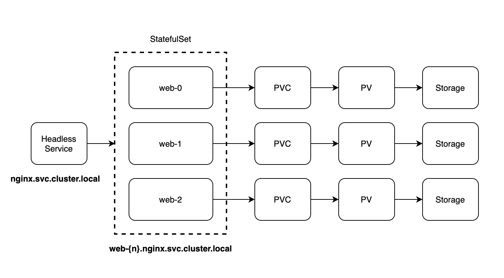

- [Abstract](#abstract)
- [StatefulSet](#statefulset)

----

# Abstract 

Kubernetes 의 StatefulSet 에 대해 정리한다.

# StatefulSet

* [1 스테이트풀셋(Statefulset)이란?](https://m.blog.naver.com/isc0304/221885403537)
* [스테이트풀셋 @ kubernetes.io](https://kubernetes.io/ko/docs/concepts/workloads/controllers/statefulset/)
* [스테이트풀셋 기본 @ kubernetes.io](https://kubernetes.io/ko/docs/tutorials/stateful-application/basic-stateful-set/)
  
----

StatefulSet 을 사용하는 이유는 다음과 같다. 

* Stable, unique network identifiers.
* Stable, persistent storage.
* Ordered, graceful deployment and scaling.
* Ordered, automated rolling updates.

또한 다음과 같은 제한사항을 갖는다.

* 파드에 지정된 스토리지는 관리자에 의해 퍼시스턴트 볼륨 프로비저너를 기반으로 하는 storage class 를 요청해서 프로비전하거나 사전에 프로비전이 되어야 한다.
* 스테이트풀셋을 삭제 또는 스케일 다운해도 스테이트풀셋과 연관된 볼륨이 삭제되지 않는다. 
* 스테이트풀셋은 현재 파드의 네트워크 신원을 책임지고 있는 [헤드리스 서비스](kubernetes_headless_service.md)가 필요하다. 
* 스테이트풀셋은 스테이트풀셋의 삭제 시 파드의 종료에 대해 어떠한 보증을 제공하지 않는다.
* 롤링 업데이트와 기본 파드 매니지먼트 폴리시 (OrderedReady)를 함께 사용시 복구를 위한 수동 개입이 필요한 파손 상태로 빠질 수 있다.

이제 nginx StatefulSet 을 제작해서 pvc,pv 가 삭제되지 않는지, Scaling 의 순서가 보장되는지 등등을 테스트 해보자.

다음과 같이 `nginx-statefulset.yaml` 을 작성한다.

```yaml
# nginx-statefulset.yaml
apiVersion: v1
kind: Service
metadata:
  name: nginx
  labels:
    app: nginx
spec:
  ports:
  - port: 80
    name: web
  clusterIP: None
  selector:
    app: nginx
---

apiVersion: apps/v1
kind: StatefulSet
metadata:
  name: web
spec:
  selector:
    matchLabels:
      app: nginx
  serviceName: "nginx" # headless service name 
  replicas: 3 
  template:
    metadata:
      labels:
        app: nginx
    spec:
      terminationGracePeriodSeconds: 10 
      containers:
      - name: nginx
        image: k8s.gcr.io/nginx-slim:0.8
        ports:
        - containerPort: 80
          name: web
        volumeMounts:
        - name: www
          mountPath: /usr/share/nginx/html
  volumeClaimTemplates: 
  - metadata:
      name: www
    spec:
      accessModes: [ "ReadWriteOnce" ]
      storageClassName: "standard"
      resources:
        requests:
          storage: 1Gi
```

위의 manifest 를 그림으로 표현하면 다음과 같다.



pod 는 `0, 1, ... n` 의 순서대로 scale up 된다. 또한 `n, n-1, ... 0` 의 순서대로
scale down 된다.  

pod 은 사라지더라도 pvc,pv 는 삭제되지 않는다. pod 이 다시 살아나면 이름규칙에 따라
예전의 pvc,pv 와 mapping 된다. 이것을 다음과 같이 테스트 해본다. 

```bash
# Create resources
$ kubectl apply -f statefulset-nginx.yml

# Check pods
$ kubectl get pods -o wide
NAME    READY   STATUS    RESTARTS   AGE   IP           NODE       NOMINATED NODE   READINESS GATES
web-0   1/1     Running   0          9s    172.17.0.3   minikube   <none>           <none>
web-1   1/1     Running   0          8s    172.17.0.4   minikube   <none>           <none>
web-2   1/1     Running   0          7s    172.17.0.5   minikube   <none>           <none>

# Check pvc, pv
$ kubectl get pvc,pv

# Scale up
$ kubectl scale statefulset web --replicas 5

# Create a file on pv
$ kubectl exec -it web-1 -- bash
> ls /usr/share/nginx/html/
> touch /usr/share/nginx/html/web-1.txt

# Scale down
$ kubectl scale statefulset web --replicas 1

# Scale up
$ kubectl scale statefulset web --replicas 2

# Check mapping with old pvc,pv with new pod
$ kubectl exec -it web-1 -- bash
> ls /usr/share/nginx/html/

# Delete all
$ kubectl delete -f statefulset-nginx.yml
```
