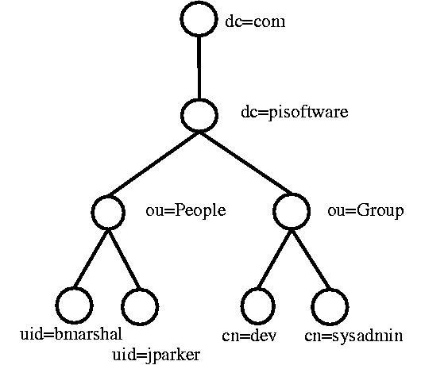
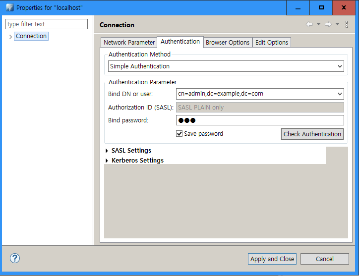

# Abstract

LDAP (Lightweight Directory Access Protocol) 는 DAP (Directory Access Protocol) 를 간소화한 프로토콜이다. Hierarchical data structure 를 전송하는데 사용한다. 

Entry 는 모두 모여 Hierarchical data structure 를 구성한다. 이것을 DIT (Directory Information Tree) 라고 부른다.



대표적인 구현체로 MS 의 Active Directory 와 [OpenLDAP](http://www.openldap.org/) 가 있다. 

대표적인 클라이언트 구현체로 [Apache Directory Studio](https://directory.apache.org/studio/) 가 있다. [이곳](https://directory.apache.org/studio/users-guide/2.0.0.v20180908-M14/ldap_browser/tools_search_dialog.html) 를 참고하면 [Apache Directory Studio](https://directory.apache.org/studio/) 를 이용한 검색방법을 알 수 있다. 

macOS 에 ldapsearch 가 기본적으로 설치되어 있고 ldap 조회를 실행할 수 있다. password 는 `-W` 옵션을 주고 매번 입력하거나 `passwd.txt` 에 저장하여 매번 입력하지 않을 수 있다.

`/etc/openldap/ldap.conf` 는 openldap client 의 설정파일이다. `/etc/openldap/slapd.conf` 는 openldap server 의 설정파일이다. 설정파일 사용법은 나중에 정리한다.

# Materials

* [Introduction to LDAP](http://quark.humbug.org.au/publications/ldap/ldap_tut.html)
* [Examples of using ldapsearch](https://www.ibm.com/support/knowledgecenter/en/SSKTMJ_9.0.1/admin/conf_examplesofusingldapsearch_t.html)
* [How to do ldapsearch Example @ youtube](https://www.youtube.com/watch?v=sFGq7k31B-I)
* [5. 데이타베이스 생성과 유지 보수 @ KLDP](http://doc.kldp.org/HOWTO/html/LDAP/LDAP-HOWTO-5.html)
  * ldapsearch, ldapmodify usages
* [OpenLDAP을 활용한 기반시스템 중앙 인증관리 #1](https://blog.hkwon.me/use-openldap-part1/)
  * [OpenLDAP을 활용한 기반시스템 중앙 인증관리 #2](https://blog.hkwon.me/use-openldap-part2/)

# Install with docker

* [mwaeckerlin/openldap @ dockerhub](https://github.com/mwaeckerlin/openldap)

```console
$ git clone git@github.com:mwaeckerlin/openldap.git
$ cd openldap/example
$ docker-compose up
```

Run apachedirectory Studio




# Apache Directory Studio Usage

Modification Logs 를 살펴보면 UI 의 transaction 마다 LDAP query 를 확인할 수 있다.

# Basic 

## LDAP structure

* [LDAP 이란?](https://ldap.or.kr/ldap-%EC%9D%B4%EB%9E%80/)
* [Introduction to LDAP](http://quark.humbug.org.au/publications/ldap/ldap_tut.html)


Circle 하나를 Entry 라고 한다. Entry 는 여러개의 attribute 들을 소유한다.

특정 Entry 를 가리키는 이름을 DN(Distinguished NAme) 이라고 한다. 예를 들어 `uid=bmarshal` 에 해당하는 Entry 의 DN 은 `uid=bmarshal,ou=People,dc=pisoftware,dc=com` 이다.

## LDIF (LDAP Data Interchange Format)

LDAP entries 를 text 로 표현한 것이다. Human readable 하다.

```LDIF
dn: uid=bmarshal,ou=People,dc=pisoftware,dc=com
uid: bmarshal
cn: Brad Marshall
objectclass: account
objectclass: posixAccount
objectclass: top
loginshell: /bin/bash
uidnumber: 500
gidnumber: 120
homedirectory: /mnt/home/bmarshal
gecos: Brad Marshall,,,,
userpassword: {crypt}KDnOoUYN7Neac
```

## Schema 

LDAP entries 들도 RDBMS 처럼 Schema 가 있다??? [RFC2256](https://tools.ietf.org/html/rfc2256) 그렇다면 특정 Entry 마다 소유할 수 있는 Attribute 들이 정해져 있는 것인가?

다음은 주요 Attribute 들의 abbreviations 이다.

```

uid: User id
cn: Common Name
sn: Surname
l: Location
ou: Organisational Unit
o: Organisation
dc: Domain Component
st: State
c: Country
```

## Search Filters

* [ldap query 기본](http://www.dreamy.pe.kr/zbxe/CodeClip/164860)
* [Introduction to LDAP](http://quark.humbug.org.au/publications/ldap/ldap_tut.html)


| Query | Description |
|--|--|
| `"(objectClass=*)"`	| All objects. |
| `"(&(objectCategory=person)(objectClass=user)(!cn=andy))"` |	All user objects but "andy". |
| `"(sn=sm*)"`	| All objects with a surname that starts with "sm". |
| `"(&(objectCategory=person)(objectClass=contact)(|(sn=Smith)(sn=Johnson)))"`	| All contacts with a surname equal to "Smith" or "Johnson". |

## Useful LDAP commands

```bash
# -H : AD 서버 주소
# -x : 단순 인증
# -D : AD 로그인 정보
# -y : 패스워드 파일 이름
# -b : 검색이 시작되는 도메인 이름
# cn 이 David 로 시작하는 object 검색해서 cn 를 리턴
$ ldapsearch -H ldap://xxx.xxx.xxx.xxx -x -D iamslash@com.iamslash.net -y passwd.txt -b "DC=example,DC=net" "(cn=iamslash*)" cn

# ldapadd, ldapmodify
# Used to add or modify ldap entries
$ ldapmodify -r -D 'cn=foo,dc=bar,dc=com' -W < /tmp/user.ldif

# ldapdelete
# Used to delete entries
$ ldapdelete -D 'cn=foo,dc=bar,dc=com' -W 'cn=user,dc=bar,dc=com'

# ldapsearch
# Used to search ldap servers
$ ldapsearch -L -D 'cn=foo,dc=bar,dc=com' 'objectclass=posixAccount'
```
