# Comments

다음의 용어들을 정리해본다.

hemispherical lighting model
image based lighting
irradiance environment map
image based reflection
image based refaction
image based fresnel
BRDF

# Abstract

- 3d그래픽의 라이팅에 대해 기술한다.

# Contents

* [Fundamentals](#fundamentals)
  * light
  * eye
  * 조도와 휘도
  * 빛의 감쇠
  * 광원의 밝기
  * 조도 측정
  * 휘도 측정

# Learning Materials

- [Real Shading in Unreal Engine 4](https://cdn2.unrealengine.com/Resources/files/2013SiggraphPresentationsNotes-26915738.pdf)
  - 2013 SIGRAPH paper
  - [번역](http://lifeisforu.tistory.com/348)
- [A Reflectance Model for Computer Graphics](http://graphics.pixar.com/library/ReflectanceModel/paper.pdf)  
  - [번역](http://lifeisforu.tistory.com/349)
- [Physically-Based Shading at Disney](https://disney-animation.s3.amazonaws.com/library/s2012_pbs_disney_brdf_notes_v2.pdf)  
  - [번역](http://lifeisforu.tistory.com/350)
- [Microfacet Models for Refraction through Rough Surfaces](https://www.cs.cornell.edu/~srm/publications/EGSR07-btdf.pdf)  
  - [번역](http://lifeisforu.tistory.com/352)
- [PBR 이란 무엇인가 @ tistory](http://lifeisforu.tistory.com/366)

# Fundamentals

## Light

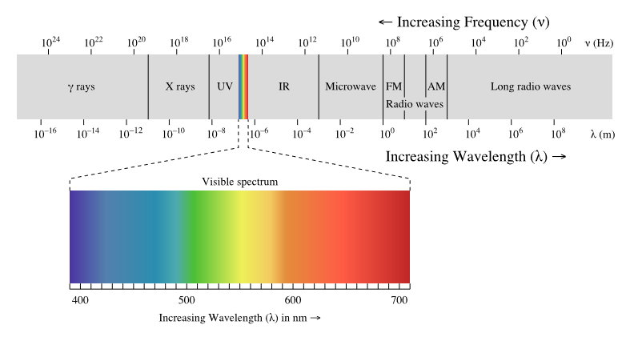

빛은 전자기파(Electromagnetic wave)이다. 전자기파는 전자기적 과정에 의해 발생하는
에너지이다. 파동의 형태로 발산되는 에너지라고 할 수 있다. 빛은 파장이 다른 여러 가지 
전자기파로 구성되어 있다.

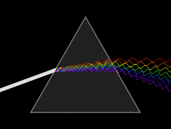

빛은 여러가지 전자기파들로 구성되어 있기 때문에 프리즘을 사용해서 각각을 분리할 수 있다.
빨간색 파장의 길이가 가장 길고 보라색 파장의 길이가 가장 짧다.

* [PBR 이란 무엇인가 - 1. 인간과 빛 @ tistory](http://lifeisforu.tistory.com/366)
* [Physically based rendering @ wikipedia](https://en.wikipedia.org/wiki/Physically_based_rendering)
* [BASIC THEORY OF PHYSICALLY-BASED RENDERING](https://www.marmoset.co/posts/basic-theory-of-physically-based-rendering/)
* [빛이란 무엇인가? - Barry R. Masters](http://e-ico.org/sites/default/files/pdfs/whatIsLightKorean.pdf)
* [Light @ wikipedia](https://en.wikipedia.org/wiki/Light)
* [파동의표시](http://lovescience.pe.kr/ms/chapter12/12_1_study2.htm)

## Eye

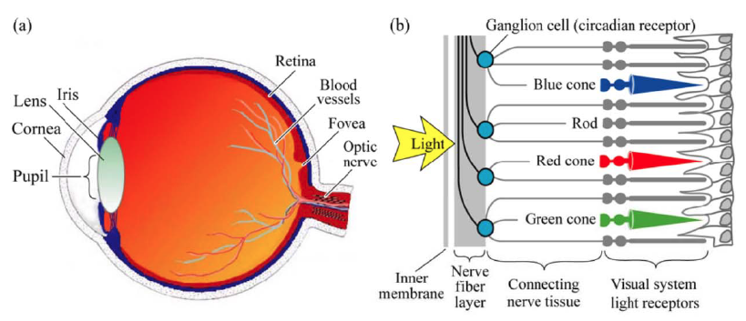

우리 눈의 망막(retina)를 확대해 보면 원추세포(cone cell: blue cone,
red cone, green cone)와 간상세포(rod)가 있다. 원추세포(cone cell)는
색상을 감지하고 간상세포(rod)는 명암을 감지한다.  원추세포는 그것을
구성하고 있는 감광세포의 종류에 따라 받아들일 수 있는 색상이 정해져
있다. 우측 그림을 보면 3종류의 원추세포가 존재하고 그것은 RGB와 같다.
이것은 텍스처를 제작할때 RGB채널을 사용하는 이유기도 하다.

우리 눈의 원추세포(cone cell)는 약 600만개이고 간상세포(rod)는 약
9000만개이다.  따라서 우리 눈은 색상 대비보다 명도 대비에 더욱
민감하다. 새의 눈은 인간 보다 많은 감광 색소를 가지고 있어서 자외선
까지 볼 수 있다고 한다.

* [PBR 이란 무엇인가 - 1. 인간과 빛 @ tistory](http://lifeisforu.tistory.com/366)
* [Color Vision in Birds](http://www.webexhibits.org/causesofcolor/17B.html)
* [원추세포 @ 위키피디아](https://ko.wikipedia.org/wiki/%EC%9B%90%EC%B6%94%EC%84%B8%ED%8F%AC)

## 조도와 휘도 (illuminance & luminance)


빛은 다양한 전자기파로 구성되어 있다. 가시광선(visible spectrum)을
포함한 전체 파장 영역의 전자기파들로 구성된 빛을
방사선(radiation)이라고 한다. 전체 파장 영역의 빛을 다루기 위해
에너지를 측정하는 것은 방사측정(radiometry)라 하고 가시 영역(visible
spectrum)의 빛을 다루기 위해 에너지를 측정하는 것을
광도측정(photometry)라고 한다.

방사측정(radiometry)는 제곱미터당 일률(watt per squre meter)의 단위로
에너지를 측정하고 광도측정(photometry)는 제곱미터당 루멘(lumens per
squre)단위로 에너지를 측정한다. 전자는 파워(power)를 의미하고 후자는
밝기(brightness)를 의미한다.

조도의 "조(照)"는 "비출 조" 이고 휘도의 "휘(輝)"는 "빛날 휘"다.
광원(light source)에서 빛이 나오는 양을 조도라고 하고 광원(light source)에서
나온 빛이 특정 오브젝트에 반사되어 나오는 빛의 양을 휘도라고 한다.

방사측정(radiometry)의 경우 조도를 irradiance라고 하고 휘도를
radiance라고 한다.  광도측정(photometry)의 경우 조도를 illuminance라고
하고 휘도를 luminance라고 한다.


특정 표면(surface)에 도달한 빛이 모두 우리 눈으로 들어 오는 것은 아니다. 표면의
재질에 따라 흡수(absorbed), 투과(transmitted), 반사(reflected), 방출(emitted)
된다. 우리 눈은 반사(reflected), 투과(transmitted), 방출(emitted)된 빛만 인지 할 수 있다.

* [PBR 이란 무엇인가 - 2. 조도와 휘도](http://lifeisforu.tistory.com/367)
* [radiation](https://en.wikipedia.org/wiki/Radiation)
* [radiometry](https://en.wikipedia.org/wiki/Radiometry)
* [photometry](https://en.wikipedia.org/wiki/Photometry_(optics))

## 빛의 감쇠 (attenuation)

빛은 다양한 파장의 전자기파들의 조합 이지만 때로는 입자 처럼 보일때가
있다. 이것을 빛이 파동성과 입자성을 가지고 있다고 한다. 입자 처럼
보일때 빛을 광자(photon)라고 한다.

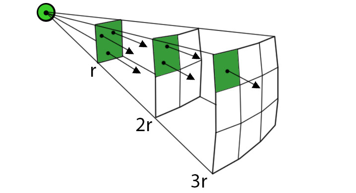

위의 그림은 거리 r의 배수에 따라 단위면적당 광자의 개수를 표시한
것이다.  거리 r이 늘어나면 단위면적당 광자의 개수는 줄어들고 광자의
개수가 줄어들면 빛의 세기는 어두워 진다. 빛의 세기는 거리의 제곱에
반비례한다.

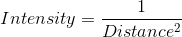

```latex
Intensity = \frac{1}{Distance^{2}}
```

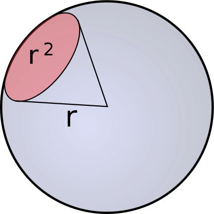

반지름이 r이고 구의 면적이 r^2일때 만들어지는 원뿔의 각을
1스테라디안(steradian, sr) 이라고 한다. 원뿔의 꼭지점으로 부터
만들어지는 가로 사이각과 세로 사이각의 합이다. 이러한 각도를
입체각(solid angle)이라고 정의 한다. 만약 구의 면적이 구 전체에
해당된다면 입체각은 4π (2π + 2π)이다.

반지름이 r인 구의 면적은 4πr^2이고 반지름이 r인 구에서 입체각이
a(radian)인 원뿔의 겉면적은 ar^2이고 이것을 단위 면적이라고 하자. 이때
광자의 개수는 4라고 하자. 반지름이 2r이면 겉면적은 a(2r)^2이고 광자의
개수는 단위 면적당 1이다. 거리가 두배 늘어나면 겉면적의 넓이는 거리의
제곱배 만큼 늘어나고 단위면적당 광자의 개수는 거리의 제곱에
반비례한다는 결론을 얻을 수 있다

* [PBR 이란 무엇인가 - 3. 빛의 감쇠](http://lifeisforu.tistory.com/368)
* [라이팅 기초 @ unrealengine](https://docs.unrealengine.com/latest/KOR/Engine/Rendering/LightingAndShadows/Basics/index.html)
* [Light attenuation](http://brabl.com/light-attenuation/)
* [Radian @ wikipedia](https://en.wikipedia.org/wiki/Radian)
* [Solid Angle @ wikipedia](https://en.wikipedia.org/wiki/Solid_angle)

## 광속

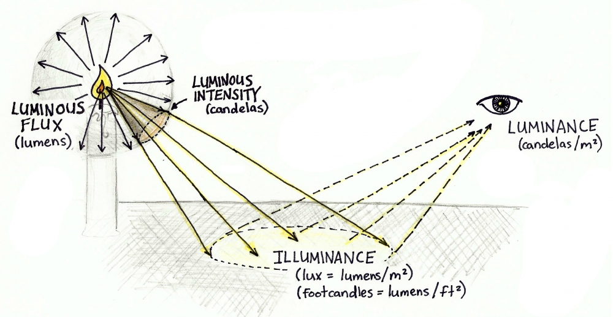

광속(luminous flux, luminous power)은 광원의 밝기이고 단위는 lumen,
lm이다. 광선속(光線束) 혹은 광속(光束)이라는 것은 속도를 의미하는 것이
아니다. 빛 광(光)과 묶을 속(束)이다. 빛의 다발이다. 다발이 많으면
더욱 밝을 것이다.

## 광도


광도(luminous intensity)는 광원에서 방출된 빛이 사방으로 뻗어갈 때
만들어지는 단위 입체각(1 sr)당 광속(lumen)이다. 단위는 candelas,
cd이다. 1 cd는 촛불의 단위 입체각당 광속이다.


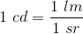

```latex
1 \ cd = \frac{1 \ lm}{1 \ sr}
```

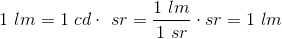

```latex
1 \  lm = 1 \  cd \cdot \ sr = \frac{1 \  lm}{ 1 \ sr} \cdot sr = 1 \ lm
```

촛불의 광속(lumen)을 계산해 보자. 촛불의 광도(luminous intensity)는
1 cd이고 반지름이 1일때 촛불의 구의 겉면적은 4π이므로 다음과 같이 계산한다.


```latex
\begin{align*}
\text{luminous flux of a candle} &= 1 [cd] \times  4 \pi [sr] \\
                                 &= 1 [cd] \times (4 \times 3.1415926) [sr] \\
                                 &= 12.5663704 [lm] \\
                                 &\approx 12.57 [lm] \\ 
\end{align*}
```

* [PBR 이란 무엇인가 - 4. 광원의 밝기, 광속](http://lifeisforu.tistory.com/369)
* [luminous flux @ wikipedia](https://en.wikipedia.org/wiki/Luminous_flux)
* [candela @ wikipedia](https://en.wikipedia.org/wiki/Candela)

## 조도


조도(illuminance)는 빛이 비춰지는 표면의 단위 면적(1 m^2)당
광속(lumen)이고 단위는 lux이다. 1m^2내에 들어 온 빛의 양이 1 lm일때 1
럭스(lux)라고 한다.

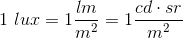

```latex
1 \ lux = 1 \frac{lm}{m^{2}} = 1 \frac{cd \cdot sr}{m^{2}}
```

* [PBR 이란 무엇인가 - 5. 조도 측정](http://lifeisforu.tistory.com/370)
* [illuminance @ wikipedia](https://en.wikipedia.org/wiki/Illuminance)

## 휘도

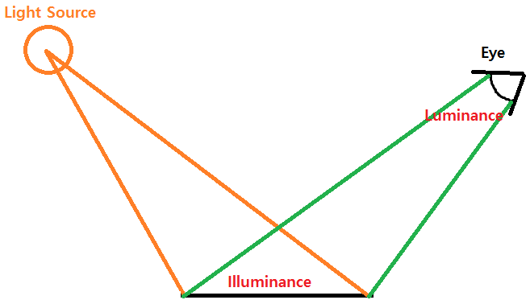

휘도(luminance)는 광원에서 방출된 빛이 지표면을 비추고 반사되어
우리눈에 들어올때 단위면적(m^2)당 광도(luminous intensity, cd)이다.

## BRDF, BTDF


컴퓨터 그래픽에서는 계산의 편의를 위해 illuminance에 해당하는 표면의
면적과 luminance에 해당하는 눈의 면적은 점이라고 가정하자.

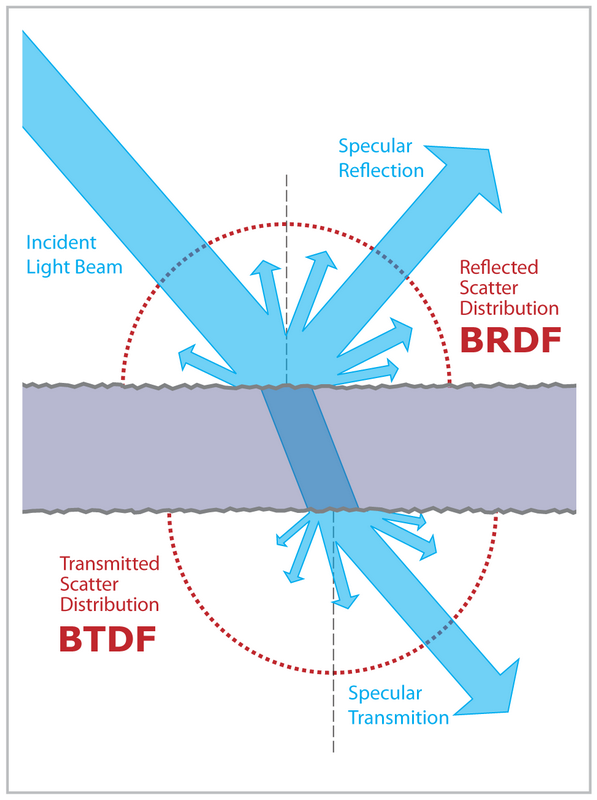

표면(surface)에 들어온 빛(조도, illuminance)는 전부 눈(휘도, luminance)으로
들어오지 않는다. 표면(surface)이 빛을 흡수, 반사, 투과 시키기 때문이다. 우리눈은
반사, 투과된 빛들만 볼 수 있다. 얼만큼의 빛이 반사되었는지 결정하는 함수가 BRDF이고
얼만큼의 빛이 투과되었는지 결정하는 함수가 BTDF이다.

* [PBR 이란 무엇인가 - 6. 휘도 측정](http://lifeisforu.tistory.com/371)
* [luminance @ wikipedia](https://en.wikipedia.org/wiki/Luminance)
* [Microfacet Modles for Refraction through Roufh Surfaces](http://lifeisforu.tistory.com/352)
* [Bidirectional scattering distribution function @ wikipedia](https://en.wikipedia.org/wiki/Bidirectional_scattering_distribution_function)

## Frenel
## Local Illumination & Global Illumination
# Lambert's cosine law

확산반사(diffuse reflectance)가 일어나는 표면의 한 점에서의
복사강도(radiant intensity)I는, 입사광의 단위벡터 L과 표면의 법선
벡터인 면법선 (surface normal)N이 이루는 각도 θ의 코사인에 비례한다.

# Lambertian Reflectance Model

(Johann Heinrich Lambert)[https://en.wikipedia.org/wiki/Johann_Heinrich_Lambert]가 
1760년에 그의 저서 [Photometria](https://en.wikipedia.org/wiki/Photometria)에서 제안한
lighting model이다. lambert's cosine law를 기본으로 하며 diffuse relection을 구하는 방법은
다음과 같다.

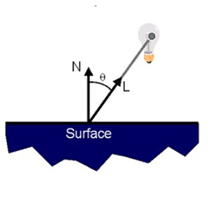

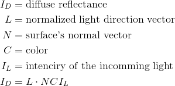

```latex
\begin{align*}
I_{D} &= \text{diffuse reflectance} \\
L     &= \text{normalized light direction vector} \\
N     &= \text{surface's normal vector} \\
C     &= \text{color} \\
I_{L} &= \text{intenciry of the incomming light} \\
\vspace{5mm}
I_{D} = L \cdot N C I_{L} \\
\end{align*}
```

다음은 lambertian reflectance model을 unity3d shader lab으로 구현한 것이다.
[참고](https://github.com/ryukbk/mobile_game_math_unity)

```cpp
Shader "Custom/Diffuse" {
	Properties {
		_Color ("Color", Color) = (1,1,1,1)
	}
	SubShader {
		Pass {
			Tags { "LightMode" = "ForwardBase" }
			
			GLSLPROGRAM
	        #include "UnityCG.glslinc"
	        #if !defined _Object2World
	        #define _Object2World unity_ObjectToWorld
	        #endif

	        uniform vec4 _LightColor0;

	        uniform vec4 _Color;
	         
	        #ifdef VERTEX
			out vec4 color;

	        void main() {	            
	            vec3 surfaceNormal = normalize(vec3(_Object2World * vec4(gl_Normal, 0.0)));
	            vec3 lightDirectionNormal = normalize(vec3(_WorldSpaceLightPos0));
	            vec3 diffuseReflection = vec3(_LightColor0) * vec3(_Color) * max(0.0, dot(surfaceNormal, lightDirectionNormal));
	            color = vec4(diffuseReflection, 1.0);
	            gl_Position = gl_ModelViewProjectionMatrix * gl_Vertex;
	        }
	        #endif

	        #ifdef FRAGMENT
			in vec4 color;

	        void main() {
	           gl_FragColor = color;
	        }
	        #endif

	        ENDGLSL
         }
	} 
	//FallBack "Diffuse"
}
```

# Half Lambert Diffuse

[Half lambert](https://developer.valvesoftware.com/wiki/Half_Lambert)
는 half-life라는 게임에서 처음 등장한 기술이다. 앞서 살펴 본
lambertian reflectance model은 어두운 부분이 너무 어둡기 때문에 이것을
보완 하고자 N과 L의 내적값을 [-1,1]에서 [0,1]로 조정한 것이다.


다음은 half lambert diffuse를 unity3d shaderlab으로 구현한 것이다.
[참고](https://github.com/ryukbk/mobile_game_math_unity)

```cpp
Shader "Custom/Half Lambert" {
	Properties {
		_Color ("Color", Color) = (1,1,1,1)
	}
	SubShader {
		Pass {
			Tags { "LightMode" = "ForwardBase" }
			
			GLSLPROGRAM
	        #include "UnityCG.glslinc"
	        #if !defined _Object2World
	        #define _Object2World unity_ObjectToWorld
	        #endif

	        uniform vec4 _LightColor0;

	        uniform vec4 _Color;
	         
	        #ifdef VERTEX
	        out vec4 color;

	        void main() {	            
	            vec3 surfaceNormal = normalize(vec3(_Object2World * vec4(gl_Normal, 0.0)));
	            vec3 lightDirectionNormal = normalize(vec3(_WorldSpaceLightPos0));
	            float halfLambert = max(0.0, dot(surfaceNormal, lightDirectionNormal)) * 0.5 + 0.5;
	            vec3 diffuseReflection = vec3(_LightColor0) * vec3(_Color) * halfLambert * halfLambert;
	            color = vec4(diffuseReflection, 1.0);
	            gl_Position = gl_ModelViewProjectionMatrix * gl_Vertex;
	        }
	        #endif

	        #ifdef FRAGMENT
	        in vec4 color;

	        void main() {
	           gl_FragColor = color;
	        }
	        #endif

	        ENDGLSL
         }
	} 
	//FallBack "Diffuse"
}
```

# Phong Reflectance  Model

[Bui Tuong Phone](https://en.wikipedia.org/wiki/Bui_Tuong_Phong)
이 1975년에 제안한 lighting model이다.

phong reflection은 ambient, diffuse, specular term의 합으로 구한다.


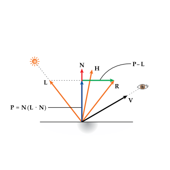


```latex
\begin{align*}
I_{P} &= \text{phong reflectance} \\
I_{A} &= \text{ambient term} \\
I_{D} &= \text{diffuse term} \\
I_{S} &= \text{specular term} \\
\vspace{5mm}
L     &= \text{normalized light direction vector} \\
N     &= \text{surface's normal vector} \\
C     &= \text{color} \\
I_{L} &= \text{intenciry of the incomming light} \\
R     &= \text{reflected ray of light} \\
V     &= \text{normalized vector toward the viewpoint} \\
H     &= \text{normlized vector that is halfway between V and L} \\
P     &= \text{vecotr obtained by orthogonal projection of R to N} \\
A     &= \text{ambient light} \\
α     &= \text{shiness} \\
\vspace{5mm}
P     &= N(L \cdot N)
R - P &= P - L
R     &= 2P - L
      &= 2N(L \cdot N) - L
\vspace{5mm}
I_{A} &= A C\\
I_{D} &= L \cdot N C I_{L} \\
I_{S} &= I_{L}C(max(0, R \cdot V))^{α}\\
\end{align*}
```

위의 식에서 R을 구하는데 내적연산을 사용한다. 내적은 계산 비용이 많기 때문에
R대신 H를 이용해서 같은 효과를 얻을 수 있다. 이것을 Blinn-Phong reflection model
이라고 한다.

```latex
H = \frace{L + V}{|L+V|}
```


# Gouraud shading

phong reflectance model을 vertex shader에 적용한 것

다음은 gouraud shading을 unity3d shader lab으로 구현한 것이다.
[참고](https://github.com/ryukbk/mobile_game_math_unity)

```cpp
Shader "Custom/Gouraud" {
	Properties {
		_Color ("Diffuse Color", Color) = (1,1,1,1)
		_SpecularColor ("Specular Color", Color) = (1,1,1,1)
		_SpecularExponent ("Specular Exponent", Float) = 3
	}
	SubShader {
		Pass {
			Tags { "LightMode" = "ForwardBase" }
			
			GLSLPROGRAM
	        #include "UnityCG.glslinc"
	        #if !defined _Object2World
	        #define _Object2World unity_ObjectToWorld
	        #endif

	        uniform vec4 _LightColor0;

	        uniform vec4 _Color;
	        uniform vec4 _SpecularColor;
	        uniform float _SpecularExponent;

	        #ifdef VERTEX
			out vec4 color;

	        void main() {
	            vec3 ambientLight = gl_LightModel.ambient.xyz * vec3(_Color);

	            vec3 surfaceNormal = normalize((_Object2World * vec4(gl_Normal, 0.0)).xyz);
	            vec3 lightDirectionNormal = normalize(_WorldSpaceLightPos0.xyz);
	            vec3 diffuseReflection = _LightColor0.xyz * _Color.xyz * max(0.0, dot(surfaceNormal, lightDirectionNormal));

                vec3 viewDirectionNormal = normalize((vec4(_WorldSpaceCameraPos, 1.0) - _Object2World * gl_Vertex).xyz);
				vec3 specularReflection = _LightColor0.xyz * _SpecularColor.xyz
					* pow(max(0.0, dot(reflect(-lightDirectionNormal, surfaceNormal), viewDirectionNormal)), _SpecularExponent);              

	            color = vec4(ambientLight + diffuseReflection + specularReflection, 1.0);
	            gl_Position = gl_ModelViewProjectionMatrix * gl_Vertex;
	        }
	        #endif

	        #ifdef FRAGMENT
	        in vec4 color;

	        void main() {
	           gl_FragColor = color;
	        }
	        #endif

	        ENDGLSL
         }
	} 
	//FallBack "Diffuse"
}
```

# Phong Shading

phong reflectance model을 fragment shader에 적용한 것

다음은 phong shading을 unity3d shader lab으로 구현한 것이다.
[참고](https://github.com/ryukbk/mobile_game_math_unity)

```cpp
Shader "Custom/Phong" {
	Properties {
		_Color ("Diffuse Color", Color) = (1,1,1,1)
		_SpecularColor ("Specular Color", Color) = (1,1,1,1)
		_SpecularExponent ("Specular Exponent", Float) = 3
	}
	SubShader {
		Pass {
			Tags { "LightMode" = "ForwardBase" }
			
			GLSLPROGRAM
	        #include "UnityCG.glslinc"
	        #if !defined _Object2World
	        #define _Object2World unity_ObjectToWorld
	        #endif

	        uniform vec4 _LightColor0;

	        uniform vec4 _Color;
	        uniform vec4 _SpecularColor;
	        uniform float _SpecularExponent;

	        #ifdef VERTEX
			out vec4 glVertexWorld;
			out vec3 surfaceNormal;

	        void main() {	            
	            surfaceNormal = normalize((_Object2World * vec4(gl_Normal, 0.0)).xyz);
	            glVertexWorld = _Object2World * gl_Vertex;

	            gl_Position = gl_ModelViewProjectionMatrix * gl_Vertex;
	        }
	        #endif

	        #ifdef FRAGMENT
			in vec4 glVertexWorld;
			in vec3 surfaceNormal;

	        void main() {
	        	vec3 ambientLight = gl_LightModel.ambient.xyz * vec3(_Color);
	        
				vec3 lightDirectionNormal = normalize(_WorldSpaceLightPos0.xyz);
	            vec3 diffuseReflection = _LightColor0.xyz * _Color.xyz * max(0.0, dot(surfaceNormal, lightDirectionNormal));

                vec3 viewDirectionNormal = normalize((vec4(_WorldSpaceCameraPos, 1.0) - glVertexWorld).xyz);
				vec3 specularReflection = _LightColor0.xyz * _SpecularColor.xyz
					* pow(max(0.0, dot(reflect(-lightDirectionNormal, surfaceNormal), viewDirectionNormal)), _SpecularExponent);                      
	        
	        	gl_FragColor = vec4(ambientLight + diffuseReflection + specularReflection, 1.0);
	        }
	        #endif

	        ENDGLSL
         }
	} 
	//FallBack "Diffuse"
}
```

# Rim Lighting

빛에 의해 오브젝트의 외곽이 빛나는 현상. N과 L의 사이각이 0일때 가장
약하고 90일때 가장 강하다.

다음은 phong shading과 rim lighting을 unity3d shader lab으로 구현한 것이다.
[참고](https://github.com/ryukbk/mobile_game_math_unity)

```cpp
Shader "Custom/Rim" {
	Properties {
		_Color ("Diffuse Color", Color) = (1,1,1,1)
		_SpecularColor ("Specular Color", Color) = (1,1,1,1)
		_SpecularExponent ("Specular Exponent", Float) = 3
		_RimColor ("Rim Color", Color) = (0,1,0,1)
	}
	SubShader {
		Pass {
			Tags { "LightMode" = "ForwardBase" }
			
			GLSLPROGRAM
	        #include "UnityCG.glslinc"
	        #if !defined _Object2World
	        #define _Object2World unity_ObjectToWorld
	        #endif

	        uniform vec4 _LightColor0;

	        uniform vec4 _Color;
	        uniform vec4 _SpecularColor;
	        uniform float _SpecularExponent;
	        uniform vec4 _RimColor;

	        #ifdef VERTEX
	        out vec4 glVertexWorld;
	        out vec3 surfaceNormal;

	        void main() {	            
	            surfaceNormal = normalize((_Object2World * vec4(gl_Normal, 0.0)).xyz);
	            glVertexWorld = _Object2World * gl_Vertex;

	            gl_Position = gl_ModelViewProjectionMatrix * gl_Vertex;
	        }
	        #endif

	        #ifdef FRAGMENT
	        in vec4 glVertexWorld;
	        in vec3 surfaceNormal;

	        void main() {
	        	vec3 ambientLight = gl_LightModel.ambient.xyz * vec3(_Color);
	        
				vec3 lightDirectionNormal = normalize(_WorldSpaceLightPos0.xyz);
	            vec3 diffuseReflection = _LightColor0.xyz * _Color.xyz * max(0.0, dot(surfaceNormal, lightDirectionNormal));

                vec3 viewDirectionNormal = normalize((vec4(_WorldSpaceCameraPos, 1.0) - glVertexWorld).xyz);
				vec3 specularReflection = _LightColor0.xyz * _SpecularColor.xyz
					* pow(max(0.0, dot(reflect(-lightDirectionNormal, surfaceNormal), viewDirectionNormal)), _SpecularExponent);                      

	        	float rim = 1.0 - saturate(dot(viewDirectionNormal, surfaceNormal));        
	        	gl_FragColor.xyz = ambientLight + diffuseReflection + specularReflection + vec3(smoothstep(0.5, 1.0, rim)) * _RimColor.xyz;
	        	gl_FragColor.w = 1.0;
	        }
	        #endif

	        ENDGLSL
         }
	} 
	//FallBack "Diffuse"
}
```


# Cook-Torrance Model

다음은 cook-torrance model을 unity3d shader lab으로 구현한 것이다.
[참고](https://github.com/ryukbk/mobile_game_math_unity)

```cpp
Shader "Custom/CookTorrance" {
	Properties {
		_Color ("Diffuse Color", Color) = (1,1,1,1)
		_Roughness ("Roughness", Float) = 0.5
		_FresnelReflectance ("Fresnel Reflectance", Float) = 0.5
	}
	SubShader {
		Pass {
			Tags { "LightMode" = "ForwardBase" }
			
			GLSLPROGRAM
	        #include "UnityCG.glslinc"
	        #if !defined _Object2World
	        #define _Object2World unity_ObjectToWorld
	        #endif

	        uniform vec4 _LightColor0;

	        uniform vec4 _Color;
	        uniform float _Roughness;
	        uniform float _FresnelReflectance;

	        #ifdef VERTEX
	        out vec4 glVertexWorld;
	        out vec3 surfaceNormal;

	        void main() {	            
	            surfaceNormal = normalize((_Object2World * vec4(gl_Normal, 0.0)).xyz);
	            glVertexWorld = _Object2World * gl_Vertex;

	            gl_Position = gl_ModelViewProjectionMatrix * gl_Vertex;
	        }
	        #endif

	        #ifdef FRAGMENT
	        in vec4 glVertexWorld;
	        in vec3 surfaceNormal;

	        void main() {
	        	vec3 ambientLight = gl_LightModel.ambient.xyz * vec3(_Color);
	        
				vec3 lightDirectionNormal = normalize(_WorldSpaceLightPos0.xyz);
				float NdotL = saturate(dot(surfaceNormal, lightDirectionNormal));

			   	vec3 viewDirectionNormal = normalize((vec4(_WorldSpaceCameraPos, 1.0) - glVertexWorld).xyz);
			   	float NdotV = saturate(dot(surfaceNormal, viewDirectionNormal));

			    vec3 halfVector = normalize(lightDirectionNormal + viewDirectionNormal);
			    float NdotH = saturate(dot(surfaceNormal, halfVector));
			    float VdotH = saturate(dot(viewDirectionNormal, halfVector));

				float roughness = saturate(_Roughness);
			    float alpha = roughness * roughness;
			    float alpha2 = alpha * alpha;
				float t = ((NdotH * NdotH) * (alpha2 - 1.0) + 1.0);
				float PI = 3.1415926535897;
				float D = alpha2 / (PI * t * t);

			    float F0 = saturate(_FresnelReflectance);
			    float F = pow(1.0 - VdotH, 5.0);
			    F *= (1.0 - F0);
			    F += F0;

			    float NH2 = 2.0 * NdotH;
			    float g1 = (NH2 * NdotV) / VdotH;
			    float g2 = (NH2 * NdotL) / VdotH;
			    float G = min(1.0, min(g1, g2));

			    float specularReflection = (D * F * G) / (4.0 * NdotV * NdotL + 0.000001);
				vec3 diffuseReflection = _LightColor0.xyz * _Color.xyz * NdotL;

			    gl_FragColor = vec4(ambientLight + diffuseReflection + specularReflection, 1.0);
	        }
	        #endif

	        ENDGLSL
         }
	} 
	//FallBack "Diffuse"
}
```

# Oren-Nayar Model

# [PBR](../pbr/README.md)

# Ray Traciing

# Radiosity
