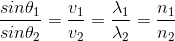
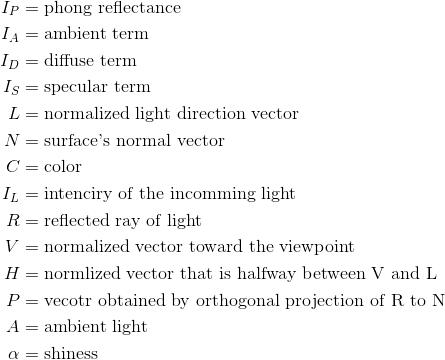
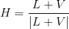

- [Abstract](#abstract)
- [Materials](#materials)
- [Fundamentals](#fundamentals)
  - [Light](#light)
  - [Eye](#eye)
  - [조도와 휘도 (illuminance & luminance)](#%EC%A1%B0%EB%8F%84%EC%99%80-%ED%9C%98%EB%8F%84-illuminance--luminance)
  - [빛의 감쇠 (attenuation)](#%EB%B9%9B%EC%9D%98-%EA%B0%90%EC%87%A0-attenuation)
  - [광속](#%EA%B4%91%EC%86%8D)
  - [광도](#%EA%B4%91%EB%8F%84)
  - [조도](#%EC%A1%B0%EB%8F%84)
  - [휘도](#%ED%9C%98%EB%8F%84)
  - [BRDF, BTDF](#brdf-btdf)
  - [Local Illumination & Global Illumination](#local-illumination--global-illumination)
  - [굴절률(Refractive index)](#%EA%B5%B4%EC%A0%88%EB%A5%A0refractive-index)
  - [Snell's law](#snells-law)
  - [Fresnel Equation](#fresnel-equation)
- [Lambert's cosine law](#lamberts-cosine-law)
- [Lambertian Reflectance Model](#lambertian-reflectance-model)
  - [WebGL](#webgl)
  - [Unity3d shaderlab](#unity3d-shaderlab)
- [Half Lambert Diffuse](#half-lambert-diffuse)
  - [WebGL](#webgl-1)
  - [Unity3d shaderlab](#unity3d-shaderlab-1)
- [Phong Reflectance Model](#phong-reflectance-model)
- [Gouraud shading](#gouraud-shading)
  - [WebGL](#webgl-2)
  - [Unity3d shaderlab](#unity3d-shaderlab-2)
- [Phong Shading](#phong-shading)
  - [WebGL](#webgl-3)
  - [unity3d shaderlab](#unity3d-shaderlab)
- [Rim Lighting](#rim-lighting)
  - [WebGL](#webgl-4)
  - [unity3d shaderlab](#unity3d-shaderlab-1)
- [Cook-Torrance Model](#cook-torrance-model)
  - [WebGL](#webgl-5)
  - [unity3d shader lab](#unity3d-shader-lab)
- [Oren-Nayar Model](#oren-nayar-model)
  - [WebGL](#webgl-6)
  - [unity3d shader lab](#unity3d-shader-lab-1)
- [Physically Based Rendering](#physically-based-rendering)
- [Ray Tracing](#ray-tracing)
- [Path Tracing](#path-tracing)
- [Radiosity](#radiosity)
- [Ray Marching](#ray-marching)
- [LPV (Light Propagation Volume)](#lpv-light-propagation-volume)
- [SVOGI (Sparse Voxel Octree Global Illumination)](#svogi-sparse-voxel-octree-global-illumination)
-------------------------------------------------------------------------------

# Abstract

라이트의 기본개념과 로컬일루미네이션 그리고 글로벌 일루미네이션까지 정리한다.

# Materials

- [Advanced Global Illumination, Second Edition](https://www.amazon.com/Advanced-Global-Illumination-Second-Philip/dp/1568813074)
- [Physically Based Rendering](http://www.pbrt.org/)
- [Real Shading in Unreal Engine 4](https://cdn2.unrealengine.com/Resources/files/2013SiggraphPresentationsNotes-26915738.pdf)
  - 2013 SIGRAPH paper
  - [번역](http://lifeisforu.tistory.com/348)
- [A Reflectance Model for Computer Graphics](http://graphics.pixar.com/library/ReflectanceModel/paper.pdf)  
  - [번역](http://lifeisforu.tistory.com/349)
- [Physically-Based Shading at Disney](https://disney-animation.s3.amazonaws.com/library/s2012_pbs_disney_brdf_notes_v2.pdf)  
  - [번역](http://lifeisforu.tistory.com/350)
- [Microfacet Models for Refraction through Rough Surfaces](https://www.cs.cornell.edu/~srm/publications/EGSR07-btdf.pdf)  
  - [번역](http://lifeisforu.tistory.com/352)
- [PBR 이란 무엇인가 @ tistory](http://lifeisforu.tistory.com/366)
- [Everything is Shiny](http://filmicworlds.com/blog/everything-is-shiny/)
- [Everything has Fresnel](http://filmicworlds.com/blog/everything-has-fresnel/)
- [Tutorial of Ray Casting, Ray Tracing, Path Tracing and Ray Marching](http://blog.ruofeidu.com/tutorial-of-ray-casting-ray-tracing-and-ray-marching/)
  - ray casting, ray tracing, path tracing, ray marching 을 애니메이션과 함께 설명

# Fundamentals

## Light


빛은 전자기파(Electromagnetic wave)이다. 전자기파는 전자기적 과정에 의해 발생하는
에너지이다. 파동의 형태로 발산되는 에너지라고 할 수 있다. 빛은 파장이 다른 여러 가지 
전자기파로 구성되어 있다.


빛은 여러가지 전자기파들로 구성되어 있기 때문에 프리즘을 사용해서 각각을 분리할 수 있다.
빨간색 파장의 길이가 가장 길고 보라색 파장의 길이가 가장 짧다.

* [PBR 이란 무엇인가 - 1. 인간과 빛 @ tistory](http://lifeisforu.tistory.com/366)
* [Physically based rendering @ wikipedia](https://en.wikipedia.org/wiki/Physically_based_rendering)
* [BASIC THEORY OF PHYSICALLY-BASED RENDERING](https://www.marmoset.co/posts/basic-theory-of-physically-based-rendering/)
* [빛이란 무엇인가? - Barry R. Masters](http://e-ico.org/sites/default/files/pdfs/whatIsLightKorean.pdf)
* [Light @ wikipedia](https://en.wikipedia.org/wiki/Light)
* [파동의표시](http://lovescience.pe.kr/ms/chapter12/12_1_study2.htm)

## Eye


우리 눈의 망막(retina)를 확대해 보면 원추세포(cone cell: blue cone,
red cone, green cone)와 간상세포(rod)가 있다. 원추세포(cone cell)는
색상을 감지하고 간상세포(rod)는 명암을 감지한다.  원추세포는 그것을
구성하고 있는 감광세포의 종류에 따라 받아들일 수 있는 색상이 정해져
있다. 우측 그림을 보면 3종류의 원추세포가 존재하고 그것은 RGB와 같다.
이것은 텍스처를 제작할때 RGB채널을 사용하는 이유기도 하다.

우리 눈의 원추세포(cone cell)는 약 600만개이고 간상세포(rod)는 약
9000만개이다.  따라서 우리 눈은 색상 대비보다 명도 대비에 더욱
민감하다. 새의 눈은 인간 보다 많은 감광 색소를 가지고 있어서 자외선
까지 볼 수 있다고 한다.

* [PBR 이란 무엇인가 - 1. 인간과 빛 @ tistory](http://lifeisforu.tistory.com/366)
* [Color Vision in Birds](http://www.webexhibits.org/causesofcolor/17B.html)
* [원추세포 @ 위키피디아](https://ko.wikipedia.org/wiki/%EC%9B%90%EC%B6%94%EC%84%B8%ED%8F%AC)

## 조도와 휘도 (illuminance & luminance)


빛은 다양한 전자기파로 구성되어 있다. 가시광선(visible spectrum)을
포함한 전체 파장 영역의 전자기파들로 구성된 빛을
방사선(radiation)이라고 한다. 전체 파장 영역의 빛을 다루기 위해
에너지를 측정하는 것은 방사측정(radiometry)라 하고 가시 영역(visible
spectrum)의 빛을 다루기 위해 에너지를 측정하는 것을
광도측정(photometry)라고 한다.

방사측정(radiometry)는 제곱미터당 일률(watt per sqaure meter)의 단위로
에너지를 측정하고 광도측정(photometry)는 제곱미터당 루멘(lumens per
square meter)단위로 에너지를 측정한다. 전자는 파워(power)를 의미하고 후자는
밝기(brightness)를 의미한다.

조도의 "조(照)"는 "비출 조" 이고 휘도의 "휘(輝)"는 "빛날 휘"다.
광원(light source)에서 빛이 나오는 양을 조도라고 하고 광원(light source)에서
나온 빛이 특정 오브젝트에 반사되어 나오는 빛의 양을 휘도라고 한다.
조도는 빛이 비추는 정도이고 휘도는 빛이 빛나는 정도라고 기억하면 쉽다.

방사측정(radiometry)의 경우 조도를 irradiance라고 하고 휘도를
radiance라고 한다.  광도측정(photometry)의 경우 조도를 illuminance라고
하고 휘도를 luminance라고 한다.


특정 표면(surface)에 도달한 빛이 모두 우리 눈으로 들어 오는 것은 아니다. 표면의
재질에 따라 흡수(absorbed), 투과(transmitted), 반사(reflected), 방출(emitted)
된다. 우리 눈은 반사(reflected), 투과(transmitted), 방출(emitted)된 빛만 인지 할 수 있다.

* [PBR 이란 무엇인가 - 2. 조도와 휘도](http://lifeisforu.tistory.com/367)
* [radiation](https://en.wikipedia.org/wiki/Radiation)
* [radiometry](https://en.wikipedia.org/wiki/Radiometry)
* [photometry](https://en.wikipedia.org/wiki/Photometry_(optics))

## 빛의 감쇠 (attenuation)

빛은 다양한 파장의 전자기파들의 조합 이지만 때로는 입자 처럼 보일때가
있다. 이것을 빛이 파동성과 입자성을 가지고 있다고 한다. 입자 처럼
보일때 빛을 광자(photon)라고 한다.


위의 그림은 거리 r의 배수에 따라 단위면적당 광자의 개수를 표시한
것이다.  거리 r이 늘어나면 단위면적당 광자의 개수는 줄어들고 광자의
개수가 줄어들면 빛의 세기는 어두워 진다. 빛의 세기는 거리의 제곱에
반비례한다.


```latex
Intensity = \frac{1}{Distance^{2}}
```


반지름이 r이고 구의 면적이 r^2일때 만들어지는 원뿔의 각을
1스테라디안(steradian, sr) 이라고 한다. 원뿔의 꼭지점으로 부터
만들어지는 가로 사이각과 세로 사이각의 합이다. 이러한 각도를
입체각(solid angle)이라고 정의 한다. 만약 구의 면적이 구 전체에
해당된다면 입체각은 4π (2π + 2π)이다.

반지름이 r인 구의 면적은 `4πr^2`이고 반지름이 r인 구에서 입체각이
a(radian)인 원뿔의 겉면적은 ar^2이고 이것을 단위 면적이라고 하자. 이때
광자의 개수는 4라고 하자. 반지름이 2r이면 겉면적은 a(2r)^2이고 광자의
개수는 단위 면적당 1이다. 거리가 두배 늘어나면 겉면적의 넓이는 거리의
제곱배 만큼 늘어나고 단위면적당 광자의 개수는 거리의 제곱에
반비례한다는 결론을 얻을 수 있다

* [PBR 이란 무엇인가 - 3. 빛의 감쇠](http://lifeisforu.tistory.com/368)
* [라이팅 기초 @ unrealengine](https://docs.unrealengine.com/latest/KOR/Engine/Rendering/LightingAndShadows/Basics/index.html)
* [Light attenuation](http://brabl.com/light-attenuation/)
* [Radian @ wikipedia](https://en.wikipedia.org/wiki/Radian)
* [Solid Angle @ wikipedia](https://en.wikipedia.org/wiki/Solid_angle)

## 광속


광속(luminous flux, luminous power)은 광원의 밝기이고 단위는 lumen,
lm이다. 광선속(光線束) 혹은 광속(光束)이라는 것은 속도를 의미하는 것이
아니다. 빛 광(光)과 묶을 속(束)이다. 빛의 다발이다. 다발이 많으면
더욱 밝을 것이다.

## 광도


광도(luminous intensity)는 광원에서 방출된 빛이 사방으로 뻗어갈 때
만들어지는 단위 입체각(1 sr)당 광속(lumen)이다. 단위는 candelas,
cd이다. 1 cd는 촛불의 단위 입체각당 광속이다.


```latex
1 \ cd = \frac{1 \ lm}{1 \ sr}
```


```latex
1 \  lm = 1 \  cd \cdot \ sr = \frac{1 \  lm}{ 1 \ sr} \cdot sr = 1 \ lm
```

촛불의 광속(lumen)을 계산해 보자. 촛불의 광도(luminous intensity)는
1 cd이고 반지름이 1일때 촛불의 구의 겉면적은 4π이므로 다음과 같이 계산한다.


```latex
\begin{align*}
\text{luminous flux of a candle} &= 1 [cd] \times  4 \pi [sr] \\
                                 &= 1 [cd] \times (4 \times 3.1415926) [sr] \\
                                 &= 12.5663704 [lm] \\
                                 &\approx 12.57 [lm] \\ 
\end{align*}
```

* [PBR 이란 무엇인가 - 4. 광원의 밝기, 광속](http://lifeisforu.tistory.com/369)
* [luminous flux @ wikipedia](https://en.wikipedia.org/wiki/Luminous_flux)
* [candela @ wikipedia](https://en.wikipedia.org/wiki/Candela)

## 조도


조도(illuminance)는 빛이 비춰지는 표면의 단위 면적(1 m^2)당
광속(lumen)이고 단위는 lux이다. 1m^2내에 들어 온 빛의 양이 1 lm일때 1
럭스(lux)라고 한다.


```latex
1 \ lux = 1 \frac{lm}{m^{2}} = 1 \frac{cd \cdot sr}{m^{2}}
```

* [PBR 이란 무엇인가 - 5. 조도 측정](http://lifeisforu.tistory.com/370)
* [illuminance @ wikipedia](https://en.wikipedia.org/wiki/Illuminance)

## 휘도


휘도(luminance)는 광원에서 방출된 빛이 지표면을 비추고 반사되어
우리눈에 들어올때 단위면적(m^2)당 광도(luminous intensity, cd)이다.

## BRDF, BTDF

컴퓨터 그래픽에서는 계산의 편의를 위해 illuminance에 해당하는 표면의
면적과 luminance에 해당하는 눈의 면적은 점이라고 가정하자.


표면(surface)에 들어온 빛(조도, illuminance)는 전부 눈(휘도, luminance)으로
들어오지 않는다. 표면(surface)이 빛을 흡수, 반사, 투과 시키기 때문이다. 우리눈은
반사, 투과된 빛들만 볼 수 있다. 얼만큼의 빛이 반사되었는지 결정하는 함수가 BRDF이고
얼만큼의 빛이 투과되었는지 결정하는 함수가 BTDF이다.

* [PBR 이란 무엇인가 - 6. 휘도 측정](http://lifeisforu.tistory.com/371)
* [luminance @ wikipedia](https://en.wikipedia.org/wiki/Luminance)
* [Microfacet Modles for Refraction through Roufh Surfaces](http://lifeisforu.tistory.com/352)
* [Bidirectional scattering distribution function @ wikipedia](https://en.wikipedia.org/wiki/Bidirectional_scattering_distribution_function)

## Local Illumination & Global Illumination


현실 세계의 오브젝트들은 직접광과 간접광의 영향을 받는다.  만약
간접광이 없다면 직접광이 비추어지지 않는 곳은 굉장히 어두울 것이다.
간접광을 잘 계산해야 현실세계와 비슷한 장면을 연출 할 수 있다.  그러나
간접광의 현실적 계산은 비용이 많이 들기 때문에 간략히 계산하기 위해
ambient light를 만들어 모든 오브젝트에 동일한 밝기를 적용한다. ambient
light는 global ambient와 material ambient로 분류된다.  직접광과
ambient light을 이용하여 조명 연출하는 것을 local illumination이라고
한다.


local illumination은 현실세계와 거리가 멀다. 표면에 들어온
빛(직접광,간접광)은 반사, 흡수, 투과 된다. 이때 반사 및 투과되는 빛은
새로운 광원(간접광)으로 작용한다.  간접광을 잘 계산하여 조명 연출하는
것을 global illumination이라고 한다.

간접광을 실시간으로 근사계산 하기 위해 LPV(Light Propagation Volume),
SVOGI(Sparse Voxel Octree Global Illumination)등이 있다.
간접광을 실시간으로 계산하는 것은 어렵기 때문에 미리 계산한 것을
이용하는 방법도 있다. 이것을 Image Based Lighting이라고 한다.

* [PBR 이란 무엇인가 - 9. Global Illumination & Indirect Lighting](http://lifeisforu.tistory.com/374)
* [Global Illumination @ wikipedia](https://en.wikipedia.org/wiki/Global_illumination)
* [PRACTICAL REAL-TIME VOXEL-BASED GLOBAL ILLUMINATION FOR CURRENT GPUS, Alexey Panteleev, NVIDIA.]()
* [Real-time Global Illumination Using Voxel Cone Tracing, Fredrik Prantare.](https://prantare.files.wordpress.com/2016/12/frepr183_voxel_cone_tracing.pdf)

## 굴절률(Refractive index)

굴절률(refractive index)는 빛이 진공에서 특정 매질로 이동할 때 속도가
얼마나 느려지는지 그 비율을 측정한 것이다. IOR (Index of refraction)이라고도
한다. 속도가 느려지면 전진하는 방향도 달라진다.


포장도로를 달리다가 모래위를 달리는 수레바퀴를 생각해보자. 좌측 바퀴가
먼저 모래를 밟을 것이고 우측 바퀴는 여전히 같은 속도로 움직이기 때문에
방향은 틀어질 것이다. 바퀴가 크면 적게 틀어질 것이고 바퀴가 작으면 많이
틀어질 것이다. 


위의 그림에서 빛이 프리즘을 통과하면 빛이 지나는 매질이 변화되어
굴절률이 달라진다. 바퀴의 크기는 파장과 같다. 파장이 짧은 보라색 빛은
많이 꺾이는 것을 알 수 있다.

## Snell's law


서로 다른 굴절률을 가진 매질에서 빛이 얼마나 꺾이는 지에 대한
법칙이다.  붉은색 라인은 빛의 경로를 의미한다. 매질의
경계(interface)에서 빛이 굴절한다. θ 는 normal과 굴절광(refracted
light)의 각도, v 는 속도(velocity), n은 굴절률(IOR), λ 는
파장(wavelength)을 의미할때 다음과 같은 수식이 성립한다.



```latex
\frac{sin \theta_{1}}{sin \theta_{2}} = \frac{v_{1}}{v_{2}} = \frac{\lambda_{1}}{\lambda_{2}} = \frac{n_{1}}{n_{2}}
```


빛이 서로 다른 매질을 만날때 특정 각도에서는 굴절을 하지 않고 완전히
반사하는 경우가 있다. 각도가 critical angle보다 커지면 전반사가
일어난다. critical angle 은 다음과 같은 수식을 통해서 구한다.


```latex
\theta_{c} = arcsin( \frac{n_{2}}{n_{1}} )
```

## Fresnel Equation

fresnel equation은 빛이 서로다른 매질을 통과할때 관찰자가 어느
방향으로 보는지에 따라 얼만큼의 빛이 반사되는지를 얻을 수 있는
공식이다. [law of reflection](https://en.wikipedia.org/wiki/Specular_reflection) 등을
통해서 유도된다. 편광도 고려해야 해서 매우 복잡하다. 컴퓨터
그래픽에서는 근사 계산한 공식을 이용한다. 다음은 Christophe Schlick이
만든 Schilick's approximation이다.


```latex
\begin{align*}
R(\theta) &= R_{0} + (1 - R_{0}) (1 - cos \theta)^{5} \\
R_{0}     &= ( \frac{n_{1} - n_{2}}{n_{1} + n_{2}} )^{2} \\
\end{align*}
```


위 그림은 Fresnel equation을 나타내는 그래프이다. 여러가지 매질에 대해
각도에 따라 반사율(R(θ))을 알 수 있다. 가로축이 눈과 노멀의 각도이고
세로축이 반사율(R(θ))이다. 눈과 노멀의 각도가 90에 가까울 수록 반사가 
많이 된다.

* [PBR 이란 무엇인가- 17.Fresnel이란? @ tistory](http://lifeisforu.tistory.com/384)
* [Fresnel equation @ Wikipedia](https://en.wikipedia.org/wiki/Fresnel_equations)
* [Auguistin-Jean Fresnel @ Wikipedia](https://en.wikipedia.org/wiki/Augustin-Jean_Fresnel)
* [Light](https://en.wikipedia.org/wiki/Light)
* [Refractive index](https://en.wikipedia.org/wiki/Refractive_index)
* [빛이란 무엇인가?](https://www.kyobobook.co.kr/product/detailViewKor.laf?mallGb=KOR&ejkGb=KOR&barcode=9788955378061&orderClick=JAj)
* [Snell's law](https://en.wikipedia.org/wiki/Snell%27s_law)
* [Refraction](https://en.wikipedia.org/wiki/Refraction)
* [Schilick's approzimation](https://en.wikipedia.org/wiki/Schlick%27s_approximation)
* [Real Shading in Unreal Engine 4](http://lifeisforu.tistory.com/348)
* [머터리얼에 프레넬 사용하기 @ unrealengine](https://docs.unrealengine.com/latest/KOR/Engine/Rendering/Materials/HowTo/Fresnel/index.html)

# Lambert's cosine law

확산반사(diffuse reflectance)가 일어나는 표면의 한 점에서의
복사강도(radiant intensity)I는, 입사광의 단위벡터 L과 표면의 법선
벡터인 면법선 (surface normal)N이 이루는 각도 θ의 코사인에 비례한다.

# Lambertian Reflectance Model

[Johann Heinrich Lambert](https://en.wikipedia.org/wiki/Johann_Heinrich_Lambert)가
1760년에 그의
저서 [Photometria](https://en.wikipedia.org/wiki/Photometria)에서
제안한 lighting model이다. lambert's cosine law를 기본으로 하며
diffuse relection을 구하는 방법은 다음과 같다.


```latex
\begin{align*}
I_{D} &= \text{diffuse reflectance} \\
L     &= \text{normalized light direction vector} \\
N     &= \text{surface's normal vector} \\
C     &= \text{color} \\
I_{L} &= \text{intenciry of the incomming light} \\
\vspace{5mm}
I_{D} = L \cdot N C I_{L} \\
\end{align*}
```

## WebGL

```glsl
```

## Unity3d shaderlab

다음은 lambertian reflectance model을 unity3d shader lab으로 구현한 것이다.
[참고](https://github.com/ryukbk/mobile_game_math_unity)

```glsl
Shader "Custom/Diffuse" {
  Properties {
    _Color ("Color", Color) = (1,1,1,1)
  }
  SubShader {
    Pass {
      Tags { "LightMode" = "ForwardBase" }
			
      GLSLPROGRAM
      #include "UnityCG.glslinc"
      #if !defined _Object2World
        #define _Object2World unity_ObjectToWorld
      #endif

      uniform vec4 _LightColor0;
      uniform vec4 _Color;
	         
      #ifdef VERTEX
        out vec4 color;

        void main() {	            
          vec3 surfaceNormal = normalize(vec3(_Object2World * vec4(gl_Normal, 0.0)));
          vec3 lightDirectionNormal = normalize(vec3(_WorldSpaceLightPos0));
          vec3 diffuseReflection = vec3(_LightColor0) * vec3(_Color) * max(0.0, dot(surfaceNormal, lightDirectionNormal));
          color = vec4(diffuseReflection, 1.0);
          gl_Position = gl_ModelViewProjectionMatrix * gl_Vertex;
        }
      #endif

      #ifdef FRAGMENT
        in vec4 color;

        void main() {
          gl_FragColor = color;
        }
      #endif
      ENDGLSL
    }
  } 
  //FallBack "Diffuse"
}
```

# Half Lambert Diffuse

[Half lambert](https://developer.valvesoftware.com/wiki/Half_Lambert)
는 half-life라는 게임에서 처음 등장한 기술이다. 앞서 살펴 본
lambertian reflectance model은 어두운 부분이 너무 어둡기 때문에 이것을
보완 하고자 N과 L의 내적값을 [-1,1]에서 [0,1]로 조정한 것이다.


## WebGL

```glsl
```

## Unity3d shaderlab

다음은 half lambert diffuse를 unity3d shaderlab으로 구현한 것이다.
[참고](https://github.com/ryukbk/mobile_game_math_unity)

```glsl
Shader "Custom/Half Lambert" {
  Properties {
    _Color ("Color", Color) = (1,1,1,1)
  }
  SubShader {
    Pass {
      Tags { "LightMode" = "ForwardBase" }
			
      GLSLPROGRAM
      #include "UnityCG.glslinc"
      #if !defined _Object2World
        #define _Object2World unity_ObjectToWorld
      #endif

      uniform vec4 _LightColor0;
      uniform vec4 _Color;
	         
      #ifdef VERTEX
        out vec4 color;

        void main() {	            
          vec3 surfaceNormal = normalize(vec3(_Object2World * vec4(gl_Normal, 0.0)));
          vec3 lightDirectionNormal = normalize(vec3(_WorldSpaceLightPos0));
          float halfLambert = max(0.0, dot(surfaceNormal, lightDirectionNormal)) * 0.5 + 0.5;
          vec3 diffuseReflection = vec3(_LightColor0) * vec3(_Color) * halfLambert * halfLambert;
          color = vec4(diffuseReflection, 1.0);
          gl_Position = gl_ModelViewProjectionMatrix * gl_Vertex;
        }
      #endif

      #ifdef FRAGMENT
        in vec4 color;

        void main() {
          gl_FragColor = color;
        }
      #endif

      ENDGLSL
    }
  } 
	//FallBack "Diffuse"
}
```

# Phong Reflectance  Model

[Bui Tuong Phong](https://en.wikipedia.org/wiki/Bui_Tuong_Phong)
이 1975년에 제안한 lighting model이다.

phong reflection은 ambient, diffuse, specular term의 합으로 구한다.





```latex
\begin{align*}
I_{P} &= \text{phong reflectance} \\
I_{A} &= \text{ambient term} \\
I_{D} &= \text{diffuse term} \\
I_{S} &= \text{specular term} \\
\vspace{5mm}
L     &= \text{normalized light direction vector} \\
N     &= \text{surface's normal vector} \\
C     &= \text{color} \\
I_{L} &= \text{intenciry of the incomming light} \\
R     &= \text{reflected ray of light} \\
V     &= \text{normalized vector toward the viewpoint} \\
H     &= \text{normlized vector that is halfway between V and L} \\
P     &= \text{vecotr obtained by orthogonal projection of R to N} \\
A     &= \text{ambient light} \\
\alpha &= \text{shiness} \\
\vspace{5mm}
P     &= N(L \cdot N) \\
R - P &= P - L \\
R     &= 2P - L \\
      &= 2N(L \cdot N) - L \\
\vspace{5mm}
I_{A} &= A C\\
I_{D} &= L \cdot N C I_{L} \\
I_{S} &= I_{L}C(max(0, R \cdot V))^{\alpha}\\
\end{align*}
```

위의 식에서 R을 구하는데 내적연산을 사용한다. 내적은 계산 비용이 많기 때문에
R대신 H를 이용해서 같은 효과를 얻을 수 있다. 이것을 Blinn-Phong reflection model
이라고 한다.



```latex
H = \frace{L + V}{|L+V|}
```


# Gouraud shading

phong reflectance model을 vertex shader에 적용한 것

## WebGL

```glsl
```

## Unity3d shaderlab

다음은 gouraud shading을 unity3d shader lab으로 구현한 것이다.
[참고](https://github.com/ryukbk/mobile_game_math_unity)

```glsl
Shader "Custom/Gouraud" {
  Properties {
    _Color ("Diffuse Color", Color) = (1,1,1,1)
        _SpecularColor ("Specular Color", Color) = (1,1,1,1)
        _SpecularExponent ("Specular Exponent", Float) = 3
  }
  SubShader {
    Pass {
      Tags { "LightMode" = "ForwardBase" }
			
      GLSLPROGRAM
      #include "UnityCG.glslinc"
      #if !defined _Object2World
        #define _Object2World unity_ObjectToWorld
      #endif

      uniform vec4 _LightColor0;
      uniform vec4 _Color;
      uniform vec4 _SpecularColor;
      uniform float _SpecularExponent;

      #ifdef VERTEX
        out vec4 color;

        void main() {
          vec3 ambientLight = gl_LightModel.ambient.xyz * vec3(_Color);
          vec3 surfaceNormal = normalize((_Object2World * vec4(gl_Normal, 0.0)).xyz);
          vec3 lightDirectionNormal = normalize(_WorldSpaceLightPos0.xyz);
          vec3 diffuseReflection = _LightColor0.xyz * _Color.xyz * max(0.0, dot(surfaceNormal, lightDirectionNormal));
          vec3 viewDirectionNormal = normalize((vec4(_WorldSpaceCameraPos, 1.0) - _Object2World * gl_Vertex).xyz);
          vec3 specularReflection = _LightColor0.xyz * _SpecularColor.xyz
              * pow(max(0.0, dot(reflect(-lightDirectionNormal, surfaceNormal), viewDirectionNormal)), _SpecularExponent);              

          color = vec4(ambientLight + diffuseReflection + specularReflection, 1.0);
          gl_Position = gl_ModelViewProjectionMatrix * gl_Vertex;
        }
      #endif

      #ifdef FRAGMENT
        in vec4 color;

        void main() {
          gl_FragColor = color;
        }
      #endif

      ENDGLSL
    }
  } 
	//FallBack "Diffuse"
}
```

# Phong Shading

phong reflectance model을 fragment shader에 적용한 것

## WebGL

```glsl
```

## unity3d shaderlab

다음은 phong shading을 unity3d shader lab으로 구현한 것이다.
[참고](https://github.com/ryukbk/mobile_game_math_unity)

```glsl
Shader "Custom/Phong" {
  Properties {
    _Color ("Diffuse Color", Color) = (1,1,1,1)
        _SpecularColor ("Specular Color", Color) = (1,1,1,1)
        _SpecularExponent ("Specular Exponent", Float) = 3
  }
  SubShader {
    Pass {
      Tags { "LightMode" = "ForwardBase" }
			
      GLSLPROGRAM
      #include "UnityCG.glslinc"
      #if !defined _Object2World
        #define _Object2World unity_ObjectToWorld
      #endif

      uniform vec4 _LightColor0;
      uniform vec4 _Color;
      uniform vec4 _SpecularColor;
      uniform float _SpecularExponent;

      #ifdef VERTEX
        out vec4 glVertexWorld;
        out vec3 surfaceNormal;

        void main() {	            
          surfaceNormal = normalize((_Object2World * vec4(gl_Normal, 0.0)).xyz);
          glVertexWorld = _Object2World * gl_Vertex;

          gl_Position = gl_ModelViewProjectionMatrix * gl_Vertex;
        }
      #endif

      #ifdef FRAGMENT
        in vec4 glVertexWorld;
        in vec3 surfaceNormal;

        void main() {
          vec3 ambientLight = gl_LightModel.ambient.xyz * vec3(_Color);
	        
          vec3 lightDirectionNormal = normalize(_WorldSpaceLightPos0.xyz);
          vec3 diffuseReflection = _LightColor0.xyz * _Color.xyz * max(0.0, dot(surfaceNormal, lightDirectionNormal));          
          vec3 viewDirectionNormal = normalize((vec4(_WorldSpaceCameraPos, 1.0) - glVertexWorld).xyz);
          vec3 specularReflection = _LightColor0.xyz * _SpecularColor.xyz
              * pow(max(0.0, dot(reflect(-lightDirectionNormal, surfaceNormal), viewDirectionNormal)), _SpecularExponent);                      
	        
          gl_FragColor = vec4(ambientLight + diffuseReflection + specularReflection, 1.0);
        }
      #endif
      ENDGLSL
    }
  } 
	//FallBack "Diffuse"
}
```

# Rim Lighting

빛에 의해 오브젝트의 외곽이 빛나는 현상. N과 L의 사이각이 0일때 가장
약하고 90일때 가장 강하다.

## WebGL

## unity3d shaderlab

다음은 phong shading과 rim lighting을 unity3d shader lab으로 구현한 것이다.
[참고](https://github.com/ryukbk/mobile_game_math_unity)

```glsl
Shader "Custom/Rim" {
  Properties {
    _Color ("Diffuse Color", Color) = (1,1,1,1)
    _SpecularColor ("Specular Color", Color) = (1,1,1,1)
    _SpecularExponent ("Specular Exponent", Float) = 3
    _RimColor ("Rim Color", Color) = (0,1,0,1)
  }
  SubShader {
    Pass {
      Tags { "LightMode" = "ForwardBase" }
			
      GLSLPROGRAM
      #include "UnityCG.glslinc"
      #if !defined _Object2World
        #define _Object2World unity_ObjectToWorld
      #endif

      uniform vec4 _LightColor0;
      uniform vec4 _Color;
      uniform vec4 _SpecularColor;
      uniform float _SpecularExponent;
      uniform vec4 _RimColor;

      #ifdef VERTEX
      out vec4 glVertexWorld;
      out vec3 surfaceNormal;

      void main() {	            
        surfaceNormal = normalize((_Object2World * vec4(gl_Normal, 0.0)).xyz);
        glVertexWorld = _Object2World * gl_Vertex;
        gl_Position = gl_ModelViewProjectionMatrix * gl_Vertex;
      }
      #endif

      #ifdef FRAGMENT
      in vec4 glVertexWorld;
      in vec3 surfaceNormal;

      void main() {
        vec3 ambientLight = gl_LightModel.ambient.xyz * vec3(_Color);	
        vec3 lightDirectionNormal = normalize(_WorldSpaceLightPos0.xyz);
        vec3 diffuseReflection = _LightColor0.xyz * _Color.xyz * max(0.0, dot(surfaceNormal, lightDirectionNormal));
        vec3 viewDirectionNormal = normalize((vec4(_WorldSpaceCameraPos, 1.0) - glVertexWorld).xyz);
        vec3 specularReflection = _LightColor0.xyz * _SpecularColor.xyz
            * pow(max(0.0, dot(reflect(-lightDirectionNormal, surfaceNormal), viewDirectionNormal)), _SpecularExponent);                      

        float rim = 1.0 - saturate(dot(viewDirectionNormal, surfaceNormal));        
        gl_FragColor.xyz = ambientLight + diffuseReflection + specularReflection + vec3(smoothstep(0.5, 1.0, rim)) * _RimColor.xyz;
        gl_FragColor.w = 1.0;
      }
      #endif

      ENDGLSL
    }
  } 
	//FallBack "Diffuse"
}
```


# Cook-Torrance Model

다음은 쿡토런스(cook-torrance) 모델을 표현하는 공식이다.
L은 입사광 벡터, V는 시선벡터, H는 L과 V의 하프벡터이다.
D(H)는 법선분포함수(normal distribution function, NDF)이다.
하이라이트 형태로 반영된다. NDF를 사용하면 거칠기(roughness)라는
매개변수로 머터리얼의 성질을 나타낼 수 있다.
F(V,H)는 Fresnel effect를 표현한다. 하이라이트 색에 영향을 미친다.
G(L,V,H)는 기하감쇠(geometric attenuation)이다. 미세면의
요철이 시선/입사광/반사광 벡터를 도중에 가려서 생기는 그림자의 영향을
나타내는 항이다.


```latex
I_{s} = \frac {D(H)F(V, H)G(L, V, H)} {4(N \cdot L)(N \cdot V)}
```

D(H)는 다음과 같이 GGX(trowbridge-Reitz) 알고리즘을 NDF로 이용했다.
NDF는 그밖에도 블린퐁이나 베크만(Beckmann)을 이용하기도 한다.


```latex
\begin{align*}
\alpha     &= (roughness)^{2} \\
D_{ggx}(H) &= \frac {\alpha^{2}} {\pi((N \cdot H)^{2}(\alpha^{2}-1)+1)^{2}} \\
\end{align*}
```

F(V,H)는 다음과 같이 Schlick's approximation을 이용했다.


```latex
F_{schilick}(V,H) = F_{0} + (1 - F_{0})(1 - V \cdot H)^{5}
```

G(L,V,H)는 다음과 같이 cook-torrance가 1982년에 발표한 논문에 실린
식을 이용했다.


```latex
G_{cook-torrance}(L,V,H) = min(1, \frac {2 (N \cdot H)(N \cdot V)} {V \cdot H}, \frac {2(N \cdot H)(N \cdot L)} {V \cdot H})
```

마지막에 0.000001을 더해서 0으로 나누기를 방지하자.

## WebGL

## unity3d shader lab

다음은 cook-torrance model을 unity3d shader lab으로 구현한 것이다.
[참고](https://github.com/ryukbk/mobile_game_math_unity)

```glsl
Shader "Custom/CookTorrance" {
  Properties {
    _Color ("Diffuse Color", Color) = (1,1,1,1)
    _Roughness ("Roughness", Float) = 0.5
    _FresnelReflectance ("Fresnel Reflectance", Float) = 0.5
  }
  SubShader {
    Pass {
      Tags { "LightMode" = "ForwardBase" }
			
      GLSLPROGRAM
      #include "UnityCG.glslinc"
      #if !defined _Object2World
        #define _Object2World unity_ObjectToWorld
      #endif

      uniform vec4 _LightColor0;
      uniform vec4 _Color;
      uniform float _Roughness;
      uniform float _FresnelReflectance;

      #ifdef VERTEX
      out vec4 glVertexWorld;
      out vec3 surfaceNormal;

      void main() {	            
        surfaceNormal = normalize((_Object2World * vec4(gl_Normal, 0.0)).xyz);
        glVertexWorld = _Object2World * gl_Vertex;
        gl_Position = gl_ModelViewProjectionMatrix * gl_Vertex;
      }
      #endif

      #ifdef FRAGMENT
      in vec4 glVertexWorld;
      in vec3 surfaceNormal;

      void main() {
        vec3 ambientLight = gl_LightModel.ambient.xyz * vec3(_Color);
	        
        vec3 lightDirectionNormal = normalize(_WorldSpaceLightPos0.xyz);
        float NdotL = saturate(dot(surfaceNormal, lightDirectionNormal));
        vec3 viewDirectionNormal = normalize((vec4(_WorldSpaceCameraPos, 1.0) - glVertexWorld).xyz);
        float NdotV = saturate(dot(surfaceNormal, viewDirectionNormal));
        vec3 halfVector = normalize(lightDirectionNormal + viewDirectionNormal);
        float NdotH = saturate(dot(surfaceNormal, halfVector));
        float VdotH = saturate(dot(viewDirectionNormal, halfVector));

        float roughness = saturate(_Roughness);
        float alpha = roughness * roughness;
        float alpha2 = alpha * alpha;
        float t = ((NdotH * NdotH) * (alpha2 - 1.0) + 1.0);
        float PI = 3.1415926535897;
        float D = alpha2 / (PI * t * t);

        float F0 = saturate(_FresnelReflectance);
        float F = pow(1.0 - VdotH, 5.0);
        F *= (1.0 - F0);
        F += F0;

        float NH2 = 2.0 * NdotH;
        float g1 = (NH2 * NdotV) / VdotH;
        float g2 = (NH2 * NdotL) / VdotH;
        float G = min(1.0, min(g1, g2));

        float specularReflection = (D * F * G) / (4.0 * NdotV * NdotL + 0.000001);
        vec3 diffuseReflection = _LightColor0.xyz * _Color.xyz * NdotL;

        gl_FragColor = vec4(ambientLight + diffuseReflection + specularReflection, 1.0);
      }
      #endif

      ENDGLSL
    }
  } 
	//FallBack "Diffuse"
}
```

# Oren-Nayar Model

Michael Oren 과 Shree K. Nayar 이 개발한 lighting model이다. 표면의 거칠기(roughness)가 반영된 diffuse reflection을 표현한다.

[oren-nayar @ wikipedia](https://en.wikipedia.org/wiki/Oren%E2%80%93Nayar_reflectance_model)

## WebGL

## unity3d shader lab

아래의 구현은 [이곳](http://www.jordanstevenstechart.com/lighting-models)에서 가져왔다.

```cg
     float roughness = _Roughness;
     float roughnessSqr = roughness * roughness;
     float3 o_n_fraction = roughnessSqr / (roughnessSqr 
+ float3(0.33, 0.13, 0.09));
     float3 oren_nayar = float3(1, 0, 0) + float3(-0.5, 0.17, 0.45) 
* o_n_fraction;
     float cos_ndotl = saturate(dot(normalDirection, lightDirection));
     float cos_ndotv = saturate(dot(normalDirection, viewDirection));
     float oren_nayar_s = saturate(dot(lightDirection, viewDirection)) 
- cos_ndotl * cos_ndotv;
     oren_nayar_s /= lerp(max(cos_ndotl, cos_ndotv), 1, 
step(oren_nayar_s, 0));

     //lighting and final diffuse
     float attenuation = LIGHT_ATTENUATION(i);
     float3 lightingModel = diffuseColor * cos_ndotl * (oren_nayar.x 
+ diffuseColor * oren_nayar.y + oren_nayar.z * oren_nayar_s);
     float3 attenColor = attenuation * _LightColor0.rgb;
     float4 finalDiffuse = float4(lightingModel * attenColor,1);
```

```cg
// Upgrade NOTE: replaced '_Object2World' with 'unity_ObjectToWorld'
// Upgrade NOTE: replaced 'mul(UNITY_MATRIX_MVP,*)' with 'UnityObjectToClipPos(*)'
Shader "Custom/OrenNayar" {
  Properties{
    _Color("Main Color", Color) = (1,1,1,1)
    _Roughness("Roughness", Float) = 0.5 
    _MainTex("Base (RGB)", 2D) = "white" {}
    _NormalMap("Normal Map", 2D) = "bump" {}
  }
  SubShader{
    Tags{"RenderType" = "Opaque"  "Queue" = "Geometry"}
    Pass{
      Name "FORWARD"
      Tags{"LightMode" = "ForwardBase"}
		
      CGPROGRAM
      #pragma vertex vert
      #pragma fragment frag
      #define UNITY_PASS_FORWARDBASE
      #include "UnityCG.cginc"
      #include "AutoLight.cginc"
      #include "Lighting.cginc"
      #pragma multi_compile_fwdbase_fullshadows
      #pragma multi_compile_fog
      #pragma target 3.0

      float4 _Color;
      float  _Roughness;
      sampler2D _MainTex;
      float4 _MainTex_ST;
      sampler2D _NormalMap;
      float4 _NormalMap_ST;

      struct VertexInput {
        float4 vertex : POSITION;       //local vertex position
        float3 normal : NORMAL;         //normal direction
        float4 tangent : TANGENT;       //tangent direction    
        float2 texcoord0 : TEXCOORD0;   //uv coordinates
        float2 texcoord1 : TEXCOORD1;   //lightmap uv coordinates
      };
      struct VertexOutput {
        float4 pos : SV_POSITION;              //screen clip space position and depth
        float2 uv0 : TEXCOORD0;                //uv coordinates
        float2 uv1 : TEXCOORD1;                //lightmap uv coordinates
        //below we create our own variables with the texcoord semantic. 
        float4 posWorld : TEXCOORD3;           //world position of the vertex
        float3 normalDir : TEXCOORD4;          //normal direction   
        float3 tangentDir : TEXCOORD5;         //tangent direction 
        float3 bitangentDir : TEXCOORD6;       //bitangent direction 
        float3 viewDir : TEXCOORD10;
        LIGHTING_COORDS(7,8)                   //this initializes the unity lighting and shadow
        UNITY_FOG_COORDS(9)                    //this initializes the unity fog
      };
      VertexOutput vert(VertexInput v) {
        VertexOutput o = (VertexOutput)0;
        o.uv0 = v.texcoord0;
        o.uv1 = v.texcoord1;
        o.normalDir = UnityObjectToWorldNormal(v.normal);
        o.tangentDir = normalize(mul(unity_ObjectToWorld, half4(v.tangent.xyz, 0.0)).xyz);
        o.bitangentDir = normalize(cross(o.normalDir, o.tangentDir) * v.tangent.w);
        o.posWorld = mul(unity_ObjectToWorld, v.vertex);
        o.pos = UnityObjectToClipPos(v.vertex);
        o.viewDir = o.posWorld - _WorldSpaceCameraPos;
        UNITY_TRANSFER_FOG(o,o.pos);
        TRANSFER_VERTEX_TO_FRAGMENT(o)
        return o;
      }
      
      float4 frag(VertexOutput i) : COLOR{
        //normal direction calculations
        i.normalDir = normalize(i.normalDir);
        float3x3 tangentTransform = float3x3(i.tangentDir, i.bitangentDir, i.normalDir);
        float3 normalMap = UnpackNormal(tex2D(_NormalMap,TRANSFORM_TEX(i.uv0, _NormalMap)));
        float3 normalDirection = normalize(mul(normalMap.rgb, tangentTransform));
        //diffuse color calculations
        float3 mainTexColor = tex2D(_MainTex,TRANSFORM_TEX(i.uv0, _MainTex));
        float3 diffuseColor = _Color.rgb * mainTexColor.rgb;
        //light calculations
        float3 lightDirection = normalize(lerp(_WorldSpaceLightPos0.xyz, _WorldSpaceLightPos0.xyz - i.posWorld.xyz,_WorldSpaceLightPos0.w));
        float3 viewDirection = i.viewDir;
        
        float roughness = _Roughness;
        float roughnessSqr = roughness * roughness;
        float3 o_n_fraction = roughnessSqr / (roughnessSqr
                                              + float3(0.33, 0.13, 0.09));
        float3 oren_nayar = float3(1, 0, 0) + float3(-0.5, 0.17, 0.45)
          * o_n_fraction;
        float cos_ndotl = saturate(dot(normalDirection, lightDirection));
        float cos_ndotv = saturate(dot(normalDirection, viewDirection));
        float oren_nayar_s = saturate(dot(lightDirection, viewDirection))
          - cos_ndotl * cos_ndotv;
        oren_nayar_s /= lerp(max(cos_ndotl, cos_ndotv), 1,
                             step(oren_nayar_s, 0));
        
        //lighting and final diffuse
        float attenuation = LIGHT_ATTENUATION(i);
        float3 lightingModel = diffuseColor * cos_ndotl * (oren_nayar.x
          + diffuseColor * oren_nayar.y + oren_nayar.z * oren_nayar_s);
        float3 attenColor = attenuation * _LightColor0.rgb;
        float4 finalDiffuse = float4(lightingModel * attenColor, 1);
        UNITY_APPLY_FOG(i.fogCoord, finalDiffuse);

        return finalDiffuse;
      }
      ENDCG
    }
  }
	//FallBack "Legacy Shaders/Diffuse"
}
```

# Physically Based Rendering

[PBR](/pbr/README.md)

# Ray Casting

Ray 와 Surface 의 충돌점을 이용하여 컴퓨터 그래픽스의 다양한 문제점들을 해결하는 방법을 말한다.

[ray casting @ wikipedia](https://en.wikipedia.org/wiki/Ray_casting)

# Ray Tracing

Ray 들을 재귀적으로 연산하여 Global Illumination 을 표현한 방법이다. Ray Casting 는 primary ray 만 취급하지만 Ray Tracing 은 primary ray 에서 생성되는 다양한 ray 들을 취급한다.


camera 에서 ray 가 뷰포트의 해상도 만큼 발산한다고 해보자. 하나의 ray 가 뷰포트의 하나의 픽셀의 색상을 결정한다. 위의 그림에서 뷰포트의 해상도는 8x6 이다. ray 의 개수는 48 개이다.

1차 광선(primary ray)가 투영선을 타고 카메라로 부터 오브젝트로
발사된다. 이후 오브젝트와 점 p1 에서 충돌하면 2차 광선(secondary ray)에 해당하는
그림자 광선(shadow ray), 반사 광선(reflection ray), 굴절
광선(refraction ray)가 발산된다.


n1 은 점 p1 의 normal vector 이다. r1 은 reflection ray 에 해당한다. primary ray 와 충돌한 물체가 불투명하지 않는 녀석이면 refraction ray 인 t1 이 발산한다. 

shadow ray s1 은 광원으로 날아간다. 가는 도중 다른 오브젝트와 충돌하면 p1 은 광원에 영향을 받지 않는 그림자 영역에 있다는 의미이다. p1 의 색을 결정할 때 광원의 값을 계산할 이유가 없다. 만약 s1 이 광원에 도달하면
이 광원에서 p1 에 입사하는 빛을 이용하여 p1 의 직접 조명 색상을 결정한다. reflection ray 와 refraction ray 는 indirect light 를 계산하는 목적으로 발사된다. 

광선 추적법(ray tracing)은 재귀적인 알고리즘이다. r1, t1 은 발사되고 나서 1차 광선(primary ray)처럼 취급된다. 예를 들어 r1 이 불투명한 물체의 p2 와 충돌한다면 반사광선 r2 와 그림자광선 s2 가 만들어지고 t1 이 반투명한 물체의 p3 와 충돌한다면 반사광선 r3, 그림자광선 s3, 굴절광선 t3 가 만들어 진다.

* [GPU Ray Tracing in Unity @ Part 1](http://blog.three-eyed-games.com/2018/05/03/gpu-ray-tracing-in-unity-part-1/)
  * [src](https://bitbucket.org/Daerst/gpu-ray-tracing-in-unity/src/Tutorial_Pt1/) 
* [Peter Shirley mini books on ray tracing](https://drive.google.com/drive/u/0/folders/14yayBb9XiL16lmuhbYhhvea8mKUUK77W) 
  * [src](https://github.com/ouj/safegi)

# Path Tracing

* [GPU Path Tracing in Unity @ Part 2](http://blog.three-eyed-games.com/2018/05/12/gpu-path-tracing-in-unity-part-2/)
  * [src](https://github.com/aras-p/ToyPathTracer)

# Ray Marching

* [Ray Marching for Dummies! @ youtube](https://www.youtube.com/watch?v=PGtv-dBi2wE)
  * ray marching 을 shadertoy 를 이용하여 쉽게 설명함
* [Volumetric Rendering: Raymarching in Unity](https://www.alanzucconi.com/2016/07/01/raymarching/)
* [Raymarching Distance Fields: Concepts and Implementation in Unity](http://flafla2.github.io/2016/10/01/raymarching.html)

# Radiosity

* [라디오시티(radiosity) 란? 래디오시티 @ tistory](http://iskim3068.tistory.com/80)
  * 한글 블로그

# LPV (Light Propagation Volume)

* [Light Propagation Volumes in
CryEngine 3](http://advances.realtimerendering.com/s2009/Light_Propagation_Volumes.pdf)

# SVO (Sparse Voxel Octree)

* [Voxel-based Global Illumination](https://turanszkij.wordpress.com/2017/08/30/voxel-based-global-illumination/)
