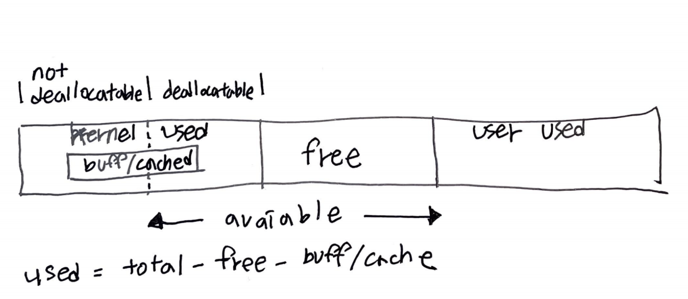

- [Abstract](#abstract)
- [Linux Kernel Alpha Materials](#linux-kernel-alpha-materials)
- [References](#references)
- [Materials](#materials)
- [Build Old Linux](#build-old-linux)
- [Boot Process](#boot-process)
- [System Information](#system-information)
  - [Kernel Infomation](#kernel-infomation)
  - [CPU Information](#cpu-information)
  - [Memory Information](#memory-information)
  - [Disk Information](#disk-information)
  - [Network Information](#network-information)
- [Process](#process)
  - [task\_struct, thread\_info](#task_struct-thread_info)
  - [Process Information](#process-information)
  - [Process Management](#process-management)
  - [task\_struct](#task_struct)
  - [`thread_info`](#thread_info)
  - [Process and Threads](#process-and-threads)
  - [Killing a Zombie](#killing-a-zombie)
  - [Priorities, Schedulers and Nice Values](#priorities-schedulers-and-nice-values)
  - [IPC, Sockets and Pipes](#ipc-sockets-and-pipes)
  - [D-Bus Message](#d-bus-message)
  - [Monitoring Processes through /proc](#monitoring-processes-through-proc)
  - [Process Scheduling](#process-scheduling)
- [Kernel Timer](#kernel-timer)
- [Kernel Synchronization](#kernel-synchronization)
- [System Call](#system-call)
- [Signal](#signal)
- [Storage](#storage)
- [Network](#network)
- [Memory Management](#memory-management)
- [System Load](#system-load)
- [Fork, Exec](#fork-exec)
- [Swap](#swap)
- [Numa](#numa)
- [TIME\_WAIT](#time_wait)
- [TCP Keepalive](#tcp-keepalive)
- [TCP Retransmission and TimeOut](#tcp-retransmission-and-timeout)
- [Dirty Page](#dirty-page)
- [I/O Scheduler](#io-scheduler)

----

# Abstract

Kernel 은 OS 의 핵심이다. 주로 program 들을 지원하고 hardware (CPU, Memory, Disk, TTY) 를 관리한다. [Linux Kernel Development (3rd Edition)](https://www.amazon.com/Linux-Kernel-Development-Robert-Love/dp/0672329468)
를 읽고 linux kernel code 와 함께 정리를 한다.

다음의 부분들은 Arch 별로 구현이 다르다.

* 컨텍스트스위칭 
* 익셉션벡터 
* 시스템콜 
* 시그널핸들러 
* 메모리관리(mmu)

# Linux Kernel Alpha Materials

Linux Kernel 초기 버전 공부 계획

* [Linux Kernel documentation](https://www.kernel.org/doc/)
  * 킹왕짱!!!
  * [한국어](https://www.kernel.org/doc/html/latest/translations/ko_KR/index.html)
  * [Understanding the Linux Virtual Memory Manager](https://www.kernel.org/doc/gorman/html/understand/) 은 Memory Management 를 다룬 책이다. Memory Management source code 를 commentary 함.
* [The Linux Kernel documentation](https://www.kernel.org/doc/html/latest/) 에 최고의 문서들이 있다. 
  * [Index of /doc/Documentation/ @ kernel](https://www.kernel.org/doc/Documentation/) 이 것은 source 로 보인다.

[UNIX V6](/unixv6kernel/README.md) 코드를 먼저 공부해 본다.

[1st version of Linux Kernel | github](https://github.com/kalamangga-net/linux-0.01) 와 [The old Linux kernel source ver 0.11/0.12 study. | github](https://github.com/huawenyu/oldlinux) 를 비교해서 공부해보자.

[osimpl | TIL](/osimpl/README.md) 에서 직접 구현해 보자.

# References

* [Linux Kernel | 까망눈 연구소](https://jeongzero.oopy.io/0bd09eaa-b8d6-45c0-9d01-167fb1b5b984)
  * [Kernel of Linux | OLC](https://olc.kr/course/course_online_view.jsp?id=35&s_keyword=Kernel&x=0&y=0) 를 잘 요약했다.
* [Kernel of Linux | OLC](https://olc.kr/course/course_online_view.jsp?id=35&s_keyword=Kernel&x=0&y=0)
  * 고건 교수 동영상 강좌 
  * 가장 깊이 있는 한글 동영상 강좌
  * [pdf](https://olc.kr/classroom/library.jsp?cuid=283080)
* [문c 블로그](http://jake.dothome.co.kr/)
  * Linux Kernel 킹왕짱 고품질 블로그
* [코드로 알아보는 ARM 리눅스 커널](http://www.yes24.com/Product/Goods/85734266)
  * 좋은 책이라고?
* [디버깅을 통해 배우는 리눅스 커널의 구조와 원리 1 라즈베리 파이로 따라하면서 쉽게 이해할 수 있는 리눅스 커널 @ yes24](http://www.yes24.com/Product/Goods/90085976)
  * [디버깅을 통해 배우는 리눅스 커널의 구조와 원리 2 라즈베리 파이로 따라하면서 쉽게 이해할 수 있는 리눅스 커널 @ yes24](http://www.yes24.com/Product/Goods/90087307)
  * [blog](http://rousalome.egloos.com/v/10015971)
  * [video](https://www.youtube.com/watch?v=AOmawzOYkcQ&list=PLRrUisvYoUw9-cTYgkbTbr9f9CpbGdq4F)
  * [src](https://github.com/wikibook/linux-kernel)
* [The Linux Kernel Archives](https://www.kernel.org/)
  * Linux Kernel 의 버전을 파악할 수 있다. longterm 은 LTS (Long Term Support) 를 의미한다.
* [Linux Kernel Networking: Implementation and Theory (Expert's Voice in Open Source) 1st ed.](https://www.amazon.com/Linux-Kernel-Networking-Implementation-Experts/dp/143026196X)
  * Linux Kernel 의 Network 부분을 자세히 설명한다.
* [(unofficial) Linux Kernel Mailing List archive](https://lkml.org/)
  * 개발자들이 살벌하게 싸운다.
  * [refactoring of _do_fork()https://www.youtube.com/watch?v=2VcA5Wj7IvU](https://lkml.org/lkml/2020/8/18/987)
* [Linux Under The Hood | oreilly](https://learning.oreilly.com/videos/linux-under-the/9780134663500/)
  * Sander van Vugt 강좌. Linux 의 깊숙한 부분을 동영상으로 설명한다. 유료임.
* [Learning Path: Linux Performance Optimization, 1/e | orielly](https://learning.oreilly.com/learning-paths/learning-path-linux/9780135940709/)
  * Sander van Vugt 강좌. Linux 의 깊숙한 부분을 성능측면에서 동영상으로 설명한다. 유료임.

# Materials

* [IT/Linux Kernal | Art of Pr0gr4m](https://pr0gr4m.tistory.com/category/IT/Linux%20Kernel?page=6)
  * Linux 5.x Deep Dive
* [Debugging the Linux Kernel with Qemu and GDB | youtube](https://www.youtube.com/watch?v=2VcA5Wj7IvU)
  * Qemu 에서 linux 를 실행하고 원격으로 gdb debugging 하는 방법
  * [Debugging the Linux Kernel with Qemu and GDB](https://pnx9.github.io/thehive/Debugging-Linux-Kernel.html)
  * [KernelBuild](https://kernelnewbies.org/KernelBuild)
* [리눅스 커널 책 리뷰 및 가이드 | tistory](https://pr0gr4m.tistory.com/entry/%EB%A6%AC%EB%88%85%EC%8A%A4-%EC%BB%A4%EB%84%90-%EC%B1%85-%EB%A6%AC%EB%B7%B0-%EB%B0%8F-%EA%B0%80%EC%9D%B4%EB%93%9C)
  * 킹왕짱 Linux Kernel 책 리뷰
* videos
  * [Linux Internals | youtube](https://www.youtube.com/watch?v=xHu7qI1gDPA&list=PLX1h5Ah4_XcfL2NCX9Tw4Hm9RcHhC14vs)
  * [Unix System Calls | youtube](https://www.youtube.com/watch?v=xHu7qI1gDPA&list=PL993D01B05C47C28D)
  * [Unix Terminals and Shells | youtube](https://www.youtube.com/watch?v=07Q9oqNLXB4&list=PLFAC320731F539902)
* [DevOps와 SE를 위한 리눅스 커널 이야기](http://www.yes24.com/Product/Goods/44376723)
  * DevOps 에게 필요한 Kernel 지식
* [리눅스 커널 부팅과정(Linux Kernel Booting Sequence) 분석](https://kkamagui.tistory.com/817)
* [Kernel of LInux 강의노트](https://books-and-cows.gitbook.io/-linux-kernel-lecture-note/)
  * [video](https://olc.kr/course/course_online_view.jsp?id=35&s_keyword=kernel&x=0&y=0)
  * [pdf](https://olc.kr/classroom/library.jsp?cuid=283080)
* [linux 0.01](https://github.com/zavg/linux-0.01)
  * 토발즈가 릴리즈한 최초 리눅스 커널
  * gcc 1.x 에서 빌드가 된다.
* [Linux src](https://elixir.bootlin.com/linux/v4.15/source/mm/page_alloc.c#L4564)
  * Linux Kernel 의 source code 를 Web 에서 살펴볼 수 있다.
* [The old Linux kernel source ver 0.11/0.12 study. @ github](https://github.com/huawenyu/oldlinux)
  * gcc 4.3 에서 빌드가 되도록 수정된 fork. 
  * ubuntu 18.04 LTS 에서 gcc 4.8.5 으로 build 잘됨. 
  * Windows 10 에서 2.3.6 으로 실행 잘됨.
  * [Welcome to OldLinux](http://www.oldlinux.org/)
    * [An old paper written by Linus: "Linux--a free unix-386 kernel"](http://www.oldlinux.org/Linus/index.html)
    * [A Heavily Commented Linux kernel Source Code (Kernel 0.11) pdf](http://www.oldlinux.org/download/CLK-5.0-WithCover.pdf)
* [linux 0.01 remake](http://draconux.free.fr/os_dev/linux0.01_news.html)
  * gcc 4.x 에서 빌드가 되도록 수정된 fork. 그러나 build 는 성공했지만 run 은 실패했다.
  * [src](https://github.com/issamabd/linux-0.01-remake)
  * [Linux-0.01 kernel building on ubuntu hardy](https://mapopa.blogspot.com/2008/09/linux-0.html)
  * [linux 0.01 commentary](https://www.academia.edu/5267870/The_Linux_Kernel_0.01_Commentary)
  * [linux 0.01 running on qemu](https://iamhjoo.tistory.com/11)

# Build Old Linux

[Build Old Linux](build_old_linux.md)

# Boot Process

* [An introduction to the Linux boot and startup processes](https://opensource.com/article/17/2/linux-boot-and-startup)
* [리눅스 부트 과정 | tistory](https://wogh8732.tistory.com/72)

----

Linux 의 Boot Process 는 다음과 같다.
[https://wogh8732.tistory.com/72](https://wogh8732.tistory.com/72)

- **UEFI/BIOS**
    - ROM 에 설치된 BIOS 가 Booting 에 필요한 장치들(CPU, RAM, DISK, 키보드,
      마우스, etc…)의 건강을 체크한다.
- **UEFI/BIOS** 가 MBR (Master Boot Record) 에 설치된 Boot Loader 를 Memory 에 로딩후 실행한다.
    - Linux 는 주로 **GRUB2** 를 Boot Loader 로 사용한다.
- **Boot Loader** 는 Linux Kernel Image 와 RAM Disk 를 RAM 에 로딩하고 Linux Kernel 을 실행한다.
    - RAM Disk 는 initramfs 이다. Linux Kernel 을 실행할 때 필요한 Driver,
      Program, Binary Files 등을 가지고 있다.
- **Linux Kernel** 은 `/sbin/init` 을 실행한다.
    - `/sbin/init` 은 `systemd` 를 실행하는 건가?
- **systemd** 는 미리 작성된 service 들을 실행한다.

# System Information

## Kernel Infomation

`uname` 을 이용하면 Kernel Version 을 알 수 있다.

```console
$ docker run --rm -it ubuntu:18.04
$ uname -a
Linux f49102bbbef6 5.10.16.3-microsoft-standard-WSL2 #1 SMP Fri Apr 2 22:23:49 UTC 2021 x86_64 x86_64 x86_64 GNU/Linux
```

`dmesg` 를 이용하면 Kernel 의 정보를 더욱 알 수 있다.

```console
$ dmesg | grep -i kernel | more
```

* `Command line`
  * Kernel 이 booting 할 때 사용한 kernel parameters 이다.
* `crashkernel`
  * Kernel 이 panic 상태에 빠지면 crashkernel 을 로딩해서 kernel 의 debug info 를 저장한다. coredump 같은 건가??
* `Memory`
  * Kernel 이 booting 할 때 사용하는 Memory 정보이다.

`/boot/config-*` 파일에 Kernel Compile Config 가 저장되어 있다.

```console
$ cat /boot/config-`uname -r` | more
CONFIG_64BIT=y
CONFIG_X86_64=y
...
```

`ftrace` 와 같이 Kernel function level trace 가 필요하다면 `CONFIG_FUNCTION_TRACER=y` 가 설정되어 있어야 한다.

## CPU Information

`dmidecode` 를 이용하여 `bios, system, processor` 정보를 알 수 있다.

```console
$ dmidecode -t bios
$ dmidecode -t system
$ dmidecode -t processor
```

또한 `/proc/cpuinfo` 파일은 cpu information 은 담고 있다.

```bash
$ cat /proc/cpuinfo
```

`lscpu` 역시 cpu information 을 보여준다.

```bash
$ lscpu
Architecture:        x86_64
CPU op-mode(s):      32-bit, 64-bit
Byte Order:          Little Endian
CPU(s):              8
On-line CPU(s) list: 0-7
Thread(s) per core:  2
Core(s) per socket:  4
Socket(s):           1
Vendor ID:           GenuineIntel
CPU family:          6
Model:               60
Model name:          Intel(R) Core(TM) i7-4790 CPU @ 3.60GHz
Stepping:            3
CPU MHz:             3601.000
CPU max MHz:         3601.0000
BogoMIPS:            7202.00
Hypervisor vendor:   Windows Subsystem for Linux
Virtualization type: container
Flags:               fpu vme de pse tsc msr pae mce cx8 apic sep mtrr pge mca cmov pat pse36 clflush acpi mmx fxsr sse sse2 ss ht tm pbe syscall nx pdpe1gb rdtscp lm pni pclmulqdq est tm2 ssse3 fma cx16 xtpr pdcm pcid sse4_1 sse4_2 movbe popcnt aes xsave osxsave avx f16c rdrand hypervisor lahf_lm abm fsgsbase tsc_adjust bmi1 avx2 smep bmi2 erms invpcid ibrs ibpb stibp ssbd
```

## Memory Information

`dmidecode` 로 memory 를 확인할 수 있다. Memory Card 의 slot 과 장착된 Memory Card 의 정보를 확인할 수 있다.

```bash
$ dmidecode -t memory
$ dmidecode -t memory | grep -i size:
```

## Disk Information

`df` 로 Disk Information 을 확인 할 수 있다.

```bash
$ df -h
Filesystem      Size  Used Avail Use% Mounted on
rootfs          541G  474G   67G  88% /
none            541G  474G   67G  88% /dev
none            541G  474G   67G  88% /run
none            541G  474G   67G  88% /run/lock
none            541G  474G   67G  88% /run/shm
none            541G  474G   67G  88% /run/user
tmpfs           541G  474G   67G  88% /sys/fs/cgroup
C:\             541G  474G   67G  88% /mnt/c
D:\             391G  192G  199G  50% /mnt/d
```

`smartctl` 을 이용하면 Disk 의 물리적인 정보를 확인할 수 있다.

```bash
$ smartctl -a /dev/sda
$ smartctl -a /dev/sda -d cciss,0
```

## Network Information

`lspci, eth0` 를 이용하여 Network Card Information 을 확인할 수 있다.

```bash
$ lspci | grep -i ether
$ ethtool eth0
```

# Process

## task_struct, thread_info

[Linux Kernel: Threading vs Process - task_struct vs thread_info](https://stackoverflow.com/questions/21360524/linux-kernel-threading-vs-process-task-struct-vs-thread-info)

Linux 에서 thread 는 process 와 같이 취급된다. thread 하나에 `task_struct`
그리고 그걸 가리키는 `thread_info` 가 할당된다. `thread_info` 는 thread 의 stack
의 시작주소에 위치한다.

`thread_info` 는 architecture 에 의존적인 것이다. 즉, ARM, X86 에 따라 모양이
다르다. 반면에 `task_struct` 는 architecture 에 독립적이다. 즉, ARM, X86 에서
같은 모양이다.

다음은 Linux Kernel 에서 Single-Thread Process 와 Multi-Thread Process 의
virutal memory layout 을 나타내는 그림이다.


Thread 들은 Program Code, Heap, Open Files 을 공유한다. 그러나 Thread 별로 stack 이 다르다. 이 것은 windows, linux 모두 마찬가지이다. 그러나 PCB, TCB 를 표현하는 방법은 windows, linux 모두 다르다.

다음은 windows process, thread 의 자료구조를 표현한 것이다. process 는  `KPROCESS` 로 thread 는 `KTHREAD` 로 표현한다. PCB 와 TCB 가 구분되어 있다.


다음은 linux process, thread 의 자료구조를 표현한 것이다. process, thread 를 모두 `task_struct` 로 표현한다. PCB, TCB 가 동일하다.


## Process Information

다음은 Process 의 상태를 나타낸다.

* `R` is running
* `S` is sleeping
* `D` is sleeping in an uninterruptible wait
* `Z` is zombie
* `T` is traced or stopped

`top` 을 이용하여 Process Information 을 확인할 수 있다.

```bash
# Show process information once
$ top -b -n 1
top - 22:16:55 up 22 min,  0 users,  load average: 0.52, 0.58, 0.59
Tasks:   7 total,   1 running,   6 sleeping,   0 stopped,   0 zombie
%Cpu(s):  5.9 us, 16.1 sy,  0.0 ni, 77.8 id,  0.0 wa,  0.3 hi,  0.0 si,  0.0 st
KiB Mem : 16661968 total,  5258728 free, 11173888 used,   229352 buff/cache
KiB Swap: 50331648 total, 49676068 free,   655580 used.  5354348 avail Mem

  PID USER      PR  NI    VIRT    RES    SHR S  %CPU %MEM     TIME+ COMMAND
    1 root      20   0    8944    332    288 S   0.0  0.0   0:00.18 init
    8 root      20   0    8952    240    188 S   0.0  0.0   0:00.00 init
    9 iamslash  20   0   16792   3456   3336 S   0.0  0.0   0:00.27 bash
   49 root      20   0   17020   2356   2272 S   0.0  0.0   0:00.06 sudo
   50 root      20   0   16516   2040   2012 S   0.0  0.0   0:00.05 su
   51 root      20   0   16780   3408   3296 S   0.0  0.0   0:00.18 bash
  387 root      20   0   17492   1904   1436 R   0.0  0.0   0:00.04 top
```

주요 지표는 다음과 같다.

* Tasks 
  * total : 전체 process 수
  * running : 상태가 `R` 인 process 수
  * sleeping : 상태가 `S, D` 인 process 수
  * stopped : 상태가 `T` 인 process 수
  * zombie : 상캐가 `Z` 인 process 수
* VIRT
  * virtual memory size
* RSS
  * Resisdent Set Size : VIRT 중 Physical Memory 에 거주하는 것의 크기
* SHR
  * RSS 중 다른 Process 와 공유하는 Physical Memory 의 크기
* PR
  * 우선순위이다. 보통 20 이다. 값이 낮으면 우선순위가 높다.
* NI
  * PR 을 낮추는데 사용한다. PR 이 20 이고 NI 가 -4 이면 PR 은 16 으로 바뀌고 우선순위는 높아진다.

다음과 같이 Memory 를 할당한다고 해서 Physical Memory 에 할당이 되지는 않는다.

```c
void *myblock = (void *) malloc(1024*1024);
```

Memory 를 할당받고 나서 바로 써야 Physical Memory 에 할당된다. 바로 쓰면
VIRT 의 Memory Page 가 Dirty 될 것이고 Copy On Write 에 의해 Physical Memory
에 할당된다.

```c
void *myblock = (void *) malloc(1024*1024);
memset(myblock, 1, 1025*1024);
```

Virtual Memory 의 일부를 Physical Memory 에 상주하는 것은 Commit 한다고 한다. 

`vm.overcommit_memory` 의 값에 따라 commit 전략이 다르다.

* `vm.overcommit_memory=0` : OVERCOMMIT_GUESS
  * System 의 Memory 가 여유있다면 commit 하라.
* `vm.overcommit_memory=1` : OVERCOMMIT_ALWAYS
  * System 의 Memory 상태와 상관없이 commit 하라.
* `vm.overcommit_memory=2` : OVERCOMMIT_NEVER
  * ???

```cpp
// include/uapi/linux/mman.h
#define OVERCOMMIT_GUESS		0
#define OVERCOMMIT_ALWAYS		1
#define OVERCOMMIT_NEVER		2

// mm/util.c
int __vm_enough_memory(struct mm_struct *mm, long pages, int cap_sys_admin)
{
	long allowed;

	vm_acct_memory(pages);

	/*
	 * Sometimes we want to use more memory than we have
	 */
	if (sysctl_overcommit_memory == OVERCOMMIT_ALWAYS)
		return 0;

	if (sysctl_overcommit_memory == OVERCOMMIT_GUESS) {
		if (pages > totalram_pages() + total_swap_pages)
			goto error;
		return 0;
	}

	allowed = vm_commit_limit();
	/*
	 * Reserve some for root
	 */
	if (!cap_sys_admin)
		allowed -= sysctl_admin_reserve_kbytes >> (PAGE_SHIFT - 10);

	/*
	 * Don't let a single process grow so big a user can't recover
	 */
	if (mm) {
		long reserve = sysctl_user_reserve_kbytes >> (PAGE_SHIFT - 10);

		allowed -= min_t(long, mm->total_vm / 32, reserve);
	}

	if (percpu_counter_read_positive(&vm_committed_as) < allowed)
		return 0;
error:
	vm_unacct_memory(pages);

	return -ENOMEM;
}
```

## Process Management

Kernel 은 Process Meta Data 를 **PCB (Process Control Block)** 이라는 형태로
저장한다. Linux Kernel 의 `task_struct` 에 해당한다. 다음과 같은 항목들이
존재한다.

* PID (Process Identifier)
* Priority
* Waiting Event
* Status (run, sleep, ...)
* Location of image in disk
* Location of image in memeory
* open files
* directory
* terminal
* state vector save area(PC, R0, ...)
* parent, child process
* execution time

Process 는 CPU 로 부터 대기표를 뽑고 자기 순서를 기다린다. 기다리는 Process 들은
ready queue 에 저장된다. 역시 DIsk 로 부터 대기표를 뽑고 자기 순서를 기다린다.
기다리는 Process 들은 Disk wait queue 에 저장된다.

리눅스에서 프로세스 관리는 커널 내에서 발생하며 여러 소스 파일과 핵심 코드가
관련되어 있습니다. 이러한 파일과 코드의 일부는 다음과 같습니다.

```c
// - 프로세스 정보 구조체 (task_struct) 파일: include/linux/sched.h 설명: 
// 프로세스 정보를 저장하는 핵심 데이터 구조인 task_struct가 정의되어 있습니다. 
// task_struct는 프로세스의 상태, 스케줄링 정보, 자식 프로세스, 부모 프로세스, 
// 페이지 테이블 등 프로세스 관련 모든 정보를 저장합니다.
struct task_struct {
    ...
    long state;               /* -1 unrunnable, 0 runnable, >0 stopped */
    ...
    struct list_head children;    /* list of my children */
    struct list_head sibling;     /* linkage in my parent's children list */
    ...
    struct mm_struct *mm;         /* memory management info */
    ...
};

// - 프로세스 생성 (fork) 파일: kernel/fork.c 설명: 이 파일은 프로세스 생성 시 지원하는 
// 시스템 콜인 fork, vfork, clone에 대한 구현을 포함하고 있습니다. 프로세스 생성의 기본 함수인
// _do_fork()를 호출하여 새로운 프로세스를 생성하고 초기화합니다.
SYSCALL_DEFINE0(fork)
{
    return _do_fork(SIGCHLD, 0, 0, NULL, NULL);
}
...
long _do_fork(int clone_flags, unsigned long stack_start,
          unsigned long stack_size, int __user *parent_tidptr,
          int __user *child_tidptr)
{
    ...
    tsk = copy_process(clone_flags, stack_start, stack_size, child_tidptr,
               NULL, trace);
    ...
    return tsk->pid;
}

// - 프로세스 스케줄링 파일: kernel/sched/core.c, kernel/sched/fair.c, 
// include/linux/sched.h 등 설명: 프로세스 스케줄링은 리눅스 커널의 핵심 기능 중 하나로, 
// 실행 가능한 프로세스 간의 자원을 공유하고 안정적으로 시스템을 유지합니다. 리눅스 스케줄러는 
// 여러 개의 스케줄링 클래스를 지원하며, 가장 일반적이고 기본적인 클래스는 
// Completely Fair Scheduler (CFS)입니다.
// -- schedule() 함수는 적절한 후속 프로세스를 선택하고 실행합니다.
void __sched schedule(void)
{
    struct task_struct *next;
    ...
    next = pick_next_task(rq, prev);
    ...
    context_switch(rq, prev, next);
    ...
}

// - 스케줄링 클래스 인터페이스 정의
struct sched_class {
    const struct sched_class *next;

    void (*enqueue_task)(...);
    void (*dequeue_task)(...);
    ...
};

/* Represent CFS scheduling class */
extern const struct sched_class fair_sched_class;

// - 프로세스 종료 (exit) 파일: kernel/exit.c 설명: 프로세스가 종료될 때, 
// 리눅스 커널은 종료 프로세스에서 사용한 자원을 회수하고 부모 프로세스에 알리는 
// 작업을 수행합니다. 프로세스 종료 작업은 do_exit 함수에 의해 처리되며, 
// 시스템 콜 exit 및 exit_group이 호출됩니다.
void do_exit(long code)
{
    ...
    exit_mm(tsk);
    ...
    exit_notify(tsk, group_dead);
    ...
}

SYSCALL_DEFINE1(exit, int, error_code)
{
    do_exit((error_code & 0xff) << 8);
}
```

이러한 파일 및 코드들은 리눅스 커널에서 프로세스 관리에 관련되어 핵심적인 부분을
나타냅니다. 프로세스의 생성, 스케줄링 및 종료에 대한 처리가 리눅스 커널의 이러한
부분에서 이루어집니다. 반드시 모든 코드를 다루기보다는 여기서 소개한 코드를
기반으로 구성을 탐색하시면 프로세스 관리의 전반적인 이해에 도움이 될 것입니다.

## task_struct

* [struct task_struct v4.19.30 arm src](https://elixir.bootlin.com/linux/v4.19.30/source/include/linux/sched.h#L593)

----

```cpp
struct task_struct {
#ifdef CONFIG_THREAD_INFO_IN_TASK
  /*
   * For reasons of header soup (see current_thread_info()), this
   * must be the first element of task_struct.
   */
  struct thread_info		thread_info;
#endif
  /* -1 unrunnable, 0 runnable, >0 stopped: */
  volatile long			state;

  /*
   * This begins the randomizable portion of task_struct. Only
   * scheduling-critical items should be added above here.
   */
  randomized_struct_fields_start

  void				*stack;
  atomic_t			usage;
  /* Per task flags (PF_*), defined further below: */
  unsigned int			flags;
  unsigned int			ptrace;
```

## `thread_info`

* [[리눅스 커널의 구조와 원리] 4.9.2 thread_info 구조체 분석 @ youtube](https://www.youtube.com/watch?v=USPtSWRz9wI)
* [struct thread_info v4.19.30 arm src](https://elixir.bootlin.com/linux/v4.19.30/source/arch/arm/include/asm/thread_info.h)

----

```cpp
/*
 * low level task data that entry.S needs immediate access to.
 * __switch_to() assumes cpu_context follows immediately after cpu_domain.
 */
struct thread_info {
  unsigned long		flags;		/* low level flags */
  int			preempt_count;	/* 0 => preemptable, <0 => bug */
  mm_segment_t		addr_limit;	/* address limit */
  struct task_struct	*task;		/* main task structure */
  __u32			cpu;		/* cpu */
  __u32			cpu_domain;	/* cpu domain */
  struct cpu_context_save	cpu_context;	/* cpu context */
  __u32			syscall;	/* syscall number */
  __u8			used_cp[16];	/* thread used copro */
  unsigned long		tp_value[2];	/* TLS registers */
#ifdef CONFIG_CRUNCH
  struct crunch_state	crunchstate;
#endif
  union fp_state		fpstate __attribute__((aligned(8)));
  union vfp_state		vfpstate;
#ifdef CONFIG_ARM_THUMBEE
  unsigned long		thumbee_state;	/* ThumbEE Handler Base register */
#endif
};
```

## Process and Threads

`$ dd` 를 이용하면 CPU 100% 를 재연할 수 있다. [dd | man](https://man7.org/linux/man-pages/man1/dd.1.html)

```console
# dd if=/dev/zero of=/dev/null &
# top
  PID USER      PR  NI    VIRT    RES    SHR S  %CPU %MEM     TIME+ COMMAND
   35 root      20   0    4388    680    612 R 100.0  0.0   0:37.48 dd
    1 root      20   0   18268   3388   2856 S   0.0  0.0   0:00.12 bash
   36 root      20   0   19892   2444   2084 R   0.0  0.0   0:00.01 top
```

`$ taskset` 을 이용하면 process 의 CPU affinity 를 설정하거나 읽어올 수 있다.
예를 들어 특정 pid 의 process 를 cpu3 에서 실행하도록 할 수 있다. [taskset | man](https://man7.org/linux/man-pages/man1/taskset.1.html)

```bash
# dd 를 cpu3 에서 실행한다.
$ taskset -pc 3 $(pidof dd)
```

`/sys/bus/cpu/devices/` 를 살펴보면 cpu 별 디렉토리들을 확인할 수 있다.

```bash
$ cd /sys/bus/cpu/devices/
$ ls -alh
total 0
drwxr-xr-x 2 root root 0 Jun 22 13:32 .
drwxr-xr-x 4 root root 0 Jun 22 13:32 ..
lrwxrwxrwx 1 root root 0 Jun 22 13:32 cpu0 -> ../../../devices/system/cpu/cpu0
lrwxrwxrwx 1 root root 0 Jun 22 13:32 cpu1 -> ../../../devices/system/cpu/cpu1
lrwxrwxrwx 1 root root 0 Jun 22 13:32 cpu2 -> ../../../devices/system/cpu/cpu2
lrwxrwxrwx 1 root root 0 Jun 22 13:32 cpu3 -> ../../../devices/system/cpu/cpu3
lrwxrwxrwx 1 root root 0 Jun 22 13:32 cpu4 -> ../../../devices/system/cpu/cpu4
lrwxrwxrwx 1 root root 0 Jun 22 13:32 cpu5 -> ../../../devices/system/cpu/cpu5
lrwxrwxrwx 1 root root 0 Jun 22 13:32 cpu6 -> ../../../devices/system/cpu/cpu6
lrwxrwxrwx 1 root root 0 Jun 22 13:32 cpu7 -> ../../../devices/system/cpu/cpu7

$ cd cpu3
$ ls -alh
total 0
drwxr-xr-x  6 root root    0 Jun 22 13:32 .
drwxr-xr-x 16 root root    0 Jun 22 12:45 ..
drwxr-xr-x  6 root root    0 Jun 22 13:34 cache
-r--------  1 root root 4.0K Jun 22 13:34 crash_notes
-r--------  1 root root 4.0K Jun 22 13:34 crash_notes_size
drwxr-xr-x  2 root root    0 Jun 22 13:34 hotplug
-rw-r--r--  1 root root 4.0K Jun 22 13:34 online
drwxr-xr-x  2 root root    0 Jun 22 13:34 power
lrwxrwxrwx  1 root root    0 Jun 22 13:34 subsystem -> ../../../../bus/cpu
drwxr-xr-x  2 root root    0 Jun 22 13:34 topology
-rw-r--r--  1 root root 4.0K Jun 22 13:34 uevent

$ cat online
1
$ echo 0 > online
# This will make cpu3 offline

$ lscpu
# If you make cpu3 offline
# On-line CPU will be changed
Architecture:          x86_64
CPU op-mode(s):        32-bit, 64-bit
Byte Order:            Little Endian
CPU(s):                8
On-line CPU(s) list:   0-7
Thread(s) per core:    1
Core(s) per socket:    1
Socket(s):             8
Vendor ID:             GenuineIntel
CPU family:            6
Model:                 158
Stepping:              13
CPU MHz:               2400.000
BogoMIPS:              4852.88
L1d cache:             32K
L1i cache:             32K
L2 cache:              256K
L3 cache:              16384K
```

## Killing a Zombie

> [7.3 Killing a zombie | Linux Under the Hood](https://learning.oreilly.com/videos/linux-under-the/9780134663500/9780134663500-LUTH_07_03/)

Zombie Process 는 제대로 정리되지 않은 Process 를 말한다. Child Process 가
`exit()` 를 호출하였지만 부모가 `wait()` 하지 않으면 Child Process 는 Zombie
Process 가 된다. Zombie Proces 는 여전히 Process Table 에 남아있다. Zombie
Process 는 System Resource 를 사용하지 않는다. PID 는 사용한다. Max PID 는
정해져 있다. 새로운 PID 가 Max PID 를 넘어서게 되면 Process 생성을 실패한다.
Zombie Process 가 많아지면 문제가 된다.

`$ kill -s SIGCHILD <ppid>` 를 이용하면 parent process 가 child processes 를
`wait()` 한다. Zombie Process 는 reaped 될 것이다. 잘 되는건가?

Orphan Process 는 Parent Process 가 죽고 남아 있는 Child Process 를 말한다.
Zombie Process 와는 다르다. init Process 가 Orphan Process 의 부모가 된다.

다음과 같이 `zombie.c` 를 작성하자.

```c
#include <stdlib.h>
#include <sys/types.h>
#include <unistd.h>
int main() {
	pid_t child_pid;
	child_pid = fork();
	if (child_pid > 0) {
		// Parent process
		sleep(60);
	} else {
		// Child process
		exit(0);
	}
	return 0;
}
```

build 및 실행하자.

```bash
$ docker run -it --rm --name my-ubuntu ubuntu:18.08

$ apt-get update
$ apt-get install gcc vim -Y

$ gcc zombie.c -o zombie
$ ./zombie &
$ top
  PID USER      PR  NI    VIRT    RES    SHR S  %CPU %MEM     TIME+ COMMAND
    1 root      20   0   18268   3388   2856 S   0.0  0.0   0:00.20 bash
  525 root      20   0    4208    624    556 S   0.0  0.0   0:00.00 zombie
  526 root      20   0       0      0      0 Z   0.0  0.0   0:00.00 zombie
  527 root      20   0   19888   2456   2116 R   0.0  0.0   0:00.00 top

$ ps aux | grep defunct
root       526  0.0  0.0      0     0 pts/0    Z    14:05   0:00 [zombie] <defunct>
root       536  0.0  0.0   8884   780 pts/0    S+   14:05   0:00 grep --color=auto defunct

$ kill -9 526
# Can not kill Zombie Process

$ ps fax
  PID TTY      STAT   TIME COMMAND
    1 pts/0    Ss     0:00 /bin/bash
  525 pts/0    S      0:00 ./zombie
  526 pts/0    Z      0:00  \_ [zombie] <defunct>
  537 pts/0    R+     0:00 ps fax

$ kill -s SIGCHLD 525
# It does not work. why???
$ kill -9 525
# It works
```

## Priorities, Schedulers and Nice Values

* [Understanding priorities, schedulers and nice values | Linux Under the Hood](https://learning.oreilly.com/videos/linux-under-the/9780134663500/9780134663500-LUTH_07_04/)

`top` 을 이용하면 Process 의 `PR, NI` 를 알 수 있다. Process 는 Realtime Process,
Normal Process 로 구분된다. Realtime Process 는 스케줄링 우선순위가 높다. 주로 System 과 관련이 있는 Process 들이다. `PR` 의 값의 범위는 `0 ~ 139` 이다. Realtime Process 들끼리의 우선순위를 말한다. `NI` 의 값의 범위는 `-20 ~ 19` 이다. Normal Process 들끼리의 우선순위를 말한다. 숫자가 낮으면 스케줄링의 우선순위가 높다.

```
$ top
  PID USER      PR  NI    VIRT    RES    SHR S  %CPU %MEM     TIME+ COMMAND
    1 root      20   0   18268   3388   2856 S   0.0  0.0   0:00.24 bash
  550 root      20   0   19892   2500   2140 R   0.0  0.0   0:00.00 top
```

`chrt` 를 이용하면 Realtime Process 우선순위를 조정할 수 있다. Realtime Process 의 Scheduling Policies 종류는 다음과 같다.

* SCHED_BATCH
* SCHED_FIFO (First In First Out)
* SCHED_IDLE CPU 가 IDLE 일 때, 우선순위가 매우 낮다.
* SCHED_OTHER
* SCHED_RR (Round Robin)

```bash
$ chrt --help
chrt - manipulate real-time attributes of a process
...
Scheduling policies:
  -b | --batch         set policy to SCHED_BATCH
  -f | --fifo          set policy to SCHED_FIFO
  -i | --idle          set policy to SCHED_IDLE
  -o | --other         set policy to SCHED_OTHER
  -r | --rr            set policy to SCHED_RR (default)

...
```

다음과 같이 Process 의 우선순위를 실습해 보자.

```bash
$ dd if=/dev/zero of=/dev/null &
$ dd if=/dev/zero of=/dev/null &
$ dd if=/dev/zero of=/dev/null &
$ dd if=/dev/zero of=/dev/null &
$ top
  PID USER      PR  NI    VIRT    RES    SHR S  %CPU %MEM     TIME+ COMMAND
  553 root      20   0    4388    664    592 R 100.0  0.0   0:06.32 dd
  552 root      20   0    4388    720    652 R  99.9  0.0   0:07.09 dd
  554 root      20   0    4388    676    604 R  99.9  0.0   0:04.93 dd
  555 root      20   0    4388    776    704 R  99.9  0.0   0:04.23 dd
    1 root      20   0   18268   3388   2856 S   0.0  0.0   0:00.24 bash
  556 root      20   0   19892   2400   2040 R   0.0  0.0   0:00.00 top

# r 을 누르고 -5 를 입력한다. 즉, renice 를 한다.
# docker container ubuntu 라서 안되는 건가? 잘 안됨.
PID to renice [default pid = 552] -5
  PID USER      PR  NI    VIRT    RES    SHR S  %CPU %MEM     TIME+ COMMAND
  552 root      20   0    4388    720    652 R 100.0  0.0   0:34.68 dd
  553 root      20   0    4388    664    592 R 100.0  0.0   0:33.90 dd
  554 root      20   0    4388    676    604 R 100.0  0.0   0:32.51 dd
  555 root      20   0    4388    776    704 R 100.0  0.0   0:31.82 dd
    1 root      20   0   18268   3388   2856 S   0.0  0.0   0:00.24 bash
  556 root      20   0   19892   2400   2040 R   0.0  0.0   0:00.00 top

$ chrt 19 dd if=/dev/zero of=/dev/null &
# docker container ubuntu 라서 안되는 건가?
chrt: failed to set pid 0's policy: Operation not permitted

$ kill -9 $(pidof dd)
```

## IPC, Sockets and Pipes

> [Understanding inter-process communication, sockets, and pipes | Linux Under the Hood](https://learning.oreilly.com/videos/linux-under-the/9780134663500/9780134663500-LUTH_07_05/)

`/proc` 를 살펴보면 Process 가 사용하는 socket 이 얼만큼 있는지 알 수 있다.
socket 을 사용하는 Process 를 살펴보면 file descript no 와 함께 socket 이
표시된다.

```bash
$ ls -alh /proc/1/fd
total 0
dr-x------ 2 root root  0 Jun 22 12:45 .
dr-xr-xr-x 9 root root  0 Jun 22 12:45 ..
lrwx------ 1 root root 64 Jun 22 12:45 0 -> /dev/pts/0
lrwx------ 1 root root 64 Jun 22 12:45 1 -> /dev/pts/0
lrwx------ 1 root root 64 Jun 22 12:45 2 -> /dev/pts/0
lrwx------ 1 root root 64 Jun 23 06:31 255 -> /dev/pts/0
```

## D-Bus Message

> * [1. D-Bus 기초](https://www.kernelpanic.kr/22)
> * [D-Bus](https://ko.wikipedia.org/wiki/D-Bus)

D-Bus 는 IPC 중 하나이다. 하나의 Machine 의 많든 Process 들이
통신하는 방식이다. socket 을 사용한다면 모든 Process 들이 각각
연결되야 한다. 그러나 D-Bus 를 사용하면 각 Process 가 D-Bus
에만 연결하면 된다.

## Monitoring Processes through /proc

`/proc` 를 살펴보면 특정 Process 의 정보를 얻어올 수 있다.

```bash
$ cd /proc/1

# Show command line
$ cat cmdline
# Show out of memory score
$ cat oom_score
# Show proess status including memory
$ less status 
```

## Process Scheduling

리눅스 커널의 프로세스 스케줄링은 리눅스 커널의 핵심 기능 중 하나입니다. 다음은
스케줄링과 관련한 구현 파일들과 핵심 코드를 설명한 것입니다.

```c
// - 스케줄러 자료구조 및 인터페이스 파일: include/linux/sched.h 설명: 
// 리눅스 스케줄러는 복수의 스케줄링 클래스를 지원하며, 이러한 스케줄링 클래스에 
// 대한 인터페이스가 정의되어 있습니다. 각 스케줄링 클래스는 특정 스케줄링 정책을
// 구현하고 관리합니다.
struct sched_class {
    const struct sched_class *next;

    void (*enqueue_task)(...);
    void (*dequeue_task)(...);
    ...
};

/* Represent CFS scheduling class */
extern const struct sched_class fair_sched_class;

// - 스케줄링 함수 및 작업 파일: kernel/sched/core.c 설명: 이 파일은 리눅스에서
// 프로세스를수행할 때 사용되는 핵심 스케줄링 함수들을 포함하고 있습니다.
// -- schedule() 함수는 적절한 후속 프로세스를 선택하고 실행합니다.
void __sched schedule(void)
{
    struct task_struct *prev;
    struct task_struct *next;
    struct rq *rq;
    ...
    prev = rq->curr;
    next = pick_next_task(rq, prev);
    ...
    context_switch(rq, prev, next);
    ...
}

// - Completely Fair Scheduler (CFS) 파일: kernel/sched/fair.c 설명: 
// CFS 스케줄링 클래스에 대한 구현이 이 파일에 포함되어 있습니다. 
// Completely Fair Scheduler는 리눅스 커널에서 기본으로 사용되는 스케줄링 
// 알고리즘입니다. 작업들이 가능한 균등하게 CPU 시간을 나눠 사용할 수 있도록
// 처리합니다.
// -- 다음 실행할 작업 선택 (간소화된 구현)
static struct task_struct *
pick_next_task_fair(struct rq *rq, struct task_struct *prev_task)
{
    struct cfs_rq *cfs_rq = &rq->cfs;
    struct sched_entity *se;
    ...
    se = pick_next_entity(cfs_rq);
    ...
    next_task = task_of(se);
    ...
    return next_task;
}
```

CFS 스케줄러는 레디 큐에 있는 각 프로세스의 스케줄 엔티티를 평가합니다.

리눅스 스케줄링 종류 리눅스 커널은 프로세스를 제어하는 다양한 스케줄링 정책을 제공합니다.

- SCHED_NORMAL, SCHED_BATCH: CFS 스케줄링 클래스에 의해 구현됩니다.
- SCHED_FIFO, SCHED_RR: 리얼타임 스케줄링 클래스인 rt_sched_class에 의해
  구현되며, kernel/sched/rt.c 파일에 있습니다.
- SCHED_DEADLINE: 데드라인 기반의 스케줄링 클래스인 dl_sched_class에 의해
  구현되며, kernel/sched/deadline.c 파일에 있습니다.

이러한 파일들과 코드들은 리눅스 커널에서 프로세스 스케줄링의 주요 구성 요소를
나타냅니다. 실행 가능한 프로세스의 CPU 자원을 공유하고 관리하는 데 필요한 핵심
알고리즘과 구조는 이러한 부분에 구현되어 있습니다. 비록 모든 코드와 알고리즘을
다루지는 않았지만, 이 소개 자료를 통해 프로세스 스케줄링에 대한 전반적인 이해에
도움이 되길 바랍니다.

# Kernel Timer

커널 타이머(Kernel Timer)는 리눅스 커널에서 시간 기반의 이벤트를 관리하고
스케줄링하는 메커니즘입니다. 커널 타이머는 특정 시간 간격이나 정해진 시점에 특정
작업을 실행하는 데 사용되며, 내부적으로 높은 우선순위와 저해상도의 타이머 큐로
구성되어 있다. 이를 통해 시간 경과에 따른 호출이 필요한 이벤트를 처리한다.

커널 타이머는 하드웨어 인터럽트와 밀접하게 관련되어 작동한다. 일반적으로
하드웨어 클럭이 주기적으로 인터럽트를 발생시키고, 인터럽트 핸들러가 타이머
큐에서 대기 중인 이벤트가 있는지 확인한 후 처리한다. 이 과정은 커널의 다양한
부분에서 사용되며 다양한 시간 기반의 작업에 사용된다.

리눅스 커널 타이머에 대한 관련 코드는 주로 아래 두 파일에서 찾을 수 있다:

- `include/linux/timer.h`: 커널 타이머 구조체 및 관련 함수와 매크로 정의를
  포함하며, 커널 타이머 작업을 초기화, 설정, 수정, 삭제하는 함수들이 정의되어
  있다.
- `kernel/time/timer.c`: 커널 타이머 시스템의 실제 구현부로, 타이머 큐에서
  작업을 처리하고 관리하는 메커니즘이 구현되어 있다.

리눅스 커널에서 커널 타이머를 사용하려면, 먼저 초기화 함수인 `init_timer()`를
호출하여 `timer_list` 구조체를 초기화하고, 시간 간격과 만료 시 실행할 콜백
함수를 설정한다. 그 다음, `add_timer()` 함수를 호출하여 타이머를 타이머 큐에
등록하고 실행을 예약한다. 이 프로세스를 통해 타이머가 처리되고 이벤트가 일정
시간에 실행된다.

리눅스 커널에서 커널 타이머를 사용하는 간단한 예제 이다.

```c
// 핵심 헤더 파일을 포함시키고, 타이머를 설정할 콜백 함수를 정의합니다. 또한 전역 변수로 `timer_list` 구조를 선언합니다.
#include <linux/kernel.h>
#include <linux/module.h>
#include <linux/timer.h>

struct timer_list my_timer;

void my_timer_callback(struct timer_list *t)
{
    pr_info("Kernel Timer expired, executing callback function\n");
}

// 이제 init 함수에서 타이머를 초기화하고, 만료 시간을 설정한 후, 타이머 큐에 등록해 보겠습니다.
static int __init my_module_init(void)
{
  pr_info("Initializing Kernel Timer\n");

  // timer_list 구조체를 초기화하고 콜백 함수와 데이터 지정
  timer_setup(&my_timer, my_timer_callback, 0);

  // 아래 예제에서는 현재 시간에서 5초 후에 타이머 만료 설정
  my_timer.expires = jiffies + msecs_to_jiffies(5000);

  // 타이머를 타이머 큐에 등록
_add_timer(&my_timer);
  return 0;
}

// 마지막으로, 모듈 해제 시 타이머를 삭제하는 함수를 정의합니다.
static void __exit my_module_exit(void)
{
    pr_info("Removing Kernel Timer\n");

    // 타이머 제거
    del_timer(&my_timer);
}

module_init(my_module_init);
module_exit(my_module_exit);

MODULE_LICENSE("GPL");
MODULE_DESCRIPTION("A simple example of a Kernel Timer");
MODULE_AUTHOR("Your Name");
```

# Kernel Synchronization

Linux Kernel 은 주로 spin lock 과 mutex 를 이용하여 동기화처리를 한다.

spin lock 은 다음과 같이 사용된다. CPU0 이 critical section (임계영역) 에
해당하는 instruction 을 실행한다고 하자. CPU1 은 CPU0 이 critical section 의
instruction 을 모두 실행할 때까지 기다린다. context switching 을 하지 않는다.

mutex 는 다음과 같이 사용된다. CPU0 이 critical section 의 instruction 들을
실행한다고 하자. CPU1 은 CPU0 이 critical section 의 instruction 들을 모두
실행할 동안 context switching 을 하며 다른 일들을 처리한다. 그러나 context
switching 의 비용은 크다. 몇 cycle 일까???

임계영역이 짧을 때는 spin lock 을 사용한다. 임계영역이 길다면 mutex 를
사용한다.

# System Call

내가 작성한 a.out 이라는 프로그램이 실행되면 A process 라는 형태로 OS 에 만들어 진다. 그리고 `printf` 를 
실행할 때 다음과 같은 일들이 벌어진다.

* A process 는 write 을 호출한다. write 는 system call 을 호출하는 Wrapper routine 이다.
* `$0x80` 이라는 Interrupt 가 발생한다. 이것은 HW trap 을 의미한다.
* HW 는 CPU mode 를 user mode 에서 kernel mode 로 바꾼다.
* HW 는 `sys_call()` 을 실행한다. `sys_call()` 은 kernel 에 존재하는 assembly function 이다.
* EAX register 에 채워진 system call 번호가 제대로 인지 검증한다. 이것은 `sys_write()` 과 같다.
* 그 번호에 맞는 system call address 즉, `sys_write()` 의 address 를 table 에서 읽어온다.
* table 에서 읽어온 `sys_write()` address 를 실행한다.
* 실행을 마치면 HW 의 PC 를 처음 `printf` 다음줄로 조정한다.

printf 함수의 호출부터 write 시스템 콜이 실행되는 과정을 다시 설명하겠습니다.

```c
// - 사용자가 printf 함수를 호출합니다.
#include <stdio.h>

int main()
{
    printf("Hello, World!\n");
    return 0;
}

// - printf 함수는 표준 C 라이브러리(glibc)에 구현되어 있으며, 
// 문자열을 형식화하여 출력합니다. 내부적으로 가변 인수를 처리하고 vfprintf 함수를 
// 호출하여 버퍼에 문자열을 출력하고, 그런 다음 버퍼에서 문자열을 표준 출력으로 실제로 작성합니다.
int
__vfprintf_internal (FILE *s, const char *format, va_list ap)
{
    ...
}

// - 표준 C 라이브러리는 write 시스템 콜을 호출하여 문자열을 표준 출력에 쓰게 됩니다.
#include <unistd.h>

ssize_t write(int fd, const void *buf, size_t count);
// 여기서 fd는 STD(STDOUT_FILENO)에 대한 파일 디스크립터, 
// buf는 출력할 문자열의 버퍼 포인터, count는 쓰기할 바이트 수입니다.

// - 시스템 콜에 대한 정의 및 매핑은 리눅스 커널 소스 코드에 포함되어 있습니다. 
// 이 경우에는 write에 대한 정의와 매핑을 찾을 수 있습니다.
// -- syscall_table.S(예: x86_64 아키텍처) 파일에 시스템 콜 매핑:

/* sys_call_table */
...
4 common  write  fs/read_write.c
...

// -- syscalls.h 파일에 시스템 콜 함수 정의:
asmlinkage long sys_write(unsigned int fd, const char __user *buf, size_t count);

// - 리눅스 커널에서 sys_write 함수는 fs/read_write.c 파일에 구현됩니다.
SYSCALL_DEFINE3(write, unsigned int fd, const char __user *buf, size_t count)
{
    struct fd f = fdget_pos(fd);
    ssize_t ret = -EBADF;

    if (f.file) {
        loff_t pos = file_pos_read(f.file);
        ret = vfs_write(f.file, buf, count, &pos);
        if (ret >= 0) {
            file_pos_write(f.file, pos);
        }
    }

    return ret;
}

// - `vfs_write` 함수를 호출하여 가상 파일 시스템(VFS) 계층에서 실제로 문자열을
// 작성합니다. VFS는 다양한 파일 시스템 구현을 지원합니다. 
```

이 과정을 통해 사용자 프로그램에서 `printf` 함수를 호출하면 표준 출력에 문자열이
출력됩니다. 이는 표준 C 라이브러리(glibc)에서 문자열 처리 및 버퍼 작성을 처리한
다음 리눅스 커널의 `write` 시스템 콜을 사용하여 표준 출력에 문자열을 실제로
출력하는 방식으로 작동합니다.

# Signal

Signal은 유닉스와 유닉스 계열 운영체제(Linux 등)에서 프로세스 간 통신을 수행하는
방법 중 하나로, 비동기적 이벤트 또는 특별한 상황 발생 시 특정 프로세스에 정보를
전달하는 메커니즘입니다. Signal은 실행 중인 프로세스에 예외 처리, 간단한 정보
전달, 강제 종료 등을 요청하는 데 사용되며, 프로세스는 사전에 정의된 signal
핸들러를 사용하여 이러한 signal을 처리할 수 있습니다.

다양한 종류의 Signal이 있으며, 각각 다른 목적을 가진다. 일반적으로 사용되는
Signal의 예는 다음과 같다.

- **SIGTERM**: 프로세스에 정상적인 종료를 요청하는 signal.
- **SIGKILL**: 프로세스를 강제로 종료시키는 signal로, OS에서 발생시키며 해당 프로세스는 signal을 처리할 수 없다.
- **SIGINT**: 키보드 인터럽트로 주로 Ctrl+C를 누를 때 콘솔에서 발생시킨다.
- **SIGHUP**: 프로세스에 터미널 종료 시그널을 보낸다. 주로 프로세스가 다시 시작할 것을 요청할 때 사용된다.
- **SIGALRM**, **SIGUSR1**, **SIGUSR2** 등: 애플리케이션에서 사용자 정의 signal을 처리할 때 사용된다.

다음은 Signal 사용 예제 코드이다. 이 코드는 간단한 프로세스를 생성하고, `SIGINT (Ctrl+C)`와 `SIGUSR1` 이벤트를 처리하는 Signal 핸들러를 설정합니다.

```c
#include <stdio.h>
#include <stdlib.h>
#include <unistd.h>
#include <signal.h>

void signal_handler(int signal_number)
{
    if (signal_number == SIGINT) {
        printf("Received SIGINT signal.\n");
    } else if (signal_number == SIGUSR1) {
        printf("Received SIGUSR1 signal.\n");
    }
}

int main()
{
    // Signal 핸들러 등록
    signal(SIGINT, signal_handler);
    signal(SIGUSR1, signal_handler);

    // 프로그램 진행 중 signal 대기
    printf("Process %d is waiting for a signal...\n", getpid());
    
    while (1) {
        pause(); // 프로세스를 일시 중지하고 signal이 도착할 때까지 기다립니다.
    }

    return 0;
}
```

# Storage

* [Linux Storage Stack Diagram](https://www.thomas-krenn.com/en/wiki/Linux_Storage_Stack_Diagram)
  * `read(file descriptor)` 가 kernel 에서 어떻게 구현되어 있는지 흐름을 파악할 수 있다.

# Network

* [Networking in the Linux Kernel](https://openwrt.org/docs/guide-developer/networking/praxis)
  * `read(socket descriptor)` 가 kernel 에서 어떻게 구현되어 있는지 흐름을 파악할 수 있다.

# Memory Management

* [Linux Memory | TIL](/linux/README.md#memory)
* [Understanding the Linux Virtual Memory Manager](https://www.kernel.org/doc/gorman/html/understand/)   
  * Memory Management 를 다룬 책이다. source code 도 설명한다.
* [/fs/proc/meminfo.c @ kernel](https://elixir.bootlin.com/linux/v4.15/source/fs/proc/meminfo.c#L46)
  * `/proc/meminfo` 의 주요지표가 어떻게 계산 되는지 이해할 수 있다.
* [/mm/page_alloc.c @ kernel](https://elixir.bootlin.com/linux/v4.15/source/mm/page_alloc.c#L4564)
  * MemAvailable 이 어떻게 계산되는지  을 보고 이해하자.
* [Slab Allocator(슬랩 할당자)](https://wiki.kldp.org/wiki.php/slab_allocator)

----

Linux 는 다음과 같이 RAM 을 중심으로 데이터가 이동된다.


* Process 는 Virtual Memory 에 데이터를 쓴다. 이것은 매핑된 Physical Memory 에
  데이터를 쓰는 것과 같다.
* User 는 HDD 로 부터 데이터를 원한다. RAM 은 HDD 로 부터 page 크기의 데이터를
  읽어드리고 캐싱한다. 그리고 User 에게 data 를 보낸다.
* User 가 HDD 로 데이터를 쓰기를 원한다. RAM 에 data 를 쓴다. page 들 중 변경된
  것은 주기적으로 HDD 에 쓰여진다.
* CPU 는 RAM 으로 부터 data 를 읽는다. 그리고 L1, L2, L3 와 같은 캐시에 데이터를
  캐싱한다.

다음은 Linux Kernel Memory 를 구성하는 주요요소들이다.

* **Page**: The blocks that are used in memory, about 4K. 
* **Virtual Memory**: The process address space
* **Paging**: Getting memory from secondary storage in primary storage
* **Swap**: emulated memory on disk
* **Transaltion Lookaside Buffer**: A cache that helps speeding up the translation between virtual memory and physical memory
* **Cache**: Fast memory that is close to CPU 
* **Page cache**: Area where recently used memory page are stored

Linux 의 Physical Memory 는 `used, buff/cache, free` 로 구성된다.



`$ free -m` 를 이용하면 Physical Memory 의 상황을 알 수 있다. [linux memory | TIL](/linux/README.md#memory) 참고. `free` 는 `/proc/meminfo` 를 읽어서 Memory 상황을 표시해 준다. [procps-ng free.c | gitlab](https://gitlab.com/procps-ng/procps/-/blob/newlib/src/free.c)

```console
$ docker run -it --rm --name my-ubuntu ubuntu:18.04

# free -h
              total        used        free      shared  buff/cache   available
Mem:            15G        1.1G         11G        411M        3.2G         13G
Swap:          1.0G          0B        1.0G
# free
              total        used        free      shared  buff/cache   available
Mem:       16397792     1136372    11860716      421624     3400704    14643216
Swap:       1048572           0     1048572
```

다음과 같이 요약할 수 있다.

* `total(16,397,792)` = `used + free + buff/cache` = `16,397,792`. 
* `free` 가 적다고 Physical Memory 가 부족한 것은 아니다. `buffers/cache` 의 일부를
사용할 수 있다. 

한발 더 깊게 들어가 보자.

`$ cat /proc/meminfo` 를 이용하면 `Active/Inactive` Physical Memory 를 확인할 수
있다. `Active = Active(anon) + Active(file), Inactive = Inactive(anon) +
Inactive(file)` 이다. [Linux Memory | TIL](/linux/README.md#memory) 참고

Anonymous Memory 는 RAM 에 상주한다. Application 에 의해 사용되는 Stack, Heap
등을 말한다. `free` 에서 보여주는 **used, shared** 에 포함된다. Inactive
Anonymous Memory 는 Swap Out 의 대상이다. 

File memory 는 RAM 에 상주한다. Memory Map (`mmap()`) 에 의해 Disk 의 영역이 Memory 에
매핑된 영역을 말한다.  `free` 에서 보여주는 **buffer/cached** 에 포함된다.
Inactive File Memory 는 언제든지 날아갈 수 있다. Swap Out 의 대상은 아니다.

```console
# cat /proc/meminfo
MemTotal:       16397792 kB
MemFree:        11877356 kB
MemAvailable:   14644868 kB
Buffers:          332804 kB
Cached:          2856756 kB
SwapCached:            0 kB
Active:           858248 kB
Inactive:        3334564 kB
Active(anon):      75092 kB
Inactive(anon):  1208256 kB
Active(file):     783156 kB
Inactive(file):  2126308 kB
...
```

다음과 같이 계산해 보자. `free` 의 결과와 `/proc/meminfo` 의 내용을 비교해보고 싶다.

* `used(4,521,788)` of free ~= `MemTotal(16,397,792)` - `MemFree(11,877,356)` = `4,520,436`
* `used(4,521,788)` of free != `Active(858248)` + `Inactive(3334564)` = `4,192,812` ???
* `MemAvailable` 의 계산 방법은 복잡하다. [Linux Memory | TIL](/linux/README.md#memory) 를 참고하자.

다음은 `free` 의 구현중 일부이다. `/proc/meminfo` 를 읽고 어떻게 Memory Status 를 계산하는지 알 수 있다.

```c
// https://gitlab.com/procps-ng/procps/

// src/free.c
int main(int argc, char **argv)
{
...
	if ( (rc = procps_meminfo_new(&mem_info)) < 0)
    {
        if (rc == -ENOENT)
            xerrx(EXIT_FAILURE,
                  _("Memory information file /proc/meminfo does not exist"));
        else
            xerrx(EXIT_FAILURE,
                  _("Unable to create meminfo structure"));
    }
...
}

// library/meminfo.c
PROCPS_EXPORT int procps_meminfo_new (
        struct meminfo_info **info)
{
    struct meminfo_info *p;
...
    if (meminfo_read_failed(p)) {
...
}

// library/meminfo.c
static int meminfo_read_failed (
        struct meminfo_info *info)
{
...
    if (0 == mHr(MemAvailable))
        mHr(MemAvailable) = mHr(MemFree);
    mHr(derived_mem_cached) = mHr(Cached) + mHr(SReclaimable);

    /* if 'available' is greater than 'total' or our calculation of mem_used
       overflows, that's symptomatic of running within a lxc container where
       such values will be dramatically distorted over those of the host. */
    if (mHr(MemAvailable) > mHr(MemTotal))
        mHr(MemAvailable) = mHr(MemFree);
    mem_used = mHr(MemTotal) - mHr(MemAvailable);
    if (mem_used < 0)
        mem_used = mHr(MemTotal) - mHr(MemFree);
    mHr(derived_mem_used) = (unsigned long)mem_used;

    if (mHr(HighFree) < mHr(HighTotal))
         mHr(derived_mem_hi_used) = mHr(HighTotal) - mHr(HighFree);

    if (0 == mHr(LowTotal)) {
        mHr(LowTotal) = mHr(MemTotal);
        mHr(LowFree)  = mHr(MemFree);
    }
    if (mHr(LowFree) < mHr(LowTotal))
        mHr(derived_mem_lo_used) = mHr(LowTotal) - mHr(LowFree);

    if (mHr(SwapFree) < mHr(SwapTotal))
        mHr(derived_swap_used) = mHr(SwapTotal) - mHr(SwapFree);

    return 0;
 #undef mHr
} // end: meminfo_read_failed
```

# System Load

* [서버에 걸리는 부하, 추측하지 말고 계측하자](https://injae-kim.github.io/dev/2020/07/09/how-to-check-single-server-load-average.html)
* [[라즈베리파이] 스케줄링: 프로세스 상태 관리](http://egloos.zum.com/rousalome/v/9990651)

-----

```console
$ uptime
..., load averages: 3.79 3.30 3.20
```

top, uptime 등을 실행하면 1 분, 5 분, 15 분의 평균 load 를 알 수 있다. load 는 상태가 running, blocking 인 것들의 개수이다. process 가 running 인 것은 CPU bound job 이고 blocking 인 것은 I/O bound job 이다. 따라서 average load 를 이용해서는 process 들이 CPU bound 인지 I/O bound 인지 알 수 없다. 이 것은 kernel 의 코드를 이해하면 더욱 확실히 알 수 있다.

process 는 다음과 같은 status를 갖는다.


다음은 kernel 에 정의된 process 의 status 이다.

| status               | description                                        |
| -------------------- | -------------------------------------------------- |
| TASK_RUNNING         | 실행을 기다리는 상태 혹은 실행중인 상태 `R` |
| TASK_INTERRUPTIBLE   | `S` |
| TASK_UNINTERRUPTIBLE | 특정한 조건이 되지 않으면 interrupt 되지 않는 상태. 예를 들면 I/O 가 완료되기를 기다린다. I/O 가 완료되면 TASK_RUNNING 으로 변경된다. `D` |
| TASK_STOPPED         | `T` |
| TASK_ZOMBIE          | 자식 프로세스가 부모 프로세스로 반환되지 않은 상태 `Z` |

다음은 linux kernel 의 `timer.c` 이다. krenel 의 timer interrupt 가 발생할 때 마다 `calc_load` 가 호출된다. CentOs 5 의 경우 4ms 간격으로 timer interrupt 가 발생한다. `calc_load` 는 `EXP_1, EXP_5, EXP_15` 별로 active_tasks 를 계산에 이용하고 있다. active_tasks 는 count_active_tasks 가 return 한 값이다.

active_tasks 는 process 의 상태가 `TASK_RUNNING` 혹은 `TASK_UNINTERRUPTIBLE` 인 것들의 개수이다. 즉 상태가 running 혹은 blocking 인 process 의 개수와 같다.

```cpp
unsigned long avenrun[3];

static inline void calc_load(unsigned long ticks)
{
	unsigned long active_tasks; /* fixed-point */
	static int count = LOAD_FREQ;

	count -= ticks;
	if (count < 0) {
		count += LOAD_FREQ;
		active_tasks = count_active_tasks();
		CALC_LOAD(avenrun[0], EXP_1, active_tasks);
		CALC_LOAD(avenrun[1], EXP_5, active_tasks);
		CALC_LOAD(avenrun[2], EXP_15, active_tasks);
	}
}

...

/*
 * Nr of active tasks - counted in fixed-point numbers
 */
static unsigned long count_active_tasks(void)
{
	struct task_struct *p;
	unsigned long nr = 0;

	read_lock(&tasklist_lock);
	for_each_task(p) {
		if ((p->state == TASK_RUNNING ||
		     (p->state & TASK_UNINTERRUPTIBLE)))
			nr += FIXED_1;
	}
	read_unlock(&tasklist_lock);
	return nr;
}
```

sar 를 이용하면 CPU, I/O usage 를 구분해서 알 수 있다. 한가지 유의할 점이 있다. I/O bound job 이 실행되는 경우 core 하나만 점유한다는 사실이다. core 가 2 개이더라도 I/O device 는 하나이기 때문이다.

```bash
$ sar
00:00:01       CPU     %user     %nice   %system   %iowait     %idle
00:10:01       all     0.10      0.00     17.22      22.31     	58.87
00:10:01       	 0     0.28      0.00     34.34      45.56     	29.10
00:10:01       	 1     0.01      0.00      0.50       0.15     	99.42
00:20:01       all     0.15      0.00     16.50      22.31     	61.01
00:20:01       	 0     0.30      0.00     31.61      45.59     	22.51
00:20:01       	 1     0.01      0.00      0.38       0.11     	99.48
```

# Fork, Exec

* [3강 리눅스 커널노트](https://books-and-cows.gitbook.io/-linux-kernel-lecture-note/3)
* [Difference between fork() and exec()](https://www.geeksforgeeks.org/difference-fork-exec/)

----

다음과 같은 program 을 살펴보자. 

```cpp
#include <stdio.h> 
#include <sys/types.h> 
#include <unistd.h>  
#include <stdlib.h> 
#include <errno.h>   
#include <sys/wait.h> 
  
int main() { 
   pid_t  pid; 
   int ret = 1; 
   int status; 
   pid = fork(); 
  
   if (pid == -1){ 
  
      // pid == -1 means error occured 
      printf("can't fork, error occured\n"); 
      exit(EXIT_FAILURE); 
   } 
   else if (pid == 0){ 
  
      // pid == 0 means child process created 
      // getpid() returns process id of calling process 
      // Here It will return process id of child process 
      printf("child process, pid = %u\n",getpid()); 
      // Here It will return Parent of child Process means Parent process it self 
      printf("parent of child process, pid = %u\n",getppid());  
  
      // the argv list first argument should point to   
      // filename associated with file being executed 
      // the array pointer must be terminated by NULL  
      // pointer 
      char * argv_list[] = {"ls","-lart","/home",NULL}; 
  
      // the execv() only return if error occured. 
      // The return value is -1 
      execv("ls",argv_list); 
      exit(0); 
   } 
   else{ 
      // a positive number is returned for the pid of 
      // parent process 
      // getppid() returns process id of parent of  
      // calling process 
// Here It will return parent of parent process's ID 
      printf("Parent Of parent process, pid = %u\n",getppid()); 
      printf("parent process, pid = %u\n",getpid());  
  
        // the parent process calls waitpid() on the child 
        // waitpid() system call suspends execution of  
        // calling process until a child specified by pid 
        // argument has changed state 
        // see wait() man page for all the flags or options 
        // used here  
        if (waitpid(pid, &status, 0) > 0) { 
              
            if (WIFEXITED(status) && !WEXITSTATUS(status))  
              printf("program execution successful\n"); 
              
            else if (WIFEXITED(status) && WEXITSTATUS(status)) { 
                if (WEXITSTATUS(status) == 127) { 
  
                    // execv failed 
                    printf("execv failed\n"); 
                } 
                else 
                    printf("program terminated normally,"
                       " but returned a non-zero status\n");                 
            } 
            else 
               printf("program didn't terminate normally\n");             
        }  
        else { 
           // waitpid() failed 
           printf("waitpid() failed\n"); 
        } 
      exit(0); 
   } 
   return 0; 
} 
```

**fork()** 는 Child Process 를 만들고 Parent Process 의 image 와 PCB 를 Child Process 의 image, PCB 로 복사한다.

**exec()** 는 자신의 image 를 argument 로 넘겨받은 program 을 읽어들여 자신의 image 에 덮어쓴다. 그리고 새로운 image 의 main() 을 실행한다.

**wait()** 은 Child Process 가 종료할 때 까지 기다린다.

**exit()** 은 모든 resource 들을 free 하고 parent 에게 종료를 통보한다. exit() 는 내가 program 에 삽입하지 않아도 실행된다.

**schedule()** 은 다음에 실행될 Process 를 찾아 선택한다. 그리고 `context_switch()` 라는 kernel internal function 을 실행한다. `schedule()` 은 kernel internal function 이다. system call 은 user program 에서 호출할 수 있지만 kernel internal function 은 user program 에 노출되어 있지 않다. `read(), write(), wait(), exit()` 와 같은 system call 들은 schedule 을 호출한다. 

**context_switch()** 은 현재 CPU state vector 를 은퇴하는 Process 를 선택하고 그것의 PCB 에 적당한 정보를 기록한다. 그리고 새로 등장한 Process 의 PCB 를 읽어오고 그 PCB 의 PC 로 부터 프로그램을 실행한다.

# Swap

스왑(**Swap**)은 컴퓨터 시스템에서 가상 메모리 기법의 일부로, 현재 활성화되지
않은 프로세스나 메모리 페이지의 데이터를 메모리(RAM)에서 비활성 영역으로 옮기는
것을 말합니다. 비활성 영역은 하드 디스크의 특정 파티션 또는 파일로 구성된다.
스왑을 사용하면 물리적 메모리의 부족 현상을 완화하고, 시스템에서 더 많은
프로세스와 메모리 요구 사항을 다룰 수 있게 된다.

스왑의 주요 목적은 다음과 같습니다:

- 효율성 증대: 메모리는 비교적 고가이며 제한된 공간이 있습니다. 스왑을 이용하면
  활성화되지 않은 페이지나 프로세스를 메모리에서다른 저장 공간(보조 저장소)으로
  이동시켜 메모리를 효율적으로 활용할 수 있습니다.
- 메모리 가상화: 물리적 메모리 제한을 초과하는 메모리 공간이 필요한 프로세스에게
  가상 메모리를 제공할 수 있습니다. 이를 통해 프로세스는 물리 메모리 공간을
  초과하는 메모리를 할당받는 것처럼 작동할 수 있습니다.
- 자원 활용 최적화: 스왑을 이용하면 실행 중인 프로세스의 일부 데이터를
  메모리에서 비활성 영역으로 이동시키고, 필요한 경우 다시 메모리로 되돌릴 수
  있다. 이를 통해 시스템은 실행 중인 프로세스에 온전하게 메모리를 할당하고, 대기
  중인 프로세스의 일부 데이터를 비활성 영역에서 저장할 수 있다.

스왑은 물리적 메모리가 부족한 상황에서 프로세스의 실행을 가능하게 하지만, 하드
디스크나 SSD의 I/O 속도가 비교적 느린 경우 성능의 감소를 발생시킬 수 있다. 또한,
RAM을 넘치도록 구성한 시스템에서도 스왑 공간을 필요로 하는 경우가 있으므로,
시스템 관리자는 이러한 요인을 고려하여 스왑 영역을 올바르게 관리해야 한다.

리눅스 커널에서의 스왑 구현은 여러 소스 파일에 걸쳐 분산되어 있습니다. 주요 관련 파일들은 다음과 같습니다.

- `mm/swap.c`: 스왑 시스템의 핵심 파일로, 마크 및 스왑(dev_t)를 다루는 핵심 커널 심볼을 가져와서 처리합니다.
- `mm/swapfile.c`: 스왑 파일 및 파티션 사용 방식에 대한 세부 사항을 담당합니다.
- `mm/vmscan.c`: 스왑시 호출되는 페이지 대체 알고리즘을 다룹니다.
- `include/linux/swap.h`: 스왑 관련 구조체 및 선언을 포함합니다.

스왑의 가장 기본적인 프로세스는 페이지를 스왑 아웃(swap out)하고 스왑 인(swap in)하는 것입니다. 인터페이스에 더 깊이 배워보기 위해, 간단한 예제를 살펴봅시다.

```c
/* Read and write swap pages at: index << PAGE_SHIFT.
 * This uses the current->mm->swap_token_semaphore to hold off the swapping in
 * of a page that has just been, or is being, written.
*/
void swap_writepage(struct page *page, struct writeback_control *wbc)
{
    // ... 여기서 페이지 기록 및 처리 코드

    // 실제 스왑 아웃 과정에서 페이지를 스왑 기기로 쓰는 코드
    status = blk_end_request(rw_swap_page_base(BIO_RW, page_private(page)),
            status, PAGE_SIZE);
}

int swap_readpage(struct file *file, struct page *page)
{
    // ... 여기서 페이지 읽기 및 처리 코드

    // 실제로 스왑 인 과정에서 스왑 기기에서 페이지를 읽는 코드
    rw_swap_page_async(rw_swap_page_base(__GFP_IO, _swap_count_idx(entry)),
               page, end_swap_bio_read);
}
```

위의 코드에서 볼 수 있듯이, `mm/swapfile.c`에 정의된 `swap_writepage()`와
`swap_readpage()` 함수는 페이지를 스왑 장치로 쓰거나 읽기 위한 작업들을
수행합니다.

리눅스 커널 소스 코드를 확인하면 `swap.c` 및 `swapfile.c`에 구현된 것을 초기 설정,
스왑 인 / 스왑 아웃과 관련된 세부적인 메커니즘들을 찾아볼 수 있습니다. 하지만,
후자의 예제와 같이 스왑 작업에 대한 간단한 인터페이스가 제공되므로, 이
인터페이스를 통해 페이지 교환 작업을 이해할 수도 있습니다. 핵심 코드만 참조로
소개해 들었습니다. 전체 리눅스 커널 스와핑 메커니즘에 대한 정확한 이해는 직접
소스 코드를 분석하는 것이 가장 좋습니다.

# Numa

> [CSA Numa](/csa/README.md#numa)

리눅스 커널은 NUMA를 지원하며 구현합니다. 리눅스 커널의 버전 2.4 이후로 NUMA
아키텍처를 지원하기 시작했습니다. 현재 리눅스 커널에서는 NUMA 시스템에 최적화된
메모리 할당, 작업 스케줄링 및 리소스 관리 기능을 제공합니다.

리눅스 커널의 주요 NUMA 관련 구성 요소에는 다음과 같은 것들이 있습니다.

- **메모리 할당**: NUMA 구조에서는 로컬 노드와 최소한의 원격 노드 메모리
  액세스를 발생시키기 위해 메모리 할당이 최적화됩니다.
- **작업 스케줄러**: 프로세스 및 스레드를 실행하는 데 필요한 리소스와 메모리
  대역폭을 최적화하기 위해 작업 스케줄러가 NUMA를 지원합니다.
- **페이지 마이그레이션**: 메모리 접근 패턴 기반으로 페이지를 로컬 노드 메모리와
  원격 노드 메모리 간에 이동합니다.

리눅스 커널에서 NUMA 기능을 활성화하려면 커널 구성 파일에서 NUMA 옵션을
활성화해야 합니다. 이를 활성화하면 리눅스 커널은 시스템이 NUMA 아키텍처인 경우에
최적화된 리소스 관리를 수행할 수 있습니다.

리눅스 커널 소스 코드에서 **NUMA(Non-Uniform Memory Access)** 관련 구현은 여러
파일에 걸쳐 분산되어 있습니다. 주요 관련 파일들은 다음과 같습니다.

- `include/linux/numa.h`: 주요 NUMA 관련 매크로, 구조체, 함수 선언이 포함되어 있습니다.
- `mm/numa.c`: NUMA 메모리 관리 구현을 포함합니다.
- `include/linux/mmzone.h`: NUMA의 각 메모리영역(memory zone)과 관련된 정보를 정의합니다.
- `mm/page_alloc.c`: NUMA 기반 시스템의 메모리 할당 정책 및 기능을 구현합니다.

핵심적인 코드 예제를 확인하기 전에 먼저 커널에서 주요한 NUMA 메모리 할당 정책 중
하나인 "최소 패널티 (Min Penalty)" 정책을 이해하는 것이 중요합니다. 이 정책은
NUMA 노드에 메모리 요청이 있을 때 로컬 또는 가장 가까운 원격 노드에서 일관되게
메모리를 할당하는 것을 목표로 합니다.

다음은 `mm/page_alloc.c` 파일에 있는 메모리 할당 관련 함수 중 하나인
`instance_preferred_node()`의 일부입니다. 이 함수는 주어진 페이지의 인스턴스에
가장 선호되는 노드를 리턴합니다.

```c
static inline int instance_preferred_node(struct zone *zone, struct mem_cgroup *memcg)
{
    return memcg_preferred_node(memcg, false);
}
```

또한 `get_page_from_freelist()` 함수에는 메모리 할당 프로세스의 일부로 사용되는
페이지 배치 기능이 포함되어 있습니다.

```c
static struct page *get_page_from_freelist(gfp_t gfp_mask, nodemask_t *nodemask,
      unsigned int order, zonelist_t *zonelist, int high_zoneidx, int *preferred_zone, int migratetype, bool reserve)
{
    // 기본 노드 및 대안 노드 구성
    nodemask_t *preferred_nodemask = nodemask;

    // .. 각 노드 및 존에서 가용성 검사 및 페이지 가져오기 작업
}
```

위의 코드는 단지 커널 소스에서 NUMA를 다루는 일부 함수에 대한 간략한 예시입니다.
리눅스 커널의 NUMA 구현은 분산되어 있으며, 여러 메모리 및 프로세서 관리 기능에
걸쳐 사용됩니다. 전체 커널 소스 코드를 살펴보고 해당 파일들을 참조하면 NUMA에
대한 더 깊은 이해를 얻을 수 있습니다.

# TIME_WAIT

`TIME_WAIT`는 TCP/IP 네트워킹 프로토콜에서 연결 종료 과정의 일부로 발생하는
소켓의 상태입니다. TCP (Transmission Control Protocol)는 전송량이 많은
프로토콜이며, 데이터 송수신이 성공적으로 이루어진 것을 확인하고 에러를 처리하는
기능을 포함하고 있습니다. 이 과정에서 다양한 상태 변화가 발생하는데, 이 중
하나가 바로 `TIME_WAIT` 상태입니다.

`TIME_WAIT` 상태가 되는 경우는 소켓이 연결을 먼저 종료하는 쪽(Active Close)에서
발생합니다. 이때 소켓은 모든 데이터가 전송되었으며 상대방이 전송한 패킷들이 모두
수신되었음을 확인할 때까지 대기합니다.

`TIME_WAIT` 상태의 주요 목적은 다음과 같습니다.

- **지연된 패킷 처리**: 네트워크 상태에 따라 패킷이 지연되어 도착할 수 있으며,
  이러한 지연된 패킷을 처리하기 위해 소켓이 `TIME_WAIT` 상태에 머무릅니다.
- **정상적인 연결 종료 보장**: TCP에서는 연결을 종료하기 전에 상대방이 종료
  요청에 대해 확인 응답을 보냅니다. 역시 지연으로 인해 이러한 확인 응답이 몇 초
  뒤에 도착할 수 있으므로, 소켓은 이 응답을 기다리는 동안 `TIME_WAIT` 상태에
  있습니다.

일반적으로 소켓은 `TIME_WAIT` 상태에서 몇 초 동안 대기한 후 최종적으로
소멸됩니다. 대부분의 시나리오에서 `TIME_WAIT` 상태는 정상적이지만, 과도한 수의
연결이 끊어지는 상황에서는 `TIME_WAIT` 상태의 소켓이 너무 많아서 시스템 리소스를
과도하게 사용할 수 있습니다. 이러한 상황에서는 서버 구성을 최적화하거나 일부 OS
레벨의 조정을 통해 이 문제를 완화할 수 있습니다.

리눅스 커널에서 `TIME_WAIT` 상태와 관련된 구현은 주로 TCP 프로토콜 스택의 일부인
`net/ipv4/tcp*.c` 및 관련 헤더 파일에서 처리됩니다. 주요 파일은 다음과 같습니다.

- `net/ipv4/tcp.c`: 일반적인 TCP 핸들링 반복문 및 입력 출력 루틴 등을 포함합니다.
- `net/ipv4/tcp_input.c`: 주로 TCP의 입력 처리 및 상태 변화와 관련된 코드 구현이 포함되어 있습니다.
- `net/ipv4/tcp_output.c`: TCP 출력 처리와 관련된 코드 구현이 포함되어 있습니다.
- `net/ipv4/tcp_timer.c`: TCP 타이머 및 연결 종료 과정에서 사용되는 구현이 포함되어 있습니다.

`TIME_WAIT` 상태를 구현하는 핵심 코드 일부를 살펴보겠습니다. `tcp_timer.c `파일에서
TCP 연결 종료 과정에 사용되는 타이머인 `tcp_tw_timer()` 함수를 찾을 수 있습니다.

```c
void tcp_tw_timer(struct timer_list *t)
{
	struct inet_timewait_sock *tw = from_timer(tw, t, tw_timer);

	inet_twsk_put(tw);
}
```

또한, `tcp_input.c` 파일 내의 `tcp_timewait_state_process()`에서 소켓 상태 처리를 확인할 수 있습니다.

```c
int tcp_timewait_state_process(struct inet_timewait_sock *tw, struct sock *sk,
                                struct sk_buff *skb)
{
    // ...
    if (tcp_hdr(skb)->rst)
        goto drop;

    // TIME_WAIT 상태에서 동일한 시퀀스가 있는 세그먼트가 도착하는 경우를
```

# TCP Keepalive

TCP Keepalive는 TCP/IP 프로토콜을 사용하는 네트워크 연결에서 활성 상태를
유지하기 위해 사용되는 기능입니다. 일반적으로 컴퓨터 시스템 간의 통신을 위해
수립되는 접속은 상호 작용이 없을 때도 지속되어야 할 수 있습니다. 그런데, 일정
시간 동안 데이터를 주고받지 않으면 연결이 끊어졌는지 확인하기 어렵습니다.

TCP Keepalive 기능에서는 미리 설정된 주기마다 Keepalive 패킷을 상대방으로 보내어
이러한 문제를 해결합니다. 이 패킷은 일반적인 데이터 전송 패킷이 아니라, 연결
확인용 빈 패킷입니다. 상대방은 이 패킷을 받으면 응답을 보낼 것이며, 그를 통해
연결이 유지되고 있음을 확인할 수 있습니다. 만약 상대방이 일정 시간 이내에 응답이
없거나, 연속적으로 일정 횟수 이상 응답이 없다면 연결이 끊어진 것으로 간주하고
해당 연결을 종료할 수 있습니다.

TCP Keepalive는 서버-클라이언트 연결 과정에서 이러한 패킷 손실, 연결 끊김 등을
감지하여 불필요한 연결을 종료시키고, 자원을 효율적으로 관리하는데 도움을 줍니다.
하지만 Keepalive 기능이 활성화되면 서버에 추가 부하가 발생할 수 있으므로, 적절한
설정이 필요합니다.

TCP Keepalive 기능이 구현된 코드들은 Linux 커널 소스 코드 내의 `net/ipv4`
디렉토리에서 주로 찾을 수 있습니다. 주요 파일들과 핵심 코드들은 다음과 같습니다.

```c
// `tcp.c`: 이 파일에는 TCP 프로토콜에 대한 핵심 코드들이 들어 있습니다.
// 여기에는 Keepalive 타이머 설정에 관련된 코드들도 포함되어 있습니다.

// 함수 tcp_init_sock() 내에서 Keepalive 타이머 관련 설정을 초기화합니다.
sk->sk_keepalive_time = sysctl_tcp_keepalive_time;
sk->sk_keepalive_intvl = sysctl_tcp_keepalive_intvl;
sk->sk_keepalive_probes = sysctl_tcp_keepalive_probes;

// 함수 tcp_parse_options() 에서 Keepalive 옵션을 파싱하고 설정을 업데이트합니다.
case TCPOPT_WINDOW:
    tcp_inet_parse_md5sig_option(skb, &md5);  // TCP_MD5SIG 옵션 처리
    break;

// `tcp_timer.c`: 이 파일에는 각종 TCP 타이머 처리 코드가 들어 있습니다. 여기에는
// Keepalive 타이머를 관리하는 코드들이 포함됩니다.

// 함수 tcp_write_timer_handler() 에서 Keepalive 타이머의 만료를 처리합니다.
void tcp_write_timer_handler(struct sock *sk) {
    /* 다양한 상황에 따른 처리 로직 (일부 생략)... */

    // Keepalive 타이머 만료를 처리합니다.
    if (tp->rx_opt.ts_recent_stamp && keepalive) {
        tcp_send_keepalive_probe(sk, keepalive);
    }
}

// tcp_output.c: 이 파일에는 TCP 패킷을 보내는 코드들이 들어 있습니다. 
// 여기에는 Keepalive 패킷을 보내기 위한 코드가 포함됩니다.
int tcp_send_keepalive_probe(struct sock *sk, u32 keepalive) {
    struct tcp_sock *tp = tcp_sk(sk);

    /* 다양한 점검 및 조건처리 로직 (일부 생략)... */

    // Keepalive 패킷을 보내기 위해 ACK 플래그와 함께 tcp_send_ack() 함수를 호출합니다.
    tcp_send_ack(sk, 1);
}
```

# TCP Retransmission and TimeOut

**TCP Retransmission**과 **TimeOut**은 TCP 규약 내에서 데이터를 안전하게
전송하기 위해 사용되는 매커니즘입니다. TCP는 신뢰성 있는 데이터 전송을 보장하는
프로토콜이기 때문에 패킷이 손실되거나 오류가 발생했을 때, 이를 감지하고 자동으로
패킷을 다시 전송하여 데이터 송수신 과정에서의 오류를 최소화합니다.

- **TCP Retransmission**: 패킷이 손실되면, 패킷을 재전송하는 프로세스입니다.
  발신측은 패킷을 전송할 때마다 일정 시간 동안 ACK(확인응답)을 기다립니다. 만약
  ACK가 시간 내에 도착하지 않으면, 발신측은 패킷이 손실되었다고 판단하여 해당
  패킷을 다시 전송합니다. 재전송 로직은 여러 번 시도될 수 있으며, 네트워크
  상황에 따라 재전송 간격이 작동합니다.
- **TCP TimeOut**: 패킷 송신 후 일정 시간 동안 ACK를 받지 못 했을 때 발생하는
  시간 초과입니다. Timer는 송신된 패킷에 대한 ACK가 도착할 때까지 대기하고
  있습니다. 만약 제한 시간 내에 ACK가 도착하지 않으면, TimeOut가 발생하며
  Retransmission이 진행되고, 제한 시간이 적절하게 재설정됩니다. 연속적인 TimeOut
  발생에 따라 연결이 불안정하다고 판단되면, TCP 연결을 끊고 에러를 반환할 수
  있습니다.

**TCP Retransmission**과 **TimeOut**은 데이터의 전송 신뢰성을 확보하며, 전송
속도와 네트워크 상황에 맞게 조절되어서 최적의 성능을 달성할 수 있도록
도와줍니다. 하지만, 무분별한 재전송이나 시간 초과 알고리즘은 네트워크에 추가적인
부하를 발생시킬 수 있으므로 적절한 설정 및 구현이 중요합니다.

**TCP Retransmission**과 **TimeOut** 기능이 구현된 코드들은 Linux 커널 소스 코드
내의 `net/ipv4` 디렉토리에서 주로 찾을 수 있습니다. 주요 파일들과 핵심 코드들은
다음과 같습니다.

```c
// tcp_input.c: 이 파일에는 TCP 패킷을 수신할 때의 처리 및 상태 제어 코드들이 들어 있습니다. 
// 여기에는 ACK 수신에 관한 로직이 포함됩니다.

// 함수 tcp_ack()에서 수신한 ACK를 처리합니다.
static int tcp_ack(struct sock *sk, const struct sk_buff *skb, int flag) {
    /* ACK 처리 및 패킷 상태에 따른 로직 (일부 생략) ... */

    tcp_clean_rtx_queue(sk, prior_snd_una, prior_fackets, prior_packets); 
}

// tcp_output.c: 이 파일에는 TCP 패킷을 보내는 처리 코드와 이와 연관된 로직이 포함되어 있습니다.

// 함수 tcp_retransmit_skb()에서 재전송(Retransmission) 패킷을 처리합니다.
int tcp_retransmit_skb(struct sock *sk, struct sk_buff *skb) {
    /* 패킷 재전송 및 관련된 처리 (일부 생략) ... */

    tcp_event_new_data_sent(sk, skb);
    return tcp_transmit_skb(sk, tcp_write_skb_clone(skb, sk), 1, 0);
}

// tcp_timer.c: 이 파일에는 각종 TCP 타이머 처리 코드가 들어 있습니다. 
// 여기에는 Retransmission 및 TimeOut 타이머를 관리하는 코드들이 포함되어 있습니다.

// 함수 tcp_write_timer_handler()에서 Retransmission 타이머의 만료 및 처리를 진행합니다.
void tcp_write_timer_handler(struct sock *sk) {
    /* 다양한 시나리오 처리 및 상태 변경 (일부 생략) ... */

    // 일정 시간(TimeOut) 동안 ACK를 받지 못한 경우에 대한 처리를 진행합니다.
    if (!tp->packets_out || !tcp_data_snd_test(tp)) {
        tcp_write_timer_handler(sk);
    }
}
```

# Dirty Page

Dirty Page는 컴퓨터 메모리 관리에서 사용되는 용어로, 주로 가상 메모리 시스템에서
수정되었지만 아직 디스크에 쓰여지지 않은 페이지를 나타냅니다.

컴퓨터 시스템에서, 메모리에 적재된 데이터는 가상 메모리의 페이지 또는 메모리
상의 연속된 블록 단위로 관리됩니다. 프로세스가 작업 중인 데이터를 메모리에서
읽거나 수정할 수 있으며, 이러한 수정은 메모리의 페이지가 변경되어 디스크 상의
저장된 내용과 동기화되지 않은 상태로 남게 됩니다. 이렇게 변경된 페이지를 'Dirty
Page'라고 합니다.

Dirty Page는 주기적으로 배경 작업으로 디스크에 쓰여져야 ("flushed") 합니다. 이
과정을 "페이지 쓰기" (page write) 또는 "디스크에 내려쓰기" (flushing to
disk)라고도 합니다. 이렇게 함으로써, 메모리에 수정된 데이터가 디스크에도
반영되어 데이터의 영구적인 보존을 보장할 수 있습니다.

Dirty Page가 즉시 디스크에 쓰이지 않는 이유는 다음과 같습니다.

- **성능 최적화**: 메모리에서의 데이터 수정 작업은 매우 빠르지만, 디스크로의
  데이터 쓰기 작업은 상대적으로 느립니다. 따라서, 모든 변경 사항을 즉시 디스크에
  쓰는 것은 프로세스의 성능에 부정적인 영향을 미칩니다. Dirty Page를 효과적으로
  관리하면, 여러 변경 사항을 일괄적으로 디스크에 쓰여져 시스템 성능이
  향상됩니다.
- **쓰기 충돌 최소화**: 메모리 페이지가 여러 번 수정되면, 이러한 변경 사항을
  디스크에 즉시 쓰는 것은 불필요한 I/O 작업을 발생시키고, 디스크의 소모를
  가속화시킵니다. 따라서, Dirty Page를 주기적으로 디스크에 쓰여지도록 함으로써
  쓰기 충돌을 최소화하고, 디스크의 수명을 연장할 수 있습니다.

Dirty Page에 관련된 기능들은 Linux 커널 내의 여러 파일에서 구현되어 있습니다. 가장 중요한 파일들과 코드들은 다음과 같습니다.

```c
// mm/page-writeback.c: 이 파일에는 페이지 쓰기 백(log) 기능과 관련된 코드가 포함되어 있습니다.

// 함수 __set_page_dirty()에서 페이지를 dirty 상태로 설정합니다.
int __set_page_dirty(struct page *page, struct address_space *mapping, int warn) {
    /* 페이지 상태 변경 및 관련된 처리 (일부 생략) ... */
}

// include/linux/mm.h: 이 헤더 파일에는 페이지 상태를 변경하는 데 사용되는 상수 및 함수가 포함되어 있습니다.

// 함수 SetPageDirty()에서 page의 상태를 dirty로 설정합니다.
static inline void SetPageDirty(struct page *page) {
    /* 페이지 상태 변경 및 관련된 처리 (일부 생략) ... */
}

// mm/memory.c: 이 파일에는 여러 가지 메모리 관리 관련 함수들이 있으며, 페이지 쓰기 백(log) 처리와 관련된 코드들도 포함되어 있습니다.

// 함수 filemap_dirty_inode()에서 해당 페이지에서 속한 인-코어 파일 시스템 inode를 dirty로 설정합니다.
void filemap_dirty_inode(struct address_space *mapping, unsigned from) {
    /* 인-코어 파일 시스템 inode를 dirty 상태로 변경하는 로직 (일부 생략) ... */

}

// fs/buffer.c: 이 파일에는 파일 시스템의 버퍼 헤드와 관련된 함수들이 포함되어 있으며, 
// 레지스터 및 디스크를 dirty 상태로 설정하는 코드들이 포함되어 있습니다.

// 함수 mark_buffer_dirty()에서 buffer_head를 dirty 상태로 설정합니다.
void mark_buffer_dirty(struct buffer_head *bh) {
    /* 이 buffer_head의 dirty 상태 변경 및 관련 처리 (일부 생략) ... */
}
```

이 외에도 여러 파일에서도 Dirty Page와 관련된 처리들이 그 필요에 따라 진행되고
있습니다. 주어진 예시 코드는 간략한 내용이며 일부 생략된 부분이 있습니다. 실제
구현에서는 더욱 많은 처리 및 오류 처리가 포함되어 있으며, 다양한 설정 값과
조건들에 맞추어 동작할 수 있는 구조로 되어 있습니다. 

# I/O Scheduler

I/O 스케줄러는 컴퓨터 시스템에서 디스크와 같은 블록 장치에 대한 입출력 요청을
관리하고 최적화하는 커널 구성 요소입니다. I/O 스케줄러는 대기 중인 I/O 작업을
정렬하고 조정하여 디스크 성능을 향상시키고 전체 시스템의 처리량과 대기 시간을
개선하는 데 중요한 역할을 합니다. 다양한 I/O 스케줄링 알고리즘 중 CFQ
(Completely Fair Queuing), deadline scheduler, noop scheduler 등이 있습니다. 각
알고리즘은 특정 워크로드에 따라 최적화되어 있으며, 사용자에게 적합한 스케줄러를
선택할 수 있습니다.

I/O 스케줄러에 관련된 기능들은 Linux 커널 내의 block 디렉토리에서 구현되어
있습니다. 주요 파일들과 핵심 코드들은 다음과 같습니다.

```c
// - block/elevator.c: 이 파일에는 I/O 스케줄링 프레임워크의 기본 구조와 관련된 코드가 포함되어 있습니다.
// 함수 __elv_add_request()에서 새로운 I/O 요청을 스케줄러에 추가합니다.
void __elv_add_request(struct request_queue *q, struct request *rq, int where) {
    /* I/O 요청을 스케줄러의 대기열에 추가하는 처리 (일부 생략) ... */
}

// - block/deadline-iosched.c: 이 파일에는 deadline I/O 스케줄링 알고리즘이 구현되어 있습니다.
// 함수 deadline_add_request()에서 새로운 요청을 deadline 스케줄러에 추가합니다.
static void deadline_add_request(struct request_queue *q, struct request *rq) {
    /* 새로운 I/O 요청을 deadline 스케줄러에 추가하는 처리 (일부 생략) ... */
}

// - block/cfq-iosched.c: 이 파일에는 CFQ (Completely Fair Queuing) I/O 스케줄링 알고리즘이 구현되어 있습니다.
// 함수 cfq_insert_request()에서 새로운 요청을 CFQ 스케줄러에 추가합니다.
static void cfq_insert_request(struct request_queue *q, struct request *rq) {
    /* 새로운 I/O 요청을 CFQ 스케줄러에 추가하는 처리 (일부 생략) ... */
}

// - block/noop-iosched.c: 이 파일에는 noop I/O 스케줄링 알고리즘이 구현되어 있습니다.
// 함수 noop_insert_request()에서 새로운 요청을 noop 스케줄러에 추가합니다.
static void noop_insert_request(struct request_queue *q, struct request *rq) {
    /* 새로운 I/O 요청을 noop 스케줄러에 추가하는 처리 (일부 생략) ... */
}
```

주어진 예시 코드는 간략한 내용이며 일부 생략된 부분이 있습니다. 실제 구현에서는
더욱 상세한 처리 및 오류 처리를 포함하고 있으며, 다양한 설정 값과 조건들에
맞추어 동작할 수 있는 구조로 되어 있습니다. 필요하다면 Linux 커널 소스 코드를
참고하여 자세한 내용을 확인할 수 있습니다.
