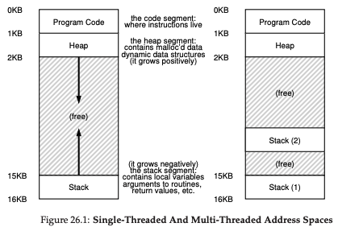
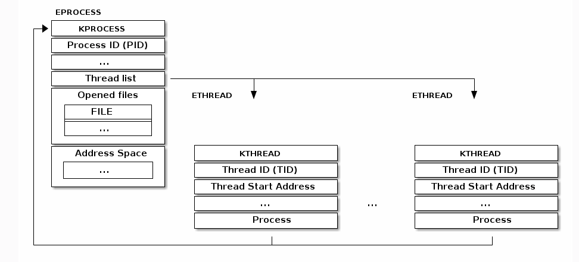
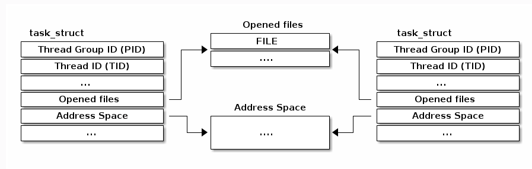
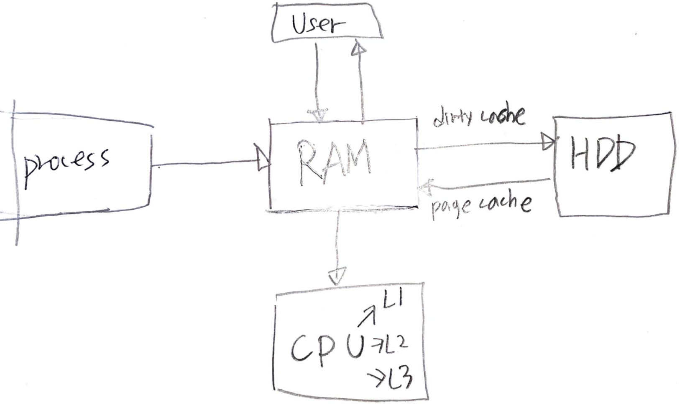
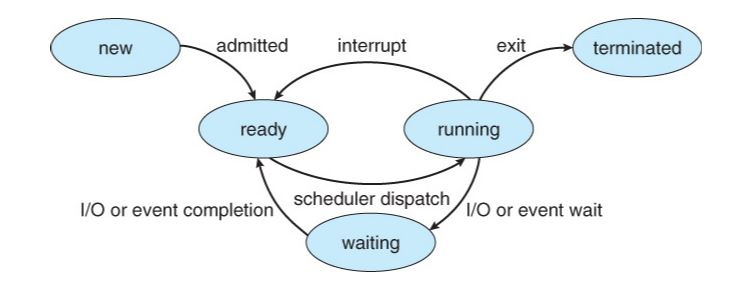

- [Abstract](#abstract)
- [References](#references)
- [Materials](#materials)
- [Boot Process](#boot-process)
- [Build and run old linux](#build-and-run-old-linux)
  - [oldlinux 0.12 (Success)](#oldlinux-012-success)
  - [oldlinux 0.11 (Fail)](#oldlinux-011-fail)
  - [linux 0.01 remake](#linux-001-remake)
- [System Information](#system-information)
  - [Kernel Infomation](#kernel-infomation)
  - [CPU Information](#cpu-information)
  - [Memory Information](#memory-information)
  - [Disk Information](#disk-information)
  - [Network Information](#network-information)
- [Process](#process)
  - [task_struct, thread_info](#task_struct-thread_info)
  - [Process Information](#process-information)
  - [Process Management](#process-management)
  - [task_struct](#task_struct)
  - [thread_info](#thread_info)
  - [Process and Threads](#process-and-threads)
  - [Killing a Zombie](#killing-a-zombie)
  - [priorities, schedulers and nice values](#priorities-schedulers-and-nice-values)
  - [IPC, Sockers and Pipes](#ipc-sockers-and-pipes)
  - [D-Bus Message](#d-bus-message)
  - [Monitoring processes through /proc](#monitoring-processes-through-proc)
- [Interrupt](#interrupt)
- [Kernel Timer](#kernel-timer)
- [Kernel Synchronization](#kernel-synchronization)
- [System Call](#system-call)
- [Signal](#signal)
- [Virtual File System](#virtual-file-system)
- [Memory Management](#memory-management)
- [System Load](#system-load)
- [fork, exec](#fork-exec)
- [Memory Management](#memory-management-1)
- [Swap](#swap)
- [Numa](#numa)
- [TIME_WAIT](#time_wait)
- [TCP Keepalive](#tcp-keepalive)
- [TCP Retransmission and TimeOut](#tcp-retransmission-and-timeout)
- [Dirty Page](#dirty-page)
- [I/O Scheduler](#io-scheduler)
- [Application Performance and Optimization](#application-performance-and-optimization)

----

# Abstract

Kernel 은 OS 의 핵심이다. 주로 program 들을 지원하고 hardware (CPU, Memory, Disk, TTY) 를 관리한다.

Linux Kernel 을 CPU, MEM, DISK, NETWORK 관점에서 정리해본다. 무엇보다 [디버깅을 통해 배우는 리눅스 커널의 구조와 원리 1 라즈베리 파이로 따라하면서 쉽게 이해할 수 있는 리눅스 커널 @ yes24](http://www.yes24.com/Product/Goods/90085976) 를 읽고 정리한다. 저자가 강의한 [video](https://www.youtube.com/watch?v=AOmawzOYkcQ&list=PLRrUisvYoUw9-cTYgkbTbr9f9CpbGdq4F) 도 있다.

다음의 부분들은 Arch 별로 구현이 다르다.

* 컨텍스트스위칭 
* 익셉션벡터 
* 시스템콜 
* 시그널핸들러 
* 메모리관리(mmu)

초기버전은 나중에 보자. 아래는 초기버전 공부에 대한 계획이다.

* [Linux Kernel documentation](https://www.kernel.org/doc/)
  * 옛날 버전인가???
  * [Understanding the Linux Virtual Memory Manager](https://www.kernel.org/doc/gorman/html/understand/) 은 Memory Management 를 다룬 책이다. Memory Management source code 를 commentary 함.
* [The Linux Kernel documentation](https://www.kernel.org/doc/html/latest/) 에 최고의 문서들이 있다. 
  * [Index of /doc/Documentation/ @ kernel](https://www.kernel.org/doc/Documentation/) 이 것은 source 로 보인다.

[UNIX V6](/unixv6kernel/README.md) 코드를 먼저 공부해 본다.

[1st version of Linux Kernel @ github](https://github.com/kalamangga-net/linux-0.01) 와 [The old Linux kernel source ver 0.11/0.12 study. @ github](https://github.com/huawenyu/oldlinux) 를 비교해서 공부해보자.

[osimpl @ TIL](/osimpl/README.md) 에서 직접 구현해 보자.

# References

* [문c 블로그](http://jake.dothome.co.kr/)
  * Linux Kernel 킹왕짱 고품질 블로그
* [코드로 알아보는 ARM 리눅스 커널](http://www.yes24.com/Product/Goods/85734266)
  * 좋은 책이라고?
* [디버깅을 통해 배우는 리눅스 커널의 구조와 원리 1 라즈베리 파이로 따라하면서 쉽게 이해할 수 있는 리눅스 커널 @ yes24](http://www.yes24.com/Product/Goods/90085976)
  * [디버깅을 통해 배우는 리눅스 커널의 구조와 원리 2 라즈베리 파이로 따라하면서 쉽게 이해할 수 있는 리눅스 커널 @ yes24](http://www.yes24.com/Product/Goods/90087307)
  * [blog](http://rousalome.egloos.com/v/10015971)
  * [video](https://www.youtube.com/watch?v=AOmawzOYkcQ&list=PLRrUisvYoUw9-cTYgkbTbr9f9CpbGdq4F)
  * [src](https://github.com/wikibook/linux-kernel)
* [The Linux Kernel Archives](https://www.kernel.org/)
  * Linux Kernel 의 버전을 파악할 수 있다. longterm 은 LTS (Long Term Support) 를 의미한다.
* [Linux Kernel Networking: Implementation and Theory (Expert's Voice in Open Source) 1st ed.](https://www.amazon.com/Linux-Kernel-Networking-Implementation-Experts/dp/143026196X)
  * Linux Kernel 의 Network 부분을 자세히 설명한다.
* [(unofficial) Linux Kernel Mailing List archive](https://lkml.org/)
  * 개발자들이 살벌하게 싸운다.
  * [refactoring of _do_fork()https://www.youtube.com/watch?v=2VcA5Wj7IvU](https://lkml.org/lkml/2020/8/18/987)
* [Linux Under The Hood | oreilly](https://learning.oreilly.com/videos/linux-under-the/9780134663500/)
  * Sander van Vugt 강좌. Linux 의 깊숙한 부분을 동영상으로 설명한다. 유료임.
* [Learning Path: Linux Performance Optimization, 1/e | orielly](https://learning.oreilly.com/learning-paths/learning-path-linux/9780135940709/)
  * Sander van Vugt 강좌. Linux 의 깊숙한 부분을 성능측면에서 동영상으로 설명한다. 유료임.

# Materials

* [Debugging the Linux Kernel with Qemu and GDB | youtube](https://www.youtube.com/watch?v=2VcA5Wj7IvU)
  * Qemu 에서 linux 를 실행하고 원격으로 gdb debugging 하는 방법
  * [Debugging the Linux Kernel with Qemu and GDB](https://pnx9.github.io/thehive/Debugging-Linux-Kernel.html)
  * [KernelBuild](https://kernelnewbies.org/KernelBuild)
* [리눅스 커널 책 리뷰 및 가이드 @ tistory](https://pr0gr4m.tistory.com/entry/%EB%A6%AC%EB%88%85%EC%8A%A4-%EC%BB%A4%EB%84%90-%EC%B1%85-%EB%A6%AC%EB%B7%B0-%EB%B0%8F-%EA%B0%80%EC%9D%B4%EB%93%9C)
  * 킹왕짱 Linux Kernel 책 리뷰
* videos
  * [Linux Internals @ youtube](https://www.youtube.com/watch?v=xHu7qI1gDPA&list=PLX1h5Ah4_XcfL2NCX9Tw4Hm9RcHhC14vs)
  * [Unix System Calls @ youtube](https://www.youtube.com/watch?v=xHu7qI1gDPA&list=PL993D01B05C47C28D)
  * [Unix Terminals and Shells @ youtube](https://www.youtube.com/watch?v=07Q9oqNLXB4&list=PLFAC320731F539902)
* [DevOps와 SE를 위한 리눅스 커널 이야기](http://www.yes24.com/Product/Goods/44376723)
  * DevOps 에게 필요한 Kernel 지식
* [리눅스 커널 부팅과정(Linux Kernel Booting Sequence) 분석](https://kkamagui.tistory.com/817)
* [Kernel of LInux 강의노트](https://books-and-cows.gitbook.io/-linux-kernel-lecture-note/)
  * [video](https://olc.kr/course/course_online_view.jsp?id=35&s_keyword=kernel&x=0&y=0)
  * [pdf](https://olc.kr/classroom/library.jsp?cuid=283080)
* [linux 0.01](https://github.com/zavg/linux-0.01)
  * 토발즈가 릴리즈한 최초 리눅스 커널
  * gcc 1.x 에서 빌드가 된다.
* [Linux src](https://elixir.bootlin.com/linux/v4.15/source/mm/page_alloc.c#L4564)
  * Linux Kernel 의 source code 를 Web 에서 살펴볼 수 있다.
* [The old Linux kernel source ver 0.11/0.12 study. @ github](https://github.com/huawenyu/oldlinux)
  * gcc 4.3 에서 빌드가 되도록 수정된 fork. 
  * ubuntu 18.04 LTS 에서 gcc 4.8.5 으로 build 잘됨. 
  * Windows 10 에서 2.3.6 으로 실행 잘됨.
  * [Welcome to OldLinux](http://www.oldlinux.org/)
    * [An old paper written by Linus: "Linux--a free unix-386 kernel"](http://www.oldlinux.org/Linus/index.html)
    * [A Heavily Commented Linux kernel Source Code (Kernel 0.11) pdf](http://www.oldlinux.org/download/CLK-5.0-WithCover.pdf)
* [linux 0.01 remake](http://draconux.free.fr/os_dev/linux0.01_news.html)
  * gcc 4.x 에서 빌드가 되도록 수정된 fork. 그러나 build 는 성공했지만 run 은 실패했다.
  * [src](https://github.com/issamabd/linux-0.01-remake)
  * [Linux-0.01 kernel building on ubuntu hardy](https://mapopa.blogspot.com/2008/09/linux-0.html)
  * [linux 0.01 commentary](https://www.academia.edu/5267870/The_Linux_Kernel_0.01_Commentary)
  * [linux 0.01 running on qemu](https://iamhjoo.tistory.com/11)

# Boot Process

* [An introduction to the Linux boot and startup processes](https://opensource.com/article/17/2/linux-boot-and-startup)

----

* BIOS POST
* Boot loader (GRUB2)
* Kernel initialization
* Start systemd, the parent of all processes.

# Build and run old linux

## oldlinux 0.12 (Success)

Build is ok Run with **bochs** is ok.

We need 2 files to launch the linux including boot image and root image.

Build with gcc 4.8.5 on Ubuntu 18.04 LTS Docker Container

```bash
$ docker run -it --name my_ubuntu_2 ubuntu bash
> apt-get update
> apt-get install git vim wget bin86 unzip
> apt-get install gcc-4.8 gcc-4.8-multilib
> update-alternatives --install /usr/bin/gcc gcc /usr/bin/gcc-4.8 60
> update-alternatives --install /usr/bin/g++ g++ /usr/bin/g++-4.8 60

> cd
> mkdir -p my/c
> git https://github.com/huawenyu/oldlinux.git
> cd oldlinux/linux-0.11

> make
```

Install bocks 2.3.6

```bash
$ mkdir -p tmp/a
$ cd tmp/a
$ wget http://oldlinux.org/Linux.old/bochs/linux-0.12-080324.zip
# Install Bochs-2.3.6.exe
```

Edit bochs config

```bash
$ mkdir my/c/oldlinux-dist-0.12
$ cd my/c/oldlinux-dist-0.12
# Copy root image file
$ cp tmp/a/linux-0.12-080324/rootimage-0.12-hd .
$ cp tmp/a/linux-0.12-080324/diskb.img .
$ cp tmp/a/linux-0.12-080324/bochsrc-0.12-hd.bxrc .
$ docker cp my_ubuntu_2:/root/my/c/oldlinux/linux-0.11/Image bootimage-0.12-hd
```

Run with bochs 2.3.6 on Windows 10

```bash
$ "c:\Program Files (x86)\Bochs-2.3.6\bochs.exe" -q -f bochsrc-0.12-hd.bxrc
```

## oldlinux 0.11 (Fail)

Build is ok Run with **bochs** is failed.

## linux 0.01 remake

Build is ok Run with **qemu** is failed.

[linux-0.01-remake @ github](https://github.com/issamabd/linux-0.01-remake) 는 32bit 를 기준으로 Makefile 이 작성되어 있다.

다음과 같이 build option 을 수정하여 64bit ubuntu 18.02 LTS 에서 build 해보자. [Compile for 32 bit or 64 bit @ stackoverflow](https://stackoverflow.com/questions/48964745/compile-for-32-bit-or-64-bit)

```makefile
AS      =as --32
LD      =ld -melf_i386
CFLAGS  =-fno-stack-protector -m32 -Wall -O -fstrength-reduce -fomit-frame-pointer -fno-stack-protector
```

gcc 는 4.8 로 downgrade 해야함. [우분투 16.04LTS의 기본 gcc 버전을 변경하자!](https://m.blog.naver.com/PostView.nhn?blogId=chandong83&logNo=220752111090&proxyReferer=https:%2F%2Fwww.google.com%2F)

```bash
$ docker run -it --name my_ubuntu_2 ubuntu bash
> apt-get update
> apt-get install git vim wget bin86 unzip
> apt-get install gcc-4.8 gcc-4.8-multilib
> update-alternatives --install /usr/bin/gcc gcc /usr/bin/gcc-4.8 60
> update-alternatives --install /usr/bin/g++ g++ /usr/bin/g++-4.8 60

> cd
> mkdir -p my/c
> git https://github.com/issamabd/linux-0.01-remake.git
> cd linux-0.01-remake

> find . -name Makefile
./lib/Makefile
./mm/Makefile
./Makefile
./kernel/Makefile
./fs/Makefile

> vim lib/Makefile
> vim mm/Makefile
> vim Makefile
> vim kernel/Makefile
> vim fs/Makefile
> make all
```

`lib/Makefile`

```makefile
AR      =ar
AS      =as --32
LD      =ld -melf_i386
LDFLAGS =-s -x
CC      =gcc
CFLAGS  =-fno-stack-protector -m32 -Wall -O -fstrength-reduce -fomit-frame-pointer \
        -finline-functions -nostdinc -I../include
CPP     =gcc -E -nostdinc -I../include
...
```

`mm/Makefile`

```makefile
CC      =gcc
CFLAGS  =-fno-stack-protector -m32 -O -Wall -fstrength-reduce  -fomit-frame-pointer -finline-functions -nostdinc -I../include
AS      =as --32
AR      =ar
LD      =ld -melf_i386
CPP     =gcc -E -nostdinc -I../include
...
```

`Makefile`

```makefile
AS86    =as86 -0
CC86    =cc86 -0
LD86    =ld86 -0

AS      =as --32
LD      =ld -melf_i386
LDFLAGS =-s -x -M -Ttext 0 -e startup_32
CC      =gcc
CFLAGS  =-fno-stack-protector -m32 -Wall -O -fstrength-reduce -fomit-frame-pointer
CPP     =gcc -E -nostdinc -Iinclude

ARCHIVES=kernel/kernel.o mm/mm.o fs/fs.o
LIBS    =lib/lib.a
...
```

`kernel/Makefile`

```makefile
AR      =ar
AS      =as --32
LD      =ld -melf_i386
LDFLAGS =-s -x
CC      =gcc
CFLAGS  =-fno-stack-protector -m32 -Wall -O -fstrength-reduce -fomit-frame-pointer  \
        -finline-functions -nostdinc -I../include
CPP     =gcc -E -nostdinc -I../include
...
```

`fs/Makefile`

```makefile
AR      =ar
AS      =as --32
CC      =gcc
LD      =ld -melf_i386
CFLAGS  =-fno-stack-protector -m32 -Wall -O -fstrength-reduce -fomit-frame-pointer -nostdinc -I../include
CPP     =gcc -E -nostdinc -I../include
...
```

몇가지 trouble shooting 이 필요함

* [install as86](https://command-not-found.com/as86)
* [-m32 옵션 컴파일시 bits/libc-header-start.h: No such file or directory 오류 발생하여 컴파일 불가능.](https://my-repo.tistory.com/12)


build 를 성공하면 다음과 같이 qemu 를 이용하여 실행해 볼 수 있다. 이때 qemu 는 Windows, Macos 와 같이 host machine 에서 실행해야 한다. DISPLAY 가 필요하기 때문에 Docker container 에서 실행할 수 없다. Docker container 에서 DISPLAY 없이 실행하는 방법이 있을 수도 있다. [linux 0.01 running on qemu](https://iamhjoo.tistory.com/11)

```bash
$ cd /tmp/a/

$ docker start my_ubuntu_2
$ docker exec -it my_ubuntu_2 bash
$ docker cp my_ubuntu_2:/root/my/c/linux-0.01-remake/Image /tmp/a/Image

$ wget http://draconux.free.fr/download/os-dev/linux0.01/Image/hd_oldlinux.img.zip
$ unzip hd_oldlinux.img.zip
# Fail
$ qemu-system-i386 -fda Image -hdb hd_oldlinux.img -boot a -m 8
# Fail
$ qemu-system-i386 -drive format=raw,file=Image,index=0,if=floppy -hdb hd_oldlinux.img -boot a -m 8
```

그러나 다음과 같이 hang 된다. (2021.01.25)


그래서 미리 build 된 image 를 다운로드 받아서 다시 실행해 보았다. 똑같은 현상이 발생한다. [Linux 0.01 Iùage download](http://draconux.free.fr/os_dev/linux0.01_download.html)

```bash
$ qemu-system-i386 -fda linux0.01-3.5.img -hdb hd_oldlinux.img -boot a -m 8
```

# System Information

## Kernel Infomation

`uname` 을 이용하면 Kernel Version 을 알 수 있다.

```console
$ docker run --rm -it ubuntu:18.04
$ uname -a
Linux f49102bbbef6 5.10.16.3-microsoft-standard-WSL2 #1 SMP Fri Apr 2 22:23:49 UTC 2021 x86_64 x86_64 x86_64 GNU/Linux
```

`dmesg` 를 이용하면 Kernel 의 정보를 더욱 알 수 있다.

```console
$ dmesg | grep -i kernel | more
```

* `Command line`
  * Kernel 이 booting 할 때 사용한 kernel parameters 이다.
* `crashkernel`
  * Kernel 이 panic 상태에 빠지면 crashkernel 을 로딩해서 kernel 의 debug info 를 저장한다. coredump 같은 건가??
* `Memory`
  * Kernel 이 booting 할 때 사용하는 Memory 정보이다.

`/boot/config-*` 파일에 Kernel Compile Config 가 저장되어 있다.

```console
$ cat /boot/config-`uname -r` | more
CONFIG_64BIT=y
CONFIG_X86_64=y
...
```

`ftrace` 와 같이 Kernel function level trace 가 필요하다면 `CONFIG_FUNCTION_TRACER=y` 가 설정되어 있어야 한다.

## CPU Information

`dmidecode` 를 이용하여 `bios, system, processor` 정보를 알 수 있다.

```console
$ dmidecode -t bios
$ dmidecode -t system
$ dmidecode -t processor
```

또한 `/proc/cpuinfo` 파일은 cpu information 은 담고 있다.

```bash
$ cat /proc/cpuinfo
```

`lscpu` 역시 cpu information 을 보여준다.

```bash
$ lscpu
Architecture:        x86_64
CPU op-mode(s):      32-bit, 64-bit
Byte Order:          Little Endian
CPU(s):              8
On-line CPU(s) list: 0-7
Thread(s) per core:  2
Core(s) per socket:  4
Socket(s):           1
Vendor ID:           GenuineIntel
CPU family:          6
Model:               60
Model name:          Intel(R) Core(TM) i7-4790 CPU @ 3.60GHz
Stepping:            3
CPU MHz:             3601.000
CPU max MHz:         3601.0000
BogoMIPS:            7202.00
Hypervisor vendor:   Windows Subsystem for Linux
Virtualization type: container
Flags:               fpu vme de pse tsc msr pae mce cx8 apic sep mtrr pge mca cmov pat pse36 clflush acpi mmx fxsr sse sse2 ss ht tm pbe syscall nx pdpe1gb rdtscp lm pni pclmulqdq est tm2 ssse3 fma cx16 xtpr pdcm pcid sse4_1 sse4_2 movbe popcnt aes xsave osxsave avx f16c rdrand hypervisor lahf_lm abm fsgsbase tsc_adjust bmi1 avx2 smep bmi2 erms invpcid ibrs ibpb stibp ssbd
```

## Memory Information

`dmidecode` 로 memory 를 확인할 수 있다. Memory Card 의 slot 과 장착된 Memory Card 의 정보를 확인할 수 있다.

```bash
$ dmidecode -t memory
$ dmidecode -t memory | grep -i size:
```

## Disk Information

`df` 로 Disk Information 을 확인 할 수 있다.

```bash
$ df -h
Filesystem      Size  Used Avail Use% Mounted on
rootfs          541G  474G   67G  88% /
none            541G  474G   67G  88% /dev
none            541G  474G   67G  88% /run
none            541G  474G   67G  88% /run/lock
none            541G  474G   67G  88% /run/shm
none            541G  474G   67G  88% /run/user
tmpfs           541G  474G   67G  88% /sys/fs/cgroup
C:\             541G  474G   67G  88% /mnt/c
D:\             391G  192G  199G  50% /mnt/d
```

`smartctl` 을 이용하면 Disk 의 물리적인 정보를 확인할 수 있다.

```bash
$ smartctl -a /dev/sda
$ smartctl -a /dev/sda -d cciss,0
```

## Network Information

`lspci, eth0` 를 이용하여 Network Card Information 을 확인할 수 있다.

```bash
$ lspci | grep -i ether
$ ethtool eth0
```

# Process

## task_struct, thread_info

[Linux Kernel: Threading vs Process - task_struct vs thread_info](https://stackoverflow.com/questions/21360524/linux-kernel-threading-vs-process-task-struct-vs-thread-info)

Linux 에서 thread 는 process 와 같이 취급된다. thread 하나에 `task_struct` 그리고 그걸 가리키는 `thread_info` 가 할당된다. `thread_info` 는 thread 의 stack 의 시작주소에 위치한다.

`thread_info` 는 architecture 에 의존적인 것이다. 즉, ARM, X86 에 따라 모양이 다르다. 반면에 `task_struct` 는 architecture 에 독립적이다. 즉, ARM, X86 에서 같은 모양이다.

다음은 Linux Kernel 에서 Single-Thread Process 와 Multi-Thread Process 의 virutal memory layout 을 나타내는 그림이다.



Thread 들은 Program Code, Heap, Open Files 을 공유한다. 그러나 Thread 별로 stack 이 다르다. 이 것은 windows, linux 모두 마찬가지이다. 그러나 PCB, TCB 를 표현하는 방법은 windows, linux 모두 다르다.

다음은 windows process, thread 의 자료구조를 표현한 것이다. process 는  `KPROCESS` 로 thread 는 `ETHREAD` 로 표현한다. PCB 와 TCB 가 구분되어 있다.



다음은 linux process, thread 의 자료구조를 표현한 것이다. process, thread 를 모두 `task_struct` 로 표현한다. PCB, TCB 가 동일하다.



## Process Information

다음은 Process 의 상태를 나타낸다.

* `R` is running
* `S` is sleeping
* `D` is sleeping in an uninterruptible wait
* `Z` is zombie
* `T` is traced or stopped

`top` 을 이용하여 Process Information 을 확인할 수 있다.

```bash
# Show process information once
$ top -b -n 1
top - 22:16:55 up 22 min,  0 users,  load average: 0.52, 0.58, 0.59
Tasks:   7 total,   1 running,   6 sleeping,   0 stopped,   0 zombie
%Cpu(s):  5.9 us, 16.1 sy,  0.0 ni, 77.8 id,  0.0 wa,  0.3 hi,  0.0 si,  0.0 st
KiB Mem : 16661968 total,  5258728 free, 11173888 used,   229352 buff/cache
KiB Swap: 50331648 total, 49676068 free,   655580 used.  5354348 avail Mem

  PID USER      PR  NI    VIRT    RES    SHR S  %CPU %MEM     TIME+ COMMAND
    1 root      20   0    8944    332    288 S   0.0  0.0   0:00.18 init
    8 root      20   0    8952    240    188 S   0.0  0.0   0:00.00 init
    9 iamslash  20   0   16792   3456   3336 S   0.0  0.0   0:00.27 bash
   49 root      20   0   17020   2356   2272 S   0.0  0.0   0:00.06 sudo
   50 root      20   0   16516   2040   2012 S   0.0  0.0   0:00.05 su
   51 root      20   0   16780   3408   3296 S   0.0  0.0   0:00.18 bash
  387 root      20   0   17492   1904   1436 R   0.0  0.0   0:00.04 top
```

주요 지표는 다음과 같다.

* Tasks 
  * total : 전체 process 수
  * running : 상태가 `R` 인 process 수
  * sleeping : 상태가 `S, D` 인 process 수
  * stopped : 상태가 `T` 인 process 수
  * zombie : 상캐가 `Z` 인 process 수
* VIRT
  * virtual memory size
* RSS
  * Resisdent Set Size : VIRT 중 Physical Memory 에 거주하는 것의 크기
* SHR
  * RSS 중 다른 Process 와 공유하는 Physical Memory 의 크기
* PR
  * 우선순위이다. 보통 20 이다. 값이 낮으면 우선순위가 높다.
* NI
  * PR 을 낮추는데 사용한다. PR 이 20 이고 NI 가 -4 이면 PR 은 16 으로 바뀌고 우선순위는 높아진다.

다음과 같이 Memory 를 할당한다고 해서 Physical Memory 에 할당이 되지는 않는다.

```c
void *myblock = (void *) malloc(1024*1024);
```

Memory 를 할당받고 나서 바로 써야 Physical Memory 에 할당된다. 바로 쓰면
VIRT 의 Memory Page 가 Dirty 될 것이고 Copy On Write 에 의해 Physical Memory
에 할당된다.

```c
void *myblock = (void *) malloc(1024*1024);
memset(myblock, 1, 1025*1024);
```

Virtual Memory 의 일부를 Physical Memory 에 상주하는 것은 Commit 한다고 한다. 

`vm.overcommit_memory` 의 값에 따라 commit 전략이 다르다.

* `vm.overcommit_memory=0` : OVERCOMMIT_GUESS
  * System 의 Memory 가 여유있다면 commit 하라.
* `vm.overcommit_memory=1` : OVERCOMMIT_ALWAYS
  * System 의 Memory 상태와 상관없이 commit 하라.
* `vm.overcommit_memory=2` : OVERCOMMIT_NEVER
  * ???

```cpp
// include/uapi/linux/mman.h
#define OVERCOMMIT_GUESS		0
#define OVERCOMMIT_ALWAYS		1
#define OVERCOMMIT_NEVER		2

// mm/util.c
int __vm_enough_memory(struct mm_struct *mm, long pages, int cap_sys_admin)
{
	long allowed;

	vm_acct_memory(pages);

	/*
	 * Sometimes we want to use more memory than we have
	 */
	if (sysctl_overcommit_memory == OVERCOMMIT_ALWAYS)
		return 0;

	if (sysctl_overcommit_memory == OVERCOMMIT_GUESS) {
		if (pages > totalram_pages() + total_swap_pages)
			goto error;
		return 0;
	}

	allowed = vm_commit_limit();
	/*
	 * Reserve some for root
	 */
	if (!cap_sys_admin)
		allowed -= sysctl_admin_reserve_kbytes >> (PAGE_SHIFT - 10);

	/*
	 * Don't let a single process grow so big a user can't recover
	 */
	if (mm) {
		long reserve = sysctl_user_reserve_kbytes >> (PAGE_SHIFT - 10);

		allowed -= min_t(long, mm->total_vm / 32, reserve);
	}

	if (percpu_counter_read_positive(&vm_committed_as) < allowed)
		return 0;
error:
	vm_unacct_memory(pages);

	return -ENOMEM;
}
```

## Process Management

Kernel 은 Process Meta Data 를 PCB (Process Control Block) 이라는 형태로 저장한다. Linux Kernel 의 `task_struct` 에 해당한다. 다음과 같은 항목들이 존재한다.

* PID (Process Identifier)
* Priority
* Waiting Event
* Status (run, sleep, ...)
* Location of image in disk
* Location of image in memeory
* open files
* directory
* terminal
* state vector save area(PC, R0, ...)
* parent, child process
* execution time

Process 는 CPU 로 부터 대기표를 뽑고 자기 순서를 기다린다. 기다리는 Process 들은 ready queue 에 저장된다. 역시 DIsk 로 부터 대기표를 뽑고 자기 순서를 기다린다. 기다리는 Process 들은 Disk wait queue 에 저장된다.

## task_struct

* [struct task_struct v4.19.30 arm src](https://elixir.bootlin.com/linux/v4.19.30/source/include/linux/sched.h#L593)

----

```cpp
struct task_struct {
#ifdef CONFIG_THREAD_INFO_IN_TASK
  /*
   * For reasons of header soup (see current_thread_info()), this
   * must be the first element of task_struct.
   */
  struct thread_info		thread_info;
#endif
  /* -1 unrunnable, 0 runnable, >0 stopped: */
  volatile long			state;

  /*
   * This begins the randomizable portion of task_struct. Only
   * scheduling-critical items should be added above here.
   */
  randomized_struct_fields_start

  void				*stack;
  atomic_t			usage;
  /* Per task flags (PF_*), defined further below: */
  unsigned int			flags;
  unsigned int			ptrace;
```

## thread_info

* [[리눅스 커널의 구조와 원리] 4.9.2 thread_info 구조체 분석 @ youtube](https://www.youtube.com/watch?v=USPtSWRz9wI)
* [struct thread_info v4.19.30 arm src](https://elixir.bootlin.com/linux/v4.19.30/source/arch/arm/include/asm/thread_info.h)

----

```cpp
/*
 * low level task data that entry.S needs immediate access to.
 * __switch_to() assumes cpu_context follows immediately after cpu_domain.
 */
struct thread_info {
  unsigned long		flags;		/* low level flags */
  int			preempt_count;	/* 0 => preemptable, <0 => bug */
  mm_segment_t		addr_limit;	/* address limit */
  struct task_struct	*task;		/* main task structure */
  __u32			cpu;		/* cpu */
  __u32			cpu_domain;	/* cpu domain */
  struct cpu_context_save	cpu_context;	/* cpu context */
  __u32			syscall;	/* syscall number */
  __u8			used_cp[16];	/* thread used copro */
  unsigned long		tp_value[2];	/* TLS registers */
#ifdef CONFIG_CRUNCH
  struct crunch_state	crunchstate;
#endif
  union fp_state		fpstate __attribute__((aligned(8)));
  union vfp_state		vfpstate;
#ifdef CONFIG_ARM_THUMBEE
  unsigned long		thumbee_state;	/* ThumbEE Handler Base register */
#endif
};
```

## Process and Threads

`$ dd` 를 이용하면 CPU 100% 를 재연할 수 있다. [dd | man](https://man7.org/linux/man-pages/man1/dd.1.html)

```console
# dd if=/dev/zero of=/dev/null &
# top
  PID USER      PR  NI    VIRT    RES    SHR S  %CPU %MEM     TIME+ COMMAND
   35 root      20   0    4388    680    612 R 100.0  0.0   0:37.48 dd
    1 root      20   0   18268   3388   2856 S   0.0  0.0   0:00.12 bash
   36 root      20   0   19892   2444   2084 R   0.0  0.0   0:00.01 top
```

`$ taskset` 을 이용하면 process 의 CPU affinity 를 설정하거나 읽어올 수 있다.
예를 들어 특정 pid 의 process 를 cpu3 에서 실행하도록 할 수 있다. [taskset | man](https://man7.org/linux/man-pages/man1/taskset.1.html)

```bash
# dd 를 cpu3 에서 실행한다.
$ taskset -pc 3 $(pidof dd)
```

`/sys/bus/cpu/devices/` 를 살펴보면 cpu 별 디렉토리들을 확인할 수 있다.

```bash
$ cd /sys/bus/cpu/devices/
$ ls -alh
total 0
drwxr-xr-x 2 root root 0 Jun 22 13:32 .
drwxr-xr-x 4 root root 0 Jun 22 13:32 ..
lrwxrwxrwx 1 root root 0 Jun 22 13:32 cpu0 -> ../../../devices/system/cpu/cpu0
lrwxrwxrwx 1 root root 0 Jun 22 13:32 cpu1 -> ../../../devices/system/cpu/cpu1
lrwxrwxrwx 1 root root 0 Jun 22 13:32 cpu2 -> ../../../devices/system/cpu/cpu2
lrwxrwxrwx 1 root root 0 Jun 22 13:32 cpu3 -> ../../../devices/system/cpu/cpu3
lrwxrwxrwx 1 root root 0 Jun 22 13:32 cpu4 -> ../../../devices/system/cpu/cpu4
lrwxrwxrwx 1 root root 0 Jun 22 13:32 cpu5 -> ../../../devices/system/cpu/cpu5
lrwxrwxrwx 1 root root 0 Jun 22 13:32 cpu6 -> ../../../devices/system/cpu/cpu6
lrwxrwxrwx 1 root root 0 Jun 22 13:32 cpu7 -> ../../../devices/system/cpu/cpu7

$ cd cpu3
$ ls -alh
total 0
drwxr-xr-x  6 root root    0 Jun 22 13:32 .
drwxr-xr-x 16 root root    0 Jun 22 12:45 ..
drwxr-xr-x  6 root root    0 Jun 22 13:34 cache
-r--------  1 root root 4.0K Jun 22 13:34 crash_notes
-r--------  1 root root 4.0K Jun 22 13:34 crash_notes_size
drwxr-xr-x  2 root root    0 Jun 22 13:34 hotplug
-rw-r--r--  1 root root 4.0K Jun 22 13:34 online
drwxr-xr-x  2 root root    0 Jun 22 13:34 power
lrwxrwxrwx  1 root root    0 Jun 22 13:34 subsystem -> ../../../../bus/cpu
drwxr-xr-x  2 root root    0 Jun 22 13:34 topology
-rw-r--r--  1 root root 4.0K Jun 22 13:34 uevent

$ cat online
1
$ echo 0 > online
# This will make cpu3 offline

$ lscpu
# If you make cpu3 offline
# On-line CPU will be changed
Architecture:          x86_64
CPU op-mode(s):        32-bit, 64-bit
Byte Order:            Little Endian
CPU(s):                8
On-line CPU(s) list:   0-7
Thread(s) per core:    1
Core(s) per socket:    1
Socket(s):             8
Vendor ID:             GenuineIntel
CPU family:            6
Model:                 158
Stepping:              13
CPU MHz:               2400.000
BogoMIPS:              4852.88
L1d cache:             32K
L1i cache:             32K
L2 cache:              256K
L3 cache:              16384K
```

## Killing a Zombie

> [7.3 Killing a zombie | Linux Under the Hood](https://learning.oreilly.com/videos/linux-under-the/9780134663500/9780134663500-LUTH_07_03/)

Zombie Process 는 제대로 정리되지 않은 Process 를 말한다. Child Process 가
`exit()` 를 호출하였지만 부모가 `wait()` 하지 않으면 Child Process 는 Zombie
Process 가 된다. Zombie Proces 는 여전히 Process Table 에 남아있다. Zombie
Process 는 System Resource 를 사용하지 않는다. PID 는 사용한다. Max PID 는
정해져 있다. 새로운 PID 가 Max PID 를 넘어서게 되면 Process 생성을 실패한다.
Zombie Process 가 많아지면 문제가 된다.

`$ kill -s SIGCHILD <ppid>` 를 이용하면 parent process 가 child processes 를
`wait()` 한다. Zombie Process 는 reaped 될 것이다. 잘 되는건가?

Orphan Process 는 Parent Process 가 죽고 남아 있는 Child Process 를 말한다.
Zombie Process 와는 다르다. init Process 가 Orphan Process 의 부모가 된다.

다음과 같이 `zombie.c` 를 작성하자.

```c
#include <stdlib.h>
#include <sys/types.h>
#include <unistd.h>
int main() {
	pid_t child_pid;
	child_pid = fork();
	if (child_pid > 0) {
		// Parent process
		sleep(60);
	} else {
		// Child process
		exit(0);
	}
	return 0;
}
```

build 및 실행하자.

```bash
$ docker run -it --rm --name my-ubuntu ubuntu:18.08

$ apt-get update
$ apt-get install gcc vim -Y

$ gcc zombie.c -o zombie
$ ./zombie &
$ top
  PID USER      PR  NI    VIRT    RES    SHR S  %CPU %MEM     TIME+ COMMAND
    1 root      20   0   18268   3388   2856 S   0.0  0.0   0:00.20 bash
  525 root      20   0    4208    624    556 S   0.0  0.0   0:00.00 zombie
  526 root      20   0       0      0      0 Z   0.0  0.0   0:00.00 zombie
  527 root      20   0   19888   2456   2116 R   0.0  0.0   0:00.00 top

$ ps aux | grep defunct
root       526  0.0  0.0      0     0 pts/0    Z    14:05   0:00 [zombie] <defunct>
root       536  0.0  0.0   8884   780 pts/0    S+   14:05   0:00 grep --color=auto defunct

$ kill -9 526
# Can not kill Zombie Process

$ ps fax
  PID TTY      STAT   TIME COMMAND
    1 pts/0    Ss     0:00 /bin/bash
  525 pts/0    S      0:00 ./zombie
  526 pts/0    Z      0:00  \_ [zombie] <defunct>
  537 pts/0    R+     0:00 ps fax

$ kill -s SIGCHLD 525
# It does not work. why???
$ kill -9 525
# It works
```

## priorities, schedulers and nice values

* [Understanding priorities, schedulers and nice values | Linux Under the Hood](https://learning.oreilly.com/videos/linux-under-the/9780134663500/9780134663500-LUTH_07_04/)

`top` 을 이용하면 Process 의 `PR, NI` 를 알 수 있다. Process 는 Realtime Process,
Normal Process 로 구분된다. Realtime Process 는 스케줄링 우선순위가 높다. 주로 System 과 관련이 있는 Process 들이다. `PR` 의 값의 범위는 `0 ~ 139` 이다. Realtime Process 들끼리의 우선순위를 말한다. `NI` 의 값의 범위는 `-20 ~ 19` 이다. Normal Process 들끼리의 우선순위를 말한다. 숫자가 낮으면 스케줄링의 우선순위가 높다.

```
$ top
  PID USER      PR  NI    VIRT    RES    SHR S  %CPU %MEM     TIME+ COMMAND
    1 root      20   0   18268   3388   2856 S   0.0  0.0   0:00.24 bash
  550 root      20   0   19892   2500   2140 R   0.0  0.0   0:00.00 top
```

`chrt` 를 이용하면 Realtime Process 우선순위를 조정할 수 있다. Realtime Process 의 Scheduling Policies 종류는 다음과 같다.

* SCHED_BATCH
* SCHED_FIFO (First In First Out)
* SCHED_IDLE CPU 가 IDLE 일 때, 우선순위가 매우 낮다.
* SCHED_OTHER
* SCHED_RR (Round Robin)

```bash
$ chrt --help
chrt - manipulate real-time attributes of a process
...
Scheduling policies:
  -b | --batch         set policy to SCHED_BATCH
  -f | --fifo          set policy to SCHED_FIFO
  -i | --idle          set policy to SCHED_IDLE
  -o | --other         set policy to SCHED_OTHER
  -r | --rr            set policy to SCHED_RR (default)

...
```

다음과 같이 Process 의 우선순위를 실습해 보자.

```bash
$ dd if=/dev/zero of=/dev/null &
$ dd if=/dev/zero of=/dev/null &
$ dd if=/dev/zero of=/dev/null &
$ dd if=/dev/zero of=/dev/null &
$ top
  PID USER      PR  NI    VIRT    RES    SHR S  %CPU %MEM     TIME+ COMMAND
  553 root      20   0    4388    664    592 R 100.0  0.0   0:06.32 dd
  552 root      20   0    4388    720    652 R  99.9  0.0   0:07.09 dd
  554 root      20   0    4388    676    604 R  99.9  0.0   0:04.93 dd
  555 root      20   0    4388    776    704 R  99.9  0.0   0:04.23 dd
    1 root      20   0   18268   3388   2856 S   0.0  0.0   0:00.24 bash
  556 root      20   0   19892   2400   2040 R   0.0  0.0   0:00.00 top

# r 을 누르고 -5 를 입력한다. 즉, renice 를 한다.
# docker container ubuntu 라서 안되는 건가? 잘 안됨.
PID to renice [default pid = 552] -5
  PID USER      PR  NI    VIRT    RES    SHR S  %CPU %MEM     TIME+ COMMAND
  552 root      20   0    4388    720    652 R 100.0  0.0   0:34.68 dd
  553 root      20   0    4388    664    592 R 100.0  0.0   0:33.90 dd
  554 root      20   0    4388    676    604 R 100.0  0.0   0:32.51 dd
  555 root      20   0    4388    776    704 R 100.0  0.0   0:31.82 dd
    1 root      20   0   18268   3388   2856 S   0.0  0.0   0:00.24 bash
  556 root      20   0   19892   2400   2040 R   0.0  0.0   0:00.00 top

$ chrt 19 dd if=/dev/zero of=/dev/null &
# docker container ubuntu 라서 안되는 건가?
chrt: failed to set pid 0's policy: Operation not permitted

$ kill -9 $(pidof dd)
```

## IPC, Sockers and Pipes

> [Understanding inter-process communication, sockets, and pipes | Linux Under the Hood](https://learning.oreilly.com/videos/linux-under-the/9780134663500/9780134663500-LUTH_07_05/)

`/proc` 를 살펴보면 Process 가 사용하는 socket 이 얼만큼 있는지 알 수 있다.
socket 을 사용하는 Process 를 살펴보면 file descript no 와 함께 socket 이
표시된다.

```bash
$ ls -alh /proc/1/fd
total 0
dr-x------ 2 root root  0 Jun 22 12:45 .
dr-xr-xr-x 9 root root  0 Jun 22 12:45 ..
lrwx------ 1 root root 64 Jun 22 12:45 0 -> /dev/pts/0
lrwx------ 1 root root 64 Jun 22 12:45 1 -> /dev/pts/0
lrwx------ 1 root root 64 Jun 22 12:45 2 -> /dev/pts/0
lrwx------ 1 root root 64 Jun 23 06:31 255 -> /dev/pts/0
```

## D-Bus Message

> * [1. D-Bus 기초](https://www.kernelpanic.kr/22)
> * [D-Bus](https://ko.wikipedia.org/wiki/D-Bus)

D-Bus 는 IPC 중 하나이다. 하나의 Machine 의 많든 Process 들이
통신하는 방식이다. socket 을 사용한다면 모든 Process 들이 각각
연결되야 한다. 그러나 D-Bus 를 사용하면 각 Process 가 D-Bus
에만 연결하면 된다.

## Monitoring processes through /proc

`/proc` 를 살펴보면 특정 Process 의 정보를 얻어올 수 있다.

```bash
$ cd /proc/1

# Show command line
$ cat cmdline
# Show out of memory score
$ cat oom_score
# Show proess status including memory
$ less status 
```

# Interrupt

WIP...

# Kernel Timer

WIP...

# Kernel Synchronization

Linux Kernel 은 주로 spin lock 과 mutex 를 이용하여 동기화처리를 한다.

spin lock 은 다음과 같이 사용된다. CPU0 이 critical section (임계영역) 에
해당하는 instruction 을 실행한다고 하자. CPU1 은 CPU0 이 critical section 의
instruction 을 모두 실행할 때까지 기다린다. context switching 을 하지 않는다.

mutex 는 다음과 같이 사용된다. CPU0 이 critical section 의 instruction 들을
실행한다고 하자. CPU1 은 CPU0 이 critical section 의 instruction 들을 모두
실행할 동안 context switching 을 하며 다른 일들을 처리한다. 그러나 context
switching 의 비용은 크다. 몇 cycle 일까???

임계영역이 짧을 때는 spin lock 을 사용한다. 임계영역이 길다면 mutex 를
사용한다.

# System Call

내가 작성한 a.out 이라는 프로그램이 실행되면 A process 라는 형태로 OS 에 만들어 진다. 그리고 `printf` 를 
실행할 때 다음과 같은 일들이 벌어진다.

* A process 는 write 을 호출한다. write 는 system call 을 호출하는 Wrapper routine 이다.
* `$0x80` 이라는 Interrupt 가 발생한다. 이것은 HW trap 을 의미한다.
* HW 는 CPU mode 를 user mode 에서 kernel mode 로 바꾼다.
* HW 는 `sys_call()` 을 실행한다. `sys_call()` 은 kernel 에 존재하는 assembly function 이다.
* EAX register 에 채워진 system call 번호가 제대로 인지 검증한다. 이것은 `sys_write()` 과 같다.
* 그 번호에 맞는 system call address 즉, `sys_write()` 의 address 를 table 에서 읽어온다.
* table 에서 읽어온 `sys_write()` address 를 실행한다.
* 실행을 마치면 HW 의 PC 를 처음 `printf` 다음줄로 조정한다.

# Signal

WIP...

# Virtual File System

WIP...

# Memory Management

Linux 는 다음과 같이 RAM 을 중심으로 데이터가 이동된다.



* Process 는 Virtual Memory 에 데이터를 쓴다. 이것은 매핑된 Physical Memory 에 데이터를 쓰는 것과 같다.
* User 는 HDD 로 부터 데이터를 원한다. RAM 은 HDD 로 부터 page 크기의 데이터를 읽어드리고 캐싱한다. 그리고 User 에게 data 를 보낸다.
* User 가 HDD 로 데이터를 쓰기를 원한다. RAM 에 data 를 쓴다. page 들 중 변경된 것은 주기적으로 HDD 에 쓰여진다.
* CPU 는 RAM 으로 부터 data 를 읽는다. 그리고 L1, L2, L3 와 같은 캐시에 데이터를 캐싱한다.

다음은 Linux Kernel Memory 를 구성하는 주요요소들이다.

* **Page**: The blocks that are used in memory, about 4K. 
* **Virtual Memory**: The process address space
* **Paging**: Getting memory from secondary storage in primary storage
* **Swap**: emulated memory on disk
* **Transaltion Lookaside Buffer**: A cache that helps speeding up the translation between virtual memory and physical memory
* **Cache**: Fast memory that is close to CPU 
* **Page cache**: Area where recently used memory page are stored

`$ free -m` 를 이용하면 Physical Memory 의 상황을 알 수 있다. [linux | TIL](/linux/README.md#memory) 참고.

```console
$ docker run -it --rm --name my-ubuntu ubuntu:14.04
# free -m
             total       used       free     shared    buffers     cached
Mem:         16013       6660       9352        402        341       5401
-/+ buffers/cache:        918      15095
Swap:         1023          0       1023
```

free 가 적다고 Physical Memory 가 부족한 것은 아니다. `buffers/cache` 의 일부를
사용할 수 있다. `-/+ buffers/cache` 의 `-/+` 의 의미는 언제든지 줄거나 늘어날 수
있다는 의미인가??? `918 (-/+ buffers/cache used) + 15,095 (-/+ buffers/cach free) = 16,013 (total)` 의 이유는???
Linux Kernel version 에 따라 계산법이 다른건가???

Inactive memory 는 swap space 으로 page out 될 수 있다. Inactive memory 만큼
Physical Memory 가 확보된다. 

`$ cat /proc/meminfo` 를 이용하면 `Active/Inactive` physical memory 를 확인할 수
있다. `Active = Active(anon) + Active(file), Inactive = Inactive(anon) +
Inactive(file)` 이다. [linux | TIL](/linux/README.md#memory) 참고

```console
# cat /proc/meminfo
MemTotal:       16397792 kB
MemFree:         9577040 kB
MemAvailable:   15212580 kB
Buffers:          349288 kB
Cached:          5530972 kB
SwapCached:            0 kB
Active:          1238900 kB
Inactive:        5068616 kB
Active(anon):      74636 kB
Inactive(anon):   664236 kB
Active(file):    1164264 kB
Inactive(file):  4404380 kB
...
```

# System Load

* [서버에 걸리는 부하, 추측하지 말고 계측하자](https://injae-kim.github.io/dev/2020/07/09/how-to-check-single-server-load-average.html)
* [[라즈베리파이] 스케줄링: 프로세스 상태 관리](http://egloos.zum.com/rousalome/v/9990651)

-----

```console
$ uptime
..., load averages: 3.79 3.30 3.20
```

top, uptime 등을 실행하면 1 분, 5 분, 15 분의 평균 load 를 알 수 있다. load 는 상태가 running, blocking 인 것들의 개수이다. process 가 running 인 것은 CPU bound job 이고 blocking 인 것은 I/O bound job 이다. 따라서 average load 를 이용해서는 process 들이 CPU bound 인지 I/O bound 인지 알 수 없다. 이 것은 kernel 의 코드를 이해하면 더욱 확실히 알 수 있다.

process 는 다음과 같은 status를 갖는다.



다음은 kernel 에 정의된 process 의 status 이다.

| status               | description                                        |
| -------------------- | -------------------------------------------------- |
| TASK_RUNNING         | 실행을 기다리는 상태 혹은 실행중인 상태 `R` |
| TASK_INTERRUPTIBLE   | `S` |
| TASK_UNINTERRUPTIBLE | 특정한 조건이 되지 않으면 interrupt 되지 않는 상태. 예를 들면 I/O 가 완료되기를 기다린다. I/O 가 완료되면 TASK_RUNNING 으로 변경된다. `D` |
| TASK_STOPPED         | `T` |
| TASK_ZOMBIE          | 자식 프로세스가 부모 프로세스로 반환되지 않은 상태 `Z` |

다음은 linux kernel 의 `timer.c` 이다. krenel 의 timer interrupt 가 발생할 때 마다 `calc_load` 가 호출된다. CentOs 5 의 경우 4ms 간격으로 timer interrupt 가 발생한다. `calc_load` 는 `EXP_1, EXP_5, EXP_15` 별로 active_tasks 를 계산에 이용하고 있다. active_tasks 는 count_active_tasks 가 return 한 값이다.

active_tasks 는 process 의 상태가 `TASK_RUNNING` 혹은 `TASK_UNINTERRUPTIBLE` 인 것들의 개수이다. 즉 상태가 running 혹은 blocking 인 process 의 개수와 같다.

```cpp
unsigned long avenrun[3];

static inline void calc_load(unsigned long ticks)
{
	unsigned long active_tasks; /* fixed-point */
	static int count = LOAD_FREQ;

	count -= ticks;
	if (count < 0) {
		count += LOAD_FREQ;
		active_tasks = count_active_tasks();
		CALC_LOAD(avenrun[0], EXP_1, active_tasks);
		CALC_LOAD(avenrun[1], EXP_5, active_tasks);
		CALC_LOAD(avenrun[2], EXP_15, active_tasks);
	}
}

...

/*
 * Nr of active tasks - counted in fixed-point numbers
 */
static unsigned long count_active_tasks(void)
{
	struct task_struct *p;
	unsigned long nr = 0;

	read_lock(&tasklist_lock);
	for_each_task(p) {
		if ((p->state == TASK_RUNNING ||
		     (p->state & TASK_UNINTERRUPTIBLE)))
			nr += FIXED_1;
	}
	read_unlock(&tasklist_lock);
	return nr;
}
```

sar 를 이용하면 CPU, I/O usage 를 구분해서 알 수 있다. 한가지 유의할 점이 있다. I/O bound job 이 실행되는 경우 core 하나만 점유한다는 사실이다. core 가 2 개이더라도 I/O device 는 하나이기 때문이다.

```bash
$ sar
00:00:01       CPU     %user     %nice   %system   %iowait     %idle
00:10:01       all     0.10      0.00     17.22      22.31     	58.87
00:10:01       	 0     0.28      0.00     34.34      45.56     	29.10
00:10:01       	 1     0.01      0.00      0.50       0.15     	99.42
00:20:01       all     0.15      0.00     16.50      22.31     	61.01
00:20:01       	 0     0.30      0.00     31.61      45.59     	22.51
00:20:01       	 1     0.01      0.00      0.38       0.11     	99.48
```

# fork, exec

* [3강 리눅스 커널노트](https://books-and-cows.gitbook.io/-linux-kernel-lecture-note/3)
* [Difference between fork() and exec()](https://www.geeksforgeeks.org/difference-fork-exec/)

----

다음과 같은 program 을 살펴보자. 

```cpp
#include <stdio.h> 
#include <sys/types.h> 
#include <unistd.h>  
#include <stdlib.h> 
#include <errno.h>   
#include <sys/wait.h> 
  
int main() { 
   pid_t  pid; 
   int ret = 1; 
   int status; 
   pid = fork(); 
  
   if (pid == -1){ 
  
      // pid == -1 means error occured 
      printf("can't fork, error occured\n"); 
      exit(EXIT_FAILURE); 
   } 
   else if (pid == 0){ 
  
      // pid == 0 means child process created 
      // getpid() returns process id of calling process 
      // Here It will return process id of child process 
      printf("child process, pid = %u\n",getpid()); 
      // Here It will return Parent of child Process means Parent process it self 
      printf("parent of child process, pid = %u\n",getppid());  
  
      // the argv list first argument should point to   
      // filename associated with file being executed 
      // the array pointer must be terminated by NULL  
      // pointer 
      char * argv_list[] = {"ls","-lart","/home",NULL}; 
  
      // the execv() only return if error occured. 
      // The return value is -1 
      execv("ls",argv_list); 
      exit(0); 
   } 
   else{ 
      // a positive number is returned for the pid of 
      // parent process 
      // getppid() returns process id of parent of  
      // calling process 
// Here It will return parent of parent process's ID 
      printf("Parent Of parent process, pid = %u\n",getppid()); 
      printf("parent process, pid = %u\n",getpid());  
  
        // the parent process calls waitpid() on the child 
        // waitpid() system call suspends execution of  
        // calling process until a child specified by pid 
        // argument has changed state 
        // see wait() man page for all the flags or options 
        // used here  
        if (waitpid(pid, &status, 0) > 0) { 
              
            if (WIFEXITED(status) && !WEXITSTATUS(status))  
              printf("program execution successful\n"); 
              
            else if (WIFEXITED(status) && WEXITSTATUS(status)) { 
                if (WEXITSTATUS(status) == 127) { 
  
                    // execv failed 
                    printf("execv failed\n"); 
                } 
                else 
                    printf("program terminated normally,"
                       " but returned a non-zero status\n");                 
            } 
            else 
               printf("program didn't terminate normally\n");             
        }  
        else { 
           // waitpid() failed 
           printf("waitpid() failed\n"); 
        } 
      exit(0); 
   } 
   return 0; 
} 
```

**fork()** 는 Child Process 를 만들고 Parent Process 의 image 와 PCB 를 Child Process 의 image, PCB 로 복사한다.

**exec()** 는 자신의 image 를 argument 로 넘겨받은 program 을 읽어들여 자신의 image 에 덮어쓴다. 그리고 새로운 image 의 main() 을 실행한다.

**wait()** 은 Child Process 가 종료할 때 까지 기다린다.

**exit()** 은 모든 resource 들을 free 하고 parent 에게 종료를 통보한다. exit() 는 내가 program 에 삽입하지 않아도 실행된다.

**schedule()** 은 다음에 실행될 Process 를 찾아 선택한다. 그리고 `context_switch()` 라는 kernel internal function 을 실행한다. `schedule()` 은 kernel internal function 이다. system call 은 user program 에서 호출할 수 있지만 kernel internal function 은 user program 에 노출되어 있지 않다. `read(), write(), wait(), exit()` 와 같은 system call 들은 schedule 을 호출한다. 

**context_switch()** 은 현재 CPU state vector 를 은퇴하는 Process 를 선택하고 그것의 PCB 에 적당한 정보를 기록한다. 그리고 새로 등장한 Process 의 PCB 를 읽어오고 그 PCB 의 PC 로 부터 프로그램을 실행한다.

# Memory Management

* [Understanding the Linux Virtual Memory Manager](https://www.kernel.org/doc/gorman/html/understand/) 은 Memory Management 를 다룬 책이다. source code 도 설명한다.

`/proc/meminfo` 의 주요지표가 어덯게 계산 되는지 [/fs/proc/meminfo.c @ kernel](https://elixir.bootlin.com/linux/v4.15/source/fs/proc/meminfo.c#L46) 를 보고 이해하자.

MemAvailable 이 어떻게 계산되는지 [/mm/page_alloc.c @ kernel](https://elixir.bootlin.com/linux/v4.15/source/mm/page_alloc.c#L4564) 을 보고 이해하자.

* [Slab Allocator(슬랩 할당자)](https://wiki.kldp.org/wiki.php/slab_allocator)

# Swap

# Numa

# TIME_WAIT

# TCP Keepalive

# TCP Retransmission and TimeOut

# Dirty Page

# I/O Scheduler

# Application Performance and Optimization
