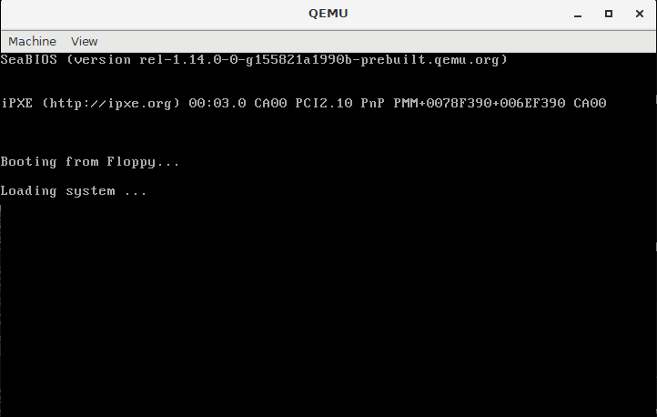

- [Abstract](#abstract)
- [Materials](#materials)
- [Build and run old linux](#build-and-run-old-linux)
  - [oldlinux 0.12 (Success)](#oldlinux-012-success)
  - [oldlinux 0.11 (Fail)](#oldlinux-011-fail)
  - [linux 0.01 remake](#linux-001-remake)
- [System Call](#system-call)
- [Process Management](#process-management)
- [fork, exec](#fork-exec)
- [Memory Management](#memory-management)
- [File System](#file-system)
- [Network](#network)

----

# Abstract

Kernel 은 OS 의 핵심이다. 주로 program 들을 지원하고 hardware (CPU, Memory, Disk, TTY) 를 관리한다.

Linux Kernel 을 CPU, MEM, DISK, NETWORK 관점에서 정리해본다.

[osimpl @ TIL](/osimpl/README.md) 에서 직접 구현해 보자.

# Materials

* [Kernel of LInux 강의노트](https://books-and-cows.gitbook.io/-linux-kernel-lecture-note/)
  * [video](https://olc.kr/course/course_online_view.jsp?id=35&s_keyword=kernel&x=0&y=0)
  * [pdf](https://olc.kr/classroom/library.jsp?cuid=283080)
* [linux 0.01](https://github.com/zavg/linux-0.01)
  * 토발즈가 릴리즈한 최초 리눅스 커널
  * gcc 1.x 에서 빌드가 된다.
* [The old Linux kernel source ver 0.11/0.12 study. @ github](https://github.com/huawenyu/oldlinux)
  * gcc 4.3 에서 빌드가 되도록 수정된 fork. 
  * ubuntu 18.04 LTS 에서 gcc 4.8.5 으로 build 잘됨. 
  * Windows 10 에서 2.3.6 으로 실행 잘됨.
  * [Welcome to OldLinux](http://www.oldlinux.org/)
    * [An old paper written by Linus: "Linux--a free unix-386 kernel"](http://www.oldlinux.org/Linus/index.html)
    * [A Heavily Commented Linux kernel Source Code (Kernel 0.11) pdf](http://www.oldlinux.org/download/CLK-5.0-WithCover.pdf)
* [linux 0.01 remake](http://draconux.free.fr/os_dev/linux0.01_news.html)
  * gcc 4.x 에서 빌드가 되도록 수정된 fork. 그러나 build 는 성공했지만 run 은 실패했다.
  * [src](https://github.com/issamabd/linux-0.01-remake)
  * [Linux-0.01 kernel building on ubuntu hardy](https://mapopa.blogspot.com/2008/09/linux-0.html)
  * [linux 0.01 commentary](https://www.academia.edu/5267870/The_Linux_Kernel_0.01_Commentary)
  * [linux 0.01 running on qemu](https://iamhjoo.tistory.com/11)

# Build and run old linux

## oldlinux 0.12 (Success)

Build is ok Run with **bochs** is ok.

We need 2 files to launch the linux including boot image and root image.

Build with gcc 4.8.5 on Ubuntu 18.04 LTS Docker Container

```bash
$ docker run -it --name my_ubuntu_2 ubuntu bash
> apt-get update
> apt-get install git vim wget bin86 unzip
> apt-get install gcc-4.8 gcc-4.8-multilib
> update-alternatives --install /usr/bin/gcc gcc /usr/bin/gcc-4.8 60
> update-alternatives --install /usr/bin/g++ g++ /usr/bin/g++-4.8 60

> cd
> mkdir -p my/c
> git https://github.com/huawenyu/oldlinux.git
> cd oldlinux/linux-0.11

> make
```

Install bocks 2.3.6

```bash
$ mkdir -p tmp/a
$ cd tmp/a
$ wget http://oldlinux.org/Linux.old/bochs/linux-0.12-080324.zip
# Install Bochs-2.3.6.exe
```

Edit bochs config

```bash
$ mkdir my/c/oldlinux-dist-0.12
$ cd my/c/oldlinux-dist-0.12
# Copy root image file
$ cp tmp/a/linux-0.12-080324/rootimage-0.12-hd .
$ cp tmp/a/linux-0.12-080324/diskb.img .
$ cp tmp/a/linux-0.12-080324/bochsrc-0.12-hd.bxrc .
$ docker cp my_ubuntu_2:/root/my/c/oldlinux/linux-0.11/Image bootimage-0.12-hd
```

Run with bochs 2.3.6 on Windows 10

```bash
$ "c:\Program Files (x86)\Bochs-2.3.6\bochs.exe" -q -f bochsrc-0.12-hd.bxrc
```

## oldlinux 0.11 (Fail)

Build is ok Run with **bochs** is failed.

## linux 0.01 remake

Build is ok Run with **qemu** is failed.

[linux-0.01-remake @ github](https://github.com/issamabd/linux-0.01-remake) 는 32bit 를 기준으로 Makefile 이 작성되어 있다.

다음과 같이 build option 을 수정하여 64bit ubuntu 18.02 LTS 에서 build 해보자. [Compile for 32 bit or 64 bit @ stackoverflow](https://stackoverflow.com/questions/48964745/compile-for-32-bit-or-64-bit)

```makefile
AS      =as --32
LD      =ld -melf_i386
CFLAGS  =-fno-stack-protector -m32 -Wall -O -fstrength-reduce -fomit-frame-pointer -fno-stack-protector
```

gcc 는 4.8 로 downgrade 해야함. [우분투 16.04LTS의 기본 gcc 버전을 변경하자!](https://m.blog.naver.com/PostView.nhn?blogId=chandong83&logNo=220752111090&proxyReferer=https:%2F%2Fwww.google.com%2F)

```bash
$ docker run -it --name my_ubuntu_2 ubuntu bash
> apt-get update
> apt-get install git vim wget bin86 unzip
> apt-get install gcc-4.8 gcc-4.8-multilib
> update-alternatives --install /usr/bin/gcc gcc /usr/bin/gcc-4.8 60
> update-alternatives --install /usr/bin/g++ g++ /usr/bin/g++-4.8 60

> cd
> mkdir -p my/c
> git https://github.com/issamabd/linux-0.01-remake.git
> cd linux-0.01-remake

> find . -name Makefile
./lib/Makefile
./mm/Makefile
./Makefile
./kernel/Makefile
./fs/Makefile

> vim lib/Makefile
> vim mm/Makefile
> vim Makefile
> vim kernel/Makefile
> vim fs/Makefile
> make all
```

`lib/Makefile`

```makefile
AR      =ar
AS      =as --32
LD      =ld -melf_i386
LDFLAGS =-s -x
CC      =gcc
CFLAGS  =-fno-stack-protector -m32 -Wall -O -fstrength-reduce -fomit-frame-pointer \
        -finline-functions -nostdinc -I../include
CPP     =gcc -E -nostdinc -I../include
...
```

`mm/Makefile`

```makefile
CC      =gcc
CFLAGS  =-fno-stack-protector -m32 -O -Wall -fstrength-reduce  -fomit-frame-pointer -finline-functions -nostdinc -I../include
AS      =as --32
AR      =ar
LD      =ld -melf_i386
CPP     =gcc -E -nostdinc -I../include
...
```

`Makefile`

```makefile
AS86    =as86 -0
CC86    =cc86 -0
LD86    =ld86 -0

AS      =as --32
LD      =ld -melf_i386
LDFLAGS =-s -x -M -Ttext 0 -e startup_32
CC      =gcc
CFLAGS  =-fno-stack-protector -m32 -Wall -O -fstrength-reduce -fomit-frame-pointer
CPP     =gcc -E -nostdinc -Iinclude

ARCHIVES=kernel/kernel.o mm/mm.o fs/fs.o
LIBS    =lib/lib.a
...
```

`kernel/Makefile`

```makefile
AR      =ar
AS      =as --32
LD      =ld -melf_i386
LDFLAGS =-s -x
CC      =gcc
CFLAGS  =-fno-stack-protector -m32 -Wall -O -fstrength-reduce -fomit-frame-pointer  \
        -finline-functions -nostdinc -I../include
CPP     =gcc -E -nostdinc -I../include
...
```

`fs/Makefile`

```makefile
AR      =ar
AS      =as --32
CC      =gcc
LD      =ld -melf_i386
CFLAGS  =-fno-stack-protector -m32 -Wall -O -fstrength-reduce -fomit-frame-pointer -nostdinc -I../include
CPP     =gcc -E -nostdinc -I../include
...
```

몇가지 trouble shooting 이 필요함

* [install as86](https://command-not-found.com/as86)
* [-m32 옵션 컴파일시 bits/libc-header-start.h: No such file or directory 오류 발생하여 컴파일 불가능.](https://my-repo.tistory.com/12)


build 를 성공하면 다음과 같이 qemu 를 이용하여 실행해 볼 수 있다. 이때 qemu 는 Windows, Macos 와 같이 host machine 에서 실행해야 한다. DISPLAY 가 필요하기 때문에 Docker container 에서 실행할 수 없다. Docker container 에서 DISPLAY 없이 실행하는 방법이 있을 수도 있다. [linux 0.01 running on qemu](https://iamhjoo.tistory.com/11)

```bash
$ cd /tmp/a/

$ docker start my_ubuntu_2
$ docker exec -it my_ubuntu_2 bash
$ docker cp my_ubuntu_2:/root/my/c/linux-0.01-remake/Image /tmp/a/Image

$ wget http://draconux.free.fr/download/os-dev/linux0.01/Image/hd_oldlinux.img.zip
$ unzip hd_oldlinux.img.zip
# Fail
$ qemu-system-i386 -fda Image -hdb hd_oldlinux.img -boot a -m 8
# Fail
$ qemu-system-i386 -drive format=raw,file=Image,index=0,if=floppy -hdb hd_oldlinux.img -boot a -m 8
```

그러나 다음과 같이 hang 된다. (2021.01.25)



그래서 미리 build 된 image 를 다운로드 받아서 다시 실행해 보았다. 똑같은 현상이 발생한다. [Linux 0.01 Iùage download](http://draconux.free.fr/os_dev/linux0.01_download.html)

```bash
$ qemu-system-i386 -fda linux0.01-3.5.img -hdb hd_oldlinux.img -boot a -m 8
```

# System Call

내가 작성한 a.out 이라는 프로그램이 실행되면 A process 라는 형태로 OS 에 만들어 진다. 그리고 `printf` 를 
실행할 때 다음과 같은 일들이 벌어진다.

* A process 는 write 을 호출한다. write 는 system call 을 호출하는 Wrapper routine 이다.
* $0x80 이라는 Interrupt 가 발생한다. 이것은 HW trap 을 의미한다.
* HW 는 CPU mode 를 user mode 에서 kernel mode 로 바꾼다.
* HW 는 sys_call() 을 실행한다. sys_call() 은 kernel 에 존재하는 assembly function 이다.
* EAX register 에 채워진 system call 번호가 제대로 인지 검증한다. 이것은 sys_write() 과 같다.
* 그 번호에 맞는 system call address 즉, sys_write() 의 address 를 table 에서 읽어온다.
* table 에서 읽어온 sys_write() address 를 실행한다.
* 실행을 마치면 HW 의 PC 를 처음 `printf` 다음줄로 조정한다.

# Process Management

Kernel 은 Process Meta Data 를 PCB (Process Control Block) 이라는 형태로 저장한다. 다음과 같은 항목들이 존재한다.

* PID (Process Identifier)
* Priority
* Waiting Event
* Status (run, sleep, ...)
* Location of image in disk
* Location of image in memeory
* open files
* directory
* terminal
* state vector save area(PC, R0, ...)
* parent, child process
* execution time

Process 는 CPU 로 부터 대기표를 뽑고 자기 순서를 기다린다. 기다리는 Process 들은 ready queue 에 저장된다. 역시 DIsk 로 부터 대기표를 뽑고 자기 순서를 기다린다. 기다리는 Process 들은 Disk wait queue 에 저장된다.

# fork, exec

* [3강 리눅스 커널노트](https://books-and-cows.gitbook.io/-linux-kernel-lecture-note/3)
* [Difference between fork() and exec()](https://www.geeksforgeeks.org/difference-fork-exec/)

----

다음과 같은 program 을 살펴보자. 

```c
#include <stdio.h> 
#include <sys/types.h> 
#include <unistd.h>  
#include <stdlib.h> 
#include <errno.h>   
#include <sys/wait.h> 
  
int main(){ 
   pid_t  pid; 
   int ret = 1; 
   int status; 
   pid = fork(); 
  
   if (pid == -1){ 
  
      // pid == -1 means error occured 
      printf("can't fork, error occured\n"); 
      exit(EXIT_FAILURE); 
   } 
   else if (pid == 0){ 
  
      // pid == 0 means child process created 
      // getpid() returns process id of calling process 
      // Here It will return process id of child process 
      printf("child process, pid = %u\n",getpid()); 
      // Here It will return Parent of child Process means Parent process it self 
      printf("parent of child process, pid = %u\n",getppid());  
  
      // the argv list first argument should point to   
      // filename associated with file being executed 
      // the array pointer must be terminated by NULL  
      // pointer 
      char * argv_list[] = {"ls","-lart","/home",NULL}; 
  
      // the execv() only return if error occured. 
      // The return value is -1 
      execv("ls",argv_list); 
      exit(0); 
   } 
   else{ 
      // a positive number is returned for the pid of 
      // parent process 
      // getppid() returns process id of parent of  
      // calling process 
// Here It will return parent of parent process's ID 
      printf("Parent Of parent process, pid = %u\n",getppid()); 
      printf("parent process, pid = %u\n",getpid());  
  
        // the parent process calls waitpid() on the child 
        // waitpid() system call suspends execution of  
        // calling process until a child specified by pid 
        // argument has changed state 
        // see wait() man page for all the flags or options 
        // used here  
        if (waitpid(pid, &status, 0) > 0) { 
              
            if (WIFEXITED(status) && !WEXITSTATUS(status))  
              printf("program execution successful\n"); 
              
            else if (WIFEXITED(status) && WEXITSTATUS(status)) { 
                if (WEXITSTATUS(status) == 127) { 
  
                    // execv failed 
                    printf("execv failed\n"); 
                } 
                else 
                    printf("program terminated normally,"
                       " but returned a non-zero status\n");                 
            } 
            else 
               printf("program didn't terminate normally\n");             
        }  
        else { 
           // waitpid() failed 
           printf("waitpid() failed\n"); 
        } 
      exit(0); 
   } 
   return 0; 
} 
```

**fork()** 는 Child Process 를 만들고 Parent Process 의 image 와 PCB 를 Child Process 의 image, PCB 로 복사한다.

**exec()** 는 자신의 image 를 argument 로 넘겨받은 program 을 읽어들여 자신의 image 에 덮어쓴다. 그리고 새로운 image 의 main() 을 실행한다.

**wait()** 은 Child Process 가 종료할 때 까지 기다린다.

**exit()** 은 모든 resource 들을 free 하고 parent 에게 종료를 통보한다. exit() 는 내가 program 에 삽입하지 않아도 실행된다.

**schedule()** 은 은 다음에 실행될 Process 를 찾아 선택한다. 그리고 context_switch() 라는 kernel internal function 을 실행한다. schedule() 은 kernel internal function 이다. system call 은 user program 에서 호출할 수 있지만 kernel internal function 은 user program 에 노출되어 있지 않다. read(), write(), wait(), exit() 와 같은 system call 들은 schedule 을 호출한다. 

**context_switch()** 은 현재 CPU state vector 를 은퇴하는 Process 를 선택하고 그것의 PCB 에 적당한 정보를 기록한다. 그리고 새로 등장한 Process 의 PCB 를 읽어오고 그 PCB 의 PC 로 부터 프로그램을 실행한다.

# Memory Management

* [Slab Allocator(슬랩 할당자)](https://wiki.kldp.org/wiki.php/slab_allocator)

# File System

# Network
