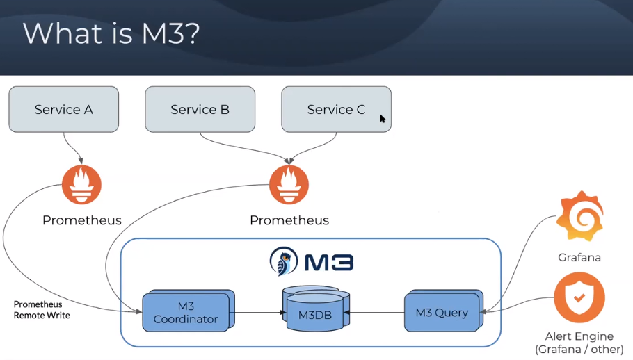
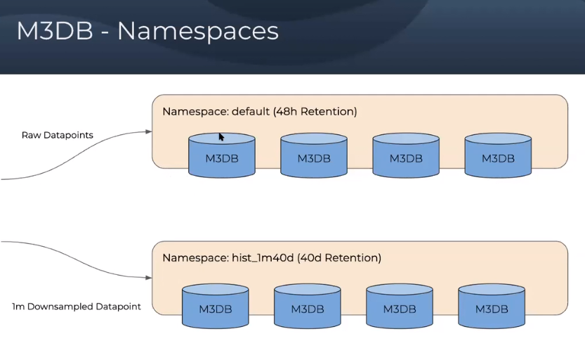
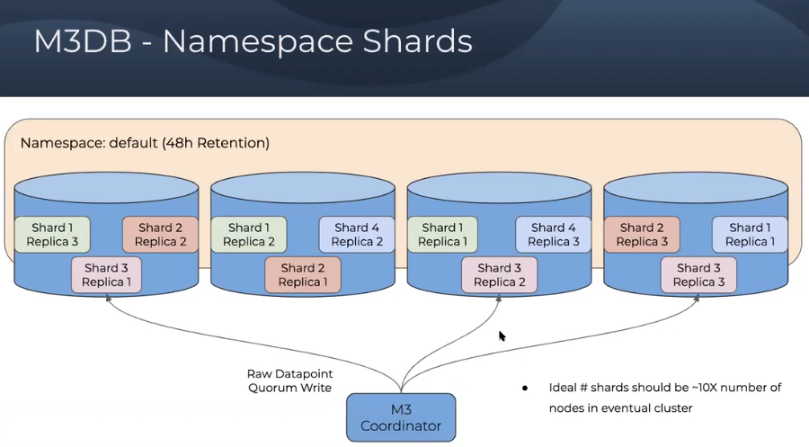
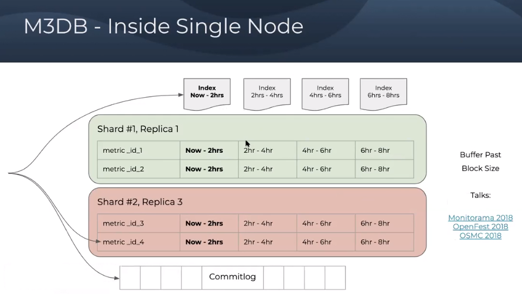
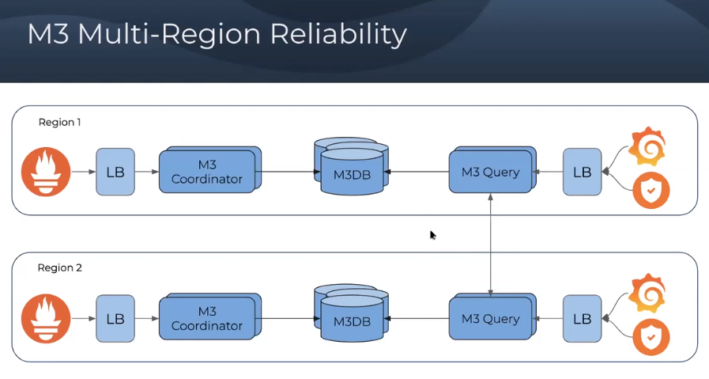

- [Abstract](#abstract)
- [Materials](#materials)
- [Concepts](#concepts)
- [Compoments](#compoments)
- [Architecture](#architecture)
  - [Ports of m3db](#ports-of-m3db)
  - [Ports of m3query](#ports-of-m3query)
  - [Query Engine Architecture](#query-engine-architecture)
  - [Redesigning for the next order of magnitude](#redesigning-for-the-next-order-of-magnitude)
  - [Data Storage](#data-storage)
- [Install](#install)
  - [Creating a Single Node M3DB Cluster with Docker](#creating-a-single-node-m3db-cluster-with-docker)
  - [M3DB Cluster Deployment with docker-compose](#m3db-cluster-deployment-with-docker-compose)
  - [M3DB on Kubernetes](#m3db-on-kubernetes)
  - [Install with Terraform and Ansible](#install-with-terraform-and-ansible)
- [M3 stack infrastructure design](#m3-stack-infrastructure-design)
  - [M3 Basic](#m3-basic)
  - [M3 Namesspaces](#m3-namesspaces)
  - [M3 Namespace shards](#m3-namespace-shards)
  - [M3 Inside Single Node](#m3-inside-single-node)
  - [M3 Multi-Zone Reliability](#m3-multi-zone-reliability)
  - [M3 Multi-Region Reliability](#m3-multi-region-reliability)
- [Operational Guides](#operational-guides)
  - [Integrate with Prometheus](#integrate-with-prometheus)
  - [Resolution, Retention Strategies](#resolution-retention-strategies)
  - [Docker & Kernel Configuration](#docker--kernel-configuration)

----

# Abstract

M3 is a cluster for long-term logging solution. As documentation for Prometheus states, it is limited by single nodes in its scalability and durability.

M3 lets users see all operations of a specific type globally, and look at a longer retention to view historical trends in a single place.


# Materials

* [M3DB, a distributed timeseries database (m3db.io) @ hackernews](https://news.ycombinator.com/item?id=22391270)
* [M3: Uber’s Open Source, Large-scale Metrics Platform for Prometheus @ uber](https://eng.uber.com/m3/)
* [The Billion Data Point Challenge: Building a Query Engine for High Cardinality Time Series Data @ uber](https://eng.uber.com/billion-data-point-challenge/)
* [M3 Media @ m3db.io](https://m3db.io/docs/overview/media/)
  * [M3 Community Meetup - July 10, 2020 @ vimeo](https://vimeo.com/user120001164/review/440449118/00d5aa7216?sort=lastUserActionEventDate&direction=desc)
* [An introduction to M3](https://aiven.io/blog/an-introduction-to-m3)
* [M3 and Prometheus, Monitoring at Planet Scale for Everyone - Rob Skillington, Uber @ youtube](https://www.youtube.com/watch?v=EFutyuIpFXQ)
  * [pdf](https://static.sched.com/hosted_files/kccnceu19/e0/M3%20and%20Prometheus%2C%20Monitoring%20at%20Planet%20Scale%20for%20Everyone.pdf)
  * [event](https://kccnceu19.sched.com/event/MPbX)
* [M3 Documentation](https://m3db.io/docs/)
* [m3 proposals @ github](https://github.com/m3db/proposal)
  * [m3 @ github](https://github.com/m3db/m3) 
  * [m3 kubernetes operator @ github](https://github.com/m3db/m3db-operator)
* [Awesome time series database](https://xephonhq.github.io/awesome-time-series-database/)

# Concepts

* Placement: Mapping of Node to Shards
* Namespace: Similar with table of DataBase

# Compoments 

* [M3 Coordinator](m3coordinator.md)
  * service that coordinates reads and writes between upstream systems, such as Prometheus, and M3DB. This is a Prometheus sidecar and also performs downsampling.
* [M3DB](m3db.md)
  * distributed time series database that provides scalable storage and a reverse index of time series
* [M3 Query](m3query.md)
  * service that houses a distributed query engine for querying both realtime and historical metrics, supporting several different query languages.
* **M3 Aggregator**
  * a service that runs as a dedicated metrics aggregator and provides stream based downsampling, based on dynamic rules stored in etcd.

# Architecture

## Ports of m3db

* `src/cmd/tools/dtest/docker/harness/resources/config/m3dbnode.yml`

```go
  listenAddress: 0.0.0.0:9000
  clusterListenAddress: 0.0.0.0:9001
  httpNodeListenAddress: 0.0.0.0:9002
  httpClusterListenAddress: 0.0.0.0:9003
  debugListenAddress: 0.0.0.0:9004
```

## Ports of m3query

* `src/cmd/services/m3query/config/config.go`

```go
		PrometheusReporter: &instrument.PrometheusConfiguration{
			HandlerPath: "/metrics",
			// Default to coordinator (until https://github.com/m3db/m3/issues/682 is resolved)
			ListenAddress: "0.0.0.0:7203",
    },   
...
	defaultListenAddress = "0.0.0.0:7201"

	defaultCarbonIngesterListenAddress = "0.0.0.0:7204"
```

## Query Engine Architecture

* [The Billion Data Point Challenge: Building a Query Engine for High Cardinality Time Series Data @ uber](https://eng.uber.com/billion-data-point-challenge/)

----


## Redesigning for the next order of magnitude

* [The Billion Data Point Challenge: Building a Query Engine for High Cardinality Time Series Data @ uber](https://eng.uber.com/billion-data-point-challenge/)

----

 The memory footprint of sequential execution (Approach 1) is much greater than that of lazy execution (Approach 2).


## Data Storage

* [The Billion Data Point Challenge: Building a Query Engine for High Cardinality Time Series Data @ uber](https://eng.uber.com/billion-data-point-challenge/)

----

A block structure allows us to work in parallel on different storage blocks, which greatly improves our computation speed.


# Install

## Creating a Single Node M3DB Cluster with Docker

* [Creating a Single Node M3DB Cluster with Docker](https://m3db.io/docs/quickstart/docker/)

-----

```bash
# PUll
$ docker pull quay.io/m3db/m3dbnode:latest
# This run m3db with m3coordinator on one binary
$ docker run --rm -d -p 7201:7201 -p 7203:7203 -p 9003:9003 --name m3db -v $(pwd)/m3db_data:/var/lib/m3db quay.io/m3db/m3dbnode:latest

# Initialize placement and create namespace
#  If a placement doesn't exist, it will create one based on the type argument, 
#  otherwise if the placement already exists, it just creates the specified namespace.
$ curl -X POST http://localhost:7201/api/v1/database/create -d '{
  "type": "local",
  "namespaceName": "default",
  "retentionTime": "12h"
}'

# Show status of shards
#  Once all of the shards become AVAILABLE, you should see your node complete bootstrapping!
$ curl http://localhost:7201/api/v1/services/m3db/placement | jq .

# Open browser with http://xxx.xxx.xxx.xxx:7201/api/v1/openapi

# Write tagged metrics
$ curl -sS -X POST http://localhost:9003/writetagged -d '{
  "namespace": "default",
  "id": "foo",
  "tags": [
    {
      "name": "__name__",
      "value": "user_login"
    },
    {
      "name": "city",
      "value": "new_york"
    },
    {
      "name": "endpoint",
      "value": "/request"
    }
  ],
  "datapoint": {
    "timestamp": '"$(date "+%s")"',
    "value": 42.123456789
  }
}
'

# Read tagged metrics
$ curl -sS -X POST http://localhost:9003/query -d '{
  "namespace": "default",
  "query": {
    "regexp": {
      "field": "city",
      "regexp": ".*"
    }
  },
  "rangeStart": 0,
  "rangeEnd": '"$(date "+%s")"'
}' | jq .

{
  "results": [
    {
      "id": "foo",
      "tags": [
        {
          "name": "__name__",
          "value": "user_login"
        },
        {
          "name": "city",
          "value": "new_york"
        },
        {
          "name": "endpoint",
          "value": "/request"
        }
      ],
      "datapoints": [
        {
          "timestamp": 1527039389,
          "value": 42.123456789
        }
      ]
    }
  ],
  "exhaustive": true
}
```

## M3DB Cluster Deployment with docker-compose

* [m3 stack](https://github.com/m3db/m3/tree/master/scripts/development/m3_stack)

----

```bash
# Install go
#  https://www.systutorials.com/how-to-install-go-1-13-x-on-ubuntu-18-04/
$ wget https://dl.google.com/go/go1.13.9.linux-amd64.tar.gz
$ tar xf go1.13.9.linux-amd64.tar.gz
$ sudo mv go /usr/local/go-1.13
$ vim ~/.bashrc
export GOROOT=/usr/local/go-1.13
export PATH=$GOROOT/bin:$PATH
 
# Clone
$ git clone https://github.com/m3db/m3.git
 
# Build
$ cd m3
$ make services
 
# Start it
$ cd scripts/development/m3_stack/
$ chmod 644 prometheus.yml
# Start single m3db node
$ ./start_m3.sh
# Start multi db nodes
$ USE_MULTI_DB_NODES=true ./start_m3.sh
 
# Stop it
$ ./stop_m3.sh
# Open browser with xxx.xxx.xxx.xxx:3000 for grafana
# Open browser with xxx.xxx.xxx.xxx:9090 for prometheus
```

## M3DB on Kubernetes

* [M3DB on Kubernetes @ github](https://m3db.github.io/m3/how_to/kubernetes/)

----

```bash
# Set StorageClss of fast with AWS EBS (class io1)
$ kubectl apply -f https://raw.githubusercontent.com/m3db/m3/master/kube/storage-fast-aws.yaml

# Download bundle
$ wget https://raw.githubusercontent.com/m3db/m3/master/kube/bundle.yaml

# Update image tag from latest to m3dbnode:v1.0.0-rc.0 
$ vim bundle.yaml
image: quay.io/m3/m3dbnode:v1.0.0-rc.0 #latest

# Apply bundle
$ kubectl apply -f bundle.yaml

# Port forward
$ kubectl -n m3db port-forward svc/m3coordinator 7201

# Set placement
$ curl -sSf -X POST localhost:7201/api/v1/services/m3db/placement/init -d '{
  "num_shards": 1024,
  "replication_factor": 3,
  "instances": [
    {
      "id": "m3dbnode-0",
      "isolation_group": "pod0",
      "zone": "embedded",
      "weight": 100,
      "endpoint": "m3dbnode-0.m3dbnode:9000",
      "hostname": "m3dbnode-0.m3dbnode",
      "port": 9000
    },
    {
      "id": "m3dbnode-1",
      "isolation_group": "pod1",
      "zone": "embedded",
      "weight": 100,
      "endpoint": "m3dbnode-1.m3dbnode:9000",
      "hostname": "m3dbnode-1.m3dbnode",
      "port": 9000
    },
    {
      "id": "m3dbnode-2",
      "isolation_group": "pod2",
      "zone": "embedded",
      "weight": 100,
      "endpoint": "m3dbnode-2.m3dbnode:9000",
      "hostname": "m3dbnode-2.m3dbnode",
      "port": 9000
    }
  ]
}'

# Set namespace
$ curl -X POST localhost:7201/api/v1/services/m3db/namespace -d '{
 "name": "default",
 "options": {
  "bootstrapEnabled": true,
  "flushEnabled": true,
  "writesToCommitLog": true,
  "cleanupEnabled": true,
  "snapshotEnabled": true,
  "repairEnabled": false,
  "retentionOptions": {
   "retentionPeriodDuration": "720h",
   "blockSizeDuration": "12h",
   "bufferFutureDuration": "1h",
   "bufferPastDuration": "1h",
   "blockDataExpiry": true,
   "blockDataExpiryAfterNotAccessPeriodDuration": "5m"
  },
  "indexOptions": {
   "enabled": true,
   "blockSizeDuration": "12h"
  }
 }
}'

# Port forward
$ kubectl -n m3db port-forward svc/m3dbnode 9003

# Write metrics
$ curl -sSf -X POST localhost:9003/writetagged -d '{
 "namespace": "default",
 "id": "foo",
 "tags": [
  {
   "name": "city",
   "value": "new_york"
  },
  {
   "name": "endpoint",
   "value": "/request"
  }
 ],
 "datapoint": {
  "timestamp": '"$(date "+%s")"',
  "value": 42.123456789
 }
}'

# Read metrics
$ curl -sSf -X POST http://localhost:9003/query -d '{
 "namespace": "default",
 "query": {
  "regexp": {
   "field": "city",
   "regexp": ".*"
  }
 },
 "rangeStart": 0,
 "rangeEnd": '"$(date "+%s")"'
}' | jq .

# Add m3dbnode
$ curl -sSf -X POST localhost:7201/api/v1/services/m3db/placement -d '{
  "instances": [
    {
      "id": "m3dbnode-3",
      "isolation_group": "pod3",
      "zone": "embedded",
      "weight": 100,
      "endpoint": "m3dbnode-3.m3dbnode:9000",
      "hostname": "m3dbnode-3.m3dbnode",
      "port": 9000
    }
  ]
}'

# Provision grafana
$ kubectl create namespace grafana
$ helm install grafana grafana/grafana \
  --namespace grafana \
  --set persistence.storageClassName="gp2" \
  --set persistence.enabled=true \
  --set adminPassword='EKS!sAWSome' \
  --values /home/ec2-user/eks/eksctl_config/m3db/first/grafana.yaml \
  --set service.type=LoadBalancer

# Provision prometheus
#   https://www.eksworkshop.com/intermediate/240_monitoring/
$ helm install prometheus prometheus-12.0.1.tgz --namespace prometheus --set alertmanager.persistentVolume.storageClass="gp2" --set server.persistentVolume.storageClass="gp2"
```

## Install with Terraform and Ansible

* [AWS EC2 Instance Terraform module @ github](https://github.com/terraform-aws-modules/terraform-aws-ec2-instance)
* [Provisioning a clustered, HA application on AWS, using Terraform and Ansible - Bastion version @ github](https://github.com/nicusX/etcd-terraform-ansible-aws-sample)
* [ansible-role-m3db @ github](https://github.com/chaordic/ansible-role-m3db)

# M3 stack infrastructure design

* [M3 Community Meetup - July 10, 2020 @ vimeo](https://vimeo.com/user120001164/review/440449118/00d5aa7216?sort=lastUserActionEventDate&direction=desc)

----

## M3 Basic



## M3 Namesspaces



## M3 Namespace shards



## M3 Inside Single Node



## M3 Multi-Zone Reliability


## M3 Multi-Region Reliability



# Operational Guides

## Integrate with Prometheus

* Set up M3DB cluster
* Set up M3Coordinator sidecard on Prometheus

## Resolution, Retention Strategies

| resolution | retention | example |
|---|---|---|
| 10 secs | 1 months | `{application : mobile_api, endpoint : signup}` |
| 30 secs | 6 months | `{application : mobile_api, endpoint : signup}` |
| 1 mins | 1 year | `{application : mobile_api, endpoint : signup}` |
| 10 mins | 3 years | `{application : mobile_api, endpoint : signup}` |
| 1 hour | 5 years | `{application : mobile_api, endpoint : signup}` |

The M3 ingestion and storage pipeline begins by aggregating metrics at defined policies and then storing and indexing them on M3DB cluster storage nodes.


## Docker & Kernel Configuration

* [Docker & Kernel Configuration](http://m3db.github.io/m3/operational_guide/kernel_configuration/)
