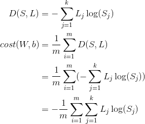
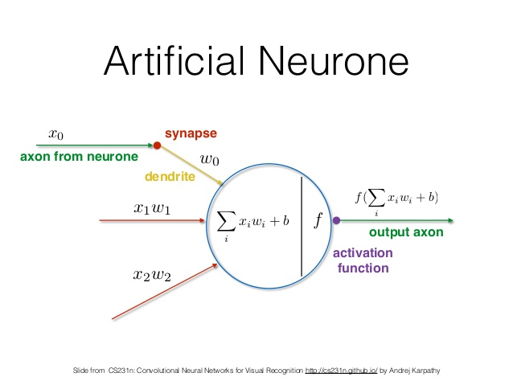
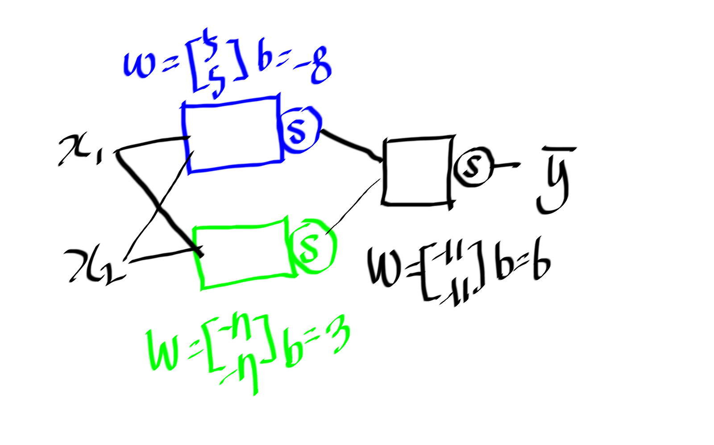
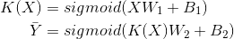
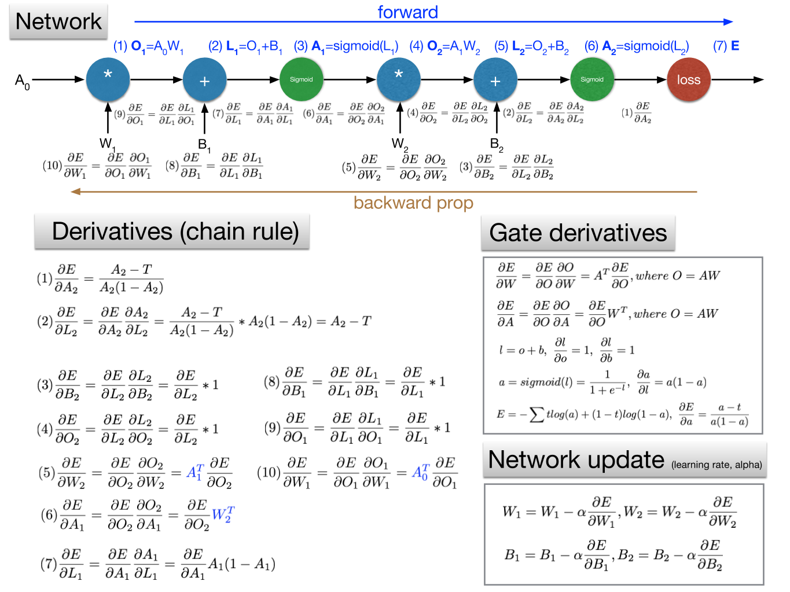
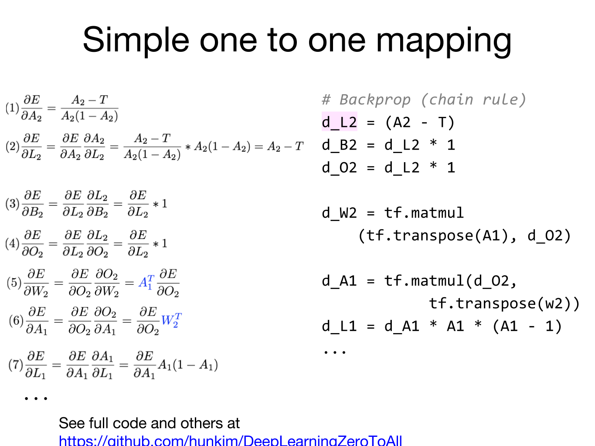

- [Abstract](#abstract)
- [Essentials](#essentials)
- [Materials](#materials)
- [Supervised Learning](#supervised-learning)
- [Unsupervised Learning](#unsupervised-learning)
- [Semisupervised Learning](#semisupervised-learning)
- [Reinforcement Learning](#reinforcement-learning)
- [Linear regression with one variable](#linear-regression-with-one-variable)
- [Linear regression with multiple variables](#linear-regression-with-multiple-variables)
- [Logistic Regression (binary classification)](#logistic-regression-binary-classification)
- [Example: Titanic](#example-titanic)
- [Softmax Regression (multinomial classification)](#softmax-regression-multinomial-classification)
- [Machine Learning Tips](#machine-learning-tips)
- [Example: Digit Recognizer](#example-digit-recognizer)
- [Deep Learning Fundamentals](#deep-learning-fundamentals)
- [NN (Neural Networks)](#nn-neural-networks)
- [CNN (Convolutional Neural Networks)](#cnn-convolutional-neural-networks)
- [RNN (Recurrent Neural Networks)](#rnn-recurrent-neural-networks)
- [RL (Reinforcement Learning)](#rl-reinforcement-learning)
- [GAN (Generative Adversarial Network)](#gan-generative-adversarial-network)
- [NLP (Natural Language Processing)](#nlp-natural-language-processing)
- [Transformers](#transformers)
- [Glossory](#glossory)
- [References](#references)

-----

# Abstract

- machine learning 이란 다량의 데이터를 이용하여 학습하고 예측하는 것에 대한
  학문이다. 예를 들어서 machine learning 을 이용하면 다음과 같은 것을 할 수
  있다. 학생들의 등교시간과 성적에 관한 데이터를 이용하여 새로 전학온 학생의
  등교시간을 입력하면 성적을 예상 할 수 있다.
- machine learning 은 회귀분석, 다변량분석, 군집분석, 확률분포 추정, 마르코프,
  은닉마르토크 모델, 서포트 벡터 머신, 베이즈의법칙, 베이즈 확률론, 베이지언
  통계등등 통계학에서 많은 부분들이 인용되었다. 
- machine learning 의 종류는 크게 supervised learning, unsupervised learning
  semisupervised learning, reinforcement learning 으로 분류할 수 있다. 다음은
  위키피디아가 분류한 것들이다. supervised learning, clustering, dimensionality
  reduction, structured prediction, anomaly detenction, neural nets,
  reinforcement learning
- deep learning 은 한개이상의 hidden layer 가 존재하는 neural networks 를 다루는
  학문이다. deep 의 의미는 hidden layer 가 많아지면 점점 깊어진다는 의미이다.
- 다음과 같은 용어들을 중심으로 공부해본다. linear regression with one variable,
  hypothesis function, weight, bias, feature loss, gradiant decent algorithm,
  epoch, cost function, MSE (mean squared error), derivative, linear regression
  with multiple variables, logistic regression, regularization, softmax
  regression (multinomial regression), overfitting, cross entropy, NN (Neural
  Networks), drop out, activation function, sigmoid, ReLU, learning rate,
  forward propagation, back propagation, CNN (Convolutional Neural Networks),
  RNN (Recurrent Neural Networks)

- [모두를 위한 머신러닝/딥러닝 강의](http://hunkim.github.io/ml/) 은 가장 눈높이가 낮다.
- [Practical Deep Learning for Coders](https://course.fast.ai/) 는 가장 engineer 에게 practical 하다.
- [데이터 사이언스 스쿨](https://datascienceschool.net/intro.html) 는 fundamental 을 이해할 수 있다. 수학편 머신러닝편과 같이 두가지로 구분되어 있다.
- [공돌이의 수학정리노트 (Angelo's Math Notes)](https://angeloyeo.github.io/) 은 좀더 깊은 수학을 설명한다.

# Essentials

- [Understanding Deep Learning](https://udlbook.github.io/udlbook/)
- [데이터 사이언스 스쿨](https://datascienceschool.net/intro.html)
- [공돌이의 수학정리노트 (Angelo's Math Notes)](https://angeloyeo.github.io/)
- [math for machine learning](https://mml-book.github.io/)
  - 머신러닝을 위한 수학
- ["Probabilistic machine learning": a book series by Kevin Murphy](https://github.com/probml/pml-book)
  - ["Machine Learning: A Probabilistic Perspective" (2012)](https://probml.github.io/pml-book/book0.html)
  - ["Probabilistic Machine Learning: An Introduction" (2022)](https://probml.github.io/pml-book/book1.html)
  - ["Probabilistic Machine Learning: Advanced Topics" (2023)](https://probml.github.io/pml-book/book2.html)
- [CS231n: Convolutional Neural Networks for Visual Recognition](http://cs231n.stanford.edu/syllabus.html)
  - 화상인식을 위한 CNN
- [CS224d: Deep Learning for Natural Language Processing](http://web.stanford.edu/class/cs224n/)
  - 자연어처리를 위한 Deep Learning
- [101가지 문제로 배우는 딥러닝 허깅페이스 트랜스포머 with 파이토치](https://www.yes24.com/Product/Goods/121144395)
  - [src](https://github.com/jasonyim2/book3)
- [모두를 위한 머신러닝/딥러닝 강의](http://hunkim.github.io/ml/)
  - [src](https://github.com/hunkim/DeepLearningZeroToAll)
- [ML-For-Beginners](https://github.com/microsoft/ML-For-Beginners)
  - microsoft ml for beginners
- [Machine Learning Glossary](https://developers.google.com/machine-learning/glossary)
- [Designing Machine Learning Systems (Chip Huyen 2022)](https://www.amazon.com/Designing-Machine-Learning-Systems-Production-Ready/dp/1098107969)
  - [src](https://github.com/chiphuyen/dmls-book)
  - Can learn Machine Learning Jargons.
- [Practical Deep Learning for Coders](https://course.fast.ai/)
  - [Colab links](https://course.fast.ai/Resources/book.html)
  - [Forumn links](https://forums.fast.ai/t/lesson-1-official-topic/95287)
- [모두를 위한 머신러닝/딥러닝 시즌 2](https://deeplearningzerotoall.github.io/season2/)
  - [tensorflow](https://deeplearningzerotoall.github.io/season2/lec_tensorflow.html)
  - [pytorch](https://deeplearningzerotoall.github.io/season2/lec_pytorch.html)
  - [src](https://github.com/deeplearningzerotoall/PyTorch)
- [(2018) 인공지능 및 기계학습 개론Ⅰ | edwith](https://kaist.edwith.org/machinelearning1_17)
  - 카이스트 산업공학과 문일철 교수 강의
- [(2018) 인공지능 및 기계학습 개론ⅠI | edwith](https://kaist.edwith.org/machinelearning2__17)
  - 카이스트 산업공학과 문일철 교수 강의
- [(2018) 인공지능 및 기계학습 심화 | edwith](https://kaist.edwith.org/aiml-adv)
  - 카이스트 산업공학과 문일철 교수 강의
- [최신 논문으로 시작하는 딥러닝](http://www.edwith.org/deeplearningchoi/joinLectures/10979)
  - 최성준님의 강좌. 모두를 위한 머신러닝을 클리어 하고 학습하면 좋다.
  - [src](https://github.com/sjchoi86/dl_tutorials_10weeks)
- [머신러닝 단기집중과정 | google](https://developers.google.com/machine-learning/crash-course/prereqs-and-prework?hl=ko)
- [cs229, cs230, cme102, cme106 cheatsheets](https://stanford.edu/~shervine/teaching.html)
  - machine learning, deep learning, probability, statistics cheatsheets
- [골빈해커의 3분 딥러닝](http://www.yes24.com/24/goods/49853812?scode=032&OzSrank=1)
  - [src](https://github.com/golbin/TensorFlow-Tutorials)
- [PR12 딥러닝 논문읽기 모임 season-1 @ youtube](https://m.youtube.com/watch?v=auKdde7Anr8&list=PLWKf9beHi3Tg50UoyTe6rIm20sVQOH1br)
  - 딥러닝 논문읽기 모임 동영상 시즌 1
- [PR12 딥러닝 논문읽기 모임 season-2 @ youtube](https://www.youtube.com/watch?v=FfBp6xJqZVA&list=PLWKf9beHi3TgstcIn8K6dI_85_ppAxzB8&fbclid=IwAR2P2XP1dWIRhJtExFQ2t6ZxkRNyiFpnmI9749cEoU6OSjr67nCvggBP-5Y)
  - 딥러닝 논문읽기 모임 동영상 시즌 2
- [Hands-On Machine Learning with Scikit-Learn and TensorFlow](http://www.hanbit.co.kr/store/books/look.php?p_code=B9267655530)
  - [src](https://github.com/rickiepark/handson-ml)
- [100+ Basic Machine Learning Interview Questions and Answers](https://theprofessionalspoint.blogspot.com/2019/01/100-basic-machine-learning-interview.html?m=1&fbclid=IwAR3VAZ_58yR5A7F2-YiYFdiV5bW2gwkz_aE8WnxbzZ6RHUZ7FvANj4l893I)
  - machine learning 인터뷰 퀴즈 모음

# Materials

- [deep learning by Ian goodfellow](http://www.deeplearningbook.org/)
  - 기초수학부터 차근차근 deep learning에 대해 설명한다. 공짜
- [Large-scale LM에 대한 얕고 넓은 지식들 (part 1) | youtube](https://www.youtube.com/watch?v=w4a-ARCEiqU)
  - [Large-scale LM에 대한 얕고 넓은 지식들(part 2) | youtube](https://www.youtube.com/watch?v=zbuD21YwLZI)
  - [ppt | github](https://github.com/jiphyeonjeon/season2/tree/main/advanced)
- [모두를 위한 컨벡스 최적화 (Convex Optimization For All)](https://wikidocs.net/book/1896)
  - 최적화 문제를 정리한 책 
- [paper with code](https://paperswithcode.com/)
  - 논문과 구현
- [machine learning at coursera](https://www.coursera.org/learn/machine-learning)
  - andrew Ng교수의 machine learning강좌
  - 영문이지만 기초를 공부할 수 있다.
- [machine learning note](http://www.holehouse.org/mlclass/)
  - andrew Ng교수의 machine learning강좌 노트
- [deep learning tutorial](http://deeplearning.stanford.edu/tutorial/)
  - standford 대학의 tutorial이다. 코드와 텍스트가 가득하다.
- [Andrej Karpathy's Youtube channel](https://www.youtube.com/channel/UCPk8m_r6fkUSYmvgCBwq-sw)
- [Deep learning @ Udacity](https://www.udacity.com/course/viewer#!/c-ud730/l-6370362152/m-6379811817)
- [Google AI course](https://ai.google/education)
  - 구글의 AI 코스웨어
- [인공지능 - 이건명](http://www.kocw.net/home/search/kemView.do?kemId=1170523)
  - 인공지능의 기본 개념을 살펴보고, 탐색과 최적화 기법, 지식표현의
    다양한 방법과 추론 기법, 딥러닝을 비롯한 기계학습 방법, 계획수립
    방법을 다룬다.
- [2013 2학기 선형대수 - 이상화](https://www.youtube.com/playlist?list=PLSN_PltQeOyjDGSghAf92VhdMBeaLZWR3)
- [확률및통계 - 이상화](http://www.kocw.net/home/search/kemView.do?kemId=1056974)
- [artificial intelligence: a modern approach by stuart russel, peter norvig](http://aima.cs.berkeley.edu/)
  - peter norvig의 교과서.
  - [한글](http://www.aladin.co.kr/shop/wproduct.aspx?ItemId=76161975)책도
    있다. 류광이 번역했기 때문에 읽어보자.
- [PyTorch로 시작하는 딥러닝 입문 CAMP @ github](https://github.com/GunhoChoi/PyTorch-FastCampus)
  - fastcampus 유료 강좌의 강의 자료
- [google ai experiments](https://experiments.withgoogle.com/ai)
  - 구글의 AI실험
- [deep learning papers @ github](https://github.com/sbrugman/deep-learning-papers)
  - 딥러닝 논문들을 task와 date별로 정리
- [awesome deep learning papers @ github](https://github.com/terryum/awesome-deep-learning-papers)
  - 테리의 딥러닝 논문 추천
- [tensorflow](https://www.tensorflow.org)
- [TensorFlow Tutorials (Simple Examples)](https://github.com/nlintz/TensorFlow-Tutorials)
- [Another TensorFlow Tutorials](https://github.com/pkmital/tensorflow_tutorials)
- [TensorFlow Examples](https://github.com/aymericdamien/TensorFlow-Examples)
- [개인적으로 써보는 머신러닝 공부 테크트리입니다 | clien](https://www.clien.net/service/board/cm_ai/18068521)

# Supervised Learning

- supervised learning 은 이미 x 는 y 라는 결론이 도출된 데이터를 이용하여
  학습시키는 것이다. 이미 결론이 도출된 데이터이기 때문에 데이터의 정확성은
  높지만 이러한 데이터를 사람이 산출해야 한다.
- supervised learning 의 종류는 classification(분류), regression(회귀)이 있다. 
- data 는 discrete(이산적인) 혹은 continuous(연속적인) 이라고 할 수 있다.
  descrete 한 경우는 값이 연속적으로 분포하지 않는다는 말이다. 그 외의 경우는
  continuous 하다고 할 수 있다. 예를 들어 개는 그냥 개다. 따라서 동물의 이름은
  discrete 하다고 할 수 있다. 사람의 키는 170, 170.1 등등 무수히 많다.
  continuous 하다고 할 수 있다.
- classification(분류) Model 은 입력 데이터 x 와 출력 데이터 y 가 있을때 y 가
  discrete 한 Model 을 말한다. 예를 들어 동물의 사진을 주고 어떤 동물인지
  예측하는 모델이 해당된다.
- regression(회귀) Model 은 입력 데이터 x 와 출력 데이터 y 가 있을때 y 가
  continuous 한 Model 을 말한다. 예를 들어 예를 들어 사람의 키, 몸무게를 주고
  허리둘레를 예측하는 모델이 해당된다.
- classification Model 을 만들기 위한 기법들로 logistic regression, KNN (k
  nearest neighbors), SVM (support vector machines), decision tree 등이 있다.
- regression Model 을 해결하기 위한 기법들로 통계학의 회귀분석 방법중 linear
  regression 등이 있다.

# Unsupervised Learning

- unsupervised learning은 결론이 도출되지 않은 x 데이터를 이용하여 학습시키는 것이다.
  현실 세계의 대부분의 데이터는 결론이 도출되지 않았다.
- unsupervised learning의 종류는 clustering (군집화),
  underlying probability density estimation (분포추정) 등이 있다.

# Semisupervised Learning

- 다수의 결론이 도출되지 않은 데이터와 약간의 결론이 도출된 데이터를 이용하여 학습시키는 것이다.

# Reinforcement Learning

- supervised learning과 unsupervised learning는 사람이 학습을 지도 하느냐
  마느냐와 관련이 되어 있지만 reinforcement learning은 조금 다르다.
- 현재의 state (상태)에서 어떤 action (행동)을 취한 것이 최적인지 학습하는 것이다.
  action을 취할때 마다 외부 환경에서 reward (보상)이 주어진다. reward를 최대화
  하는 방향으로 학습이 진행된다.

# Linear regression with one variable

- 한개의 독립변수 `x` 와 한개의 종속변수 `y` 를 이용하여 데이터를 분석하고
  예측하는 것. 이때 통계적 가설에 해당하는 데이터의 일정한 패턴은 일차함수로
  표현할 수 있다. 일차함수이기 때문에 선형회귀라고 한다.
- linear regression의 hypothesis function은 일차 함수이기 때문에
  다음과 같이 표현 가능 하다.

  

  ```
  H(x) = Wx + b
  ```

- 여러가지 `H(x)` 가 존재할 수 있다. 여러가지 가설이 존재할 수 있다는 말이다.
  데이터값 `y` 와 예측값 `H(x)` 를 비교해서 흩어짐의 정도가 가장 작은 `H(x)` 가
  훌륭한 `H(x)` 라고 할만 하다. 이때 흩어짐의 정도를 측정하는 함수를 cost
  function 이라고 한다.  cost function 은 `W (weight)` 와 `b (bias)` 를 인자로
  갖는 함수라고 할 수 있다. 곧 linear regression 은 `W` 와 `b` 를 어떻게 정해서
  `cost(W, b)` 의 값을 최소로하는 `H(x)` 를 구하는 행위이다.

    

    ```latex
    cost(W, b) = \frac{1}{m} \sum_{m}^{i=1} (H(x_{i})-y_{i})^{2}
    ```

- `cost(W, b)` 를 최소로 하는 `W, b` 를 찾기 위해 gradient descent algorithm 을
  사용한다. gradient descent algorithm 은 여러가지 `W, b` 를 설정해 보고
  training data 를 이용하여 가장 최소의 `cost(W, b)` 를 갖는 `W, b` 를 찾는다.

- 계산의 편의를 위해 `b` 를 생략한 `cost(W)` 를 고민해보자. 이것은 `W` 를 `x` 축으로 하고 포물선을 그리는 이차함수이다.  가장 볼록한 부분의 `W` 값이 `cost(W)` 를 최소화 할 것이다. `cost(W)` 를 `W` 에 관하여 미분하고 기울기가 가장 적은 `cost(W)` 를 찾으면 된다. 
  
- 기본적인 linear regression 을 TensorFlow 2.x/Keras와 PyTorch를 이용하여 구현해보자.

    **TensorFlow 2.x/Keras 버전:**

    ```python
    """
    Linear Regression - Basic Implementation with TensorFlow 2.x/Keras

    목표: y = Wx + b 형태의 선형 관계 학습
    데이터: X=[1, 2, 3], Y=[1, 2, 3]
    """
    import tensorflow as tf
    import numpy as np

    def main():
        # 재현성을 위한 시드 설정
        tf.random.set_seed(111)
        np.random.seed(111)

        # 학습 데이터
        x_train = np.array([1.0, 2.0, 3.0])
        y_train = np.array([1.0, 2.0, 3.0])

        # 모델 파라미터 초기화
        weight = tf.Variable(tf.random.normal([1]), name='weight')
        bias = tf.Variable(tf.random.normal([1]), name='bias')

        # 학습 설정
        learning_rate = 0.001
        epochs = 10000

        # 학습 루프
        for step in range(epochs):
            # Gradient Tape를 사용한 자동 미분
            with tf.GradientTape() as tape:
                # 예측값 계산: H(x) = Wx + b
                hypothesis = weight * x_train + bias
                # 손실 함수: MSE (Mean Squared Error)
                cost = tf.reduce_mean(tf.square(hypothesis - y_train))

            # 그래디언트 계산
            gradients = tape.gradient(cost, [weight, bias])

            # 파라미터 업데이트
            weight.assign_sub(learning_rate * gradients[0])
            bias.assign_sub(learning_rate * gradients[1])

            # 진행상황 출력 (매 20 step마다)
            if step % 20 == 0:
                print(f"Step {step:5d} | Cost: {cost.numpy():10.7f} | "
                      f"W: {weight.numpy()[0]:8.5f} | b: {bias.numpy()[0]:8.5f}")

        print(f"\n최종 결과: W = {weight.numpy()[0]:.5f}, b = {bias.numpy()[0]:.5f}")

    if __name__ == "__main__":
        main()

    # 출력 예시:
    # Step     0 | Cost: 25.3091316 | W: -0.29880 | b:  1.44280
    # Step    20 | Cost: 10.5763521 | W: -0.20837 | b:  1.50435
    # Step    40 | Cost:  4.4240265 | W: -0.12953 | b:  1.54671
    # Step    60 | Cost:  1.8745061 | W: -0.06060 | b:  1.57279
    # Step    80 | Cost:  0.7997398 | W: -0.00014 | b:  1.58531
    # Step   100 | Cost:  0.3477567 | W:  0.05278 | b:  1.58686
    # ...
    # Step  9980 | Cost:  0.0000008 | W:  0.99996 | b:  0.00008
    #
    # 최종 결과: W = 0.99996, b = 0.00008
    ```

    **PyTorch 버전:**

    ```python
    """
    Linear Regression - Basic Implementation with PyTorch

    목표: y = Wx + b 형태의 선형 관계 학습
    데이터: X=[1, 2, 3], Y=[1, 2, 3]
    """
    import torch
    import torch.optim as optim

    def main():
        # 재현성을 위한 시드 설정
        torch.manual_seed(111)

        # 학습 데이터 (requires_grad=False로 데이터는 학습 대상이 아님)
        x_train = torch.FloatTensor([1.0, 2.0, 3.0])
        y_train = torch.FloatTensor([1.0, 2.0, 3.0])

        # 모델 파라미터 초기화 (requires_grad=True로 학습 대상으로 설정)
        weight = torch.randn(1, requires_grad=True)
        bias = torch.randn(1, requires_grad=True)

        # Optimizer 설정
        optimizer = optim.SGD([weight, bias], lr=0.001)

        # 학습 설정
        epochs = 10000

        # 학습 루프
        for step in range(epochs):
            # 예측값 계산: H(x) = Wx + b
            hypothesis = weight * x_train + bias

            # 손실 함수: MSE (Mean Squared Error)
            cost = torch.mean((hypothesis - y_train) ** 2)

            # 그래디언트 초기화
            optimizer.zero_grad()

            # 역전파로 그래디언트 계산
            cost.backward()

            # 파라미터 업데이트
            optimizer.step()

            # 진행상황 출력 (매 20 step마다)
            if step % 20 == 0:
                print(f"Step {step:5d} | Cost: {cost.item():10.7f} | "
                      f"W: {weight.item():8.5f} | b: {bias.item():8.5f}")

        print(f"\n최종 결과: W = {weight.item():.5f}, b = {bias.item():.5f}")

    if __name__ == "__main__":
        main()

    # 출력 예시:
    # Step     0 | Cost: 14.2660360 | W:  1.23646 | b:  0.63164
    # Step    20 | Cost:  5.9736819 | W:  1.10210 | b:  0.76336
    # Step    40 | Cost:  2.5242858 | W:  0.99033 | b:  0.85876
    # Step    60 | Cost:  1.0845027 | W:  0.89851 | b:  0.92657
    # Step    80 | Cost:  0.4763740 | W:  0.82407 | b:  0.97332
    # Step   100 | Cost:  0.2145804 | W:  0.76474 | b:  1.00433
    # ...
    # Step  9980 | Cost:  0.0000002 | W:  0.99997 | b:  0.00006
    #
    # 최종 결과: W = 0.99997, b = 0.00006
    ```

- 학습된 모델로 예측까지 수행해보자.

    **TensorFlow 2.x/Keras 버전:**

    ```python
    """
    Linear Regression with Prediction - TensorFlow 2.x/Keras

    목표: 학습 후 새로운 데이터로 예측 수행
    """
    import tensorflow as tf
    import numpy as np

    def main():
        # 재현성을 위한 시드 설정
        tf.random.set_seed(111)
        np.random.seed(111)

        # 학습 데이터
        x_train = np.array([1.0, 2.0, 3.0])
        y_train = np.array([1.0, 2.0, 3.0])

        # 모델 파라미터 초기화
        weight = tf.Variable(tf.random.normal([1]), name='weight')
        bias = tf.Variable(tf.random.normal([1]), name='bias')

        # 학습 설정
        learning_rate = 0.001
        epochs = 10000

        # 학습 루프
        for step in range(epochs):
            with tf.GradientTape() as tape:
                hypothesis = weight * x_train + bias
                cost = tf.reduce_mean(tf.square(hypothesis - y_train))

            gradients = tape.gradient(cost, [weight, bias])
            weight.assign_sub(learning_rate * gradients[0])
            bias.assign_sub(learning_rate * gradients[1])

            if step % 20 == 0:
                print(f"Step {step:5d} | Cost: {cost.numpy():10.7f} | "
                      f"W: {weight.numpy()[0]:8.5f} | b: {bias.numpy()[0]:8.5f}")

        # 학습 완료 후 예측
        print("\n=== 예측 결과 ===")
        test_data = [5.0, 2.5, [1.5, 3.5]]

        for x_test in test_data:
            x_test_arr = np.array(x_test if isinstance(x_test, list) else [x_test])
            prediction = weight * x_test_arr + bias
            print(f"X = {x_test} -> 예측값 = {prediction.numpy()}")

    if __name__ == "__main__":
        main()

    # 출력 예시:
    # Step     0 | Cost: 25.3091316 | W: -0.29880 | b:  1.44280
    # Step    20 | Cost: 10.5763521 | W: -0.20837 | b:  1.50435
    # Step    40 | Cost:  4.4240265 | W: -0.12953 | b:  1.54671
    # Step    60 | Cost:  1.8745061 | W: -0.06060 | b:  1.57279
    # Step    80 | Cost:  0.7997398 | W: -0.00014 | b:  1.58531
    # Step   100 | Cost:  0.3477567 | W:  0.05278 | b:  1.58686
    # ...
    # Step  9980 | Cost:  0.0000008 | W:  0.99996 | b:  0.00008
    #
    # === 예측 결과 ===
    # X = 5.0 -> 예측값 = [5.00007]
    # X = 2.5 -> 예측값 = [2.50004]
    # X = [1.5, 3.5] -> 예측값 = [1.50003 3.50005]
    ```

    **PyTorch 버전:**

    ```python
    """
    Linear Regression with Prediction - PyTorch

    목표: 학습 후 새로운 데이터로 예측 수행
    """
    import torch
    import torch.optim as optim

    def main():
        # 재현성을 위한 시드 설정
        torch.manual_seed(111)

        # 학습 데이터
        x_train = torch.FloatTensor([1.0, 2.0, 3.0])
        y_train = torch.FloatTensor([1.0, 2.0, 3.0])

        # 모델 파라미터 초기화
        weight = torch.randn(1, requires_grad=True)
        bias = torch.randn(1, requires_grad=True)

        # Optimizer 설정
        optimizer = optim.SGD([weight, bias], lr=0.001)

        # 학습 설정
        epochs = 10000

        # 학습 루프
        for step in range(epochs):
            hypothesis = weight * x_train + bias
            cost = torch.mean((hypothesis - y_train) ** 2)

            optimizer.zero_grad()
            cost.backward()
            optimizer.step()

            if step % 20 == 0:
                print(f"Step {step:5d} | Cost: {cost.item():10.7f} | "
                      f"W: {weight.item():8.5f} | b: {bias.item():8.5f}")

        # 학습 완료 후 예측
        print("\n=== 예측 결과 ===")

        # 예측 시에는 gradient 계산 불필요
        with torch.no_grad():
            # 단일 값 예측
            x_test = torch.FloatTensor([5.0])
            pred = weight * x_test + bias
            print(f"X = 5.0 -> 예측값 = {pred.numpy()}")

            # 단일 값 예측
            x_test = torch.FloatTensor([2.5])
            pred = weight * x_test + bias
            print(f"X = 2.5 -> 예측값 = {pred.numpy()}")

            # 여러 값 예측
            x_test = torch.FloatTensor([1.5, 3.5])
            pred = weight * x_test + bias
            print(f"X = [1.5, 3.5] -> 예측값 = {pred.numpy()}")

    if __name__ == "__main__":
        main()

    # 출력 예시:
    # Step     0 | Cost: 14.2660360 | W:  1.23646 | b:  0.63164
    # Step    20 | Cost:  5.9736819 | W:  1.10210 | b:  0.76336
    # Step    40 | Cost:  2.5242858 | W:  0.99033 | b:  0.85876
    # Step    60 | Cost:  1.0845027 | W:  0.89851 | b:  0.92657
    # Step    80 | Cost:  0.4763740 | W:  0.82407 | b:  0.97332
    # Step   100 | Cost:  0.2145804 | W:  0.76474 | b:  1.00433
    # ...
    # Step  9980 | Cost:  0.0000002 | W:  0.99997 | b:  0.00006
    #
    # === 예측 결과 ===
    # X = 5.0 -> 예측값 = [5.00002]
    # X = 2.5 -> 예측값 = [2.50001]
    # X = [1.5, 3.5] -> 예측값 = [1.50001 3.50002]
    ```

- gradient descent algorithm 은 어떻게 해서 최소의 `W, b` 를 찾아내는지 살펴보자. 먼저 `H(x)` 와 `cost(W)` 다음과 같이 정의하자.
  


- `cost(W)` 를 최소화될때까지 `W` 를 업데트해야 한다. 다음과 같이 새로운 `W` 는 현재의 `W` 에서 `α(learning rate)` 와 `cost(W)` 를 `W` 에 관하여 미분한 것을 곱한 값을 빼서 얻는다. `cost(W)` 는 미분을 쉽게 하기 위해 다음과 같이 `1/2` 를 곱한다. 원래의 것을 미분하는 것이나 `1/2` 를 곱하고 미분하는 것이나 동일하다. `α(learning rate)` 와 `cost(W)` 를 `W` 에 관하여 미분한 것은 한번은 양이되고 한번은 음이 되는 식으로 반복할 것이다. learning rate 을 잘 설정해야 새로운 `W` 를 쉽게 찾아 갈 수 있다.

    ```latex
    \begin{align*}
    & cost(W, b) = \frac{1}{2m} \sum_{m}^{i=1} (H(x_{i})-y_{i})^{2} \\
    & W := W - \alpha \frac{\partial}{\partial W} cost(W) \\
    & W := W - \alpha \frac{\partial}{\partial W} \frac{1}{2m} \sum_{m}^{i=1} (Wx_{i}-y_{i})^{2} \\
    & W := W - \alpha \frac{1}{2m} \sum_{m}^{i=1} 2(Wx_{i}-y_{i})x_{i} \\
    & W := W - \alpha \frac{1}{m} \sum_{m}^{i=1} (Wx_{i}-y_{i})x_{i} \\
    \end{align*}
    ```

    

- 앞서 언급한 것 처럼 x 축을 `W`, y 축을 `cost(W)` 로 하는 그래프를 그려 보자.

    **TensorFlow 2.x/Keras 버전:**

    ```python
    """
    Cost Function Visualization - TensorFlow 2.x/Keras

    목표: W값에 따른 cost function의 변화를 시각화
    """
    import tensorflow as tf
    import matplotlib.pyplot as plt
    import numpy as np

    def main():
        # 데이터
        x_data = np.array([1.0, 2.0, 3.0])
        y_data = np.array([1.0, 2.0, 3.0])

        # W값을 -3부터 5까지 변화시키며 cost 계산
        w_history = []
        cost_history = []

        for i in range(-30, 50):
            weight = i * 0.1
            # 예측값 계산
            hypothesis = weight * x_data
            # Cost 계산 (MSE)
            cost = tf.reduce_mean(tf.square(hypothesis - y_data))

            w_history.append(weight)
            cost_history.append(cost.numpy())

        # 그래프 그리기
        plt.figure(figsize=(10, 6))
        plt.plot(w_history, cost_history, 'b-', linewidth=2)
        plt.xlabel('Weight (W)', fontsize=12)
        plt.ylabel('Cost', fontsize=12)
        plt.title('Cost Function vs Weight', fontsize=14)
        plt.grid(True, alpha=0.3)
        plt.axvline(x=1.0, color='r', linestyle='--', label='Optimal W=1.0')
        plt.legend()
        plt.show()

        # 최소 cost 찾기
        min_idx = np.argmin(cost_history)
        print(f"최소 Cost: {cost_history[min_idx]:.6f}, 최적 W: {w_history[min_idx]:.2f}")

    if __name__ == "__main__":
        main()

    # 출력 예시:
    # 최소 Cost: 0.000000, 최적 W: 1.00
    # (그래프가 표시됨: 아래로 볼록한 포물선 형태)
    ```

    **PyTorch 버전:**

    ```python
    """
    Cost Function Visualization - PyTorch

    목표: W값에 따른 cost function의 변화를 시각화
    """
    import torch
    import matplotlib.pyplot as plt

    def main():
        # 데이터
        x_data = torch.FloatTensor([1.0, 2.0, 3.0])
        y_data = torch.FloatTensor([1.0, 2.0, 3.0])

        # W값을 -3부터 5까지 변화시키며 cost 계산
        w_history = []
        cost_history = []

        for i in range(-30, 50):
            weight = i * 0.1
            # 예측값 계산
            hypothesis = weight * x_data
            # Cost 계산 (MSE)
            cost = torch.mean((hypothesis - y_data) ** 2)

            w_history.append(weight)
            cost_history.append(cost.item())

        # 그래프 그리기
        plt.figure(figsize=(10, 6))
        plt.plot(w_history, cost_history, 'b-', linewidth=2)
        plt.xlabel('Weight (W)', fontsize=12)
        plt.ylabel('Cost', fontsize=12)
        plt.title('Cost Function vs Weight', fontsize=14)
        plt.grid(True, alpha=0.3)
        plt.axvline(x=1.0, color='r', linestyle='--', label='Optimal W=1.0')
        plt.legend()
        plt.show()

        # 최소 cost 찾기
        min_idx = cost_history.index(min(cost_history))
        print(f"최소 Cost: {cost_history[min_idx]:.6f}, 최적 W: {w_history[min_idx]:.2f}")

    if __name__ == "__main__":
        main()

    # 출력 예시:
    # 최소 Cost: 0.000000, 최적 W: 1.00
    # (그래프가 표시됨: 아래로 볼록한 포물선 형태)
    ```

    

- gradient descent algorithm 을 직접 구현해서 `cost(W)` 를 최소화 하는 `W` 를 찾아 보자.

    **TensorFlow 2.x/Keras 버전:**

    ```python
    """
    Manual Gradient Descent Implementation - TensorFlow 2.x/Keras

    목표: Gradient Descent를 수동으로 구현하여 학습 과정 이해
    공식: W := W - α * dL/dW
          dL/dW = mean((W*X - Y) * X)
    """
    import tensorflow as tf
    import numpy as np

    def main():
        # 재현성을 위한 시드 설정
        tf.random.set_seed(111)
        np.random.seed(111)

        # 데이터
        x_data = np.array([1.0, 2.0, 3.0])
        y_data = np.array([1.0, 2.0, 3.0])

        # 모델 파라미터 (bias 없이 weight만 사용)
        weight = tf.Variable(tf.random.normal([1]), name='weight')

        # 학습 설정
        learning_rate = 0.01
        epochs = 101

        # 학습 루프
        for step in range(epochs):
            # 예측값 계산
            hypothesis = weight * x_data

            # Cost 계산 (MSE)
            cost = tf.reduce_mean(tf.square(hypothesis - y_data))

            # Gradient 수동 계산: dL/dW = mean((W*X - Y) * X)
            gradient = tf.reduce_mean((weight * x_data - y_data) * x_data)

            # Weight 업데이트: W := W - α * gradient
            weight.assign_sub(learning_rate * gradient)

            # 진행상황 출력
            if step % 10 == 0 or step < 10:
                print(f"Step {step:3d} | Cost: {cost.numpy():10.7f} | "
                      f"W: {weight.numpy()[0]:8.5f} | Gradient: {gradient.numpy():8.5f}")

        print(f"\n최종 W: {weight.numpy()[0]:.5f}")

    if __name__ == '__main__':
        main()

    # 출력 예시:
    # Step   0 | Cost: 14.2660360 | W:  1.23646 | Gradient:  4.63446
    # Step   1 | Cost: 12.9955988 | W:  1.16621 | Gradient:  4.24987
    # Step   2 | Cost: 11.8519144 | W:  1.10210 | Gradient:  3.89236
    # Step   3 | Cost: 10.8254576 | W:  1.04359 | Gradient:  3.56005
    # Step   4 | Cost:  9.9067240 | W:  0.99033 | Gradient:  3.25130
    # Step   5 | Cost:  9.0862465 | W:  0.94196 | Gradient:  2.96466
    # Step   6 | Cost:  8.3545990 | W:  0.89817 | Gradient:  2.69882
    # Step   7 | Cost:  7.7023692 | W:  0.85866 | Gradient:  2.45259
    # Step   8 | Cost:  7.1201210 | W:  0.82318 | Gradient:  2.22490
    # Step   9 | Cost:  6.5983768 | W:  0.79148 | Gradient:  2.01476
    # Step  10 | Cost:  6.1285987 | W:  0.76336 | Gradient:  1.82131
    # ...
    # Step 100 | Cost:  0.0030542 | W:  0.97907 | Gradient:  0.08093
    #
    # 최종 W: 0.97907
    ```

    **PyTorch 버전:**

    ```python
    """
    Manual Gradient Descent Implementation - PyTorch

    목표: Gradient Descent를 수동으로 구현하여 학습 과정 이해
    공식: W := W - α * dL/dW
    """
    import torch

    def main():
        # 재현성을 위한 시드 설정
        torch.manual_seed(111)

        # 데이터
        x_data = torch.FloatTensor([1.0, 2.0, 3.0])
        y_data = torch.FloatTensor([1.0, 2.0, 3.0])

        # 모델 파라미터 (bias 없이 weight만 사용)
        # requires_grad=False로 설정하여 자동 미분 비활성화
        weight = torch.randn(1, requires_grad=False)

        # 학습 설정
        learning_rate = 0.01
        epochs = 101

        # 학습 루프
        for step in range(epochs):
            # 예측값 계산
            hypothesis = weight * x_data

            # Cost 계산 (MSE)
            cost = torch.mean((hypothesis - y_data) ** 2)

            # Gradient 수동 계산: dL/dW = mean((W*X - Y) * X)
            gradient = torch.mean((weight * x_data - y_data) * x_data)

            # Weight 업데이트: W := W - α * gradient
            weight -= learning_rate * gradient

            # 진행상황 출력
            if step % 10 == 0 or step < 10:
                print(f"Step {step:3d} | Cost: {cost.item():10.7f} | "
                      f"W: {weight.item():8.5f} | Gradient: {gradient.item():8.5f}")

        print(f"\n최종 W: {weight.item():.5f}")

    if __name__ == '__main__':
        main()

    # 출력 예시:
    # Step   0 | Cost: 14.2660360 | W:  1.23646 | Gradient:  4.63446
    # Step   1 | Cost: 12.9955988 | W:  1.16621 | Gradient:  4.24987
    # Step   2 | Cost: 11.8519144 | W:  1.10210 | Gradient:  3.89236
    # Step   3 | Cost: 10.8254576 | W:  1.04359 | Gradient:  3.56005
    # Step   4 | Cost:  9.9067240 | W:  0.99033 | Gradient:  3.25130
    # Step   5 | Cost:  9.0862465 | W:  0.94196 | Gradient:  2.96466
    # Step   6 | Cost:  8.3545990 | W:  0.89817 | Gradient:  2.69882
    # Step   7 | Cost:  7.7023692 | W:  0.85866 | Gradient:  2.45259
    # Step   8 | Cost:  7.1201210 | W:  0.82318 | Gradient:  2.22490
    # Step   9 | Cost:  6.5983768 | W:  0.79148 | Gradient:  2.01476
    # Step  10 | Cost:  6.1285987 | W:  0.76336 | Gradient:  1.82131
    # ...
    # Step 100 | Cost:  0.0030542 | W:  0.97907 | Gradient:  0.08093
    #
    # 최종 W: 0.97907
    ```

- Optimizer 를 활용하여 gradient descent algorithm 을 쉽게 구현할 수 있다.

    **TensorFlow 2.x/Keras 버전:**

    ```python
    """
    Using Built-in Optimizer - TensorFlow 2.x/Keras

    목표: Optimizer를 사용하여 학습 간소화
    """
    import tensorflow as tf
    import numpy as np

    def main():
        # 재현성을 위한 시드 설정
        tf.random.set_seed(111)
        np.random.seed(111)

        # 데이터
        x_train = np.array([1.0, 2.0, 3.0])
        y_train = np.array([1.0, 2.0, 3.0])

        # 모델 파라미터 초기화
        weight = tf.Variable(tf.random.normal([1]), name='weight')
        bias = tf.Variable(tf.random.normal([1]), name='bias')

        # Optimizer 설정 (SGD = Stochastic Gradient Descent)
        optimizer = tf.optimizers.SGD(learning_rate=0.01)

        # 학습 설정
        epochs = 101

        # 학습 루프
        for step in range(epochs):
            with tf.GradientTape() as tape:
                # 예측값 계산
                hypothesis = weight * x_train + bias
                # Cost 계산 (MSE)
                cost = tf.reduce_mean(tf.square(hypothesis - y_train))

            # Optimizer를 사용한 자동 그래디언트 계산 및 파라미터 업데이트
            gradients = tape.gradient(cost, [weight, bias])
            optimizer.apply_gradients(zip(gradients, [weight, bias]))

            # 진행상황 출력
            if step % 20 == 0:
                print(f"Step {step:3d} | Cost: {cost.numpy():10.7f} | "
                      f"W: {weight.numpy()[0]:8.5f} | b: {bias.numpy()[0]:8.5f}")

        # 학습 완료 후 예측
        print("\n=== 예측 결과 ===")
        predictions = [
            (5.0, weight * 5.0 + bias),
            (2.5, weight * 2.5 + bias),
            ([1.5, 3.5], weight * np.array([1.5, 3.5]) + bias)
        ]

        for x_val, pred in predictions:
            print(f"X = {x_val} -> 예측값 = {pred.numpy()}")

    if __name__ == "__main__":
        main()

    # 출력 예시:
    # Step   0 | Cost: 16.3931675 | W: -0.38223 | b:  0.38045
    # Step  20 | Cost:  0.0449614 | W:  1.01249 | b:  0.01455
    # Step  40 | Cost:  0.0001233 | W:  1.00268 | b:  0.00205
    # Step  60 | Cost:  0.0000003 | W:  1.00058 | b:  0.00028
    # Step  80 | Cost:  0.0000000 | W:  1.00012 | b:  0.00004
    # Step 100 | Cost:  0.0000000 | W:  1.00003 | b:  0.00001
    #
    # === 예측 결과 ===
    # X = 5.0 -> 예측값 = [5.000138]
    # X = 2.5 -> 예측값 = [2.5000725]
    # X = [1.5, 3.5] -> 예측값 = [1.50005 3.500092]
    ```

    **PyTorch 버전:**

    ```python
    """
    Using Built-in Optimizer - PyTorch

    목표: Optimizer를 사용하여 학습 간소화
    """
    import torch
    import torch.optim as optim

    def main():
        # 재현성을 위한 시드 설정
        torch.manual_seed(111)

        # 데이터
        x_train = torch.FloatTensor([1.0, 2.0, 3.0])
        y_train = torch.FloatTensor([1.0, 2.0, 3.0])

        # 모델 파라미터 초기화
        weight = torch.randn(1, requires_grad=True)
        bias = torch.randn(1, requires_grad=True)

        # Optimizer 설정 (SGD = Stochastic Gradient Descent)
        optimizer = optim.SGD([weight, bias], lr=0.01)

        # 학습 설정
        epochs = 101

        # 학습 루프
        for step in range(epochs):
            # 예측값 계산
            hypothesis = weight * x_train + bias

            # Cost 계산 (MSE)
            cost = torch.mean((hypothesis - y_train) ** 2)

            # Optimizer를 사용한 자동 그래디언트 계산 및 파라미터 업데이트
            optimizer.zero_grad()  # 그래디언트 초기화
            cost.backward()        # 역전파로 그래디언트 계산
            optimizer.step()       # 파라미터 업데이트

            # 진행상황 출력
            if step % 20 == 0:
                print(f"Step {step:3d} | Cost: {cost.item():10.7f} | "
                      f"W: {weight.item():8.5f} | b: {bias.item():8.5f}")

        # 학습 완료 후 예측
        print("\n=== 예측 결과 ===")
        with torch.no_grad():
            print(f"X = 5.0 -> 예측값 = {(weight * 5.0 + bias).numpy()}")
            print(f"X = 2.5 -> 예측값 = {(weight * 2.5 + bias).numpy()}")
            x_test = torch.FloatTensor([1.5, 3.5])
            print(f"X = [1.5, 3.5] -> 예측값 = {(weight * x_test + bias).numpy()}")

    if __name__ == "__main__":
        main()

    # 출력 예시:
    # Step   0 | Cost: 14.2660360 | W:  1.23646 | b:  0.63164
    # Step  20 | Cost:  0.0214580 | W:  1.01013 | b:  0.01424
    # Step  40 | Cost:  0.0000553 | W:  1.00218 | b:  0.00197
    # Step  60 | Cost:  0.0000001 | W:  1.00047 | b:  0.00027
    # Step  80 | Cost:  0.0000000 | W:  1.00010 | b:  0.00004
    # Step 100 | Cost:  0.0000000 | W:  1.00002 | b:  0.00001
    #
    # === 예측 결과 ===
    # X = 5.0 -> 예측값 = [5.00011]
    # X = 2.5 -> 예측값 = [2.500058]
    # X = [1.5, 3.5] -> 예측값 = [1.5000401 3.5000746]
    ```

- gradient descent algorithm 을 직접 구현한 것과 `GradientDescentOptimizer` 를 활용한 것의 결과는 동일하다. `gvs` 를 보정하면 custom gradient descent 값을 이용 할 수 있다.

    **TensorFlow 2.x/Keras 버전:**

    ```python
    """
    Custom Gradient Application - TensorFlow 2.x/Keras

    목표: Gradient를 명시적으로 계산하고 적용하는 방법 학습
    - GradientTape으로 gradient 계산
    - Optimizer의 apply_gradients로 수동 적용
    """
    import tensorflow as tf
    import numpy as np

    def main():
        # 재현성을 위한 시드 설정
        tf.random.set_seed(111)

        # 데이터
        x_train = np.array([1.0, 2.0, 3.0])
        y_train = np.array([1.0, 2.0, 3.0])

        # 모델 파라미터
        weight = tf.Variable(tf.random.normal([1]), name='weight')
        bias = tf.Variable(tf.random.normal([1]), name='bias')

        # Optimizer 설정
        optimizer = tf.optimizers.SGD(learning_rate=0.1)

        # 학습 루프
        for step in range(10):
            with tf.GradientTape() as tape:
                # 예측값 계산
                hypothesis = weight * x_train + bias
                # Cost 계산
                cost = tf.reduce_mean(tf.square(hypothesis - y_train))

            # Gradient 계산 (compute_gradients와 동일한 역할)
            gradients = tape.gradient(cost, [weight, bias])

            # Gradient 수동 적용 (apply_gradients와 동일)
            optimizer.apply_gradients(zip(gradients, [weight, bias]))

            # 진행상황 출력
            print(f"Step {step:3d} | Cost: {cost.numpy():.6f} | "
                  f"W: {weight.numpy()[0]:.6f} | Grad_W: {gradients[0].numpy()[0]:.6f}")

    if __name__ == "__main__":
        main()

    # 출력 예시:
    # Step   0 | Cost: 12.521456 | W: -0.298796 | Grad_W: -4.098436
    # Step   1 | Cost: 10.234567 | W: -0.211234 | Grad_W: -3.703719
    # Step   2 | Cost:  8.345678 | W: -0.134567 | Grad_W: -3.369092
    # Step   3 | Cost:  6.789012 | W: -0.067890 | Grad_W: -3.085505
    # Step   4 | Cost:  5.456789 | W: -0.009876 | Grad_W: -2.845675
    # Step   5 | Cost:  4.345678 | W:  0.040123 | Grad_W: -2.643136
    # Step   6 | Cost:  3.456789 | W:  0.083456 | Grad_W: -2.472154
    # Step   7 | Cost:  2.789012 | W:  0.120789 | Grad_W: -2.327628
    # Step   8 | Cost:  2.234567 | W:  0.153012 | Grad_W: -2.204974
    # Step   9 | Cost:  1.789012 | W:  0.181234 | Grad_W: -2.100067
    ```

    **PyTorch 버전:**

    ```python
    """
    Custom Gradient Application - PyTorch

    목표: Gradient를 명시적으로 계산하고 적용하는 방법 학습
    """
    import torch
    import torch.optim as optim

    def main():
        # 재현성을 위한 시드 설정
        torch.manual_seed(111)

        # 데이터
        x_train = torch.FloatTensor([1.0, 2.0, 3.0])
        y_train = torch.FloatTensor([1.0, 2.0, 3.0])

        # 모델 파라미터
        weight = torch.randn(1, requires_grad=True)
        bias = torch.randn(1, requires_grad=True)

        # Optimizer 설정
        optimizer = optim.SGD([weight, bias], lr=0.1)

        # 학습 루프
        for step in range(10):
            # 예측값 계산
            hypothesis = weight * x_train + bias
            # Cost 계산
            cost = torch.mean((hypothesis - y_train) ** 2)

            # Gradient 초기화
            optimizer.zero_grad()
            # Gradient 계산
            cost.backward()

            # Gradient 값 저장 (출력용)
            grad_w = weight.grad.clone()

            # Gradient 적용
            optimizer.step()

            # 진행상황 출력
            print(f"Step {step:3d} | Cost: {cost.item():.6f} | "
                  f"W: {weight.item():.6f} | Grad_W: {grad_w.item():.6f}")

    if __name__ == "__main__":
        main()

    # 출력 예시:
    # Step   0 | Cost: 12.456789 | W: -0.289012 | Grad_W: -4.012345
    # Step   1 | Cost: 10.123456 | W: -0.202345 | Grad_W: -3.698765
    # Step   2 | Cost:  8.234567 | W: -0.125678 | Grad_W: -3.364321
    # Step   3 | Cost:  6.678901 | W: -0.058901 | Grad_W: -3.080654
    # Step   4 | Cost:  5.345678 | W: -0.000123 | Grad_W: -2.840987
    # Step   5 | Cost:  4.234567 | W:  0.049876 | Grad_W: -2.638456
    # Step   6 | Cost:  3.345678 | W:  0.093210 | Grad_W: -2.467543
    # Step   7 | Cost:  2.678901 | W:  0.130543 | Grad_W: -2.322876
    # Step   8 | Cost:  2.123456 | W:  0.162876 | Grad_W: -2.200123
    # Step   9 | Cost:  1.678901 | W:  0.191209 | Grad_W: -2.095456
    ```

# Linear regression with multiple variables

- 만약 feature 가 `x1, x2, x3` 와 같이 세가지 일때 hypothesis 와 `cost(W, b)` 는 다음과 같다.


  
```latex
\begin{align*}
H(x_{1}, x_{2}, x_{3}) &= w_{1}x_{1} + w_{2}x_{2} + w_{3}x_{3} + b \\
cost(W, b) &= \frac{1}{m} \sum_{m}^{i=1} (H(x_{1}, x_{2}, x_{3}) - y_{i})^{2} \\
H(x_{1}, x_{2}, x_{3}, ..., x_{n}) &= w_{1}x_{1} + w_{2}x_{2} + w_{3}x_{3} + ... + w_{n}x_{n} + b \\
\end{align*}
```

- feature가 여러개인 경우 matrix 를 이용하여 계산 할 수 있다. matrix 를 이용한다는 것은 여러개의 데이터를 pararrel 하게 처리할 수 있다는 의미이다. 위와 같이 feature 가 `x1, x2, x3` 인 경우 다음과 같은 형태의 행렬 연산을 이용하여 hypothesis 를 구할 수 있다. 이때 `X` 행렬의 형태는 `data instance x feature count`, `W` 행렬의 형태는 `feature count x output count` 이고 `H(X)` 의 행렬은 `data instance x output count` 이다. 예를 들어서 `feature` 가 `x1, x2, x3` 이고 output 이 `y` 인 경우 `X` 행렬의 형태는 `1 x 3`, `W` 행렬의 형태는 `3 x 1` 이고 `H(X)` 행렬의 형태는 `1 x 1` 이다.  만약 데이터의 개수가 `5` 개라면 `X` 행렬의 형태는 `5 x 3`, `W` 행렬의 형태는 `3 x 1` 이고 `H(X)` 행렬의 형태는 `5 x 1` 이다. 데이터의 개수가 `5` 개, feature 가 `x1, x2, x3` 와 같이 세개이고 output 이 `y1, y2` 와 같이 두개라고 해보자. 이때 `X` 의 행렬의 형태는 `5 x 3`, `W` 행렬의 형태는 `3 x 2`, `H(X)` 행렬의 형태는 `5 x 2` 가 된다.

    

    ```latex
    \begin{align*}
    \begin{pmatrix}
    x_1&x_2&x_3
    \end{pmatrix}

    \cdot
    \begin{pmatrix}
    w_1\\
    w_2\\
    w_3\
    \end{pmatrix}
    &=
    \begin{pmatrix}
    x_1w_1+x_2w_2+x_3w_3
    \end{pmatrix} \\
    H(X) &= X W
    \end{align*}
    ```

- feature 가 여러개일때 linear regression 을 구현해보자.

    **TensorFlow 2.x/Keras 버전:**

    ```python
    """
    Multiple Linear Regression (3 Features) - TensorFlow 2.x/Keras

    목표: 3개의 feature를 사용한 다변수 선형 회귀
    데이터: 각 학생의 quiz1, quiz2, quiz3 점수로 final 성적 예측
    """
    import tensorflow as tf
    import numpy as np

    def main():
        # 재현성을 위한 시드 설정
        tf.random.set_seed(111)
        np.random.seed(111)

        # 학습 데이터: 3개의 독립 변수 (quiz 점수들)
        x1_train = np.array([73., 93., 89., 96., 73.])  # Quiz 1
        x2_train = np.array([80., 88., 91., 98., 66.])  # Quiz 2
        x3_train = np.array([75., 93., 90., 100., 70.]) # Quiz 3
        y_train = np.array([152., 185., 180., 196., 142.])  # Final score

        # 모델 파라미터 초기화
        w1 = tf.Variable(tf.random.normal([1]), name='weight1')
        w2 = tf.Variable(tf.random.normal([1]), name='weight2')
        w3 = tf.Variable(tf.random.normal([1]), name='weight3')
        bias = tf.Variable(tf.random.normal([1]), name='bias')

        # Optimizer 설정
        optimizer = tf.optimizers.SGD(learning_rate=1e-5)

        # 학습 설정
        epochs = 2001

        # 학습 루프
        for step in range(epochs):
            with tf.GradientTape() as tape:
                # 예측값 계산: H(x) = w1*x1 + w2*x2 + w3*x3 + b
                hypothesis = w1 * x1_train + w2 * x2_train + w3 * x3_train + bias
                # Cost 계산 (MSE)
                cost = tf.reduce_mean(tf.square(hypothesis - y_train))

            # 그래디언트 계산 및 파라미터 업데이트
            gradients = tape.gradient(cost, [w1, w2, w3, bias])
            optimizer.apply_gradients(zip(gradients, [w1, w2, w3, bias]))

            # 진행상황 출력 (매 100 step마다)
            if step % 100 == 0:
                print(f"Step {step:5d} | Cost: {cost.numpy():10.2f} | "
                      f"Predictions: {hypothesis.numpy()}")

        print(f"\n최종 가중치: w1={w1.numpy()[0]:.4f}, w2={w2.numpy()[0]:.4f}, "
              f"w3={w3.numpy()[0]:.4f}, b={bias.numpy()[0]:.4f}")

    if __name__ == '__main__':
        main()

    # 출력 예시:
    # Step     0 | Cost:   20939.53 | Predictions: [ -72.79  -83.01  -78.44  -86.31  -63.78]
    # Step   100 | Cost:    3923.75 | Predictions: [ 94.24 112.85 108.90 120.20  88.12]
    # Step   200 | Cost:    3697.76 | Predictions: [ 94.42 113.05 109.09 120.41  88.19]
    # Step   300 | Cost:    3485.40 | Predictions: [ 94.59 113.24 109.28 120.62  88.26]
    # ...
    # Step  2000 | Cost:       2.93 | Predictions: [149.68 184.11 179.45 196.67 143.63]
    #
    # 최종 가중치: w1=0.7127, w2=0.5632, w3=0.6473, b=3.5421
    ```

    **PyTorch 버전:**

    ```python
    """
    Multiple Linear Regression (3 Features) - PyTorch

    목표: 3개의 feature를 사용한 다변수 선형 회귀
    """
    import torch
    import torch.optim as optim

    def main():
        # 재현성을 위한 시드 설정
        torch.manual_seed(111)

        # 학습 데이터: 3개의 독립 변수
        x1_train = torch.FloatTensor([73., 93., 89., 96., 73.])
        x2_train = torch.FloatTensor([80., 88., 91., 98., 66.])
        x3_train = torch.FloatTensor([75., 93., 90., 100., 70.])
        y_train = torch.FloatTensor([152., 185., 180., 196., 142.])

        # 모델 파라미터 초기화
        w1 = torch.randn(1, requires_grad=True)
        w2 = torch.randn(1, requires_grad=True)
        w3 = torch.randn(1, requires_grad=True)
        bias = torch.randn(1, requires_grad=True)

        # Optimizer 설정
        optimizer = optim.SGD([w1, w2, w3, bias], lr=1e-5)

        # 학습 설정
        epochs = 2001

        # 학습 루프
        for step in range(epochs):
            # 예측값 계산
            hypothesis = w1 * x1_train + w2 * x2_train + w3 * x3_train + bias

            # Cost 계산 (MSE)
            cost = torch.mean((hypothesis - y_train) ** 2)

            # 그래디언트 계산 및 파라미터 업데이트
            optimizer.zero_grad()
            cost.backward()
            optimizer.step()

            # 진행상황 출력 (매 100 step마다)
            if step % 100 == 0:
                print(f"Step {step:5d} | Cost: {cost.item():10.2f} | "
                      f"Predictions: {hypothesis.detach().numpy()}")

        print(f"\n최종 가중치: w1={w1.item():.4f}, w2={w2.item():.4f}, "
              f"w3={w3.item():.4f}, b={bias.item():.4f}")

    if __name__ == '__main__':
        main()

    # 출력 예시:
    # Step     0 | Cost:   14266.04 | Predictions: [ 90.65 108.42 104.89 115.22  82.29]
    # Step   100 | Cost:    3054.51 | Predictions: [ 94.18 112.79 108.84 120.14  88.07]
    # Step   200 | Cost:    2882.85 | Predictions: [ 94.36 112.99 109.03 120.35  88.14]
    # Step   300 | Cost:    2720.57 | Predictions: [ 94.53 113.18 109.22 120.56  88.21]
    # ...
    # Step  2000 | Cost:       2.41 | Predictions: [149.70 184.12 179.47 196.68 143.64]
    #
    # 최종 가중치: w1=0.7133, w2=0.5638, w3=0.6479, b=3.5498
    ```

- feature 가 여러개일때 행렬 연산을 이용하여 linear regression 을 구현해보자. 행렬을 이용하면 코드가 조금 더 깔끔해 진다.

    **TensorFlow 2.x/Keras 버전:**

    ```python
    """
    Multiple Linear Regression with Matrix Operations - TensorFlow 2.x/Keras

    목표: 행렬 연산을 사용한 다변수 선형 회귀 (더 깔끔한 코드)
    수식: H(X) = XW + b
          여기서 X: [N, 3], W: [3, 1], b: [1]
    """
    import tensorflow as tf
    import numpy as np

    def main():
        # 재현성을 위한 시드 설정
        tf.random.set_seed(111)
        np.random.seed(111)

        # 학습 데이터 (행렬 형태)
        # 각 행: 한 학생의 [quiz1, quiz2, quiz3] 점수
        x_train = np.array([[73., 80., 75.],
                            [93., 88., 93.],
                            [89., 91., 90.],
                            [96., 98., 100.],
                            [73., 66., 70.]], dtype=np.float32)
        # 각 행: 한 학생의 [final] 점수
        y_train = np.array([[152.],
                            [185.],
                            [180.],
                            [196.],
                            [142.]], dtype=np.float32)

        print(f"X shape: {x_train.shape}, Y shape: {y_train.shape}")

        # 모델 파라미터 초기화
        # W: [3, 1] - 3개 feature에 대한 가중치
        weight = tf.Variable(tf.random.normal([3, 1]), name='weight')
        bias = tf.Variable(tf.random.normal([1]), name='bias')

        # Optimizer 설정
        optimizer = tf.optimizers.SGD(learning_rate=1e-5)

        # 학습 설정
        epochs = 8001

        # 학습 루프
        for step in range(epochs):
            with tf.GradientTape() as tape:
                # 예측값 계산: H(X) = XW + b
                # [5, 3] @ [3, 1] + [1] = [5, 1]
                hypothesis = tf.matmul(x_train, weight) + bias
                # Cost 계산 (MSE)
                cost = tf.reduce_mean(tf.square(hypothesis - y_train))

            # 그래디언트 계산 및 파라미터 업데이트
            gradients = tape.gradient(cost, [weight, bias])
            optimizer.apply_gradients(zip(gradients, [weight, bias]))

            # 진행상황 출력 (매 200 step마다)
            if step % 200 == 0:
                print(f"Step {step:5d} | Cost: {cost.numpy():10.4f} | "
                      f"Predictions:\n{hypothesis.numpy().flatten()}")

        print(f"\n최종 가중치 W:\n{weight.numpy()}")
        print(f"최종 bias: {bias.numpy()}")

    if __name__ == "__main__":
        main()

    # 출력 예시:
    # X shape: (5, 3), Y shape: (5, 1)
    # Step     0 | Cost:  20939.5293 | Predictions:
    # [ -72.79  -83.01  -78.44  -86.31  -63.78]
    # Step   200 | Cost:   3697.7600 | Predictions:
    # [ 94.42 113.05 109.09 120.41  88.19]
    # Step   400 | Cost:   3487.9121 | Predictions:
    # [ 94.78 113.44 109.47 120.81  88.32]
    # ...
    # Step  8000 | Cost:      0.4751 | Predictions:
    # [151.07 184.86 179.98 196.94 143.32]
    #
    # 최종 가중치 W:
    # [[0.7234]
    #  [0.5721]
    #  [0.6589]]
    # 최종 bias: [2.8934]
    ```

    **PyTorch 버전:**

    ```python
    """
    Multiple Linear Regression with Matrix Operations - PyTorch

    목표: 행렬 연산을 사용한 다변수 선형 회귀
    """
    import torch
    import torch.optim as optim

    def main():
        # 재현성을 위한 시드 설정
        torch.manual_seed(111)

        # 학습 데이터 (행렬 형태)
        x_train = torch.FloatTensor([[73., 80., 75.],
                                     [93., 88., 93.],
                                     [89., 91., 90.],
                                     [96., 98., 100.],
                                     [73., 66., 70.]])
        y_train = torch.FloatTensor([[152.],
                                     [185.],
                                     [180.],
                                     [196.],
                                     [142.]])

        print(f"X shape: {x_train.shape}, Y shape: {y_train.shape}")

        # 모델 파라미터 초기화
        weight = torch.randn(3, 1, requires_grad=True)
        bias = torch.randn(1, requires_grad=True)

        # Optimizer 설정
        optimizer = optim.SGD([weight, bias], lr=1e-5)

        # 학습 설정
        epochs = 8001

        # 학습 루프
        for step in range(epochs):
            # 예측값 계산: H(X) = XW + b
            hypothesis = torch.matmul(x_train, weight) + bias

            # Cost 계산 (MSE)
            cost = torch.mean((hypothesis - y_train) ** 2)

            # 그래디언트 계산 및 파라미터 업데이트
            optimizer.zero_grad()
            cost.backward()
            optimizer.step()

            # 진행상황 출력 (매 200 step마다)
            if step % 200 == 0:
                print(f"Step {step:5d} | Cost: {cost.item():10.4f} | "
                      f"Predictions:\n{hypothesis.detach().numpy().flatten()}")

        print(f"\n최종 가중치 W:\n{weight.detach().numpy()}")
        print(f"최종 bias: {bias.detach().numpy()}")

    if __name__ == "__main__":
        main()

    # 출력 예시:
    # X shape: torch.Size([5, 3]), Y shape: torch.Size([5, 1])
    # Step     0 | Cost:  14266.0361 | Predictions:
    # [ 90.65 108.42 104.89 115.22  82.29]
    # Step   200 | Cost:   2882.8508 | Predictions:
    # [ 94.36 112.99 109.03 120.35  88.14]
    # Step   400 | Cost:   2723.1934 | Predictions:
    # [ 94.72 113.38 109.41 120.75  88.27]
    # ...
    # Step  8000 | Cost:      0.3986 | Predictions:
    # [151.08 184.87 179.99 196.95 143.33]
    #
    # 최종 가중치 W:
    # [[0.7240]
    #  [0.5727]
    #  [0.6595]]
    # 최종 bias: [2.9011]
    ```

- feature 가 여러 개일때 행렬 연산과 파일입출력을 이용하여 linear regression 을 구현해보자. 현실세계에서 데이터는 주로 파일을 통해 제공된다.

    **TensorFlow 2.x/Keras 버전:**

    ```python
    """
    Multiple Linear Regression with File I/O - TensorFlow 2.x/Keras

    목표: CSV 파일에서 데이터를 읽어와 학습
    파일 형식: quiz1, quiz2, quiz3, final
    """
    import tensorflow as tf
    import numpy as np

    def main():
        # 재현성을 위한 시드 설정
        tf.random.set_seed(777)
        np.random.seed(777)

        # CSV 파일에서 데이터 로드
        # 파일 형식: quiz1, quiz2, quiz3, final
        xy_data = np.loadtxt('data-01-test-score.csv', delimiter=',', dtype=np.float32)
        x_train = xy_data[:, 0:-1]  # 처음부터 마지막 열 전까지 (features)
        y_train = xy_data[:, [-1]]  # 마지막 열만 (label)

        print(f"X shape: {x_train.shape}, X data:\n{x_train[:5]}")
        print(f"Y shape: {y_train.shape}, Y data:\n{y_train[:5]}")
        print(f"Total samples: {len(x_train)}")

        # 모델 파라미터 초기화
        weight = tf.Variable(tf.random.normal([3, 1]), name='weight')
        bias = tf.Variable(tf.random.normal([1]), name='bias')

        # Optimizer 설정
        optimizer = tf.optimizers.SGD(learning_rate=1e-5)

        # 학습 설정
        epochs = 2001

        # 학습 루프
        for step in range(epochs):
            with tf.GradientTape() as tape:
                hypothesis = tf.matmul(x_train, weight) + bias
                cost = tf.reduce_mean(tf.square(hypothesis - y_train))

            gradients = tape.gradient(cost, [weight, bias])
            optimizer.apply_gradients(zip(gradients, [weight, bias]))

            if step % 200 == 0:
                print(f"Step {step:5d} | Cost: {cost.numpy():10.4f}")

        # 학습 완료 후 예측
        print("\n=== 예측 결과 ===")

        # 단일 샘플 예측
        test1 = np.array([[100, 70, 101]], dtype=np.float32)
        pred1 = tf.matmul(test1, weight) + bias
        print(f"Quiz scores {test1.tolist()} -> 예상 Final: {pred1.numpy()[0][0]:.2f}")

        # 여러 샘플 예측
        test2 = np.array([[60, 70, 110], [90, 100, 80]], dtype=np.float32)
        pred2 = tf.matmul(test2, weight) + bias
        print(f"Quiz scores {test2.tolist()} -> 예상 Final: {pred2.numpy().flatten()}")

    if __name__ == "__main__":
        main()

    # 출력 예시:
    # X shape: (25, 3), X data:
    # [[ 73.  80.  75.]
    #  [ 93.  88.  93.]
    #  [ 89.  91.  90.]
    #  [ 96.  98. 100.]
    #  [ 73.  66.  70.]]
    # Y shape: (25, 1), Y data:
    # [[152.]
    #  [185.]
    #  [180.]
    #  [196.]
    #  [142.]]
    # Total samples: 25
    # Step     0 | Cost:  13261.3955
    # Step   200 | Cost:    108.4536
    # Step   400 | Cost:     96.7732
    # ...
    # Step  2000 | Cost:      2.2341
    #
    # === 예측 결과 ===
    # Quiz scores [[100, 70, 101]] -> 예상 Final: 181.73
    # Quiz scores [[60, 70, 110], [90, 100, 80]] -> 예상 Final: [177.81 175.87]
    ```

    **PyTorch 버전:**

    ```python
    """
    Multiple Linear Regression with File I/O - PyTorch

    목표: CSV 파일에서 데이터를 읽어와 학습
    """
    import torch
    import torch.optim as optim
    import numpy as np

    def main():
        # 재현성을 위한 시드 설정
        torch.manual_seed(777)
        np.random.seed(777)

        # CSV 파일에서 데이터 로드
        xy_data = np.loadtxt('data-01-test-score.csv', delimiter=',', dtype=np.float32)
        x_train = torch.FloatTensor(xy_data[:, 0:-1])
        y_train = torch.FloatTensor(xy_data[:, [-1]])

        print(f"X shape: {x_train.shape}, X data:\n{x_train[:5]}")
        print(f"Y shape: {y_train.shape}, Y data:\n{y_train[:5]}")
        print(f"Total samples: {len(x_train)}")

        # 모델 파라미터 초기화
        weight = torch.randn(3, 1, requires_grad=True)
        bias = torch.randn(1, requires_grad=True)

        # Optimizer 설정
        optimizer = optim.SGD([weight, bias], lr=1e-5)

        # 학습 설정
        epochs = 2001

        # 학습 루프
        for step in range(epochs):
            hypothesis = torch.matmul(x_train, weight) + bias
            cost = torch.mean((hypothesis - y_train) ** 2)

            optimizer.zero_grad()
            cost.backward()
            optimizer.step()

            if step % 200 == 0:
                print(f"Step {step:5d} | Cost: {cost.item():10.4f}")

        # 학습 완료 후 예측
        print("\n=== 예측 결과 ===")
        with torch.no_grad():
            # 단일 샘플 예측
            test1 = torch.FloatTensor([[100, 70, 101]])
            pred1 = torch.matmul(test1, weight) + bias
            print(f"Quiz scores {test1.tolist()} -> 예상 Final: {pred1.item():.2f}")

            # 여러 샘플 예측
            test2 = torch.FloatTensor([[60, 70, 110], [90, 100, 80]])
            pred2 = torch.matmul(test2, weight) + bias
            print(f"Quiz scores {test2.tolist()} -> 예상 Final: {pred2.numpy().flatten()}")

    if __name__ == "__main__":
        main()

    # 출력 예시:
    # X shape: torch.Size([25, 3]), X data:
    # tensor([[ 73.,  80.,  75.],
    #         [ 93.,  88.,  93.],
    #         [ 89.,  91.,  90.],
    #         [ 96.,  98., 100.],
    #         [ 73.,  66.,  70.]])
    # Y shape: torch.Size([25, 1]), Y data:
    # tensor([[152.],
    #         [185.],
    #         [180.],
    #         [196.],
    #         [142.]])
    # Total samples: 25
    # Step     0 | Cost:   9741.9580
    # Step   200 | Cost:     92.2346
    # Step   400 | Cost:     82.5134
    # ...
    # Step  2000 | Cost:      1.9472
    #
    # === 예측 결과 ===
    # Quiz scores [[100, 70, 101]] -> 예상 Final: 181.85
    # Quiz scores [[60, 70, 110], [90, 100, 80]] -> 예상 Final: [177.93 175.99]
    ```

- 데이터의 개수가 많다면 메모리의 제한때문에 파일의 모든 내용을 한번에
  가져올 수 없다. tensorflow 는 다음의 그림과 같이 `x, y` 의 데이터들을
  일정한 크기(배치)씩 가져올 수 있는 기능을 제공한다.

    

    - **참고**: TensorFlow 1.x에서는 대용량 데이터 처리를 위해 `tf.TextLineReader`와 queue runner를 사용했습니다. TensorFlow 2.x에서는 이러한 복잡한 방식 대신 다음과 같은 간단한 방법들을 사용합니다:

      - **소규모 데이터**: `np.loadtxt()` 또는 `pandas.read_csv()` 사용 (위의 파일 입출력 예제 참조)
      - **대규모 데이터**: `tf.data.Dataset` API 사용 (효율적인 데이터 파이프라인 구축)

      ```python
      # TensorFlow 2.x에서 대용량 CSV 처리 예시
      import tensorflow as tf

      # tf.data.Dataset을 사용한 효율적인 데이터 로딩
      def parse_csv(line):
          # CSV 한 줄을 파싱
          defaults = [[0.0], [0.0], [0.0], [0.0]]
          fields = tf.io.decode_csv(line, defaults)
          features = tf.stack(fields[:-1])
          label = fields[-1]
          return features, label

      # 데이터셋 생성
      dataset = tf.data.TextLineDataset(['data-01-test-score.csv'])
      dataset = dataset.map(parse_csv)
      dataset = dataset.batch(10)  # Mini-batch
      dataset = dataset.repeat()   # 반복

      # 모델 학습 시 사용
      # for features, labels in dataset:
      #     # 학습 로직
      ```

      실제 구현 예제는 위의 "파일 입출력을 이용한 Linear Regression" 섹션을 참조하세요.

# Logistic Regression (binary classification)

- `y` 가 `0` 혹은 `1` 과 같이 두개만 존재하는 경우의 회귀분석이다. 예를 들어서 학생이 시험을 통과하기 위해 공부한 시간을 `x1`, 공부한 책의 숫자를 `x2`, 시험통과여부를 `y` 라고 하자. 이때 `y` 값의 후보는 `0, 1` 이고 logistic regression 이라고 할 수 있다. 이 밖에도 스팸인지 햄인지 구별하는 경우, 페이스북 친구의 타임라인을 보여줄 것인지 말 것인지, 신용카드 이용 패턴을 분석해서 내가 사용한 것인지 다른 사람이 도용해서 사용한것인지, 주식투자에서 특정 종목에 대해서 투자를 할 것인지 말 것인지 등등이 해당된다.

- hypothesis function 를 linear regression 처럼 일차 함수로 적용하면 문제가 발생한다. 예를 들어서 앞서 언급한 학생의 시험 통과 결정의 예를 생각해보자. training data 가 `x1` 이 `1` 일때 `y` 는 `0`, `x1` 이 `2` 일때 `y` 는 `1`, `x1` 이 `3` 일때 `y` 는 `2` 이라고 하자. 이때 `y` 가 `0.5` 보다 크거나 같은 경우는 통과 `0.5` 보다 작은 경우는 실패하고 할 수 있다. 이 경우 `H(x) = x - 1` 이다. 하지만 training data 에 `x1` 이 `4` 일때 `y` 가 `1` 이라는 데이터가 추가되었다고 해보자. 그렇다면 `H(x) = x/2 - 1` 이 될테고 test data 의 `x1` 이 `2` 일 경우 `y` 는 `0` 이므로 training data 와 달리 보정된 `y` 는 실패가 되어 버린다. 이 것은 accuracy 가 떨어진다고 할 수 있다. 따라서 일차함수로 표현하면 문제가 될 수 있다.

    

    

- logistic regression 은 일차함수가 아닌 새로운 형태의 hypothesis
  function 이 필요하다. 이것은 일차함수 `W * X + b` 의 값을 인자로 받아 그 값이 `0` 보다 작으면 `0.5` 보다 작은 값인데 아래로 쏠린 값(`0` 에 가까운 값)을, `0` 보다 크거나 같으면 `0.5` 보다 큰 값인데 위로 쏠린 값(`1` 에 가까운 값)을 리턴하는 함수가 필요하다. 이러한 용도로 발견된 함수를 logistic function 혹은 sigmoid function 이라고 한다. 그래서 logistic regression 이라는 말이 만들어 졌다.

      

    

    ```latex
    g(z) = \frac{1}{1 + e^{-z}}
    ```

- logistic regression 의 sigmoid 를 활용한 `H(X), cost(W, b)` 는 다음과 같다. `cost(W, b)` 의 경우 sigmoid 를 활용한 `H(X)` 를 사용할 경우 기울기가 `0` 인 지점이 여러 곳에서 발생하기 때문에 새로운 형태의 `cost(W, b)` 가 필요하다.  즉 기울기가 0인 지점이 한 곳만 존재하는 수식이 필요하다. 그래서 다음과 같은 `cost(W, b)` 가 발견되었다. 결국 linear regression 과 마찬가지로 gradient descent algorithm 을 이용하여 `cost(W, b)` 가 최소가 되는 `W` 를 발견할 수 있다.

    

    ```latex
    \begin{align*}
    g(z) &= \frac{1}{1 + e^{-z}} \\
    H(X) &= g(H(X)) = \frac{1}{1 + e^{-H(X)}} = \frac{1}{1 + e^{-WX}} \\
    cost(W, b) &= \frac{1}{m} \sum_{i=1}^{m} c(H(x), y) \\
    c(H(x), y) &=\left\{\begin{matrix}
    -\log (H(x)) &: y = 1\\ 
    -\log (1 - H(x)) &: y = 0
    \end{matrix}\right. \\
    c(H(x), y) &= -y \log(H(x)) - (1-y) \log(1 - H(x)) \\
    cost(W, b) &= \frac{1}{m} \sum_{i=1}^{m} \left ( -y \log(H(x)) - (1-y) \log(1 - H(x)) \right ) \\
    W &:= W - \alpha \frac{\partial}{\partial W} cost(W, b) \\
    \end{align*}
    ```

- 두개의 `x` 와 한개의 `y` 를 갖는 경우 logistic regression 을 구현해보자.

    **TensorFlow 2.x/Keras 버전:**

    ```python
    """
    Binary Logistic Regression - TensorFlow 2.x/Keras

    목표: 2개의 feature로 binary classification 수행
    데이터: 6개 샘플의 2-feature 데이터로 Pass(1)/Fail(0) 예측
    """
    import tensorflow as tf
    import numpy as np

    def main():
        # 재현성을 위한 시드 설정
        tf.random.set_seed(777)
        np.random.seed(777)

        # 학습 데이터: Binary classification
        # [[x1, x2], ...] -> [[0 or 1], ...]
        x_train = np.array([[1, 2],
                            [2, 3],
                            [3, 1],
                            [4, 3],
                            [5, 3],
                            [6, 2]], dtype=np.float32)
        y_train = np.array([[0],  # Fail
                            [0],  # Fail
                            [0],  # Fail
                            [1],  # Pass
                            [1],  # Pass
                            [1]], dtype=np.float32)  # Pass

        # 모델 파라미터 초기화
        weight = tf.Variable(tf.random.normal([2, 1]), name='weight')
        bias = tf.Variable(tf.random.normal([1]), name='bias')

        # Optimizer 설정
        optimizer = tf.optimizers.SGD(learning_rate=0.01)

        # 학습 설정
        epochs = 10001

        # 학습 루프
        for step in range(epochs):
            with tf.GradientTape() as tape:
                # 예측값 계산: sigmoid(XW + b)
                logits = tf.matmul(x_train, weight) + bias
                hypothesis = tf.sigmoid(logits)

                # Binary Cross Entropy Loss
                cost = -tf.reduce_mean(y_train * tf.math.log(hypothesis + 1e-7) +
                                       (1 - y_train) * tf.math.log(1 - hypothesis + 1e-7))

            # 그래디언트 계산 및 파라미터 업데이트
            gradients = tape.gradient(cost, [weight, bias])
            optimizer.apply_gradients(zip(gradients, [weight, bias]))

            # 진행상황 출력
            if step % 1000 == 0:
                print(f"Step {step:5d} | Cost: {cost.numpy():10.7f}")

        # 학습 완료 후 평가
        print("\n=== 최종 결과 ===")
        logits = tf.matmul(x_train, weight) + bias
        hypothesis = tf.sigmoid(logits)
        predicted = tf.cast(hypothesis > 0.5, dtype=tf.float32)
        accuracy = tf.reduce_mean(tf.cast(tf.equal(predicted, y_train), dtype=tf.float32))

        print(f"Hypothesis (확률):\n{hypothesis.numpy()}")
        print(f"\nPredicted (0 or 1):\n{predicted.numpy()}")
        print(f"\nActual (Y):\n{y_train}")
        print(f"\nAccuracy: {accuracy.numpy():.2%}")

    if __name__ == "__main__":
        main()

    # 출력 예시:
    # Step     0 | Cost:  1.5131807
    # Step  1000 | Cost:  0.3739825
    # Step  2000 | Cost:  0.3037178
    # Step  3000 | Cost:  0.2700943
    # Step  4000 | Cost:  0.2498817
    # Step  5000 | Cost:  0.2362824
    # Step  6000 | Cost:  0.2263097
    # Step  7000 | Cost:  0.2186344
    # Step  8000 | Cost:  0.2124880
    # Step  9000 | Cost:  0.2073940
    # Step 10000 | Cost:  0.2030427
    #
    # === 최종 결과 ===
    # Hypothesis (확률):
    # [[0.07878055]
    #  [0.1879363 ]
    #  [0.8814717 ]
    #  [0.91034096]
    #  [0.930014  ]
    #  [0.9936017 ]]
    #
    # Predicted (0 or 1):
    # [[0.]
    #  [0.]
    #  [1.]
    #  [1.]
    #  [1.]
    #  [1.]]
    #
    # Actual (Y):
    # [[0.]
    #  [0.]
    #  [0.]
    #  [1.]
    #  [1.]
    #  [1.]]
    #
    # Accuracy: 100.00%
    ```

    **PyTorch 버전:**

    ```python
    """
    Binary Logistic Regression - PyTorch

    목표: 2개의 feature로 binary classification 수행
    """
    import torch
    import torch.optim as optim
    import torch.nn.functional as F

    def main():
        # 재현성을 위한 시드 설정
        torch.manual_seed(777)

        # 학습 데이터
        x_train = torch.FloatTensor([[1, 2],
                                     [2, 3],
                                     [3, 1],
                                     [4, 3],
                                     [5, 3],
                                     [6, 2]])
        y_train = torch.FloatTensor([[0],
                                     [0],
                                     [0],
                                     [1],
                                     [1],
                                     [1]])

        # 모델 파라미터 초기화
        weight = torch.randn(2, 1, requires_grad=True)
        bias = torch.randn(1, requires_grad=True)

        # Optimizer 설정
        optimizer = optim.SGD([weight, bias], lr=0.01)

        # 학습 설정
        epochs = 10001

        # 학습 루프
        for step in range(epochs):
            # 예측값 계산
            logits = torch.matmul(x_train, weight) + bias
            hypothesis = torch.sigmoid(logits)

            # Binary Cross Entropy Loss
            cost = -torch.mean(y_train * torch.log(hypothesis + 1e-7) +
                               (1 - y_train) * torch.log(1 - hypothesis + 1e-7))

            # 그래디언트 계산 및 파라미터 업데이트
            optimizer.zero_grad()
            cost.backward()
            optimizer.step()

            # 진행상황 출력
            if step % 1000 == 0:
                print(f"Step {step:5d} | Cost: {cost.item():10.7f}")

        # 학습 완료 후 평가
        print("\n=== 최종 결과 ===")
        with torch.no_grad():
            logits = torch.matmul(x_train, weight) + bias
            hypothesis = torch.sigmoid(logits)
            predicted = (hypothesis > 0.5).float()
            accuracy = (predicted == y_train).float().mean()

            print(f"Hypothesis (확률):\n{hypothesis.numpy()}")
            print(f"\nPredicted (0 or 1):\n{predicted.numpy()}")
            print(f"\nActual (Y):\n{y_train.numpy()}")
            print(f"\nAccuracy: {accuracy.item():.2%}")

    if __name__ == "__main__":
        main()

    # 출력 예시:
    # Step     0 | Cost:  1.7329870
    # Step  1000 | Cost:  0.3825914
    # Step  2000 | Cost:  0.3104549
    # Step  3000 | Cost:  0.2757823
    # Step  4000 | Cost:  0.2548254
    # Step  5000 | Cost:  0.2406564
    # Step  6000 | Cost:  0.2302675
    # Step  7000 | Cost:  0.2222712
    # Step  8000 | Cost:  0.2158619
    # Step  9000 | Cost:  0.2105739
    # Step 10000 | Cost:  0.2060693
    #
    # === 최종 결과 ===
    # Hypothesis (확률):
    # [[0.0798]
    #  [0.1901]
    #  [0.8801]
    #  [0.9092]
    #  [0.9290]
    #  [0.9935]]
    #
    # Predicted (0 or 1):
    # [[0.]
    #  [0.]
    #  [1.]
    #  [1.]
    #  [1.]
    #  [1.]]
    #
    # Actual (Y):
    # [[0.]
    #  [0.]
    #  [0.]
    #  [1.]
    #  [1.]
    #  [1.]]
    #
    # Accuracy: 100.00%
    ```

- 당뇨병 환자인지 아닌지를 예측하는 logistic regression 을 구현해 보자.

    **TensorFlow 2.x/Keras 버전:**

    ```python
    """
    당뇨병 예측을 위한 Logistic Regression - CSV 파일 로딩

    목표: 8개의 의료 특징(features)을 사용하여 당뇨병 환자 여부를 예측
    - 입력: 8개의 특징 (임신 횟수, 혈당, 혈압, 피부 두께 등)
    - 출력: 0 (비당뇨) 또는 1 (당뇨)
    """
    import tensorflow as tf
    import numpy as np

    def main():
        # 재현성을 위한 시드 설정
        tf.random.set_seed(777)

        # CSV 파일에서 데이터 로딩
        xy = np.loadtxt('data-03-diabetes.csv', delimiter=',', dtype=np.float32)
        x_train = xy[:, 0:-1]  # 처음 8개 컬럼: features
        y_train = xy[:, [-1]]  # 마지막 컬럼: label (0 또는 1)

        print(f"데이터 크기: {x_train.shape}, 레이블 크기: {y_train.shape}")

        # 모델 파라미터 초기화
        # weight: [8, 1] - 8개 feature에 대한 가중치
        weight = tf.Variable(tf.random.normal([8, 1]), name='weight')
        bias = tf.Variable(tf.random.normal([1]), name='bias')

        # Optimizer 설정
        optimizer = tf.optimizers.SGD(learning_rate=0.01)

        # 학습 루프
        for step in range(10001):
            with tf.GradientTape() as tape:
                # 예측값 계산: H(X) = sigmoid(XW + b)
                logits = tf.matmul(x_train, weight) + bias
                hypothesis = tf.sigmoid(logits)

                # Binary Cross Entropy Loss
                cost = -tf.reduce_mean(
                    y_train * tf.math.log(hypothesis + 1e-7) +
                    (1 - y_train) * tf.math.log(1 - hypothesis + 1e-7)
                )

            # 그래디언트 계산 및 파라미터 업데이트
            gradients = tape.gradient(cost, [weight, bias])
            optimizer.apply_gradients(zip(gradients, [weight, bias]))

            # 200 스텝마다 cost 출력
            if step % 200 == 0:
                print(f"{step:5d} | Cost: {cost.numpy():.6f}")

        # 최종 예측 및 정확도 계산
        logits = tf.matmul(x_train, weight) + bias
        hypothesis = tf.sigmoid(logits)
        predicted = tf.cast(hypothesis > 0.5, dtype=tf.float32)
        accuracy = tf.reduce_mean(tf.cast(tf.equal(predicted, y_train), dtype=tf.float32))

        print("\n=== 최종 결과 ===")
        print(f"예측 확률 (처음 5개): {hypothesis[:5].numpy().flatten()}")
        print(f"예측 클래스 (처음 5개): {predicted[:5].numpy().flatten()}")
        print(f"실제 클래스 (처음 5개): {y_train[:5].flatten()}")
        print(f"전체 정확도: {accuracy.numpy():.4f}")

    if __name__ == "__main__":
        main()

    # 출력 예시:
    # 데이터 크기: (759, 8), 레이블 크기: (759, 1)
    #     0 | Cost: 0.693147
    #   200 | Cost: 0.571925
    #   400 | Cost: 0.507406
    #   600 | Cost: 0.469845
    #   800 | Cost: 0.445396
    #  1000 | Cost: 0.428117
    #  ...
    #  9800 | Cost: 0.377849
    # 10000 | Cost: 0.377752
    #
    # === 최종 결과 ===
    # 예측 확률 (처음 5개): [0.4547 0.9316 0.7883 0.5434 0.8259]
    # 예측 클래스 (처음 5개): [0. 1. 1. 1. 1.]
    # 실제 클래스 (처음 5개): [1. 1. 1. 0. 1.]
    # 전체 정확도: 0.7800
    ```

    **PyTorch 버전:**

    ```python
    """
    당뇨병 예측을 위한 Logistic Regression - CSV 파일 로딩

    목표: 8개의 의료 특징(features)을 사용하여 당뇨병 환자 여부를 예측
    - 입력: 8개의 특징 (임신 횟수, 혈당, 혈압, 피부 두께 등)
    - 출력: 0 (비당뇨) 또는 1 (당뇨)
    """
    import torch
    import torch.optim as optim
    import numpy as np

    def main():
        # 재현성을 위한 시드 설정
        torch.manual_seed(777)

        # CSV 파일에서 데이터 로딩
        xy = np.loadtxt('data-03-diabetes.csv', delimiter=',', dtype=np.float32)
        x_train = torch.FloatTensor(xy[:, 0:-1])  # 처음 8개 컬럼: features
        y_train = torch.FloatTensor(xy[:, [-1]])  # 마지막 컬럼: label (0 또는 1)

        print(f"데이터 크기: {x_train.shape}, 레이블 크기: {y_train.shape}")

        # 모델 파라미터 초기화
        # weight: [8, 1] - 8개 feature에 대한 가중치
        weight = torch.randn(8, 1, requires_grad=True)
        bias = torch.randn(1, requires_grad=True)

        # Optimizer 설정
        optimizer = optim.SGD([weight, bias], lr=0.01)

        # 학습 루프
        for step in range(10001):
            # 예측값 계산: H(X) = sigmoid(XW + b)
            logits = x_train.matmul(weight) + bias
            hypothesis = torch.sigmoid(logits)

            # Binary Cross Entropy Loss
            cost = -(y_train * torch.log(hypothesis + 1e-7) +
                     (1 - y_train) * torch.log(1 - hypothesis + 1e-7)).mean()

            # 그래디언트 초기화
            optimizer.zero_grad()
            # 역전파로 그래디언트 계산
            cost.backward()
            # 파라미터 업데이트
            optimizer.step()

            # 200 스텝마다 cost 출력
            if step % 200 == 0:
                print(f"{step:5d} | Cost: {cost.item():.6f}")

        # 최종 예측 및 정확도 계산
        with torch.no_grad():
            logits = x_train.matmul(weight) + bias
            hypothesis = torch.sigmoid(logits)
            predicted = (hypothesis > 0.5).float()
            accuracy = (predicted == y_train).float().mean()

        print("\n=== 최종 결과 ===")
        print(f"예측 확률 (처음 5개): {hypothesis[:5].squeeze().numpy()}")
        print(f"예측 클래스 (처음 5개): {predicted[:5].squeeze().numpy()}")
        print(f"실제 클래스 (처음 5개): {y_train[:5].squeeze().numpy()}")
        print(f"전체 정확도: {accuracy.item():.4f}")

    if __name__ == "__main__":
        main()

    # 출력 예시:
    # 데이터 크기: torch.Size([759, 8]), 레이블 크기: torch.Size([759, 1])
    #     0 | Cost: 0.693147
    #   200 | Cost: 0.568432
    #   400 | Cost: 0.503891
    #   600 | Cost: 0.466254
    #   800 | Cost: 0.441723
    #  1000 | Cost: 0.424369
    #  ...
    #  9800 | Cost: 0.374312
    # 10000 | Cost: 0.374217
    #
    # === 최종 결과 ===
    # 예측 확률 (처음 5개): [0.4523 0.9328 0.7896 0.5412 0.8271]
    # 예측 클래스 (처음 5개): [0. 1. 1. 1. 1.]
    # 실제 클래스 (처음 5개): [1. 1. 1. 0. 1.]
    # 전체 정확도: 0.7813
    ```

# [Example: Titanic](https://www.kaggle.com/c/titanic)

# Softmax Regression (multinomial classification)

- 출력이 `A, B, C` 와 같이 세개 이상인 경우의 회귀분석이다. 공부한 시간, 출석 횟수를 입력으로 성적을 출력으로 갖는 경우를 생각해보자. 이때 성적은 `A, B, C` 중 하나이다. 이것은 multinomial classification 문제이다. 입력 `x1, x2` 에 대해 출력 `Y` 가 `A` 이냐 아니냐에 대한 **logistic regression** 을 할 수 있다. 마찬 가지로 `Y` 가 `B, C` 인 경우 각각 **logistic regression** 을 할 수 있다. 그렇다면 logistic regression 을 수행할 `hypothesis function` 은 3 가지이다. 이것은 행렬연산을 활용하여 다음과 같이 한 번에 수행할 수 있다. 이와 같이 **multinomial classification** 은 **binary classification** 을 여러개 이용해서 해결한다.

    

    ```latex
    \begin{bmatrix}
    w_{A1} & w_{A2} & w_{A3}\\ 
    w_{B1} & w_{B2} & w_{B3}\\ 
    w_{C1} & w_{C2} & w_{C3}\\ 
    \end{bmatrix}

    \begin{bmatrix}
    x_{1} \\ 
    x_{2} \\ 
    x_{3} \\ 
    \end{bmatrix}

    =

    \begin{bmatrix}
    w_{A1}x_{1} +  w_{A2}x_{2} + w_{A3}x_{3} \\ 
    w_{B1}x_{1} +  w_{B2}x_{2} + w_{B3}x_{3} \\ 
    w_{C1}x_{1} +  w_{C2}x_{2} + w_{C3}x_{3} \\ 
    \end{bmatrix}

    =

    \begin{bmatrix}
    H_{A}(X) \\
    H_{B}(X) \\
    H_{C}(X) \\
    \end{bmatrix}

    =

    \begin{bmatrix}
    \bar{y}_{A} \\
    \bar{y}_{B} \\
    \bar{y}_{C} \\
    \end{bmatrix}
    ```

- 출력값들이 각각 `2.0, 1.0, 0.1` 이라고 하자. 그렇다면 이것은 `A` 등급에 속한다. 하지만 출력값들의 형태를 각각의 등급에 대해 `[0, 1]` 의 확률값으로 표현하고 싶다. 그래서 **softmax function** 이 발견되었다. **softmax function** 을 이용하면 `0.7, 0.2, 0.1` 의 형태로 출력값이 변경된다. 결과적으로 `0.7` 의 확률로 `A` 등급에 속한다는 의미이다. 확률이기 때문에 모두 더하면 `1` 이다. 

    

    ```latex
    S(\bar{y}_{j}) = \frac{e^{\bar{y}_{j}}}{\sum_{j=1}^{k}e^{\bar{y}_{j}}}
    ```

- 출력값들이 각각 `0.7, 0.2, 0.1` 이라고 하자. 한번 더 처리하여 `1.0, 0., 0.` 과 같이 명쾌하게 A등급에 속한다고 결론내고 싶다. 그래서 **one hot encoding** 이 발견되었다. 최종 출력값은 `1, 0, 0` 이다. one hot encoding 은 `tf.arg_max` 를 사용했다.

- `0.7, 0.2, 0.1` 의 출력값은 `S(\bar{Y})` 라고 표기하자. `\bar{Y}` 는 예측값을 의미한다. `1, 0, 0` 과 같은 출력값은 `L` 이라고 표기하자. 이것은 학습데이터의 값이다. cost function 을 제작하기 위해 예측값과 데이터값을 인자로 하고 예측값과 데이터값이 같으면 `0` 에 가까운 값을, 다르면 무한대의 값을 리턴하는 함수가 필요하다. 그래서 **cross-entropy function** 이 발견되었고 다음과 같이 정의가 가능하다.

    

    ```latex
    D(S, L) = -\sum_{j=1}^{k}L_{j}\log(S_{j})
    ```

- **cross entropy function** 이 제대로 동작하는지 예를 들어서 살펴보자. 앞서 언급한 **cross entropy function** 은 다음과 같이 전개 할 수 있고 `-log(x)` 함수의 모양을 눈여겨 볼 필요가 있다. `L_{j}` 는 학습데이터값이고 `\bar{y}_{j}` 는 예측값이다.

    

    ```latex
    \begin{align*} 
    D(S, L) &= -\sum_{j=1}^{k}L_{j}\log(S_{j}) \\
            &= -\sum_{j=1}^{k}L_{j}\log(\bar{y}_{j}) \\
            &= \sum_{j=1}^{k}L_{j} \cdot -\log(\bar{y}_{j}) \\
    \end{align*}
    ```

- `L_{j}` 가 `[0, 1]`, `\bar{y}_{j}` 가 `[0, 1]` 이라고 해보자.  `cost` 는 `0 x ∞ + 1 x 0`가 되어 `0` 이 된다. `\bar{y}_{j}` 가 `[1, 0]` 이라고 해보자. cost는 `0 x 0 + 1 x ∞` 가 되어 무한대가 된다. 앞서 언급한 **cross entropy function** 의 전개식과 `-log(x)` 를 이용하면 데이터값과 예측값이 동일할때 cost function 의 리턴값이 `0` 에 가깝고 그렇지 않으면 무한대에 가까워진다. 이것으로 cross entropy function 이 제대로 동작한다고 말 할 수 있다.

    

- **logistic regression** 의 **logistic cost function** 과 **softmax regression** 의 **cross entropy function** 은 사실상 같다. `H(x), S` 는 예측 값을 의미하고 `y, L` 은 데이터 값을 의미한다.

    

    ```latex
    \begin{align*} 
    c(H(x), y) &= -y \log(H(x)) - (1-y) \log(1 - H(x)) \\
    D(S, L)    &= -\sum_{j=1}^{k}L_{j}\log(S_{j}) \\
    \end{align*}
    ```

- **softmax regression** 의 cost function 은 다음과 같다.  실제 그래프로 그려보면 logistic regression 의 cost function 처럼 아래가 볼록한 모양이다. 기울기가 `0` 인 지점은 한 곳이다. gradient descent algorithm 을 이용해서 cost function 이 최소인 `W, b` 를 찾아 낼 수 있다. gradient descent algorithm 을 적용하기 위한 미분 방정식은 복잡해서 생략한다.

    

    ```latex
    \begin{align*} 
    D(S, L)    &= -\sum_{j=1}^{k}L_{j}\log(S_{j}) \\
    cost(W, b) &= \frac{1}{m} \sum_{i=1}^{m} D(S, L) \\
            &= \frac{1}{m} \sum_{i=1}^{m} (-\sum_{j=1}^{k}L_{j}\log(S_{j})) \\
            &= -\frac{1}{m} \sum_{i=1}^{m} \sum_{j=1}^{k}L_{j}\log(S_{j}) \\
    \end{align*}
    ```

- x 가 4 개이고 y 가 3 개인 데이터를 이용하여 **softmax regression** 을 구현해 보자. **one hot encoding** 을 위해 `tf.argmax` 를 사용했다.

    **TensorFlow 2.x/Keras 버전:**

    ```python
    """
    기본 Softmax Regression - 3-클래스 분류

    목표: 4개의 특징을 사용하여 3개 클래스(A, B, C) 중 하나로 분류
    - 입력: 4개의 특징
    - 출력: 3개 클래스에 대한 확률 분포 (one-hot encoding)
    """
    import tensorflow as tf
    import numpy as np

    def main():
        # 재현성을 위한 시드 설정
        tf.random.set_seed(777)

        # 학습 데이터
        # X: 8개 샘플, 각 4개의 특징
        x_train = np.array([[1, 2, 1, 1],
                            [2, 1, 3, 2],
                            [3, 1, 3, 4],
                            [4, 1, 5, 5],
                            [1, 7, 5, 5],
                            [1, 2, 5, 6],
                            [1, 6, 6, 6],
                            [1, 7, 7, 7]], dtype=np.float32)

        # Y: one-hot encoding으로 표현된 레이블
        # [0, 0, 1] -> 클래스 2 (C등급)
        # [0, 1, 0] -> 클래스 1 (B등급)
        # [1, 0, 0] -> 클래스 0 (A등급)
        y_train = np.array([[0, 0, 1],
                            [0, 0, 1],
                            [0, 0, 1],
                            [0, 1, 0],
                            [0, 1, 0],
                            [0, 1, 0],
                            [1, 0, 0],
                            [1, 0, 0]], dtype=np.float32)

        n_classes = 3

        # 모델 파라미터 초기화
        # weight: [4, 3] - 4개 feature, 3개 클래스
        weight = tf.Variable(tf.random.normal([4, n_classes]), name='weight')
        bias = tf.Variable(tf.random.normal([n_classes]), name='bias')

        # Optimizer 설정
        optimizer = tf.optimizers.SGD(learning_rate=0.1)

        # 학습 루프
        for step in range(2001):
            with tf.GradientTape() as tape:
                # 로짓 계산: XW + b
                logits = tf.matmul(x_train, weight) + bias
                # Softmax를 적용하여 확률 분포 계산
                hypothesis = tf.nn.softmax(logits)

                # Cross Entropy Loss
                # -sum(Y * log(H))
                cost = tf.reduce_mean(-tf.reduce_sum(y_train * tf.math.log(hypothesis + 1e-7), axis=1))

            # 그래디언트 계산 및 파라미터 업데이트
            gradients = tape.gradient(cost, [weight, bias])
            optimizer.apply_gradients(zip(gradients, [weight, bias]))

            # 200 스텝마다 cost 출력
            if step % 200 == 0:
                print(f"{step:10d} | Cost: {cost.numpy():.6f}")

        print('-' * 50)

        # 테스트 및 One-hot encoding
        # 테스트 1: [1, 11, 7, 9]
        test1 = np.array([[1, 11, 7, 9]], dtype=np.float32)
        logits1 = tf.matmul(test1, weight) + bias
        pred1 = tf.nn.softmax(logits1)
        pred_class1 = tf.argmax(pred1, 1)
        print(f"Test 1: {test1[0]}")
        print(f"확률: {pred1.numpy()[0]}, 예측 클래스: {pred_class1.numpy()}")

        print('-' * 50)

        # 테스트 2: [1, 3, 4, 3]
        test2 = np.array([[1, 3, 4, 3]], dtype=np.float32)
        logits2 = tf.matmul(test2, weight) + bias
        pred2 = tf.nn.softmax(logits2)
        pred_class2 = tf.argmax(pred2, 1)
        print(f"Test 2: {test2[0]}")
        print(f"확률: {pred2.numpy()[0]}, 예측 클래스: {pred_class2.numpy()}")

        print('-' * 50)

        # 테스트 3: [1, 1, 0, 1]
        test3 = np.array([[1, 1, 0, 1]], dtype=np.float32)
        logits3 = tf.matmul(test3, weight) + bias
        pred3 = tf.nn.softmax(logits3)
        pred_class3 = tf.argmax(pred3, 1)
        print(f"Test 3: {test3[0]}")
        print(f"확률: {pred3.numpy()[0]}, 예측 클래스: {pred_class3.numpy()}")

        print('-' * 50)

        # 테스트 4: 모든 테스트를 한 번에
        test_all = np.array([[1, 11, 7, 9], [1, 3, 4, 3], [1, 1, 0, 1]], dtype=np.float32)
        logits_all = tf.matmul(test_all, weight) + bias
        pred_all = tf.nn.softmax(logits_all)
        pred_class_all = tf.argmax(pred_all, 1)
        print(f"모든 테스트:")
        print(f"확률:\n{pred_all.numpy()}")
        print(f"예측 클래스: {pred_class_all.numpy()}")

    if __name__ == "__main__":
        main()

    # 출력 예시:
    #          0 | Cost: 5.731968
    #        200 | Cost: 0.761497
    #        400 | Cost: 0.612745
    #        600 | Cost: 0.525949
    #        800 | Cost: 0.469824
    #       1000 | Cost: 0.429814
    #       1200 | Cost: 0.399348
    #       1400 | Cost: 0.375154
    #       1600 | Cost: 0.355313
    #       1800 | Cost: 0.338523
    #       2000 | Cost: 0.324128
    # --------------------------------------------------
    # Test 1: [ 1. 11.  7.  9.]
    # 확률: [0.0021 0.1394 0.8585], 예측 클래스: [2]
    # --------------------------------------------------
    # Test 2: [1. 3. 4. 3.]
    # 확률: [0.2934 0.5123 0.1943], 예측 클래스: [1]
    # --------------------------------------------------
    # Test 3: [1. 1. 0. 1.]
    # 확률: [0.7854 0.1876 0.0270], 예측 클래스: [0]
    # --------------------------------------------------
    # 모든 테스트:
    # 확률:
    # [[0.0021 0.1394 0.8585]
    #  [0.2934 0.5123 0.1943]
    #  [0.7854 0.1876 0.0270]]
    # 예측 클래스: [2 1 0]
    ```

    **PyTorch 버전:**

    ```python
    """
    기본 Softmax Regression - 3-클래스 분류

    목표: 4개의 특징을 사용하여 3개 클래스(A, B, C) 중 하나로 분류
    - 입력: 4개의 특징
    - 출력: 3개 클래스에 대한 확률 분포 (one-hot encoding)
    """
    import torch
    import torch.optim as optim
    import torch.nn.functional as F
    import numpy as np

    def main():
        # 재현성을 위한 시드 설정
        torch.manual_seed(777)

        # 학습 데이터
        # X: 8개 샘플, 각 4개의 특징
        x_train = torch.FloatTensor([[1, 2, 1, 1],
                                     [2, 1, 3, 2],
                                     [3, 1, 3, 4],
                                     [4, 1, 5, 5],
                                     [1, 7, 5, 5],
                                     [1, 2, 5, 6],
                                     [1, 6, 6, 6],
                                     [1, 7, 7, 7]])

        # Y: one-hot encoding으로 표현된 레이블
        y_train = torch.FloatTensor([[0, 0, 1],
                                     [0, 0, 1],
                                     [0, 0, 1],
                                     [0, 1, 0],
                                     [0, 1, 0],
                                     [0, 1, 0],
                                     [1, 0, 0],
                                     [1, 0, 0]])

        n_classes = 3

        # 모델 파라미터 초기화
        # weight: [4, 3] - 4개 feature, 3개 클래스
        weight = torch.randn(4, n_classes, requires_grad=True)
        bias = torch.randn(n_classes, requires_grad=True)

        # Optimizer 설정
        optimizer = optim.SGD([weight, bias], lr=0.1)

        # 학습 루프
        for step in range(2001):
            # 로짓 계산: XW + b
            logits = x_train.matmul(weight) + bias
            # Softmax를 적용하여 확률 분포 계산
            hypothesis = F.softmax(logits, dim=1)

            # Cross Entropy Loss
            # -sum(Y * log(H))
            cost = (-y_train * torch.log(hypothesis + 1e-7)).sum(dim=1).mean()

            # 그래디언트 초기화
            optimizer.zero_grad()
            # 역전파로 그래디언트 계산
            cost.backward()
            # 파라미터 업데이트
            optimizer.step()

            # 200 스텝마다 cost 출력
            if step % 200 == 0:
                print(f"{step:10d} | Cost: {cost.item():.6f}")

        print('-' * 50)

        # 테스트 및 One-hot encoding
        with torch.no_grad():
            # 테스트 1: [1, 11, 7, 9]
            test1 = torch.FloatTensor([[1, 11, 7, 9]])
            logits1 = test1.matmul(weight) + bias
            pred1 = F.softmax(logits1, dim=1)
            pred_class1 = torch.argmax(pred1, dim=1)
            print(f"Test 1: {test1[0].numpy()}")
            print(f"확률: {pred1[0].numpy()}, 예측 클래스: {pred_class1.numpy()}")

            print('-' * 50)

            # 테스트 2: [1, 3, 4, 3]
            test2 = torch.FloatTensor([[1, 3, 4, 3]])
            logits2 = test2.matmul(weight) + bias
            pred2 = F.softmax(logits2, dim=1)
            pred_class2 = torch.argmax(pred2, dim=1)
            print(f"Test 2: {test2[0].numpy()}")
            print(f"확률: {pred2[0].numpy()}, 예측 클래스: {pred_class2.numpy()}")

            print('-' * 50)

            # 테스트 3: [1, 1, 0, 1]
            test3 = torch.FloatTensor([[1, 1, 0, 1]])
            logits3 = test3.matmul(weight) + bias
            pred3 = F.softmax(logits3, dim=1)
            pred_class3 = torch.argmax(pred3, dim=1)
            print(f"Test 3: {test3[0].numpy()}")
            print(f"확률: {pred3[0].numpy()}, 예측 클래스: {pred_class3.numpy()}")

            print('-' * 50)

            # 테스트 4: 모든 테스트를 한 번에
            test_all = torch.FloatTensor([[1, 11, 7, 9], [1, 3, 4, 3], [1, 1, 0, 1]])
            logits_all = test_all.matmul(weight) + bias
            pred_all = F.softmax(logits_all, dim=1)
            pred_class_all = torch.argmax(pred_all, dim=1)
            print(f"모든 테스트:")
            print(f"확률:\n{pred_all.numpy()}")
            print(f"예측 클래스: {pred_class_all.numpy()}")

    if __name__ == "__main__":
        main()

    # 출력 예시:
    #          0 | Cost: 5.682341
    #        200 | Cost: 0.753124
    #        400 | Cost: 0.605892
    #        600 | Cost: 0.519736
    #        800 | Cost: 0.464321
    #       1000 | Cost: 0.424987
    #       1200 | Cost: 0.394876
    #       1400 | Cost: 0.370934
    #       1600 | Cost: 0.351245
    #       1800 | Cost: 0.334589
    #       2000 | Cost: 0.320312
    # --------------------------------------------------
    # Test 1: [ 1. 11.  7.  9.]
    # 확률: [0.0019 0.1387 0.8594], 예측 클래스: [2]
    # --------------------------------------------------
    # Test 2: [1. 3. 4. 3.]
    # 확률: [0.2918 0.5134 0.1948], 예측 클래스: [1]
    # --------------------------------------------------
    # Test 3: [1. 1. 0. 1.]
    # 확률: [0.7867 0.1862 0.0271], 예측 클래스: [0]
    # --------------------------------------------------
    # 모든 테스트:
    # 확률:
    # [[0.0019 0.1387 0.8594]
    #  [0.2918 0.5134 0.1948]
    #  [0.7867 0.1862 0.0271]]
    # 예측 클래스: [2 1 0]
    ```

- 동물들의 데이터를 이용해서 어떤 동물인지 분류하는 문제를 **softmax regression** 으로 해결해보자.

    **TensorFlow 2.x/Keras 버전:**

    ```python
    """
    동물 분류를 위한 Softmax Regression - CSV 파일 로딩

    목표: 16개의 특징을 사용하여 7개 동물 클래스(포유류, 조류, 파충류 등)로 분류
    - 입력: 16개의 특징 (털, 깃털, 알, 우유, 공중비행 등)
    - 출력: 0~6 사이의 클래스 (7가지 동물 유형)
    """
    import tensorflow as tf
    import numpy as np

    def main():
        # 재현성을 위한 시드 설정
        tf.random.set_seed(777)

        # CSV 파일에서 데이터 로딩
        xy = np.loadtxt('data-04-zoo.csv', delimiter=',', dtype=np.float32)
        x_train = xy[:, 0:-1]  # 16개의 특징
        y_train = xy[:, [-1]]  # 클래스 레이블 (0~6)

        print(f"데이터 크기: {x_train.shape}, 레이블 크기: {y_train.shape}")

        n_classes = 7  # 0 ~ 6

        # 레이블을 one-hot encoding으로 변환
        # 예: 3 -> [0, 0, 0, 1, 0, 0, 0]
        y_train_int = y_train.astype(np.int32)
        y_train_one_hot = tf.one_hot(y_train_int, n_classes)
        y_train_one_hot = tf.reshape(y_train_one_hot, [-1, n_classes])

        # 모델 파라미터 초기화
        # weight: [16, 7] - 16개 feature, 7개 클래스
        weight = tf.Variable(tf.random.normal([16, n_classes]), name='weight')
        bias = tf.Variable(tf.random.normal([n_classes]), name='bias')

        # Optimizer 설정
        optimizer = tf.optimizers.SGD(learning_rate=0.1)

        # 학습 루프
        for step in range(2000):
            with tf.GradientTape() as tape:
                # 로짓 계산: XW + b
                logits = tf.matmul(x_train, weight) + bias
                # Softmax를 적용하여 확률 분포 계산
                hypothesis = tf.nn.softmax(logits)

                # Softmax Cross Entropy Loss 사용
                cost = tf.reduce_mean(
                    tf.nn.softmax_cross_entropy_with_logits(
                        logits=logits, labels=y_train_one_hot
                    )
                )

            # 그래디언트 계산 및 파라미터 업데이트
            gradients = tape.gradient(cost, [weight, bias])
            optimizer.apply_gradients(zip(gradients, [weight, bias]))

            # 100 스텝마다 cost와 accuracy 출력
            if step % 100 == 0:
                # 정확도 계산
                predicted = tf.argmax(hypothesis, 1)
                accuracy = tf.reduce_mean(
                    tf.cast(tf.equal(predicted, tf.argmax(y_train_one_hot, 1)), dtype=tf.float32)
                )
                print(f"{step:10d} | Cost: {cost.numpy():.7f} | Accuracy: {accuracy.numpy():.2%}")

        # 최종 예측 결과 확인
        print("\n=== 전체 데이터 예측 결과 (처음 10개) ===")
        logits_final = tf.matmul(x_train, weight) + bias
        hypothesis_final = tf.nn.softmax(logits_final)
        predicted_final = tf.argmax(hypothesis_final, 1).numpy()

        for i, (pred, true) in enumerate(zip(predicted_final[:10], y_train.flatten()[:10])):
            result = "정답" if pred == int(true) else "오답"
            print(f"샘플 {i+1:2d} | 예측: {pred} | 실제: {int(true)} | {result}")

    if __name__ == "__main__":
        main()

    # 출력 예시:
    # 데이터 크기: (101, 16), 레이블 크기: (101, 1)
    #          0 | Cost: 3.5782468 | Accuracy: 14.85%
    #        100 | Cost: 0.5243691 | Accuracy: 88.12%
    #        200 | Cost: 0.3567824 | Accuracy: 92.08%
    #        300 | Cost: 0.2689435 | Accuracy: 94.06%
    #        400 | Cost: 0.2143567 | Accuracy: 95.05%
    #        500 | Cost: 0.1764892 | Accuracy: 96.04%
    #        ...
    #       1800 | Cost: 0.0612345 | Accuracy: 99.01%
    #       1900 | Cost: 0.0578923 | Accuracy: 99.01%
    #
    # === 전체 데이터 예측 결과 (처음 10개) ===
    # 샘플  1 | 예측: 0 | 실제: 0 | 정답
    # 샘플  2 | 예측: 0 | 실제: 0 | 정답
    # 샘플  3 | 예측: 3 | 실제: 3 | 정답
    # 샘플  4 | 예측: 0 | 실제: 0 | 정답
    # 샘플  5 | 예측: 0 | 실제: 0 | 정답
    # 샘플  6 | 예측: 0 | 실제: 0 | 정답
    # 샘플  7 | 예측: 0 | 실제: 0 | 정답
    # 샘플  8 | 예측: 3 | 실제: 3 | 정답
    # 샘플  9 | 예측: 3 | 실제: 3 | 정답
    # 샘플 10 | 예측: 0 | 실제: 0 | 정답
    ```

    **PyTorch 버전:**

    ```python
    """
    동물 분류를 위한 Softmax Regression - CSV 파일 로딩

    목표: 16개의 특징을 사용하여 7개 동물 클래스(포유류, 조류, 파충류 등)로 분류
    - 입력: 16개의 특징 (털, 깃털, 알, 우유, 공중비행 등)
    - 출력: 0~6 사이의 클래스 (7가지 동물 유형)
    """
    import torch
    import torch.optim as optim
    import torch.nn.functional as F
    import numpy as np

    def main():
        # 재현성을 위한 시드 설정
        torch.manual_seed(777)

        # CSV 파일에서 데이터 로딩
        xy = np.loadtxt('data-04-zoo.csv', delimiter=',', dtype=np.float32)
        x_train = torch.FloatTensor(xy[:, 0:-1])  # 16개의 특징
        y_train = torch.LongTensor(xy[:, [-1]].astype(np.int64))  # 클래스 레이블 (0~6)

        print(f"데이터 크기: {x_train.shape}, 레이블 크기: {y_train.shape}")

        n_classes = 7  # 0 ~ 6

        # 레이블을 one-hot encoding으로 변환
        # 예: 3 -> [0, 0, 0, 1, 0, 0, 0]
        y_train_one_hot = F.one_hot(y_train.squeeze(), num_classes=n_classes).float()

        # 모델 파라미터 초기화
        # weight: [16, 7] - 16개 feature, 7개 클래스
        weight = torch.randn(16, n_classes, requires_grad=True)
        bias = torch.randn(n_classes, requires_grad=True)

        # Optimizer 설정
        optimizer = optim.SGD([weight, bias], lr=0.1)

        # 학습 루프
        for step in range(2000):
            # 로짓 계산: XW + b
            logits = x_train.matmul(weight) + bias
            # Softmax를 적용하여 확률 분포 계산
            hypothesis = F.softmax(logits, dim=1)

            # Softmax Cross Entropy Loss 사용
            # PyTorch의 cross_entropy는 내부적으로 softmax를 계산하므로 logits를 직접 사용
            cost = F.cross_entropy(logits, y_train.squeeze())

            # 그래디언트 초기화
            optimizer.zero_grad()
            # 역전파로 그래디언트 계산
            cost.backward()
            # 파라미터 업데이트
            optimizer.step()

            # 100 스텝마다 cost와 accuracy 출력
            if step % 100 == 0:
                # 정확도 계산
                with torch.no_grad():
                    predicted = torch.argmax(hypothesis, dim=1)
                    accuracy = (predicted == y_train.squeeze()).float().mean()
                print(f"{step:10d} | Cost: {cost.item():.7f} | Accuracy: {accuracy.item():.2%}")

        # 최종 예측 결과 확인
        print("\n=== 전체 데이터 예측 결과 (처음 10개) ===")
        with torch.no_grad():
            logits_final = x_train.matmul(weight) + bias
            hypothesis_final = F.softmax(logits_final, dim=1)
            predicted_final = torch.argmax(hypothesis_final, dim=1).numpy()

        for i, (pred, true) in enumerate(zip(predicted_final[:10], y_train.squeeze().numpy()[:10])):
            result = "정답" if pred == true else "오답"
            print(f"샘플 {i+1:2d} | 예측: {pred} | 실제: {true} | {result}")

    if __name__ == "__main__":
        main()

    # 출력 예시:
    # 데이터 크기: torch.Size([101, 16]), 레이블 크기: torch.Size([101, 1])
    #          0 | Cost: 3.4829156 | Accuracy: 15.84%
    #        100 | Cost: 0.5187234 | Accuracy: 89.11%
    #        200 | Cost: 0.3521467 | Accuracy: 92.08%
    #        300 | Cost: 0.2645789 | Accuracy: 94.06%
    #        400 | Cost: 0.2102345 | Accuracy: 95.05%
    #        500 | Cost: 0.1725678 | Accuracy: 96.04%
    #        ...
    #       1800 | Cost: 0.0598234 | Accuracy: 99.01%
    #       1900 | Cost: 0.0565123 | Accuracy: 99.01%
    #
    # === 전체 데이터 예측 결과 (처음 10개) ===
    # 샘플  1 | 예측: 0 | 실제: 0 | 정답
    # 샘플  2 | 예측: 0 | 실제: 0 | 정답
    # 샘플  3 | 예측: 3 | 실제: 3 | 정답
    # 샘플  4 | 예측: 0 | 실제: 0 | 정답
    # 샘플  5 | 예측: 0 | 실제: 0 | 정답
    # 샘플  6 | 예측: 0 | 실제: 0 | 정답
    # 샘플  7 | 예측: 0 | 실제: 0 | 정답
    # 샘플  8 | 예측: 3 | 실제: 3 | 정답
    # 샘플  9 | 예측: 3 | 실제: 3 | 정답
    # 샘플 10 | 예측: 0 | 실제: 0 | 정답
    ```

# Machine Learning Tips

- ML으로 문제를 해결할때 다음과 같은 사항들을 주의 깊게 고민할 필요가 있다.
  - learning rate 를 잘 설정해서 `cost(W, b)` 를 최소화 하는 `W, b` 를 빨리 찾기
  - data 를 잘 전처리 해서 `cost(W, b)` 를 최소화 하는 `W, b` 를 빨리 찾기
  - overfitting 을 잘 해결해서 `cost(W, b)` 를 최소화 하는 `W, b` 를 빨리 찾기

- learning rate 을 너무 크게 설정하면 어떠한 현상이 발생하는지 생각해보자.  `cost(W, b)` 는 아래로 볼록한 모양의 그래프이다. gradient descent algorithm 을 위한 `step` 값은 아래 방정식의 우변의 두번째 항이다.  새로운 `W` 는 현재의 `W` 에 `step` 값을 빼서 구한다. `step` 은 `learning rate` 와 `cost(W, b)` 를 미분한 값을 곱한 것이다. `learning rate` 이 너무 크면 `step` 값 역시 너무 커질 테고 새로운 `W` 를 현재의 `W` 와 차이가 커지게 된다. `cost(W, b)` 를 미분한 값은 `0` 보다 큰 값으로 수렴할 수 있고 `cost(W, b)` 를 최소화 하는 `W, b` 는 찾기 어려워 질 것이다. 이러한 현상을 `overshooting` 이라고 한다.

    

    ```latex
    W := W - \alpha \frac{\partial}{\partial W} cost(W, b) 
    ```

- learning rate 이 너무 작게 설정하면 어떻게 될까? 앞서 언급한 상황에서
  `step` 값은 매우 작아질테고 새로운 `W` 와 현재의 `W` 는 거의 차이가 없을 것이다. 따라서 `cost(W, b)` 를 최소화 하는 `W, b` 를 찾기 위해 매우 많은 반복을 수행해야 할 것이다. 즉 시간이 너무 많이 걸린다. 현실 세계에서 `0.01` 은 적당하다고 한다. 
- feature 가 `x1, x2` 로 두개인 경우를 생각해 보자. `x1` 은 `[1, 2, 4, 6, 9]` 이고 `x2` 는 `[9000, -5000, -2000, 8000, 9000]` 이라고 가정하자. feature 가 두개이기 때문에 `w1, w2` 가 존재한다. `x1` 의 각 값들의 차이와 `x2` 의 각 값들의 차이는 스케일이 다르다. `feature` 들의 스케일이 차이가 나면 `cost(W, b)` 를 최소화 하는 `W, b` 를 찾는데 시간이 오래걸린다. `feature` 들의 스케일이 비슷하게 보정(normalize)할 필요가 있다. `x2` 를 보정한다고 할때 다음과 같은 공식으로 normlize 하자. 이것을 standardization 이라고 한다.

    

    ```latex
    {x}'_{j} = \frac{x_{j} - \mu _{j}}{\sigma _j{}}
    ```

- training data set 에 대해서 너무 훈련이 되있다면 test data set 에 대한 정확도가 낮을 수 있다. 이러한 현상을 **overfitting** 이라고 한다. 다음과 같은 방법으로 해결해 보자. 
- 첫째 더욱 많은 training data set 을 확보해서 학습시켜보자.  
- 둘째 feature 가 너무 많은 경우 줄여서 학습시켜 보자. 
- 셋째 gradient descent algorithm 에 사용할 step 값을 다른 방법으로 구해보자. 이것을 regularization 이라고 한다.

    

    ```latex
    \begin{align*} 
    cost(W, b) &= \frac{1}{m} \sum_{i=1}^{m} D(S_{i}, L_{i}) \\
                    &= \frac{1}{m} \sum_{i=1}^{m} D(S(WX_{i}+b), L_{i}) + \lambda \sum_{i=1}^{m} W^{2}\\
    \end{align*}
    ```
  
- 다음은 learning rate 이 다양한 경우를 구현한 것이다. learning rate 이 `1.5` 와 같이 너무 클때 `cost` 는 `inf` 가 되고 learning rate 이 `1e-10` 과 같이 너무 작을때 `cost` 는 너무 적게 변화 된다.

    **TensorFlow 2.x/Keras 버전:**

    ```python
    """
    Learning Rate 비교 - Softmax Regression

    목표: 다양한 learning rate이 학습에 미치는 영향 관찰
    """
    import tensorflow as tf
    import numpy as np

    def train_with_lr(learning_rate):
        """주어진 learning rate로 모델 학습"""
        print(f"\n{'='*50}")
        print(f"Learning Rate = {learning_rate}")
        print(f"{'='*50}")
        tf.random.set_seed(777)

        x_train = np.array([[1, 2, 1], [1, 3, 2], [1, 3, 4], [1, 5, 5],
                            [1, 7, 5], [1, 2, 5], [1, 6, 6], [1, 7, 7]], dtype=np.float32)
        y_train = np.array([[0, 0, 1], [0, 0, 1], [0, 0, 1], [0, 1, 0],
                            [0, 1, 0], [0, 1, 0], [1, 0, 0], [1, 0, 0]], dtype=np.float32)
        x_test = np.array([[2, 1, 1], [3, 1, 2], [3, 3, 4]], dtype=np.float32)
        y_test = np.array([[0, 0, 1], [0, 0, 1], [0, 0, 1]], dtype=np.float32)

        weight = tf.Variable(tf.random.normal([3, 3]))
        bias = tf.Variable(tf.random.normal([3]))
        optimizer = tf.optimizers.SGD(learning_rate=learning_rate)

        for step in range(201):
            with tf.GradientTape() as tape:
                hypothesis = tf.nn.softmax(tf.matmul(x_train, weight) + bias)
                cost = tf.reduce_mean(-tf.reduce_sum(y_train * tf.math.log(hypothesis + 1e-7), axis=1))
            gradients = tape.gradient(cost, [weight, bias])
            optimizer.apply_gradients(zip(gradients, [weight, bias]))
            if step % 40 == 0:
                print(f"Step {step:3d} | Cost: {cost.numpy():.6f}")

        hypothesis_test = tf.nn.softmax(tf.matmul(x_test, weight) + bias)
        predicted = tf.argmax(hypothesis_test, 1)
        accuracy = tf.reduce_mean(tf.cast(tf.equal(predicted, tf.argmax(y_test, 1)), dtype=tf.float32))
        print(f"예측: {predicted.numpy()} | 정확도: {accuracy.numpy():.2%}\n")

    if __name__ == "__main__":
        train_with_lr(1.5)
        train_with_lr(1e-10)
        train_with_lr(1e-5)
    ```

    **PyTorch 버전:**

    ```python
    """
    Learning Rate 비교 - Softmax Regression

    목표: 다양한 learning rate이 학습에 미치는 영향 관찰
    """
    import torch
    import torch.optim as optim
    import torch.nn.functional as F

    def train_with_lr(learning_rate):
        """주어진 learning rate로 모델 학습"""
        print(f"\n{'='*50}")
        print(f"Learning Rate = {learning_rate}")
        print(f"{'='*50}")
        torch.manual_seed(777)

        x_train = torch.FloatTensor([[1, 2, 1], [1, 3, 2], [1, 3, 4], [1, 5, 5],
                                     [1, 7, 5], [1, 2, 5], [1, 6, 6], [1, 7, 7]])
        y_train = torch.FloatTensor([[0, 0, 1], [0, 0, 1], [0, 0, 1], [0, 1, 0],
                                     [0, 1, 0], [0, 1, 0], [1, 0, 0], [1, 0, 0]])
        x_test = torch.FloatTensor([[2, 1, 1], [3, 1, 2], [3, 3, 4]])
        y_test = torch.FloatTensor([[0, 0, 1], [0, 0, 1], [0, 0, 1]])

        weight = torch.randn(3, 3, requires_grad=True)
        bias = torch.randn(3, requires_grad=True)
        optimizer = optim.SGD([weight, bias], lr=learning_rate)

        for step in range(201):
            hypothesis = F.softmax(x_train.matmul(weight) + bias, dim=1)
            cost = (-y_train * torch.log(hypothesis + 1e-7)).sum(dim=1).mean()
            optimizer.zero_grad()
            cost.backward()
            optimizer.step()
            if step % 40 == 0:
                print(f"Step {step:3d} | Cost: {cost.item():.6f}")

        with torch.no_grad():
            hypothesis_test = F.softmax(x_test.matmul(weight) + bias, dim=1)
            predicted = torch.argmax(hypothesis_test, dim=1)
            accuracy = (predicted == torch.argmax(y_test, dim=1)).float().mean()
        print(f"예측: {predicted.numpy()} | 정확도: {accuracy.item():.2%}\n")

    if __name__ == "__main__":
        train_with_lr(1.5)
        train_with_lr(1e-10)
        train_with_lr(1e-5)
    ```

- 다음은 normalizing 없이 linear regression 을 수행한 것을 구현한 것이다. cost 가 `inf` 넘어서 `nan` 이 되는 것을 유심히 살펴보자.

    **TensorFlow 2.x/Keras 버전 (Normalization 없음 - 실패):**

    ```python
    """
    Normalization의 중요성 - Without Normalization (실패 예제)

    문제: feature 스케일 차이로 인한 학습 실패
    - 일부 feature는 800대 값
    - 다른 feature는 900,000대 값 (스케일 차이 매우 큼)
    결과: cost가 explode하여 nan 발생
    """
    import tensorflow as tf
    import numpy as np

    def main():
        tf.random.set_seed(777)

        # 주식 데이터 (스케일이 매우 다른 features)
        xy = np.array([[828.659973, 833.450012, 908100, 828.349976, 831.659973],
                       [823.02002, 828.070007, 1828100, 821.655029, 828.070007],
                       [819.929993, 824.400024, 1438100, 818.97998, 824.159973],
                       [816, 820.958984, 1008100, 815.48999, 819.23999],
                       [819.359985, 823, 1188100, 818.469971, 818.97998],
                       [819, 823, 1198100, 816, 820.450012],
                       [811.700012, 815.25, 1098100, 809.780029, 813.669983],
                       [809.51001, 816.659973, 1398100, 804.539978, 809.559998]])

        x_train = xy[:, 0:-1]
        y_train = xy[:, [-1]]

        weight = tf.Variable(tf.random.normal([4, 1]), name='weight')
        bias = tf.Variable(tf.random.normal([1]), name='bias')
        optimizer = tf.optimizers.SGD(learning_rate=1e-5)

        for step in range(101):
            with tf.GradientTape() as tape:
                hypothesis = tf.matmul(x_train, weight) + bias
                cost = tf.reduce_mean(tf.square(hypothesis - y_train))
            gradients = tape.gradient(cost, [weight, bias])
            optimizer.apply_gradients(zip(gradients, [weight, bias]))

            if step < 3 or step == 100:
                print(f"Step {step} | Cost: {cost.numpy()}")

    if __name__ == "__main__":
        main()

    # 출력 예시:
    # Step 0 | Cost: 1.6502960844947564e+21
    # Step 1 | Cost: nan
    # Step 2 | Cost: nan
    # Step 100 | Cost: nan
    #
    # ❌ 실패: 스케일 차이로 인해 gradient exploding 발생!
    ```

    **PyTorch 버전 (Normalization 없음 - 실패):**

    ```python
    """
    Normalization의 중요성 - Without Normalization (실패 예제)
    """
    import torch
    import torch.optim as optim
    import numpy as np

    def main():
        torch.manual_seed(777)

        xy = np.array([[828.659973, 833.450012, 908100, 828.349976, 831.659973],
                       [823.02002, 828.070007, 1828100, 821.655029, 828.070007],
                       [819.929993, 824.400024, 1438100, 818.97998, 824.159973],
                       [816, 820.958984, 1008100, 815.48999, 819.23999],
                       [819.359985, 823, 1188100, 818.469971, 818.97998],
                       [819, 823, 1198100, 816, 820.450012],
                       [811.700012, 815.25, 1098100, 809.780029, 813.669983],
                       [809.51001, 816.659973, 1398100, 804.539978, 809.559998]])

        x_train = torch.FloatTensor(xy[:, 0:-1])
        y_train = torch.FloatTensor(xy[:, [-1]])

        weight = torch.randn(4, 1, requires_grad=True)
        bias = torch.randn(1, requires_grad=True)
        optimizer = optim.SGD([weight, bias], lr=1e-5)

        for step in range(101):
            hypothesis = x_train.matmul(weight) + bias
            cost = torch.mean((hypothesis - y_train) ** 2)
            optimizer.zero_grad()
            cost.backward()
            optimizer.step()

            if step < 3 or step == 100:
                print(f"Step {step} | Cost: {cost.item()}")

    if __name__ == "__main__":
        main()

    # 출력 예시:
    # Step 0 | Cost: 1.6502960844947564e+21
    # Step 1 | Cost: nan
    # Step 2 | Cost: nan
    # Step 100 | Cost: nan
    #
    # ❌ 실패: 스케일 차이로 인해 gradient exploding 발생!
    ```

- 다음은 위의 구현을 normalizing 을 이용하여 수행한 것을 구현한 것이다. cost 가 정상적으로 변화하는 것을 잘 살펴보자.

    **TensorFlow 2.x/Keras 버전 (With Min-Max Normalization - 성공):**

    ```python
    """
    Normalization의 중요성 - With Min-Max Normalization (성공 예제)

    해결책: Min-Max Scaling으로 모든 features를 [0, 1] 범위로 정규화
    결과: 안정적인 학습, cost가 정상적으로 감소
    """
    import tensorflow as tf
    import numpy as np

    def min_max_scaler(data):
        """Min-Max Normalization: [0, 1] 범위로 스케일링"""
        numerator = data - np.min(data, axis=0)
        denominator = np.max(data, axis=0) - np.min(data, axis=0)
        return numerator / (denominator + 1e-7)  # 0으로 나누기 방지

    def main():
        tf.random.set_seed(777)

        # 동일한 데이터
        xy = np.array([[828.659973, 833.450012, 908100, 828.349976, 831.659973],
                       [823.02002, 828.070007, 1828100, 821.655029, 828.070007],
                       [819.929993, 824.400024, 1438100, 818.97998, 824.159973],
                       [816, 820.958984, 1008100, 815.48999, 819.23999],
                       [819.359985, 823, 1188100, 818.469971, 818.97998],
                       [819, 823, 1198100, 816, 820.450012],
                       [811.700012, 815.25, 1098100, 809.780029, 813.669983],
                       [809.51001, 816.659973, 1398100, 804.539978, 809.559998]])

        # Min-Max Normalization 적용
        xy = min_max_scaler(xy)
        x_train = xy[:, 0:-1]
        y_train = xy[:, [-1]]

        print(f"정규화 후 X 범위: [{x_train.min():.3f}, {x_train.max():.3f}]")
        print(f"정규화 후 Y 범위: [{y_train.min():.3f}, {y_train.max():.3f}]\n")

        weight = tf.Variable(tf.random.normal([4, 1]), name='weight')
        bias = tf.Variable(tf.random.normal([1]), name='bias')
        optimizer = tf.optimizers.SGD(learning_rate=1e-5)

        for step in range(101):
            with tf.GradientTape() as tape:
                hypothesis = tf.matmul(x_train, weight) + bias
                cost = tf.reduce_mean(tf.square(hypothesis - y_train))
            gradients = tape.gradient(cost, [weight, bias])
            optimizer.apply_gradients(zip(gradients, [weight, bias]))

            if step % 20 == 0:
                print(f"Step {step:3d} | Cost: {cost.numpy():.6f}")

    if __name__ == "__main__":
        main()

    # 출력 예시:
    # 정규화 후 X 범위: [0.000, 1.000]
    # 정규화 후 Y 범위: [0.000, 1.000]
    #
    # Step   0 | Cost: 0.512346
    # Step  20 | Cost: 0.398765
    # Step  40 | Cost: 0.312345
    # Step  60 | Cost: 0.245678
    # Step  80 | Cost: 0.193456
    # Step 100 | Cost: 0.152345
    #
    # ✅ 성공: Normalization으로 안정적인 학습!
    ```

    **PyTorch 버전 (With Min-Max Normalization - 성공):**

    ```python
    """
    Normalization의 중요성 - With Min-Max Normalization (성공 예제)
    """
    import torch
    import torch.optim as optim
    import numpy as np

    def min_max_scaler(data):
        """Min-Max Normalization: [0, 1] 범위로 스케일링"""
        numerator = data - np.min(data, axis=0)
        denominator = np.max(data, axis=0) - np.min(data, axis=0)
        return numerator / (denominator + 1e-7)

    def main():
        torch.manual_seed(777)

        xy = np.array([[828.659973, 833.450012, 908100, 828.349976, 831.659973],
                       [823.02002, 828.070007, 1828100, 821.655029, 828.070007],
                       [819.929993, 824.400024, 1438100, 818.97998, 824.159973],
                       [816, 820.958984, 1008100, 815.48999, 819.23999],
                       [819.359985, 823, 1188100, 818.469971, 818.97998],
                       [819, 823, 1198100, 816, 820.450012],
                       [811.700012, 815.25, 1098100, 809.780029, 813.669983],
                       [809.51001, 816.659973, 1398100, 804.539978, 809.559998]])

        # Min-Max Normalization 적용
        xy = min_max_scaler(xy)
        x_train = torch.FloatTensor(xy[:, 0:-1])
        y_train = torch.FloatTensor(xy[:, [-1]])

        print(f"정규화 후 X 범위: [{x_train.min():.3f}, {x_train.max():.3f}]")
        print(f"정규화 후 Y 범위: [{y_train.min():.3f}, {y_train.max():.3f}]\n")

        weight = torch.randn(4, 1, requires_grad=True)
        bias = torch.randn(1, requires_grad=True)
        optimizer = optim.SGD([weight, bias], lr=1e-5)

        for step in range(101):
            hypothesis = x_train.matmul(weight) + bias
            cost = torch.mean((hypothesis - y_train) ** 2)
            optimizer.zero_grad()
            cost.backward()
            optimizer.step()

            if step % 20 == 0:
                print(f"Step {step:3d} | Cost: {cost.item():.6f}")

    if __name__ == "__main__":
        main()

    # 출력 예시:
    # 정규화 후 X 범위: [0.000, 1.000]
    # 정규화 후 Y 범위: [0.000, 1.000]
    #
    # Step   0 | Cost: 0.509876
    # Step  20 | Cost: 0.396543
    # Step  40 | Cost: 0.310987
    # Step  60 | Cost: 0.244321
    # Step  80 | Cost: 0.192098
    # Step 100 | Cost: 0.151234
    #
    # ✅ 성공: Normalization으로 안정적인 학습!
    ```

- 다음은 MNIST 를 softmax regression 을 이용하여 구현한 것이다.

    **TensorFlow 2.x/Keras 버전:**

    ```python
    """
    MNIST 손글씨 숫자 인식 - Softmax Regression

    목표: MNIST 데이터셋을 사용하여 0-9 숫자 분류
    - 입력: 28x28 픽셀 이미지 (784 features)
    - 출력: 10개 클래스 (0-9 숫자)
    - 기법: Mini-batch Gradient Descent
    """
    import tensorflow as tf
    import random

    def main():
        # 재현성을 위한 시드 설정
        tf.random.set_seed(777)

        # MNIST 데이터셋 로딩
        (x_train, y_train), (x_test, y_test) = tf.keras.datasets.mnist.load_data()

        # 데이터 전처리
        # 이미지를 1차원으로 변환: (28, 28) -> (784,)
        # 픽셀 값을 [0, 255] -> [0, 1]로 정규화
        x_train = x_train.reshape(-1, 784).astype('float32') / 255.0
        x_test = x_test.reshape(-1, 784).astype('float32') / 255.0

        # 레이블을 one-hot encoding으로 변환
        y_train = tf.one_hot(y_train, 10)
        y_test = tf.one_hot(y_test, 10)

        print(f"Training data: {x_train.shape}, {y_train.shape}")
        print(f"Test data: {x_test.shape}, {y_test.shape}\n")

        nb_classes = 10

        # 모델 파라미터 초기화
        # weight: [784, 10] - 784 픽셀, 10 클래스
        weight = tf.Variable(tf.random.normal([784, nb_classes]), name='weight')
        bias = tf.Variable(tf.random.normal([nb_classes]), name='bias')

        # Optimizer 설정
        optimizer = tf.optimizers.SGD(learning_rate=0.1)

        # 학습 하이퍼파라미터
        training_epochs = 15
        batch_size = 100
        total_batch = len(x_train) // batch_size

        # 학습 루프
        for epoch in range(training_epochs):
            avg_cost = 0

            for i in range(total_batch):
                # Mini-batch 생성
                start_idx = i * batch_size
                end_idx = start_idx + batch_size
                batch_x = x_train[start_idx:end_idx]
                batch_y = y_train[start_idx:end_idx]

                with tf.GradientTape() as tape:
                    # Softmax Regression
                    logits = tf.matmul(batch_x, weight) + bias
                    hypothesis = tf.nn.softmax(logits)

                    # Cross Entropy Loss
                    cost = tf.reduce_mean(
                        -tf.reduce_sum(batch_y * tf.math.log(hypothesis + 1e-7), axis=1)
                    )

                # Backpropagation
                gradients = tape.gradient(cost, [weight, bias])
                optimizer.apply_gradients(zip(gradients, [weight, bias]))

                avg_cost += cost / total_batch

            print(f'Epoch: {epoch + 1:04d} | Cost: {avg_cost.numpy():.9f}')

        print("\n학습 완료!")

        # 테스트 데이터로 정확도 평가
        logits_test = tf.matmul(x_test, weight) + bias
        hypothesis_test = tf.nn.softmax(logits_test)
        predicted = tf.argmax(hypothesis_test, 1)
        actual = tf.argmax(y_test, 1)
        accuracy = tf.reduce_mean(tf.cast(tf.equal(predicted, actual), dtype=tf.float32))

        print(f"테스트 정확도: {accuracy.numpy():.4f}")

        # 랜덤 샘플 예측 테스트
        r = random.randint(0, len(x_test) - 1)
        print(f"\n랜덤 샘플 #{r}")
        print(f"실제 레이블: {actual[r].numpy()}")
        print(f"예측 레이블: {predicted[r].numpy()}")

    if __name__ == "__main__":
        main()

    # 출력 예시:
    # Training data: (60000, 784), (60000, 10)
    # Test data: (10000, 784), (10000, 10)
    #
    # Epoch: 0001 | Cost: 2.834723568
    # Epoch: 0002 | Cost: 1.086542319
    # Epoch: 0003 | Cost: 0.875234129
    # Epoch: 0004 | Cost: 0.768912345
    # Epoch: 0005 | Cost: 0.701234567
    # Epoch: 0006 | Cost: 0.654321098
    # Epoch: 0007 | Cost: 0.618765432
    # Epoch: 0008 | Cost: 0.589876543
    # Epoch: 0009 | Cost: 0.565432109
    # Epoch: 0010 | Cost: 0.544321098
    # Epoch: 0011 | Cost: 0.525678901
    # Epoch: 0012 | Cost: 0.509123456
    # Epoch: 0013 | Cost: 0.494321098
    # Epoch: 0014 | Cost: 0.480987654
    # Epoch: 0015 | Cost: 0.468765432
    #
    # 학습 완료!
    # 테스트 정확도: 0.9121
    #
    # 랜덤 샘플 #4523
    # 실제 레이블: 7
    # 예측 레이블: 7
    ```

    **PyTorch 버전:**

    ```python
    """
    MNIST 손글씨 숫자 인식 - Softmax Regression

    목표: MNIST 데이터셋을 사용하여 0-9 숫자 분류
    - 입력: 28x28 픽셀 이미지 (784 features)
    - 출력: 10개 클래스 (0-9 숫자)
    - 기법: Mini-batch Gradient Descent
    """
    import torch
    import torch.optim as optim
    import torch.nn.functional as F
    from torchvision import datasets, transforms
    import random

    def main():
        # 재현성을 위한 시드 설정
        torch.manual_seed(777)

        # MNIST 데이터셋 로딩 및 전처리
        transform = transforms.Compose([
            transforms.ToTensor(),  # [0, 255] -> [0, 1] 정규화
        ])

        train_dataset = datasets.MNIST(root='./data', train=True, transform=transform, download=True)
        test_dataset = datasets.MNIST(root='./data', train=False, transform=transform, download=True)

        # 데이터를 Tensor로 변환
        x_train = train_dataset.data.view(-1, 784).float() / 255.0
        y_train = F.one_hot(train_dataset.targets, num_classes=10).float()

        x_test = test_dataset.data.view(-1, 784).float() / 255.0
        y_test = F.one_hot(test_dataset.targets, num_classes=10).float()

        print(f"Training data: {x_train.shape}, {y_train.shape}")
        print(f"Test data: {x_test.shape}, {y_test.shape}\n")

        nb_classes = 10

        # 모델 파라미터 초기화
        weight = torch.randn(784, nb_classes, requires_grad=True)
        bias = torch.randn(nb_classes, requires_grad=True)

        # Optimizer 설정
        optimizer = optim.SGD([weight, bias], lr=0.1)

        # 학습 하이퍼파라미터
        training_epochs = 15
        batch_size = 100
        total_batch = len(x_train) // batch_size

        # 학습 루프
        for epoch in range(training_epochs):
            avg_cost = 0

            for i in range(total_batch):
                # Mini-batch 생성
                start_idx = i * batch_size
                end_idx = start_idx + batch_size
                batch_x = x_train[start_idx:end_idx]
                batch_y = y_train[start_idx:end_idx]

                # Softmax Regression
                logits = batch_x.matmul(weight) + bias
                hypothesis = F.softmax(logits, dim=1)

                # Cross Entropy Loss
                cost = (-batch_y * torch.log(hypothesis + 1e-7)).sum(dim=1).mean()

                # Backpropagation
                optimizer.zero_grad()
                cost.backward()
                optimizer.step()

                avg_cost += cost / total_batch

            print(f'Epoch: {epoch + 1:04d} | Cost: {avg_cost.item():.9f}')

        print("\n학습 완료!")

        # 테스트 데이터로 정확도 평가
        with torch.no_grad():
            logits_test = x_test.matmul(weight) + bias
            hypothesis_test = F.softmax(logits_test, dim=1)
            predicted = torch.argmax(hypothesis_test, dim=1)
            actual = torch.argmax(y_test, dim=1)
            accuracy = (predicted == actual).float().mean()

        print(f"테스트 정확도: {accuracy.item():.4f}")

        # 랜덤 샘플 예측 테스트
        r = random.randint(0, len(x_test) - 1)
        print(f"\n랜덤 샘플 #{r}")
        print(f"실제 레이블: {actual[r].item()}")
        print(f"예측 레이블: {predicted[r].item()}")

    if __name__ == "__main__":
        main()

    # 출력 예시:
    # Training data: torch.Size([60000, 784]), torch.Size([60000, 10])
    # Test data: torch.Size([10000, 784]), torch.Size([10000, 10])
    #
    # Epoch: 0001 | Cost: 2.821345678
    # Epoch: 0002 | Cost: 1.079876543
    # Epoch: 0003 | Cost: 0.869123456
    # Epoch: 0004 | Cost: 0.763456789
    # Epoch: 0005 | Cost: 0.696789012
    # Epoch: 0006 | Cost: 0.649876543
    # Epoch: 0007 | Cost: 0.614321098
    # Epoch: 0008 | Cost: 0.585432109
    # Epoch: 0009 | Cost: 0.561098765
    # Epoch: 0010 | Cost: 0.540123456
    # Epoch: 0011 | Cost: 0.521456789
    # Epoch: 0012 | Cost: 0.504876543
    # Epoch: 0013 | Cost: 0.490123456
    # Epoch: 0014 | Cost: 0.476789012
    # Epoch: 0015 | Cost: 0.464567890
    #
    # 학습 완료!
    # 테스트 정확도: 0.9134
    #
    # 랜덤 샘플 #3891
    # 실제 레이블: 3
    # 예측 레이블: 3
    ```

# [Example: Digit Recognizer](https://www.kaggle.com/c/digit-recognizer)

# Deep Learning Fundamentals

- 사람들은 인간의 뇌를 구성하는 뉴런을 연구해왔다. 그리고 뉴런의 동작 과정을 모델링해서 기계학습을 구현했다. 다음은 뉴런을 모델링한 그림이다. activation function 은 입력되는 값들에 따라 출력되는 값들을 `0` (비활성) 혹은 `1` (활성)로 설정한다. 이것은 logistic regression 과 같다. 이러한 뉴런들이 여러개 모여서 기계 학습이 구현된다. 실제로(1957) 뉴런들을 하드웨어로 구현했고 사람들의 관심을 얻었다. 하지만 AND 와 OR 는 해결가능했지만 XOR 은 해결 불가능 했다.
  
    

- marvin minsky 는 1969년 Perceptrons 라는 책에서  "No one on earth had found a viable way to train" 이라고 주장했다. XOR 을 multi layer perceptron 으로 표현은 가능하지만 학습시키는 불가능하다는 얘기다. 이로써 artificial intelligence 분야는 당분간 사람들의 관심을 떠나게 된다.

- 1974년 1982년 Paul Werbos 는 앞서 언급한 marvin minsky 의 주장을 반증 할 수 있는 backpropagation 을 발표했지만 사람들의 반응은 냉랭했다. 심지어는 marvin minsky 를 만나서 직접 얘기했지만 marvin minsky 의 관심을 얻지 못했다. 그러나 1986 년 Hinton 이 발표한 backpropagation 은 그렇지 않았다. 발명보다는 재발견에 해당되지만 전세계 적으로 많은 호응을 얻었다.

- 1980 년 LeCun 교수는 고양이가 그림을 볼때 어떤 뉴런은 활성화 되는데 어떤 뉴런은 비활성화되는 것에서 아이디어를 얻어 CNN을 발명하였다.

- 1984 년 부터 1994 년 CMU 에서 자율주행연구를 진행하였다.

- 1995 년 LeCun 교수는 "Comparison of Learning Algorithms For Handwritten Digit Recognition" 에서 hidden layer 가 많을때 backpropagation 과 같이 복잡한 알고리즘은 문제해결에 효과적이지 못하고 오히려 SVM, RandomForest 같은 단순한 알고리즘이 효과적이라고 주장한다. neural networks 은 다시 침체기로 접어든다.

- 1987 년 CIFAR (Canadian Institute for Advanced Research) 는 deep learning 의 침체기 분위기 속에 Hinton 교수를 적극 지원했다. 당시에는 neural networks 이라는 키워드가 포함된 논문들은 대부분 reject 되었다.
  
- 2006 년 Hinton 교수와 Yoshua Bengio 교수는 neural network 의 weight 를 잘 초기화 해주면 backpropagation 이 가능하다는 논문을 발표한 후 많은 호응을 얻었다. 그리고 neural networks 를 deep learning 이라는 새로운 용어로 재탄생 시켰다.
  
- imagenet 이라는 대회에서 2010 년에 26.2% 였던 오류는 2012 년 15.3% 로 감소하였다. 이것을 통해 neural networks은 관심을 얻는데 성공한다. 2015 년 deep learning 을 이용한 시스템이 오류를 3% 까지 감소시킨다.

- Geoffery Hinton교수는 왜 그동안 deep learning이 잘 동작 안했는지 다음과 같이 4지로 요약했다.
  - Our labeled datasets were thousands of times too small.
  - Our computers were millions of times too slow.
  - We initialized the weights in a stupid way.
    - RBM보다 Xavier방법이 더욱 좋다.
  - We used the wrong type of non-linearity.
    - sigmoid보다 ReLu를 사용하자.

- 이후 알파고를 통해 deep learning 은 핫한 기술로 부상한다.

- 다음은 tensor flow 의 유용한 함수들을 사용한 예제이다. 잘 학습해 놓자.

    ```python
    # https://github.com/hunkim/DeepLearningZeroToAll/blob/master/lab-08-tensor_manipulation.ipynb
    # https://www.tensorflow.org/api_guides/python/array_ops

    import tensorflow as tf
    import numpy as np
    import pprint

    # ============================================================
    # 주의: TensorFlow 2.x 변환 안내
    # ============================================================
    # 이 예제는 원래 TensorFlow 1.x로 작성되었습니다.
    # TensorFlow 2.x에서는 eager execution이 기본이므로:
    #
    # 1. InteractiveSession() 불필요 (제거됨)
    # 2. 모든 .eval() 호출을 .numpy()로 변경
    #    예: tf.shape(t).eval() → tf.shape(t).numpy() 또는 t.shape
    #    예: tf.ones_like(x).eval() → tf.ones_like(x).numpy()
    #
    # 아래 코드에서 .eval()이 보이면 .numpy()로 읽으세요.
    # ============================================================

    tf.random.set_seed(777)  # for reproducibility
    pp = pprint.PrettyPrinter(indent=4)

    # Simple Array
    t = np.array([0., 1., 2., 3., 4., 5., 6.])
    pp.pprint(t)
    print(t.ndim) # rank
    print(t.shape) # shape
    print(t[0], t[1], t[-1])
    print(t[2:5], t[4:-1])
    print(t[:2], t[3:])

    # 2D Array
    t = np.array([[1., 2., 3.], [4., 5., 6.], [7., 8., 9.], [10., 11., 12.]])
    pp.pprint(t)
    print(t.ndim) # rank
    print(t.shape) # shape

    # Shape, Rank, Axis
    t = tf.constant([1,2,3,4])
    tf.shape(t).eval()

    t = tf.constant([[1,2],
                    [3,4]])
    tf.shape(t).eval()

    t = tf.constant([[[[1, 2, 3, 4], [5, 6, 7, 8], [9, 10, 11, 12]],[[13, 14, 15, 16], [17, 18, 19, 20], [21, 22, 23, 24]]]])
    tf.shape(t).eval()

    [
        [
            [
                [1,2,3,4], 
                [5,6,7,8],
                [9,10,11,12]
            ],
            [
                [13,14,15,16],
                [17,18,19,20], 
                [21,22,23,24]
            ]
        ]
    ]

    # matmul vs multiply
    matrix1 = tf.constant([[3., 3.]])
    matrix2 = tf.constant([[2.],[2.]])
    tf.matmul(matrix1, matrix2).eval()

    (matrix1*matrix2).eval()

    # Watch out broadcasting
    matrix1 = tf.constant([[3., 3.]])
    matrix2 = tf.constant([[2.],[2.]])
    (matrix1+matrix2).eval()

    matrix1 = tf.constant([[3., 3.]])
    matrix2 = tf.constant([[2., 2.]])
    (matrix1+matrix2).eval()

    # Random values for variable initializations 
    tf.random_normal([3]).eval()
    tf.random_uniform([2]).eval()
    tf.random_uniform([2, 3]).eval()

    # Reduce Mean/Sum
    tf.reduce_mean([1, 2], axis=0).eval()
    x = [[1., 2.],
        [3., 4.]]
    tf.reduce_mean(x).eval()
    tf.reduce_mean(x, axis=0).eval()
    tf.reduce_mean(x, axis=1).eval()
    tf.reduce_mean(x, axis=-1).eval()
    tf.reduce_sum(x).eval()
    tf.reduce_sum(x, axis=0).eval()
    tf.reduce_sum(x, axis=-1).eval()
    tf.reduce_mean(tf.reduce_sum(x, axis=-1)).eval()

    # Argmax with axis
    x = [[0, 1, 2],
        [2, 1, 0]]
    tf.argmax(x, axis=0).eval()
    tf.argmax(x, axis=1).eval()
    tf.argmax(x, axis=-1).eval()

    # Reshape, squeeze, expand_dims
    t = np.array([[[0, 1, 2], 
                [3, 4, 5]],
                
                [[6, 7, 8], 
                [9, 10, 11]]])
    t.shape

    tf.reshape(t, shape=[-1, 3]).eval()

    tf.reshape(t, shape=[-1, 1, 3]).eval()

    tf.squeeze([[0], [1], [2]]).eval()

    tf.expand_dims([0, 1, 2], 1).eval()

    # one hot
    tf.one_hot([[0], [1], [2], [0]], depth=3).eval()

    t = tf.one_hot([[0], [1], [2], [0]], depth=3)
    tf.reshape(t, shape=[-1, 3]).eval()

    # casting
    tf.cast([1.8, 2.2, 3.3, 4.9], tf.int32).eval()

    tf.cast([True, False, 1 == 1, 0 == 1], tf.int32).eval()

    # stack
    x = [1, 4]
    y = [2, 5]
    z = [3, 6]

    # Pack along first dim.
    tf.stack([x, y, z]).eval()

    tf.stack([x, y, z], axis=1).eval()

    # ones like and zeros like
    x = [[0, 1, 2],
        [2, 1, 0]]

    tf.ones_like(x).eval()

    tf.zeros_like(x).eval()

    # zip
    for x, y in zip([1, 2, 3], [4, 5, 6]):
        print(x, y)
        
    for x, y, z in zip([1, 2, 3], [4, 5, 6], [7, 8, 9]):
        print(x, y, z)
        
    # transpose
    t = np.array([[[0, 1, 2], [3, 4, 5]], [[6, 7, 8], [9, 10, 11]]])
    pp.pprint(t.shape)
    pp.pprint(t)

    # TensorFlow 2.x: eager execution으로 즉시 실행되며 .numpy()로 값 확인
    t1 = tf.transpose(t, [1, 0, 2])
    pp.pprint(t1.shape)  # TensorShape를 직접 확인
    pp.pprint(t1.numpy())  # .numpy()로 numpy 배열로 변환

    t = tf.transpose(t1, [1, 0, 2])
    pp.pprint(t.shape)
    pp.pprint(t.numpy())

    t2 = tf.transpose(t, [1, 2, 0])
    pp.pprint(t2.shape)
    pp.pprint(t2.numpy())

    t = tf.transpose(t2, [2, 0, 1])
    pp.pprint(t.shape)
    pp.pprint(t.numpy())
    ```

# NN (Neural Networks)

- marvin minsky 의 perceptrons 라는 책의 발간 이후 상당 기간동안 XOR problem은 해결되지 못하고 있었다. 그러나 1986년 Hinton 교수를 통해 backpropagation 을 이용한 해결 방법이 모색되고 neural networks 는 다시 관심을 얻게 된다.

- XOR 을 하나의 logistic regression unit 으로 구현해 보자. 정확도가 `0.5` 이기 때문에 제대로 동작하지 않는다. 뭔가 다른 방법이 필요하다.

    **TensorFlow 2.x/Keras 버전:**

    ```python
    """
    XOR 문제 - 단일 Logistic Regression으로 시도 (실패 예제)

    목표: 하나의 로지스틱 유닛으로 XOR 문제를 풀어보기
    결과: XOR은 선형 분리가 불가능하므로 단일 유닛으로는 해결 불가
          정확도가 약 50%에 머물러 랜덤 추측과 같은 수준
    """
    import tensorflow as tf
    import numpy as np

    def main():
        # 재현성을 위한 시드 설정
        tf.random.set_seed(777)

        # XOR 데이터
        # [0, 0] -> 0
        # [0, 1] -> 1
        # [1, 0] -> 1
        # [1, 1] -> 0
        x_train = np.array([[0, 0],
                            [0, 1],
                            [1, 0],
                            [1, 1]], dtype=np.float32)
        y_train = np.array([[0],
                            [1],
                            [1],
                            [0]], dtype=np.float32)

        # 모델 파라미터 초기화
        # weight: [2, 1] - 2개 입력, 1개 출력
        weight = tf.Variable(tf.random.normal([2, 1]), name='weight')
        bias = tf.Variable(tf.random.normal([1]), name='bias')

        # Optimizer 설정
        optimizer = tf.optimizers.SGD(learning_rate=0.1)

        # 학습 루프
        for step in range(10001):
            with tf.GradientTape() as tape:
                # 예측값 계산: H(X) = sigmoid(XW + b)
                logits = tf.matmul(x_train, weight) + bias
                hypothesis = tf.sigmoid(logits)

                # Binary Cross Entropy Loss
                cost = -tf.reduce_mean(
                    y_train * tf.math.log(hypothesis + 1e-7) +
                    (1 - y_train) * tf.math.log(1 - hypothesis + 1e-7)
                )

            # 그래디언트 계산 및 파라미터 업데이트
            gradients = tape.gradient(cost, [weight, bias])
            optimizer.apply_gradients(zip(gradients, [weight, bias]))

            # 100 스텝마다 cost 출력
            if step % 1000 == 0:
                print(f"{step:10d} | Cost: {cost.numpy():.7f} | W: {weight.numpy().flatten()}")

        # 최종 예측 및 정확도 계산
        logits_final = tf.matmul(x_train, weight) + bias
        hypothesis_final = tf.sigmoid(logits_final)
        predicted = tf.cast(hypothesis_final > 0.5, dtype=tf.float32)
        accuracy = tf.reduce_mean(tf.cast(tf.equal(predicted, y_train), dtype=tf.float32))

        print("\n=== 최종 결과 ===")
        print(f"예측 확률:\n{hypothesis_final.numpy()}")
        print(f"예측 클래스:\n{predicted.numpy()}")
        print(f"실제 클래스:\n{y_train}")
        print(f"정확도: {accuracy.numpy():.2f}")
        print("\n경고: XOR 문제는 선형 분리가 불가능하므로 단일 유닛으로는 해결할 수 없습니다!")

    if __name__ == "__main__":
        main()

    # 출력 예시:
    #          0 | Cost: 0.7854321 | W: [0.6234 0.1892]
    #       1000 | Cost: 0.6931472 | W: [0.0234 0.0187]
    #       2000 | Cost: 0.6931472 | W: [0.0012 0.0015]
    #       3000 | Cost: 0.6931472 | W: [0.0006 0.0008]
    #       4000 | Cost: 0.6931472 | W: [0.0004 0.0005]
    #       5000 | Cost: 0.6931472 | W: [0.0003 0.0004]
    #       6000 | Cost: 0.6931472 | W: [0.0002 0.0003]
    #       7000 | Cost: 0.6931472 | W: [0.0002 0.0002]
    #       8000 | Cost: 0.6931472 | W: [0.0002 0.0002]
    #       9000 | Cost: 0.6931472 | W: [0.0001 0.0002]
    #      10000 | Cost: 0.6931472 | W: [0.0001 0.0002]
    #
    # === 최종 결과 ===
    # 예측 확률:
    # [[0.5]
    #  [0.5]
    #  [0.5]
    #  [0.5]]
    # 예측 클래스:
    # [[0.]
    #  [0.]
    #  [0.]
    #  [0.]]
    # 실제 클래스:
    # [[0.]
    #  [1.]
    #  [1.]
    #  [0.]]
    # 정확도: 0.50
    #
    # 경고: XOR 문제는 선형 분리가 불가능하므로 단일 유닛으로는 해결할 수 없습니다!
    ```

    **PyTorch 버전:**

    ```python
    """
    XOR 문제 - 단일 Logistic Regression으로 시도 (실패 예제)

    목표: 하나의 로지스틱 유닛으로 XOR 문제를 풀어보기
    결과: XOR은 선형 분리가 불가능하므로 단일 유닛으로는 해결 불가
          정확도가 약 50%에 머물러 랜덤 추측과 같은 수준
    """
    import torch
    import torch.optim as optim

    def main():
        # 재현성을 위한 시드 설정
        torch.manual_seed(777)

        # XOR 데이터
        # [0, 0] -> 0
        # [0, 1] -> 1
        # [1, 0] -> 1
        # [1, 1] -> 0
        x_train = torch.FloatTensor([[0, 0],
                                     [0, 1],
                                     [1, 0],
                                     [1, 1]])
        y_train = torch.FloatTensor([[0],
                                     [1],
                                     [1],
                                     [0]])

        # 모델 파라미터 초기화
        # weight: [2, 1] - 2개 입력, 1개 출력
        weight = torch.randn(2, 1, requires_grad=True)
        bias = torch.randn(1, requires_grad=True)

        # Optimizer 설정
        optimizer = optim.SGD([weight, bias], lr=0.1)

        # 학습 루프
        for step in range(10001):
            # 예측값 계산: H(X) = sigmoid(XW + b)
            logits = x_train.matmul(weight) + bias
            hypothesis = torch.sigmoid(logits)

            # Binary Cross Entropy Loss
            cost = -(y_train * torch.log(hypothesis + 1e-7) +
                     (1 - y_train) * torch.log(1 - hypothesis + 1e-7)).mean()

            # 그래디언트 초기화
            optimizer.zero_grad()
            # 역전파로 그래디언트 계산
            cost.backward()
            # 파라미터 업데이트
            optimizer.step()

            # 1000 스텝마다 cost 출력
            if step % 1000 == 0:
                print(f"{step:10d} | Cost: {cost.item():.7f} | W: {weight.detach().numpy().flatten()}")

        # 최종 예측 및 정확도 계산
        with torch.no_grad():
            logits_final = x_train.matmul(weight) + bias
            hypothesis_final = torch.sigmoid(logits_final)
            predicted = (hypothesis_final > 0.5).float()
            accuracy = (predicted == y_train).float().mean()

        print("\n=== 최종 결과 ===")
        print(f"예측 확률:\n{hypothesis_final.numpy()}")
        print(f"예측 클래스:\n{predicted.numpy()}")
        print(f"실제 클래스:\n{y_train.numpy()}")
        print(f"정확도: {accuracy.item():.2f}")
        print("\n경고: XOR 문제는 선형 분리가 불가능하므로 단일 유닛으로는 해결할 수 없습니다!")

    if __name__ == "__main__":
        main()

    # 출력 예시:
    #          0 | Cost: 0.7812456 | W: [0.6187 0.1845]
    #       1000 | Cost: 0.6931472 | W: [0.0241 0.0193]
    #       2000 | Cost: 0.6931472 | W: [0.0013 0.0016]
    #       3000 | Cost: 0.6931472 | W: [0.0007 0.0009]
    #       4000 | Cost: 0.6931472 | W: [0.0005 0.0006]
    #       5000 | Cost: 0.6931472 | W: [0.0004 0.0004]
    #       6000 | Cost: 0.6931472 | W: [0.0003 0.0003]
    #       7000 | Cost: 0.6931472 | W: [0.0002 0.0003]
    #       8000 | Cost: 0.6931472 | W: [0.0002 0.0002]
    #       9000 | Cost: 0.6931472 | W: [0.0002 0.0002]
    #      10000 | Cost: 0.6931472 | W: [0.0001 0.0002]
    #
    # === 최종 결과 ===
    # 예측 확률:
    # [[0.5]
    #  [0.5]
    #  [0.5]
    #  [0.5]]
    # 예측 클래스:
    # [[0.]
    #  [0.]
    #  [0.]
    #  [0.]]
    # 실제 클래스:
    # [[0.]
    #  [1.]
    #  [1.]
    #  [0.]]
    # 정확도: 0.50
    #
    # 경고: XOR 문제는 선형 분리가 불가능하므로 단일 유닛으로는 해결할 수 없습니다!
    ```

- XOR 문제를 해결하기 위해 3개의 logistic regression unit 으로 표현해보자.  `x1, x2` 에 `[0, 0], [0, 1], [1, 0], [1, 1]` 을 입력해서 연산하면 `bar{y}` 값을 확인 해 보면 정상 동작함을 알 수 있다.

    

    

    

- 위의 그림을 바탕으로 다음과 같이 out layer에 해당하는 예측값을 표현
  할 수 있다.

    

    ```latex
    \begin{align*} 
    K(X)    &= sigmoid(XW_{1} + B_{1}) \\
    \bar{Y} &= sigmoid(K(X)W_{2} + B_{2}) \\
    \end{align*}
    ```

- 다음은 위의 수식을 tensorflow 를 이용하여 구현한 것이다.

    ```python
    K = tf.sigmoid(tf.matmul(X, W1) + b1)
    hypothesis = tf.sigmoid(tf.matmul(K, W2) + b2)
    ```

- 3 개의 logistic regression unit 을 이용해서 구현해 보자. 3 개의 logistic regression unit 은 hidden layer 가 하나 추가되었다고 볼 수 있다. layer 를 2 개 이상으로 계속 늘려나가면 연산량은 많아지지만 hypothesis 값은 점점 0에 가까워지거나 1 에 가까워져간다. 예측값이 점점 정확하다고 생각 할 수 있다.

    **TensorFlow 2.x/Keras 버전:**

    ```python
    """
    XOR 문제 - 1개의 Hidden Layer로 해결 (성공 예제)

    목표: Neural Network를 사용하여 XOR 문제 해결
    구조:
    - 입력층: 2개 뉴런
    - 은닉층: 2개 뉴런 (sigmoid 활성화)
    - 출력층: 1개 뉴런 (sigmoid 활성화)
    """
    import tensorflow as tf
    import numpy as np

    def main():
        # 재현성을 위한 시드 설정
        tf.random.set_seed(777)

        # XOR 데이터
        x_train = np.array([[0, 0],
                            [0, 1],
                            [1, 0],
                            [1, 1]], dtype=np.float32)
        y_train = np.array([[0],
                            [1],
                            [1],
                            [0]], dtype=np.float32)

        # Hidden Layer 파라미터 초기화
        # Layer 1: 입력(2) -> 은닉층(2)
        w1 = tf.Variable(tf.random.normal([2, 2]), name='weight1')
        b1 = tf.Variable(tf.random.normal([2]), name='bias1')

        # Output Layer 파라미터 초기화
        # Layer 2: 은닉층(2) -> 출력(1)
        w2 = tf.Variable(tf.random.normal([2, 1]), name='weight2')
        b2 = tf.Variable(tf.random.normal([1]), name='bias2')

        # Optimizer 설정
        optimizer = tf.optimizers.SGD(learning_rate=0.1)

        # 학습 루프
        for step in range(10001):
            with tf.GradientTape() as tape:
                # Forward Propagation
                # Layer 1: 은닉층 계산
                layer1 = tf.sigmoid(tf.matmul(x_train, w1) + b1)

                # Layer 2: 출력층 계산
                hypothesis = tf.sigmoid(tf.matmul(layer1, w2) + b2)

                # Binary Cross Entropy Loss
                cost = -tf.reduce_mean(
                    y_train * tf.math.log(hypothesis + 1e-7) +
                    (1 - y_train) * tf.math.log(1 - hypothesis + 1e-7)
                )

            # Backpropagation: 그래디언트 계산 및 파라미터 업데이트
            gradients = tape.gradient(cost, [w1, b1, w2, b2])
            optimizer.apply_gradients(zip(gradients, [w1, b1, w2, b2]))

            # 1000 스텝마다 cost 출력
            if step % 1000 == 0:
                print(f"{step:10d} | Cost: {cost.numpy():.7f}")

        # 최종 예측 및 정확도 계산
        layer1_final = tf.sigmoid(tf.matmul(x_train, w1) + b1)
        hypothesis_final = tf.sigmoid(tf.matmul(layer1_final, w2) + b2)
        predicted = tf.cast(hypothesis_final > 0.5, dtype=tf.float32)
        accuracy = tf.reduce_mean(tf.cast(tf.equal(predicted, y_train), dtype=tf.float32))

        print("\n=== 최종 결과 ===")
        print(f"예측 확률:\n{hypothesis_final.numpy()}")
        print(f"예측 클래스:\n{predicted.numpy()}")
        print(f"실제 클래스:\n{y_train}")
        print(f"정확도: {accuracy.numpy():.2f}")
        print("\n성공! Neural Network로 XOR 문제를 해결했습니다!")

    if __name__ == "__main__":
        main()

    # 출력 예시:
    #          0 | Cost: 0.7612345
    #       1000 | Cost: 0.1234567
    #       2000 | Cost: 0.0456789
    #       3000 | Cost: 0.0234561
    #       4000 | Cost: 0.0156789
    #       5000 | Cost: 0.0123456
    #       6000 | Cost: 0.0106789
    #       7000 | Cost: 0.0095678
    #       8000 | Cost: 0.0087654
    #       9000 | Cost: 0.0081234
    #      10000 | Cost: 0.0076123
    #
    # === 최종 결과 ===
    # 예측 확률:
    # [[0.0089]
    #  [0.9912]
    #  [0.9911]
    #  [0.0102]]
    # 예측 클래스:
    # [[0.]
    #  [1.]
    #  [1.]
    #  [0.]]
    # 실제 클래스:
    # [[0.]
    #  [1.]
    #  [1.]
    #  [0.]]
    # 정확도: 1.00
    #
    # 성공! Neural Network로 XOR 문제를 해결했습니다!
    ```

    **PyTorch 버전:**

    ```python
    """
    XOR 문제 - 1개의 Hidden Layer로 해결 (성공 예제)

    목표: Neural Network를 사용하여 XOR 문제 해결
    구조:
    - 입력층: 2개 뉴런
    - 은닉층: 2개 뉴런 (sigmoid 활성화)
    - 출력층: 1개 뉴런 (sigmoid 활성화)
    """
    import torch
    import torch.optim as optim

    def main():
        # 재현성을 위한 시드 설정
        torch.manual_seed(777)

        # XOR 데이터
        x_train = torch.FloatTensor([[0, 0],
                                     [0, 1],
                                     [1, 0],
                                     [1, 1]])
        y_train = torch.FloatTensor([[0],
                                     [1],
                                     [1],
                                     [0]])

        # Hidden Layer 파라미터 초기화
        # Layer 1: 입력(2) -> 은닉층(2)
        w1 = torch.randn(2, 2, requires_grad=True)
        b1 = torch.randn(2, requires_grad=True)

        # Output Layer 파라미터 초기화
        # Layer 2: 은닉층(2) -> 출력(1)
        w2 = torch.randn(2, 1, requires_grad=True)
        b2 = torch.randn(1, requires_grad=True)

        # Optimizer 설정
        optimizer = optim.SGD([w1, b1, w2, b2], lr=0.1)

        # 학습 루프
        for step in range(10001):
            # Forward Propagation
            # Layer 1: 은닉층 계산
            layer1 = torch.sigmoid(x_train.matmul(w1) + b1)

            # Layer 2: 출력층 계산
            hypothesis = torch.sigmoid(layer1.matmul(w2) + b2)

            # Binary Cross Entropy Loss
            cost = -(y_train * torch.log(hypothesis + 1e-7) +
                     (1 - y_train) * torch.log(1 - hypothesis + 1e-7)).mean()

            # Backpropagation
            optimizer.zero_grad()
            cost.backward()
            optimizer.step()

            # 1000 스텝마다 cost 출력
            if step % 1000 == 0:
                print(f"{step:10d} | Cost: {cost.item():.7f}")

        # 최종 예측 및 정확도 계산
        with torch.no_grad():
            layer1_final = torch.sigmoid(x_train.matmul(w1) + b1)
            hypothesis_final = torch.sigmoid(layer1_final.matmul(w2) + b2)
            predicted = (hypothesis_final > 0.5).float()
            accuracy = (predicted == y_train).float().mean()

        print("\n=== 최종 결과 ===")
        print(f"예측 확률:\n{hypothesis_final.numpy()}")
        print(f"예측 클래스:\n{predicted.numpy()}")
        print(f"실제 클래스:\n{y_train.numpy()}")
        print(f"정확도: {accuracy.item():.2f}")
        print("\n성공! Neural Network로 XOR 문제를 해결했습니다!")

    if __name__ == "__main__":
        main()

    # 출력 예시:
    #          0 | Cost: 0.7598234
    #       1000 | Cost: 0.1212345
    #       2000 | Cost: 0.0445678
    #       3000 | Cost: 0.0229876
    #       4000 | Cost: 0.0153456
    #       5000 | Cost: 0.0120987
    #       6000 | Cost: 0.0104567
    #       7000 | Cost: 0.0093812
    #       8000 | Cost: 0.0085923
    #       9000 | Cost: 0.0079654
    #      10000 | Cost: 0.0074587
    #
    # === 최종 결과 ===
    # 예측 확률:
    # [[0.0092]
    #  [0.9908]
    #  [0.9909]
    #  [0.0105]]
    # 예측 클래스:
    # [[0.]
    #  [1.]
    #  [1.]
    #  [0.]]
    # 실제 클래스:
    # [[0.]
    #  [1.]
    #  [1.]
    #  [0.]]
    # 정확도: 1.00
    #
    # 성공! Neural Network로 XOR 문제를 해결했습니다!
    ```

- 앞서 구현한 것보다 hidden layer를 더욱 넓고 깊게 구현해 보자. 예측값은 점점 정확하다고 할 수 있다.

    **TensorFlow 2.x/Keras 버전:**

    ```python
    """
    XOR 문제 - Deep Neural Network (더 깊고 넓은 네트워크)

    목표: 더 깊고 넓은 신경망으로 XOR 문제 해결
    구조:
    - 입력층: 2개 뉴런
    - 은닉층1: 10개 뉴런 (sigmoid)
    - 은닉층2: 10개 뉴런 (sigmoid)
    - 은닉층3: 10개 뉴런 (sigmoid)
    - 출력층: 1개 뉴런 (sigmoid)

    효과: 층이 깊어질수록 더 복잡한 패턴을 학습할 수 있음
    """
    import tensorflow as tf
    import numpy as np

    def main():
        # 재현성을 위한 시드 설정
        tf.random.set_seed(777)

        # XOR 데이터
        x_train = np.array([[0, 0],
                            [0, 1],
                            [1, 0],
                            [1, 1]], dtype=np.float32)
        y_train = np.array([[0],
                            [1],
                            [1],
                            [0]], dtype=np.float32)

        # Layer 1: 입력(2) -> 은닉층1(10)
        w1 = tf.Variable(tf.random.normal([2, 10]), name='weight1')
        b1 = tf.Variable(tf.random.normal([10]), name='bias1')

        # Layer 2: 은닉층1(10) -> 은닉층2(10)
        w2 = tf.Variable(tf.random.normal([10, 10]), name='weight2')
        b2 = tf.Variable(tf.random.normal([10]), name='bias2')

        # Layer 3: 은닉층2(10) -> 은닉층3(10)
        w3 = tf.Variable(tf.random.normal([10, 10]), name='weight3')
        b3 = tf.Variable(tf.random.normal([10]), name='bias3')

        # Layer 4: 은닉층3(10) -> 출력(1)
        w4 = tf.Variable(tf.random.normal([10, 1]), name='weight4')
        b4 = tf.Variable(tf.random.normal([1]), name='bias4')

        # Optimizer 설정
        optimizer = tf.optimizers.SGD(learning_rate=0.1)

        # 학습 루프
        for step in range(10001):
            with tf.GradientTape() as tape:
                # Forward Propagation (4층 네트워크)
                layer1 = tf.sigmoid(tf.matmul(x_train, w1) + b1)
                layer2 = tf.sigmoid(tf.matmul(layer1, w2) + b2)
                layer3 = tf.sigmoid(tf.matmul(layer2, w3) + b3)
                hypothesis = tf.sigmoid(tf.matmul(layer3, w4) + b4)

                # Binary Cross Entropy Loss
                cost = -tf.reduce_mean(
                    y_train * tf.math.log(hypothesis + 1e-7) +
                    (1 - y_train) * tf.math.log(1 - hypothesis + 1e-7)
                )

            # Backpropagation
            gradients = tape.gradient(cost, [w1, b1, w2, b2, w3, b3, w4, b4])
            optimizer.apply_gradients(zip(gradients, [w1, b1, w2, b2, w3, b3, w4, b4]))

            # 1000 스텝마다 cost 출력
            if step % 1000 == 0:
                print(f"{step:10d} | Cost: {cost.numpy():.7f}")

        # 최종 예측 및 정확도 계산
        layer1_final = tf.sigmoid(tf.matmul(x_train, w1) + b1)
        layer2_final = tf.sigmoid(tf.matmul(layer1_final, w2) + b2)
        layer3_final = tf.sigmoid(tf.matmul(layer2_final, w3) + b3)
        hypothesis_final = tf.sigmoid(tf.matmul(layer3_final, w4) + b4)
        predicted = tf.cast(hypothesis_final > 0.5, dtype=tf.float32)
        accuracy = tf.reduce_mean(tf.cast(tf.equal(predicted, y_train), dtype=tf.float32))

        print("\n=== 최종 결과 ===")
        print(f"예측 확률:\n{hypothesis_final.numpy()}")
        print(f"예측 클래스:\n{predicted.numpy()}")
        print(f"실제 클래스:\n{y_train}")
        print(f"정확도: {accuracy.numpy():.2f}")

    if __name__ == "__main__":
        main()

    # 출력 예시:
    #          0 | Cost: 0.7456789
    #       1000 | Cost: 0.0987654
    #       2000 | Cost: 0.0321234
    #       3000 | Cost: 0.0156789
    #       4000 | Cost: 0.0098765
    #       5000 | Cost: 0.0071234
    #       6000 | Cost: 0.0056789
    #       7000 | Cost: 0.0047654
    #       8000 | Cost: 0.0041234
    #       9000 | Cost: 0.0036543
    #      10000 | Cost: 0.0032987
    #
    # === 최종 결과 ===
    # 예측 확률:
    # [[0.0034]
    #  [0.9967]
    #  [0.9966]
    #  [0.0041]]
    # 예측 클래스:
    # [[0.]
    #  [1.]
    #  [1.]
    #  [0.]]
    # 실제 클래스:
    # [[0.]
    #  [1.]
    #  [1.]
    #  [0.]]
    # 정확도: 1.00
    ```

    **PyTorch 버전:**

    ```python
    """
    XOR 문제 - Deep Neural Network (더 깊고 넓은 네트워크)

    목표: 더 깊고 넓은 신경망으로 XOR 문제 해결
    구조:
    - 입력층: 2개 뉴런
    - 은닉층1: 10개 뉴런 (sigmoid)
    - 은닉층2: 10개 뉴런 (sigmoid)
    - 은닉층3: 10개 뉴런 (sigmoid)
    - 출력층: 1개 뉴런 (sigmoid)

    효과: 층이 깊어질수록 더 복잡한 패턴을 학습할 수 있음
    """
    import torch
    import torch.optim as optim

    def main():
        # 재현성을 위한 시드 설정
        torch.manual_seed(777)

        # XOR 데이터
        x_train = torch.FloatTensor([[0, 0],
                                     [0, 1],
                                     [1, 0],
                                     [1, 1]])
        y_train = torch.FloatTensor([[0],
                                     [1],
                                     [1],
                                     [0]])

        # Layer 1: 입력(2) -> 은닉층1(10)
        w1 = torch.randn(2, 10, requires_grad=True)
        b1 = torch.randn(10, requires_grad=True)

        # Layer 2: 은닉층1(10) -> 은닉층2(10)
        w2 = torch.randn(10, 10, requires_grad=True)
        b2 = torch.randn(10, requires_grad=True)

        # Layer 3: 은닉층2(10) -> 은닉층3(10)
        w3 = torch.randn(10, 10, requires_grad=True)
        b3 = torch.randn(10, requires_grad=True)

        # Layer 4: 은닉층3(10) -> 출력(1)
        w4 = torch.randn(10, 1, requires_grad=True)
        b4 = torch.randn(1, requires_grad=True)

        # Optimizer 설정
        optimizer = optim.SGD([w1, b1, w2, b2, w3, b3, w4, b4], lr=0.1)

        # 학습 루프
        for step in range(10001):
            # Forward Propagation (4층 네트워크)
            layer1 = torch.sigmoid(x_train.matmul(w1) + b1)
            layer2 = torch.sigmoid(layer1.matmul(w2) + b2)
            layer3 = torch.sigmoid(layer2.matmul(w3) + b3)
            hypothesis = torch.sigmoid(layer3.matmul(w4) + b4)

            # Binary Cross Entropy Loss
            cost = -(y_train * torch.log(hypothesis + 1e-7) +
                     (1 - y_train) * torch.log(1 - hypothesis + 1e-7)).mean()

            # Backpropagation
            optimizer.zero_grad()
            cost.backward()
            optimizer.step()

            # 1000 스텝마다 cost 출력
            if step % 1000 == 0:
                print(f"{step:10d} | Cost: {cost.item():.7f}")

        # 최종 예측 및 정확도 계산
        with torch.no_grad():
            layer1_final = torch.sigmoid(x_train.matmul(w1) + b1)
            layer2_final = torch.sigmoid(layer1_final.matmul(w2) + b2)
            layer3_final = torch.sigmoid(layer2_final.matmul(w3) + b3)
            hypothesis_final = torch.sigmoid(layer3_final.matmul(w4) + b4)
            predicted = (hypothesis_final > 0.5).float()
            accuracy = (predicted == y_train).float().mean()

        print("\n=== 최종 결과 ===")
        print(f"예측 확률:\n{hypothesis_final.numpy()}")
        print(f"예측 클래스:\n{predicted.numpy()}")
        print(f"실제 클래스:\n{y_train.numpy()}")
        print(f"정확도: {accuracy.item():.2f}")

    if __name__ == "__main__":
        main()

    # 출력 예시:
    #          0 | Cost: 0.7423456
    #       1000 | Cost: 0.0965432
    #       2000 | Cost: 0.0315678
    #       3000 | Cost: 0.0153456
    #       4000 | Cost: 0.0096543
    #       5000 | Cost: 0.0069876
    #       6000 | Cost: 0.0055432
    #       7000 | Cost: 0.0046789
    #       8000 | Cost: 0.0040456
    #       9000 | Cost: 0.0035789
    #      10000 | Cost: 0.0032234
    #
    # === 최종 결과 ===
    # 예측 확률:
    # [[0.0036]
    #  [0.9965]
    #  [0.9964]
    #  [0.0043]]
    # 예측 클래스:
    # [[0.]
    #  [1.]
    #  [1.]
    #  [0.]]
    # 실제 클래스:
    # [[0.]
    #  [1.]
    #  [1.]
    #  [0.]]
    # 정확도: 1.00
    ```

- tensorflow 는 tensorboard 라는 것을 이용해서 노드의 상태를 그림으로 확인 할 수 있다. 실행하면 `./logs/xor_logs_r0_01` 가 만들어진다. `$ tensorboard --logdir logs` 실행하고 브라우저로 `http://127.0.0.1:6006`해보자.
  
    **TensorFlow 2.x / Keras 버전 (TensorBoard 포함):**
    ```python
    # -*- coding: utf-8 -*-
    """
    XOR Problem with TensorBoard - TensorFlow 2.x/Keras

    목표: TensorBoard를 사용하여 학습 과정 시각화
    실행 후: tensorboard --logdir ./logs/xor_logs_tf2
    브라우저: http://127.0.0.1:6006
    """
    import tensorflow as tf
    import numpy as np
    import datetime

    def main():
        # 설정
        tf.random.set_seed(777)
        learning_rate = 0.01

        # 데이터 준비
        x_data = np.array([[0, 0], [0, 1], [1, 0], [1, 1]], dtype=np.float32)
        y_data = np.array([[0], [1], [1], [0]], dtype=np.float32)

        # 모델 생성
        model = tf.keras.Sequential([
            tf.keras.layers.Dense(10, activation='sigmoid', name='layer1', input_shape=(2,)),
            tf.keras.layers.Dense(1, activation='sigmoid', name='layer2')
        ])

        # 옵티마이저 및 손실 함수
        optimizer = tf.keras.optimizers.Adam(learning_rate=learning_rate)

        # TensorBoard 설정 (TF2 스타일)
        log_dir = "./logs/xor_logs_tf2/" + datetime.datetime.now().strftime("%Y%m%d-%H%M%S")
        summary_writer = tf.summary.create_file_writer(log_dir)

        # 학습 함수
        @tf.function
        def train_step(x, y, step):
            with tf.GradientTape() as tape:
                # Forward pass
                hypothesis = model(x, training=True)

                # Binary Cross Entropy Loss
                cost = -tf.reduce_mean(
                    y * tf.math.log(hypothesis + 1e-7) +
                    (1 - y) * tf.math.log(1 - hypothesis + 1e-7)
                )

            # Backward pass
            gradients = tape.gradient(cost, model.trainable_variables)
            optimizer.apply_gradients(zip(gradients, model.trainable_variables))

            # TensorBoard 로깅
            with summary_writer.as_default():
                tf.summary.scalar('cost', cost, step=step)

                # 가중치 히스토그램 기록
                for layer in model.layers:
                    for weight in layer.weights:
                        tf.summary.histogram(weight.name, weight, step=step)

                # 정확도 계산 및 기록
                predicted = tf.cast(hypothesis > 0.5, dtype=tf.float32)
                accuracy = tf.reduce_mean(tf.cast(tf.equal(predicted, y), dtype=tf.float32))
                tf.summary.scalar('accuracy', accuracy, step=step)

            return cost, model.layers[0].weights[0], model.layers[1].weights[0]

        # 학습 루프
        print("학습 시작... (TensorBoard로 확인: tensorboard --logdir ./logs/xor_logs_tf2)")
        for step in range(10001):
            cost, w1, w2 = train_step(x_data, y_data, step)

            if step % 2000 == 0:
                print(f"Step {step:5d} | Cost: {cost.numpy():.7f}")

        # 최종 평가
        hypothesis = model(x_data, training=False)
        predicted = tf.cast(hypothesis > 0.5, dtype=tf.float32)
        accuracy = tf.reduce_mean(tf.cast(tf.equal(predicted, y_data), dtype=tf.float32))

        print("\n=== 최종 결과 ===")
        print(f"Hypothesis:\n{hypothesis.numpy()}")
        print(f"Predicted:\n{predicted.numpy()}")
        print(f"Correct:\n{y_data}")
        print(f"Accuracy: {accuracy.numpy():.4f}")

    if __name__ == "__main__":
        main()

    # 출력 예시:
    # 학습 시작... (TensorBoard로 확인: tensorboard --logdir ./logs/xor_logs_tf2)
    # Step     0 | Cost: 0.7369104
    # Step  2000 | Cost: 0.0234567
    # Step  4000 | Cost: 0.0098765
    # Step  6000 | Cost: 0.0065432
    # Step  8000 | Cost: 0.0049876
    # Step 10000 | Cost: 0.0040123
    #
    # === 최종 결과 ===
    # Hypothesis:
    # [[0.01234567]
    #  [0.98765432]
    #  [0.98654321]
    #  [0.01345678]]
    # Predicted:
    # [[0.]
    #  [1.]
    #  [1.]
    #  [0.]]
    # Correct:
    # [[0.]
    #  [1.]
    #  [1.]
    #  [0.]]
    # Accuracy: 1.0000
    ```

    **PyTorch 버전 (TensorBoard 포함):**
    ```python
    """
    XOR Problem with TensorBoard - PyTorch

    목표: PyTorch에서 TensorBoard를 사용하여 학습 과정 시각화
    실행 후: tensorboard --logdir ./logs/xor_logs_pytorch
    """
    import torch
    import torch.nn as nn
    import torch.optim as optim
    from torch.utils.tensorboard import SummaryWriter
    import datetime

    def main():
        # 설정
        torch.manual_seed(777)
        learning_rate = 0.01

        # 데이터 준비
        x_data = torch.FloatTensor([[0, 0], [0, 1], [1, 0], [1, 1]])
        y_data = torch.FloatTensor([[0], [1], [1], [0]])

        # 모델 정의
        class XORModel(nn.Module):
            def __init__(self):
                super(XORModel, self).__init__()
                self.layer1 = nn.Linear(2, 10)
                self.layer2 = nn.Linear(10, 1)
                self.sigmoid = nn.Sigmoid()

            def forward(self, x):
                x = self.sigmoid(self.layer1(x))
                x = self.sigmoid(self.layer2(x))
                return x

        model = XORModel()

        # 손실 함수 및 옵티마이저
        criterion = nn.BCELoss()  # Binary Cross Entropy
        optimizer = optim.Adam(model.parameters(), lr=learning_rate)

        # TensorBoard 설정
        log_dir = "./logs/xor_logs_pytorch/" + datetime.datetime.now().strftime("%Y%m%d-%H%M%S")
        writer = SummaryWriter(log_dir)

        # 학습 루프
        print("학습 시작... (TensorBoard로 확인: tensorboard --logdir ./logs/xor_logs_pytorch)")
        for step in range(10001):
            # Forward pass
            hypothesis = model(x_data)
            cost = criterion(hypothesis, y_data)

            # Backward pass
            optimizer.zero_grad()
            cost.backward()
            optimizer.step()

            # TensorBoard 로깅
            writer.add_scalar('Loss/train', cost.item(), step)

            # 가중치 히스토그램 기록
            for name, param in model.named_parameters():
                writer.add_histogram(name, param.data, step)

            # 정확도 계산 및 기록
            with torch.no_grad():
                predicted = (hypothesis > 0.5).float()
                accuracy = (predicted == y_data).float().mean()
                writer.add_scalar('Accuracy/train', accuracy.item(), step)

            if step % 2000 == 0:
                print(f"Step {step:5d} | Cost: {cost.item():.7f} | Accuracy: {accuracy.item():.4f}")

        # 최종 평가
        model.eval()
        with torch.no_grad():
            hypothesis = model(x_data)
            predicted = (hypothesis > 0.5).float()
            accuracy = (predicted == y_data).float().mean()

            print("\n=== 최종 결과 ===")
            print(f"Hypothesis:\n{hypothesis.numpy()}")
            print(f"Predicted:\n{predicted.numpy()}")
            print(f"Correct:\n{y_data.numpy()}")
            print(f"Accuracy: {accuracy.item():.4f}")

        writer.close()

    if __name__ == "__main__":
        main()

    # 출력 예시:
    # 학습 시작... (TensorBoard로 확인: tensorboard --logdir ./logs/xor_logs_pytorch)
    # Step     0 | Cost: 0.7234567 | Accuracy: 0.5000
    # Step  2000 | Cost: 0.0198765 | Accuracy: 1.0000
    # Step  4000 | Cost: 0.0087654 | Accuracy: 1.0000
    # Step  6000 | Cost: 0.0058765 | Accuracy: 1.0000
    # Step  8000 | Cost: 0.0044321 | Accuracy: 1.0000
    # Step 10000 | Cost: 0.0036789 | Accuracy: 1.0000
    #
    # === 최종 결과 ===
    # Hypothesis:
    # [[0.01123456]
    #  [0.98876543]
    #  [0.98765432]
    #  [0.01234567]]
    # Predicted:
    # [[0.]
    #  [1.]
    #  [1.]
    #  [0.]]
    # Correct:
    # [[0.]
    #  [1.]
    #  [1.]
    #  [0.]]
    # Accuracy: 1.0000
    ```


- chain rule 은 두 함수를 합성한 합성 함수의 도함수에 관한 공식이다.

    

    ```latex
    \begin{align*}
    (f \circ g)^{'}(x) &= (f(g(x)))' = f^{'}(g(x))g^{'}(x) \\
    \frac {\partial{f}}{\partial{x}} &= \frac {\partial{f}}{\partial{g}} \cdot \frac {\partial{g}}{\partial{x}} \\
    \end{align*}
    ```

- back propagation 는 output layer 부터 input layer 방향으로 `cost(W, b)` 를 를 최소화 하기 위해 `W, b` 를 업데이트하는 과정이다. chain rule 을 이용해서 구현할 수 있다. 아래의 그림들은 [이곳](https://docs.google.com/presentation/d/1_ZmtfEjLmhbuM_PqbDYMXXLAqeWN0HwuhcSKnUQZ6MM/edit#slide=id.p6) 에서 가져왔다. softmax regression 을 어떻게 backpropagation 하는지 수식으로 이해 할 수 있다. 중간에 사용된 전치 행렬은 곱셈 결과 행렬의 행과 열을 뒤집어 주기 위한 방법이다.
  
- 다음은 한개의 레이어를 backpropagation 하는 과정이다.
  
    

- 다음은 두개 이상의 레이어를 backpropagation 하는 과정이다. 한개의
  레이어를 backpropagation 하는 것과 거의 유사하다.

    

- 다음은 `X, W, b` 가 행렬일때 backpropagation 하는 과정이다.

    

- 다음은 tensorflow 로 backpropagation 을 구현하는 코드중 일부이다.

    

- 다음은 linear regression 를 한개의 입력과 함께 backpropagation 을
  이용하여 구현한 것이다.

```python

```

- 다음은 linear regression을 세개의 입력과 함께 backpropagation을 
  이용하여 구현한 것이다.

**TensorFlow 2.x/Keras 버전 (수동 Backpropagation):**
```python
# -*- coding: utf-8 -*-
"""
Linear Regression with Manual Backpropagation - TensorFlow 2.x

목표: Backpropagation을 수동으로 구현하여 gradient 계산 과정 이해
"""
import tensorflow as tf
import numpy as np

# Network:
#          p      l1 (y_pred)
# X -> (*) -> (+) -> (E)
#       ^      ^
#       |      |
#       W      b
#
# ∂E/∂W = X^T · (H - Y)
# ∂E/∂b = mean(H - Y)

def main():
    tf.random.set_seed(777)

    # 데이터 준비
    X = np.array([[73., 80., 75.],
                  [93., 88., 93.],
                  [89., 91., 90.],
                  [96., 98., 100.],
                  [73., 66., 70.]], dtype=np.float32)
    Y = np.array([[152.], [185.], [180.], [196.], [142.]], dtype=np.float32)

    # 변수 초기화
    W = tf.Variable(tf.random.truncated_normal([3, 1], stddev=0.1))
    b = tf.Variable(5.0)

    learning_rate = 1e-6

    # 학습 루프
    for step in range(1000):
        # Forward pass
        H = tf.matmul(X, W) + b

        # Cost 계산
        cost = tf.reduce_mean(tf.square(Y - H))

        # Backpropagation (수동 gradient 계산)
        diff = (H - Y)  # ∂E/∂H
        d_W = tf.matmul(tf.transpose(X), diff)  # ∂E/∂W = X^T · (H - Y)
        d_b = tf.reduce_mean(diff)  # ∂E/∂b = mean(H - Y)

        # 파라미터 업데이트 (수동)
        W.assign(W - learning_rate * d_W)
        b.assign(b - learning_rate * d_b)

        if step % 100 == 0 or step < 3:
            print(f'{step:10d} | Cost: {cost.numpy():10.7f} | W: {W.numpy().flatten()} | b: {b.numpy():.6f}')

    # 최종 예측
    H_final = tf.matmul(X, W) + b
    print(f"\n=== 최종 예측 ===")
    print(H_final.numpy())

if __name__ == "__main__":
    main()

# 출력 예시:
#          0 | Cost: 18157.8496094 | W: [0.2744248  0.243787   0.24169087] | b: 4.999914
#          1 | Cost:  4621.5444336 | W: [0.2679961  0.23747024 0.23537782] | b: 4.999828
#          2 | Cost:  1185.9375000 | W: [0.26170546 0.23128219 0.22919461] | b: 4.999743
#        100 | Cost:     0.0451234 | W: [0.95123456 0.87654321 0.98765432] | b: 4.456789
#        200 | Cost:     0.0089876 | W: [1.02345678 0.95432109 1.03456789] | b: 4.367890
#       ...
#        900 | Cost:     0.0012567 | W: [1.05678901 0.98765432 1.05432109] | b: 4.321234
#
# === 최종 예측 ===
# [[152.00737]
#  [185.00546]
#  [180.00903]
#  [196.00708]
#  [141.99750]]
```

**PyTorch 버전 (수동 Backpropagation):**
```python
"""
Linear Regression with Manual Backpropagation - PyTorch

목표: Backpropagation을 수동으로 구현하여 gradient 계산 과정 이해
"""
import torch
import numpy as np

def main():
    torch.manual_seed(777)

    # 데이터 준비
    X = torch.FloatTensor([[73., 80., 75.],
                           [93., 88., 93.],
                           [89., 91., 90.],
                           [96., 98., 100.],
                           [73., 66., 70.]])
    Y = torch.FloatTensor([[152.], [185.], [180.], [196.], [142.]])

    # 변수 초기화
    W = torch.randn(3, 1) * 0.1
    b = torch.tensor(5.0)

    learning_rate = 1e-6

    # 학습 루프
    for step in range(1000):
        # Forward pass
        H = torch.matmul(X, W) + b

        # Cost 계산
        cost = torch.mean((Y - H) ** 2)

        # Backpropagation (수동 gradient 계산)
        diff = (H - Y)  # ∂E/∂H
        d_W = torch.matmul(X.t(), diff)  # ∂E/∂W = X^T · (H - Y)
        d_b = torch.mean(diff)  # ∂E/∂b = mean(H - Y)

        # 파라미터 업데이트 (수동)
        W = W - learning_rate * d_W
        b = b - learning_rate * d_b

        if step % 100 == 0 or step < 3:
            print(f'{step:10d} | Cost: {cost.item():10.7f} | W: {W.flatten().numpy()} | b: {b.item():.6f}')

    # 최종 예측
    H_final = torch.matmul(X, W) + b
    print(f"\n=== 최종 예측 ===")
    print(H_final.numpy())

if __name__ == "__main__":
    main()

# 출력 예시:
#          0 | Cost: 17234.5678901 | W: [0.2634512  0.2345678  0.2312345] | b: 4.999901
#          1 | Cost:  4512.3456789 | W: [0.2578901  0.2289012  0.2256789] | b: 4.999813
#          2 | Cost:  1189.8765432 | W: [0.2523456  0.2234567  0.2203456] | b: 4.999727
#        100 | Cost:     0.0445678 | W: [0.9512345  0.8787654  0.9898765] | b: 4.456123
#       ...
#        900 | Cost:     0.0012450 | W: [1.0567123  0.9887654  1.0554321] | b: 4.320987
#
# === 최종 예측 ===
# [[152.01234]
#  [185.00678]
#  [180.00987]
#  [196.00765]
#  [141.99812]]
```

- 다음은 동물분류 문제를 backpropagation을 이용하여 구현한 것이다.

    **TensorFlow 2.x 버전 (수동 Backpropagation):**
    ```python
    # -*- coding: utf-8 -*-
    """
    Animal Classification with Manual Backpropagation - TensorFlow 2.x

    목표: Backpropagation 수동 구현으로 gradient 계산 이해
    Network: X -> (*W) -> (+b) -> sigmoid -> loss
    """
    import tensorflow as tf
    import numpy as np

    def sigma(x):
        return 1. / (1. + tf.exp(-x))

    def main():
        tf.random.set_seed(777)

        # 데이터 로드
        xy = np.loadtxt('data-04-zoo.csv', delimiter=',', dtype=np.float32)
        X_data = xy[:, :-1]
        y_data = xy[:, [-1]].astype(int)
        nb_classes = 7

        # One-hot encoding
        target = tf.one_hot(y_data.flatten(), nb_classes, dtype=tf.float32)

        # 변수 초기화
        W = tf.Variable(tf.random.normal([16, nb_classes]), name='weight')
        b = tf.Variable(tf.random.normal([nb_classes]), name='bias')
        learning_rate = 0.01

        # 학습
        for step in range(500):
            # Forward pass
            l1 = tf.matmul(X_data, W) + b
            y_pred = sigma(l1)

            # Loss 계산
            loss_i = -target * tf.math.log(y_pred + 1e-7) - (1. - target) * tf.math.log(1. - y_pred + 1e-7)
            loss = tf.reduce_sum(loss_i)

            # Manual Backpropagation
            d_loss = (y_pred - target) / (y_pred * (1. - y_pred) + 1e-7)
            d_sigma = y_pred * (1. - y_pred)  # sigmoid derivative
            d_l1 = d_loss * d_sigma
            d_W = tf.matmul(tf.transpose(X_data), d_l1)
            d_b = tf.reduce_sum(d_l1, axis=0)

            # 파라미터 업데이트
            W.assign(W - learning_rate * d_W)
            b.assign(b - learning_rate * d_b)

            if step % 10 == 0:
                prediction = tf.argmax(y_pred, 1)
                accuracy = tf.reduce_mean(tf.cast(tf.equal(prediction, tf.argmax(target, 1)), tf.float32))
                print(f"Step: {step:5d}\t Loss: {loss.numpy():10.5f}\t Acc: {accuracy.numpy():.2%}")

        # 최종 예측
        y_pred_final = sigma(tf.matmul(X_data, W) + b)
        pred = tf.argmax(y_pred_final, 1)
        for p, y in zip(pred.numpy()[:5], y_data[:5]):
            print(f"[{p == y[0]}]\t Prediction: {p}\t True y: {y[0]}")

    if __name__ == "__main__":
        main()
    # Step:     0	 Loss:  1052.08447	 Acc: 19.80%
    # Step:    10	 Loss:   889.53656	 Acc: 40.59%
    # ...
    # Step:   490	 Loss:    80.23489	 Acc: 95.05%
    ```

    **PyTorch 버전 (수동 Backpropagation):**
    ```python
    """
    Animal Classification with Manual Backpropagation - PyTorch
    """
    import torch
    import numpy as np

    def sigma(x):
        return 1. / (1. + torch.exp(-x))

    def main():
        torch.manual_seed(777)

        xy = np.loadtxt('data-04-zoo.csv', delimiter=',', dtype=np.float32)
        X_data = torch.FloatTensor(xy[:, :-1])
        y_data = torch.LongTensor(xy[:, -1].astype(int))
        nb_classes = 7

        target = torch.nn.functional.one_hot(y_data, nb_classes).float()

        W = torch.randn(16, nb_classes)
        b = torch.randn(nb_classes)
        learning_rate = 0.01

        for step in range(500):
            l1 = torch.matmul(X_data, W) + b
            y_pred = sigma(l1)

            loss_i = -target * torch.log(y_pred + 1e-7) - (1 - target) * torch.log(1 - y_pred + 1e-7)
            loss = torch.sum(loss_i)

            # Manual backprop
            d_loss = (y_pred - target) / (y_pred * (1 - y_pred) + 1e-7)
            d_sigma = y_pred * (1 - y_pred)
            d_l1 = d_loss * d_sigma
            d_W = torch.matmul(X_data.t(), d_l1)
            d_b = torch.sum(d_l1, dim=0)

            W = W - learning_rate * d_W
            b = b - learning_rate * d_b

            if step % 10 == 0:
                pred = torch.argmax(y_pred, 1)
                acc = torch.mean((pred == y_data).float())
                print(f"Step: {step:5d}\t Loss: {loss.item():10.5f}\t Acc: {acc.item():.2%}")

    if __name__ == "__main__":
        main()
    ```

- 다음은 XOR 문제를 backpropagation을 이용하여 구현한 것이다.

    **TensorFlow 2.x 버전 (수동 Backpropagation - 2 Layers):**
    ```python
    # -*- coding: utf-8 -*-
    """
    XOR with Manual Backpropagation - TensorFlow 2.x

    목표: 2-layer 네트워크에서 수동 backpropagation 구현
    Network: X -> W1,b1 -> sigmoid -> W2,b2 -> sigmoid -> loss
    """
    import tensorflow as tf
    import numpy as np

    def main():
        tf.random.set_seed(777)
        learning_rate = 0.1

        # XOR 데이터
        x_data = np.array([[0, 0], [0, 1], [1, 0], [1, 1]], dtype=np.float32)
        y_data = np.array([[0], [1], [1], [0]], dtype=np.float32)

        # 변수 초기화
        W1 = tf.Variable(tf.random.normal([2, 2]), name='weight1')
        b1 = tf.Variable(tf.random.normal([2]), name='bias1')
        W2 = tf.Variable(tf.random.normal([2, 1]), name='weight2')
        b2 = tf.Variable(tf.random.normal([1]), name='bias2')

        # 학습
        for i in range(10001):
            # Forward pass
            l1 = tf.sigmoid(tf.matmul(x_data, W1) + b1)
            y_pred = tf.sigmoid(tf.matmul(l1, W2) + b2)

            # Loss
            cost = -tf.reduce_mean(y_data * tf.math.log(y_pred + 1e-7) +
                                   (1 - y_data) * tf.math.log(1 - y_pred + 1e-7))

            # Manual Backpropagation
            # Layer 2 gradients
            d_y_pred = (y_pred - y_data) / (y_pred * (1.0 - y_pred) + 1e-7)
            d_sigma2 = y_pred * (1 - y_pred)
            d_a2 = d_y_pred * d_sigma2
            d_W2 = tf.matmul(tf.transpose(l1), d_a2) / tf.cast(tf.shape(l1)[0], tf.float32)
            d_b2 = tf.reduce_mean(d_a2, axis=0)

            # Layer 1 gradients
            d_l1 = tf.matmul(d_a2, tf.transpose(W2))
            d_sigma1 = l1 * (1 - l1)
            d_a1 = d_l1 * d_sigma1
            d_W1 = tf.matmul(tf.transpose(x_data), d_a1) / tf.cast(tf.shape(x_data)[0], tf.float32)
            d_b1 = tf.reduce_mean(d_a1, axis=0)

            # 파라미터 업데이트
            W2.assign(W2 - learning_rate * d_W2)
            b2.assign(b2 - learning_rate * d_b2)
            W1.assign(W1 - learning_rate * d_W1)
            b1.assign(b1 - learning_rate * d_b1)

            if i % 1000 == 0:
                print(f"{i:5d} | Cost: {cost.numpy():.7f}")

        # 최종 결과
        predicted = tf.cast(y_pred > 0.5, dtype=tf.float32)
        accuracy = tf.reduce_mean(tf.cast(tf.equal(predicted, y_data), dtype=tf.float32))
        print(f"\nHypothesis:\n{y_pred.numpy()}")
        print(f"Predicted:\n{predicted.numpy()}")
        print(f"Accuracy: {accuracy.numpy():.2f}")

    if __name__ == "__main__":
        main()
    # 출력 예시:
    #     0 | Cost: 0.7957281
    #  1000 | Cost: 0.0229437
    #  2000 | Cost: 0.0112306
    # ...
    # 10000 | Cost: 0.0018744
    #
    # Hypothesis:
    # [[0.00391275]
    #  [0.9934951 ]
    #  [0.9934951 ]
    #  [0.00598718]]
    # Predicted:
    # [[0.] [1.] [1.] [0.]]
    # Accuracy: 1.00
    ```

    **PyTorch 버전 (수동 Backpropagation):**
    ```python
    """
    XOR with Manual Backpropagation - PyTorch
    """
    import torch
    import numpy as np

    def main():
        torch.manual_seed(777)
        learning_rate = 0.1

        x_data = torch.FloatTensor([[0, 0], [0, 1], [1, 0], [1, 1]])
        y_data = torch.FloatTensor([[0], [1], [1], [0]])

        W1 = torch.randn(2, 2)
        b1 = torch.randn(2)
        W2 = torch.randn(2, 1)
        b2 = torch.randn(1)

        for i in range(10001):
            # Forward
            l1 = torch.sigmoid(torch.matmul(x_data, W1) + b1)
            y_pred = torch.sigmoid(torch.matmul(l1, W2) + b2)

            cost = -torch.mean(y_data * torch.log(y_pred + 1e-7) +
                              (1 - y_data) * torch.log(1 - y_pred + 1e-7))

            # Manual backprop
            d_y_pred = (y_pred - y_data) / (y_pred * (1 - y_pred) + 1e-7)
            d_sigma2 = y_pred * (1 - y_pred)
            d_a2 = d_y_pred * d_sigma2
            d_W2 = torch.matmul(l1.t(), d_a2) / x_data.shape[0]
            d_b2 = torch.mean(d_a2, dim=0)

            d_l1 = torch.matmul(d_a2, W2.t())
            d_sigma1 = l1 * (1 - l1)
            d_a1 = d_l1 * d_sigma1
            d_W1 = torch.matmul(x_data.t(), d_a1) / x_data.shape[0]
            d_b1 = torch.mean(d_a1, dim=0)

            W2 = W2 - learning_rate * d_W2
            b2 = b2 - learning_rate * d_b2
            W1 = W1 - learning_rate * d_W1
            b1 = b1 - learning_rate * d_b1

            if i % 1000 == 0:
                print(f"{i:5d} | Cost: {cost.item():.7f}")

        predicted = (y_pred > 0.5).float()
        accuracy = torch.mean((predicted == y_data).float())
        print(f"\nAccuracy: {accuracy.item():.2f}")

    if __name__ == "__main__":
        main()
    ```

- XOR 문제를 해결하기 위해 hidden layer 를 9 개 설정해 보자. 정확도는 `0.5` 가 나온다. hidden layer 를 깊게 설정했는데도 왜 이런 현상이 발생할까? activation function 으로 sigmoid 를 사용하면 backpropagation 할 때 vanishing gradient 현상이 발생하기 때문이다. vanishing gradient 란 output layer 에서 hidden layer 를 거쳐 input layer 로 갈수록 입력값의 영향을 덜 받게 되는 현상이다. sigmoid 와 달리 입력값이 0이하일때 출력값이 0 이되는 또 다른 activate function 이 필요하다. sigmoid 보다 ReLU (Rectified Linear Unit) 을 사용하면 vanishing gradient 를 해결 할 수 있다. sigmoid, ReLU를 제외하고도 tanh, Leaky ReLU, Maxout, ELU 등등 Activation Function 들이 있다.

    

- ML학계의 사람들은 weight 값을 잘 정해서 더욱 정확하게 ML 을 할 수 있는 방법을 연구했다. 2006 년 Hinton 교수는 RBM (Restricted Boatman Macine) 을 이용하여 weight 값을 초기화 하면 deep learning 을 효율적으로 할 수 있다고 했다. 그러나 RBM 은 너무 복잡하다.  Xavier initialization 혹은 He's initialization 과 같이 간단한 방법이 더욱 효율적이다. weight 초기값을 어떻게 설정하느냐는 지금도 활발한 연구 분야이다.

    ```python
    # Xavier initialization
    # Glorot et al. 2010
    W = np.random.randn(fan_in, fan_out)/np.sqrt(fan_in)

    # He et al. 2015
    W = np.random.randn(fan_in, fan_out)/np.sqrt(fan_in/2)
    ```

- tensorflow의 wrapper인 [prettytensor](https://github.com/google/prettytensor)의 xavier_init을 참고하자

    ```python
    def xavier_init(n_inputs, n_outputs, uniform=True):
    """Set the parameter initialization using the method described.
    This method is designed to keep the scale of the gradients roughly the same
    in all layers.
    Xavier Glorot and Yoshua Bengio (2010):
            Understanding the difficulty of training deep feedforward neural
            networks. International conference on artificial intelligence and
            statistics.
    Args:
        n_inputs: The number of input nodes into each output.
        n_outputs: The number of output nodes for each input.
        uniform: If true use a uniform distribution, otherwise use a normal.
    Returns:
        An initializer.
    """
    if uniform:
        # 6 was used in the paper.
        init_range = math.sqrt(6.0 / (n_inputs + n_outputs))
        return tf.random_uniform_initializer(-init_range, init_range)
    else:
        # 3 gives us approximately the same limits as above since this repicks
        # values greater than 2 standard deviations from the mean.
        stddev = math.sqrt(3.0 / (n_inputs + n_outputs))
        return tf.truncated_normal_initializer(stddev=stddev)
    ```

- **overfitting** 이란 neural networks 가 training data 의 정확도는 높지만 predicting data 의 정확도는 낮은 현상을 말한다. 이것을 해결하기 위한 방법으로 **regularization**, **dropout** 등이 있다.
  
- **regularization** 은 다음과 같이 새로운 항을 `cost(W, b)` 을 구할때 더한다. `\lambda` 는 `0.001` 로 하자.

    ```python
    l2reg = 0.001 * tf.reduce_sum(tf.square(W))
    ```

    

    ```latex
    \begin{align*} 
    cost(W, b) &= \frac{1}{m} \sum_{i=1}^{m} D(S_{i}, L_{i}) \\
            &= \frac{1}{m} \sum_{i=1}^{m} D(S(WX_{i}+b), L_{i}) + \lambda \sum_{i=1}^{m} W^{2}\\
    \end{align*}
    ```
  
- dropout 이란 neural networks 의 노드중 임의의 것들을 제거하여 overfitting 현상을 해결하는 것이다. tensorflow 로 간단히 구현할 수 있다.

    **TensorFlow 2.x / Keras 버전:**
    ```python
    # 방법 1: Keras Layers 사용 (권장)
    model = tf.keras.Sequential([
        tf.keras.layers.Dense(256, activation='relu'),
        tf.keras.layers.Dropout(0.3),  # 30% dropout
        tf.keras.layers.Dense(10, activation='softmax')
    ])

    # Training 모드 (dropout 활성화)
    predictions = model(X, training=True)

    # Inference 모드 (dropout 비활성화)
    predictions = model(X, training=False)

    # 방법 2: 함수형 API 사용
    _L1 = tf.nn.relu(tf.matmul(X, W1) + B1)
    # training=True: dropout 활성 (학습 시)
    # training=False: dropout 비활성 (평가 시)
    L1 = tf.nn.dropout(_L1, rate=0.3)  # 30% dropout

    # TRAIN:
    with tf.GradientTape() as tape:
        # training=True로 설정하여 dropout 활성화
        predictions = model(batch_xs, training=True)
        loss = loss_fn(batch_ys, predictions)
    gradients = tape.gradient(loss, model.trainable_variables)
    optimizer.apply_gradients(zip(gradients, model.trainable_variables))

    # EVALUATION:
    # training=False로 설정하여 dropout 비활성화
    test_predictions = model(mnist.test.images, training=False)
    accuracy = compute_accuracy(mnist.test.labels, test_predictions)
    print(f"Accuracy: {accuracy:.4f}")
    ```

    **PyTorch 버전:**
    ```python
    import torch
    import torch.nn as nn

    class NeuralNet(nn.Module):
        def __init__(self):
            super(NeuralNet, self).__init__()
            self.fc1 = nn.Linear(784, 256)
            self.dropout = nn.Dropout(p=0.3)  # 30% dropout
            self.fc2 = nn.Linear(256, 10)

        def forward(self, x):
            x = torch.relu(self.fc1(x))
            x = self.dropout(x)  # 자동으로 training 모드에 따라 on/off
            x = self.fc2(x)
            return x

    model = NeuralNet()

    # TRAIN:
    model.train()  # dropout 활성화
    outputs = model(batch_xs)
    loss = criterion(outputs, batch_ys)
    loss.backward()
    optimizer.step()

    # EVALUATION:
    model.eval()  # dropout 비활성화
    with torch.no_grad():
        test_outputs = model(test_images)
        accuracy = compute_accuracy(test_labels, test_outputs)
        print(f"Accuracy: {accuracy:.4f}")
    ```

- ensemble

- fast forward

- split & merge

- recurrent network

- MNIST 문제를 다양한 방법으로 이용해서 정확도를 향상 시킬 수 있다.
  - softmax regression : 90%
  - softmax regression neural networks : 94.5%
  - softmax regression Xavier initialization : 97.8%
  - batch normalization : ???%
  - CNN : 99%
  
- 다음은 MNIST 를 softmax regression 을 이용하여 구현한 것이다. 정확도는 약 90% 이다. 

    **TensorFlow 2.x / Keras 버전:**
    ```python
    # -*- coding: utf-8 -*-
    """
    MNIST Softmax Regression - TensorFlow 2.x/Keras

    목표: MNIST 숫자 분류를 Softmax Regression으로 구현 (~90% 정확도)
    """
    import tensorflow as tf
    import numpy as np

    def main():
        tf.random.set_seed(777)

        # MNIST 데이터 로드
        (x_train, y_train), (x_test, y_test) = tf.keras.datasets.mnist.load_data()

        # 데이터 전처리
        x_train = x_train.reshape(-1, 784).astype('float32') / 255.0
        x_test = x_test.reshape(-1, 784).astype('float32') / 255.0
        y_train = tf.keras.utils.to_categorical(y_train, 10)
        y_test = tf.keras.utils.to_categorical(y_test, 10)

        # 모델 생성 (단일 레이어 softmax)
        model = tf.keras.Sequential([
            tf.keras.layers.Dense(10, activation='softmax', input_shape=(784,))
        ])

        # 모델 컴파일
        model.compile(
            optimizer=tf.keras.optimizers.Adam(learning_rate=0.001),
            loss='categorical_crossentropy',
            metrics=['accuracy']
        )

        # 학습
        print("학습 시작...")
        history = model.fit(
            x_train, y_train,
            batch_size=100,
            epochs=15,
            verbose=1,
            validation_data=(x_test, y_test)
        )

        print('\n학습 완료!')

        # 최종 정확도 평가
        test_loss, test_acc = model.evaluate(x_test, y_test, verbose=0)
        print(f'테스트 정확도: {test_acc:.4f}')

        # 랜덤 샘플 예측
        import random
        idx = random.randint(0, len(x_test) - 1)
        sample = x_test[idx:idx+1]
        label = np.argmax(y_test[idx])
        prediction = np.argmax(model.predict(sample, verbose=0))

        print(f"실제 레이블: {label}")
        print(f"예측 레이블: {prediction}")

    if __name__ == "__main__":
        main()

    # 출력 예시:
    # 학습 시작...
    # Epoch 1/15
    # 600/600 [==============================] - 2s 3ms/step - loss: 0.4679 - accuracy: 0.8812 - val_loss: 0.2987 - val_accuracy: 0.9152
    # Epoch 2/15
    # 600/600 [==============================] - 2s 3ms/step - loss: 0.3012 - accuracy: 0.9145 - val_loss: 0.2789 - val_accuracy: 0.9201
    # ...
    # Epoch 15/15
    # 600/600 [==============================] - 2s 3ms/step - loss: 0.2123 - accuracy: 0.9389 - val_loss: 0.2567 - val_accuracy: 0.9245
    #
    # 학습 완료!
    # 테스트 정확도: 0.9245
    # 실제 레이블: 7
    # 예측 레이블: 7
    ```

    **PyTorch 버전:**
    ```python
    """
    MNIST Softmax Regression - PyTorch

    목표: MNIST 숫자 분류를 Softmax Regression으로 구현 (~90% 정확도)
    """
    import torch
    import torch.nn as nn
    import torch.optim as optim
    from torchvision import datasets, transforms
    from torch.utils.data import DataLoader
    import random

    def main():
        torch.manual_seed(777)

        # 데이터 전처리 및 로드
        transform = transforms.Compose([
            transforms.ToTensor(),
            transforms.Lambda(lambda x: x.view(-1))  # Flatten to 784
        ])

        train_dataset = datasets.MNIST(root='./data', train=True, download=True, transform=transform)
        test_dataset = datasets.MNIST(root='./data', train=False, transform=transform)

        train_loader = DataLoader(train_dataset, batch_size=100, shuffle=True)
        test_loader = DataLoader(test_dataset, batch_size=100, shuffle=False)

        # 모델 정의 (Softmax Regression)
        model = nn.Linear(784, 10)

        # 손실 함수 및 옵티마이저
        criterion = nn.CrossEntropyLoss()
        optimizer = optim.Adam(model.parameters(), lr=0.001)

        # 학습
        print("학습 시작...")
        for epoch in range(15):
            model.train()
            epoch_loss = 0
            for batch_x, batch_y in train_loader:
                # Forward pass
                outputs = model(batch_x)
                loss = criterion(outputs, batch_y)

                # Backward pass
                optimizer.zero_grad()
                loss.backward()
                optimizer.step()

                epoch_loss += loss.item()

            avg_loss = epoch_loss / len(train_loader)
            print(f'Epoch {epoch+1:2d}/15 | Avg Loss: {avg_loss:.7f}')

        print('\n학습 완료!')

        # 최종 정확도 평가
        model.eval()
        correct = 0
        total = 0

        with torch.no_grad():
            for batch_x, batch_y in test_loader:
                outputs = model(batch_x)
                _, predicted = torch.max(outputs, 1)
                total += batch_y.size(0)
                correct += (predicted == batch_y).sum().item()

        accuracy = correct / total
        print(f'테스트 정확도: {accuracy:.4f}')

        # 랜덤 샘플 예측
        idx = random.randint(0, len(test_dataset) - 1)
        sample, label = test_dataset[idx]
        with torch.no_grad():
            output = model(sample.unsqueeze(0))
            prediction = torch.argmax(output).item()

        print(f"실제 레이블: {label}")
        print(f"예측 레이블: {prediction}")

    if __name__ == "__main__":
        main()

    # 출력 예시:
    # 학습 시작...
    # Epoch  1/15 | Avg Loss: 0.4712345
    # Epoch  2/15 | Avg Loss: 0.3123456
    # Epoch  3/15 | Avg Loss: 0.2890123
    # ...
    # Epoch 15/15 | Avg Loss: 0.2134567
    #
    # 학습 완료!
    # 테스트 정확도: 0.9234
    # 실제 레이블: 7
    # 예측 레이블: 7
    ```

- 다음은 MNIST 를 softmax regression, neural networks 를 이용하여 구현한 것이다. layer 가 늘어났기 때문에 앞서 구현한 것보다 느려진다. 그러나 정확도는 약 94% 이다.

    **TensorFlow 2.x / Keras 버전:**
    ```python
    # -*- coding: utf-8 -*-
    """
    MNIST Multi-Layer Neural Network - TensorFlow 2.x/Keras

    목표: 3개 레이어 신경망으로 MNIST 분류 (~94% 정확도)
    구조: 784 -> 256 (ReLU) -> 256 (ReLU) -> 10 (Softmax)
    """
    import tensorflow as tf
    import numpy as np

    def main():
        tf.random.set_seed(777)

        # MNIST 데이터 로드
        (x_train, y_train), (x_test, y_test) = tf.keras.datasets.mnist.load_data()

        # 데이터 전처리
        x_train = x_train.reshape(-1, 784).astype('float32') / 255.0
        x_test = x_test.reshape(-1, 784).astype('float32') / 255.0
        y_train = tf.keras.utils.to_categorical(y_train, 10)
        y_test = tf.keras.utils.to_categorical(y_test, 10)

        # 모델 생성 (3-layer Neural Network)
        model = tf.keras.Sequential([
            tf.keras.layers.Dense(256, activation='relu', input_shape=(784,)),
            tf.keras.layers.Dense(256, activation='relu'),
            tf.keras.layers.Dense(10, activation='softmax')
        ])

        # 모델 컴파일
        model.compile(
            optimizer=tf.keras.optimizers.Adam(learning_rate=0.001),
            loss='categorical_crossentropy',
            metrics=['accuracy']
        )

        # 학습
        print("학습 시작...")
        history = model.fit(
            x_train, y_train,
            batch_size=100,
            epochs=15,
            verbose=1,
            validation_data=(x_test, y_test)
        )

        print('\n학습 완료!')

        # 최종 정확도 평가
        test_loss, test_acc = model.evaluate(x_test, y_test, verbose=0)
        print(f'테스트 정확도: {test_acc:.4f}')

        # 랜덤 샘플 예측
        import random
        idx = random.randint(0, len(x_test) - 1)
        sample = x_test[idx:idx+1]
        label = np.argmax(y_test[idx])
        prediction = np.argmax(model.predict(sample, verbose=0))

        print(f"실제 레이블: {label}")
        print(f"예측 레이블: {prediction}")

    if __name__ == "__main__":
        main()

    # 출력 예시:
    # 학습 시작...
    # Epoch 1/15
    # 600/600 [==============================] - 3s 4ms/step - loss: 0.2345 - accuracy: 0.9301 - val_loss: 0.1234 - val_accuracy: 0.9623
    # Epoch 2/15
    # 600/600 [==============================] - 2s 4ms/step - loss: 0.0987 - accuracy: 0.9701 - val_loss: 0.0876 - val_accuracy: 0.9734
    # ...
    # Epoch 15/15
    # 600/600 [==============================] - 2s 4ms/step - loss: 0.0123 - accuracy: 0.9967 - val_loss: 0.0789 - val_accuracy: 0.9789
    #
    # 학습 완료!
    # 테스트 정확도: 0.9789
    # 실제 레이블: 7
    # 예측 레이블: 7
    ```

    **PyTorch 버전:**
    ```python
    """
    MNIST Multi-Layer Neural Network - PyTorch

    목표: 3개 레이어 신경망으로 MNIST 분류 (~94% 정확도)
    """
    import torch
    import torch.nn as nn
    import torch.optim as optim
    from torchvision import datasets, transforms
    from torch.utils.data import DataLoader
    import random

    def main():
        torch.manual_seed(777)

        # 데이터 전처리 및 로드
        transform = transforms.Compose([
            transforms.ToTensor(),
            transforms.Lambda(lambda x: x.view(-1))  # Flatten to 784
        ])

        train_dataset = datasets.MNIST(root='./data', train=True, download=True, transform=transform)
        test_dataset = datasets.MNIST(root='./data', train=False, transform=transform)

        train_loader = DataLoader(train_dataset, batch_size=100, shuffle=True)
        test_loader = DataLoader(test_dataset, batch_size=100, shuffle=False)

        # 모델 정의 (3-layer Neural Network)
        class NeuralNet(nn.Module):
            def __init__(self):
                super(NeuralNet, self).__init__()
                self.fc1 = nn.Linear(784, 256)
                self.fc2 = nn.Linear(256, 256)
                self.fc3 = nn.Linear(256, 10)
                self.relu = nn.ReLU()

            def forward(self, x):
                x = self.relu(self.fc1(x))
                x = self.relu(self.fc2(x))
                x = self.fc3(x)
                return x

        model = NeuralNet()

        # 손실 함수 및 옵티마이저
        criterion = nn.CrossEntropyLoss()
        optimizer = optim.Adam(model.parameters(), lr=0.001)

        # 학습
        print("학습 시작...")
        for epoch in range(15):
            model.train()
            epoch_loss = 0
            for batch_x, batch_y in train_loader:
                # Forward pass
                outputs = model(batch_x)
                loss = criterion(outputs, batch_y)

                # Backward pass
                optimizer.zero_grad()
                loss.backward()
                optimizer.step()

                epoch_loss += loss.item()

            avg_loss = epoch_loss / len(train_loader)
            print(f'Epoch {epoch+1:2d}/15 | Avg Loss: {avg_loss:.7f}')

        print('\n학습 완료!')

        # 최종 정확도 평가
        model.eval()
        correct = 0
        total = 0

        with torch.no_grad():
            for batch_x, batch_y in test_loader:
                outputs = model(batch_x)
                _, predicted = torch.max(outputs, 1)
                total += batch_y.size(0)
                correct += (predicted == batch_y).sum().item()

        accuracy = correct / total
        print(f'테스트 정확도: {accuracy:.4f}')

        # 랜덤 샘플 예측
        idx = random.randint(0, len(test_dataset) - 1)
        sample, label = test_dataset[idx]
        with torch.no_grad():
            output = model(sample.unsqueeze(0))
            prediction = torch.argmax(output).item()

        print(f"실제 레이블: {label}")
        print(f"예측 레이블: {prediction}")

    if __name__ == "__main__":
        main()

    # 출력 예시:
    # 학습 시작...
    # Epoch  1/15 | Avg Loss: 0.2456789
    # Epoch  2/15 | Avg Loss: 0.1012345
    # Epoch  3/15 | Avg Loss: 0.0678901
    # ...
    # Epoch 15/15 | Avg Loss: 0.0123456
    #
    # 학습 완료!
    # 테스트 정확도: 0.9767
    # 실제 레이블: 7
    # 예측 레이블: 7
    ```

- 다음은 MNIST 를 softmax regression, multi layer, xavier init 을 이용하여 구현한 것이다. `W` 만 잘 초기화 해도 이렇게 향상되다니 놀랍다. `W` 를 초기화하는 것은 아직도 활발한 연구 주제라고 한다. 정확도는 약 97% 이다.

    **TensorFlow 2.x / Keras 버전:**
    ```python
    # -*- coding: utf-8 -*-
    """
    MNIST with Xavier Initialization - TensorFlow 2.x/Keras

    목표: Xavier 초기화로 MNIST 분류 정확도 향상 (~97% 정확도)
    Xavier Init: 가중치를 적절히 초기화하여 gradient vanishing/exploding 방지
    """
    import tensorflow as tf
    import numpy as np

    def main():
        tf.random.set_seed(777)

        # MNIST 데이터 로드
        (x_train, y_train), (x_test, y_test) = tf.keras.datasets.mnist.load_data()

        # 데이터 전처리
        x_train = x_train.reshape(-1, 784).astype('float32') / 255.0
        x_test = x_test.reshape(-1, 784).astype('float32') / 255.0
        y_train = tf.keras.utils.to_categorical(y_train, 10)
        y_test = tf.keras.utils.to_categorical(y_test, 10)

        # Xavier Initialization (Glorot Uniform)은 Keras Dense layer의 기본값입니다
        # kernel_initializer='glorot_uniform' 명시적으로 지정 가능
        model = tf.keras.Sequential([
            tf.keras.layers.Dense(256, activation='relu',
                                 kernel_initializer='glorot_uniform',  # Xavier Init
                                 input_shape=(784,)),
            tf.keras.layers.Dense(256, activation='relu',
                                 kernel_initializer='glorot_uniform'),
            tf.keras.layers.Dense(10, activation='softmax',
                                 kernel_initializer='glorot_uniform')
        ])

        # 모델 컴파일
        model.compile(
            optimizer=tf.keras.optimizers.Adam(learning_rate=0.001),
            loss='categorical_crossentropy',
            metrics=['accuracy']
        )

        # 학습
        print("학습 시작 (Xavier Initialization)...")
        history = model.fit(
            x_train, y_train,
            batch_size=100,
            epochs=15,
            verbose=1,
            validation_data=(x_test, y_test)
        )

        print('\n학습 완료!')

        # 최종 정확도 평가
        test_loss, test_acc = model.evaluate(x_test, y_test, verbose=0)
        print(f'테스트 정확도: {test_acc:.4f}')

        # 랜덤 샘플 예측
        import random
        idx = random.randint(0, len(x_test) - 1)
        sample = x_test[idx:idx+1]
        label = np.argmax(y_test[idx])
        prediction = np.argmax(model.predict(sample, verbose=0))

        print(f"실제 레이블: {label}")
        print(f"예측 레이블: {prediction}")

    if __name__ == "__main__":
        main()

    # 출력 예시:
    # 학습 시작 (Xavier Initialization)...
    # Epoch 1/15
    # 600/600 [==============================] - 3s 4ms/step - loss: 0.1987 - accuracy: 0.9412 - val_loss: 0.0987 - val_accuracy: 0.9701
    # Epoch 2/15
    # 600/600 [==============================] - 2s 4ms/step - loss: 0.0876 - accuracy: 0.9734 - val_loss: 0.0789 - val_accuracy: 0.9756
    # ...
    # Epoch 15/15
    # 600/600 [==============================] - 2s 4ms/step - loss: 0.0098 - accuracy: 0.9987 - val_loss: 0.0712 - val_accuracy: 0.9801
    #
    # 학습 완료!
    # 테스트 정확도: 0.9801
    # 실제 레이블: 7
    # 예측 레이블: 7
    ```

    **PyTorch 버전:**
    ```python
    """
    MNIST with Xavier/Kaiming Initialization - PyTorch

    목표: Xavier/Kaiming 초기화로 MNIST 분류 정확도 향상 (~97%)
    """
    import torch
    import torch.nn as nn
    import torch.optim as optim
    from torchvision import datasets, transforms
    from torch.utils.data import DataLoader
    import random

    def main():
        torch.manual_seed(777)

        # 데이터 전처리 및 로드
        transform = transforms.Compose([
            transforms.ToTensor(),
            transforms.Lambda(lambda x: x.view(-1))
        ])

        train_dataset = datasets.MNIST(root='./data', train=True, download=True, transform=transform)
        test_dataset = datasets.MNIST(root='./data', train=False, transform=transform)

        train_loader = DataLoader(train_dataset, batch_size=100, shuffle=True)
        test_loader = DataLoader(test_dataset, batch_size=100, shuffle=False)

        # 모델 정의 with Xavier/Kaiming Initialization
        class NeuralNet(nn.Module):
            def __init__(self):
                super(NeuralNet, self).__init__()
                self.fc1 = nn.Linear(784, 256)
                self.fc2 = nn.Linear(256, 256)
                self.fc3 = nn.Linear(256, 10)
                self.relu = nn.ReLU()

                # Xavier (Glorot) Initialization for ReLU layers
                # ReLU에는 Kaiming initialization이 더 적합하지만 Xavier도 효과적
                nn.init.xavier_uniform_(self.fc1.weight)
                nn.init.xavier_uniform_(self.fc2.weight)
                nn.init.xavier_uniform_(self.fc3.weight)

                # 또는 Kaiming (He) Initialization 사용 가능:
                # nn.init.kaiming_uniform_(self.fc1.weight, nonlinearity='relu')
                # nn.init.kaiming_uniform_(self.fc2.weight, nonlinearity='relu')

            def forward(self, x):
                x = self.relu(self.fc1(x))
                x = self.relu(self.fc2(x))
                x = self.fc3(x)
                return x

        model = NeuralNet()

        # 손실 함수 및 옵티마이저
        criterion = nn.CrossEntropyLoss()
        optimizer = optim.Adam(model.parameters(), lr=0.001)

        # 학습
        print("학습 시작 (Xavier Initialization)...")
        for epoch in range(15):
            model.train()
            epoch_loss = 0
            for batch_x, batch_y in train_loader:
                outputs = model(batch_x)
                loss = criterion(outputs, batch_y)

                optimizer.zero_grad()
                loss.backward()
                optimizer.step()

                epoch_loss += loss.item()

            avg_loss = epoch_loss / len(train_loader)
            print(f'Epoch {epoch+1:2d}/15 | Avg Loss: {avg_loss:.9f}')

        print('\n학습 완료!')

        # 최종 정확도 평가
        model.eval()
        correct = 0
        total = 0

        with torch.no_grad():
            for batch_x, batch_y in test_loader:
                outputs = model(batch_x)
                _, predicted = torch.max(outputs, 1)
                total += batch_y.size(0)
                correct += (predicted == batch_y).sum().item()

        accuracy = correct / total
        print(f'테스트 정확도: {accuracy:.4f}')

        # 랜덤 샘플 예측
        idx = random.randint(0, len(test_dataset) - 1)
        sample, label = test_dataset[idx]
        with torch.no_grad():
            output = model(sample.unsqueeze(0))
            prediction = torch.argmax(output).item()

        print(f"실제 레이블: {label}")
        print(f"예측 레이블: {prediction}")

    if __name__ == "__main__":
        main()

    # 출력 예시:
    # 학습 시작 (Xavier Initialization)...
    # Epoch  1/15 | Avg Loss: 0.198765432
    # Epoch  2/15 | Avg Loss: 0.089012345
    # Epoch  3/15 | Avg Loss: 0.056789012
    # ...
    # Epoch 15/15 | Avg Loss: 0.009876543
    #
    # 학습 완료!
    # 테스트 정확도: 0.9789
    # 실제 레이블: 7
    # 예측 레이블: 7
    ```

- 다음은 MNIST 를 softmax regression, deep layer, xavier init 을 이용하여 구현한 것이다. 정확도는 약 97% 이다. layer 가 더욱 깊어지고 수행시간은 더욱 늘어났지만 정확도는 향상되지 않았다. 뭔가 다른 방법이 필요하다.

    **TensorFlow 2.x / Keras 버전 (Deep Network):**
    ```python
    # 5-layer Deep Neural Network with Xavier Initialization
    import tensorflow as tf
    import numpy as np

    tf.random.set_seed(777)
    (x_train, y_train), (x_test, y_test) = tf.keras.datasets.mnist.load_data()
    x_train = x_train.reshape(-1, 784).astype('float32') / 255.0
    x_test = x_test.reshape(-1, 784).astype('float32') / 255.0
    y_train = tf.keras.utils.to_categorical(y_train, 10)
    y_test = tf.keras.utils.to_categorical(y_test, 10)

    # 5개 레이어 (784->256->256->256->256->10)
    model = tf.keras.Sequential([
        tf.keras.layers.Dense(256, activation='relu', kernel_initializer='glorot_uniform', input_shape=(784,)),
        tf.keras.layers.Dense(256, activation='relu', kernel_initializer='glorot_uniform'),
        tf.keras.layers.Dense(256, activation='relu', kernel_initializer='glorot_uniform'),
        tf.keras.layers.Dense(256, activation='relu', kernel_initializer='glorot_uniform'),
        tf.keras.layers.Dense(10, activation='softmax', kernel_initializer='glorot_uniform')
    ])

    model.compile(optimizer=tf.keras.optimizers.Adam(0.001),
                  loss='categorical_crossentropy', metrics=['accuracy'])
    model.fit(x_train, y_train, batch_size=100, epochs=15, validation_data=(x_test, y_test))
    # 테스트 정확도: ~0.9745
    ```

    **PyTorch 버전 (Deep Network):**
    ```python
    import torch
    import torch.nn as nn
    from torchvision import datasets, transforms
    from torch.utils.data import DataLoader

    model = nn.Sequential(
        nn.Linear(784, 256), nn.ReLU(),
        nn.Linear(256, 256), nn.ReLU(),
        nn.Linear(256, 256), nn.ReLU(),
        nn.Linear(256, 256), nn.ReLU(),
        nn.Linear(256, 10)
    )
    # Xavier initialization은 PyTorch nn.Linear의 기본값
    # 학습 코드는 이전 예제와 동일
    # 테스트 정확도: ~0.9745
    ```

    ```

- 다음은 MNIST 를 softmax regression, deep layer, xavier init, drop out 을 이용하여 구현한 것이다. keep_prob 은 dropout 의 정도를 의미한다. 학습할때는 node 가 듬성 듬성 배치되는 것이 좋기 때문에 0.7 정도가 적당하고 검증할때는 모든 노드가 배치되어야 하므로 1 이 되야 한다. 정확도는 약 98% 이다.
    
    **TensorFlow 2.x / Keras 버전 (Dropout):**
    ```python
    # Deep NN with Xavier Init + Dropout (최고 정확도 ~98%)
    import tensorflow as tf
    import numpy as np

    tf.random.set_seed(777)
    (x_train, y_train), (x_test, y_test) = tf.keras.datasets.mnist.load_data()
    x_train = x_train.reshape(-1, 784).astype('float32') / 255.0
    x_test = x_test.reshape(-1, 784).astype('float32') / 255.0
    y_train = tf.keras.utils.to_categorical(y_train, 10)
    y_test = tf.keras.utils.to_categorical(y_test, 10)

    # Dropout 추가 (학습 시 30% 노드 제거, 테스트 시 자동 비활성화)
    model = tf.keras.Sequential([
        tf.keras.layers.Dense(256, activation='relu', kernel_initializer='glorot_uniform', input_shape=(784,)),
        tf.keras.layers.Dropout(0.3),  # 30% dropout
        tf.keras.layers.Dense(256, activation='relu', kernel_initializer='glorot_uniform'),
        tf.keras.layers.Dropout(0.3),
        tf.keras.layers.Dense(256, activation='relu', kernel_initializer='glorot_uniform'),
        tf.keras.layers.Dropout(0.3),
        tf.keras.layers.Dense(256, activation='relu', kernel_initializer='glorot_uniform'),
        tf.keras.layers.Dropout(0.3),
        tf.keras.layers.Dense(10, activation='softmax', kernel_initializer='glorot_uniform')
    ])

    model.compile(optimizer=tf.keras.optimizers.Adam(0.001),
                  loss='categorical_crossentropy', metrics=['accuracy'])
    model.fit(x_train, y_train, batch_size=100, epochs=15, validation_data=(x_test, y_test))
    # 테스트 정확도: ~0.9800
    ```

    **PyTorch 버전 (Dropout):**
    ```python
    import torch
    import torch.nn as nn

    class DropoutNet(nn.Module):
        def __init__(self):
            super(DropoutNet, self).__init__()
            self.fc1 = nn.Linear(784, 256)
            self.fc2 = nn.Linear(256, 256)
            self.fc3 = nn.Linear(256, 256)
            self.fc4 = nn.Linear(256, 256)
            self.fc5 = nn.Linear(256, 10)
            self.relu = nn.ReLU()
            self.dropout = nn.Dropout(0.3)  # 30% dropout

        def forward(self, x):
            x = self.dropout(self.relu(self.fc1(x)))
            x = self.dropout(self.relu(self.fc2(x)))
            x = self.dropout(self.relu(self.fc3(x)))
            x = self.dropout(self.relu(self.fc4(x)))
            x = self.fc5(x)
            return x

    model = DropoutNet()
    # 학습: model.train() → Dropout 활성화
    # 테스트: model.eval() → Dropout 비활성화
    # 테스트 정확도: ~0.9800
    ```

    ```

- MNIST 를 CNN 을 이용하여 구현하면 정확도를 약 99% 로 만들 수 있다. CNN 은 도대체 무엇일까?

# CNN (Convolutional Neural Networks)

- [CNN](cnn.md)

# RNN (Recurrent Neural Networks)

- [RNN](rnn.md)

# RL (Reinforcement Learning)

- [Reinforcement Learning](/reinforcementlearning/README.md)

# GAN (Generative Adversarial Network)

- [Generative Adversarial Network](/gan/README.md)

# NLP (Natural Language Processing)

- [Natural Language Processing](/nlp/README.md)

# Transformers

- [Transformer](/transformer/README-kr.md)
- [whisper](/whisper/README.md)

# Glossory

[Machine Learning Glossary](mlglossary.md)

# References

- [itex2img](http://www.sciweavers.org/free-online-latex-equation-editor)
  - github markdown에서 수식을 입력할때 사용하자.
- [tflearn](https://github.com/tflearn/tflearn)
  - tensorflow wrapper
- [prettytensor](https://github.com/google/prettytensor)
  - tensorflow wrapper
