# intro

- machine learning이란 다량의 데이터를 이용하여 학습하고 예측하는 것에 대한 학문이다.
  예를 들어서 machine learning을 이용하면 다음과 같은 것을 할 수 있다.
  학생들의 등교시간과 성적에 관한 데이터를 이용하여 새로 전학온 학생의 등교시간을 입력하면
  성적을 예상 할 수 있다.
- machine learning은 회귀분석, 다변량분석, 군집분석, 확률분포 추정,
  마르코프, 은닉마르토크 모델, 서포트 벡터 머신, 베이즈의법칙, 베이즈 확률론,
  베이지언 통계등등 통계학에서 많은 부분들이 인용되었다. 
- machine learning의 종류는 크게 supervised learning, unsupervised learning
  semisupervised learning, reinforcement learning으로 분류할 수 있다.
  다음은 위키피디아가 분류한 것들이다. supervised learning, clustering,
  dimensionality reduction, structured prediction, anomaly detenction,
  neural nets, reinforcement learning
- deep learning은 한개이상의 hidden layer가 존재하는 neural networks를 다루는 학문이다.
  deep의 의미는 hidden layer가 많아지면 점점 깊어진다는 의미이다.
- 다음과 같은 용어들을 중심으로 공부해본다. linear regression with one variable,
  hypothesis function, weight, bias, feature
  loss, gradiant decent algorithm, epoch, cost function,
  MSE (mean squared error), derivative, 
  linear regression with multiple variables, 
  logistic regression, regularization,
  softmax regression (multinomial regression), 
  overfitting, cross entropy, NN (Neural Networks), drop out, activation function,
  sigmoid, ReLU, learning rate, forward propagation, back propagation,
  CNN (Convolutional Neural Networks), RNN (Recurrent Neural Networks)

# learning material

- [모두를 위한 머신러닝/딥러닝 강의](http://hunkim.github.io/ml/)
  - 한글로 제일 쉽게 설명하는 자료이다. 
- [(기계학습, 인공지능, 머신러닝) 한국어 기계 학습 강좌](https://www.youtube.com/playlist?list=PLbhbGI_ppZISMV4tAWHlytBqNq1-lb8bz)
  - 카이스트 산업공학과 문일철 교수 강의
- [(기계학습,인공지능,머신러닝) 한국어 기계 학습 강좌 심화 1](https://www.youtube.com/playlist?list=PLbhbGI_ppZIRPeAjprW9u9A46IJlGFdLn)
  - 카이스트 산업공학과 문일철 교수 강의
- [Hands-On Machine Learning with Scikit-Learn and TensorFlow](https://www.amazon.com/gp/product/1491962291/ref=oh_aui_detailpage_o00_s00)
- [밑바닥부터 시작하는 딥러닝](http://www.yes24.com/24/Goods/34970929?Acode=101)
  - [예제](https://github.com/WegraLee/deep-learning-from-scratch)
- [machine learning at coursera](https://www.coursera.org/learn/machine-learning)
  - andrew Ng교수의 machine learning강좌
  - 영문이지만 기초를 공부할 수 있다.
- [machine learning note](http://www.holehouse.org/mlclass/)
  - andrew Ng교수의 machine learning강좌 노트
- [deep learning tutorial](http://deeplearning.stanford.edu/tutorial/)
  - standford 대학의 tutorial이다. 코드와 텍스트가 가득하다.
- [c++로 배우는 딥러닝](http://blog.naver.com/atelierjpro/220697890605)
  - 동국대학교 홍정모교수의 한글 딥러닝 강의
- [Andrej Karpathy's Youtube channel](https://www.youtube.com/channel/UCPk8m_r6fkUSYmvgCBwq-sw)
- [CS231n: Convolutional Neural Networks for Visual Recognition](http://cs231n.stanford.edu/syllabus.html)
  - 화상인싱을 위한 CNN
- [CS224d: Deep Learning for Natural Language Processing]()
  - 자연어처리를 위한 Deep Learning
- [tensorflow](https://www.tensorflow.org)
- [TensorFlow Tutorials (Simple Examples)](https://github.com/nlintz/TensorFlow-Tutorials)
- [Another TensorFlow Tutorials](https://github.com/pkmital/tensorflow_tutorials)
- [TensorFlow Examples](https://github.com/aymericdamien/TensorFlow-Examples)
- [Deep learning @Udacity](https://www.udacity.com/course/viewer#!/c-ud730/l-6370362152/m-6379811817)
- [SIRAJ RAVAL'S DEEP LEARNING](https://in.udacity.com/course/deep-learning-nanodegree-foundation--nd101/#)
  - nano degree

# usage

## supervised learning

- supervised learning은 이미 x는 y라는 결론이 도출된 데이터를 이용하여 학습시키는 것이다.
  이미 결론이 도출된 데이터이기 때문에 데이터의 정확성은 높지만 이러한 데이터를 사람이 산출해야
  한다.
- supervised learning의 종류는 classification, regression이 있다. 
- classification은 입력 데이터 x와 출력 데이터 y가 있을때 y가 이산적인 경우
  즉 [0,1,2,..]와 같이 유한한 경우를 말한다.
- classification problem을 해결하기 위한 기법들로 logistic regression,
  KNN (k nearest neighbors), SVM (support vector machines), decision tree
  등이 있다.
- regression은 입력 데이터 x와 출력 데이터 y가 있을때 y가 실수인 경우를 말한다.
  regression problem을 해결하기 위한 기법들로 통계학의 회귀분석 방법중 linear regression
  등이 있다.

## unsupervised learning

- unsupervised learning은 결론이 도출되지 않은 x 데이터를 이용하여 학습시키는 것이다.
  현실 세계의 대부분의 데이터는 결론이 도출되지 않았다.
- unsupervised learning의 종류는 clustering (군집화),
  underlying probability density estimation (분포추정) 등이 있다.

## semisupervised learning

- 다수의 결론이 도출되지 않은 데이터와 약간의 결론이 도출된 데이터를 이용하여 학습시키는 것이다.

## reinforcement learning

- supervised learning과 unsupervised learning는 사람이 학습을 지도 하느냐
  마느냐와 관련이 되어 있지만 reinforcement learning은 조금 다르다.
- 현재의 state (상태)에서 어떤 action (행동)을 취한 것이 최적인지 학습하는 것이다.
  action을 취할때 마다 외부 환경에서 reward (보상)이 주어진다. reward를 최대화
  하는 방향으로 학습이 진행된다.

## linear regression with one variable

- 한개의 독립변수(x)와 한개의 종속변수(y)를 이용하여 데이터를 분석하고
  예측하는 것. 이때 통계적 가설에 해당하는 데이터의 일정한 패턴은
  일차함수로 표현할 수 있다. 일차함수이기 때문에 선형회귀라고 한다.
- linear regression의 hypothesis function은 일차 함수이기 때문에
  다음과 같이 표현 가능 하다.

```
H(x) = Wx + b
```

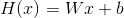

- 여러가지 H(x)가 존재할 수 있다. 여러가지 가설이 존재할 수 있다는
  말이다.  데이터값 y와 예측값 H(x)를 비교해서 흩어짐의 정도가 가장
  작은 H(x)가 훌륭한 H(x)라고 할만 하다. 이때 흩어짐의 정도를 측정하는
  함수를 cost function이라고 한다.  cost function은 W(weight)와
  b(bias)를 인자로 갖는 함수라고 할 수 있다. 곧 linear regression은
  W와 b를 어떻게 정해서 cost(W, b)의 값을 최소로하는 H(x)를 구하는
  행위이다.
  
```latex
cost(W, b) = \frac{1}{m} \sum_{m}^{i=1} (H(x_{i})-y_{i})^{2}
```

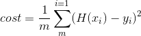

- cost(W, b)를 최소로 하는 W, b를 찾기 위해 gradient descent
  algorithm을 사용한다. gradient descent algorithm은 여러가지 W, b를
  설정해 보고 training data를 이용하여 가장 최소의 cost(W, b)를 갖는
  W, b를 찾는다.

- 계산의 편의를 위해 b를 생략한 cost(W)를 고민해보자. 이것은 W를
  x축으로 하고 포물선을 그리는 이차함수이다.  가장 볼록한 부분의 W값이
  cost(W)를 최소화 할 것이다. cost(W)를 W에 관하여 미분하고 기울기가
  가장 적은 cost(W)를 찾으면 된다. 
  
- 기본적인 linear regression을 tensorflow를 이용하여 구현해보자.  W,
  b, hypothesis, train은 모두 node이다. sess.run의 run은 eval과 같다.
  인자로 넘겨진 node를 eval해달라는 의미이다. sess.run(cost)는 cost node를
  eval한 결과를 리턴한다.

```python
# -*- coding: utf-8 -*-
import tensorflow as tf

def main():
    tf.set_random_seed(777)
    x_train = [1, 2, 3]
    y_train = [1, 2, 3]

    # W, b, Hypothesis, cost
    W = tf.Variable(tf.random_normal([1]), name='weight')
    b = tf.Variable(tf.random_normal([1]), name='bias')
    hypothesis = x_train * W + b
    cost = tf.reduce_mean(tf.square(hypothesis - y_train))
    
    # minimize cost
    optimizer = tf.train.GradientDescentOptimizer(learning_rate=0.01)
    train = optimizer.minimize(cost)
    
    # launch it
    sess = tf.Session()
    sess.run(tf.global_variables_initializer())

    # fit the line
    for step in range(2001):
        sess.run(train)
        if step % 20 == 0:
            print(step, sess.run(cost), sess.run(W), sess.run(b))
            
if __name__ == "__main__":
    main()
```

- place holder와 train data를 이용해서 구현해보자. place holder는
  자리만 예약하고 나중에 값을 대입하겠다는 약속을 한 node이다. 나중에 제공할
  값은 sess.run의 feed_dict인자로 넘겨준다.

```python
# -*- coding: utf-8 -*-
import tensorflow as tf
tf.set_random_seed(777)

def main():
    # set nodes 
    W = tf.Variable(tf.random_normal([1]), name='weight')
    b = tf.Variable(tf.random_normal([1]), name='bias')
    X = tf.placeholder(tf.float32, shape=[None])
    Y = tf.placeholder(tf.float32, shape=[None])
    hypothesis = X * W + b
    cost = tf.reduce_mean(tf.square(hypothesis - Y))
    optimizer = tf.train.GradientDescentOptimizer(learning_rate=0.01)
    train = optimizer.minimize(cost)

    # train nodes
    sess = tf.Session()
    sess.run(tf.global_variables_initializer())
    for step in range(2001):
        cost_val, W_val, b_val, _ = sess.run([cost, W, b, train],
                                             feed_dict={X: [1, 2, 3],
                                                        Y: [1, 2, 3]})
        if step % 20 == 0:
            print(step, cost_val, W_val, b_val)

    # test nodes
    print(sess.run(hypothesis, feed_dict={X: [5]}))
    print(sess.run(hypothesis, feed_dict={X: [2.5]}))
    print(sess.run(hypothesis, feed_dict={X: [1.5, 3.5]}))

if __name__ == "__main__":
    main()
```

- gradient descent algorithm은 어떻게 해서 최소의 W, b를 찾아내는지
  살펴보자. 먼저 H(x)와 cost(W) 다음과 같이 정의하자.
  


- cost(W)를 최소화될때까지 W를 갱신해야한다. 다음과 같이 새로운 W는
  현재의 W에서 α(learning rate)와 cost(W)를 W에 관하여 미분한 것을
  곱한 값을 빼서 얻는다. cost(W)는 미분을 쉽게 하기 위해 다음과 같이
  1/2를 곱한다. 원래의 것을 미분하는 것이나 1/2를 곱하고 미분하는
  것이나 동일하다. α(learning rate)와 cost(W)를 W에 관하여 미분한
  것은 한번은 양이되고 한번은 음이 되는 식으로 반복할 것이다. learning
  rate을 잘 설정해야 새로운 W를 쉽게 찾아 갈 수 있다.

```latex
\begin{align*}
& cost(W, b) = \frac{1}{2m} \sum_{m}^{i=1} (H(x_{i})-y_{i})^{2} \\
& W := W - \alpha \frac{\partial}{\partial W} cost(W) \\
& W := W - \alpha \frac{\partial}{\partial W} \frac{1}{2m} \sum_{m}^{i=1} (Wx_{i}-y_{i})^{2} \\
& W := W - \alpha \frac{1}{2m} \sum_{m}^{i=1} 2(Wx_{i}-y_{i})x_{i} \\
& W := W - \alpha \frac{1}{m} \sum_{m}^{i=1} (Wx_{i}-y_{i})x_{i} \\
\end{align*}
```

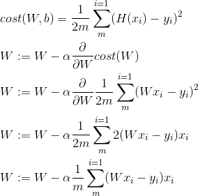

- 앞서 언급한 것 처럼 x축을 W, y축을 cost(W)로 하는 그래프를 그려 보자.

```python
# -*- coding: utf-8 -*-

import tensorflow as tf
import matplotlib.pyplot as plt
tf.set_random_seed(777)

def main():
    # set node
    X = [1, 2, 3]
    Y = [1, 2, 3]
    W = tf.placeholder(tf.float32)
    hypothesis = W * X
    cost = tf.reduce_mean(tf.square(hypothesis - Y))
    
    # launch node
    sess = tf.Session()
    W_history = []
    cost_history = []
    for i in range(-30, 50):
        cur_W = i * 0.1 # learning rate
        cur_cost = sess.run(cost, feed_dict={W: cur_W})
        W_history.append(cur_W)
        cost_history.append(cur_cost)
    plt.plot(W_history, cost_history)
    plt.show()

if __name__ == "__main__":
    main()
```

- gradient descent algorithm을 직접 구현해서 cost(W)를 최소화 하는
  W를 찾아 보자.

```python
# -*- coding: utf-8 -*-
import tensorflow as tf
tf.set_random_seed(777)

def main():
    # set nodes
    x_data = [1, 2, 3]
    y_data = [1, 2, 3]
    W = tf.Variable(tf.random_normal([1]), name='weight')
    X = tf.placeholder(tf.float32)
    Y = tf.placeholder(tf.float32)
    hypothesis = W * X
    cost = tf.reduce_mean(tf.square(hypothesis - Y))
    
    # set gradient descent applied W node
    learning_rate = 0.1
    gradient = tf.reduce_mean((W * X - Y) * X)
    descent = W - learning_rate * gradient
    update = W.assign(descent)
    
    # launch node
    sess = tf.Session()
    sess.run(tf.global_variables_initializer())
    for step in range(21):
         sess.run(update, feed_dict = {X: x_data, Y: y_data})
         print(step, sess.run(cost, feed_dict = {X: x_data, Y: y_data}), sess.run(W))

if __name__ == "__main__":
    main()
```

- gradient descent algorithm을 GradientDescentOptimizer를 활용하여
  쉽게 구현할 수 있다.
  
```python
# -*- coding: utf-8 -*-
import tensorflow as tf
tf.set_random_seed(777)

def main():
    # set nodes
    X = [1, 2, 3]
    Y = [1, 2, 3]
    W = tf.Variable(5.0)
    hypothesis = W * X
    cost = tf.reduce_mean(tf.square(hypothesis - Y))
    
    # set cost function node
    optimizer = tf.train.GradientDescentOptimizer(learning_rate=0.1)
    train = optimizer.minimize(cost)
    
    # launch node
    sess = tf.Session()
    sess.run(tf.global_variables_initializer())
    for step in range(100):
        print(step, sess.run(W))
        sess.run(train)
        
if __name__ == "__main__":
    main()
```

- gradient descent algorithm을 직접 구현한 것과 GradientDescentOptimizer를 활용한 것의
  결과는 동일하다. gvs를 보정하면 custom gradient descent값을 이용 할 수 있다.
  
```python
# -*- coding: utf-8 -*-


def main():
    import tensorflow as tf
    tf.set_random_seed(777)

    # set nodes
    X = [1, 2, 3]
    Y = [1, 2, 3]
    W = tf.Variable(5.)
    hypothesis = W * X
    gradient = tf.reduce_mean((W * X - Y) * X) * 2
    cost = tf.reduce_mean(tf.square(hypothesis - Y))

    # set cost function node
    optimizer = tf.train.GradientDescentOptimizer(learning_rate=0.1)
    train = optimizer.minimize(cost)
    gvs = optimizer.compute_gradients(cost, [W])
    apply_gradients = optimizer.apply_gradients(gvs)

    # launch nodes
    sess = tf.Session()
    sess.run(tf.global_variables_initializer())
    for step in range(100):
        print(step, sess.run([gradient, W, gvs]))
        sess.run(apply_gradients)

if __name__ == "__main__":
    main()
```


## linear regression with multiple variables

- 만약 feature가 x1, x2, x3와 같이 세가지 일때 hypothesis와
  cost(W, b)는 다음과 같다.
  
```latex
\begin{align*}
H(x_{1}, x_{2}, x_{3}) &= w_{1}x_{1} + w_{2}x_{2} + w_{3}x_{3} + b \\
cost(W, b) &= \frac{1}{m} \sum_{m}^{i=1} (H(x_{1}, x_{2}, x_{3}) - y_{i})^{2} \\
H(x_{1}, x_{2}, x_{3}, ..., x_{n}) &= w_{1}x_{1} + w_{2}x_{2} + w_{3}x_{3} + ... + w_{n}x_{n} + b \\
\end{align*}
```

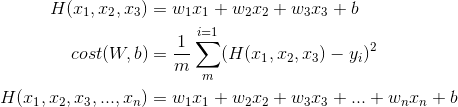

- feature가 여러개인 경우 matrix를 이용하여 계산 할 수 있다. matrix를
  이용한다는 것은 여러개의 데이터를 pararrel하게 처리할 수 있다는
  의미이다. 위와 같이 feature가 x1, x2, x3인 경우 다음과 같은 형태의
  행렬 연산을 이용하여 hypothesis를 구할 수 있다. 이때 X행렬의 형태는
  data instance x feature count, W행렬의 형태는 feature count x output
  count이고 H(X)의 행렬은 data instance x output count이다. 예를
  들어서 feature가 x1, x2, x3이고 output이 y인 경우 X행렬의 형태는 1 x
  3, W행렬의 형태는 3 x 1이고 H(X)행렬의 형태는 1 x 1이다.  만약
  데이터의 개수가 5개라면 X행렬의 형태는 5 x 3, W행렬의 형태는 3 x
  1이고 H(X)행렬의 형태는 5 x 1이다. 데이터의 개수가 5개, feature가
  x1, x2, x3와 같이 세개이고 output이 y1, y2와 같이 두개라고
  해보자. 이때 X의 행렬의 형태는 5 x 3, W행렬의 형태는 3 x 2,
  H(X)행렬의 형태는 5 x 2가 된다.

```
\begin{pmatrix}
  x_1&x_2&x_3
\end{pmatrix}
\cdot
\begin{pmatrix}
  w_1\\
  w_2\\
  w_3\
end{pmatrix}
=
\begin{pmatrix}
  x_1w_1+x_2w_2+x_3w_3
\end{pmatrix} \\
H(X) = X W
```

- feature가 여러개일때 linear regression을 구현해보자.

```python
# -*- coding: utf-8 -*-
import tensorflow as tf
tf.set_random_seed(777)

def main():
    # set nodes
    x1_data = [73., 93., 89., 96., 73.]
    x2_data = [80., 88., 91., 98., 66.]
    x3_data = [75., 93., 90., 100., 70.]
    y_data = [152., 185., 180., 196., 142.]
    x1 = tf.placeholder(tf.float32)
    x2 = tf.placeholder(tf.float32)
    x3 = tf.placeholder(tf.float32)
    Y = tf.placeholder(tf.float32)
    w1 = tf.Variable(tf.random_normal([1]), name='weight1')
    w2 = tf.Variable(tf.random_normal([1]), name='weight2')
    w3 = tf.Variable(tf.random_normal([1]), name='weight3')
    b = tf.Variable(tf.random_normal([1]), name='bias')
    hypothesis = x1 * w1 + x2 * w2 + x3 * w3 + b
    print(hypothesis)

    # set train node
    cost = tf.reduce_mean(tf.square(hypothesis - Y))
    optimizer = tf.train.GradientDescentOptimizer(learning_rate=1e-5)
    train = optimizer.minimize(cost)

    # train nodes
    sess = tf.Session()
    sess.run(tf.global_variables_initializer())
    for step in range(2001):
        cost_val, hy_val, _ = sess.run([cost, hypothesis, train],
                                       feed_dict={x1: x1_data, x2: x2_data, x3: x3_data, Y: y_data})
        if step % 10 == 0:
            print(step, "Cost: ", cost_val, "\nPrediction:\n", hy_val)


if __name__ == "__main__":
    main()
```

- feature가 여러개일때 행렬 연산을 이용하여 linear regression을 구현해보자.
  행렬을 이용하면 코드가 조금 더 깔끔해 진다.

```python
# -*- coding: utf-8 -*-
import tensorflow as tf
tf.set_random_seed(777)

def main():
    # set data

    x_data = [[73., 80., 75.],
              [93., 88., 93.],
              [89., 91., 90.],
              [96., 98., 100.],
              [73., 66., 70.]]
    y_data = [[152.],
              [185.],
              [180.],
              [196.],
              [142.]]
    # set nodes
    X = tf.placeholder(tf.float32, shape=[None, 3])
    Y = tf.placeholder(tf.float32, shape=[None, 1])
    W = tf.Variable(tf.random_normal([3, 1]), name='weight')
    b = tf.Variable(tf.random_normal([1]), name='bias')
    hypothesis = tf.matmul(X, W) + b
    cost = tf.reduce_mean(tf.square(hypothesis - Y))

    # set train node
    optimizer = tf.train.GradientDescentOptimizer(learning_rate=1e-5)
    train = optimizer.minimize(cost)

    # train node
    sess = tf.Session()
    sess.run(tf.global_variables_initializer())
    for step in range(2001):
        cost_val, hy_val, _ = sess.run(
            [cost, hypothesis, train], feed_dict={X: x_data, Y: y_data})
        if step % 10 == 0:
            print(step, "Cost: ", cost_val, "\nPrediction:\n", hy_val)

if __name__ == "__main__":
    main()
```

- feature가 여러개일때 행렬 연산과 파일입출력을 이용하여 linear regression을 구현해보자.
  현실세계에서 데이터는 주로 파일을 통해 제공된다.

```python
# -*- coding: utf-8 -*-
import tensorflow as tf
import numpy as np
tf.set_random_seed(777)

def main():
    # set data
    xy = np.loadtxt('data-01-test-score.csv', delimiter=',', dtype=np.float32)
    x_data = xy[:, 0:-1]
    y_data = xy[:, [-1]]
    print(x_data.shape, x_data, len(x_data))
    print(y_data.shape, y_data)
    
    # set nodes
    X = tf.placeholder(tf.float32, shape=[None, 3])
    Y = tf.placeholder(tf.float32, shape=[None, 1])
    W = tf.Variable(tf.random_normal([3, 1]), name='weight')
    b = tf.Variable(tf.random_normal([1]), name='bias')
    hypothesis = tf.matmul(X, W) + b
    cost = tf.reduce_mean(tf.square(hypothesis - Y))

    # set train node
    optimizer = tf.train.GradientDescentOptimizer(learning_rate=1e-5)
    train = optimizer.minimize(cost)

    # train nodes
    sess = tf.Session()
    sess.run(tf.global_variables_initializer())
    for step in range(2001):
        cost_val, hy_val, _ = sess.run(
            [cost, hypothesis, train], feed_dict={X:x_data, Y:y_data})
        if step % 10 == 0:
            print(step, "Cost: ", cost_val, "\nPrediction:\n", hy_val)

    # Ask my score
    print("Your score will be ", sess.run(
        hypothesis, feed_dict={X: [[100, 70, 101]]}))
    print("Other scores will be ", sess.run(hypothesis,
                                            feed_dict={X: [[60, 70, 110], [90, 100, 80]]}))

if __name__ == "__main__":
    main()
```

- 데이터의 개수가 많다면 메모리의 제한때문에 파일의 모든 내용을 한번에
  가져올 수 없다. tensorflow는 다음의 그림과 같이 x, y의 데이터들을
  일정한 크기(배치)씩 가져올 수 있는 기능을 제공한다.


- feature가 여러개일때 행렬 연산과 tf.TextLineReader를 이용하여 linear
  regression을 구현해보자.

```python
# -*- coding: utf-8 -*-
import tensorflow as tf
tf.set_random_seed(777)

def main():
    # set data batch
    filename_queue = tf.train.string_input_producer(
        ['data-01-test-score.csv'], shuffle=False, name='filename_queue')
    reader = tf.TextLineReader()
    key, value = reader.read(filename_queue)
    record_defaults = [[0.], [0.], [0.], [0.]]
    xy = tf.decode_csv(value, record_defaults=record_defaults)
    train_x_batch, train_y_batch = tf.train.batch(
        [xy[0:-1], xy[-1:]], batch_size=10)

    # set nodes
    X = tf.placeholder(tf.float32, shape=[None, 3])
    Y = tf.placeholder(tf.float32, shape=[None, 1])
    W = tf.Variable(tf.random_normal([3, 1]), name='weight')
    b = tf.Variable(tf.random_normal([1]), name='bias')
    hypothesis = tf.matmul(X, W) + b
    cost = tf.reduce_mean(tf.square(hypothesis - Y))

    # set train node
    optimizer = tf.train.GradientDescentOptimizer(learning_rate=1e-5)
    train = optimizer.minimize(cost)

    # train nodes
    sess = tf.Session()
    sess.run(tf.global_variables_initializer())
    # set threads
    coord = tf.train.Coordinator()
    threads = tf.train.start_queue_runners(sess=sess, coord=coord)

    for step in range(2001):
        x_batch, y_batch = sess.run([train_x_batch, train_y_batch])
        cost_val, hy_val, _ = sess.run(
            [cost, hypothesis, train], feed_dict={X: x_batch, Y: y_batch})
        if step % 10 == 0:
            print(step, "Cost: ", cost_val, "\nPrediction:\n", hy_val)
    # join threads
    coord.request_stop()
    coord.join(threads)

    # Ask my score
    print("Your score will be ",
          sess.run(hypothesis, feed_dict={X: [[100, 70, 101]]}))
    print("Other scores will be ",
          sess.run(hypothesis, feed_dict={X: [[60, 70, 110], [90, 100, 80]]}))
    
if __name__ == "__main__":
    main()
```

## logistic regression (binary classification)

- y가 0혹은 1과 같이 두개만 존재하는 경우의 회귀분석이다. 예를 들어서
  학생이 시험을 통과하기 위해 공부한 시간을 x1, 공부한 책의 숫자를 x2,
  시험통과여부를 y라고 하자. 이때 y값의 후보는 0, 1이고 logistic
  regression이라고 할 수 있다. 이 밖에도 스팸인지 햄인지 구별하는
  경우, 페이스북 친구의 타임라인을 보여줄 것인지 말 것인지, 신용카드
  이용 패턴을 분석해서 내가 사용한 것인지 다른 사람이 도용해서
  사용한것인지, 주식투자에서 특정 종목에 대해서 투자를 할 것인지 말
  것인지 등등이 해당된다.

- hypothesis function 를 linear regression처럼 일차 함수로 적용하면
  문제가 발생한다. 예를 들어서 앞서 언급한 학생의 시험 통과 결정의
  예를 생각해보자.  training data가 x1이 1일때 y는 0, x1이 2일때 y는
  1, x1이 3일때 y는 2이라고 하자. 이때 y가 0.5보다 크거나 같은 경우는
  통과 0.5보다 작은 경우는 실패하고 할 수 있다. 이 경우 `H(x) = x -
  1`이다. 하지만 training data에 x1이 4일때 y가 1이라는 데이터가
  추가되었다고 해보자. 그렇다면 `H(x) = x/2 - 1`이 될테고 test data의
  x1이 2일 경우 y는 0이므로 training data와 달리 보정된 y는 실패가
  되어 버린다. 이 것은 accuracy가 떨어진다고 할 수 있다. 따라서
  일차함수로 표현하면 문제가 될 수 있다.

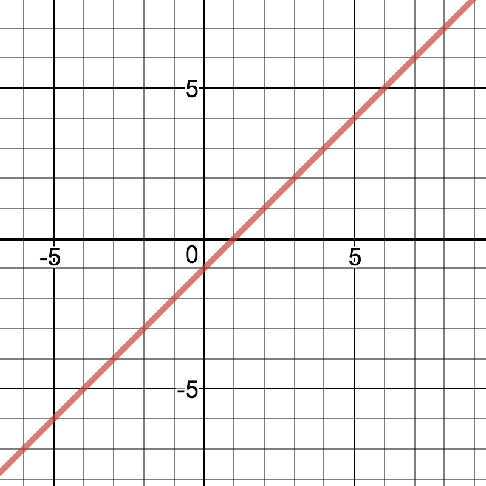
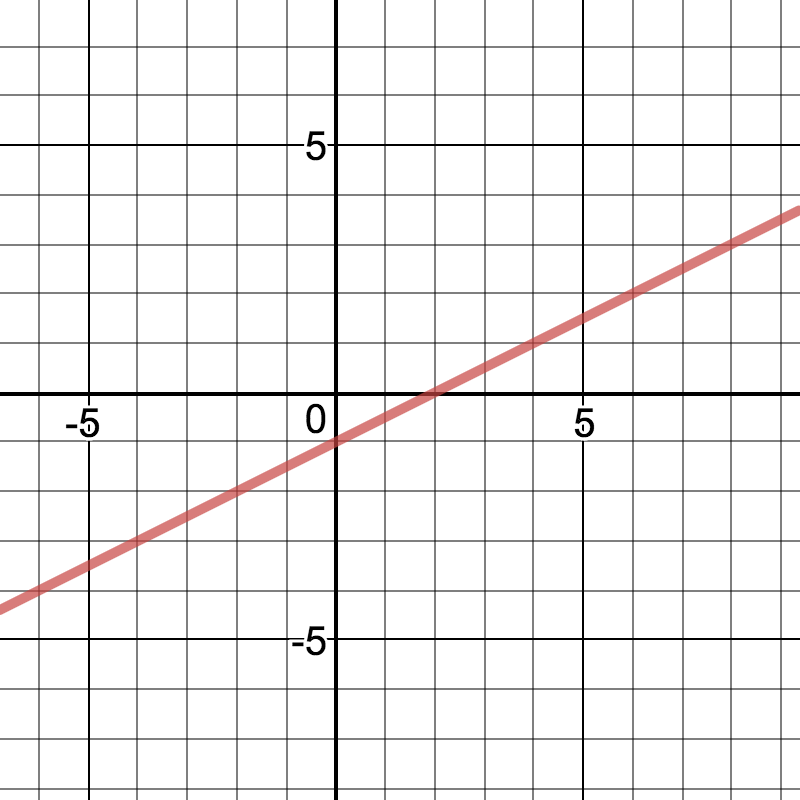

- logistic regression은 일차함수가 아닌 새로운 형태의 hypothesis
  function이 필요하다. 이것은 일차함수 `WX+b`의 값을 인자로 받아 그
  값이 0보다 작으면 0.5보다 작은 값인데 아래로 쏠린 값(0에 가까운
  값)을, 0보다 크거나 같으면 0.5보다 큰 값인데 위로 쏠린 값(1에 가까운
  값)을 리턴하는 함수가 필요하다. 이러한 용도로 발견된 함수를 logistic
  function혹은 sigmoid function이라고 한다.  그래서 logistic
  regression이라는 말이 만들어 졌다.

```latex
g(z) = \frac{1}{1 + e^{-z}}
```
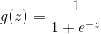  
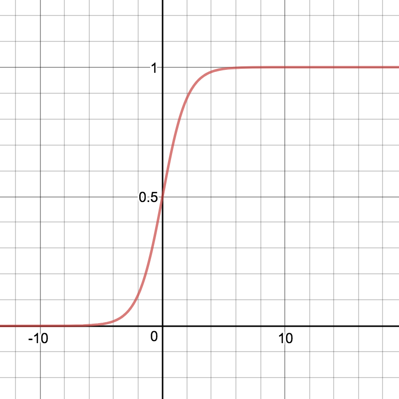

- logistic regression의 sigmoid를 활용한 H(X), cost(W, b)는 다음과
  같다. cost(W, b)의 경우 sigmoid를 활용한 H(X)를 사용할 경우 기울기가
  0인 지점이 여러 곳에서 발생하기 때문에 새로운 형태의 cost(W, b)가
  필요하다.  즉 기울기가 0인 지점이 한 곳만 존재하는 수식이
  필요하다. 그래서 다음과 같은 cost(W, b)가 발견되었다. 결국 linear
  regression과 마찬가지로 gradient descent algorithm을 이용하여
  cost(W, b)가 최소가 되는 W를 발견할 수 있다.

```latex
\begin{align*}
g(z) &= \frac{1}{1 + e^{-z}} \\
H(X) &= g(H(X)) = \frac{1}{1 + e^{-H(X)}} = \frac{1}{1 + e^{-WX}} \\
cost(W, b) &= \frac{1}{m} \sum_{i=1}^{m} c(H(x), y) \\
c(H(x), y) &=\left\{\begin{matrix}
-\log (H(x)) &: y = 1\\ 
-\log (1 - H(x)) &: y = 0
\end{matrix}\right. \\
c(H(x), y) &= -y \log(H(x)) - (1-y) \log(1 - H(x)) \\
cost(W, b) &= \frac{1}{m} \sum_{i=1}^{m} \left ( -y \log(H(x)) - (1-y) \log(1 - H(x)) \right ) \\
W &:= W - \alpha \frac{\partial}{\partial W} cost(W, b) \\
\end{align*}
```

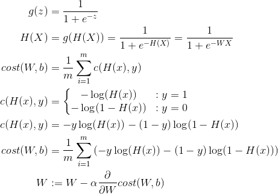

- 두개의 x와 한개의 y를 갖는 경우 logistic regression을 구현해보자.

```python
# -*- coding: utf-8 -*-
import tensorflow as tf
tf.set_random_seed(777)

def main():
    # set train data
    x_data = [[1, 2],
              [2, 3],
              [3, 1],
              [4, 3],
              [5, 3],
              [6, 2]]
    y_data = [[0],
              [0],
              [0],
              [1],
              [1],
              [1]]
    # set nodes
    X = tf.placeholder(tf.float32, shape=[None, 2])
    Y = tf.placeholder(tf.float32, shape=[None, 1])
    W = tf.Variable(tf.random_normal([2, 1]), name='weight')
    b = tf.Variable(tf.random_normal([1]), name='bias')
    hypothesis = tf.sigmoid(tf.matmul(X, W) + b)
    cost = -tf.reduce_mean(Y * tf.log(hypothesis) + (1 - Y) *
                           tf.log(1 - hypothesis))
    train = tf.train.GradientDescentOptimizer(learning_rate=0.01).minimize(cost)

    # accuracy computation
    predicted = tf.cast(hypothesis > 0.5, dtype=tf.float32)
    accuracy = tf.reduce_mean(tf.cast(tf.equal(predicted, Y),
                                      dtype=tf.float32))
    # launch nodes
    with tf.Session() as sess:
        sess.run(tf.global_variables_initializer())
        for step in range(10001):
            cost_val, _ = sess.run([cost, train], feed_dict={X: x_data, Y: y_data})
            if step % 200 == 0:
                print(step, cost_val)

        # Accuracy report
        h, c, a = sess.run([hypothesis, predicted, accuracy],
                       feed_dict={X: x_data, Y: y_data})
        print("\nHypothesis: ", h, "\nCorrect (Y): ", c, "\nAccuracy: ", a)
              
if __name__ == "__main__":
    main()
```

- 당뇨병 환자인지 아닌지를 예측하는 logistic regression을 구현해 보자.

```python
# -*- coding: utf-8 -*-
import tensorflow as tf
import numpy as np
tf.set_random_seed(777)

def main():
    # set data
    xy = np.loadtxt('data-03-diabetes.csv', delimiter=',', dtype=np.float32)
    x_data = xy[:, 0:-1]
    y_data = xy[:, [-1]]

    # set nodes
    X = tf.placeholder(tf.float32, shape=[None, 8])
    Y = tf.placeholder(tf.float32, shape=[None, 1])
    W = tf.Variable(tf.random_normal([8, 1]), name='weight')
    b = tf.Variable(tf.random_normal([1]), name='bias')
    hypothesis = tf.sigmoid(tf.matmul(X, W) + b)
    cost = -tf.reduce_mean(Y * tf.log(hypothesis) + (1 - Y) *
                           tf.log(1 - hypothesis))
    train = tf.train.GradientDescentOptimizer(learning_rate=0.01).minimize(cost)

    # Accuracy computation
    predicted = tf.cast(hypothesis > 0.5, dtype=tf.float32)
    accuracy = tf.reduce_mean(tf.cast(tf.equal(predicted, Y), dtype=tf.float32))

    # Launch nodes
    with tf.Session() as sess:
        sess.run(tf.global_variables_initializer())
        for step in range(10001):
            cost_val, _ = sess.run([cost, train], feed_dict={X: x_data, Y: y_data})
            if step % 200 == 0:
                print(step, cost_val)
        h, c, a = sess.run([hypothesis, predicted, accuracy],
                           feed_dict={X: x_data, Y: y_data})
        print("\nHypothesis: ", h, "\nCorrect (Y): ", c, "\nAccuracy: ", a)
    
if __name__ == "__main__":
    main()
```

## [Example: Titanic](https://www.kaggle.com/c/titanic)

## softmax regression (multinomial classification)

- 출력이 A, B, C와 같이 세개 이상인 경우의 회귀분석이다. 공부한 시간,
  출석 횟수를 입력으로 성적을 출력으로 갖는 경우를 생각해보자. 이때
  성적은 A, B, C중 하나이다. 이것은 multinomial
  classification문제이다. 입력 x1, x2에 대해 출력 Y가 A이냐 아니냐에
  대한 logistic regression을 할 수 있다. 마찬 가지로 Y가 B, C인 경우
  각각 logistic regression을 할 수 있다. 그렇다면 logistic
  regression을 수행할 hypothesis function은 3가지이다. 이것은
  행렬연산을 활용하여 다음과 같이 한 번에 수행할 수 있다. 이와 같이
  multinomial classification 은 binary classification을 여러개
  이용해서 해결한다.

```latex
\begin{bmatrix}
w_{A1} & w_{A2} & w_{A3}\\ 
w_{B1} & w_{B2} & w_{B3}\\ 
w_{C1} & w_{C2} & w_{C3}\\ 
\end{bmatrix}

\begin{bmatrix}
 x_{1} \\ 
 x_{2} \\ 
 x_{3} \\ 
\end{bmatrix}

=

\begin{bmatrix}
 w_{A1}x_{1} +  w_{A2}x_{2} + w_{A3}x_{3} \\ 
 w_{B1}x_{1} +  w_{B2}x_{2} + w_{B3}x_{3} \\ 
 w_{C1}x_{1} +  w_{C2}x_{2} + w_{C3}x_{3} \\ 
\end{bmatrix}

=

\begin{bmatrix}
H_{A}(X) \\
H_{B}(X) \\
H_{C}(X) \\
\end{bmatrix}

=

\begin{bmatrix}
\bar{y}_{A} \\
\bar{y}_{B} \\
\bar{y}_{C} \\
\end{bmatrix}
```
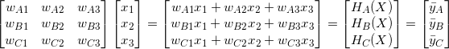

- 출력값들이 각각 2.0, 1.0, 0.1이라고 하자. 그렇다면 이것은 A등급에 속한다.
  하지만 출력값들의 형태를 각각의 등급에 대해 [0, 1]의 확률값으로 표현하고 싶다.
  그래서 softmax function 이 발견되었다. softmax function을 이용하면
  0.7, 0.2, 0.1의 형태로 출력값이 변경된다. 결과적으로 0.7의 확률로
  A등급에 속한다는 의미이다. 확률이기 때문에 모두 더하면 1이다. 

```latex
S(\bar{y}_{j}) = \frac{e^{\bar{y}_{j}}}{\sum_{j=1}^{k}e^{\bar{y}_{j}}}
```

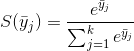

- 출력값들이 각각 0.7, 0.2, 0.1이라고 하자. 한번 더 처리하여 1.0, 0.,
  0.과 같이 명쾌하게 A등급에 속한다고 결론내고 싶다. 그래서 one hot
  encoding 이 발견되었다. 최종 출력값은 1, 0, 0 이다. one hot
  encoding은 tf.arg_max를 사용했다.

- 0.7, 0.2, 0.1의 출력값은 `S(\bar{Y})`라고 표기하자. `\bar{Y}`는
  예측값을 의미한다.  1, 0, 0과 같은 출력값은 L이라고 표기하자. 이것은
  학습데이터의 값이다.  cost function을 제작하기 위해 인자로 예측값과
  데이터값을 하고 예측값과 데이터값이 같으면 0에 가까운 값을 다르면
  무한대의 값을 리턴하는 함수가 필요하다. 그래서 cross-entropy
  function이 발견되었고 다음과 같이 정의가 가능하다.

```latex
D(S, L) = -\sum_{j=1}^{k}L_{j}\log(S_{j})
```

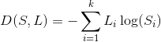

- cross entropy function이 제대로 동작하는지 예를 들어서
  살펴보자. 앞서 언급한 cross entropy function은 다음과 같이 전개 할
  수 있고 -log(x)함수의 모양을 눈여겨 볼 필요가 있다. `L_{j}`는
  학습데이터값이고 `\bar{y}_{j}`는 예측값이다.

```latex
\begin{align*} 
D(S, L) &= -\sum_{j=1}^{k}L_{j}\log(S_{j}) \\
        &= -\sum_{j=1}^{k}L_{j}\log(\bar{y}_{j}) \\
        &= \sum_{j=1}^{k}L_{j} \cdot -\log(\bar{y}_{j}) \\
\end{align*}
```

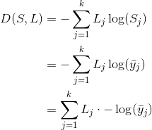

- `L_{j}`가 [0, 1], `\bar{y}_{j}`가 [0, 1]이라고 해보자.  cost는 `0 x
  ∞ + 1 x 0`가 되어 0이 된다. `\bar{y}_{j}`가 [1, 0]이라고 해보자.
  cost는 `0 x 0 + 1 x ∞`가 되어 무한대가 된다.  앞서 언급한 cross
  entropy function의 전개식과 -log(x)를 이용하여 보면 데이터값과
  예측값이 동일할때 cost function의 리턴값이 0에 가깝고 그렇지 않으면
  무한대에 가까워진다. 이것으로 cross entropy function이 제대로
  동작한다고 말 할 수 있다.

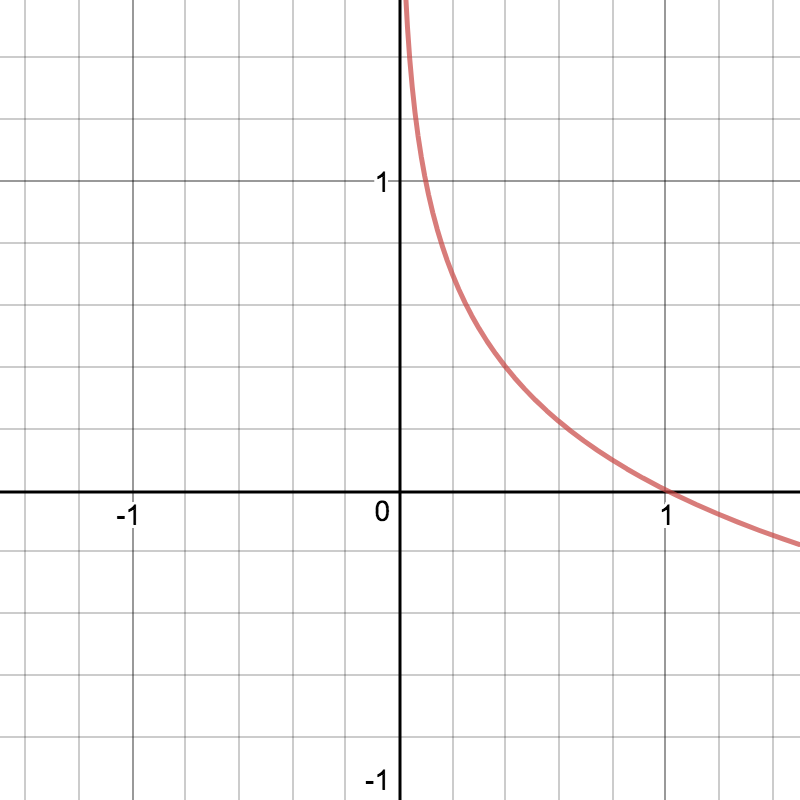

- logistic regression의 logistic cost function과 softmax regression의
  cross entropy function은 사실상 같다. H(x), S는 예측 값을 의미하고
  y, L은 데이터 값을 의미한다.

```latex
\begin{align*} 
c(H(x), y) &= -y \log(H(x)) - (1-y) \log(1 - H(x)) \\
D(S, L)    &= -\sum_{j=1}^{k}L_{j}\log(S_{j}) \\
\end{align*}
```

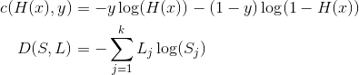

- softmax regression의 cost function은 다음과 같다.  실제 그래프로
  그려보면 logistic regression의 cost function처럼 아래가 볼록한
  모양이다. 기울기가 0인 지점은 한 곳이다. gradient descent
  algorithm을 이용해서 cost function이 최소인 W, b를 찾아 낼 수
  있다. grade descent algorithm을 적용하기 위한 미분 방정식은 복잡해서
  생략한다.

```latex
\begin{align*} 
D(S, L)    &= -\sum_{j=1}^{k}L_{j}\log(S_{j}) \\
cost(W, b) &= \frac{1}{m} \sum_{i=1}^{m} D(S, L) \\
           &= \frac{1}{m} \sum_{i=1}^{m} (-\sum_{j=1}^{k}L_{j}\log(S_{j})) \\
           &= -\frac{1}{m} \sum_{i=1}^{m} \sum_{j=1}^{k}L_{j}\log(S_{j}) \\
\end{align*}
```

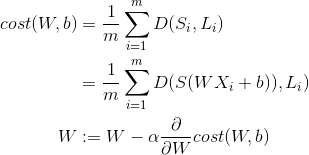

- x가 4개이고 y가 3개인 데이터를 이용하여 softmax regression을 구현해 보자.
  one hot encoding을 위해 tf.arg_max를 사용했다.

```python
# -*- coding: utf-8 -*-
import tensorflow as tf
tf.set_random_seed(777)  # for reproducibility

def main():
    # set data
    x_data = [[1, 2, 1, 1],
              [2, 1, 3, 2],
              [3, 1, 3, 4],
              [4, 1, 5, 5],
              [1, 7, 5, 5],
              [1, 2, 5, 6],
              [1, 6, 6, 6],
              [1, 7, 7, 7]]
    y_data = [[0, 0, 1],
              [0, 0, 1],
              [0, 0, 1],
              [0, 1, 0],
              [0, 1, 0],
              [0, 1, 0],
              [1, 0, 0],
              [1, 0, 0]]

    # set nodes
    X = tf.placeholder("float", [None, 4])
    Y = tf.placeholder("float", [None, 3])
    nb_classes = 3
    W = tf.Variable(tf.random_normal([4, nb_classes]), name='weight')
    b = tf.Variable(tf.random_normal([nb_classes]), name='bias')
    # tf.nn.softmax computes softmax activations
    # softmax = exp(logits) / reduce_sum(exp(logits), dim)
    hypothesis = tf.nn.softmax(tf.matmul(X, W) + b)
    cost = tf.reduce_mean(-tf.reduce_sum(Y * tf.log(hypothesis), axis=1))
    optimizer = tf.train.GradientDescentOptimizer(learning_rate=0.1).minimize(cost)

    # launch nodes
    with tf.Session() as sess:
        sess.run(tf.global_variables_initializer())

        for step in range(2001):
            sess.run(optimizer, feed_dict={X: x_data, Y: y_data})
            if step % 200 == 0:
                print(step, sess.run(cost, feed_dict={X: x_data, Y: y_data}))

        print('--------------')

        # Testing & One-hot encoding
        a = sess.run(hypothesis, feed_dict={X: [[1, 11, 7, 9]]})
        print(a, sess.run(tf.arg_max(a, 1)))

        print('--------------')

        b = sess.run(hypothesis, feed_dict={X: [[1, 3, 4, 3]]})
        print(b, sess.run(tf.arg_max(b, 1)))

        print('--------------')

        c = sess.run(hypothesis, feed_dict={X: [[1, 1, 0, 1]]})
        print(c, sess.run(tf.arg_max(c, 1)))

        print('--------------')

        all = sess.run(hypothesis, feed_dict={
            X: [[1, 11, 7, 9], [1, 3, 4, 3], [1, 1, 0, 1]]})
        print(all, sess.run(tf.arg_max(all, 1)))
    
if __name__ == "__main__":
    main()
```

- 동물들의 데이터를 이용해서 어떤 동물인지 분류하는 문제를 softmax regression으로
  해결해보자.

```python
# -*- coding: utf-8 -*-
import tensorflow as tf
import numpy as np
tf.set_random_seed(777)  # for reproducibility

def main():
    # set data
    xy = np.loadtxt('data-04-zoo.csv', delimiter=',', dtype=np.float32)
    x_data = xy[:, 0:-1]
    y_data = xy[:, [-1]]

    # set nodes
    nb_classes = 7  # 0 ~ 6

    X = tf.placeholder(tf.float32, [None, 16])
    Y = tf.placeholder(tf.int32, [None, 1])  # 0 ~ 6
    Y_one_hot = tf.one_hot(Y, nb_classes)  # one hot
    print("one_hot", Y_one_hot)
    Y_one_hot = tf.reshape(Y_one_hot, [-1, nb_classes])
    print("reshape", Y_one_hot)
    W = tf.Variable(tf.random_normal([16, nb_classes]), name='weight')
    b = tf.Variable(tf.random_normal([nb_classes]), name='bias')

    # tf.nn.softmax computes softmax activations
    # softmax = exp(logits) / reduce_sum(exp(logits), dim)
    logits = tf.matmul(X, W) + b
    hypothesis = tf.nn.softmax(logits)
    # Cross entropy cost/loss
    cost_i = tf.nn.softmax_cross_entropy_with_logits(logits=logits,
                                                     labels=Y_one_hot)
    cost = tf.reduce_mean(cost_i)
    optimizer = tf.train.GradientDescentOptimizer(learning_rate=0.1).minimize(cost)
    prediction = tf.argmax(hypothesis, 1)
    correct_prediction = tf.equal(prediction, tf.argmax(Y_one_hot, 1))
    accuracy = tf.reduce_mean(tf.cast(correct_prediction, tf.float32))

    # launch nodes
    with tf.Session() as sess:
        sess.run(tf.global_variables_initializer())

        for step in range(2000):
            sess.run(optimizer, feed_dict={X: x_data, Y: y_data})
            if step % 100 == 0:
                loss, acc = sess.run([cost, accuracy], feed_dict={
                    X: x_data, Y: y_data})
                print("Step: {:5}\tLoss: {:.3f}\tAcc: {:.2%}".format(
                    step, loss, acc))

        # Let's see if we can predict
        pred = sess.run(prediction, feed_dict={X: x_data})
        # y_data: (N,1) = flatten => (N, ) matches pred.shape
        for p, y in zip(pred, y_data.flatten()):
            print("[{}] Prediction: {} True Y: {}".format(p == int(y), p, int(y)))
    
if __name__ == "__main__":
    main()
```

## machine learning tips

- ML으로 문제를 해결할때 다음과 같은 사항들을 주의 깊게 고민할 필요가 있다.
  - learning rate를 잘 설정해서 cost(W, b)를 최소화 하는 W, b를 빨리 찾기
  - data를 잘 전처리 해서 cost(W, b)를 최소화 하는 W, b를 빨리 찾기
  - overfitting을 잘 해결해서 cost(W, b)를 최소화 하는 W, b를 빨리 찾기

- learning rate을 너무 크게 설정하면 어떠한 현상이 발생하는지
  생각해보자.  cost(W, b)는 아래로 볼록한 모양의 그래프이다. gradient
  descent algorithm을 위한 step값은 아래 방정식의 우변의 두번째
  항이다.  새로운 W는 현재의 W에 step값을 빼서 구한다. step은 learning
  rate와 cost(W, b)를 미분한 값을 곱한 것이다. learning rate이 너무
  크면 step값 역시 너무 커질 테고 새로운 W를 현재의 W와 차이가 커지게
  된다.  cost(W, b)를 미분한 값은 0보다 큰 값으로 수렴할 수 있고
  cost(W, b)를 최소화 하는 W, b는 찾기 어려워 질 것이다. 이러한 현상을
  overshooting이라고 한다.

```latex
W := W - \alpha \frac{\partial}{\partial W} cost(W, b) 
```

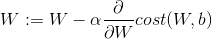

- learning rate이 너무 작게 설정하면 어떻게 될까? 앞서 언급한 상황에서
  step값은 매우 작아질테고 새로운 W와 현재의 W는 거의 차이가 없을 것이다.
  따라서 cost(W, b)를 최소화 하는 W, b를 찾기 위해 매우 많은 반복을
  수행해야 할 것이다. 즉 시간이 너무 많이 걸린다. 현실 세계에서 0.01은
  적당하다고 한다. 

- feature가 x1, x2로 두개인 경우를 생각해 보자. x1은 [1, 2, 4, 6,
  9]이고 x2는 [9000, -5000, -2000, 8000, 9000]이라고
  가정하자. feature가 두개이기 때문에 w1, w2가 존재한다. x1의 각
  값들의 차이와 x2의 각 값들의 차이는 스케일이 다르다. feature들의
  스케일이 차이가 나면 cost(W, b)를 최소화 하는 W, b를 찾는데 시간이
  오래걸린다.  feature들의 스케일이 비슷하게 보정(normalize)할 필요가
  있다. x2를 보정한다고 할때 다음과 같은 공식으로 normlize하자. 이것을
  standardization이라고 한다.

```latex
{x}'_{j} = \frac{x_{j} - \mu _{j}}{\sigma _j{}}
```

  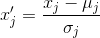

- training data set에 대해서 너무 훈련이 되있다면 test data set에 대한
  정확도가 낮을 수 있다. 이러한 현상을 overfitting이라고 한다. 다음과
  같은 방법으로 해결해 보자. 첫째 더욱 많은 training data set을
  확보해서 학습시켜보자.  둘째 feature가 너무 많은 경우 줄여서
  학습시켜 보자. 셋째 gradient descent algorithm에 사용할 step값을
  다른 방법으로 구해보자. 이것을 regularization이라고 한다.
  
```latex
\begin{align*} 
cost(W, b) &= \frac{1}{m} \sum_{i=1}^{m} D(S_{i}, L_{i}) \\
                  &= \frac{1}{m} \sum_{i=1}^{m} D(S(WX_{i}+b), L_{i}) + \lambda \sum_{i=1}^{m} W^{2}\\
\end{align*}
```
  
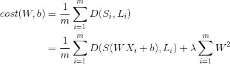

- 다음은 learning rate다양하게 했을때를 구현한 것이다. learning rate이
  1.5와 같이 너무 클때 cost는 inf가 되고 learning rate이 1e-10과 같이
  너무 작을때 cost는 너무 적게 변화 된다.

```python
# -*- coding: utf-8 -*-
import tensorflow as tf
tf.set_random_seed(777)  # for reproducibility

def main(lr):
    # set training data set
    x_data = [[1, 2, 1],
              [1, 3, 2],
              [1, 3, 4],
              [1, 5, 5],
              [1, 7, 5],
              [1, 2, 5],
              [1, 6, 6],
              [1, 7, 7]]
    y_data = [[0, 0, 1],
              [0, 0, 1],
              [0, 0, 1],
              [0, 1, 0],
              [0, 1, 0],
              [0, 1, 0],
              [1, 0, 0],
              [1, 0, 0]]
    # set test data set
    x_test = [[2, 1, 1],
              [3, 1, 2],
              [3, 3, 4]]
    y_test = [[0, 0, 1],
              [0, 0, 1],
              [0, 0, 1]]

    # set nodes
    X = tf.placeholder("float", [None, 3])
    Y = tf.placeholder("float", [None, 3])
    W = tf.Variable(tf.random_normal([3, 3]))
    b = tf.Variable(tf.random_normal([3]))
    # tf.nn.softmax computes softmax activations
    # softmax = exp(logits) / reduce_sum(exp(logits), dim)
    hypothesis = tf.nn.softmax(tf.matmul(X, W) + b)
    cost = tf.reduce_mean(-tf.reduce_sum(Y * tf.log(hypothesis), axis=1))
    optimizer = tf.train.GradientDescentOptimizer(
        learning_rate=lr).minimize(cost)

    # set accuracy
    prediction = tf.arg_max(hypothesis, 1)
    is_correct = tf.equal(prediction, tf.arg_max(Y, 1))
    accuracy = tf.reduce_mean(tf.cast(is_correct, tf.float32))

    # Launch nodes
    with tf.Session() as sess:
        sess.run(tf.global_variables_initializer())

        for step in range(201):
            cost_val, W_val, _ = sess.run(
                [cost, W, optimizer], feed_dict={X: x_data, Y: y_data})
            print(step, cost_val, W_val)

        # predict
        print("Prediction:", sess.run(prediction, feed_dict={X: x_test}))
        print("Accuracy: ", sess.run(accuracy, feed_dict={X: x_test, Y: y_test}))

if __name__ == "__main__":
    main(1.5)
    main(1e-10)
    main(1e-5)
```

- 다음은 normalizing없이 linear regression을 수행한 것을 구현한 것이다.
  cost가 inf넘어서 nan이 되는 것을 유심히 살펴보자.

```python
# -*- coding: utf-8 -*-
import tensorflow as tf
import numpy as np
tf.set_random_seed(777)  # for reproducibility

def main():
    # set data
    xy = np.array([[828.659973, 833.450012, 908100, 828.349976, 831.659973],
                   [823.02002, 828.070007, 1828100, 821.655029, 828.070007],
                   [819.929993, 824.400024, 1438100, 818.97998, 824.159973],
                   [816, 820.958984, 1008100, 815.48999, 819.23999],
                   [819.359985, 823, 1188100, 818.469971, 818.97998],
                   [819, 823, 1198100, 816, 820.450012],
                   [811.700012, 815.25, 1098100, 809.780029, 813.669983],
                   [809.51001, 816.659973, 1398100, 804.539978, 809.559998]])

    x_data = xy[:, 0:-1]
    y_data = xy[:, [-1]]

    # set nodes
    X = tf.placeholder(tf.float32, shape=[None, 4])
    Y = tf.placeholder(tf.float32, shape=[None, 1])
    W = tf.Variable(tf.random_normal([4, 1]), name='weight')
    b = tf.Variable(tf.random_normal([1]), name='bias')
    hypothesis = tf.matmul(X, W) + b
    cost = tf.reduce_mean(tf.square(hypothesis - Y))
    optimizer = tf.train.GradientDescentOptimizer(learning_rate=1e-5)
    train = optimizer.minimize(cost)

    # Launch nodes
    sess = tf.Session()
    sess.run(tf.global_variables_initializer())

    for step in range(101):
        cost_val, hy_val, _ = sess.run(
            [cost, hypothesis, train], feed_dict={X: x_data, Y: y_data})
        print(step, "Cost: ", cost_val, "\nPrediction:\n", hy_val)

if __name__ == "__main__":
    main()
```

- 다음은 위의 구현을 normalizing을 이용하여 수행한 것을 구현한 것이다.
  cost가 정상적으로 변화하는 것을 잘 살펴보자.

```python
# -*- coding: utf-8 -*-
import tensorflow as tf
import numpy as np
tf.set_random_seed(777)  # for reproducibility


def MinMaxScaler(data):
    numerator = data - np.min(data, 0)
    denominator = np.max(data, 0) - np.min(data, 0)
    # noise term prevents the zero division
    return numerator / (denominator + 1e-7)

def main():
    # set data
    xy = np.array([[828.659973, 833.450012, 908100, 828.349976, 831.659973],
                   [823.02002, 828.070007, 1828100, 821.655029, 828.070007],
                   [819.929993, 824.400024, 1438100, 818.97998, 824.159973],
                   [816, 820.958984, 1008100, 815.48999, 819.23999],
                   [819.359985, 823, 1188100, 818.469971, 818.97998],
                   [819, 823, 1198100, 816, 820.450012],
                   [811.700012, 815.25, 1098100, 809.780029, 813.669983],
                   [809.51001, 816.659973, 1398100, 804.539978, 809.559998]])
    xy = MinMaxScaler(xy)
    x_data = xy[:, 0:-1]
    y_data = xy[:, [-1]]

    # set nodes
    X = tf.placeholder(tf.float32, shape=[None, 4])
    Y = tf.placeholder(tf.float32, shape=[None, 1])
    W = tf.Variable(tf.random_normal([4, 1]), name='weight')
    b = tf.Variable(tf.random_normal([1]), name='bias')
    hypothesis = tf.matmul(X, W) + b
    cost = tf.reduce_mean(tf.square(hypothesis - Y))
    optimizer = tf.train.GradientDescentOptimizer(learning_rate=1e-5)
    train = optimizer.minimize(cost)

    # Launch nodes
    sess = tf.Session()
    sess.run(tf.global_variables_initializer())

    for step in range(101):
        cost_val, hy_val, _ = sess.run(
            [cost, hypothesis, train], feed_dict={X: x_data, Y: y_data})
        print(step, "Cost: ", cost_val, "\nPrediction:\n", hy_val)

if __name__ == "__main__":
    main()
```

- 다음은 MNIST를 softmax regression을 이용하여 구현한 것이다.

```python
# -*- coding: utf-8 -*-
import tensorflow as tf
import random
# import matplotlib.pyplot as plt
tf.set_random_seed(777)  # for reproducibility


def main():
    # set data
    from tensorflow.examples.tutorials.mnist import input_data
    mnist = input_data.read_data_sets("MNIST_data/", one_hot=True)
    nb_classes = 10

    # set nodes
    # MNIST data image of shape 28 * 28 = 784
    X = tf.placeholder(tf.float32, [None, 784])
    # 0 - 9 digits recognition = 10 classes
    Y = tf.placeholder(tf.float32, [None, nb_classes])
    W = tf.Variable(tf.random_normal([784, nb_classes]))
    b = tf.Variable(tf.random_normal([nb_classes]))
    hypothesis = tf.nn.softmax(tf.matmul(X, W) + b)
    cost = tf.reduce_mean(-tf.reduce_sum(Y * tf.log(hypothesis), axis=1))
    optimizer = tf.train.GradientDescentOptimizer(learning_rate=0.1).minimize(cost)

    # set accuracy
    is_correct = tf.equal(tf.arg_max(hypothesis, 1), tf.arg_max(Y, 1))
    accuracy = tf.reduce_mean(tf.cast(is_correct, tf.float32))

    # parameters
    training_epochs = 15
    batch_size = 100

    # launch nodes
    with tf.Session() as sess:
        sess.run(tf.global_variables_initializer())
        for epoch in range(training_epochs):
            avg_cost = 0
            total_batch = int(mnist.train.num_examples / batch_size)

            for i in range(total_batch):
                batch_xs, batch_ys = mnist.train.next_batch(batch_size)
                c, _ = sess.run([cost, optimizer], feed_dict={
                    X: batch_xs, Y: batch_ys})
                avg_cost += c / total_batch

                print('Epoch:', '%04d' % (epoch + 1),
                      'cost =', '{:.9f}'.format(avg_cost))

        print("Learning finished")

        # Test the model using test sets
        print("Accuracy: ", accuracy.eval(session=sess, feed_dict={
            X: mnist.test.images, Y: mnist.test.labels}))

        # Get one and predict
        r = random.randint(0, mnist.test.num_examples - 1)
        print("Label: ", sess.run(tf.argmax(mnist.test.labels[r:r + 1], 1)))
        print("Prediction: ", sess.run(
            tf.argmax(hypothesis, 1), feed_dict={X: mnist.test.images[r:r + 1]}))

        # don't know why this makes Travis Build error.
        # plt.imshow(
        #     mnist.test.images[r:r + 1].reshape(28, 28),
        #     cmap='Greys',
        #     interpolation='nearest')
        # plt.show()

if __name__ == "__main__":
    main()
```

## [Example: Digit Recoggnizer](https://www.kaggle.com/c/digit-recognizer)

## deep learning fundamentals

- marvin minsky는 1969년 Perceptrons라는 책에서 
  "No one on earth had found a viable way to train"
  이라고 주장했다. XOR을 multi layer perceptron으로 표현은 가능하지만
  학습시키는 불가능하다는 얘기다. 이로써 artificial intelligence분야는
  당분간 사람들의 관심을 떠나게 된다.

- 1974년 1982년 Paul Werbos는 앞서 언급한 marvin minsky의 주장을
  반증 할 수 있는 backpropagation을 발표했지만 사람들의 반응은 냉랭했다.
  심지어는 marvin minsky를 만나서 직접 얘기했지만 marvin minsky의 관심을
  얻지 못했다. 그러나 1986년 Hinton이 발표한 backpropagation은 그렇지 않았다.
  발명보다는 재발견에 해당되지만 전세계 적으로 많은 호응을 얻었다.

- 고양이

- CNN

- 자율주행

- 터미네이터

- 1995년 LeCun교수는 "Comparison of Learning Algorithms For
  Handwritten Digit Recognition"에서 hidden layer가 많을때
  backpropagation과 같이 복잡한 알고리즘은 문제해결에 효과적이지
  못하고 오히려 SVM, RandomForest같은 단순한 알로리즘이 효과적이라고
  주장한다. neural networks은 다시 침체기로 접어든다.

- 1987년 CIFAR (Canadian Institute for Advanced Research)는 deep
  learning의 침체기 분위기 속에 Hinton교수를 적극 지원했다.  당시에는
  neural networks이라는 키워드가 포함된 논문들은 대부분 reject되었다.
  
- 2006년 Hinton교수와 Yoshua Bengio교수는 neural network의 weight를
  잘 초기화 해주면 backpropagation이 가능하다는 논문을 발표한 후 많은
  호응을 얻었다. 그리고 neural networks를 deep learning이라는 새로운
  용어로 재탄생 시켰다.
  
- imagenet 이라는 대회에서 2010년에 26.2%였던 오류는 2012년 15.3%로
  감소하였다.  이것을 통해 neural networks은 관심을 얻는데
  성공한다. 2015년 deep learning을 이용한 시스템이 오류를 3%까지
  감소시킨다.

- Geoffery Hinton교수는 왜 그동안 deep learning이 잘 동작 안했는지 다음과
  같이 4지로 요약했다.
  - Our labeled datasets were thousands of times too small.
  - Our computers were millions of times too slow.
  - We initialized the weights in a stupid way.
    - RBM보다 Xavier방법이 더욱 좋다.
  - We used the wrong type of non-linearity.
    - sigmoid보다 ReLu를 사용하자.

- 이후 알파고를 통해 deep learning은 핫한 기술로 부상한다.

- 다음은 tensor flow의 유용한 함수들을 사용한 예제이다. 잘 학습해 놓자.

```python
```

## NN (neural networks)

- marvin minsky의 perceptrons라는 책의 발간 이후 상당 기간동안
  XOR problem은 해결되지 못하고 있었다. 그러나 1986년 Hinton교수를
  통해 해결 방법이 모색되고 neural networks는 다시 관심을 얻게 된다.

- XOR 을 3개의 unit으로 표현해보자. 3개의 unit은 하나의 neural network를 구성한다.


- chain rule


- back propagation는 chain rule을 이용하여 구할 수 있다.

- back propagation에 activation function으로 sigmoid를 사용하면
  vanishing gradient가 발생한다. vanishing gradient란
  output layer에서 hidden layer를 거쳐 input layer로 갈수록 입력값의 
  영향을 덜 받게 되는 현상이다. sigmoid보다 ReLU (Rectified Linear Unit)
  을 사용하면 vanishing gradient를 해결 할 수 있다. sigmoid, ReLU를 제외하고도
  tanh, Leaky ReLU, Maxout, ELU등등 Activation Function들이 있다.

- RBM (Restricted Boatman Macine)을 이용하여 weight값을 초기화 하면
  deep learning을 효율적으로 할 수 있다. 그러나 RBM은 너무 복잡하다.
  Xavier initialization 혹은 He's initialization과 같이 간단한
  방법이 더욱 효율적이다.
  
- weight 초기값을 어떻게 설정하느냐는 지금도 활발한 연구 분야이다.

```python
# Xavier initialization
# Glorot et al. 2010
W = np.random.randn(fan_in, fan_out)/np.sqrt(fan_in)

# He et al. 2015
W = np.random.randn(fan_in, fan_out)/np.sqrt(fan_in/2)

```


- tensorflow의 wrapper인 [prettytensor](https://github.com/google/prettytensor)의 
  xavier_init을 참고하자

```python
def xavier_init(n_inputs, n_outputs, uniform=True):
  """Set the parameter initialization using the method described.
  This method is designed to keep the scale of the gradients roughly the same
  in all layers.
  Xavier Glorot and Yoshua Bengio (2010):
           Understanding the difficulty of training deep feedforward neural
           networks. International conference on artificial intelligence and
           statistics.
  Args:
    n_inputs: The number of input nodes into each output.
    n_outputs: The number of output nodes for each input.
    uniform: If true use a uniform distribution, otherwise use a normal.
  Returns:
    An initializer.
  """
  if uniform:
    # 6 was used in the paper.
    init_range = math.sqrt(6.0 / (n_inputs + n_outputs))
    return tf.random_uniform_initializer(-init_range, init_range)
  else:
    # 3 gives us approximately the same limits as above since this repicks
    # values greater than 2 standard deviations from the mean.
    stddev = math.sqrt(3.0 / (n_inputs + n_outputs))
    return tf.truncated_normal_initializer(stddev=stddev)
```

- overfitting이란 neural networks가 training data의 정확도는 높지만
  predicting data의 정확도는 낮은 현상을 말한다. 이것을 해결하기 위한 방법으로
  regularization등이 있다.
  
- regularization

- dropout이란 neural networks의 노드중 임의의 것들을 제거하여 overfitting
  현상을 해결하는 것이다.

```python
dropout_rate = tf.placeholder("float")
_L1 = tf.nn.relu(tf.add(tf.matmul(X, W1), B1))
L1 = tf.nn.dropout(_L1, dropout_rate)

# TRAIN:
sess.run(optimizer, feed_dict={X: batch_xs, Y: batch_ys,
dropout_rate: 0.7})

# EVALUATION:
print "Accuracy:", accuracy.eval({X: mnist.test.images, Y:
mnist.test.labels, dropout_rate: 1})
```

- ensemble

- fast forward

- split & merge

- recurrent network

- mnist
  - softmax regression : 90%
  - neural networks : 94.5%
  - Xavier initialization : 97.8%
  - batch normalization : ???%
  - CNN : 99%

## CNN (convolutional networks)

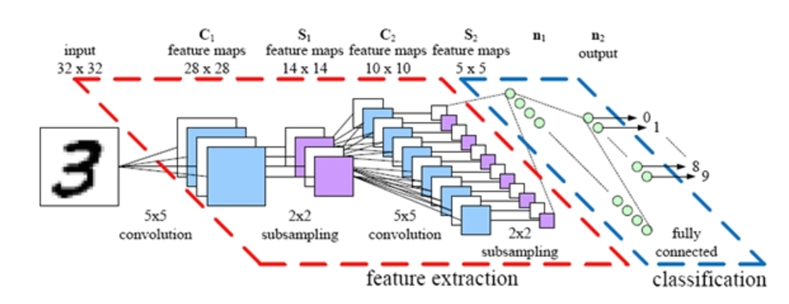

- convolutional layer, ReLU, Pool를 반복하다가 
  마지막에 fully connected neural networks를 적용한 방법
- 7X7 image가 있다고 해보자. 3X3 filter를 이용하여 convolution layer를 제작해보자.
  3X3 filter가 7X7 image를 움직이는 칸수를 stride라고 한다. filtering하고 난 후
  image는 5X5가 된다. (N-F)/stride + 1 => (7-3)/1+1 = 5
- 만약 filter를 6개 적용했다면 convolutional layer는 5X5X6이 된다.
- pooling은 sampling과 유사하다. 4X4크기의 image를 2X2크기의 filter로 stride는 2크기로
  필터링 하자. 결과는 2X2 크기의 image이다. (N-F)/stride + 1 => (4-2)/2+1 = 2. 
  이때 최종 pixel은 가장 큰 값을 선택한다. 그래서 max pooling이라고 한다.
- [이곳](http://cs.stanford.edu/people/karpathy/convnetjs/demo/cifar10.html)을
  참고하면 CIFAR-10 dataset을 이용한 CNN의 과정을 시각화하여 구경할 수 있다.
- LeCun 교수의 mnist문제는 32X32 image를 CNN한다.
- AlexNet는 227X227 image를 CNN한다.
  - first use of ReLU
  - used Norm Layers (지금은 잘 사용하지 않는다.)
  - heavy data augmentation
  - dropout 0.5
  - batch size 128
  - SGD Momentum 0.9
  - Learning rate 1e-2, reduced by 10
    manually when val accuracy plateaus
  - L2 weight decay 5e-4
  - 7 CNN ensemble: 18.2% -> 15.4%
- GoogLeNet는 [ILSVRC (ImageNet Large Scale Visual Recognition Challenge)](http://www.image-net.org/)에서 2014년에 우승했다.
- ResNet는 [ILSVRC (ImageNet Large Scale Visual Recognition Challenge)](http://www.image-net.org/)에서 2015년에 우승했다. 224X224X3
  image를 fast forward를 이용하여 CNN하였다. fast forward가 왜 잘되는지는
  아직 명확하게 밝혀 지지 않았다.
- 2014년 Yoon Kim은 Convolutional Neural Networks for Sentence Classification을 
  발표한다.
- DeepMind의 AlphaGo역시 CNN을 이용하였다.


## RNN (recurrent networks)

- ...

## RL (reinforcement learning)

- ...

## NLP (natural language processing)

- ...

## GAN (generative adversarial network)

# reference

- [itex2img](http://www.sciweavers.org/free-online-latex-equation-editor)
  - github markdown에서 수식을 입력할때 사용하자.
- [tflearn](https://github.com/tflearn/tflearn)
  - tensorflow wrapper
- [prettytensor](https://github.com/google/prettytensor)
  - tensorflow wrapper
