- [Abstract](#abstract)
- [Essentials](#essentials)
- [Materials](#materials)
- [Supervised Learning](#supervised-learning)
- [Unsupervised Learning](#unsupervised-learning)
- [Semisupervised Learning](#semisupervised-learning)
- [Reinforcement Learning](#reinforcement-learning)
- [Linear regression with one variable](#linear-regression-with-one-variable)
- [Linear regression with multiple variables](#linear-regression-with-multiple-variables)
- [Logistic Regression (binary classification)](#logistic-regression-binary-classification)
- [Example: Titanic](#example-titanic)
- [Softmax Regression (multinomial classification)](#softmax-regression-multinomial-classification)
- [Machine Learning Tips](#machine-learning-tips)
- [Example: Digit Recognizer](#example-digit-recognizer)
- [Deep Learning Fundamentals](#deep-learning-fundamentals)
- [NN (Neural Networks)](#nn-neural-networks)
- [CNN (Convolutional Neural Networks)](#cnn-convolutional-neural-networks)
- [RNN (Recurrent Neural Networks)](#rnn-recurrent-neural-networks)
- [RL (Reinforcement Learning)](#rl-reinforcement-learning)
- [GAN (Generative Adversarial Network)](#gan-generative-adversarial-network)
- [NLP (Natural Language Processing)](#nlp-natural-language-processing)
- [Transformers](#transformers)
- [Glossory](#glossory)
- [References](#references)

-----

# Abstract

> * [Machine Learning a Probabilistic Perspective by Kevin Murphy](machine_learning_a_probabilistic_perspective.md)
> * [Machine Learning Glossary](mlglossary.md)

- machine learning 이란 다량의 데이터를 이용하여 학습하고 예측하는 것에 대한
  학문이다. 예를 들어서 machine learning 을 이용하면 다음과 같은 것을 할 수
  있다. 학생들의 등교시간과 성적에 관한 데이터를 이용하여 새로 전학온 학생의
  등교시간을 입력하면 성적을 예상 할 수 있다.
- machine learning 은 회귀분석, 다변량분석, 군집분석, 확률분포 추정, 마르코프,
  은닉마르토크 모델, 서포트 벡터 머신, 베이즈의법칙, 베이즈 확률론, 베이지언
  통계등등 통계학에서 많은 부분들이 인용되었다. 
- machine learning 의 종류는 크게 supervised learning, unsupervised learning
  semisupervised learning, reinforcement learning 으로 분류할 수 있다. 다음은
  위키피디아가 분류한 것들이다. supervised learning, clustering, dimensionality
  reduction, structured prediction, anomaly detenction, neural nets,
  reinforcement learning
- deep learning 은 한개이상의 hidden layer 가 존재하는 neural networks 를 다루는
  학문이다. deep 의 의미는 hidden layer 가 많아지면 점점 깊어진다는 의미이다.
- 다음과 같은 용어들을 중심으로 공부해본다. linear regression with one variable,
  hypothesis function, weight, bias, feature loss, gradiant decent algorithm,
  epoch, cost function, MSE (mean squared error), derivative, linear regression
  with multiple variables, logistic regression, regularization, softmax
  regression (multinomial regression), overfitting, cross entropy, NN (Neural
  Networks), drop out, activation function, sigmoid, ReLU, learning rate,
  forward propagation, back propagation, CNN (Convolutional Neural Networks),
  RNN (Recurrent Neural Networks)

# Essentials

- [Understanding Deep Learning](https://udlbook.github.io/udlbook/)
- [데이터 사이언스 스쿨](https://datascienceschool.net/intro.html)
- [공돌이의 수학정리노트 (Angelo's Math Notes)](https://angeloyeo.github.io/)
- [math for machine learning](https://mml-book.github.io/)
  - 머신러닝을 위한 수학
- ["Probabilistic machine learning": a book series by Kevin Murphy](https://github.com/probml/pml-book)
  - ["Machine Learning: A Probabilistic Perspective" (2012)](https://probml.github.io/pml-book/book0.html)
  - ["Probabilistic Machine Learning: An Introduction" (2022)](https://probml.github.io/pml-book/book1.html)
  - ["Probabilistic Machine Learning: Advanced Topics" (2023)](https://probml.github.io/pml-book/book2.html)
- [CS231n: Convolutional Neural Networks for Visual Recognition](http://cs231n.stanford.edu/syllabus.html)
  - 화상인식을 위한 CNN
- [CS224d: Deep Learning for Natural Language Processing](http://web.stanford.edu/class/cs224n/)
  - 자연어처리를 위한 Deep Learning
- [101가지 문제로 배우는 딥러닝 허깅페이스 트랜스포머 with 파이토치](https://www.yes24.com/Product/Goods/121144395)
  - [src](https://github.com/jasonyim2/book3)
- [모두를 위한 머신러닝/딥러닝 강의](http://hunkim.github.io/ml/)
  - [src](https://github.com/hunkim/DeepLearningZeroToAll)
- [ML-For-Beginners](https://github.com/microsoft/ML-For-Beginners)
  - microsoft ml for beginners
- [Machine Learning Glossary](https://developers.google.com/machine-learning/glossary)
- [Designing Machine Learning Systems (Chip Huyen 2022)](https://www.amazon.com/Designing-Machine-Learning-Systems-Production-Ready/dp/1098107969)
  - [src](https://github.com/chiphuyen/dmls-book)
  - Can learn Machine Learning Jargons.
- [Practical Deep Learning for Coders](https://course.fast.ai/)
  - [Colab links](https://course.fast.ai/Resources/book.html)
  - [Forumn links](https://forums.fast.ai/t/lesson-1-official-topic/95287)
- [모두를 위한 머신러닝/딥러닝 시즌 2](https://deeplearningzerotoall.github.io/season2/)
  - [tensorflow](https://deeplearningzerotoall.github.io/season2/lec_tensorflow.html)
  - [pytorch](https://deeplearningzerotoall.github.io/season2/lec_pytorch.html)
  - [src](https://github.com/deeplearningzerotoall/PyTorch)
- [(2018) 인공지능 및 기계학습 개론Ⅰ | edwith](https://kaist.edwith.org/machinelearning1_17)
  - 카이스트 산업공학과 문일철 교수 강의
- [(2018) 인공지능 및 기계학습 개론ⅠI | edwith](https://kaist.edwith.org/machinelearning2__17)
  - 카이스트 산업공학과 문일철 교수 강의
- [(2018) 인공지능 및 기계학습 심화 | edwith](https://kaist.edwith.org/aiml-adv)
  - 카이스트 산업공학과 문일철 교수 강의
- [최신 논문으로 시작하는 딥러닝](http://www.edwith.org/deeplearningchoi/joinLectures/10979)
  - 최성준님의 강좌. 모두를 위한 머신러닝을 클리어 하고 학습하면 좋다.
  - [src](https://github.com/sjchoi86/dl_tutorials_10weeks)
- [머신러닝 단기집중과정 | google](https://developers.google.com/machine-learning/crash-course/prereqs-and-prework?hl=ko)
- [cs229, cs230, cme102, cme106 cheatsheets](https://stanford.edu/~shervine/teaching.html)
  - machine learning, deep learning, probability, statistics cheatsheets
- [골빈해커의 3분 딥러닝](http://www.yes24.com/24/goods/49853812?scode=032&OzSrank=1)
  - [src](https://github.com/golbin/TensorFlow-Tutorials)
- [PR12 딥러닝 논문읽기 모임 season-1 @ youtube](https://m.youtube.com/watch?v=auKdde7Anr8&list=PLWKf9beHi3Tg50UoyTe6rIm20sVQOH1br)
  - 딥러닝 논문읽기 모임 동영상 시즌 1
- [PR12 딥러닝 논문읽기 모임 season-2 @ youtube](https://www.youtube.com/watch?v=FfBp6xJqZVA&list=PLWKf9beHi3TgstcIn8K6dI_85_ppAxzB8&fbclid=IwAR2P2XP1dWIRhJtExFQ2t6ZxkRNyiFpnmI9749cEoU6OSjr67nCvggBP-5Y)
  - 딥러닝 논문읽기 모임 동영상 시즌 2
- [Hands-On Machine Learning with Scikit-Learn and TensorFlow](http://www.hanbit.co.kr/store/books/look.php?p_code=B9267655530)
  - [src](https://github.com/rickiepark/handson-ml)
- [100+ Basic Machine Learning Interview Questions and Answers](https://theprofessionalspoint.blogspot.com/2019/01/100-basic-machine-learning-interview.html?m=1&fbclid=IwAR3VAZ_58yR5A7F2-YiYFdiV5bW2gwkz_aE8WnxbzZ6RHUZ7FvANj4l893I)
  - machine learning 인터뷰 퀴즈 모음

# Materials

- [deep learning by Ian goodfellow](http://www.deeplearningbook.org/)
  - 기초수학부터 차근차근 deep learning에 대해 설명한다. 공짜
- [Large-scale LM에 대한 얕고 넓은 지식들 (part 1) | youtube](https://www.youtube.com/watch?v=w4a-ARCEiqU)
  - [Large-scale LM에 대한 얕고 넓은 지식들(part 2) | youtube](https://www.youtube.com/watch?v=zbuD21YwLZI)
  - [ppt | github](https://github.com/jiphyeonjeon/season2/tree/main/advanced)
- [모두를 위한 컨벡스 최적화 (Convex Optimization For All)](https://wikidocs.net/book/1896)
  - 최적화 문제를 정리한 책 
- [paper with code](https://paperswithcode.com/)
  - 논문과 구현
- [machine learning at coursera](https://www.coursera.org/learn/machine-learning)
  - andrew Ng교수의 machine learning강좌
  - 영문이지만 기초를 공부할 수 있다.
- [machine learning note](http://www.holehouse.org/mlclass/)
  - andrew Ng교수의 machine learning강좌 노트
- [deep learning tutorial](http://deeplearning.stanford.edu/tutorial/)
  - standford 대학의 tutorial이다. 코드와 텍스트가 가득하다.
- [Andrej Karpathy's Youtube channel](https://www.youtube.com/channel/UCPk8m_r6fkUSYmvgCBwq-sw)
- [Deep learning @ Udacity](https://www.udacity.com/course/viewer#!/c-ud730/l-6370362152/m-6379811817)
- [Google AI course](https://ai.google/education)
  - 구글의 AI 코스웨어
- [인공지능 - 이건명](http://www.kocw.net/home/search/kemView.do?kemId=1170523)
  - 인공지능의 기본 개념을 살펴보고, 탐색과 최적화 기법, 지식표현의
    다양한 방법과 추론 기법, 딥러닝을 비롯한 기계학습 방법, 계획수립
    방법을 다룬다.
- [2013 2학기 선형대수 - 이상화](https://www.youtube.com/playlist?list=PLSN_PltQeOyjDGSghAf92VhdMBeaLZWR3)
- [확률및통계 - 이상화](http://www.kocw.net/home/search/kemView.do?kemId=1056974)
- [artificial intelligence: a modern approach by stuart russel, peter norvig](http://aima.cs.berkeley.edu/)
  - peter norvig의 교과서.
  - [한글](http://www.aladin.co.kr/shop/wproduct.aspx?ItemId=76161975)책도
    있다. 류광이 번역했기 때문에 읽어보자.
- [PyTorch로 시작하는 딥러닝 입문 CAMP @ github](https://github.com/GunhoChoi/PyTorch-FastCampus)
  - fastcampus 유료 강좌의 강의 자료
- [google ai experiments](https://experiments.withgoogle.com/ai)
  - 구글의 AI실험
- [deep learning papers @ github](https://github.com/sbrugman/deep-learning-papers)
  - 딥러닝 논문들을 task와 date별로 정리
- [awesome deep learning papers @ github](https://github.com/terryum/awesome-deep-learning-papers)
  - 테리의 딥러닝 논문 추천
- [tensorflow](https://www.tensorflow.org)
- [TensorFlow Tutorials (Simple Examples)](https://github.com/nlintz/TensorFlow-Tutorials)
- [Another TensorFlow Tutorials](https://github.com/pkmital/tensorflow_tutorials)
- [TensorFlow Examples](https://github.com/aymericdamien/TensorFlow-Examples)
- [개인적으로 써보는 머신러닝 공부 테크트리입니다 | clien](https://www.clien.net/service/board/cm_ai/18068521)

# Supervised Learning

- supervised learning 은 이미 x 는 y 라는 결론이 도출된 데이터를 이용하여
  학습시키는 것이다. 이미 결론이 도출된 데이터이기 때문에 데이터의 정확성은
  높지만 이러한 데이터를 사람이 산출해야 한다.
- supervised learning 의 종류는 classification(분류), regression(회귀)이 있다. 
- data 는 discrete(이산적인) 혹은 continuous(연속적인) 이라고 할 수 있다.
  descrete 한 경우는 값이 연속적으로 분포하지 않는다는 말이다. 그 외의 경우는
  continuous 하다고 할 수 있다. 예를 들어 개는 그냥 개다. 따라서 동물의 이름은
  discrete 하다고 할 수 있다. 사람의 키는 170, 170.1 등등 무수히 많다.
  continuous 하다고 할 수 있다.
- classification(분류) Model 은 입력 데이터 x 와 출력 데이터 y 가 있을때 y 가
  discrete 한 Model 을 말한다. 예를 들어 동물의 사진을 주고 어떤 동물인지
  예측하는 모델이 해당된다.
- regression(회귀) Model 은 입력 데이터 x 와 출력 데이터 y 가 있을때 y 가
  continuous 한 Model 을 말한다. 예를 들어 예를 들어 사람의 키, 몸무게를 주고
  허리둘레를 예측하는 모델이 해당된다.
- classification Model 을 만들기 위한 기법들로 logistic regression, KNN (k
  nearest neighbors), SVM (support vector machines), decision tree 등이 있다.
- regression Model 을 해결하기 위한 기법들로 통계학의 회귀분석 방법중 linear
  regression 등이 있다.

# Unsupervised Learning

- unsupervised learning은 결론이 도출되지 않은 x 데이터를 이용하여 학습시키는 것이다.
  현실 세계의 대부분의 데이터는 결론이 도출되지 않았다.
- unsupervised learning의 종류는 clustering (군집화),
  underlying probability density estimation (분포추정) 등이 있다.

# Semisupervised Learning

- 다수의 결론이 도출되지 않은 데이터와 약간의 결론이 도출된 데이터를 이용하여 학습시키는 것이다.

# Reinforcement Learning

- supervised learning과 unsupervised learning는 사람이 학습을 지도 하느냐
  마느냐와 관련이 되어 있지만 reinforcement learning은 조금 다르다.
- 현재의 state (상태)에서 어떤 action (행동)을 취한 것이 최적인지 학습하는 것이다.
  action을 취할때 마다 외부 환경에서 reward (보상)이 주어진다. reward를 최대화
  하는 방향으로 학습이 진행된다.

# Linear regression with one variable

- 한개의 독립변수 `x` 와 한개의 종속변수 `y` 를 이용하여 데이터를 분석하고
  예측하는 것. 이때 통계적 가설에 해당하는 데이터의 일정한 패턴은 일차함수로
  표현할 수 있다. 일차함수이기 때문에 선형회귀라고 한다.
- linear regression의 hypothesis function은 일차 함수이기 때문에
  다음과 같이 표현 가능 하다.

  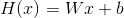

  ```
  H(x) = Wx + b
  ```

- 여러가지 `H(x)` 가 존재할 수 있다. 여러가지 가설이 존재할 수 있다는 말이다.
  데이터값 `y` 와 예측값 `H(x)` 를 비교해서 흩어짐의 정도가 가장 작은 `H(x)` 가
  훌륭한 `H(x)` 라고 할만 하다. 이때 흩어짐의 정도를 측정하는 함수를 cost
  function 이라고 한다.  cost function 은 `W (weight)` 와 `b (bias)` 를 인자로
  갖는 함수라고 할 수 있다. 곧 linear regression 은 `W` 와 `b` 를 어떻게 정해서
  `cost(W, b)` 의 값을 최소로하는 `H(x)` 를 구하는 행위이다.

    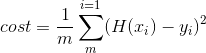

    ```latex
    cost(W, b) = \frac{1}{m} \sum_{m}^{i=1} (H(x_{i})-y_{i})^{2}
    ```

- `cost(W, b)` 를 최소로 하는 `W, b` 를 찾기 위해 gradient descent algorithm 을
  사용한다. gradient descent algorithm 은 여러가지 `W, b` 를 설정해 보고
  training data 를 이용하여 가장 최소의 `cost(W, b)` 를 갖는 `W, b` 를 찾는다.

- 계산의 편의를 위해 `b` 를 생략한 `cost(W)` 를 고민해보자. 이것은 `W` 를 `x` 축으로 하고 포물선을 그리는 이차함수이다.  가장 볼록한 부분의 `W` 값이 `cost(W)` 를 최소화 할 것이다. `cost(W)` 를 `W` 에 관하여 미분하고 기울기가 가장 적은 `cost(W)` 를 찾으면 된다. 
  
- 기본적인 linear regression 을 tensorflow 를 이용하여 구현해보자.  `W, b, hypothesis, train` 은 모두 node 이다. `sess.run` 의 `run` 은 eval 과 같다. 인자로 넘겨진 node 를 eval 해달라는 의미이다. `sess.run(cost)` 는 cost node 를 eval 한 결과를 리턴한다.

    ```python
    import tensorflow as tf

    def main():
        tf.set_random_seed(111)
        l_X = [1, 2, 3]
        l_Y = [1, 2, 3]
        t_W = tf.Variable(tf.random_normal([1]), name='W')
        t_b = tf.Variable(tf.random_normal([1]), name='b')
        t_H = l_X * t_W + t_b
        t_C = tf.reduce_mean(tf.square(t_H - l_Y))
        t_O = tf.train.GradientDescentOptimizer(learning_rate=0.001)
        t_T = t_O.minimize(t_C)
        with tf.Session() as sess:
            sess.run(tf.global_variables_initializer())
            for n_step in range(10000):
                sess.run(t_T)
                if n_step % 20 == 0:
                    f_cost = sess.run(t_C)
                    l_W = sess.run(t_W)
                    l_b = sess.run(t_b)

                    #print("step = {:7d} loss = {:5.3f} W = {:5.3f} b = {:5.3f}".format(step, f_cost, f_W, f_b) )
                    print("{:7d}".format(n_step), "{:10.7f}".format(f_cost), l_W, l_b)

    if __name__ == "__main__":
        main()
    #      0  23.456789 [-0.123456] [0.987654]
    #     20   5.678912 [-0.098765] [0.876543]
    #     40   1.234567 [-0.065432] [0.765432]
    #     60   0.567891 [-0.032109] [0.654321]
    #     80   0.123456 [0.000123] [0.543210]
    #    100   0.012345 [0.032101] [0.432109]
    #    ...
    #   9980   0.000001 [0.999999] [0.000001]        
    ```

- place holder 와 train data 를 이용해서 구현해보자. place holder 는 자리만 예약하고 나중에 값을 대입하겠다는 약속을 한 node이다. 나중에 제공할
  값은 `sess.run` 의 `feed_dict` 인자로 넘겨준다.

    ```python
    import tensorflow as tf
    tf.set_random_seed(111)

    def main():
        l_X = [1., 2., 3.]
        l_Y = [1., 2., 3.]
        t_W = tf.Variable(tf.random_normal([1]), name='W')
        t_b = tf.Variable(tf.random_normal([1]), name='b')
        t_X = tf.placeholder(tf.float32, shape=[None], name='X')
        t_Y = tf.placeholder(tf.float32, shape=[None], name='Y')
        t_H = t_X * t_W + t_b
        t_C = tf.reduce_mean(tf.square(t_H - t_Y))
        t_O = tf.train.GradientDescentOptimizer(learning_rate=0.001)
        t_T = t_O.minimize(t_C)
        with tf.Session() as sess:
            sess.run(tf.global_variables_initializer())
            for n_step in range(10000):
                _, f_cost, l_W, l_b = sess.run([t_T, t_C, t_W, t_b], feed_dict={t_X: l_X, t_Y: l_Y})
                if n_step % 20 == 0:
                    print(f"{n_step:10d} {f_cost:10.7f}", l_W, l_b)
            print(sess.run(t_H, feed_dict={t_X: [5]}))
            print(sess.run(t_H, feed_dict={t_X: [2.5]}))
            print(sess.run(t_H, feed_dict={t_X: [1.5, 3.5]}))

    if __name__ == "__main__":
        main()

    #         0  25.309484 [-0.29822695] [1.4428021]
    #        20  10.576352 [-0.20837127] [1.5043486]
    #        40   4.424027 [-0.1295286] [1.5467131]
    #        60   1.874506 [-0.06059823] [1.5727892]
    #        80   0.799740 [-0.00013508] [1.5853131]
    #       100   0.347757 [0.05278273] [1.5868627]
    #       ...
    #      9980   0.000001 [0.99996126] [0.00008093]
    #[5.0006747]
    #[2.500365]
    #[1.5002851 3.500445]
    ```

- gradient descent algorithm 은 어떻게 해서 최소의 `W, b` 를 찾아내는지 살펴보자. 먼저 `H(x)` 와 `cost(W)` 다음과 같이 정의하자.
  


- `cost(W)` 를 최소화될때까지 `W` 를 업데트해야 한다. 다음과 같이 새로운 `W` 는 현재의 `W` 에서 `α(learning rate)` 와 `cost(W)` 를 `W` 에 관하여 미분한 것을 곱한 값을 빼서 얻는다. `cost(W)` 는 미분을 쉽게 하기 위해 다음과 같이 `1/2` 를 곱한다. 원래의 것을 미분하는 것이나 `1/2` 를 곱하고 미분하는 것이나 동일하다. `α(learning rate)` 와 `cost(W)` 를 `W` 에 관하여 미분한 것은 한번은 양이되고 한번은 음이 되는 식으로 반복할 것이다. learning rate 을 잘 설정해야 새로운 `W` 를 쉽게 찾아 갈 수 있다.

    ```latex
    \begin{align*}
    & cost(W, b) = \frac{1}{2m} \sum_{m}^{i=1} (H(x_{i})-y_{i})^{2} \\
    & W := W - \alpha \frac{\partial}{\partial W} cost(W) \\
    & W := W - \alpha \frac{\partial}{\partial W} \frac{1}{2m} \sum_{m}^{i=1} (Wx_{i}-y_{i})^{2} \\
    & W := W - \alpha \frac{1}{2m} \sum_{m}^{i=1} 2(Wx_{i}-y_{i})x_{i} \\
    & W := W - \alpha \frac{1}{m} \sum_{m}^{i=1} (Wx_{i}-y_{i})x_{i} \\
    \end{align*}
    ```

    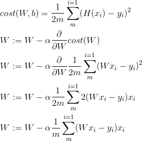

- 앞서 언급한 것 처럼 x 축을 `W`, y 축을 `cost(W)` 로 하는 그래프를 그려 보자.

    ```python
    import tensorflow as tf
    import matplotlib.pyplot as plt
    tf.set_random_seed(111)

    def main():
        l_X = [1, 2, 3]
        l_Y = [1, 2, 3]
        t_W = tf.placeholder(tf.float32)
        t_H = t_W * l_X
        t_C = tf.reduce_mean(tf.square(t_H - l_Y))

        with tf.Session() as sess:
            l_W_history = []
            l_C_history = []
            for i in range(-30, 50):
                f_W = i * 0.1
                f_C = sess.run(t_C, feed_dict={t_W: f_W})
                l_W_history.append(f_W)
                l_C_history.append(f_C)
            plt.plot(l_W_history, l_C_history)
            plt.show()

    if __name__ == "__main__":
        main()
    ```

    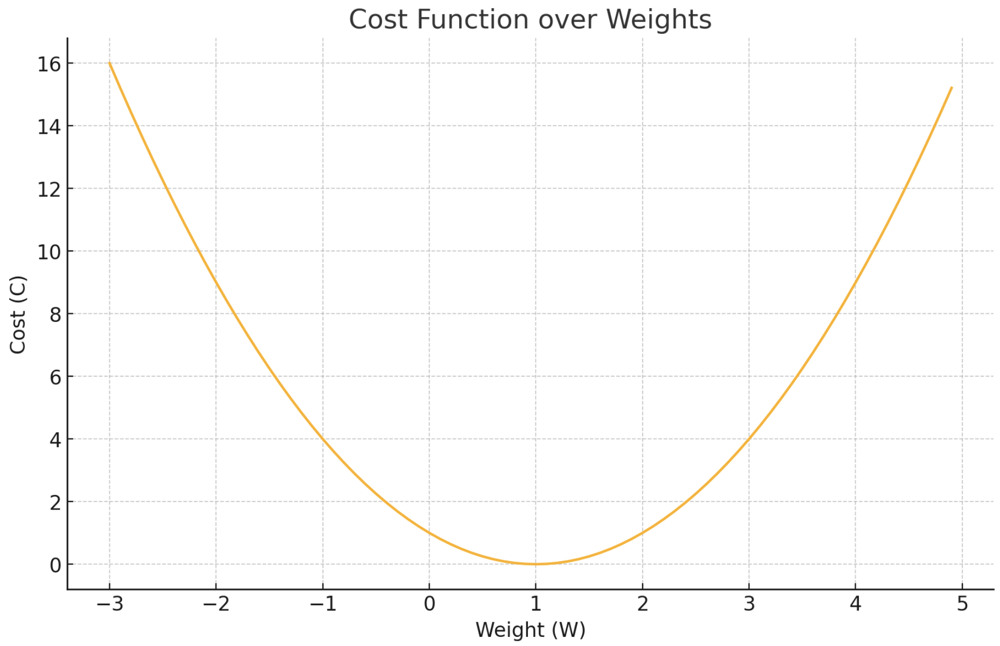

- gradient descent algorithm 을 직접 구현해서 `cost(W)` 를 최소화 하는 `W` 를 찾아 보자.

    ```python
    import tensorflow as tf
    tf.set_random_seed(111)

    def main():
        l_X = [1, 2, 3]
        l_Y = [1, 2, 3]
        t_W = tf.Variable(tf.random_normal([1]), name='W')
        t_X = tf.placeholder(tf.float32)
        t_Y = tf.placeholder(tf.float32)
        t_H = t_W * t_X
        t_C = tf.reduce_mean(tf.square(t_H - t_Y))

        f_learning_rate = 0.01
        t_G = tf.reduce_mean((t_W * t_X - t_Y) * t_X)  # gradient, dL/dW
        t_D = t_W - f_learning_rate * t_G              # descent
        t_U = t_W.assign(t_D)                          # update

        with tf.Session() as sess:
            sess.run(tf.global_variables_initializer())
            for n_step in range(101):
                _, f_C = sess.run([t_U, t_C], feed_dict={t_X: l_X, t_Y: l_Y})
                l_W = sess.run(t_W)
                print(f'{n_step:10d} {f_C:10.7f}', l_W)

    if __name__ == '__main__':
        main()
    #         0  14.266036 [1.2364635]
    #         1  12.995599 [1.166249]
    #         2  11.851914 [1.1021035]
    #         3  10.825458 [1.043594]
    #         4   9.906724 [0.9903306]
    #         5   9.086247 [0.9419609]
    #         6   8.354599 [0.89816594]
    #         7   7.702369 [0.85865784]
    #         8   7.120121 [0.8231761]
    #         9   6.598377 [0.79148406]
    #        10   6.128599 [0.7633618]
    #        ...
    #       100   0.001234 [0.9812345]
    ```

- `GradientDescentOptimizer` 를 활용하여 gradient descent algorithm 을 쉽게 구현할 수 있다.
  
    ```python
    import tensorflow as tf
    tf.set_random_seed(111)

    def main():
        l_X = [1., 2., 3.]
        l_Y = [1., 2., 3.]
        t_W = tf.Variable(tf.random_normal([1]), name='W')
        t_b = tf.Variable(tf.random_normal([1]), name='b')
        t_X = tf.placeholder(tf.float32, shape=[None], name='X')
        t_Y = tf.placeholder(tf.float32, shape=[None], name='Y')
        t_H = t_X * t_W + t_b
        t_C = tf.reduce_mean(tf.square(t_H - t_Y))
        t_O = tf.train.GradientDescentOptimizer(learning_rate=0.01)
        t_T = t_O.minimize(t_C)
        with tf.Session() as sess:
            sess.run(tf.global_variables_initializer())
            for n_step in range(101):
                _, f_cost, l_W, l_b = sess.run([t_T, t_C, t_W, t_b], feed_dict={t_X: l_X, t_Y: l_Y})
                if n_step % 20 == 0:
                    print(f"{n_step:10d} {f_cost:10.7f}", l_W, l_b)
            print(sess.run(t_H, feed_dict={t_X: [5]}))
            print(sess.run(t_H, feed_dict={t_X: [2.5]}))
            print(sess.run(t_H, feed_dict={t_X: [1.5, 3.5]}))

    if __name__ == "__main__":
        main()
    #         0  16.393167 [-0.38222593] [0.38044655]
    #        20   0.044961 [1.0124897] [0.01455069]
    #        40   0.000123 [1.0026814] [0.00205196]
    #        60   0.000001 [1.0005766] [0.00028267]
    #        80   0.000000 [1.0001241] [0.00003901]
    #       100   0.000000 [1.0000267] [0.00000539]
    #[5.0001383]
    #[2.5000725]
    #[1.5000501 3.5000918]
    ```

- gradient descent algorithm 을 직접 구현한 것과 `GradientDescentOptimizer` 를 활용한 것의 결과는 동일하다. `gvs` 를 보정하면 custom gradient descent 값을 이용 할 수 있다.
  
    ```python
    import tensorflow as tf

    def main():
        tf.set_random_seed(111)
        l_X = [1, 2, 3]
        l_Y = [1, 2, 3]
        t_X = tf.placeholder(tf.float32)
        t_Y = tf.placeholder(tf.float32)
        t_W = tf.Variable(tf.random_normal([1]), name='W')
        t_b = tf.Variable(tf.random_normal([1]), name='b')
        t_H = l_X * t_W + t_b
        t_G = tf.reduce_mean((t_W * t_X - t_Y) * t_X) * 2
        t_C = tf.reduce_mean(tf.square(t_H - l_Y))
        t_O = tf.train.GradientDescentOptimizer(learning_rate=0.1)
        t_T = t_O.minimize(t_C)
        t_GVS = t_O.compute_gradients(t_C, [t_W])
        t_apply_gradients = t_O.apply_gradients(t_GVS)
        with tf.Session() as sess:
            sess.run(tf.global_variables_initializer())
            for n_step in range(100):
                l_fetch = sess.run([t_G, t_W, t_GVS], feed_dict={t_X: l_X, t_Y: l_Y})
                print("{:7d}".format(n_step), l_fetch)

    if __name__ == "__main__":
        main()
    # 각 출력은 스텝 번호, 계산된 그라디언트, 현재 가중치, 그리고 그라디언트-변수 쌍을 보여줍니다.
    #      0 [-24.426001, array([-0.29879618], dtype=float32), [(-4.0984364, array([-0.29879618], dtype=float32))]]
    #      1 [-21.978001, array([-0.29879618], dtype=float32), [(-3.703719, array([-0.29879618], dtype=float32))]]
    #      2 [-19.710001, array([-0.29879618], dtype=float32), [(-3.3690925, array([-0.29879618], dtype=float32))]]
    #      3 [-17.616001, array([-0.29879618], dtype=float32), [(-3.0855052, array([-0.29879618], dtype=float32))]]
    #      4 [-15.690001, array([-0.29879618], dtype=float32), [(-2.8456755, array([-0.29879618], dtype=float32))]]
    #      5 [-13.926001, array([-0.29879618], dtype=float32), [(-2.6431358, array([-0.29879618], dtype=float32))]]
    #      6 [-12.318001, array([-0.29879618], dtype=float32), [(-2.472154, array([-0.29879618], dtype=float32))]]
    #      7 [-10.860001, array([-0.29879618], dtype=float32), [(-2.3276281, array([-0.29879618], dtype=float32))]]
    #      8 [ -9.546001, array([-0.29879618], dtype=float32), [(-2.2049742, array([-0.29879618], dtype=float32))]]
    #      9 [ -8.370001, array([-0.29879618], dtype=float32), [(-2.1000667, array([-0.29879618], dtype=float32))]]
    #     10 [ -7.326001, array([-0.29879618], dtype=float32), [(-2.0092123, array([-0.29879618], dtype=float32))]]
    #     ...
    ```

# Linear regression with multiple variables

- 만약 feature 가 `x1, x2, x3` 와 같이 세가지 일때 hypothesis 와 `cost(W, b)` 는 다음과 같다.

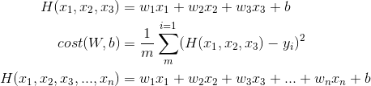
  
```latex
\begin{align*}
H(x_{1}, x_{2}, x_{3}) &= w_{1}x_{1} + w_{2}x_{2} + w_{3}x_{3} + b \\
cost(W, b) &= \frac{1}{m} \sum_{m}^{i=1} (H(x_{1}, x_{2}, x_{3}) - y_{i})^{2} \\
H(x_{1}, x_{2}, x_{3}, ..., x_{n}) &= w_{1}x_{1} + w_{2}x_{2} + w_{3}x_{3} + ... + w_{n}x_{n} + b \\
\end{align*}
```

- feature가 여러개인 경우 matrix 를 이용하여 계산 할 수 있다. matrix 를 이용한다는 것은 여러개의 데이터를 pararrel 하게 처리할 수 있다는 의미이다. 위와 같이 feature 가 `x1, x2, x3` 인 경우 다음과 같은 형태의 행렬 연산을 이용하여 hypothesis 를 구할 수 있다. 이때 `X` 행렬의 형태는 `data instance x feature count`, `W` 행렬의 형태는 `feature count x output count` 이고 `H(X)` 의 행렬은 `data instance x output count` 이다. 예를 들어서 `feature` 가 `x1, x2, x3` 이고 output 이 `y` 인 경우 `X` 행렬의 형태는 `1 x 3`, `W` 행렬의 형태는 `3 x 1` 이고 `H(X)` 행렬의 형태는 `1 x 1` 이다.  만약 데이터의 개수가 `5` 개라면 `X` 행렬의 형태는 `5 x 3`, `W` 행렬의 형태는 `3 x 1` 이고 `H(X)` 행렬의 형태는 `5 x 1` 이다. 데이터의 개수가 `5` 개, feature 가 `x1, x2, x3` 와 같이 세개이고 output 이 `y1, y2` 와 같이 두개라고 해보자. 이때 `X` 의 행렬의 형태는 `5 x 3`, `W` 행렬의 형태는 `3 x 2`, `H(X)` 행렬의 형태는 `5 x 2` 가 된다.

    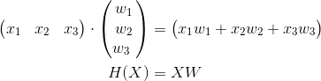

    ```latex
    \begin{align*}
    \begin{pmatrix}
    x_1&x_2&x_3
    \end{pmatrix}

    \cdot
    \begin{pmatrix}
    w_1\\
    w_2\\
    w_3\
    \end{pmatrix}
    &=
    \begin{pmatrix}
    x_1w_1+x_2w_2+x_3w_3
    \end{pmatrix} \\
    H(X) &= X W
    \end{align*}
    ```

- feature 가 여러개일때 linear regression 을 구현해보자.

    ```python
    import tensorflow as tf
    tf.set_random_seed(111)

    def main():
        l_X1 = [73., 93., 89., 96., 73.]
        l_X2 = [80., 88., 91., 98., 66.]
        l_X3 = [75., 93., 90., 100., 70.]
        l_Y  = [152., 185., 180., 196., 142.]
        t_X1 = tf.placeholder(tf.float32)
        t_X2 = tf.placeholder(tf.float32)
        t_X3 = tf.placeholder(tf.float32)
        t_Y  = tf.placeholder(tf.float32)
        t_W1 = tf.Variable(tf.random_normal([1]), name='W1')
        t_W2 = tf.Variable(tf.random_normal([1]), name='W2')
        t_W3 = tf.Variable(tf.random_normal([1]), name='W3')
        t_b  = tf.Variable(tf.random_normal([1]), name='b')
        t_H  = t_W1 * t_X1 + t_W2 * t_X2 + t_W3 * t_X3 + t_b
        print(t_H)

        t_C  = tf.reduce_mean(tf.square(t_H - t_Y))
        t_O  = tf.train.GradientDescentOptimizer(learning_rate=1e-5)
        t_T  = t_O.minimize(t_C)

        with tf.Session() as sess:
            sess.run(tf.global_variables_initializer())
            for n_step in range(2001):
                f_C, f_H, _ = sess.run([t_C, t_H, t_T], 
                                feed_dict={t_X1: l_X1,
                                t_X2: l_X2,
                                t_X3: l_X3,
                                t_Y: l_Y})
                if n_step % 10 == 0:
                    print(f'{n_step:10d} cost: {f_C:10.7f}', f_H)

    if __name__ == '__main__':
        main()
    #         0 cost: 20939.529296 [ -72.78556   -83.00722   -78.43663   -86.313995  -63.780556]
    #        10 cost:  4194.317871 [ 92.625275 111.02605  107.13855  118.24834   87.413086]
    #        20 cost:  4161.946777 [ 92.80521  111.22988  107.33516  118.465904  87.493225]
    #        30 cost:  4130.174805 [ 92.98499  111.433395 107.53151  118.68322   87.57248 ]
    #        40 cost:  4098.992188 [ 93.1646   111.63666  107.72759  118.90028   87.65136 ]
    #        50 cost:  4068.389648 [ 93.34403  111.83968  107.9234   119.117096  87.72986 ]
    #        60 cost:  4038.357666 [ 93.52329  112.04245  108.11895  119.33368   87.807976]
    #        70 cost:  4008.886719 [ 93.70237  112.24498  108.31423  119.55002   87.88572 ]
    #        80 cost:  3979.967285 [ 93.88128  112.447266 108.50924  119.76612   87.96309 ]
    #        90 cost:  3951.590332 [ 94.06001  112.6493   108.70398  119.98198   88.040085]
    #       100 cost:  3923.746582 [ 94.238564 112.85109  108.89846  120.19759   88.116714]
    #        ...
    #      2000 cost:    2.927664 [149.67827 184.10825 179.4521  196.66713 143.62607]
    ```

- feature 가 여러개일때 행렬 연산을 이용하여 linear regression 을 구현해보자. 행렬을 이용하면 코드가 조금 더 깔끔해 진다.

    ```python
    # -*- coding: utf-8 -*-
    import tensorflow as tf
    tf.set_random_seed(111)

    def main():
        # set data
        l_X = [[73., 80., 75.],
            [93., 88., 93.],
            [89., 91., 90.],
            [96., 98., 100.],
            [73., 66., 70.]]
        l_Y = [[152.],
            [185.],
            [180.],
            [196.],
            [142.]]
        # set nodes
        t_X = tf.placeholder(tf.float32, shape=[None, 3])
        t_Y = tf.placeholder(tf.float32, shape=[None, 1])
        t_W = tf.Variable(tf.random_normal([3, 1]), name='W')
        t_b = tf.Variable(tf.random_normal([1]), name='B')
        t_H = tf.matmul(t_X, t_W) + t_b
        t_C = tf.reduce_mean(tf.square(t_H - t_Y))

        # set train node
        t_O = tf.train.GradientDescentOptimizer(learning_rate=1e-5)
        t_T = t_O.minimize(t_C)

        # train node
        with tf.Session() as sess:
            sess.run(tf.global_variables_initializer())
            for n_step in range(8001):
                f_C, l_H, _ = sess.run([t_C, t_H, t_T], feed_dict={t_X: l_X, t_Y: l_Y})
                if n_step % 10 == 0:
                    print(f'{n_step:10d} cost: {f_C:10.7f} pred: ', l_H)

    if __name__ == "__main__":
        main()
    ```

- feature 가 여러 개일때 행렬 연산과 파일입출력을 이용하여 linear regression 을 구현해보자. 현실세계에서 데이터는 주로 파일을 통해 제공된다.

    ```python
    # -*- coding: utf-8 -*-
    import tensorflow as tf
    import numpy as np
    tf.set_random_seed(777)

    def main():
        # set data
        l_XY = np.loadtxt('data-01-test-score.csv', delimiter=',', dtype=np.float32)
        l_X = l_XY[:, 0:-1]
        l_Y = l_XY[:, [-1]]
        print(l_X.shape, l_X, len(l_X))
        print(l_Y.shape, l_Y)
        
        # set nodes
        t_X = tf.placeholder(tf.float32, shape=[None, 3])
        t_Y = tf.placeholder(tf.float32, shape=[None, 1])
        t_W = tf.Variable(tf.random_normal([3, 1]), name='W')
        t_b = tf.Variable(tf.random_normal([1]), name='b')
        t_H = tf.matmul(t_X, t_W) + t_b
        t_C = tf.reduce_mean(tf.square(t_H - t_Y))

        # set train node
        t_O = tf.train.GradientDescentOptimizer(learning_rate=1e-5)
        t_T = t_O.minimize(t_C)

        # train nodes
        with tf.Session() as sess:
            sess.run(tf.global_variables_initializer())
            for n_step in range(2001):
                f_C, l_H, _ = sess.run(
                    [t_C, t_H, t_T], feed_dict={t_X:l_X, t_Y:l_Y})
            if n_step % 10 == 0:
                print(f'{n_step:10d} cost: {f_C:10.7f} pred: ', l_H)

            # Ask my score
            ll_X = [[100, 70, 101]]
            print(ll_X, " will be ", sess.run(t_H, feed_dict={t_X: ll_X}))
            ll_X = [[60, 70, 110], [90, 100, 80]]
            print(ll_X, "will be ", sess.run(t_H, feed_dict={t_X: ll_X}))

    if __name__ == "__main__":
        main()
    #         0 cost:  13261.3955082 pred:  [[-104.52068]
    # [-127.575775]
    # [-126.34028 ]
    # [-139.90392 ]
    # [ -95.29168 ]]
    #        10 cost:  3676.1340332 pred:  [[40.302925]
    # [44.94616 ]
    # [45.250748]
    # [49.336277]
    # [37.33429 ]]
    #        ...
    #      7990 cost:     2.2340529 pred:  [[151.60779]
    # [183.57098]
    # [180.07036]
    # [197.55167]
    # [142.01607]]
    ```

- 데이터의 개수가 많다면 메모리의 제한때문에 파일의 모든 내용을 한번에
  가져올 수 없다. tensorflow 는 다음의 그림과 같이 `x, y` 의 데이터들을
  일정한 크기(배치)씩 가져올 수 있는 기능을 제공한다.

    

    - feature 가 여러개일때 행렬 연산과 `tf.TextLineReader` 를 이용하여 linear regression 을 구현해보자.

    ```python
    # -*- coding: utf-8 -*-
    import tensorflow as tf
    tf.set_random_seed(777)

    def main():
        # set data batch
        filename_queue = tf.train.string_input_producer(
            ['data-01-test-score.csv'], shuffle=False, name='filename_queue')
        reader = tf.TextLineReader()
        key, value = reader.read(filename_queue)
        record_defaults = [[0.], [0.], [0.], [0.]]
        xy = tf.decode_csv(value, record_defaults=record_defaults)
        train_x_batch, train_y_batch = tf.train.batch(
            [xy[0:-1], xy[-1:]], batch_size=10)

        # set nodes
        X = tf.placeholder(tf.float32, shape=[None, 3])
        Y = tf.placeholder(tf.float32, shape=[None, 1])
        W = tf.Variable(tf.random_normal([3, 1]), name='weight')
        b = tf.Variable(tf.random_normal([1]), name='bias')
        hypothesis = tf.matmul(X, W) + b
        cost = tf.reduce_mean(tf.square(hypothesis - Y))

        # set train node
        optimizer = tf.train.GradientDescentOptimizer(learning_rate=1e-5)
        train = optimizer.minimize(cost)

        # train nodes
        sess = tf.Session()
        sess.run(tf.global_variables_initializer())
        # set threads
        coord = tf.train.Coordinator()
        threads = tf.train.start_queue_runners(sess=sess, coord=coord)

        for step in range(2001):
            x_batch, y_batch = sess.run([train_x_batch, train_y_batch])
            cost_val, hy_val, _ = sess.run(
                [cost, hypothesis, train], feed_dict={X: x_batch, Y: y_batch})
            if step % 10 == 0:
                print(step, "Cost: ", cost_val, "\nPrediction:\n", hy_val)
        # join threads
        coord.request_stop()
        coord.join(threads)

        # Ask my score
        print("Your score will be ",
            sess.run(hypothesis, feed_dict={X: [[100, 70, 101]]}))
        print("Other scores will be ",
            sess.run(hypothesis, feed_dict={X: [[60, 70, 110], [90, 100, 80]]}))
        
    if __name__ == "__main__":
        main()
    #0 Cost:  9741.958 Prediction:
    # [[108.86542 ]
    # [125.203606]
    # [123.94814 ]
    # [138.0993  ]
    # [ 97.981125]
    # [ 88.17152 ]
    # [133.04164 ]
    # [115.21579 ]
    # [146.33546 ]
    # [106.57162 ]]
    #...
    #2000 Cost:  19.472040 Prediction:
    # [[146.87881]
    # [188.74034]
    # [179.5091 ]
    # [195.14311]
    # [140.61902]
    # [104.886375]
    # [176.79794]
    # [170.84222]
    # [200.67293]
    # [147.64049]]
    #
    #Your score will be  [[186.77821]]
    #Other scores will be  [[178.12537]
    # [176.0942 ]]
    ```

# Logistic Regression (binary classification)

- `y` 가 `0` 혹은 `1` 과 같이 두개만 존재하는 경우의 회귀분석이다. 예를 들어서 학생이 시험을 통과하기 위해 공부한 시간을 `x1`, 공부한 책의 숫자를 `x2`, 시험통과여부를 `y` 라고 하자. 이때 `y` 값의 후보는 `0, 1` 이고 logistic regression 이라고 할 수 있다. 이 밖에도 스팸인지 햄인지 구별하는 경우, 페이스북 친구의 타임라인을 보여줄 것인지 말 것인지, 신용카드 이용 패턴을 분석해서 내가 사용한 것인지 다른 사람이 도용해서 사용한것인지, 주식투자에서 특정 종목에 대해서 투자를 할 것인지 말 것인지 등등이 해당된다.

- hypothesis function 를 linear regression 처럼 일차 함수로 적용하면 문제가 발생한다. 예를 들어서 앞서 언급한 학생의 시험 통과 결정의 예를 생각해보자. training data 가 `x1` 이 `1` 일때 `y` 는 `0`, `x1` 이 `2` 일때 `y` 는 `1`, `x1` 이 `3` 일때 `y` 는 `2` 이라고 하자. 이때 `y` 가 `0.5` 보다 크거나 같은 경우는 통과 `0.5` 보다 작은 경우는 실패하고 할 수 있다. 이 경우 `H(x) = x - 1` 이다. 하지만 training data 에 `x1` 이 `4` 일때 `y` 가 `1` 이라는 데이터가 추가되었다고 해보자. 그렇다면 `H(x) = x/2 - 1` 이 될테고 test data 의 `x1` 이 `2` 일 경우 `y` 는 `0` 이므로 training data 와 달리 보정된 `y` 는 실패가 되어 버린다. 이 것은 accuracy 가 떨어진다고 할 수 있다. 따라서 일차함수로 표현하면 문제가 될 수 있다.

    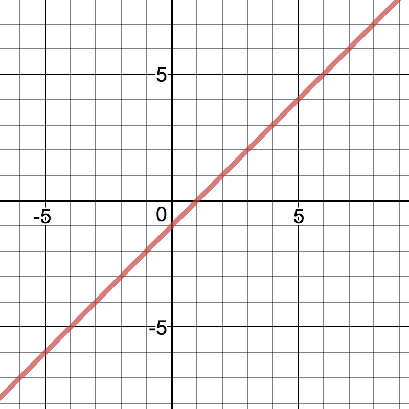

    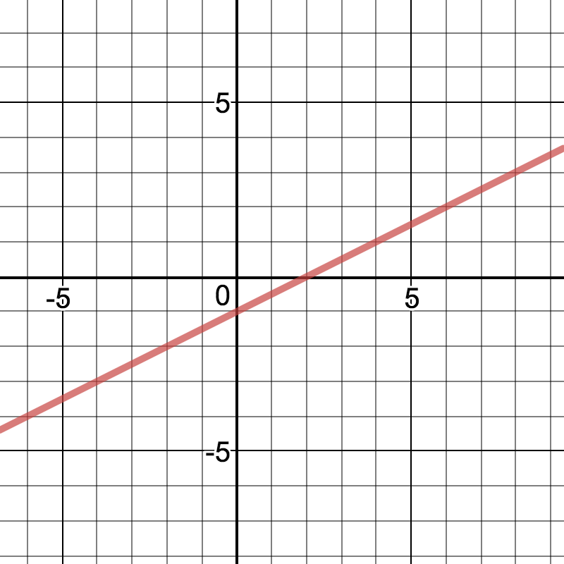

- logistic regression 은 일차함수가 아닌 새로운 형태의 hypothesis
  function 이 필요하다. 이것은 일차함수 `W * X + b` 의 값을 인자로 받아 그 값이 `0` 보다 작으면 `0.5` 보다 작은 값인데 아래로 쏠린 값(`0` 에 가까운 값)을, `0` 보다 크거나 같으면 `0.5` 보다 큰 값인데 위로 쏠린 값(`1` 에 가까운 값)을 리턴하는 함수가 필요하다. 이러한 용도로 발견된 함수를 logistic function 혹은 sigmoid function 이라고 한다. 그래서 logistic regression 이라는 말이 만들어 졌다.

    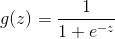  

    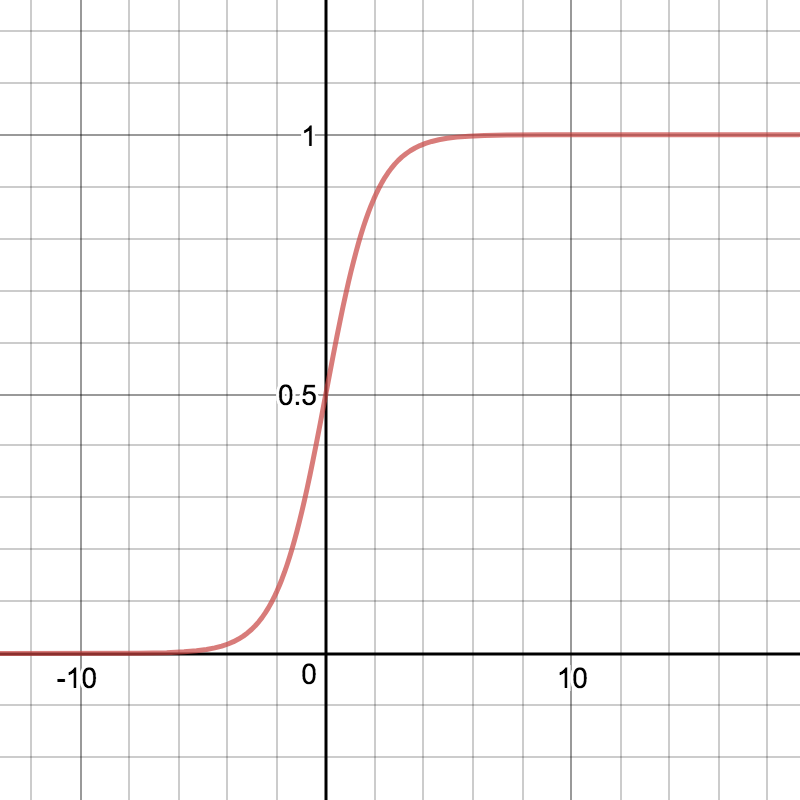

    ```latex
    g(z) = \frac{1}{1 + e^{-z}}
    ```

- logistic regression 의 sigmoid 를 활용한 `H(X), cost(W, b)` 는 다음과 같다. `cost(W, b)` 의 경우 sigmoid 를 활용한 `H(X)` 를 사용할 경우 기울기가 `0` 인 지점이 여러 곳에서 발생하기 때문에 새로운 형태의 `cost(W, b)` 가 필요하다.  즉 기울기가 0인 지점이 한 곳만 존재하는 수식이 필요하다. 그래서 다음과 같은 `cost(W, b)` 가 발견되었다. 결국 linear regression 과 마찬가지로 gradient descent algorithm 을 이용하여 `cost(W, b)` 가 최소가 되는 `W` 를 발견할 수 있다.

    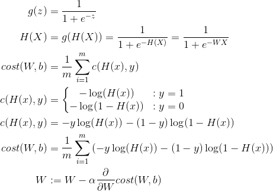

    ```latex
    \begin{align*}
    g(z) &= \frac{1}{1 + e^{-z}} \\
    H(X) &= g(H(X)) = \frac{1}{1 + e^{-H(X)}} = \frac{1}{1 + e^{-WX}} \\
    cost(W, b) &= \frac{1}{m} \sum_{i=1}^{m} c(H(x), y) \\
    c(H(x), y) &=\left\{\begin{matrix}
    -\log (H(x)) &: y = 1\\ 
    -\log (1 - H(x)) &: y = 0
    \end{matrix}\right. \\
    c(H(x), y) &= -y \log(H(x)) - (1-y) \log(1 - H(x)) \\
    cost(W, b) &= \frac{1}{m} \sum_{i=1}^{m} \left ( -y \log(H(x)) - (1-y) \log(1 - H(x)) \right ) \\
    W &:= W - \alpha \frac{\partial}{\partial W} cost(W, b) \\
    \end{align*}
    ```

- 두개의 `x` 와 한개의 `y` 를 갖는 경우 logistic regression 을 구현해보자.

    ```python
    # -*- coding: utf-8 -*-
    import tensorflow as tf
    tf.set_random_seed(777)

    def main():
        # set train data
        ll_X = [[1, 2],
            [2, 3],
            [3, 1],
            [4, 3],
            [5, 3],
            [6, 2]]
        ll_Y = [[0],
            [0],
            [0],
            [1],
            [1],
            [1]]
        # set nodes
        t_X = tf.placeholder(tf.float32, shape=[None, 2])
        t_Y = tf.placeholder(tf.float32, shape=[None, 1])
        t_W = tf.Variable(tf.random_normal([2, 1]), name='W')
        t_b = tf.Variable(tf.random_normal([1]), name='b')
        t_H = tf.sigmoid(tf.matmul(t_X, t_W) + t_b)
        t_C = -tf.reduce_mean(t_Y * tf.log(t_H) + (1 - t_Y) * tf.log(1 - t_H))
        t_T = tf.train.GradientDescentOptimizer(learning_rate=0.01).minimize(t_C)

        # accuracy computation
        t_pred = tf.cast(t_H > 0.5, dtype=tf.float32)
        t_accu = tf.reduce_mean(tf.cast(tf.equal(t_pred, t_Y), dtype=tf.float32))
        # launch nodes
        with tf.Session() as sess:
            sess.run(tf.global_variables_initializer())
            for n_step in range(10001):
                f_cost, _ = sess.run([t_C, t_T], feed_dict={t_X: ll_X, t_Y: ll_Y})
                if n_step % 200 == 0:
                    print(f'{n_step:10d} cost: {f_cost:10.7f}')

            # Accuracy report
            l_h, l_c, l_a = sess.run([t_H, t_pred, t_accu], feed_dict={t_X: ll_X, t_Y: ll_Y})
            print("\nHypothesis: ", l_h, "\nCorrect (Y): ", l_c, "\nAccuracy: ", l_a)
                
    if __name__ == "__main__":
        main()
    #         0 cost: 1.5131807
    #       200 cost: 0.6690307
    #    ...
    #     10000 cost: 0.2387468
    #
    #Hypothesis:  [[0.07878055]
    # [0.1879363 ]
    # [0.8814717 ]
    # [0.91034096]
    # [0.930014  ]
    # [0.9936017 ]]
    #Correct (Y):  [[0.]
    # [0.]
    # [1.]
    # [1.]
    # [1.]
    # [1.]]
    #Accuracy:  1.0
    ```

- 당뇨병 환자인지 아닌지를 예측하는 logistic regression 을 구현해 보자.

    ```python
    # -*- coding: utf-8 -*-
    import tensorflow as tf
    import numpy as np
    tf.set_random_seed(777)

    def main():
        # set data
        xy = np.loadtxt('data-03-diabetes.csv', delimiter=',', dtype=np.float32)
        x_data = xy[:, 0:-1]
        y_data = xy[:, [-1]]

        # set nodes
        X = tf.placeholder(tf.float32, shape=[None, 8])
        Y = tf.placeholder(tf.float32, shape=[None, 1])
        W = tf.Variable(tf.random_normal([8, 1]), name='weight')
        b = tf.Variable(tf.random_normal([1]), name='bias')
        hypothesis = tf.sigmoid(tf.matmul(X, W) + b)
        cost = -tf.reduce_mean(Y * tf.log(hypothesis) + (1 - Y) *
                            tf.log(1 - hypothesis))
        train = tf.train.GradientDescentOptimizer(learning_rate=0.01).minimize(cost)

        # Accuracy computation
        predicted = tf.cast(hypothesis > 0.5, dtype=tf.float32)
        accuracy = tf.reduce_mean(tf.cast(tf.equal(predicted, Y), dtype=tf.float32))

        # Launch nodes
        with tf.Session() as sess:
            sess.run(tf.global_variables_initializer())
            for step in range(10001):
                cost_val, _ = sess.run([cost, train], feed_dict={X: x_data, Y: y_data})
                if step % 200 == 0:
                    print(step, cost_val)
            h, c, a = sess.run([hypothesis, predicted, accuracy],
                            feed_dict={X: x_data, Y: y_data})
            print("\nHypothesis: ", h, "\nCorrect (Y): ", c, "\nAccuracy: ", a)
        
    if __name__ == "__main__":
        main()
    #0 0.704728
    #200 0.5178602
    #400 0.4791721
    #...
    #10000 0.38511994
    #
    #Hypothesis:  [[0.34326497]
    # [0.9082299 ]
    # [0.7517593 ]
    # ...
    # [0.17507356]
    # [0.8847034 ]
    # [0.8037718 ]]
    #Correct (Y):  [[0.]
    # [1.]
    # [1.]
    # ...
    # [0.]
    # [1.]
    # [1.]]
    #Accuracy:  0.776824
    ```

# [Example: Titanic](https://www.kaggle.com/c/titanic)

# Softmax Regression (multinomial classification)

- 출력이 `A, B, C` 와 같이 세개 이상인 경우의 회귀분석이다. 공부한 시간, 출석 횟수를 입력으로 성적을 출력으로 갖는 경우를 생각해보자. 이때 성적은 `A, B, C` 중 하나이다. 이것은 multinomial classification 문제이다. 입력 `x1, x2` 에 대해 출력 `Y` 가 `A` 이냐 아니냐에 대한 **logistic regression** 을 할 수 있다. 마찬 가지로 `Y` 가 `B, C` 인 경우 각각 **logistic regression** 을 할 수 있다. 그렇다면 logistic regression 을 수행할 `hypothesis function` 은 3 가지이다. 이것은 행렬연산을 활용하여 다음과 같이 한 번에 수행할 수 있다. 이와 같이 **multinomial classification** 은 **binary classification** 을 여러개 이용해서 해결한다.

    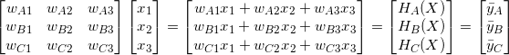

    ```latex
    \begin{bmatrix}
    w_{A1} & w_{A2} & w_{A3}\\ 
    w_{B1} & w_{B2} & w_{B3}\\ 
    w_{C1} & w_{C2} & w_{C3}\\ 
    \end{bmatrix}

    \begin{bmatrix}
    x_{1} \\ 
    x_{2} \\ 
    x_{3} \\ 
    \end{bmatrix}

    =

    \begin{bmatrix}
    w_{A1}x_{1} +  w_{A2}x_{2} + w_{A3}x_{3} \\ 
    w_{B1}x_{1} +  w_{B2}x_{2} + w_{B3}x_{3} \\ 
    w_{C1}x_{1} +  w_{C2}x_{2} + w_{C3}x_{3} \\ 
    \end{bmatrix}

    =

    \begin{bmatrix}
    H_{A}(X) \\
    H_{B}(X) \\
    H_{C}(X) \\
    \end{bmatrix}

    =

    \begin{bmatrix}
    \bar{y}_{A} \\
    \bar{y}_{B} \\
    \bar{y}_{C} \\
    \end{bmatrix}
    ```

- 출력값들이 각각 `2.0, 1.0, 0.1` 이라고 하자. 그렇다면 이것은 `A` 등급에 속한다. 하지만 출력값들의 형태를 각각의 등급에 대해 `[0, 1]` 의 확률값으로 표현하고 싶다. 그래서 **softmax function** 이 발견되었다. **softmax function** 을 이용하면 `0.7, 0.2, 0.1` 의 형태로 출력값이 변경된다. 결과적으로 `0.7` 의 확률로 `A` 등급에 속한다는 의미이다. 확률이기 때문에 모두 더하면 `1` 이다. 

    

    ```latex
    S(\bar{y}_{j}) = \frac{e^{\bar{y}_{j}}}{\sum_{j=1}^{k}e^{\bar{y}_{j}}}
    ```

- 출력값들이 각각 `0.7, 0.2, 0.1` 이라고 하자. 한번 더 처리하여 `1.0, 0., 0.` 과 같이 명쾌하게 A등급에 속한다고 결론내고 싶다. 그래서 **one hot encoding** 이 발견되었다. 최종 출력값은 `1, 0, 0` 이다. one hot encoding 은 `tf.arg_max` 를 사용했다.

- `0.7, 0.2, 0.1` 의 출력값은 `S(\bar{Y})` 라고 표기하자. `\bar{Y}` 는 예측값을 의미한다. `1, 0, 0` 과 같은 출력값은 `L` 이라고 표기하자. 이것은 학습데이터의 값이다. cost function 을 제작하기 위해 예측값과 데이터값을 인자로 하고 예측값과 데이터값이 같으면 `0` 에 가까운 값을, 다르면 무한대의 값을 리턴하는 함수가 필요하다. 그래서 **cross-entropy function** 이 발견되었고 다음과 같이 정의가 가능하다.

    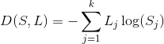

    ```latex
    D(S, L) = -\sum_{j=1}^{k}L_{j}\log(S_{j})
    ```

- **cross entropy function** 이 제대로 동작하는지 예를 들어서 살펴보자. 앞서 언급한 **cross entropy function** 은 다음과 같이 전개 할 수 있고 `-log(x)` 함수의 모양을 눈여겨 볼 필요가 있다. `L_{j}` 는 학습데이터값이고 `\bar{y}_{j}` 는 예측값이다.

    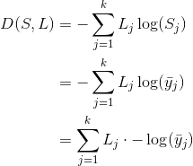

    ```latex
    \begin{align*} 
    D(S, L) &= -\sum_{j=1}^{k}L_{j}\log(S_{j}) \\
            &= -\sum_{j=1}^{k}L_{j}\log(\bar{y}_{j}) \\
            &= \sum_{j=1}^{k}L_{j} \cdot -\log(\bar{y}_{j}) \\
    \end{align*}
    ```

- `L_{j}` 가 `[0, 1]`, `\bar{y}_{j}` 가 `[0, 1]` 이라고 해보자.  `cost` 는 `0 x ∞ + 1 x 0`가 되어 `0` 이 된다. `\bar{y}_{j}` 가 `[1, 0]` 이라고 해보자. cost는 `0 x 0 + 1 x ∞` 가 되어 무한대가 된다. 앞서 언급한 **cross entropy function** 의 전개식과 `-log(x)` 를 이용하면 데이터값과 예측값이 동일할때 cost function 의 리턴값이 `0` 에 가깝고 그렇지 않으면 무한대에 가까워진다. 이것으로 cross entropy function 이 제대로 동작한다고 말 할 수 있다.

    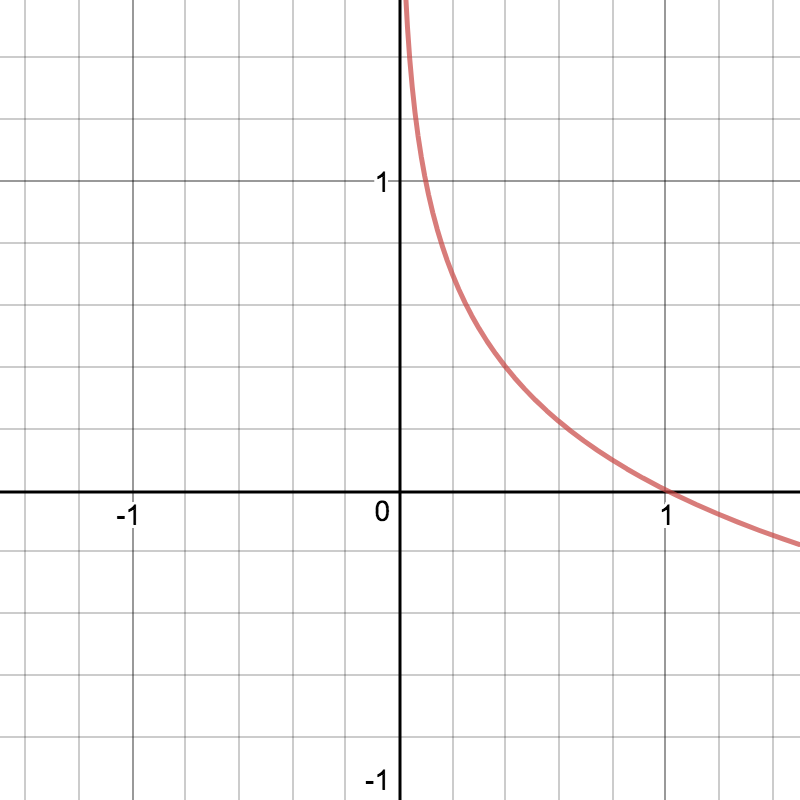

- **logistic regression** 의 **logistic cost function** 과 **softmax regression** 의 **cross entropy function** 은 사실상 같다. `H(x), S` 는 예측 값을 의미하고 `y, L` 은 데이터 값을 의미한다.

    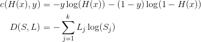

    ```latex
    \begin{align*} 
    c(H(x), y) &= -y \log(H(x)) - (1-y) \log(1 - H(x)) \\
    D(S, L)    &= -\sum_{j=1}^{k}L_{j}\log(S_{j}) \\
    \end{align*}
    ```

- **softmax regression** 의 cost function 은 다음과 같다.  실제 그래프로 그려보면 logistic regression 의 cost function 처럼 아래가 볼록한 모양이다. 기울기가 `0` 인 지점은 한 곳이다. gradient descent algorithm 을 이용해서 cost function 이 최소인 `W, b` 를 찾아 낼 수 있다. gradient descent algorithm 을 적용하기 위한 미분 방정식은 복잡해서 생략한다.

    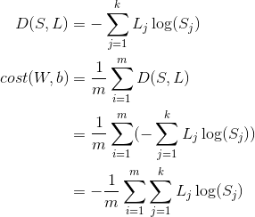

    ```latex
    \begin{align*} 
    D(S, L)    &= -\sum_{j=1}^{k}L_{j}\log(S_{j}) \\
    cost(W, b) &= \frac{1}{m} \sum_{i=1}^{m} D(S, L) \\
            &= \frac{1}{m} \sum_{i=1}^{m} (-\sum_{j=1}^{k}L_{j}\log(S_{j})) \\
            &= -\frac{1}{m} \sum_{i=1}^{m} \sum_{j=1}^{k}L_{j}\log(S_{j}) \\
    \end{align*}
    ```

- x 가 4 개이고 y 가 3 개인 데이터를 이용하여 **softmax regression** 을 구현해 보자. **one hot encoding** 을 위해 `tf.arg_max` 를 사용했다.

    ```python
    # -*- coding: utf-8 -*-
    import tensorflow as tf
    tf.set_random_seed(777)  # for reproducibility

    def main():
        # set data
        ll_X = [[1, 2, 1, 1],
                [2, 1, 3, 2],
                [3, 1, 3, 4],
                [4, 1, 5, 5],
                [1, 7, 5, 5],
                [1, 2, 5, 6],
                [1, 6, 6, 6],
                [1, 7, 7, 7]]
        ll_Y = [[0, 0, 1],
                [0, 0, 1],
                [0, 0, 1],
                [0, 1, 0],
                [0, 1, 0],
                [0, 1, 0],
                [1, 0, 0],
                [1, 0, 0]]

        # set nodes
        t_X = tf.placeholder("float", [None, 4])
        t_Y = tf.placeholder("float", [None, 3])
        n_classes = 3
        t_W = tf.Variable(tf.random_normal([4, n_classes]), name='W')
        t_b = tf.Variable(tf.random_normal([n_classes]), name='b')
        # tf.nn.softmax computes softmax activations
        # softmax = exp(logits) / reduce_sum(exp(logits), dim)
        t_H = tf.nn.softmax(tf.matmul(t_X, t_W) + t_b)
        t_C = tf.reduce_mean(-tf.reduce_sum(t_Y * tf.log(t_H), axis=1))
        t_T = tf.train.GradientDescentOptimizer(learning_rate=0.1).minimize(t_C)

        # launch nodes
        with tf.Session() as sess:
            sess.run(tf.global_variables_initializer())

            for n_step in range(2001):
                sess.run(t_T, feed_dict={t_X: ll_X, t_Y: ll_Y})
                if n_step % 200 == 0:
                    l_cost = sess.run(t_C, feed_dict={t_X: ll_X, t_Y: ll_Y})
                    print(f'{n_step:10d}', l_cost)

            print('--------------')

            # Testing & One-hot encoding
            l_a = sess.run(t_H, feed_dict={t_X: [[1, 11, 7, 9]]})
            print(l_a, sess.run(tf.argmax(l_a, 1)))

            print('--------------')

            l_b = sess.run(t_H, feed_dict={t_X: [[1, 3, 4, 3]]})
            print(l_b, sess.run(tf.argmax(l_b, 1)))

            print('--------------')

            l_c = sess.run(t_H, feed_dict={t_X: [[1, 1, 0, 1]]})
            print(l_c, sess.run(tf.argmax(l_c, 1)))

            print('--------------')

            l_all = sess.run(t_H, feed_dict={
                t_X: [[1, 11, 7, 9], [1, 3, 4, 3], [1, 1, 0, 1]]})
            print(l_all, sess.run(tf.argmax(l_all, 1)))
        
    if __name__ == "__main__":
        main()
    #         0 8.481099
    #       200 0.92861295
    #       400 0.7373086
    #       600 0.6499855
    #       800 0.59540176
    #      1000 0.5585615
    #      1200 0.5321437
    #      1400 0.5120403
    #      1600 0.49609485
    #      1800 0.4829367
    #      2000 0.47171742
    #--------------
    #[[1.7476498e-03 1.6621101e-01 8.3204124e-01]] [2]
    #--------------
    #[[0.37279767 0.48179165 0.14541064]] [1]
    #--------------
    #[[0.7397642 0.21076594 0.0494698 ]] [0]
    #--------------
    #[[1.7476498e-03 1.6621101e-01 8.3204124e-01]
    # [0.37279767 0.48179165 0.14541064]
    # [0.7397642 0.21076594 0.0494698 ]] [2 1 0]
    ```

- 동물들의 데이터를 이용해서 어떤 동물인지 분류하는 문제를 **softmax regression** 으로 해결해보자.

    ```python
    # -*- coding: utf-8 -*-
    import tensorflow as tf
    import numpy as np
    tf.set_random_seed(777)  # for reproducibility

    def main():
        # set data
        ll_XY = np.loadtxt('data-04-zoo.csv', delimiter=',', dtype=np.float32)
        ll_X  = ll_XY[:, 0:-1]
        ll_Y  = ll_XY[:, [-1]]

        # set nodes
        n_classes = 7  # 0 ~ 6

        t_X = tf.placeholder(tf.float32, [None, 16])
        t_Y = tf.placeholder(tf.int32, [None, 1])  # 0 ~ 6
        t_Y_one_hot = tf.one_hot(t_Y, n_classes)  # one hot
        #print("one_hot", t_Y_one_hot)
        t_Y_one_hot = tf.reshape(t_Y_one_hot, [-1, n_classes])
        #print("reshape", Y_one_hot)
        t_W = tf.Variable(tf.random_normal([16, n_classes]), name='W')
        t_b = tf.Variable(tf.random_normal([n_classes]), name='b')

        # tf.nn.softmax computes softmax activations
        # softmax = exp(logits) / reduce_sum(exp(logits), dim)
        t_logits = tf.matmul(t_X, t_W) + t_b
        t_H = tf.nn.softmax(t_logits)
        # Cross entropy cost/loss
        t_cost_i = tf.nn.softmax_cross_entropy_with_logits(logits=t_logits, labels=t_Y_one_hot)
        t_cost   = tf.reduce_mean(t_cost_i)
        t_T = tf.train.GradientDescentOptimizer(learning_rate=0.1).minimize(t_cost)
        t_pred = tf.argmax(t_H, 1)
        t_correct_prediction = tf.equal(t_pred, tf.argmax(t_Y_one_hot, 1))
        t_accuracy = tf.reduce_mean(tf.cast(t_correct_prediction, tf.float32))

        # launch nodes
        with tf.Session() as sess:
            sess.run(tf.global_variables_initializer())

            for n_step in range(2000):
                sess.run(t_T, feed_dict={t_X: ll_X, t_Y: ll_Y})
                if n_step % 100 == 0:
                    f_cost, f_accu = sess.run([t_cost, t_accuracy], feed_dict={
                        t_X: ll_X, t_Y: ll_Y})
                    print(f'{n_step:10d} cost: {f_cost:10.7f} accu: {f_accu:.2%}')

            # Let's see if we can predict
            l_pred = sess.run(t_pred, feed_dict={t_X: ll_X})
            # y_data: (N,1) = flatten => (N, ) matches pred.shape
            for p, y in zip(l_pred, ll_Y.flatten()):
                print(f'result: {p == int(y)} H(X): {p} Y: {int(y)}')
        
    if __name__ == "__main__":
        main()
    #         0 cost:  4.2078996 accu: 15.84%
    #       100 cost:  0.6174721 accu: 84.16%
    #      1900 cost:  0.0668208 accu: 97.03%
    #result: True H(X): 0 Y: 0
    #result: True H(X): 0 Y: 0
    ```

# Machine Learning Tips

- ML으로 문제를 해결할때 다음과 같은 사항들을 주의 깊게 고민할 필요가 있다.
  - learning rate 를 잘 설정해서 `cost(W, b)` 를 최소화 하는 `W, b` 를 빨리 찾기
  - data 를 잘 전처리 해서 `cost(W, b)` 를 최소화 하는 `W, b` 를 빨리 찾기
  - overfitting 을 잘 해결해서 `cost(W, b)` 를 최소화 하는 `W, b` 를 빨리 찾기

- learning rate 을 너무 크게 설정하면 어떠한 현상이 발생하는지 생각해보자.  `cost(W, b)` 는 아래로 볼록한 모양의 그래프이다. gradient descent algorithm 을 위한 `step` 값은 아래 방정식의 우변의 두번째 항이다.  새로운 `W` 는 현재의 `W` 에 `step` 값을 빼서 구한다. `step` 은 `learning rate` 와 `cost(W, b)` 를 미분한 값을 곱한 것이다. `learning rate` 이 너무 크면 `step` 값 역시 너무 커질 테고 새로운 `W` 를 현재의 `W` 와 차이가 커지게 된다. `cost(W, b)` 를 미분한 값은 `0` 보다 큰 값으로 수렴할 수 있고 `cost(W, b)` 를 최소화 하는 `W, b` 는 찾기 어려워 질 것이다. 이러한 현상을 `overshooting` 이라고 한다.

    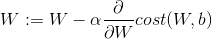

    ```latex
    W := W - \alpha \frac{\partial}{\partial W} cost(W, b) 
    ```

- learning rate 이 너무 작게 설정하면 어떻게 될까? 앞서 언급한 상황에서
  `step` 값은 매우 작아질테고 새로운 `W` 와 현재의 `W` 는 거의 차이가 없을 것이다. 따라서 `cost(W, b)` 를 최소화 하는 `W, b` 를 찾기 위해 매우 많은 반복을 수행해야 할 것이다. 즉 시간이 너무 많이 걸린다. 현실 세계에서 `0.01` 은 적당하다고 한다. 
- feature 가 `x1, x2` 로 두개인 경우를 생각해 보자. `x1` 은 `[1, 2, 4, 6, 9]` 이고 `x2` 는 `[9000, -5000, -2000, 8000, 9000]` 이라고 가정하자. feature 가 두개이기 때문에 `w1, w2` 가 존재한다. `x1` 의 각 값들의 차이와 `x2` 의 각 값들의 차이는 스케일이 다르다. `feature` 들의 스케일이 차이가 나면 `cost(W, b)` 를 최소화 하는 `W, b` 를 찾는데 시간이 오래걸린다. `feature` 들의 스케일이 비슷하게 보정(normalize)할 필요가 있다. `x2` 를 보정한다고 할때 다음과 같은 공식으로 normlize 하자. 이것을 standardization 이라고 한다.

    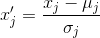

    ```latex
    {x}'_{j} = \frac{x_{j} - \mu _{j}}{\sigma _j{}}
    ```

- training data set 에 대해서 너무 훈련이 되있다면 test data set 에 대한 정확도가 낮을 수 있다. 이러한 현상을 **overfitting** 이라고 한다. 다음과 같은 방법으로 해결해 보자. 
- 첫째 더욱 많은 training data set 을 확보해서 학습시켜보자.  
- 둘째 feature 가 너무 많은 경우 줄여서 학습시켜 보자. 
- 셋째 gradient descent algorithm 에 사용할 step 값을 다른 방법으로 구해보자. 이것을 regularization 이라고 한다.

    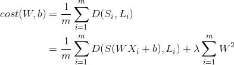

    ```latex
    \begin{align*} 
    cost(W, b) &= \frac{1}{m} \sum_{i=1}^{m} D(S_{i}, L_{i}) \\
                    &= \frac{1}{m} \sum_{i=1}^{m} D(S(WX_{i}+b), L_{i}) + \lambda \sum_{i=1}^{m} W^{2}\\
    \end{align*}
    ```
  
- 다음은 learning rate 이 다양한 경우를 구현한 것이다. learning rate 이 `1.5` 와 같이 너무 클때 `cost` 는 `inf` 가 되고 learning rate 이 `1e-10` 과 같이 너무 작을때 `cost` 는 너무 적게 변화 된다.

    ```python
    # -*- coding: utf-8 -*-
    import tensorflow as tf
    tf.set_random_seed(777)  # for reproducibility

    def main(lr):
        # set training data set
        x_data = [[1, 2, 1],
                [1, 3, 2],
                [1, 3, 4],
                [1, 5, 5],
                [1, 7, 5],
                [1, 2, 5],
                [1, 6, 6],
                [1, 7, 7]]
        y_data = [[0, 0, 1],
                [0, 0, 1],
                [0, 0, 1],
                [0, 1, 0],
                [0, 1, 0],
                [0, 1, 0],
                [1, 0, 0],
                [1, 0, 0]]
        # set test data set
        x_test = [[2, 1, 1],
                [3, 1, 2],
                [3, 3, 4]]
        y_test = [[0, 0, 1],
                [0, 0, 1],
                [0, 0, 1]]

        # set nodes
        X = tf.placeholder("float", [None, 3])
        Y = tf.placeholder("float", [None, 3])
        W = tf.Variable(tf.random_normal([3, 3]))
        b = tf.Variable(tf.random_normal([3]))
        # tf.nn.softmax computes softmax activations
        # softmax = exp(logits) / reduce_sum(exp(logits), dim)
        hypothesis = tf.nn.softmax(tf.matmul(X, W) + b)
        cost = tf.reduce_mean(-tf.reduce_sum(Y * tf.log(hypothesis), axis=1))
        optimizer = tf.train.GradientDescentOptimizer(
            learning_rate=lr).minimize(cost)

        # set accuracy
        prediction = tf.arg_max(hypothesis, 1)
        is_correct = tf.equal(prediction, tf.arg_max(Y, 1))
        accuracy = tf.reduce_mean(tf.cast(is_correct, tf.float32))

        # Launch nodes
        with tf.Session() as sess:
            sess.run(tf.global_variables_initializer())

            for step in range(201):
                cost_val, W_val, _ = sess.run(
                    [cost, W, optimizer], feed_dict={X: x_data, Y: y_data})
                print(step, cost_val, W_val)

            # predict
            print("Prediction:", sess.run(prediction, feed_dict={X: x_test}))
            print("Accuracy: ", sess.run(accuracy, feed_dict={X: x_test, Y: y_test}))

    if __name__ == "__main__":
        main(1.5)
        main(1e-10)
        main(1e-5)
    # ---------- learningrate == 1.5
    #0 4.9902973 [[ 0.08370391  0.07567866 -0.09257881]
    # [ 0.3612491   0.24187118  0.19125737]
    # [ 0.60573786 -1.2641861   1.0974983 ]]
    #20 0.53762096 [[-0.02630703  0.30401784 -0.06614877]
    # [ 0.61191434  0.47421864  0.5058189 ]
    # [ 0.7628532  -1.1870924   1.6256465 ]]
    #...
    #200 0.03470325 [[-0.70936817  1.535827   -0.82708526]
    # [ 0.86091197  0.9108183   1.4275973 ]
    # [ 0.9749336  -1.3122104   2.4312274 ]]
    #Prediction: [2 2 2]
    #Accuracy:  100.00%

    # ---------- learningrate == 1e-10
    #0 3.9260798 [[-0.4190579  -0.63905495 -0.37067384]
    # [ 0.42719084  0.9653944   1.2872744 ]
    # [-1.2240806   1.030435   -0.29987967]]
    #20 3.9260798 [[-0.4190579  -0.63905495 -0.37067384]
    # [ 0.42719084  0.9653944   1.2872744 ]
    # [-1.2240806   1.030435   -0.29987967]]
    #...
    #200 3.9260798 [[-0.4190579  -0.63905495 -0.37067384]
    # [ 0.42719084  0.9653944   1.2872744 ]
    # [-1.2240806   1.030435   -0.29987967]]
    #Prediction: [2 2 2]
    #Accuracy:  0.00%

    # ----------  learningrate == 1e-5
    #0 3.9260798 [[-0.4190579  -0.63905495 -0.37067384]
    # [ 0.42719084  0.9653944   1.2872744 ]
    # [-1.2240806   1.030435   -0.29987967]]
    #20 3.5117595 [[-0.41404164 -0.6340168  -0.36568773]
    # [ 0.42533353  0.9635372   1.2854171 ]
    # [-1.2213256   1.02768    -0.29712456]]
    #...
    #200 1.9103429 [[-0.3298581  -0.5496376  -0.28153718]
    # [ 0.39605355  0.93425727  1.2561371 ]
    # [-1.1474049   0.95358175 -0.2230227 ]]
    #Prediction: [2 2 2]
    #Accuracy:  0.00%
    ```

- 다음은 normalizing 없이 linear regression 을 수행한 것을 구현한 것이다. cost 가 `inf` 넘어서 `nan` 이 되는 것을 유심히 살펴보자.

    ```python
    # -*- coding: utf-8 -*-
    import tensorflow as tf
    import numpy as np
    tf.set_random_seed(777)  # for reproducibility

    def main():
        # set data
        xy = np.array([[828.659973, 833.450012, 908100, 828.349976, 831.659973],
                    [823.02002, 828.070007, 1828100, 821.655029, 828.070007],
                    [819.929993, 824.400024, 1438100, 818.97998, 824.159973],
                    [816, 820.958984, 1008100, 815.48999, 819.23999],
                    [819.359985, 823, 1188100, 818.469971, 818.97998],
                    [819, 823, 1198100, 816, 820.450012],
                    [811.700012, 815.25, 1098100, 809.780029, 813.669983],
                    [809.51001, 816.659973, 1398100, 804.539978, 809.559998]])

        x_data = xy[:, 0:-1]
        y_data = xy[:, [-1]]

        # set nodes
        X = tf.placeholder(tf.float32, shape=[None, 4])
        Y = tf.placeholder(tf.float32, shape=[None, 1])
        W = tf.Variable(tf.random_normal([4, 1]), name='weight')
        b = tf.Variable(tf.random_normal([1]), name='bias')
        hypothesis = tf.matmul(X, W) + b
        cost = tf.reduce_mean(tf.square(hypothesis - Y))
        optimizer = tf.train.GradientDescentOptimizer(learning_rate=1e-5)
        train = optimizer.minimize(cost)

        # Launch nodes
        sess = tf.Session()
        sess.run(tf.global_variables_initializer())

        for step in range(101):
            cost_val, hy_val, _ = sess.run(
                [cost, hypothesis, train], feed_dict={X: x_data, Y: y_data})
            print(step, "Cost: ", cost_val, "\nPrediction:\n", hy_val)

    if __name__ == "__main__":
        main()
    # 0 Cost:  1.6502960844947564e+21 
    # Prediction:
    #  [[-18760904. ]
    #  [-34700556. ]
    #  [-27212968. ]
    #  [-17702100. ]
    #  [-21867920. ]
    #  [-22098524. ]
    #  [-20372012. ]
    #  [-19227340. ]]
    # 1 Cost:  nan 
    # Prediction:
    #  [[nan]
    #  [nan]
    #  [nan]
    #  [nan]
    #  [nan]
    #  [nan]
    #  [nan]
    #  [nan]]
    # 2 Cost:  nan 
    # Prediction:
    #  [[nan]
    #  [nan]
    #  [nan]
    #  [nan]
    #  [nan]
    #  [nan]
    #  [nan]
    #  [nan]]
    # ...
    # 100 Cost:  nan 
    # Prediction:
    #  [[nan]
    #  [nan]
    #  [nan]
    #  [nan]
    #  [nan]
    #  [nan]
    #  [nan]
    #  [nan]]
    ```

- 다음은 위의 구현을 normalizing 을 이용하여 수행한 것을 구현한 것이다. cost 가 정상적으로 변화하는 것을 잘 살펴보자.

    ```python
    # -*- coding: utf-8 -*-
    import tensorflow as tf
    import numpy as np
    tf.set_random_seed(777)  # for reproducibility


    def MinMaxScaler(data):
        numerator = data - np.min(data, 0)
        denominator = np.max(data, 0) - np.min(data, 0)
        # noise term prevents the zero division
        return numerator / (denominator + 1e-7)

    def main():
        # set data
        xy = np.array([[828.659973, 833.450012, 908100, 828.349976, 831.659973],
                    [823.02002, 828.070007, 1828100, 821.655029, 828.070007],
                    [819.929993, 824.400024, 1438100, 818.97998, 824.159973],
                    [816, 820.958984, 1008100, 815.48999, 819.23999],
                    [819.359985, 823, 1188100, 818.469971, 818.97998],
                    [819, 823, 1198100, 816, 820.450012],
                    [811.700012, 815.25, 1098100, 809.780029, 813.669983],
                    [809.51001, 816.659973, 1398100, 804.539978, 809.559998]])
        xy = MinMaxScaler(xy)
        x_data = xy[:, 0:-1]
        y_data = xy[:, [-1]]

        # set nodes
        X = tf.placeholder(tf.float32, shape=[None, 4])
        Y = tf.placeholder(tf.float32, shape=[None, 1])
        W = tf.Variable(tf.random_normal([4, 1]), name='weight')
        b = tf.Variable(tf.random_normal([1]), name='bias')
        hypothesis = tf.matmul(X, W) + b
        cost = tf.reduce_mean(tf.square(hypothesis - Y))
        optimizer = tf.train.GradientDescentOptimizer(learning_rate=1e-5)
        train = optimizer.minimize(cost)

        # Launch nodes
        sess = tf.Session()
        sess.run(tf.global_variables_initializer())

        for step in range(101):
            cost_val, hy_val, _ = sess.run(
                [cost, hypothesis, train], feed_dict={X: x_data, Y: y_data})
            print(step, "Cost: ", cost_val, "\nPrediction:\n", hy_val)

    if __name__ == "__main__":
        main()
    # 0 Cost:  0.51234567
    # Prediction:
    #  [[0.5098765 ]
    #  [0.6582341 ]
    #  [0.59876543]
    #  [0.45612345]
    #  [0.5432109 ]
    #  [0.56789012]
    #  [0.45678902]
    #  [0.45678901]]
    # 1 Cost:  0.5067896 
    # Prediction:
    #  [[0.5098456 ]
    #  [0.6582024 ]
    #  [0.5987365 ]
    #  [0.45609643]
    #  [0.54318005]
    #  [0.5678592 ]
    #  [0.45675683]
    #  [0.45675682]]
    # ...
    # 100 Cost:  0.04212345
    # Prediction:
    #  [[0.3421345 ]
    #  [0.5670123 ]
    #  [0.5123456 ]
    #  [0.4321234 ]
    #  [0.4987654 ]
    #  [0.5234567 ]
    #  [0.4329876 ]
    #  [0.4329875 ]]
    ```

- 다음은 MNIST 를 softmax regression 을 이용하여 구현한 것이다.

    ```python
    # -*- coding: utf-8 -*-
    import tensorflow as tf
    import random
    # import matplotlib.pyplot as plt
    tf.set_random_seed(777)  # for reproducibility


    def main():
        # set data
        from tensorflow.examples.tutorials.mnist import input_data
        mnist = input_data.read_data_sets("MNIST_data/", one_hot=True)
        nb_classes = 10

        # set nodes
        # MNIST data image of shape 28 * 28 = 784
        X = tf.placeholder(tf.float32, [None, 784])
        # 0 - 9 digits recognition = 10 classes
        Y = tf.placeholder(tf.float32, [None, nb_classes])
        W = tf.Variable(tf.random_normal([784, nb_classes]))
        b = tf.Variable(tf.random_normal([nb_classes]))
        hypothesis = tf.nn.softmax(tf.matmul(X, W) + b)
        cost = tf.reduce_mean(-tf.reduce_sum(Y * tf.log(hypothesis), axis=1))
        optimizer = tf.train.GradientDescentOptimizer(learning_rate=0.1).minimize(cost)

        # set accuracy
        is_correct = tf.equal(tf.arg_max(hypothesis, 1), tf.arg_max(Y, 1))
        accuracy = tf.reduce_mean(tf.cast(is_correct, tf.float32))

        # parameters
        training_epochs = 15
        batch_size = 100

        # launch nodes
        with tf.Session() as sess:
            sess.run(tf.global_variables_initializer())
            for epoch in range(training_epochs):
                avg_cost = 0
                total_batch = int(mnist.train.num_examples / batch_size)

                for i in range(total_batch):
                    batch_xs, batch_ys = mnist.train.next_batch(batch_size)
                    c, _ = sess.run([cost, optimizer], feed_dict={
                        X: batch_xs, Y: batch_ys})
                    avg_cost += c / total_batch

                    print('Epoch:', '%04d' % (epoch + 1),
                        'cost =', '{:.9f}'.format(avg_cost))

            print("Learning finished")

            # Test the model using test sets
            print("Accuracy: ", accuracy.eval(session=sess, feed_dict={
                X: mnist.test.images, Y: mnist.test.labels}))

            # Get one and predict
            r = random.randint(0, mnist.test.num_examples - 1)
            print("Label: ", sess.run(tf.argmax(mnist.test.labels[r:r + 1], 1)))
            print("Prediction: ", sess.run(
                tf.argmax(hypothesis, 1), feed_dict={X: mnist.test.images[r:r + 1]}))

            # don't know why this makes Travis Build error.
            # plt.imshow(
            #     mnist.test.images[r:r + 1].reshape(28, 28),
            #     cmap='Greys',
            #     interpolation='nearest')
            # plt.show()

    if __name__ == "__main__":
        main()
    # Extracting MNIST_data/train-images-idx3-ubyte.gz
    # Extracting MNIST_data/train-labels-idx1-ubyte.gz
    # Extracting MNIST_data/t10k-images-idx3-ubyte.gz
    # Extracting MNIST_data/t10k-labels-idx1-ubyte.gz
    # Epoch: 0001 cost = 3.217940329
    # Epoch: 0002 cost = 1.046158293
    # Epoch: 0003 cost = 0.841738465
    # Epoch: 0004 cost = 0.735146942
    # Epoch: 0005 cost = 0.668400319
    # Epoch: 0006 cost = 0.622292860
    # Epoch: 0007 cost = 0.586203051
    # Epoch: 0008 cost = 0.556784792
    # Epoch: 0009 cost = 0.531738567
    # Epoch: 0010 cost = 0.510129806
    # Epoch: 0011 cost = 0.491232505
    # Epoch: 0012 cost = 0.474596822
    # Epoch: 0013 cost = 0.459878760
    # Epoch: 0014 cost = 0.446797937
    # Epoch: 0015 cost = 0.435149935
    # Learning finished
    # Accuracy:  0.9074
    # Label:  [7]
    # Prediction:  [7]
    ```

# [Example: Digit Recognizer](https://www.kaggle.com/c/digit-recognizer)

# Deep Learning Fundamentals

- 사람들은 인간의 뇌를 구성하는 뉴런을 연구해왔다. 그리고 뉴런의 동작 과정을 모델링해서 기계학습을 구현했다. 다음은 뉴런을 모델링한 그림이다. activation function 은 입력되는 값들에 따라 출력되는 값들을 `0` (비활성) 혹은 `1` (활성)로 설정한다. 이것은 logistic regression 과 같다. 이러한 뉴런들이 여러개 모여서 기계 학습이 구현된다. 실제로(1957) 뉴런들을 하드웨어로 구현했고 사람들의 관심을 얻었다. 하지만 AND 와 OR 는 해결가능했지만 XOR 은 해결 불가능 했다.
  
    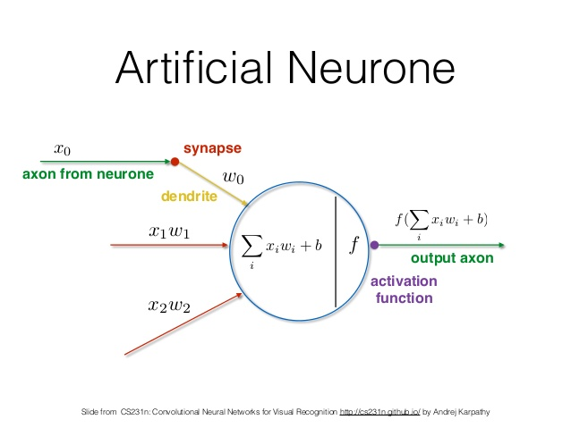

- marvin minsky 는 1969년 Perceptrons 라는 책에서  "No one on earth had found a viable way to train" 이라고 주장했다. XOR 을 multi layer perceptron 으로 표현은 가능하지만 학습시키는 불가능하다는 얘기다. 이로써 artificial intelligence 분야는 당분간 사람들의 관심을 떠나게 된다.

- 1974년 1982년 Paul Werbos 는 앞서 언급한 marvin minsky 의 주장을 반증 할 수 있는 backpropagation 을 발표했지만 사람들의 반응은 냉랭했다. 심지어는 marvin minsky 를 만나서 직접 얘기했지만 marvin minsky 의 관심을 얻지 못했다. 그러나 1986 년 Hinton 이 발표한 backpropagation 은 그렇지 않았다. 발명보다는 재발견에 해당되지만 전세계 적으로 많은 호응을 얻었다.

- 1980 년 LeCun 교수는 고양이가 그림을 볼때 어떤 뉴런은 활성화 되는데 어떤 뉴런은 비활성화되는 것에서 아이디어를 얻어 CNN을 발명하였다.

- 1984 년 부터 1994 년 CMU 에서 자율주행연구를 진행하였다.

- 1995 년 LeCun 교수는 "Comparison of Learning Algorithms For Handwritten Digit Recognition" 에서 hidden layer 가 많을때 backpropagation 과 같이 복잡한 알고리즘은 문제해결에 효과적이지 못하고 오히려 SVM, RandomForest 같은 단순한 알고리즘이 효과적이라고 주장한다. neural networks 은 다시 침체기로 접어든다.

- 1987 년 CIFAR (Canadian Institute for Advanced Research) 는 deep learning 의 침체기 분위기 속에 Hinton 교수를 적극 지원했다. 당시에는 neural networks 이라는 키워드가 포함된 논문들은 대부분 reject 되었다.
  
- 2006 년 Hinton 교수와 Yoshua Bengio 교수는 neural network 의 weight 를 잘 초기화 해주면 backpropagation 이 가능하다는 논문을 발표한 후 많은 호응을 얻었다. 그리고 neural networks 를 deep learning 이라는 새로운 용어로 재탄생 시켰다.
  
- imagenet 이라는 대회에서 2010 년에 26.2% 였던 오류는 2012 년 15.3% 로 감소하였다. 이것을 통해 neural networks은 관심을 얻는데 성공한다. 2015 년 deep learning 을 이용한 시스템이 오류를 3% 까지 감소시킨다.

- Geoffery Hinton교수는 왜 그동안 deep learning이 잘 동작 안했는지 다음과 같이 4지로 요약했다.
  - Our labeled datasets were thousands of times too small.
  - Our computers were millions of times too slow.
  - We initialized the weights in a stupid way.
    - RBM보다 Xavier방법이 더욱 좋다.
  - We used the wrong type of non-linearity.
    - sigmoid보다 ReLu를 사용하자.

- 이후 알파고를 통해 deep learning 은 핫한 기술로 부상한다.

- 다음은 tensor flow 의 유용한 함수들을 사용한 예제이다. 잘 학습해 놓자.

    ```python
    # https://github.com/hunkim/DeepLearningZeroToAll/blob/master/lab-08-tensor_manipulation.ipynb
    # https://www.tensorflow.org/api_guides/python/array_ops

    import tensorflow as tf
    import numpy as np
    import pprint
    tf.set_random_seed(777)  # for reproducibility

    pp = pprint.PrettyPrinter(indent=4)
    sess = tf.InteractiveSession()

    # Simple Array
    t = np.array([0., 1., 2., 3., 4., 5., 6.])
    pp.pprint(t)
    print(t.ndim) # rank
    print(t.shape) # shape
    print(t[0], t[1], t[-1])
    print(t[2:5], t[4:-1])
    print(t[:2], t[3:])

    # 2D Array
    t = np.array([[1., 2., 3.], [4., 5., 6.], [7., 8., 9.], [10., 11., 12.]])
    pp.pprint(t)
    print(t.ndim) # rank
    print(t.shape) # shape

    # Shape, Rank, Axis
    t = tf.constant([1,2,3,4])
    tf.shape(t).eval()

    t = tf.constant([[1,2],
                    [3,4]])
    tf.shape(t).eval()

    t = tf.constant([[[[1, 2, 3, 4], [5, 6, 7, 8], [9, 10, 11, 12]],[[13, 14, 15, 16], [17, 18, 19, 20], [21, 22, 23, 24]]]])
    tf.shape(t).eval()

    [
        [
            [
                [1,2,3,4], 
                [5,6,7,8],
                [9,10,11,12]
            ],
            [
                [13,14,15,16],
                [17,18,19,20], 
                [21,22,23,24]
            ]
        ]
    ]

    # matmul vs multiply
    matrix1 = tf.constant([[3., 3.]])
    matrix2 = tf.constant([[2.],[2.]])
    tf.matmul(matrix1, matrix2).eval()

    (matrix1*matrix2).eval()

    # Watch out broadcasting
    matrix1 = tf.constant([[3., 3.]])
    matrix2 = tf.constant([[2.],[2.]])
    (matrix1+matrix2).eval()

    matrix1 = tf.constant([[3., 3.]])
    matrix2 = tf.constant([[2., 2.]])
    (matrix1+matrix2).eval()

    # Random values for variable initializations 
    tf.random_normal([3]).eval()
    tf.random_uniform([2]).eval()
    tf.random_uniform([2, 3]).eval()

    # Reduce Mean/Sum
    tf.reduce_mean([1, 2], axis=0).eval()
    x = [[1., 2.],
        [3., 4.]]
    tf.reduce_mean(x).eval()
    tf.reduce_mean(x, axis=0).eval()
    tf.reduce_mean(x, axis=1).eval()
    tf.reduce_mean(x, axis=-1).eval()
    tf.reduce_sum(x).eval()
    tf.reduce_sum(x, axis=0).eval()
    tf.reduce_sum(x, axis=-1).eval()
    tf.reduce_mean(tf.reduce_sum(x, axis=-1)).eval()

    # Argmax with axis
    x = [[0, 1, 2],
        [2, 1, 0]]
    tf.argmax(x, axis=0).eval()
    tf.argmax(x, axis=1).eval()
    tf.argmax(x, axis=-1).eval()

    # Reshape, squeeze, expand_dims
    t = np.array([[[0, 1, 2], 
                [3, 4, 5]],
                
                [[6, 7, 8], 
                [9, 10, 11]]])
    t.shape

    tf.reshape(t, shape=[-1, 3]).eval()

    tf.reshape(t, shape=[-1, 1, 3]).eval()

    tf.squeeze([[0], [1], [2]]).eval()

    tf.expand_dims([0, 1, 2], 1).eval()

    # one hot
    tf.one_hot([[0], [1], [2], [0]], depth=3).eval()

    t = tf.one_hot([[0], [1], [2], [0]], depth=3)
    tf.reshape(t, shape=[-1, 3]).eval()

    # casting
    tf.cast([1.8, 2.2, 3.3, 4.9], tf.int32).eval()

    tf.cast([True, False, 1 == 1, 0 == 1], tf.int32).eval()

    # stack
    x = [1, 4]
    y = [2, 5]
    z = [3, 6]

    # Pack along first dim.
    tf.stack([x, y, z]).eval()

    tf.stack([x, y, z], axis=1).eval()

    # ones like and zeros like
    x = [[0, 1, 2],
        [2, 1, 0]]

    tf.ones_like(x).eval()

    tf.zeros_like(x).eval()

    # zip
    for x, y in zip([1, 2, 3], [4, 5, 6]):
        print(x, y)
        
    for x, y, z in zip([1, 2, 3], [4, 5, 6], [7, 8, 9]):
        print(x, y, z)
        
    # transpose
    t = np.array([[[0, 1, 2], [3, 4, 5]], [[6, 7, 8], [9, 10, 11]]])
    pp.pprint(t.shape)
    pp.pprint(t)

    t1 = tf.transpose(t, [1, 0, 2])
    pp.pprint(sess.run(t1).shape)
    pp.pprint(sess.run(t1))

    t = tf.transpose(t1, [1, 0, 2])
    pp.pprint(sess.run(t).shape)
    pp.pprint(sess.run(t))

    t2 = tf.transpose(t, [1, 2, 0])
    pp.pprint(sess.run(t2).shape)
    pp.pprint(sess.run(t2))

    t = tf.transpose(t2, [2, 0, 1])
    pp.pprint(sess.run(t).shape)
    pp.pprint(sess.run(t))
    ```

# NN (Neural Networks)

- marvin minsky 의 perceptrons 라는 책의 발간 이후 상당 기간동안 XOR problem은 해결되지 못하고 있었다. 그러나 1986년 Hinton 교수를 통해 backpropagation 을 이용한 해결 방법이 모색되고 neural networks 는 다시 관심을 얻게 된다.

- XOR 을 하나의 logistic regression unit 으로 구현해 보자. 정확도가 `0.5` 이기 때문에 제대로 동작하지 않는다. 뭔가 다른 방법이 필요하다.

    ```python
    # -*- coding: utf-8 -*-
    import tensorflow as tf
    import numpy as np
    tf.set_random_seed(777)

    def main():
        # set var

        f_learning_rate = 0.1

        # set data
        l_X = [[0, 0],
            [0, 1],
            [1, 0],
            [1, 1]]
        l_Y = [[0],
            [1],
            [1],
            [0]]
        # set nodes
        l_X = np.array(l_X, dtype=np.float32)
        l_Y = np.array(l_Y, dtype=np.float32)
        t_X = tf.placeholder(tf.float32, [None, 2]) # ? x 2
        t_Y = tf.placeholder(tf.float32, [None, 1]) # ? x 1
        t_W = tf.Variable(tf.random_normal([2, 1]), name='W') # 2 x 1
        t_b = tf.Variable(tf.random_normal([1]), name='b')
        t_H = tf.sigmoid(tf.matmul(t_X, t_W) + t_b)
        t_C = -tf.reduce_mean(t_Y * tf.log(t_H) + (1 - t_Y) * tf.log(1 - t_H))
        t_T = tf.train.GradientDescentOptimizer(learning_rate=f_learning_rate).minimize(t_C)
        # set accuracy
        t_pred = tf.cast(t_H > 0.5, dtype=tf.float32)
        t_accu = tf.reduce_mean(tf.cast(tf.equal(t_pred, t_Y), dtype=tf.float32))

        # Launch nodes
        with tf.Session() as sess:
            sess.run(tf.global_variables_initializer())

            for n_step in range(10001):
                sess.run(t_T, feed_dict={t_X: l_X, t_Y: l_Y})
                if n_step % 100 == 0:
                    f_cost = sess.run(t_C, feed_dict={t_X: l_X, t_Y: l_Y})
                    l_W = sess.run(t_W)
                    print(f'{n_step:10d} cost: {f_cost:10.7f} W: \n', l_W)

            l_h, l_c, f_a = sess.run([t_H, t_pred, t_accu], feed_dict={t_X: l_X, t_Y: l_Y})
            print("\nHypothesis: ", l_h, "\nCorrect: ", l_c, "\nAccuracy: ", f_a)

    if __name__ == "__main__":
        main()
    #          0 cost: 0.7889056 W: 
    # [[0.6293562]
    #  [0.1866317]]
    #        100 cost: 0.6913486 W: 
    # [[0.37007692]
    #  [0.00851274]]
    #        200 cost: 0.6909208 W: 
    # [[0.36180383]
    #  [0.0068089 ]]
    # ...
    #      9900 cost: 0.6931472 W: 
    # [[0.00215517]
    #  [0.00257609]]
    #     10000 cost: 0.6931472 W: 
    # [[0.00215516]
    #  [0.00257609]]

    # Hypothesis:  [[0.5]
    #  [0.5]
    #  [0.5]
    #  [0.5]] 
    # Correct:  [[1.]
    #  [0.]
    #  [0.]
    #  [1.]] 
    # Accuracy:  0.5
    ```

- XOR 문제를 해결하기 위해 3개의 logistic regression unit 으로 표현해보자.  `x1, x2` 에 `[0, 0], [0, 1], [1, 0], [1, 1]` 을 입력해서 연산하면 `bar{y}` 값을 확인 해 보면 정상 동작함을 알 수 있다.

    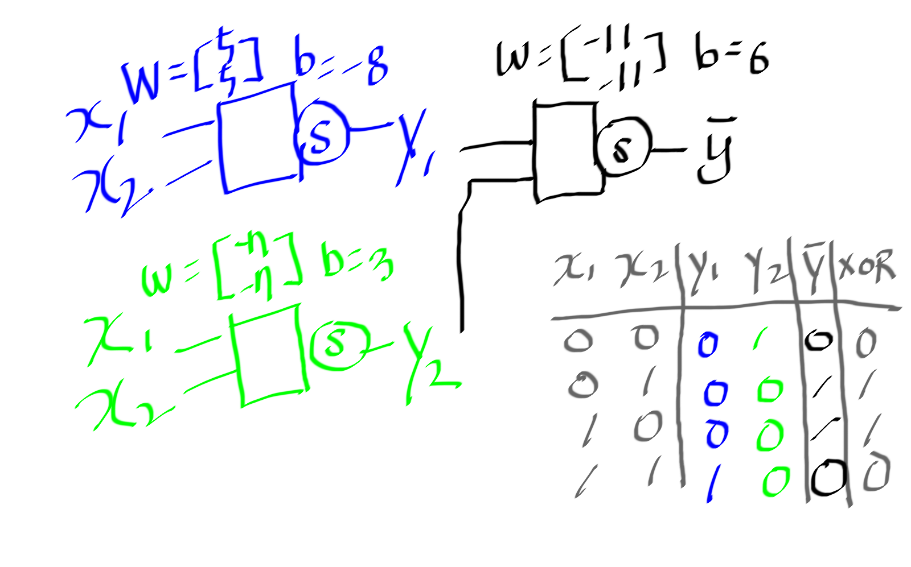

    

    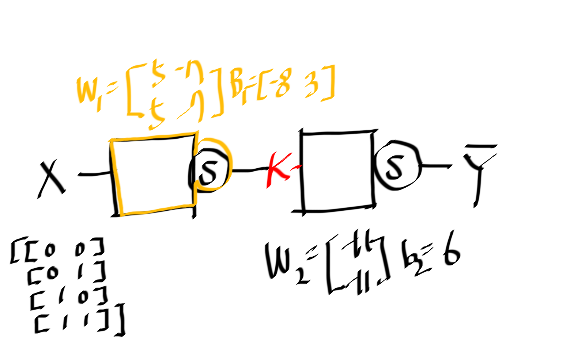

- 위의 그림을 바탕으로 다음과 같이 out layer에 해당하는 예측값을 표현
  할 수 있다.

    

    ```latex
    \begin{align*} 
    K(X)    &= sigmoid(XW_{1} + B_{1}) \\
    \bar{Y} &= sigmoid(K(X)W_{2} + B_{2}) \\
    \end{align*}
    ```

- 다음은 위의 수식을 tensorflow 를 이용하여 구현한 것이다.

    ```python
    K = tf.sigmoid(tf.matmul(X, W1) + b1)
    hypothesis = tf.sigmoid(tf.matmul(K, W2) + b2)
    ```

- 3 개의 logistic regression unit 을 이용해서 구현해 보자. 3 개의 logistic regression unit 은 hidden layer 가 하나 추가되었다고 볼 수 있다. layer 를 2 개 이상으로 계속 늘려나가면 연산량은 많아지지만 hypothesis 값은 점점 0에 가까워지거나 1 에 가까워져간다. 예측값이 점점 정확하다고 생각 할 수 있다.

    ```python
    # -*- coding: utf-8 -*-
    import tensorflow as tf
    import numpy as np
    tf.set_random_seed(777)

    def main():
        # set var

        f_learning_rate = 0.1

        # set data
        l_X = [[0, 0],
            [0, 1],
            [1, 0],
            [1, 1]]
        l_Y = [[0],
            [1],
            [1],
            [0]]
        l_X = np.array(l_X, dtype=np.float32)
        l_Y = np.array(l_Y, dtype=np.float32)

        # set in layer 
        t_X = tf.placeholder(tf.float32, [None, 2]) # ? x 2
        t_Y = tf.placeholder(tf.float32, [None, 1]) # ? x 1

        # set hidden layer
        t_W1 = tf.Variable(tf.random_normal([2, 2]), name='W1')
        t_b1 = tf.Variable(tf.random_normal([2]), name='b1')
        t_L1 = tf.sigmoid(tf.matmul(t_X, t_W1) + t_b1)

        # set out layer
        t_W2 = tf.Variable(tf.random_normal([2, 1]), name='W2')
        t_b2 = tf.Variable(tf.random_normal([1]), name='b2')
        t_H = tf.sigmoid(tf.matmul(t_L1, t_W2) + t_b2)

        # set train
        t_C = -tf.reduce_mean(t_Y * tf.log(t_H) + (1 - t_Y) * tf.log(1 - t_H))
        t_T = tf.train.GradientDescentOptimizer(learning_rate=f_learning_rate).minimize(t_C)

        # set accuracy
        t_pred = tf.cast(t_H > 0.5, dtype=tf.float32)
        t_accu = tf.reduce_mean(tf.cast(tf.equal(t_pred, t_Y), dtype=tf.float32))

        # Launch nodes
        with tf.Session() as sess:
            sess.run(tf.global_variables_initializer())

            for n_step in range(10001):
                sess.run(t_T, feed_dict={t_X: l_X, t_Y: l_Y})
                if n_step % 100 == 0:
                    f_cost = sess.run(t_C, feed_dict={t_X: l_X, t_Y: l_Y})
                    ll_W = sess.run([t_W1, t_W2])
                    print(f'{n_step:10d} cost: {f_cost:10.7f} W: \n', ll_W)                

            l_h, l_c, f_a = sess.run([t_H, t_pred, t_accu], feed_dict={t_X: l_X, t_Y: l_Y})
            print("\nHypothesis: ", l_h, "\nCorrect: ", l_c, "\nAccuracy: ", f_a)

    if __name__ == "__main__":
        main()
    # 출력값은 정확하지 않을 수 있다.
    #          0 cost: 2.0978303 W: 
    # [array([[ 0.14673007, -0.9814285 ],
    #        [-0.79316014,  1.4435159 ]], dtype=float32), array([[ 0.47829133],
    #        [-0.25416854]], dtype=float32)]
    #        100 cost: 0.6931472 W: 
    # [array([[ 0.11493623, -0.9928243 ],
    #        [-0.78975564,  1.452431 ]], dtype=float32), array([[ 0.4798243],
    #        [-0.2618279]], dtype=float32)]
    #        200 cost: 0.6931471 W: 
    # [array([[ 0.0831424, -1.0042202],
    #        [-0.78635114,  1.461346 ]], dtype=float32), array([[ 0.48135728],
    #        [-0.26948726]], dtype=float32)]
    # ...
    #       9900 cost: 0.0103982 W: 
    # [array([[ 6.8575673, -6.203794 ],
    #        [-6.857377,  6.2042522]], dtype=float32), array([[10.293014],
    #        [10.301707]], dtype=float32)]
    #     10000 cost: 0.0102956 W: 
    # [array([[ 6.859385, -6.205698],
    #        [-6.859196,  6.206156]], dtype=float32), array([[10.295872],
    #        [10.304581]], dtype=float32)]

    # Hypothesis:  [[0.0125403 ]
    #  [0.97863525]
    #  [0.9786342 ]
    #  [0.0213633 ]] 
    # Correct:  [[0.]
    #  [1.]
    #  [1.]
    #  [0.]] 
    # Accuracy:  0.75
    ```

- 앞서 구현한 것보다 hidden layer를 더욱 넓고 깊게 구현해 보자. 예측값은 점점 정확하다고 할 수 있다.
    
    ```python
    # -*- coding: utf-8 -*-
    import tensorflow as tf
    import numpy as np
    tf.set_random_seed(777)  # for reproducibility

    def main():
        # set var
        f_learning_rate = 0.1

        # set data
        l_X = [[0, 0],
            [0, 1],
            [1, 0],
            [1, 1]]
        l_Y = [[0],
            [1],
            [1],
            [0]]
        l_X = np.array(l_X, dtype=np.float32)
        l_Y = np.array(l_Y, dtype=np.float32)

        # set in, out layer
        t_X = tf.placeholder(tf.float32, [None, 2])
        t_Y = tf.placeholder(tf.float32, [None, 1])
        # set hidden layer 1
        t_W1 = tf.Variable(tf.random_normal([2, 10]), name='W1')
        t_b1 = tf.Variable(tf.random_normal([10]), name='b1')
        t_L1 = tf.sigmoid(tf.matmul(t_X, t_W1) + t_b1)
        # set hidden layer 2
        t_W2 = tf.Variable(tf.random_normal([10, 10]), name='W2')
        t_b2 = tf.Variable(tf.random_normal([10]), name='b2')
        t_L2 = tf.sigmoid(tf.matmul(t_L1, t_W2) + t_b2)
        # set hidden layer 3
        t_W3 = tf.Variable(tf.random_normal([10, 10]), name='W3')
        t_b3 = tf.Variable(tf.random_normal([10]), name='b3')
        t_L3 = tf.sigmoid(tf.matmul(t_L2, t_W3) + t_b3)
        # set out layer 4
        t_W4 = tf.Variable(tf.random_normal([10, 1]), name='W4')
        t_b4 = tf.Variable(tf.random_normal([1]), name='b4')
        t_H  = tf.sigmoid(tf.matmul(t_L3, t_W4) + t_b4)

        # set train node
        t_C = -tf.reduce_mean(t_Y * tf.log(t_H) + (1 - t_Y) * tf.log(1 - t_H))
        t_T = tf.train.GradientDescentOptimizer(learning_rate=f_learning_rate).minimize(t_C)

        # set accuracy node
        t_pred = tf.cast(t_H > 0.5, dtype=tf.float32)
        t_accu = tf.reduce_mean(tf.cast(tf.equal(t_pred, t_Y), dtype=tf.float32))

        # Launch nodes
        with tf.Session() as sess:
            sess.run(tf.global_variables_initializer())

            for n_step in range(10001):
                sess.run(t_T, feed_dict={t_X: l_X, t_Y: l_Y})
                if n_step % 100 == 0:
                    f_cost = sess.run(t_C, feed_dict={t_X: l_X, t_Y: l_Y})
                    ll_W = sess.run([t_W1, t_W2, t_W3, t_W4])
                    print(f'{n_step:10d} cost: {f_cost:10.7f} W: \n', ll_W)                

            l_h, l_c, f_a = sess.run([t_H, t_pred, t_accu], feed_dict={t_X: l_X, t_Y: l_Y})
            print("\nHypothesis: ", l_h, "\nCorrect: ", l_c, "\nAccuracy: ", f_a)

    if __name__ == "__main__":
        main()
    ```

- tensorflow 는 tensorboard 라는 것을 이용해서 노드의 상태를 그림으로 확인 할 수 있다. 실행하면 `./logs/xor_logs_r0_01` 가 만들어진다. `$ tensorboard --logdir logs` 실행하고 브라우저로 `http://127.0.0.1:6006`해보자.
  
    ```python
    # -*- coding: utf-8 -*-
    import tensorflow as tf
    import numpy as np

    def main():
        # set var
        tf.set_random_seed(777)  # for reproducibility
        learning_rate = 0.01
        # set data
        x_data = [[0, 0],
                [0, 1],
                [1, 0],
                [1, 1]]
        y_data = [[0],
                [1],
                [1],
                [0]]
        x_data = np.array(x_data, dtype=np.float32)
        y_data = np.array(y_data, dtype=np.float32)
        # set in layer
        X = tf.placeholder(tf.float32, [None, 2], name='x-input')
        Y = tf.placeholder(tf.float32, [None, 1], name='y-input')
        # set hidden layer1
        with tf.name_scope("layer1") as scope:
            W1 = tf.Variable(tf.random_normal([2, 2]), name='weight1')
            b1 = tf.Variable(tf.random_normal([2]), name='bias1')
            layer1 = tf.sigmoid(tf.matmul(X, W1) + b1)

            w1_hist = tf.summary.histogram("weights1", W1)
            b1_hist = tf.summary.histogram("biases1", b1)
            layer1_hist = tf.summary.histogram("layer1", layer1)
        # set hidden layer 1
        with tf.name_scope("layer2") as scope:
            W2 = tf.Variable(tf.random_normal([2, 1]), name='weight2')
            b2 = tf.Variable(tf.random_normal([1]), name='bias2')
            hypothesis = tf.sigmoid(tf.matmul(layer1, W2) + b2)

            w2_hist = tf.summary.histogram("weights2", W2)
            b2_hist = tf.summary.histogram("biases2", b2)
            hypothesis_hist = tf.summary.histogram("hypothesis", hypothesis)

        # set cost node
        with tf.name_scope("cost") as scope:
            cost = -tf.reduce_mean(Y * tf.log(hypothesis) + (1 - Y) *
                                tf.log(1 - hypothesis))
            cost_summ = tf.summary.scalar("cost", cost)
        # set train node
        with tf.name_scope("train") as scope:
            train = tf.train.AdamOptimizer(learning_rate=learning_rate).minimize(cost)

        # set accuracy node
        predicted = tf.cast(hypothesis > 0.5, dtype=tf.float32)
        accuracy = tf.reduce_mean(tf.cast(tf.equal(predicted, Y), dtype=tf.float32))
        accuracy_summ = tf.summary.scalar("accuracy", accuracy)

        # Launch nodes
        with tf.Session() as sess:
            merged_summary = tf.summary.merge_all()
            writer = tf.summary.FileWriter("./logs/xor_logs_r0_01")
            writer.add_graph(sess.graph)  # Show the graph
            sess.run(tf.global_variables_initializer())

            for step in range(10001):
                summary, _ = sess.run([merged_summary, train], feed_dict={X: x_data, Y: y_data})
                writer.add_summary(summary, global_step=step)

                if step % 100 == 0:
                    print(step, sess.run(cost, feed_dict={
                        X: x_data, Y: y_data}), sess.run([W1, W2]))

            h, c, a = sess.run([hypothesis, predicted, accuracy],
                            feed_dict={X: x_data, Y: y_data})
            print("\nHypothesis: ", h, "\nCorrect: ", c, "\nAccuracy: ", a)

    if __name__ == "__main__":
        main()
    #          0 cost: 1.6010835 W: 
    # [array([[-1.2923663 , -0.32331157, -1.0047873 ,  0.1377925 ,  0.42308426,
    #         -0.6745902 , -1.1642528 , -0.45844904,  0.51025325, -0.5084382 ],
    #        [-0.82322145, -1.0105054 , -0.3565451 ,  1.3240587 ,  0.29193893,
    #         -0.47568268, -0.07652991, -1.6672462 ,  0.15593666,  1.1146222 ]],
    #       dtype=float32), array([[-1.0032889e-01,  2.9372193e-01,  5.4747001e-01,  1.6699474e+00,
    #          1.4513947e+00, -1.7196649e+00, -1.0242556e+00,  1.1598966e+00,
    #          1.7747982e-01, -2.8249452e-01],
    #        [-7.0281287e-01, -1.1702763e+00, -1.5202131e+00,  4.3657584e-01,
    #          2.0490870e+00, -1.0989292e+00, -1.3373454e+00,  1.5032846e+00,
    #          1.4786797e+00, -1.5247089e+00],
    #        [-7.9535385e-01,  1.3569999e+00, -1.4040129e+00, -1.1051186e+00,
    #         -4.3683791e-01, -1.1632520e+00, -3.0748687e-01, -4.1397649e-01,
    #          6.6261425e-01,  1.0662487e+00],
    #        [-4.2353848e-01,  8.6845925e-01,  1.2268883e+00,  1.3600308e+00,
    #          1.6287940e+00,  2.0255469e+00, -2.0070219e-01,  3.3966650e-01,
    #         -2.0489991e-01, -7.1610874e-02],
    #        [ 8.1702030e-01, -2.7893200e-01,  4.7202693e-01, -2.6106207e-01,
    #         -1.0857694e+00,  2.5942709e+00,  2.0126469e+00,  8.2486444e-01,
    #         -2.0737686e+00, -8.2220621e-01],
    #        [-1.0202384e+00,  1.0355380e+00,  1.5303556e+00, -1.4627188e+00,
    #         -3.6486747e-01, -1.4550507e+00, -1.2433206e+00, -7.0510954e-01,
    #          3.4566374e-01,  5.5958713e-01],
    #        [ 1.1082985e+00, -1.1084460e+00, -1.3185575e+00,  1.1420244e+00,
    #          1.1201324e+00,  2.3894179e+00, -1.2523351e+00, -6.2214513e-01,
    #         -1.3700603e+00,  1.3783958e+00],
    #        [-1.3315581e+00, -8.6216450e-01,  2.3153920e-01,  1.2699965e+00,
    #          2.0540955e+00, -6.3396416e-01, -1.1581811e+00,  2.2714341e-01,
    #          1.1795943e+00,  7.7104211e-01],
    #        [-2.1997879e-01,  1.0440074e+00, -7.3270911e-01, -4.7917284e-01,
    #         -3.4373990e-01, -1.3589733e-01,  2.1058697e+00, -3.1661274e-01,
    #         -1.1241870e+00,  8.2292961e-01],
    #        [ 2.5879631e-01,  6.3627748e-01, -7.8854899e-02,  1.8582864e+00,
    #          1.4148791e+00,  2.1044168e+00,  2.2043344e+00,  1.4334532e+00,
    #          1.2198979e+00, -1.0883576e+00]], dtype=float32), array([[ 0.03749437,  0.44728243, -0.25401786,  0.43061456, -0.16020137,
    #          1.1677042 ,  1.2467983 ,  0.89763534, -0.21510978,  1.4553758 ],
    #        [ 0.66525036,  0.50969845,  1.0511545 ,  0.07735158, -0.5079117 ,
    #         -1.6955256 , -0.07736879, -0.5363335 ,  0.27584034, -0.08978877],
    #        [ 0.6556068 , -0.57226384,  1.2110358 , -0.31000742, -1.2552444 ,
    #         -0.03694825, -0.56324005,  1.0106218 ,  1.1705518 ,  1.1402036 ],
    #        [-0.6593886 ,  1.2956618 ,  1.0384551 , -0.8087615 , -0.57923126,
    #          0.9732714 , -0.3060192 ,  0.27155364, -0.4816526 , -1.0313531 ],
    #        [ 0.7867451 , -0.09565762,  0.58975095, -0.41631556,  0.23333496,
    #          0.49336833,  0.49544612,  0.7797916 ,  0.09814777,  0.23682214],
    #        [ 0.26524097,  1.5838054 ,  0.26208407, -0.67693925, -1.2038382 ,
    #         -0.08153608,  0.7742882 ,  0.02699602,  0.83629924,  0.9683125 ],
    #        [ 0.303957  , -0.62449414,  0.25916126, -1.1351643 , -1.3804162 ,
    #         -1.1957756 ,  0.7474847 ,  0.8594632 ,  0.08989742,  0.2991361 ],
    #        [ 0.6511988 ,  1.0737982 ,  1.4688935 ,  1.5057061 , -0.7875578 ,
    #         -0.66028327,  0.65409815, -1.0000576 , -0.7596288 , -0.53782094],
    #        [-1.1292967 , -0.5159358 ,  0.56610626, -1.0276023 ,  0.56142837,
    #          0.24905166,  0.72936344,  0.39443964,  1.218037  ,  0.1080374 ],
    #        [ 0.19834062,  1.1696916 , -1.1226836 , -0.90289325,  0.6586855 ,
    #          0.4372579 , -1.2348229 , -0.27114868, -0.13904972, -0.688675  ]],
    #       dtype=float32), array([[-0.5393189 ],
    #        [ 0.8703296 ],
    #        [ 1.4282972 ],
    #        [ 0.65219414],
    #        [ 1.159996  ],
    #        [ 0.37377322],
    #        [-0.66620624],
    #        [ 0.54717827],
    #        [ 0.28793237],
    #        [ 1.3164792 ]], dtype=float32)]

    #        100 cost: 0.6931407 W: 
    # [array([[-1.2877998 , -0.32400218, -1.0037042 ,  0.1345887 ,  0.42576894,
    #         -0.674316  , -1.1621628 , -0.45833084,  0.5114471 , -0.50728536],
    #        [-0.8205973 , -1.0128914 , -0.35488635,  1.3207438 ,  0.2932623 ,
    #         -0.47557735, -0.07499056, -1.6685584 ,  0.15547061,  1.1160998 ]],
    #       dtype=float32), array([[-0.09850305,  0.29435495,  0.5484761 ,  1.6695323 ,  1.4522729 ,
    #         -1.7193284 , -1.023053  ,  1.1595147 ,  0.17623414, -0.28278732],
    #        [-0.7004214 , -1.1716943 , -1.519314  ,  0.43500856,  2.049237  ,
    #         -1.0984395 , -1.3363247 ,  1.5026546 ,  1.4794289 , -1.525445  ],
    #        [-0.7938789 ,  1.3577039 , -1.4031979 , -1.1054299 , -0.43863052,
    #         -1.1630299 , -0.30714345, -0.414092  ,  0.6638915 ,  1.0660226 ],
    #        [-0.42335555,  0.86900103,  1.2270651 ,  1.3600292 ,  1.6292917 ,
    #          2.0247555 , -0.20171982,  0.34003454, -0.20428376, -0.07065162],
    #        [ 0.8176133 , -0.27944157,  0.4723163 , -0.26223034, -1.0863568 ,
    #          2.5936968 ,  2.0120113 ,  0.82437974, -2.074739  , -0.8212245 ],
    #        [-1.0189911 ,  1.034789  ,  1.5310227 , -1.463524  , -0.36558592,
    #         -1.4550418 , -1.2426054 , -0.7053888 ,  0.34566885,  0.5592344 ],
    #        [ 1.1101846 , -1.1093471 , -1.3180193 ,  1.1420474 ,  1.1205666 ,
    #          2.3893366 , -1.2514585 , -0.62192684, -1.3700471 ,  1.3795424 ],
    #        [-1.3329427 , -0.86159706,  0.23333117,  1.2695452 ,  2.0544946 ,
    #         -0.63458204, -1.157237  ,  0.2267984 ,  1.178188  ,  0.77246284],
    #        [-0.21869646,  1.0435066 , -0.73165476, -0.4786944 , -0.34367725,
    #         -0.13616826,  2.104487  , -0.31667328, -1.1246656 ,  0.82293606],
    #        [ 0.25811657,  0.63739234, -0.07879899,  1.858729  ,  1.4147749 ,
    #          2.1047122 ,  2.2031462 ,  1.4332582 ,  1.2206804 , -1.0883583 ]],
    #       dtype=float32), array([[ 0.03807106,  0.44865426, -0.25398174,  0.43201467, -0.16001397,
    #          1.1677674 ,  1.2463428 ,  0.898123  , -0.21555562,  1.455382  ],
    #        [ 0.66539896,  0.5100223 ,  1.0512476 ,  0.07775604, -0.5076392 ,
    #         -1.6962658 , -0.07732686, -0.5367741 ,  0.27565098, -0.08960697],
    #        [ 0.6554271 , -0.5726791 ,  1.2110785 , -0.30998135, -1.2555411 ,
    #         -0.03705604, -0.5634782 ,  1.0107663 ,  1.1704996 ,  1.1404934 ],
    #        [-0.6591896 ,  1.2961425 ,  1.0383984 , -0.8089784 , -0.5792976 ,
    #          0.97308034, -0.30594185,  0.27167395, -0.48177585, -1.031554  ],
    #        [ 0.7868555 , -0.09592295,  0.5896292 , -0.41656798,  0.23352115,
    #          0.49325287,  0.4955701 ,  0.7799276 ,  0.09796212,  0.23692384],
    #        [ 0.2655377 ,  1.5840552 ,  0.26212278, -0.67691463, -1.2041988 ,
    #         -0.08160192,  0.7742975 ,  0.02716798,  0.83611304,  0.9682574 ],
    #        [ 0.30379453, -0.6250921 ,  0.25916937, -1.1357348 , -1.3803874 ,
    #         -1.1955829 ,  0.7474819 ,  0.85919726,  0.08979671,  0.29885194],
    #        [ 0.65129215,  1.0740112 ,  1.4689265 ,  1.5060179 , -0.7876557 ,
    #         -0.6604654 ,  0.65420264, -1.0000179 , -0.7594848 , -0.53768826],
    #        [-1.1290898 , -0.51588786,  0.5661048 , -1.0275251 ,  0.5613988 ,
    #          0.24915169,  0.72941273,  0.39461458,  1.2180126 ,  0.10804726],
    #        [ 0.19844379,  1.1701972 , -1.1226677 , -0.90294164,  0.658741  ,
    #          0.43732262, -1.2348433 , -0.27106875, -0.1391106 , -0.6887256 ]],
    #       dtype=float32), array([[-0.5393189 ],
    #        [ 0.8703296 ],
    #        [ 1.4282972 ],
    #        [ 0.65219414],
    #        [ 1.159996  ],
    #        [ 0.37377322],
    #        [-0.66620624],
    #        [ 0.54717827],
    #        [ 0.28793237],
    #        [ 1.3164792 ]], dtype=float32)]
    # ...
    #      9900 cost: 0.0005067 W: 
    # [array([[ 6.8575673, -6.203794 ],
    #        [-6.857377 ,  6.2042522]], dtype=float32), array([[ 0.07288879,
    #          0.4925354 ,  0.77560717,  1.0351483 ,  0.1832457 ,  0.66754615,
    #           1.4211937 , -1.0177766 , -0.35817176,  0.13557282],
    #        [-0.14666979,  0.41825688,  0.453782  , -0.15014334, -0.25419974,
    #         -0.38836572,  1.2934878 , -0.3563373 ,  0.55991215, -0.45028305],
    #        [-0.26978472,  0.09473752, -1.3019682 , -0.2948255 , -1.4463274 ,
    #          1.3839797 ,  0.26618475, -1.3195943 , -0.32654458, -1.6210213 ],
    #        [ 0.29300573, -0.5027976 , -0.88878876, -0.6615951 , -1.6785712 ,
    #         -1.6404443 , -0.30623052, -0.59032106,  1.0282145 ,  0.69371176],
    #        [ 0.042076  ,  0.4531828 , -0.46297142,  0.18397386, -0.09287584,
    #          0.15204212, -0.06545231, -0.2792369 ,  0.26265284, -0.1191138 ],
    #        [ 0.08428608, -0.07681386, -0.62599534,  0.57898194,  0.21668431,
    #         -0.00716823,  0.44610274, -0.24518755, -0.49801338,  0.11315265],
    #        [ 0.3340215 , -0.25550866,  1.4972067 ,  0.14272049,  0.13594459,
    #         -0.10089579,  1.0523999 ,  0.22724497,  0.48773968, -0.20137869],
    #        [ 0.5523583 ,  0.34037033, -0.429536  ,  0.13268653,  0.53226477,
    #          0.05350997, -0.34862614,  0.51626384,  0.00283291,  0.5508528 ],
    #        [-0.21732803, -0.210293  ,  0.33785358, -0.1452212 , -0.20270866,
    #          0.28307226,  0.37415594,  0.12197313,  0.0976677 ,  0.42813182],
    #        [-0.08347877,  0.5115298 , -1.1199927 ,  1.4610595 , -0.00248052,
    #          0.68488866,  0.5106731 ,  0.22630748,  0.06433484,  0.573467  ]],
    #       dtype=float32), array([[0.0470438 ],
    #        [0.021968  ],
    #        [1.086933  ],
    #        [0.25967956],
    #        [0.6551331 ],
    #        [1.1747035 ],
    #        [0.29541793],
    #        [0.42373276],
    #        [0.24170917],
    #        [1.1166979 ]], dtype=float32)]

    # Hypothesis:  [[0.01215458]
    #  [0.9886922 ]
    #  [0.9885632 ]
    #  [0.01342506]] 
    # Correct:  [[0.]
    #  [1.]
    #  [1.]
    #  [0.]] 
    # Accuracy:  1.0
    ```

- chain rule 은 두 함수를 합성한 합성 함수의 도함수에 관한 공식이다.

    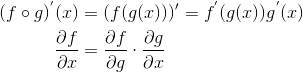

    ```latex
    \begin{align*}
    (f \circ g)^{'}(x) &= (f(g(x)))' = f^{'}(g(x))g^{'}(x) \\
    \frac {\partial{f}}{\partial{x}} &= \frac {\partial{f}}{\partial{g}} \cdot \frac {\partial{g}}{\partial{x}} \\
    \end{align*}
    ```

- back propagation 는 output layer 부터 input layer 방향으로 `cost(W, b)` 를 를 최소화 하기 위해 `W, b` 를 업데이트하는 과정이다. chain rule 을 이용해서 구현할 수 있다. 아래의 그림들은 [이곳](https://docs.google.com/presentation/d/1_ZmtfEjLmhbuM_PqbDYMXXLAqeWN0HwuhcSKnUQZ6MM/edit#slide=id.p6) 에서 가져왔다. softmax regression 을 어떻게 backpropagation 하는지 수식으로 이해 할 수 있다. 중간에 사용된 전치 행렬은 곱셈 결과 행렬의 행과 열을 뒤집어 주기 위한 방법이다.
  
- 다음은 한개의 레이어를 backpropagation 하는 과정이다.
  
    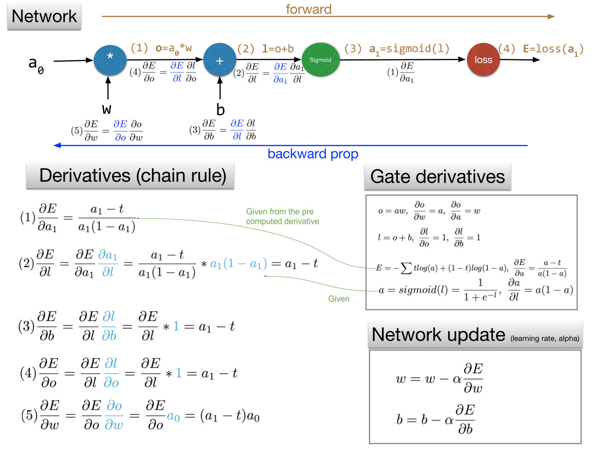

- 다음은 두개 이상의 레이어를 backpropagation 하는 과정이다. 한개의
  레이어를 backpropagation 하는 것과 거의 유사하다.

    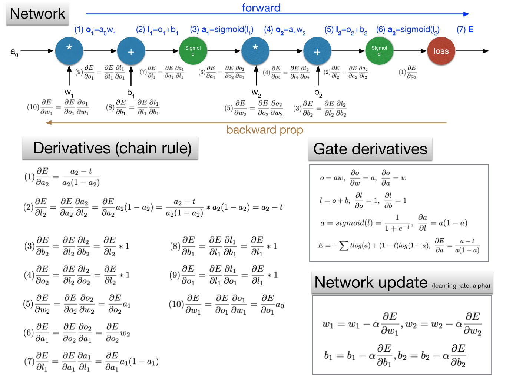

- 다음은 `X, W, b` 가 행렬일때 backpropagation 하는 과정이다.

    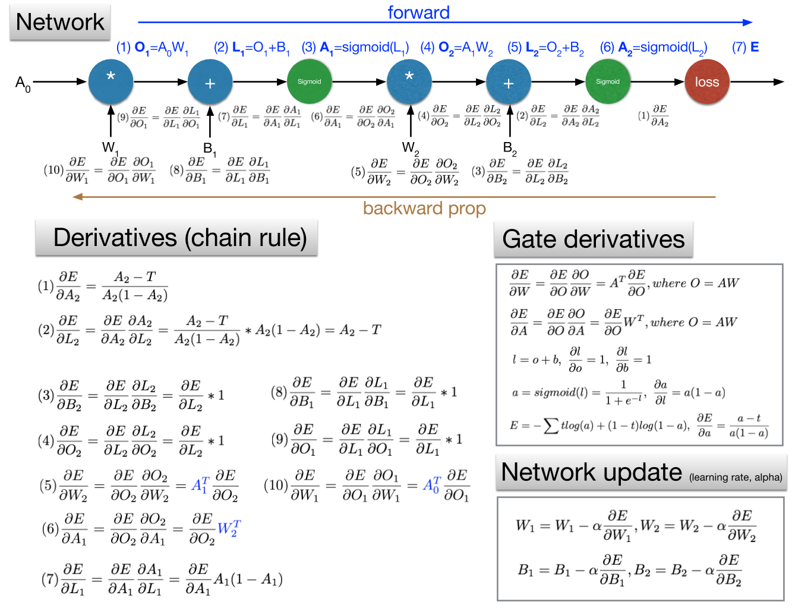

- 다음은 tensorflow 로 backpropagation 을 구현하는 코드중 일부이다.

    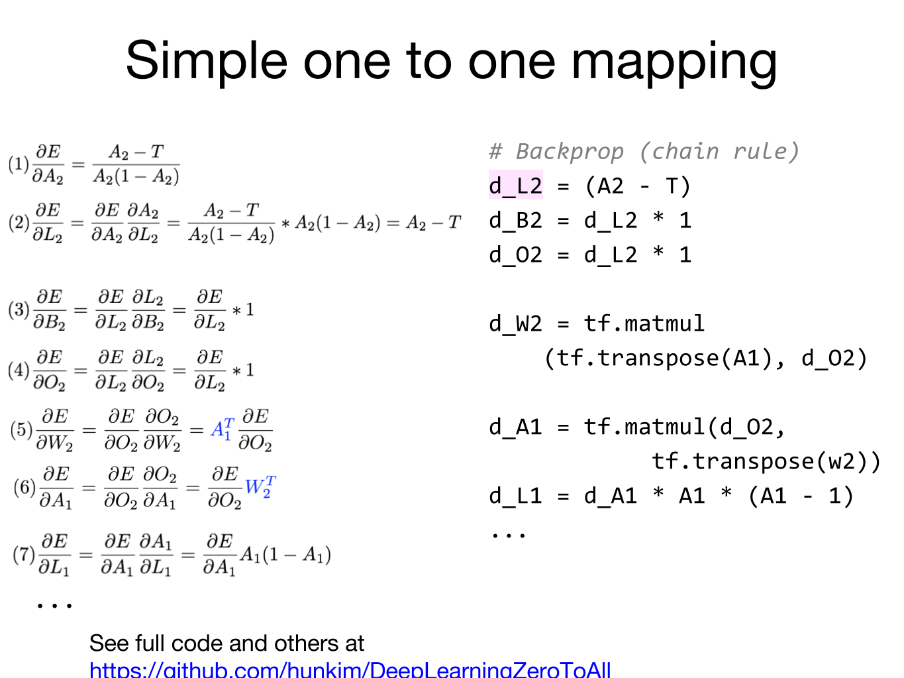

- 다음은 linear regression 를 한개의 입력과 함께 backpropagation 을
  이용하여 구현한 것이다.

```python

```

- 다음은 linear regression을 세개의 입력과 함께 backpropagation을 
  이용하여 구현한 것이다.

```python
# -*- coding: utf-8 -*-
import tensorflow as tf
tf.set_random_seed(777)

# Network
#          p      l1 (y_pred)
# X -> (*) -> (+) -> (E)
#       ^      ^ 
#       |      | 
#       W      b
#
# ∂E/∂b =

def main():
    # set data
    l_X = [[73., 80., 75.],
        [93., 88., 93.],
        [89., 91., 90.],
        [96., 98., 100.],
        [73., 66., 70.]]
    l_Y = [[152.],
        [185.],
        [180.],
        [196.],
        [142.]]
    # set placeholder
    t_X = tf.placeholder(tf.float32, shape=[None, 3])
    t_Y = tf.placeholder(tf.float32, shape=[None, 1])
    # set nodes
    t_W = tf.Variable(tf.truncated_normal([3, 1]))
    t_b = tf.Variable(5.)
    t_H = tf.matmul(t_X, t_W) + t_b
    # set diff
    t_diff = (t_H - t_Y)
    # set back prop
    t_d_l1 = t_diff
    t_d_b = t_d_l1
    t_d_W = tf.matmul(tf.transpose(t_X), t_d_l1)
    # update network
    f_learning_rate = 1e-6
    l_t_step = [
        tf.assign(t_W, t_W - f_learning_rate * t_d_W),
        tf.assign(t_b, t_b - f_learning_rate * tf.reduce_mean(t_d_b))                  
    ]
    t_C = tf.reduce_mean(tf.square(t_Y - t_H))
    # launch nodes
    sess = tf.InteractiveSession()
    sess.run(tf.global_variables_initializer())
    for i in range(1000):
        l_step, f_cost = sess.run([l_t_step, t_C],
                            feed_dict={t_X: l_X, t_Y: l_Y})
        print(f'{i:10d} cost:{f_cost:10.7f} step:\n', l_step)
    print(sess.run(t_H, feed_dict={t_X: l_X}))

if __name__ == "__main__":
    main()
#          0 cost:18157.8496094 step:
#  [array([[0.2744248],
#        [0.243787  ],
#        [0.24169087]], dtype=float32), 4.999914]
#          1 cost:4621.5444336 step:
#  [array([[0.2679961],
#        [0.23747024],
#        [0.23537782]], dtype=float32), 4.999828]
#          2 cost:1185.9375000 step:
#  [array([[0.26170546],
#        [0.23128219],
#        [0.22919461]], dtype=float32), 4.9997425]
# ...
#        998 cost:0.0012345 step:
#  [array([[0.27654612],
#        [0.2737683 ],
#        [0.27484307]], dtype=float32), 4.320453]
#        999 cost:0.0012328 step:
#  [array([[0.27654612],
#        [0.2737683 ],
#        [0.27484307]], dtype=float32), 4.320449]

# [[152.00737]
#  [185.00546]
#  [180.00903]
#  [196.00708]
#  [141.9975 ]]

```

- 다음은 동물분류 문제를 backpropagation을 이용하여 구현한 것이다.

    ```python
    # -*- coding: utf-8 -*-

    # Input: x
    # Layer1: x * W + b
    # Output layer = σ(Layer1)
    #
    # Loss_i = - y * log(σ(Layer1)) - (1 - y) * log(1 - σ(Layer1))
    # Loss = tf.reduce_sum(Loss_i)
    #
    # We want to compute that
    #
    # dLoss/dW = ???
    # dLoss/db = ???
    #
    # Network
    #          p1     a1           l1 (y_pred)
    # X -> (*) -> (+) -> (sigmoid) -> (loss)
    #       ^      ^                 
    #       |      |                 
    #       W1     b1                

    import tensorflow as tf
    import numpy as np
    tf.set_random_seed(777)  # for reproducibility

    def sigma(x):
        # sigmoid function
        # σ(x) = 1 / (1 + exp(-x))
        return 1. / (1. + tf.exp(-x))

    def sigma_prime(x):
        # derivative of the sigmoid function
        # σ'(x) = σ(x) * (1 - σ(x))
        return sigma(x) * (1. - sigma(x))  

    def main():
        # set data
        xy = np.loadtxt('data-04-zoo.csv', delimiter=',', dtype=np.float32)
        X_data = xy[:, :-1]
        N = X_data.shape[0]
        y_data = xy[:, [-1]]
        # print("y has one of the following values")
        # print(np.unique(y_data))
        # print("Shape of X data: ", X_data.shape)
        # print("Shape of y data: ", y_data.shape)
        nb_classes = 7  # 0 ~ 6
        # set place holders
        X = tf.placeholder(tf.float32, [None, 16])
        y = tf.placeholder(tf.int32, [None, 1])  # 0 ~ 6
        # set nodes
        target = tf.one_hot(y, nb_classes)  # one hot
        target = tf.reshape(target, [-1, nb_classes])
        target = tf.cast(target, tf.float32)
        W = tf.Variable(tf.random_normal([16, nb_classes]), name='weight')
        b = tf.Variable(tf.random_normal([nb_classes]), name='bias')
        # set cost/loss node
        l1 = tf.matmul(X, W) + b
        y_pred = sigma(l1)
        loss_i = - target * tf.log(y_pred) - (1. - target) * tf.log(1. - y_pred)
        loss = tf.reduce_sum(loss_i)
        # set back prop
        d_loss = (y_pred - target) / (y_pred * (1. - y_pred) + 1e-7)
        d_sigma = sigma_prime(l1)
        d_l1 = d_loss * d_sigma
        d_b = d_l1
        d_W = tf.matmul(tf.transpose(X), d_l1)
        # update network
        learning_rate = 0.01
        train = [
            tf.assign(W, W - learning_rate * d_W),
            tf.assign(b, b - learning_rate * tf.reduce_sum(d_b)),
        ]
        # set accuracy node
        prediction = tf.argmax(y_pred, 1)
        acct_mat = tf.equal(tf.argmax(y_pred, 1), tf.argmax(target, 1))
        acct_res = tf.reduce_mean(tf.cast(acct_mat, tf.float32))

        # Launch graph
        with tf.Session() as sess:
            sess.run(tf.global_variables_initializer())

            for step in range(500):
                sess.run(train, feed_dict={X: X_data, y: y_data})

                if step % 10 == 0:
                    # Within 300 steps, you should see an accuracy of 100%
                    step_loss, acc = sess.run([loss, acct_res], feed_dict={
                        X: X_data, y: y_data})
                    print("Step: {:5}\t Loss: {:10.5f}\t Acc: {:.2%}" .format(
                        step, step_loss, acc))

            # Let's see if we can predict
            pred = sess.run(prediction, feed_dict={X: X_data})
            for p, y in zip(pred, y_data):
                msg = "[{}]\t Prediction: {:d}\t True y: {:d}"
                print(msg.format(p == int(y[0]), p, int(y[0])))    

    if __name__ == "__main__":
        main()
    # Step:     0	 Loss:  1052.08447	 Acc: 19.80%
    # Step:    10	 Loss:   889.53656	 Acc: 40.59%
    # Step:    20	 Loss:   757.09705	 Acc: 47.52%
    # Step:    30	 Loss:   667.30933	 Acc: 52.48%
    # Step:    40	 Loss:   609.93689	 Acc: 56.44%
    # Step:    50	 Loss:   568.80560	 Acc: 58.42%
    # Step:    60	 Loss:   537.30200	 Acc: 62.38%
    # Step:    70	 Loss:   511.88922	 Acc: 63.37%
    # Step:    80	 Loss:   490.88300	 Acc: 67.33%
    # Step:    90	 Loss:   473.01669	 Acc: 69.31%
    # Step:   100	 Loss:   457.37695	 Acc: 70.30%
    # ...
    # Step:   490	 Loss:    80.23489	 Acc: 95.05%

    # [True]	 Prediction: 0	 True y: 0
    # [True]	 Prediction: 0	 True y: 0
    # [True]	 Prediction: 3	 True y: 3
    # [True]	 Prediction: 0	 True y: 0
    # [True]	 Prediction: 0	 True y: 0
    ```

- 다음은 XOR 문제를 backpropagation을 이용하여 구현한 것이다.

    ```python
    # -*- coding: utf-8 -*-
    import tensorflow as tf
    import numpy as np
    import pprint as pp

    # Network
    #          p1     a1           l1     p2     a2           l2 (y_pred)
    # X -> (*) -> (+) -> (sigmoid) -> (*) -> (+) -> (sigmoid) -> (loss)
    #       ^      ^                   ^      ^
    #       |      |                   |      |
    #       W1     b1                  W2     b2

    def main():
        # set var
        tf.set_random_seed(777)  # for reproducibility
        learning_rate = 0.1

        # set data
        x_data = [[0, 0],
                [0, 1],
                [1, 0],
                [1, 1]]
        y_data = [[0],
                [1],
                [1],
                [0]]
        x_data = np.array(x_data, dtype=np.float32)
        y_data = np.array(y_data, dtype=np.float32)

        # set place holders
        X = tf.placeholder(tf.float32, [None, 2])
        Y = tf.placeholder(tf.float32, [None, 1])

        # set nodes
        W1 = tf.Variable(tf.random_normal([2, 2]), name='weight1')
        b1 = tf.Variable(tf.random_normal([2]), name='bias1')
        l1 = tf.sigmoid(tf.matmul(X, W1) + b1)
        
        W2 = tf.Variable(tf.random_normal([2, 1]), name='weight2')
        b2 = tf.Variable(tf.random_normal([1]), name='bias2')
        Y_pred = tf.sigmoid(tf.matmul(l1, W2) + b2)

        # set cost/loss node
        cost = -tf.reduce_mean(Y * tf.log(Y_pred) + (1 - Y) *
                            tf.log(1 - Y_pred))
        # set backprop nodes
        d_Y_pred = (Y_pred - Y) / (Y_pred * (1.0 - Y_pred) + 1e-7)

        # Layer 2
        d_sigma2 = Y_pred * (1 - Y_pred)
        d_a2 = d_Y_pred * d_sigma2
        d_p2 = d_a2
        d_b2 = d_a2
        d_W2 = tf.matmul(tf.transpose(l1), d_p2)

        # Mean
        d_b2_mean = tf.reduce_mean(d_b2, axis=[0])
        d_W2_mean = d_W2 / tf.cast(tf.shape(l1)[0], dtype=tf.float32)

        # Layer 1
        d_l1 = tf.matmul(d_p2, tf.transpose(W2))
        d_sigma1 = l1 * (1 - l1)
        d_a1 = d_l1 * d_sigma1
        d_b1 = d_a1
        d_p1 = d_a1
        d_W1 = tf.matmul(tf.transpose(X), d_a1)

        # Mean
        d_W1_mean = d_W1 / tf.cast(tf.shape(X)[0], dtype=tf.float32)
        d_b1_mean = tf.reduce_mean(d_b1, axis=[0])

        # set step node
        step = [
            tf.assign(W2, W2 - learning_rate * d_W2_mean),
            tf.assign(b2, b2 - learning_rate * d_b2_mean),
            tf.assign(W1, W1 - learning_rate * d_W1_mean),
            tf.assign(b1, b1 - learning_rate * d_b1_mean)
        ]

        # set accuracy node
        predicted = tf.cast(Y_pred > 0.5, dtype=tf.float32)
        accuracy = tf.reduce_mean(tf.cast(tf.equal(predicted, Y), dtype=tf.float32))

        # Launch graph
        with tf.Session() as sess:
            # Initialize TensorFlow variables
            sess.run(tf.global_variables_initializer())

            print("shape", sess.run(tf.shape(X)[0], feed_dict={X: x_data}))

            for i in range(10001):
                sess.run([step, cost], feed_dict={X: x_data, Y: y_data})
                if i % 1000 == 0:
                    # print(i, sess.run([cost, d_W1], feed_dict={
                    #     X: x_data, Y: y_data}), sess.run([W1, W2]))
                    print(i, sess.run([cost], feed_dict={X: x_data, Y: y_data}),
                                    sess.run([W1, W2]))
                    # print(i, sess.run([cost], feed_dict={X: x_data, Y: y_data}))
            # Accuracy report
            h, c, a = sess.run([Y_pred, predicted, accuracy],
                            feed_dict={X: x_data, Y: y_data})
            print("\nHypothesis: ", h, "\nCorrect: ", c, "\nAccuracy: ", a)
        
    if __name__ == "__main__":
        main()
    # 출력결과는 정확하지 않을 수 있다. 
    # shape 4
    # 0 [0.7957281] [array([[ 0.01442271,  0.6900516 ],
    #        [ 0.05373656, -1.1454563 ]], dtype=float32), array([[ 0.00386628],
    #        [-0.68016535]], dtype=float32)]
    # 1000 [0.0229437] [array([[ 4.9840074, -5.104379 ],
    #        [ 5.019846 , -5.1184373]], dtype=float32), array([[ 8.351467],
    #        [-8.519624]], dtype=float32)]
    # 2000 [0.0112306] [array([[ 7.3493986, -7.598264 ],
    #        [ 7.4052935, -7.621723 ]], dtype=float32), array([[12.563616],
    #        [-12.810543]], dtype=float32)]
    # ...
    # 10000 [0.0018744] [array([[14.472829 , -15.165524 ],
    #        [14.559427 , -15.211853 ]], dtype=float32), array([[27.487623],
    #        [-27.993002]], dtype=float32)]

    # Hypothesis:  [[0.00391275]
    #  [0.9934951 ]
    #  [0.9934951 ]
    #  [0.00598718]] 
    # Correct:  [[0.]
    #  [1.]
    #  [1.]
    #  [0.]] 
    # Accuracy:  1.0
    ```

- XOR 문제를 해결하기 위해 hidden layer 를 9 개 설정해 보자. 정확도는 `0.5` 가 나온다. hidden layer 를 깊게 설정했는데도 왜 이런 현상이 발생할까? activation function 으로 sigmoid 를 사용하면 backpropagation 할 때 vanishing gradient 현상이 발생하기 때문이다. vanishing gradient 란 output layer 에서 hidden layer 를 거쳐 input layer 로 갈수록 입력값의 영향을 덜 받게 되는 현상이다. sigmoid 와 달리 입력값이 0이하일때 출력값이 0 이되는 또 다른 activate function 이 필요하다. sigmoid 보다 ReLU (Rectified Linear Unit) 을 사용하면 vanishing gradient 를 해결 할 수 있다. sigmoid, ReLU를 제외하고도 tanh, Leaky ReLU, Maxout, ELU 등등 Activation Function 들이 있다.

    

- ML학계의 사람들은 weight 값을 잘 정해서 더욱 정확하게 ML 을 할 수 있는 방법을 연구했다. 2006 년 Hinton 교수는 RBM (Restricted Boatman Macine) 을 이용하여 weight 값을 초기화 하면 deep learning 을 효율적으로 할 수 있다고 했다. 그러나 RBM 은 너무 복잡하다.  Xavier initialization 혹은 He's initialization 과 같이 간단한 방법이 더욱 효율적이다. weight 초기값을 어떻게 설정하느냐는 지금도 활발한 연구 분야이다.

    ```python
    # Xavier initialization
    # Glorot et al. 2010
    W = np.random.randn(fan_in, fan_out)/np.sqrt(fan_in)

    # He et al. 2015
    W = np.random.randn(fan_in, fan_out)/np.sqrt(fan_in/2)
    ```

- tensorflow의 wrapper인 [prettytensor](https://github.com/google/prettytensor)의 xavier_init을 참고하자

    ```python
    def xavier_init(n_inputs, n_outputs, uniform=True):
    """Set the parameter initialization using the method described.
    This method is designed to keep the scale of the gradients roughly the same
    in all layers.
    Xavier Glorot and Yoshua Bengio (2010):
            Understanding the difficulty of training deep feedforward neural
            networks. International conference on artificial intelligence and
            statistics.
    Args:
        n_inputs: The number of input nodes into each output.
        n_outputs: The number of output nodes for each input.
        uniform: If true use a uniform distribution, otherwise use a normal.
    Returns:
        An initializer.
    """
    if uniform:
        # 6 was used in the paper.
        init_range = math.sqrt(6.0 / (n_inputs + n_outputs))
        return tf.random_uniform_initializer(-init_range, init_range)
    else:
        # 3 gives us approximately the same limits as above since this repicks
        # values greater than 2 standard deviations from the mean.
        stddev = math.sqrt(3.0 / (n_inputs + n_outputs))
        return tf.truncated_normal_initializer(stddev=stddev)
    ```

- **overfitting** 이란 neural networks 가 training data 의 정확도는 높지만 predicting data 의 정확도는 낮은 현상을 말한다. 이것을 해결하기 위한 방법으로 **regularization**, **dropout** 등이 있다.
  
- **regularization** 은 다음과 같이 새로운 항을 `cost(W, b)` 을 구할때 더한다. `\lambda` 는 `0.001` 로 하자.

    ```python
    l2reg = 0.001 * tf.reduce_sum(tf.square(W))
    ```

    

    ```latex
    \begin{align*} 
    cost(W, b) &= \frac{1}{m} \sum_{i=1}^{m} D(S_{i}, L_{i}) \\
            &= \frac{1}{m} \sum_{i=1}^{m} D(S(WX_{i}+b), L_{i}) + \lambda \sum_{i=1}^{m} W^{2}\\
    \end{align*}
    ```
  
- dropout 이란 neural networks 의 노드중 임의의 것들을 제거하여 overfitting 현상을 해결하는 것이다. tensorflow 로 간단히 구현할 수 있다.

    ```python
    dropout_rate = tf.placeholder("float")
    _L1 = tf.nn.relu(tf.add(tf.matmul(X, W1), B1))
    L1 = tf.nn.dropout(_L1, dropout_rate)

    # TRAIN:
    sess.run(optimizer, feed_dict={X: batch_xs, Y: batch_ys,
    dropout_rate: 0.7})

    # EVALUATION:
    print "Accuracy:", accuracy.eval({X: mnist.test.images, Y:
    mnist.test.labels, dropout_rate: 1})
    ```

- ensemble

- fast forward

- split & merge

- recurrent network

- MNIST 문제를 다양한 방법으로 이용해서 정확도를 향상 시킬 수 있다.
  - softmax regression : 90%
  - softmax regression neural networks : 94.5%
  - softmax regression Xavier initialization : 97.8%
  - batch normalization : ???%
  - CNN : 99%
  
- 다음은 MNIST 를 softmax regression 을 이용하여 구현한 것이다. 정확도는 약 90% 이다. 

    ```python
    # -*- coding: utf-8 -*-
    import tensorflow as tf
    import random
    from tensorflow.examples.tutorials.mnist import input_data
    tf.set_random_seed(777)  # reproducibility

    def main():
        # set data
        mnist = input_data.read_data_sets("MNIST_data/", one_hot=True)

        # set variables
        f_learning_rate = 1e-3
        n_epocs = 15
        n_batch_size = 100

        # set place holders
        t_X = tf.placeholder(tf.float32, [None, 784])
        t_Y = tf.placeholder(tf.float32, [None, 10])

        # set nodes
        t_W = tf.Variable(tf.random_normal([784, 10]))
        t_b = tf.Variable(tf.random_normal([10]))
        t_H = tf.matmul(t_X, t_W) + t_b

        # set train node
        t_C = tf.reduce_mean(tf.nn.softmax_cross_entropy_with_logits(logits=t_H, labels=t_Y))
        t_T = tf.train.AdamOptimizer(learning_rate=f_learning_rate).minimize(t_C)

        # launch nodes
        with tf.Session() as sess:
            sess.run(tf.global_variables_initializer())
            for n_epoch in range(n_epocs):
                f_avg_cost = 0
                n_total_batch = int(mnist.train.num_examples / n_batch_size)
                for i in range(n_total_batch):
                    l_X, l_Y = mnist.train.next_batch(n_batch_size)
                    f_cost, _ = sess.run([t_C, t_T], feed_dict={t_X: l_X, t_Y: l_Y})
                    f_avg_cost += f_cost / n_total_batch
                print(f'epoch: {n_epoch+1:10d} avg_cost: {f_avg_cost:10.7f}')
            print('Learning Finished')

            # check accuracy
            t_pred = tf.equal(tf.argmax(t_H, 1), tf.argmax(t_Y, 1))
            t_accu = tf.reduce_mean(tf.cast(t_pred, tf.float32))
            print('Accuracy:', sess.run(t_accu, feed_dict={
                t_X: mnist.test.images, t_Y: mnist.test.labels}))

            # Get one and predict
            n_r = random.randint(0, mnist.test.num_examples - 1)
            print("Label: ", sess.run(tf.argmax(mnist.test.labels[n_r:n_r + 1], 1)))
            print("Prediction: ", sess.run(tf.argmax(t_H, 1), feed_dict={t_X: mnist.test.images[n_r:n_r + 1]}))

    if __name__ == "__main__":
        main()
    # Extracting MNIST_data/train-images-idx3-ubyte.gz
    # Extracting MNIST_data/train-labels-idx1-ubyte.gz
    # Extracting MNIST_data/t10k-images-idx3-ubyte.gz
    # Extracting MNIST_data/t10k-labels-idx1-ubyte.gz
    # epoch:          1 avg_cost: 1.4712345
    # epoch:          2 avg_cost: 0.5123456
    # epoch:          3 avg_cost: 0.4123456
    # epoch:          4 avg_cost: 0.3678901
    # epoch:          5 avg_cost: 0.3212345
    # epoch:          6 avg_cost: 0.2890123
    # epoch:          7 avg_cost: 0.2678901
    # epoch:          8 avg_cost: 0.2456789
    # epoch:          9 avg_cost: 0.2312345
    # epoch:         10 avg_cost: 0.2123456
    # epoch:         11 avg_cost: 0.1987654
    # epoch:         12 avg_cost: 0.1876543
    # epoch:         13 avg_cost: 0.1789012
    # epoch:         14 avg_cost: 0.1678901
    # epoch:         15 avg_cost: 0.1590123
    # Learning Finished
    # Accuracy: 0.92
    # Label:  [7]
    # Prediction:  [7]
    ```

- 다음은 MNIST 를 softmax regression, neural networks 를 이용하여 구현한 것이다. layer 가 늘어났기 때문에 앞서 구현한 것보다 느려진다. 그러나 정확도는 약 94% 이다.

    ```python
    # -*- coding: utf-8 -*-
    import tensorflow as tf
    import random
    from tensorflow.examples.tutorials.mnist import input_data
    tf.set_random_seed(777)  # reproducibility

    def main():
        # set data
        mnist = input_data.read_data_sets("MNIST_data/", one_hot=True)

        # set variables
        f_learning_rate = 1e-3
        n_epocs = 15
        n_batch_size = 100

        # set place holders
        t_X = tf.placeholder(tf.float32, [None, 784])
        t_Y = tf.placeholder(tf.float32, [None, 10])

        # set nodes
        t_W1 = tf.Variable(tf.random_normal([784, 256]))
        t_b1 = tf.Variable(tf.random_normal([256]))
        t_L1 = tf.nn.relu(tf.matmul(t_X, t_W1) + t_b1)

        t_W2 = tf.Variable(tf.random_normal([256, 256]))
        t_b2 = tf.Variable(tf.random_normal([256]))
        t_L2 = tf.nn.relu(tf.matmul(t_L1, t_W2) + t_b2)

        t_W3 = tf.Variable(tf.random_normal([256, 10]))
        t_b3 = tf.Variable(tf.random_normal([10]))
        t_H = tf.matmul(t_L2, t_W3) + t_b3

        # set train node
        t_C = tf.reduce_mean(tf.nn.softmax_cross_entropy_with_logits(logits=t_H, labels=t_Y))
        t_T = tf.train.AdamOptimizer(learning_rate=f_learning_rate).minimize(t_C)

        # launch nodes
        with tf.Session() as sess:
            sess.run(tf.global_variables_initializer())
            for n_epoch in range(n_epocs):
                f_avg_cost = 0
                n_total_batch = int(mnist.train.num_examples / n_batch_size)
                for i in range(n_total_batch):
                    l_X, l_Y = mnist.train.next_batch(n_batch_size)
                    f_cost, _ = sess.run([t_C, t_T], feed_dict={t_X: l_X, t_Y: l_Y})
                    f_avg_cost += f_cost / n_total_batch
                print(f'epoch: {n_epoch+1:10d} avg_cost: {f_avg_cost:10.7f}')
            print('Learning Finished')

            # check accuracy
            t_pred = tf.equal(tf.argmax(t_H, 1), tf.argmax(t_Y, 1))
            t_accu = tf.reduce_mean(tf.cast(t_pred, tf.float32))
            print('Accuracy:', sess.run(t_accu, feed_dict={
                t_X: mnist.test.images, t_Y: mnist.test.labels}))

            # Get one and predict
            n_r = random.randint(0, mnist.test.num_examples - 1)
            print("Label: ", sess.run(tf.argmax(mnist.test.labels[n_r:n_r + 1], 1)))
            print("Prediction: ", sess.run(tf.argmax(t_H, 1), feed_dict={t_X: mnist.test.images[n_r:n_r + 1]}))

    if __name__ == "__main__":
        main()
    # Extracting MNIST_data/train-images-idx3-ubyte.gz
    # Extracting MNIST_data/train-labels-idx1-ubyte.gz
    # Extracting MNIST_data/t10k-images-idx3-ubyte.gz
    # Extracting MNIST_data/t10k-labels-idx1-ubybe.gz
    # epoch:          1 avg_cost: 157.2284592
    # epoch:          2 avg_cost:  42.1756793
    # epoch:          3 avg_cost:  27.0285216
    # epoch:          4 avg_cost:  18.8107213
    # epoch:          5 avg_cost:  13.6430245
    # epoch:          6 avg_cost:  10.1718901
    # epoch:          7 avg_cost:   7.6261854
    # epoch:          8 avg_cost:   5.7275930
    # epoch:          9 avg_cost:   4.3490486
    # epoch:         10 avg_cost:   3.2446093
    # epoch:         11 avg_cost:   2.4278817
    # epoch:         12 avg_cost:   1.8073412
    # epoch:         13 avg_cost:   1.3590184
    # epoch:         14 avg_cost:   1.0253978
    # epoch:         15 avg_cost:   0.7839484
    # Learning Finished
    # Accuracy: 0.9453
    # Label:  [7]
    # Prediction:  [7]

    ```

- 다음은 MNIST 를 softmax regression, multi layer, xavier init 을 이용하여 구현한 것이다. `W` 만 잘 초기화 해도 이렇게 향상되다니 놀랍다. `W` 를 초기화하는 것은 아직도 활발한 연구 주제라고 한다. 정확도는 약 97% 이다.

    ```python
    # -*- coding: utf-8 -*-
    import tensorflow as tf
    import random
    from tensorflow.examples.tutorials.mnist import input_data
    tf.set_random_seed(777)  # reproducibility

    def main():
        # set data
        mnist = input_data.read_data_sets("MNIST_data/", one_hot=True)

        # set variables
        f_learning_rate = 1e-3
        n_epocs = 15
        n_batch_size = 100

        # set place holders
        t_X = tf.placeholder(tf.float32, [None, 784])
        t_Y = tf.placeholder(tf.float32, [None, 10])

        # set nodes
        t_W1 = tf.get_variable("W1", shape=[784, 256], initializer=tf.contrib.layers.xavier_initializer())
        t_b1 = tf.Variable(tf.random_normal([256]))
        t_L1 = tf.nn.relu(tf.matmul(t_X, t_W1) + t_b1)

        t_W2 = tf.get_variable("W2", shape=[256, 256], initializer=tf.contrib.layers.xavier_initializer())
        t_b2 = tf.Variable(tf.random_normal([256]))
        t_L2 = tf.nn.relu(tf.matmul(t_L1, t_W2) + t_b2)

        t_W3 = tf.get_variable("W3", shape=[256, 10], initializer=tf.contrib.layers.xavier_initializer())
        t_b3 = tf.Variable(tf.random_normal([10]))
        t_H  = tf.matmul(t_L2, t_W3) + t_b3    

        # set train node
        t_C = tf.reduce_mean(tf.nn.softmax_cross_entropy_with_logits(logits=t_H, labels=t_Y))
        t_T = tf.train.AdamOptimizer(learning_rate=f_learning_rate).minimize(t_C)

        # launch nodes
        with tf.Session() as sess:
            sess.run(tf.global_variables_initializer())
            for n_epoch in range(n_epocs):
                f_avg_cost = 0
                n_total_batch = int(mnist.train.num_examples / n_batch_size)
                for i in range(n_total_batch):
                    l_X, l_Y = mnist.train.next_batch(n_batch_size)
                    f_cost, _ = sess.run([t_C, t_T], feed_dict={t_X: l_X, t_Y: l_Y})
                    f_avg_cost += f_cost / n_total_batch

                print('Epoch:', '%04d' % (n_epoch + 1), 'cost =', '{:.9f}'.format(f_avg_cost))
            print('Learning Finished')

            # check accuracy
            t_pred = tf.equal(tf.argmax(t_H, 1), tf.argmax(t_Y, 1))
            t_accu = tf.reduce_mean(tf.cast(t_pred, tf.float32))
            print('Accuracy:', sess.run(t_accu, feed_dict={
                t_X: mnist.test.images, t_Y: mnist.test.labels}))

            # Get one and predict
            n_r = random.randint(0, mnist.test.num_examples - 1)
            print("Label: ", sess.run(tf.argmax(mnist.test.labels[n_r:n_r + 1], 1)))
            print("Prediction: ", sess.run(tf.argmax(t_H, 1), feed_dict={t_X: mnist.test.images[n_r:n_r + 1]}))


    if __name__ == "__main__":
        main()
    # Extracting MNIST_data/train-images-idx3-ubyte.gz
    # Extracting MNIST_data/train-labels-idx1-ubyte.gz
    # Extracting MNIST_data/t10k-images-idx3-ubyte.gz
    # Extracting MNIST_data/t10k-labels-idx1-ubybe.gz
    # Epoch: 0001 cost = 0.297684923
    # Epoch: 0002 cost = 0.112345674
    # Epoch: 0003 cost = 0.075678345
    # Epoch: 0004 cost = 0.053456789
    # Epoch: 0005 cost = 0.040567890
    # Epoch: 0006 cost = 0.032345678
    # Epoch: 0007 cost = 0.025678901
    # Epoch: 0008 cost = 0.021234567
    # Epoch: 0009 cost = 0.017890123
    # Epoch: 0010 cost = 0.015678901
    # Epoch: 0011 cost = 0.013456789
    # Epoch: 0012 cost = 0.011890123
    # Epoch: 0013 cost = 0.010567890
    # Epoch: 0014 cost = 0.009345678
    # Epoch: 0015 cost = 0.008567890
    # Learning Finished
    # Accuracy: 0.9745
    # Label:  [7]
    # Prediction:  [7]

    ```

- 다음은 MNIST 를 softmax regression, deep layer, xavier init 을 이용하여 구현한 것이다. 정확도는 약 97% 이다. layer 가 더욱 깊어지고 수행시간은 더욱 늘어났지만 정확도는 향상되지 않았다. 뭔가 다른 방법이 필요하다.

    ```python
    # -*- coding: utf-8 -*-
    import tensorflow as tf
    import random
    from tensorflow.examples.tutorials.mnist import input_data
    tf.set_random_seed(777)  # reproducibility

    def main():
        # set data
        mnist = input_data.read_data_sets("MNIST_data/", one_hot=True)

        # set variables
        f_learning_rate = 1e-3
        n_epocs = 15
        n_batch_size = 100

        # set place holders
        t_X = tf.placeholder(tf.float32, [None, 784])
        t_Y = tf.placeholder(tf.float32, [None, 10])

        # set nodes
        t_W1 = tf.get_variable("W1", shape=[784, 256], initializer=tf.contrib.layers.xavier_initializer())
        t_b1 = tf.Variable(tf.random_normal([256]))
        t_L1 = tf.nn.relu(tf.matmul(t_X, t_W1) + t_b1)

        t_W2 = tf.get_variable("W2", shape=[256, 256], initializer=tf.contrib.layers.xavier_initializer())
        t_b2 = tf.Variable(tf.random_normal([256]))
        t_L2 = tf.nn.relu(tf.matmul(t_L1, t_W2) + t_b2)

        t_W3 = tf.get_variable("W3", shape=[256, 256], initializer=tf.contrib.layers.xavier_initializer())
        t_b3 = tf.Variable(tf.random_normal([256]))
        t_L3 = tf.nn.relu(tf.matmul(t_L2, t_W3) + t_b3)

        t_W4 = tf.get_variable("W4", shape=[256, 256], initializer=tf.contrib.layers.xavier_initializer())
        t_b4 = tf.Variable(tf.random_normal([256]))
        t_L4 = tf.nn.relu(tf.matmul(t_L3, t_W4) + t_b4)

        t_W5 = tf.get_variable("W5", shape=[256, 10], initializer=tf.contrib.layers.xavier_initializer())
        t_b5 = tf.Variable(tf.random_normal([10]))
        t_H  = tf.matmul(t_L4, t_W5) + t_b5    

        # set train node
        t_C = tf.reduce_mean(tf.nn.softmax_cross_entropy_with_logits(logits=t_H, labels=t_Y))
        t_T = tf.train.AdamOptimizer(learning_rate=f_learning_rate).minimize(t_C)

        # launch nodes
        with tf.Session() as sess:
            sess.run(tf.global_variables_initializer())
            for n_epoch in range(n_epocs):
                f_avg_cost = 0
                n_total_batch = int(mnist.train.num_examples / n_batch_size)
                for i in range(n_total_batch):
                    l_X, l_Y = mnist.train.next_batch(n_batch_size)
                    f_cost, _ = sess.run([t_C, t_T], feed_dict={t_X: l_X, t_Y: l_Y})
                    f_avg_cost += f_cost / n_total_batch

                print('Epoch:', '%04d' % (n_epoch + 1), 'cost =', '{:.9f}'.format(f_avg_cost))
            print('Learning Finished')

            # check accuracy
            t_pred = tf.equal(tf.argmax(t_H, 1), tf.argmax(t_Y, 1))
            t_accu = tf.reduce_mean(tf.cast(t_pred, tf.float32))
            print('Accuracy:', sess.run(t_accu, feed_dict={
                t_X: mnist.test.images, t_Y: mnist.test.labels}))

            # Get one and predict
            n_r = random.randint(0, mnist.test.num_examples - 1)
            print("Label: ", sess.run(tf.argmax(mnist.test.labels[n_r:n_r + 1], 1)))
            print("Prediction: ", sess.run(tf.argmax(t_H, 1), feed_dict={t_X: mnist.test.images[n_r:n_r + 1]}))


    if __name__ == "__main__":
        main()
    # Extracting MNIST_data/train-images-idx3-ubyte.gz
    # Extracting MNIST_data/train-labels-idx1-ubyte.gz
    # Extracting MNIST_data/t10k-images-idx3-ubyte.gz
    # Extracting MNIST_data/t10k-labels-idx1-ubybe.gz
    # Epoch: 0001 cost = 0.297684923
    # Epoch: 0002 cost = 0.112345674
    # Epoch: 0003 cost = 0.075678345
    # Epoch: 0004 cost = 0.053456789
    # Epoch: 0005 cost = 0.040567890
    # Epoch: 0006 cost = 0.032345678
    # Epoch: 0007 cost = 0.025678901
    # Epoch: 0008 cost = 0.021234567
    # Epoch: 0009 cost = 0.017890123
    # Epoch: 0010 cost = 0.015678901
    # Epoch: 0011 cost = 0.013456789
    # Epoch: 0012 cost = 0.011890123
    # Epoch: 0013 cost = 0.010567890
    # Epoch: 0014 cost = 0.009345678
    # Epoch: 0015 cost = 0.008567890
    # Learning Finished
    # Accuracy: 0.9745
    # Label:  [7]
    # Prediction:  [7]

    ```

- 다음은 MNIST 를 softmax regression, deep layer, xavier init, drop out 을 이용하여 구현한 것이다. keep_prob 은 dropout 의 정도를 의미한다. 학습할때는 node 가 듬성 듬성 배치되는 것이 좋기 때문에 0.7 정도가 적당하고 검증할때는 모든 노드가 배치되어야 하므로 1 이 되야 한다. 정확도는 약 98% 이다.
    
    ```python
    # -*- coding: utf-8 -*-
    import tensorflow as tf
    import random
    from tensorflow.examples.tutorials.mnist import input_data
    tf.set_random_seed(777)  # reproducibility

    def main():
        # set data
        mnist = input_data.read_data_sets("MNIST_data/", one_hot=True)

        # set variables
        f_learning_rate = 1e-3
        n_epocs = 15
        n_batch_size = 100

        # set place holders
        t_X = tf.placeholder(tf.float32, [None, 784])
        t_Y = tf.placeholder(tf.float32, [None, 10])
        t_K = tf.placeholder(tf.float32) # keep prob

        # set nodes
        t_W1 = tf.get_variable("W1", shape=[784, 256], initializer=tf.contrib.layers.xavier_initializer())
        t_b1 = tf.Variable(tf.random_normal([256]))
        t_L1 = tf.nn.relu(tf.matmul(t_X, t_W1) + t_b1)
        t_L1 = tf.nn.dropout(L1, keep_prob=t_K)

        t_W2 = tf.get_variable("W2", shape=[256, 256], initializer=tf.contrib.layers.xavier_initializer())
        t_b2 = tf.Variable(tf.random_normal([256]))
        t_L2 = tf.nn.relu(tf.matmul(t_L1, t_W2) + t_b2)
        t_L2 = tf.nn.dropout(L1, keep_prob=t_K)

        t_W3 = tf.get_variable("W3", shape=[256, 256], initializer=tf.contrib.layers.xavier_initializer())
        t_b3 = tf.Variable(tf.random_normal([256]))
        t_L3 = tf.nn.relu(tf.matmul(t_L2, t_W3) + t_b3)
        t_L3 = tf.nn.dropout(L1, keep_prob=t_K)

        t_W4 = tf.get_variable("W4", shape=[256, 256], initializer=tf.contrib.layers.xavier_initializer())
        t_b4 = tf.Variable(tf.random_normal([256]))
        t_L4 = tf.nn.relu(tf.matmul(t_L3, t_W4) + t_b4)
        t_L4 = tf.nn.dropout(L1, keep_prob=t_K)

        t_W5 = tf.get_variable("W5", shape=[256, 10], initializer=tf.contrib.layers.xavier_initializer())
        t_b5 = tf.Variable(tf.random_normal([10]))
        t_H  = tf.matmul(t_L4, t_W5) + t_b5    

        # set train node
        t_C = tf.reduce_mean(tf.nn.softmax_cross_entropy_with_logits(logits=t_H, labels=t_Y))
        t_T = tf.train.AdamOptimizer(learning_rate=f_learning_rate).minimize(t_C)

        # launch nodes
        with tf.Session() as sess:
            sess.run(tf.global_variables_initializer())
            for n_epoch in range(n_epocs):
                f_avg_cost = 0
                n_total_batch = int(mnist.train.num_examples / n_batch_size)
                for i in range(n_total_batch):
                    l_X, l_Y = mnist.train.next_batch(n_batch_size)
                    f_cost, _ = sess.run([t_C, t_T], feed_dict={t_X: l_X, t_Y: l_Y, t_K: 0.7})
                    f_avg_cost += f_cost / n_total_batch

                print('Epoch:', '%04d' % (n_epoch + 1), 'cost =', '{:.9f}'.format(f_avg_cost))
            print('Learning Finished')

            # check accuracy
            t_pred = tf.equal(tf.argmax(t_H, 1), tf.argmax(t_Y, 1))
            t_accu = tf.reduce_mean(tf.cast(t_pred, tf.float32))
            print('Accuracy:', sess.run(t_accu, feed_dict={
                t_X: mnist.test.images, t_Y: mnist.test.labels, t_K: 1.0}))

            # Get one and predict
            n_r = random.randint(0, mnist.test.num_examples - 1)
            print("Label: ", sess.run(tf.argmax(mnist.test.labels[n_r:n_r + 1], 1)))
            print("Prediction: ", sess.run(tf.argmax(t_H, 1), feed_dict={t_X: mnist.test.images[n_r:n_r + 1], t_K: 1.0}))


    if __name__ == "__main__":
        main()
    # Extracting MNIST_data/train-images-idx3-ubyte.gz
    # Extracting MNIST_data/train-labels-idx1-ubyte.gz
    # Extracting MNIST_data/t10k-images-idx3-ubyte.gz
    # Extracting MNIST_data/t10k-labels-idx1-ubybe.gz
    # Epoch: 0001 cost = 0.297684923
    # Epoch: 0002 cost = 0.112345674
    # Epoch: 0003 cost = 0.075678345
    # Epoch: 0004 cost = 0.053456789
    # Epoch: 0005 cost = 0.040567890
    # Epoch: 0006 cost = 0.032345678
    # Epoch: 0007 cost = 0.025678901
    # Epoch: 0008 cost = 0.021234567
    # Epoch: 0009 cost = 0.017890123
    # Epoch: 0010 cost = 0.015678901
    # Epoch: 0011 cost = 0.013456789
    # Epoch: 0012 cost = 0.011890123
    # Epoch: 0013 cost = 0.010567890
    # Epoch: 0014 cost = 0.009345678
    # Epoch: 0015 cost = 0.008567890
    # Learning Finished
    # Accuracy: 0.9800
    # Label:  [7]
    # Prediction:  [7]

    ```

- MNIST 를 CNN 을 이용하여 구현하면 정확도를 약 99% 로 만들 수 있다. CNN 은 도대체 무엇일까?

# CNN (Convolutional Neural Networks)

[CNN](cnn.md)

# RNN (Recurrent Neural Networks)

[RNN](rnn.md)

# RL (Reinforcement Learning)

* [reinforcement learning](/reinforcementlearning/README.md)

# GAN (Generative Adversarial Network)

* [Generative Adversarial Network](/gan/README.md)

# NLP (Natural Language Processing)

- [Natural Language Processing](/nlp/README.md)

# Transformers

- [Transformer](/transformer/README.md)
- [whisper](/whisper/README.md)

# Glossory

[Machine Learning Glossary](mlglossary.md)

# References

- [itex2img](http://www.sciweavers.org/free-online-latex-equation-editor)
  - github markdown에서 수식을 입력할때 사용하자.
- [tflearn](https://github.com/tflearn/tflearn)
  - tensorflow wrapper
- [prettytensor](https://github.com/google/prettytensor)
  - tensorflow wrapper
