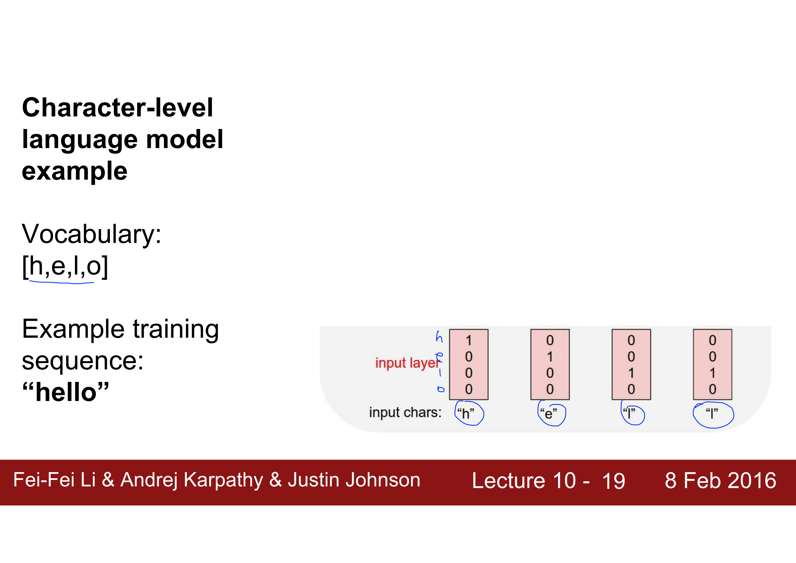

- [Abstract](#abstract)
- [Essentials](#essentials)
- [Materials](#materials)
- [Expectation Function](#expectation-function)
- [Entropy](#entropy)
- [Cross Entropy](#cross-entropy)
- [KLD (Kullback–Leibler divergence)](#kld-kullback%E2%80%93leibler-divergence)
- [JSD (Jensson Shannon Divergence)](#jsd-jensson-shannon-divergence)
- [Posterior](#posterior)
- [Prior](#prior)
- [Likelihood](#likelihood)
- [Bayes' Rule](#bayes-rule)
- [MLE (Maximum Likelihood Estimation)](#mle-maximum-likelihood-estimation)
- [MAP (Maximum A Posterior)](#map-maximum-a-posterior)
- [Supervised Learning](#supervised-learning)
- [Unsupervised Learning](#unsupervised-learning)
- [Semisupervised Learning](#semisupervised-learning)
- [Reinforcement Learning](#reinforcement-learning)
- [Linear regression with one variable](#linear-regression-with-one-variable)
- [Linear regression with multiple variables](#linear-regression-with-multiple-variables)
- [Logistic Regression (binary classification)](#logistic-regression-binary-classification)
- [Example: Titanic](#example-titanic)
- [Softmax Regression (multinomial classification)](#softmax-regression-multinomial-classification)
- [Machine Learning Tips](#machine-learning-tips)
- [Example: Digit Recognizer](#example-digit-recognizer)
- [Deep Learning Fundamentals](#deep-learning-fundamentals)
- [NN (Neural Networks)](#nn-neural-networks)
- [CNN (Convolutional Neural Networks)](#cnn-convolutional-neural-networks)
- [RNN (Recurrent Neural Networks)](#rnn-recurrent-neural-networks)
- [RL (Reinforcement Learning)](#rl-reinforcement-learning)
- [GAN (Generative Adversarial Network)](#gan-generative-adversarial-network)
- [NLP (Natural Language Processing)](#nlp-natural-language-processing)
- [References](#references)

-----

# Abstract

- machine learning 이란 다량의 데이터를 이용하여 학습하고 예측하는 것에 대한 학문이다.
  예를 들어서 machine learning 을 이용하면 다음과 같은 것을 할 수 있다.
  학생들의 등교시간과 성적에 관한 데이터를 이용하여 새로 전학온 학생의 등교시간을 입력하면
  성적을 예상 할 수 있다.
- machine learning 은 회귀분석, 다변량분석, 군집분석, 확률분포 추정,
  마르코프, 은닉마르토크 모델, 서포트 벡터 머신, 베이즈의법칙, 베이즈 확률론,
  베이지언 통계등등 통계학에서 많은 부분들이 인용되었다. 
- machine learning 의 종류는 크게 supervised learning, unsupervised learning
  semisupervised learning, reinforcement learning 으로 분류할 수 있다.
  다음은 위키피디아가 분류한 것들이다. supervised learning, clustering,
  dimensionality reduction, structured prediction, anomaly detenction,
  neural nets, reinforcement learning
- deep learning 은 한개이상의 hidden layer 가 존재하는 neural networks 를 다루는 학문이다.
  deep 의 의미는 hidden layer 가 많아지면 점점 깊어진다는 의미이다.
- 다음과 같은 용어들을 중심으로 공부해본다. linear regression with one variable,
  hypothesis function, weight, bias, feature
  loss, gradiant decent algorithm, epoch, cost function,
  MSE (mean squared error), derivative, 
  linear regression with multiple variables, 
  logistic regression, regularization,
  softmax regression (multinomial regression), 
  overfitting, cross entropy, NN (Neural Networks), drop out, activation function,
  sigmoid, ReLU, learning rate, forward propagation, back propagation,
  CNN (Convolutional Neural Networks), RNN (Recurrent Neural Networks)

# Essentials

- [모두를 위한 머신러닝/딥러닝 시즌 2](https://deeplearningzerotoall.github.io/season2/)
  - [tensorflow](https://deeplearningzerotoall.github.io/season2/lec_tensorflow.html)
  - [pytorch](https://deeplearningzerotoall.github.io/season2/lec_pytorch.html)
- [모두를 위한 머신러닝/딥러닝 강의](http://hunkim.github.io/ml/)
  - 한글로 제일 쉽게 설명하는 자료이다. 
- [(2018) 인공지능 및 기계학습 개론Ⅰ @ edwith](https://kaist.edwith.org/machinelearning1_17)
  - 카이스트 산업공학과 문일철 교수 강의
- [(2018) 인공지능 및 기계학습 개론ⅠI @ edwith](https://kaist.edwith.org/machinelearning2__17)
  - 카이스트 산업공학과 문일철 교수 강의
- [(2018) 인공지능 및 기계학습 심화 @ edwith](https://kaist.edwith.org/aiml-adv)
  - 카이스트 산업공학과 문일철 교수 강의
- [최신 논문으로 시작하는 딥러닝](http://www.edwith.org/deeplearningchoi/joinLectures/10979)
  - 최성준님의 강좌. 모두를 위한 머신러닝을 클리어 하고 학습하면 좋다.
  - [src](https://github.com/sjchoi86/dl_tutorials_10weeks)
- [머신러닝 단기집중과정 @ google](https://developers.google.com/machine-learning/crash-course/prereqs-and-prework?hl=ko)
- [cs229, cs230, cme102, cme106 cheatsheets](https://stanford.edu/~shervine/teaching.html)
  - machine learning, deep learning, probability, statistics cheatsheets
- [골빈해커의 3분 딥러닝](http://www.yes24.com/24/goods/49853812?scode=032&OzSrank=1)
  - [src](https://github.com/golbin/TensorFlow-Tutorials)
- [PR12 딥러닝 논문읽기 모임 season-1 @ youtube](https://m.youtube.com/watch?v=auKdde7Anr8&list=PLWKf9beHi3Tg50UoyTe6rIm20sVQOH1br)
  - 딥러닝 논문읽기 모임 동영상 시즌 1
- [PR12 딥러닝 논문읽기 모임 season-2 @ youtube](https://www.youtube.com/watch?v=FfBp6xJqZVA&list=PLWKf9beHi3TgstcIn8K6dI_85_ppAxzB8&fbclid=IwAR2P2XP1dWIRhJtExFQ2t6ZxkRNyiFpnmI9749cEoU6OSjr67nCvggBP-5Y)
  - 딥러닝 논문읽기 모임 동영상 시즌 2
- [Hands-On Machine Learning with Scikit-Learn and TensorFlow](http://www.hanbit.co.kr/store/books/look.php?p_code=B9267655530)
  - [src](https://github.com/rickiepark/handson-ml)

# Materials

- [100+ Basic Machine Learning Interview Questions and Answers](https://theprofessionalspoint.blogspot.com/2019/01/100-basic-machine-learning-interview.html?m=1&fbclid=IwAR3VAZ_58yR5A7F2-YiYFdiV5bW2gwkz_aE8WnxbzZ6RHUZ7FvANj4l893I)
  - machine learning 인터뷰 퀴즈 모음
- [모두를 위한 컨벡스 최적화 (Convex Optimization For All)](https://wikidocs.net/book/1896)
  - 최적화 문제를 정리한 책 
- [math for machine learning](https://mml-book.github.io/)
  - 머신러닝을 위한 수학 공짜책
- [paper with code](https://paperswithcode.com/)
  - 논문과 구현
- [machine learning at coursera](https://www.coursera.org/learn/machine-learning)
  - andrew Ng교수의 machine learning강좌
  - 영문이지만 기초를 공부할 수 있다.
- [machine learning note](http://www.holehouse.org/mlclass/)
  - andrew Ng교수의 machine learning강좌 노트
- [deep learning tutorial](http://deeplearning.stanford.edu/tutorial/)
  - standford 대학의 tutorial이다. 코드와 텍스트가 가득하다.
- [Andrej Karpathy's Youtube channel](https://www.youtube.com/channel/UCPk8m_r6fkUSYmvgCBwq-sw)
- [CS231n: Convolutional Neural Networks for Visual Recognition](http://cs231n.stanford.edu/syllabus.html)
  - 화상인식을 위한 CNN
- [CS224d: Deep Learning for Natural Language Processing]()
  - 자연어처리를 위한 Deep Learning
- [Deep learning @ Udacity](https://www.udacity.com/course/viewer#!/c-ud730/l-6370362152/m-6379811817)
- [Google AI course](https://ai.google/education)
  - 구글의 AI 코스웨어
- 김훈 링크
  1. 뽀로로QA와 심층 임베딩 메모리망, 김경민, 서울대 박사과정, http://tv.naver.com/v/2231323
  2. Multimodal Sequential Learning for Video QA, 김은솔, 서울대 박사과정, http://tv.naver.com/v/2218642
  3. Finding connections among images using CycleGAN, 박태성, UC Berkeley 박사과정, http://tv.naver.com/v/2203900
  4. Learning to reason by reading text and answering questions, 서민준, Washington Univ. 박사과정, http://tv.naver.com/v/2083653
  5. 조음 Goodness-Of-Pronunciation 자질을 이용한 영어 학습자의 조음 오류 진단, 류혁수, 서울대 박사과정, http://tv.naver.com/v/2152689
  6. 1시간만에 GAN(Generative Adversarial Network) 완전 정복하기, 최윤제, 고려대 석사과정, http://tv.naver.com/v/1947034
  7. Introduction of Deep Reinforcement Learning, 곽동현, (서울대 박사과정, Now Naver), http://tv.naver.com/v/2024376
  8. Deep Learning, Where are you going?, 조경현, NYU 교수, http://tv.naver.com/v/1967400
  9. Deepmind StarCraft II AI, 송호연(Kakao), http://tv.naver.com/v/2451300
  10. 블록과 함께하는 케라스와 태양에서 세포까지 활용사, 김태영(인스페이스 CTO), http://tv.naver.com/v/2440383
  11. 2017 R-Biz Challange 터틀봇3 오토레이스, 길기종(동아대학교 석사과정), http://tv.naver.com/v/2404922
  12. Speeding Up Distributed Machine Learning Using Codes, 이강욱 (KAIST 박사 후 연구원), http://tv.naver.com/v/2389070
  13. Recommender system for education, 서창호 (KAIST 교수), http://tv.naver.com/v/2345343
  14. 기계학습을 이용하여 정적 분석기의 안전성을 선별적으로 조절하는 방법, 허기홍 (서울대 박사과정), http://tv.naver.com/v/2345246
  15. 사람 뽑는 기계 만들기, 송호원(OnboardIQ), http://tv.naver.com/v/2343656
  16. The Personal Home Service Robot that Won the RoboCup@Home League, 이범진(서울대 박사과정), http://tv.naver.com/v/2317076
  17. 그림 그리는 AI, 이활석 (Naver Clova), http://tv.naver.com/v/2417457
  18. Learning to Perceive the 3D World, 최봉수(Stanford University 박사 과정) http://tv.naver.com/v/2316860
  19. Variational Autoencoded Regression of Visual Data with Generative Advers, 유영준 (서울대 박사 후 연구원, Now Naver), http://tv.naver.com/v/2290853
  20. Learning where and how to look for weakly-supervised visual recognition, 이용재 (Yong Jae Lee, UC Davis), http://tv.naver.com/v/2261079
  21. Contour-Constrained Superpixels for Image and Video Processing, 이세호(고려대 박사과정), http://tv.naver.com/v/2260981
  22. Online video object segmentation via convolutional trident network, 장원동 (고려대 박사과정), http://tv.naver.com/v/2257232
  23. Video Object Segmentation in Videos, 고영준 (고려대 박사과정), http://tv.naver.com/v/2237808
  24. Step-by-step approach to question answering, 민세원 (서울대 학부 4학년), http://tv.naver.com/v/2152722
  25. 알아두면 쓸 데있는 신기한 강화학습, 김태훈 (데브시스터즈), http://tv.naver.com/v/2051482
  26. RLCode와 A3C 쉽고 깊게 이해하기, 이웅원(RLCode 리더), http://tv.naver.com/v/2022271
  27. Deepmind StarCraft II AI, 송호연(Kakao, now Naver), http://tv.naver.com/v/2451300


- [인공지능 - 이건명](http://www.kocw.net/home/search/kemView.do?kemId=1170523)
  - 인공지능의 기본 개념을 살펴보고, 탐색과 최적화 기법, 지식표현의
    다양한 방법과 추론 기법, 딥러닝을 비롯한 기계학습 방법, 계획수립
    방법을 다룬다.
- [2013 2학기 선형대수 - 이상화](https://www.youtube.com/playlist?list=PLSN_PltQeOyjDGSghAf92VhdMBeaLZWR3)
- [확률및통계 - 이상화](http://www.kocw.net/home/search/kemView.do?kemId=1056974)
- [artificial intelligence: a modern approach by stuart russel, peter norvig](http://aima.cs.berkeley.edu/)
  - peter norvig의 교과서.
  - [한글](http://www.aladin.co.kr/shop/wproduct.aspx?ItemId=76161975)책도
    있다. 류광이 번역했기 때문에 읽어보자.
- [deep learning by Ian goodfellow](http://www.deeplearningbook.org/)
  - 기초수학부터 차근차근 deep learning에 대해 설명한다. 공짜
- [PyTorch로 시작하는 딥러닝 입문 CAMP @ github](https://github.com/GunhoChoi/PyTorch-FastCampus)
  - fastcampus 유료 강좌의 강의 자료
- [google ai experiments](https://experiments.withgoogle.com/ai)
  - 구글의 AI실험
- [deep learning papers @ github](https://github.com/sbrugman/deep-learning-papers)
  - 딥러닝 논문들을 task와 date별로 정리
- [awesome deep learning papers @ github](https://github.com/terryum/awesome-deep-learning-papers)
  - 테리의 딥러닝 논문 추천
- [tensorflow](https://www.tensorflow.org)
- [TensorFlow Tutorials (Simple Examples)](https://github.com/nlintz/TensorFlow-Tutorials)
- [Another TensorFlow Tutorials](https://github.com/pkmital/tensorflow_tutorials)
- [TensorFlow Examples](https://github.com/aymericdamien/TensorFlow-Examples)

# Expectation Function

기대값 `E(X)` 을 어떻게 구하는지 설명한다. 완벽한 세계에서 주사위를 던지는 상황을 생각해 보자. 확률변수 X 와 P(X) 는 다음과 같다.

| X | 1 | 2 | 3 | 4 | 5 | 6 |
|---|---|---|---|---|---|---|
| P(X) | 1/6 | 1/6 | 1/6 | 1/6 | 1/6 | 1/6 |

다음은 확률변수 X 가 Discrete Space 에 속하는 경우와 X 가 continuous Space 에 속할 때의 `E(x)` 이다.


```latex
\begin{align*}
E_{x \sim  p(x)} [X] &= \sum _x p(x) X \\
                     &= \int _x p(x) X dx
\end{align*}
```

확률변수 `X` 가 함수 일수도 있다. 확률변수가 `f(x)` 라고 하면 `E(f(x))` 는 다음과 같다.


```latex
\begin{align*}
E_{x \sim  p(x)} [f(x)] &= \sum _x p(x) f(x) \\
                        &= \int _x p(x) f(x) dx
\end{align*}
```

# Entropy

* [참고](http://t-robotics.blogspot.com/2017/08/26-entropy.html)
* [Entropy & Information Theory](https://hyeongminlee.github.io/post/prob001_information_theory/)
* [Information Theory 1편 @ brunch](https://brunch.co.kr/@chris-song/68)

정보를 최적으로 인코딩하기 위해 필요한 bit 의 수를 말한다.

예를 들어서 오늘이 무슨 요일인지 bit 로 표현해보자. 요일의 개수가
모두 7개이니까 3비트가 필요하다. `(log_{2}7 = 2.8073)`

```
월 : 000
화 : 001
수 : 010
...
```

만약 표현할 정보가 나타날 확률이 다르다고 해보자. 예를 들어
40 개의 문자 (A, B, C, D, ..., Z, 1, 2, 3, ..., 14) 를
bit 로 표현해보자. 40 개이기 때문에 6 bit 가 필요하다. (log_{2}40 = 5.3219)

그런데 A, B, C, D 가 발생할 확률이 각각 22.5% 라고 해보자.
모두 합하면 90% 확률이다. 6개의 비트를 모두 사용할 필요가 없다.

첫번째 비트를 A, B, C, D 인지 아닌지를 표현하도록 하자. 만약 첫번째 비트가
1 이면 추가로 2 비트만 있으면 A, B, C, D 를 구분할 수 있다. 만약 첫번째 비트가
0 이면 추가로 6 bit 가 필요하다. (log_{2}36 = 5.17) 결과적으로 필요한 비트는 3.3 비트가 된다. 확률을 고려했을 때 평균적으로 필요한 비트의 수를 엔트로피라고 한다.

```
0.9 * 3 + 0.1 * 6 = 3.3 bit
```

Entropy 의 공식을 다음과 같이 정리할 수 있다.


```latex
\begin{align*}
H &= \sum _{i} p_{i} I(s_{i}) \\
  &= \sum _{i} p_{i} \log _{2} (\frac {1}{p_{i}}) \\
  &= - \sum _{i} p_{i} \log _{2} (p_{i})
\end{align*}
```

`I(s_{i})` 를 information gain 이라고 할 수 있다. information gain 은 획득한 정보의 양을 얘기하는데 이것은 그 정보가 나타날 확률에 반비례한다. 예를 들어 김씨가 임씨보다 많다.
어떤 사람이 임씨일 경우 information gain 은 김씨일 경우보다 높다. 더우 희귀한 성이기 
때문에 그 사람에 대해 더욱 많은 정보를 획득했다고 할 수 있다.

결국 Entropy 는 정보량 (information gain) 의 기대값 (expectation) 이다.

# Cross Entropy

* [[신경망기초] 크로스엔트로피손실함수](https://www.slideshare.net/jaepilko10/ss-91071277)
* [참고](http://t-robotics.blogspot.com/2017/08/27-cross-entropy-kl-divergence.html)

다른 사건의 확률을 곱해서 Entropy 를 계산한 것이다. negative maximum log likelihood estimation 이라고도 한다.
예를 들어서 0 또는 1 만 가지는 확률변수 X 가 있다고 하면 Entropy 와 Cross Entropy 는 다음과 같다.


```latex
\begin{align*}
Entropy       &= -p(X=0) \log (p(X=0)) -p(X=1)\log(p(X=1)) \\
Cross-Entropy &= -p(X=1) \log (p(X=0)) -p(X=0)\log(p(X=1))
\end{align*}
```

위의 수식을 보면 Coss-Entropy 는 Entropy 의 `P(X=0)` 과 `P(X=1)` 을 교차한 것과 같다.

예를 들어서 0 또는 1 만 가지는 확률변수 X 를 가정해보자. Cross-Entropy 는 `-p(0)log(p(1))-p(1)log(p(0))` 과 같고 그래프의 모양은 아래로 볼록하다. 그래프는 미분 가능하고 최소값을 구할 수 있다. Cross-Entropy 에 -1 을 곱하면 `p(0)log(p(1))+p(1)log(p(0))` 과 같고 그래프의 모양은 위로 볼록하다. 그래프는 미분 가능하고 최대값을 구할 수 있다.

신경망의 출력이 `[0, 1]` 일 때 Loss 함수로 사용할 수 있다.


```latex
\begin{align*}
\begin{align*}
Squared \  Loss \  E(w)          &= \frac{1}{2} \sum _{d \in D} (y_{d} - \hat {y} _{d} ) ^{2} \\
Mean \  Squared \  Loss \  E(w)  &= \frac{1}{2} \frac{1}{\left | D \right |} \sum _{d \in D} (y_{d} - \hat {y} _{d} ) ^{2} \\
Cross-Entropy \ Loss \  E(w)     &= \frac{1}{\left | D \right |} \sum _{d \in D} (-y_{d} \log (\hat {y} _{d}) - (1 - y_{d}) \log (1 - \hat {y} _{d}))
\end{align*}
```

# KLD (Kullback–Leibler divergence)

* [참고](http://t-robotics.blogspot.com/2017/08/27-cross-entropy-kl-divergence.html)
* [Kullback-Leibler Divergence & Jensen-Shannon Divergence](https://hyeongminlee.github.io/post/prob002_kld_jsd/)
* [KL-Divergence @ brunch](https://brunch.co.kr/@chris-song/69)

우리가 데이터의 분포를 추정했을 때 얼마나 잘 추정한 것인지 측정하는
방법이 필요하다. KLD 는 서로 다른 확률분포의 차이를 측정하는 척도이다. 
KLD 가 작다면 좋은 추정이라 할 수 있다.

먼저 아이템 `s_{i}` 가 갖는 information gain 은 다음과 같다.


```latex
I_{i} = - \log (p_{i})
```

원본 확률 분포 p 와 근사된 분포 q 에 대하여 i 번째 아이템이
가진 정보량 (information gain) 의 차이 (정보손실량) 은 다음과 같다.


```latex
\Delta I_{i} = - \log (p_{i}) - \log (q_{i})
```

p 에 대하여 이러한 정보 손실량의 기대값을 구한 것이 바로 KLD 이다.


```latex
\begin{align*}
D_{KL}(p||q) &= E[\log(p_{i}) - \log(q_{i})] \\
             &= \sum _{i} p_{i} \log \frac {p_{i}}{q_{i}}
\end{align*}
```

그러나 KLD 는 symmetric 하지 않다. 즉 `D_{KL}(P||q) != D_{KL}(q||p)` 이다.

# JSD (Jensson Shannon Divergence)

* [참고](https://hyeongminlee.github.io/post/prob002_kld_jsd/)

KLD 는 symmetric 하지 않다. 즉 `D_{KL}(P||q) != D_{KL}(q||p)` 이다.
KLD 를 symmetric 하게 개량한 것이 JSD 이다.


```latex
JSD(p, q) = \frac {1}{2} D_{KL} (p || \frac {p + q}{2}) + D_{KL} (q || \frac {p + q}{2})
```

# Posterior

* [참고](https://hyeongminlee.github.io/post/bnn001_bayes_rule/)
* [베이지안 추론 - 1편 @ brunch](https://brunch.co.kr/@chris-song/59)

물고기가 주어졌을 때 이것이 농어인지 연어인지 구분하는 문제를 살펴보자.
피부색의 밝기를 `x` 라고 하고 물고기의 종류를 `w` 라고 하자. 물고기가 농어일
사건을 `w = w_{1}` 연어일 사건을 `w = w_{2}` 라고 하자.

그렇다면 물고기의 피부 밝기가 `0.5` 일 때 그 물고기가 농어일 확률은 다음과 
같이 표현할 수 있다.


```latex
\begin{align*}
P(w = w_{1} | x = 0.5) = P(w_{1} | x = 0.5)
\end{align*}
```

이제 임의의 `x` 에 대해 `P(w_{1}|x)` 와 `P(w_{2}|x)` 의 값이 주어지면
다음과 같은 방법을 통해 농어와 연어를 구분할 수 있다.

* `P(w_{1}|x) > P(w_{2}|x)` 라면 농어로 분류하자.
* `P(w_{2}|x) > P(w_{1}|x)` 라면 연어로 분류하자.

확률분포 `P(w_{i}|x)` 를 바로 사후확률 (Posterior) 라고 한다.

# Prior

* [참고](https://hyeongminlee.github.io/post/bnn001_bayes_rule/)
* [베이지안 추론 - 1편 @ brunch](https://brunch.co.kr/@chris-song/59)

`x` 와 관계없이 애초에 농어가 잡힐 확률 `P(w_{1})`, 연어가 잡힐 확률 `P(w_{2})`
를 사전확률 (Prior) 라고 한다. 이미 갖고 있는 사전 지식에 해당한다.

# Likelihood

* [참고](https://hyeongminlee.github.io/post/bnn001_bayes_rule/)

물고기를 적당히 잡아서 데이터를 수집해 보자. `P(x|w_{1})` 에 해당하는 농어의
피부밝기 분포와 `P(x|w_{2})` 에 해당하는 연어의 피부밝기 분포를 그려보자.
이렇게 관찰을 통해 얻은 확률 분포 `P(x|w_{i})` 를 가능도 (likelihood) 라고 부른다.

# Bayes' Rule

* [참고](https://hyeongminlee.github.io/post/bnn001_bayes_rule/)
* [베이지안 추론 - 1편 @ brunch](https://brunch.co.kr/@chris-song/59)

우리의 목적은 Posterior `P(w_{i}|x)` 를 구하는 것이다. 이 것은 Likelihood `(P(x|w_{i})` 와 Prior `P(w_{i})` 를 이용하면 구할 수 있다.


```latex
\begin{align*}
P(A, B) &= P(A|B) B(B) = P(B|A) P(A) \\
P(A| B) &= \frac {P(B|A)P(A)}{P(B)} = \frac {P(B|A)P(A)}{\sum _{A} P(B|A)P(A)} \\
P(w_{i} | x) &= \frac {P(x | w_{i})P(w_{i})}{\sum _{j} P(x|w_{j})P(w_{j})}
\end{align*}
```

좌변은 Posterior 이고 우변의 분자는 Likelihood 와 Prior 의 곱이다. 분모는 Evidence 라고 부른다. 이것 또한 Likelihood 와 Prior 들을 통해 구할 수 있다. 이러한 식을
Bayes' Rule 또는 Bayesian Equation 등으로 부른다.

# MLE (Maximum Likelihood Estimation)

키를 입력으로 하고 몸무게를 예측하는 모델을 생각해 보자. 
우선 다음과 같이 실제 키(`x_{i}`) 와 실제 몸무게(`t_{i}`) 를 조사한
Dataset D 가 있다고 해보자.

```
D = {(x_{1}, t_{1}), (x_{2}, t_{2}), (x_{3}, t_{3}),... , (x_{N}, t_{N}), }
```

parameter `w` 를 가지고 키 `x` 를 입력하면 몸무게 `y` 를 예측하는 함수 
`y(x|w)` 를 정의하자. 모델을 잘 학습하면 함수 `y` 는 다음과 같다고 할 수 있다.

```
t = y(x|w)
```

그러나 함수 `y` 의 결과가 완벽히 실제 몸무게 `t` 와 일치한다고는 할 수 없다. 그럴 가능성이
매우 높다고 하는 것이 더욱 정확하다. 이것을 수학적으로 표현하면 실제 몸무게 `t` 는
우리가 모르기 때문에 Random Variable 인데 모델이 예측한 몸무게 `y` 를 평균으로 하는
Gaussian 분포를 따른다고 할 수 있다. Gaussian 분포는 평균에서 확률밀도가 가장 높기 
때문이다.

이것을 더욱 수학적으로 표현하면 실제 몸무게 `t` 는 예측한 몸무게 `y` 를 평균 으로 하고 `σ` 를 표준편차로 하는 Gaussian Distribution 을 따른다고 할 수 있고 다음과 같이 쓸 수 있다.


```latex
\begin{align*}
t                 &\sim  N(y(x|w), \sigma^{2}) \\
p(t|x, w, \sigma) &= \frac{1}{\sqrt{2 \pi } \sigma } 
                       e ^{-\frac{(t - y(x|w) )^{2}}{2 \sigma^{2} }}

\end{align*}
```

위의 수식에서 `p` 의 경우 `w, σ` 는 paramter 이므로 생략할 수 있다.
`p(t|x)` 는 키가 `x` 일 때 실제 몸무게가 `t` 일 확률을 말한다.

```
D = {(x_{1}, t_{1}), (x_{2}, t_{2}), (x_{3}, t_{3}),... , (x_{N}, t_{N}), }
```
Dataset 을 다시 한번 살펴보자. Dataset 이 위와 같이 구성될 확률 즉
"키가 `x_{1}` 일 때 실제 몸무게가 `t_{1}` 이고, 키가 `x_{2}` 일 때 실제 몸무게가 `t_{2}` 이고, ..., 키가 `x_{N}` 일 때 실제 몸무게가 `t_{N}` 일 확률" 
`p(D)` 는 확률의 곱의 법칙을 통해 다음과 같이 구할 수 있다.


```latex
\begin{align*}
p(D)              &= \prod _{i=1}^{N} p(t_{i}|x_{i}) \\
                  &= \prod _{i=1}^{N} \frac{1}{\sqrt{2 \pi } \sigma } 
                       e ^{-\frac{(t - y(x|w) )^{2}}{2 \sigma^{2} }}
\end{align*}
```

`p(D)` 는 `w` 에 따라 바뀔 수 있다. 그래서 `p(D|w)` 라고 할 수 있다. 
이것을 Likelihood 라고 한다. `p(D|w)` 가 최대일 `w` 를 구하는 방법을
Maximum Likelihood Estimation 이라고 한다.

이쯤에서 Posterior, Likelihood, Prior 를 다음과 같이 정리해 본다.

* Posterior : 주어진 대상이 주어졌을 경우, 구하고자 하는 대상의 확률분포 `p(w|D)`
* Likelihood : 구하고자 하는 대상을 모르지만 안다고 가정했을 경우, 주어진 대상의 분포. `p(D|w)` `w` 를 모르기 때문에 `w` 에 대한 함수형태로 나온다.
* Prior : 주어진 대상들과 무관하게, 상식을 통해 우리가 구하고자 하는 대상에 대해 이미 알고 있는 사전 정보. 연구자의 경험을 통해 정해주어야 한다. `p(w)`

이제 MLE 를 구해보자. 먼저 likelihood 에 log 를 취한다.


```latex
\begin{align*}
log \  likelihood &= \log (p(D|w) \\
                  &= \sum _{i = 1} ^{N} \{ -\log(\sqrt{2 \pi })
                     - \frac{(t_{i} - y(x_{i}|w) )^{2}}{2 \sigma^{2} } \}
\end{align*}
```

위의 수식에서 `w, σ` 는 상수이므로 최대값에 영향을 주지 않기 때문에 제거한다.
그리고 음의 부호도 제거하면 다음과 같다.


```latex
\begin{align*}
\sum _{i=1} ^{N} (t_{i} - y(x_{i}|w))^{2}
\end{align*}
```

위의 수식은 예측값과 실제 값의 차이의 제곱인 `L2 Loss` 이다. MLE 를
이용하여 Regression 에서 `L2 Loss` 를 쓰는 이유를 증명했다.
이것은 주어진 Dataset 으로 부터 얻은 Likelihood 를 최대화 시키기 위해
`L2 Loss` 를 사용하는 것을 의미한다. `L2 Loss` 를 최소화 시키는 일이
곧 Likelihood 를 최대화 시키는 일이다.

Classification 문제에서는 Bernouli Distribution 을 이용하여
비슷한 방법으로 Cross Entropy Error 를 유도할 수 있다.

# MAP (Maximum A Posterior)

MLE 가 Likelihood 를 최대화 시키는 것이라면 MAP 는 Posterior 를 최대화 시키는 것이다. Likelihood 와 Posterior 의 차이는 Prior 가 없느냐 있느냐이다. 
`w` 를 데이터만 이용해서 구하고자 한다면 MLE 를 이용한다. 만약 `w` 를 
데이터와 함께 사전지식까지 이용해서 구하고자 한다면 MAP 를 이용한다.

Prior 를 조정해주면 고의적으로 `w` 의 분포를 조정해줄 수 있다. 예를 들어
`w` 의 값을 0 주변에 배치하고 싶다면 0 을 중심으로 분포 되도록 `P(w)` 를 만들어 낼 수 있다. 이와 같이 Prior 를 조정하여 출력값을 조정하고 싶을 때
MAP 를 사용한다.

이제 MAP 를 계산해 보자. 먼저 Posterior 를 다음과 같이 표현할 수 있다.


```latex
\begin{align*}
P(w|D) &= \frac {P(D|w)P(w)}{\int P(D|w)P(w) dw} \\
       &= \eta P(D|w)P(w)
\end{align*}
```

이제 Prior 를 설정해 보자. `w` 를 0 을 중심으로 정규분포가 되도록 `p(w)` 를 설정하면
다음과 같다.


```latex
\begin{align*}
w    & \sim N(0, \sigma _{w}^{2}) \\
p(w) &= \frac{1}{\sqrt{2\pi} \sigma_{w} } e ^{-\frac{w^{2}}{2 \sigma _{w}^{2}}}
\end{align*}
```

다음은 Posterior 를 최대화 하는 `w` 를 구해보자.


```latex
\begin{align*}
w^{*}    &= argmax_{w} \{ \log p(w|D) \} \\
         &= argmax_{w} \{ \log \eta + \log p(D|w) + \log p(w) \} \\
         &= argmax_{w} \{ \log \eta + L(w) + \log p(w) \} \\
         &= argmax_{w} \{ \log \eta + L(w) - \log ({\sqrt{2 \pi}} \sigma_{w}) \} - \frac{w^{2}}{2 \sigma_{w}^{2}} \\
\end{align*}
```

위의 수식에서 상수항을 모두 제거 하면 Posterior 를 최대로 하는 문제는 다음의 수식을 최소로 하는 문제로 바뀐다.


```latex
\begin{align*}
L(w) + \frac{w^{2}}{2 \sigma_{w}^{2}} &= \sum_{i=1}^{N} (t_{i} - y(x_{i} | w))^{2}
                                          + \frac{w^{2}}{2 \sigma_{2}^{2}} \\
                                      &= \sum_{i=1}^{N} (t_{i} - y(x_{i} | w))^{2}
                                          + \frac{w^{2}}{\alpha}
\end{align*}
```

위의 수식은 Weight Decay (L2 Regularization) 방식을 적용한 Deep Learning 의 Loss 함수가 된다. 지금까지의 과정은 Prior 를 Gaussian Distribution 을 따르도록 하고 MAP 으로부터 Weight Decay 식을 유도한 것이다. 이것은 L2 Regularization 을 적용하는 일은 `w` 에 가우시안분포를 Prior 로 설정하는 일을 의미한다. 참고로 Prior 를 Lapacian Distribution 을 따르도록 하면 L1 Regularization 을 얻을 수 있다.

# Supervised Learning

- supervised learning은 이미 x는 y라는 결론이 도출된 데이터를 이용하여 학습시키는 것이다.
  이미 결론이 도출된 데이터이기 때문에 데이터의 정확성은 높지만 이러한 데이터를 사람이 산출해야
  한다.
- supervised learning의 종류는 classification, regression이 있다. 
- classification은 입력 데이터 x와 출력 데이터 y가 있을때 y가 이산적인 경우
  즉 [0,1,2,..]와 같이 유한한 경우를 말한다.
- classification problem을 해결하기 위한 기법들로 logistic regression,
  KNN (k nearest neighbors), SVM (support vector machines), decision tree
  등이 있다.
- regression은 입력 데이터 x와 출력 데이터 y가 있을때 y가 실수인 경우를 말한다.
  regression problem을 해결하기 위한 기법들로 통계학의 회귀분석 방법중 linear regression
  등이 있다.

# Unsupervised Learning

- unsupervised learning은 결론이 도출되지 않은 x 데이터를 이용하여 학습시키는 것이다.
  현실 세계의 대부분의 데이터는 결론이 도출되지 않았다.
- unsupervised learning의 종류는 clustering (군집화),
  underlying probability density estimation (분포추정) 등이 있다.

# Semisupervised Learning

- 다수의 결론이 도출되지 않은 데이터와 약간의 결론이 도출된 데이터를 이용하여 학습시키는 것이다.

# Reinforcement Learning

- supervised learning과 unsupervised learning는 사람이 학습을 지도 하느냐
  마느냐와 관련이 되어 있지만 reinforcement learning은 조금 다르다.
- 현재의 state (상태)에서 어떤 action (행동)을 취한 것이 최적인지 학습하는 것이다.
  action을 취할때 마다 외부 환경에서 reward (보상)이 주어진다. reward를 최대화
  하는 방향으로 학습이 진행된다.

# Linear regression with one variable

- 한개의 독립변수(x)와 한개의 종속변수(y)를 이용하여 데이터를 분석하고
  예측하는 것. 이때 통계적 가설에 해당하는 데이터의 일정한 패턴은
  일차함수로 표현할 수 있다. 일차함수이기 때문에 선형회귀라고 한다.
- linear regression의 hypothesis function은 일차 함수이기 때문에
  다음과 같이 표현 가능 하다.


```
H(x) = Wx + b
```

- 여러가지 H(x)가 존재할 수 있다. 여러가지 가설이 존재할 수 있다는
  말이다.  데이터값 y와 예측값 H(x)를 비교해서 흩어짐의 정도가 가장
  작은 H(x)가 훌륭한 H(x)라고 할만 하다. 이때 흩어짐의 정도를 측정하는
  함수를 cost function이라고 한다.  cost function은 W(weight)와
  b(bias)를 인자로 갖는 함수라고 할 수 있다. 곧 linear regression은
  W와 b를 어떻게 정해서 cost(W, b)의 값을 최소로하는 H(x)를 구하는
  행위이다.


```latex
cost(W, b) = \frac{1}{m} \sum_{m}^{i=1} (H(x_{i})-y_{i})^{2}
```

- cost(W, b)를 최소로 하는 W, b를 찾기 위해 gradient descent
  algorithm을 사용한다. gradient descent algorithm은 여러가지 W, b를
  설정해 보고 training data를 이용하여 가장 최소의 cost(W, b)를 갖는
  W, b를 찾는다.

- 계산의 편의를 위해 b를 생략한 cost(W)를 고민해보자. 이것은 W를
  x축으로 하고 포물선을 그리는 이차함수이다.  가장 볼록한 부분의 W값이
  cost(W)를 최소화 할 것이다. cost(W)를 W에 관하여 미분하고 기울기가
  가장 적은 cost(W)를 찾으면 된다. 
  
- 기본적인 linear regression을 tensorflow를 이용하여 구현해보자.  W,
  b, hypothesis, train은 모두 node이다. sess.run의 run은 eval과 같다.
  인자로 넘겨진 node를 eval해달라는 의미이다. sess.run(cost)는 cost node를
  eval한 결과를 리턴한다.

```python
import tensorflow as tf

def main():
    tf.set_random_seed(111)
    l_X = [1, 2, 3]
    l_Y = [1, 2, 3]
    t_W = tf.Variable(tf.random_normal([1]), name='W')
    t_b = tf.Variable(tf.random_normal([1]), name='b')
    t_H = l_X * t_W + t_b
    t_C = tf.reduce_mean(tf.square(t_H - l_Y))
    t_O = tf.train.GradientDescentOptimizer(learning_rate=0.001)
    t_T = t_O.minimize(t_C)
    with tf.Session() as sess:
        sess.run(tf.global_variables_initializer())
        for n_step in range(10000):
            sess.run(t_T)
            if n_step % 20 == 0:
                f_cost = sess.run(t_C)
                l_W = sess.run(t_W)
                l_b = sess.run(t_b)

                #print("step = {:7d} loss = {:5.3f} W = {:5.3f} b = {:5.3f}".format(step, f_cost, f_W, f_b) )
                print("{:7d}".format(n_step), "{:10.7f}".format(f_cost), l_W, l_b)

if __name__ == "__main__":
    main()
```

- place holder와 train data를 이용해서 구현해보자. place holder는
  자리만 예약하고 나중에 값을 대입하겠다는 약속을 한 node이다. 나중에 제공할
  값은 sess.run의 feed_dict인자로 넘겨준다.

```python
import tensorflow as tf
tf.set_random_seed(111)

def main():
    l_X = [1., 2., 3.]
    l_Y = [1., 2., 3.]
    t_W = tf.Variable(tf.random_normal([1]), name='W')
    t_b = tf.Variable(tf.random_normal([1]), name='b')
    t_X = tf.placeholder(tf.float32, shape=[None], name='X')
    t_Y = tf.placeholder(tf.float32, shape=[None], name='Y')
    t_H = t_X * t_W + t_b
    t_C = tf.reduce_mean(tf.square(t_H - t_Y))
    t_O = tf.train.GradientDescentOptimizer(learning_rate=0.001)
    t_T = t_O.minimize(t_C)
    with tf.Session() as sess:
        sess.run(tf.global_variables_initializer())
        for n_step in range(10000):
            _, f_cost, l_W, l_b = sess.run([t_T, t_C, t_W, t_b], feed_dict={t_X: l_X, t_Y: l_Y})
            if n_step % 20 == 0:
                print(f"{n_step:10d} {f_cost:10.7f}", l_W, l_b)
        print(sess.run(t_H, feed_dict={t_X: [5]}))
        print(sess.run(t_H, feed_dict={t_X: [2.5]}))
        print(sess.run(t_H, feed_dict={t_X: [1.5, 3.5]}))

if __name__ == "__main__":
    main()
```

- gradient descent algorithm은 어떻게 해서 최소의 W, b를 찾아내는지
  살펴보자. 먼저 H(x)와 cost(W) 다음과 같이 정의하자.
  


- cost(W)를 최소화될때까지 W를 갱신해야한다. 다음과 같이 새로운 W는
  현재의 W에서 α(learning rate)와 cost(W)를 W에 관하여 미분한 것을
  곱한 값을 빼서 얻는다. cost(W)는 미분을 쉽게 하기 위해 다음과 같이
  1/2를 곱한다. 원래의 것을 미분하는 것이나 1/2를 곱하고 미분하는
  것이나 동일하다. α(learning rate)와 cost(W)를 W에 관하여 미분한
  것은 한번은 양이되고 한번은 음이 되는 식으로 반복할 것이다. learning
  rate을 잘 설정해야 새로운 W를 쉽게 찾아 갈 수 있다.

```latex
\begin{align*}
& cost(W, b) = \frac{1}{2m} \sum_{m}^{i=1} (H(x_{i})-y_{i})^{2} \\
& W := W - \alpha \frac{\partial}{\partial W} cost(W) \\
& W := W - \alpha \frac{\partial}{\partial W} \frac{1}{2m} \sum_{m}^{i=1} (Wx_{i}-y_{i})^{2} \\
& W := W - \alpha \frac{1}{2m} \sum_{m}^{i=1} 2(Wx_{i}-y_{i})x_{i} \\
& W := W - \alpha \frac{1}{m} \sum_{m}^{i=1} (Wx_{i}-y_{i})x_{i} \\
\end{align*}
```


- 앞서 언급한 것 처럼 x축을 W, y축을 cost(W)로 하는 그래프를 그려 보자.

```python
import tensorflow as tf
import matplotlib.pyplot as plt
tf.set_random_seed(111)

def main():
    l_X = [1, 2, 3]
    l_Y = [1, 2, 3]
    t_W = tf.placeholder(tf.float32)
    t_H = t_W * l_X
    t_C = tf.reduce_mean(tf.square(t_H - l_Y))

    with tf.Session() as sess:
        l_W_history = []
        l_C_history = []
        for i in range(-30, 50):
            f_W = i * 0.1
            f_C = sess.run(t_C, feed_dict={t_W: f_W})
            l_W_history.append(f_W)
            l_C_history.append(f_C)
        plt.plot(l_W_history, l_C_history)
        plt.show()

if __name__ == "__main__":
    main()
```

- gradient descent algorithm을 직접 구현해서 cost(W)를 최소화 하는
  W를 찾아 보자.

```python
import tensorflow as tf
tf.set_random_seed(111)

def main():
    l_X = [1, 2, 3]
    l_Y = [1, 2, 3]
    t_W = tf.Variable(tf.random_normal([1]), name='W')
    t_X = tf.placeholder(tf.float32)
    t_Y = tf.placeholder(tf.float32)
    t_H = t_W * t_X
    t_C = tf.reduce_mean(tf.square(t_H - t_Y))

    f_learning_rate = 0.01
    t_G = tf.reduce_mean((t_W * t_X - t_Y) * t_X)  # gradient
    t_D = t_W - f_learning_rate * t_G              # descent
    t_U = t_W.assign(t_D)                          # update

    with tf.Session() as sess:
        sess.run(tf.global_variables_initializer())
        for n_step in range(101):
            _, f_C = sess.run([t_U, t_C], feed_dict={t_X: l_X, t_Y: l_Y})
            l_W = sess.run(t_W)
            print(f'{n_step:10d} {f_C:10.7f}', l_W)

if __name__ == '__main__':
    main()
```

- gradient descent algorithm을 GradientDescentOptimizer를 활용하여
  쉽게 구현할 수 있다.
  
```python
import tensorflow as tf
tf.set_random_seed(111)

def main():
    l_X = [1., 2., 3.]
    l_Y = [1., 2., 3.]
    t_W = tf.Variable(tf.random_normal([1]), name='W')
    t_b = tf.Variable(tf.random_normal([1]), name='b')
    t_X = tf.placeholder(tf.float32, shape=[None], name='X')
    t_Y = tf.placeholder(tf.float32, shape=[None], name='Y')
    t_H = t_X * t_W + t_b
    t_C = tf.reduce_mean(tf.square(t_H - t_Y))
    t_O = tf.train.GradientDescentOptimizer(learning_rate=0.01)
    t_T = t_O.minimize(t_C)
    with tf.Session() as sess:
        sess.run(tf.global_variables_initializer())
        for n_step in range(101):
            _, f_cost, l_W, l_b = sess.run([t_T, t_C, t_W, t_b], feed_dict={t_X: l_X, t_Y: l_Y})
            if n_step % 20 == 0:
                print(f"{n_step:10d} {f_cost:10.7f}", l_W, l_b)
        print(sess.run(t_H, feed_dict={t_X: [5]}))
        print(sess.run(t_H, feed_dict={t_X: [2.5]}))
        print(sess.run(t_H, feed_dict={t_X: [1.5, 3.5]}))

if __name__ == "__main__":
    main()
```

- gradient descent algorithm을 직접 구현한 것과 GradientDescentOptimizer를 활용한 것의
  결과는 동일하다. gvs를 보정하면 custom gradient descent값을 이용 할 수 있다.
  
```python
import tensorflow as tf

def main():
    tf.set_random_seed(111)
    l_X = [1, 2, 3]
    l_Y = [1, 2, 3]
    t_X = tf.placeholder(tf.float32)
    t_Y = tf.placeholder(tf.float32)
    t_W = tf.Variable(tf.random_normal([1]), name='W')
    t_b = tf.Variable(tf.random_normal([1]), name='b')
    t_H = l_X * t_W + t_b
    t_G = tf.reduce_mean((t_W * t_X - t_Y) * t_X) * 2
    t_C = tf.reduce_mean(tf.square(t_H - l_Y))
    t_O = tf.train.GradientDescentOptimizer(learning_rate=0.1)
    t_T = t_O.minimize(t_C)
    t_GVS = t_O.compute_gradients(t_C, [t_W])
    t_apply_gradients = t_O.apply_gradients(t_GVS)
    with tf.Session() as sess:
        sess.run(tf.global_variables_initializer())
        for n_step in range(100):
            l_fetch = sess.run([t_G, t_W, t_GVS], feed_dict={t_X: l_X, t_Y: l_Y})
            print("{:7d}".format(n_step), l_fetch)

if __name__ == "__main__":
    main()
```

# Linear regression with multiple variables

- 만약 feature가 x1, x2, x3와 같이 세가지 일때 hypothesis와
  cost(W, b)는 다음과 같다.


  
```latex
\begin{align*}
H(x_{1}, x_{2}, x_{3}) &= w_{1}x_{1} + w_{2}x_{2} + w_{3}x_{3} + b \\
cost(W, b) &= \frac{1}{m} \sum_{m}^{i=1} (H(x_{1}, x_{2}, x_{3}) - y_{i})^{2} \\
H(x_{1}, x_{2}, x_{3}, ..., x_{n}) &= w_{1}x_{1} + w_{2}x_{2} + w_{3}x_{3} + ... + w_{n}x_{n} + b \\
\end{align*}
```

- feature가 여러개인 경우 matrix를 이용하여 계산 할 수 있다. matrix를
  이용한다는 것은 여러개의 데이터를 pararrel하게 처리할 수 있다는
  의미이다. 위와 같이 feature가 x1, x2, x3인 경우 다음과 같은 형태의
  행렬 연산을 이용하여 hypothesis를 구할 수 있다. 이때 X행렬의 형태는
  data instance x feature count, W행렬의 형태는 feature count x output
  count이고 H(X)의 행렬은 data instance x output count이다. 예를
  들어서 feature가 x1, x2, x3이고 output이 y인 경우 X행렬의 형태는 1 x
  3, W행렬의 형태는 3 x 1이고 H(X)행렬의 형태는 1 x 1이다.  만약
  데이터의 개수가 5개라면 X행렬의 형태는 5 x 3, W행렬의 형태는 3 x
  1이고 H(X)행렬의 형태는 5 x 1이다. 데이터의 개수가 5개, feature가
  x1, x2, x3와 같이 세개이고 output이 y1, y2와 같이 두개라고
  해보자. 이때 X의 행렬의 형태는 5 x 3, W행렬의 형태는 3 x 2,
  H(X)행렬의 형태는 5 x 2가 된다.


```latex
\begin{align*}
\begin{pmatrix}
  x_1&x_2&x_3
\end{pmatrix}

\cdot
\begin{pmatrix}
  w_1\\
  w_2\\
  w_3\
\end{pmatrix}
&=
\begin{pmatrix}
  x_1w_1+x_2w_2+x_3w_3
\end{pmatrix} \\
H(X) &= X W
\end{align*}
```

- feature가 여러개일때 linear regression을 구현해보자.

```python
import tensorflow as tf
tf.set_random_seed(111)

def main():
    l_X1 = [73., 93., 89., 96., 73.]
    l_X2 = [80., 88., 91., 98., 66.]
    l_X3 = [75., 93., 90., 100., 70.]
    l_Y  = [152., 185., 180., 196., 142.]
    t_X1 = tf.placeholder(tf.float32)
    t_X2 = tf.placeholder(tf.float32)
    t_X3 = tf.placeholder(tf.float32)
    t_Y  = tf.placeholder(tf.float32)
    t_W1 = tf.Variable(tf.random_normal([1]), name='W1')
    t_W2 = tf.Variable(tf.random_normal([1]), name='W2')
    t_W3 = tf.Variable(tf.random_normal([1]), name='W3')
    t_b  = tf.Variable(tf.random_normal([1]), name='b')
    t_H  = t_W1 * t_X1 + t_W2 * t_X2 + t_W3 * t_X3 + t_b
    print(t_H)

    t_C  = tf.reduce_mean(tf.square(t_H - t_Y))
    t_O  = tf.train.GradientDescentOptimizer(learning_rate=1e-5)
    t_T  = t_O.minimize(t_C)

    with tf.Session() as sess:
        sess.run(tf.global_variables_initializer())
        for n_step in range(2001):
            f_C, f_H, _ = sess.run([t_C, t_H, t_T], 
                            feed_dict={t_X1: l_X1,
                            t_X2: l_X2,
                            t_X3: l_X3,
                            t_Y: l_Y})
            if n_step % 10 == 0:
                print(f'{n_step:10d} cost: {f_C:10.7f}', f_H)

if __name__ == '__main__':
    main()
```

- feature가 여러개일때 행렬 연산을 이용하여 linear regression을 구현해보자.
  행렬을 이용하면 코드가 조금 더 깔끔해 진다.

```python
# -*- coding: utf-8 -*-
import tensorflow as tf
tf.set_random_seed(111)

def main():
    # set data
    l_X = [[73., 80., 75.],
           [93., 88., 93.],
           [89., 91., 90.],
           [96., 98., 100.],
           [73., 66., 70.]]
    l_Y = [[152.],
           [185.],
           [180.],
           [196.],
           [142.]]
    # set nodes
    t_X = tf.placeholder(tf.float32, shape=[None, 3])
    t_Y = tf.placeholder(tf.float32, shape=[None, 1])
    t_W = tf.Variable(tf.random_normal([3, 1]), name='W')
    t_b = tf.Variable(tf.random_normal([1]), name='B')
    t_H = tf.matmul(t_X, t_W) + t_b
    t_C = tf.reduce_mean(tf.square(t_H - t_Y))

    # set train node
    t_O = tf.train.GradientDescentOptimizer(learning_rate=1e-5)
    t_T = t_O.minimize(t_C)

    # train node
    with tf.Session() as sess:
        sess.run(tf.global_variables_initializer())
        for n_step in range(8001):
            f_C, l_H, _ = sess.run([t_C, t_H, t_T], feed_dict={t_X: l_X, t_Y: l_Y})
            if n_step % 10 == 0:
                print(f'{n_step:10d} cost: {f_C:10.7f} pred: ', l_H)

if __name__ == "__main__":
    main()
```

- feature가 여러개일때 행렬 연산과 파일입출력을 이용하여 linear regression을 구현해보자.
  현실세계에서 데이터는 주로 파일을 통해 제공된다.

```python
# -*- coding: utf-8 -*-
import tensorflow as tf
import numpy as np
tf.set_random_seed(777)

def main():
    # set data
    l_XY = np.loadtxt('data-01-test-score.csv', delimiter=',', dtype=np.float32)
    l_X = l_XY[:, 0:-1]
    l_Y = l_XY[:, [-1]]
    print(l_X.shape, l_X, len(l_X))
    print(l_Y.shape, l_Y)
    
    # set nodes
    t_X = tf.placeholder(tf.float32, shape=[None, 3])
    t_Y = tf.placeholder(tf.float32, shape=[None, 1])
    t_W = tf.Variable(tf.random_normal([3, 1]), name='W')
    t_b = tf.Variable(tf.random_normal([1]), name='b')
    t_H = tf.matmul(t_X, t_W) + t_b
    t_C = tf.reduce_mean(tf.square(t_H - t_Y))

    # set train node
    t_O = tf.train.GradientDescentOptimizer(learning_rate=1e-5)
    t_T = t_O.minimize(t_C)

    # train nodes
    with tf.Session() as sess:
        sess.run(tf.global_variables_initializer())
        for n_step in range(2001):
            f_C, l_H, _ = sess.run(
                [t_C, t_H, t_T], feed_dict={t_X:l_X, t_Y:l_Y})
        if n_step % 10 == 0:
            print(f'{n_step:10d} cost: {f_C:10.7f} pred: ', l_H)

        # Ask my score
        ll_X = [[100, 70, 101]]
        print(ll_X, " will be ", sess.run(t_H, feed_dict={t_X: ll_X}))
        ll_X = [[60, 70, 110], [90, 100, 80]]
        print(ll_X, "will be ", sess.run(t_H, feed_dict={t_X: ll_X}))

if __name__ == "__main__":
    main()
```

- 데이터의 개수가 많다면 메모리의 제한때문에 파일의 모든 내용을 한번에
  가져올 수 없다. tensorflow는 다음의 그림과 같이 x, y의 데이터들을
  일정한 크기(배치)씩 가져올 수 있는 기능을 제공한다.


- feature가 여러개일때 행렬 연산과 tf.TextLineReader를 이용하여 linear
  regression을 구현해보자.

```python
# -*- coding: utf-8 -*-
import tensorflow as tf
tf.set_random_seed(777)

def main():
    # set data batch
    filename_queue = tf.train.string_input_producer(
        ['data-01-test-score.csv'], shuffle=False, name='filename_queue')
    reader = tf.TextLineReader()
    key, value = reader.read(filename_queue)
    record_defaults = [[0.], [0.], [0.], [0.]]
    xy = tf.decode_csv(value, record_defaults=record_defaults)
    train_x_batch, train_y_batch = tf.train.batch(
        [xy[0:-1], xy[-1:]], batch_size=10)

    # set nodes
    X = tf.placeholder(tf.float32, shape=[None, 3])
    Y = tf.placeholder(tf.float32, shape=[None, 1])
    W = tf.Variable(tf.random_normal([3, 1]), name='weight')
    b = tf.Variable(tf.random_normal([1]), name='bias')
    hypothesis = tf.matmul(X, W) + b
    cost = tf.reduce_mean(tf.square(hypothesis - Y))

    # set train node
    optimizer = tf.train.GradientDescentOptimizer(learning_rate=1e-5)
    train = optimizer.minimize(cost)

    # train nodes
    sess = tf.Session()
    sess.run(tf.global_variables_initializer())
    # set threads
    coord = tf.train.Coordinator()
    threads = tf.train.start_queue_runners(sess=sess, coord=coord)

    for step in range(2001):
        x_batch, y_batch = sess.run([train_x_batch, train_y_batch])
        cost_val, hy_val, _ = sess.run(
            [cost, hypothesis, train], feed_dict={X: x_batch, Y: y_batch})
        if step % 10 == 0:
            print(step, "Cost: ", cost_val, "\nPrediction:\n", hy_val)
    # join threads
    coord.request_stop()
    coord.join(threads)

    # Ask my score
    print("Your score will be ",
          sess.run(hypothesis, feed_dict={X: [[100, 70, 101]]}))
    print("Other scores will be ",
          sess.run(hypothesis, feed_dict={X: [[60, 70, 110], [90, 100, 80]]}))
    
if __name__ == "__main__":
    main()
```

# Logistic Regression (binary classification)

- `y` 가 `0` 혹은 `1` 과 같이 두개만 존재하는 경우의 회귀분석이다. 예를 들어서
  학생이 시험을 통과하기 위해 공부한 시간을 `x1`, 공부한 책의 숫자를 `x2`,
  시험통과여부를 `y` 라고 하자. 이때 `y` 값의 후보는 `0, 1` 이고 logistic
  regression 이라고 할 수 있다. 이 밖에도 스팸인지 햄인지 구별하는
  경우, 페이스북 친구의 타임라인을 보여줄 것인지 말 것인지, 신용카드
  이용 패턴을 분석해서 내가 사용한 것인지 다른 사람이 도용해서
  사용한것인지, 주식투자에서 특정 종목에 대해서 투자를 할 것인지 말
  것인지 등등이 해당된다.

- hypothesis function 를 linear regression 처럼 일차 함수로 적용하면
  문제가 발생한다. 예를 들어서 앞서 언급한 학생의 시험 통과 결정의
  예를 생각해보자.  training data 가 `x1` 이 `1` 일때 `y` 는 `0`, `x1` 이 `2` 일때 `y` 는
  `1` , `x1` 이 `3` 일때 `y` 는 `2` 이라고 하자. 이때 `y` 가 `0.5` 보다 크거나 같은 경우는
  통과 `0.5` 보다 작은 경우는 실패하고 할 수 있다. 이 경우 `H(x) = x - 1`이다. 하지만 training data 에 `x1` 이 `4` 일때 `y` 가 `1` 이라는 데이터가
  추가되었다고 해보자. 그렇다면 `H(x) = x/2 - 1` 이 될테고 test data 의
  `x1` 이 `2` 일 경우 `y` 는 `0` 이므로 training data 와 달리 보정된 `y` 는 실패가
  되어 버린다. 이 것은 accuracy 가 떨어진다고 할 수 있다. 따라서
  일차함수로 표현하면 문제가 될 수 있다.


- logistic regression 은 일차함수가 아닌 새로운 형태의 hypothesis
  function 이 필요하다. 이것은 일차함수 `WX+b` 의 값을 인자로 받아 그
  값이 `0` 보다 작으면 `0.5` 보다 작은 값인데 아래로 쏠린 값(`0` 에 가까운
  값)을, `0` 보다 크거나 같으면 `0.5` 보다 큰 값인데 위로 쏠린 값(`1` 에 가까운
  값)을 리턴하는 함수가 필요하다. 이러한 용도로 발견된 함수를 logistic
  function 혹은 sigmoid function 이라고 한다.  그래서 logistic
  regression 이라는 말이 만들어 졌다.

  


```latex
g(z) = \frac{1}{1 + e^{-z}}
```

- logistic regression 의 sigmoid 를 활용한 `H(X), cost(W, b)` 는 다음과
  같다. `cost(W, b)` 의 경우 sigmoid 를 활용한 `H(X)` 를 사용할 경우 기울기가
  `0` 인 지점이 여러 곳에서 발생하기 때문에 새로운 형태의 `cost(W, b)` 가
  필요하다.  즉 기울기가 0인 지점이 한 곳만 존재하는 수식이
  필요하다. 그래서 다음과 같은 `cost(W, b)` 가 발견되었다. 결국 linear
  regression 과 마찬가지로 gradient descent algorithm 을 이용하여
  `cost(W, b)` 가 최소가 되는 `W` 를 발견할 수 있다.


```latex
\begin{align*}
g(z) &= \frac{1}{1 + e^{-z}} \\
H(X) &= g(H(X)) = \frac{1}{1 + e^{-H(X)}} = \frac{1}{1 + e^{-WX}} \\
cost(W, b) &= \frac{1}{m} \sum_{i=1}^{m} c(H(x), y) \\
c(H(x), y) &=\left\{\begin{matrix}
-\log (H(x)) &: y = 1\\ 
-\log (1 - H(x)) &: y = 0
\end{matrix}\right. \\
c(H(x), y) &= -y \log(H(x)) - (1-y) \log(1 - H(x)) \\
cost(W, b) &= \frac{1}{m} \sum_{i=1}^{m} \left ( -y \log(H(x)) - (1-y) \log(1 - H(x)) \right ) \\
W &:= W - \alpha \frac{\partial}{\partial W} cost(W, b) \\
\end{align*}
```

- 두개의 `x` 와 한개의 `y` 를 갖는 경우 logistic regression 을 구현해보자.

```python
# -*- coding: utf-8 -*-
import tensorflow as tf
tf.set_random_seed(777)

def main():
    # set train data
    ll_X = [[1, 2],
           [2, 3],
           [3, 1],
           [4, 3],
           [5, 3],
           [6, 2]]
    ll_Y = [[0],
           [0],
           [0],
           [1],
           [1],
           [1]]
    # set nodes
    t_X = tf.placeholder(tf.float32, shape=[None, 2])
    t_Y = tf.placeholder(tf.float32, shape=[None, 1])
    t_W = tf.Variable(tf.random_normal([2, 1]), name='W')
    t_b = tf.Variable(tf.random_normal([1]), name='b')
    t_H = tf.sigmoid(tf.matmul(t_X, t_W) + t_b)
    t_C = -tf.reduce_mean(t_Y * tf.log(t_H) + (1 - t_Y) * tf.log(1 - t_H))
    t_T = tf.train.GradientDescentOptimizer(learning_rate=0.01).minimize(t_C)

    # accuracy computation
    t_pred = tf.cast(t_H > 0.5, dtype=tf.float32)
    t_accu = tf.reduce_mean(tf.cast(tf.equal(t_pred, t_Y), dtype=tf.float32))
    # launch nodes
    with tf.Session() as sess:
        sess.run(tf.global_variables_initializer())
        for n_step in range(10001):
            f_cost, _ = sess.run([t_C, t_T], feed_dict={t_X: ll_X, t_Y: ll_Y})
            if n_step % 200 == 0:
                print(f'{n_step:10d} cost: {f_cost:10.7f}')

        # Accuracy report
        l_h, l_c, l_a = sess.run([t_H, t_pred, t_accu], feed_dict={t_X: ll_X, t_Y: ll_Y})
        print("\nHypothesis: ", l_h, "\nCorrect (Y): ", l_c, "\nAccuracy: ", l_a)
              
if __name__ == "__main__":
    main()
```

- 당뇨병 환자인지 아닌지를 예측하는 logistic regression을 구현해 보자.

```python
# -*- coding: utf-8 -*-
import tensorflow as tf
import numpy as np
tf.set_random_seed(777)

def main():
    # set data
    xy = np.loadtxt('data-03-diabetes.csv', delimiter=',', dtype=np.float32)
    x_data = xy[:, 0:-1]
    y_data = xy[:, [-1]]

    # set nodes
    X = tf.placeholder(tf.float32, shape=[None, 8])
    Y = tf.placeholder(tf.float32, shape=[None, 1])
    W = tf.Variable(tf.random_normal([8, 1]), name='weight')
    b = tf.Variable(tf.random_normal([1]), name='bias')
    hypothesis = tf.sigmoid(tf.matmul(X, W) + b)
    cost = -tf.reduce_mean(Y * tf.log(hypothesis) + (1 - Y) *
                           tf.log(1 - hypothesis))
    train = tf.train.GradientDescentOptimizer(learning_rate=0.01).minimize(cost)

    # Accuracy computation
    predicted = tf.cast(hypothesis > 0.5, dtype=tf.float32)
    accuracy = tf.reduce_mean(tf.cast(tf.equal(predicted, Y), dtype=tf.float32))

    # Launch nodes
    with tf.Session() as sess:
        sess.run(tf.global_variables_initializer())
        for step in range(10001):
            cost_val, _ = sess.run([cost, train], feed_dict={X: x_data, Y: y_data})
            if step % 200 == 0:
                print(step, cost_val)
        h, c, a = sess.run([hypothesis, predicted, accuracy],
                           feed_dict={X: x_data, Y: y_data})
        print("\nHypothesis: ", h, "\nCorrect (Y): ", c, "\nAccuracy: ", a)
    
if __name__ == "__main__":
    main()
```

# [Example: Titanic](https://www.kaggle.com/c/titanic)

# Softmax Regression (multinomial classification)

- 출력이 `A, B, C` 와 같이 세개 이상인 경우의 회귀분석이다. 공부한 시간,
  출석 횟수를 입력으로 성적을 출력으로 갖는 경우를 생각해보자. 이때
  성적은 `A, B, C` 중 하나이다. 이것은 multinomial
  classification 문제이다. 입력 `x1, x2` 에 대해 출력 `Y` 가 `A` 이냐 아니냐에
  대한 logistic regression 을 할 수 있다. 마찬 가지로 `Y` 가 `B, C` 인 경우
  각각 logistic regression 을 할 수 있다. 그렇다면 logistic
  regression 을 수행할 `hypothesis function` 은 3 가지이다. 이것은
  행렬연산을 활용하여 다음과 같이 한 번에 수행할 수 있다. 이와 같이
  multinomial classification 은 binary classification 을 여러개
  이용해서 해결한다.


```latex
\begin{bmatrix}
w_{A1} & w_{A2} & w_{A3}\\ 
w_{B1} & w_{B2} & w_{B3}\\ 
w_{C1} & w_{C2} & w_{C3}\\ 
\end{bmatrix}

\begin{bmatrix}
 x_{1} \\ 
 x_{2} \\ 
 x_{3} \\ 
\end{bmatrix}

=

\begin{bmatrix}
 w_{A1}x_{1} +  w_{A2}x_{2} + w_{A3}x_{3} \\ 
 w_{B1}x_{1} +  w_{B2}x_{2} + w_{B3}x_{3} \\ 
 w_{C1}x_{1} +  w_{C2}x_{2} + w_{C3}x_{3} \\ 
\end{bmatrix}

=

\begin{bmatrix}
H_{A}(X) \\
H_{B}(X) \\
H_{C}(X) \\
\end{bmatrix}

=

\begin{bmatrix}
\bar{y}_{A} \\
\bar{y}_{B} \\
\bar{y}_{C} \\
\end{bmatrix}
```


- 출력값들이 각각 `2.0, 1.0, 0.1` 이라고 하자. 그렇다면 이것은 `A` 등급에 속한다.
  하지만 출력값들의 형태를 각각의 등급에 대해 `[0, 1]` 의 확률값으로 표현하고 싶다.
  그래서 softmax function 이 발견되었다. softmax function 을 이용하면
  `0.7, 0.2, 0.1` 의 형태로 출력값이 변경된다. 결과적으로 `0.7` 의 확률로
  `A` 등급에 속한다는 의미이다. 확률이기 때문에 모두 더하면 `1` 이다. 


```latex
S(\bar{y}_{j}) = \frac{e^{\bar{y}_{j}}}{\sum_{j=1}^{k}e^{\bar{y}_{j}}}
```

- 출력값들이 각각 `0.7, 0.2, 0.1` 이라고 하자. 한번 더 처리하여 `1.0, 0.,
  0.` 과 같이 명쾌하게 A등급에 속한다고 결론내고 싶다. 그래서 one hot
  encoding 이 발견되었다. 최종 출력값은 `1, 0, 0` 이다. one hot encoding 은 `tf.arg_max` 를 사용했다.

- `0.7, 0.2, 0.1` 의 출력값은 `S(\bar{Y})`라고 표기하자. `\bar{Y}` 는
  예측값을 의미한다. `1, 0, 0` 과 같은 출력값은 `L` 이라고 표기하자. 이것은
  학습데이터의 값이다. cost function 을 제작하기 위해 예측값과
  데이터값을 인자로 하고 예측값과 데이터값이 같으면 `0` 에 가까운 값을 다르면
  무한대의 값을 리턴하는 함수가 필요하다. 그래서 cross-entropy
  function 이 발견되었고 다음과 같이 정의가 가능하다.


```latex
D(S, L) = -\sum_{j=1}^{k}L_{j}\log(S_{j})
```

- cross entropy function 이 제대로 동작하는지 예를 들어서
  살펴보자. 앞서 언급한 cross entropy function 은 다음과 같이 전개 할
  수 있고 `-log(x)` 함수의 모양을 눈여겨 볼 필요가 있다. `L_{j}` 는
  학습데이터값이고 `\bar{y}_{j}` 는 예측값이다.


```latex
\begin{align*} 
D(S, L) &= -\sum_{j=1}^{k}L_{j}\log(S_{j}) \\
        &= -\sum_{j=1}^{k}L_{j}\log(\bar{y}_{j}) \\
        &= \sum_{j=1}^{k}L_{j} \cdot -\log(\bar{y}_{j}) \\
\end{align*}
```

- `L_{j}` 가 `[0, 1]`, `\bar{y}_{j}` 가 `[0, 1]` 이라고 해보자.  `cost` 는 `0 x ∞ + 1 x 0`가 되어 `0` 이 된다. `\bar{y}_{j}` 가 `[1, 0]` 이라고 해보자.
  cost는 `0 x 0 + 1 x ∞`가 되어 무한대가 된다.  앞서 언급한 cross
  entropy function 의 전개식과 `-log(x)` 를 이용하면 데이터값과
  예측값이 동일할때 cost function 의 리턴값이 `0` 에 가깝고 그렇지 않으면
  무한대에 가까워진다. 이것으로 cross entropy function 이 제대로
  동작한다고 말 할 수 있다.


- logistic regression 의 logistic cost function 과 softmax regression 의
  cross entropy function 은 사실상 같다. `H(x), S` 는 예측 값을 의미하고
  `y, L` 은 데이터 값을 의미한다.


```latex
\begin{align*} 
c(H(x), y) &= -y \log(H(x)) - (1-y) \log(1 - H(x)) \\
D(S, L)    &= -\sum_{j=1}^{k}L_{j}\log(S_{j}) \\
\end{align*}
```

- softmax regression 의 cost function 은 다음과 같다.  실제 그래프로
  그려보면 logistic regression 의 cost function 처럼 아래가 볼록한
  모양이다. 기울기가 `0` 인 지점은 한 곳이다. gradient descent
  algorithm 을 이용해서 cost function 이 최소인 `W, b` 를 찾아 낼 수
  있다. grade descent algorithm 을 적용하기 위한 미분 방정식은 복잡해서
  생략한다.


```latex
\begin{align*} 
D(S, L)    &= -\sum_{j=1}^{k}L_{j}\log(S_{j}) \\
cost(W, b) &= \frac{1}{m} \sum_{i=1}^{m} D(S, L) \\
           &= \frac{1}{m} \sum_{i=1}^{m} (-\sum_{j=1}^{k}L_{j}\log(S_{j})) \\
           &= -\frac{1}{m} \sum_{i=1}^{m} \sum_{j=1}^{k}L_{j}\log(S_{j}) \\
\end{align*}
```

- x 가 4 개이고 y 가 3 개인 데이터를 이용하여 softmax regression 을 구현해 보자.
  one hot encoding 을 위해 `tf.arg_max` 를 사용했다.

```python
# -*- coding: utf-8 -*-
import tensorflow as tf
tf.set_random_seed(777)  # for reproducibility

def main():
    # set data
    ll_X = [[1, 2, 1, 1],
            [2, 1, 3, 2],
            [3, 1, 3, 4],
            [4, 1, 5, 5],
            [1, 7, 5, 5],
            [1, 2, 5, 6],
            [1, 6, 6, 6],
            [1, 7, 7, 7]]
    ll_Y = [[0, 0, 1],
            [0, 0, 1],
            [0, 0, 1],
            [0, 1, 0],
            [0, 1, 0],
            [0, 1, 0],
            [1, 0, 0],
            [1, 0, 0]]

    # set nodes
    t_X = tf.placeholder("float", [None, 4])
    t_Y = tf.placeholder("float", [None, 3])
    n_classes = 3
    t_W = tf.Variable(tf.random_normal([4, n_classes]), name='W')
    t_b = tf.Variable(tf.random_normal([n_classes]), name='b')
    # tf.nn.softmax computes softmax activations
    # softmax = exp(logits) / reduce_sum(exp(logits), dim)
    t_H = tf.nn.softmax(tf.matmul(t_X, t_W) + t_b)
    t_C = tf.reduce_mean(-tf.reduce_sum(t_Y * tf.log(t_H), axis=1))
    t_T = tf.train.GradientDescentOptimizer(learning_rate=0.1).minimize(t_C)

    # launch nodes
    with tf.Session() as sess:
        sess.run(tf.global_variables_initializer())

        for n_step in range(2001):
            sess.run(t_T, feed_dict={t_X: ll_X, t_Y: ll_Y})
            if n_step % 200 == 0:
                l_cost = sess.run(t_C, feed_dict={t_X: ll_X, t_Y: ll_Y})
                print(f'{n_step:10d}', l_cost)

        print('--------------')

        # Testing & One-hot encoding
        l_a = sess.run(t_H, feed_dict={t_X: [[1, 11, 7, 9]]})
        print(l_a, sess.run(tf.argmax(l_a, 1)))

        print('--------------')

        l_b = sess.run(t_H, feed_dict={t_X: [[1, 3, 4, 3]]})
        print(l_b, sess.run(tf.argmax(l_b, 1)))

        print('--------------')

        l_c = sess.run(t_H, feed_dict={t_X: [[1, 1, 0, 1]]})
        print(l_c, sess.run(tf.argmax(l_c, 1)))

        print('--------------')

        l_all = sess.run(t_H, feed_dict={
            t_X: [[1, 11, 7, 9], [1, 3, 4, 3], [1, 1, 0, 1]]})
        print(l_all, sess.run(tf.argmax(l_all, 1)))
    
if __name__ == "__main__":
    main()
```

- 동물들의 데이터를 이용해서 어떤 동물인지 분류하는 문제를 softmax regression으로
  해결해보자.

```python
# -*- coding: utf-8 -*-
import tensorflow as tf
import numpy as np
tf.set_random_seed(777)  # for reproducibility

def main():
    # set data
    ll_XY = np.loadtxt('data-04-zoo.csv', delimiter=',', dtype=np.float32)
    ll_X  = ll_XY[:, 0:-1]
    ll_Y  = ll_XY[:, [-1]]

    # set nodes
    n_classes = 7  # 0 ~ 6

    t_X = tf.placeholder(tf.float32, [None, 16])
    t_Y = tf.placeholder(tf.int32, [None, 1])  # 0 ~ 6
    t_Y_one_hot = tf.one_hot(t_Y, n_classes)  # one hot
    #print("one_hot", t_Y_one_hot)
    t_Y_one_hot = tf.reshape(t_Y_one_hot, [-1, n_classes])
    #print("reshape", Y_one_hot)
    t_W = tf.Variable(tf.random_normal([16, n_classes]), name='W')
    t_b = tf.Variable(tf.random_normal([n_classes]), name='b')

    # tf.nn.softmax computes softmax activations
    # softmax = exp(logits) / reduce_sum(exp(logits), dim)
    t_logits = tf.matmul(t_X, t_W) + t_b
    t_H = tf.nn.softmax(t_logits)
    # Cross entropy cost/loss
    t_cost_i = tf.nn.softmax_cross_entropy_with_logits(logits=t_logits, labels=t_Y_one_hot)
    t_cost   = tf.reduce_mean(t_cost_i)
    t_T = tf.train.GradientDescentOptimizer(learning_rate=0.1).minimize(t_cost)
    t_pred = tf.argmax(t_H, 1)
    t_correct_prediction = tf.equal(t_pred, tf.argmax(t_Y_one_hot, 1))
    t_accuracy = tf.reduce_mean(tf.cast(t_correct_prediction, tf.float32))

    # launch nodes
    with tf.Session() as sess:
        sess.run(tf.global_variables_initializer())

        for n_step in range(2000):
            sess.run(t_T, feed_dict={t_X: ll_X, t_Y: ll_Y})
            if n_step % 100 == 0:
                f_cost, f_accu = sess.run([t_cost, t_accuracy], feed_dict={
                    t_X: ll_X, t_Y: ll_Y})
                print(f'{n_step:10d} cost: {f_cost:10.7f} accu: {f_accu:.2%}')

        # Let's see if we can predict
        l_pred = sess.run(t_pred, feed_dict={t_X: ll_X})
        # y_data: (N,1) = flatten => (N, ) matches pred.shape
        for p, y in zip(l_pred, ll_Y.flatten()):
            print(f'result: {p==int(y)} H(X): {p} Y: {int(y)}')
    
if __name__ == "__main__":
    main()
```

# Machine Learning Tips

- ML으로 문제를 해결할때 다음과 같은 사항들을 주의 깊게 고민할 필요가 있다.
  - learning rate 를 잘 설정해서 `cost(W, b)` 를 최소화 하는 `W, b` 를 빨리 찾기
  - data 를 잘 전처리 해서 `cost(W, b)` 를 최소화 하는 `W, b` 를 빨리 찾기
  - overfitting 을 잘 해결해서 `cost(W, b)` 를 최소화 하는 `W, b` 를 빨리 찾기

- learning rate 을 너무 크게 설정하면 어떠한 현상이 발생하는지
  생각해보자.  `cost(W, b)` 는 아래로 볼록한 모양의 그래프이다. gradient
  descent algorithm 을 위한 `step` 값은 아래 방정식의 우변의 두번째
  항이다.  새로운 `W` 는 현재의 `W` 에 `step` 값을 빼서 구한다. `step` 은 `learning rate` 와 `cost(W, b)` 를 미분한 값을 곱한 것이다. `learning rate` 이 너무
  크면 `step` 값 역시 너무 커질 테고 새로운 `W` 를 현재의 `W` 와 차이가 커지게
  된다. `cost(W, b)` 를 미분한 값은 `0` 보다 큰 값으로 수렴할 수 있고
  `cost(W, b)` 를 최소화 하는 `W, b` 는 찾기 어려워 질 것이다. 이러한 현상을
  `overshooting` 이라고 한다.


```latex
W := W - \alpha \frac{\partial}{\partial W} cost(W, b) 
```

- learning rate 이 너무 작게 설정하면 어떻게 될까? 앞서 언급한 상황에서
  `step` 값은 매우 작아질테고 새로운 `W` 와 현재의 `W` 는 거의 차이가 없을 것이다.
  따라서 `cost(W, b)` 를 최소화 하는 `W, b` 를 찾기 위해 매우 많은 반복을
  수행해야 할 것이다. 즉 시간이 너무 많이 걸린다. 현실 세계에서 `0.01` 은
  적당하다고 한다. 

- feature 가 `x1, x2` 로 두개인 경우를 생각해 보자. `x1` 은 
- `[1, 2, 4, 6, 9]` 이고 `x2` 는 `[9000, -5000, -2000, 8000, 9000]` 이라고
  가정하자. feature 가 두개이기 때문에 `w1, w2` 가 존재한다. `x1` 의 각
  값들의 차이와 `x2` 의 각 값들의 차이는 스케일이 다르다. `feature` 들의
  스케일이 차이가 나면 `cost(W, b)` 를 최소화 하는 `W, b` 를 찾는데 시간이
  오래걸린다. `feature` 들의 스케일이 비슷하게 보정(normalize)할 필요가
  있다. `x2` 를 보정한다고 할때 다음과 같은 공식으로 normlize 하자. 이것을
  standardization 이라고 한다.


```latex
{x}'_{j} = \frac{x_{j} - \mu _{j}}{\sigma _j{}}
```


- training data set 에 대해서 너무 훈련이 되있다면 test data set 에 대한
  정확도가 낮을 수 있다. 이러한 현상을 overfitting 이라고 한다. 다음과
  같은 방법으로 해결해 보자. 첫째 더욱 많은 training data set 을
  확보해서 학습시켜보자.  둘째 feature 가 너무 많은 경우 줄여서
  학습시켜 보자. 셋째 gradient descent algorithm 에 사용할 step 값을
  다른 방법으로 구해보자. 이것을 regularization 이라고 한다.


```latex
\begin{align*} 
cost(W, b) &= \frac{1}{m} \sum_{i=1}^{m} D(S_{i}, L_{i}) \\
                  &= \frac{1}{m} \sum_{i=1}^{m} D(S(WX_{i}+b), L_{i}) + \lambda \sum_{i=1}^{m} W^{2}\\
\end{align*}
```
  
- 다음은 learning rate 이 다양한 경우를 구현한 것이다. learning rate 이
  `1.5` 와 같이 너무 클때 `cost` 는 `inf` 가 되고 learning rate 이 `1e-10` 과 같이
  너무 작을때 `cost` 는 너무 적게 변화 된다.

```python
# -*- coding: utf-8 -*-
import tensorflow as tf
tf.set_random_seed(777)  # for reproducibility

def main(lr):
    # set training data set
    x_data = [[1, 2, 1],
              [1, 3, 2],
              [1, 3, 4],
              [1, 5, 5],
              [1, 7, 5],
              [1, 2, 5],
              [1, 6, 6],
              [1, 7, 7]]
    y_data = [[0, 0, 1],
              [0, 0, 1],
              [0, 0, 1],
              [0, 1, 0],
              [0, 1, 0],
              [0, 1, 0],
              [1, 0, 0],
              [1, 0, 0]]
    # set test data set
    x_test = [[2, 1, 1],
              [3, 1, 2],
              [3, 3, 4]]
    y_test = [[0, 0, 1],
              [0, 0, 1],
              [0, 0, 1]]

    # set nodes
    X = tf.placeholder("float", [None, 3])
    Y = tf.placeholder("float", [None, 3])
    W = tf.Variable(tf.random_normal([3, 3]))
    b = tf.Variable(tf.random_normal([3]))
    # tf.nn.softmax computes softmax activations
    # softmax = exp(logits) / reduce_sum(exp(logits), dim)
    hypothesis = tf.nn.softmax(tf.matmul(X, W) + b)
    cost = tf.reduce_mean(-tf.reduce_sum(Y * tf.log(hypothesis), axis=1))
    optimizer = tf.train.GradientDescentOptimizer(
        learning_rate=lr).minimize(cost)

    # set accuracy
    prediction = tf.arg_max(hypothesis, 1)
    is_correct = tf.equal(prediction, tf.arg_max(Y, 1))
    accuracy = tf.reduce_mean(tf.cast(is_correct, tf.float32))

    # Launch nodes
    with tf.Session() as sess:
        sess.run(tf.global_variables_initializer())

        for step in range(201):
            cost_val, W_val, _ = sess.run(
                [cost, W, optimizer], feed_dict={X: x_data, Y: y_data})
            print(step, cost_val, W_val)

        # predict
        print("Prediction:", sess.run(prediction, feed_dict={X: x_test}))
        print("Accuracy: ", sess.run(accuracy, feed_dict={X: x_test, Y: y_test}))

if __name__ == "__main__":
    main(1.5)
    main(1e-10)
    main(1e-5)
```

- 다음은 normalizing 없이 linear regression 을 수행한 것을 구현한 것이다.
  cost 가 `inf` 넘어서 `nan` 이 되는 것을 유심히 살펴보자.

```python
# -*- coding: utf-8 -*-
import tensorflow as tf
import numpy as np
tf.set_random_seed(777)  # for reproducibility

def main():
    # set data
    xy = np.array([[828.659973, 833.450012, 908100, 828.349976, 831.659973],
                   [823.02002, 828.070007, 1828100, 821.655029, 828.070007],
                   [819.929993, 824.400024, 1438100, 818.97998, 824.159973],
                   [816, 820.958984, 1008100, 815.48999, 819.23999],
                   [819.359985, 823, 1188100, 818.469971, 818.97998],
                   [819, 823, 1198100, 816, 820.450012],
                   [811.700012, 815.25, 1098100, 809.780029, 813.669983],
                   [809.51001, 816.659973, 1398100, 804.539978, 809.559998]])

    x_data = xy[:, 0:-1]
    y_data = xy[:, [-1]]

    # set nodes
    X = tf.placeholder(tf.float32, shape=[None, 4])
    Y = tf.placeholder(tf.float32, shape=[None, 1])
    W = tf.Variable(tf.random_normal([4, 1]), name='weight')
    b = tf.Variable(tf.random_normal([1]), name='bias')
    hypothesis = tf.matmul(X, W) + b
    cost = tf.reduce_mean(tf.square(hypothesis - Y))
    optimizer = tf.train.GradientDescentOptimizer(learning_rate=1e-5)
    train = optimizer.minimize(cost)

    # Launch nodes
    sess = tf.Session()
    sess.run(tf.global_variables_initializer())

    for step in range(101):
        cost_val, hy_val, _ = sess.run(
            [cost, hypothesis, train], feed_dict={X: x_data, Y: y_data})
        print(step, "Cost: ", cost_val, "\nPrediction:\n", hy_val)

if __name__ == "__main__":
    main()
```

- 다음은 위의 구현을 normalizing 을 이용하여 수행한 것을 구현한 것이다.
  cost 가 정상적으로 변화하는 것을 잘 살펴보자.

```python
# -*- coding: utf-8 -*-
import tensorflow as tf
import numpy as np
tf.set_random_seed(777)  # for reproducibility


def MinMaxScaler(data):
    numerator = data - np.min(data, 0)
    denominator = np.max(data, 0) - np.min(data, 0)
    # noise term prevents the zero division
    return numerator / (denominator + 1e-7)

def main():
    # set data
    xy = np.array([[828.659973, 833.450012, 908100, 828.349976, 831.659973],
                   [823.02002, 828.070007, 1828100, 821.655029, 828.070007],
                   [819.929993, 824.400024, 1438100, 818.97998, 824.159973],
                   [816, 820.958984, 1008100, 815.48999, 819.23999],
                   [819.359985, 823, 1188100, 818.469971, 818.97998],
                   [819, 823, 1198100, 816, 820.450012],
                   [811.700012, 815.25, 1098100, 809.780029, 813.669983],
                   [809.51001, 816.659973, 1398100, 804.539978, 809.559998]])
    xy = MinMaxScaler(xy)
    x_data = xy[:, 0:-1]
    y_data = xy[:, [-1]]

    # set nodes
    X = tf.placeholder(tf.float32, shape=[None, 4])
    Y = tf.placeholder(tf.float32, shape=[None, 1])
    W = tf.Variable(tf.random_normal([4, 1]), name='weight')
    b = tf.Variable(tf.random_normal([1]), name='bias')
    hypothesis = tf.matmul(X, W) + b
    cost = tf.reduce_mean(tf.square(hypothesis - Y))
    optimizer = tf.train.GradientDescentOptimizer(learning_rate=1e-5)
    train = optimizer.minimize(cost)

    # Launch nodes
    sess = tf.Session()
    sess.run(tf.global_variables_initializer())

    for step in range(101):
        cost_val, hy_val, _ = sess.run(
            [cost, hypothesis, train], feed_dict={X: x_data, Y: y_data})
        print(step, "Cost: ", cost_val, "\nPrediction:\n", hy_val)

if __name__ == "__main__":
    main()
```

- 다음은 MNIST 를 softmax regression 을 이용하여 구현한 것이다.

```python
# -*- coding: utf-8 -*-
import tensorflow as tf
import random
# import matplotlib.pyplot as plt
tf.set_random_seed(777)  # for reproducibility


def main():
    # set data
    from tensorflow.examples.tutorials.mnist import input_data
    mnist = input_data.read_data_sets("MNIST_data/", one_hot=True)
    nb_classes = 10

    # set nodes
    # MNIST data image of shape 28 * 28 = 784
    X = tf.placeholder(tf.float32, [None, 784])
    # 0 - 9 digits recognition = 10 classes
    Y = tf.placeholder(tf.float32, [None, nb_classes])
    W = tf.Variable(tf.random_normal([784, nb_classes]))
    b = tf.Variable(tf.random_normal([nb_classes]))
    hypothesis = tf.nn.softmax(tf.matmul(X, W) + b)
    cost = tf.reduce_mean(-tf.reduce_sum(Y * tf.log(hypothesis), axis=1))
    optimizer = tf.train.GradientDescentOptimizer(learning_rate=0.1).minimize(cost)

    # set accuracy
    is_correct = tf.equal(tf.arg_max(hypothesis, 1), tf.arg_max(Y, 1))
    accuracy = tf.reduce_mean(tf.cast(is_correct, tf.float32))

    # parameters
    training_epochs = 15
    batch_size = 100

    # launch nodes
    with tf.Session() as sess:
        sess.run(tf.global_variables_initializer())
        for epoch in range(training_epochs):
            avg_cost = 0
            total_batch = int(mnist.train.num_examples / batch_size)

            for i in range(total_batch):
                batch_xs, batch_ys = mnist.train.next_batch(batch_size)
                c, _ = sess.run([cost, optimizer], feed_dict={
                    X: batch_xs, Y: batch_ys})
                avg_cost += c / total_batch

                print('Epoch:', '%04d' % (epoch + 1),
                      'cost =', '{:.9f}'.format(avg_cost))

        print("Learning finished")

        # Test the model using test sets
        print("Accuracy: ", accuracy.eval(session=sess, feed_dict={
            X: mnist.test.images, Y: mnist.test.labels}))

        # Get one and predict
        r = random.randint(0, mnist.test.num_examples - 1)
        print("Label: ", sess.run(tf.argmax(mnist.test.labels[r:r + 1], 1)))
        print("Prediction: ", sess.run(
            tf.argmax(hypothesis, 1), feed_dict={X: mnist.test.images[r:r + 1]}))

        # don't know why this makes Travis Build error.
        # plt.imshow(
        #     mnist.test.images[r:r + 1].reshape(28, 28),
        #     cmap='Greys',
        #     interpolation='nearest')
        # plt.show()

if __name__ == "__main__":
    main()
```

# [Example: Digit Recognizer](https://www.kaggle.com/c/digit-recognizer)

# Deep Learning Fundamentals

- 사람들은 인간의 뇌를 구성하는 뉴런을 연구해왔다.
  그리고 뉴런의 동작 과정을 모델링해서 기계학습을 구현했다. 다음은
  뉴런을 모델링한 그림이다. activation function 은 입력되는 값들에 따라
  출력되는 값들을 `0` (비활성) 혹은 `1` (활성)로 설정한다. 이것은 logistic
  regression 과 같다. 이러한 뉴런들이 여러개 모여서 기계 학습이
  구현된다. 실제로(1957) 뉴런들을 하드웨어로 구현했고 사람들의 관심을 얻었다. 
  하지만 AND 와 OR 는 해결가능했지만 XOR 은 해결 불가능 했다.
  


- marvin minsky 는 1969년 Perceptrons 라는 책에서 
  "No one on earth had found a viable way to train"
  이라고 주장했다. XOR 을 multi layer perceptron 으로 표현은 가능하지만
  학습시키는 불가능하다는 얘기다. 이로써 artificial intelligence 분야는
  당분간 사람들의 관심을 떠나게 된다.

- 1974년 1982년 Paul Werbos 는 앞서 언급한 marvin minsky 의 주장을
  반증 할 수 있는 backpropagation 을 발표했지만 사람들의 반응은 냉랭했다.
  심지어는 marvin minsky 를 만나서 직접 얘기했지만 marvin minsky 의 관심을
  얻지 못했다. 그러나 1986 년 Hinton 이 발표한 backpropagation 은 그렇지 않았다.
  발명보다는 재발견에 해당되지만 전세계 적으로 많은 호응을 얻었다.

- 1980 년 LeCun 교수는 고양이가 그림을 볼때 어떤 뉴런은 활성화 되는데
  어떤 뉴런은 비활성화되는 것에서 아이디어를 얻어 CNN을 발명하였다.

- 1984 년 부터 1994 년 CMU 에서 자율주행연구를 진행하였다.

- 1995 년 LeCun 교수는 "Comparison of Learning Algorithms For
  Handwritten Digit Recognition" 에서 hidden layer 가 많을때
  backpropagation 과 같이 복잡한 알고리즘은 문제해결에 효과적이지
  못하고 오히려 SVM, RandomForest 같은 단순한 알로리즘이 효과적이라고
  주장한다. neural networks 은 다시 침체기로 접어든다.

- 1987 년 CIFAR (Canadian Institute for Advanced Research) 는 deep
  learning 의 침체기 분위기 속에 Hinton 교수를 적극 지원했다. 당시에는
  neural networks 이라는 키워드가 포함된 논문들은 대부분 reject 되었다.
  
- 2006 년 Hinton 교수와 Yoshua Bengio 교수는 neural network 의 weight 를
  잘 초기화 해주면 backpropagation 이 가능하다는 논문을 발표한 후 많은
  호응을 얻었다. 그리고 neural networks 를 deep learning 이라는 새로운
  용어로 재탄생 시켰다.
  
- imagenet 이라는 대회에서 2010 년에 26.2% 였던 오류는 2012 년 15.3% 로
  감소하였다. 이것을 통해 neural networks은 관심을 얻는데
  성공한다. 2015 년 deep learning 을 이용한 시스템이 오류를 3% 까지
  감소시킨다.

- Geoffery Hinton교수는 왜 그동안 deep learning이 잘 동작 안했는지 다음과
  같이 4지로 요약했다.
  - Our labeled datasets were thousands of times too small.
  - Our computers were millions of times too slow.
  - We initialized the weights in a stupid way.
    - RBM보다 Xavier방법이 더욱 좋다.
  - We used the wrong type of non-linearity.
    - sigmoid보다 ReLu를 사용하자.

- 이후 알파고를 통해 deep learning 은 핫한 기술로 부상한다.

- 다음은 tensor flow 의 유용한 함수들을 사용한 예제이다. 잘 학습해 놓자.

```python
# https://www.tensorflow.org/api_guides/python/array_ops
import tensorflow as tf
import numpy as np
import pprint
tf.set_random_seed(777)  # for reproducibility

pp = pprint.PrettyPrinter(indent=4)
sess = tf.InteractiveSession()

# Simple Array
t = np.array([0., 1., 2., 3., 4., 5., 6.])
pp.pprint(t)
print(t.ndim) # rank
print(t.shape) # shape
print(t[0], t[1], t[-1])
print(t[2:5], t[4:-1])
print(t[:2], t[3:])

# 2D Array
t = np.array([[1., 2., 3.], [4., 5., 6.], [7., 8., 9.], [10., 11., 12.]])
pp.pprint(t)
print(t.ndim) # rank
print(t.shape) # shape

# Shape, Rank, Axis
t = tf.constant([1,2,3,4])
tf.shape(t).eval()

t = tf.constant([[1,2],
                 [3,4]])
tf.shape(t).eval()

t = tf.constant([[[[1, 2, 3, 4], [5, 6, 7, 8], [9, 10, 11, 12]],[[13, 14, 15, 16], [17, 18, 19, 20], [21, 22, 23, 24]]]])
tf.shape(t).eval()

[
    [
        [
            [1,2,3,4], 
            [5,6,7,8],
            [9,10,11,12]
        ],
        [
            [13,14,15,16],
            [17,18,19,20], 
            [21,22,23,24]
        ]
    ]
]

# matmul vs multiply
matrix1 = tf.constant([[3., 3.]])
matrix2 = tf.constant([[2.],[2.]])
tf.matmul(matrix1, matrix2).eval()

(matrix1*matrix2).eval()

# Watch out broadcasting
matrix1 = tf.constant([[3., 3.]])
matrix2 = tf.constant([[2.],[2.]])
(matrix1+matrix2).eval()

matrix1 = tf.constant([[3., 3.]])
matrix2 = tf.constant([[2., 2.]])
(matrix1+matrix2).eval()

# Random values for variable initializations 
tf.random_normal([3]).eval()
tf.random_uniform([2]).eval()
tf.random_uniform([2, 3]).eval()

# Reduce Mean/Sum
tf.reduce_mean([1, 2], axis=0).eval()
x = [[1., 2.],
     [3., 4.]]
tf.reduce_mean(x).eval()
tf.reduce_mean(x, axis=0).eval()
tf.reduce_mean(x, axis=1).eval()
tf.reduce_mean(x, axis=-1).eval()
tf.reduce_sum(x).eval()
tf.reduce_sum(x, axis=0).eval()
tf.reduce_sum(x, axis=-1).eval()
tf.reduce_mean(tf.reduce_sum(x, axis=-1)).eval()

# Argmax with axis
x = [[0, 1, 2],
     [2, 1, 0]]
tf.argmax(x, axis=0).eval()
tf.argmax(x, axis=1).eval()
tf.argmax(x, axis=-1).eval()

# Reshape, squeeze, expand_dims
t = np.array([[[0, 1, 2], 
               [3, 4, 5]],
              
              [[6, 7, 8], 
               [9, 10, 11]]])
t.shape

tf.reshape(t, shape=[-1, 3]).eval()

tf.reshape(t, shape=[-1, 1, 3]).eval()

tf.squeeze([[0], [1], [2]]).eval()

tf.expand_dims([0, 1, 2], 1).eval()

# one hot
tf.one_hot([[0], [1], [2], [0]], depth=3).eval()

t = tf.one_hot([[0], [1], [2], [0]], depth=3)
tf.reshape(t, shape=[-1, 3]).eval()

# casting
tf.cast([1.8, 2.2, 3.3, 4.9], tf.int32).eval()

tf.cast([True, False, 1 == 1, 0 == 1], tf.int32).eval()

# stack
x = [1, 4]
y = [2, 5]
z = [3, 6]

# Pack along first dim.
tf.stack([x, y, z]).eval()

tf.stack([x, y, z], axis=1).eval()

# ones like and zeros like
x = [[0, 1, 2],
     [2, 1, 0]]

tf.ones_like(x).eval()

tf.zeros_like(x).eval()

# zip
for x, y in zip([1, 2, 3], [4, 5, 6]):
    print(x, y)
    
for x, y, z in zip([1, 2, 3], [4, 5, 6], [7, 8, 9]):
    print(x, y, z)
    
# transpose
t = np.array([[[0, 1, 2], [3, 4, 5]], [[6, 7, 8], [9, 10, 11]]])
pp.pprint(t.shape)
pp.pprint(t)

t1 = tf.transpose(t, [1, 0, 2])
pp.pprint(sess.run(t1).shape)
pp.pprint(sess.run(t1))

t = tf.transpose(t1, [1, 0, 2])
pp.pprint(sess.run(t).shape)
pp.pprint(sess.run(t))

t2 = tf.transpose(t, [1, 2, 0])
pp.pprint(sess.run(t2).shape)
pp.pprint(sess.run(t2))

t = tf.transpose(t2, [2, 0, 1])
pp.pprint(sess.run(t).shape)
pp.pprint(sess.run(t))
```

# NN (Neural Networks)

- marvin minsky 의 perceptrons 라는 책의 발간 이후 상당 기간동안 XOR
  problem은 해결되지 못하고 있었다. 그러나 1986년 Hinton 교수를 통해
  backpropagation 을 이용한 해결 방법이 모색되고 neural networks 는 다시
  관심을 얻게 된다.

- XOR 을 하나의 logistic regression unit 으로 구현해 보자. 정확도가 `0.5` 이기 때문에
  제대로 동작하지 않는다. 뭔가 다른 방법이 필요하다.
  
```python
# -*- coding: utf-8 -*-
import tensorflow as tf
import numpy as np
tf.set_random_seed(777)

def main():
    # set var

    f_learning_rate = 0.1

    # set data
    l_X = [[0, 0],
           [0, 1],
           [1, 0],
           [1, 1]]
    l_Y = [[0],
           [1],
           [1],
           [0]]
    # set nodes
    l_X = np.array(l_X, dtype=np.float32)
    l_Y = np.array(l_Y, dtype=np.float32)
    t_X = tf.placeholder(tf.float32, [None, 2]) # ? x 2
    t_Y = tf.placeholder(tf.float32, [None, 1]) # ? x 1
    t_W = tf.Variable(tf.random_normal([2, 1]), name='W') # 2 x 1
    t_b = tf.Variable(tf.random_normal([1]), name='b')
    t_H = tf.sigmoid(tf.matmul(t_X, t_W) + t_b)
    t_C = -tf.reduce_mean(t_Y * tf.log(t_H) + (1 - t_Y) * tf.log(1 - t_H))
    t_T = tf.train.GradientDescentOptimizer(learning_rate=f_learning_rate).minimize(t_C)
    # set accuracy
    t_pred = tf.cast(t_H > 0.5, dtype=tf.float32)
    t_accu = tf.reduce_mean(tf.cast(tf.equal(t_pred, t_Y), dtype=tf.float32))

    # Launch nodes
    with tf.Session() as sess:
        sess.run(tf.global_variables_initializer())

        for n_step in range(10001):
            sess.run(t_T, feed_dict={t_X: l_X, t_Y: l_Y})
            if n_step % 100 == 0:
                f_cost = sess.run(t_C, feed_dict={t_X: l_X, t_Y: l_Y})
                l_W = sess.run(t_W)
                print(f'{n_step:10d} cost: {f_cost:10.7f} W: \n', l_W)

        l_h, l_c, f_a = sess.run([t_H, t_pred, t_accu], feed_dict={t_X: l_X, t_Y: l_Y})
        print("\nHypothesis: ", l_h, "\nCorrect: ", l_c, "\nAccuracy: ", f_a)

if __name__ == "__main__":
    main()
```

- XOR 문제를 해결하기 위해 3개의 logistic regression unit 으로
  표현해보자.  x1, x2 에 [0, 0], [0, 1], [1, 0], [1, 1]을 입력해서
  연산해서 `bar{y}` 값을 확인 해 보면 정상 동작함을 알 수 있다.


- 위의 그림을 바탕으로 다음과 같이 out layer에 해당하는 예측값을 표현
  할 수 있다.


```latex
\begin{align*} 
K(X)    &= sigmoid(XW_{1} + B_{1}) \\
\bar{Y} &= sigmoid(K(X)W_{2} + B_{2}) \\
\end{align*}
```

- 다음은 위의 수식을 tensorflow 를 이용하여 구현한 것이다.

```python
K = tf.sigmoid(tf.matmul(X, W1) + b1)
hypothesis = tf.sigmoid(tf.matmul(K, W2) + b2)
```

- 3 개의 logistic regression unit 을 이용해서 구현해 보자. 3 개의
  logistic regression unit 은 hidden layer 가 하나 추가되었다고 볼 수
  있다. layer 를 2 개 이상으로 계속 늘려나가면 연산량은 많아지지만
  hypothesis 값은 점점 0에 가까워지거나 1 에 가까워져간다. 예측값이 점점
  정확하다고 생각 할 수 있다.
  
```python
# -*- coding: utf-8 -*-
import tensorflow as tf
import numpy as np
tf.set_random_seed(777)

def main():
    # set var

    f_learning_rate = 0.1

    # set data
    l_X = [[0, 0],
           [0, 1],
           [1, 0],
           [1, 1]]
    l_Y = [[0],
           [1],
           [1],
           [0]]
    l_X = np.array(l_X, dtype=np.float32)
    l_Y = np.array(l_Y, dtype=np.float32)

    # set in layer 
    t_X = tf.placeholder(tf.float32, [None, 2]) # ? x 2
    t_Y = tf.placeholder(tf.float32, [None, 1]) # ? x 1

    # set hidden layer
    t_W1 = tf.Variable(tf.random_normal([2, 2]), name='W1')
    t_b1 = tf.Variable(tf.random_normal([2]), name='b1')
    t_L1 = tf.sigmoid(tf.matmul(t_X, t_W1) + t_b1)

    # set out layer
    t_W2 = tf.Variable(tf.random_normal([2, 1]), name='W2')
    t_b2 = tf.Variable(tf.random_normal([1]), name='b2')
    t_H = tf.sigmoid(tf.matmul(t_L1, t_W2) + t_b2)

    # set train
    t_C = -tf.reduce_mean(t_Y * tf.log(t_H) + (1 - t_Y) * tf.log(1 - t_H))
    t_T = tf.train.GradientDescentOptimizer(learning_rate=f_learning_rate).minimize(t_C)

    # set accuracy
    t_pred = tf.cast(t_H > 0.5, dtype=tf.float32)
    t_accu = tf.reduce_mean(tf.cast(tf.equal(t_pred, t_Y), dtype=tf.float32))

    # Launch nodes
    with tf.Session() as sess:
        sess.run(tf.global_variables_initializer())

        for n_step in range(10001):
            sess.run(t_T, feed_dict={t_X: l_X, t_Y: l_Y})
            if n_step % 100 == 0:
                f_cost = sess.run(t_C, feed_dict={t_X: l_X, t_Y: l_Y})
                ll_W = sess.run([t_W1, t_W2])
                print(f'{n_step:10d} cost: {f_cost:10.7f} W: \n', ll_W)                

        l_h, l_c, f_a = sess.run([t_H, t_pred, t_accu], feed_dict={t_X: l_X, t_Y: l_Y})
        print("\nHypothesis: ", l_h, "\nCorrect: ", l_c, "\nAccuracy: ", f_a)

if __name__ == "__main__":
    main()
```

- 앞서 구현한 것보다 hidden layer를 더욱 넓고 깊게 구현해 보자. 예측값은
  점점 정확하다고 할 수 있다.
  
```python
# -*- coding: utf-8 -*-
import tensorflow as tf
import numpy as np
tf.set_random_seed(777)  # for reproducibility

def main():
    # set var
    f_learning_rate = 0.1

    # set data
    l_X = [[0, 0],
           [0, 1],
           [1, 0],
           [1, 1]]
    l_Y = [[0],
           [1],
           [1],
           [0]]
    l_X = np.array(l_X, dtype=np.float32)
    l_Y = np.array(l_Y, dtype=np.float32)

    # set in, out layer
    t_X = tf.placeholder(tf.float32, [None, 2])
    t_Y = tf.placeholder(tf.float32, [None, 1])
    # set hidden layer 1
    t_W1 = tf.Variable(tf.random_normal([2, 10]), name='W1')
    t_b1 = tf.Variable(tf.random_normal([10]), name='b1')
    t_L1 = tf.sigmoid(tf.matmul(t_X, t_W1) + t_b1)
    # set hidden layer 2
    t_W2 = tf.Variable(tf.random_normal([10, 10]), name='W2')
    t_b2 = tf.Variable(tf.random_normal([10]), name='b2')
    t_L2 = tf.sigmoid(tf.matmul(t_L1, t_W2) + t_b2)
    # set hidden layer 3
    t_W3 = tf.Variable(tf.random_normal([10, 10]), name='W3')
    t_b3 = tf.Variable(tf.random_normal([10]), name='b3')
    t_L3 = tf.sigmoid(tf.matmul(t_L2, t_W3) + t_b3)
    # set out layer 4
    t_W4 = tf.Variable(tf.random_normal([10, 1]), name='W4')
    t_b4 = tf.Variable(tf.random_normal([1]), name='b4')
    t_H  = tf.sigmoid(tf.matmul(t_L3, t_W4) + t_b4)

    # set train node
    t_C = -tf.reduce_mean(t_Y * tf.log(t_H) + (1 - t_Y) * tf.log(1 - t_H))
    t_T = tf.train.GradientDescentOptimizer(learning_rate=f_learning_rate).minimize(t_C)

    # set accuracy node
    t_pred = tf.cast(t_H > 0.5, dtype=tf.float32)
    t_accu = tf.reduce_mean(tf.cast(tf.equal(t_pred, t_Y), dtype=tf.float32))

    # Launch nodes
    with tf.Session() as sess:
        sess.run(tf.global_variables_initializer())

        for n_step in range(10001):
            sess.run(t_T, feed_dict={t_X: l_X, t_Y: l_Y})
            if n_step % 100 == 0:
                f_cost = sess.run(t_C, feed_dict={t_X: l_X, t_Y: l_Y})
                ll_W = sess.run([t_W1, t_W2, t_W3, t_W4])
                print(f'{n_step:10d} cost: {f_cost:10.7f} W: \n', ll_W)                

        l_h, l_c, f_a = sess.run([t_H, t_pred, t_accu], feed_dict={t_X: l_X, t_Y: l_Y})
        print("\nHypothesis: ", l_h, "\nCorrect: ", l_c, "\nAccuracy: ", f_a)

if __name__ == "__main__":
    main()
```

- tensorflow 는 tensorboard 라는 것을 이용해서 노드의 상태를 그림으로
  확인 할 수 있다. 실행하면 `./logs/xor_logs_r0_01` 가 만들어진다. 
  `$ tensorboard --logdir logs` 실행하고
  브라우저로 `http://127.0.0.1:6006`해보자.
  
```python
# -*- coding: utf-8 -*-
import tensorflow as tf
import numpy as np

def main():
    # set var
    tf.set_random_seed(777)  # for reproducibility
    learning_rate = 0.01
    # set data
    x_data = [[0, 0],
              [0, 1],
              [1, 0],
              [1, 1]]
    y_data = [[0],
              [1],
              [1],
              [0]]
    x_data = np.array(x_data, dtype=np.float32)
    y_data = np.array(y_data, dtype=np.float32)
    # set in layer
    X = tf.placeholder(tf.float32, [None, 2], name='x-input')
    Y = tf.placeholder(tf.float32, [None, 1], name='y-input')
    # set hidden layer1
    with tf.name_scope("layer1") as scope:
        W1 = tf.Variable(tf.random_normal([2, 2]), name='weight1')
        b1 = tf.Variable(tf.random_normal([2]), name='bias1')
        layer1 = tf.sigmoid(tf.matmul(X, W1) + b1)

        w1_hist = tf.summary.histogram("weights1", W1)
        b1_hist = tf.summary.histogram("biases1", b1)
        layer1_hist = tf.summary.histogram("layer1", layer1)
    # set hidden layer 1
    with tf.name_scope("layer2") as scope:
        W2 = tf.Variable(tf.random_normal([2, 1]), name='weight2')
        b2 = tf.Variable(tf.random_normal([1]), name='bias2')
        hypothesis = tf.sigmoid(tf.matmul(layer1, W2) + b2)

        w2_hist = tf.summary.histogram("weights2", W2)
        b2_hist = tf.summary.histogram("biases2", b2)
        hypothesis_hist = tf.summary.histogram("hypothesis", hypothesis)

    # set cost node
    with tf.name_scope("cost") as scope:
        cost = -tf.reduce_mean(Y * tf.log(hypothesis) + (1 - Y) *
                               tf.log(1 - hypothesis))
        cost_summ = tf.summary.scalar("cost", cost)
    # set train node
    with tf.name_scope("train") as scope:
        train = tf.train.AdamOptimizer(learning_rate=learning_rate).minimize(cost)

    # set accuracy node
    predicted = tf.cast(hypothesis > 0.5, dtype=tf.float32)
    accuracy = tf.reduce_mean(tf.cast(tf.equal(predicted, Y), dtype=tf.float32))
    accuracy_summ = tf.summary.scalar("accuracy", accuracy)

    # Launch nodes
    with tf.Session() as sess:
        merged_summary = tf.summary.merge_all()
        writer = tf.summary.FileWriter("./logs/xor_logs_r0_01")
        writer.add_graph(sess.graph)  # Show the graph
        sess.run(tf.global_variables_initializer())

        for step in range(10001):
            summary, _ = sess.run([merged_summary, train], feed_dict={X: x_data, Y: y_data})
            writer.add_summary(summary, global_step=step)

            if step % 100 == 0:
                print(step, sess.run(cost, feed_dict={
                    X: x_data, Y: y_data}), sess.run([W1, W2]))

        h, c, a = sess.run([hypothesis, predicted, accuracy],
                           feed_dict={X: x_data, Y: y_data})
        print("\nHypothesis: ", h, "\nCorrect: ", c, "\nAccuracy: ", a)

if __name__ == "__main__":
    main()
```

- chain rule 은 두 함수를 합성한 합성 함수의 도함수에 관한 공식이다.


```latex
\begin{align*}
(f \circ g)^{'}(x) &= (f(g(x)))' = f^{'}(g(x))g^{'}(x) \\
\frac {\partial{f}}{\partial{x}} &= \frac {\partial{f}}{\partial{g}} \cdot \frac {\partial{g}}{\partial{x}} \\
 \end{align*}
```

- back propagation 는 output layer 부터 input layer 방향으로 `cost(W, b)` 를
  를 최소화 하기 위해 `W, b` 를 갱신하는
  과정이다. chain rule 을 이용해서 구현할 수 있다.
  아래의 그림들은 [이곳](https://docs.google.com/presentation/d/1_ZmtfEjLmhbuM_PqbDYMXXLAqeWN0HwuhcSKnUQZ6MM/edit#slide=id.p6) 에서 
  가져왔다. softmax regression 을 어떻게 backpropagation 하는지 수식으로 이해 할 수 있다.
  중간에 사용된 전치 행렬은 곱셈 결과 행렬의 행과 열을 뒤집어 주기 위한 방법이다.
  
- 다음은 한개의 레이어를 backpropagation 하는 과정이다.
  


- 다음은 두개 이상의 레이어를 backpropagation 하는 과정이다. 한개의
  레이어를 backpropagation 하는 것과 거의 유사하다.


- 다음은 `X, W, b` 가 행렬일때 backpropagation 하는 과정이다.


- 다음은 tensorflow 로 backpropagation 을 구현하는 코드중 일부이다.


- 다음은 linear regression 를 한개의 입력과 함께 backpropagation 을
  이용하여 구현한 것이다.

```python

```

- 다음은 linear regression을 세개의 입력과 함께 backpropagation을 
  이용하여 구현한 것이다.

```python
# -*- coding: utf-8 -*-
import tensorflow as tf
tf.set_random_seed(777)

# Network
#          p      l1 (y_pred)
# X -> (*) -> (+) -> (E)
#       ^      ^ 
#       |      | 
#       W      b
#
# ∂E/∂b =

def main():
    # set data
    l_X = [[73., 80., 75.],
           [93., 88., 93.],
           [89., 91., 90.],
           [96., 98., 100.],
           [73., 66., 70.]]
    l_Y = [[152.],
           [185.],
           [180.],
           [196.],
           [142.]]
    # set placeholder
    t_X = tf.placeholder(tf.float32, shape=[None, 3])
    t_Y = tf.placeholder(tf.float32, shape=[None, 1])
    # set nodes
    t_W = tf.Variable(tf.truncated_normal([3, 1]))
    t_b = tf.Variable(5.)
    t_H = tf.matmul(t_X, t_W) + t_b
    # set diff
    t_diff = (t_H - t_Y)
    # set back prop
    t_d_l1 = t_diff
    t_d_b = t_d_l1
    t_d_W = tf.matmul(tf.transpose(t_X), t_d_l1)
    # update network
    f_learning_rate = 1e-6
    l_t_step = [
        tf.assign(t_W, t_W - f_learning_rate * t_d_W),
        tf.assign(t_b, t_b - f_learning_rate * tf.reduce_mean(t_d_b))                  
    ]
    t_C = tf.reduce_mean(tf.square(t_Y - t_H))
    # launch nodes
    sess = tf.InteractiveSession()
    sess.run(tf.global_variables_initializer())
    for i in range(1000):
        l_step, f_cost = sess.run([l_t_step, t_C],
                              feed_dict={t_X: l_X, t_Y: l_Y})
        print(f'{i:10d} cost:{f_cost:10.7f} step:\n', l_step)
    print(sess.run(t_H, feed_dict={t_X: l_X}))

if __name__ == "__main__":
    main()
```

- 다음은 동물분류 문제를 backpropagation을 이용하여 구현한 것이다.

```python
# -*- coding: utf-8 -*-

# Input: x
# Layer1: x * W + b
# Output layer = σ(Layer1)
#
# Loss_i = - y * log(σ(Layer1)) - (1 - y) * log(1 - σ(Layer1))
# Loss = tf.reduce_sum(Loss_i)
#
# We want to compute that
#
# dLoss/dW = ???
# dLoss/db = ???
#
# Network
#          p1     a1           l1 (y_pred)
# X -> (*) -> (+) -> (sigmoid) -> (loss)
#       ^      ^                 
#       |      |                 
#       W1     b1                


import tensorflow as tf
import numpy as np
tf.set_random_seed(777)  # for reproducibility

def sigma(x):
    # sigmoid function
    # σ(x) = 1 / (1 + exp(-x))
    return 1. / (1. + tf.exp(-x))

def sigma_prime(x):
    # derivative of the sigmoid function
    # σ'(x) = σ(x) * (1 - σ(x))
    return sigma(x) * (1. - sigma(x))  

def main():
    # set data
    xy = np.loadtxt('data-04-zoo.csv', delimiter=',', dtype=np.float32)
    X_data = xy[:, :-1]
    N = X_data.shape[0]
    y_data = xy[:, [-1]]
    # print("y has one of the following values")
    # print(np.unique(y_data))
    # print("Shape of X data: ", X_data.shape)
    # print("Shape of y data: ", y_data.shape)
    nb_classes = 7  # 0 ~ 6
    # set place holders
    X = tf.placeholder(tf.float32, [None, 16])
    y = tf.placeholder(tf.int32, [None, 1])  # 0 ~ 6
    # set nodes
    target = tf.one_hot(y, nb_classes)  # one hot
    target = tf.reshape(target, [-1, nb_classes])
    target = tf.cast(target, tf.float32)
    W = tf.Variable(tf.random_normal([16, nb_classes]), name='weight')
    b = tf.Variable(tf.random_normal([nb_classes]), name='bias')
    # set cost/loss node
    l1 = tf.matmul(X, W) + b
    y_pred = sigma(l1)
    loss_i = - target * tf.log(y_pred) - (1. - target) * tf.log(1. - y_pred)
    loss = tf.reduce_sum(loss_i)
    # set back prop
    d_loss = (y_pred - target) / (y_pred * (1. - y_pred) + 1e-7)
    d_sigma = sigma_prime(l1)
    d_l1 = d_loss * d_sigma
    d_b = d_l1
    d_W = tf.matmul(tf.transpose(X), d_l1)
    # update network
    learning_rate = 0.01
    train = [
        tf.assign(W, W - learning_rate * d_W),
        tf.assign(b, b - learning_rate * tf.reduce_sum(d_b)),
    ]
    # set accuracy node
    prediction = tf.argmax(y_pred, 1)
    acct_mat = tf.equal(tf.argmax(y_pred, 1), tf.argmax(target, 1))
    acct_res = tf.reduce_mean(tf.cast(acct_mat, tf.float32))

    # Launch graph
    with tf.Session() as sess:
        sess.run(tf.global_variables_initializer())

        for step in range(500):
            sess.run(train, feed_dict={X: X_data, y: y_data})

            if step % 10 == 0:
                # Within 300 steps, you should see an accuracy of 100%
                step_loss, acc = sess.run([loss, acct_res], feed_dict={
                    X: X_data, y: y_data})
                print("Step: {:5}\t Loss: {:10.5f}\t Acc: {:.2%}" .format(
                    step, step_loss, acc))

        # Let's see if we can predict
        pred = sess.run(prediction, feed_dict={X: X_data})
        for p, y in zip(pred, y_data):
            msg = "[{}]\t Prediction: {:d}\t True y: {:d}"
            print(msg.format(p == int(y[0]), p, int(y[0])))    

if __name__ == "__main__":
    main()
```

- 다음은 XOR 문제를 backpropagation을 이용하여 구현한 것이다.

```python
# -*- coding: utf-8 -*-
import tensorflow as tf
import numpy as np
import pprint as pp

# Network
#          p1     a1           l1     p2     a2           l2 (y_pred)
# X -> (*) -> (+) -> (sigmoid) -> (*) -> (+) -> (sigmoid) -> (loss)
#       ^      ^                   ^      ^
#       |      |                   |      |
#       W1     b1                  W2     b2

def main():
    # set var
    tf.set_random_seed(777)  # for reproducibility
    learning_rate = 0.1

    # set data
    x_data = [[0, 0],
              [0, 1],
              [1, 0],
              [1, 1]]
    y_data = [[0],
              [1],
              [1],
              [0]]
    x_data = np.array(x_data, dtype=np.float32)
    y_data = np.array(y_data, dtype=np.float32)

    # set place holders
    X = tf.placeholder(tf.float32, [None, 2])
    Y = tf.placeholder(tf.float32, [None, 1])

    # set nodes
    W1 = tf.Variable(tf.random_normal([2, 2]), name='weight1')
    b1 = tf.Variable(tf.random_normal([2]), name='bias1')
    l1 = tf.sigmoid(tf.matmul(X, W1) + b1)
    
    W2 = tf.Variable(tf.random_normal([2, 1]), name='weight2')
    b2 = tf.Variable(tf.random_normal([1]), name='bias2')
    Y_pred = tf.sigmoid(tf.matmul(l1, W2) + b2)

    # set cost/loss node
    cost = -tf.reduce_mean(Y * tf.log(Y_pred) + (1 - Y) *
                           tf.log(1 - Y_pred))
    # set backprop nodes
    d_Y_pred = (Y_pred - Y) / (Y_pred * (1.0 - Y_pred) + 1e-7)

    # Layer 2
    d_sigma2 = Y_pred * (1 - Y_pred)
    d_a2 = d_Y_pred * d_sigma2
    d_p2 = d_a2
    d_b2 = d_a2
    d_W2 = tf.matmul(tf.transpose(l1), d_p2)

    # Mean
    d_b2_mean = tf.reduce_mean(d_b2, axis=[0])
    d_W2_mean = d_W2 / tf.cast(tf.shape(l1)[0], dtype=tf.float32)

    # Layer 1
    d_l1 = tf.matmul(d_p2, tf.transpose(W2))
    d_sigma1 = l1 * (1 - l1)
    d_a1 = d_l1 * d_sigma1
    d_b1 = d_a1
    d_p1 = d_a1
    d_W1 = tf.matmul(tf.transpose(X), d_a1)

    # Mean
    d_W1_mean = d_W1 / tf.cast(tf.shape(X)[0], dtype=tf.float32)
    d_b1_mean = tf.reduce_mean(d_b1, axis=[0])

    # set step node
    step = [
        tf.assign(W2, W2 - learning_rate * d_W2_mean),
        tf.assign(b2, b2 - learning_rate * d_b2_mean),
        tf.assign(W1, W1 - learning_rate * d_W1_mean),
        tf.assign(b1, b1 - learning_rate * d_b1_mean)
    ]

    # set accuracy node
    predicted = tf.cast(Y_pred > 0.5, dtype=tf.float32)
    accuracy = tf.reduce_mean(tf.cast(tf.equal(predicted, Y), dtype=tf.float32))

    # Launch graph
    with tf.Session() as sess:
        # Initialize TensorFlow variables
        sess.run(tf.global_variables_initializer())

        print("shape", sess.run(tf.shape(X)[0], feed_dict={X: x_data}))

        for i in range(10001):
            sess.run([step, cost], feed_dict={X: x_data, Y: y_data})
            if i % 1000 == 0:
                # print(i, sess.run([cost, d_W1], feed_dict={
                #     X: x_data, Y: y_data}), sess.run([W1, W2]))
                print(i, sess.run([cost], feed_dict={X: x_data, Y: y_data}),
                                  sess.run([W1, W2]))
                # print(i, sess.run([cost], feed_dict={X: x_data, Y: y_data}))
        # Accuracy report
        h, c, a = sess.run([Y_pred, predicted, accuracy],
                           feed_dict={X: x_data, Y: y_data})
        print("\nHypothesis: ", h, "\nCorrect: ", c, "\nAccuracy: ", a)
    
if __name__ == "__main__":
    main()
```

- XOR 문제를 해결하기 위해 hidden layer 를 9 개 설정해 보자. 정확도는
  0.5 가 나온다. hidden layer 를 깊게 설정했는데도 왜 이런 현상이
  발생할까?  activation function 으로 sigmoid 를 사용하면
  backpropagation 할 때 vanishing gradient 현상이 발생하기
  때문이다. vanishing gradient 란 output layer 에서 hidden layer 를 거쳐
  input layer 로 갈수록 입력값의 영향을 덜 받게 되는
  현상이다. sigmoid 와 달리 입력값이 0이하일때 출력값이 0 이되는 또 다른
  activate function 이 필요하다. sigmoid 보다 ReLU (Rectified Linear
  Unit) 을 사용하면 vanishing gradient 를 해결 할 수 있다. sigmoid,
  ReLU를 제외하고도 tanh, Leaky ReLU, Maxout, ELU 등등 Activation
  Function 들이 있다.


- ML학계의 사람들은 weight 값을 잘 정해서 더욱 정확하게 ML 할 수 있는
  방법을 연구했다. 2006 년 Hinton 교수는 RBM (Restricted Boatman
  Macine) 을 이용하여 weight 값을 초기화 하면 deep learning 을 효율적으로
  할 수 있다고 했다. 그러나 RBM 은 너무 복잡하다.  Xavier
  initialization 혹은 He's initialization 과 같이 간단한 방법이 더욱
  효율적이다. weight 초기값을 어떻게 설정하느냐는 지금도 활발한 연구
  분야이다.

```python
# Xavier initialization
# Glorot et al. 2010
W = np.random.randn(fan_in, fan_out)/np.sqrt(fan_in)

# He et al. 2015
W = np.random.randn(fan_in, fan_out)/np.sqrt(fan_in/2)
```

- tensorflow의 wrapper인 [prettytensor](https://github.com/google/prettytensor)의 
  xavier_init을 참고하자

```python
def xavier_init(n_inputs, n_outputs, uniform=True):
  """Set the parameter initialization using the method described.
  This method is designed to keep the scale of the gradients roughly the same
  in all layers.
  Xavier Glorot and Yoshua Bengio (2010):
           Understanding the difficulty of training deep feedforward neural
           networks. International conference on artificial intelligence and
           statistics.
  Args:
    n_inputs: The number of input nodes into each output.
    n_outputs: The number of output nodes for each input.
    uniform: If true use a uniform distribution, otherwise use a normal.
  Returns:
    An initializer.
  """
  if uniform:
    # 6 was used in the paper.
    init_range = math.sqrt(6.0 / (n_inputs + n_outputs))
    return tf.random_uniform_initializer(-init_range, init_range)
  else:
    # 3 gives us approximately the same limits as above since this repicks
    # values greater than 2 standard deviations from the mean.
    stddev = math.sqrt(3.0 / (n_inputs + n_outputs))
    return tf.truncated_normal_initializer(stddev=stddev)
```

- overfitting 이란 neural networks 가 training data 의 정확도는 높지만
  predicting data 의 정확도는 낮은 현상을 말한다. 이것을 해결하기 위한 방법으로
  regularization, dropout 등이 있다.
  
- regularization 은 다음과 같이 새로운 항을 `cost(W, b)` 구할때
  더한다. `\lambda` 는 `0.001` 로 하자.

```python
l2reg = 0.001 * tf.reduce_sum(tf.square(W))
```


```latex
\begin{align*} 
cost(W, b) &= \frac{1}{m} \sum_{i=1}^{m} D(S_{i}, L_{i}) \\
           &= \frac{1}{m} \sum_{i=1}^{m} D(S(WX_{i}+b), L_{i}) + \lambda \sum_{i=1}^{m} W^{2}\\
\end{align*}
```
  


- dropout 이란 neural networks 의 노드중 임의의 것들을 제거하여 overfitting
  현상을 해결하는 것이다. tensorflow 로 간단히 구현할 수 있다.

```python
dropout_rate = tf.placeholder("float")
_L1 = tf.nn.relu(tf.add(tf.matmul(X, W1), B1))
L1 = tf.nn.dropout(_L1, dropout_rate)

# TRAIN:
sess.run(optimizer, feed_dict={X: batch_xs, Y: batch_ys,
dropout_rate: 0.7})

# EVALUATION:
print "Accuracy:", accuracy.eval({X: mnist.test.images, Y:
mnist.test.labels, dropout_rate: 1})
```
- ensemble

- fast forward

- split & merge

- recurrent network

- MNIST 문제를 다양한 방법으로 이용해서 정확도를 향상 시킬 수 있다.
  - softmax regression : 90%
  - softmax regression neural networks : 94.5%
  - softmax regression Xavier initialization : 97.8%
  - batch normalization : ???%
  - CNN : 99%
  
- 다음은 MNIST 를 softmax regression 을 이용하여 구현한 것이다. 정확도는
  약 90% 이다. 

```python
# -*- coding: utf-8 -*-
import tensorflow as tf
import random
from tensorflow.examples.tutorials.mnist import input_data
tf.set_random_seed(777)  # reproducibility

def main():
    # set data
    mnist = input_data.read_data_sets("MNIST_data/", one_hot=True)

    # set variables
    f_learning_rate = 1e-3
    n_epocs = 15
    n_batch_size = 100

    # set place holders
    t_X = tf.placeholder(tf.float32, [None, 784])
    t_Y = tf.placeholder(tf.float32, [None, 10])

    # set nodes
    t_W = tf.Variable(tf.random_normal([784, 10]))
    t_b = tf.Variable(tf.random_normal([10]))
    t_H = tf.matmul(t_X, t_W) + t_b

    # set train node
    t_C = tf.reduce_mean(tf.nn.softmax_cross_entropy_with_logits(logits=t_H, labels=t_Y))
    t_T = tf.train.AdamOptimizer(learning_rate=f_learning_rate).minimize(t_C)

    # launch nodes
    with tf.Session() as sess:
        sess.run(tf.global_variables_initializer())
        for n_epoch in range(n_epocs):
            f_avg_cost = 0
            n_total_batch = int(mnist.train.num_examples / n_batch_size)
            for i in range(n_total_batch):
                l_X, l_Y = mnist.train.next_batch(n_batch_size)
                f_cost, _ = sess.run([t_C, t_T], feed_dict={t_X: l_X, t_Y: l_Y})
                f_avg_cost += f_cost / n_total_batch
            print(f'epoch: {n_epoch+1:10d} avg_cost: {f_avg_cost:10.7f}')
        print('Learning Finished')

        # check accuracy
        t_pred = tf.equal(tf.argmax(t_H, 1), tf.argmax(t_Y, 1))
        t_accu = tf.reduce_mean(tf.cast(t_pred, tf.float32))
        print('Accuracy:', sess.run(t_accu, feed_dict={
            t_X: mnist.test.images, t_Y: mnist.test.labels}))

        # Get one and predict
        n_r = random.randint(0, mnist.test.num_examples - 1)
        print("Label: ", sess.run(tf.argmax(mnist.test.labels[n_r:n_r + 1], 1)))
        print("Prediction: ", sess.run(tf.argmax(t_H, 1), feed_dict={t_X: mnist.test.images[n_r:n_r + 1]}))

if __name__ == "__main__":
    main()
```

- 다음은 MNIST 를 softmax regression, neural networks 를 이용하여
  구현한 것이다. layer 가 늘어났기 때문에 앞서 구현한 것보다
  느려진다. 그러나 정확도는 약 94% 이다.

```python
# -*- coding: utf-8 -*-
import tensorflow as tf
import random
from tensorflow.examples.tutorials.mnist import input_data
tf.set_random_seed(777)  # reproducibility

def main():
    # set data
    mnist = input_data.read_data_sets("MNIST_data/", one_hot=True)

    # set variables
    f_learning_rate = 1e-3
    n_epocs = 15
    n_batch_size = 100

    # set place holders
    t_X = tf.placeholder(tf.float32, [None, 784])
    t_Y = tf.placeholder(tf.float32, [None, 10])

    # set nodes
    t_W1 = tf.Variable(tf.random_normal([784, 256]))
    t_b1 = tf.Variable(tf.random_normal([256]))
    t_L1 = tf.nn.relu(tf.matmul(t_X, t_W1) + t_b1)

    t_W2 = tf.Variable(tf.random_normal([256, 256]))
    t_b2 = tf.Variable(tf.random_normal([256]))
    t_L2 = tf.nn.relu(tf.matmul(t_L1, t_W2) + t_b2)

    t_W3 = tf.Variable(tf.random_normal([256, 10]))
    t_b3 = tf.Variable(tf.random_normal([10]))
    t_H = tf.matmul(t_L2, t_W3) + t_b3

    # set train node
    t_C = tf.reduce_mean(tf.nn.softmax_cross_entropy_with_logits(logits=t_H, labels=t_Y))
    t_T = tf.train.AdamOptimizer(learning_rate=f_learning_rate).minimize(t_C)

    # launch nodes
    with tf.Session() as sess:
        sess.run(tf.global_variables_initializer())
        for n_epoch in range(n_epocs):
            f_avg_cost = 0
            n_total_batch = int(mnist.train.num_examples / n_batch_size)
            for i in range(n_total_batch):
                l_X, l_Y = mnist.train.next_batch(n_batch_size)
                f_cost, _ = sess.run([t_C, t_T], feed_dict={t_X: l_X, t_Y: l_Y})
                f_avg_cost += f_cost / n_total_batch
            print(f'epoch: {n_epoch+1:10d} avg_cost: {f_avg_cost:10.7f}')
        print('Learning Finished')

        # check accuracy
        t_pred = tf.equal(tf.argmax(t_H, 1), tf.argmax(t_Y, 1))
        t_accu = tf.reduce_mean(tf.cast(t_pred, tf.float32))
        print('Accuracy:', sess.run(t_accu, feed_dict={
            t_X: mnist.test.images, t_Y: mnist.test.labels}))

        # Get one and predict
        n_r = random.randint(0, mnist.test.num_examples - 1)
        print("Label: ", sess.run(tf.argmax(mnist.test.labels[n_r:n_r + 1], 1)))
        print("Prediction: ", sess.run(tf.argmax(t_H, 1), feed_dict={t_X: mnist.test.images[n_r:n_r + 1]}))

if __name__ == "__main__":
    main()
```

- 다음은 MNIST 를 softmax regression, multi layer, xavier init 을
  이용하여 구현한 것이다. `W` 만 잘 초기화 해도 이렇게 향상되다니 놀랍다. `W` 를 초기화하는
  것은 아직도 활발한 연구 주제라고 한다. 정확도는 약 97% 이다.

```python
# -*- coding: utf-8 -*-
import tensorflow as tf
import random
from tensorflow.examples.tutorials.mnist import input_data
tf.set_random_seed(777)  # reproducibility

def main():
    # set data
    mnist = input_data.read_data_sets("MNIST_data/", one_hot=True)

    # set variables
    f_learning_rate = 1e-3
    n_epocs = 15
    n_batch_size = 100

    # set place holders
    t_X = tf.placeholder(tf.float32, [None, 784])
    t_Y = tf.placeholder(tf.float32, [None, 10])

    # set nodes
    t_W1 = tf.get_variable("W1", shape=[784, 256], initializer=tf.contrib.layers.xavier_initializer())
    t_b1 = tf.Variable(tf.random_normal([256]))
    t_L1 = tf.nn.relu(tf.matmul(t_X, t_W1) + t_b1)

    t_W2 = tf.get_variable("W2", shape=[256, 256], initializer=tf.contrib.layers.xavier_initializer())
    t_b2 = tf.Variable(tf.random_normal([256]))
    t_L2 = tf.nn.relu(tf.matmul(t_L1, t_W2) + t_b2)

    t_W3 = tf.get_variable("W3", shape=[256, 10], initializer=tf.contrib.layers.xavier_initializer())
    t_b3 = tf.Variable(tf.random_normal([10]))
    t_H  = tf.matmul(t_L2, t_W3) + t_b3    

    # set train node
    t_C = tf.reduce_mean(tf.nn.softmax_cross_entropy_with_logits(logits=t_H, labels=t_Y))
    t_T = tf.train.AdamOptimizer(learning_rate=f_learning_rate).minimize(t_C)

    # launch nodes
    with tf.Session() as sess:
        sess.run(tf.global_variables_initializer())
        for n_epoch in range(n_epocs):
            f_avg_cost = 0
            n_total_batch = int(mnist.train.num_examples / n_batch_size)
            for i in range(n_total_batch):
                l_X, l_Y = mnist.train.next_batch(n_batch_size)
                f_cost, _ = sess.run([t_C, t_T], feed_dict={t_X: l_X, t_Y: l_Y})
                f_avg_cost += f_cost / n_total_batch

            print('Epoch:', '%04d' % (n_epoch + 1), 'cost =', '{:.9f}'.format(f_avg_cost))
        print('Learning Finished')

        # check accuracy
        t_pred = tf.equal(tf.argmax(t_H, 1), tf.argmax(t_Y, 1))
        t_accu = tf.reduce_mean(tf.cast(t_pred, tf.float32))
        print('Accuracy:', sess.run(t_accu, feed_dict={
            t_X: mnist.test.images, t_Y: mnist.test.labels}))

        # Get one and predict
        n_r = random.randint(0, mnist.test.num_examples - 1)
        print("Label: ", sess.run(tf.argmax(mnist.test.labels[n_r:n_r + 1], 1)))
        print("Prediction: ", sess.run(tf.argmax(t_H, 1), feed_dict={t_X: mnist.test.images[n_r:n_r + 1]}))


if __name__ == "__main__":
    main()
```

- 다음은 MNIST 를 softmax regression, deep layer, xavier init 을
  이용하여 구현한 것이다. 정확도는 약 97% 이다. layer 가 더욱 깊어지고 수행시간은
  더욱 늘어났지만 정확도는 향상되지 않았다. 뭔가 다른 방법이 필요하다.

```python
# -*- coding: utf-8 -*-
import tensorflow as tf
import random
from tensorflow.examples.tutorials.mnist import input_data
tf.set_random_seed(777)  # reproducibility

def main():
    # set data
    mnist = input_data.read_data_sets("MNIST_data/", one_hot=True)

    # set variables
    f_learning_rate = 1e-3
    n_epocs = 15
    n_batch_size = 100

    # set place holders
    t_X = tf.placeholder(tf.float32, [None, 784])
    t_Y = tf.placeholder(tf.float32, [None, 10])

    # set nodes
    t_W1 = tf.get_variable("W1", shape=[784, 256], initializer=tf.contrib.layers.xavier_initializer())
    t_b1 = tf.Variable(tf.random_normal([256]))
    t_L1 = tf.nn.relu(tf.matmul(t_X, t_W1) + t_b1)

    t_W2 = tf.get_variable("W2", shape=[256, 256], initializer=tf.contrib.layers.xavier_initializer())
    t_b2 = tf.Variable(tf.random_normal([256]))
    t_L2 = tf.nn.relu(tf.matmul(t_L1, t_W2) + t_b2)

    t_W3 = tf.get_variable("W3", shape=[256, 256], initializer=tf.contrib.layers.xavier_initializer())
    t_b3 = tf.Variable(tf.random_normal([256]))
    t_L3 = tf.nn.relu(tf.matmul(t_L2, t_W3) + t_b3)

    t_W4 = tf.get_variable("W4", shape=[256, 256], initializer=tf.contrib.layers.xavier_initializer())
    t_b4 = tf.Variable(tf.random_normal([256]))
    t_L4 = tf.nn.relu(tf.matmul(t_L3, t_W4) + t_b4)

    t_W5 = tf.get_variable("W5", shape=[256, 10], initializer=tf.contrib.layers.xavier_initializer())
    t_b5 = tf.Variable(tf.random_normal([10]))
    t_H  = tf.matmul(t_L4, t_W5) + t_b5    

    # set train node
    t_C = tf.reduce_mean(tf.nn.softmax_cross_entropy_with_logits(logits=t_H, labels=t_Y))
    t_T = tf.train.AdamOptimizer(learning_rate=f_learning_rate).minimize(t_C)

    # launch nodes
    with tf.Session() as sess:
        sess.run(tf.global_variables_initializer())
        for n_epoch in range(n_epocs):
            f_avg_cost = 0
            n_total_batch = int(mnist.train.num_examples / n_batch_size)
            for i in range(n_total_batch):
                l_X, l_Y = mnist.train.next_batch(n_batch_size)
                f_cost, _ = sess.run([t_C, t_T], feed_dict={t_X: l_X, t_Y: l_Y})
                f_avg_cost += f_cost / n_total_batch

            print('Epoch:', '%04d' % (n_epoch + 1), 'cost =', '{:.9f}'.format(f_avg_cost))
        print('Learning Finished')

        # check accuracy
        t_pred = tf.equal(tf.argmax(t_H, 1), tf.argmax(t_Y, 1))
        t_accu = tf.reduce_mean(tf.cast(t_pred, tf.float32))
        print('Accuracy:', sess.run(t_accu, feed_dict={
            t_X: mnist.test.images, t_Y: mnist.test.labels}))

        # Get one and predict
        n_r = random.randint(0, mnist.test.num_examples - 1)
        print("Label: ", sess.run(tf.argmax(mnist.test.labels[n_r:n_r + 1], 1)))
        print("Prediction: ", sess.run(tf.argmax(t_H, 1), feed_dict={t_X: mnist.test.images[n_r:n_r + 1]}))


if __name__ == "__main__":
    main()
```

- 다음은 MNIST 를 softmax regression, deep layer, xavier init, drop
  out 을 이용하여 구현한 것이다. keep_prob 은 dropout 의 정도를
  의미한다. 학습할때는 node 가 듬성 듬성 배치되는 것이 좋기 때문에
  0.7 정도가 적당하고 검증할때는 모든 노드가 배치되어야 하므로 1 이 되야
  한다. 정확도는 약 98% 이다.
  
```python
# -*- coding: utf-8 -*-
import tensorflow as tf
import random
from tensorflow.examples.tutorials.mnist import input_data
tf.set_random_seed(777)  # reproducibility

def main():
    # set data
    mnist = input_data.read_data_sets("MNIST_data/", one_hot=True)

    # set variables
    f_learning_rate = 1e-3
    n_epocs = 15
    n_batch_size = 100

    # set place holders
    t_X = tf.placeholder(tf.float32, [None, 784])
    t_Y = tf.placeholder(tf.float32, [None, 10])
    t_K = tf.placeholder(tf.float32) # keep prob

    # set nodes
    t_W1 = tf.get_variable("W1", shape=[784, 256], initializer=tf.contrib.layers.xavier_initializer())
    t_b1 = tf.Variable(tf.random_normal([256]))
    t_L1 = tf.nn.relu(tf.matmul(t_X, t_W1) + t_b1)
    t_L1 = tf.nn.dropout(L1, keep_prob=t_K)

    t_W2 = tf.get_variable("W2", shape=[256, 256], initializer=tf.contrib.layers.xavier_initializer())
    t_b2 = tf.Variable(tf.random_normal([256]))
    t_L2 = tf.nn.relu(tf.matmul(t_L1, t_W2) + t_b2)
    t_L2 = tf.nn.dropout(L1, keep_prob=t_K)

    t_W3 = tf.get_variable("W3", shape=[256, 256], initializer=tf.contrib.layers.xavier_initializer())
    t_b3 = tf.Variable(tf.random_normal([256]))
    t_L3 = tf.nn.relu(tf.matmul(t_L2, t_W3) + t_b3)
    t_L3 = tf.nn.dropout(L1, keep_prob=t_K)

    t_W4 = tf.get_variable("W4", shape=[256, 256], initializer=tf.contrib.layers.xavier_initializer())
    t_b4 = tf.Variable(tf.random_normal([256]))
    t_L4 = tf.nn.relu(tf.matmul(t_L3, t_W4) + t_b4)
    t_L4 = tf.nn.dropout(L1, keep_prob=t_K)

    t_W5 = tf.get_variable("W5", shape=[256, 10], initializer=tf.contrib.layers.xavier_initializer())
    t_b5 = tf.Variable(tf.random_normal([10]))
    t_H  = tf.matmul(t_L4, t_W5) + t_b5    

    # set train node
    t_C = tf.reduce_mean(tf.nn.softmax_cross_entropy_with_logits(logits=t_H, labels=t_Y))
    t_T = tf.train.AdamOptimizer(learning_rate=f_learning_rate).minimize(t_C)

    # launch nodes
    with tf.Session() as sess:
        sess.run(tf.global_variables_initializer())
        for n_epoch in range(n_epocs):
            f_avg_cost = 0
            n_total_batch = int(mnist.train.num_examples / n_batch_size)
            for i in range(n_total_batch):
                l_X, l_Y = mnist.train.next_batch(n_batch_size)
                f_cost, _ = sess.run([t_C, t_T], feed_dict={t_X: l_X, t_Y: l_Y, t_K: 0.7})
                f_avg_cost += f_cost / n_total_batch

            print('Epoch:', '%04d' % (n_epoch + 1), 'cost =', '{:.9f}'.format(f_avg_cost))
        print('Learning Finished')

        # check accuracy
        t_pred = tf.equal(tf.argmax(t_H, 1), tf.argmax(t_Y, 1))
        t_accu = tf.reduce_mean(tf.cast(t_pred, tf.float32))
        print('Accuracy:', sess.run(t_accu, feed_dict={
            t_X: mnist.test.images, t_Y: mnist.test.labels, t_K: 1.0}))

        # Get one and predict
        n_r = random.randint(0, mnist.test.num_examples - 1)
        print("Label: ", sess.run(tf.argmax(mnist.test.labels[n_r:n_r + 1], 1)))
        print("Prediction: ", sess.run(tf.argmax(t_H, 1), feed_dict={t_X: mnist.test.images[n_r:n_r + 1], t_K: 1.0}))


if __name__ == "__main__":
    main()
```

- MNIST 를 CNN 을 이용하여 구현하면 정확도를 약 99% 로 만들 수
  있다. CNN 은 도대체 무엇일까?

# CNN (Convolutional Neural Networks)


- CNN은 고양이 실험에서 아이디어를 얻어왔다. 그 실험의 내용은
  이렇다. 고양이가 어떠한 그림을 볼때 그 그림의 각 부분 별로 뉴런들이
  활성화되는 정도가 다르다는 결론을 얻었다. 즉 CNN은 어떠한 image가
  있을때 고 녀석을 일정한 크기로 조각 조각 내서 neural network layer로
  전송한다.  이 layer를 convolutinal layer라고 한다. CNN은
  convolutional layer, ReLU, Pool를 반복하다가 마지막에 softmax
  regression과 함께 fully connected neural networks를 적용한다.
  


- convolutional layer 의 결과는 어떠한 형태일까? 예를 들어서 7x7
  image 가 있다고 해보자. 3x3 filter 를 이용하여 convolution layer 를
  제작해보자. filter 에 사용되는 수식은 `WX+b` 이다. filter 의 결과는 하나의 값이다.

- `N` 은 image 의 가로크기 `F` 는 `filter` 의 가로크기라고 하자. `3x3 filter` 가
  `7x7 image` 를 움직이는 칸수를 `stride` 라고 한다. 그러면 다음과 같은
  공식을 얻을 수 있다. `(N-F)/stride + 1`. 따라서 `(7-3)/1+1 = 5` 이기
  때문에 `stride` 가 `1` 일때 filtering 하고 난 후 출력의 크기는 `5X5` 가 된다.

- 일반적으로 conv layer를 제작할때 0을 padding한다. 7x7 image, 3x3
  filter, 1 stride 에서 0을 padding하면 image는 9x9가 되고
  `(N-F)/stride + 1` 에 의해 출력의 형태는 `9-3/1+1=7` 이 된다.
  결국 출력의 형태는 입력 image의 형태와 같다.

- 하나의 `7x7 image` 를 `3x3 filter` 와 `1 stride` 로 padding 없이 conv layer 를
  제작하면 출력의 형태는 `5x5` 가 된다. filter 의 함수를 `WX+b` 라고 할때
  하나의 filter 는 `wegith` 에 해당하는 `W` 행렬 하나를 갖는다. 만약 7x7
  image 를 `6` 개의 filter 를 사용한다면 `W` 행렬의 개수는 `6` 개가 된다. 따라서
  conv layer 의 출력의 형태는 `5x5x6` 이 된다.

- pooling 은 conv layer 의 image 한장을 분리하여 작게 만드는 행위이다.
  작게 만드는 것은 일종의 sampling 이다. 예를 들어서 다음과 같이 `4x4` 의
  image, `2x2` 의 filter, `2 stride` 의 경우 `(N-F)/stride + 1` 에 의해
  출력의 형태는 `2x2` 가 된다. filter의 결과값은 `2x2` 의 값들중 가장 큰 값을
  선택한다. 그래서 max pooling 이라고 한다.


  
- [이곳](http://cs.stanford.edu/people/karpathy/convnetjs/demo/cifar10.html)을
  참고하면 CIFAR-10 dataset을 이용한 CNN의 과정을 시각화하여 구경할 수 있다.

- 1998년 LeCun 교수의 mnist문제는 32X32 image를 CNN한다. 다음 그림을 참고해서
  image size, filter size, stride value등을 중심으로 이해해 보자.

[](ing/cnnlecun.png)

- AlexNet는 227X227 image를 CNN하며 2012년에 ImageNet에서 우승했다.
  - first use of ReLU
  - used Norm Layers (지금은 잘 사용하지 않는다.)
  - heavy data augmentation
  - dropout 0.5
  - batch size 128
  - SGD Momentum 0.9
  - Learning rate 1e-2, reduced by 10
    manually when val accuracy plateaus
  - L2 weight decay 5e-4
  - 7 CNN ensemble: 18.2% -> 15.4%

- GoogLeNet는 [ILSVRC (ImageNet Large Scale Visual Recognition
  Challenge)](http://www.image-net.org/)에서 2014년에 우승했다.

- ResNet는 [ILSVRC (ImageNet Large Scale Visual Recognition
  Challenge)](http://www.image-net.org/)에서 에러율을 약 3.6%로 낮추고
  2015년에 우승했다. 224x224x3 image를 fast forward를 이용하여
  CNN하였다. fast forward가 왜 잘되는지는 아직 명확하게 밝혀 지지
  않았다.

- 2014년 Yoon Kim은 Convolutional Neural Networks for Sentence
  Classification을 발표한다.
  
- DeepMind의 AlphaGo역시 CNN을 이용하였다.

- 다음은 MNIST를 CNN를 사용하여 구현한 것이다.

```python
# -*- coding: utf-8 -*-
import tensorflow as tf
import random
from tensorflow.examples.tutorials.mnist import input_data
# set variables
tf.set_random_seed(777)

def main():

    # set data
    mnist = input_data.read_data_sets("MNIST_data/", one_hot=True)

    # set hyper params
    f_learning_rate = 0.001
    n_epochs = 15
    n_batch_size = 100

    # set place holders
    t_X = tf.placeholder(tf.float32, [None, 784])
    t_X_img = tf.reshape(t_X, [-1, 28, 28, 1])
    t_Y = tf.placeholder(tf.float32, [None, 10])

    # set W, L, b nodes
    # L1 ImgIn shape=(?, 28, 28, 1)
    # conv -> (?, 28, 28, 32)
    # pool -> (?, 14, 14, 32)
    t_W1 = tf.Variable(tf.random_normal([3, 3, 1, 32], stddev=0.01))
    # strides = [filter_height, filter_width, in_channels, out_channels]
    t_L1 = tf.nn.conv2d(t_X_img, t_W1, strides=[1, 1, 1, 1], padding='SAME')
    t_L1 = tf.nn.relu(t_L1)
    t_L1 = tf.nn.max_pool(t_L1, ksize=[1, 2, 2, 1], strides=[1, 2, 2, 1], padding='SAME')

    # L2 ImgIn shape=(?, 14, 14, 32)
    # conv -> (?, 14, 14, 64)
    # pool -> (?,  7,  7, 64)
    t_W2 = tf.Variable(tf.random_normal([3, 3, 32, 64], stddev=0.01))
    t_L2 = tf.nn.conv2d(t_L1, t_W2, strides=[1, 1, 1, 1], padding='SAME')
    t_L2 = tf.nn.relu(t_L2)
    t_L2 = tf.nn.max_pool(t_L2, ksize=[1, 2, 2, 1], strides=[1, 2, 2, 1], padding='SAME')

    # Final FC 7x7x64 inputs -> 10 outputs
    t_L2_flat = tf.reshape(t_L2, [-1, 7 * 7 * 64])
    t_W3 = tf.get_variable("W3", shape=[7 * 7 * 64, 10], initializer=tf.contrib.layers.xavier_initializer())
    t_b  = tf.Variable(tf.random_normal([10]))
    t_H  = tf.matmul(t_L2_flat, t_W3) + t_b

    # set train node
    t_C = tf.reduce_mean(tf.nn.softmax_cross_entropy_with_logits(logits=t_H, labels=t_Y))
    t_T = tf.train.AdamOptimizer(learning_rate=f_learning_rate).minimize(t_C)

    # launch nodes
    with tf.Session() as sess:
        print("started machine learning")
        sess.run(tf.global_variables_initializer())
        for n_epoch in range(n_epochs):
            f_avg_cost = 0
            # 55000 / 100 = 550
            n_total_batch = int(mnist.train.num_examples / n_batch_size)
            for i in range(n_total_batch):
                l_X, l_Y = mnist.train.next_batch(n_batch_size)
                f_cost, _ = sess.run([t_C, t_T], feed_dict={t_X: l_X, t_Y: l_Y})
                f_avg_cost += f_cost / n_total_batch
                if i % 10 == 0:
                    print(f'  batch: {i:8d}, cost:{f_cost:10.9f}, f_avg_cost: {f_avg_cost:10.9f}')
            print(f'epoch: {n_epoch:10d}, cost: {f_avg_cost:10.9f}')
        print("ended machine learning")

        # Test model and check accuracy
        t_pred = tf.equal(tf.argmax(t_H, 1), tf.argmax(t_Y, 1))
        t_accu = tf.reduce_mean(tf.cast(t_pred, tf.float32))
        print('Accuracy:', sess.run(t_accu, 
            feed_dict={t_X: mnist.test.images, t_Y: mnist.test.labels}))

        # Get one and predict
        n_r = random.randint(0, mnist.test.num_examples - 1)
        print("Label: ", sess.run(tf.argmax(mnist.test.labels[n_r:n_r + 1], 1)))
        print("Prediction: ", sess.run(tf.argmax(t_H, 1), 
            feed_dict={t_X: mnist.test.images[n_r:n_r + 1]}))

# plt.imshow(mnist.test.images[r:r + 1].
#           reshape(28, 28), cmap='Greys', interpolation='nearest')
# plt.show()
            
if __name__ == "__main__":
    main()
```

- 다음은 MNIST를 CNN과 함께 좀 더 깊은 레이어를 구성하여 구현한 것이다.

```python
# -*- coding: utf-8 -*-
import tensorflow as tf
import random
from tensorflow.examples.tutorials.mnist import input_data
# set variables
tf.set_random_seed(777)

def main():

    # set data
    mnist = input_data.read_data_sets("MNIST_data/", one_hot=True)

    # set hyper params
    f_learning_rate = 0.001
    n_epochs = 15
    n_batch_size = 100

    # set place holders
    t_X = tf.placeholder(tf.float32, [None, 784])
    t_X_img = tf.reshape(t_X, [-1, 28, 28, 1])
    t_Y = tf.placeholder(tf.float32, [None, 10])
    t_K = tf.placeholder(tf.float32)

    # set W, L, b nodes
    # L1 ImgIn shape=(?, 28, 28, 1)
    # conv -> (?, 28, 28, 32)
    # pool -> (?, 14, 14, 32)
    t_W1 = tf.Variable(tf.random_normal([3, 3, 1, 32], stddev=0.01))
    t_L1 = tf.nn.conv2d(t_X_img, t_W1, strides=[1, 1, 1, 1], padding='SAME')
    t_L1 = tf.nn.relu(t_L1)
    t_L1 = tf.nn.max_pool(t_L1, ksize=[1, 2, 2, 1], strides=[1, 2, 2, 1], padding='SAME')
    t_L1 = tf.nn.dropout(t_L1, keep_prob=t_K)

    # L2 ImgIn shape=(?, 14, 14, 32)
    # conv -> (?, 14, 14, 64)
    # pool -> (?,  7,  7, 64)
    t_W2 = tf.Variable(tf.random_normal([3, 3, 32, 64], stddev=0.01))
    t_L2 = tf.nn.conv2d(t_L1, t_W2, strides=[1, 1, 1, 1], padding='SAME')
    t_L2 = tf.nn.relu(t_L2)
    t_L2 = tf.nn.max_pool(t_L2, ksize=[1, 2, 2, 1], strides=[1, 2, 2, 1], padding='SAME')
    t_L2 = tf.nn.dropout(t_L2, keep_prob=t_K)

    # L3 ImgIn shape=(?, 7, 7, 64)
    #    Conv      ->(?, 7, 7, 128)
    #    Pool      ->(?, 4, 4, 128)
    #    Reshape   ->(?, 4 * 4 * 128) # Flatten them for FC
    t_W3 = tf.Variable(tf.random_normal([3, 3, 64, 128], stddev=0.01))
    t_L3 = tf.nn.conv2d(t_L2, t_W3, strides=[1, 1, 1, 1], padding='SAME')
    t_L3 = tf.nn.relu(t_L3)
    t_L3 = tf.nn.max_pool(t_L3, ksize=[1, 2, 2, 1], strides=[1, 2, 2, 1], padding='SAME')
    t_L3 = tf.nn.dropout(t_L3, keep_prob=t_K)
    t_L3_flat = tf.reshape(t_L3, [-1, 128 * 4 * 4])    
    
    # L4 FC 4x4x128 inputs -> 625 outputs
    t_W4 = tf.get_variable("W4", shape=[128 * 4 * 4, 625], initializer=tf.contrib.layers.xavier_initializer())
    t_b4 = tf.Variable(tf.random_normal([625]))
    t_L4 = tf.nn.relu(tf.matmul(t_L3_flat, t_W4) + t_b4)
    t_L4 = tf.nn.dropout(t_L4, keep_prob=t_K)

    # L5 Final FC 625 inputs -> 10 outputs
    t_W5 = tf.get_variable("W5", shape=[625, 10], initializer=tf.contrib.layers.xavier_initializer())
    t_b5 = tf.Variable(tf.random_normal([10]))
    t_H = tf.matmul(t_L4, t_W5) + t_b5

    # set train node
    t_C = tf.reduce_mean(tf.nn.softmax_cross_entropy_with_logits(logits=t_H, labels=t_Y))
    t_T = tf.train.AdamOptimizer(learning_rate=f_learning_rate).minimize(t_C)

    # launch nodes
    with tf.Session() as sess:
        print("started machine learning")
        sess.run(tf.global_variables_initializer())
        for n_epoch in range(n_epochs):
            f_avg_cost = 0
            # 55000 / 100 = 550
            n_total_batch = int(mnist.train.num_examples / n_batch_size)
            for i in range(n_total_batch):
                l_X, l_Y = mnist.train.next_batch(n_batch_size)
                f_cost, _ = sess.run([t_C, t_T], feed_dict={t_X: l_X, t_Y: l_Y, t_K: 0.7})
                f_avg_cost += f_cost / n_total_batch
                # if i % 10 == 0:
                #     print(f'  batch: {i:8d}, cost:{f_cost:10.9f}, f_avg_cost: {f_avg_cost:10.9f}')
            print(f'epoch: {n_epoch:10d}, cost: {f_avg_cost:10.9f}')
        print("ended machine learning")

        # Test model and check accuracy
        t_pred = tf.equal(tf.argmax(t_H, 1), tf.argmax(t_Y, 1))
        t_accu = tf.reduce_mean(tf.cast(t_pred, tf.float32))
        print('Accuracy:', sess.run(t_accu, 
            feed_dict={t_X: mnist.test.images, t_Y: mnist.test.labels, t_K: 1.0}))

        # Get one and predict
        n_r = random.randint(0, mnist.test.num_examples - 1)
        print("Label: ", sess.run(tf.argmax(mnist.test.labels[n_r:n_r + 1], 1)))
        print("Prediction: ", sess.run(tf.argmax(t_H, 1), 
            feed_dict={t_X: mnist.test.images[n_r:n_r + 1], t_K: 1.0}))

# plt.imshow(mnist.test.images[r:r + 1].
#           reshape(28, 28), cmap='Greys', interpolation='nearest')
# plt.show()
            
if __name__ == "__main__":
    main()
```

- 다음은 MNIST를 CNN과 함께 CLASS를 사용하여 구현한 것이다. CLASS를 사용하면
  재사용이 용이하다.

```python
# -*- coding: utf-8 -*-
import tensorflow as tf
from tensorflow.examples.tutorials.mnist import input_data

class MnistCnn:

    def __init__(self, sess, name, f_learn_rate=1e-3):
        self.sess = sess
        self.name = name
        self.f_learn_rate = f_learn_rate
        self.build()

    def build(self):
        with tf.variable_scope(self.name):
            # set place holder
            self.t_K = tf.placeholder(tf.float32)
            self.t_X = tf.placeholder(tf.float32, [None, 784])
            t_X_img  = tf.reshape(self.t_X, [-1, 28, 28, 1])
            self.t_Y = tf.placeholder(tf.float32, [None, 10])

            # L1 ImgIn shape=(?, 28, 28, 1)
            #    Conv     -> (?, 28, 28, 32)
            #    Pool     -> (?, 14, 14, 32)
            t_W1 = tf.Variable(tf.random_normal([3, 3, 1, 32], stddev=0.01))
            t_L1 = tf.nn.conv2d(t_X_img, t_W1, strides=[1, 1, 1, 1], padding='SAME')
            t_L1 = tf.nn.relu(t_L1)
            t_L1 = tf.nn.max_pool(t_L1, ksize=[1, 2, 2, 1], strides=[1, 2, 2, 1], padding='SAME')
            t_L1 = tf.nn.dropout(t_L1, keep_prob=self.t_K)

            # L2 ImgIn shape=(?, 14, 14, 32)
            #    Conv      ->(?, 14, 14, 64)
            #    Pool      ->(?, 7, 7, 64)
            t_W2 = tf.Variable(tf.random_normal([3, 3, 32, 64], stddev=0.01))
            t_L2 = tf.nn.conv2d(t_L1, t_W2, strides=[1, 1, 1, 1], padding='SAME')
            t_L2 = tf.nn.relu(t_L2)
            t_L2 = tf.nn.max_pool(t_L2, ksize=[1, 2, 2, 1], strides=[1, 2, 2, 1], padding='SAME')
            t_L2 = tf.nn.dropout(t_L2, keep_prob=self.t_K)

            # L3 ImgIn shape=(?, 7, 7, 64)
            #    Conv      ->(?, 7, 7, 128)
            #    Pool      ->(?, 4, 4, 128)
            #    Reshape   ->(?, 4 * 4 * 128) # Flatten them for FC
            t_W3 = tf.Variable(tf.random_normal([3, 3, 64, 128], stddev=0.01))
            t_L3 = tf.nn.conv2d(t_L2, t_W3, strides=[1, 1, 1, 1], padding='SAME')
            t_L3 = tf.nn.relu(t_L3)
            t_L3 = tf.nn.max_pool(t_L3, ksize=[1, 2, 2, 1], strides=[1, 2, 2, 1], padding='SAME')
            t_L3 = tf.nn.dropout(t_L3, keep_prob=self.t_K)
            t_L3_flat = tf.reshape(t_L3, [-1, 128 * 4 * 4])

            # L4 FC 4x4x128 inputs -> 625 outputs
            t_W4 = tf.get_variable("W4", shape=[128 * 4 * 4, 625], initializer=tf.contrib.layers.xavier_initializer())
            t_b4 = tf.Variable(tf.random_normal([625]))
            t_L4 = tf.nn.relu(tf.matmul(t_L3_flat, t_W4) + t_b4)
            t_L4 = tf.nn.dropout(t_L4, keep_prob=self.t_K)

            # L5 Final FC 625 inputs -> 10 outputs
            t_W5 = tf.get_variable("W5", shape=[625, 10], initializer=tf.contrib.layers.xavier_initializer())
            t_b5 = tf.Variable(tf.random_normal([10]))
            self.t_H = tf.matmul(t_L4, t_W5) + t_b5

        # define cost/loss & optimizer
        self.t_C = tf.reduce_mean(tf.nn.softmax_cross_entropy_with_logits(logits=self.t_H, labels=self.t_Y))        
        self.t_T = tf.train.AdamOptimizer(learning_rate=self.f_learn_rate).minimize(self.t_C)

        t_pred = tf.equal(tf.argmax(self.t_H, 1), tf.argmax(self.t_Y, 1))
        self.t_accu = tf.reduce_mean(tf.cast(t_pred, tf.float32))

    def predict(self, l_X, f_K=1.0):
        return self.sess.run(self.t_H, feed_dict={self.t_X: l_X, self.t_K: f_K})

    def get_accuracy(self, l_X, l_Y, f_K=1.0):
        return self.sess.run(self.t_accu, feed_dict={self.t_X: l_X, self.t_Y: l_Y, self.t_K: f_K})

    def train(self, l_X, l_Y, f_K=0.7):
        return self.sess.run([self.t_C, self.t_T], feed_dict={self.t_X: l_X, self.t_Y: l_Y, self.t_K: f_K})

def main():
    # set variables
    tf.set_random_seed(777)

    # set data
    mnist = input_data.read_data_sets("MNIST_data/", one_hot=True)

    # set hyper parameters
    n_epochs = 15
    n_batch_size = 100

    # launch nodes
    with tf.Session() as sess:
        m1 = MnistCnn(sess, "m1")
        sess.run(tf.global_variables_initializer())
        print('Learning started!!!')
        for n_epoch in range(n_epochs):
            f_avg_cost = 0
            n_total_batch = int(mnist.train.num_examples / n_batch_size)
            for i in range(n_total_batch):
                l_X, l_Y = mnist.train.next_batch(n_batch_size)
                f_cost, _ = m1.train(l_X, l_Y)
                f_avg_cost += f_cost / n_total_batch
                # if i % 10 == 0:
                #     print("  ", i, "f_avg_cost: ", f_avg_cost)
            print(f'epoch: {n_epoch:10d}, cost: {f_avg_cost:10.9f}')                    
        print('Learning ended!!!')
        print('Accuracy:', m1.get_accuracy(mnist.test.images, mnist.test.labels))
    
if __name__ == "__main__":
    main()
```

- 다음은 tf.layers를 이용해서 앞서 구현한 것보다 한 차원 높게 구현했다.

```python
# -*- coding: utf-8 -*-
import tensorflow as tf
from tensorflow.examples.tutorials.mnist import input_data

class MnistCnn:

    def __init__(self, sess, name, f_learn_rate=1e-3):
        self.sess = sess
        self.name = name
        self.f_learn_rate = f_learn_rate
        self.build()

    def build(self):
        with tf.variable_scope(self.name):
            # set place holder
            self.t_train = tf.placeholder(tf.bool)
            self.t_X = tf.placeholder(tf.float32, [None, 784])
            t_X_img  = tf.reshape(self.t_X, [-1, 28, 28, 1])
            self.t_Y = tf.placeholder(tf.float32, [None, 10])

            # layer 1
            conv1    = tf.layers.conv2d(inputs=t_X_img, filters=32, kernel_size=[3, 3], padding="SAME", activation=tf.nn.relu)
            pool1    = tf.layers.max_pooling2d(inputs=conv1, pool_size=[2, 2], padding="SAME", strides=2)
            dropout1 = tf.layers.dropout(inputs=pool1, rate=0.7, training=self.t_train)

            # layer 2
            conv2 = tf.layers.conv2d(inputs=dropout1, filters=64, kernel_size=[3, 3], padding="SAME", activation=tf.nn.relu)
            pool2 = tf.layers.max_pooling2d(inputs=conv2, pool_size=[2, 2], padding="SAME", strides=2)
            dropout2 = tf.layers.dropout(inputs=pool2, rate=0.7, training=self.t_train)

            # layer 3
            conv3 = tf.layers.conv2d(inputs=dropout2, filters=128, kernel_size=[3, 3], padding="same", activation=tf.nn.relu)
            pool3 = tf.layers.max_pooling2d(inputs=conv3, pool_size=[2, 2], padding="same", strides=2)
            dropout3 = tf.layers.dropout(inputs=pool3, rate=0.7, training=self.t_train)

            # layer4
            flat = tf.reshape(dropout3, [-1, 128 * 4 * 4])
            dense4 = tf.layers.dense(inputs=flat, units=625, activation=tf.nn.relu)
            dropout4 = tf.layers.dropout(inputs=dense4, rate=0.5, training=self.t_train)

            # Logits (no activation) Layer: L5 Final FC 625 inputs -> 10 outputs
            self.t_H = tf.layers.dense(inputs=dropout4, units=10)

        # define cost/loss & optimizer
        self.t_C = tf.reduce_mean(tf.nn.softmax_cross_entropy_with_logits(logits=self.t_H, labels=self.t_Y))        
        self.t_T = tf.train.AdamOptimizer(learning_rate=self.f_learn_rate).minimize(self.t_C)

        t_pred = tf.equal(tf.argmax(self.t_H, 1), tf.argmax(self.t_Y, 1))
        self.t_accu = tf.reduce_mean(tf.cast(t_pred, tf.float32))

    def predict(self, l_X, b_train=False):
        return self.sess.run(self.t_H, feed_dict={self.t_X: l_X, self.t_train: b_train})

    def get_accuracy(self, l_X, l_Y, b_train=False):
        return self.sess.run(self.t_accu, feed_dict={self.t_X: l_X, self.t_Y: l_Y, self.t_train: b_train})

    def train(self, l_X, l_Y, b_train=True):
        return self.sess.run([self.t_C, self.t_T], feed_dict={self.t_X: l_X, self.t_Y: l_Y, self.t_train: b_train})

def main():
    # set variables
    tf.set_random_seed(777)

    # set data
    mnist = input_data.read_data_sets("MNIST_data/", one_hot=True)

    # set hyper parameters
    n_epochs = 15
    n_batch_size = 100

    # launch nodes
    with tf.Session() as sess:
        m1 = MnistCnn(sess, "m1")
        sess.run(tf.global_variables_initializer())
        print('Learning started!!!')
        for n_epoch in range(n_epochs):
            f_avg_cost = 0
            n_total_batch = int(mnist.train.num_examples / n_batch_size)
            for i in range(n_total_batch):
                l_X, l_Y = mnist.train.next_batch(n_batch_size)
                f_cost, _ = m1.train(l_X, l_Y)
                f_avg_cost += f_cost / n_total_batch
                # if i % 10 == 0:
                #     print("  ", i, "f_avg_cost: ", f_avg_cost)
            print(f'epoch: {n_epoch:10d}, cost: {f_avg_cost:10.9f}')                    
        print('Learning ended!!!')
        print('Accuracy:', m1.get_accuracy(mnist.test.images, mnist.test.labels))
    
if __name__ == "__main__":
    main()
```

- 다음은 Model class의 인스턴스를 여러개 만들어서 CNN을
  구현하였다. 이것을 ensemble이라고 한다.

```python
# -*- coding: utf-8 -*-
import tensorflow as tf
import numpy as np
from tensorflow.examples.tutorials.mnist import input_data

class MnistCnn:

    def __init__(self, sess, name, f_learn_rate=1e-3):
        self.sess = sess
        self.name = name
        self.f_learn_rate = f_learn_rate
        self.build()

    def build(self):
        with tf.variable_scope(self.name):
            # set place holder
            self.t_train = tf.placeholder(tf.bool)
            self.t_X = tf.placeholder(tf.float32, [None, 784])
            t_X_img  = tf.reshape(self.t_X, [-1, 28, 28, 1])
            self.t_Y = tf.placeholder(tf.float32, [None, 10])

            # layer 1
            conv1    = tf.layers.conv2d(inputs=t_X_img, filters=32, kernel_size=[3, 3], padding="SAME", activation=tf.nn.relu)
            pool1    = tf.layers.max_pooling2d(inputs=conv1, pool_size=[2, 2], padding="SAME", strides=2)
            dropout1 = tf.layers.dropout(inputs=pool1, rate=0.7, training=self.t_train)

            # layer 2
            conv2 = tf.layers.conv2d(inputs=dropout1, filters=64, kernel_size=[3, 3], padding="SAME", activation=tf.nn.relu)
            pool2 = tf.layers.max_pooling2d(inputs=conv2, pool_size=[2, 2], padding="SAME", strides=2)
            dropout2 = tf.layers.dropout(inputs=pool2, rate=0.7, training=self.t_train)

            # layer 3
            conv3 = tf.layers.conv2d(inputs=dropout2, filters=128, kernel_size=[3, 3], padding="same", activation=tf.nn.relu)
            pool3 = tf.layers.max_pooling2d(inputs=conv3, pool_size=[2, 2], padding="same", strides=2)
            dropout3 = tf.layers.dropout(inputs=pool3, rate=0.7, training=self.t_train)

            # layer4
            flat = tf.reshape(dropout3, [-1, 128 * 4 * 4])
            dense4 = tf.layers.dense(inputs=flat, units=625, activation=tf.nn.relu)
            dropout4 = tf.layers.dropout(inputs=dense4, rate=0.5, training=self.t_train)

            # Logits (no activation) Layer: L5 Final FC 625 inputs -> 10 outputs
            self.t_H = tf.layers.dense(inputs=dropout4, units=10)

        # define cost/loss & optimizer
        self.t_C = tf.reduce_mean(tf.nn.softmax_cross_entropy_with_logits(logits=self.t_H, labels=self.t_Y))        
        self.t_T = tf.train.AdamOptimizer(learning_rate=self.f_learn_rate).minimize(self.t_C)

        t_pred = tf.equal(tf.argmax(self.t_H, 1), tf.argmax(self.t_Y, 1))
        self.t_accu = tf.reduce_mean(tf.cast(t_pred, tf.float32))

    def predict(self, l_X, b_train=False):
        return self.sess.run(self.t_H, feed_dict={self.t_X: l_X, self.t_train: b_train})

    def get_accuracy(self, l_X, l_Y, b_train=False):
        return self.sess.run(self.t_accu, feed_dict={self.t_X: l_X, self.t_Y: l_Y, self.t_train: b_train})

    def train(self, l_X, l_Y, b_train=True):
        return self.sess.run([self.t_C, self.t_T], feed_dict={self.t_X: l_X, self.t_Y: l_Y, self.t_train: b_train})

def main():
    # set variables
    tf.set_random_seed(777)

    # set data
    mnist = input_data.read_data_sets("MNIST_data/", one_hot=True)

    # set hyper parameters
    n_epochs  = 20
    n_batches = 100

    # launch nodes
    with tf.Session() as sess:
        # models
        l_models = []
        n_models = 2
        for m in range(n_models):
            l_models.append(MnistCnn(sess, "model" + str(m)))        
        sess.run(tf.global_variables_initializer())
        print('Learning started!!!')
        
        for n_epoch in range(n_epochs):
            l_avg_costs = np.zeros(len(l_models))
            n_total_batch = int(mnist.train.num_examples / n_batches)
            for i in range(n_total_batch):
                l_X, l_Y = mnist.train.next_batch(n_batches)
                for m_idx, m in enumerate(l_models):
                    f_cost, _ = m.train(l_X, l_Y)
                    l_avg_costs[m_idx] += f_cost / n_total_batch
                # if i % 10 == 0:
                #     print("  ", i, "cost: ", l_avg_costs)
            print('Epoch:', '%04d' % (n_epoch + 1), 'cost =', l_avg_costs)
        print('Learning ended!!!')

        # test model and check accuracy
        n_test_size = len(mnist.test.labels)
        l_t_preds = np.zeros(n_test_size * 10).reshape(n_test_size, 10)
        for m_idx, m in enumerate(l_models):
            print(m_idx, 'Accuracy:', m.get_accuracy(mnist.test.images, mnist.test.labels))
            p = m.predict(mnist.test.images)
            l_t_preds += p
        t_preds = tf.equal(tf.argmax(l_t_preds, 1), tf.argmax(mnist.test.labels, 1))
        t_accu = tf.reduce_mean(tf.cast(t_preds, tf.float32))
        print('Ensemble accuracy', sess.run(t_accu))
    
if __name__ == "__main__":
    main()
```

# RNN (Recurrent Neural Networks)

- [RNN과 LSTM을 이해해보자!](https://ratsgo.github.io/natural%20language%20processing/2017/03/09/rnnlstm/)
  - RNN 을 아주 잘 설명하고 있는 블로그
- node 의 출력이 바로 옆 node의 입력으로 적용되는 형태의 neural
  networks 를 recurrent neural networks 라고 한다.
- 다음과 같은 Vanilla RNN 을 살펴보자. 현재 노드의
  hypothesis 인 `h_{t}` 는 현재 노드의 입력값 `x_{t}` 와 이전 노드의
  hypothesis 인 `h_{t-1}` 에 의해 결정된다. `W_{hh}` 는 이전 노드에서
  넘어오는 weight 이다.  `W_{xh}` 는 inputlayer 에서 넘어오는
  weight 이다. activation function 으로 tanh 를 사용하였다.
  


- "hell" 라는 문자열을 vanilla RNN 에 입력 데이터로 넣어 보자. 전체 문자는 "hel"
  세 종류이기 때문에 hidden layer의 값은 `[3,1]` 형태 이다. 마지막 출력을 위해서
  fully connected layer 를 사용했다.




- RNN은 시간이 흐름에 따라 현재의 출력이 과거의 입력에 영향을 받는 문제를 
  해결할 만 하다.
  - Language Modeling
  - Speech Recognition
  - Machine Translation
  - Conversation Modeling/Question Answering
  - Image/Video Captioning
  - Image/Music/Dance Generation
  
- 다음은 캐릭터를 입력및 출력으로 하는 문제를 RNN으로 구현한 것이다.
  "hihell"을 입력하고 "ihello"를 출력한다. 입력의 형식은 one hot을
  사용한다.
  
```python
# -*- coding: utf-8 -*-
import tensorflow as tf
import numpy as np
tf.set_random_seed(777)

def main():
    # set data
    idx2char = ['h', 'i', 'e', 'l', 'o']
    l_X = [[0, 1, 0, 2, 3, 4]]   # hihell
    l_X_one_hot = [[[1, 0, 0, 0, 0],  # h 0
                   [0, 1, 0, 0, 0],  # i 1
                   [1, 0, 0, 0, 0],  # h 0
                   [0, 0, 1, 0, 0],  # e 2
                   [0, 0, 0, 1, 0],  # l 3
                   [0, 0, 0, 1, 0]]] # l 3
    l_Y = [[1, 0, 2, 3, 3, 4]]   # ihello

    # set variables
    n_class_cnt     = 5
    n_input_dim     = 5  # input data is one hot
    n_hidden_size   = 5  # output from the LSTM. 5 to one-hot
    n_batch_size    = 1
    n_seq_len       = 6
    f_learn_rate    = 0.1

    # set placeholder
    t_X = tf.placeholder(tf.float32, [None, n_seq_len, n_input_dim])
    t_Y = tf.placeholder(tf.int32, [None, n_seq_len])

    # set RNN
    cell = tf.nn.rnn_cell.LSTMCell(num_units=n_hidden_size, state_is_tuple=True)
    initial_state = cell.zero_state(n_batch_size, tf.float32)
    t_outputs, _ = tf.nn.dynamic_rnn(cell, t_X, initial_state=initial_state, dtype=tf.float32)

    # set FCNN
    t_X_for_fc = tf.reshape(t_outputs, [-1, n_hidden_size])
    # fc_w = tf.get_variable("fc_w", [n_hidden_size, n_class_cnt])
    # fc_b = tf.get_variable("fc_b", [n_class_cnt])
    # t_outputs = tf.matmul(X_for_fc, fc_w) + fc_b
    t_outputs = tf.contrib.layers.fully_connected(inputs=t_X_for_fc, num_outputs=n_class_cnt, activation_fn=None)
    # reshape out for sequence_loss
    t_outputs = tf.reshape(t_outputs, [n_batch_size, n_seq_len, n_class_cnt])

    # set nodes
    weights = tf.ones([n_batch_size, n_seq_len])
    t_seq_loss = tf.contrib.seq2seq.sequence_loss(logits=t_outputs, targets=t_Y, weights=weights)
    t_C = tf.reduce_mean(t_seq_loss)
    t_T = tf.train.AdamOptimizer(learning_rate=f_learn_rate).minimize(t_C)
    t_pred = tf.argmax(t_outputs, axis=2)

    # launch nodes
    with tf.Session() as sess:
        sess.run(tf.global_variables_initializer())
        for i in range(50):
            f_cost, _ = sess.run([t_C, t_T], feed_dict={t_X: l_X_one_hot, t_Y: l_Y})
            l_pred = sess.run(t_pred, feed_dict={t_X: l_X_one_hot})
            pred_str = ''.join([idx2char[c] for c in np.squeeze(l_pred)])
            true_str = ''.join([idx2char[c] for c in np.squeeze(l_Y)])
            print(f'{i:10d}, pred: {pred_str}, true: {true_str}')
        #print(sess.run(weights))

if __name__ == "__main__":
    main()
```

- 다음은 앞서 구현한 것을 임의의 문자열을 입력 할 수 있도록 수정했다.

```python
# -*- coding: utf-8 -*-
import tensorflow as tf
import numpy as np
tf.set_random_seed(777)

def main():
    # set characters
    sample = " if you want you"
    idx2char = list(set(sample))
    char2idx = {c: i for i, c in enumerate(idx2char)}

    # set hyper params
    dic_size = len(char2idx) # RNN input size (one hot size)
    hidden_size = len(char2idx) # RNN output size
    num_classes = len(char2idx) # final output size (RNN or softmax)
    batch_size = 1 # sample data count
    sequence_length = len(sample) - 1 # number of LSTM rollings
    learning_rate = 0.1

    # set data
    sample_idx = [char2idx[c] for c in sample]
    x_data = [sample_idx[:-1]]
    y_data = [sample_idx[1:]]

    # set placeholder
    X = tf.placeholder(tf.int32, [None, sequence_length])
    Y = tf.placeholder(tf.int32, [None, sequence_length])

    # set RNN layer
    x_one_hot = tf.one_hot(X, num_classes)
    cell = tf.contrib.rnn.BasicLSTMCell(
        num_units=hidden_size, state_is_tuple=True)
    initial_state = cell.zero_state(batch_size, tf.float32)
    outputs, _states = tf.nn.dynamic_rnn(
        cell, x_one_hot, initial_state=initial_state, dtype=tf.float32)

    # set FC layer
    x_for_fc = tf.reshape(outputs, [-1, hidden_size])
    outputs = tf.contrib.layers.fully_connected(x_for_fc, num_classes, activation_fn=None)
    outputs = tf.reshape(outputs, [batch_size, sequence_length, num_classes])

    # set nodes
    weights = tf.ones([batch_size, sequence_length])
    sequence_loss = tf.contrib.seq2seq.sequence_loss(
        logits=outputs, targets=Y, weights=weights)
    loss = tf.reduce_mean(sequence_loss)
    train = tf.train.AdamOptimizer(learning_rate=learning_rate).minimize(loss)
    prediction = tf.argmax(outputs, axis=2)

    with tf.Session() as sess:
        sess.run(tf.global_variables_initializer())
        for i in range(50):
            l, _ = sess.run([loss, train], feed_dict={X: x_data, Y: y_data})
            result = sess.run(prediction, feed_dict={X: x_data})

            # print
            result_str = [idx2char[c] for c in np.squeeze(result)]
            print(i, "loss: ", l, "Prediction: ", ''.join(result_str))

if __name__ == "__main__":
    main()
```

- 다음은 문자열 입력 및 출력 문제를 softmax regression을 이용하여 구현했다.
  정확도가 좋지 않다.
  
```python
# -*- coding: utf-8 -*-
import tensorflow as tf
import numpy as np
tf.set_random_seed(777)

def main():
    # set characters
    sample = " if you want you"
    idx2char = list(set(sample))
    char2idx = {c: i for i, c in enumerate(idx2char)}

    # set hyper params
    dic_size = len(char2idx) # RNN input size (one hot size)
    hidden_size = len(char2idx) # RNN output size
    num_classes = len(char2idx) # final output size (RNN or softmax)
    batch_size = 1 # sample data count
    sequence_length = len(sample) - 1 # number of LSTM rollings
    learning_rate = 0.1

    # set data
    sample_idx = [char2idx[c] for c in sample]
    x_data = [sample_idx[:-1]]
    y_data = [sample_idx[1:]]

    # set placeholder
    X = tf.placeholder(tf.int32, [None, sequence_length])
    Y = tf.placeholder(tf.int32, [None, sequence_length])

    # flatten the data
    x_one_hot = tf.one_hot(X, num_classes)
    X_for_softmax = tf.reshape(x_one_hot, [-1, hidden_size])

    # set softmax layer
    softmax_w = tf.get_variable("softmax_w", [hidden_size, num_classes])
    softmax_b = tf.get_variable("softmax_b", [num_classes])
    outputs = tf.matmul(X_for_softmax, softmax_w) + softmax_b

    # expand the data
    outputs = tf.reshape(outputs, [batch_size, sequence_length, num_classes])
    weights = tf.ones([batch_size, sequence_length])

    # set nodes
    sequence_loss = tf.contrib.seq2seq.sequence_loss(
        logits=outputs, targets=Y, weights=weights)
    loss = tf.reduce_mean(sequence_loss)
    train = tf.train.AdamOptimizer(learning_rate=learning_rate).minimize(loss)
    prediction = tf.argmax(outputs, axis=2)

    with tf.Session() as sess:
        sess.run(tf.global_variables_initializer())
        for i in range(3000):
            l, _ = sess.run([loss, train], feed_dict={X: x_data, Y: y_data})
            result = sess.run(prediction, feed_dict={X: x_data})

            # print
            result_str = [idx2char[c] for c in np.squeeze(result)]
            print(i, "loss: ", l, "Prediction: ", ''.join(result_str))

if __name__ == "__main__":
    main()
```

- 다음은 매우 긴 문자열 입력 및 출력 문제를 RNN을 이용하여 구현했다. 
  굉장히 잘된다.

```python
# -*- coding: utf-8 -*-
from __future__ import print_function
import tensorflow as tf
import numpy as np
from tensorflow.contrib import rnn

tf.set_random_seed(777)

def make_lstm_cell(hidden_size):
    return rnn.BasicLSTMCell(hidden_size, state_is_tuple=True)

def main():
    # set characters
    sentence = ("if you want to build a ship, don't drum up people together to "
                "collect wood and don't assign them tasks and work, but rather "
                "teach them to long for the endless immensity of the sea.")
    char_set = list(set(sentence))
    char_dic = {w: i for i, w in enumerate(char_set)}

    # set hyper params
    data_dim = len(char_set)
    hidden_size = len(char_set)
    num_classes = len(char_set)
    sequence_length = 10
    learning_rate = 0.1

    # set data
    dataX = []
    dataY = []
    for i in range(0, len(sentence) - sequence_length):
        x_str = sentence[i: i + sequence_length]
        y_str = sentence[i+1: i + sequence_length + 1]
        # print(i, x_str, '->', y_str)
        x = [char_dic[c] for c in x_str]
        y = [char_dic[c] for c in y_str]
        dataX.append(x)
        dataY.append(y)
    batch_size = len(dataX)

    # set placeholder
    X = tf.placeholder(tf.int32, [None, sequence_length])
    Y = tf.placeholder(tf.int32, [None, sequence_length])
    X_one_hot = tf.one_hot(X, num_classes)
    # print(X_one_hot)

    # set rnn
    multi_cells = rnn.MultiRNNCell([make_lstm_cell(hidden_size) for _ in range(2)], state_is_tuple=True)
    outputs, _states = tf.nn.dynamic_rnn(multi_cells, X_one_hot, dtype=tf.float32)

    # set FC layer
    X_for_fc = tf.reshape(outputs, [-1, hidden_size])
    outputs = tf.contrib.layers.fully_connected(X_for_fc, num_classes, activation_fn=None)
    outputs = tf.reshape(outputs, [batch_size, sequence_length, num_classes])
    weights = tf.ones([batch_size, sequence_length])
    sequence_loss = tf.contrib.seq2seq.sequence_loss(
        logits=outputs, targets=Y, weights=weights)
    loss = tf.reduce_mean(sequence_loss)
    train = tf.train.AdamOptimizer(learning_rate=learning_rate).minimize(loss)

    with tf.Session() as sess:
        sess.run(tf.global_variables_initializer())
        for i in range(500):
            _, l, results = sess.run(
                [train, loss, outputs], feed_dict={X: dataX, Y: dataY})
            for j, result in enumerate(results):
                index = np.argmax(result, axis=1)
                print(i, j, ''.join([char_set[t] for t in index]), l)

        results = sess.run(outputs, feed_dict={X: dataX})
        for j, result in enumerate(results):
            index = np.argmax(result, axis=1)
            if j is 0:
                print(''.join([char_set[t] for t in index]), end='')
            else:
                print(char_set[index[-1]], end='')

if __name__ == "__main__":
    main()
```

- 다음은 주식을 살것이냐 팔것이냐를 RNN을 이용하여 구현했다.  제공되는
  데이터의 70%를 트레이닝 데이터로 사용하고 30%를 검증 데이터로
  사용하자. 검증 데이터의 실제 Close가격과 검증 데이터의 입력값을
  이용하여 예측한 Close가격이 거의 일치하는 것을 확인 할 수 있다.

```python
# -*- coding: utf-8 -*-
import tensorflow as tf
import numpy as np
import matplotlib
import os
tf.set_random_seed(777)
if "DISPlAY" not in os.environ:
    matplotlib.use('Agg')
import matplotlib.pyplot as plt

def MinMaxScaler(data):
    ''' Min Max Normalization

    Parameters
    ----------
    data : numpy.ndarray
        input data to be normalized
        shape: [Batch size, dimension]

    Returns
    ----------
    data : numpy.ndarry
        normalized data
        shape: [Batch size, dimension]

    References
    ----------
    .. [1] http://sebastianraschka.com/Articles/2014_about_feature_scaling.html

    '''
    numerator = data - np.min(data, 0)
    denominator = np.max(data, 0) - np.min(data, 0)
    # noise term prevents the zero division
    return numerator / (denominator + 1e-7)    
    
def main():
    # set hyper params
    seq_length = 7
    data_dim = 5
    hidden_dim = 10
    output_dim = 1
    learning_rate = 0.01
    iterations = 500

    # set data
    # Open, High, Low, Volume, Close
    xy = np.loadtxt('data-02-stock_daily.csv', delimiter=',')
    xy = xy[::-1]  # reverse order (chronically ordered)
    xy = MinMaxScaler(xy)
    x = xy
    y = xy[:, [-1]]  # Close as label

    # build a dataset
    dataX = []
    dataY = []
    for i in range(0, len(y) - seq_length):
        _x = x[i:i + seq_length]
        _y = y[i + seq_length]  # Next close price
        # print(_x, "->", _y)
        dataX.append(_x)
        dataY.append(_y)

    # set train/test split data
    train_size = int(len(dataY) * 0.7)
    test_size = len(dataY) - train_size
    trainX, testX = np.array(dataX[0:train_size]), np.array(
        dataX[train_size:len(dataX)])
    trainY, testY = np.array(dataY[0:train_size]), np.array(
        dataY[train_size:len(dataY)])

    # set place holder
    X = tf.placeholder(tf.float32, [None, seq_length, data_dim])
    Y = tf.placeholder(tf.float32, [None, 1])

    # set LSTM rnn
    cell = tf.contrib.rnn.BasicLSTMCell(
        num_units=hidden_dim, state_is_tuple=True, activation=tf.tanh)
    outputs, _states = tf.nn.dynamic_rnn(cell, X, dtype=tf.float32)
    Y_pred = tf.contrib.layers.fully_connected(
        outputs[:, -1], output_dim, activation_fn=None)

    # set loss
    loss = tf.reduce_sum(tf.square(Y_pred - Y))
    train = tf.train.AdamOptimizer(learning_rate).minimize(loss)

    # set RMSE
    targets = tf.placeholder(tf.float32, [None, 1])
    predictions = tf.placeholder(tf.float32, [None, 1])
    rmse = tf.sqrt(tf.reduce_mean(tf.square(targets - predictions)))

    with tf.Session() as sess:
        sess.run(tf.global_variables_initializer())
        for i in range(iterations):
            _, step_loss = sess.run([train, loss], feed_dict={
                X: trainX, Y: trainY})
            print("[step: {}] loss: {}".format(i, step_loss))
        
        # Test step
        test_predict = sess.run(Y_pred, feed_dict={X: testX})
        rmse_val = sess.run(rmse, feed_dict={
            targets: testY, predictions: test_predict})
        print("RMSE: {}".format(rmse_val))

        # Plot predictions
        plt.plot(testY)
        plt.plot(test_predict)
        plt.xlabel("Time Period")
        plt.ylabel("Stock Price")
        plt.show()

if __name__ == "__main__":
    main()
```

# RL (Reinforcement Learning)

* [reinforcement learning](/reinforcementlearning/README.md)

# GAN (Generative Adversarial Network)

* [Generative Adversarial Network](/gan/README.md)

# NLP (Natural Language Processing)

- [Natural Language Processing](/nlp/README.md)

# References

- [itex2img](http://www.sciweavers.org/free-online-latex-equation-editor)
  - github markdown에서 수식을 입력할때 사용하자.
- [tflearn](https://github.com/tflearn/tflearn)
  - tensorflow wrapper
- [prettytensor](https://github.com/google/prettytensor)
  - tensorflow wrapper
