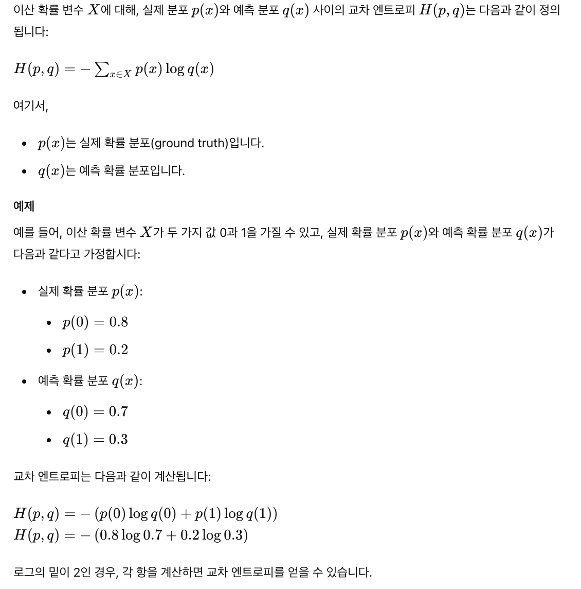

- [Abstract](#abstract)
- [수학 기호](#수학-기호)
- [NumPy 로 공부하는 선형대수](#numpy-로-공부하는-선형대수)
- [고급 선형대수](#고급-선형대수)
- [SymPy 로 공부하는 미적분](#sympy-로-공부하는-미적분)
- [SciPy 로 공부하는 최적화](#scipy-로-공부하는-최적화)
- [pgmpy 로 공부하는 확률론](#pgmpy-로-공부하는-확률론)
- [확률변수와 상관관계](#확률변수와-상관관계)
- [사이파이로 공부하는 확률분포](#사이파이로-공부하는-확률분포)
- [추정과 검정](#추정과-검정)
  - [확률분포의 추정](#확률분포의-추정)
  - [최대가능도 추정법](#최대가능도-추정법)
  - [베이즈 추정법](#베이즈-추정법)
  - [검정과 유의확률](#검정과-유의확률)
  - [가설과 검정](#가설과-검정)
    - [p-value(유의확률) 측정 절차](#p-value유의확률-측정-절차)
    - [예제: 독립표본 t-검정](#예제-독립표본-t-검정)
    - [예시 코드 (Python 사용)](#예시-코드-python-사용)
    - [요약](#요약)
  - [사이파이를 사용한 검정](#사이파이를-사용한-검정)
- [엔트로피](#엔트로피)
  - [엔트로피](#엔트로피-1)
    - [엔트로피의 정의](#엔트로피의-정의)
    - [지니 불순도(Gini Impurity)](#지니-불순도gini-impurity)
      - [지니 불순도의 정의](#지니-불순도의-정의)
      - [계산 예제](#계산-예제)
      - [지니 불순도의 특성](#지니-불순도의-특성)
      - [요약](#요약-1)
    - [엔트로피의 최대화](#엔트로피의-최대화)
      - [정규 분포와 엔트로피](#정규-분포와-엔트로피)
      - [베이즈 추정에서의 정규 분포](#베이즈-추정에서의-정규-분포)
      - [요약](#요약-2)
  - [조건부 엔트로피](#조건부-엔트로피)
    - [결합 엔트로피 (joint entropy)](#결합-엔트로피-joint-entropy)
    - [조건부 엔트로피 (conditional entropy)](#조건부-엔트로피-conditional-entropy)
  - [교차엔트로피와 쿨백-라이블러 발산](#교차엔트로피와-쿨백-라이블러-발산)
    - [교차 엔트로피 (Cross Entropy)](#교차-엔트로피-cross-entropy)
    - [쿨백-라이블러 발산](#쿨백-라이블러-발산)
  - [상호정보량](#상호정보량)
    - [상호정보량 (Mutual Information, MI)](#상호정보량-mutual-information-mi)
    - [최대정보 상관계수 (maximal information coefficient, MIC)](#최대정보-상관계수-maximal-information-coefficient-mic)
      - [기본 개념](#기본-개념)
      - [직관적인 설명](#직관적인-설명)
      - [예시](#예시)
      - [계산 방법](#계산-방법)
      - [요약](#요약-3)
      - [Example](#example)

------

# Abstract

[데이터 사이언스 스쿨](https://datascienceschool.net/intro.html) 를 읽고 정리한다.

# 수학 기호

# NumPy 로 공부하는 선형대수

# 고급 선형대수

# SymPy 로 공부하는 미적분

# SciPy 로 공부하는 최적화

# pgmpy 로 공부하는 확률론

# 확률변수와 상관관계

# 사이파이로 공부하는 확률분포

# 추정과 검정

## 확률분포의 추정

## 최대가능도 추정법

## 베이즈 추정법

## 검정과 유의확률

## 가설과 검정

### p-value(유의확률) 측정 절차

- 가설 설정:
  - **귀무가설(H₀)**과 **대립가설(H₁)**을 설정합니다.
  - 예: H₀: 두 집단의 평균이 같다 (μ₁ = μ₂), H₁: 두 집단의 평균이 다르다 (μ₁ ≠ μ₂).

- 데이터 수집:
  - 비교하려는 두 집단에서 데이터를 수집합니다.
  - 예: 기존 교육 프로그램을 받은 학생들의 성적과 새로운 교육 프로그램을 받은 학생들의 성적.

- 통계적 검정 방법 선택:
  - 데이터의 특성과 가설에 따라 적절한 통계적 검정 방법을 선택합니다.
  - 예: 두 집단의 평균을 비교하는 경우, t-검정(t-test)을 사용할 수 있습니다.

- 검정 통계량 계산:
  - 선택한 검정 방법에 따라 검정 통계량(test statistic)을 계산합니다.
  - 예: 독립표본 t-검정을 사용할 경우, 두 집단의 평균 차이를 표준오차로 나눈 값이 검정 통계량이 됩니다.

- `p-value` 계산:
  - 계산된 검정 통계량을 사용하여 `p-value`를 계산합니다.
  - `p-value`는 귀무가설이 참일 때, 관찰된 데이터 또는 그보다 극단적인 데이터가 우연히 발생할 확률입니다.
  - 이는 보통 통계 소프트웨어나 테이블을 통해 계산할 수 있습니다.

### 예제: 독립표본 t-검정

- 가설 설정:

  - H₀: 두 집단의 평균이 같다 (μ₁ = μ₂)
  - H₁: 두 집단의 평균이 다르다 (μ₁ ≠ μ₂)

- 데이터 수집:

  - 기존 교육 프로그램을 받은 학생들: `[85, 90, 88, 92, 87]` 
  - 새로운 교육 프로그램을 받은 학생들: `[91, 93, 89, 95, 90]`

- 통계적 검정 방법 선택:
  - 독립표본 t-검정 선택

- 검정 통계량 계산:
  - 두 집단의 평균과 표준편차를 계산한 후, t-검정 공식을 사용하여 t값을 계산합니다.

- p-value 계산:
  - 계산된 t값과 자유도를 사용하여 t-분포 테이블 또는 통계 소프트웨어를 통해 p-value를 계산합니다.

### 예시 코드 (Python 사용)

```py
import scipy.stats as stats

# 기존 교육 프로그램 성적
old_program = [85, 90, 88, 92, 87]

# 새로운 교육 프로그램 성적
new_program = [91, 93, 89, 95, 90]

# 독립표본 t-검정 수행
t_stat, p_value = stats.ttest_ind(old_program, new_program)

t_stat, p_value
```

위 코드에서 `ttest_ind` 함수는 두 집단 간의 독립표본 t-검정을 수행하고, t값과 `p-value`를 반환합니다. p_value 변수에 계산된 p-value가 저장됩니다.

### 요약

`p-value`는 통계적 검정 절차를 통해 계산됩니다. 이는 가설 설정, 데이터 수집, 통계적 검정 방법 선택, 검정 통계량 계산, 그리고 `p-value` 계산의 단계를 거쳐 이루어집니다. 이를 통해 우리는 관찰된 결과가 우연에 의한 것인지, 아니면 실제로 의미가 있는지를 판단할 수 있습니다.

## 사이파이를 사용한 검정

# 엔트로피

## 엔트로피

### 엔트로피의 정의

엔트로피(Entropy)는 간단히 말해, 무질서함이나 불확실성을 측정하는 개념입니다. 이 개념은 물리학, 정보 이론, 그리고 머신러닝 등 다양한 분야에서 사용됩니다.

**엔트로피의 비유**

하나의 비유를 들어볼게요. 만약 방이 완전히 정리되어 있다면, 방 안의 물건들이 어디에 있는지 쉽게 알 수 있어요. 하지만 방이 엉망이라면, 물건들이 어디에 있는지 알기 어렵죠. 이 때, 정리된 방은 엔트로피가 낮고, 엉망인 방은 엔트로피가 높다고 할 수 있어요. 즉, 엔트로피는 시스템의 무질서함 정도를 나타냅니다.

**정보 이론에서의 엔트로피**

정보 이론에서 엔트로피는 어떤 사건이 일어날 확률의 불확실성을 나타냅니다. 예를 들어, 동전을 던졌을 때 앞면이 나올 확률과 뒷면이 나올 확률이 같다면(각각 50%), 불확실성이 크기 때문에 엔트로피가 높습니다. 반면에, 동전이 항상 앞면만 나오는 경우, 결과가 확실하기 때문에 엔트로피가 0입니다.

**머신러닝에서의 엔트로피**

머신러닝에서는 주로 결정 트리(decision tree) 알고리즘에서 엔트로피를 사용합니다. 결정 트리는 데이터를 분류하기 위해 가지를 나누어가는 방식인데, 이때 엔트로피를 이용해 가장 불확실성을 줄여주는 방향으로 가지를 나누는 것입니다. 다시 말해, 엔트로피가 낮아지는 방향으로 데이터를 분류하는 것이죠.

이런 식으로 엔트로피는 무질서함이나 불확실성을 측정하는 중요한 개념입니다.

**이산 확률 변수의 엔트로피**

이산 확률 변수의 엔트로피는 확률 변수 `\(X\)`가 가질 수 있는 모든 가능한 값 `\(x_i\)`에 대해 확률 질량 함수 `\(p(x_i)\)`를 사용하여 계산됩니다. 이산 확률 변수의 엔트로피 공식은 다음과 같습니다:


```
\[ H(X) = -\sum_{i} p(x_i) \log p(x_i) \]
```

여기서 `\( p(x_i) \)`는 이산 확률 변수` \( X \)`가 값 `\( x_i \)`를 가질 확률입니다. 로그의 밑은 일반적으로 2를 사용하며, 이 경우 엔트로피의 단위는 비트입니다. 자연 로그를 사용할 경우 엔트로피의 단위는 네이피어(nats)가 됩니다.

**연속 확률 변수의 엔트로피 (미분 엔트로피)**

연속 확률 변수의 엔트로피는 확률 밀도 함수 `\( p(x) \)`를 사용하여 계산됩니다. 연속 확률 변수의 엔트로피, 즉 미분 엔트로피(differential entropy)의 공식은 다음과 같습니다:


```
\[ H(X) = -\int_{-\infty}^{\infty} p(x) \log p(x) \, dx \]
```

여기서 `\( p(x) \)`는 연속 확률 변수 `\( X \)`의 확률 밀도 함수입니다. 마찬가지로, 로그의 밑은 2나 자연 로그를 사용할 수 있으며, 단위는 각각 비트 또는 네이피어가 됩니다.

**이산 확률변수의 엔트로피 예**


**연속 확률변수의 엔트로피 예**


### 지니 불순도(Gini Impurity)

지니 불순도(Gini Impurity)는 이산 확률 변수의 엔트로피와 유사하게 데이터의 불확실성이나 무질서도를 측정하는 지표로, 주로 결정 트리(Decision Tree) 알고리즘에서 사용됩니다. 지니 불순도는 분류 문제에서 노드가 얼마나 혼합되어 있는지를 나타내며, 낮을수록 노드가 순수함을 의미합니다.

#### 지니 불순도의 정의

지니 불순도는 다음과 같이 정의됩니다:


```
\[ Gini(D) = 1 - \sum_{i=1}^{C} p_i^2 \]
```
여기서,
- `\(D\)`는 데이터 집합
- `\(C\)`는 클래스의 수
- `\(p_i\)`는 데이터 집합 `\(D\)`에서 클래스 `\(i\)`에 속하는 샘플의 비율입니다.

#### 계산 예제

간단한 예제를 통해 지니 불순도를 계산해 보겠습니다.

예를 들어, 데이터 집합 `\(D\)`가 두 가지 클래스, 클래스 1과 클래스 2로 구성되어 있고, 클래스 1의 샘플이 4개, 클래스 2의 샘플이 6개 있다고 가정합시다.

1. **클래스 비율 계산**:
   - 클래스 1의 비율 `\( p_1 \): \( \frac{4}{10} = 0.4 \)`
   - 클래스 2의 비율 `\( p_2 \): \( \frac{6}{10} = 0.6 \)`

2. **지니 불순도 계산**:
   - 
        ```
        \[
        Gini(D) = 1 - (p_1^2 + p_2^2) = 1 - (0.4^2 + 0.6^2) = 1 - (0.16 + 0.36) = 1 - 0.52 = 0.48
        \]
        ```

따라서, 이 데이터 집합의 지니 불순도는 0.48입니다. 이는 데이터 집합이 혼합되어 있으며, 완전히 순수하지 않음을 나타냅니다.

#### 지니 불순도의 특성

- **범위**: 지니 불순도는 0에서 0.5 사이의 값을 가집니다. 0은 완전히 순수한 노드를 의미하고, 0.5는 완전히 불순한 노드를 의미합니다.
- **결정 트리에서의 사용**: 결정 트리 알고리즘에서, 각 분할에서 지니 불순도가 최소화되는 방향으로 노드를 분할합니다. 즉, 트리의 각 분할 단계에서 지니 불순도를 계산하여 가장 순수한 자식 노드를 만들도록 분할을 선택합니다.

#### 요약

지니 불순도는 데이터 집합의 불확실성을 측정하는 지표로, 주로 결정 트리 알고리즘에서 사용됩니다. 이 지표는 노드의 혼합 정도를 나타내며, 낮을수록 노드가 순수함을 의미합니다. 결정 트리 알고리즘은 지니 불순도가 최소화되도록 데이터를 분할하여 최적의 트리를 만듭니다.

### 엔트로피의 최대화

#### 정규 분포와 엔트로피

1. **엔트로피와 정보량**:
   - 엔트로피는 확률 분포의 불확실성을 측정하는 척도입니다. 엔트로피가 높을수록 해당 분포의 불확실성이 크고, 결과를 예측하기 어렵습니다.
   - 높은 엔트로피는 시스템에 대한 정보가 적음을 의미합니다. 즉, 분포가 더 불확실하다는 것은 우리가 해당 분포에 대해 아는 정보가 적다는 것입니다.

2. **정규 분포의 엔트로피**:
   - 정규 분포는 주어진 평균(기댓값, `\(\mu\)`)과 표준편차(`\(\sigma\)`)를 가진 확률 분포 중에서 가장 엔트로피가 큰 분포입니다. 이는 동일한 기댓값과 표준편차를 가진 다른 분포들보다 정규 분포가 더 많은 불확실성을 가진다는 의미입니다.
   - 따라서, 정규 분포는 같은 조건을 가진 다른 분포들에 비해 가장 정보가 적다고 할 수 있습니다. 이는 특정한 기댓값과 표준편차를 가진 분포들 중에서 가장 덜 결정적인 정보를 제공한다는 뜻입니다.

#### 베이즈 추정에서의 정규 분포

1. **무정보 사전확률분포 (Non-informative Prior)**:
   - 베이즈 추정에서는 사전확률(prior distribution)을 설정해야 합니다. 사전확률은 우리가 데이터를 관찰하기 전에 가지는 믿음을 나타냅니다.
   - 무정보 사전확률은 사전 지식이나 정보가 거의 없는 상태에서의 사전확률을 의미합니다. 이는 우리가 데이터에 대해 특별한 선입견이나 정보가 없다는 것을 나타냅니다.

2. **정규 분포의 사용**:
   - 정규 분포는 높은 엔트로피로 인해 무정보 사전확률로 사용되기 적합합니다. 이는 정규 분포가 가장 불확실성이 크기 때문에, 사전 지식이 거의 없다는 것을 반영합니다.
   - 베이즈 추정에서 정규 분포를 무정보 사전확률로 사용하면, 데이터가 주어졌을 때 이를 통해 얻는 정보가 더 큰 비중을 차지하게 됩니다. 이는 사전확률이 데이터에 큰 영향을 미치지 않게 하여, 데이터 자체의 정보에 더 의존하게 만듭니다.

#### 요약

- **정규 분포는 주어진 기댓값과 표준편차를 가진 분포들 중에서 엔트로피가 가장 크며, 이는 가장 불확실한 분포라는 의미**입니다. 따라서, 정규 분포는 동일한 조건에서 다른 분포들보다 더 적은 정보를 제공합니다.
- **베이즈 추정에서 정규 분포는 무정보 사전확률분포로 자주 사용됩니다**. 이는 정규 분포의 높은 엔트로피가 사전 지식이 거의 없음을 반영하기 때문입니다. 이렇게 하면 데이터에 더 큰 비중을 두고 분석할 수 있습니다.

## 조건부 엔트로피

### 결합 엔트로피 (joint entropy)

**이산확률변수의 결합 엔트로피**


**연속 확률변수의 결합 엔트로피**


### 조건부 엔트로피 (conditional entropy)

**이산 확률 변수의 조건부 엔트로피**


**연속 확률 변수의 조건부 엔트로피**


## 교차엔트로피와 쿨백-라이블러 발산

### 교차 엔트로피 (Cross Entropy)

**이산 확률 변수의 교차 엔트로피**



**연속 확률 변수의 교차 엔트로피**


### 쿨백-라이블러 발산

**이산 확률 변수의 쿨백-라이블러 발산**


**연속 확률 변수의 쿨백-라이블러 발산**


## 상호정보량

### 상호정보량 (Mutual Information, MI)

상호 정보량(Mutual Information)은 두 확률 변수 간의 종속성을 측정하는 지표로, 하나의 변수에 대한 정보를 알면 다른 변수에 대한 불확실성이 얼마나 줄어드는지를 나타냅니다.

**이산 확률 변수의 상호정보량**


**연속 확률 변수의 상호정보량**


### 최대정보 상관계수 (maximal information coefficient, MIC)

#### 기본 개념

일반적으로 두 변수 간의 관계를 알아볼 때, 우리는 상관계수를 사용합니다. 가장 많이 사용되는 피어슨 상관계수는 두 변수 간의 선형 관계를 측정합니다. 하지만 피어슨 상관계수는 비선형 관계를 잘 탐지하지 못합니다. 최대 정보 상관계수는 이러한 비선형 관계까지 탐지할 수 있는 보다 강력한 도구입니다.

#### 직관적인 설명

1. **정보 이론**:
   - MIC는 정보 이론에 기반을 두고 있습니다. 정보 이론에서는 '정보'와 '불확실성'을 수학적으로 측정합니다.
   - 예를 들어, 동전 던지기의 결과는 앞면과 뒷면이 나올 확률이 같다면 불확실성이 큽니다. 하지만 동전이 항상 앞면만 나오면 불확실성이 낮습니다.

2. **변수 간의 관계 탐색**:
   - 두 변수 \(X\)와 \(Y\)가 있을 때, 이들의 관계가 얼마나 강한지 알고 싶다면, 단순히 선형 관계뿐만 아니라 다양한 형태의 관계를 살펴봐야 합니다.
   - MIC는 다양한 그리드(grid)를 통해 \(X\)와 \(Y\)의 관계를 탐색합니다. 즉, 다양한 방식으로 \(X\)와 \(Y\)를 분할하고, 각 분할에서의 관계를 측정합니다.

3. **최대 정보 상관계수**:
   - 여러 그리드를 통해 계산된 정보 상관계수 중 가장 높은 값을 MIC라고 합니다.
   - MIC는 0에서 1 사이의 값을 가지며, 1에 가까울수록 두 변수 간의 관계가 강하다는 것을 의미합니다.

#### 예시

- **완벽한 관계**: 만약 \(Y\)가 \(X\)의 정확한 제곱이라면 (\(Y = X^2\)), MIC는 1에 가까운 값을 가질 것입니다. 이는 두 변수 간의 관계가 매우 강하다는 것을 의미합니다.
- **무관한 변수**: 만약 \(X\)와 \(Y\)가 완전히 무작위로 독립적이라면, MIC는 0에 가까운 값을 가질 것입니다. 이는 두 변수 간에 관계가 거의 없음을 의미합니다.

#### 계산 방법

MIC를 계산하는 방법은 다소 복잡하지만, 기본적인 단계는 다음과 같습니다:

1. **그리드 생성**: \(X\)와 \(Y\) 축을 따라 데이터를 여러 개의 그리드로 나눕니다.
2. **정보 상관계수 계산**: 각 그리드에서 정보 상관계수를 계산합니다. 이는 각 그리드 내에서 \(X\)와 \(Y\)의 분포를 기반으로 합니다.
3. **최대값 선택**: 모든 그리드에서 계산된 정보 상관계수 중 가장 큰 값을 MIC로 선택합니다.

#### 요약

- **최대 정보 상관계수(MIC)**: 두 변수 간의 비선형 관계를 측정하는 척도입니다.
- **정보 이론 기반**: 다양한 그리드를 사용하여 두 변수 간의 관계를 탐색하고, 그 중 가장 큰 정보를 제공하는 값을 선택합니다.
- **범위**: MIC는 0에서 1 사이의 값을 가지며, 값이 클수록 두 변수 간의 관계가 강함을 나타냅니다.

MIC는 두 변수 간의 관계를 보다 포괄적으로 이해할 수 있게 해주며, 비선형 관계도 탐지할 수 있는 강력한 도구입니다.

#### Example

```py
import numpy as np
import matplotlib.pyplot as plt
from minepy import MINE

# MINE 객체 생성
mine = MINE()

# 데이터 포인트 수
n = 500

# Figure 설정
plt.figure(figsize=(12, 8))

# 첫 번째 서브플롯: y = 2x^2 + noise
plt.subplot(231)
x1 = np.random.uniform(-1, 1, n)
y1 = 2 * x1**2 + np.random.uniform(-1, 1, n)
plt.scatter(x1, y1)
mine.compute_score(x1, y1)
plt.title("MIC={0:0.3f}".format(mine.mic()))

# 두 번째 서브플롯: y = 4*(x^2-0.5)^2 + noise/5
plt.subplot(232)
x2 = np.random.uniform(-1, 1, n)
y2 = 4 * (x2**2 - 0.5)**2 + np.random.uniform(-1, 1, n) / 5
plt.scatter(x2, y2)
mine.compute_score(x2, y2)
plt.title("MIC={0:0.3f}".format(mine.mic()))

# 세 번째 서브플롯: y = cos(pi*x) + noise, x = sin(pi*x) + noise
plt.subplot(233)
x3 = np.random.uniform(-1, 1, n)
y3 = np.cos(x3 * np.pi) + np.random.uniform(0, 1/8, n)
x3 = np.sin(x3 * np.pi) + np.random.uniform(0, 1/8, n)
plt.scatter(x3, y3)
mine.compute_score(x3, y3)
plt.title("MIC={0:0.3f}".format(mine.mic()))

# 네 번째 서브플롯: 무작위 데이터
plt.subplot(234)
x4 = np.random.uniform(-1, 1, n)
y4 = np.random.uniform(-1, 1, n)
plt.scatter(x4, y4)
mine.compute_score(x4, y4)
plt.title("MIC={0:0.3f}".format(mine.mic()))

# 다섯 번째 서브플롯: y = (x^2 + noise) * random sign
plt.subplot(235)
x5 = np.random.uniform(-1, 1, n)
y5 = (x5**2 + np.random.uniform(0, 0.5, n)) * np.array([-1, 1])[np.random.randint(0, 2, size=n)]
plt.scatter(x5, y5)
mine.compute_score(x5, y5)
plt.title("MIC={0:0.3f}".format(mine.mic()))

# 여섯 번째 서브플롯: 다중 변량 정규 분포
plt.subplot(236)
xy1 = np.random.multivariate_normal([3, 3], [[1, 0], [0, 1]], int(n / 4))
xy2 = np.random.multivariate_normal([-3, 3], [[1, 0], [0, 1]], int(n / 4))
xy3 = np.random.multivariate_normal([-3, -3], [[1, 0], [0, 1]], int(n / 4))
xy4 = np.random.multivariate_normal([3, -3], [[1, 0], [0, 1]], int(n / 4))
xy = np.concatenate((xy1, xy2, xy3, xy4), axis=0)
x6 = xy[:, 0]
y6 = xy[:, 1]
plt.scatter(x6, y6)
mine.compute_score(x6, y6)
plt.title("MIC={0:0.3f}".format(mine.mic()))

# 레이아웃 조정
plt.tight_layout()
plt.show()
```


