- [References](#references)
- [Chain Rule](#chain-rule)
- [독립 변수 (Independent variable), 종속 변수 (Dependent variable)](#독립-변수-independent-variable-종속-변수-dependent-variable)
- [확률 변수 (Random Variable)](#확률-변수-random-variable)
- [확률 분포(probability distribution)](#확률-분포probability-distribution)
- [모수 (Parameter)](#모수-parameter)
- [모수를 추정하는 추정법 (Parameter Estimation)](#모수를-추정하는-추정법-parameter-estimation)
- [모델 (Model)](#모델-model)
- [모델의 종류](#모델의-종류)
- [수식 모델 vs 비수식 모델](#수식-모델-vs-비수식-모델)
- [수식으로 표현할 수 있는 모델](#수식으로-표현할-수-있는-모델)
- [수식으로 표현할 수 없는 모델](#수식으로-표현할-수-없는-모델)
- [인공 신경망의 산출물](#인공-신경망의-산출물)
- [P(X; θ) Graph](#px-θ-graph)
- [P(Y | X; θ) Graph](#py--x-θ-graph)
- [Simple Data, Multiple Implementations](#simple-data-multiple-implementations)
  - [Linear Regression, 최소제곱추정법(Least Squares Estimation, LSE)](#linear-regression-최소제곱추정법least-squares-estimation-lse)
  - [Linear Regression, 최대우도추정법(MLE)](#linear-regression-최대우도추정법mle)
  - [Linear Regression, 베이지안 추정법(Bayesian Estimation)](#linear-regression-베이지안-추정법bayesian-estimation)
  - [인공지능 신경망 (Artifical Neural Networks)](#인공지능-신경망-artifical-neural-networks)
  - [랜덤 포레스트 (Random Forest)](#랜덤-포레스트-random-forest)
- [p(X; μ, σ^2) 최대우도법 (Maximum Likelihood Estimation, MLE)](#px-μ-σ2-최대우도법-maximum-likelihood-estimation-mle)
- [p(Y | X; μ, σ^2) 최대우도법 (Maximum Likelihood Estimation, MLE)](#py--x-μ-σ2-최대우도법-maximum-likelihood-estimation-mle)
- [Supervised Learning](#supervised-learning)
- [인공신경망 모델 vs 딥러닝 모델](#인공신경망-모델-vs-딥러닝-모델)
- [인공신경망 모델의 종류](#인공신경망-모델의-종류)
- [PyTorch Simple Linear Regression](#pytorch-simple-linear-regression)
- [PyTorch Simple Linear Regression with Validation Data](#pytorch-simple-linear-regression-with-validation-data)
- [PyTorch Simple Linear Regression with Test Data](#pytorch-simple-linear-regression-with-test-data)
- [Bayesian Statistics MLE (Maximum Likelihood Estimation)](#bayesian-statistics-mle-maximum-likelihood-estimation)
- [Precision/Recall/Threshold Visualization](#precisionrecallthreshold-visualization)
- [빈도주의 통계학에서 확률의 의미](#빈도주의-통계학에서-확률의-의미)
- [베이지안 통계학에서 확률의 의미](#베이지안-통계학에서-확률의-의미)
- [Bayesian Theroem](#bayesian-theroem)
- [Bayesian Theorem By Story](#bayesian-theorem-by-story)
- [Entropy](#entropy)
- [KL-divergence](#kl-divergence)
- [Eigen Value, Eigen Vector](#eigen-value-eigen-vector)

-----

# References

> - [통계 기초 개념과 공식을 3시간만에 끝내드립니다ㅣ 고려대 통계학과 x AI연구원 강의 ㅣ표본, 기대값, 정규분포, 카이제곱, 모평균, t분포, 포아송분포, 조건부 확률 등](https://www.youtube.com/watch?v=YaCQrJCgbqg)
> - [데이터 사이언스 스쿨](https://datascienceschool.net/intro.html)
> - [공돌이의 수학정리노트 (Angelo's Math Notes)](https://angeloyeo.github.io/)
> - ["Probabilistic machine learning": a book series by Kevin Murphy](https://github.com/probml/pml-book)
>   - ["Machine Learning: A Probabilistic Perspective" (2012)](https://probml.github.io/pml-book/book0.html)
>   - ["Probabilistic Machine Learning: An Introduction" (2022)](https://probml.github.io/pml-book/book1.html)
>   - ["Probabilistic Machine Learning: Advanced Topics" (2023)](https://probml.github.io/pml-book/book2.html)
> - [CS231n: Convolutional Neural Networks for Visual Recognition](http://cs231n.stanford.edu/syllabus.html)
>   - 화상인식을 위한 CNN
> - [CS224d: Deep Learning for Natural Language Processing](http://web.stanford.edu/class/cs224n/)
>   - 자연어처리를 위한 Deep Learning

# Chain Rule

**체인룰(Chain Rule)**은 미적분학에서 합성 함수를 미분할 때 사용되는 규칙입니다.
간단히 말해, 두 개 이상의 함수가 합성된 경우에 그 함수의 미분 결과를 계산하기
위해 사용됩니다.

합성 함수란 한 변수의 값을 다양한 함수를 통해 변환하는 과정으로 생성되는 최종
출력값에 대한 함수를 의미합니다. 예를 들어, 두 개의 함수 `f(x)`와 `g(x)`가 있고, 두
함수의 합성 `h(x) = f(g(x))`가 있다면, h(x)는 합성 함수입니다.

체인 룰의 공식은 다음과 같습니다:

```
(dy/dx) = (dy/du) * (du/dx)
```

여기서 `y = f(u)`이고 `u = g(x)`입니다. 이는 `y`가 `u`에 의존하고, `u`가 `x`에
의존하므로, `x`에 대한 `y`의 변화율`(dy/dx)`을 계산하기 위해 우선 중간변수인
`u`에 대한 `y`의 변화율`(dy/du)`과 `x`에 대한 `u`의 변화율`(du/dx)`을 각각
구하고 곱해주는 것입니다.

예를 들어, 함수 `y = f(u) = u²` 와 `u = g(x) = 2x + 3`이 있다고 가정합시다. 
`h(x) = f(g(x)) = (2x + 3)²` 를 구하려면 체인 룰을 적용해야 합니다.

```
dy/du = 2u
du/dx = 2
Chain rule 적용: (dy/dx) = (dy/du) * (du/dx) = 2u * 2 = 4u = 4(2x+3)
```

따라서 최종 결과는 `h'(x) = 4(2x+3)`가 됩니다. 
이처럼 체인룰은 한 번에 여러 함수를 미분할 때 유용한 도구입니다.

# 독립 변수 (Independent variable), 종속 변수 (Dependent variable)

**독립 변수**와 **종속 변수**는 주로 통계학과 머신러닝에서 사용되는 용어로서
변수 간의 관계와 영향을 설명하는 데 사용됩니다.

**독립 변수(Independent variable)**: 독립 변수는 종속 변수에 영향을 주는
변수로서, 입력으로 주어지는 값입니다. 독립 변수는 다른 변수에 영향을 받지
않거나, 영향을 받는 정도가 상대적으로 낮습니다. 때로는 '특성', '예측 변수',
'회귀 계수' 또는 영어로 'feature', 'predictor', 'explanatory variable' 등과 같은
용어로 불립니다. 예를 들어, 집의 면적과 위치가 집 가격에 영향을 주는 경우 집의
면적과 위치는 독립 변수입니다.

**종속 변수(Dependent variable)**: 종속 변수는 독립 변수에 의해 영향을 받는
변수로서, 결과로 예측하거나 설명하려는 값입니다. 종속 변수는 독립 변수와의
관계를 통해 분석됩니다. 때로는 '반응 변수', '목표 변수', '또는 '결과 변수',
영어로는 'response variable', 'target variable', 'label', 'outcome variable'
등과 같은 용어로 불립니다. 예를 들어, 집의 면적과 위치에 따라 집 가격이 달라지는
경우 집 가격은 종속 변수입니다.

머신러닝 모델 구축 시 독립 변수를 사용하여 종속 변수를 예측하거나 분류하는 것이
목표입니다. 이때 학습 데이터에는 독립 변수와 종속 변수가 레이블로 함께 포함되어
있어야 합니다.

# 확률 변수 (Random Variable)

확률 과정에서 발생하는 불확실한 이벤트를 수치화하는 변수입니다. 일반적인 변수와
다르게 랜덤 변수는 결과 값이 확률론적(무작위적)으로 결정됩니다. 랜덤 변수는 주로
확률론과 통계학에서 사용되며, 확률 분포를 통해 이 변수의 확률적 성질을 설명할 수
있습니다.

랜덤 변수는 일반적으로 대문자 알파벳(예: X, Y, Z)으로 표기하며, 가능한 결과
값(실현 값)은 소문자 알파벳(예: x, y, z)으로 표기합니다.

**독립 변수**와 **종속 변수**는 머신러닝 및 회귀 분석과 같은 문맥에서 변수의
관계와 영향을 나타내는 데 사용되는 용어입니다. 반면 **랜덤 변수**는 확률과
통계학에서 불확실한 이벤트를 수치화하고 설명하는 데 사용되는 개념입니다.

**독립 변수**와 **종속 변수**도 어떤 상황에서는 랜덤 변수가 될 수 있습니다. 예를
들어, 어떤 표본 데이터를 수집할 때 데이터 포인트의 선택이 무작위라면, 이 표본
데이터의 독립 변수와 종속 변수는 랜덤 변수로 취급될 수 있습니다.

즉, 랜덤 변수, 독립 변수, 종속 변수는 상황과 문맥에 따라 서로 관련이 있을 수도
있고, 아닐 수도 있습니다. 중요한 것은, 이 용어들이 사용되는 목적과 범위를
이해하는 것입니다.

불확실한 사건(experiment)의 결과에 대응하는 숫자 값으로 정의되는 변수입니다.
사건의 결과가 확률적으로 발생하기 때문에 확률 변수 값도 확률적으로 결정됩니다.
확률 변수는 주로 대문자 알파벳(X, Y, Z 등)으로 표현되고, 그 값은 소문자
알파벳(x, y, z 등)으로 나타냅니다.

확률 변수는 다음 두 가지 유형으로 분류됩니다:

**이산 확률 변수(Discrete random variable)**: 이산 확률 변수는 셀 수 있는(유한
또는 무한) 개의 가능한 값들 중 하나를 가질 수 있습니다. 일반적으로 정수 값을
가지며, 이산 확률 변수의 가능한 값들 각각에 확률을 직접 할당할 수 있습니다. 예를
들어 주사위 던지기, 동전 던지기, 프로세스에서 발생하는 에러 개수 등이 이산 확률
변수의 예입니다.

**연속 확률 변수(Continuous random variable)**: 연속 확률 변수는 값이 하나의
구간 내의 모든 실수 값을 가질 수 있습니다. 연속 확률 변수의 경우, 특정 값의
확률을 정의하기보다는 값의 범위에 확률을 할당하는 것이 더 일반적입니다. 예를
들어 온도, 길이, 시간, 중량 등이 연속 확률 변수의 예입니다.

확률 변수는 실험의 결과를 수치로 표현해 줌으로써 통계적 모델링, 확률 분포의
사용, 데이터 분석 등에 사용됩니다.

# 확률 분포(probability distribution)

확률 변수(random variable)의 가능한 값들과 그 값들이 나타날 가능성을 설명하는
수학적 표현입니다. 확률 분포는 각 사건이 발생할 확률을 알려주는 것으로, 이를
통해 데이터, 실험, 프로세스 등에서 불확실성을 처리할 수 있습니다. 확률 변수의
성격에 따라 확률 분포는 **이산 확률 분포(discrete probability distribution)**와
연속 **확률 분포(continuous probability distribution)**로 구분할 수 있습니다.

**이산 확률 분포(Discrete probability distribution)**: 이산 확률 변수가 가질 수
있는 가능한 값들의 확률을 나타내는 분포입니다. 
**확률질량함수(probability mass function, PMF)**로 나타낼 수 있으며, 
이 함수는 각 값을 확률로 매핑합니다. 이산
확률 분포의 예로는 **베르누이 분포**, **이항 분포**, **포아송 분포** 등이 있습니다.

**연속 확률 분포(Continuous probability distribution)**: 연속 확률 변수가 가질
수 있는 가능한 값들의 확률을 나타내는 분포입니다. 
**확률밀도함수(probability density function, PDF)**로 나타낼 수 있으며, 이 함수는 확률 변수의 값에 대한
확률 밀도를 매핑합니다. 연속 확률 분포에서 특정 값의 확률은 PDF의 해당 영역
아래의 면적을 통해 얻을 수 있습니다. 연속 확률 분포의 예로는 
**정규 분포**, **균일분포**, **지수 분포**, **베타 분포** 등이 있습니다.

# 모수 (Parameter)

통계에서 **모수(parameter)**란 **모집단(population)**의 특성을 나타내는
수치입니다. 이러한 모수는 모집단의 **평균**, **분산**, **상관계수** 등과 같이
분포의 성질과 특징을 요약하여 표현한 값입니다.

모수는 주어진 모집단의 확률분포를 규정하기 위해 사용되며, 모집단의 크기에 무관한
고정된 값입니다. 통계에서 주요 목적 중 하나는 이 모수를 **추정(Estimation)**하고
**기술통계(Descriptive statistics)**와 **추론통계(Inferential statistics)**를 이용하여
분석하는 것입니다. 이를 통해 모집단의 전반적인 성질을 이해하고 예측 및
의사결정에 도움이 되는 정보를 얻을 수 있습니다.

모수는 표본(sample) 추출을 통해 추정할 수 있습니다. 모집단으로부터 추출된 표본
데이터를 사용하여 모수에 대한 추정치를 계산하고, 이를 다양한 통계적 방법으로
검증하고 분석하는 과정을 거칩니다.

**인공신경망(artificial neural networks, ANN)**은 일반적으로 **모수(parametric)** 모델로
분류됩니다. 인공 신경망은 구조적인 설정을 가지며, 다양한 활성화 함수와 학습
파라미터들을 사용해 학습과 예측을 수행합니다. 이렇게 학습된 파라미터들은
데이터와 레이블 간의 관계를 나타내며, 모델에 의해 학습된 가중치와 편향 값들이
모델의 파라미터로 생각됩니다.

그러나 인공신경망은 그 자체로 복잡하고 유연한 모델입니다. 따라서 모수적 방법과
비모수적 방법 사이에서 완전한 경계가 아니라 더 연속적인 스펙트럼이 있다고 볼 수
있습니다. 인공 신경망은 그래프 구조를 통해 비선형 관계를 포착할 수 있으므로
비모수적 모델처럼 간주될 수 있지만, 실제로는 가중치와 편향 값들이 파라미터로
학습되기 때문에 모수 모델로 분류됩니다.

결론적으로, 인공신경망은 모수 모델로 분류되지만, 복잡한 구조와 함수 덕분에
비모수적 모델과 유사한 유연성을 가지게 됩니다.

# 모수를 추정하는 추정법 (Parameter Estimation)

모수를 추정하는 추정법은 여러 가지가 있습니다. 대표적인 추정법으로는:

**모멘트추정법 (Method of Moments)**: 관측 데이터의 적률과 이론적인 모델의
적률을 같게 만드는 방식으로 모수를 추정합니다.

**최대우도추정법 (Maximum Likelihood Estimation, MLE)**: 관측된 데이터가 가장
그럴 듯한 모수를 찾아내는 방법으로, 전반적인 데이터의 우도를 최대화하는 값으로
모수를 추정합니다.

**베이즈추정법 (Bayesian Estimation)**: 사전 확률분포를 고려하며, 불확실성을
나타내는 사후 확률분포를 통해 모수를 추정합니다. 베이즈추정법은 사전정보와 관측
데이터를 이용하여 추정을 진행합니다.

**최소제곱추정법 (Least Squares Estimation, LSE)**: 관측값과 예측값의
차이(잔차)의 제곱합을 최소화하는 방식으로 모수를 추정합니다. LSE는 선형회귀와
같은 모델에서 널리 사용됩니다.

**최소마디오추정법 (Minimum Absolute Deviations, MAD)**: 관측값과 예측값의
차이(잔차)의 절대값의 합을 최소화하는 방식으로 모수를 추정합니다. MAD는 이상치에
대해 더 강인한 추정법으로 알려져 있습니다.

**최소자승 추정(LASSO, Ridge Regression 등)**: 정규화(regularization) 항을
추가하여 파라미터의 크기를 축소하는 방식으로 모수를 추정합니다. 이 방법은
과적합(overfitting)을 방지하는 데 도움이 됩니다.

# 모델 (Model)

통계학에서 **모델(model)**은 현상이나 데이터를 설명하거나 예측하기 위해
수학적이나 개념적 도구로 표현된 간략화된 표현입니다. 현실 세계의 현상을
단순화하고 일반화하여 이해할 수 있게 만들어 주며, 변수 간의 관계, 패턴, 구조를
파악하거나 미래의 데이터를 예측하는 데 사용됩니다. 모델에는 **선형 회귀**,
**로지스틱 회귀**, **확률 모델** 등 다양한 종류가 있습니다.

# 모델의 종류

**선형 회귀 모델(Linear Regression)**: 관찰된 데이터 사이의 선형 관계를
설명하며, **예측 변수**와 **종속 변수** 사이의 관계를 선형 방정식으로 나타냅니다.

**로지스틱 회귀 모델(Logistic Regression)**: 범주형 종속 변수와 연속형 독립 변수
사이의 관계를 이진 로지스틱 함수로 설명합니다. 분류 작업에 사용됩니다.

**일반화 선형 모델(Generalized Linear Models, GLM)**: 선형 및 비선형 관계를
설명할 수 있는 확장된 선형 회귀 모델입니다. 종속 변수의 분포가 정규 분포를
따르지 않을 경우에도 적용 가능합니다.

**시계열 모델(Time Series Models)**: 시간 종속적인 데이터를 분석하고 예측하는 데
사용되는 모델로, ARIMA (AutoRegressive Integrated Moving Average), Exponential
Smoothing 등이 있습니다.

**Decision Trees**: 복잡한 데이터 세트에서 결정 경계를 학습하는데 사용되는 트리
기반 모델입니다. 분류 및 회귀 문제에 사용됩니다.

**나이브 베이즈(Naive Bayes)**: 베이즈 정리를 기반으로 하며, 각 특성이
독립적임을 가정하는 확률 모델입니다. 분류 작업에 사용됩니다.

**서포트 벡터 머신(Support Vector Machines, SVM)**: 최적의 결정 경계를 찾기 위해
마진을 최대화하는 알고리즘을 사용하는 모델로, 분류 및 회귀 문제에 사용됩니다.

**신경망(Neural Networks)**: 인간의 뇌 구조를 모방한 인공 뉴런을 기반으로 한
복잡한 모델입니다. 분류, 회귀, 이미지 인식, 자연어 처리 등 다양한 분야에
적용됩니다.

**클러스터링 모델(Clustering Models)**: 비지도 학습 기법으로, 데이터 세트에서 구조,
관계, 패턴을 발견하기 위해 사용되는 모델입니다. K-Means, DBSCAN, Hierarchical
Clustering 등이 있습니다.

**앙상블 모델(Ensemble Models)**: 여러 개의 기본 모델을 조합하여 성능을
향상시키는 모델입니다. **배깅(Bagging)**, **부스팅(Boosting)**, 
**랜덤 포레스트(Random Forest)**, 
**그래디언트 부스팅(Gradient Boosting)** 등이 있습니다.

# 수식 모델 vs 비수식 모델

일반적으로 수식으로 표현할 수 있는 모델링과 수식으로 표현할 수 없는 모델링을
구분하기 위한 명확한 표준 용어는 없습니다. 하지만, 두 유형의 모델링을 구분하기
위해 '**선형**'과 '**비선형**', 또는 '**매개변수 모델(parametric model)**'과
'**비매개변수 모델(non-parametric model)**'을 사용하여 설명할 수 있습니다.

**선형(linear) 모델링**: 이 방법들은 데이터 간의 선형 관계를 가정합니다. 하나의
함수를 사용하여 입력 변수와 예측값 사이의 관계를 설명합니다. 대표적인 선형
모델링 방법에는 **선형 회귀**, **로지스틱 회귀** 등이 있습니다. 이러한 선형
모델은 대부분 수식으로 표현할 수 있습니다.

**비선형(non-linear) 모델링**: 데이터 간의 관계가 선형이 아닌 복잡한 형태일 때
사용되는 방법입니다. 비선형 모델링 방법에는 **인공신경망**, **랜덤포레스트**,
**k-최근접 이웃** 등이 있습니다. 이러한 모델은 일반적으로 수식으로 표현하기
어렵습니다.

또한, 모델의 구조를 설명하는 데 다음 두 용어를 사용할 수 있습니다.

**매개변수 모델(parametric model)**: 매개변수를 사용하여 추정하고 표현하는 모델링
방법입니다. 예를 들어, **선형 회귀 분석**은 예측 변수의 계수 및 절편과 같은 매개
변수를 사용하여 모델을 표현합니다. 매개변수 모델은 종종 수식으로 표현할 수
있습니다.

**비매개변수 모델(non-parametric model)**: 모델이 고정된 수의 매개 변수가 없고,
데이터에 의존하여 복잡한 구조를 가지는 경우입니다. **k-최근접 이웃(KNN)**이
대표적인 예입니다. 비매개변수 모델은 전반적으로 수식으로 표현하기 어렵습니다.

그러나 이러한 구분은 완벽하게 수식 표현 여부와 일치하지는 않습니다. 경우에 따라
선형 모델의 수식이 복잡할 수도 있고, 비선형 모델 중에서도 일부 수식으로 표현할
수 있는 경우도 있습니다. 따라서 이 구분은 그 둘을 완벽하게 구분짓는 기준은
아니지만, 어느 정도 설명할 수 있는 틀을 제공할 수 있습니다.

# 수식으로 표현할 수 있는 모델

수식으로 표현할 수 있는 모델링 방법은 여러 가지가 있습니다. 여기 주요한 몇
가지를 나열하였습니다.

**선형 회귀(Linear Regression)**: 입력 데이터 간의 선형 관계를 예측하는 모델입니다.
일반적으로 y = wx + b와 같이 수식으로 표현할 수 있습니다.

**로지스틱 회귀(Logistic Regression)**: 이진 분류 문제에 사용되는 모델로, 확률을
계산하기 위해 로지스틱(시그모이드) 함수를 사용하여 수식을 표현합니다.

**다항식 회귀(Polynomial Regression)**: 선형 회귀보다 복잡한 관계를 모델링하는
방법으로, 계수와 차수를 포함하는 다항식 수식을 사용합니다.

**라쏘 회귀(Lasso Regression)**와 릿지 **회귀(Ridge Regression)**: 선형 회귀와
유사하지만, L1 혹은 L2 규제 항을 추가하여 수식을 표현합니다.

**서포트 벡터 머신(Support Vector Machine, SVM)**: 마진을 최대화하는 초평면 혹은
구분 경계를 찾는 SVM 알고리즘 역시 선형 혹은 커널 함수를 사용한 비선형 형태로
수식을 표현할 수 있습니다.

**가우시안 나이브 베이즈(Gaussian Naive Bayes)**: 독립 변수들간의 조건부 확률을
가우시안 분포로 가정하여 분류 문제를 해결하는 모델로, 확률 이론과 베이즈 정리를
사용한 수식으로 표현됩니다.

**선형 판별 분석(Linear Discriminant Analysis, LDA)**: 클래스 간의 분별력을
최대화하도록 데이터를 낮은 차원 공간으로 사영(project)하는 선형 변환으로 최적화
문제를 해결하는데, 수식으로 표현할 수 있습니다.

회귀 및 분류 문제를 위한 기타 손실 함수: 손실 함수(loss function)는 모델의
출력과 실제 값을 비교하여 얼마나 성능이 좋은지 측정하는 데 사용되는 지표입니다.
대표적인 손실 함수로는 평균 제곱 오차(Mean Squared Error, MSE), 교차
엔트로피(Cross-Entropy) 등이 있으며, 수식으로 표현할 수 있습니다.

# 수식으로 표현할 수 없는 모델

수식으로 직접적으로 표현하기 어려운 모델의 대표적인 예를 몇 가지 제시하겠습니다.

**인공 신경망 (Artificial Neural Networks)**: 입력, 은닉 및 출력층으로 구성된 신경망
구조와 가중치를 사용하여 데이터 분석을 수행하는 딥러닝 모델입니다.

**랜덤 포레스트 (Random Forest)**: 여러 개의 의사결정나무를 결합하여 처리하는 앙상블
기반 모델로, 각 나무마다 복잡한 구조와 분기 노드에서의 결정 기준이 다릅니다.

**k-최근접 이웃 (k-Nearest Neighbors, KNN)**: 입력 데이터와 가장 가까운 k 개의 이웃
데이터를 기준으로 새로운 데이터를 분류하거나 값을 예측하는 방법으로, 거리 기반
방식을 사용합니다.

**서포트 벡터 머신 (Support Vector Machine, SVM)을 비선형 커널 함수로 확장한 경우**:
비선형 커널 함수를 활용하는 경우, 기존의 선형 SVM보다 더 복잡한 구조를 가지며
수식 표현이 어려울 수 있습니다.

**워드 임베딩 (Word Embeddings)**: 자연어 처리에서 단어나 문장을 고정된 크기의
벡터로 변환하는 기법이며, 대표적인 방법으로는 Word2Vec, GloVe, FastText 등이
있습니다.

이러한 복잡한 모델들은 전형적으로 일반적인 형태의 수식으로 명확하게 표현할 수
없습니다. 대신 이들 모델은 구조, 매개 변수, 가중치 등 다른 구성 요소를 사용하여
처리됩니다. 이런 모델들은 그 구조와 학습 방식 때문에, 종종 일반적인 수식으로
표현되는 모델보다 데이터의 복잡한 구조와 패턴을 잘 포착하는 데 능숙합니다.

# 인공 신경망의 산출물

인공 신경망을 사용한 모델링의 산출물은 전통적인 수식과 달리, 신경망의 구조와
가중치(매개 변수)로 표현됩니다. 인공 신경망은 입력층, 은닉층, 출력층으로
구성되며, 각 층의 노드(뉴런)들 사이의 가중치들이 다양한 패턴을 학습하는 데
사용됩니다.

학습이 완료된 신경망 모델은 수식으로 표현되기 어렵습니다. 이는 신경망의 각
노드에서 활성화 함수(ReLU, Sigmoid, Tanh 등)를 통과하며 데이터가 변환되고,
복잡한 상호작용이 일어나기 때문입니다. 따라서, 신경망 모델의 산출물은 모델의
**구조**와 **가중치**들로 표현되지만 일반적인 수식으로는 나타내기 어렵습니다.

신경망 모델의 가중치는 학습을 통해 설정되며, 저장하거나 다른 환경에서 재사용할
수 있습니다. 이러한 산출물이 원하는 결과를 얻기 위한 예측이나 분류 작업에 직접
사용됩니다.

# P(X; θ) Graph

X 는 주사위 눈이다. `P(X; θ)` 를 시각화 해보자. `θ`는 주사위의 각 숫자 나올 확률을
나타내는 `모수(parameter)`입니다. 이 경우, `θ`는 모든 숫자에 대해 `1/6`으로
동일합니다. 즉, 이 시각화에서 모델의 파라미터 값인 `θ`는 모든 주사위 숫자의 등장
확률이 동일하다는 것을 의미합니다.

```py
import matplotlib.pyplot as plt

# Dice numbers
dice_numbers = [1, 2, 3, 4, 5, 6]

# Probability for each number
probabilities = [1/6, 1/6, 1/6, 1/6, 1/6, 1/6]

plt.bar(dice_numbers, probabilities)
plt.xlabel('Dice Number (X)')
plt.ylabel('Probability P(X; θ)')
plt.title('Graph of P(X; θ) for Dice Numbers')
plt.xticks(dice_numbers)
plt.show()
```

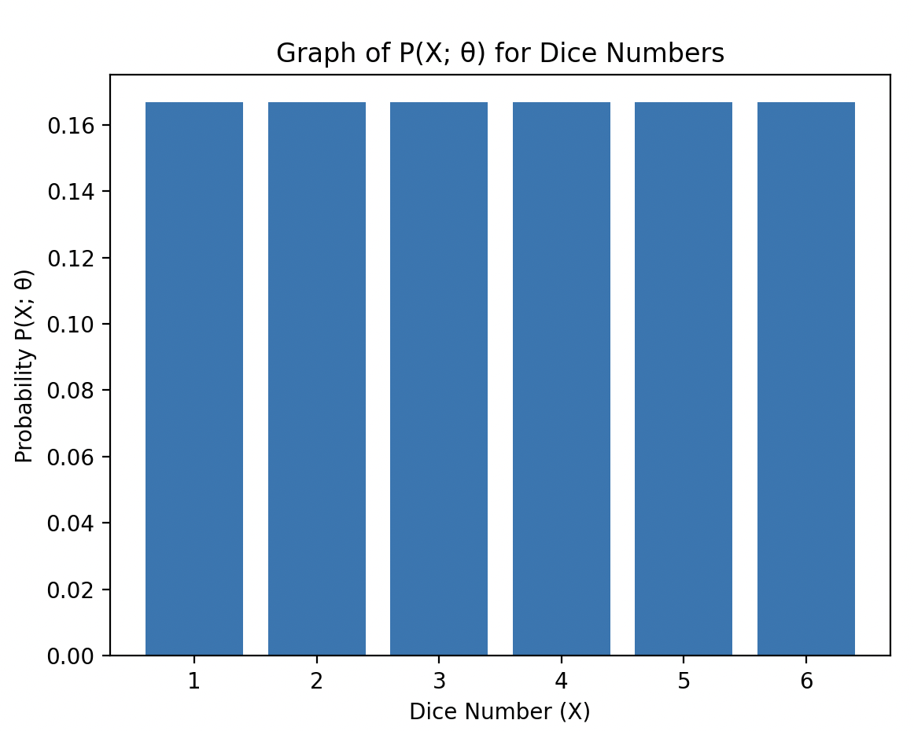

# P(Y | X; θ) Graph

X 는 키, Y 는 몸무게이다. `P(Y | X; θ)` 를 시각화 해보자. `θ`는 이 경우 선형
회귀 모델의 파라미터를 의미합니다. 선형 회귀 모델은 `Y = aX + b + ε` 형태로
주어지고, `θ`는 계수 `a`와 `b`를 포함합니다. 여기서 `ε`는 오차 또는 노이즈를 나타냅니다.
이 코드에서는 `sklearn.linear_model.LinearRegression`을 사용하여 파라미터를
학습하고 회귀 모델을 통해 주어진 `X` 값에 대한 `Y` 값의 확률 분포 `P(Y|X; θ)`를
시각화합니다.

```py
import numpy as np
import matplotlib.pyplot as plt
from mpl_toolkits.mplot3d import Axes3D
from sklearn.linear_model import LinearRegression
from scipy.stats import norm

# 가상 데이터 생성
np.random.seed(0)
num_samples = 100
X = np.random.uniform(0, 10, num_samples)
noise = np.random.normal(0, 1, num_samples)
Y = 2 * X + 3 + noise

# 회귀 모델 학습
X = X.reshape(-1, 1)
regression_model = LinearRegression()
regression_model.fit(X, Y)

# 가우시안 확률 분포를 사용해 P(Y|X; θ) 계산
std_dev = np.std(Y - regression_model.predict(X))
X_range = np.linspace(0, 10, 100)
Y_range = np.linspace(np.min(Y), np.max(Y), 100)
Z = np.array([norm.pdf(Y_range, loc=regression_model.predict(np.array([[x]])), scale=std_dev) for x in X_range])

# 3차원 확률 분포 시각화
fig = plt.figure(figsize=(10, 8))
ax = fig.add_subplot(111, projection='3d')

X_grid, Y_grid = np.meshgrid(X_range, Y_range)
ax.plot_surface(X_grid, Y_grid, Z.T, cmap='viridis', alpha=.8)

ax.set_xlabel('X')
ax.set_ylabel('Y')
ax.set_zlabel('P(Y|X; θ)')
plt.title('3D Visualization of P(Y|X; θ) with Linear Regression Model')
plt.show()
```

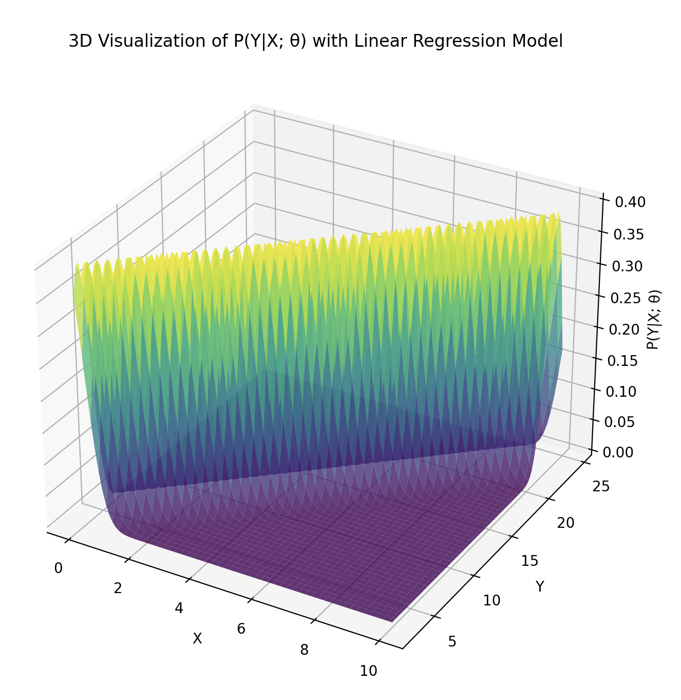

# Simple Data, Multiple Implementations

키(X)를 독립 변수로하고 몸무게(Y)를 종속 변수로 하는 데이터를 모델링해보자.

## Linear Regression, 최소제곱추정법(Least Squares Estimation, LSE)

키(X)와 몸무게(Y) 데이터를 사용하여 독립 변수와 종속 변수간의 선형 회귀 모델을
만드는 Python 코드를 제공합니다. 여기서는 최소제곱추정법 (Least Squares
Estimation, LSE)을 사용하여 선형 회귀 매개변수를 찾습니다.

```py
import numpy as np
import matplotlib.pyplot as plt

# 키와 몸무게 데이터 (예시입니다. 실제 데이터로 대체하세요.)
X = np.array([152, 155, 163, 175, 189])
Y = np.array([45, 49, 60, 68, 77])

# 최소 제곱법을 이용한 선형 회귀 계수 추정
X_mean = np.mean(X)
Y_mean = np.mean(Y)
n = len(X)

numerator = np.sum((X - X_mean) * (Y - Y_mean))
denominator = np.sum((X - X_mean) ** 2)

w = numerator / denominator
b = Y_mean - w * X_mean

print("Optimal w (slope):", w)
print("Optimal b (intercept):", b)

# 그래프로 결과 시각화
plt.scatter(X, Y, color='blue', label='Actual Data')
plt.plot(X, w * X + b, color='red', label='Fitted Line')
plt.xlabel('Height (cm)')
plt.ylabel('Weight (kg)')
plt.legend(loc='best')
plt.show()
```

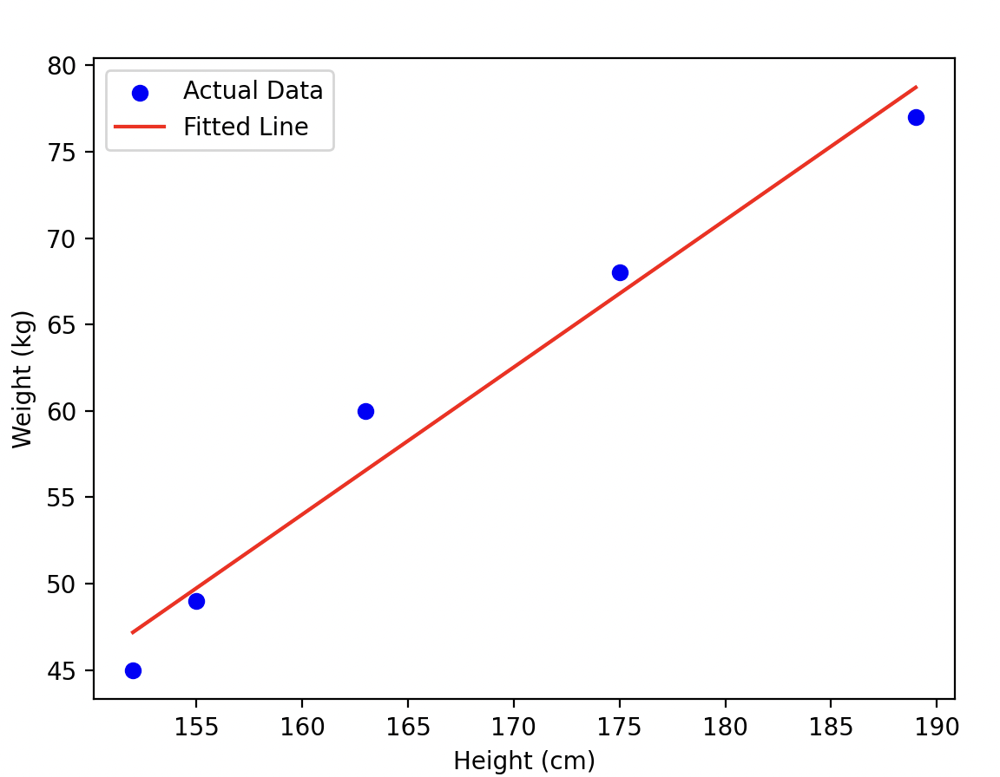

위의 코드는 키(X)와 몸무게(Y)를 사용하여 최소제곱추정법으로 선형 회귀 모델의
매개 변수를 찾고 그래프로 결과를 시각화합니다. 이 코드에서 X와 Y 배열에 키와
몸무게 데이터를 제공해야 합니다. 몸무게를 예측하기 위해 구한 선형 회귀 모델에서
파라미터 w와 b를 사용하세요.

## Linear Regression, 최대우도추정법(MLE)

선형 회귀에서 최대우도추정법(MLE)을 구현하려면 가우시안 오차를 가정해야 합니다.
이 경우, 최대우도추정법은 최소제곱추정법(LSE)과 동일한 결과를 도출합니다.
그렇지만, MLE를 사용하여 선형 회귀를 구현하는 방법을 살펴 보겠습니다.

```py
import numpy as np
import matplotlib.pyplot as plt

# 키와 몸무게 데이터 (예시입니다. 실제 데이터로 대체하세요.)
X = np.array([152, 155, 163, 175, 189], dtype=float)
Y = np.array([45, 49, 60, 68, 77], dtype=float)

# 데이터 정규화 (수렴 속도 향상을 위해 추가)
X = (X - np.min(X)) / (np.max(X) - np.min(X))
Y = (Y - np.min(Y)) / (np.max(Y) - np.min(Y))

# 학습률 및 반복 횟수 설정
alpha = 0.01
epochs = 5000

# 최대우도추정법 (MLE)를 사용하여 선형 회귀 매개 변수 찾기
n = len(X)
w = 0
b = 0

for epoch in range(epochs):
    Y_pred = w * X + b
    R = Y - Y_pred
    
    w_gradient = (-2 / n) * np.sum(X * R)
    b_gradient = (-2 / n) * np.sum(R)
    
    w = w - alpha * w_gradient
    b = b - alpha * b_gradient

print("Optimal w (slope):", w)
print("Optimal b (intercept):", b)

# 그래프로 결과 시각화
plt.scatter(X, Y, color='blue', label='Actual Data')
plt.plot(X, w * X + b, color='red', label='Fitted Line')
plt.xlabel('Normalized Height')
plt.ylabel('Normalized Weight')
plt.legend(loc='best')
plt.show()
```

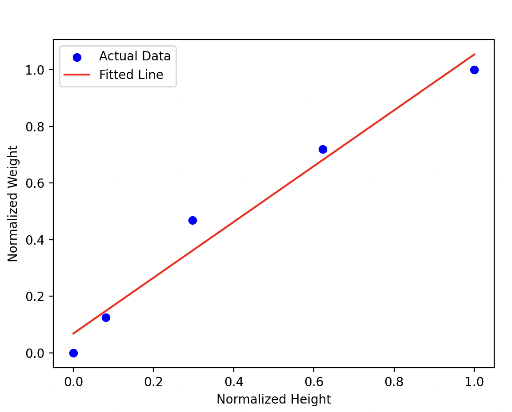

위 코드는 LSE 예제와 거의 동일합니다. 그 이유는 선형 회귀 문제에서 LSE와 MLE가
동일한 결과를 도출하기 때문입니다. 코드에는 데이터 생성, 매개 변수 최적화 및
결과 시각화 외에 특별한 추가 단계가 없습니다.

## Linear Regression, 베이지안 추정법(Bayesian Estimation)

선형 회귀란 독립 변수 X와 종속 변수 Y 사이의 관계를 선형 방정식을 사용하여
모델링하는 것입니다. 선형 회귀에서 가장 일반적인 형태는 단순 선형 회귀입니다. 이
경우에는 다음과 같은 방정식이 사용됩니다:

```
Y = β0 + β1 * X + ε
```

여기서 Y는 종속 변수, X는 독립 변수, β0는 절편, β1은 기울기(가중치)이고, ε은
잔차(오차)를 나타냅니다.

베이지안 선형 회귀는 이러한 선형 회귀 문제를 베이즈 정리를 사용하여 접근합니다.
이를 위해 모델 파라미터의 사전 분포를 설정하고, 주어진 데이터에 대한 가능도를
계산하여 사후 분포를 추정합니다. 아래는 베이지안 선형 회귀의 과정을 수식으로
설명한 것입니다.

**사전 분포 설정**: 모델 파라미터 β의 사전 분포를 정규 분포(Normal distribution)로
가정합니다.

```
P(β) ~ N(μ₀, Σ₀)
```

여기서 `μ₀`과 `Σ₀`는 사전 분포의 평균 및 공분산 행렬을 나타냅니다.

**가능도 계산**: 주어진 데이터 X와 모델 파라미터 β을 사용하여 Y의 가능도를
계산합니다.

```
P(Y|X, β) ~ N(X * β, σ²I)
```

여기서 σ²는 데이터와 회귀 직선 사이의 잔차의 분산을 나타내는 노이즈 항입니다.

**사후 분포 계산**: 사전 분포와 가능도를 결합하여 모델 파라미터에 대한 사후 확률
분포를 추정합니다. 여기서 베이즈 정리를 사용합니다.

```
P(β|Y, X) = P(Y|X, β) * P(β) / P(Y|X)
```

구체적으로, 우리는 다음과 같은 사후 분포를 얻습니다.

```
P(β|Y, X) ~ N(μN, ΣN)
```

여기서 μN와 ΣN은 사후 분포의 평균 및 공분산 행렬입니다.

**예측 수행**: 사후 분포를 사용하여 주어진 데이터에 대한 예측을 수행합니다.

```
Y_new = X_new * μN
```

결론적으로, 베이지안 선형 회귀는 모델 파라미터에 대한 확률 분포를 사용하여 선형
회귀 문제를 해결합니다. 주어진 데이터와 사전 확률을 통해 사후 확률을 추정하고,
이를 통해 예측을 수행합니다. 이 방식은 데이터에 대한 추가 정보를 포함하고, 모델
파라미터에 대한 불확실성을 반영할 수 있습니다.

```py
import numpy as np
import matplotlib.pyplot as plt
from sklearn.linear_model import BayesianRidge

# 키(X)와 몸무게(Y) 예시 데이터 (실제 데이터로 대체하십시오.)
X = np.array([[152], [155], [163], [175], [189]])
Y = np.array([45, 49, 60, 68, 77])

# BayesianRidge를 이용해 선형 회귀 모델 생성
bayesian_ridge = BayesianRidge()

# 모델 학습
bayesian_ridge.fit(X, Y)

# 베이지안 선형 회귀로 몸무게 예측
y_pred = bayesian_ridge.predict(X)

# 원래 키와 몸무게 데이터를 그려줍니다.
plt.scatter(X, Y, color='blue', label='Actual Data')

# 베이지안 선형 회귀로 예측값을 그려줍니다.
plt.plot(X, y_pred, color='red', label='Fitted Line')

plt.xlabel('Height (cm)')
plt.ylabel('Weight (kg)')
plt.legend(loc='best')
plt.show()
```

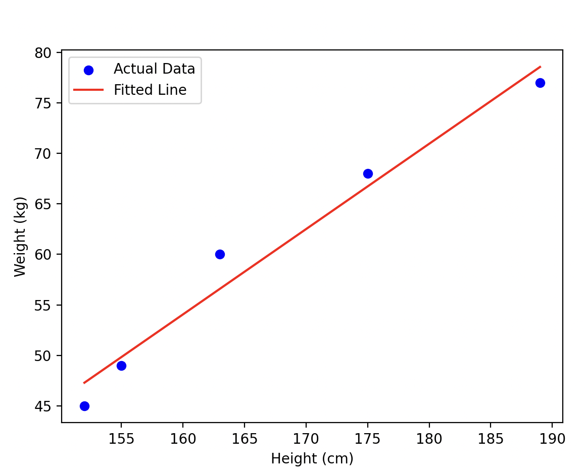

## 인공지능 신경망 (Artifical Neural Networks)

다음은 scikit-learn의 `MLPRegressor`를 사용하여 인공 신경망 모델을 학습시키고
키에 대한 몸무게를 예측합니다. 실제 데이터를 사용하려면 `X`와 `y`에 해당하는 값을
실제 데이터로 바꾸면 됩니다.

```py
import numpy as np
import matplotlib.pyplot as plt
from sklearn.neural_network import MLPRegressor

# 키(X)와 몸무게(Y) 예시 데이터 (실제 데이터로 대체하십시오.)
X = np.array([[152], [155], [163], [175], [189]])
Y = np.array([45, 49, 60, 68, 77])

# MLPRegressor를 사용하여 인공신경망 회귀 모델 생성
mlp_regressor = MLPRegressor(activation='identity', hidden_layer_sizes=(), solver='lbfgs', random_state=0, max_iter=1000)

# 데이터를 학습시키십시오
mlp_regressor.fit(X, Y)

# 회귀 모델에 따라 몸무게를 예측합니다.
y_pred = mlp_regressor.predict(X)

# 원래의 키와 몸무게 데이터를 그려줍니다.
plt.scatter(X, Y, color='blue', label='Actual Data')

# 인공신경망 회귀로 예측한 값을 그려줍니다.
plt.plot(X, y_pred, color='red', label='Predicted Data')

plt.xlabel('Height (cm)')
plt.ylabel('Weight (kg)')
plt.legend(loc='best')
plt.show()
```

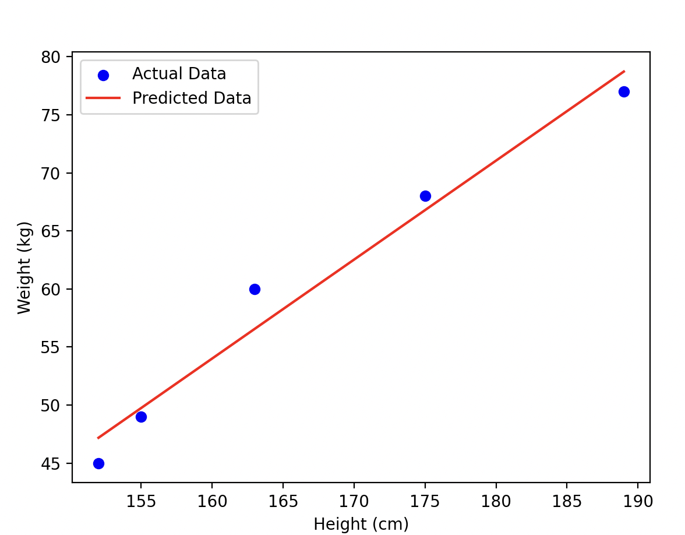

다음은 PyTorch 를 사용한 구현이다.

```py
import numpy as np
import matplotlib.pyplot as plt
import torch
from torch import nn

# 키(X)와 몸무게(Y) 데이터
X = np.array([[152], [155], [163], [175], [189]], dtype=np.float32)
Y = np.array([45, 49, 60, 68, 77], dtype=np.float32)

def normalize_data(data):
    mean = np.mean(data)
    std = np.std(data)
    return (data - mean) / std

def de_normalize_data(data, original_data):
    mean = np.mean(original_data)
    std = np.std(original_data)
    return data * std + mean

X_normalized = normalize_data(X)
Y_normalized = normalize_data(Y)
X_tensor = torch.FloatTensor(X_normalized)
Y_tensor = torch.FloatTensor(Y_normalized).view(-1, 1)

# 선형 회귀 모델 정의
class LinearRegressionModel(nn.Module):
    def __init__(self):
        super(LinearRegressionModel, self).__init__()
        self.fc = nn.Linear(1, 1)

    def forward(self, x):
        return self.fc(x)

model = LinearRegressionModel()

# 손실 함수와 옵티마이저 정의
criterion = nn.MSELoss()
optimizer = torch.optim.SGD(model.parameters(), lr=0.01)

# 회귀 모델 학습
epochs = 10000
losses = []

for epoch in range(epochs):
    optimizer.zero_grad()

    y_pred = model(X_tensor)
    loss = criterion(y_pred, Y_tensor)

    loss.backward()
    optimizer.step()

    losses.append(loss.item())

    if (epoch + 1) % 1000 == 0:
        print(f"Epoch: {epoch + 1}, Loss: {loss.item()}")

# 보다 넓은 범위의 X 값에 대해 예측을 계산합니다.
X_extended = np.expand_dims(np.linspace(np.min(X), np.max(X), 100).astype(np.float32), axis=-1)
y_extended_pred = model(torch.from_numpy(normalize_data(X_extended))).detach().numpy()
y_extended_pred = de_normalize_data(y_extended_pred, Y)

# 원래의 키와 몸무게 데이터와 예측선을 표시합니다.
plt.scatter(X, Y, color='blue', label='Actual Data')
plt.plot(X_extended, y_extended_pred, color='red', label='Predicted Data')

plt.xlabel('Height (cm)')
plt.ylabel('Weight (kg)')
plt.legend(loc='best')
plt.show()
```

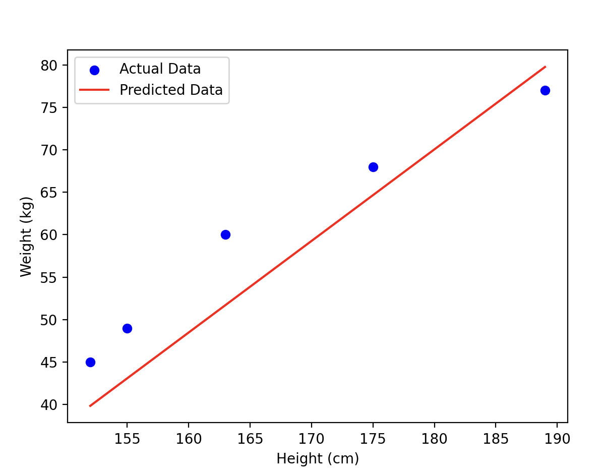

## 랜덤 포레스트 (Random Forest)

Scikit-learn 라이브러리의 `RandomForestRegressor`를 사용하여 랜덤 포레스트
모델을 구현하고 학습시키는 예제입니다

```py
import numpy as np
import matplotlib.pyplot as plt
from sklearn.ensemble import RandomForestRegressor

# 키(X)와 몸무게(y) 데이터를 생성합니다. (예시 데이터)
X = np.array([150, 160, 170, 180, 190]).reshape(-1, 1)
y = np.array([55, 60, 65, 75, 85])

# 랜덤 포레스트 모델 객체를 생성합니다.
random_forest = RandomForestRegressor(n_estimators=100, random_state=0)

# 키(X)와 몸무게(y) 데이터를 사용하여 모델을 학습시킵니다.
random_forest.fit(X, y)

# 새로운 키 값에 대한 몸무게를 예측합니다.
new_X = np.array([167]).reshape(-1, 1)
predicted_y = random_forest.predict(new_X)

print("새로운 키:", new_X)
print("예측된 몸무게:", predicted_y)

# 시각화를 위한 키 값들에 대한 몸무게 예측을 수행합니다.
X_display = np.arange(145, 195).reshape(-1, 1)
y_display = random_forest.predict(X_display)

# 결과를 시각화합니다.
plt.scatter(X, y, color='blue', label='Actual data points')
plt.plot(X_display, y_display, color='green', label='Random Forest')
plt.scatter(new_X, predicted_y, color='red', label='Prediction', marker='x', s=100)
plt.xlabel('Height (X)')
plt.ylabel('Weight (Y)')
plt.legend()
plt.title("Height vs. Weight - Random Forest Regression Modeling & Visualization")
plt.show()
```

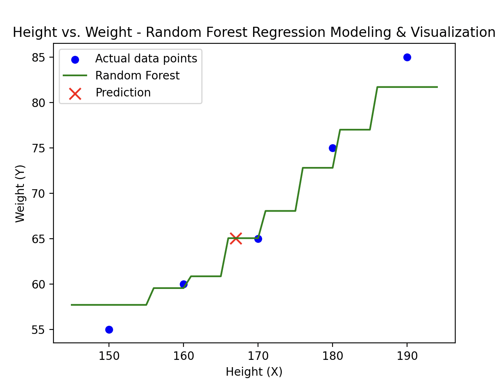

# p(X; μ, σ^2) 최대우도법 (Maximum Likelihood Estimation, MLE)

**일반 정규 분포**를 따르는 확률변수 `X`가 있을 때, 확률밀도함수는 다음과 같습니다.

```
p(x; μ, σ^2) = (1 / √(2 * π * σ^2)) * exp(-(x - μ)^2 / (2 * σ^2))
```

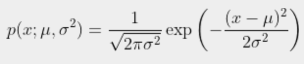

```
p(x; \mu, \sigma^2) = \frac{1}{\sqrt{2 \pi \sigma^2}} \exp\left(-\frac{(x - \mu)^2}{2\sigma^2}\right)
```

이제 관측된 데이터(sample) `x1, x2, ..., xn`이 있다고 가정하겠습니다. MLE 과정은
다음과 같습니다.

1. Likelihood 함수 정의:

데이터(sample) x1, x2, ..., xn에 대한 likelihood 함수는 각 데이터 포인트의 확률밀도함수를 곱한 형태입니다.

```
L(μ, σ^2 | x1, x2, ..., xn) = p(x1; μ, σ^2) * p(x2; μ, σ^2) * ... * p(xn; μ, σ^2)
```

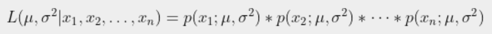

```
L(\mu, \sigma^2 | x_1, x_2, \ldots, x_n) = p(x_1; \mu, \sigma^2) * p(x_2; \mu, \sigma^2) * \cdots * p(x_n; \mu, \sigma^2)
```

2. Log-likelihood 함수 정의:

로그 함수는 단조 증가 함수이므로 likelihood를 최대화하는 값과 log-likelihood를 최대화하는 값은 동일합니다. 타원 연산의 안정성과 연산의 단순화를 위해 log-likelihood 함수를 사용합니다.

```
log L(μ, σ^2 | x1, x2, ..., xn) = ∑[log(p(xi; μ, σ^2))] for i = 1 to n
```

3. Log-likelihood 함수 미분 및 최적화:

모수 `μ`와 `σ^2`에 대한 편미분을 통해 log-likelihood 함수를 최적화하고, 그 결과로 최적의 모수를 확인할 수 있습니다. 모수에 대해 미분한 값이 0이 되는 값을 찾습니다.

```
∂(log L) / ∂μ = 0, ∂(log L) / ∂(σ^2) = 0
```

4. 최적화 결과 해석:

위 최적화 과정을 통해 얻어진 최적의 모수 `μ`와 `σ^2`는 관측된 데이터를 가장 잘 설명하는 정규 분포의 모수입니다.

해당 과정을 통해 MLE는 주어진 데이터를 기반으로 일반 정규 분포의 모수인 `μ`와 `σ^2`을 추정합니다. 

다음은 주어진 데이터(표준 정규 분포를 따르는 데이터)에 대해 `μ` 및 `σ^2`에 대한
Likelihood를 계산하고 그 결과를 2D 로 시각화한다.

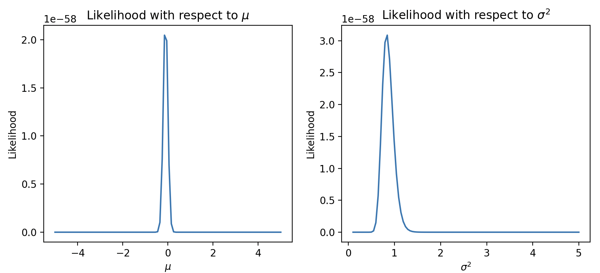

```py
import numpy as np
import matplotlib.pyplot as plt
from scipy.stats import norm

# 랜덤 데이터 생성 (표준 정규 분포를 따르는 데이터)
np.random.seed(42)
n = 100
data = np.random.normal(0, 1, n)

# Likelihood 함수 정의
def likelihood(mu, sigma_sq, data):
    return np.prod(norm.pdf(data, mu, np.sqrt(sigma_sq)))

# μ에 대한 likelihood 계산
mu_values = np.linspace(-5, 5, 100)
likelihood_mu = [likelihood(mu, 1, data) for mu in mu_values]

# σ^2에 대한 likelihood 계산
sigma_sq_values = np.linspace(0.1, 5, 100)
likelihood_sigma_sq = [likelihood(0, sigma_sq, data) for sigma_sq in sigma_sq_values]

# 결과를 시각화
fig, axes = plt.subplots(1, 2, figsize=(10, 4))

axes[0].plot(mu_values, likelihood_mu)
axes[0].set_title("Likelihood with respect to $μ$")
axes[0].set_xlabel("$μ$")
axes[0].set_ylabel("Likelihood")

axes[1].plot(sigma_sq_values, likelihood_sigma_sq)
axes[1].set_title("Likelihood with respect to $σ^2$")
axes[1].set_xlabel("$σ^2$")
axes[1].set_ylabel("Likelihood")

plt.show()
```

다음은 주어진 데이터(표준 정규 분포를 따르는 데이터)에 대해 `μ` 및 `σ^2`에 대한
Likelihood를 계산하고 그 결과를 3D 로 시각화 한다.

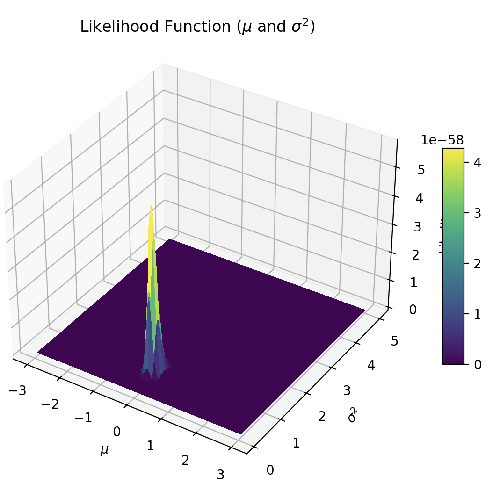

```py
import numpy as np
import matplotlib.pyplot as plt
from scipy.stats import norm
from mpl_toolkits.mplot3d import Axes3D

# 랜덤 데이터 생성 (표준 정규 분포를 따르는 데이터)
np.random.seed(42)
n = 100
data = np.random.normal(0, 1, n)

# Likelihood 함수 정의
def likelihood(mu, sigma_sq, data):
    return np.prod(norm.pdf(data, mu, np.sqrt(sigma_sq)))

# μ와 σ^2 값의 범위를 설정
mu_values = np.linspace(-3, 3, 100)
sigma_sq_values = np.linspace(0.1, 5, 100)

# Meshgrid 생성
Mu, Sigma_sq = np.meshgrid(mu_values, sigma_sq_values)

# 각 μ와 σ^2 조합에 대한 Likelihood 계산
_likelihood = np.array([likelihood(mu, sigma_sq, data)
                        for mu, sigma_sq in zip(np.ravel(Mu), np.ravel(Sigma_sq))])

# Likelihood 값을 Meshgrid에 맞춤
Likelihood = _likelihood.reshape(Mu.shape)

# 3D로 시각화
fig = plt.figure(figsize=(8, 6))
ax = fig.gca(projection='3d')
surf = ax.plot_surface(Mu, Sigma_sq, Likelihood, cmap='viridis', linewidth=0, antialiased=False)

ax.set_title('Likelihood Function ($μ$ and $σ^2$)')
ax.set_xlabel('$μ$')
ax.set_ylabel('$σ^2$')
ax.set_zlabel('Likelihood')

fig.colorbar(surf, shrink=0.5, aspect=10)

plt.show()
```

# p(Y | X; μ, σ^2) 최대우도법 (Maximum Likelihood Estimation, MLE)

최대우도법 (Maximum Likelihood Estimation, MLE)은 주어진 데이터를 가장 잘 설명하는 모수 (μ, σ^2)를 추정하는 방법입니다. 이 과정은 확률밀도함수의 우도(likelihood)를 최대화하는 방향으로 진행되며, 이해를 돕기 위해 다음 단계로 설명하겠습니다.

**데이터 수집**: 먼저, 관측된 키(x)와 몸무게(y)에 대한 데이터 셋을 수집합니다.

**확률밀도함수 정의**: 키(x)에 대한 몸무게(y)의 확률밀도함수 p(y | x; μ, σ^2)를 정의합니다. 여기서 μ는 평균, σ^2는 분산을 나타냅니다. 일반적으로 정규분포를 가정하여 확률밀도함수를 정의합니다.

**우도함수 정의**: 데이터셋의 모든 관측치에 대한 확률밀도함수의 곱으로 우도함수 L(μ, σ^2)를 정의합니다. 여기서 우리는 모수 (μ, σ^2)가 주어진 경우 데이터 셋이 얼마나 그럴듯한지를 나타내는 값을 계산하게 됩니다.

```
L(μ, σ^2) = Π p(y_i | x_i; μ, σ^2)
```

**로그우도함수**: 곱셈의 형태인 우도함수를 덧셈 형태로 바꾸기 위해 우도함수에 로그를 취해 로그우도함수를 정의합니다. 이렇게 함으로써 계산이 용이해집니다.

```
log L(μ, σ^2) = Σ log p(y_i | x_i; μ, σ^2)
```

**모수 추정**: 로그우도함수를 최대화하는 모수 (μ, σ^2)을 찾습니다. 이를 위해 미분과 같은 최적화 기술을 사용하여 로그우도함수에 대한 모수의 최대값을 찾을 수 있습니다.

```
argmax_(μ, σ^2) log L(μ, σ^2)
```

결과 해석: 추정된 최적의 모수 (μ, σ^2)를 사용하여 데이터 셋의 몸무게 분포와 관련된 통계적인 해석을 할 수 있습니다.

요약하면, MLE 과정은 관측된 데이터를 가장 잘 설명하는 확률밀도함수의 모수 `(μ, σ^2)`를 찾기 위해 우도를 최대화하는 방식으로 진행됩니다. 이를 통해 키와 몸무게 간의 관계를 통계적으로 모형화하여 다양한 분석과 예측이 가능하게 됩니다.

# Supervised Learning

키를 입력하면 몸무게를 출력하는 모델을 만들고자 하는 경우, Supervised learning
(지도학습) 알고리즘 중 일부를 사용하여 회귀(regression) 문제를 해결할 수
있습니다. 주어진 데이터를 바탕으로 Supervised Learning 을 통해 모델링할 수 있다.

**지도학습(supervised learning)**은 
**인공신경망(artificial neural networks, ANN)**
뿐만 아니라 여러 종류의 머신러닝 모델에 사용되는 학습 방법입니다. 지도
학습은 입력 변수와 관련된 출력 변수(레이블 또는 타겟)가 제공되는 학습 데이터셋을
사용하여 모델을 학습합니다. 이러한 지도 학습 방식은 다양한 머신러닝 알고리즘에서
사용되며 대표적인 지도 학습 알고리즘은 다음과 같습니다.

* 선형 회귀(Linear regression)
* 로지스틱 회귀(Logistic regression)
* 서포트 벡터 머신(Support Vector Machines, SVM)
* 결정 트리(Decision Trees)
* 랜덤 포레스트(Random Forests)
* 그래디언트 부스팅(Gradient Boosting)
* K-최근접 이웃(K-Nearest Neighbors, KNN)
* 인공신경망(artificial neural networks, ANN)
* 컨볼루션 신경망 (Convolutional Neural Networks, CNN)
* 순환 신경망(Recurrent Neural Networks, RNN)

이러한 모델들은 분류(classification), 회귀(regression), 예측(prediction) 등의
문제를 해결하는 데 사용되며 지도 학습 방식을 따릅니다. 각 모델은 데이터의 성격,
복잡성, 차원, 패턴 등에 따라 성능과 적합성이 다를 수 있습니다.

# 인공신경망 모델 vs 딥러닝 모델

딥러닝(Deep learning)은 인공신경망(artificial neural networks, ANN)의 한
형태로서, 크게는 같은 범주 안에 속하지만 구체적인 모델 구조와 기술적 차이가
있습니다.

인공신경망(ANN)은 뉴런의 연결망으로 구성된 머신러닝 모델로, 뇌의 동작 방식에서
영감을 받은 계산 방식입니다. 인공신경망에는 퍼셉트론(Perceptron)이나 다층
퍼셉트론(Multilayer Perceptron, MLP) 같은 간단한 네트워크 구조부터 복잡한
네트워크 구조까지 다양한 형태가 있습니다.

반면, 딥러닝은 인공신경망 중 깊은 계층 구조를 가지는 (즉, 많은 hidden layer를
가진) 모델 입니다. 딥러닝 알고리즘은 대규모 데이터를 처리하고 복잡한 패턴을
찾아내기 위해 계층적으로 구성된 모델을 사용합니다. 딥러닝 모델에는 컨볼루션
신경망(Convolutional Neural Networks, CNN), 순환 신경망(Recurrent Neural
Networks, RNN), 트랜스포머(Transformer) 등과 같은 고급 인공신경망 구조가
포함됩니다.

요약하면, 딥러닝 모델은 인공신경망 모델 중 깊은 네트워크 구조를 가진 모델로
이해할 수 있으며, 인공신경망은 더 넓은 범주의 머신러닝 모델입니다. 따라서 모든
딥러닝 모델은 인공신경망으로 간주될 수 있지만, 모든 인공신경망 모델이 딥러닝
모델은 아닙니다.

# 인공신경망 모델의 종류

인공신경망(Artificial Neural Networks, ANN)은 다양한 네트워크 구조와 목적에 따라
여러 가지 종류로 나뉩니다. 대표적인 인공신경망 모델들은 다음과 같습니다:

**퍼셉트론(Perceptron)**: 가장 간단한 인공신경망 구조로, 입력값에 가중치를
곱하고 편향을 더해 하나의 출력값을 만드는 선형 모델입니다.

**다층 퍼셉트론(Multilayer Perceptron, MLP)**: 두 개 이상의 레이어로 구성된
인공신경망으로, 중간에 하나 이상의 은닉층(hidden layers)을 포함합니다. MLP는
비선형 활성화 함수를 사용하여 비선형 관계를 모델링할 수 있습니다.

**컨볼루션 신경망(Convolutional Neural Networks, CNN)**: 이미지 인식, 분류 및
처리를 위해 설계된 ANN 모델입니다. 컨볼루션 레이어와 풀링 레이어를 사용하여
공간적 계층 구조를 학습합니다.

**순환 신경망(Recurrent Neural Networks, RNN)**: 순차 데이터와 시계열 데이터를
처리하기 위해 설계된 ANN 모델입니다. RNN은 각 시점의 데이터를 처리하면서 이전
시점의 정보를 포함하는 숨겨진 상태(hidden state)를 유지합니다.

**Long Short-Term Memory (LSTM) Networks**: 그래디언트 소실 문제를 극복하기 위해
개발된 RNN의 변형입니다. LSTM은 게이트 메커니즘을 사용하여 장기 및 단기 정보를
학습 및 저장할 수 있습니다.

**Gated Recurrent Units (GRUs)**: LSTM의 간소화된 변형으로, 비슷한 게이팅 구조를
사용하나 LSTM 보다 더 적은 연산량이 필요합니다.

**트랜스포머(Transformer)**: 자연어 처리(NLP) 등의 순차적 데이터 처리를 위한
모델로, 어텐션 메커니즘을 사용하여 멀리 떨어진 입력 간의 관계를 직접
모델링합니다.

이 외에도 인공신경망은 다양한 활성화 함수, 최적화 기법, 규제 방법 등과 함께
사용되어 다양한 응용 분야에서 맞춤형 모델을 만드는 데 활용됩니다. 각 유형의
인공신경망은 특정 문제나 데이터 유형에 적합한 구조를 가지며, 일반적으로 딥러닝
기술의 근간이 됩니다.

# PyTorch Simple Linear Regression

다음은 PyTorch 로 구현한 Simple Linear Regression 이다.

```py
import torch
import torch.nn as nn
import torch.optim as optim

# Generate toy data
torch.manual_seed(42)
X = torch.rand(100, 1) * 10  # 100개의 데이터 생성
Y = 2 * X + 3 + torch.randn(100, 1)  # True line: y = 2x + 3, adding some noise

# Define the linear regression model
class SimpleLinearRegression(nn.Module):
    def __init__(self):
        super(SimpleLinearRegression, self).__init__()
        self.linear = nn.Linear(1, 1)

    def forward(self, x):
        return self.linear(x)

model = SimpleLinearRegression()

# Define loss function and optimizer
criterion = nn.MSELoss()
optimizer = optim.SGD(model.parameters(), lr=0.001)

# Train the model
num_epochs = 1000
for epoch in range(num_epochs):
    optimizer.zero_grad()
    Y_pred = model(X)
    loss = criterion(Y_pred, Y)
    loss.backward()
    optimizer.step()

print("After training:")
print("Weights:", model.linear.weight.item())
print("Bias:", model.linear.bias.item())
```

# PyTorch Simple Linear Regression with Validation Data

```py
import torch
import torch.nn as nn
import torch.optim as optim

# Generate toy data
torch.manual_seed(42)
X = torch.rand(100, 1) * 10  # 100 data points
Y = 2 * X + 3 + torch.randn(100, 1)  # True line: y = 2x + 3, adding some noise

# Split data into train and validation sets (80% train, 20% validation)
train_ratio = 0.8
train_size = int(train_ratio * len(X))
X_train, X_val = X[:train_size], X[train_size:]
Y_train, Y_val = Y[:train_size], Y[train_size:]

# Define the linear regression model
class SimpleLinearRegression(nn.Module):
    def __init__(self):
        super(SimpleLinearRegression, self).__init__()
        self.linear = nn.Linear(1, 1)

    def forward(self, x):
        return self.linear(x)

model = SimpleLinearRegression()

# Define loss function and optimizer
criterion = nn.MSELoss()
optimizer = optim.SGD(model.parameters(), lr=0.001)

# Train the model
num_epochs = 1000
for epoch in range(num_epochs):
    optimizer.zero_grad()
    Y_pred_train = model(X_train)
    loss_train = criterion(Y_pred_train, Y_train)
    loss_train.backward()
    optimizer.step()

    # Compute the validation loss
    with torch.no_grad():
        Y_pred_val = model(X_val)
        loss_val = criterion(Y_pred_val, Y_val)

    # Print the training and validation loss every 100 epochs 
    if epoch % 100 == 0:
        print(f"Epoch {epoch}: Train Loss = {loss_train.item()}, Validation Loss = {loss_val.item()}")

print("After training:")
print("Weights:", model.linear.weight.item())
print("Bias:", model.linear.bias.item())
```

I've added a new variable `train_ratio` to specify the ratio of training data
points and split `X` and `Y` dataset into `train` and `validation` sets. The
training set is used for model training, while the validation¡ set is used for
calculating the validation loss, which can be used to monitor the performance of
the model.

# PyTorch Simple Linear Regression with Test Data

To add test data for evaluating the model's performance in terms of precision
and recall, first, you need to generate some test data points. Since precision
and recall metrics are generally used for classification problems, you'll need
to set a threshold for the predicted continuous values to convert them into
class labels (0 or 1). Then, you can compute the precision and recall scores
based on the true and predicted labels. Here's how to modify the code
accordingly:

```py
import torch
import torch.nn as nn
import torch.optim as optim
from sklearn.metrics import precision_score, recall_score
import matplotlib.pyplot as plt

# Generate toy data
torch.manual_seed(42)
X = torch.rand(100, 1) * 10  # 100 data points
Y = 2 * X + 3 + torch.randn(100, 1)  # True line: y = 2x + 3, adding some noise

# Split data into train, validation, and test sets (70% train, 20% validation, 10% test)
train_ratio = 0.7
val_ratio = 0.2
train_size = int(train_ratio * len(X))
val_size = int(val_ratio * len(X))
X_train, X_val, X_test = X[:train_size], X[train_size:train_size+val_size], X[train_size+val_size:]
Y_train, Y_val, Y_test = Y[:train_size], Y[train_size:train_size+val_size], Y[train_size+val_size:]

# Define the linear regression model
class SimpleLinearRegression(nn.Module):
    def __init__(self):
        super(SimpleLinearRegression, self).__init__()
        self.linear = nn.Linear(1, 1)

    def forward(self, x):
        return self.linear(x)

model = SimpleLinearRegression()

# Define threshold value to convert continuous values to class labels
threshold = 15

# Convert target values to class labels (0 or 1) based on the threshold
Y_train_labels = (Y_train > threshold).float()
Y_val_labels = (Y_val > threshold).float()
Y_test_labels = (Y_test > threshold).float()

# Define loss function and optimizer
criterion = nn.MSELoss()
optimizer = optim.SGD(model.parameters(), lr=0.001)

# Train the model
num_epochs = 1000
for epoch in range(num_epochs):
    optimizer.zero_grad()
    Y_pred_train = model(X_train)
    loss_train = criterion(Y_pred_train, Y_train)
    loss_train.backward()
    optimizer.step()

    # Compute the validation loss
    with torch.no_grad():
        Y_pred_val = model(X_val)
        loss_val = criterion(Y_pred_val, Y_val)

    # Print the training and validation loss every 100 epochs
    if epoch % 100 == 0:
        print(f"Epoch {epoch}: Train Loss = {loss_train.item()}, Validation Loss = {loss_val.item()}")

# Evaluate the model on the test data
with torch.no_grad():
    Y_pred_test = model(X_test)
    # Convert predicted continuous values to class labels based on the threshold
    Y_pred_test_labels = (Y_pred_test > threshold).float()

# Calculate precision and recall
precision = precision_score(Y_test_labels, Y_pred_test_labels)
recall = recall_score(Y_test_labels, Y_pred_test_labels)

print("After training:")
print("Weights:", model.linear.weight.item())
print("Bias:", model.linear.bias.item())
print("Precision:", precision)
print("Recall:", recall)

# Visualize precision and recall
metrics = ["Precision", "Recall"]
values = [precision, recall]

plt.bar(metrics, values)
plt.xlabel("Metrics")
plt.ylabel("Values")
plt.title("Precision and Recall")
plt.ylim(0, 1)  # Set y-axis limits to show values between 0 and 1
plt.show()
```

In this modified code, I've added test data for evaluating precision and recall
metrics. The target values `Y` are converted to class labels (0 or 1) based on a
defined threshold value. The precision and recall scores are then computed using
the `precision_score` and `recall_score` functions from the `sklearn.metrics`
module, with the true and predicted labels of the test data. The precision and
recall values are printed after the training process. Keep in mind that
precision and recall metrics are not perfect for this problem since it's a
regression problem, not a classification problem.

# Bayesian Statistics MLE (Maximum Likelihood Estimation)

다음과 같은 데이터가 주어졌을 때 bayesian statistics 관점에서 키를 입력하면
몸무게를 출력하는 Simple Linear Regression 의 MLE 는 어떻게 해야 하는가?

```
X: 100, Y: 100
X: 110, Y: 110
X: 120, Y: 120
X: 130, Y: 130
X: 140, Y: 140
```

Bayesian statistics에서 일반적으로 최대 가능도 추정(MLE)를 사용하지 않습니다.
대신 베이지안 추정(Bayesian estimation) 방식을 사용하여 모수를 추정합니다. 이
방법은 사전 확률 분포와 사후 확률 분포를 사용하여 데이터 및 사전 지식에 근거한
추론을 수행합니다.

예를 들어 다음과 같이 주어진 데이터에 대해 베이즈 관점에서 Simple Linear
Regression을 수행하려면 다음 단계를 따르십시오.

데이터:
X: 100, Y: 100
X: 110, Y: 110
X: 120, Y: 120
X: 130, Y: 130
X: 140, Y: 140

**데이터 이해**: 키(X)와 몸무게(Y)에 대한 5개의 데이터 쌍이 있습니다.

**선형 회귀 모델 정의**: Simple Linear Regression을 구현하려면 y = β₀ + β₁x + ε
라는 선형 회귀 모델을 가정합니다.

**사전 확률 분포 선택**: β₀와 β₁에 대한 사전 확률 분포를 정의합니다. 이 배포는
도메인 지식에 기반하여 선택되거나 특정 시나리오(예: 균일하거나 정규 분포)에 대한
가정을 포함할 수 있습니다.

**가능도 함수 설정**: 샘플 데이터가 주어진 경우 모수에 대한 가능도를 계산합니다.
주어진 회귀 모델을 사용하여 가능도 함수를 설정합니다.

**사후 확률 분포 계산**: 베이즈 정리를 사용하여 사전 확률 분포와 가능도를 결합하고
사후 확률 분포를 구합니다. 사후 확률 분포는 주어진 데이터에 대한 모수의
노릇값이며, 분포 중간의 점(최대 사후 확률 추청치) 또는 평균을 사용하여 하나의
추론을 얻을 수 있습니다.

주어진 데이터에 대한 베이즈 관점에서의 Simple Linear Regression은 사전 확률 분포
및 실제 데이터를 사용하여 사후 확률 분포에 따라 회귀 계수를 추정합니다. 이
예에서는 특정 사전 확률 분포가 제공되지 않았기 때문에 원하는 사전 확률 분포를
가정한 뒤 사후 확률 분포를 계산해야 합니다. 결과적으로 얻어진 회귀 모델을
사용하여 키(X)에 대한 몸무게(Y) 값을 예측할 수 있습니다.

# Precision/Recall/Threshold Visualization

이 코드는 유방암 데이터 세트에 로지스틱 회귀 분류기를 적용하고, Precision-Recall
곡선을 시각화하며, 각 데이터 포인트에 대한 threshold 값을 추가로 표시합니다.

```py
import numpy as np
from sklearn import datasets
from sklearn.linear_model import LogisticRegression
from sklearn.model_selection import train_test_split
from sklearn.metrics import precision_recall_curve
import matplotlib.pyplot as plt

# Load the breast_cancer dataset
data = datasets.load_breast_cancer()
X = data.data
Y = data.target

# Split the data into train and test sets
X_train, X_test, Y_train, Y_test = train_test_split(X, Y, test_size=0.2, random_state=42)

# Train the logistic regression model
logistic_clf = LogisticRegression(max_iter=5000)
logistic_clf.fit(X_train, Y_train)

# Predict the probability scores for the test set
Y_test_probs = logistic_clf.predict_proba(X_test)[:, 1]

# Calculate precision, recall, and thresholds
precision, recall, thresholds = precision_recall_curve(Y_test, Y_test_probs)

# Plot the Precision-Recall Curve with Thresholds
plt.plot(recall, precision, marker='.')
plt.xlabel('Recall')
plt.ylabel('Precision')
plt.title('Precision-Recall Curve with Thresholds')

# Add threshold values as blue markers below the curve
for i in range(len(thresholds)):
    if i % 10 == 0:  # Show every 10th threshold value for better visibility
        plt.text(recall[i], precision[i], f"{thresholds[i]:.2f}", color='blue', fontsize=8, ha="center", va="bottom")

plt.show()
```

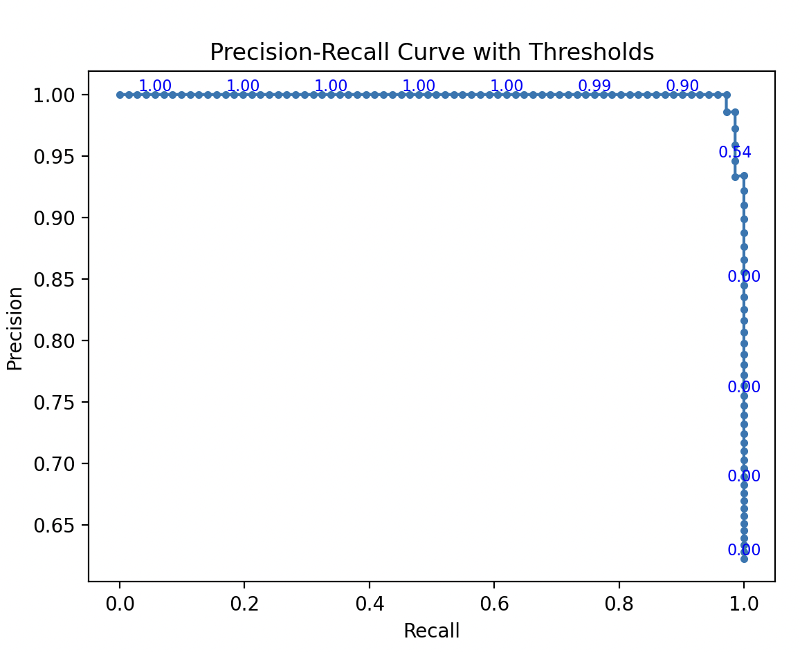

# 빈도주의 통계학에서 확률의 의미

확률을 다음과 같이 정의한다.

```
확률 = 상대적 빈도 (relative frequency) 의 극한 
    = 관심있는 사건 발생 횟수
      ------------------ 의 극한
      전체 시행 횟수
```

예를 들어 동전 던지기, 주사위 던지기, 카드 뽑기 등이 해당된다.

주사위를 던진다고 해보자. 

```
10 번 던져서 2 번 3 이 나왔다. 3 이 나올 확률은 2/10 = 0.2 이다.
100 번 던져서 18 번 3 이 나왔다. 3 이 나올 확률은 18/100 = 0.18 이다.
10000 번 던져서 1673 번 3 이 나왔다. 3 이 나올 확률은 1673/10000 = 0.1673 이다.

더 많이 실험하면 1/6 = 0.166 에 가까워진다.
```

다음과 같은 한계가 있다.

트럼프가 다음 대선에서 당선될 확률을 생각해 보자.

무한 반복할 수도 없다. 따라서 빈도를 계산할 수 없다. 빈도주의 방식으로
확률계산이 불가능하다.

새로운 확률정의가 필요하다. 그래서 Bayesian 확률이 발명되었다.

# 베이지안 통계학에서 확률의 의미

확률은 믿음의 정도이다. (degree of belief)

예를 들어, 내일 비가 올 확률은 30% 이다. 혹은 내일 A 를 받을 확률은 90% 이다. 

다양한 상황에서 확률을 부여하는 믿음의 수량화를 말한다. 불확실성 측정의
도구이다.

# Bayesian Theroem

```
P(H|D) = P(D|H) * P(H)
        --------------
            P(D)

H: Hypothesis, 병에 걸림.
D: Data, 키트에서 양성발견.

  P(H) 사전확률: 사전 지식
P(D|H) 가능도: 가설 (H) 가 데이터 (D) 를 지지할 가능성
P(H|D) 사후확률: 데이터로 업데이트된 확률
  P(D) 증거: 데이터의 확률 (상수)

가설 H1, H2, H3, H4 가 있다고 해보자.

P(H1|D) = P(D ∩ H1)
          ---------
            P(D)
P(D|H1) = P(D ∩ H1)
          ---------
            P(H1)

P(D|H1) * P(H1) =  P(D ∩ H1)

P(H1|D) = P(D|H1) * P(H1)
          --------------
              P(D)
```

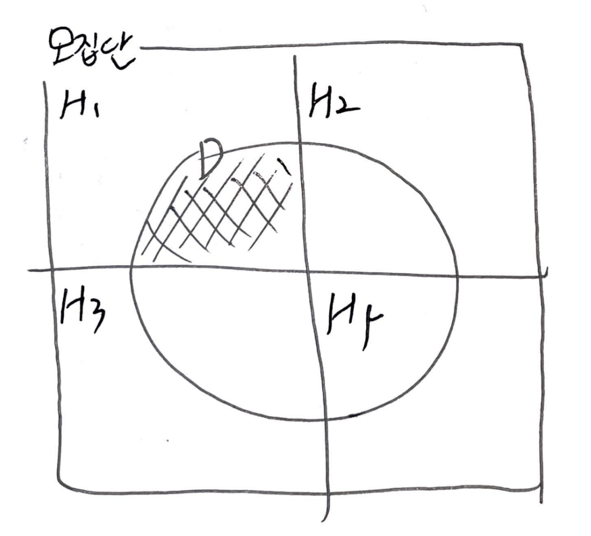

Data 가 H1 을 더 많이 지지한다. H1 이 일어날 확률이 더욱 높다.

* 데이터의 획득으로 사전 확률이 어떻게 사후 확률로 업데이트 되는지에 대한 정리
* 데이터는 가능도를 통해 사후 확률에 영향을 준다. 
* 확률을 업데이트해 나가며 실제 현상에 대한 추론 가능

어떤 불확실한 상황도 확률로 수량화가 가능하다. 우리가 베이지안 통계학을
배워야 하는 의미이다.

# Bayesian Theorem By Story

> * [베이즈 정리를 이해하는 가장 쉬운 방법 | youtube](https://www.youtube.com/watch?v=Y4ecU7NkiEI&t=39s)
> * [[스탠코리아 StanKorea] 베이즈 통계학 소개 Introduction to Bayesian Statistics | 베이즈 정리 & 베이즈 추론 | 베이지안이 되어야 할 이유 | youtube](https://www.youtube.com/watch?v=ELSxxe6gMaQ)

초콜릿을 받았을 때 호감이 있을 확률을 계산해 보자.

```
    P(A): 초콜릿을 줄 확률
    P(B): 호감이 있을 확률
  P(A|B): 호감이 있는 사람에게 초콜릿을 줄 확률
 P(~A|B): 호감이 있는 사람에게 초콜릿을 안줄 확률
 P(A|~B): 호감이 없는 사람에게 초콜릿을 줄 확률
P(~A|~B): 호감이 없는 사람에게 초콜릿을 안줄 확률

설문조사를 통해 다음을 발견
 P(A|B): 40%
자연스럽게
P(~A|B): 60%

설문조사를 통해 다음을 발견
 P(A|~B): 30%
자연스럽게
P(~A|~B): 70%

전체 사람들중에 호감이 있는 사람과 없는 사람의 비율이 각각 50% 라고 가정하자.
이 처럼 아무런 정보가 없는 상황에서 호감있는 사람과 없는 사람의 비율을
50% 로 가정하는 것을 이유 불충분의 원리 
(The Principle of Insufficient reason) 라고 한다. 
라플라스가 주장했다.

원하는 것은 `초콜릿을 받았을 때 호감이 있다의 확률`이다.
즉, P(B|A) 이다.
우리가 아는 것은 `호감이 잇을 때 초콜릿을 줄 확률`, 
`호감이 없을 때 초콜릿을 줄 확률`이다.
즉, P(A|B), P(A|~B) 이다.

사람이 100 명있다고 해보자.

  P(A|B): 40%
 P(~A|B): 60%
 P(A|~B): 30%
P(~A|~B): 70%

cl cl cl cl cl cx cx cx cx cx
cl cl cl cl cl cx cx cx cx cx
cl cl cl cl cl cx cx cx cx cx 
cl cl cl cl cl xx xx xx xx xx
xl xl xl xl xl xx xx xx xx xx
xl xl xl xl xl xx xx xx xx xx 
xl xl xl xl xl xx xx xx xx xx
xl xl xl xl xl xx xx xx xx xx
xl xl xl xl xl xx xx xx xx xx
xl xl xl xl xl xx xx xx xx xx

cl: chocolate, love
cx: chocolate, no love
xl: no chocolate, love
xx: no chocolate, no love

초콜릿을 받지 못하는 상황은 우리의 관심사가 아니다. 
일어나지 않는 상황은 제거하자.

cl cl cl cl cl cx cx cx cx cx
cl cl cl cl cl cx cx cx cx cx
cl cl cl cl cl cx cx cx cx cx 
cl cl cl cl cl 

다음과 같이 원하는 것을 구한다.

P(B|A) = 20 / (20 + 15) = 57%
```

상대방이 나에게 관심이 있을 확률을 50% 에서 57% 로 업데이트 했다.

아무런 정보 없이 50% 라고 가정했던 값을 사전확률 (PRIOR) 이라고 한다. 상대가
나에게 호감을 갖을 확률이다. `P(B)`

초콜릿을 주었다는 새로운 정보덕분에 50% 에서 57% 라고 업데이트한 값을 사후확률
(POSTERIOR) 라고 한다. 상대가 나에게 호감을 갖을 확률이다. `P(B|A)`

Bayes theorem 이란 사전 확률을 바탕으로 사후 확률을 얻는 것이다.

```
P(B|A) = P(A|B) * P(B) / P(A)
       = P(A|B) * P(B) / (P(A|B) * P(B) + P(A|~B) * P(~B))
```

Bayes theorem 은 복잡한 수학식 보다 다음과 같이 사각형으로 이해하는 것이 훨씬
효율적이다.

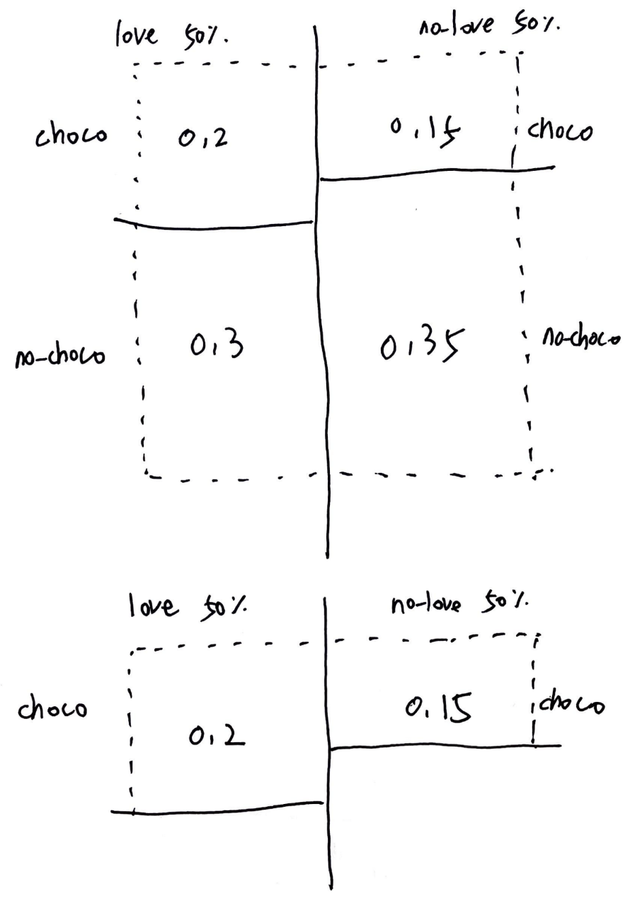

우리는 어떤 사람이 나를 좋아할 확률을 50% 로 가정했다. 즉, `P(B)` 를 `50%` 로
가정했다. 초기의 믿음이다. 상당히 주관적이다. 주관적이란 이유로 수학자로 부터
많은 공격을 당했다. 

그러나 우리는 새로운 정보와 관찰을 근거로 객관적인 확률로 점차 나아간다. **Bayes theorem** 은 data 가 많을 수록 옳바른 의사결정을 내릴 확률이 높아진다. 

초콜릿을 받은 사건 뿐 아니라 단 둘이 식사를 한 사건, 단 둘이 데이트를 한
사건등등을 바탕으로 사전확률을 지속적으로 업데이트 하는 것이다. 이 것이 
**Bayes theorem** 의 중요한 통찰이다.

현대에서 **Bayes theorem** 은 인공지능의 의사결정에 매우 강력한 도구로 활용되고
있다.

# Entropy

확률에서 엔트로피는 확률분포의 정보량 또는 확신도를 나타내는 값으로, 특정 값에
확률이 몰려 있다면 엔트로피가 작다고 볼 수 있고, 여러 가지 값에 확률이 골고루
퍼져 있다면 엔트로피가 크다고 할 수 있습니다. 엔트로피가 작은 경우 불확실성이
낮아 예측하기 쉬워지며, 엔트로피가 큰 경우 불확실성이 높아 예측하기
어려워집니다.

# KL-divergence

# Eigen Value, Eigen Vector
