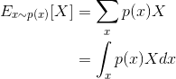
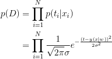
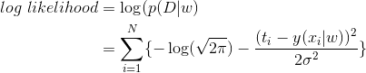
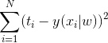
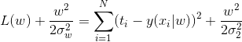

- [References](#references)
- [Chain Rule](#chain-rule)
- [독립 변수 (Independent variable), 종속 변수 (Dependent variable)](#독립-변수-independent-variable-종속-변수-dependent-variable)
- [확률 변수 (Random Variable)](#확률-변수-random-variable)
- [확률 분포 (probability distribution)](#확률-분포-probability-distribution)
- [모수 (Parameter)](#모수-parameter)
- [모수를 추정하는 추정법 (Parameter Estimation)](#모수를-추정하는-추정법-parameter-estimation)
- [모델 (Model)](#모델-model)
- [모델의 종류](#모델의-종류)
- [수식 모델 vs 비수식 모델](#수식-모델-vs-비수식-모델)
- [수식으로 표현할 수 있는 모델](#수식으로-표현할-수-있는-모델)
- [수식으로 표현할 수 없는 모델](#수식으로-표현할-수-없는-모델)
- [인공 신경망의 산출물](#인공-신경망의-산출물)
- [P(X; θ) Graph](#px-θ-graph)
- [P(Y | X; θ) Graph](#py--x-θ-graph)
- [Simple Data, Multiple Implementations](#simple-data-multiple-implementations)
  - [Linear Regression, 최소제곱추정법(Least Squares Estimation, LSE)](#linear-regression-최소제곱추정법least-squares-estimation-lse)
  - [Linear Regression, 최대우도추정법(MLE)](#linear-regression-최대우도추정법mle)
  - [Linear Regression, 베이지안 추정법(Bayesian Estimation)](#linear-regression-베이지안-추정법bayesian-estimation)
  - [인공지능 신경망 (Artifical Neural Networks)](#인공지능-신경망-artifical-neural-networks)
  - [랜덤 포레스트 (Random Forest)](#랜덤-포레스트-random-forest)
- [p(X; μ, σ^2) 최대우도법 (Maximum Likelihood Estimation, MLE)](#px-μ-σ2-최대우도법-maximum-likelihood-estimation-mle)
- [p(Y | X; μ, σ^2) 최대우도법 (Maximum Likelihood Estimation, MLE)](#py--x-μ-σ2-최대우도법-maximum-likelihood-estimation-mle)
- [Supervised Learning](#supervised-learning)
- [인공신경망 모델 vs 딥러닝 모델](#인공신경망-모델-vs-딥러닝-모델)
- [인공신경망 모델의 종류](#인공신경망-모델의-종류)
- [PyTorch Simple Linear Regression](#pytorch-simple-linear-regression)
- [PyTorch Simple Linear Regression with Validation Data](#pytorch-simple-linear-regression-with-validation-data)
- [PyTorch Simple Linear Regression with Test Data](#pytorch-simple-linear-regression-with-test-data)
- [Bayesian Statistics MLE (Maximum Likelihood Estimation)](#bayesian-statistics-mle-maximum-likelihood-estimation)
- [Precision/Recall/Threshold Visualization](#precisionrecallthreshold-visualization)
- [빈도주의 통계학에서 확률의 의미](#빈도주의-통계학에서-확률의-의미)
- [베이지안 통계학에서 확률의 의미](#베이지안-통계학에서-확률의-의미)
- [Bayesian Theroem](#bayesian-theroem)
- [Bayesian Theorem By Story](#bayesian-theorem-by-story)
- [Entropy](#entropy)
- [KL-divergence](#kl-divergence)
- [Determinant](#determinant)
- [Eigen Value, Eigen Vector](#eigen-value-eigen-vector)
- [MLE vs MAP](#mle-vs-map)
- [Bayesian Neural Networks (BNN) vs Deep Neural Networks (DNN)](#bayesian-neural-networks-bnn-vs-deep-neural-networks-dnn)
- [Predictions](#predictions)
  - [Generalized Linear Models (GLMs)](#generalized-linear-models-glms)
  - [Deep Neural Networks (DNNs)](#deep-neural-networks-dnns)
  - [Bayesian Neural Networks (BNNs)](#bayesian-neural-networks-bnns)
  - [Gaussian Processes (GPs)](#gaussian-processes-gps)
- [Overfitting](#overfitting)
- [Regularization](#regularization)
- [Drop Out](#drop-out)
- [Auto Encoder](#auto-encoder)
- [Transformer](#transformer)
- [MobileNetV3](#mobilenetv3)
- [Principal components analysis (PCA)](#principal-components-analysis-pca)
- [SVD (Singular Value Decomposition)](#svd-singular-value-decomposition)
- [Confusion Matrix](#confusion-matrix)
- [Precision, Recall, Accuracy, F1](#precision-recall-accuracy-f1)
- [AUROC, AUCROC](#auroc-aucroc)
- [Expectation Function](#expectation-function)
- [Entropy](#entropy-1)
- [Cross Entropy](#cross-entropy)
- [KLD (Kullback–Leibler divergence)](#kld-kullbackleibler-divergence)
- [JSD (Jensson Shannon Divergence)](#jsd-jensson-shannon-divergence)
- [MLE (Maximum Likelihood Estimation)](#mle-maximum-likelihood-estimation)
- [MAP (Maximum A Posterior)](#map-maximum-a-posterior)
- [K-Nearest Neighbors (KNN)](#k-nearest-neighbors-knn)
- [Collatorative Filtering](#collatorative-filtering)
- [Generative Classifiers](#generative-classifiers)
- [Marginal Probability](#marginal-probability)
- [Central Limit Theorem (CLT)](#central-limit-theorem-clt)
- [Monte Carlo approximation](#monte-carlo-approximation)
- [Markov Chain](#markov-chain)
- [Monte Carlo Markov Chain (MCMC)](#monte-carlo-markov-chain-mcmc)
- [Mutual Information](#mutual-information)
- [Gaussian Discriminant Analysis (GDA)](#gaussian-discriminant-analysis-gda)

-----

# References

> - [Hacker's guide to Neural Networks](https://karpathy.github.io/neuralnets/)
>   - Neural Networks Deep Dive
> - [모두를 위한 머신러닝/딥러닝 강의](http://hunkim.github.io/ml/)
> - [Practical Deep Learning for Coders](https://course.fast.ai/)
> - [데이터 사이언스 스쿨](https://datascienceschool.net/intro.html)
> - [공돌이의 수학정리노트 (Angelo's Math Notes)](https://angeloyeo.github.io/)

----

> - [통계 기초 개념과 공식을 3시간만에 끝내드립니다ㅣ 고려대 통계학과 x AI연구원 강의 ㅣ표본, 기대값, 정규분포, 카이제곱, 모평균, t분포, 포아송분포, 조건부 확률 등](https://www.youtube.com/watch?v=YaCQrJCgbqg)
> - [데이터 사이언스 스쿨](https://datascienceschool.net/intro.html)
>   - [src](https://www.hanbit.co.kr/media/books/book_view.html?p_code=B3111220544)
> - ["Probabilistic machine learning": a book series by Kevin Murphy](https://github.com/probml/pml-book)
>   - ["Machine Learning: A Probabilistic Perspective" (2012)](https://probml.github.io/pml-book/book0.html)
>       - [python solution](https://github.com/probml/pyprobml/)
>   - ["Probabilistic Machine Learning: An Introduction" (2022)](https://probml.github.io/pml-book/book1.html)
>   - ["Probabilistic Machine Learning: Advanced Topics" (2023)](https://probml.github.io/pml-book/book2.html)
> - [CS231n: Convolutional Neural Networks for Visual Recognition](http://cs231n.stanford.edu/syllabus.html)
>   - 화상인식을 위한 CNN
> - [CS224d: Deep Learning for Natural Language Processing](http://web.stanford.edu/class/cs224n/)
>   - 자연어처리를 위한 Deep Learning

# Chain Rule

**체인룰(Chain Rule)**은 미적분학에서 합성 함수를 미분할 때 사용되는 규칙입니다.
간단히 말해, 두 개 이상의 함수가 합성된 경우에 그 함수의 미분 결과를 계산하기
위해 사용됩니다.

합성 함수란 한 변수의 값을 다양한 함수를 통해 변환하는 과정으로 생성되는 최종
출력값에 대한 함수를 의미합니다. 예를 들어, 두 개의 함수 `f(x)`와 `g(x)`가 있고, 두
함수의 합성 `h(x) = f(g(x))`가 있다면, h(x)는 합성 함수입니다.

체인 룰의 공식은 다음과 같습니다:

```
(dy/dx) = (dy/du) * (du/dx)
```

여기서 `y = f(u)`이고 `u = g(x)`입니다. 이는 `y`가 `u`에 의존하고, `u`가 `x`에
의존하므로, `x`에 대한 `y`의 변화율`(dy/dx)`을 계산하기 위해 우선 중간변수인
`u`에 대한 `y`의 변화율`(dy/du)`과 `x`에 대한 `u`의 변화율`(du/dx)`을 각각
구하고 곱해주는 것입니다.

예를 들어, 함수 `y = f(u) = u²` 와 `u = g(x) = 2x + 3`이 있다고 가정합시다. 
`h(x) = f(g(x)) = (2x + 3)²` 를 구하려면 체인 룰을 적용해야 합니다.

```
dy/du = 2u
du/dx = 2
Chain rule 적용: (dy/dx) = (dy/du) * (du/dx) = 2u * 2 = 4u = 4(2x+3)
```

따라서 최종 결과는 `h'(x) = 4(2x+3)`가 됩니다. 
이처럼 체인룰은 한 번에 여러 함수를 미분할 때 유용한 도구입니다.

# 독립 변수 (Independent variable), 종속 변수 (Dependent variable)

**독립 변수**와 **종속 변수**는 주로 통계학과 머신러닝에서 사용되는 용어로서
변수 간의 관계와 영향을 설명하는 데 사용됩니다.

**독립 변수(Independent variable)**: 독립 변수는 종속 변수에 영향을 주는
변수로서, 입력으로 주어지는 값입니다. 독립 변수는 다른 변수에 영향을 받지
않거나, 영향을 받는 정도가 상대적으로 낮습니다. 때로는 '특성', '예측 변수',
'회귀 계수' 또는 영어로 'feature', 'predictor', 'explanatory variable' 등과 같은
용어로 불립니다. 예를 들어, 집의 면적과 위치가 집 가격에 영향을 주는 경우 집의
면적과 위치는 독립 변수입니다.

**종속 변수(Dependent variable)**: 종속 변수는 독립 변수에 의해 영향을 받는
변수로서, 결과로 예측하거나 설명하려는 값입니다. 종속 변수는 독립 변수와의
관계를 통해 분석됩니다. 때로는 '반응 변수', '목표 변수', '또는 '결과 변수',
영어로는 'response variable', 'target variable', 'label', 'outcome variable'
등과 같은 용어로 불립니다. 예를 들어, 집의 면적과 위치에 따라 집 가격이 달라지는
경우 집 가격은 종속 변수입니다.

머신러닝 모델 구축 시 독립 변수를 사용하여 종속 변수를 예측하거나 분류하는 것이
목표입니다. 이때 학습 데이터에는 독립 변수와 종속 변수가 레이블로 함께 포함되어
있어야 합니다.

# 확률 변수 (Random Variable)

확률 과정에서 발생하는 불확실한 이벤트를 수치화하는 변수입니다. 일반적인 변수와
다르게 랜덤 변수는 결과 값이 확률론적(무작위적)으로 결정됩니다. 랜덤 변수는 주로
확률론과 통계학에서 사용되며, 확률 분포를 통해 이 변수의 확률적 성질을 설명할 수
있습니다.

랜덤 변수는 일반적으로 대문자 알파벳(예: X, Y, Z)으로 표기하며, 가능한 결과
값(실현 값)은 소문자 알파벳(예: x, y, z)으로 표기합니다.

**독립 변수**와 **종속 변수**는 머신러닝 및 회귀 분석과 같은 문맥에서 변수의
관계와 영향을 나타내는 데 사용되는 용어입니다. 반면 **랜덤 변수**는 확률과
통계학에서 불확실한 이벤트를 수치화하고 설명하는 데 사용되는 개념입니다.

**독립 변수**와 **종속 변수**도 어떤 상황에서는 랜덤 변수가 될 수 있습니다. 예를
들어, 어떤 표본 데이터를 수집할 때 데이터 포인트의 선택이 무작위라면, 이 표본
데이터의 독립 변수와 종속 변수는 랜덤 변수로 취급될 수 있습니다.

즉, 랜덤 변수, 독립 변수, 종속 변수는 상황과 문맥에 따라 서로 관련이 있을 수도
있고, 아닐 수도 있습니다. 중요한 것은, 이 용어들이 사용되는 목적과 범위를
이해하는 것입니다.

불확실한 사건(experiment)의 결과에 대응하는 숫자 값으로 정의되는 변수입니다.
사건의 결과가 확률적으로 발생하기 때문에 확률 변수 값도 확률적으로 결정됩니다.
확률 변수는 주로 대문자 알파벳(X, Y, Z 등)으로 표현되고, 그 값은 소문자
알파벳(x, y, z 등)으로 나타냅니다.

확률 변수는 다음 두 가지 유형으로 분류됩니다:

**이산 확률 변수(Discrete random variable)**: 이산 확률 변수는 셀 수 있는(유한
또는 무한) 개의 가능한 값들 중 하나를 가질 수 있습니다. 일반적으로 정수 값을
가지며, 이산 확률 변수의 가능한 값들 각각에 확률을 직접 할당할 수 있습니다. 예를
들어 주사위 던지기, 동전 던지기, 프로세스에서 발생하는 에러 개수 등이 이산 확률
변수의 예입니다.

**연속 확률 변수(Continuous random variable)**: 연속 확률 변수는 값이 하나의
구간 내의 모든 실수 값을 가질 수 있습니다. 연속 확률 변수의 경우, 특정 값의
확률을 정의하기보다는 값의 범위에 확률을 할당하는 것이 더 일반적입니다. 예를
들어 온도, 길이, 시간, 중량 등이 연속 확률 변수의 예입니다.

확률 변수는 실험의 결과를 수치로 표현해 줌으로써 통계적 모델링, 확률 분포의
사용, 데이터 분석 등에 사용됩니다.

# 확률 분포 (probability distribution)

확률 변수(random variable)의 가능한 값들과 그 값들이 나타날 가능성을 설명하는
수학적 표현입니다. 확률 분포는 각 사건이 발생할 확률을 알려주는 것으로, 이를
통해 데이터, 실험, 프로세스 등에서 불확실성을 처리할 수 있습니다. 확률 변수의
성격에 따라 확률 분포는 **이산 확률 분포(discrete probability distribution)**와
연속 **확률 분포(continuous probability distribution)**로 구분할 수 있습니다.

**이산 확률 분포(Discrete probability distribution)**: 이산 확률 변수가 가질 수
있는 가능한 값들의 확률을 나타내는 분포입니다. 
**확률질량함수(probability mass function, PMF)**로 나타낼 수 있으며, 
이 함수는 각 값을 확률로 매핑합니다. 이산
확률 분포의 예로는 **베르누이 분포**, **이항 분포**, **포아송 분포** 등이 있습니다.

**연속 확률 분포(Continuous probability distribution)**: 연속 확률 변수가 가질
수 있는 가능한 값들의 확률을 나타내는 분포입니다. 
**확률밀도함수(probability density function, PDF)**로 나타낼 수 있으며, 이 함수는 확률 변수의 값에 대한
확률 밀도를 매핑합니다. 연속 확률 분포에서 특정 값의 확률은 PDF의 해당 영역
아래의 면적을 통해 얻을 수 있습니다. 연속 확률 분포의 예로는 
**정규 분포**, **균일분포**, **지수 분포**, **베타 분포** 등이 있습니다.

# 모수 (Parameter)

통계에서 **모수(parameter)**란 **모집단(population)**의 특성을 나타내는
수치입니다. 이러한 모수는 모집단의 **평균**, **분산**, **상관계수** 등과 같이
분포의 성질과 특징을 요약하여 표현한 값입니다.

모수는 주어진 모집단의 확률분포를 규정하기 위해 사용되며, 모집단의 크기에 무관한
고정된 값입니다. 통계에서 주요 목적 중 하나는 이 모수를 **추정(Estimation)**하고
**기술통계(Descriptive statistics)**와 **추론통계(Inferential statistics)**를 이용하여
분석하는 것입니다. 이를 통해 모집단의 전반적인 성질을 이해하고 예측 및
의사결정에 도움이 되는 정보를 얻을 수 있습니다.

모수는 표본(sample) 추출을 통해 추정할 수 있습니다. 모집단으로부터 추출된 표본
데이터를 사용하여 모수에 대한 추정치를 계산하고, 이를 다양한 통계적 방법으로
검증하고 분석하는 과정을 거칩니다.

**인공신경망(artificial neural networks, ANN)**은 일반적으로 **모수(parametric)** 모델로
분류됩니다. 인공 신경망은 구조적인 설정을 가지며, 다양한 활성화 함수와 학습
파라미터들을 사용해 학습과 예측을 수행합니다. 이렇게 학습된 파라미터들은
데이터와 레이블 간의 관계를 나타내며, 모델에 의해 학습된 가중치와 편향 값들이
모델의 파라미터로 생각됩니다.

그러나 인공신경망은 그 자체로 복잡하고 유연한 모델입니다. 따라서 모수적 방법과
비모수적 방법 사이에서 완전한 경계가 아니라 더 연속적인 스펙트럼이 있다고 볼 수
있습니다. 인공 신경망은 그래프 구조를 통해 비선형 관계를 포착할 수 있으므로
비모수적 모델처럼 간주될 수 있지만, 실제로는 가중치와 편향 값들이 파라미터로
학습되기 때문에 모수 모델로 분류됩니다.

결론적으로, 인공신경망은 모수 모델로 분류되지만, 복잡한 구조와 함수 덕분에 비모수적 모델과 유사한 유연성을 가지게 됩니다.

# 모수를 추정하는 추정법 (Parameter Estimation)

모수를 추정하는 추정법은 여러 가지가 있습니다. 대표적인 추정법으로는:

**모멘트추정법 (Method of Moments)**: 관측 데이터의 적률과 이론적인 모델의 적률을 같게 만드는 방식으로 모수를 추정합니다.

**최대우도추정법 (Maximum Likelihood Estimation, MLE)**: 관측된 데이터가 가장 그럴 듯한 모수를 찾아내는 방법으로, 전반적인 데이터의 우도를 최대화하는 값으로 모수를 추정합니다.

**베이즈추정법 (Bayesian Estimation)**: 사전 확률분포를 고려하며, 불확실성을 나타내는 사후 확률분포를 통해 모수를 추정합니다. 베이즈추정법은 사전정보와 관측 데이터를 이용하여 추정을 진행합니다.

**최소제곱추정법 (Least Squares Estimation, LSE)**: 관측값과 예측값의 차이(잔차)의 제곱합을 최소화하는 방식으로 모수를 추정합니다. LSE는 선형회귀와 같은 모델에서 널리 사용됩니다.

**최소마디오추정법 (Minimum Absolute Deviations, MAD)**: 관측값과 예측값의 차이(잔차)의 절대값의 합을 최소화하는 방식으로 모수를 추정합니다. MAD는 이상치에 대해 더 강인한 추정법으로 알려져 있습니다.

**최소자승 추정(LASSO, Ridge Regression 등)**: 정규화(regularization) 항을 추가하여 파라미터의 크기를 축소하는 방식으로 모수를 추정합니다. 이 방법은 과적합(overfitting)을 방지하는 데 도움이 됩니다.

# 모델 (Model)

통계학에서 **모델(model)**은 현상이나 데이터를 설명하거나 예측하기 위해 수학적이나 개념적 도구로 표현된 간략화된 표현입니다. 현실 세계의 현상을 단순화하고 일반화하여 이해할 수 있게 만들어 주며, 변수 간의 관계, 패턴, 구조를 파악하거나 미래의 데이터를 예측하는 데 사용됩니다. 모델에는 **선형 회귀**, **로지스틱 회귀**, **확률 모델** 등 다양한 종류가 있습니다.

# 모델의 종류

**선형 회귀 모델(Linear Regression)**: 관찰된 데이터 사이의 선형 관계를
설명하며, **예측 변수**와 **종속 변수** 사이의 관계를 선형 방정식으로 나타냅니다.

**로지스틱 회귀 모델(Logistic Regression)**: 범주형 종속 변수와 연속형 독립 변수
사이의 관계를 이진 로지스틱 함수로 설명합니다. 분류 작업에 사용됩니다.

**일반화 선형 모델(Generalized Linear Models, GLM)**: 선형 및 비선형 관계를
설명할 수 있는 확장된 선형 회귀 모델입니다. 종속 변수의 분포가 정규 분포를
따르지 않을 경우에도 적용 가능합니다.

**시계열 모델(Time Series Models)**: 시간 종속적인 데이터를 분석하고 예측하는 데 사용되는 모델로, ARIMA (AutoRegressive Integrated Moving Average), Exponential Smoothing 등이 있습니다.

**Decision Trees**: 복잡한 데이터 세트에서 결정 경계를 학습하는데 사용되는 트리 기반 모델입니다. 분류 및 회귀 문제에 사용됩니다. [Decision Tree](/decisiontree/README-kr.md)

**나이브 베이즈(Naive Bayes)**: 베이즈 정리를 기반으로 하며, 각 특성이 독립적임을 가정하는 확률 모델입니다. 분류 작업에 사용됩니다.

**서포트 벡터 머신(Support Vector Machines, SVM)**: 최적의 결정 경계를 찾기 위해 마진을 최대화하는 알고리즘을 사용하는 모델로, 분류 및 회귀 문제에 사용됩니다. [Support Vector Machines, SVM](/svm/README-kr.md)

**신경망(Neural Networks)**: 인간의 뇌 구조를 모방한 인공 뉴런을 기반으로 한
복잡한 모델입니다. 분류, 회귀, 이미지 인식, 자연어 처리 등 다양한 분야에
적용됩니다.

**클러스터링 모델(Clustering Models)**: 비지도 학습 기법으로, 데이터 세트에서 구조,
관계, 패턴을 발견하기 위해 사용되는 모델입니다. [K-Means](/k-means/README-kr.md), DBSCAN, Hierarchical Clustering 등이 있습니다.

**앙상블 모델(Ensemble Models)**: 여러 개의 기본 모델을 조합하여 성능을 향상시키는 모델입니다. **배깅(Bagging)**, **부스팅(Boosting)**, **[랜덤 포레스트(Random Forest)](/decisiontree/README-kr.md#advanced-random-forest)**, **그래디언트 부스팅(Gradient Boosting)** 등이 있습니다.

# 수식 모델 vs 비수식 모델

일반적으로 수식으로 표현할 수 있는 모델링과 수식으로 표현할 수 없는 모델링을
구분하기 위한 명확한 표준 용어는 없습니다. 하지만, 두 유형의 모델링을 구분하기
위해 '**선형**'과 '**비선형**', 또는 '**매개변수 모델(parametric model)**'과
'**비매개변수 모델(non-parametric model)**'을 사용하여 설명할 수 있습니다.

- **선형(linear) 모델링**: 이 방법들은 데이터 간의 선형 관계를 가정합니다.
  하나의 함수 를 사용하여 입력 변수와 예측값 사이의 관계를 설명합니다. 대표적인
  선형 모델링 방법에는 **선형 회귀**, **로지스틱 회귀** 등이 있습니다. 이러한 선형
  모델은 대부분 수식으로 표현할 수 있습니다.
- **비선형(non-linear) 모델링**: 데이터 간의 관계가 선형이 아닌 복잡한 형태일 때
  사용되는 방법입니다. 비선형 모델링 방법에는 **인공신경망**, **랜덤포레스트**,
  **k-최근접 이웃** 등이 있습니다. 이러한 모델은 일반적으로 수식으로 표현하기
  어렵습니다.

또한, 모델의 구조를 설명하는 데 다음 두 용어를 사용할 수 있습니다.

- **매개변수 모델(parametric model)**: 매개변수를 사용하여 추정하고 표현하는
  모델링 방법입니다. 예를 들어, **선형 회귀 분석**은 예측 변수의 계수 및 절편과
  같은 매개 변수를 사용하여 모델을 표현합니다. 매개변수 모델은 종종 수식으로
  표현할 수 있습니다.

- **비매개변수 모델(non-parametric model)**: 모델이 고정된 수의 매개 변수가
  없고, 데이터에 의존하여 복잡한 구조를 가지는 경우입니다. 
  **[k-최근접이웃(KNN)](/knn/README-kr.md)**이 대표적인 예입니다. 비매개변수 모델은 전반적으로 수식으로
  표현하기 어렵습니다.

그러나 이러한 구분은 완벽하게 수식 표현 여부와 일치하지는 않습니다. 경우에 따라
선형 모델의 수식이 복잡할 수도 있고, 비선형 모델 중에서도 일부 수식으로 표현할
수 있는 경우도 있습니다. 따라서 이 구분은 그 둘을 완벽하게 구분짓는 기준은
아니지만, 어느 정도 설명할 수 있는 틀을 제공할 수 있습니다.

# 수식으로 표현할 수 있는 모델

수식으로 표현할 수 있는 모델링 방법은 여러 가지가 있습니다. 여기 주요한 몇
가지를 나열하였습니다.

**선형 회귀(Linear Regression)**: 입력 데이터 간의 선형 관계를 예측하는 모델입니다.
일반적으로 y = wx + b와 같이 수식으로 표현할 수 있습니다.

**로지스틱 회귀(Logistic Regression)**: 이진 분류 문제에 사용되는 모델로, 확률을
계산하기 위해 로지스틱(시그모이드) 함수를 사용하여 수식을 표현합니다.

**다항식 회귀(Polynomial Regression)**: 선형 회귀보다 복잡한 관계를 모델링하는
방법으로, 계수와 차수를 포함하는 다항식 수식을 사용합니다.

**라쏘 회귀(Lasso Regression)**와 릿지 **회귀(Ridge Regression)**: 선형 회귀와
유사하지만, L1 혹은 L2 규제 항을 추가하여 수식을 표현합니다.

**서포트 벡터 머신(Support Vector Machine, SVM)**: 마진을 최대화하는 초평면 혹은
구분 경계를 찾는 SVM 알고리즘 역시 선형 혹은 커널 함수를 사용한 비선형 형태로
수식을 표현할 수 있습니다.

**가우시안 나이브 베이즈(Gaussian Naive Bayes)**: 독립 변수들간의 조건부 확률을 가우시안 분포로 가정하여 분류 문제를 해결하는 모델로, 확률 이론과 베이즈 정리를 사용한 수식으로 표현됩니다. [Naive Bayes Classification](/naivebayesclassification/README-kr.md)

**선형 판별 분석(Linear Discriminant Analysis, LDA)**: 클래스 간의 분별력을
최대화하도록 데이터를 낮은 차원 공간으로 사영(project)하는 선형 변환으로 최적화
문제를 해결하는데, 수식으로 표현할 수 있습니다.

회귀 및 분류 문제를 위한 기타 손실 함수: 손실 함수(loss function)는 모델의
출력과 실제 값을 비교하여 얼마나 성능이 좋은지 측정하는 데 사용되는 지표입니다.
대표적인 손실 함수로는 평균 제곱 오차(Mean Squared Error, MSE), 교차
엔트로피(Cross-Entropy) 등이 있으며, 수식으로 표현할 수 있습니다.

# 수식으로 표현할 수 없는 모델

수식으로 직접적으로 표현하기 어려운 모델의 대표적인 예를 몇 가지 제시하겠습니다.

**인공 신경망 (Artificial Neural Networks)**: 입력, 은닉 및 출력층으로 구성된 신경망
구조와 가중치를 사용하여 데이터 분석을 수행하는 딥러닝 모델입니다.

**랜덤 포레스트 (Random Forest)**: 여러 개의 의사결정나무를 결합하여 처리하는 앙상블
기반 모델로, 각 나무마다 복잡한 구조와 분기 노드에서의 결정 기준이 다릅니다.

**k-최근접 이웃 (k-Nearest Neighbors, KNN)**: 입력 데이터와 가장 가까운 k 개의 이웃
데이터를 기준으로 새로운 데이터를 분류하거나 값을 예측하는 방법으로, 거리 기반
방식을 사용합니다.

**서포트 벡터 머신 (Support Vector Machine, SVM)을 비선형 커널 함수로 확장한 경우**:
비선형 커널 함수를 활용하는 경우, 기존의 선형 SVM보다 더 복잡한 구조를 가지며
수식 표현이 어려울 수 있습니다.

**워드 임베딩 (Word Embeddings)**: 자연어 처리에서 단어나 문장을 고정된 크기의
벡터로 변환하는 기법이며, 대표적인 방법으로는 Word2Vec, GloVe, FastText 등이
있습니다.

이러한 복잡한 모델들은 전형적으로 일반적인 형태의 수식으로 명확하게 표현할 수
없습니다. 대신 이들 모델은 구조, 매개 변수, 가중치 등 다른 구성 요소를 사용하여
처리됩니다. 이런 모델들은 그 구조와 학습 방식 때문에, 종종 일반적인 수식으로
표현되는 모델보다 데이터의 복잡한 구조와 패턴을 잘 포착하는 데 능숙합니다.

# 인공 신경망의 산출물

인공 신경망을 사용한 모델링의 산출물은 전통적인 수식과 달리, 신경망의 구조와
가중치(매개 변수)로 표현됩니다. 인공 신경망은 입력층, 은닉층, 출력층으로
구성되며, 각 층의 노드(뉴런)들 사이의 가중치들이 다양한 패턴을 학습하는 데
사용됩니다.

학습이 완료된 신경망 모델은 수식으로 표현되기 어렵습니다. 이는 신경망의 각
노드에서 활성화 함수(ReLU, Sigmoid, Tanh 등)를 통과하며 데이터가 변환되고,
복잡한 상호작용이 일어나기 때문입니다. 따라서, 신경망 모델의 산출물은 모델의
**구조**와 **가중치**들로 표현되지만 일반적인 수식으로는 나타내기 어렵습니다.

신경망 모델의 가중치는 학습을 통해 설정되며, 저장하거나 다른 환경에서 재사용할
수 있습니다. 이러한 산출물이 원하는 결과를 얻기 위한 예측이나 분류 작업에 직접
사용됩니다.

# P(X; θ) Graph

X 는 주사위 눈이다. `P(X; θ)` 를 시각화 해보자. `θ`는 주사위의 각 숫자 나올 확률을
나타내는 `모수(parameter)`입니다. 이 경우, `θ`는 모든 숫자에 대해 `1/6`으로
동일합니다. 즉, 이 시각화에서 모델의 파라미터 값인 `θ`는 모든 주사위 숫자의 등장
확률이 동일하다는 것을 의미합니다.

```py
import matplotlib.pyplot as plt

# Dice numbers
dice_numbers = [1, 2, 3, 4, 5, 6]

# Probability for each number
probabilities = [1/6, 1/6, 1/6, 1/6, 1/6, 1/6]

plt.bar(dice_numbers, probabilities)
plt.xlabel('Dice Number (X)')
plt.ylabel('Probability P(X; θ)')
plt.title('Graph of P(X; θ) for Dice Numbers')
plt.xticks(dice_numbers)
plt.show()
```


# P(Y | X; θ) Graph

X 는 키, Y 는 몸무게이다. `P(Y | X; θ)` 를 시각화 해보자. `θ`는 이 경우 선형
회귀 모델의 파라미터를 의미합니다. 선형 회귀 모델은 `Y = aX + b + ε` 형태로
주어지고, `θ`는 계수 `a`와 `b`를 포함합니다. 여기서 `ε`는 오차 또는 노이즈를 나타냅니다.
이 코드에서는 `sklearn.linear_model.LinearRegression`을 사용하여 파라미터를
학습하고 회귀 모델을 통해 주어진 `X` 값에 대한 `Y` 값의 확률 분포 `P(Y|X; θ)`를
시각화합니다.

```py
import numpy as np
import matplotlib.pyplot as plt
from mpl_toolkits.mplot3d import Axes3D
from sklearn.linear_model import LinearRegression
from scipy.stats import norm

# 가상 데이터 생성
np.random.seed(0)
num_samples = 100
X = np.random.uniform(0, 10, num_samples)
noise = np.random.normal(0, 1, num_samples)
Y = 2 * X + 3 + noise

# 회귀 모델 학습
X = X.reshape(-1, 1)
regression_model = LinearRegression()
regression_model.fit(X, Y)

# 가우시안 확률 분포를 사용해 P(Y|X; θ) 계산
std_dev = np.std(Y - regression_model.predict(X))
X_range = np.linspace(0, 10, 100)
Y_range = np.linspace(np.min(Y), np.max(Y), 100)
Z = np.array([norm.pdf(Y_range, loc=regression_model.predict(np.array([[x]])), scale=std_dev) for x in X_range])

# 3차원 확률 분포 시각화
fig = plt.figure(figsize=(10, 8))
ax = fig.add_subplot(111, projection='3d')

X_grid, Y_grid = np.meshgrid(X_range, Y_range)
ax.plot_surface(X_grid, Y_grid, Z.T, cmap='viridis', alpha=.8)

ax.set_xlabel('X')
ax.set_ylabel('Y')
ax.set_zlabel('P(Y|X; θ)')
plt.title('3D Visualization of P(Y|X; θ) with Linear Regression Model')
plt.show()
```


# Simple Data, Multiple Implementations

키(X)를 독립 변수로하고 몸무게(Y)를 종속 변수로 하는 데이터를 모델링해보자.

## Linear Regression, 최소제곱추정법(Least Squares Estimation, LSE)

키(X)와 몸무게(Y) 데이터를 사용하여 독립 변수와 종속 변수간의 선형 회귀 모델을
만드는 Python 코드를 제공합니다. 여기서는 최소제곱추정법 (Least Squares
Estimation, LSE)을 사용하여 선형 회귀 매개변수를 찾습니다.

```py
import numpy as np
import matplotlib.pyplot as plt

# 키와 몸무게 데이터 (예시입니다. 실제 데이터로 대체하세요.)
X = np.array([152, 155, 163, 175, 189])
Y = np.array([45, 49, 60, 68, 77])

# 최소 제곱법을 이용한 선형 회귀 계수 추정
X_mean = np.mean(X)
Y_mean = np.mean(Y)
n = len(X)

numerator = np.sum((X - X_mean) * (Y - Y_mean))
denominator = np.sum((X - X_mean) ** 2)

w = numerator / denominator
b = Y_mean - w * X_mean

print("Optimal w (slope):", w)
print("Optimal b (intercept):", b)

# 그래프로 결과 시각화
plt.scatter(X, Y, color='blue', label='Actual Data')
plt.plot(X, w * X + b, color='red', label='Fitted Line')
plt.xlabel('Height (cm)')
plt.ylabel('Weight (kg)')
plt.legend(loc='best')
plt.show()
```


위의 코드는 키(X)와 몸무게(Y)를 사용하여 최소제곱추정법으로 선형 회귀 모델의
매개 변수를 찾고 그래프로 결과를 시각화합니다. 이 코드에서 X와 Y 배열에 키와
몸무게 데이터를 제공해야 합니다. 몸무게를 예측하기 위해 구한 선형 회귀 모델에서
파라미터 w와 b를 사용하세요.

**loss.backward()에 해당하는 부분:**

```py
w_gradient = (-2 / n) * np.sum(X * R)
b_gradient = (-2 / n) * np.sum(R)
```

이 부분에서는 손실 함수(Loss Function)의 기울기를 수동으로 계산합니다. Y_pred = w * X + b 식으로 모델의 예측을 계산한 후, 실제 값 Y와의 차이(R = Y - Y_pred)를 이용해 가중치 w와 절편 b에 대한 기울기를 구합니다. 이 과정은 loss.backward() 호출이 자동으로 수행하는 역전파 과정(backpropagation)과 같은 역할을 합니다. 즉, 모델의 출력과 실제 값 사이의 오차를 바탕으로, 모델의 매개변수를 어떻게 조정해야 오차를 줄일 수 있는지를 계산하는 과정입니다.

**optimizer.step()에 해당하는 부분:**

```py
w = w - alpha * w_gradient
b = b - alpha * b_gradient
```

여기서는 계산된 기울기와 학습률 alpha를 사용하여 모델의 매개변수인 w와 b를 업데이트합니다. 이는 optimizer.step()이 수행하는 작업과 동일합니다. 즉, 계산된 기울기 방향으로 가중치를 조정하여 모델의 성능을 개선하는 과정입니다. 학습률 alpha는 이동할 단계의 크기를 결정하며, 기울기가 가리키는 방향으로 가중치를 조정하여 손실 함수의 값을 최소화합니다.

## Linear Regression, 최대우도추정법(MLE)

선형 회귀에서 최대우도추정법(MLE)을 구현하려면 가우시안 오차를 가정해야 합니다.
이 경우, 최대우도추정법은 최소제곱추정법(LSE)과 동일한 결과를 도출합니다.
그렇지만, MLE를 사용하여 선형 회귀를 구현하는 방법을 살펴 보겠습니다.

```py
import numpy as np
import matplotlib.pyplot as plt

# 키와 몸무게 데이터 (예시입니다. 실제 데이터로 대체하세요.)
X = np.array([152, 155, 163, 175, 189], dtype=float)
Y = np.array([45, 49, 60, 68, 77], dtype=float)

# 데이터 정규화 (수렴 속도 향상을 위해 추가)
X = (X - np.min(X)) / (np.max(X) - np.min(X))
Y = (Y - np.min(Y)) / (np.max(Y) - np.min(Y))

# 학습률 및 반복 횟수 설정
alpha = 0.01
epochs = 5000

# 최대우도추정법 (MLE)를 사용하여 선형 회귀 매개 변수 찾기
n = len(X)
w = 0
b = 0

for epoch in range(epochs):
    Y_pred = w * X + b
    R = Y - Y_pred
    
    w_gradient = (-2 / n) * np.sum(X * R)
    b_gradient = (-2 / n) * np.sum(R)
    
    w = w - alpha * w_gradient
    b = b - alpha * b_gradient

print("Optimal w (slope):", w)
print("Optimal b (intercept):", b)

# 그래프로 결과 시각화
plt.scatter(X, Y, color='blue', label='Actual Data')
plt.plot(X, w * X + b, color='red', label='Fitted Line')
plt.xlabel('Normalized Height')
plt.ylabel('Normalized Weight')
plt.legend(loc='best')
plt.show()
```


위 코드는 LSE 예제와 거의 동일합니다. 그 이유는 선형 회귀 문제에서 LSE와 MLE가
동일한 결과를 도출하기 때문입니다. 코드에는 데이터 생성, 매개 변수 최적화 및
결과 시각화 외에 특별한 추가 단계가 없습니다.

Back Propagation의 구현 방식은 다음과 같습니다:

- 예측과 실제 값의 차이 계산: 코드는 먼저 예측된 `Y` 값을 `Y_pred = w * X + b`를 사용하여 계산합니다. 여기서 w는 가중치(기울기), b는 편향(절편)입니다. 그런 다음, 예측된 값과 실제 값 사이의 차이(잔차) `R = Y - Y_pred`를 계산합니다.
- 손실 함수에 대한 그라디언트 계산: 손실 함수(여기서는 제곱 오차의 합)에 대한 w와 b의 그라디언트를 계산합니다. 이 과정에서, `w_gradient = (-2 / n) * np.sum(X * R)`와 `b_gradient = (-2 / n) * np.sum(R)`을 통해 각 매개변수에 대한 손실 함수의 미분값을 구합니다. 이는 각 매개 변수에 대한 손실의 변화율을 나타냅니다.
- 매개 변수 업데이트: 계산된 그라디언트를 사용하여 매개 변수 w와 b를 업데이트합니다. 여기서 `w = w - alpha * w_gradient`와 `b = b - alpha * b_gradient`는 경사 하강법의 업데이트 규칙을 따릅니다. `alpha`는 학습률이며, 이 값은 매개 변수가 업데이트되는 속도를 결정합니다.

이 과정을 epochs 횟수만큼 반복하여, 매개 변수 `w`와 `b`를 데이터에 가장 잘 맞도록 조정합니다. 이는 기본적으로 역전파(Back Propagation) 과정에 해당합니다. 역전파는 신경망에서 사용되는 용어로, 손실 함수의 그라디언트를 네트워크의 각 가중치에 대해 계산하고, 이를 사용하여 가중치를 업데이트하는 과정을 의미합니다. 여기서는 선형 회귀 문제에 적용된 비교적 단순한 형태의 역전파입니다.

코드에서 볼 수 있듯이, 이 방법은 선형 회귀 모델을 학습시키기 위해 필요한 기본적인 역전파 메커니즘을 구현합니다. 그라디언트 계산 및 매개 변수 업데이트는 네트워크를 통한 오류의 역전파와 매우 유사한 형태로, 모델의 성능을 점차 개선해 나가는 방식으로 작동합니다.

## Linear Regression, 베이지안 추정법(Bayesian Estimation)

선형 회귀란 독립 변수 X와 종속 변수 Y 사이의 관계를 선형 방정식을 사용하여
모델링하는 것입니다. 선형 회귀에서 가장 일반적인 형태는 단순 선형 회귀입니다. 이
경우에는 다음과 같은 방정식이 사용됩니다:

```
Y = β0 + β1 * X + ε
```

여기서 Y는 종속 변수, X는 독립 변수, β0는 절편, β1은 기울기(가중치)이고, ε은
잔차(오차)를 나타냅니다.

베이지안 선형 회귀는 이러한 선형 회귀 문제를 베이즈 정리를 사용하여 접근합니다.
이를 위해 모델 파라미터의 사전 분포를 설정하고, 주어진 데이터에 대한 가능도를
계산하여 사후 분포를 추정합니다. 아래는 베이지안 선형 회귀의 과정을 수식으로
설명한 것입니다.

**사전 분포 설정**: 모델 파라미터 β의 사전 분포를 정규 분포(Normal distribution)로
가정합니다.

```
P(β) ~ N(μ₀, Σ₀)
```

여기서 `μ₀`과 `Σ₀`는 사전 분포의 평균 및 공분산 행렬을 나타냅니다.

**가능도 계산**: 주어진 데이터 X와 모델 파라미터 β을 사용하여 Y의 가능도를
계산합니다.

```
P(Y|X, β) ~ N(X * β, σ²I)
```

여기서 σ²는 데이터와 회귀 직선 사이의 잔차의 분산을 나타내는 노이즈 항입니다.

**사후 분포 계산**: 사전 분포와 가능도를 결합하여 모델 파라미터에 대한 사후 확률
분포를 추정합니다. 여기서 베이즈 정리를 사용합니다.

```
P(β|Y, X) = P(Y|X, β) * P(β) / P(Y|X)
```

구체적으로, 우리는 다음과 같은 사후 분포를 얻습니다.

```
P(β|Y, X) ~ N(μN, ΣN)
```

여기서 μN와 ΣN은 사후 분포의 평균 및 공분산 행렬입니다.

**예측 수행**: 사후 분포를 사용하여 주어진 데이터에 대한 예측을 수행합니다.

```
Y_new = X_new * μN
```

결론적으로, 베이지안 선형 회귀는 모델 파라미터에 대한 확률 분포를 사용하여 선형
회귀 문제를 해결합니다. 주어진 데이터와 사전 확률을 통해 사후 확률을 추정하고,
이를 통해 예측을 수행합니다. 이 방식은 데이터에 대한 추가 정보를 포함하고, 모델
파라미터에 대한 불확실성을 반영할 수 있습니다.

```py
import numpy as np
import matplotlib.pyplot as plt
from sklearn.linear_model import BayesianRidge

# 키(X)와 몸무게(Y) 예시 데이터 (실제 데이터로 대체하십시오.)
X = np.array([[152], [155], [163], [175], [189]])
Y = np.array([45, 49, 60, 68, 77])

# BayesianRidge를 이용해 선형 회귀 모델 생성
bayesian_ridge = BayesianRidge()

# 모델 학습
bayesian_ridge.fit(X, Y)

# 베이지안 선형 회귀로 몸무게 예측
y_pred = bayesian_ridge.predict(X)

# 원래 키와 몸무게 데이터를 그려줍니다.
plt.scatter(X, Y, color='blue', label='Actual Data')

# 베이지안 선형 회귀로 예측값을 그려줍니다.
plt.plot(X, y_pred, color='red', label='Fitted Line')

plt.xlabel('Height (cm)')
plt.ylabel('Weight (kg)')
plt.legend(loc='best')
plt.show()
```


## 인공지능 신경망 (Artifical Neural Networks)

다음은 scikit-learn의 `MLPRegressor`를 사용하여 인공 신경망 모델을 학습시키고
키에 대한 몸무게를 예측합니다. 실제 데이터를 사용하려면 `X`와 `y`에 해당하는 값을
실제 데이터로 바꾸면 됩니다.

```py
import numpy as np
import matplotlib.pyplot as plt
from sklearn.neural_network import MLPRegressor

# 키(X)와 몸무게(Y) 예시 데이터 (실제 데이터로 대체하십시오.)
X = np.array([[152], [155], [163], [175], [189]])
Y = np.array([45, 49, 60, 68, 77])

# MLPRegressor를 사용하여 인공신경망 회귀 모델 생성
mlp_regressor = MLPRegressor(activation='identity', hidden_layer_sizes=(), solver='lbfgs', random_state=0, max_iter=1000)

# 데이터를 학습시키십시오
mlp_regressor.fit(X, Y)

# 회귀 모델에 따라 몸무게를 예측합니다.
y_pred = mlp_regressor.predict(X)

# 원래의 키와 몸무게 데이터를 그려줍니다.
plt.scatter(X, Y, color='blue', label='Actual Data')

# 인공신경망 회귀로 예측한 값을 그려줍니다.
plt.plot(X, y_pred, color='red', label='Predicted Data')

plt.xlabel('Height (cm)')
plt.ylabel('Weight (kg)')
plt.legend(loc='best')
plt.show()
```


다음은 PyTorch 를 사용한 구현이다.

```py
import numpy as np
import matplotlib.pyplot as plt
import torch
from torch import nn

# 키(X)와 몸무게(Y) 데이터
X = np.array([[152], [155], [163], [175], [189]], dtype=np.float32)
Y = np.array([45, 49, 60, 68, 77], dtype=np.float32)

def normalize_data(data):
    mean = np.mean(data)
    std = np.std(data)
    return (data - mean) / std

def de_normalize_data(data, original_data):
    mean = np.mean(original_data)
    std = np.std(original_data)
    return data * std + mean

X_normalized = normalize_data(X)
Y_normalized = normalize_data(Y)
X_tensor = torch.FloatTensor(X_normalized)
Y_tensor = torch.FloatTensor(Y_normalized).view(-1, 1)

# 선형 회귀 모델 정의
class LinearRegressionModel(nn.Module):
    def __init__(self):
        super(LinearRegressionModel, self).__init__()
        self.fc = nn.Linear(1, 1)

    def forward(self, x):
        return self.fc(x)

model = LinearRegressionModel()

# 손실 함수와 옵티마이저 정의
criterion = nn.MSELoss()
optimizer = torch.optim.SGD(model.parameters(), lr=0.01)

# 회귀 모델 학습
epochs = 10000
losses = []

for epoch in range(epochs):
    optimizer.zero_grad()

    y_pred = model(X_tensor)
    loss = criterion(y_pred, Y_tensor)

    loss.backward()
    optimizer.step()

    losses.append(loss.item())

    if (epoch + 1) % 1000 == 0:
        print(f"Epoch: {epoch + 1}, Loss: {loss.item()}")

# 보다 넓은 범위의 X 값에 대해 예측을 계산합니다.
X_extended = np.expand_dims(np.linspace(np.min(X), np.max(X), 100).astype(np.float32), axis=-1)
y_extended_pred = model(torch.from_numpy(normalize_data(X_extended))).detach().numpy()
y_extended_pred = de_normalize_data(y_extended_pred, Y)

# 원래의 키와 몸무게 데이터와 예측선을 표시합니다.
plt.scatter(X, Y, color='blue', label='Actual Data')
plt.plot(X_extended, y_extended_pred, color='red', label='Predicted Data')

plt.xlabel('Height (cm)')
plt.ylabel('Weight (kg)')
plt.legend(loc='best')
plt.show()
```


## 랜덤 포레스트 (Random Forest)

Scikit-learn 라이브러리의 `RandomForestRegressor`를 사용하여 랜덤 포레스트
모델을 구현하고 학습시키는 예제입니다

```py
import numpy as np
import matplotlib.pyplot as plt
from sklearn.ensemble import RandomForestRegressor

# 키(X)와 몸무게(y) 데이터를 생성합니다. (예시 데이터)
X = np.array([150, 160, 170, 180, 190]).reshape(-1, 1)
y = np.array([55, 60, 65, 75, 85])

# 랜덤 포레스트 모델 객체를 생성합니다.
random_forest = RandomForestRegressor(n_estimators=100, random_state=0)

# 키(X)와 몸무게(y) 데이터를 사용하여 모델을 학습시킵니다.
random_forest.fit(X, y)

# 새로운 키 값에 대한 몸무게를 예측합니다.
new_X = np.array([167]).reshape(-1, 1)
predicted_y = random_forest.predict(new_X)

print("새로운 키:", new_X)
print("예측된 몸무게:", predicted_y)

# 시각화를 위한 키 값들에 대한 몸무게 예측을 수행합니다.
X_display = np.arange(145, 195).reshape(-1, 1)
y_display = random_forest.predict(X_display)

# 결과를 시각화합니다.
plt.scatter(X, y, color='blue', label='Actual data points')
plt.plot(X_display, y_display, color='green', label='Random Forest')
plt.scatter(new_X, predicted_y, color='red', label='Prediction', marker='x', s=100)
plt.xlabel('Height (X)')
plt.ylabel('Weight (Y)')
plt.legend()
plt.title("Height vs. Weight - Random Forest Regression Modeling & Visualization")
plt.show()
```


# p(X; μ, σ^2) 최대우도법 (Maximum Likelihood Estimation, MLE)

**일반 정규 분포**를 따르는 확률변수 `X`가 있을 때, 확률밀도함수는 다음과 같습니다.

```
p(x; μ, σ^2) = (1 / √(2 * π * σ^2)) * exp(-(x - μ)^2 / (2 * σ^2))
```


```
p(x; \mu, \sigma^2) = \frac{1}{\sqrt{2 \pi \sigma^2}} \exp\left(-\frac{(x - \mu)^2}{2\sigma^2}\right)
```

이제 관측된 데이터(sample) `x1, x2, ..., xn`이 있다고 가정하겠습니다. MLE 과정은
다음과 같습니다.

1. Likelihood 함수 정의:

데이터(sample) x1, x2, ..., xn에 대한 likelihood 함수는 각 데이터 포인트의 확률밀도함수를 곱한 형태입니다.

```
L(μ, σ^2 | x1, x2, ..., xn) = p(x1; μ, σ^2) * p(x2; μ, σ^2) * ... * p(xn; μ, σ^2)
```


```
L(\mu, \sigma^2 | x_1, x_2, \ldots, x_n) = p(x_1; \mu, \sigma^2) * p(x_2; \mu, \sigma^2) * \cdots * p(x_n; \mu, \sigma^2)
```

2. Log-likelihood 함수 정의:

로그 함수는 단조 증가 함수이므로 likelihood를 최대화하는 값과 log-likelihood를 최대화하는 값은 동일합니다. 타원 연산의 안정성과 연산의 단순화를 위해 log-likelihood 함수를 사용합니다.

```
log L(μ, σ^2 | x1, x2, ..., xn) = ∑[log(p(xi; μ, σ^2))] for i = 1 to n
```

3. Log-likelihood 함수 미분 및 최적화:

모수 `μ`와 `σ^2`에 대한 편미분을 통해 log-likelihood 함수를 최적화하고, 그 결과로 최적의 모수를 확인할 수 있습니다. 모수에 대해 미분한 값이 0이 되는 값을 찾습니다.

```
∂(log L) / ∂μ = 0, ∂(log L) / ∂(σ^2) = 0
```

4. 최적화 결과 해석:

위 최적화 과정을 통해 얻어진 최적의 모수 `μ`와 `σ^2`는 관측된 데이터를 가장 잘 설명하는 정규 분포의 모수입니다.

해당 과정을 통해 MLE는 주어진 데이터를 기반으로 일반 정규 분포의 모수인 `μ`와 `σ^2`을 추정합니다. 

다음은 주어진 데이터(표준 정규 분포를 따르는 데이터)에 대해 `μ` 및 `σ^2`에 대한
Likelihood를 계산하고 그 결과를 2D 로 시각화한다.


```py
import numpy as np
import matplotlib.pyplot as plt
from scipy.stats import norm

# 랜덤 데이터 생성 (표준 정규 분포를 따르는 데이터)
np.random.seed(42)
n = 100
data = np.random.normal(0, 1, n)

# Likelihood 함수 정의
def likelihood(mu, sigma_sq, data):
    return np.prod(norm.pdf(data, mu, np.sqrt(sigma_sq)))

# μ에 대한 likelihood 계산
mu_values = np.linspace(-5, 5, 100)
likelihood_mu = [likelihood(mu, 1, data) for mu in mu_values]

# σ^2에 대한 likelihood 계산
sigma_sq_values = np.linspace(0.1, 5, 100)
likelihood_sigma_sq = [likelihood(0, sigma_sq, data) for sigma_sq in sigma_sq_values]

# 결과를 시각화
fig, axes = plt.subplots(1, 2, figsize=(10, 4))

axes[0].plot(mu_values, likelihood_mu)
axes[0].set_title("Likelihood with respect to $μ$")
axes[0].set_xlabel("$μ$")
axes[0].set_ylabel("Likelihood")

axes[1].plot(sigma_sq_values, likelihood_sigma_sq)
axes[1].set_title("Likelihood with respect to $σ^2$")
axes[1].set_xlabel("$σ^2$")
axes[1].set_ylabel("Likelihood")

plt.show()
```

다음은 주어진 데이터(표준 정규 분포를 따르는 데이터)에 대해 `μ` 및 `σ^2`에 대한
Likelihood를 계산하고 그 결과를 3D 로 시각화 한다.


```py
import numpy as np
import matplotlib.pyplot as plt
from scipy.stats import norm
from mpl_toolkits.mplot3d import Axes3D

# 랜덤 데이터 생성 (표준 정규 분포를 따르는 데이터)
np.random.seed(42)
n = 100
data = np.random.normal(0, 1, n)

# Likelihood 함수 정의
def likelihood(mu, sigma_sq, data):
    return np.prod(norm.pdf(data, mu, np.sqrt(sigma_sq)))

# μ와 σ^2 값의 범위를 설정
mu_values = np.linspace(-3, 3, 100)
sigma_sq_values = np.linspace(0.1, 5, 100)

# Meshgrid 생성
Mu, Sigma_sq = np.meshgrid(mu_values, sigma_sq_values)

# 각 μ와 σ^2 조합에 대한 Likelihood 계산
_likelihood = np.array([likelihood(mu, sigma_sq, data)
                        for mu, sigma_sq in zip(np.ravel(Mu), np.ravel(Sigma_sq))])

# Likelihood 값을 Meshgrid에 맞춤
Likelihood = _likelihood.reshape(Mu.shape)

# 3D로 시각화
fig = plt.figure(figsize=(8, 6))
ax = fig.gca(projection='3d')
surf = ax.plot_surface(Mu, Sigma_sq, Likelihood, cmap='viridis', linewidth=0, antialiased=False)

ax.set_title('Likelihood Function ($μ$ and $σ^2$)')
ax.set_xlabel('$μ$')
ax.set_ylabel('$σ^2$')
ax.set_zlabel('Likelihood')

fig.colorbar(surf, shrink=0.5, aspect=10)

plt.show()
```

# p(Y | X; μ, σ^2) 최대우도법 (Maximum Likelihood Estimation, MLE)

최대우도법 (Maximum Likelihood Estimation, MLE)은 주어진 데이터를 가장 잘 설명하는 모수 `(μ, σ^2)`를 추정하는 방법입니다. 이 과정은 확률밀도함수의 우도(likelihood)를 최대화하는 방향으로 진행되며, 이해를 돕기 위해 다음 단계로 설명하겠습니다.

**데이터 수집**: 먼저, 관측된 키(x)와 몸무게(y)에 대한 데이터 셋을 수집합니다.

**확률밀도함수 정의**: 키(x)에 대한 몸무게(y)의 확률밀도함수 p(y | x; μ, σ^2)를 정의합니다. 여기서 μ는 평균, σ^2는 분산을 나타냅니다. 일반적으로 정규분포를 가정하여 확률밀도함수를 정의합니다.

**우도함수 정의**: 데이터셋의 모든 관측치에 대한 확률밀도함수의 곱으로 우도함수 L(μ, σ^2)를 정의합니다. 여기서 우리는 모수 (μ, σ^2)가 주어진 경우 데이터 셋이 얼마나 그럴듯한지를 나타내는 값을 계산하게 됩니다.

```
L(μ, σ^2) = Π p(y_i | x_i; μ, σ^2)
```

**로그우도함수**: 곱셈의 형태인 우도함수를 덧셈 형태로 바꾸기 위해 우도함수에 로그를 취해 로그우도함수를 정의합니다. 이렇게 함으로써 계산이 용이해집니다.

```
log L(μ, σ^2) = Σ log p(y_i | x_i; μ, σ^2)
```

**모수 추정**: 로그우도함수를 최대화하는 모수 (μ, σ^2)을 찾습니다. 이를 위해 미분과 같은 최적화 기술을 사용하여 로그우도함수에 대한 모수의 최대값을 찾을 수 있습니다.

```
argmax_(μ, σ^2) log L(μ, σ^2)
```

결과 해석: 추정된 최적의 모수 (μ, σ^2)를 사용하여 데이터 셋의 몸무게 분포와 관련된 통계적인 해석을 할 수 있습니다.

요약하면, MLE 과정은 관측된 데이터를 가장 잘 설명하는 확률밀도함수의 모수 `(μ, σ^2)`를 찾기 위해 우도를 최대화하는 방식으로 진행됩니다. 이를 통해 키와 몸무게 간의 관계를 통계적으로 모형화하여 다양한 분석과 예측이 가능하게 됩니다.

# Supervised Learning

키를 입력하면 몸무게를 출력하는 모델을 만들고자 하는 경우, Supervised learning
(지도학습) 알고리즘 중 일부를 사용하여 회귀(regression) 문제를 해결할 수
있습니다. 주어진 데이터를 바탕으로 Supervised Learning 을 통해 모델링할 수 있다.

**지도학습(supervised learning)**은 
**인공신경망(artificial neural networks, ANN)**
뿐만 아니라 여러 종류의 머신러닝 모델에 사용되는 학습 방법입니다. 지도
학습은 입력 변수와 관련된 출력 변수(레이블 또는 타겟)가 제공되는 학습 데이터셋을
사용하여 모델을 학습합니다. 이러한 지도 학습 방식은 다양한 머신러닝 알고리즘에서
사용되며 대표적인 지도 학습 알고리즘은 다음과 같습니다.

* 선형 회귀(Linear regression)
* 로지스틱 회귀(Logistic regression)
* 서포트 벡터 머신(Support Vector Machines, SVM)
* 결정 트리(Decision Trees)
* 랜덤 포레스트(Random Forests)
* 그래디언트 부스팅(Gradient Boosting)
* K-최근접 이웃(K-Nearest Neighbors, KNN)
* 인공신경망(artificial neural networks, ANN)
* 컨볼루션 신경망 (Convolutional Neural Networks, CNN)
* 순환 신경망(Recurrent Neural Networks, RNN)

이러한 모델들은 분류(classification), 회귀(regression), 예측(prediction) 등의
문제를 해결하는 데 사용되며 지도 학습 방식을 따릅니다. 각 모델은 데이터의 성격,
복잡성, 차원, 패턴 등에 따라 성능과 적합성이 다를 수 있습니다.

# 인공신경망 모델 vs 딥러닝 모델

딥러닝(Deep learning)은 인공신경망(artificial neural networks, ANN)의 한
형태로서, 크게는 같은 범주 안에 속하지만 구체적인 모델 구조와 기술적 차이가
있습니다.

인공신경망(ANN)은 뉴런의 연결망으로 구성된 머신러닝 모델로, 뇌의 동작 방식에서
영감을 받은 계산 방식입니다. 인공신경망에는 퍼셉트론(Perceptron)이나 다층
퍼셉트론(Multilayer Perceptron, MLP) 같은 간단한 네트워크 구조부터 복잡한
네트워크 구조까지 다양한 형태가 있습니다.

반면, 딥러닝은 인공신경망 중 깊은 계층 구조를 가지는 (즉, 많은 hidden layer를
가진) 모델 입니다. 딥러닝 알고리즘은 대규모 데이터를 처리하고 복잡한 패턴을
찾아내기 위해 계층적으로 구성된 모델을 사용합니다. 딥러닝 모델에는 컨볼루션
신경망(Convolutional Neural Networks, CNN), 순환 신경망(Recurrent Neural
Networks, RNN), 트랜스포머(Transformer) 등과 같은 고급 인공신경망 구조가
포함됩니다.

요약하면, 딥러닝 모델은 인공신경망 모델 중 깊은 네트워크 구조를 가진 모델로
이해할 수 있으며, 인공신경망은 더 넓은 범주의 머신러닝 모델입니다. 따라서 모든
딥러닝 모델은 인공신경망으로 간주될 수 있지만, 모든 인공신경망 모델이 딥러닝
모델은 아닙니다.

# 인공신경망 모델의 종류

인공신경망(Artificial Neural Networks, ANN)은 다양한 네트워크 구조와 목적에 따라
여러 가지 종류로 나뉩니다. 대표적인 인공신경망 모델들은 다음과 같습니다:

**퍼셉트론(Perceptron)**: 가장 간단한 인공신경망 구조로, 입력값에 가중치를
곱하고 편향을 더해 하나의 출력값을 만드는 선형 모델입니다.

**다층 퍼셉트론(Multilayer Perceptron, MLP)**: 두 개 이상의 레이어로 구성된
인공신경망으로, 중간에 하나 이상의 은닉층(hidden layers)을 포함합니다. MLP는
비선형 활성화 함수를 사용하여 비선형 관계를 모델링할 수 있습니다.

**컨볼루션 신경망(Convolutional Neural Networks, CNN)**: 이미지 인식, 분류 및
처리를 위해 설계된 ANN 모델입니다. 컨볼루션 레이어와 풀링 레이어를 사용하여
공간적 계층 구조를 학습합니다.

**순환 신경망(Recurrent Neural Networks, RNN)**: 순차 데이터와 시계열 데이터를
처리하기 위해 설계된 ANN 모델입니다. RNN은 각 시점의 데이터를 처리하면서 이전
시점의 정보를 포함하는 숨겨진 상태(hidden state)를 유지합니다.

**Long Short-Term Memory (LSTM) Networks**: 그래디언트 소실 문제를 극복하기 위해
개발된 RNN의 변형입니다. LSTM은 게이트 메커니즘을 사용하여 장기 및 단기 정보를
학습 및 저장할 수 있습니다.

**Gated Recurrent Units (GRUs)**: LSTM의 간소화된 변형으로, 비슷한 게이팅 구조를
사용하나 LSTM 보다 더 적은 연산량이 필요합니다.

**트랜스포머(Transformer)**: 자연어 처리(NLP) 등의 순차적 데이터 처리를 위한
모델로, 어텐션 메커니즘을 사용하여 멀리 떨어진 입력 간의 관계를 직접
모델링합니다.

이 외에도 인공신경망은 다양한 활성화 함수, 최적화 기법, 규제 방법 등과 함께
사용되어 다양한 응용 분야에서 맞춤형 모델을 만드는 데 활용됩니다. 각 유형의
인공신경망은 특정 문제나 데이터 유형에 적합한 구조를 가지며, 일반적으로 딥러닝
기술의 근간이 됩니다.

# PyTorch Simple Linear Regression

다음은 PyTorch 로 구현한 Simple Linear Regression 이다.

```py
import torch
import torch.nn as nn
import torch.optim as optim

# Generate toy data
torch.manual_seed(42)
X = torch.rand(100, 1) * 10  # 100개의 데이터 생성
Y = 2 * X + 3 + torch.randn(100, 1)  # True line: y = 2x + 3, adding some noise

# Define the linear regression model
class SimpleLinearRegression(nn.Module):
    def __init__(self):
        super(SimpleLinearRegression, self).__init__()
        self.linear = nn.Linear(1, 1)

    def forward(self, x):
        return self.linear(x)

model = SimpleLinearRegression()

# Define loss function and optimizer
criterion = nn.MSELoss()
optimizer = optim.SGD(model.parameters(), lr=0.001)

# Train the model
num_epochs = 1000
for epoch in range(num_epochs):
    optimizer.zero_grad()
    Y_pred = model(X)
    loss = criterion(Y_pred, Y)
    loss.backward()
    optimizer.step()

print("After training:")
print("Weights:", model.linear.weight.item())
print("Bias:", model.linear.bias.item())
```

# PyTorch Simple Linear Regression with Validation Data

```py
import torch
import torch.nn as nn
import torch.optim as optim

# Generate toy data
torch.manual_seed(42)
X = torch.rand(100, 1) * 10  # 100 data points
Y = 2 * X + 3 + torch.randn(100, 1)  # True line: y = 2x + 3, adding some noise

# Split data into train and validation sets (80% train, 20% validation)
train_ratio = 0.8
train_size = int(train_ratio * len(X))
X_train, X_val = X[:train_size], X[train_size:]
Y_train, Y_val = Y[:train_size], Y[train_size:]

# Define the linear regression model
class SimpleLinearRegression(nn.Module):
    def __init__(self):
        super(SimpleLinearRegression, self).__init__()
        self.linear = nn.Linear(1, 1)

    def forward(self, x):
        return self.linear(x)

model = SimpleLinearRegression()

# Define loss function and optimizer
criterion = nn.MSELoss()
optimizer = optim.SGD(model.parameters(), lr=0.001)

# Train the model
num_epochs = 1000
for epoch in range(num_epochs):
    optimizer.zero_grad()
    Y_pred_train = model(X_train)
    loss_train = criterion(Y_pred_train, Y_train)
    loss_train.backward()
    optimizer.step()

    # Compute the validation loss
    with torch.no_grad():
        Y_pred_val = model(X_val)
        loss_val = criterion(Y_pred_val, Y_val)

    # Print the training and validation loss every 100 epochs 
    if epoch % 100 == 0:
        print(f"Epoch {epoch}: Train Loss = {loss_train.item()}, Validation Loss = {loss_val.item()}")

print("After training:")
print("Weights:", model.linear.weight.item())
print("Bias:", model.linear.bias.item())
```

I've added a new variable `train_ratio` to specify the ratio of training data
points and split `X` and `Y` dataset into `train` and `validation` sets. The
training set is used for model training, while the validation¡ set is used for
calculating the validation loss, which can be used to monitor the performance of
the model.

# PyTorch Simple Linear Regression with Test Data

To add test data for evaluating the model's performance in terms of precision
and recall, first, you need to generate some test data points. Since precision
and recall metrics are generally used for classification problems, you'll need
to set a threshold for the predicted continuous values to convert them into
class labels (0 or 1). Then, you can compute the precision and recall scores
based on the true and predicted labels. Here's how to modify the code
accordingly:

```py
import torch
import torch.nn as nn
import torch.optim as optim
from sklearn.metrics import precision_score, recall_score
import matplotlib.pyplot as plt

# Generate toy data
torch.manual_seed(42)
X = torch.rand(100, 1) * 10  # 100 data points
Y = 2 * X + 3 + torch.randn(100, 1)  # True line: y = 2x + 3, adding some noise

# Split data into train, validation, and test sets (70% train, 20% validation, 10% test)
train_ratio = 0.7
val_ratio = 0.2
train_size = int(train_ratio * len(X))
val_size = int(val_ratio * len(X))
X_train, X_val, X_test = X[:train_size], X[train_size:train_size+val_size], X[train_size+val_size:]
Y_train, Y_val, Y_test = Y[:train_size], Y[train_size:train_size+val_size], Y[train_size+val_size:]

# Define the linear regression model
class SimpleLinearRegression(nn.Module):
    def __init__(self):
        super(SimpleLinearRegression, self).__init__()
        self.linear = nn.Linear(1, 1)

    def forward(self, x):
        return self.linear(x)

model = SimpleLinearRegression()

# Define threshold value to convert continuous values to class labels
threshold = 15

# Convert target values to class labels (0 or 1) based on the threshold
Y_train_labels = (Y_train > threshold).float()
Y_val_labels = (Y_val > threshold).float()
Y_test_labels = (Y_test > threshold).float()

# Define loss function and optimizer
criterion = nn.MSELoss()
optimizer = optim.SGD(model.parameters(), lr=0.001)

# Train the model
num_epochs = 1000
for epoch in range(num_epochs):
    optimizer.zero_grad()
    Y_pred_train = model(X_train)
    loss_train = criterion(Y_pred_train, Y_train)
    loss_train.backward()
    optimizer.step()

    # Compute the validation loss
    with torch.no_grad():
        Y_pred_val = model(X_val)
        loss_val = criterion(Y_pred_val, Y_val)

    # Print the training and validation loss every 100 epochs
    if epoch % 100 == 0:
        print(f"Epoch {epoch}: Train Loss = {loss_train.item()}, Validation Loss = {loss_val.item()}")

# Evaluate the model on the test data
with torch.no_grad():
    Y_pred_test = model(X_test)
    # Convert predicted continuous values to class labels based on the threshold
    Y_pred_test_labels = (Y_pred_test > threshold).float()

# Calculate precision and recall
precision = precision_score(Y_test_labels, Y_pred_test_labels)
recall = recall_score(Y_test_labels, Y_pred_test_labels)

print("After training:")
print("Weights:", model.linear.weight.item())
print("Bias:", model.linear.bias.item())
print("Precision:", precision)
print("Recall:", recall)

# Visualize precision and recall
metrics = ["Precision", "Recall"]
values = [precision, recall]

plt.bar(metrics, values)
plt.xlabel("Metrics")
plt.ylabel("Values")
plt.title("Precision and Recall")
plt.ylim(0, 1)  # Set y-axis limits to show values between 0 and 1
plt.show()
```

In this modified code, I've added test data for evaluating precision and recall
metrics. The target values `Y` are converted to class labels (0 or 1) based on a
defined threshold value. The precision and recall scores are then computed using
the `precision_score` and `recall_score` functions from the `sklearn.metrics`
module, with the true and predicted labels of the test data. The precision and
recall values are printed after the training process. Keep in mind that
precision and recall metrics are not perfect for this problem since it's a
regression problem, not a classification problem.

# Bayesian Statistics MLE (Maximum Likelihood Estimation)

다음과 같은 데이터가 주어졌을 때 bayesian statistics 관점에서 키를 입력하면
몸무게를 출력하는 Simple Linear Regression 의 MLE 는 어떻게 해야 하는가?

```
X: 100, Y: 100
X: 110, Y: 110
X: 120, Y: 120
X: 130, Y: 130
X: 140, Y: 140
```

Bayesian statistics에서 일반적으로 최대 가능도 추정(MLE)를 사용하지 않습니다.
대신 베이지안 추정(Bayesian estimation) 방식을 사용하여 모수를 추정합니다. 이
방법은 사전 확률 분포와 사후 확률 분포를 사용하여 데이터 및 사전 지식에 근거한
추론을 수행합니다.

예를 들어 다음과 같이 주어진 데이터에 대해 베이즈 관점에서 Simple Linear
Regression을 수행하려면 다음 단계를 따르십시오.

데이터:
X: 100, Y: 100
X: 110, Y: 110
X: 120, Y: 120
X: 130, Y: 130
X: 140, Y: 140

**데이터 이해**: 키(X)와 몸무게(Y)에 대한 5개의 데이터 쌍이 있습니다.

**선형 회귀 모델 정의**: Simple Linear Regression을 구현하려면 y = β₀ + β₁x + ε
라는 선형 회귀 모델을 가정합니다.

**사전 확률 분포 선택**: β₀와 β₁에 대한 사전 확률 분포를 정의합니다. 이 배포는
도메인 지식에 기반하여 선택되거나 특정 시나리오(예: 균일하거나 정규 분포)에 대한
가정을 포함할 수 있습니다.

**가능도 함수 설정**: 샘플 데이터가 주어진 경우 모수에 대한 가능도를 계산합니다.
주어진 회귀 모델을 사용하여 가능도 함수를 설정합니다.

**사후 확률 분포 계산**: 베이즈 정리를 사용하여 사전 확률 분포와 가능도를 결합하고
사후 확률 분포를 구합니다. 사후 확률 분포는 주어진 데이터에 대한 모수의
노릇값이며, 분포 중간의 점(최대 사후 확률 추청치) 또는 평균을 사용하여 하나의
추론을 얻을 수 있습니다.

주어진 데이터에 대한 베이즈 관점에서의 Simple Linear Regression은 사전 확률 분포
및 실제 데이터를 사용하여 사후 확률 분포에 따라 회귀 계수를 추정합니다. 이
예에서는 특정 사전 확률 분포가 제공되지 않았기 때문에 원하는 사전 확률 분포를
가정한 뒤 사후 확률 분포를 계산해야 합니다. 결과적으로 얻어진 회귀 모델을
사용하여 키(X)에 대한 몸무게(Y) 값을 예측할 수 있습니다.

# Precision/Recall/Threshold Visualization

이 코드는 유방암 데이터 세트에 로지스틱 회귀 분류기를 적용하고, Precision-Recall
곡선을 시각화하며, 각 데이터 포인트에 대한 threshold 값을 추가로 표시합니다.

```py
import numpy as np
from sklearn import datasets
from sklearn.linear_model import LogisticRegression
from sklearn.model_selection import train_test_split
from sklearn.metrics import precision_recall_curve
import matplotlib.pyplot as plt

# Load the breast_cancer dataset
data = datasets.load_breast_cancer()
X = data.data
Y = data.target

# Split the data into train and test sets
X_train, X_test, Y_train, Y_test = train_test_split(X, Y, test_size=0.2, random_state=42)

# Train the logistic regression model
logistic_clf = LogisticRegression(max_iter=5000)
logistic_clf.fit(X_train, Y_train)

# Predict the probability scores for the test set
Y_test_probs = logistic_clf.predict_proba(X_test)[:, 1]

# Calculate precision, recall, and thresholds
precision, recall, thresholds = precision_recall_curve(Y_test, Y_test_probs)

# Plot the Precision-Recall Curve with Thresholds
plt.plot(recall, precision, marker='.')
plt.xlabel('Recall')
plt.ylabel('Precision')
plt.title('Precision-Recall Curve with Thresholds')

# Add threshold values as blue markers below the curve
for i in range(len(thresholds)):
    if i % 10 == 0:  # Show every 10th threshold value for better visibility
        plt.text(recall[i], precision[i], f"{thresholds[i]:.2f}", color='blue', fontsize=8, ha="center", va="bottom")

plt.show()
```


# 빈도주의 통계학에서 확률의 의미

확률을 다음과 같이 정의한다.

```
확률 = 상대적 빈도 (relative frequency) 의 극한 
    = 관심있는 사건 발생 횟수
      ------------------ 의 극한
      전체 시행 횟수
```

예를 들어 동전 던지기, 주사위 던지기, 카드 뽑기 등이 해당된다.

주사위를 던진다고 해보자. 

```
10 번 던져서 2 번 3 이 나왔다. 3 이 나올 확률은 2/10 = 0.2 이다.
100 번 던져서 18 번 3 이 나왔다. 3 이 나올 확률은 18/100 = 0.18 이다.
10000 번 던져서 1673 번 3 이 나왔다. 3 이 나올 확률은 1673/10000 = 0.1673 이다.

더 많이 실험하면 1/6 = 0.166 에 가까워진다.
```

다음과 같은 한계가 있다.

트럼프가 다음 대선에서 당선될 확률을 생각해 보자.

무한 반복할 수도 없다. 따라서 빈도를 계산할 수 없다. 빈도주의 방식으로
확률계산이 불가능하다.

새로운 확률정의가 필요하다. 그래서 Bayesian 확률이 발명되었다.

# 베이지안 통계학에서 확률의 의미

확률은 믿음의 정도이다. (degree of belief)

예를 들어, 내일 비가 올 확률은 30% 이다. 혹은 내일 A 를 받을 확률은 90% 이다. 

다양한 상황에서 확률을 부여하는 믿음의 수량화를 말한다. 불확실성 측정의
도구이다.

# Bayesian Theroem

```
P(H|D) = P(D|H) * P(H)
        --------------
            P(D)

H: Hypothesis, 병에 걸림.
D: Data, 키트에서 양성발견.

  P(H) Prior(사전확률): 사전 지식
P(D|H) Likelihood(가능도): 가설 (H) 가 데이터 (D) 를 지지할 가능성
P(H|D) Posterior(사후확률): 데이터로 업데이트된 확률
  P(D) Evidence(증거): 데이터의 확률 (상수)
```

- **Posterior**는 데이터를 관찰한 후에 우리의 가설에 대한 믿음을 업데이트한 것입니다.
- **Likelihood**는 관찰된 데이터가 주어진 가설 하에서 얼마나 그럴듯한지를 나타냅니다.
- **Prior**는 데이터를 관찰하기 전에 가지고 있던 가설의 초기 믿음입니다.
- **Evidence**는 모든 가능한 가설들을 통틀어 관찰된 데이터의 확률을 나타내며, 이는 모든 가능한 가설에 대한 **Likelihood**와 **Prior**의 곱을 모두 합한 값으로, 정규화 상수 역할을 합니다.

이 중에서 **Evidence**는 특정한 데이터 세트에 대해 고정된 값입니다. 데이터 세트가 주어지면, **Evidence** 값은 변경되지 않습니다. 이는 모든 가능한 가설들을 고려할 때, 그 데이터가 관찰될 전체적인 확률을 나타내기 때문입니다.

**Likelihood**와 **Prior**는 변할 수 있는 값입니다. **Likelihood**는 새로운 데이터를 관찰할 때마다 각 가설에 대해 다시 계산됩니다. **Prior**는 업데이트 과정에서 변하는 것이 아니라, 새로운 데이터를 관찰하기 전의 가설에 대한 사전 믿음을 나타내고, 이는 데이터를 통해 업데이트된 **Posterior**가 됩니다. 그리고 이 **Posterior**는 다음 분석 단계에서 새로운 **Prior**가 됩니다.

따라서, **Posterior**는 계속해서 업데이트되며, 이는 새로운 데이터를 통해 우리의 믿음이 어떻게 변하는지를 나타냅니다. **Evidence**는 주어진 데이터 세트에 대해 고정된 값으로, 분석 과정에서 변하지 않습니다. **Prior**와 **Likelihood**를 통해 계산되는 **Posterior**는 데이터가 추가될 때마다 업데이트되어, 우리의 믿음을 반영하는 동적인 값입니다.

```
가설 H1, H2, H3, H4 가 있다고 해보자.

P(H1|D) = P(D ∩ H1)
          ---------
            P(D)
P(D|H1) = P(D ∩ H1)
          ---------
            P(H1)

P(D|H1) * P(H1) =  P(D ∩ H1)

P(H1|D) = P(D|H1) * P(H1)
          --------------
              P(D)
```


Data 가 H1 을 더 많이 지지한다. H1 이 일어날 확률이 더욱 높다.

* 데이터의 획득으로 사전 확률이 어떻게 사후 확률로 업데이트 되는지에 대한 정리
* 데이터는 가능도를 통해 사후 확률에 영향을 준다. 
* 확률을 업데이트해 나가며 실제 현상에 대한 추론 가능

어떤 불확실한 상황도 확률로 수량화가 가능하다. 우리가 베이지안 통계학을
배워야 하는 의미이다.

# Bayesian Theorem By Story

> * [베이즈 정리를 이해하는 가장 쉬운 방법 | youtube](https://www.youtube.com/watch?v=Y4ecU7NkiEI&t=39s)
> * [[스탠코리아 StanKorea] 베이즈 통계학 소개 Introduction to Bayesian Statistics | 베이즈 정리 & 베이즈 추론 | 베이지안이 되어야 할 이유 | youtube](https://www.youtube.com/watch?v=ELSxxe6gMaQ)

초콜릿을 받았을 때 호감이 있을 확률을 계산해 보자.

```
    P(A): 초콜릿을 줄 확률
    P(B): 호감이 있을 확률
  P(A|B): 호감이 있는 사람에게 초콜릿을 줄 확률
 P(~A|B): 호감이 있는 사람에게 초콜릿을 안줄 확률
 P(A|~B): 호감이 없는 사람에게 초콜릿을 줄 확률
P(~A|~B): 호감이 없는 사람에게 초콜릿을 안줄 확률

설문조사를 통해 다음을 발견
 P(A|B): 40%
자연스럽게
P(~A|B): 60%

설문조사를 통해 다음을 발견
 P(A|~B): 30%
자연스럽게
P(~A|~B): 70%

전체 사람들중에 호감이 있는 사람과 없는 사람의 비율이 각각 50% 라고 가정하자.
이 처럼 아무런 정보가 없는 상황에서 호감있는 사람과 없는 사람의 비율을
50% 로 가정하는 것을 이유 불충분의 원리 
(The Principle of Insufficient reason) 라고 한다. 
라플라스가 주장했다.

원하는 것은 `초콜릿을 받았을 때 호감이 있다의 확률`이다.
즉, P(B|A) 이다.
우리가 아는 것은 `호감이 잇을 때 초콜릿을 줄 확률`, 
`호감이 없을 때 초콜릿을 줄 확률`이다.
즉, P(A|B), P(A|~B) 이다.

사람이 100 명있다고 해보자.

  P(A|B): 40%
 P(~A|B): 60%
 P(A|~B): 30%
P(~A|~B): 70%

cl cl cl cl cl cx cx cx cx cx
cl cl cl cl cl cx cx cx cx cx
cl cl cl cl cl cx cx cx cx cx 
cl cl cl cl cl xx xx xx xx xx
xl xl xl xl xl xx xx xx xx xx
xl xl xl xl xl xx xx xx xx xx 
xl xl xl xl xl xx xx xx xx xx
xl xl xl xl xl xx xx xx xx xx
xl xl xl xl xl xx xx xx xx xx
xl xl xl xl xl xx xx xx xx xx

cl: chocolate, love
cx: chocolate, no love
xl: no chocolate, love
xx: no chocolate, no love

초콜릿을 받지 못하는 상황은 우리의 관심사가 아니다. 
일어나지 않는 상황은 제거하자.

cl cl cl cl cl cx cx cx cx cx
cl cl cl cl cl cx cx cx cx cx
cl cl cl cl cl cx cx cx cx cx 
cl cl cl cl cl 

다음과 같이 원하는 것을 구한다.

P(B|A) = 20 / (20 + 15) = 57%
```

상대방이 나에게 관심이 있을 확률을 50% 에서 57% 로 업데이트 했다.

아무런 정보 없이 50% 라고 가정했던 값을 사전확률 (PRIOR) 이라고 한다. 상대가
나에게 호감을 갖을 확률이다. `P(B)`

초콜릿을 주었다는 새로운 정보덕분에 50% 에서 57% 라고 업데이트한 값을 사후확률
(POSTERIOR) 라고 한다. 상대가 나에게 호감을 갖을 확률이다. `P(B|A)`

Bayes theorem 이란 사전 확률을 바탕으로 사후 확률을 얻는 것이다.

```
P(B|A) = P(A|B) * P(B) / P(A)
       = P(A|B) * P(B) / (P(A|B) * P(B) + P(A|~B) * P(~B))
```

Bayes theorem 은 복잡한 수학식 보다 다음과 같이 사각형으로 이해하는 것이 훨씬
효율적이다.


우리는 어떤 사람이 나를 좋아할 확률을 50% 로 가정했다. 즉, `P(B)` 를 `50%` 로
가정했다. 초기의 믿음이다. 상당히 주관적이다. 주관적이란 이유로 수학자로 부터
많은 공격을 당했다. 

그러나 우리는 새로운 정보와 관찰을 근거로 객관적인 확률로 점차 나아간다. **Bayes theorem** 은 data 가 많을 수록 옳바른 의사결정을 내릴 확률이 높아진다. 

초콜릿을 받은 사건 뿐 아니라 단 둘이 식사를 한 사건, 단 둘이 데이트를 한
사건등등을 바탕으로 사전확률을 지속적으로 업데이트 하는 것이다. 이 것이 
**Bayes theorem** 의 중요한 통찰이다.

현대에서 **Bayes theorem** 은 인공지능의 의사결정에 매우 강력한 도구로 활용되고
있다.

# Entropy

확률에서 엔트로피는 확률분포의 정보량 또는 확신도를 나타내는 값으로, 특정 값에
확률이 몰려 있다면 엔트로피가 작다고 볼 수 있고, 여러 가지 값에 확률이 골고루
퍼져 있다면 엔트로피가 크다고 할 수 있습니다. 엔트로피가 작은 경우 불확실성이
낮아 예측하기 쉬워지며, 엔트로피가 큰 경우 불확실성이 높아 예측하기
어려워집니다.

# KL-divergence

KL-Divergence(Kullback-Leibler Divergence)는 확률 분포 간의 차이를 측정하는 데 사용되는 함수입니다. 통계학과 정보 이론에서 주로 사용되며, 두 확률 분포의 유사도를 비교하는 데 도움을 줍니다. 일반적으로, 두 확률분포 P(x)와 Q(x) 간의 차이를 측정할 때 사용됩니다.

Kullback-Leibler Divergence는 정보 손실을 함축하는 측정치로, P(x)에서 Q(x)로 분포를 근사화하는 경우 발생하는 예상 정보 손실을 나타냅니다.

KL-Divergence의 정의는 다음과 같습니다.

```c
KL(P || Q) = ∑ P(x) * log(P(x) / Q(x))
```

여기서 P(x)와 Q(x)는 각각 두 확률 분포에서 x라는 사건에 대한 확률을 의미합니다.

두 가지 주요 특징에 유의해야 합니다:

- 비대칭성: `KL(P || Q)와 KL(Q || P)` 다를 수 있습니다. 즉, 두 분포 사이의 거리를 나타내지만, 기존의 거리와 같이 대칭적이지 않습니다.
- 항상 0 이상: 두 확률 분포 P와 Q가 완전히 동일한 경우, KL-Divergence 값은 0이 됩니다. 그러나 P와 Q가 다양할수록 KL-Divergence는 커집니다.

머신 러닝 및 딥 러닝에서 KL-Divergence는 모델의 예측 분포와 실제 데이터의 분포 사이의 차이를 최소화하는 방향으로 학습을 수행하기 위해 목적 함수의 일부로 사용되는 경우가 많습니다.

# Determinant

행렬식(Determinant)은 정사각 행렬(square matrix)에 대한 중요한 값으로, 행렬의 특정 선형 변환 이후 변화하는 공간의 부피(scale factor)를 나타내며, 특정 조건에서 행렬의 가역성(invertibility)에 대한 정보를 제공합니다.

행렬식은 다음과 같은 성질을 가집니다:

- 스칼라 값: 행렬식은 숫자(스칼라)입니다. 이는 행렬에 관한 숫자 계산을 수행할 수 있게 해주므로 여러 분야에서 유용합니다.
- 부피 변화: 행렬식은 해당 행렬이 표현하는 선형 변환에 의한 공간의 부피 변화를 나타냅니다. 이는 면적 변화나 척도(scale) 변화로 이해될 수도 있습니다.
- 가역성: 행렬식이 0이 아닌 경우, 해당 행렬은 가역성(invertible)이 있습니다. 즉, 역행렬(inverse matrix)이 존재하고, 선형 시스템을 풀 수 있습니다. 행렬식이 0인 경우, 행렬이 비가역성(singular)이며 역행렬이 존재하지 않습니다.

행렬식의 계산은 크래머의 법칙(Cramer's rule), 루프 공식(Laplace expansion), 또는 행렬의 대각 원소의 곱으로부터 구할 수 있습니다. 이러한 계산 방법들은 주어진 행렬의 크기에 따라 다르게 적용될 수 있습니다.

# Eigen Value, Eigen Vector

Eigenvalue와 Eigenvector는 선형대수학에서 행렬의 중요한 성질을 설명하는 개념입니다. Eigenvalue(고유허수)와 그에 상응하는 Eigenvector(고유벡터)는 고유벡터 방향에 대해 행렬이 선형변환시 스케일링 정도를 나타냅니다. 일반적으로, 행렬 A에 대한 eigenvector 'v'와 해당 eigenvalue 'λ'는 다음과 같은 관계를 가집니다:

```
A * v = λ * v
```

여기서 `A`는 정사각 행렬이며, `𝑣 ≠ 0` 입니다.

- Eigenvalue (고유허수): 행렬 A에 대해, 그에 상응하는 eigenvector를 스케일링하는 인수입니다. 이것은 선형 변환후 방향이 유지되는 벡터에 적용되는 스케일 변화의 정도를 나타냅니다.
- Eigenvector (고유벡터): 행렬 A에 대해, 선형 변환 후에도 방향이 변하지 않고 오직 스케일이 변화하는 벡터입니다. 다시 말해, 이 벡터의 방행렬에 의해 선형 변환이 이루어졌을 때, 방향은 유지되고 크기만 변합니다. 이때 그 크기 변화 정도는 해당하는 eigenvalue에 의해 결정된다.

Eigenvalue와 eigenvector는 여러 분야에서 활용되는데, 그 중 하나가 머신러닝입니다. 예를 들어 PCA(주성분 분석)라는 차원 축소 기법에서 공분산 행렬의 eigenvector와 eigenvalue를 사용해 공간의 주요 축을 찾습니다. 이를 통해 데이터 주요 패턴을 효율적으로 표현하고 노이즈가 있는 고차원 데이터를 간소화하여 사용합니다.

# MLE vs MAP

MLE (Maximum Likelihood Estimation)과 MAP (Maximum A Posteriori)는 머신 러닝과 통계학에서 모델의 파라미터를 추정하는 데 사용되는 관련된 기법이지만, 중요한 차이가 있습니다.

MLE (Maximum Likelihood Estimation): MLE는 주어진 데이터에 대해 가장 가능성이 높은 모델의 파라미터를 찾는 방법입니다. MLE는 파라미터를 선택할 때 오직 데이터를 고려하며, 파라미터에 대한 사전 정보를 고려하지 않습니다. 이 방법은 관측된 데이터의 동시 확률을 최대화 하도록 파라미터를 조절하여 주어진 데이터에서 가장 가능성이 높은 파라미터 세트를 찾는 것이 목표입니다.

MAP (Maximum A Posteriori): MAP는 MLE와 유사하지만, 이 방법은 파라미터에 대한 사전 정보를 고려하는 것이 주요 차이점입니다. MAP는 주어진 데이터와 사전 확률 정보를 모두 고려하여 파라미터를 추정합니다. 즉, 사후 확률을 최대화하도록 파라미터를 선택하여 데이터가 발생할 가능성과 사전 정보의 조합을 최적화합니다.

요약하면, MLE는 데이터만 고려하여 파라미터 추정에 접근하는 반면, MAP는 사전 정보와 데이터를 모두 고려하여 더 정교한 추정을 할 수 있는 기법입니다.

MAP를 구하기 위해 MLE를 명시적으로 먼저 구할 필요는 없습니다. 그러나 MLE와 MAP 모두 데이터를 기반으로 모델의 파라미터를 추정하는 방법론이며, 이 두 방법 사이에는 밀접한 관련이 있습니다. 사전 분포의 영향력에 따라 MAP 추정치는 MLE 추정치에 수렴할 수도 있습니다.

MAP를 구하기 위해서는 베이즈 정리를 적용하고 사전 확률(prior)와 가능도(likelihood)를 조합합니다.

```c
MAP(θ) = argmax P(θ|X) = argmax [P(X|θ) * P(θ)]
```

여기서 `θ`는 파라미터, `X`는 데이터입니다. `P(θ|X)`는 사후 확률, `P(X|θ)`는 가능도, `P(θ)`는 사전 확률입니다.

반면에, MLE는 데이터의 가능도와 연관되어 있습니다.

```
MLE(θ) = argmax P(X|θ)
```

그러므로 MAP 추정은 MLE 추정에 사전 확률을 곱한 값을 최대화하는 것으로 볼 수 있습니다. 이 둘의 관계가 깊지만, MAP를 구하는 과정에서 MLE를 명시적으로 구할 필요는 없습니다.

# Bayesian Neural Networks (BNN) vs Deep Neural Networks (DNN)

Bayesian Neural Networks (BNNs)와 Deep Neural Networks (DNNs)는 머신러닝의 두 가지 다른 패러다임입니다. 그들 사이의 주요 차이점은 근본적으로 어떻게 불확실성을 처리할 것인지와 학습 속도입니다.

Bayesian Neural Networks (BNNs):

불확실성 처리: BNN은 가중치와 관련된 불확실성을 고려하여 예측합니다. 각 가중치는 확률 분포를 갖습니다. 이러한 확률 분포를 사용하여 모델의 불확실성을 추정할 수 있습니다.
학습 속도: BNN은 일반적으로 매개변수를 업데이트하는 데에 더 오랜 시간이 걸립니다. 이는 불확실성을 결합한 복잡한 확률 계산 때문입니다.
매개변수 추정: BNN은 베이지안 공식을 사용하여 매개변수를 학습합니다.
정규화 효과: BNN은 모델의 복잡성에 대하여 자동으로 정규화 효과를 가집니다.
일반적인 사용 사례: BNN은 작은 데이터 세트에서나 불확실성 추정이 중요한 경우 효과적입니다.

Deep Neural Networks (DNNs):

불확실성 처리: DNN은 가중치와 관련된 불확실성을 처리하지 않습니다. 가중치는 일반적으로 고정된 값을 갖습니다.
학습 속도: BNN에 비해 DNN은 매개변수를 업데이트하는 시간이 빠릅니다. 이는 주로 그래디언트 기반 최적화로 인해 가능합니다.
매개변수 추정: DNN은 경사하강법 (예: 확률적 경사 하강법(SGD), Adam 최적화기)과 같은 최적화 알고리즘을 사용하여 매개변수를 학습합니다.
정규화 효과: DNN에서 정규화는 일반적으로 추가적인 기술 (예: 드롭아웃, L1/L2 정규화)을 사용하여 이루어집니다.
일반적인 사용 사례: DNN은 특히 대규모 데이터 세트와 복잡한 문제에서 높은 성능을 발휘합니다.
요약하자면, BNN은 불확실성을 사용하여 모델의 예측에 대한 신뢰성을 추정하는 데 도움이 되지만, DNN은 빠른 속도로 모델을 훈련하고 복잡한 문제에서 높은 성능을 달성합니다.

# Predictions

키를 `X`, 몸무게를 `Y` 로 하는 data 가 있다. 이 것을 다음과 같은 방법으로 구현해 보자.

- Generalized Linear Models (GLMs)
- Deep Neural Networks (DNNs)
- Bayesian Neural Networks (BNNs)
- Gaussian Processes (GPs)

## Generalized Linear Models (GLMs)

일반화 선형 모델은 선형 회귀 모델을 확장한 것으로, 종속 변수와 독립 변수 간의 선형 관계를 모델링합니다. PyTorch에서는 이를 간단한 선형 레이어로 구현할 수 있습니다.

```py
import torch
import torch.nn as nn
import torch.optim as optim

class GLM(nn.Module):
    def __init__(self):
        super(GLM, self).__init__()
        self.linear = nn.Linear(1, 1)  # 하나의 입력(키)과 출력(몸무게)을 가짐

    def forward(self, x):
        return self.linear(x)

# 예시 데이터
X = torch.randn(100, 1)  # 100개의 키 데이터
Y = torch.randn(100, 1)  # 해당하는 몸무게 데이터

# 모델, 손실 함수, 최적화 방법 정의
model = GLM()
criterion = nn.MSELoss()
optimizer = optim.SGD(model.parameters(), lr=0.01)

# 학습 과정
for epoch in range(1000):
    optimizer.zero_grad()
    outputs = model(X)
    loss = criterion(outputs, Y)
    loss.backward()
    optimizer.step()
```

## Deep Neural Networks (DNNs)

깊은 신경망은 여러 개의 숨겨진 레이어를 통해 복잡한 비선형 관계를 학습할 수 있는 모델입니다.

```python
class DNN(nn.Module):
    def __init__(self):
        super(DNN, self).__init__()
        self.fc1 = nn.Linear(1, 10)  # 입력 레이어
        self.relu = nn.ReLU()
        self.fc2 = nn.Linear(10, 10) # 숨겨진 레이어
        self.fc3 = nn.Linear(10, 1)  # 출력 레이어

    def forward(self, x):
        x = self.relu(self.fc1(x))
        x = self.relu(self.fc2(x))
        x = self.fc3(x)
        return x

# 나머지 코드는 GLM 예시와 유사
```

## Bayesian Neural Networks (BNNs)

베이지안 신경망은 불확실성을 고려하여 예측을 하는 모델입니다. PyTorch에서는 이를 구현하기 위해 특수한 라이브러리나 기법이 필요합니다. 예를 들어, Pyro를 사용할 수 있습니다.

```py
import pyro
from pyro.nn import PyroSample, PyroModule
from pyro.infer import SVI, Trace_ELBO
from pyro.optim import Adam

class BNN(PyroModule):
    def __init__(self):
        super(BNN, self).__init__()
        self.fc1 = PyroModule[nn.Linear](1, 10)
        self.fc1.weight = PyroSample(dist.Normal(0, 1).expand([10, 1]).to_event(2))
        self.fc1.bias = PyroSample(dist.Normal(0, 10).expand([10]).to_event(1))
        self.fc2 = PyroModule[nn.Linear](10, 1)
        self.fc2.weight = PyroSample(dist.Normal(0, 1).expand([1, 10]).to_event(2))
        self.fc2.bias = PyroSample(dist.Normal(0, 10).expand([1]).to_event(1))

    def forward(self, x, y=None):
        x = torch.relu(self.fc1(x))
        mean = self.fc2(x).squeeze(-1)
        with pyro.plate("data", x.shape[0]):
            obs = pyro.sample("obs", dist.Normal(mean, 1), obs=y)
        return mean

# 베이지안 학습 과정은 일반적인 딥러닝 학습과 상이하므로 추가적인 설정이 필요
```

## Gaussian Processes (GPs)

가우시안 프로세스는 비모수적 방법으로 데이터를 모델링하며, GPyTorch와 같은 라이브러리를 사용하여 구현할 수 있습니다.

```py
import gpytorch
from gpytorch.models import ExactGP
from gpytorch.means import ConstantMean
from gpytorch.kernels import ScaleKernel, RBFKernel
from gpytorch.distributions import MultivariateNormal

class GPModel(ExactGP):
    def __init__(self, train_x, train_y, likelihood):
        super(GPModel, self).__init__(train_x, train_y, likelihood)
        self.mean_module = ConstantMean()
        self.covar_module = ScaleKernel(RBFKernel())

    def forward(self, x):
        mean_x = self.mean_module(x)
        covar_x = self.covar_module(x)
        return MultivariateNormal(mean_x, covar_x)

# 가우시안 프로세스 학습 과정도 특수하게 설정되어야 함
```

# Overfitting

오버피팅(overfitting)이란, 머신러닝 모델이 학습 데이터에 너무 과도하게 적응해버려서, 실제 새로운 데이터(테스트 데이터)에 대한 예측 성능이 떨어지는 현상을 의미한다. 쉽게 말하자면, 공부를 할 때 모의고사 문제만 외워서 실제 시험에서 새로운 문제를 잘 푸는 능력이 떨어지는 것과 비슷하다.

오버피팅을 줄이기 위한 방법 중 하나는 정규화(regularization)이다. 정규화는 모델의 가중치가 너무 큰 값을 갖지 않도록 제한하는 방법이다. 

```py
# 먼저, 필요한 라이브러리들을 불러와서 간단한 신경망을 정의해보자:
import torch
import torch.nn as nn
import torch.optim as optim
import torchvision.datasets as datasets
import torchvision.transforms as transforms

# 간단한 신경망
class SimpleNN(nn.Module):
    def __init__(self):
        super(SimpleNN, self).__init__()
        self.fc1 = nn.Linear(28 * 28, 128)
        self.fc2 = nn.Linear(128, 64)
        self.fc3 = nn.Linear(64, 10)
    
    def forward(self, x):
        x = x.view(-1, 28 * 28)
        x = torch.relu(self.fc1(x))
        x = torch.relu(self.fc2(x))
        x = self.fc3(x)
        return x

model = SimpleNN()

# MNIST 데이터셋을 사용해서 학습 데이터와 테스트 데이터를 로드하고 전처리를 적용해주자:
transform = transforms.Compose([transforms.ToTensor(),
                                transforms.Normalize((0.1307,), (0.3081,))])

train_dataset = datasets.MNIST(root='./data', train=True, transform=transform, download=True)
test_dataset = datasets.MNIST(root='./data', train=False, transform=transform, download=True)

train_loader = torch.utils.data.DataLoader(train_dataset, batch_size=64, shuffle=True)
test_loader = torch.utils.data.DataLoader(test_dataset, batch_size=64, shuffle=True)

# 이제 오버피팅을 줄이기 위해 L2 정규화를 적용한 옵티마이저를 설정할 차례야. 
# 여기서 weight_decay 매개변수가 L2 정규화의 강도를 결정해줘:
criterion = nn.CrossEntropyLoss()
optimizer = optim.SGD(model.parameters(), lr=0.01, weight_decay=1e-5)

# 마지막으로 신경망을 학습시키는 코드를 작성하고, 테스트 데이터셋에서의 성능을 확인하자:
num_epochs = 10

# 신경망 학습하기
for epoch in range(num_epochs):
    model.train()
    for batch_idx, (data, target) in enumerate(train_loader):
        optimizer.zero_grad()
        output = model(data)
        loss = criterion(output, target)
        loss.backward()
        optimizer.step()
    
    # 성능 확인
    model.eval()
    correct = 0
    total = 0
    with torch.no_grad():
        for data, target in test_loader:
            output = model(data)
            _, predicted = torch.max(output.data, 1)
            total += target.size(0)
            correct += (predicted == target).sum().item()

    print(f"Epoch {epoch+1} - Test Accuracy: {100 * correct / total}%")
# 위 코드를 실행하면 오버피팅을 줄이기 위해 정규화를 적용한 신경망이 학습되고, 테스트 데이터셋에서의 성능을 확인할 수 있다.
```

# Regularization

L1 정규화와 L2 정규화는 머신러닝에서 모델의 복잡도를 제어하여 과적합(overfitting)을 방지하는 기법입니다. 이 기법들은 모델이 훈련 데이터에 너무 정확하게 맞추어져 일반화 능력이 떨어지는 것을 막기 위해 사용됩니다.

**L1 Regularization (Lasso Regularization)**

L1 정규화는 모델의 가중치(weights)에 대한 손실 함수(loss function)에 가중치의 절대값의 합을 더합니다. 이는 일부 가중치를 정확히 0으로 만들어, 결과적으로 모델이 더 단순해지게 하며, 이로 인해 중요하지 않은 특성(feature)이 제거됩니다. 이를 통해 모델의 해석이 용이해지고, 중요한 특성만을 사용하여 예측을 수행하게 됩니다.

**L2 Regularization (Ridge Regularization)**

L2 정규화는 손실 함수에 가중치의 제곱의 합을 더합니다. 이는 가중치의 크기를 감소시켜 모든 특성이 예측에 미치는 영향을 비교적 균등하게 만듭니다. L2 정규화는 가중치를 완전히 0으로 만들지는 않지만, 과적합을 방지하는 데 효과적입니다.

**Weight Decay**

Weight Decay는 L2 정규화와 직접적인 관계가 있습니다. 실제로, Weight Decay는 L2 정규화의 다른 이름으로써 머신러닝 커뮤니티에서 널리 사용됩니다. Weight Decay는 학습 과정에서 가중치의 크기를 줄이는 것을 목표로 하며, 이는 과적합을 방지하고 모델의 일반화 능력을 향상시킵니다.

아래는 PyTorch에서 L1 정규화, L2 정규화를 적용하는 방법의 예시 코드입니다. PyTorch에서는 L2 정규화를 weight_decay 파라미터를 통해 쉽게 적용할 수 있습니다. L1 정규화는 직접 손실 함수에 추가해야 합니다.

```py
import torch
import torch.nn as nn
import torch.optim as optim

# 가상의 데이터셋과 모델
X = torch.randn(100, 3)
y = torch.randn(100, 1)
model = nn.Linear(3, 1)

# L1 정규화 적용
l1_lambda = 0.01
def l1_penalty(weights):
    return l1_lambda * weights.abs().sum()

optimizer = optim.SGD(model.parameters(), lr=0.001)

# 훈련 루프
for epoch in range(100):
    optimizer.zero_grad()
    output = model(X)
    loss = nn.MSELoss()(output, y)
    l1_loss = sum(l1_penalty(param) for param in model.parameters())
    total_loss = loss + l1_loss
    total_loss.backward()
    optimizer.step()
```

```py
import torch
import torch.nn as nn
import torch.optim as optim

# 가상의 데이터셋 생성
X = torch.randn(100, 3)
y = torch.randn(100, 1)

# 모델 정의 (여기서는 간단한 선형 모델)
model = nn.Linear(3, 1)

# 손실 함수 정의
criterion = nn.MSELoss()

# 옵티마이저 정의 (L2 정규화 적용)
l2_lambda = 0.01
optimizer = optim.SGD(model.parameters(), lr=0.001, weight_decay=l2_lambda)

# 훈련 루프
for epoch in range(100):
    optimizer.zero_grad()   # 매 반복마다 기울기를 0으로 초기화
    outputs = model(X)      # 모델을 통해 예측값 계산
    loss = criterion(outputs, y)  # 손실 계산
    loss.backward()         # 역전파를 통해 기울기 계산
    optimizer.step()        # 옵티마이저를 사용하여 파라미터 업데이트

    if epoch % 10 == 0:
        print(f'Epoch {epoch+1}, Loss: {loss.item()}')
```

매 반복마다 기울기를 0으로 초기화하는 이유는 이전 반복에서 계산된 기울기 값들이 새로운 기울기 계산에 영향을 미치지 않도록 하기 위함입니다. 기울기(gradient)는 모델의 가중치에 대한 손실 함수의 미분값이며, 이를 통해 가중치를 업데이트하여 모델을 학습시킵니다.

파이토치(PyTorch)와 같은 딥러닝 프레임워크에서는 기울기 계산 시 .backward() 메소드를 호출하여 자동으로 기울기를 계산하고, 이 기울기는 각 파라미터(가중치)에 대해 누적됩니다. 만약 기울기를 0으로 초기화하지 않고 새로운 기울기 값을 계산한다면, 이전 기울기 값에 새로운 값이 더해지게 되어 정확한 기울기 계산이 이루어지지 않습니다. 이는 가중치 업데이트가 잘못되어 모델 학습에 부정적인 영향을 미칠 수 있습니다.

따라서, 매 학습 반복 시작 전에 optimizer.zero_grad() (또는 model.zero_grad()를 사용한 경우)를 호출하여 모든 파라미터의 기울기를 0으로 초기화함으로써, 각 반복에서 독립적으로 기울기 계산을 수행할 수 있도록 합니다. 이 과정을 통해 모델 학습이 올바르게 진행되어 최적의 가중치를 찾아갈 수 있습니다.

# Drop Out

Dropout은 신경망을 훈련시킬 때 과적합을 방지하는 간단하면서도 효과적인 기법입니다. 과적합은 모델이 훈련 데이터에 너무 잘 맞춰져 있어서 새로운 데이터에 대해서는 잘 작동하지 않는 상태를 말합니다. Dropout은 이 문제를 해결하기 위해, 훈련 과정에서 신경망의 일부 연결을 임의로 끊는 방식으로 작동합니다.

**Dropout의 동작 방식**

상상해보세요, 당신이 팀 프로젝트를 하고 있는데, 팀의 모든 멤버가 매번 모든 회의에 참석한다고 합니다. 이 경우, 특정 멤버들이 특정 업무에 너무 의존하게 될 수 있습니다. 하지만, 만약 매 회의마다 랜덤하게 몇 명의 팀 멤버들만 참석한다면, 팀은 더 유연해지고, 모든 멤버가 프로젝트의 다양한 부분을 이해하고 처리할 수 있게 됩니다.

Dropout은 비슷한 아이디어를 따릅니다. 훈련 중에 신경망의 각 레이어에서 뉴런(또는 노드)의 일부를 임의로 활성화하지 않음으로써(즉, 출력을 0으로 설정함으로써), 네트워크가 더 견고해지도록 합니다. 이렇게 하면 네트워크가 더 일반화되고, 새로운 데이터에 대해 더 잘 예측할 수 있게 됩니다.

PyTorch에서는 nn.Dropout 레이어를 사용하여 네트워크에 Dropout을 적용할 수 있습니다. 다음은 간단한 신경망 모델에 Dropout을 적용하는 예시 코드입니다.

```py
import torch
import torch.nn as nn
import torch.nn.functional as F

class Net(nn.Module):
    def __init__(self):
        super(Net, self).__init__()
        self.fc1 = nn.Linear(16, 32)  # 첫 번째 레이어
        self.dropout = nn.Dropout(0.5)  # Dropout 레이어, 50% 뉴런을 끈다
        self.fc2 = nn.Linear(32, 16)  # 두 번째 레이어

    def forward(self, x):
        x = F.relu(self.fc1(x))
        x = self.dropout(x)  # 활성화 함수 적용 후 Dropout 적용
        x = self.fc2(x)
        return x

# 모델 생성
model = Net()
print(model)

# 임의의 입력 데이터
input_data = torch.randn(1, 16)

# 모델을 통해 입력 데이터 전달
output = model(input_data)
print(output)
```

이 코드에서, nn.Dropout(0.5)는 레이어의 출력 중 50%를 랜덤하게 선택하여 0으로 설정합니다. Dropout 비율은 일반적으로 0.2에서 0.5 사이를 사용하며, 이는 실험을 통해 최적의 값을 찾아야 합니다. Dropout은 모델이 훈련 모드에 있을 때만 적용되며, 평가 모드에서는 모든 뉴런이 활성화됩니다(model.eval()를 호출하여 설정). 이는 모델이 학습할 때는 과적합을 방지하고, 모델을 평가할 때는 전체 모델의 성능을 최대로 활용하기 위함입니다.

# Auto Encoder

Auto Encoder는 데이터를 효율적으로 압축하고 복원하는 머신러닝 모델입니다. 간단히 말해, 우리가 가진 데이터의 '요약'을 만들어내고, 그 요약으로부터 다시 원본 데이터와 유사한 데이터를 복원하는 과정을 학습합니다. 이 과정에서 Auto Encoder는 데이터의 중요한 특징을 배우게 됩니다.

Auto Encoder는 크게 두 부분으로 나뉩니다:

- Encoder: 데이터를 입력받아 중요한 정보를 담은 더 작은 형태의 데이터로 변환합니다. 이 과정을 '인코딩'이라고 하며, 결과물을 'latent space representation' 또는 간단히 'code'라고 합니다.
- Decoder: Encoder에서 만들어진 code를 입력받아, 원본 데이터와 유사한 데이터를 생성합니다. 이 과정을 '디코딩'이라고 합니다.
이 모델의 핵심 아이디어는 원본 데이터를 잘 복원하는 것입니다. 즉, Encoder와 Decoder를 통해 데이터를 압축했다가 복원했을 때, 원본과 최대한 유사하도록 학습하는 것입니다.

PyTorch로 간단한 Auto Encoder 모델을 구현해 보겠습니다. 여기서는 이미지 데이터를 처리하는 가장 기본적인 형태의 Auto Encoder를 다룹니다.

```py
import torch
import torch.nn as nn
import torch.optim as optim
from torchvision import datasets, transforms
from torch.utils.data import DataLoader

# 데이터 전처리 방식 설정
transform = transforms.Compose([
    transforms.ToTensor(),  # 이미지를 PyTorch 텐서로 변환
    transforms.Normalize((0.5,), (0.5,))  # 이미지를 [-1, 1] 범위로 정규화
])

# MNIST 데이터셋 로드
train_dataset = datasets.MNIST(root='./data', train=True, download=True, transform=transform)
train_loader = DataLoader(train_dataset, batch_size=64, shuffle=True)

# Auto Encoder 모델 정의
class AutoEncoder(nn.Module):
    def __init__(self):
        super(AutoEncoder, self).__init__()
        self.encoder = nn.Sequential(
            nn.Linear(28*28, 128),
            nn.ReLU(),
            nn.Linear(128, 64),
            nn.ReLU(),
            nn.Linear(64, 12),
            nn.ReLU(),
            nn.Linear(12, 3)  # 최종 code의 크기는 3
        )
        self.decoder = nn.Sequential(
            nn.Linear(3, 12),
            nn.ReLU(),
            nn.Linear(12, 64),
            nn.ReLU(),
            nn.Linear(64, 128),
            nn.ReLU(),
            nn.Linear(128, 28*28),
            nn.Tanh()  # 출력을 [-1, 1] 범위로 맞춤
        )

    def forward(self, x):
        x = self.encoder(x.view(-1, 28*28))
        x = self.decoder(x)
        return x.view(-1, 1, 28, 28)

# 모델, 손실 함수, 최적화 알고리즘 설정
model = AutoEncoder()
criterion = nn.MSELoss()
optimizer = optim.Adam(model.parameters(), lr=1e-3)

# 학습 시작
for epoch in range(1, 11):  # 총 10 에폭 학습
    for data, _ in train_loader:
        optimizer.zero_grad()  # 기울기 초기화
        output = model(data)  # 모델에 데이터를 입력하여 출력을 얻음
        loss = criterion(output, data)  # 출력과 원본 데이터 사이의 손실 계산
        loss.backward()  # 손실에 대한 기울기 계산
        optimizer.step()  # 모델의 가중치 업데이트
    print(f'Epoch {epoch}, Loss: {loss.item()}')  # 에폭마다 손실 출력
```

# Transformer

- [Transformer](/transformer/README-kr.md)

# MobileNetV3

- [mobilenetv3](/mobilenetv3/README.md)

# Principal components analysis (PCA)

Principal Component Analysis (PCA)는 머신러닝에서 데이터의 차원을 줄이기 위해 사용되는 방법 중 하나입니다. 복잡한 데이터에서 가장 중요한 특성을 찾아내어, 데이터를 더 간단하게 이해하고 처리할 수 있게 도와줍니다. 

**PCA 설명**

상상해 보세요, 여러분이 사진을 찍었는데, 이 사진에는 많은 정보가 담겨 있습니다: 색상, 크기, 위치 등등. 하지만 여러분이 정말 중요하게 생각하는 것은 사진 속의 사람들의 표정일 수 있습니다. PCA는 이러한 상황에서 사진 속의 '표정' 같은 중요한 정보만을 추출해 내는 방법과 비슷합니다.

데이터에는 많은 변수들이 있지만, 모든 변수가 유용한 정보를 제공하는 것은 아닙니다. PCA는 이 중요한 정보를 담고 있는 몇 가지 '주성분'으로 데이터를 요약해 줍니다. 이 과정에서 원본 데이터의 차원이 줄어들며, 계산량도 감소하고, 데이터를 이해하기도 더 쉬워집니다.

- 변수들 간의 관계 파악: PCA는 데이터의 변수들 사이에서 가장 강한 패턴을 찾습니다. 이 패턴은 데이터의 분산(변수들이 얼마나 퍼져 있는가)을 최대로 하는 방향을 찾는 것으로 시작합니다.
- 주성분 찾기: 첫 번째 주성분을 찾은 후, 그 다음으로 중요한 패턴을 찾기 위해 두 번째 주성분을 찾습니다. 이 과정은 원하는 차원의 수만큼 반복됩니다.
- 차원 축소: 이렇게 찾은 주성분들을 사용하여 원본 데이터를 새로운 차원으로 투영합니다. 이 새로운 차원은 원본 데이터에 비해 훨씬 적은 차원을 가지며, 중요한 정보를 최대한 보존합니다.

PyTorch를 사용하여 PCA를 구현하는 예제 코드를 제공하겠습니다. 이 코드는 PyTorch의 텐서 연산과 SVD(특이값 분해) 기능을 사용하여 PCA를 수행합니다.

```py
import torch
import numpy as np

# 예제 데이터 생성
np.random.seed(0)
X = np.random.rand(100, 10)  # 100개의 샘플과 10개의 특성을 가진 데이터
X_centered = X - np.mean(X, axis=0)  # 데이터 중심화

# PyTorch 텐서로 변환
X_centered_tensor = torch.tensor(X_centered, dtype=torch.float32)

# SVD 수행
U, S, V = torch.svd(X_centered_tensor)

# 첫 2개의 주성분을 사용하여 데이터를 투영
k = 2  # 사용할 주성분의 수
principal_components = V[:, :k]

# 투영된 데이터 계산
X_projected = torch.mm(X_centered_tensor, principal_components)

# 결과 확인
print("원본 데이터의 차원:", X_centered_tensor.shape)
print("차원 축소된 데이터의 차원:", X_projected.shape)

```

이 코드는 먼저 데이터를 생성하고 중심화합니다. 그 다음 PyTorch의 torch.svd 함수를 사용하여 SVD를 수행합니다. SVD의 결과인 V 행렬의 첫 k 열을 사용하여 데이터를 새로운 차원으로 투영합니다. 여기서 k는 우리가 선택한 주성분의 수입니다. 이렇게 하면 데이터의 차원이 줄어들면서도 중요한 정보는 최대한 보존됩니다.

PCA를 통해 데이터를 분석하고 이해하는 능력은 머신러닝 분야에서 매우 중요합니다. 이 방법을 사용함으로써, 우리는 데이터에서 중요한 패턴을 찾아내고, 복잡한 문제를 더 간단하게 해결할 수 있게 됩니다.

# SVD (Singular Value Decomposition)

SVD(특이값 분해, Singular Value Decomposition)는 선형대수에서 매우 중요한 개념입니다. 이는 임의의 `m×n` 크기의 행렬 `A`를 세 개의 특별한 행렬의 곱으로 분해하는 방법을 말합니다. 이 세 행렬은 다음과 같습니다:

- `U`: 크기가 `m×m`인 행렬로, A의 왼쪽 특이 벡터들을 열로 가지며, U는 직교 행렬입니다.
- `Σ`: 대각선 상에 특이값이 위치하고, 그 외의 요소는 모두 0인 m×n 크기의 직사각 대각 행렬입니다. 특이값은 A의 비대각 요소의 크기(즉, `A`의 '힘')를 나타냅니다.
- `V^T`: 크기가 n×n인 행렬로, A의 오른쪽 특이 벡터들을 행으로 가지며, V 역시 직교 행렬입니다.

SVD의 수식은 다음과 같습니다:

```
A = UΣV^T
```
 
**SVD의 중요성과 응용**

SVD는 다음과 같은 여러 가지 중요한 이유로 널리 사용됩니다:

- 데이터 압축 및 차원 축소: SVD를 통해 데이터의 중요한 특성을 추출할 수 있으며, 이를 통해 데이터를 압축하고, 계산 효율성을 높일 수 있습니다.
- 잡음 제거: 데이터에서 잡음이나 불필요한 정보를 제거하는 데 사용될 수 있습니다. 이는 데이터의 특이값을 분석하여,중요한 정보만을 남기고 나머지를 제거함으로써 이루어집니다.
- 이미지 처리: 이미지의 특징을 추출하거나 이미지 압축에 사용됩니다. 이미지를 행렬로 간주하고 SVD를 적용함으로써 효율적으로 처리할 수 있습니다.
- 추천 시스템: 사용자와 항목 간의 관계를 나타내는 행렬에 SVD를 적용하여, 사용자의 선호도를 예측하는 데 사용됩니다.

**예제: 이미지 압축**

SVD를 사용한 이미지 압축의 간단한 예를 들어보겠습니다. 이미지를 행렬 A로 간주하고 SVD를 수행하여, Σ의 상위 몇 개의 특이값만을 사용하여 이미지를 재구성합니다. 이때, 상위 k개의 특이값과 관련된 U와 V^T 의 열만을 사용하면, 원본 이미지에 가까운 근사치를 얻을 수 있으며, 이 과정에서 데이터의 크기를 상당히 줄일 수 있습니다.

SVD는 이러한 방법으로 데이터의 본질적인 특성을 파악하고, 데이터를 더 효율적으로 다룰 수 있게 해주는 강력한 도구입니다.


# Confusion Matrix

Confusion Matrix(혼동 행렬)은 머신러닝에서 분류 모델의 성능을 평가할 때 사용되는
표를 말합니다. 이 행렬은 모델이 예측한 클래스와 실제 클래스를 비교하여 정확도,
정밀도, 재현율, F1 스코어 등의 성능 지표를 계산하는 데 사용됩니다.

일반적으로 Confusion Matrix는 2x2 혹은 NxN 행렬로, 행은 실제 클래스를, 열은
예측된 클래스를 나타냅니다. 2x2 혼동 행렬의 경우 다음과 같은 구성을 가집니다:

- True Positive(**TP**): 양성 클래스를 정확하게 양성으로 예측한 경우
- False Positive(**FP**): 음성 클래스를 잘못해서 양성으로 예측한 경우 (1종 오류)
- True Negative(**TN**): 음성 클래스를 정확하게 음성으로 예측한 경우
- False Negative(**FN**): 양성 클래스를 잘못해서 음성으로 예측한 경우 (2종 오류)

이러한 값을 바탕으로 성능 지표를 계산하고 모델의 성능을 평가합니다.

# Precision, Recall, Accuracy, F1

> * [[BigS] 맨날 헷갈리는 모델 평가 지표! 민감도, 재현율, 특이도, 정확도, F1 Score 이해하기 + 외우기 | youtube](https://www.youtube.com/watch?v=Eyxynd-vDsQ)
> * [[머신러닝] 다중 분류 모델 성능 측정 (accuracy, f1 score, precision, recall on multiclass classification)](https://www.youtube.com/watch?v=8DbC39cvvis)
----


| name | formula | description | etc |
|--|--|--|--|
| Accuracy (정분류율) | `(TP + TN) / (TP + FN + FP + TN)` | | |
| Error Rate(오분류율) | `(FN + FP) / (TP + TN + FN + FP)` | | |
| Precision (정확도) | `TP / (TP + FP)` | 내가참 중 진짜참 | 정확한 비율 |
| Recall (민감도, 재현율) | `TP / (TP + FN)` | 진짜참 중 내가참 | 잡아챈 비율 |
| Specificity (특이도) | `TN / (TN + FP)` |  |  |
| F1 score | `2 * (Precision * Recall) / (Precision + Recall)` | | |


아래는 분류 모델의 주요 성능 지표들과 관련된 설명입니다.

- **Accuracy** (정분류율): 모든 예측 결과 중 올바르게 예측한 비율입니다. 전체 데이터 중에서 정확하게 분류된 데이터의 비율을 나타냅니다.
- **Error Rate** (오분류율) : 전체 예측 결과 중 잘못 예측한 비율입니다. 오분류율은 1에서 정분류율을 뺀 값과 같습니다.
- **Precision** (정확도): 예측한 양성 샘플 중 실제 양성 샘플의 비율입니다. 모델이 양성이라고 분류한 데이터 중에서 실제로 양성인 데이터의 비율을 나타냅니다. 높은 정확도는 거짓 양성(FP)이 적다는 것을 의미합니다.
- **Recall** (재현율, 민감도): 실제 양성 샘플 중 예측한 양성 샘플의 비율입니다. 실제 양성인 데이터 중에서 모델이 양성으로 분류한 데이터의 비율을 나타냅니다. 높은 재현율은 거짓 음성(FN)이 적다는 것을 의미합니다.
- **Specificity** (특이도): 실제 음성 샘플 중 예측한 음성 샘플의 비율입니다. 실제 음성인 데이터 중에서 모델이 음성으로 분류한 데이터의 비율을 나타냅니다. 높은 특이도는 거짓 양성(FP)이 적다는 것을 의미합니다.
- **F1 Score**: 정확도(Precision)과 재현율(Recall)의 조화 평균입니다. 이 지표는 정확도와 재현율의 균형을 고려한 모델 성능 측정값입니다. 불균형한 데이터셋에서 모델의 성능을 평가하는 데 특히 유용합니다.

# AUROC, AUCROC

- [AUROC, AUC-ROC 이해하기](https://velog.io/@zxxzx1515/AUROC-AUC-ROC-%EC%9D%B4%ED%95%B4%ED%95%98%EA%B8%B0)

AUROC, AUCROC 는 **Area Under the Receiver Operating Characteristic curve**의
약자로, 머신러닝 모델의 성능을 평가할 때 사용되는 지표 중 하나입니다. 분류
문제에서 양성과 음성 클래스 사이의 모델 성능을 평가하는 데 주로 사용되며, 높은
AUROC 값은 높은 진양성률(true positive rate)과 낮은 참양성률(false positive
rate)을 동시에 얻을 수 있는 모델을 의미합니다. AUROC가 `1`에 가까울수록 모델의
성능이 좋으며 `0.5`에 가까울수록 무작위 분류 수준의 성능이라고 할 수 있습니다.

# Expectation Function

기대값 `E(X)` 을 어떻게 구하는지 설명한다. 완벽한 세계에서 주사위를 던지는
상황을 생각해 보자. 확률변수 X 와 P(X) 는 다음과 같다.

| X | 1 | 2 | 3 | 4 | 5 | 6 |
|---|---|---|---|---|---|---|
| P(X) | 1/6 | 1/6 | 1/6 | 1/6 | 1/6 | 1/6 |

다음은 확률변수 X 가 Discrete Space 에 속하는 경우와 X 가 continuous Space 에
속할 때의 `E(x)` 이다.



```latex
\begin{align*}
E_{x \sim  p(x)} [X] &= \sum _x p(x) X \\
                     &= \int _x p(x) X dx
\end{align*}
```

확률변수 `X` 가 함수 일수도 있다. 확률변수가 `f(x)` 라고 하면 `E(f(x))` 는 다음과 같다.


```latex
\begin{align*}
E_{x \sim  p(x)} [f(x)] &= \sum _x p(x) f(x) \\
                        &= \int _x p(x) f(x) dx
\end{align*}
```

# Entropy

* [참고](http://t-robotics.blogspot.com/2017/08/26-entropy.html)
* [Entropy & Information Theory](https://hyeongminlee.github.io/post/prob001_information_theory/)
* [Information Theory 1편 @ brunch](https://brunch.co.kr/@chris-song/68)

정보를 최적으로 인코딩하기 위해 필요한 bit 의 수를 말한다.

예를 들어서 오늘이 무슨 요일인지 bit 로 표현해보자. 요일의 개수가
모두 7개이니까 3비트가 필요하다. `(log_{2}7 = 2.8073)`

```
월 : 000
화 : 001
수 : 010
...
```

만약 표현할 정보가 나타날 확률이 다르다고 해보자. 예를 들어
40 개의 문자 (A, B, C, D, ..., Z, 1, 2, 3, ..., 14) 를
bit 로 표현해보자. 40 개이기 때문에 6 bit 가 필요하다. (log_{2}40 = 5.3219)

그런데 A, B, C, D 가 발생할 확률이 각각 22.5% 라고 해보자.
모두 합하면 90% 확률이다. 6개의 비트를 모두 사용할 필요가 없다.

첫번째 비트를 A, B, C, D 인지 아닌지를 표현하도록 하자. 만약 첫번째 비트가
1 이면 추가로 2 비트만 있으면 A, B, C, D 를 구분할 수 있다. 만약 첫번째 비트가
0 이면 추가로 6 bit 가 필요하다. (log_{2}36 = 5.17) 결과적으로 필요한 비트는 3.3 비트가 된다. 확률을 고려했을 때 평균적으로 필요한 비트의 수를 엔트로피라고 한다.

```
0.9 * 3 + 0.1 * 6 = 3.3 bit
```

Entropy 의 공식을 다음과 같이 정리할 수 있다.


```latex
\begin{align*}
H &= \sum _{i} p_{i} I(s_{i}) \\
  &= \sum _{i} p_{i} \log _{2} (\frac {1}{p_{i}}) \\
  &= - \sum _{i} p_{i} \log _{2} (p_{i})
\end{align*}
```

`I(s_{i})` 를 information gain 이라고 할 수 있다. information gain 은 획득한 정보의 양을 얘기하는데 이것은 그 정보가 나타날 확률에 반비례한다. 예를 들어 김씨가 임씨보다 많다.
어떤 사람이 임씨일 경우 information gain 은 김씨일 경우보다 높다. 더우 희귀한 성이기 
때문에 그 사람에 대해 더욱 많은 정보를 획득했다고 할 수 있다.

결국 Entropy 는 정보량 (information gain) 의 기대값 (expectation) 이다.

# Cross Entropy

* [[신경망기초] 크로스엔트로피손실함수](https://www.slideshare.net/jaepilko10/ss-91071277)
* [참고](http://t-robotics.blogspot.com/2017/08/27-cross-entropy-kl-divergence.html)

다른 사건의 확률을 곱해서 Entropy 를 계산한 것이다. negative maximum log
likelihood estimation 이라고도 한다. 예를 들어서 0 또는 1 만 가지는 확률변수 X
가 있다고 하면 Entropy 와 Cross Entropy 는 다음과 같다.


```latex
\begin{align*}
Entropy       &= -p(X=0) \log (p(X=0)) -p(X=1)\log(p(X=1)) \\
Cross-Entropy &= -p(X=1) \log (p(X=0)) -p(X=0)\log(p(X=1))
\end{align*}
```

위의 수식을 보면 Coss-Entropy 는 Entropy 의 `P(X=0)` 과 `P(X=1)` 을 교차한 것과 같다.

예를 들어서 0 또는 1 만 가지는 확률변수 X 를 가정해보자. Cross-Entropy 는 `-p(0)log(p(1))-p(1)log(p(0))` 과 같고 그래프의 모양은 아래로 볼록하다. 그래프는 미분 가능하고 최소값을 구할 수 있다. Cross-Entropy 에 -1 을 곱하면 `p(0)log(p(1))+p(1)log(p(0))` 과 같고 그래프의 모양은 위로 볼록하다. 그래프는 미분 가능하고 최대값을 구할 수 있다.

신경망의 출력이 `[0, 1]` 일 때 Loss 함수로 사용할 수 있다.


```latex
\begin{align*}
\begin{align*}
Squared \  Loss \  E(w)          &= \frac{1}{2} \sum _{d \in D} (y_{d} - \hat {y} _{d} ) ^{2} \\
Mean \  Squared \  Loss \  E(w)  &= \frac{1}{2} \frac{1}{\left | D \right |} \sum _{d \in D} (y_{d} - \hat {y} _{d} ) ^{2} \\
Cross-Entropy \ Loss \  E(w)     &= \frac{1}{\left | D \right |} \sum _{d \in D} (-y_{d} \log (\hat {y} _{d}) - (1 - y_{d}) \log (1 - \hat {y} _{d}))
\end{align*}
```

# KLD (Kullback–Leibler divergence)

* [참고](http://t-robotics.blogspot.com/2017/08/27-cross-entropy-kl-divergence.html)
* [Kullback-Leibler Divergence & Jensen-Shannon Divergence](https://hyeongminlee.github.io/post/prob002_kld_jsd/)
* [KL-Divergence @ brunch](https://brunch.co.kr/@chris-song/69)

우리가 데이터의 분포를 추정했을 때 얼마나 잘 추정한 것인지 측정하는
방법이 필요하다. KLD 는 서로 다른 확률분포의 차이를 측정하는 척도이다. 
KLD 가 작다면 좋은 추정이라 할 수 있다.

먼저 아이템 `s_{i}` 가 갖는 information gain 은 다음과 같다.


```latex
I_{i} = - \log (p_{i})
```

원본 확률 분포 p 와 근사된 분포 q 에 대하여 i 번째 아이템이
가진 정보량 (information gain) 의 차이 (정보손실량) 은 다음과 같다.


```latex
\Delta I_{i} = - \log (p_{i}) - \log (q_{i})
```

p 에 대하여 이러한 정보 손실량의 기대값을 구한 것이 바로 KLD 이다.


```latex
\begin{align*}
D_{KL}(p||q) &= E[\log(p_{i}) - \log(q_{i})] \\
             &= \sum _{i} p_{i} \log \frac {p_{i}}{q_{i}}
\end{align*}
```

그러나 KLD 는 symmetric 하지 않다. 즉 `D_{KL}(P||q) != D_{KL}(q||p)` 이다.

# JSD (Jensson Shannon Divergence)

* [참고](https://hyeongminlee.github.io/post/prob002_kld_jsd/)

KLD 는 symmetric 하지 않다. 즉 `D_{KL}(P||q) != D_{KL}(q||p)` 이다.
KLD 를 symmetric 하게 개량한 것이 JSD 이다.


```latex
JSD(p, q) = \frac {1}{2} D_{KL} (p || \frac {p + q}{2}) + D_{KL} (q || \frac {p + q}{2})
```

# MLE (Maximum Likelihood Estimation)

키를 입력으로 하고 몸무게를 예측하는 모델을 생각해 보자. 우선 다음과 같이 실제
키(`x_{i}`) 와 실제 몸무게(`t_{i}`) 를 조사한 Dataset D 가 있다고 해보자.

```
D = {(x_{1}, t_{1}), (x_{2}, t_{2}), (x_{3}, t_{3}),... , (x_{N}, t_{N}), }
```

parameter `w` 를 가지고 키 `x` 를 입력하면 몸무게 `y` 를 예측하는 함수 `y(x|w)`
를 정의하자. 모델을 잘 학습하면 함수 `y` 는 다음과 같다고 할 수 있다.

```
t = y(x|w)
```

그러나 함수 `y` 의 결과가 완벽히 실제 몸무게 `t` 와 일치한다고는 할 수 없다.
그럴 가능성이 매우 높다고 하는 것이 더욱 정확하다. 이것을 수학적으로 표현하면
실제 몸무게 `t` 는 우리가 모르기 때문에 Random Variable 인데 모델이 예측한
몸무게 `y` 를 평균으로 하는 Gaussian 분포를 따른다고 할 수 있다. Gaussian 분포는
평균에서 확률밀도가 가장 높기 때문이다.

이것을 더욱 수학적으로 표현하면 실제 몸무게 `t` 는 예측한 몸무게 `y` 를 평균
으로 하고 `σ` 를 표준편차로 하는 Gaussian Distribution 을 따른다고 할 수 있고
다음과 같이 쓸 수 있다.


```latex
\begin{align*}
t                 &\sim  N(y(x|w), \sigma^{2}) \\
p(t|x, w, \sigma) &= \frac{1}{\sqrt{2 \pi } \sigma } 
                       e ^{-\frac{(t - y(x|w) )^{2}}{2 \sigma^{2} }}

\end{align*}
```

위의 수식에서 `p` 의 경우 `w, σ` 는 paramter 이므로 생략할 수 있다. `p(t|x)` 는
키가 `x` 일 때 실제 몸무게가 `t` 일 확률을 말한다.

```
D = {(x_{1}, t_{1}), (x_{2}, t_{2}), (x_{3}, t_{3}),... , (x_{N}, t_{N}), }
```

Dataset 을 다시 한번 살펴보자. Dataset 이 위와 같이 구성될 확률 즉 "키가 `x_{1}`
일 때 실제 몸무게가 `t_{1}` 이고, 키가 `x_{2}` 일 때 실제 몸무게가 `t_{2}` 이고,
..., 키가 `x_{N}` 일 때 실제 몸무게가 `t_{N}` 일 확률" `p(D)` 는 확률의 곱의
법칙을 통해 다음과 같이 구할 수 있다.



```latex
\begin{align*}
p(D)              &= \prod _{i=1}^{N} p(t_{i}|x_{i}) \\
                  &= \prod _{i=1}^{N} \frac{1}{\sqrt{2 \pi } \sigma } 
                       e ^{-\frac{(t - y(x|w) )^{2}}{2 \sigma^{2} }}
\end{align*}
```

`p(D)` 는 `w` 에 따라 바뀔 수 있다. 그래서 `p(D|w)` 라고 할 수 있다. 이것을
**Likelihood** 라고 한다. `p(D|w)` 가 최대일 `w` 를 구하는 방법을
**Maximum Likelihood Estimation** 이라고 한다.

이쯤에서 **Posterior**, **Likelihood**, **Prior** 를 다음과 같이 정리해 본다.

* **Posterior** : 대상이 주어졌을 경우, 구하고자 하는 대상의 확률분포
  `p(w|D)`
* **Likelihood** : 구하고자 하는 대상을 모르지만 안다고 가정했을 경우, 주어진
  대상의 분포. `p(D|w)`, `w` 를 모르기 때문에 `w` 에 대한 함수형태로 나온다.
* **Prior** : 주어진 대상들과 무관하게, 상식을 통해 우리가 구하고자 하는 대상에
  대해 이미 알고 있는 사전 정보. 연구자의 경험을 통해 정해주어야 한다. `p(w)`

이제 MLE 를 구해보자. 먼저 likelihood 에 log 를 취한다.



```latex
\begin{align*}
log \  likelihood &= \log (p(D|w) \\
                  &= \sum _{i = 1} ^{N} \{ -\log(\sqrt{2 \pi })
                     - \frac{(t_{i} - y(x_{i}|w) )^{2}}{2 \sigma^{2} } \}
\end{align*}
```

위의 수식에서 `w, σ` 는 상수이므로 최대값에 영향을 주지 않기 때문에 제거한다.
그리고 음의 부호도 제거하면 다음과 같다.



```latex
\begin{align*}
\sum _{i=1} ^{N} (t_{i} - y(x_{i}|w))^{2}
\end{align*}
```

위의 수식은 예측값과 실제 값의 차이의 제곱인 `L2 Loss` 이다. MLE 를 이용하여
Regression 에서 `L2 Loss` 를 쓰는 이유를 증명했다. 이것은 주어진 Dataset 으로
부터 얻은 Likelihood 를 최대화 시키기 위해 `L2 Loss` 를 사용하는 것을 의미한다.
`L2 Loss` 를 최소화 시키는 일이 곧 Likelihood 를 최대화 시키는 일이다.

**Classification** 문제에서는 **Bernouli Distribution** 을 이용하여 비슷한
방법으로 **Cross Entropy Error** 를 유도할 수 있다.

# MAP (Maximum A Posterior)

**MLE** 가 **Likelihood** 를 최대화 시키는 것이라면 **MAP** 는 **Posterior** 를
최대화 시키는 것이다. **Likelihood** 와 **Posterior** 의 차이는 **Prior** 가
없느냐 있느냐이다. `w` 를 데이터만 이용해서 구하고자 한다면 **MLE** 를 이용한다.
만약 `w` 를 데이터와 함께 사전지식까지 이용해서 구하고자 한다면 **MAP** 를
이용한다.

**Prior** 를 조정해주면 고의적으로 `w` 의 분포를 조정해줄 수 있다. 예를 들어 `w`
의 값을 0 주변에 배치하고 싶다면 0 을 중심으로 분포 되도록 `P(w)` 를 만들어 낼
수 있다. 이와 같이 Prior 를 조정하여 출력값을 조정하고 싶을 때 **MAP** 를
사용한다.

이제 **MAP** 를 계산해 보자. 먼저 **Posterior** 를 다음과 같이 표현할 수 있다.


```latex
\begin{align*}
P(w|D) &= \frac {P(D|w)P(w)}{\int P(D|w)P(w) dw} \\
       &= \eta P(D|w)P(w)
\end{align*}
```

이제 **Prior** 를 설정해 보자. `w` 를 0 을 중심으로 정규분포가 되도록 `p(w)` 를
설정하면 다음과 같다.


```latex
\begin{align*}
w    & \sim N(0, \sigma _{w}^{2}) \\
p(w) &= \frac{1}{\sqrt{2\pi} \sigma_{w} } e ^{-\frac{w^{2}}{2 \sigma _{w}^{2}}}
\end{align*}
```

다음은 **Posterior** 를 최대화 하는 `w` 를 구해보자.


```latex
\begin{align*}
w^{*}    &= argmax_{w} \{ \log p(w|D) \} \\
         &= argmax_{w} \{ \log \eta + \log p(D|w) + \log p(w) \} \\
         &= argmax_{w} \{ \log \eta + L(w) + \log p(w) \} \\
         &= argmax_{w} \{ \log \eta + L(w) - \log ({\sqrt{2 \pi}} \sigma_{w}) \} - \frac{w^{2}}{2 \sigma_{w}^{2}} \\
\end{align*}
```

위의 수식에서 상수항을 모두 제거 하면 Posterior 를 최대로 하는 문제는 다음의
수식을 최소로 하는 문제로 바뀐다.



```latex
\begin{align*}
L(w) + \frac{w^{2}}{2 \sigma_{w}^{2}} &= \sum_{i=1}^{N} (t_{i} - y(x_{i} | w))^{2}
                                          + \frac{w^{2}}{2 \sigma_{2}^{2}} \\
                                      &= \sum_{i=1}^{N} (t_{i} - y(x_{i} | w))^{2}
                                          + \frac{w^{2}}{\alpha}
\end{align*}
```

위의 수식은 **Weight Decay (L2 Regularization)** 방식을 적용한 Deep Learning 의
Loss 함수가 된다. 지금까지의 과정은 Prior 를 **Gaussian Distribution** 을
따르도록 하고 **MAP** 으로부터 **Weight Decay** 식을 유도한 것이다. 이것은 **L2
Regularization** 을 적용하는 일은 `w` 에 가우시안분포를 **Prior** 로 설정하는
일을 의미한다. 참고로 **Prior** 를 **Laplacian Distribution** 을 따르도록 하면
**L1 Regularization** 을 얻을 수 있다.

# K-Nearest Neighbors (KNN)

K-Nearest Neighbors (KNN)는 기계 학습의 가장 기본적이고 이해하기 쉬운 알고리즘 중 하나입니다. 이 알고리즘의 핵심 아이디어는 매우 간단합니다: 어떤 데이터 포인트를 분류하거나 예측하려 할 때, 그 데이터 포인트와 가장 가까운 K개의 이웃 데이터 포인트를 찾아, 그 이웃들이 어떤 클래스에 속하는지를 보고 다수결을 통해 해당 데이터 포인트의 클래스를 결정합니다.

예를 들어, 소셜 네트워크에서 사람들을 '게이머' 또는 '비게이머'로 분류하고자 할 때, KNN을 사용할 수 있습니다. 이 경우, 각 사람의 특성(예: 게임에 소비하는 시간, 게임 관련 게시물 수 등)을 바탕으로, 그 사람이 '게이머'인지 '비게이머'인지를 예측합니다. 어떤 사람 A를 분류하려 할 때, A와 가장 가까운 K명의 사람들이 대부분 '게이머'라면 A도 '게이머'로 분류할 수 있습니다.

KNN의 작동 원리는 간단하지만, 효율적인 K값의 선택, 거리 측정 방법의 결정(예: 유클리드 거리, 맨해튼 거리 등), 그리고 큰 데이터 세트에서의 계산 효율성 등을 고려해야 합니다.

PyTorch로 간단한 KNN 구현 예시를 제공하겠습니다. PyTorch는 주로 딥러닝 모델을 위한 프레임워크이지만, 기본적인 머신 러닝 알고리즘을 구현하는 데에도 사용할 수 있습니다. 아래 예제는 PyTorch를 사용하여 KNN 알고리즘을 어떻게 구현할 수 있는지 보여줍니다. 이 코드는 데이터셋의 모든 샘플 간의 거리를 계산하고, 주어진 데이터 포인트에 대해 가장 가까운 K개의 이웃을 찾는 방법을 보여줍니다. 실제 데이터셋을 사용하기 전에 데이터를 텐서 형태로 변환해야 합니다.

```python
import torch
import numpy as np

def knn(data, query, k, distance_fn, choice_fn):
    neighbor_distances_and_indices = []
    
    # 모든 데이터 포인트에 대해...
    for index, example in enumerate(data):
        # 거리 계산
        distance = distance_fn(example[:-1], query)
        
        # (거리, 인덱스) 쌍을 저장
        neighbor_distances_and_indices.append((distance, index))
    
    # 거리에 따라 정렬 후, 최상위 k개 선택
    sorted_neighbor_distances_and_indices = sorted(neighbor_distances_and_indices)
    
    # 최근접 이웃의 인덱스를 선택
    k_nearest_distances_and_indices = sorted_neighbor_distances_and_indices[:k]
    
    # 최근접 이웃의 클래스(또는 값을) 선택하는 함수를 사용
    k_nearest_labels = [data[i][-1] for distance, i in k_nearest_distances_and_indices]
    
    return choice_fn(k_nearest_labels)

# 유클리드 거리 함수
def euclidean_distance(point1, point2):
    point1 = torch.tensor(point1)
    point2 = torch.tensor(point2)
    return torch.sqrt(torch.sum((point1 - point2) ** 2))

# 다수결을 통해 클래스 결정
def majority_vote(labels):
    label_count = Counter(labels)
    winner, winner_count = label_count.most_common(1)[0]
    num_winners = len([count for count in label_count.values() if count == winner_count])
    if num_winners == 1:
        return winner  # 단일 승자 반환
    else:
        return majority_vote(labels[:-1])  # 동점 상황 해결을 위해 마지막 항목 제거 후 재시도

# 예제 사용
from collections import Counter

# 가상의 데이터셋 (마지막 항목은 클래스 레이블)
data = [
    ([1, 2], 0),
    ([2, 3], 1),
    ([3, 4], 0),
    ([5, 6], 1),
    ([6, 7], 0),
    ([8, 9], 1),
]

# 분류하고자 하는 쿼리 포인트
query = [4, 3]

# KNN 실행
k = 3
label = knn(data, query, k, euclidean_distance, majority_vote)
print(f'The predicted class for query point {query} is: {label}')

```

이 코드는 간단한 2차원 데이터를 사용하여 KNN을 어떻게 구현할 수 있는지 보여줍니다. data는 각각의 특성 벡터와 그에 해당하는 클래스 레이블을 포함하는 튜플의 리스트입니다. query는 분류하고자 하는 새로운 데이터 포인트의 특성 벡터입니다. knn 함수는 데이터셋, 쿼리 포인트, K값, 거리 함수, 그리고 선택 함수를 매개변수로 받아, 쿼리 포인트에 가장 가까운 K개의 이웃을 찾고, majority_vote 함수를 사용하여 가장 많은 표를 받은 클래스를 결정합니다.

K-Nearest Neighbors (KNN) 알고리즘을 비모수적(non-parametric) 모델로 분류하는 이유는 여러 가지가 있습니다. 비모수적 모델은 데이터에서 직접적으로 학습되며, 고정된 수의 매개변수를 사용하지 않는 모델을 말합니다. 이러한 모델은 데이터의 분포에 대한 사전 가정을 하지 않으며, 모델의 복잡성이 데이터의 양에 따라 변할 수 있습니다. KNN이 이러한 특성을 가지고 있기 때문에 비모수적 모델로 간주됩니다.

- 고정된 매개변수가 없음: KNN은 학습 과정에서 고정된 수의 매개변수를 학습하지 않습니다. 대신, 전체 학습 데이터셋을 사용하여 새로운 데이터 포인트의 클래스를 예측합니다. 즉, KNN 모델의 "학습"은 사실상 학습 데이터셋을 메모리에 저장하는 것을 의미하며, 예측 시점에 이 데이터를 사용하여 가장 가까운 이웃을 찾습니다.
- 데이터 양에 따라 모델의 복잡성이 변함: KNN의 특성은 데이터셋의 크기에 직접적으로 의존합니다. 데이터셋이 클수록, 즉 더 많은 데이터 포인트를 포함할수록, 예측을 위해 고려해야 할 이웃의 양도 증가합니다. 이는 모델이 데이터의 양에 따라 자동으로 조정되는 비모수적 특성을 반영합니다.
- 데이터 분포에 대한 사전 가정이 없음: KNN은 데이터가 특정 확률 분포를 따른다는 가정을 하지 않습니다. 대부분의 모수적(parametric) 모델은 특정 분포(예: 정규 분포)를 가정하지만, KNN은 이러한 가정 없이도 작동할 수 있습니다. 이는 데이터의 실제 분포가 모델의 성능에 큰 영향을 미치지 않음을 의미합니다.

이러한 이유로, KNN은 유연하고 범용적인 사용이 가능한 비모수적 모델로 분류됩니다. 데이터의 양이 증가함에 따라 모델이 자동으로 조정되며, 복잡한 데이터 구조를 모델링할 수 있지만, 동시에 큰 데이터셋에서는 계산 비용이 매우 높아질 수 있다는 단점도 있습니다.

# Collatorative Filtering

Collaborative Filtering (협업 필터링)은 사용자의 과거 행동(예: 구매 이력, 평점, 온라인 상호작용)이나 의견(예: 리뷰)을 기반으로 사용자에게 제품이나 서비스를 추천하는 기술입니다. 이 방법은 사람들이 공유하는 취향이나 관심사를 분석하여, 한 사용자에게 다른 사용자의 선호도를 바탕으로 추천을 제공합니다. 협업 필터링은 많은 추천 시스템에서 널리 사용되며, 특히 온라인 쇼핑, 영화 또는 음악 추천 서비스 같은 곳에서 그 효용성이 입증되었습니다.

협업 필터링의 주요 두 가지 유형은 다음과 같습니다:

- 사용자 기반 협업 필터링(User-Based Collaborative Filtering): 이 방식은 특정 사용자와 유사한 취향 또는 평가 패턴을 보인 다른 사용자들을 찾아낸 후, 그 유사한 사용자들이 좋아하는 항목을 추천합니다. 예를 들어, 만약 두 사용자가 공통적으로 여러 영화에 비슷한 평점을 줬다면, 한 사용자가 보고 좋아한 다른 영화를 또 다른 사용자에게 추천할 수 있습니다.
- 아이템 기반 협업 필터링(Item-Based Collaborative Filtering): 이 방식은 사용자가 평가한 아이템들 간의 유사성을 분석하여 추천을 제공합니다. 예를 들어, 만약 많은 사용자들이 A 영화와 B 영화를 함께 높게 평가했다면, A 영화를 좋아하는 사용자에게 B 영화를 추천할 수 있습니다. 아이템 간의 유사성은 주로 사용자의 평가 패턴을 기반으로 계산됩니다.

협업 필터링의 장점은 사용자와 아이템에 대한 사전 지식이 필요 없다는 것입니다. 즉, 아이템의 내용(예: 영화의 장르나 감독)을 분석하지 않고도 추천을 생성할 수 있습니다. 대신, 사용자 간의 상호작용과 평가 패턴만을 사용합니다.

그러나 협업 필터링에는 몇 가지 한계도 있습니다. 예를 들어, 새로운 아이템이나 새로운 사용자(콜드 스타트 문제), 충분한 평가 데이터가 없는 경우(희소성 문제), 너무 많은 아이템으로 인해 계산이 복잡해지는 경우(규모 확장성 문제) 등의 상황에서는 효과적으로 작동하기 어렵습니다. 이러한 문제를 해결하기 위해, 많은 연구자들은 협업 필터링과 다른 기술을 결합하는 하이브리드 접근 방식을 탐구하고 있습니다.

이 예제에서는 가장 기본적인 형태의 협업 필터링 모델을 구현하고, 사용자와 아이템 간의 상호작용을 예측하기 위해 행렬 분해(Matrix Factorization) 기법을 사용합니다. 행렬 분해는 사용자와 아이템 행렬을 더 낮은 차원의 특성 행렬로 분해하여, 사용자의 아이템에 대한 선호도를 예측하는 방법입니다.

아래의 코드는 사용자와 아이템 간의 상호작용을 예측하기 위한 간단한 협업 필터링 모델을 구현합니다:

```py
import torch
import torch.nn as nn
import torch.optim as optim

class MatrixFactorization(nn.Module):
    def __init__(self, num_users, num_items, embedding_size):
        super(MatrixFactorization, self).__init__()
        self.user_embeddings = nn.Embedding(num_users, embedding_size)
        self.item_embeddings = nn.Embedding(num_items, embedding_size)
        
        # 초기화
        self.user_embeddings.weight.data.uniform_(0, 0.05)
        self.item_embeddings.weight.data.uniform_(0, 0.05)
    
    def forward(self, user, item):
        user_embedding = self.user_embeddings(user)
        item_embedding = self.item_embeddings(item)
        return (user_embedding * item_embedding).sum(1)

# 가정: 5명의 사용자와 10개의 아이템, 임베딩 크기는 3
num_users = 5
num_items = 10
embedding_size = 3

model = MatrixFactorization(num_users, num_items, embedding_size)

# 예제 데이터: 사용자 ID, 아이템 ID, 평점
user_ids = torch.LongTensor([0, 1, 2, 3])
item_ids = torch.LongTensor([1, 2, 3, 4])
ratings = torch.FloatTensor([5, 3, 4, 2])

# 손실 함수와 옵티마이저
criterion = nn.MSELoss()
optimizer = optim.Adam(model.parameters(), lr=0.01)

# 학습
for epoch in range(100):
    optimizer.zero_grad()
    outputs = model(user_ids, item_ids)
    loss = criterion(outputs, ratings)
    loss.backward()
    optimizer.step()
    
    if epoch % 10 == 0:
        print(f'Epoch {epoch}, Loss: {loss.item()}')

```

이 코드는 사용자 ID와 아이템 ID를 입력으로 받아, 해당 사용자가 해당 아이템에 대해 얼마나 높은 평점을 줄지 예측합니다. 모델은 사용자와 아이템의 임베딩을 학습하여, 사용자의 아이템에 대한 선호도를 나타내는 저차원 벡터를 생성합니다. 손실 함수로는 평균 제곱 오차(Mean Squared Error, MSE)를 사용하며, Adam 옵티마이저로 모델의 매개변수를 업데이트합니다.

이 예제는 매우 간단한 형태의 협업 필터링을 구현한 것으로, 실제 응용에서는 더 많은 데이터 전처리, 모델의 정규화, 초매개변수 조정 등이 필요할 수 있습니다.

# Generative Classifiers

생성적 분류기는 컴퓨터가 데이터를 보고 그것이 어떤 그룹(카테고리)에 속하는지를 결정하는 방법 중 하나입니다. 이 방식은 컴퓨터가 데이터가 만들어지는 '방법'을 이해하려고 시도하는 것을 기반으로 합니다. 즉, 컴퓨터는 각 그룹의 데이터가 어떻게 생겼는지를 학습하고, 새로운 데이터가 주어지면 그것이 학습한 그룹 중 어디에 가장 잘 맞는지를 판단합니다.

예를 들어, 강아지와 고양이 사진을 구분하는 컴퓨터 프로그램을 만들고 싶다고 가정해봅시다. 생성적 분류기를 사용하는 경우, 컴퓨터는 먼저 강아지 사진들이 어떻게 생겼는지, 고양이 사진들이 어떻게 생겼는지를 학습합니다. 그 다음, 새로운 사진이 주어지면 컴퓨터는 그 사진이 강아지인지 고양이인지를 판단하기 위해 학습한 정보를 사용합니다.

생성적 분류기를 사용하는 몇 가지 방법이 있습니다:

- 나이브 베이즈 분류기: 이 방법은 각 그룹의 데이터가 어떤 '특성'(예: 색깔, 크기 등)을 가지는지를 보고, 이 특성들이 독립적이라고 가정합니다. 그런 다음, 새로운 데이터가 주어졌을 때, 그 데이터의 특성을 보고 어떤 그룹에 속할지를 추측합니다.
- 가우시안 혼합 모델: 이 방법은 데이터가 여러 가지 다른 '형태'(분포)를 가질 수 있다고 가정합니다. 예를 들어, 강아지 사진 중 일부는 큰 강아지의 사진일 수 있고, 다른 일부는 작은 강아지의 사진일 수 있습니다. 컴퓨터는 이러한 다양한 형태를 학습하고, 새로운 사진이 어떤 형태에 가장 잘 맞는지를 판단합니다.
- 숨겨진 마르코프 모델: 이 방법은 주로 시간에 따라 변화하는 데이터(예: 음성이나 글자의 연속)를 분석할 때 사용됩니다. 컴퓨터는 데이터의 '시퀀스'가 어떻게 진행되는지를 학습하고, 새로운 데이터 시퀀스가 어떤 그룹에 속할 가능성이 가장 높은지를 추측합니다.

생성적 분류기의 장점은 새로운 데이터가 주어졌을 때, 그 데이터가 만들어진 '방식'을 이해하려고 시도한다는 것입니다. 이는 컴퓨터가 더 정확하게 데이터를 분류할 수 있게 해줍니다. 하지만, 모든 데이터의 특성과 복잡성을 완벽하게 이해하기는 어려울 수 있습니다.

"생성적"이라는 용어가 생성적 분류기(Generative Classifiers)에 사용되는 이유는 이러한 모델이 데이터의 생성 과정을 모델링하기 때문입니다. 생성적 분류기는 주어진 데이터가 특정 클래스에 속하게 된 '생성 과정'을 학습합니다. 이는 GAN(Generative Adversarial Networks)과 같이 실제로 새로운 데이터 인스턴스를 생성할 수 있는 다른 생성 모델과는 다소 다른 개념입니다. 생성적 분류기의 목적은 신규 데이터가 주어졌을 때 이 데이터가 어떤 클래스에 속할 확률을 추정하는 것이지, 반드시 새로운 데이터 인스턴스를 생성하는 것은 아닙니다.

그러나 "생성적"이라는 용어의 사용은 모델이 데이터 생성 과정에 대한 학습을 통해 어떤 입력 데이터가 각각의 클래스에서 어떻게 발생할 수 있는지를 이해한다는 의미에서 비롯됩니다. 즉, 생성적 분류기는 각 클래스의 데이터 분포를 학습함으로써, 주어진 입력 데이터가 각 클래스에 속할 조건부 확률을 계산할 수 있습니다.

GAN의 경우, 생성적 모델은 말 그대로 새로운 데이터를 생성하는 데 초점을 맞춥니다. GAN은 두 네트워크, 즉 생성자(generator)와 판별자(discriminator) 사이의 경쟁을 통해 작동합니다. 생성자는 실제 데이터와 유사한 새로운 데이터를 생성하려고 시도하는 반면, 판별자는 입력된 데이터가 실제 데이터인지 생성된 데이터인지를 구분하려고 합니다. 이 과정을 통해 생성자는 점점 더 실제와 유사한 데이터를 생성하는 방법을 배우게 됩니다.

따라서, 생성적 분류기와 GAN 모두 "생성적"이라는 용어를 사용하지만, 그 목적과 방식은 상당히 다릅니다. 생성적 분류기는 데이터의 생성 과정을 모델링하여 분류 결정을 내리는 반면, GAN은 실제 데이터와 구별하기 어려운 새로운 데이터를 생성하는 데 중점을 둡니다.

나이브 베이즈(Naive Bayes) 분류기는 생성적 분류기 중 하나입니다. 하지만 PyTorch는 주로 신경망 모델에 초점을 맞춘 라이브러리이므로, Naive Bayes 같은 전통적인 통계 모델을 구현하는 데는 직접적으로 사용되지 않는 경우가 많습니다. 대신, PyTorch를 사용하여 가우시안 혼합 모델(Gaussian Mixture Model, GMM)과 같은 복잡한 생성적 모델을 구현할 수 있습니다.

여기서는 PyTorch를 사용하여 간단한 가우시안 분포를 가정한 생성적 분류기의 기본적인 예를 살펴보겠습니다. 이 예제는 실제로 PyTorch의 기능을 사용하여 구현된 것은 아니고, PyTorch의 텐서 연산과 모델 정의 방식을 기반으로 하는 간단한 설명입니다. 실제 환경에서는 더 복잡한 데이터와 모델에 대해 이와 같은 접근 방식을 확장해야 할 수 있습니다.

```py
import torch
import torch.nn as nn
import torch.optim as optim

# 데이터셋 예제
# 여기서는 간단하게 2개의 클래스가 각각 가우시안 분포를 따른다고 가정합니다.
# 실제 사용 시에는 데이터를 로드하고 전처리하는 과정이 필요합니다.

# 모델 정의
class GaussianNBClassifier(nn.Module):
    def __init__(self, num_features):
        super(GaussianNBClassifier, self).__init__()
        self.num_features = num_features
        # 각 클래스별 평균과 분산을 저장할 파라미터
        self.mean = nn.Parameter(torch.zeros(2, num_features), requires_grad=False)
        self.var = nn.Parameter(torch.ones(2, num_features), requires_grad=False)

    def forward(self, x):
        # 가우시안 분포의 확률 밀도 함수를 사용하여 각 클래스에 대한 확률 계산
        eps = 1e-6  # 분산이 0이 되는 것을 방지하기 위한 작은 값
        p = torch.exp(-0.5 * ((x.unsqueeze(1) - self.mean) ** 2) / (self.var + eps))
        p = p / torch.sqrt(2 * torch.pi * self.var)
        p = torch.prod(p, dim=2)  # 특성들 간의 독립성 가정에 따라 확률들을 곱함
        return p

# 모델 초기화
num_features = 4  # 예제로 사용할 특성의 수
model = GaussianNBClassifier(num_features)

# 가정: 클래스별 데이터에 대한 평균과 분산이 미리 계산되어 있다고 가정
# 실제로는 데이터로부터 이 값을 계산해야 함
# 예를 들어, model.mean.data[0] = ...; model.var.data[0] = ...; 등으로 설정

# 새로운 데이터 포인트에 대한 확률 계산
# x_new = torch.tensor([...])  # 새로운 데이터 포인트
# probabilities = model(x_new)
```

이 코드는 PyTorch를 사용하여 간단한 가우시안 나이브 베이즈 분류기의 구조를 나타냅니다. 실제로 이 모델을 훈련시키기 위해서는 각 클래스에 대한 평균과 분산을 데이터로부터 계산하는 과정이 필요합니다. 이 예제는 PyTorch의 기본적인 사용 방법을 보여주기 위한 것이며, 실제 응용에서는 더 많은 데이터 전처리 및 모델 훈련 과정이 포함될 것입니다.

# Marginal Probability

마진 확률은 다변수 확률 분포 내에서 개별 변수 하나의 확률 분포를 관찰하는 것을 말합니다. 즉, 다른 변수들의 값에 관계없이 특정 변수가 특정 값을 가질 확률입니다.

문장에서는 변수들의 집합이 상호 독립적(mutually independent)일 때, 그 집합의 결합 확률(joint probability)이 각 변수의 마진 확률의 곱으로 표현될 수 있다고 설명하고 있습니다. 여기서 "결합 확률"은 여러 변수가 동시에 특정 값들을 가질 확률을 의미하며, "마진 확률"은 이러한 결합 확률 분포에서 개별 변수의 확률 분포를 의미합니다.

따라서, 이 문장에서 "marginal"은 다변수 확률 분포에서 개별 변수의 분포를 나타내며, 상호 독립적인 변수들의 집합에 대해 이야기할 때는 이러한 마진 확률들이 결합 확률을 구성하는 기본 블록 역할을 한다는 점을 강조합니다.


# Central Limit Theorem (CLT)

중심극한 정리(Central Limit Theorem, CLT)는 통계학에서 정말 중요한 개념이에요. **샘플들의 평균을 많이 모으면 이 평균들의 분포는 정규 분포에 가까워진다는 이론이다.** 이 이론은 복잡하게 들릴 수 있지만, 사실 아주 간단한 아이디어에 기반하고 있어요. 중심극한 정리를 이해하기 위해서는 먼저 '평균'과 '샘플'이라는 두 가지 개념을 알아야 해요.

**평균(Mean)**
평균은 여러 숫자들을 모두 더한 다음, 그 숫자들의 개수로 나눈 값이에요. 예를 들어, 친구 다섯 명의 키를 모두 더하고 그 수를 다섯으로 나누면, 친구들 키의 평균을 구할 수 있어요.

**샘플(Sample)**
샘플은 관심 있는 집단(예: 전교생)에서 무작위로 선택된 소그룹(예: 30명의 학생)을 말해요. 이 소그룹에서 얻은 정보를 사용해 전체 집단에 대한 결론을 내릴 수 있어요.

**중심극한 정리의 핵심**
이제 중심극한 정리의 핵심은 이렇습니다: 아무리 이상한 분포(예: 사람들의 수입, 도시의 인구 등)에서 데이터를 뽑더라도, 그 데이터의 샘플들의 평균을 많이 모으면, 이 평균들의 분포는 '정규 분포'(종 모양의 분포)에 가까워진다는 거예요. 이는 샘플의 크기가 충분히 크고(보통 30 이상), 샘플이 독립적으로 뽑힌다면, 대부분의 경우에 해당돼요.

**왜 중요할까요?**
중심극한 정리는 우리가 실제 세계의 데이터를 다룰 때 매우 유용해요. 이 이론 덕분에, 우리는 복잡하고 다양한 분포를 가진 데이터에서도 예측이나 결론을 내릴 수 있는 강력한 도구, 즉 정규 분포를 사용할 수 있게 되죠. 예를 들어, 여러분이 만약 큰 회사의 직원들의 평균 연봉을 알고 싶다면, 전체 직원들로부터 작은 샘플을 뽑아 평균을 계산하고, 이 정보를 사용해 전체 직원들의 평균 연봉에 대한 좋은 추정치를 얻을 수 있어요.

간단히 말해, 중심극한 정리는 우리가 작은 샘플들을 사용해 큰 집단에 대한 정보를 얻을 수 있게 해주며, 이 과정에서 정규 분포라는 매우 유용한 도구를 제공해요.

# Monte Carlo approximation

몬테 카를로 근사(Monte Carlo approximation)는 복잡한 문제를 해결하기 위해 무작위 추출(랜덤 샘플링)을 사용하는 방법입니다. 이 방법은 이름이 멋지게 들리지만, 사실 우리가 일상생활에서 자주 사용하는 아이디어와 비슷해요. 예를 들어, 어떤 큰 그룹에서 사람들의 평균 키를 알고 싶다면, 전체 사람들을 모두 측정하는 대신, 몇몇 사람들을 무작위로 선택해서 그들의 키를 측정하고, 그 측정값을 바탕으로 전체의 평균 키를 추정할 수 있어요.

**몬테 카를로 근사의 핵심**
몬테 카를로 근사의 핵심은 '무작위성'을 이용하는 것입니다. 복잡한 수학적 문제나 물리적 현상을 직접 계산하는 것이 어렵거나 불가능할 때, 무작위로 선택된 값들을 사용해 문제의 해답을 근사하는 방식이에요.

**예시: 원주율(π) 계산하기**
원주율(π)을 계산하는 것은 몬테 카를로 근사의 전형적인 예입니다. 이 방법은 다음과 같이 진행됩니다:

- 단계 1: 정사각형 안에 내접하는 원을 그립니다. 이 원의 중심이 정사각형의 중심과 일치하고, 원의 지름이 정사각형의 한 변의 길이와 같다고 가정해요.
- 단계 2: 이제, 무작위로 점들을 정사각형 안에 찍습니다. 이 점들 중 일부는 원 안에 들어가고, 일부는 원 밖에 남을 거예요.
- 단계 3: 원 안에 들어간 점들의 비율을 사용해서 원주율을 계산합니다. 원의 면적은 πr²이고, 정사각형의 면적은 (2r)² = 4r²입니다. 여기서 r은 원의 반지름이에요. 원 안에 들어간 점들의 비율은 원의 면적 대비 정사각형의 면적과 비슷할 겁니다. 즉, πr² / 4r² = π / 4입니다. 따라서, 이 비율을 4배 하면 π의 근사값을 얻을 수 있죠.

**왜 유용할까요?**
몬테 카를로 방법은 계산이 복잡하거나 해답이 직관적이지 않은 문제에 유용합니다. 이 방법을 사용하면, 무작위 샘플링을 통해 복잡한 문제의 해답을 얻을 수 있어요. 실제로, 재무, 물리학, 공학, 컴퓨터 과학 등 매우 다양한 분야에서 이 방법이 사용되고 있습니다.

간단히 말해, 몬테 카를로 근사는 '복잡한 문제에 대한 해답을 얻기 위해 랜덤한 샘플들을 사용하는 방법'이라고 할 수 있어요. 무작위성이라는 간단한 원리를 이용해, 우리는 어려운 문제들을 해결할 수 있는 힘을 얻게 됩니다.

# Markov Chain

마르코프 체인은 상태들이 연속된 사건 또는 단계들로 이루어진 시스템에서, 한 상태에서 다른 상태로 전환하는 과정을 수학적으로 모델링한 것입니다. 이때 중요한 것은 현재 상태가 미래 상태로 가는 데에만 영향을 미치고, 과거 상태는 고려하지 않는다는 점입니다. 즉, "미래는 오직 현재에 의해서만 결정되고 과거와는 무관하다"는 아이디어에 기반을 두고 있어요.

**마르코프 체인의 예시**
생각하기 쉬운 예로, 날씨를 생각해볼 수 있어요. 날씨가 '맑음', '흐림', '비'의 세 가지 상태를 가진다고 해보죠. 만약 오늘 날씨가 맑다면, 내일 날씨가 맑을 확률, 흐릴 확률, 비가 올 확률이 정해져 있습니다. 이 확률은 오직 오늘 날씨에만 의존하며, 어제나 그저께 날씨에는 의존하지 않아요. 이렇게 각 상태(오늘의 날씨)에서 다음 상태(내일의 날씨)로 전환하는 확률을 가지고, 날씨 패턴을 예측할 수 있는 것이 마르코프 체인의 기본 아이디어입니다.

**마르코프 체인의 특징**
- 기억 없음(Memoryless): 마르코프 체인의 핵심 특징은 '무기억성' 또는 '마르코프 속성'입니다. 이는 미래 상태가 현재 상태에만 의존하며, 과거 상태는 무시한다는 것을 의미해요.
- 상태 전이 확률(Transition Probability): 한 상태에서 다른 상태로 넘어갈 확률을 상태 전이 확률이라고 하며, 이것이 마르코프 체인을 정의하는 데 중요한 역할을 합니다.

**마르코프 체인의 사용**
마르코프 체인은 다양한 분야에서 활용됩니다. 예를 들어, 경제학에서는 주식 시장의 변동을 예측하는 데, 컴퓨터 과학에서는 웹 페이지의 순위를 매기는 검색 엔진 알고리즘에, 그리고 자연어 처리에서는 문장이나 단어의 연속성을 모델링하는 데 사용될 수 있어요.

간단히 말해, 마르코프 체인은 현재 상태에 기반하여 미래를 예측하는 강력한 도구입니다. 과거의 정보는 중요하지 않고, 오직 '지금 여기'의 상태만이 미래에 무엇이 일어날지를 결정한다는 아이디어를 수학적으로 표현한 것이죠.

# Monte Carlo Markov Chain (MCMC)

몬테 카를로 마르코프 체인(Monte Carlo Markov Chain, MCMC)은 조금 복잡해 보일 수 있는데, 간단하게 생각해 볼게요. MCMC는 기본적으로 두 가지 아이디어, 즉 '몬테 카를로 방법'과 '마르코프 체인'을 결합한 것입니다. 이 방법을 사용하면, 복잡한 확률 분포에서 랜덤 샘플을 추출할 수 있어요. 이러한 샘플들은 우리가 직접 계산하기 어려운 문제들의 해답을 추정하는 데 도움을 줄 수 있습니다.

**몬테 카를로 방법**
먼저 '몬테 카를로 방법'은 복잡한 문제를 해결하기 위해 무작위성(랜덤성)을 이용하는 방법입니다. 예를 들어, 어떤 영역의 면적을 추정하고 싶을 때 무작위로 점을 찍어서 면적의 근사치를 구할 수 있죠.

**마르코프 체인**
'마르코프 체인'은 현재의 상태가 미래의 상태에 영향을 미치는 일련의 과정을 말해요. 여기서 중요한 것은 현재 상태가 과거의 상태에 어떤 영향도 받지 않는다는 점입니다.

**MCMC의 결합**
MCMC는 이 두 방법을 결합해서, 복잡한 문제들을 해결하기 위한 무작위 샘플들을 생성합니다. 특히, MCMC는 어떤 목표 분포(우리가 알고 싶어하는 분포)로부터 샘플을 추출하는 데 사용됩니다. 마르코프 체인을 이용하여 샘플을 생성하는 과정은 현재 샘플이 다음 샘플을 생성하는 데 사용되며, 이 과정을 반복함으로써 목표 분포에 가까워지게 됩니다.

**MCMC의 예시**
생각해보세요, 만약 당신이 매우 복잡한 지형을 가진 섬의 전체 면적을 추정하고 싶다면, 전체 섬을 돌아다니며 모든 지점을 측정하는 것은 매우 어려울 거예요. 대신, MCMC를 사용하면 무작위로 특정 지점들을 선택하고, 그 지점들로부터 시작해서 점점 더 많은 지점들을 탐색하면서 섬의 면적을 추정할 수 있습니다. 이 과정에서 생성된 샘플들은 점차적으로 섬의 실제 면적에 대한 좋은 근사치를 제공하게 됩니다.

간단히 말해, MCMC는 복잡한 문제의 해답을 찾기 위해 무작위 샘플을 생성하고, 이 샘플들을 통해 우리가 관심 있는 목표 분포에 대한 정보를 얻을 수 있게 해주는 매우 강력한 도구입니다.

# Mutual Information

정보 이론에서 상호 정보(Mutual Information)는 두 변수 사이의 정보 공유 정도를 측정하는 방법입니다. 상호 정보를 이해하기 위해서는 먼저 정보가 무엇인지, 그리고 정보가 어떻게 '공유'될 수 있는지에 대한 기본적인 이해가 필요합니다.

정보는 불확실성을 줄이는 것으로 생각할 수 있습니다. 예를 들어, 날씨 예보를 듣는 것은 내일 비가 올지 안 올지에 대한 불확실성을 줄여줍니다. 정보 이론에서는 이런 정보의 양을 '엔트로피'라는 개념을 통해 수치화합니다. 엔트로피는 불확실성의 정도를 나타내며, 정보는 이 불확실성을 줄이는 데 도움이 됩니다.

이제, 두 변수 사이에 정보가 어떻게 '공유'될 수 있는지 살펴봅시다. 두 변수가 서로 독립적이면, 하나를 알아도 다른 하나에 대한 정보를 얻을 수 없습니다. 하지만 두 변수 사이에 어떤 관계가 있다면, 하나를 알게 되면 다른 하나에 대한 불확실성이 줄어들 것입니다. 이렇게 두 변수 사이에 정보가 공유되는 정도가 바로 상호 정보의 양입니다.

예를 들어, 어떤 학생의 수학 성적과 과학 성적을 생각해 보세요. 이 두 성적 사이에는 일반적으로 어느 정도 상관 관계가 있을 것입니다. 즉, 수학 성적을 알면 과학 성적에 대한 불확실성이 줄어들고, 그 반대의 경우도 마찬가지입니다. 이 경우, 수학 성적과 과학 성적 사이의 상호 정보는 양수가 될 것입니다. 상호 정보의 크기는 이 두 변수 사이에 얼마나 많은 정보가 공유되고 있는지를 나타냅니다.

간단히 말해, 상호 정보는 두 변수 사이의 정보 공유 정도를 수치화한 것입니다. 이를 통해 우리는 두 변수가 얼마나 '관련이 있는지'를 정량적으로 이해할 수 있습니다. 정보 이론에서 상호 정보는 데이터의 패턴을 분석하거나 변수 간의 관계를 이해하는 데 중요한 도구로 사용됩니다.

# Gaussian Discriminant Analysis (GDA)

가우시안 판별 분석(Gaussian Discriminant Analysis, GDA)은 데이터가 특정 클래스에 속할 확률을 예측하기 위해 가우시안 분포(정규 분포)를 사용하는 통계적 분류 방법입니다. 이 방법은 주로 두 개 이상의 그룹 또는 카테고리 사이에서 구분하고자 할 때 사용됩니다. 

우리가 GDA를 사용하는 상황을 상상해 보세요. 예를 들어, 소셜 미디어 상에서 사람들이 올린 사진이 고양이인지 개인지를 자동으로 구분하는 시스템을 만들고 싶다고 가정해 보겠습니다. 여기서 우리는 두 가지 클래스(고양이, 개)를 가지고 있으며, 각 사진은 픽셀 값의 형태로 데이터를 가지고 있습니다.

GDA에서는 먼저 각 클래스의 데이터가 가우시안 분포를 따른다고 가정합니다. 이는 각 클래스의 데이터가 어떤 평균 주위에 모여 있고, 그 퍼짐(변산)의 정도가 있을 것이라는 가정입니다. 여기서 중요한 점은, 고양이 사진들과 개 사진들이 각각 다른 평균과 분산을 가질 것이라는 점입니다.

이러한 가정 하에, GDA는 두 가지 주요 파라미터를 학습합니다:

- 각 클래스의 평균: 고양이와 개 각각의 사진 데이터가 어느 정도 중심을 가지고 있는지를 나타냅니다.
- 공통 분산: 모든 클래스가 공유하는 데이터의 퍼짐 정도를 나타냅니다. (GDA의 간단한 형태에서는 모든 클래스가 동일한 분산을 가진다고 가정합니다.)
- 이렇게 학습된 모델을 사용하여 새로운 사진이 주어졌을 때, 이 사진이 각 클래스의 가우시안 분포에 얼마나 잘 맞는지를 계산합니다. 즉, 주어진 사진이 각 클래스의 평균과 얼마나 가까운지, 그리고 그 분포 내에 얼마나 잘 들어맞는지를 측정하여, 그 사진이 고양이인지 개인지를 판별하게 됩니다.

간단히 말해, GDA는 데이터가 어떤 클래스에 속할 확률을 계산하기 위해 각 클래스의 데이터 분포를 모델링하는 방법입니다. 이 방법은 데이터가 가우시안 분포를 따른다는 가정 하에 매우 잘 작동하며, 특히 클래스 간에 분포의 차이가 명확할 때 효과적입니다.
