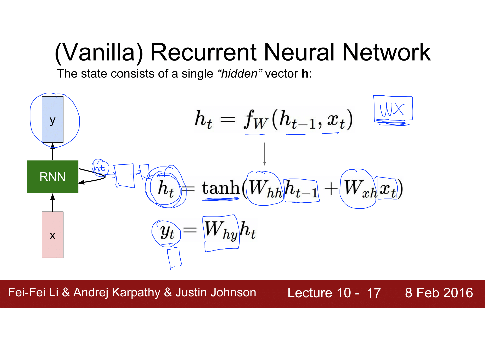
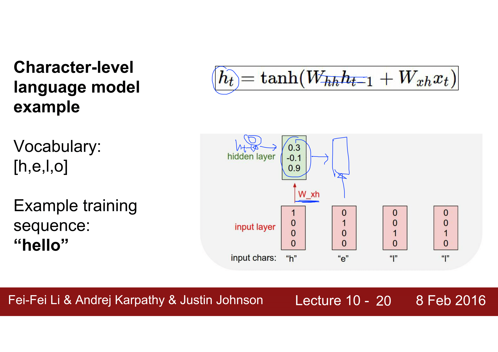
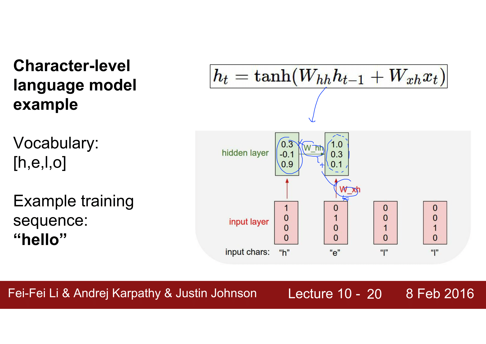
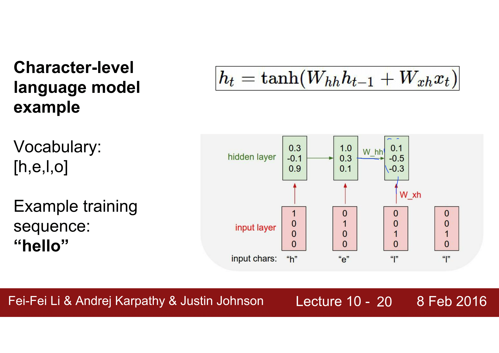
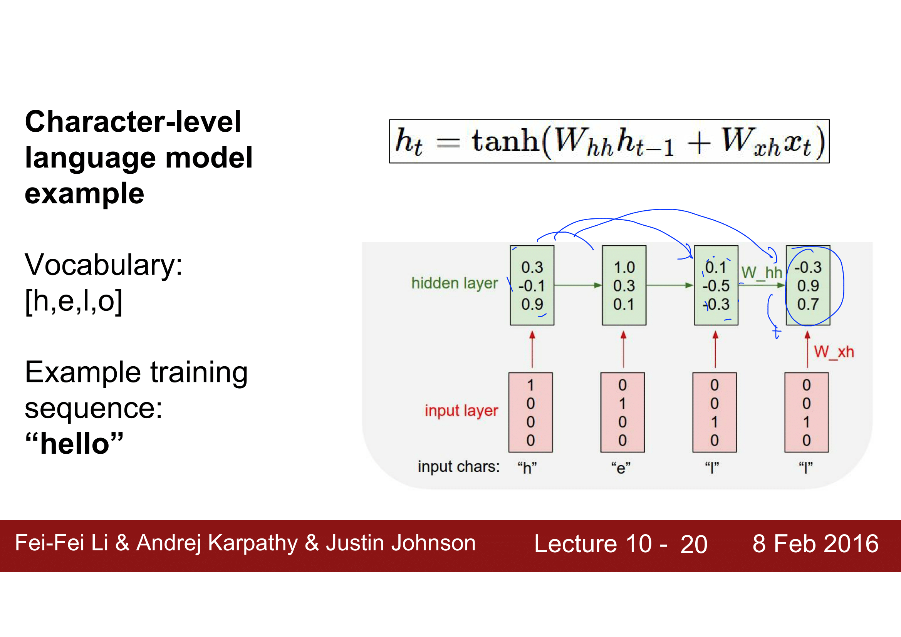

# Basic


- [RNN과 LSTM을 이해해보자!](https://ratsgo.github.io/natural%20language%20processing/2017/03/09/rnnlstm/)
  - RNN 을 아주 잘 설명하고 있는 블로그
- node 의 출력이 바로 옆 node의 입력으로 적용되는 형태의 neural networks 를 recurrent neural networks 라고 한다.
- 다음과 같은 Vanilla RNN 을 살펴보자. 현재 노드의 hypothesis 인 `h_{t}` 는 현재 노드의 입력값 `x_{t}` 와 이전 노드의 hypothesis 인 `h_{t-1}` 에 의해 결정된다. `W_{hh}` 는 이전 노드에서 넘어오는 weight 이다.  `W_{xh}` 는 inputlayer 에서 넘어오는 weight 이다. activation function 으로 tanh 를 사용하였다.
  
    

- "hell" 라는 문자열을 vanilla RNN 에 입력 데이터로 넣어 보자. 전체 문자는 "hel" 세 종류이기 때문에 hidden layer의 값은 `[3, 1]` 형태 이다. 마지막 출력을 위해서 fully connected layer 를 사용했다.

    

    

    

    

    

    

    

- RNN은 시간이 흐름에 따라 현재의 출력이 과거의 입력에 영향을 받는 문제를 
  해결할 만 하다.
  - Language Modeling
  - Speech Recognition
  - Machine Translation
  - Conversation Modeling/Question Answering
  - Image/Video Captioning
  - Image/Music/Dance Generation
  
- 다음은 캐릭터를 입력및 출력으로 하는 문제를 RNN으로 구현한 것이다. "hihell"을 입력하고 "ihello"를 출력한다. 입력의 형식은 one hot을 사용한다.
  
    ```python
    # -*- coding: utf-8 -*-
    import tensorflow as tf
    import numpy as np
    tf.set_random_seed(777)

    def main():
        # set data
        idx2char = ['h', 'i', 'e', 'l', 'o']
        l_X = [[0, 1, 0, 2, 3, 4]]   # hihell
        l_X_one_hot = [[[1, 0, 0, 0, 0],  # h 0
                    [0, 1, 0, 0, 0],  # i 1
                    [1, 0, 0, 0, 0],  # h 0
                    [0, 0, 1, 0, 0],  # e 2
                    [0, 0, 0, 1, 0],  # l 3
                    [0, 0, 0, 1, 0]]] # l 3
        l_Y = [[1, 0, 2, 3, 3, 4]]   # ihello

        # set variables
        n_class_cnt     = 5
        n_input_dim     = 5  # input data is one hot
        n_hidden_size   = 5  # output from the LSTM. 5 to one-hot
        n_batch_size    = 1
        n_seq_len       = 6
        f_learn_rate    = 0.1

        # set placeholder
        t_X = tf.placeholder(tf.float32, [None, n_seq_len, n_input_dim])
        t_Y = tf.placeholder(tf.int32, [None, n_seq_len])

        # set RNN
        cell = tf.nn.rnn_cell.LSTMCell(num_units=n_hidden_size, state_is_tuple=True)
        initial_state = cell.zero_state(n_batch_size, tf.float32)
        t_outputs, _ = tf.nn.dynamic_rnn(cell, t_X, initial_state=initial_state, dtype=tf.float32)

        # set FCNN
        t_X_for_fc = tf.reshape(t_outputs, [-1, n_hidden_size])
        # fc_w = tf.get_variable("fc_w", [n_hidden_size, n_class_cnt])
        # fc_b = tf.get_variable("fc_b", [n_class_cnt])
        # t_outputs = tf.matmul(X_for_fc, fc_w) + fc_b
        t_outputs = tf.contrib.layers.fully_connected(inputs=t_X_for_fc, num_outputs=n_class_cnt, activation_fn=None)
        # reshape out for sequence_loss
        t_outputs = tf.reshape(t_outputs, [n_batch_size, n_seq_len, n_class_cnt])

        # set nodes
        weights = tf.ones([n_batch_size, n_seq_len])
        t_seq_loss = tf.contrib.seq2seq.sequence_loss(logits=t_outputs, targets=t_Y, weights=weights)
        t_C = tf.reduce_mean(t_seq_loss)
        t_T = tf.train.AdamOptimizer(learning_rate=f_learn_rate).minimize(t_C)
        t_pred = tf.argmax(t_outputs, axis=2)

        # launch nodes
        with tf.Session() as sess:
            sess.run(tf.global_variables_initializer())
            for i in range(50):
                f_cost, _ = sess.run([t_C, t_T], feed_dict={t_X: l_X_one_hot, t_Y: l_Y})
                l_pred = sess.run(t_pred, feed_dict={t_X: l_X_one_hot})
                pred_str = ''.join([idx2char[c] for c in np.squeeze(l_pred)])
                true_str = ''.join([idx2char[c] for c in np.squeeze(l_Y)])
                print(f'{i:10d}, pred: {pred_str}, true: {true_str}')
            #print(sess.run(weights))

    if __name__ == "__main__":
        main()
    # 출력값은 정확하지 않을 수 있다.
    #          0, pred: ihelll, true: ihello
    #          1, pred: ihelll, true: ihello
    #          2, pred: ihelll, true: ihello
    # ...
    #         47, pred: ihelll, true: ihello
    #         48, pred: ihelll, true: ihello
    #         49, pred: ihelll, true: ihello
    ```

- 다음은 앞서 구현한 것을 임의의 문자열을 입력 할 수 있도록 수정했다.

    ```python
    # -*- coding: utf-8 -*-
    import tensorflow as tf
    import numpy as np
    tf.set_random_seed(777)

    def main():
        # set characters
        sample = " if you want you"
        idx2char = list(set(sample))
        char2idx = {c: i for i, c in enumerate(idx2char)}

        # set hyper params
        dic_size = len(char2idx) # RNN input size (one hot size)
        hidden_size = len(char2idx) # RNN output size
        num_classes = len(char2idx) # final output size (RNN or softmax)
        batch_size = 1 # sample data count
        sequence_length = len(sample) - 1 # number of LSTM rollings
        learning_rate = 0.1

        # set data
        sample_idx = [char2idx[c] for c in sample]
        x_data = [sample_idx[:-1]]
        y_data = [sample_idx[1:]]

        # set placeholder
        X = tf.placeholder(tf.int32, [None, sequence_length])
        Y = tf.placeholder(tf.int32, [None, sequence_length])

        # set RNN layer
        x_one_hot = tf.one_hot(X, num_classes)
        cell = tf.contrib.rnn.BasicLSTMCell(
            num_units=hidden_size, state_is_tuple=True)
        initial_state = cell.zero_state(batch_size, tf.float32)
        outputs, _states = tf.nn.dynamic_rnn(
            cell, x_one_hot, initial_state=initial_state, dtype=tf.float32)

        # set FC layer
        x_for_fc = tf.reshape(outputs, [-1, hidden_size])
        outputs = tf.contrib.layers.fully_connected(x_for_fc, num_classes, activation_fn=None)
        outputs = tf.reshape(outputs, [batch_size, sequence_length, num_classes])

        # set nodes
        weights = tf.ones([batch_size, sequence_length])
        sequence_loss = tf.contrib.seq2seq.sequence_loss(
            logits=outputs, targets=Y, weights=weights)
        loss = tf.reduce_mean(sequence_loss)
        train = tf.train.AdamOptimizer(learning_rate=learning_rate).minimize(loss)
        prediction = tf.argmax(outputs, axis=2)

        with tf.Session() as sess:
            sess.run(tf.global_variables_initializer())
            for i in range(50):
                l, _ = sess.run([loss, train], feed_dict={X: x_data, Y: y_data})
                result = sess.run(prediction, feed_dict={X: x_data})

                # print
                result_str = [idx2char[c] for c in np.squeeze(result)]
                print(i, "loss: ", l, "Prediction: ", ''.join(result_str))

    if __name__ == "__main__":
        main()
    # 0 loss:  2.8964386 Prediction:  iff ifyfy yfy yfy
    # 1 loss:  2.6860485 Prediction:  ifo ifyyoy yoyoyou
    # 2 loss:  2.485096 Prediction:  ify if yyou you you
    # ...
    # 45 loss:  0.13911468 Prediction:  ify if you want you
    # 46 loss:  0.14146316 Prediction:  ify if you want you
    # 47 loss:  0.14426778 Prediction:  ify if you want you
    # 48 loss:  0.14748347 Prediction:  ify if you want you
    # 49 loss:  0.15106699 Prediction:  ify if you want you

    ```

- 다음은 문자열 입력 및 출력 문제를 softmax regression을 이용하여 구현했다. 정확도가 좋지 않다.

    ```python
    # -*- coding: utf-8 -*-
    import tensorflow as tf
    import numpy as np
    tf.set_random_seed(777)

    def main():
        # set characters
        sample = " if you want you"
        idx2char = list(set(sample))
        char2idx = {c: i for i, c in enumerate(idx2char)}

        # set hyper params
        dic_size = len(char2idx) # RNN input size (one hot size)
        hidden_size = len(char2idx) # RNN output size
        num_classes = len(char2idx) # final output size (RNN or softmax)
        batch_size = 1 # sample data count
        sequence_length = len(sample) - 1 # number of LSTM rollings
        learning_rate = 0.1

        # set data
        sample_idx = [char2idx[c] for c in sample]
        x_data = [sample_idx[:-1]]
        y_data = [sample_idx[1:]]

        # set placeholder
        X = tf.placeholder(tf.int32, [None, sequence_length])
        Y = tf.placeholder(tf.int32, [None, sequence_length])

        # flatten the data
        x_one_hot = tf.one_hot(X, num_classes)
        X_for_softmax = tf.reshape(x_one_hot, [-1, hidden_size])

        # set softmax layer
        softmax_w = tf.get_variable("softmax_w", [hidden_size, num_classes])
        softmax_b = tf.get_variable("softmax_b", [num_classes])
        outputs = tf.matmul(X_for_softmax, softmax_w) + softmax_b

        # expand the data
        outputs = tf.reshape(outputs, [batch_size, sequence_length, num_classes])
        weights = tf.ones([batch_size, sequence_length])

        # set nodes
        sequence_loss = tf.contrib.seq2seq.sequence_loss(
            logits=outputs, targets=Y, weights=weights)
        loss = tf.reduce_mean(sequence_loss)
        train = tf.train.AdamOptimizer(learning_rate=learning_rate).minimize(loss)
        prediction = tf.argmax(outputs, axis=2)

        with tf.Session() as sess:
            sess.run(tf.global_variables_initializer())
            for i in range(3000):
                l, _ = sess.run([loss, train], feed_dict={X: x_data, Y: y_data})
                result = sess.run(prediction, feed_dict={X: x_data})

                # print
                result_str = [idx2char[c] for c in np.squeeze(result)]
                print(i, "loss: ", l, "Prediction: ", ''.join(result_str))

    if __name__ == "__main__":
        main()
    # 0 loss:  2.8334749 Prediction:  yyyyyyyyyyyyyyyy
    # 1 loss:  2.8186333 Prediction:  yyyyuyyyyyyyyyyy
    # 2 loss:  2.804349 Prediction:  yyyyuyyyyyyyyyyy
    # 3 loss:  2.7906053 Prediction:  yyyyuyyyyyyyyyyy
    # 4 loss:  2.7773762 Prediction:  yyyyuyyyyyyyyyyy
    # 5 loss:  2.7646415 Prediction:  yyyyuyyyyyyyyyyy
    # 6 loss:  2.7523782 Prediction:  yyyyuyyyyyyyyyyy
    # 7 loss:  2.7405636 Prediction:  yyyyuyyyyyyyyyyy
    # 8 loss:  2.7291799 Prediction:  yyyyuyyyyyyyyyyy
    # 9 loss:  2.7182078 Prediction:  yyyyuyyyyyyyyyyy
    # ...
    # 2990 loss:  0.44671965 Prediction:  if you want you
    # 2991 loss:  0.40759996 Prediction:  if you want you
    # 2992 loss:  0.37233278 Prediction:  if you want you
    # 2993 loss:  0.34094286 Prediction:  if you want you
    # 2994 loss:  0.31267077 Prediction:  if you want you
    # 2995 loss:  0.28728643 Prediction:  if you want you
    # 2996 loss:  0.2645697 Prediction:  if you want you
    # 2997 loss:  0.24429612 Prediction:  if you want you
    # 2998 loss:  0.22627884 Prediction:  if you want you
    # 2999 loss:  0.21037929 Prediction:  if you want you

    ```

- 다음은 매우 긴 문자열 입력 및 출력 문제를 RNN을 이용하여 구현했다. 굉장히 잘된다.

    ```python
    # -*- coding: utf-8 -*-
    from __future__ import print_function
    import tensorflow as tf
    import numpy as np
    from tensorflow.contrib import rnn

    tf.set_random_seed(777)

    def make_lstm_cell(hidden_size):
        return rnn.BasicLSTMCell(hidden_size, state_is_tuple=True)

    def main():
        # set characters
        sentence = ("if you want to build a ship, don't drum up people together to "
                    "collect wood and don't assign them tasks and work, but rather "
                    "teach them to long for the endless immensity of the sea.")
        char_set = list(set(sentence))
        char_dic = {w: i for i, w in enumerate(char_set)}

        # set hyper params
        data_dim = len(char_set)
        hidden_size = len(char_set)
        num_classes = len(char_set)
        sequence_length = 10
        learning_rate = 0.1

        # set data
        dataX = []
        dataY = []
        for i in range(0, len(sentence) - sequence_length):
            x_str = sentence[i: i + sequence_length]
            y_str = sentence[i+1: i + sequence_length + 1]
            # print(i, x_str, '->', y_str)
            x = [char_dic[c] for c in x_str]
            y = [char_dic[c] for c in y_str]
            dataX.append(x)
            dataY.append(y)
        batch_size = len(dataX)

        # set placeholder
        X = tf.placeholder(tf.int32, [None, sequence_length])
        Y = tf.placeholder(tf.int32, [None, sequence_length])
        X_one_hot = tf.one_hot(X, num_classes)
        # print(X_one_hot)

        # set rnn
        multi_cells = rnn.MultiRNNCell([make_lstm_cell(hidden_size) for _ in range(2)], state_is_tuple=True)
        outputs, _states = tf.nn.dynamic_rnn(multi_cells, X_one_hot, dtype=tf.float32)

        # set FC layer
        X_for_fc = tf.reshape(outputs, [-1, hidden_size])
        outputs = tf.contrib.layers.fully_connected(X_for_fc, num_classes, activation_fn=None)
        outputs = tf.reshape(outputs, [batch_size, sequence_length, num_classes])
        weights = tf.ones([batch_size, sequence_length])
        sequence_loss = tf.contrib.seq2seq.sequence_loss(
            logits=outputs, targets=Y, weights=weights)
        loss = tf.reduce_mean(sequence_loss)
        train = tf.train.AdamOptimizer(learning_rate=learning_rate).minimize(loss)

        with tf.Session() as sess:
            sess.run(tf.global_variables_initializer())
            for i in range(500):
                _, l, results = sess.run(
                    [train, loss, outputs], feed_dict={X: dataX, Y: dataY})
                for j, result in enumerate(results):
                    index = np.argmax(result, axis=1)
                    print(i, j, ''.join([char_set[t] for t in index]), l)

            results = sess.run(outputs, feed_dict={X: dataX})
            for j, result in enumerate(results):
                index = np.argmax(result, axis=1)
                if j is 0:
                    print(''.join([char_set[t] for t in index]), end='')
                else:
                    print(char_set[index[-1]], end='')

    if __name__ == "__main__":
        main()

    # 0 0 f you want  3.496563
    # 0 1 you want t  3.496563
    # 0 2 ou want to  3.496563
    # 0 3 u want to b  3.496563
    # 0 4  want to bu  3.496563

    # 250 0 if you want  0.2934842
    # 250 1 f you want t  0.2934842
    # 250 2 you want to  0.2934842
    # 250 3 ou want to b  0.2934842
    # 250 4 u want to bu  0.2934842

    # 499 0 if you want  0.0192634
    # 499 1 f you want t  0.0192634
    # 499 2 you want to  0.0192634
    # 499 3 ou want to b  0.0192634
    # 499 4 u want to bu  0.0192634

    # if you want to build a ship, don't drum up people together to collect wood and don't assign them tasks and work, but rather teach them to long for the endless immensity of the sea.
    ```

- 다음은 주식을 살것이냐 팔것이냐를 RNN을 이용하여 구현했다. 제공되는 데이터의 70%를 트레이닝 데이터로 사용하고 30%를 검증 데이터로 사용하자. 검증 데이터의 실제 Close가격과 검증 데이터의 입력값을 이용하여 예측한 Close가격이 거의 일치하는 것을 확인 할 수 있다.

    ```python
    # -*- coding: utf-8 -*-
    import tensorflow as tf
    import numpy as np
    import matplotlib
    import os
    tf.set_random_seed(777)
    if "DISPlAY" not in os.environ:
        matplotlib.use('Agg')
    import matplotlib.pyplot as plt

    def MinMaxScaler(data):
        ''' Min Max Normalization

        Parameters
        ----------
        data : numpy.ndarray
            input data to be normalized
            shape: [Batch size, dimension]

        Returns
        ----------
        data : numpy.ndarry
            normalized data
            shape: [Batch size, dimension]

        References
        ----------
        .. [1] http://sebastianraschka.com/Articles/2014_about_feature_scaling.html

        '''
        numerator = data - np.min(data, 0)
        denominator = np.max(data, 0) - np.min(data, 0)
        # noise term prevents the zero division
        return numerator / (denominator + 1e-7)    
        
    def main():
        # set hyper params
        seq_length = 7
        data_dim = 5
        hidden_dim = 10
        output_dim = 1
        learning_rate = 0.01
        iterations = 500

        # set data
        # Open, High, Low, Volume, Close
        xy = np.loadtxt('data-02-stock_daily.csv', delimiter=',')
        xy = xy[::-1]  # reverse order (chronically ordered)
        xy = MinMaxScaler(xy)
        x = xy
        y = xy[:, [-1]]  # Close as label

        # build a dataset
        dataX = []
        dataY = []
        for i in range(0, len(y) - seq_length):
            _x = x[i:i + seq_length]
            _y = y[i + seq_length]  # Next close price
            # print(_x, "->", _y)
            dataX.append(_x)
            dataY.append(_y)

        # set train/test split data
        train_size = int(len(dataY) * 0.7)
        test_size = len(dataY) - train_size
        trainX, testX = np.array(dataX[0:train_size]), np.array(
            dataX[train_size:len(dataX)])
        trainY, testY = np.array(dataY[0:train_size]), np.array(
            dataY[train_size:len(dataY)])

        # set place holder
        X = tf.placeholder(tf.float32, [None, seq_length, data_dim])
        Y = tf.placeholder(tf.float32, [None, 1])

        # set LSTM rnn
        cell = tf.contrib.rnn.BasicLSTMCell(
            num_units=hidden_dim, state_is_tuple=True, activation=tf.tanh)
        outputs, _states = tf.nn.dynamic_rnn(cell, X, dtype=tf.float32)
        Y_pred = tf.contrib.layers.fully_connected(
            outputs[:, -1], output_dim, activation_fn=None)

        # set loss
        loss = tf.reduce_sum(tf.square(Y_pred - Y))
        train = tf.train.AdamOptimizer(learning_rate).minimize(loss)

        # set RMSE
        targets = tf.placeholder(tf.float32, [None, 1])
        predictions = tf.placeholder(tf.float32, [None, 1])
        rmse = tf.sqrt(tf.reduce_mean(tf.square(targets - predictions)))

        with tf.Session() as sess:
            sess.run(tf.global_variables_initializer())
            for i in range(iterations):
                _, step_loss = sess.run([train, loss], feed_dict={
                    X: trainX, Y: trainY})
                print("[step: {}] loss: {}".format(i, step_loss))
            
            # Test step
            test_predict = sess.run(Y_pred, feed_dict={X: testX})
            rmse_val = sess.run(rmse, feed_dict={
                targets: testY, predictions: test_predict})
            print("RMSE: {}".format(rmse_val))

            # Plot predictions
            plt.plot(testY)
            plt.plot(test_predict)
            plt.xlabel("Time Period")
            plt.ylabel("Stock Price")
            plt.show()

    if __name__ == "__main__":
        main()
    # [step: 0] loss: 0.938123
    # [step: 1] loss: 0.787456
    # [step: 2] loss: 0.652749
    # [step: 3] loss: 0.531921
    # [step: 4] loss: 0.423513
    # ...
    # [step: 495] loss: 0.000345
    # [step: 496] loss: 0.000334
    # [step: 497] loss: 0.000324
    # [step: 498] loss: 0.000315
    # [step: 499] loss: 0.000305
    # RMSE: 0.0123456
    ```
