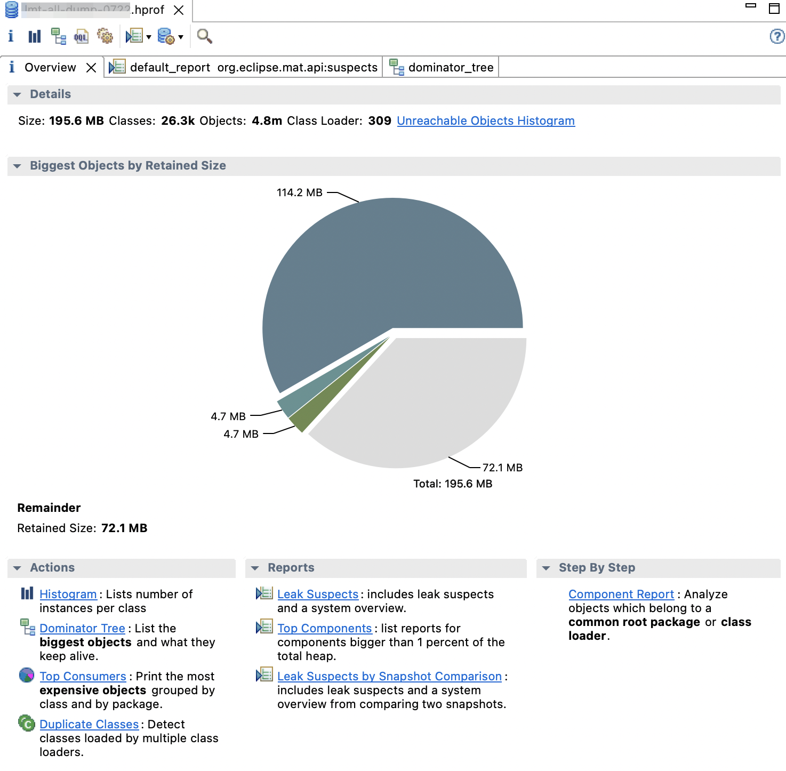
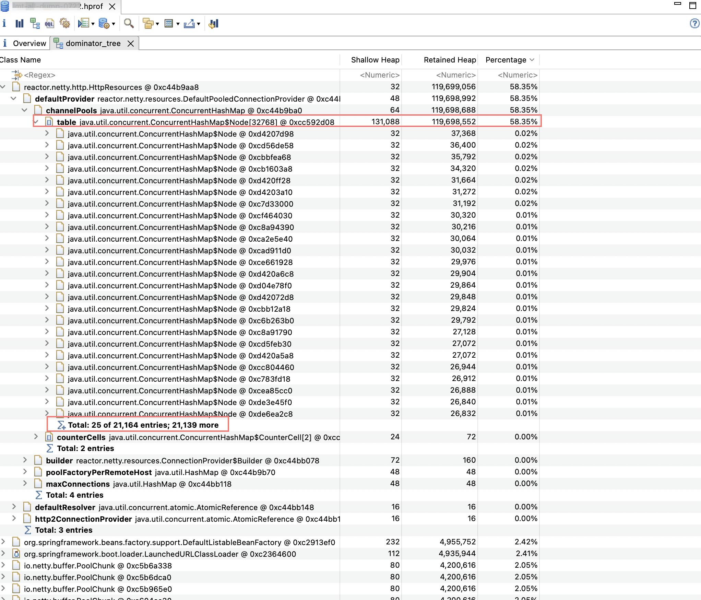

# Abstract

Eclipse Mat 를 정리한다. 주로 memory leak 을 검출하는데 사용함. memory leak 을 검출하는 것은 매우 지리한 과정이다. IntelliJ 에서 `*.prof` 을 열어 Eclipse mat 의 Domaintor Tree 와 같은 view 를 확인할 수도 있다.

# Materials

* [Fixing Memory Leaks – Lab](https://horstmann.com/sjsu/fall2013/cs175/presentations/Fixing_Memory_Leaks/Fixing%20Memory%20Leaks.html)
* [WebClient 사용할때 주의 (1편) | tistory](https://yangbongsoo.tistory.com/9)
* [도움이 될수도 있는 JVM memory leak 이야기 | woowahan](https://techblog.woowahan.com/2628/)

# Basic

# Tutorial

heapdump 를 download 한다. `a.hprof`

mat 를 설치하고 실행한다. `a.hprof` 를 로딩한다. 114.2 MB 가 leak 으로 의심된다. dominator tree 를 선택하면 점유율이 높은 objects 를 자세히 살펴볼 수 있다.

**Shallow Heap** 은 특정 object 가 소유한 memory 크기이다. **Retained Heap** 은 특정 object 와 연결된 모든 memory 크기이다. 즉, 그 object 가 Garbage Collected 되었을 때 반한될 수 있는 memory 크기이다.

**Shallow heap** is the memory consumed by one object.
Retained set of X is the set of objects which would be removed by GC when X is garbage collected.
**Retained heap** of X is the sum of shallow sizes of all objects in the retained set of X, i.e. memory kept alive by X.

`reactor.netty.resources.DefaultPooledConnectionProvider` 가 소유한 `java.util.Concurrent.ConcurrentHashMap` 이 21,164 개의 entry 를 가지고 있다. 생각보다 많은 수의 entry 들을 가지고 있는 것을 의심할 수 있다.

결론적으로 open telemetry 의 오래된 version 과 WebClient 를 사용했을 때 `ConcurrentHashMap` 의 item 들이 같은 val 에도 불구하고 key 가 달라지는 [bug](https://github.com/open-telemetry/opentelemetry-java-instrumentation/issues/4862) 가 있었다. 따라서 필요이상으로 `java.util.Concurrent.ConcurrentHashMap` 의 크기가 커짐. open telemetry 의 version 을 upgrade 하여 해결함.
