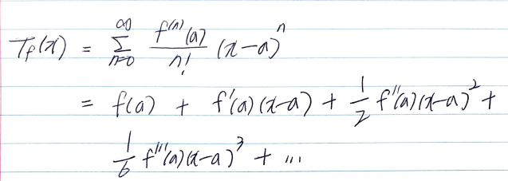

- [Abstract](#abstract)
- [Materials](#materials)
- [References](#references)
- [History of Math](#history-of-math)
- [Articles](#articles)
- [Categories](#categories)
- [Tutorials](#tutorials)

-----

# Abstract

- 수학에 대해 적어보자.
- MSC (mathematics subject classification)은 수학을 분류해 놓은
  것이다. [MSC2010](https://zbmath.org/classification/)이 가장 최신
  분류이다. ACM의 CCS (Computing Classification System)과
  비슷하다. CCS의 경우 [CCS2012](http://dl.acm.org/ccs/ccs_flat.cfm)가
  가장 최신이다.
- [wolfram mathworld classroom](http://mathworld.wolfram.com/classroom/)는
  수학을 주제별로 분류해 놓았다.
- [khan academy math by subject](https://www.khanacademy.org/math)는
  좋은 강좌들을 담고 있다.
- [고려대학교 수학과 교과과정](https://math.korea.ac.kr/math/grad/normal.do)을
  통해서 수학의 과목별 설명을 확인 할 수 있다. 영문이 함께 표기되서
  좋다.
- [서울대학교 수학과 교과과정](http://www.math.snu.ac.kr/board/b5_5)을 통해서
  수학의 과목별 설명을 확인 할 수 있다.
- [수학올림피아드 학습용 추천도서](http://xn--9g3b2pk7jl8x.kr/board/bbs/board.php?bo_table=olympiad01&wr_id=8)는
  중,고등생 수학 올림피아드 대비용 추천도서가 제시되어 있다.

# Materials

- [수학벙커 @ naver](https://blog.naver.com/alwaysneoi)
  - 중등, 고등 수학을 포함한 수학블로그
- [수학이야기 @ tistory](http://suhak.tistory.com/)
  - 유클리드원론이 정리된 수학블로그
- [조금은 느리게 살자 @ tistory](https://ghebook.blogspot.com/search/label/%EC%88%98%ED%95%99)
  - 사전지식 링크가 신박한 수학블로그 
- [math @ khanacademy](https://www.khanacademy.org/math)
  - 칸 아카데미 수학 동영상 강좌
- [3blue1brown @ youtube](https://m.youtube.com/channel/UCYO_jab_esuFRV4b17AJtAw)
  - 수학 동영상
- [jjycjn's Math Storehouse @ tistory](http://jjycjnmath.tistory.com/category)
  - 다양한 분야를 정리한 수학 블로그, [wordpress](http://www.mathstorehouse.com/) 로 이주했다.

# References

- [천재학습백과](http://koc.chunjae.co.kr/Dic/dicMain.do)
  - 고등수학을 가장 잘 정리한 곳
- [수학의 파노라나 @ 교보문고](http://www.kyobobook.co.kr/product/detailViewKor.laf?barcode=9788983716903)
  - 수학의 역사적 토픽 250가지를 시대별로 잘정리 했다.
  - [이곳](http://sprott.physics.wisc.edu/pickover/math-book.html)은 저자가 정리한 참고문헌들이다.
- [KMO BIBLE 한국수학올림피아드 바이블 프리미엄](http://www.yes24.com/24/goods/12554932?scode=032&OzSrank=2)
  - 한국수학올림피아드를 대비하기 위한 책이다. 정수론, 대수, 기하, 조합 과 같이 4권으로 구성되어 있다.
  - 무엇보다 커리큘럼이 잘 정리 되어 있어 봐둘 만 하다.
- [문제해결전략 @ yes24](http://www.yes24.com/24/goods/3085601?scode=032&OzSrank=2)
  - 763쪽의 방대한 교과서

# History of Math

| Fiscal        | Event                |
| :------------ | -------------------: |
|기원전 3000년 경	| 이집트, 십진법 사용. 기초적인 기하학과 측량 기술 발달. |
|기원전 2000년 경	| 이집트, 토지 측량 시작. |
|기원전 1700년 경	| 아메스의 파피루스 간행. |
|기원전 540년 경	| 피타고라스 활동. |
|기원전 430년 경	| 소피스트 3대 문제 연구. |
|기원전 300년 경	| 유클리드, 연역법을 써서 기하학 체계 마련. ?원론? 발표. |
|기원전 370년 경	| 에우독소스, 구분구적법 개발 |
|기원전 250년 경	| 아르키메데스, 원주율 계산, 적분의 선구적 연구 |
|기원전 230년 경	| 아폴로니오스, 《원추곡선론》 발표. |
|100년 경	| 중국, 《구장산술(九章算術)》 집성. |
|300년 경	| 디오판토스, 대수학 창시. |
|628년 경	| 브라마굽타, 대수에 관한 책을 씀 |
|680년 경	| 숫자 영(0)을 처음으로 사용 |
|820년 경	| 알콰리즈미, 《복원과 대비》를 씀 |
|876년 경	| 기호 0, 인도에서 등장 |
|1142년	        | 바스의 아델라드, 유클리드의 《원론》 15권을 라틴어로 번역 |
|1100년 경	| 알콰리즈미의 산술에 관한 책이 번역되어 아라비아 숫자가 유럽에 전파 |
|1150년	        | 바스카라, 양수와 음수를 해설 |
|1201년	        | 피보나치, 《산반의 서》를 씀. |
|1494년	        | 파치올리, 복식부기를 처음으로 발표 |
|1514년	        | 후케, 대수식에 처음으로 '＋'와 '－'기호 사용 |
|1533년	        | 레기오몬타누스, 삼각법을 천문학에서 분리 |
|1535년	        | 타르탈리아, 3차 방정식의 해법 발견 |
|1540년	        | 레코드, 《기술의 기초》 발표 |
|1542년	        | 카르다노, 근대 수학에 관한 최초의 책 《위대한 예술》 발표 |
|1545년	        | 카르다노, 《대수학에 관한 대기술》 발표 |
|1557년	        | 레코드, 수학에 등호(=)를 도입 |
|1591년	        | 비에트, 대수기호적 표지법 발표 |
|1614년	        | 네이피어, 로그 발견 |
|1635년	        | 페르마, 〈정수론〉 발표 |
|1637년	        | 데카르트, 《해석기하학》 발표 |
|1654년	        | 파스칼, 페르마 확률론을 진전시킴 |
|1669년	        | 뉴턴, 미적분학 발견 |
|1680년대 중반	| 라이프니츠, 미적분학 발견 |
|1717년	        | 샤프, 원주율의 값을 소수점 아래 72자리까지 구함 |
|1742년	        | 골드바흐, 모든 짝수는 소수 두 개의 합으로 나타낼 수 있다는 골드바흐의 추측 세움. |
|1763년	        | 몽주, 화법기하학 도입. 1795년에 군사기밀로 보호받음 |
|1765년	        | 몽주, 〈화법기하학〉 발표 |
|1799년	        | 가우스, 최소자승법 발견 |
|19세기 초	| 가우스, 비유클리드 기하학 개발 |
|1811년	        | 푸리에, 급수의 연구 |
|1820년대 초	| 배비지, 기계적인 계산기 만듦 |
|1821년	        | 코시, 《대수해석교정》 발표 |
|1822년	        | 푸리에, 푸리에 해석 도입. |
|1830년 경	| 갈루아, 군론 도입 |
|1899년	        | 힐베르트, 《기하학기초론》 발표 |
|19세기 말	| 칸토어, 집합론과 무한대에 관한 수학 이론을 발전시킴 |
|1908년	        | 체르멜로, 무정의 용어 2개와 공리 7개를 써서 집합론에 공리적 접근 |
|1910년-1913년	| 화이트헤드, 러셀, 《수학 원리》 발표 |
|1912년	        | 브라우어르, 직관주의 주장 |
|1921년	        | E. 피셔, 추계학(推計學) 창시 |
|1930년	        | 괴델, 〈불완전성 정리〉 발표 |
|1932년	        | 노이만, 〈양자역학의 수학적 기초〉 발표 |
|1933년	        | 콜모고로프, 측도론적 확률론 창시 |
|1937년	        | 튜링, 계산 가능한 문제를 해결하는 가상 컴퓨터인 튜링 기계를 설명 |
|1939년	        | 부르바키, 《수학원론》 발표 |
|1944년	        | 노이만, 〈게임의 이론과 경제활동〉 발표 |
|1947년	        | 위너, 사이버네틱스 제창 |
|1964년	        | P.J. 코엔, 연속체 가설에 관한 결과 발표 |
|1974년	        | 펜로즈, 블랙홀을 둘러싸고 있는 시공간의 영역을 펜로즈 도형으로 표현 |
|1970년대	| 컴퓨터를 이용한 수학 모형이 산업, 과학에 쓰이기 시작 |
|1980년대	| 프랙털 구조로 카오스 현상을 연구하기 시작 |
|1994년	        | 와일스, 페르마의 마지막 정리 증명 |
|2002년	        | 페렐만, 푸앵카레 추측 증명 |

# Articles

* [오일러수](articles/euler_number.md)

# Categories

* [미적분학](/calculus/)

* Trigonometric functions


삼각함수보다는 원함수가 더욱 어울린다. 원점을 중심으로 (1,0) 에서 부터 반지름이 1인 원을 그려 보자.
반지름 r 과 호를 구성하는 점 (x, y) 를 이용하여 삼각함수 sin, cos, tan 을 만들어 낼 수 있다.

* [이산수학](/discretemath/)

* [선형대수학](/linearalgebra/)

* [해석학](/analystics/)

  * 복소해석학

* [확률통계학](/statistics/)

* 위상수학

* 현대대수학

* 미분기하학

* 집합론

* [정수론](/numbertheory/)

* [기하학](/geometry/)

* [수리논리학](/mathlogic/)

* [수치해석](/numericalanal/)

* 공업수학

# Tutorials

* 음수의 발견은 한 방향으로만 정의되어 있던 '수' 인 양수를 1 차원 벡터로 확장했다라는 의미를 갖는다.

* radian (호도법) 을 degree (각도법) 보다 많이 사용하는 이유는 삼각함수 미분을 간단히 하기 위해서이다.

* 허수의 발견은 실수영역에서 1 차원 벡터로 표현될 수 있었던 수 체계를 2 차원 벡터로 확장했다는 의미를 갖는다. 예를 들어 `1` 는 실수에 허수 `i` 를 곱하면 `i` 가 된다. 이것은 실수 1 을 반시계방향으로 `90` 도 만큼 회전한 것과 같다. 실수에 허수를 곱하면 회전했다는 의미가 된다.


* `Mathmatical constant e` (자연상수) 는 왜 만들어 졌는가???
  * [참고](https://wikidocs.net/4035)


* `Orthogonal functions` 은 서로 내적이 0 인 함수들을 말한다. 벡터처럼 함수도 내적을 계산할 수 있다. 두 함수 F1, F2 의 내적이 0 이면 두 함수는 직교한다고 말할 수 있고 서로 직교하는 함수들의 집합을 `Orthogonal Functions Set` 이라고 한다. 임임의 함수는 `Orthogonal Functions Set` 의 급수형태로 표현가능하다. `cos` 과 `sin` 은 서로 직교한다.
  * [참고](https://m.blog.naver.com/sagala_soske/220983389992)


* `euler's identity` (오일러공식)
  * [참고](https://wikidocs.net/4037)
  * 모든 실수 `x` 에 대해 다음이 성립한다.


```latex
e^{ix} = \cos x + i \sin x
```
  * 오일러공식이 출현하기 전까지 실수와 허수는 서로 계산이 불가능했다. 그러나 오일러공식이 출현후 실수와 순허수는 복소평면에서 서로 만나게 되었다. 그리고 초월함수인 지수함수와 삼각함수는 복소평면의 위에서 동일한 현상이었음이 밝혀졌다.

* `phasor`
  * [참고](https://wikidocs.net/4175)

* 미분방정식은 미지의 함수와 그 함수의 도함수들로 이루어져 있는 방정식이다. 미지함수가 일변수이면 상미분항만을 포함한 상미분방정식이 되고, 두 개 이상의 변수를 갖는 미지함수와 이에 대한 편미분항들이 등장하면 편미분방정식이라고 한다. order (계수), degree (차수), 제차, 비제차, 선형, 비선형, 일반해, 특수해, 해곡선 (적분곡선), 해곡선집합, IVP (initial variable problem) 등이 중요하다.
  * [참고](https://www.youtube.com/watch?v=7HEQj20fw_s) 

* `Laplace's transform` 은 ODE 를 수월히 풀기위해 ODE 를 단순하게 만드는 방법이다.


```latex
F(s) = \mathscr{L} \{f(t)\} = \int_{0}^{\infty} e^{-st} f(t) dt
```

* `Continuous Time Fourier Series`
  * [참고](https://wikidocs.net/4026)


* `Continuous Time Fourier Transform`
  * [참고](https://wikidocs.net/4031)


* `Discrete Time Fourier Series`
  * [참고](https://wikidocs.net/4032)
  


* `Discrete Time Fourier Transform`
  * [참고](https://wikidocs.net/4033)


* `Taylor Series`

  * 임의의 함수를 다항식의 급수로 분해한 것이다. 만약 삼각함수의 급수로 분해되었다면 `Fourier Series` 라고 한다.



* 행렬은 column vector 들의 모음이다. `2X2` 행렬의 경우 두 벡터 `(a, c)` 와 `(b, d)` 의 모음이다.
* `det` 는 행렬식이다. `2X2` 행렬의 경우 그 행렬이 표현할 수 있는 마름모의 넓이와 같다.
  * [참고](https://wikidocs.net/4049)

* `부분적분`

* `eigenvector` 는 선형변환 A 가 있을 때 그 크기만 변하고 방향은 변하지 않는 벡터를 의미한다. `eigenvalue` 는 `eigenvector` 가 선형변환 A 를 적용한 후에 변화된 크기를 의미한다.
  * [참고](https://wikidocs.net/4050)
* `gradient` 는 vector 를 반환 하는 함수이다. 이것을 vector field 라고도 한다. 이 벡터는 특정 점에서 함수의 크기가 어느 방향으로 얼마의 변화량으로 커지고 있는지를 나타낸다.
  * [참고](https://wikidocs.net/6998)
* `divergence` 는 scalar 를 반환하는 함수이다. 이 scalar 는 특정 점에서 함수가 src 로 향하는지 sync 로 향하는지를 나타낸다.
  * [참고](https://wikidocs.net/6999)
* `curl` 는 vector 를 반환하는 함수이다. 이 벡터는 특정 점에서 회전의 정도를 나타낸다.
  * [참고](https://wikidocs.net/7000)
* `Laplacian` 은 scalar 를 반환하는 함수이다. scalar 함수 `f` 에 대해서 `gradient` 연산을 하고 출력되는 vector field 에 `divergence` 를 연산한 결과와 같다.
  * [참고](https://wikidocs.net/7001)
* `Laplace's equation` 은 `eigenvalue` 가 0 인 `Laplacian` 의 고유함수가 만족시키는 방정식이다.
* `harmonics function` 은 `Laplace's equation` 의 해가 되는 함수이다.
* `Legendre Polynomials`
  * [참고](https://www.youtube.com/watch?v=1iXvMffmfhA)
* `spherical harmonics function` 은 구면에서 `Laplace's equation` 의 해의 정규직교기저다.
