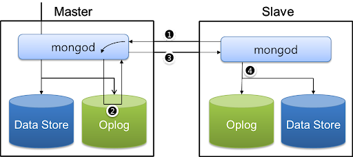
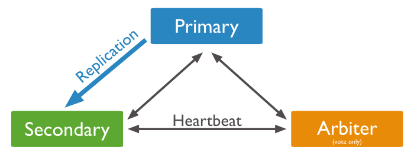
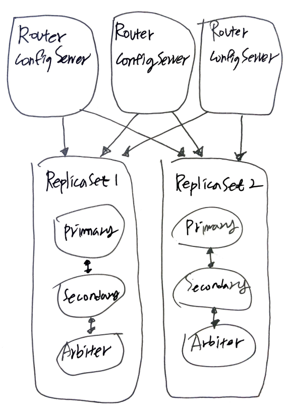

- [Abstract](#abstract)
- [Install with Docker](#install-with-docker)
- [terms and definition](#terms-and-definition)
- [How to make a cluster](#how-to-make-a-cluster)
- [Basic](#basic)
  - [Query](#query)
  - [SQL vs mongo query](#sql-vs-mongo-query)
  - [Aggregation](#aggregation)
  - [Text Search](#text-search)
  - [Data Models](#data-models)
  - [indexes](#indexes)
  - [Storage](#storage)
- [Reference](#reference)

-----

# Abstract

- 3.4를 기준으로 정리한다. 메뉴얼이 정말 잘 되어 있다. 서비스에 이용한다면 꼭 필독하자.
- NoSql db 중 document type 의 db 이다.
- single-document transaction 은 지원하지만 multi-document
  transaction 은 지원하지 않는다. two phase commit 을 이용해
  multi-document transaction 을 구현할 수 있다.
- muli-granularity locking 을 사용하여 global, database, collection level 의 lock 을 한다.
  - storage engine 별로 collection 미만 level 의 lock 을 한다.
  - WiredTiger 는 document level lock 을 한다.
  - granularity locking 은 [이곳](http://www.mysqlkorea.com/sub.html?mcode=manual&scode=01&m_no=21879&cat1=14&cat2=422&cat3=444&lang=k) 을 참고해서 이해하자.

# Install with Docker

```console
$ docker run -d -p 27017:27017 --rm --name my-mongo mongo

$ docker exec -it my-mongo bash
$ mongo
```

# terms and definition

| mongodb            | RDBMS         |
| :----------------- | ------------- |
| _ID Field          | Primary Key   |
| BSON Field         | Column        |
| Collection         | Table         |
| BSON Document      | Row           |
| Embedded & Linking | Relation Ship |

# How to make a cluster

* [MongoDB 구성하기 @ navercloud](https://docs.ncloud.com/ko/database/database-10-3.html)

----

mongoDB 는 Master-Slave, Replica set, Sharded cluster 와 같이 3 가지 방법으로 cluster 를 구성할 수 있다. mongoDB 는 oplog (operation log) 를 이용하여 replication 을 수행한다.

* Master-slave

  

* Replica-set
  * P-S-A (Primary, Secondary, Arbiter) 혹은 P-S-S (Primary, Secondary, Secondary) 로 구성할 수 있다.
  
  

  

* Sharded Cluster



# Basic

## Query

* [[MongoDB] 강좌 목록 @ velopert.log](https://velopert.com/mongodb-tutorial-list)

-----

```js
> p = { eno : 1101, fname : "Adam", Iname : "Kroll", job : "Manager", salaray : 100000, dept_name : "SALES" }
> db.emp.save(p)

> db.createCollection("emp", { capped : false, size : 8192});
> show collections
> db.emp.validate()
> db.emp.renameCollection("employees")
> db.employees.drop()

> db.emp.insert({ eno : 1101, fname : "JIMMY" });
> db.emp.insert({ eno : 1102, fname : "ADAM", iname : "KROLL" });
> db.emp.insert({ eno : 1103, fname : "SMITH", job : "CLERK" });
> db.emp.update({ eno : 1101 }, { $set: {fname : "JOO"} } );
> db.emp.update({ eno : 1102 }, { $set: {job : "CHIEF" } } );
> db.emp.update({ eno : 1103 }, { $set: {iname : "STANDFORD" } } );

> db.emp.remove({eno: 1101});

> db.emp.find();
> db.emp.find().pretty();
> db.emp.find().sort({ eno : -1 });
> db.emp.find().limit(1);
> db.emp.find().skip(1);
// db.COLLECTION_NAME.find(query, projection)
> db.emp.find({}, {ecno: 1});
> db.emp.find({}, {ecno: 0});

// query operator
// $eq
// $gt
// $gte
// $lt
// $lte
// $ne
// $in
// $nin
> db.emp.find({eno: { $gt:1101, $lt: 1102}}).pretty();

// $regex operator
// { <field>: { $regex: /pattern/, $options: '<options>' } }
// { <field>: { $regex: 'pattern', $options: '<options>' } }
// { <field>: { $regex: /pattern/<options> } }
// { <field>: /pattern/<options> }
> db.articles.find( { "title" : /article0[1-2]/ } )

// $where operator
// Can use javascript expression
> > db.articles.find( { $where: "this.comments.length == 0" } )

// $elemMatch operator
// When query embedded documents
> db.articles.find( { "comments": { $elemMatch: { "name": "Charlie" } } } )
```

* projection

```js
// $slice operator
// limit of embedded documents
> db.articles.find({"title": "article03"}, {comments: {$slice: 1}}).pretty()

// $elemMatch operator
> db.articles.find(
    {
        "comments": {
            $elemMatch: { "name": "Charlie" }
        }
    },
    {
        "title": true,
        "comments.name": true,
        "comments.message": true
    }
)
```

## SQL vs mongo query

* [[MongoDB] 강좌 목록 @ velopert.log](https://velopert.com/mongodb-tutorial-list)
  * [[MongoDB] 강좌 3편 Document Query(조회) – find() 메소드](https://velopert.com/479)
* [Project Fields to Return from Query](https://docs.mongodb.com/manual/tutorial/project-fields-from-query-results/)
  * web shell 에서 실습할 수 있다.

----

| SQL                                                                         | mongo query                                                                 |
| :-------------------------------------------------------------------------- | :-------------------------------------------------------------------------- |
| CREATE TABLE emp (empno Number, ename Number)                               | db.createCollection("emp")                                                  |
| INSERT INTO emp VALUES(3, 5)                                                | db.emp.insert({empno: 3, ename: 5})                                         |
| SELECT * FROM emp                                                           | db.emp.find()                                                               |
| SELECT empno, ename FROM emp                                                | db.emp.find({}, {empno: 1, ename: 1})                                       |
| SELECT * FROM emp WHERE empno = 3                                           | db.emp.find({empno: 3})                                                     |
| SELECT empno, ename FROM emp WHERE empno = 3                                | db.emp.find({empno: 3}, {empno: 1, ename: 1})                               |
| SELECT * FROM emp WHERE empno = 3 ORDER BY ename                            | db.emp.find({empno: 3}).sort({ename: 1})                                    |
| SELECT * FROM emp WHERE empno > 3                                           | db.emp.find({empno: {$gt: 3}})                                              |
| SELECT * FROM emp WHERE empno != 3                                          | db.emp.find({empno: {$ne: 3}})                                              |
| SELECT * FROM emp WHERE ename LIKE "%Joe%"                                  | db.emp.find({ename: /Joe/})                                                 |
| SELECT * FROM emp WHERE ename like "JOE%"                                   | db.emp.find({ename: /^Joe/})                                                |
| SELECT * FROM emp WHERE empno > 1 AND empno <= 4                            | db.emp.find({empno: {$gt: 1, $lte: 3}})                                     |
| SELECT * FROM emp ORDER BY ename DESC                                       | db.emp.find().sort({ename: -1})                                             |
| SELECT * FROM emp WHERE empno = 1 AND ename = 'Joe'                         | db.emp.find({empno: 1, ename: 'Joe'})                                       |
| SELECT * FROM emp WHERE empno = 1 OR empno = 3                              | db.emp.find({$or: [{empno: 1}, {empno: 3}]})                                |
| SELECT * FROM emp WHERE rownum = 1                                          | db.emp.findOne()                                                            |
| SELECT empno FROM emp o, dept d WHERE d.deptno = o.deptno AND d.deptno = 10 | o = db.emp.findOne({empno: 1}); name = db.dept.findOne({deptno: o.deptno}); |
| SELECT DISTINCT ename FROM emp                                              | db.emp.distinct('ename')                                                    |
| SELECT COUNT(*) FROM emp                                                    | db.emp.count()                                                              |
| SELECT COUNT(*) FROM emp WHERE deptno > 10                                  | db.emp.find({deptno: {$gt: 10}}).count()                                    |
| SELECT COUNT(sal) FROM emp                                                  | db.emp.find({sal: {$exists: true}}).count()                                 |
| CREATE INDEX i_emp_ename ON emp(ename)                                      | db.emp.ensureIndex({ename: 1})                                              |
| CREATE INDEX i_emp_no ON emp(deptno ASC, ename DESC)                        | db.emp.ensureIndex({depno: 1, ename: -1})                                   |
| UPDATE emp SET ename = 'test' WHERE empno = 1                               | db.emp.update({empno: 1}, {$set: {ename: 'test'}})                          |
| DELETE FROM emp WHERE deptno = 10                                           | db.emp.remove({deptno: 10})                                                 |

## Aggregation

* [Aggregation @ mongoDB](https://docs.mongodb.com/manual/aggregation/)

-----

- 다양한 document들을 그룹화 하고 그룹화 한것을 하나의 결과로 리턴하는 기능
- aggregation pipeline, map-reduce function, single purpose
  aggregation methods 와 같이 총 3가지를 지원한다.

## Text Search

- text index와 $text operator를 이용하여 효율적으로 문자열 검색을 할 수 있다.

## Data Models

* [MongoDB Schema Design Best Practices](https://www.mongodb.com/developer/article/mongodb-schema-design-best-practices/)
* [NoSQL강의) mongoDB에서 data 모델링하는 방법. 예제포함.](https://blog.voidmainvoid.net/241)
* [Schema Design in MongoDB vs Schema Design in MySQL](https://www.percona.com/blog/2013/08/01/schema-design-in-mongodb-vs-schema-design-in-mysql/)

----

- mongodb는 기본적으로 schemaless하다. 하지만 validator를 이용해서
  document의 schema를 검사 할 수 있다.
- mongodb는 기본적으로 embedded data model과 normalized data model등
  두가지 data model을 갖는다. embedded data model은 특정 document에서
  다른 document를 내부에서 소유하는 것이고 normlized data model은 다른
  document의 _id만 소유하는 것이다.

* embedded document

```json
{
  "_id" : ObjectId("506ebba74c935cb364575e95"),
  "name" : "이몽룡",
  "age" : 24,
  "phones" : [ "010-513-2372", "031-748-2461" ], 
  "addresses" : [
    { "city" : "경기", "zip" : 122333, "street" : "용인" },
    { "city" : "서울", "zip" : 354351, "street" : "노원" } 
  ]
}
```

* linked document

```json
{ "_id" : 1, "name" : "음료", "desc" : "콜라, 사이다 등" } 
{ "_id" : 2, "name" : "한식", "desc" : "불고기, 식혜 등" } 
{ "_id" : 3, "name" : "분식", "desc" : "라면, 김밥 등" }

{ "_id" : 1001, "productname" : "콜라", "unitprice" : 1000, "categoryid" : 1 }
{ "_id" : 1002, "productname" : "김밥", "unitprice" : 2000, "categoryid" : 1 }
{ "_id" : 1003, "productname" : "김치전", "unitprice" : 4000, "categoryid" : 1 }
{ "_id" : 1004, "productname" : "떡볶이", "unitprice" : 2500, "categoryid" : 1 }
```

## indexes

- text를 위해 text index가 있다.
- geospatial query를 위해 2dsphere index가 있다.

## Storage

- WiredTiger, MMAPv1, In-Memory Storage Engine이 있다.
- journal은 monbodb의 장애상황이 복구할 정보가 담겨 있는 로그이다.
- 하나의 document는 16MB를 초과 할 수 없다. 그런 경우에는 GridFS를
  사용해야 한다.

# Reference

- [mongodb manual](https://docs.mongodb.com/manual/)
  - 최고의 문서는 메뉴얼!!! 목차 내용은 필수
