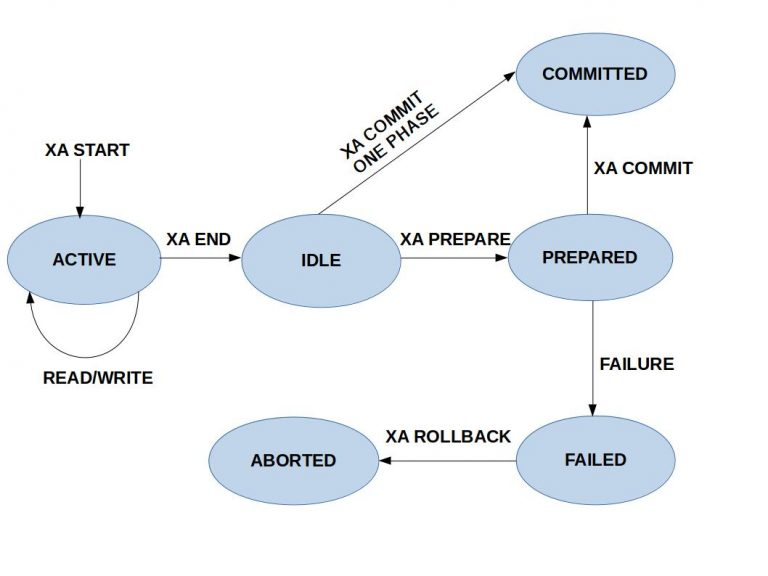

# Abstract

- mysqld 에 대해 적어보자.
- msyql 의 HELP를 주로 사용하자.

# Materials

- [이곳](https://www.percona.com/resources/videos)에
  쓸만한 webinar동영상들이 있다.

# Install with docker

```console
$ docker run -p3306:3306 --rm --name my-mysql -e MYSQL_ROOT_PASSWORD=1 -e MYSQL_DATABASE=foo -e MYSQL_USER=iamslash -e MYSQL_PASSWORD=1 -d mysql

$ docker ps
$ docker exec -it my-mysql /bin/bash

$ mysql -u iamslash -p
mysql> show databases
mysql> use foo
```

# Tip

## how to reset password

```
pkill mysqld
sudo /usr/local/mysql/bin/mysqld_safe --skip-grant-tables
mysqld
mysql -u root
> GRANT ALL PRIVILEGES ON *.* to 'root'@'localhost' WITH GRANT OPTION
> FLUSH PRIVILEGES;

```

## how to run multiple mysqld instances

- vim /Users/iamslash/etc/mysql_multi.cnf

```
# Example MySQL config file for small systems.
#
# This is for a system with little memory (<= 64M) where MySQL is only used
# from time to time and it's important that the mysqld daemon
# doesn't use much resources.
#
# MySQL programs look for option files in a set of
# locations which depend on the deployment platform.
# You can copy this option file to one of those
# locations. For information about these locations, see:
# http://dev.mysql.com/doc/mysql/en/option-files.html
#
# In this file, you can use all long options that a program supports.
# If you want to know which options a program supports, run the program
# with the "--help" option.

# The following options will be passed to all MySQL clients
[client]
#password	= your_password
port		= 3306
socket		= /tmp/mysql.sock

# Here follows entries for some specific programs

# The MySQL server
[mysqld]
port		= 3306
socket		= /tmp/mysql.sock
pid-file	= /tmp/mysql.pid
datadir         = /Users/iamslash/var/mysql_db
skip-external-locking
key_buffer_size = 16K
max_allowed_packet = 1M
table_open_cache = 4
sort_buffer_size = 64K
read_buffer_size = 256K
read_rnd_buffer_size = 256K
net_buffer_length = 2K
thread_stack = 128K

[mysqld1]
port		= 3307
socket		= /tmp/mysql1.sock
pid-file	= /tmp/mysql1.pid
datadir         = /Users/iamslash/var/mysql1_db
skip-external-locking
key_buffer_size = 16K
max_allowed_packet = 1M
table_open_cache = 4
sort_buffer_size = 64K
read_buffer_size = 256K
read_rnd_buffer_size = 256K
net_buffer_length = 2K
thread_stack = 128K

[mysqld2]
port		= 3308
socket		= /tmp/mysql2.sock
pid-file	= /tmp/mysql2.pid
datadir         = /Users/iamslash/var/mysql2_db
skip-external-locking
key_buffer_size = 16K
max_allowed_packet = 1M
table_open_cache = 4
sort_buffer_size = 64K
read_buffer_size = 256K
read_rnd_buffer_size = 256K
net_buffer_length = 2K
thread_stack = 128K


# Don't listen on a TCP/IP port at all. This can be a security enhancement,
# if all processes that need to connect to mysqld run on the same host.
# All interaction with mysqld must be made via Unix sockets or named pipes.
# Note that using this option without enabling named pipes on Windows
# (using the "enable-named-pipe" option) will render mysqld useless!
# 
#skip-networking
server-id	= 1

# Uncomment the following if you want to log updates
#log-bin=mysql-bin

# binary logging format - mixed recommended
#binlog_format=mixed

# Causes updates to non-transactional engines using statement format to be
# written directly to binary log. Before using this option make sure that
# there are no dependencies between transactional and non-transactional
# tables such as in the statement INSERT INTO t_myisam SELECT * FROM
# t_innodb; otherwise, slaves may diverge from the master.
#binlog_direct_non_transactional_updates=TRUE

# Uncomment the following if you are using InnoDB tables
#innodb_data_home_dir = /usr/local/mysql/data
#innodb_data_file_path = ibdata1:10M:autoextend
#innodb_log_group_home_dir = /usr/local/mysql/data
# You can set .._buffer_pool_size up to 50 - 80 %
# of RAM but beware of setting memory usage too high
#innodb_buffer_pool_size = 16M
#innodb_additional_mem_pool_size = 2M
# Set .._log_file_size to 25 % of buffer pool size
#innodb_log_file_size = 5M
#innodb_log_buffer_size = 8M
#innodb_flush_log_at_trx_commit = 1
#innodb_lock_wait_timeout = 50

[mysqldump]
quick
max_allowed_packet = 16M

[mysql]
no-auto-rehash
# Remove the next comment character if you are not familiar with SQL
#safe-updates

[myisamchk]
key_buffer_size = 8M
sort_buffer_size = 8M

[mysqlhotcopy]
interactive-timeout
```

- install data-dir

```
cd /usr/local/mysql/
scripts/mysql_install_db --user=iamslash --datadir=/Users/iamslash/var/mysql1_db
scripts/mysql_install_db --user=iamslash --datadir=/Users/iamslash/var/mysql2_db
```

- run

```
mysqld_multi --defaults-file=/Users/iamslash/etc/mysql_multi.cnf start
mysqld_multi --defaults-file=/Users/iamslash/etc/mysql_multi.cnf report
mysqld_multi --defaults-file=/Users/iamslash/etc/mysql_multi.cnf stop
mysqld_multi --defaults-file=/Users/iamslash/etc/mysql_multi.cnf report
```

## XA

- distributed transaction을 위해 제공되는 기능이다. 예를 들어서 mysql
  server A, B가 있을때 A와 B에 걸쳐 transaction을 해야 하는 경우를
  생각해 보자. A, B를 묶어서 생각한 transaction을 global
  transaction이라고 하고 A, B각각 에서 이루어 지는 transaction을 local
  transaction 이라고 하자. A local transaction과 B local transaction이 
- A local transaction, B local transaction이 모두 성공하면 global
  transaction 을 commit하고 둘중 하나라도 성공하지 못했다면 global
  transaction을 rollback한다. 이때 A local transaction이 XA PREPARE를
  통해 PREPARED상태로 변하는 것을 one phase라고 하고 A local transaction이
  XA COMMIT를 통해 COMMITTED상태로 변하는 것을 two phase라고 하자.
- XA trnasaction id는 gtrid (global transaction id), bqual (branch
  qualifier), formatID로 구성된다. bqual과 formatID는 option이다. 같은
  global transaction에 속한 local transaction의 XA transaction id는
  gtrid는 같아야하고 bqual은 달라야한다. XA RECOVER를 이용하면
  PREPARED상태에 있는 local transaction의 XA transaction id를 얻어 올
  수 있다. 이것을 기반으로 local transaction성공여부를 판단하자.
  


- 보다 자세한 내용은 [이곳](http://mysqlserverteam.com/improvements-to-xa-support-in-mysql-5-7)을 참고하자.
  [이곳](https://www.percona.com/live/mysql-conference-2013/sites/default/files/slides/XA_final.pdf)은 distributed transaction이 성능이 좋지 않으니 최대한 피하자는 내용의 문서이다.
  혹시나 해서 [pdf](XA_final.pdf)으로 저장
  
- 다음은 XA문법이다.

```
mysql -h localhost -u iamslash -p
> XA START 'xa1';
> UPDATE t1 SET fld1=10;
> XA RECOVER;
> XA END 'xa1';
> XA PREPARE 'xa1';
> XA RECOVER;
> XA ROLLBACK 'xa1'; //XA COMMIT
```

- 다음은 python으로 XA를 이용해서 distributed transaction을
  구현해보았다. XA RECOVER를 실행하면 PREPARED상태의 XA transaction
  id들을 확인할수 있다. 검색해서 내가 수행하고 있는 XA transaction
  id가 PREPARED상태인지 확인해야 한다. exception이 발생하면
  ROLLBACK처리가 중요하다. 그렇지 않으면 XA RECOVER했을때 남아 있게
  된다. 

- a.sql
```
CREATE TABLE `users` (
    `id` int(11) NOT NULL AUTO_INCREMENT,
    `email` varchar(255) COLLATE utf8_bin NOT NULL,
    `password` varchar(255) COLLATE utf8_bin NOT NULL,
    PRIMARY KEY (`id`)
) ENGINE=InnoDB DEFAULT CHARSET=utf8 COLLATE=utf8_bin
AUTO_INCREMENT=1 ;
```

```bash
mysql -h localhost -u iamslash -p test < a.sql
pip install pymysql
```

```python
import pymysql

def OpenConnection(n_port=3306):
    return pymysql.connect(host='localhost',
                        port=n_port,
                        user='iamslash',
                        password='12345678',
                        db='test',
                        charset='utf8mb4',
                        cursorclass=pymysql.cursors.DictCursor)   

def Foo(c):
    try:
        with c.cursor() as cursor:
            # Create a new record
            sql = "INSERT INTO `users` (`email`, `password`) VALUES (%s, %s)"
            cursor.execute(sql, ('webmaster@python.org', 'very-secret'))

        # connection is not autocommit by default. So you must commit to save
        # your changes.
        c.commit()

        with c.cursor() as cursor:
            # Read a single record
            sql = "SELECT `id`, `password` FROM `users` WHERE `email`=%s"
            cursor.execute(sql, ('webmaster@python.org',))
            result = cursor.fetchone()
            print(result)
    except Exception as e:
        print("ERR: exception " + e.value)
    finally:
        c.close()

def Bar(c, xa_id):
    """
    one phase commit exapmle using XA
    """
    try:
        with c.cursor() as cursor:
            cursor.execute("XA START %s", (xa_id))
            # Create a new record
            sql = "INSERT INTO `users` (`email`, `password`) VALUES (%s, %s)"
            cursor.execute(sql, ('webmaster@python.org', 'very-secret'))          
            cursor.execute("XA END %s", (xa_id))
            cursor.execute("XA PREPARE %s", (xa_id))
            cursor.execute("XA RECOVER")
            result = cursor.fetchone()
            print(result)
            cursor.execute("XA COMMIT %s", (xa_id))
            #cursor.execute("XA ROLLBACK %s", (xa_id))
    except Exception as e:
        print("ERR: exception " + e)
    finally:
        c.close()

def CheckXaId(l, xa_id):
    for d in l:
        if d["data"] == xa_id:
            return True
    return False

def Baz(c0, xa_id_0, c1, xa_id_1):
    """
    two phase commit exapmle using XA
    """
    try:
        result_xa_id_0 = None
        result_xa_id_1 = None

        with c0.cursor() as cursor0, c1.cursor() as cursor1:
            cursor0.execute("XA START %s", (xa_id_0))
            cursor0.execute("INSERT INTO `users` (`email`, `password`) VALUES (%s, %s)", ('webmaster@python.org', 'very-secret'))          
            cursor0.execute("XA END %s", (xa_id_0))
            cursor0.execute("XA PREPARE %s", (xa_id_0))
            cursor0.execute("XA RECOVER")
            result_xa_id_0 = cursor0.fetchall()
            print(result_xa_id_0)

            cursor1.execute("XA START %s", (xa_id_1))
            cursor1.execute("INSERT INTO `users` (`email`, `password`) VALUES (%s, %s)", ('webmaster@python.org', 'very-secret'))          
            cursor1.execute("XA END %s", (xa_id_1))
            cursor1.execute("XA PREPARE %s", (xa_id_1))
            cursor1.execute("XA RECOVER")
            result_xa_id_1 = cursor1.fetchall()
            print(result_xa_id_1)

            if (result_xa_id_0 != None and result_xa_id_1 != None and
                CheckXaId(result_xa_id_0, xa_id_0) == True and CheckXaId(result_xa_id_1, xa_id_1) == True):
                cursor0.execute("XA COMMIT %s", (xa_id_0))
                cursor1.execute("XA COMMIT %s", (xa_id_1))
            else:
                cursor0.execute("XA ROLLBACK %s", (xa_id_0))
                cursor1.execute("XA ROLLBACK %s", (xa_id_1))

    except Exception as e:
        import traceback, sys
        print("ERR: exception")
        traceback.print_exc(file=sys.stdout)
        with c0.cursor() as cursor0, c1.cursor() as cursor1:
            cursor0.execute("XA ROLLBACK %s", (xa_id_0))
            cursor1.execute("XA ROLLBACK %s", (xa_id_1))
    finally:
        c0.close()
        c1.close()

if __name__ == '__main__':    
    #Foo(OpenConnection())
    #Bar(OpenConnection(), 'xa-1')
    Baz(OpenConnection(), 'xa-7', OpenConnection(), 'xa-8')
```
