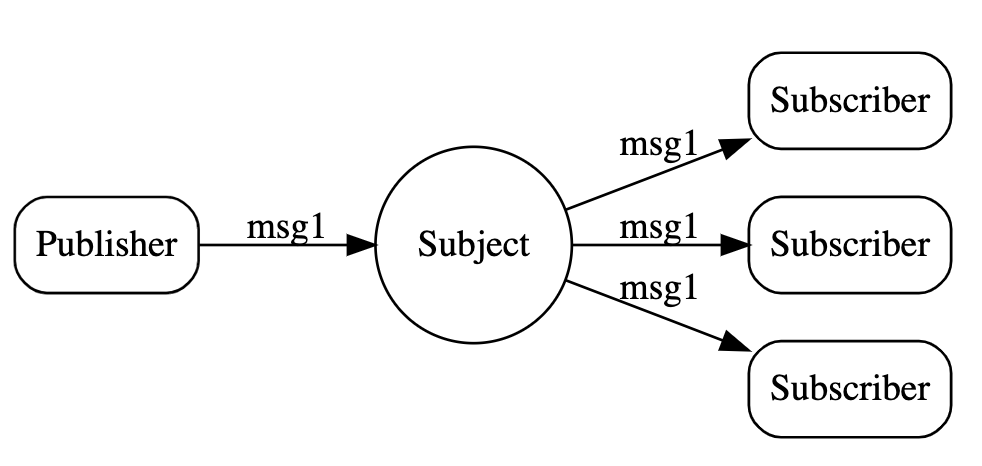
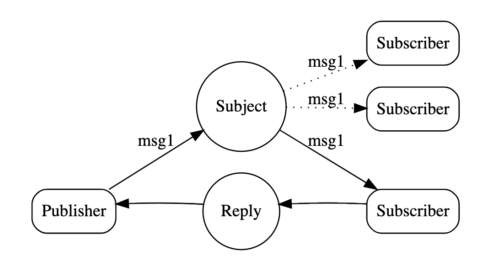
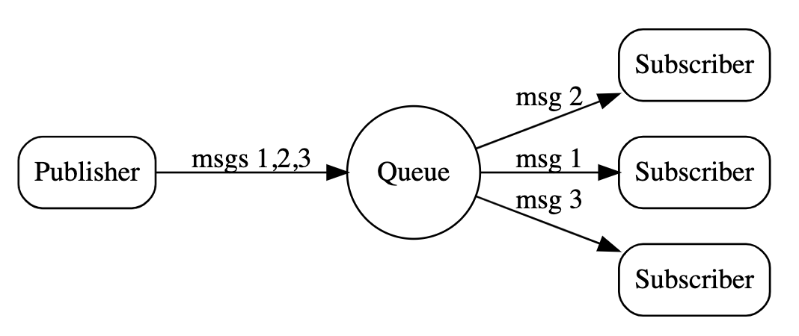

- [Materials](#materials)
- [Architecture](#architecture)
- [Use Cases](#use-cases)
  - [Publish-Subscribe](#publish-subscribe)
  - [Request-Reply](#request-reply)
  - [Queue Groups](#queue-groups)

-----

# Materials

* [nats.io](https://docs.nats.io/)
  * [Compare NATS](https://docs.nats.io/nats-concepts/overview/compare-nats)
  * [FAQ](https://docs.nats.io/reference/faq#what-is-nats)

# Architecture

> [NATS Architecture And Design @ github](https://github.com/nats-io/nats-architecture-and-design/)

# Use Cases

## Publish-Subscribe

> [Publish-Subscribe](https://docs.nats.io/nats-concepts/core-nats/pubsub)

publisher 는 msg 를 NATS 에게 보낸다.subscriber 들은 msg 를 NATS 로 부터 받는다. fan-out 이다.

## Request-Reply

> [Request-Reply](https://docs.nats.io/nats-concepts/core-nats/reqreply)

publisher 는 msg 를 NATS 에게 보낸다.subscriber 들 중 하나가 응답한다.

## Queue Groups

> [Queue Groups](https://docs.nats.io/nats-concepts/core-nats/queue)

publisher 는 msg 들을 NATS 에게 보낸다. NATS 는 subscriber 들에게 msg 를 나눠준다. 

