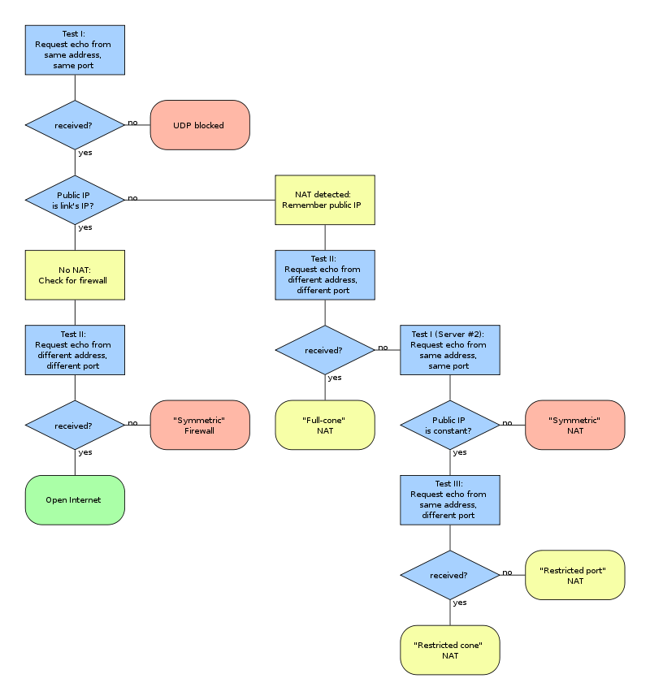

# Abstract

네트워크에 대해 정리한다.

# OSI 7 Layer


# TCP/IP Layer


# TCP transition diagram


# Packets

[protocol](https://github.com/luismartingarcia/protocol) 을 이용하여 ascii  로 출력하고 설명해본다.

## TCP

* [TCP의 흐름제어, 오류제어, 혼잡제어 개념에 대한 개요](https://roka88.dev/114)

```
 0                   1                   2                   3
 0 1 2 3 4 5 6 7 8 9 0 1 2 3 4 5 6 7 8 9 0 1 2 3 4 5 6 7 8 9 0 1
+-+-+-+-+-+-+-+-+-+-+-+-+-+-+-+-+-+-+-+-+-+-+-+-+-+-+-+-+-+-+-+-+
|          Source Port          |        Destination Port       |
+-+-+-+-+-+-+-+-+-+-+-+-+-+-+-+-+-+-+-+-+-+-+-+-+-+-+-+-+-+-+-+-+
|                        Sequence Number                        |
+-+-+-+-+-+-+-+-+-+-+-+-+-+-+-+-+-+-+-+-+-+-+-+-+-+-+-+-+-+-+-+-+
|                     Acknowledgment Number                     |
+-+-+-+-+-+-+-+-+-+-+-+-+-+-+-+-+-+-+-+-+-+-+-+-+-+-+-+-+-+-+-+-+
| Offset|  Res. |     Flags     |             Window            |
+-+-+-+-+-+-+-+-+-+-+-+-+-+-+-+-+-+-+-+-+-+-+-+-+-+-+-+-+-+-+-+-+
|            Checksum           |         Urgent Pointer        |
+-+-+-+-+-+-+-+-+-+-+-+-+-+-+-+-+-+-+-+-+-+-+-+-+-+-+-+-+-+-+-+-+
|                    Options                    |    Padding    |
+-+-+-+-+-+-+-+-+-+-+-+-+-+-+-+-+-+-+-+-+-+-+-+-+-+-+-+-+-+-+-+-+
```

## UDP

```
 0                   1                   2                   3
 0 1 2 3 4 5 6 7 8 9 0 1 2 3 4 5 6 7 8 9 0 1 2 3 4 5 6 7 8 9 0 1
+-+-+-+-+-+-+-+-+-+-+-+-+-+-+-+-+-+-+-+-+-+-+-+-+-+-+-+-+-+-+-+-+
|          Source Port          |        Destination Port       |
+-+-+-+-+-+-+-+-+-+-+-+-+-+-+-+-+-+-+-+-+-+-+-+-+-+-+-+-+-+-+-+-+
|             Length            |            Checksum           |
+-+-+-+-+-+-+-+-+-+-+-+-+-+-+-+-+-+-+-+-+-+-+-+-+-+-+-+-+-+-+-+-+
```

## IPv4

```
 0                   1                   2                   3
 0 1 2 3 4 5 6 7 8 9 0 1 2 3 4 5 6 7 8 9 0 1 2 3 4 5 6 7 8 9 0 1
+-+-+-+-+-+-+-+-+-+-+-+-+-+-+-+-+-+-+-+-+-+-+-+-+-+-+-+-+-+-+-+-+
|Version|  IHL  |Type of Service|          Total Length         |
+-+-+-+-+-+-+-+-+-+-+-+-+-+-+-+-+-+-+-+-+-+-+-+-+-+-+-+-+-+-+-+-+
|         Identification        |Flags|     Fragment Offset     |
+-+-+-+-+-+-+-+-+-+-+-+-+-+-+-+-+-+-+-+-+-+-+-+-+-+-+-+-+-+-+-+-+
|  Time to Live |    Protocol   |        Header Checksum        |
+-+-+-+-+-+-+-+-+-+-+-+-+-+-+-+-+-+-+-+-+-+-+-+-+-+-+-+-+-+-+-+-+
|                         Source Address                        |
+-+-+-+-+-+-+-+-+-+-+-+-+-+-+-+-+-+-+-+-+-+-+-+-+-+-+-+-+-+-+-+-+
|                      Destination Address                      |
+-+-+-+-+-+-+-+-+-+-+-+-+-+-+-+-+-+-+-+-+-+-+-+-+-+-+-+-+-+-+-+-+
|                    Options                    |    Padding    |
+-+-+-+-+-+-+-+-+-+-+-+-+-+-+-+-+-+-+-+-+-+-+-+-+-+-+-+-+-+-+-+-+
```

## IPv6

```
 0                   1                   2                   3
 0 1 2 3 4 5 6 7 8 9 0 1 2 3 4 5 6 7 8 9 0 1 2 3 4 5 6 7 8 9 0 1
+-+-+-+-+-+-+-+-+-+-+-+-+-+-+-+-+-+-+-+-+-+-+-+-+-+-+-+-+-+-+-+-+
|Version| Traffic Class |               Flow Label              |
+-+-+-+-+-+-+-+-+-+-+-+-+-+-+-+-+-+-+-+-+-+-+-+-+-+-+-+-+-+-+-+-+
|         Payload Length        |  Next Header  |   Hop Limit   |
+-+-+-+-+-+-+-+-+-+-+-+-+-+-+-+-+-+-+-+-+-+-+-+-+-+-+-+-+-+-+-+-+
|                                                               |
+                                                               +
|                                                               |
+                         Source Address                        +
|                                                               |
+                                                               +
|                                                               |
+-+-+-+-+-+-+-+-+-+-+-+-+-+-+-+-+-+-+-+-+-+-+-+-+-+-+-+-+-+-+-+-+
|                                                               |
+                                                               +
|                                                               |
+                       Destination Address                     +
|                                                               |
+                                                               +
|                                                               |
+-+-+-+-+-+-+-+-+-+-+-+-+-+-+-+-+-+-+-+-+-+-+-+-+-+-+-+-+-+-+-+-+
```

# IPv4 Address

32 비트로 주소를 표현한다. 따라서 4,294,967,296 (2^32) 개의 주소를 표현할 수 있다.
약 40 억개이다. 이것으로는 부족하기 때문에 IPv6 가 만들어 졌다.

Network part, Host part 로 나누어진다. 라우터는 Network part 를
이용하여 서로 다른 네트워크로 패킷을 보낸다. 같은 네트워크안에서는 Host part 를
이용하여 해당 단말기에게 패킷을 보낸다.

Network, Host 를 어떻게 나누는 가에 따라 A, B, C, D, E class 로 구분한다.
그러나 D, E class 는 아직 정의가 되어 있지 않다.

다음은 ipv4 주소의 클래스들을 나타낸 것이다.


* A 클래스는 Network (1 byte), Host (3 byte) 로 정의한다. Network 의 첫번째
  비트는 반드시 0 이다. 따라서 Network 의 숫자는 0 ~ 127 이 될 수 있다. 그러나 0
  은 예약되어 있기 때문에 1 ~ 127 을 주소로 사용한다.
* B 클래스는 Network (2 byte), Host (2 byte) 로 정의한다. Network 의 첫번째
  비트와 두번째 비트는 반드시 10 이다. 따라서 Network 의 숫자는 128 ~ 191 이 될 수 있다.
* C 클래스는 Network (3 byte), Host (1 byte) 로 정의한다. Network 의 첫번째, 두번째, 세번째 비트는 반드시 110 이다. 따라서 Network 의 숫자는 192 ~ 223 가 될 수 있다.

주소가 주어지면 클래스가 정해지고 표현가능한 단말기의 개수는 Host part 를 보고 알 수 있다. C 클래스의 주소가 주어지면 Host part 는 1 바이트 이므로 0 ~ 255 까지 256 개의 단말기를 지정할 수 있다. 그러나 0, 255 는 각각 대표 주소, broadcast 주소로 예약되어 있기 때문에 실제로는 254 개가 표현 가능하다.

그러면 하나의 패킷이 단말기 까지 전달되는 과정을 정리해본다. 
`211.168.83.1` 은 C 클래스 주소이다. Network part 는 3 byte 이기 때문에
C 클래스의 기본 마스크 `255.255.255.0` 을 적용하면 Network part `211.168.83` 를 얻어낼 수 있다. 그리고 `211.168.83` 네트워크를 관리하는 라우터에게 패킷을 보낼 수 있다.
해당 라우터는 Host Part `1` 에 해당하는 단말기에게 패킷을 보낸다.

# Subnet Mask

* [[홀인원 2.08.16] IPv4 - 서브넷 마스크](https://www.youtube.com/watch?v=o-NRjtQsJx4)

하나의 ipv4 주소가 주어지면 Network part 에 의해 하나의 Network 가 주어진다.
Host part 의 주소를 적당히 조작하여 두개 이상의 서브 네트워크를 만드는 방법이다.

예를 들어 `211.168.83.0` 으로 서브 네트워크를 만들어 보자.

```
   ipv4 dec: 211      168      83       0
   ipv4 bin: 11010011 10101000 01010011 00000000

subnet mask: 11111111 11111111 11111111 10000000
subnet mask: 11111111 11111111 11111111 11000000
```

첫번째 subnet mask 를 적용하면 subnet part 는 1 비트이므로 두개의
서브네트워크가 표현 가능하다. Host part 는 7 비트 이므로 128 개의
단말기를 표현할 수 있다. 그러나 0 과 127 은 대표, 브로드캐스트 주소
이기 때문에 실제로는 서브네트워크 하나당 126 개의 단말기를 지정할 수 있다.

두번째 subnet mask 를 적용하면 subnet part 는 2 비트이므로 네개의
서브네트워크가 표현 가능하다. Host part 는 6 비트 이므로 64 개의
단말기를 표현할 수 있다. 그러나 0 과 63 은 대표, 브로드캐스트 주소
이기 때문에 실제로는 서브네트워크 하나당 62 개의 단말기를 지정할 수 있다.

# IPv6 Address

128 bit 로 주소를 표현한다. 2 octec 을 16 진수로 표현한다.

주소가 너무 길어서 다양한 방법으로 줄여서 표기한다. 0000 을 하나의 0 으로 축약하거나 연속된 0 의 그룹을 제거한다. 따라서 다음은 모두 같은 표현이다.

```
2001:0DB8:0000:0000:0000:0000:1428:57ab
2001:0DB8:0000:0000:0000::1428:57ab
2001:0DB8:0:0:0:0:1428:57ab
2001:0DB8:0::0:1428:57ab
2001:0DB8::1428:57ab
```

또한 맨 앞자리의 0 도 줄일 수 있다.

```
2001:0DB8:02de::0e13
2001:DB8:2de::e13
```

그러나 0 을 축약하고 ':' 로 없애는 규칙은 두 번이나 그 이상은 적용할 수 없다. 예를 들어 `2001::25de::cade` 은 앞서 언급한 제한 사항이 없다면 다음중 어느것에도 해당할 수 있다.

```
2001:0000:0000:0000:0000:25de:0000:cade
2001:0000:0000:0000:25de:0000:0000:cade
2001:0000:0000:25de:0000:0000:0000:cade
2001:0000:25de:0000:0000:0000:0000:cade
```

# DNS

* [DNS란 무엇입니까? @ aws](https://aws.amazon.com/ko/route53/what-is-dns/)
  * 그림과 함께 아주 찰진 설명이다.
* [Route 53을 사용 중인 도메인에 대한 DNS 서비스로 설정 @ aws](https://docs.aws.amazon.com/ko_kr/Route53/latest/DeveloperGuide/migrate-dns-domain-in-use.html)

# NAT

NAT (Network Address Translation) 장비는 사설망과 공유망의 주소를 쌍으로 하는 매핑테이블을 가지고 있다. 사설망 혹은 공유망에서 날아온 패킷의 주소를 변환하여 전달하는 기능을 한다.
사설망의 peer 와 고유망의 peer 가 NAT 를 사이에 두고 peer2peer 통신하는 기술을 NAT Traversal 이라고 한다.

다음은 NAT 의 예이다.

- private side, public side 두 열의 정보를 이용하여 인터넷 주소를 변환한다.
- ipv4 에서 192.168.x.x, 10.x.x.x 는 private 주소로 예약되어 있다.
- 예를 들어서 A(192.168.1.3:42301)에서 N(192.168.1.1, 12.13.14.15)을 거쳐 B(40.30.20.10:80)으로 패킷을 보내자.
- NAT forwarding table 에 다음과 같은 정보가 저장된다.

| Private side  | Public side |
|:---:|:--:|
| 192.168.1.3:42301 | 12.13.14.15:24604 |

- N 은 A 혹은 B 에서 패킷을 수신할때마다 주소를 변환하여 전달한다.

## STUN

- Session Traversal Utilities for NAT
- [RFC5389](https://tools.ietf.org/html/rfc5389)
- NAT 를 활용하는 다른 프로토콜(ex. ICE)을 위한 도구로 사용될 수 있는 애플리케이션 프로토콜이다.
- RFC3489는 STUN을 NAT를 경유하는 통신을 위한 독립적인 해결책으로 기술하였지만
  폐기되었다. STUN은 일종의 helper이다.

## TURN

- Traversal Using Relays around NAT
- [RFC5766](https://tools.ietf.org/html/rfc5766)
- packet을 relay 하는 방법에 관한 애플리케이션 프로토콜이다.

## ICE

- Interactive Connectivity Establishment 
- [RFC5245](https://tools.ietf.org/html/rfc5245)
- NAT 를 이용한 호출 응답 형태의 통신을 위한 애플리케이션
  프로토콜. STUN 과 TURN 을 활용한다.
- RFC5245 는 udp 기반이다. [RFC6544](https://tools.ietf.org/html/rfc6544) 는 tcp,   udp를 위한 spec이다.

# WebRTC

* [WebRTC](/webrtc/README.md)

# UDP Hole Punching

- NAT 는 크게 Cone NAT 와 Symmetric NAT 로 분류할 수 있다.
- Cone NAT 는 Full Cone, Restricted Cone, Port Restricted Cone 으로
  분류할 수 있다.
- 다음은 NAT를 분류하는 알고리즘이다. [RFC5389(STUN)](https://en.wikipedia.org/wiki/STUN)



- 특정 port를 bind(192.168.1.3:42301)하여 소켓을 제작한 후에 udp
  패킷을 하나 NAT를 통해 remote machine에 보내면 NAT forwarding
  table에 항목이 추가되며 udp hole이 만들어진다. 추가된 내용중 public
  side(12.13.14.15:24604)로 NAT외부에서 udp packet을 보내면 앞서
  bind한 socket으로 패킷을 수신 할 수 있다. NAT에 기록된 udp hole은
  NAT종류에 따라 유지되는 시간이 다양하다.
- N1 NAT에 속한 C1과 N2 NAT에 속한 C2가 있다고 가정하자. 둘다 S에 udp
  패킷을 하나 보내면 N1, N2의 forwarding table에 S와의 관계가
  기록되면서 udp hole이 만들어 진다.  이것은 N1, N2가 S와 패킷을 주고
  받을 수 있는 hole이다. 아직 N1는 C2와 udp hole이 없기 때문에 C1은
  C2와 패킷을 주고 받을 수 없다.
- C1이 C2에 앞서 bind한 socket을 이용하여 udp packet을 하나 보내면
  N1의 forwarding table에 N2와의 관계가 기록되면서 udp hole이 추가로
  만들어 진다. C2는 N2를 통해 C1으로 udp packet을 보낼 수 있다.
  C2역시 비슷한 과정을 통해서 C1에 N1의 udp hole을 이용하여 udp
  packet을 보낼 수 있다.
- [udp hole punching at youtube](https://www.youtube.com/watch?v=s_-UCmuiYW8)
  - nc, hping3를 이용해서 udp hole punching을 하는 방법을 설명한다.
  - local computer의 public ip(l.l.l.l)를 얻어오자.
    - curl ipecho.net/plain && echo
  - local computer(l.l.l.l)에서 nc를 이용해서 수신된 udp패킷을 출력하자.
    - nc -u -l -p 12001
  - local computer에서 hping3를 이용해서 udp hole을 만들자.
    - hping3 -c 1 -2 -s 12001 -p 12003 r.r.r.r
  - remote computer에서 nc를 이용해서 udp 패킷을 송신하자.
    - local computer의 public side 포트가 12003이란 것은 어떻게 알아내지???
    - echo "udp hole" | nc -p 12003 -u l.l.l.l
  - 한번 만들어진 udp hole은 패킷왕래가 일어나지 않으면 닫혀진다.