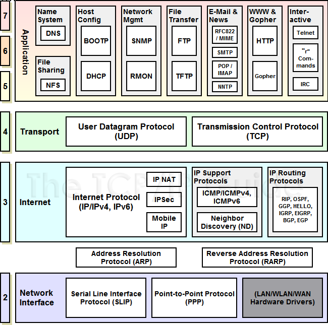

# Abstract

네트워크에 대해 정리한다.

# OSI 7 Layer


# TCP/IP Layer



# TCP transition diagram


# Packets

[protocol](https://github.com/luismartingarcia/protocol) 을 이용하여 ascii  로 출력하고 설명해본다.

## TCP

```
 0                   1                   2                   3
 0 1 2 3 4 5 6 7 8 9 0 1 2 3 4 5 6 7 8 9 0 1 2 3 4 5 6 7 8 9 0 1
+-+-+-+-+-+-+-+-+-+-+-+-+-+-+-+-+-+-+-+-+-+-+-+-+-+-+-+-+-+-+-+-+
|          Source Port          |        Destination Port       |
+-+-+-+-+-+-+-+-+-+-+-+-+-+-+-+-+-+-+-+-+-+-+-+-+-+-+-+-+-+-+-+-+
|                        Sequence Number                        |
+-+-+-+-+-+-+-+-+-+-+-+-+-+-+-+-+-+-+-+-+-+-+-+-+-+-+-+-+-+-+-+-+
|                     Acknowledgment Number                     |
+-+-+-+-+-+-+-+-+-+-+-+-+-+-+-+-+-+-+-+-+-+-+-+-+-+-+-+-+-+-+-+-+
| Offset|  Res. |     Flags     |             Window            |
+-+-+-+-+-+-+-+-+-+-+-+-+-+-+-+-+-+-+-+-+-+-+-+-+-+-+-+-+-+-+-+-+
|            Checksum           |         Urgent Pointer        |
+-+-+-+-+-+-+-+-+-+-+-+-+-+-+-+-+-+-+-+-+-+-+-+-+-+-+-+-+-+-+-+-+
|                    Options                    |    Padding    |
+-+-+-+-+-+-+-+-+-+-+-+-+-+-+-+-+-+-+-+-+-+-+-+-+-+-+-+-+-+-+-+-+
```

## UDP

```
 0                   1                   2                   3
 0 1 2 3 4 5 6 7 8 9 0 1 2 3 4 5 6 7 8 9 0 1 2 3 4 5 6 7 8 9 0 1
+-+-+-+-+-+-+-+-+-+-+-+-+-+-+-+-+-+-+-+-+-+-+-+-+-+-+-+-+-+-+-+-+
|          Source Port          |        Destination Port       |
+-+-+-+-+-+-+-+-+-+-+-+-+-+-+-+-+-+-+-+-+-+-+-+-+-+-+-+-+-+-+-+-+
|             Length            |            Checksum           |
+-+-+-+-+-+-+-+-+-+-+-+-+-+-+-+-+-+-+-+-+-+-+-+-+-+-+-+-+-+-+-+-+
```

## IPv4

```
 0                   1                   2                   3
 0 1 2 3 4 5 6 7 8 9 0 1 2 3 4 5 6 7 8 9 0 1 2 3 4 5 6 7 8 9 0 1
+-+-+-+-+-+-+-+-+-+-+-+-+-+-+-+-+-+-+-+-+-+-+-+-+-+-+-+-+-+-+-+-+
|Version|  IHL  |Type of Service|          Total Length         |
+-+-+-+-+-+-+-+-+-+-+-+-+-+-+-+-+-+-+-+-+-+-+-+-+-+-+-+-+-+-+-+-+
|         Identification        |Flags|     Fragment Offset     |
+-+-+-+-+-+-+-+-+-+-+-+-+-+-+-+-+-+-+-+-+-+-+-+-+-+-+-+-+-+-+-+-+
|  Time to Live |    Protocol   |        Header Checksum        |
+-+-+-+-+-+-+-+-+-+-+-+-+-+-+-+-+-+-+-+-+-+-+-+-+-+-+-+-+-+-+-+-+
|                         Source Address                        |
+-+-+-+-+-+-+-+-+-+-+-+-+-+-+-+-+-+-+-+-+-+-+-+-+-+-+-+-+-+-+-+-+
|                      Destination Address                      |
+-+-+-+-+-+-+-+-+-+-+-+-+-+-+-+-+-+-+-+-+-+-+-+-+-+-+-+-+-+-+-+-+
|                    Options                    |    Padding    |
+-+-+-+-+-+-+-+-+-+-+-+-+-+-+-+-+-+-+-+-+-+-+-+-+-+-+-+-+-+-+-+-+
```

## IPv6

```
 0                   1                   2                   3
 0 1 2 3 4 5 6 7 8 9 0 1 2 3 4 5 6 7 8 9 0 1 2 3 4 5 6 7 8 9 0 1
+-+-+-+-+-+-+-+-+-+-+-+-+-+-+-+-+-+-+-+-+-+-+-+-+-+-+-+-+-+-+-+-+
|Version| Traffic Class |               Flow Label              |
+-+-+-+-+-+-+-+-+-+-+-+-+-+-+-+-+-+-+-+-+-+-+-+-+-+-+-+-+-+-+-+-+
|         Payload Length        |  Next Header  |   Hop Limit   |
+-+-+-+-+-+-+-+-+-+-+-+-+-+-+-+-+-+-+-+-+-+-+-+-+-+-+-+-+-+-+-+-+
|                                                               |
+                                                               +
|                                                               |
+                         Source Address                        +
|                                                               |
+                                                               +
|                                                               |
+-+-+-+-+-+-+-+-+-+-+-+-+-+-+-+-+-+-+-+-+-+-+-+-+-+-+-+-+-+-+-+-+
|                                                               |
+                                                               +
|                                                               |
+                       Destination Address                     +
|                                                               |
+                                                               +
|                                                               |
+-+-+-+-+-+-+-+-+-+-+-+-+-+-+-+-+-+-+-+-+-+-+-+-+-+-+-+-+-+-+-+-+
```

# IPv4 Address

32 비트로 주소를 표현한다. 따라서 4,294,967,296 (2^32) 개의 주소를 표현할 수 있다.
약 40 억개이다. 이것으로는 부족하기 때문에 IPv6 가 만들어 졌다.

Network part, Host part 로 나누어진다. 라우터는 Network part 를
이용하여 서로 다른 네트워크로 패킷을 보낸다. 같은 네트워크안에서는 Host part 를
이용하여 해당 단말기에게 패킷을 보낸다.

Network, Host 를 어떻게 나누는 가에 따라 A, B, C, D, E class 로 구분한다.
그러나 D, E class 는 아직 정의가 되어 있지 않다.

다음은 ipv4 주소의 클래스들을 나타낸 것이다.


* A 클래스는 Network (1 byte), Host (3 byte) 로 정의한다. Network 의 첫번째
  비트는 반드시 0 이다. 따라서 Network 의 숫자는 0 ~ 127 이 될 수 있다. 그러나 0
  은 예약되어 있기 때문에 1 ~ 127 을 주소로 사용한다.
* B 클래스는 Network (2 byte), Host (2 byte) 로 정의한다. Network 의 첫번째
  비트와 두번째 비트는 반드시 10 이다. 따라서 Network 의 숫자는 128 ~ 191 이 될 수 있다.
* C 클래스는 Network (3 byte), Host (1 byte) 로 정의한다. Network 의 첫번째, 두번째, 세번째 비트는 반드시 110 이다. 따라서 Network 의 숫자는 192 ~ 223 가 될 수 있다.

주소가 주어지면 클래스가 정해지고 표현가능한 단말기의 개수는 Host part 를 보고 알 수 있다. C 클래스의 주소가 주어지면 Host part 는 1 바이트 이므로 0 ~ 255 까지 256 개의 단말기를 지정할 수 있다. 그러나 0, 255 는 각각 대표 주소, broadcast 주소로 예약되어 있기 때문에 실제로는 254 개가 표현 가능하다.

그러면 하나의 패킷이 단말기 까지 전달되는 과정을 정리해본다. 
`211.168.83.1` 은 C 클래스 주소이다. Network part 는 3 byte 이기 때문에
C 클래스의 기본 마스크 `255.255.255.0` 을 적용하면 Network part `211.168.83` 를 얻어낼 수 있다. 그리고 `211.168.83` 네트워크를 관리하는 라우터에게 패킷을 보낼 수 있다.
해당 라우터는 Host Part `1` 에 해당하는 단말기에게 패킷을 보낸다.

# Subnet Mask

* [[홀인원 2.08.16] IPv4 - 서브넷 마스크](https://www.youtube.com/watch?v=o-NRjtQsJx4)

하나의 ipv4 주소가 주어지면 Network part 에 의해 하나의 Network 가 주어진다.
Host part 의 주소를 적당히 조작하여 두개 이상의 서브 네트워크를 만드는 방법이다.

예를 들어 `211.168.83.0` 으로 서브 네트워크를 만들어 보자.

```
   ipv4 dec: 211      168      83       0
   ipv4 bin: 11010011 10101000 01010011 00000000

subnet mask: 11111111 11111111 11111111 10000000
subnet mask: 11111111 11111111 11111111 11000000
```

첫번째 subnet mask 를 적용하면 subnet part 는 1 비트이므로 두개의
서브네트워크가 표현 가능하다. Host part 는 7 비트 이므로 128 개의
단말기를 표현할 수 있다. 그러나 0 과 127 은 대표, 브로드캐스트 주소
이기 때문에 실제로는 서브네트워크 하나당 126 개의 단말기를 지정할 수 있다.

두번째 subnet mask 를 적용하면 subnet part 는 2 비트이므로 네개의
서브네트워크가 표현 가능하다. Host part 는 6 비트 이므로 64 개의
단말기를 표현할 수 있다. 그러나 0 과 63 은 대표, 브로드캐스트 주소
이기 때문에 실제로는 서브네트워크 하나당 62 개의 단말기를 지정할 수 있다.

# IPv6 Address

128 bit 로 주소를 표현한다.

# DNS

# NAT

* [NAT](https://ko.wikipedia.org/wiki/%EB%84%A4%ED%8A%B8%EC%9B%8C%ED%81%AC_%EC%A3%BC%EC%86%8C_%EB%B3%80%ED%99%98)

# STUN, TURN

* [STUN, TURN, ICE 이해하기](https://m.blog.naver.com/PostView.nhn?blogId=itperson&logNo=220952200651&proxyReferer=https%3A%2F%2Fwww.google.com%2F)

# WebRTC

