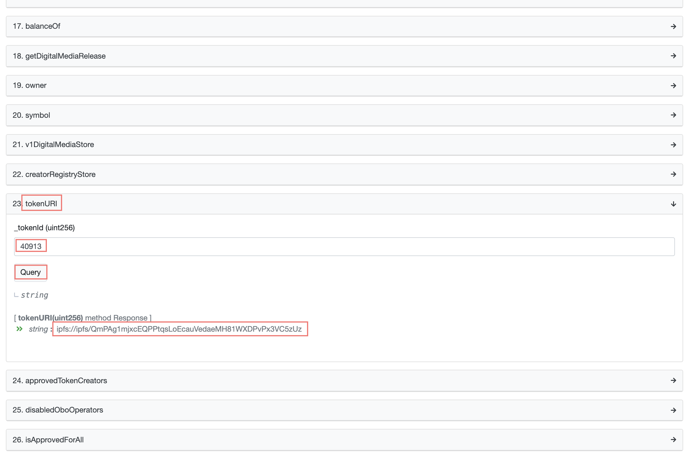

# Abstract

nft 를 정리한다.

# Materials

* [초등학생도 이해하는 NFT (Kid NFT) @ naverblog](https://blog.naver.com/amhoin/222565621758)

# Basic

NFT는 다음과 같이 3 가지로 구분된다.

* NFT 미디어 데이터(NFT Media Data)
* NFT 메타데이터(NFT Metadata)
* NFT 스마트 컨트랙트(NFT Smart Contract)

NFT Smart Contract 는 Block Chain 에 저장되고 나머지는 IPFS (inter-planetary file system) 에 저장된다. InterPlanetary File System (IPFS) 는 Distributed File System 이다. Media Data 는 그 크기가 크기 때문에 Block 에 저장하기에는 무리가 있다. 

이제 [Beeple | The First 5000 Days](https://onlineonly.christies.com/s/beeple-first-5000-days/beeple-b-1981-1/112924) 의 NFT 실체를 직접 찾아보자.

Detail section 에 다음과 같이 적혀 있다.

```
Beeple (b. 1981)
EVERYDAYS: THE FIRST 5000 DAYS
token ID: 40913
wallet address: 0xc6b0562605D35eE710138402B878ffe6F2E23807
smart contract address: 0x2a46f2ffd99e19a89476e2f62270e0a35bbf0756
non-fungible token (jpg)
21,069 x 21,069 pixels (319,168,313 bytes)
Minted on 16 February 2021. This work is unique.
```

Smart contract address 는 `0x2a46f2ffd99e19a89476e2f62270e0a35bbf0756` 이다. 이것을 [EtherScan](https://etherscan.io/address/0x2a46f2ffd99e19a89476e2f62270e0a35bbf0756) 에서 검색한다. Tracker 항목의 **MarkersTokenV2** 를 선택한다.

[EtherScan Token](https://etherscan.io/token/0x2a46f2ffd99e19a89476e2f62270e0a35bbf0756) 에서 Contract 탭을 선택하면 **Smart Contract** 를 확인할 수 있다. 여기서 tokenURI 에 "token ID" 40913 을 입력하고 Query 를 선택하자. token uri 를 확인할 수 있다. token uri 는 `ipfs://ipfs/QmPAg1mjxcEQPPtqsLoEcauVedaeMH81WXDPvPx3VC5zUz` 이다.



[IPFS Desktop](https://docs.ipfs.io/install/ipfs-desktop/#macos) 에서 IPFS Desktop 을 다운받고 설치한다.

IPFS Desktop 을 실행후 검색창에 `QmPAg1mjxcEQPPtqsLoEcauVedaeMH81WXDPvPx3VC5zUz` 입력한다. 다음과 같은 NFT Meta Data 를 얻을 수 있다. NFT Meta Data 는 NFT Media Data 의 HTTPS URL 를 포함한다. 

```json
{
   "title":"EVERYDAYS: THE FIRST 5000 DAYS",
   "name":"EVERYDAYS: THE FIRST 5000 DAYS",
   "type":"object",
   "imageUrl":"https://ipfsgateway.makersplace.com/ipfs/QmZ15eQX8FPjfrtdX3QYbrhZxJpbLpvDpsgb2p3VEH8Bqq",
   "description":"I made a picture from start to finish every single day from May 1st, 2007 - January 7th, 2021.  This is every motherfucking one of those pictures.",
   "attributes":[
      {
         "trait_type":"Creator",
         "value":"beeple"
      }
   ],
   "properties":{
      "name":{
         "type":"string",
         "description":"EVERYDAYS: THE FIRST 5000 DAYS"
      },
      "description":{
         "type":"string",
         "description":"I made a picture from start to finish every single day from May 1st, 2007 - January 7th, 2021.  This is every motherfucking one of those pictures."
      },
      "preview_media_file":{
         "type":"string",
         "description":"https://ipfsgateway.makersplace.com/ipfs/QmZ15eQX8FPjfrtdX3QYbrhZxJpbLpvDpsgb2p3VEH8Bqq"
      },
      "preview_media_file_type":{
         "type":"string",
         "description":"jpg"
      },
      "created_at":{
         "type":"datetime",
         "description":"2021-02-16T00:07:31.674688+00:00"
      },
      "total_supply":{
         "type":"int",
         "description":1
      },
      "digital_media_signature_type":{
         "type":"string",
         "description":"SHA-256"
      },
      "digital_media_signature":{
         "type":"string",
         "description":"6314b55cc6ff34f67a18e1ccc977234b803f7a5497b94f1f994ac9d1b896a017"
      },
      "raw_media_file":{
         "type":"string",
         "description":"https://ipfsgateway.makersplace.com/ipfs/QmXkxpwAHCtDXbbZHUwqtFucG1RMS6T87vi1CdvadfL7qA"
      }
   }
}
```

`https://ipfsgateway.makersplace.com/ipfs/QmZ15eQX8FPjfrtdX3QYbrhZxJpbLpvDpsgb2p3VEH8Bqq` 가 NFT Media Data 를 확인할 수 있는 https url 이다.
