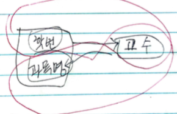
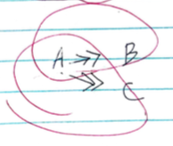

- [Abstraction](#abstraction)
- [Materials](#materials)
- [Overview](#overview)
- [Original table](#original-table)
- [1 NF](#1-nf)
- [2 NF](#2-nf)
- [3 NF](#3-nf)
- [BCNF](#bcnf)
- [4 NF](#4-nf)
- [5 NF](#5-nf)

-----

# Abstraction

정규화를 정리한다.

# Materials

* [10. Data Normalization | udemy](https://www.udemy.com/course/dynamodb/learn/lecture/10119810#overview)

# Overview

정규화는 입력, 삭제, 수정 이상이 발생하지 않도록 테이블을 쪼개는 것이다. 다음과
같은 종류가 있다. 일반적으로 `1NF` 부터 `3NF` 까지만 적용한다. 

* 1 NF
  * Eliminates repeating groups
* 2 NF
  * Eliminates redundant data
* 3 NF
  * Eliminates columns that are not dependent on Key
* BCNF
  * 결정자이면서 후보키가 아닌 것 제거??
* 4 NF
  * 다치 종속 제거??
* 5 NF
  * 조인 종속성 이용??

# Original table

다음은 Students 테이블이다.

| StudentId | DeptId | SPOC | Subject1 | Subject2 | Subject2 |
|:---|:----|:---|:---|:----|:---|
| 1 | M01 | John | Physics | Chemistry | Math |
| 2 | B01 | Tom | History | Geography | Economics |

# 1 NF

1 NF 를 적용하여 repeating group 을 제거하자. 다음은 Students 테이블이다.

| StudentId | DeptId | SPOC | Subject |
|:---|:----|:---|:---|
| 1 | M01 | John | Physics |
| 1 | M01 | John | Chemistry |
| 1 | M01 | John | Math |
| 2 | B01 | Tom | History |
| 2 | B01 | Tom | Geography |
| 2 | B01 | Tom | Economics |

`StudentId == 1` 인 row 가 3 개 존재한다. redundant data 가 발생했다.

# 2 NF

2 NF 를 적용하여 redundant data 를 제거하자. 
다음은 Sutdents, Subject 테이블이다.

| StudentId | DeptId | SPOC |
|:---|:----|:---|
| 1 | M01 | John |
| 2 | B01 | Tom |

| StudentId | Subject |
|---|---|
| 1 | Physics |
| 1 | Chemistry |
| 1 | Math |
| 2 | History |
| 2 | Geography |
| 2 | Economics |

Students 테이블에서 SPOC 는 StudentId 에 종속적이지 않다.

# 3 NF

3 NF 를 적용하여 SPOC 은 DeptID 에 종속되도록 하자.
다음은 Students, Departments, Subjects 테이블이다.

| StudentId | DeptId |
|:---|:----|
| 1 | M01 |
| 2 | B01 |

| DeptId | SPOC |
| M01 | John |
| B01 | Tom |

| StudentId | Subject |
|---|---|
| 1 | Physics |
| 1 | Chemistry |
| 1 | Math |
| 2 | History |
| 2 | Geography |
| 2 | Economics |

# BCNF

3.5NF 혹은 강한 제3정규형이라고 한다. Raymond F. Boyce 와 Edgar F. Codd 가
만들었다. 일반적으로 BNF abnormal 은 발생하지 않는다. 그래도 억지로 예를 들어 설명해 본다.

다음과 같이 `학번, 과목명` 키를 갖는 수강과목 테이블이 있다. `학번, 과목명` 키에 의해
`교수` 가 결정된다. 복수값이 없기 때문에 1NF 를 만족한다. 부분적 종속성이 없기 때문에 2NF 를 만족한다.
이행적 종속성이 없기 때문에 3NF 도 만족한다. 

| _학번_ | _과목명_ | 교수 |
|:--------|:-----|:----|
| 100 | 데이터베이스 | P01 |
| 100 | 자료구조 | P02 |
| 200 | 데이터베이스 | P01 |
| 200 | 자료구조 | P03 |
| 300 | 자료구조 | P03 |
| 300 | 데이터베이스 | P04 |

그러나 각 교수는 한 과목만 강의할 수 있고, 각 과목은 여러 교수들에 의해 강의될 수 있다고 해보자.

그렇다면 일반 속성중 `교수` 에 의해 과목명이 결정된다. 결정자인 `교수` 는 후보키가 아니기 때문에
BCNF 를 만족하지 않는다. 

따라서 이것을 `학번, 교수` 속성을 갖는 `수강교수` 테이블과
`교수, 과목명` 을 갖는 `과목교수` 테이블로 분리한다.

| _학번_ | 교수 |
|:--------|:----|
| 100 | P01 |
| 100 | P02 |
| 200 | P01 |
| 200 | P03 |
| 300 | P03 |
| 300 | P04 |

| _교수_ | _과목명_ |
|:--------|:-----|
| P01 | 데이터베이스 |
| P02 | 자료구조 |
| P03 | 데이터베이스 |
| P04 | 자료구조 |

일반적인 경우 `학번` 이 듣는 `과목` 과 `교수` 가 가르치는 `과목` 을 하나의
테이블에 설계하는 경우는 거의 없을 것이다.

# 4 NF

A 속성에 대응되는 B 속성이 집합으로 나올 때 다치종속 (MVD) 이 있다고 하고
`{A ->> B}` 라고 표현한다. 그런데 `{A ->> C}` 이면 테이블을 분리하여
4NF 를 만족해야 한다. 

예를 들어 다음과 같은 `과목` 테이블을 살펴보자.

| _과목_ | 교재 | 교수 |
|:----|:----|:----|
| 데이터베이스 | DB 개론 | 유수 |
| 데이터베이스 | 데이터베이스튜닝 | 유수 |
| 데이터베이스 | DB 개론 | 장동건 |
| 데이터베이스 | 데이터베이스튜닝 | 장동건 |
| 데이터베이스 | DB 개론 | 김태희 |
| 데이터베이스 | 데이터베이스튜닝 | 김태희 |
| 운영체제 | 운영체제론 | 유수 |
| 운영체제 | 운영체제론 | 한가인 |

`과목` 이 `DB 개론, 데이터베이스 튜닝` 처럼 여러개의 `교재` 들을 결정할 수 있다.
즉 `{과목 ->> 교재}` 이다. 한편 `과목` 이 `유수, 장동건, 김태희` 처럼
여러개의 `교수` 들을 결정할 수 있다. 즉 `{과목 ->> 교수}` 이다. 따라서
위의 테이블은 `{과목 ->> 교재 | 교수}` 이다. 

다음과 같이 4NF 를 적용하여 `교재, 교수` 테이블로 분리한다.

| 과목 | 교재 |
|:----|:----|
| 데이터베이스 | DB 개론 |
| 데이터베이스 | 데이터베이스 튜닝 |
| 운영체제 | 운영체제론 |

 `교재` 테이블은 `{과목 ->> 교재}` 이다.

| 과목 | 교수 |
|:----|:----|
| 데이터베이스 | 유수 |
| 데이터베이스 | 장동건 |
| 데이터베이스 | 김태희 |
| 운영체제 | 유수 |
| 운영체제 | 한가인 |

 `교수` 테이블은 `{과목 ->> 교수}` 이다.

# 5 NF

하나의 테이블을 두개의 테이블로 정규화하고 다시 조인하면 원래의 테이블과 같아야 한다.
그렇지 않은 경우 5NF 이상 이라고 한다.

5NF 를 적용하여 세개의 테이블로 정규화한다.

예를 들어 다음의 테이블을 살펴보자.

| Sk | Pk | Ck |
|:---|:---|:---|
| S1 | P1 | C2 |
| S1 | P2 | C1 |
| S2 | P1 | C1 |
| S1 | P1 | C1 |

위의 테이블을 다음과 같이 두개의 테이블로 정규화 한다.

| Sk | Pk |
|:---|:---|
| S1 | P1 |
| S1 | P2 |
| S2 | P1 |

| Pk | Ck |
|:---|:---|
| P1 | C2 |
| P2 | C1 |
| P1 | C1 |

위의 두 테이블을 다시 조인 하자. `S2, P1, C2` 가 원래의 테이블과 다르다.

| Sk | Pk | Ck |
|:---|:---|:---|
| S1 | P1 | C2 |
| S1 | P1 | C1 |
| S1 | P2 | C1 |
| *S2* | *P1* | *C2* |
| S2 | P1 | C1 |

다음과 같이 세개의 테이블로 정규화 하자. 이것들을 조인하면 원래의 테이블과 같다.

| Sk | Pk |
|:---|:---|
| S1 | P1 |
| S1 | P2 |
| S2 | P1 |

| Pk | Ck |
|:---|:---|
| P1 | C2 |
| P2 | C1 |
| P1 | C1 |

| Sk | Ck |
|:---|:---|
| S1 | C2 |
| S1 | C1 |
| S2 | C1 |
