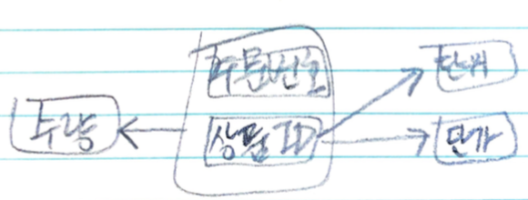
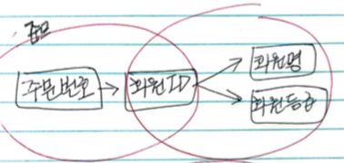

# Abstraction

정규화를 정리한다.

# Overview

정규화는 입력, 삭제, 수정 이상이 발생하지 않도록 테이블을 쪼개는 것이다. 다음과 같은 종류가 있다. 일반적으로 `1NF` 부터 `3NF` 까지만 적용한다. 

* 1 NF
  * 도메인이 원자값
* 2 NF
  * 부분 함수종속성 제거
* 3 NF
  * 이행적 함수종속 제거
* BCNF
  * 결정자이면서 후보키가 아닌 것 제거 
* 4 NF
  * 다치 종속 제거
* 5 NF
  * 조인 종속성 이용

# 1 NF

릴레이션에 속한 모든 도메인이 원자값만으로 되어있는 릴레이션이다. 무슨 말인지 모르겠다.

허그 다윈과 크리스토퍼 J. 데이트는 에드거 F. 커드의 "원자성을 갖는 값"의 정의가 모호하며, 이런 모호성이 1NF 를 이해하는데 크게 방해된다고 하였다.

크리스토퍼 J. 데이트는 1 정규형을 다음과 같이 정의하였다.
[참고](https://www.youtube.com/watch?v=RXQ1kZ_JHqg&list=PLimVTOIIZt2aP6msQIw0011mfVP-oJGab&index=6)

* 열에는 위-아래의 순서가 없다.
* 행에는 좌-우의 순서가 없다.
* 중복되는 열이 없다. (학번 속성이 2 개이상이다.)
* 모든 열과 행의 중복지점에는 (열과 행의) 해당되는 분야에서 한 개의 값을 가진다.
* 모든 행은 규칙적이다.

다음은 1NF 적용전의 주문 테이블이다. 상품ID, 단위, 수량, 단가 속성의 값들이 한개가 아닌 여러개의 값을 갖는다.

| 주문번호 | 주문일 | 회원ID | 회원명 | 회원등급 | 상품ID | 단위 | 수량 | 단가 |
|:---|:----|:---|:---|:----|:---|:---|:----|:---|
| 2301 | 20150614 | HONG | 홍진경 | 일반 | H360 J142 K101 | NET PACKET 3-PACK | 20 320 16 | 25600 65400 32500 |
| 2302 | 20150615 | SONG | 송혜교 | 우수 | A101 | 6-PACK | 8 | 24200 |
| 2303 | 20150616 | PARK | 박보영 | 일반 | H011 R301 | PACKET COVER | 10 8 | 65100 12900 |

다음은 1NF 적용후의 주문, 주문상세 테이블이다.

| 주문번호 | 주문일 | 회원ID | 회원명 | 회원등급 |
|:---|:----|:---|:---|:----|
| 2301 | 20150614 | HONG | 홍진경 | 일반 |
| 2302 | 20150615 | SONG | 송혜교 | 우수 |
| 2303 | 20150616 | PARK | 박보영 | 일반 |

| 주문번호 | 상품ID | 단위 | 수량 | 단가 |
|:------|:---|:---|:----|:---|
| 2301 | H360  |  3-PACK | 20 | 25600 |
| 2301 | J142 | NET |  320 | 65400 |
| 2301 | K101 | PACKET | 16 | 32500 |
| 2302 | A101 | 6-PACK | 8 | 24200 |
| 2303 | H011 | PACKET COVER | 8 | 12900 |
| 2303 | R301 | COVER | 8 | 12900 |

주문 상세 테이블을 살펴보자. `주문번호, 상품ID` 가 
키이다. 그런데 수량은 `주문번호, 상품ID` 에 따라 값이 다르다.
그러나 `단위, 단가` 는 `상품ID` 에 따라 값이 다르다. 이것을 부분함수 종속성이
발생했다고 한다. 부분함수 종속성을 제거하여 완전함수 종속성을 갖는 테이블들로
분리하는 것이 2NF 이다.

# 2 NF

부분함수 종속성을 제거하여 완전함수 종속성을 갖는 테이블들로
분리하는 것이 2NF 이다.
1NF 의 주문 상세 테이블에 2NF 를 적용하면 `상품ID` 키에 종속인 단위, 단가 속성을 갖는 상품  테이블과 `주문번호, 상품ID` 키에 종속인 `수량` 속성을 갖는 주문상세 테이블로 정규화 할 수 있다.

| 상품ID | 단위 |단가 |
|:---|:---|:----|
| H360  |  3-PACK | 25600 |
| J142 | NET | 65400 |
| K101 | PACKET | 32500 |
| A101 | 6-PACK | 24200 |
| H011 | PACKET COVER | 12900 |
| R301 | COVER | 12900 |

| 주문번호 | 상품ID | 수량 |
|:---|:----|:---|
| 2301 | H360  | 20 |
| 2301 | J142 | 320 |
| 2301 | K101 | 16  |
| 2302 | A101 | 8 |
| 2303 | H011 | 8 |
| 2303 | R301 | 8 |

앞서 1NF 를 적용한 주문 테이블을 살펴보자.

| 주문번호 | 주문일 | 회원ID | 회원명 | 회원등급 |
|:---|:----|:---|:---|:----|
| 2301 | 20150614 | HONG | 홍진경 | 일반 |
| 2302 | 20150615 | SONG | 송혜교 | 우수 |
| 2303 | 20150616 | PARK | 박보영 | 일반 |

키는 주문번호이다. 주문번호가 결정되면 회원ID 를 알 수 있다. 회원ID 를 알면 
회원명과 회원등급을 알 수 있다. 결국 주문번호를 알면 `회원ID, 회원명` 을
알 수 있고 이것을 이행적 종속성이라고 한다. 이것을 제거하려면
`주문번호, 회원ID` 를 포함한 테이블과 `회원ID, 회원명, 회원등급`
을 포함한 테이블로 분리해야 한다. 이행적 종속성을 제거하기 위해
테이블을 분리하는 것을 3NF 라고 한다.

# 3 NF

이행적 종속성을 제거하기 위해
테이블을 분리하는 것을 3NF 라고 한다. 다음은 앞서 언급한 주문 테이블에
3NF 를 적용하여 이행적 종속성을 분리한 회원, 주문 테이블이다.

| _회원ID_ | 회원명 | 회원등급 |
|:---|:---|:----|
| HONG | 홍진경 | 일반 |
| SONG | 송혜교 | 우수 |
| PARK | 박보영 | 일반 |

| 주문번호 | 회원ID | 주문일 | 
|:---|:----|:---|
| 2301 | HONG | 20150614 |
| 2302 | SONG | 20150615 |
| 2303 | PARK | 20150616 |

# BCNF

3.5NF 혹은 강한 제3정규형이라고 한다. Raymond F. Boyce 와 Edgar F. Codd 가
만들었다. 일반적으로 BNF abnormal 은 발생하지 않는다. 그래도 억지로 예를 들어 설명해 본다.

다음과 같이 `학번, 과목명` 키를 갖는 수강과목 테이블이 있다. `학번, 과목명` 키에 의해
`교수` 가 결정된다. 복수값이 없기 때문에 1NF 를 만족한다. 부분적 종속성이 없기 때문에 2NF 를 만족한다.
이행적 종속성이 없기 때문에 3NF 도 만족한다. 

| _학번_ | _과목명_ | 교수 |
|:--------|:-----|:----|
| 100 | 데이터베이스 | P01 |
| 100 | 자료구조 | P02 |
| 200 | 데이터베이스 | P01 |
| 200 | 자료구조 | P03 |
| 300 | 자료구조 | P03 |
| 300 | 데이터베이스 | P04 |

그러나 각 교수는 한 과목만 강의할 수 있고, 각 과목은 여러 교수들에 의해 강의될 수 있다고 해보자.

그렇다면 일반 속성중 `교수` 에 의해 과목명이 결정된다. 결정자인 `교수` 는 후보키가 아니기 때문에
BCNF 를 만족하지 않는다. 

따라서 이것을 `학번, 교수` 속성을 갖는 `수강교수` 테이블과
`교수, 과목명` 을 갖는 `과목교수` 테이블로 분리한다.

| _학번_ | 교수 |
|:--------|:----|
| 100 | P01 |
| 100 | P02 |
| 200 | P01 |
| 200 | P03 |
| 300 | P03 |
| 300 | P04 |

| _교수_ | _과목명_ |
|:--------|:-----|
| P01 | 데이터베이스 |
| P02 | 자료구조 |
| P03 | 데이터베이스 |
| P04 | 자료구조 |

일반적인 경우 `학번` 이 듣는 `과목` 과 `교수` 가 가르치는 `과목` 을 하나의
테이블에 설계하는 경우는 거의 없을 것이다.

# 4 NF

A 속성에 대응되는 B 속성이 집합으로 나올 때 다치종속 (MVD) 이 있다고 하고
`{A ->> B}` 라고 표현한다. 그런데 `{A ->> C}` 이면 테이블을 분리하여
4NF 를 만족해야 한다. 

예를 들어 다음과 같은 `과목` 테이블을 살펴보자.

| _과목_ | 교재 | 교수 |
|:----|:----|:----|
| 데이터베이스 | DB 개론 | 유수 |
| 데이터베이스 | 데이터베이스튜닝 | 유수 |
| 데이터베이스 | DB 개론 | 장동건 |
| 데이터베이스 | 데이터베이스튜닝 | 장동건 |
| 데이터베이스 | DB 개론 | 김태희 |
| 데이터베이스 | 데이터베이스튜닝 | 김태희 |
| 운영체제 | 운영체제론 | 유수 |
| 운영체제 | 운영체제론 | 한가인 |

`과목` 이 `DB 개론, 데이터베이스 튜닝` 처럼 여러개의 `교재` 들을 결정할 수 있다.
즉 `{과목 ->> 교재}` 이다. 한편 `과목` 이 `유수, 장동건, 김태희` 처럼
여러개의 `교수` 들을 결정할 수 있다. 즉 `{과목 ->> 교수}` 이다. 따라서
위의 테이블은 `{과목 ->> 교재 | 교수}` 이다. 

다음과 같이 4NF 를 적용하여 `교재, 교수` 테이블로 분리한다.

| 과목 | 교재 |
|:----|:----|
| 데이터베이스 | DB 개론 |
| 데이터베이스 | 데이터베이스 튜닝 |
| 운영체제 | 운영체제론 |

 `교재` 테이블은 `{과목 ->> 교재}` 이다.

| 과목 | 교수 |
|:----|:----|
| 데이터베이스 | 유수 |
| 데이터베이스 | 장동건 |
| 데이터베이스 | 김태희 |
| 운영체제 | 유수 |
| 운영체제 | 한가인 |

 `교수` 테이블은 `{과목 ->> 교수}` 이다.

# 5 NF

하나의 테이블을 두개의 테이블로 정규화하고 다시 조인하면 원래의 테이블과 같아야 한다.
그렇지 않은 경우 5NF 이상 이라고 한다.

5NF 를 적용하여 세개의 테이블로 정규화한다.

예를 들어 다음의 테이블을 살펴보자.

| Sk | Pk | Ck |
|:---|:---|:---|
| S1 | P1 | C2 |
| S1 | P2 | C1 |
| S2 | P1 | C1 |
| S1 | P1 | C1 |

위의 테이블을 다음과 같이 두개의 테이블로 정규화 한다.

| Sk | Pk |
|:---|:---|
| S1 | P1 |
| S1 | P2 |
| S2 | P1 |

| Pk | Ck |
|:---|:---|
| P1 | C2 |
| P2 | C1 |
| P1 | C1 |

위의 두 테이블을 다시 조인 하자. `S2, P1, C2` 가 원래의 테이블과 다르다.

| Sk | Pk | Ck |
|:---|:---|:---|
| S1 | P1 | C2 |
| S1 | P1 | C1 |
| S1 | P2 | C1 |
| *S2* | *P1* | *C2* |
| S2 | P1 | C1 |

다음과 같이 세개의 테이블로 정규화 하자. 이것들을 조인하면 원래의 테이블과 같다.

| Sk | Pk |
|:---|:---|
| S1 | P1 |
| S1 | P2 |
| S2 | P1 |

| Pk | Ck |
|:---|:---|
| P1 | C2 |
| P2 | C1 |
| P1 | C1 |

| Sk | Ck |
|:---|:---|
| S1 | C2 |
| S1 | C1 |
| S2 | C1 |