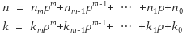
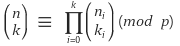

# Abstract

정수론에 대해 정리해본다.

# Contents

* [Learning Materials](#learning-materials)
* [서로소](#서로소-coprime)
* [유클리드 알고리즘](#유클리드-알고리즘-euclidean-algorithm)
* [최대공약수와 유클리드 호제법](#최대공약수와-유클리드-호제법-gcd-and-eclidean-algorithm)
* [디오판틴 방정식](#디오판틴-방정식-diophantine-equation)
* [합동과 법](#합동과-법-congruence-and-modular)
* [오일러의 Φ 함수](#오일러의-Φ-함수-eulers-Φ-function)
* [오일러의 정리](#오일러의-정리-eulers-theorem)
* [윌슨의 정리](#윌슨의-정리-wilsons-theorem)
* [페르마의 소정리](#페르마의-소정리-fermas-little-theorem)
* [베주의 정의](#베주의-정의-bezouts-identity)
* [확장 유클리드 알고리즘](#확장-유클리드-알고리즘-extended-euclidean-algorithm)
* [중국인의 나머지 정리](#중국인-나머지-정리-chinese-remainders-theorem)
* [뤼카의 정리](#뤼카의-정리-lucas-theorem)
* [나머지 연산에 대한 곱셈의 엮원](#나머지-곱셈의-역원-modular-multiplicative-inverse)

# Learning Materials

* [KMO BIBLE 한국수학올림피아드 바이블 프리미엄 1 정수론](http://www.yes24.com/24/Goods/12554932?Acode=101)
* [정수론 @ qstudy](http://www.qstudy.kr/?m=234)

# 서로소 (coprime)

## 정의

공약수가 1뿐인 두정수의 관계이다.
gcd(a, b) = 1일때 a, b는 서로소이다.

## 예

`gcd(2, 3) = 1` 이므로 2, 3은 서로소이다.

# 유클리드 알고리즘 (Euclidean algorithm)

## 정의

```
a = bq + r 이면 gcd(a, b) = gcd(b, r)
```

## 예

```
49 = 28 x 1 + 21 
gcd(49, 28) = gcd(28, 21)
```

## 증명

```
p = p'g, q = q'g (p >= q, p'와 q'는 서로소, g는 최대공약수)
p = qa + r
p'g = q'ga + r
r = g(p' - q'a) (q와 r의 최대공약수가 g가 되려면 q'과 p'-q'a가 서로소이면 된다.)
귀류법을 이용해서 증명해보자.
q'과 p' - q'a가 서로소가 아니라면
q' = xG, p'-q'a = yG (G != 1)라고 할 수 있다.
p' - xGa = yG
p' = (y +xa)G
p'과 q'는 G때문에 서로소가 아니다. 이것은 p'과 q'는 서로소 라는 것에 모순이다.
따라서 q'과 p' - q'a는 서로소이다.
p와 q의 최대 공약수는 q와 r의 최대 공약수와 같다.
```

# 최대공약수와 유클리드 호제법 (GCD and Eclidean algorithm)

알고리즘 구현은 다음을 참고하자.

[유클리드 알고리즘 @ TIL](https://github.com/iamslash/learntocode/blob/master/doc/number_euclidean.md)

## 정의

호제법은 번갈아가면 제거하는 방법을 의미한다. 유클리드 호제법은
유클리드 알고리즘을 나머지가 0일때 까지 반복적으로 사용하여
최대공약수로 구하는 방법이다.

## 예

```
1020과 790의 최대공약수를 구하라

gcd(1020, 790)    1020 = 1 x 790 + 230
gcd(790, 230)      790 = 3 x 230 + 100
gcd(230, 100)      230 = 2 x 100 + 30
gcd(100, 30)       100 = 3 x 30 + 10
gcd(30, 10)         30 = 3 x 10 + 0
```

# 디오판틴 방정식 (diophantine equation)

## 정의

미지수를 정수에 한해서만 한정하여 생각하는 부정방정식
예를 들어 다음과 같은 것들은 디오판틴 방정식에 해당한다.


## 예

```
x + y = xy 를 만족하는 정수해의 순서쌍 (x, y)를 모두 구하라.
```

# 합동과 법 (congruence and modular)

## 정의

[합동식 @ 나무위키](https://namu.wiki/w/%ED%95%A9%EB%8F%99%EC%8B%9D)

```
정수 a, b, m에 대하여 m | (a - b)일때 a는 법 m에 대하여 b와 합동이다.
a is congruent to b modulo m
기호로 a ≡ b(mod m)라고 표현한다.
```

## 예

```
7 ≡ 1 (mod 3)
7 ≡ -2 (mod 3)
```

# 오일러의 Φ 함수 (Euler's Φ function)

## 정의

```
φ(n) 는 1부터 n까지의 정수중 n과 서로소인 정수의 개수

lema)
p가 소수일때 φ(p) = p - 1이다.
```

## 예

```
φ(2) = 1
  1,2중에 2와 서로소인 수는 1 모두 1개이다.
φ(6) = 2
  1,2,3,4,5,6중에 6과 서로소인 수는 1,5 모두 2개이다.
φ(7) = 6
  1,2,3,4,5,6,7중에 7과 서로소인 수는 1,2,3,4,5,6 모두 6개이다.
```

# 오일러의 정리 (Euler's theorem)

## 정의

대표적인 공개키 암호화 방식중 하나인 RSA의 가장 중요한 이론이 되는
정리로써 페르마의 소정리를 일반화 한 것이다.

```
a와 p이 서로소인 양의 정수 일때
a^{φ(p)} ≡ 1 (mod p)
```

## 예

```
7^{2016}의 마지막 세자리수를 구하라

φ(1000) = 400
7^{400} ≡ 1 (mod 1000)
7^{2016} ≡ (7^{400})^{5} x 7^{16} (mod 1000)
7^{16}을 1000으로 나눈 나머지가 답이다.
```

# 윌슨의 정리 (wilson's theorem)

## 정의

[참고](https://namu.wiki/w/%EC%9C%8C%EC%8A%A8%EC%9D%98%20%EC%A0%95%EB%A6%AC)

```
p가 소수일때 (p - 1)! ≡ -1 (mod p)가 성립한다. 그 역도 성립한다.
```

## 예

```
17! 을 19로 나눈 나머지를 구해보자. 윌슨의 정리에 의해
(19 - 1)! ≡ -1 (mod 19)
18! ≡ -1 (mod 19)
18 ≡ -1 (mod 19)
18 x 17! ≡ -1 x 17! (mod 19)
따라서 17! ≡ 1 (mod 19)
```

# 페르마의 소정리 (Ferma's little theorem)

## 정의

```
p가 소수이고 a와 p가 서로소(gcd(a, p) = 1)인 정수일때
a^{p-1} ≡ 1 (mod p)
```

## 예

```
8^{41-1} ≡ 1 (mod 41)
```

# 베주의 정의 (Bezout's identity)

## 정의

```
동시에 0이 아닌 두 정수 a, b에 대하여 ax + by = gcd(a, b)를 만족하는
정수 x, y가 존재한다.
```

# 확장 유클리드 알고리즘 (extended euclidean algorithm)

알고리즘 구현은 다음을 참고하자.

[확장 유클리드 알고리즘 @ TIL](https://github.com/iamslash/learntocode/blob/master/doc/number_ex_euclidean.md)

## 정의

베주의 정의 (bezout's identity) ax + by = gcd(a, b)의 해 (x, y)
를 구하는 방법이다.

```
gcd(a, b)   = gcd(b, a%b)

gcd(a, b)   = ax + by 

gcd(b, a%b) = b * x_{1} + a%b * y_{1}
            = b * x_{1} + (a - a/b*b) * y_{1}
            = a * y_{1} + b (x_{1} - a/b*b*Y_{1})
            
ax + by     = a * y_{1} + b (x_{1} - a/b*b*Y_{1})

x = y_{1}                                -----(1)
y = x_{1} - a/b*b*Y_{1}                  -----(2)

gcd(a, b) 는 gcd(?, 0)까지 재귀할 것이다.
gcd(?, 0) = ? * 1 + 0 * 0 이라고 할 수 있다.
이때 x_{1} = 1, y_{1} = 0이다.              ----(3)
```

## 예

```
(I), (II), (III)을 이용하여 다음과 같이
1020x + 790y = gcd(1020, 790)을 만족하는 x, y
를 구해보자.

| gcd             | 1st stage          | 2nd stage                                 | val |
|-----------------|:------------------:|------------------------------------------:|:---:|
| gcd(1020, 790)  | 1020 * x + 790 * y | 1020 * -24 +  790 * (7  - 1020/790 * -24) | 10  |
| gcd(790, 230)   |  790 * x + 230 * y |  790 *   7 +  230 * (-3 -  790/230 * 7)   | 10  |
| gcd(230, 100)   |  230 * x + 100 * y |  230 *  -3 +  100 * (1  -  230/100 * -3)  | 10  |
| gcd(100, 30)    |  100 * x +  30 * y |  100 *   1 +   30 * (0  -   100/30 * 1)   | 10  |
| gcd(30, 10)     |   30 * x +  10 * y |   30 *   0 +   10 * (1  -    30/10 * 0)   | 10  |
| gcd(10, 0)      |   10 * x +   0 * y |   10 *   1 +    0 * 0                     | 10  |
```

# 중국인 나머지 정리 (Chinese Remainder's theorem)

알고리즘 구현은 다음을 참고하자.

[중국인 나머지 정리 @ TIL](https://github.com/iamslash/learntocode/blob/master/doc/number_chinese_remainder.md)

## 정의

```
두 양의 정수 m_{1}, m_{2}이 서로소 일때
임의의 두 정수 c_{1}, c_{2}에 대해 연립일차합동방정식
x ≡ c_{1} (mod m_{1})
x ≡ c_{2} (mod m_{2})
는 법 m_{1}, m_{2}에 관하여 단 한개의 해
x ≡ u (mod m1m2)를 갖는다.

x = m_{1} * m_{2} * k + u 이기 때문에
u는 하나 이지만 x는 여러개다.
```

## 예

```
5로 나누어 나머지가 1이고 7로 나누어 나머지가 3인 수는? 31
3으로 나누면 2, 4로 나누면 3, 5로 나누면 1이 남는 수는? 11
```

# 뤼카의 정리 (lucas' theorem)

알고리즘 구현은 다음을 참고하자.

[뤼카의 정리 @ TIL](https://github.com/iamslash/learntocode/blob/master/doc/number_lucas.md)

## 정의

[참고](http://bowbowbow.tistory.com/2)

1878년 에두아르 뤼카가 논문에 제시하였다.
음이 아닌 정수 n, k, 소수 p에 대해서
다음과 같이 n과 k를 p진법 전개식으로 나타냈을 때



다음 합동식이 성립하는 것이다.



## 예

```
예를 들어 1000 C 900 % 13 의 경우를 살펴보자.

1000 = 5 * 13^{2} + 11 * 13^{2} + 12 * 13^{0}
900  = 5 * 13^{2} +  4 * 13^{2} +  3 * 13^{0}
1000 C 900 % 13 = 5C5 * 11C4 * 12C3 % 13
                = 8
python을 이용해서 1000 C 900 % 13을 구해보았다.
>>> factorial(11) / factorial(7) * factorial(4) * factorial(12) / factorial(9) * factorial(3) % 13
8
```

# 나머지 곱셈의 역원 (modular multiplicative inverse)

[참고 @ 지식인](http://kin.naver.com/qna/detail.nhn?d1id=11&dirId=1113&docId=121560135)

먼저 곱셈에 대한 항등원과 역원을 구해보자.

```
정수에 대한 곱셈의 항등원의 정의는 다음과 같다.
n * x = n (n, i는 정수)

2 * x = 2
3 * x = 3
4 * x = 4
따라서 항등원 x는 1이다.

정수에 대한 곱셈의 역원의 정의는 다음과 같다.
n * y = 1

2 * 1/2 = 1
3 * 1/3 = 1
4 * 1/4 = 1
따라서 역원 y는 1/n
```

이제 나머지 곱셈의 항등원과 역원을 구해보자.

```
정수에 대한 나머지 곱셈의 항등원의 정의는 다음과 같다.
n % 11 * x % 11 = n % 11
나누는 수는 11로 정하자.

269 % 11 *    1 % 11 = 5 % 11 (∵ 256 % 11 = 5,   1 % 11 = 1)
 73 % 11 *   12 % 11 = 7 % 11 (∵  73 % 11 = 7,  12 % 11 = 1)
525 % 11 *  243 % 11 = 8 % 11 (∵ 525 % 11 = 8, 243 % 11 = 1)
따라서 항등원 x는 1 % 11

정수에 대한 나머지 곱셈의 역원의 정의는 다음과 같다.
n % 11 * y % 11 = 1 % 11
나누는 수는 11로 정하자.

269 % 11 *  174 % 11 = 1 % 11 or (269 * 174) % 11 = 1
 73 % 11 *  536 % 11 = 1 % 11 or ( 73 * 536) % 11 = 1
525 % 11 *   51 % 11 = 1 % 11 or (525 *  51) % 11 = 1
따라서 역원 y % 11 는 9 % 11 (∵ 174 % 11 = 9),
                    8 % 11 (∵ 536 % 11 = 8),
                    7 % 11 (∵ 51 % 11 = 7)
```

나머지 곱셈의 역원은 일반 곱셈의 역원 처럼 일정한 규칙이 없다.

나머지 곱셈의 역원은 페르마의 작은 정리 (Ferma's little theorem), 확장
유클리디안 알고리즘 (extend euclidean algorithm)등을 이용해서 구할 수
있다.


나머지 곱셈의 역원을 구하는 알고리즘 구현은 다음을 참고하자.

[modular arithmetic @ learntocode](https://github.com/iamslash/learntocode/blob/master/doc/number_modular.md#div)
