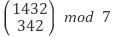
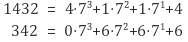
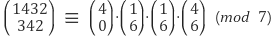

# Abstract

정수론에 대해 정리해본다.

# Learning Materials

* [KMO BIBLE 한국수학올림피아드 바이블 프리미엄 1 정수론](http://www.yes24.com/24/Goods/12554932?Acode=101)
* [정수론 @ qstudy](http://www.qstudy.kr/?m=234)

# 유클리드 알고리즘 (euclidean algorithm)

```
theorem)
a = bq + r 이면 gcd(a, b) = gcd(b, r)

ex) 
49 = 28 x 1 + 21 
gcd(49, 28) = gcd(28, 21)

proof)
p = p'g, q = q'g (p >= q, p'와 q'는 서로소, g는 최대공약수)
p = qa + r
p'g = q'ga + r
r = g(p' - q'a) (q와 r의 최대공약수가 g가 되려면 q'과 p'-q'a가 서로소이면 된다.)
귀류법을 이용해서 증명해보자.
q'과 p' - q'a가 서로소가 아니라면
q' = xG, p'-q'a = yG (G != 1)라고 할 수 있다.
p' - xGa = yG
p' = (y +xa)G
p'과 q'는 G때문에 서로소가 아니다. 이것은 p'과 q'는 서로소 라는 것에 모순이다.
따라서 q'과 p' - q'a는 서로소이다.
p와 q의 최대 공약수는 q와 r의 최대 공약수와 같다.
```

# 유클리드 호제법

호제법은 번갈아가면 제거하는 방법을 의미한다. 유클리드 호제법은
유클리드 알고리즘을 나머지가 0일때 까지 반복적으로 사용하여
최대공약수로 구하는 방법이다.

```
ex)
1020과 790의 최대공약수를 구하라

gcd(1020, 790)    1020 = 1 x 790 + 230
gcd(790, 230)      790 = 3 x 230 + 100
gcd(230, 100)      230 = 2 x 100 + 30
gcd(100, 30)       100 = 3 x 30 + 10
gcd(30, 10)         30 = 3 x 10 + 0
```

# 베주의 정의 (Bezout's identity)

동시에 0이 아닌 두 정수 a, b에 대하여 ax + by = gcd(a, b)를 만족하는
정수 x, y가 존재한다.

# 확장 유클리드 알고리즘 (extended euclidean algorithm)

베주의 정의 (bezout's identity) ax + by = gcd(a, b)의 해 (x, y)
를 구하는 방법이다.

```
ex)
1020x + 790y = gcd(1020, 790) 을 만족하는 (x, y)를 구하라. 

앞서 언급한 유클리드 호제법의 식을 응용하자.

gcd(1020, 790)    1020 = 1 x 790 + 230
  a = 1 x b + 230
  230 = a - b
gcd(790, 230)      790 = 3 x 230 + 100
  b = 3 x 230 + 100
  b = 3 x (a - b) + 100
  100 = -3a + 4b
gcd(230, 100)      230 = 2 x 100 + 30
  230 = 2 x (-3a + 4b) + 30
  30 = 7a - 9b
gcd(100, 30)       100 = 3 x 30 + 10
  100 = 3 x (7a - 9b) + 10
  10 = -24a + 31b

10 = gcd(1020, 790)이므로
gcd(1020, 790) = -24a + 31b이다.
따라서 x = -24, y = 31이다.
```

# 페르마의 소정리 (Ferma's little theorem)

```
theorem)
p가 소수이고 a와 p가 서로소(gcd(a, p) = 1)인 정수일때
a^{p-1} ≡ 1 (mod p)

ex)
8^{41-1} ≡ 1 (mod 41)
```

# 중국인 나머지 정리 (Chinese Remainder's theorem)

```
theorem)
두 양의 정수 m1, m2이 서로소 일때
임의의 두 정수 c1, c2에 대해 연립일차합동방정식
x ≡ c1 (mod m1)
x ≡ c2 (mod m2)
는 법 m1, m2에 관하여 단 한개의 해
x ≡ u (mod m1m2)를 갖는다.
```

# 뤼카의 정리 (lucas' theorem)

[참고](http://bowbowbow.tistory.com/2)

1878년 에두아르 뤼카가 논문에 제시하였다.
음이 아닌 정수 n, k, 소수 p에 대해서
다음과 같이 n과 k를 p진법 전개식으로 나타냈을 때


다음 합동식이 성립하는 것이다.


예를 들어서 다음을 구해보자.







n < m 이면 nCm은 0으로 취급하자.

따라서 답은 0이다.

# 디오판틴 방정식 (diophantine equation)

미지수를 정수에 한해서만 한정하여 생각하는 부정방정식

예를 들어 다음과 같은 것들은 디오판틴 방정식에 해당한다.

```
x + y = xy 를 만족하는 정수해의 순서쌍 (x, y)를 모두 구하라.
```

# 윌슨의 정리 (wilson's theorem)

[참고](https://namu.wiki/w/%EC%9C%8C%EC%8A%A8%EC%9D%98%20%EC%A0%95%EB%A6%AC)

```
theorem)
p가 소수일때 (p - 1)! ≡ -1 (mod p)가 성립한다. 그 역도 성립한다.

ex)
17! 을 19로 나눈 나머지를 구해보자. 윌슨의 정리에 의해
(19 - 1)! ≡ -1 (mod 19)
18! ≡ -1 (mod 19)
18 ≡ -1 (mod 19)
18 x 17! ≡ -1 x 17! (mod 19)
따라서 17! ≡ 1 (mod 19)
```