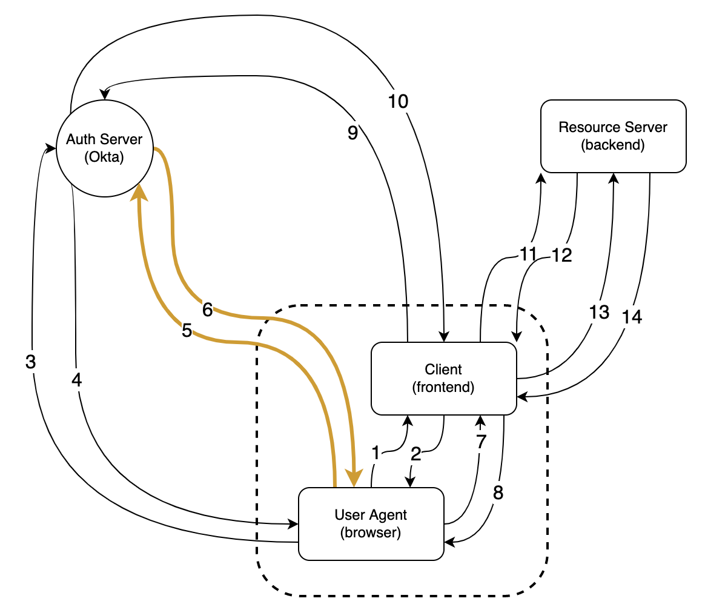
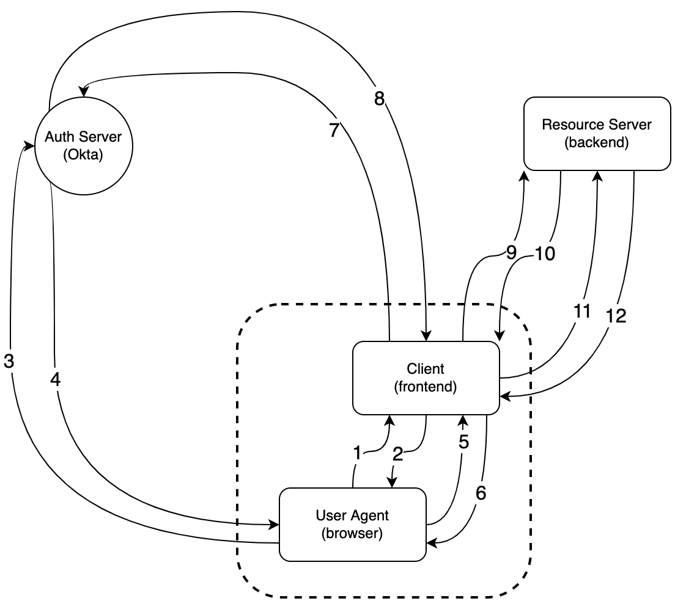
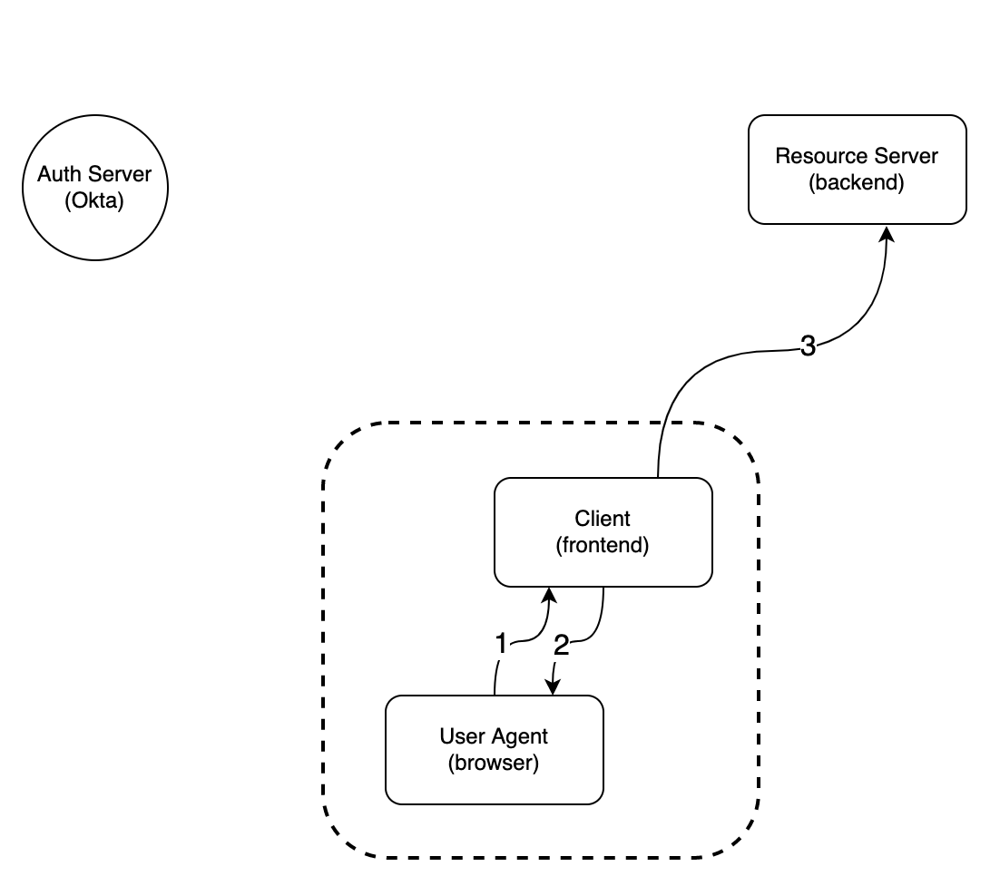

- [Abstract](#abstract)
- [Okta Unauthenticated](#okta-unauthenticated)
- [Resource Server Unauthenticated](#resource-server-unauthenticated)
- [Resource Server Authenticated](#resource-server-authenticated)

---

# Abstract

OpenID Connect Flow 를 정리한다. OIDC 는 너무 많은 RFC spec 이 모여있다. RFC 는 변호사를 고용하여 작성한 문서이기 때문에 법률용어가 많다. 개발자가 이해하기 힘들다. 정리된 문서, 그림을 보고 [Oauth Playground](https://www.oauth.com/playground/client-registration.html?returnto=authorization-code-with-pkce.html) 를 실습하여 이해하는 것이 좋다. [PKCE](/pkce) 도 같이 이해해야 한다.

Client 의 HTTP Request Parameters 중 `code_challenge, code_challenge_method, nonce, code, code_verifier` 는 [PKCE](/pkce/README.md) 를 위해 전달된다.

# Okta Unauthenticated



**Description**

1. HTTP Request GET "iamslash.com/auth/signin" Document
2. HTTP Response 200 HTML
3. HTTP Request GET "okta/oauth2/default/v1/authorize?" Document**after clicking "sign in okta (Resource Server Frontend)"**.
    
    ```
    https://iamslash.okta.com/oauth2/default/v1/authorize?
    
                client_id: 0oa3yrmdbsliAlKWl5d7
           code_challenge: ynRTzpQtqSXxrXtIoDB5Eufko1jAp9oF6glHyU8GZCA
    code_challenge_method: S256
                    nonce: C5jXlBf20dInCA9CfnLYDQrYeEor2LwdIFWXr1Vo99d219pRg1b9S6roZGoEQx0X
             redirect_uri: https://iamslash.com/auth/signin/redirect
            response_mode: fragment
            response_type: code
                    state: 33PkKaSC7LxRexP9nYXZJ8f7XNOBZefIt4svFvqrDSlC62968dMVWCw8l1NiFAjM
                    scope: openid
    
    ```
    
4. HTTP Response 200 HTML
5. HTTP Request GET "okta/login/step-up/redirect" Document **after clicking "login" with id, password. (Auth Server Frontend)**
6. HTTP Response 302
    
    ```
    location: https://iamslash.com/auth/signin/redirect
    #code=Z5hrBCf3rvozYmbTmcvRPmK9idqQ4K4HwWWRJHBYakA&state...
    
    ```
    
7. HTTP Request GET "iamslash.com/auth/signin/redirect" Document
8. HTTP Response 200 HTML
9. HTTP Request POST "okta/default/v1/token" XHR
    
    ```
    https://iamslash.okta.com/oauth2/default/v1/token
    
        client_id: 0oa3yrmdbsliAlKWl5d7
     redirect_uri: https://iamslash.com/auth/signin/redirect
       grant_type: authorization_code
    code_verifier: de2f76ec5107b5ba77f34dd1c1af36f9a6c5fcc455c
             code: 3mq6gkiaIwD64CvGlMIz5j1v2dR7BaqyrLgmjdzcgwc
    
    ```
    
10. HTTP Response 200
    
    ```
    {token_type: "Bearer", expires_in: 3600,…}
    access_token: "eyJraWQiO..."
    expires_in: 3600
    id_token: "eyJraWQiO..."
    scope: "openid"
    token_type: "Bearer"
    
    ```
    
11. HTTP Request GET "iamslash.com/member/login" XHR
12. HTTP Response 200
    
    ```
    {id: 34, email: "iamslash@gmail.com",…}
    email: "iamslash@gmail.com"
    id: 34
    roles: ["SERVICE_ADMIN", "SUPER_ADMIN", "TEAM_ADMIN", "VIEWER"]
    0: "SERVICE_ADMIN"
    1: "SUPER_ADMIN"
    2: "TEAM_ADMIN"
    3: "VIEWER"
    ```
    
13. HTTP Request GET "iamslash.com/super-admin?email=" XHR
14. HTTP Response 200
    
    ```
    [{id: 18, email: "foo@iamslash.com"}, {id: 16, email: "bar@iamslash.com"},…]
    0: {id: 18, email: "foo@iamslash.com"}
    1: {id: 16, email: "bar@iamslash.com"}    
    ```

# Resource Server Unauthenticated



**Description**

1. HTTP Request GET "iamslash.com/auth/signin" Document
2. HTTP Response 200 HTML
3. HTTP Request GET "okta/oauth2/default/v1/authorize?" Document.
    
    ```
    https://iamslash.okta.com/oauth2/default/v1/authorize?
    
                client_id: 0oa3yrmdbsliAlKWl5d7
           code_challenge: fctWVgfpw2cVfYThhzuxNmmXdA4Q3Y_Hj2yHmM8VLpk
    code_challenge_method: S256
                    nonce: rxFXs65QbdvCANOPixJHdcyo3JO6aUPpWyYqc9Z8tbWxau4cuqiVKWphWoWCSjOQ
             redirect_uri: https://iamslash.com/auth/signin/redirect
            response_mode: fragment
            response_type: code
                    state: qtvtisWRLUzN8LURVfTDvXzyYbi9STNU2LKjRYTDhFdCryqqynHySMCtR0Qvfpyx
                    scope: openid
    
    ```
    
4. HTTP Response 302
    
    ```
    location: https://iamslash.com/auth/signin/redirect#
    code=3mq6gkiaIwD64CvGlMIz5j1v2dR7BaqyrLgmjdzcgwc&state=qtvtisWRLUzN8LURVfTDvXzyYbi9STNU2LKjRYTDhFdCryqqynHySMCtR0Qvfpyx
    ```
    
5. HTTP Request GET "iamslash.com/auth/signin/redirect" Document
6. HTTP Response 200 HTML
7. HTTP Request POST "okta/default/v1/token" XHR
    
    ```
    https://iamslash.okta.com/oauth2/default/v1/token
    
        client_id: 0oa3yrmdbsliAlKWl5d7
     redirect_uri: https://iamslash.com/auth/signin/redirect
       grant_type: authorization_code
    code_verifier: de2f76ec5107b5ba77f34dd1c1af36f9a6c5fcc455c
             code: 3mq6gkiaIwD64CvGlMIz5j1v2dR7BaqyrLgmjdzcgwc
    ```
    
8. HTTP Response 200
    
    ```
    {token_type: "Bearer", expires_in: 3600,…}
    access_token: "eyJraWQiOi..."
    expires_in: 3600
    id_token: "eyJraWQiOi..."
    scope: "openid"
    token_type: "Bearer"
    ```
    
9. HTTP Request GET "iamslash.com//member/login" XHR
10. HTTP Response 200
    
    ```
    {id: 34, email: "iamslash@gmail.com",…}
    email: "iamslash@gmail.com"
    id: 34
    roles: ["SERVICE_ADMIN", "SUPER_ADMIN", "TEAM_ADMIN", "VIEWER"]
    0: "SERVICE_ADMIN"
    1: "SUPER_ADMIN"
    2: "TEAM_ADMIN"
    3: "VIEWER"
    ```
    
11. HTTP Request GET "iamslash.com/super-admin?email=" XHR
12. HTTP Response 200
    
    ```
    [{id: 18, email: "foo@iamslash.com"}, {id: 16, email: "bar@iamslash.com"},…]
    0: {id: 18, email: "foo@iamslash.com"}
    1: {id: 16, email: "bar@iamslash.com"}    
    ```

# Resource Server Authenticated



**Description**

1. HTTP Request GET "iamslash.com/" Document
2. HTTP Response 200 HTML
3. HTTP Request GET "iamslash.com/member/login" XHR
4. HTTP Response 200
        
    ```
    {id: 34, email: "iamslash@gmail.com",…}
    email: "iamslash@gmail.com"
    id: 34
    roles: ["SERVICE_ADMIN", "SUPER_ADMIN", "TEAM_ADMIN", "VIEWER"]
    0: "SERVICE_ADMIN"
    1: "SUPER_ADMIN"
    2: "TEAM_ADMIN"
    3: "VIEWER"
    ```

5. HTTP Request GET "iamslash.com/super-admin?email=" XHR
6. HTTP Response 200
    
    ```
    [{id: 18, email: "foo@iamslash.com"}, {id: 16, email: "bar@iamslash.com"},…]
    0: {id: 18, email: "foo@iamslash.com"}
    1: {id: 16, email: "bar@iamslash.com"}    
    ```
