- [Abstract](#abstract)
- [Essential](#essential)
- [Materials](#materials)
- [Basic Usage](#basic-usage)
  - [Setup Projects](#setup-projects)
  - [Depth Test](#depth-test)
  - [Stencil Test](#stencil-test)
  - [Blend](#blend)
  - [Frame Buffer](#frame-buffer)
  - [Cube Map](#cube-map)
  - [Uniform Buffer Object](#uniform-buffer-object)
  - [Instancing](#instancing)
  - [MSAA (Multi Sampled Anti Aliasing)](#msaa-multi-sampled-anti-aliasing)
  - [Phong / Blinn Phong Lighting](#phong--blinn-phong-lighting)
  - [Gamma Correction](#gamma-correction)
  - [Shadow Mapping](#shadow-mapping)
  - [Cascaded Shadow Mapping](#cascaded-shadow-mapping)
  - [Normal Mapping](#normal-mapping)
  - [Parallax Mapping](#parallax-mapping)
  - [HDR (High Dynamic Range)](#hdr-high-dynamic-range)
  - [Bloom](#bloom)
  - [Deferred Shading](#deferred-shading)
  - [SSAO (Screen Sapce Ambient Occlusion)](#ssao-screen-sapce-ambient-occlusion)
  - [PBR (Physicall Based Rendering)](#pbr-physicall-based-rendering)

-----

# Abstract

OpenGL을 정리한다.

# Essential

- [Learn Opengl](https://learnopengl.com/)
  - 킹왕짱 tutorial 이다.
  - [src](https://github.com/JoeyDeVries/LearnOpenGL)
- [OpenGL Programming Guide: The Official Guide to Learning OpenGL, Version 4.3](http://www.opengl-redbook.com/)
  - opengl red book
  - [src](https://github.com/openglredbook/examples)
- [OpenGL Superbible: Comprehensive Tutorial and Reference](http://www.openglsuperbible.com)
  - opengl blue book
  - [src](https://github.com/openglsuperbible/sb7code)
- [OpenGL Shading Language](https://www.amazon.com/OpenGL-Shading-Language-Randi-Rost/dp/0321637631/ref=sr_1_1?ie=UTF8&qid=1538565859&sr=8-1&keywords=opengl+shading+language)

# Materials

* [OpenGL samples pack download](https://www.opengl.org/sdk/docs/tutorials/OGLSamples/)
  * 공식 배포 샘플 모음, 다양한 예제가 `~/tests/` 에 있다.
* [OpenGL SDK download](https://sourceforge.net/projects/glsdk/)
* [OpenGL and OpenGL-es Reference Pages](https://www.khronos.org/registry/OpenGL-Refpages/)
  * 각종 링크 모음
* [awesome opengl](https://github.com/eug/awesome-opengl)
* [opengl-tutorial](http://www.opengl-tutorial.org/kr/)
  * particle 예제가 있음
* [ogldev](http://ogldev.atspace.co.uk/)
  * 예제가 많다.
* [bgfx](https://github.com/bkaradzic/bgfx)
  * opengl 을 지원하는 cross platform graphics library
* [renderdoc](https://renderdoc.org/)
  * opengl debugger
* [OpenGL Window Example @ qt](https://doc.qt.io/qt-5/qtgui-openglwindow-example.html)
  * qt 로 opengl 구현

# Basic Usage

## Setup Projects

* [Glitter](https://github.com/Polytonic/Glitter) 를 이용하면 assimp, bullet, glad, glfw, glm, std 등등의 라이브러리와 함께 프로젝트를 설정할 수 있다. cmake 를 이용하여 IDE projects 를 설정한다.

```bash
git clone --recursive https://github.com/Polytonic/Glitter
cd Glitter
mkdir build
cd build
cmake -G "Visual Studio 15 2017" ..
```

* [OpenGL-sandbox](https://github.com/OpenGL-adepts/OpenGL-sandbox) 는 Glitter 에 imgui 가 더해진 버전이다.

## Depth Test

* [Depth Test @ learnopengl](https://learnopengl.com/Advanced-OpenGL/Depth-testing)
* [1.1.depth_testin @ github](https://github.com/JoeyDeVries/LearnOpenGL/tree/master/src/4.advanced_opengl/1.1.depth_testing)
* [1.2.depth_testing_view @ github](https://github.com/JoeyDeVries/LearnOpenGL/tree/master/src/4.advanced_opengl/1.2.depth_testing_view)

----

Depth Buffer 값을 이용해서 특정 프래그먼트의 그리기 여부를 조정할 수 있다.

```cpp
    // configure global opengl state
    // -----------------------------
    glEnable(GL_DEPTH_TEST);
    glDepthFunc(GL_ALWAYS); // always pass the depth test (same effect as glDisable(GL_DEPTH_TEST))
```

## Stencil Test

* [Stencil Test @ learnopengl](https://learnopengl.com/Advanced-OpenGL/Stencil-testing)
* [2.stencil_testing @ github](https://github.com/JoeyDeVries/LearnOpenGL/tree/master/src/4.advanced_opengl/2.stencil_testing)

----

Stencil Buffer 값을 이용해서 특정 프래그먼트의 그리기 여부를 조정할 수 있다.

```cpp
    // configure global opengl state
    // -----------------------------
    glEnable(GL_DEPTH_TEST);
    glDepthFunc(GL_LESS);
    glEnable(GL_STENCIL_TEST);
    glStencilFunc(GL_NOTEQUAL, 1, 0xFF);
    glStencilOp(GL_KEEP, GL_KEEP, GL_REPLACE);
```

* [glStencilFunc](https://www.khronos.org/registry/OpenGL-Refpages/gl4/html/glStencilFunc.xhtml)

```cpp
void glStencilFunc(	GLenum func,
 	GLint ref,
 	GLuint mask);

GL_NEVER
Always fails.

GL_LESS
Passes if ( ref & mask ) < ( stencil & mask ).

GL_LEQUAL
Passes if ( ref & mask ) <= ( stencil & mask ).

GL_GREATER
Passes if ( ref & mask ) > ( stencil & mask ).

GL_GEQUAL
Passes if ( ref & mask ) >= ( stencil & mask ).

GL_EQUAL
Passes if ( ref & mask ) = ( stencil & mask ).

GL_NOTEQUAL
Passes if ( ref & mask ) != ( stencil & mask ).

GL_ALWAYS
Always passes.
```

* [glStencilOp](https://www.khronos.org/registry/OpenGL-Refpages/gl4/html/glStencilOp.xhtml)

```cpp
void glStencilOp(	GLenum sfail,
 	GLenum dpfail,
 	GLenum dppass);

GL_KEEP
Keeps the current value.

GL_ZERO
Sets the stencil buffer value to 0.

GL_REPLACE
Sets the stencil buffer value to ref, as specified by glStencilFunc.

GL_INCR
Increments the current stencil buffer value. Clamps to the maximum representable unsigned value.

GL_INCR_WRAP
Increments the current stencil buffer value. Wraps stencil buffer value to zero when incrementing the maximum representable unsigned value.

GL_DECR
Decrements the current stencil buffer value. Clamps to 0.

GL_DECR_WRAP
Decrements the current stencil buffer value. Wraps stencil buffer value to the maximum representable unsigned value when decrementing a stencil buffer value of zero.

GL_INVERT
Bitwise inverts the current stencil buffer value.
```

## Blend

* [Blend @ learnopengl](https://learnopengl.com/Advanced-OpenGL/Blending)
* [3.1.blending_discard @ github](https://github.com/JoeyDeVries/LearnOpenGL/tree/master/src/4.advanced_opengl/3.1.blending_discard)
* [3.2.blending_sort @ github]([)](https://github.com/JoeyDeVries/LearnOpenGL/tree/master/src/4.advanced_opengl/3.2.blending_sort)

----

```cpp
    // configure global opengl state
    // -----------------------------
    glEnable(GL_DEPTH_TEST);
    glEnable(GL_BLEND);
    glBlendFunc(GL_SRC_ALPHA, GL_ONE_MINUS_SRC_ALPHA);

    // dst fragment = src fragment * src factor + dst fragment * dst factor
    // src fragment: fragment of current object
    // dst fragment: fragment of backbuffer
```

* [glBlendFunc](https://www.khronos.org/registry/OpenGL-Refpages/gl4/html/glBlendFunc.xhtml)

```cpp

void glBlendFunc(	GLenum sfactor,
 	GLenum dfactor);
 
void glBlendFunci(	GLuint buf,
 	GLenum sfactor,
 	GLenum dfactor);
```

## Frame Buffer

* [Frame Buffer @ learnopengl](https://learnopengl.com/Advanced-OpenGL/Framebuffers)
* [5.1.framebuffers @ github](https://github.com/JoeyDeVries/LearnOpenGL/tree/master/src/4.advanced_opengl/5.1.framebuffers)
* [5.2.framebuffers_exercise1 @ github](hhttps://github.com/JoeyDeVries/LearnOpenGL/tree/master/src/4.advanced_opengl/5.2.framebuffers_exercise1)

----

frame buffer 를 만들고 이곳에 렌더링 할 수 있다. 주로 post processing 에 이용한다.

frame buffer object 를 만들고 texture, render buffer object (depth, stencil buffer) 등을 attatch 한다. 그리고 frame buffer 를 binding 하면 이후 frame buffer object 에 렌더링되고 attatch 한 texture, render buffer object 역시 값이 채워진다. 이때 binding 되어 있는 fragment shader 를 수정하면 post processing 할 수 있다.

* create and bind frame buffer object

```cpp
unsigned int fbo;
glGenFramebuffers(1, &fbo);

glBindFramebuffer(GL_FRAMEBUFFER, fbo);  
```

* bind default frame buffer, delete frame buffer object

```cpp
glBindFramebuffer(GL_FRAMEBUFFER, 0);   

glDeleteFramebuffers(1, &fbo);  
```

* attatching texture

```c
unsigned int texture;
glGenTextures(1, &texture);
glBindTexture(GL_TEXTURE_2D, texture);
  
glTexImage2D(GL_TEXTURE_2D, 0, GL_RGB, 800, 600, 0, GL_RGB, GL_UNSIGNED_BYTE, NULL);

glTexParameteri(GL_TEXTURE_2D, GL_TEXTURE_MIN_FILTER, GL_LINEAR);
glTexParameteri(GL_TEXTURE_2D, GL_TEXTURE_MAG_FILTER, GL_LINEAR);  

glFramebufferTexture2D(GL_FRAMEBUFFER, GL_COLOR_ATTACHMENT0, GL_TEXTURE_2D, texture, 0);  
```

* create, bind, allocate and attatch render buffer object (depth, stencil buffer)

```c
unsigned int rbo;
glGenRenderbuffers(1, &rbo);

glBindRenderbuffer(GL_RENDERBUFFER, rbo);  

glRenderbufferStorage(GL_RENDERBUFFER, GL_DEPTH24_STENCIL8, 800, 600);

glFramebufferRenderbuffer(GL_FRAMEBUFFER, GL_DEPTH_STENCIL_ATTACHMENT, GL_RENDERBUFFER, rbo); 
```

* inversion fragment shader

```c
void main()
{
    FragColor = vec4(vec3(1.0 - texture(screenTexture, TexCoords)), 1.0);
}  
```

* gray fragment shader

```c
void main()
{
    FragColor = texture(screenTexture, TexCoords);
    float average = (FragColor.r + FragColor.g + FragColor.b) / 3.0;
    FragColor = vec4(average, average, average, 1.0);
}   
```

인간의 눈은 녹색에 예민하고 파란색에 둔감하므로 weight 를 적용함

```c
void main()
{
    FragColor = texture(screenTexture, TexCoords);
    float average = 0.2126 * FragColor.r + 0.7152 * FragColor.g + 0.0722 * FragColor.b;
    FragColor = vec4(average, average, average, 1.0);
}
```


* 3x3 sharpen kernel fragment shader

kernel 은 행렬이다. fragment 를 kernel 행렬을 이용하여 조작한다. kernel 은 필터와 유사하다.

```c
const float offset = 1.0 / 300.0;  

void main()
{
    vec2 offsets[9] = vec2[](
        vec2(-offset,  offset), // 좌측 상단
        vec2( 0.0f,    offset), // 중앙 상단
        vec2( offset,  offset), // 우측 상단
        vec2(-offset,  0.0f),   // 좌측 중앙
        vec2( 0.0f,    0.0f),   // 정중앙
        vec2( offset,  0.0f),   // 우측 중앙
        vec2(-offset, -offset), // 좌측 하단
        vec2( 0.0f,   -offset), // 중앙 하단
        vec2( offset, -offset)  // 우측 하단   
    );

    float kernel[9] = float[](
        -1, -1, -1,
        -1,  9, -1,
        -1, -1, -1
    );
    
    vec3 sampleTex[9];
    for(int i = 0; i < 9; i++)
    {
        sampleTex[i] = vec3(texture(screenTexture, TexCoords.st + offsets[i]));
    }
    vec3 col = vec3(0.0);
    for(int i = 0; i < 9; i++)
        col += sampleTex[i] * kernel[i];
    
    FragColor = vec4(col, 1.0);
}  
```

* 3x3 blur kernel fragment shader

```c
float kernel[9] = float[](
    1.0 / 16, 2.0 / 16, 1.0 / 16,
    2.0 / 16, 4.0 / 16, 2.0 / 16,
    1.0 / 16, 2.0 / 16, 1.0 / 16  
);
```

## Cube Map

* [Cube Map @ learnopengl](https://learnopengl.com/Advanced-OpenGL/Cubemaps)
* [6.1.cubemaps_skybox @ github](https://github.com/JoeyDeVries/LearnOpenGL/tree/master/src/4.advanced_opengl/6.1.cubemaps_skybox)
* [6.2.cubemaps_environment_mapping](https://github.com/JoeyDeVries/LearnOpenGL/tree/master/src/4.advanced_opengl/6.2.cubemaps_environment_mapping)

-----

6 개의 텍스처를 사용하는 방법이다. 주로 스카이박스를 구현할 때 사용한다.

* create, bind cube map

```c
unsigned int textureID;
glGenTextures(1, &textureID);
glBindTexture(GL_TEXTURE_CUBE_MAP, textureID);
```

* load cube map texture 

```c
int width, height, nrChannels;
unsigned char *data;  
for(GLuint i = 0; i < textures_faces.size(); i++)
{
    data = stbi_load(textures_faces[i].c_str(), &width, &height, &nrChannels, 0);
    glTexImage2D(
        GL_TEXTURE_CUBE_MAP_POSITIVE_X + i, 
        0, GL_RGB, width, height, 0, GL_RGB, GL_UNSIGNED_BYTE, data
    );
}
```

* adjust cube map texture options

```c
glTexParameteri(GL_TEXTURE_CUBE_MAP, GL_TEXTURE_MAG_FILTER, GL_LINEAR);
glTexParameteri(GL_TEXTURE_CUBE_MAP, GL_TEXTURE_MIN_FILTER, GL_LINEAR);
glTexParameteri(GL_TEXTURE_CUBE_MAP, GL_TEXTURE_WRAP_S, GL_CLAMP_TO_EDGE);
glTexParameteri(GL_TEXTURE_CUBE_MAP, GL_TEXTURE_WRAP_T, GL_CLAMP_TO_EDGE);
glTexParameteri(GL_TEXTURE_CUBE_MAP, GL_TEXTURE_WRAP_R, GL_CLAMP_TO_EDGE);  
```

## Uniform Buffer Object

* [Advanced Data @ learnopengl](https://learnopengl.com/Advanced-OpenGL/Advanced-Data)
* [8.advanced_glsl_ubo @ github](https://github.com/JoeyDeVries/LearnOpenGL/tree/master/src/4.advanced_opengl/8.advanced_glsl_ubo)

한번 설정해 두면 여러개의 Shader 에서 global 하게 사용할 수 잇는 buffer object 이다. 다음은 projection, view matrix 를 uniform buffer object 로 만들어 이용한 것이다. projection matrix 는 안 바뀐다고 가정하고 한번만 설정한다. 그러나 view matrix 는 camera 의 position, rotation 등이 변환될 때 마다 바뀌므로 rendering loop 에서 매번 설정한다.

* create, bind and set uniform buffer object with projection matrix

```c
    // configure a uniform buffer object
    // ---------------------------------
    // first. We get the relevant block indices
    unsigned int uniformBlockIndexRed = glGetUniformBlockIndex(shaderRed.ID, "Matrices");
    unsigned int uniformBlockIndexGreen = glGetUniformBlockIndex(shaderGreen.ID, "Matrices");
    unsigned int uniformBlockIndexBlue = glGetUniformBlockIndex(shaderBlue.ID, "Matrices");
    unsigned int uniformBlockIndexYellow = glGetUniformBlockIndex(shaderYellow.ID, "Matrices");
    // then we link each shader's uniform block to this uniform binding point
    glUniformBlockBinding(shaderRed.ID, uniformBlockIndexRed, 0);
    glUniformBlockBinding(shaderGreen.ID, uniformBlockIndexGreen, 0);
    glUniformBlockBinding(shaderBlue.ID, uniformBlockIndexBlue, 0);
    glUniformBlockBinding(shaderYellow.ID, uniformBlockIndexYellow, 0);
    // Now actually create the buffer
    unsigned int uboMatrices;
    glGenBuffers(1, &uboMatrices);
    glBindBuffer(GL_UNIFORM_BUFFER, uboMatrices);
    glBufferData(GL_UNIFORM_BUFFER, 2 * sizeof(glm::mat4), NULL, GL_STATIC_DRAW);
    glBindBuffer(GL_UNIFORM_BUFFER, 0);
    // define the range of the buffer that links to a uniform binding point
    glBindBufferRange(GL_UNIFORM_BUFFER, 0, uboMatrices, 0, 2 * sizeof(glm::mat4));

    // store the projection matrix (we only do this once now) (note: we're not using zoom anymore by changing the FoV)
    glm::mat4 projection = glm::perspective(45.0f, (float)SCR_WIDTH / (float)SCR_HEIGHT, 0.1f, 100.0f);
    glBindBuffer(GL_UNIFORM_BUFFER, uboMatrices);
    glBufferSubData(GL_UNIFORM_BUFFER, 0, sizeof(glm::mat4), glm::value_ptr(projection));
    glBindBuffer(GL_UNIFORM_BUFFER, 0);
```

* set uniform buffer object with view matrix

```c
        // set the view and projection matrix in the uniform block - we only have to do this once per loop iteration.
        glm::mat4 view = camera.GetViewMatrix();
        glBindBuffer(GL_UNIFORM_BUFFER, uboMatrices);
        glBufferSubData(GL_UNIFORM_BUFFER, sizeof(glm::mat4), sizeof(glm::mat4), glm::value_ptr(view));
        glBindBuffer(GL_UNIFORM_BUFFER, 0);
```

## Instancing

* [Instancing @ learnopengl](https://learnopengl.com/Advanced-OpenGL/Instancing)
* [10.1.instancing_quad @ github](https://github.com/JoeyDeVries/LearnOpenGL/tree/master/src/4.advanced_opengl/10.1.instancing_quads)
* [10.2.asteroids @ github](https://github.com/JoeyDeVries/LearnOpenGL/tree/master/src/4.advanced_opengl/10.2.asteroids)
* [10.3.asteroids_instanced @ github](https://github.com/JoeyDeVries/LearnOpenGL/tree/master/src/4.advanced_opengl/10.3.asteroids_instanced)

----

월드 좌표가 다른 다수의 동일한 model 을 하나의 Draw Call 로 렌더링하는 방법이다. 다음은 사각형 100 개를 Instancing Draw 하는 예이다.

* create, bind instance vbo

`glVertexAttribDivisor` 를 이용하여 instance vbo 를 특별한 attribute 로 취급하는 것을 주의하자.

```c
    // store instance data in an array buffer
    // --------------------------------------
    unsigned int instanceVBO;
    glGenBuffers(1, &instanceVBO);
    glBindBuffer(GL_ARRAY_BUFFER, instanceVBO);
    glBufferData(GL_ARRAY_BUFFER, sizeof(glm::vec2) * 100, &translations[0], GL_STATIC_DRAW);
    glBindBuffer(GL_ARRAY_BUFFER, 0);

    // set up vertex data (and buffer(s)) and configure vertex attributes
    // ------------------------------------------------------------------
    float quadVertices[] = {
        // positions     // colors
        -0.05f,  0.05f,  1.0f, 0.0f, 0.0f,
         0.05f, -0.05f,  0.0f, 1.0f, 0.0f,
        -0.05f, -0.05f,  0.0f, 0.0f, 1.0f,

        -0.05f,  0.05f,  1.0f, 0.0f, 0.0f,
         0.05f, -0.05f,  0.0f, 1.0f, 0.0f,
         0.05f,  0.05f,  0.0f, 1.0f, 1.0f
    };
    unsigned int quadVAO, quadVBO;
    glGenVertexArrays(1, &quadVAO);
    glGenBuffers(1, &quadVBO);
    glBindVertexArray(quadVAO);
    glBindBuffer(GL_ARRAY_BUFFER, quadVBO);
    glBufferData(GL_ARRAY_BUFFER, sizeof(quadVertices), quadVertices, GL_STATIC_DRAW);
    glEnableVertexAttribArray(0);
    glVertexAttribPointer(0, 2, GL_FLOAT, GL_FALSE, 5 * sizeof(float), (void*)0);
    glEnableVertexAttribArray(1);
    glVertexAttribPointer(1, 3, GL_FLOAT, GL_FALSE, 5 * sizeof(float), (void*)(2 * sizeof(float)));
    // also set instance data
    glEnableVertexAttribArray(2);
    glBindBuffer(GL_ARRAY_BUFFER, instanceVBO); // this attribute comes from a different vertex buffer
    glVertexAttribPointer(2, 2, GL_FLOAT, GL_FALSE, 2 * sizeof(float), (void*)0);
    glBindBuffer(GL_ARRAY_BUFFER, 0);
    glVertexAttribDivisor(2, 1); // tell OpenGL this is an instanced vertex attribute.
```

* draw instanced quads

```c
        // draw 100 instanced quads
        shader.use();
        glBindVertexArray(quadVAO);
        glDrawArraysInstanced(GL_TRIANGLES, 0, 6, 100); // 100 triangles of 6 vertices each
        glBindVertexArray(0);
```

## MSAA (Multi Sampled Anti Aliasing)

* [Anti Aliasing @ learnopengl](https://learnopengl.com/Advanced-OpenGL/Anti-Aliasing)
* [11.anti_aliasing_offscreen @ github](https://github.com/JoeyDeVries/LearnOpenGL/tree/master/src/4.advanced_opengl/11.anti_aliasing_offscreen)

----

anti aliasing algorithm 중 하나이다. Frame Buffer Object 두개를 이용하여 anti aliasing 한다.

* create, bind 2 frame buffer objects

```c

    // configure MSAA framebuffer
    // --------------------------
    unsigned int framebuffer;
    glGenFramebuffers(1, &framebuffer);
    glBindFramebuffer(GL_FRAMEBUFFER, framebuffer);
    // create a multisampled color attachment texture
    unsigned int textureColorBufferMultiSampled;
    glGenTextures(1, &textureColorBufferMultiSampled);
    glBindTexture(GL_TEXTURE_2D_MULTISAMPLE, textureColorBufferMultiSampled);
    glTexImage2DMultisample(GL_TEXTURE_2D_MULTISAMPLE, 4, GL_RGB, SCR_WIDTH, SCR_HEIGHT, GL_TRUE);
    glBindTexture(GL_TEXTURE_2D_MULTISAMPLE, 0);
    glFramebufferTexture2D(GL_FRAMEBUFFER, GL_COLOR_ATTACHMENT0, GL_TEXTURE_2D_MULTISAMPLE, textureColorBufferMultiSampled, 0);
    // create a (also multisampled) renderbuffer object for depth and stencil attachments
    unsigned int rbo;
    glGenRenderbuffers(1, &rbo);
    glBindRenderbuffer(GL_RENDERBUFFER, rbo);
    glRenderbufferStorageMultisample(GL_RENDERBUFFER, 4, GL_DEPTH24_STENCIL8, SCR_WIDTH, SCR_HEIGHT);
    glBindRenderbuffer(GL_RENDERBUFFER, 0);
    glFramebufferRenderbuffer(GL_FRAMEBUFFER, GL_DEPTH_STENCIL_ATTACHMENT, GL_RENDERBUFFER, rbo);

    if (glCheckFramebufferStatus(GL_FRAMEBUFFER) != GL_FRAMEBUFFER_COMPLETE)
        cout << "ERROR::FRAMEBUFFER:: Framebuffer is not complete!" << endl;
    glBindFramebuffer(GL_FRAMEBUFFER, 0);

    // configure second post-processing framebuffer
    unsigned int intermediateFBO;
    glGenFramebuffers(1, &intermediateFBO);
    glBindFramebuffer(GL_FRAMEBUFFER, intermediateFBO);
    // create a color attachment texture
    unsigned int screenTexture;
    glGenTextures(1, &screenTexture);
    glBindTexture(GL_TEXTURE_2D, screenTexture);
    glTexImage2D(GL_TEXTURE_2D, 0, GL_RGB, SCR_WIDTH, SCR_HEIGHT, 0, GL_RGB, GL_UNSIGNED_BYTE, NULL);
    glTexParameteri(GL_TEXTURE_2D, GL_TEXTURE_MIN_FILTER, GL_LINEAR);
    glTexParameteri(GL_TEXTURE_2D, GL_TEXTURE_MAG_FILTER, GL_LINEAR);
    glFramebufferTexture2D(GL_FRAMEBUFFER, GL_COLOR_ATTACHMENT0, GL_TEXTURE_2D, screenTexture, 0);	// we only need a color buffer
```

* blit 2 frame objects

framebuffer 에서 intermediateFBO 로 blit 하면 intermediateFBO 에 바인딩되어 있는 screenTexture 에 렌더링 된다. 그리고 default frame buffer 에 screenTexture 를 렌더링 한다.

```c
        // 1. draw scene as normal in multisampled buffers
        glBindFramebuffer(GL_FRAMEBUFFER, framebuffer);
        glClearColor(0.1f, 0.1f, 0.1f, 1.0f);
        glClear(GL_COLOR_BUFFER_BIT | GL_DEPTH_BUFFER_BIT);
        glEnable(GL_DEPTH_TEST);

        // set transformation matrices		
        shader.use();
        glm::mat4 projection = glm::perspective(glm::radians(camera.Zoom), (float)SCR_WIDTH / (float)SCR_HEIGHT, 0.1f, 1000.0f);
        shader.setMat4("projection", projection);
        shader.setMat4("view", camera.GetViewMatrix());
        shader.setMat4("model", glm::mat4(1.0f));

        glBindVertexArray(cubeVAO);
        glDrawArrays(GL_TRIANGLES, 0, 36);

        // 2. now blit multisampled buffer(s) to normal colorbuffer of intermediate FBO. Image is stored in screenTexture
        glBindFramebuffer(GL_READ_FRAMEBUFFER, framebuffer);
        glBindFramebuffer(GL_DRAW_FRAMEBUFFER, intermediateFBO);
        glBlitFramebuffer(0, 0, SCR_WIDTH, SCR_HEIGHT, 0, 0, SCR_WIDTH, SCR_HEIGHT, GL_COLOR_BUFFER_BIT, GL_NEAREST);

        // 3. now render quad with scene's visuals as its texture image
        glBindFramebuffer(GL_FRAMEBUFFER, 0);
        glClearColor(1.0f, 1.0f, 1.0f, 1.0f);
        glClear(GL_COLOR_BUFFER_BIT);
        glDisable(GL_DEPTH_TEST);

        // draw Screen quad
        screenShader.use();
        glBindVertexArray(quadVAO);
        glActiveTexture(GL_TEXTURE0);
        glBindTexture(GL_TEXTURE_2D, screenTexture); // use the now resolved color attachment as the quad's texture
        glDrawArrays(GL_TRIANGLES, 0, 6);
```

## Phong / Blinn Phong Lighting

* [Advanced Lighting @ learnopengl](https://learnopengl.com/Advanced-Lighting/Advanced-Lighting)
* [1.advanced_lighting @ github](https://github.com/JoeyDeVries/LearnOpenGL/tree/master/src/5.advanced_lighting/1.advanced_lighting)

----

Phong 은 specular 성분을 구할 때 V (view vector) 와 R (light reflected vector) 를 이용한다. V 와 R 은 사이각이 90 도를 넘을 수 있고 이것을 모두 0 처리 해버린다. 정밀도가 떨어진다.


Blinn Phong Lighting model 은 specular 성분을 구할 때 V (view vector) 와 H (half between light and light reflected vector) 를 이용한다. V 와 H 는 사이각이 90 도를 넘을 수 없다. 정밀도가 더욱 높다.


다음은 Phong 과 Blinn Phong Lighting Model 을 구현한 fragment shader 이다.

```c
void main()
{           
    vec3 color = texture(floorTexture, fs_in.TexCoords).rgb;
    // ambient
    vec3 ambient = 0.05 * color;
    // diffuse
    vec3 lightDir = normalize(lightPos - fs_in.FragPos);
    vec3 normal = normalize(fs_in.Normal);
    float diff = max(dot(lightDir, normal), 0.0);
    vec3 diffuse = diff * color;
    // specular
    vec3 viewDir = normalize(viewPos - fs_in.FragPos);
    vec3 reflectDir = reflect(-lightDir, normal);
    float spec = 0.0;
    if(blinn)
    {
        vec3 halfwayDir = normalize(lightDir + viewDir);  
        spec = pow(max(dot(normal, halfwayDir), 0.0), 32.0);
    }
    else
    {
        vec3 reflectDir = reflect(-lightDir, normal);
        spec = pow(max(dot(viewDir, reflectDir), 0.0), 8.0);
    }
    vec3 specular = vec3(0.3) * spec; // assuming bright white light color
    FragColor = vec4(ambient + diffuse + specular, 1.0);
}
```

## Gamma Correction

* [Gamma Correction @ learnopengl](https://learnopengl.com/Advanced-Lighting/Gamma-Correction)
* [2.gamma_correction @ github](https://github.com/JoeyDeVries/LearnOpenGL/tree/master/src/5.advanced_lighting/2.gamma_correction)

----

사람의 눈은 밝은색 보다는 어두운색을 더욱 잘 구별한다. 따라서 색 정보를 저장할 때 어두운 색에 더욱 많은 비트를 할당하면 더욱 효율적으로 저장할 수 있다. 이렇게 저장하는 방식을 gamma encoding 이라고 한다.

모니터는 gamma 가 적용된 color 를 입력으로 한다. 모든 모니터가 그런가??? 아마도 입력된 color 에 대해 `color = pow(color, vec3(2.2))` 를 할 것이다. 

한편 texture 의 internalFormat 이 gamma 가 적용된 (GL_SRGB) 것이라면 fragment shader 는 입력된 linear space color 를  gamma correction 해야 한다. gamma correction 한다는 것은 `color = pow(color, vec3(1.0/2.2))` 를 의미한다. 

그렇다면 texture 의 internal Format 이 gamma 가 적용되지 않은 (GL_RGB) 것이라면 fragment shader 는 gamma correction 할 필요가 없는 것인가???


다음은 gamma correction 을 구현하기 위해 하나의 텍스처를 internalFormat 을 달리해서 읽은 것이다.

```cpp
    // load textures
    // -------------
    unsigned int floorTexture               = loadTexture(FileSystem::getPath("resources/textures/wood.png").c_str(), false);
    unsigned int floorTextureGammaCorrected = loadTexture(FileSystem::getPath("resources/textures/wood.png").c_str(), true);
```

다음은 `loadTexture` 의 구현이다. [glTexImage2D](https://www.khronos.org/registry/OpenGL-Refpages/gl4/html/glTexImage2D.xhtml) 에서 `internalFormat` 을 주목하자. gamma 를 사용한다면 `GL_SRGB` 로 설정하고 그렇지 않다면 `GL_RGB` 로 설정한다.

```cpp
// utility function for loading a 2D texture from file
// ---------------------------------------------------
unsigned int loadTexture(char const * path, bool gammaCorrection)
{
    unsigned int textureID;
    glGenTextures(1, &textureID);

    int width, height, nrComponents;
    unsigned char *data = stbi_load(path, &width, &height, &nrComponents, 0);
    if (data)
    {
        GLenum internalFormat;
        GLenum dataFormat;
        if (nrComponents == 1)
        {
            internalFormat = dataFormat = GL_RED;
        }
        else if (nrComponents == 3)
        {
            internalFormat = gammaCorrection ? GL_SRGB : GL_RGB;
            dataFormat = GL_RGB;
        }
        else if (nrComponents == 4)
        {
            internalFormat = gammaCorrection ? GL_SRGB_ALPHA : GL_RGBA;
            dataFormat = GL_RGBA;
        }

        glBindTexture(GL_TEXTURE_2D, textureID);
        glTexImage2D(GL_TEXTURE_2D, 0, internalFormat, width, height, 0, dataFormat, GL_UNSIGNED_BYTE, data);
        glGenerateMipmap(GL_TEXTURE_2D);

        glTexParameteri(GL_TEXTURE_2D, GL_TEXTURE_WRAP_S, GL_REPEAT); 
        glTexParameteri(GL_TEXTURE_2D, GL_TEXTURE_WRAP_T, GL_REPEAT);
        glTexParameteri(GL_TEXTURE_2D, GL_TEXTURE_MIN_FILTER, GL_LINEAR_MIPMAP_LINEAR);
        glTexParameteri(GL_TEXTURE_2D, GL_TEXTURE_MAG_FILTER, GL_LINEAR);

        stbi_image_free(data);
    }
    else
    {
        std::cout << "Texture failed to load at path: " << path << std::endl;
        stbi_image_free(data);
    }

    return textureID;
}
```

다음은 fragment shader 에서 gamma correction 하는 구현이다.

```c
void main()
{           
    vec3 color = texture(floorTexture, fs_in.TexCoords).rgb;
    vec3 lighting = vec3(0.0);
    for(int i = 0; i < 4; ++i)
        lighting += BlinnPhong(normalize(fs_in.Normal), fs_in.FragPos, lightPositions[i], lightColors[i]);
    color *= lighting;
    if(gamma)
        color = pow(color, vec3(1.0/2.2));
    FragColor = vec4(color, 1.0);
}
```

## Shadow Mapping

* [Shadow Mapping @ learnopengl](https://learnopengl.com/Advanced-Lighting/Shadows/Shadow-Mapping)
* [Point Shadows @ learnopengl](https://learnopengl.com/Advanced-Lighting/Shadows/Point-Shadows)
* [3.1.1.shadow_mapping_depth @ github](https://github.com/JoeyDeVries/LearnOpenGL/tree/master/src/5.advanced_lighting/3.1.1.shadow_mapping_depth)
* [3.1.2.shadow_mapping_base @ github](https://github.com/JoeyDeVries/LearnOpenGL/tree/master/src/5.advanced_lighting/3.1.2.shadow_mapping_base)
* [3.1.3.shadow_mapping @ github](https://github.com/JoeyDeVries/LearnOpenGL/tree/master/src/5.advanced_lighting/3.1.3.shadow_mapping)
* [3.2.1.point_shadows @ github](https://github.com/JoeyDeVries/LearnOpenGL/tree/master/src/5.advanced_lighting/3.2.1.point_shadows)
* [3.2.2.point_shadows_soft @ github](https://github.com/JoeyDeVries/LearnOpenGL/tree/master/src/5.advanced_lighting/3.2.2.point_shadows_soft)

----


카메라를 기준으로 렌더링한 fragment 의 depth value 와 라이트를 기준으로 렌더링한 fragment 의 depth value 를 비교해서 그림자를 그리는 방식이다. 이때 라이트를 기준으로 렌더링한 것을 shadow map 이라고 한다.


위의 그림처럼 fragment P 를 살펴보자. 라이트를 기준으로 검증하기 위해 Light Transform 을 한 다음 깊이 값 `depth(T(P)) = 0.9` 을 가져온다. 이 값은 shadow map 의 값 `depth(C) = 0.4` 보다 크기 때문에 그림자 영역이다.

다음은 shadow map 을 생성하는 과정이다.

```c
unsigned int depthMapFBO;
glGenFramebuffers(1, &depthMapFBO);  

...

const unsigned int SHADOW_WIDTH = 1024, SHADOW_HEIGHT = 1024;

unsigned int depthMap;
glGenTextures(1, &depthMap);
glBindTexture(GL_TEXTURE_2D, depthMap);
glTexImage2D(GL_TEXTURE_2D, 0, GL_DEPTH_COMPONENT, 
             SHADOW_WIDTH, SHADOW_HEIGHT, 0, GL_DEPTH_COMPONENT, GL_FLOAT, NULL);
glTexParameteri(GL_TEXTURE_2D, GL_TEXTURE_MIN_FILTER, GL_NEAREST);
glTexParameteri(GL_TEXTURE_2D, GL_TEXTURE_MAG_FILTER, GL_NEAREST);
glTexParameteri(GL_TEXTURE_2D, GL_TEXTURE_WRAP_S, GL_REPEAT); 
glTexParameteri(GL_TEXTURE_2D, GL_TEXTURE_WRAP_T, GL_REPEAT);  

...

glBindFramebuffer(GL_FRAMEBUFFER, depthMapFBO);
glFramebufferTexture2D(GL_FRAMEBUFFER, GL_DEPTH_ATTACHMENT, GL_TEXTURE_2D, depthMap, 0);
glDrawBuffer(GL_NONE);
glReadBuffer(GL_NONE);
glBindFramebuffer(GL_FRAMEBUFFER, 0);  

...

// 1. first render to depth map
glViewport(0, 0, SHADOW_WIDTH, SHADOW_HEIGHT);
glBindFramebuffer(GL_FRAMEBUFFER, depthMapFBO);
    glClear(GL_DEPTH_BUFFER_BIT);
    ConfigureShaderAndMatrices();
    RenderScene();
glBindFramebuffer(GL_FRAMEBUFFER, 0);
// 2. then render scene as normal with shadow mapping (using depth map)
glViewport(0, 0, SCR_WIDTH, SCR_HEIGHT);
glClear(GL_COLOR_BUFFER_BIT | GL_DEPTH_BUFFER_BIT);
ConfigureShaderAndMatrices();
glBindTexture(GL_TEXTURE_2D, depthMap);
RenderScene();
```

다음은 라이트 좌표변환을 위한 행렬을 구현한 것이다.

```c
float near_plane = 1.0f, far_plane = 7.5f;
glm::mat4 lightProjection = glm::ortho(-10.0f, 10.0f, -10.0f, 10.0f, near_plane, far_plane);  

...

glm::mat4 lightView = glm::lookAt(glm::vec3(-2.0f, 4.0f, -1.0f), 
                                  glm::vec3( 0.0f, 0.0f,  0.0f), 
                                  glm::vec3( 0.0f, 1.0f,  0.0f));  

...

glm::mat4 lightSpaceMatrix = lightProjection * lightView; 
```

다음은 shadow map 에 렌더링 하기 위한 vertex, fragment shader, opengl code 이다.

```c
#version 330 core
layout (location = 0) in vec3 aPos;

uniform mat4 lightSpaceMatrix;
uniform mat4 model;

void main()
{
    gl_Position = lightSpaceMatrix * model * vec4(aPos, 1.0);
}  

...

#version 330 core

void main()
{             
    // gl_FragDepth = gl_FragCoord.z;
}  

...

simpleDepthShader.use();
glUniformMatrix4fv(lightSpaceMatrixLocation, 1, GL_FALSE, glm::value_ptr(lightSpaceMatrix));

glViewport(0, 0, SHADOW_WIDTH, SHADOW_HEIGHT);
glBindFramebuffer(GL_FRAMEBUFFER, depthMapFBO);
    glClear(GL_DEPTH_BUFFER_BIT);
    RenderScene(simpleDepthShader);
glBindFramebuffer(GL_FRAMEBUFFER, 0);  
```

다음은 화면에 shadow map 을 렌더링하는 fragment shader 이다.

```c
#version 330 core
out vec4 FragColor;
  
in vec2 TexCoords;

uniform sampler2D depthMap;

void main()
{             
    float depthValue = texture(depthMap, TexCoords).r;
    FragColor = vec4(vec3(depthValue), 1.0);
}  
```

다음은 default frame buffer object 에 rendering 하는 vertex shader 이다. `vs_out.FragPosLightSpace` 에 Light Transform 한 결과를 저장한다.

```c
#version 330 core
layout (location = 0) in vec3 aPos;
layout (location = 1) in vec3 aNormal;
layout (location = 2) in vec2 aTexCoords;

out VS_OUT {
    vec3 FragPos;
    vec3 Normal;
    vec2 TexCoords;
    vec4 FragPosLightSpace;
} vs_out;

uniform mat4 projection;
uniform mat4 view;
uniform mat4 model;
uniform mat4 lightSpaceMatrix;

void main()
{    
    vs_out.FragPos = vec3(model * vec4(aPos, 1.0));
    vs_out.Normal = transpose(inverse(mat3(model))) * aNormal;
    vs_out.TexCoords = aTexCoords;
    vs_out.FragPosLightSpace = lightSpaceMatrix * vec4(vs_out.FragPos, 1.0);
    gl_Position = projection * view * model * vec4(aPos, 1.0);
}
```

다음은 default frame buffer object 에 rendering 하는 fragment shader 이다. `fs_in.FragPosLightSpace` 를 확인하고 해당 fragment 가 그림자 영역에 있는지 확인한다.

```c
#version 330 core
out vec4 FragColor;

in VS_OUT {
    vec3 FragPos;
    vec3 Normal;
    vec2 TexCoords;
    vec4 FragPosLightSpace;
} fs_in;

uniform sampler2D diffuseTexture;
uniform sampler2D shadowMap;

uniform vec3 lightPos;
uniform vec3 viewPos;

float ShadowCalculation(vec4 fragPosLightSpace)
{
    // perform perspective divide
    vec3 projCoords = fragPosLightSpace.xyz / fragPosLightSpace.w;
    // transform to [0,1] range
    projCoords = projCoords * 0.5 + 0.5;
    // get closest depth value from light's perspective (using [0,1] range fragPosLight as coords)
    float closestDepth = texture(shadowMap, projCoords.xy).r; 
    // get depth of current fragment from light's perspective
    float currentDepth = projCoords.z;
    // check whether current frag pos is in shadow
    float shadow = currentDepth > closestDepth  ? 1.0 : 0.0;

    return shadow;
}  

void main()
{           
    vec3 color = texture(diffuseTexture, fs_in.TexCoords).rgb;
    vec3 normal = normalize(fs_in.Normal);
    vec3 lightColor = vec3(1.0);
    // ambient
    vec3 ambient = 0.15 * color;
    // diffuse
    vec3 lightDir = normalize(lightPos - fs_in.FragPos);
    float diff = max(dot(lightDir, normal), 0.0);
    vec3 diffuse = diff * lightColor;
    // specular
    vec3 viewDir = normalize(viewPos - fs_in.FragPos);
    float spec = 0.0;
    vec3 halfwayDir = normalize(lightDir + viewDir);  
    spec = pow(max(dot(normal, halfwayDir), 0.0), 64.0);
    vec3 specular = spec * lightColor;    
    // calculate shadow
    float shadow = ShadowCalculation(fs_in.FragPosLightSpace);       
    vec3 lighting = (ambient + (1.0 - shadow) * (diffuse + specular)) * color;    
    
    FragColor = vec4(lighting, 1.0);
}
```

Shadow Mapping 을 구현해 보면 다음과 같은 노이즈 현상이 발생한다. 이것을 shadow acne 라고 한다.


다음의 그림 처럼 floor 에 많은 그림자 영역때문에 발생한다.


따라서 다음의 그림과 같이 shadow map 을 빛으로 부터 멀리 떨어뜨리면 해결할 수 있다. 멀리 떨어 뜨리는 수치를 bias 라고 한다.


다음은 bias 를 적용한 구현이다.

```c
float bias = 0.005;
float shadow = currentDepth - bias > closestDepth  ? 1.0 : 0.0;  
```

다음은 bias 를 normal 과 lightDir 에 따라 연산하여 구현한 것이다.

```c
float bias = max(0.05 * (1.0 - dot(normal, lightDir)), 0.005);  
```

bias 는 shadow acne 가 사라질 때까지 임의로 조정해도 좋다.

bias 가 너무 크면 다음과 같이 오브젝트가 붕 떠 있는 것 같이 보일 때가 있다. 이것을 peter panning 이라고 한다.


shadow map 을 rendering 할 때 front face culling 하면 해결할 수 있다???


실제로 이렇게 구현한다.

```c
glCullFace(GL_FRONT);
RenderSceneToDepthMap();
glCullFace(GL_BACK); // don't forget to reset original culling face
```

over sampling 은 뭐지??? light frustum 이외의 영역을 자연스럽게 렌더링 하는 방법이다.

그림자의 가장자리가 다음과 같이 매끄럽지 않다면 filtering 해보자.


다음은 PCF (percentage-closer filtering) 의 구현이다.

```c
float shadow = 0.0;
vec2 texelSize = 1.0 / textureSize(shadowMap, 0);
for(int x = -1; x <= 1; ++x)
{
    for(int y = -1; y <= 1; ++y)
    {
        float pcfDepth = texture(shadowMap, projCoords.xy + vec2(x, y) * texelSize).r; 
        shadow += currentDepth - bias > pcfDepth ? 1.0 : 0.0;        
    }    
}
shadow /= 9.0;
```

light 의 frustum 이 perspective 이면 그림자의 왜곡이 심하다. directional light 인 경우는 orthographic frustum 을 사용하고 point, spot light 인 경우는 perspective frustum 을 사용하자.


다음은 light frustum 이 perspective 인 경우의 fragment shader 이다.

```c
#version 330 core
out vec4 FragColor;
  
in vec2 TexCoords;

uniform sampler2D depthMap;
uniform float near_plane;
uniform float far_plane;

float LinearizeDepth(float depth)
{
    float z = depth * 2.0 - 1.0; // Back to NDC 
    return (2.0 * near_plane * far_plane) / (far_plane + near_plane - z * (far_plane - near_plane));
}

void main()
{             
    float depthValue = texture(depthMap, TexCoords).r;
    FragColor = vec4(vec3(LinearizeDepth(depthValue) / far_plane), 1.0); // perspective
    // FragColor = vec4(vec3(depthValue), 1.0); // orthographic
}  
```

## Cascaded Shadow Mapping

보다 현실감 있는 그림자 표현을 위해 shadowmap 을 여러 장 사용한다. 

## Normal Mapping

* [Normal Mapping @ learnopengl](https://learnopengl.com/Advanced-Lighting/Normal-Mapping)
* [4.normal_mapping @ github](https://github.com/JoeyDeVries/LearnOpenGL/tree/master/src/5.advanced_lighting/4.normal_mapping)
* [normal mapping](https://github.com/iamslash/TIL/tree/master/bumpmapping#normal-mapping)

----

normal map texture 를 이용하여 폴리곤을 사용하지 않고 굴곡을 표현하는 기법을 normal mapping 이라고 한다. normal map texture 에는 tangent space coordinate system 을 기준으로 normal vector 의 값이 저장되어 있다. tangent space 는 vertex 와 접하는 평면이다. 당연히 `normal vector (x, y, z)` 중 z 값이 1.0 에 가까울테니 normal map texture 는 전체 적으로 푸르게 보인다.

다음과 같이 구현한다.

* diffuse, normal map texture 를 준비한다.
* vertex shader 에서 입력된 해당 vertex 의 normal, tangent vector 를 이용하여 TBN 행렬을 구한다. 그리고 light, view, position 을 TBN 과 연산하여 tangent space coordinate system 을 기준으로 하는 light, view, position vector 를 fragment shader 에게 넘겨준다.
* fragment shader 는 basic lighting model 의 term 들을 tangent space coordinate system 을 기준으로 하는 light, view, position vector 를 이용하여 연산한다.

다음은 vertex shader 이다.

```cpp
#version 330 core
layout (location = 0) in vec3 aPos;
layout (location = 1) in vec3 aNormal;
layout (location = 2) in vec2 aTexCoords;
layout (location = 3) in vec3 aTangent;
layout (location = 4) in vec3 aBitangent;

out VS_OUT {
    vec3 FragPos;
    vec2 TexCoords;
    vec3 TangentLightPos;
    vec3 TangentViewPos;
    vec3 TangentFragPos;
} vs_out;

uniform mat4 projection;
uniform mat4 view;
uniform mat4 model;

uniform vec3 lightPos;
uniform vec3 viewPos;

void main()
{
    vs_out.FragPos = vec3(model * vec4(aPos, 1.0));   
    vs_out.TexCoords = aTexCoords;
    
    mat3 normalMatrix = transpose(inverse(mat3(model)));
    vec3 T = normalize(normalMatrix * aTangent);
    vec3 N = normalize(normalMatrix * aNormal);
    T = normalize(T - dot(T, N) * N);
    vec3 B = cross(N, T);
    
    mat3 TBN = transpose(mat3(T, B, N));    
    vs_out.TangentLightPos = TBN * lightPos;
    vs_out.TangentViewPos  = TBN * viewPos;
    vs_out.TangentFragPos  = TBN * vs_out.FragPos;
        
    gl_Position = projection * view * model * vec4(aPos, 1.0);
}
```

다음은 fragment shader 이다.

```cpp
#version 330 core
out vec4 FragColor;

in VS_OUT {
    vec3 FragPos;
    vec2 TexCoords;
    vec3 TangentLightPos;
    vec3 TangentViewPos;
    vec3 TangentFragPos;
} fs_in;

uniform sampler2D diffuseMap;
uniform sampler2D normalMap;

uniform vec3 lightPos;
uniform vec3 viewPos;

void main()
{           
     // obtain normal from normal map in range [0,1]
    vec3 normal = texture(normalMap, fs_in.TexCoords).rgb;
    // transform normal vector to range [-1,1]
    normal = normalize(normal * 2.0 - 1.0);  // this normal is in tangent space
   
    // get diffuse color
    vec3 color = texture(diffuseMap, fs_in.TexCoords).rgb;
    // ambient
    vec3 ambient = 0.1 * color;
    // diffuse
    vec3 lightDir = normalize(fs_in.TangentLightPos - fs_in.TangentFragPos);
    float diff = max(dot(lightDir, normal), 0.0);
    vec3 diffuse = diff * color;
    // specular
    vec3 viewDir = normalize(fs_in.TangentViewPos - fs_in.TangentFragPos);
    vec3 reflectDir = reflect(-lightDir, normal);
    vec3 halfwayDir = normalize(lightDir + viewDir);  
    float spec = pow(max(dot(normal, halfwayDir), 0.0), 32.0);

    vec3 specular = vec3(0.2) * spec;
    FragColor = vec4(ambient + diffuse + specular, 1.0);
}
```

## Parallax Mapping

* [Parallax Mapping @ learnopengl](https://learnopengl.com/Advanced-Lighting/Parallax-Mapping)
* [5.1.parallax_mapping @ github](https://github.com/JoeyDeVries/LearnOpenGL/tree/master/src/5.advanced_lighting/5.1.parallax_mapping)
* [5.2.steep_parallax_mapping @ github](https://github.com/JoeyDeVries/LearnOpenGL/tree/master/src/5.advanced_lighting/5.2.steep_parallax_mapping)
* [5.3.parallax_occlusion_mapping @ github](https://github.com/JoeyDeVries/LearnOpenGL/tree/master/src/5.advanced_lighting/5.3.parallax_occlusion_mapping)
* [parallax mapping 원리 공식 @ egloos](http://egloos.zum.com/chulin28ho/v/3749030)

----

normal mapping 과 비슷한 하지만 굴곡을 더욱 정밀하게 표현할 수 있다.

다음은 parallax Mapping 의 구현 과정이다.

* normal mapping 과 비슷하게 TBN 행렬을 만들고 tangent space coordinate system 을 기준으로 light, view, position vector 를 fragment shader 에게 넘겨준다.

TODO

다음은 vertex shader 이다.

```c
#version 330 core
layout (location = 0) in vec3 aPos;
layout (location = 1) in vec3 aNormal;
layout (location = 2) in vec2 aTexCoords;
layout (location = 3) in vec3 aTangent;
layout (location = 4) in vec3 aBitangent;

out VS_OUT {
    vec3 FragPos;
    vec2 TexCoords;
    vec3 TangentLightPos;
    vec3 TangentViewPos;
    vec3 TangentFragPos;
} vs_out;

uniform mat4 projection;
uniform mat4 view;
uniform mat4 model;

uniform vec3 lightPos;
uniform vec3 viewPos;

void main()
{
    vs_out.FragPos = vec3(model * vec4(aPos, 1.0));   
    vs_out.TexCoords = aTexCoords;   
    
    vec3 T = normalize(mat3(model) * aTangent);
    vec3 B = normalize(mat3(model) * aBitangent);
    vec3 N = normalize(mat3(model) * aNormal);
    mat3 TBN = transpose(mat3(T, B, N));

    vs_out.TangentLightPos = TBN * lightPos;
    vs_out.TangentViewPos  = TBN * viewPos;
    vs_out.TangentFragPos  = TBN * vs_out.FragPos;
    
    gl_Position = projection * view * model * vec4(aPos, 1.0);
}
```

다음은 fragment shader 이다.

```c
#version 330 core
out vec4 FragColor;

in VS_OUT {
    vec3 FragPos;
    vec2 TexCoords;
    vec3 TangentLightPos;
    vec3 TangentViewPos;
    vec3 TangentFragPos;
} fs_in;

uniform sampler2D diffuseMap;
uniform sampler2D normalMap;
uniform sampler2D depthMap;

uniform float heightScale;

vec2 ParallaxMapping(vec2 texCoords, vec3 viewDir)
{ 
    float height =  texture(depthMap, texCoords).r;     
    return texCoords - viewDir.xy * (height * heightScale);        
}

void main()
{           
    // offset texture coordinates with Parallax Mapping
    vec3 viewDir = normalize(fs_in.TangentViewPos - fs_in.TangentFragPos);
    vec2 texCoords = fs_in.TexCoords;
    
    texCoords = ParallaxMapping(fs_in.TexCoords,  viewDir);       
    if(texCoords.x > 1.0 || texCoords.y > 1.0 || texCoords.x < 0.0 || texCoords.y < 0.0)
        discard;

    // obtain normal from normal map
    vec3 normal = texture(normalMap, texCoords).rgb;
    normal = normalize(normal * 2.0 - 1.0);   
   
    // get diffuse color
    vec3 color = texture(diffuseMap, texCoords).rgb;
    // ambient
    vec3 ambient = 0.1 * color;
    // diffuse
    vec3 lightDir = normalize(fs_in.TangentLightPos - fs_in.TangentFragPos);
    float diff = max(dot(lightDir, normal), 0.0);
    vec3 diffuse = diff * color;
    // specular    
    vec3 reflectDir = reflect(-lightDir, normal);
    vec3 halfwayDir = normalize(lightDir + viewDir);  
    float spec = pow(max(dot(normal, halfwayDir), 0.0), 32.0);

    vec3 specular = vec3(0.2) * spec;
    FragColor = vec4(ambient + diffuse + specular, 1.0);
}
```

## HDR (High Dynamic Range)

* [HDR @ learnopengl](https://learnopengl.com/Advanced-Lighting/HDR)
* [6.hdr @ github](https://github.com/JoeyDeVries/LearnOpenGL/tree/master/src/5.advanced_lighting/6.hdr)

----

기존에는 color 의 각 채널을 1 byte 를 이용해서 `[0..1]` 로 표현했다. 
이것을 LDR (Low Dynamic Range) 라 한다.
이에 더하여 color 의 각 채널을 2 byte 를 이용해 `[0-?]` 로 표현하는 것을 HDR 이라고 한다.
그러나 마지막 단계에서는 color 의 각 채널을 1 byte 를 이용해 `[0..1]` 로 복귀해야 한다.
이와 같이 LDR 로 변환하는 것을 Tone Mapping 이라고 한다.
color 를 HDR 로 계산하면 LDR 보다 정밀하게 계산할 수 있다. 밝은 면을 더욱 세밀하게 표현 가능하다.

다음과 같은 방법으로 구현한다.

* frame buffer object 를 만들고 RGBA16 texture 를 한장 붙여놓는다.
* 장면을 HDR frame buffer object 에 렌더링하고 첨부된
* texture 를 카메라 앞의 quad 에 매핑한다. 그리고 quad 를 default frame buffer object 에 렌더링한다.

다음은 HDR frame buffer object 를 생성하고 RGBA16 texture 를
붙이는 구현이다.

```cpp
    // configure floating point framebuffer
    // ------------------------------------
    unsigned int hdrFBO;
    glGenFramebuffers(1, &hdrFBO);
    // create floating point color buffer
    unsigned int colorBuffer;
    glGenTextures(1, &colorBuffer);
    glBindTexture(GL_TEXTURE_2D, colorBuffer);
    glTexImage2D(GL_TEXTURE_2D, 0, GL_RGBA16F, SCR_WIDTH, SCR_HEIGHT, 0, GL_RGBA, GL_FLOAT, NULL);
    glTexParameteri(GL_TEXTURE_2D, GL_TEXTURE_MIN_FILTER, GL_LINEAR);
    glTexParameteri(GL_TEXTURE_2D, GL_TEXTURE_MAG_FILTER, GL_LINEAR);
    // create depth buffer (renderbuffer)
    unsigned int rboDepth;
    glGenRenderbuffers(1, &rboDepth);
    glBindRenderbuffer(GL_RENDERBUFFER, rboDepth);
    glRenderbufferStorage(GL_RENDERBUFFER, GL_DEPTH_COMPONENT, SCR_WIDTH, SCR_HEIGHT);
    // attach buffers
    glBindFramebuffer(GL_FRAMEBUFFER, hdrFBO);
    glFramebufferTexture2D(GL_FRAMEBUFFER, GL_COLOR_ATTACHMENT0, GL_TEXTURE_2D, colorBuffer, 0);
    glFramebufferRenderbuffer(GL_FRAMEBUFFER, GL_DEPTH_ATTACHMENT, GL_RENDERBUFFER, rboDepth);
    if (glCheckFramebufferStatus(GL_FRAMEBUFFER) != GL_FRAMEBUFFER_COMPLETE)
        std::cout << "Framebuffer not complete!" << std::endl;
    glBindFramebuffer(GL_FRAMEBUFFER, 0);
```

다음은 redering loop 에서 HDR framebuffer object 에 rendering 하는 구현이다.

```cpp
        // 1. render scene into floating point framebuffer
        // -----------------------------------------------
        glBindFramebuffer(GL_FRAMEBUFFER, hdrFBO);
            glClear(GL_COLOR_BUFFER_BIT | GL_DEPTH_BUFFER_BIT);
            glm::mat4 projection = glm::perspective(glm::radians(camera.Zoom), (GLfloat)SCR_WIDTH / (GLfloat)SCR_HEIGHT, 0.1f, 100.0f);
            glm::mat4 view = camera.GetViewMatrix();
            shader.use();
            shader.setMat4("projection", projection);
            shader.setMat4("view", view);
            glActiveTexture(GL_TEXTURE0);
            glBindTexture(GL_TEXTURE_2D, woodTexture);
            // set lighting uniforms
            for (unsigned int i = 0; i < lightPositions.size(); i++)
            {
                shader.setVec3("lights[" + std::to_string(i) + "].Position", lightPositions[i]);
                shader.setVec3("lights[" + std::to_string(i) + "].Color", lightColors[i]);
            }
            shader.setVec3("viewPos", camera.Position);
            // render tunnel
            glm::mat4 model = glm::mat4(1.0f);
            model = glm::translate(model, glm::vec3(0.0f, 0.0f, 25.0));
            model = glm::scale(model, glm::vec3(2.5f, 2.5f, 27.5f));
            shader.setMat4("model", model);
            shader.setInt("inverse_normals", true);
            renderCube();
        glBindFramebuffer(GL_FRAMEBUFFER, 0);
```

다음은 HDR frame buffer object 에 첨부된 texture 를 카메라 앞의 quad 에
매핑하고 default frame buffer object 에 rendering 하는 구현이다.

```cpp
        // 2. now render floating point color buffer to 2D quad and tonemap HDR colors to default framebuffer's (clamped) color range
        // --------------------------------------------------------------------------------------------------------------------------
        glClear(GL_COLOR_BUFFER_BIT | GL_DEPTH_BUFFER_BIT);
        hdrShader.use();
        glActiveTexture(GL_TEXTURE0);
        glBindTexture(GL_TEXTURE_2D, colorBuffer);
        hdrShader.setInt("hdr", hdr);
        hdrShader.setFloat("exposure", exposure);
        renderQuad();
```

이 때 사용하는 fragment shader 이다. LDR 로 변환하는 과정을 눈여겨 보자.

```cpp
#version 330 core
out vec4 FragColor;

in vec2 TexCoords;

uniform sampler2D hdrBuffer;
uniform bool hdr;
uniform float exposure;

void main()
{             
    const float gamma = 2.2;
    vec3 hdrColor = texture(hdrBuffer, TexCoords).rgb;
    if(hdr)
    {
        // reinhard
        // vec3 result = hdrColor / (hdrColor + vec3(1.0));
        // exposure
        vec3 result = vec3(1.0) - exp(-hdrColor * exposure);
        // also gamma correct while we're at it       
        result = pow(result, vec3(1.0 / gamma));
        FragColor = vec4(result, 1.0);
    }
    else
    {
        vec3 result = pow(hdrColor, vec3(1.0 / gamma));
        FragColor = vec4(result, 1.0);
    }
}
```

## Bloom

* [Bloom @ learnopengl](https://learnopengl.com/Advanced-Lighting/Bloom)
* [5.advanced_lighting/7.bloom @ github](https://github.com/JoeyDeVries/LearnOpenGL/tree/master/src/5.advanced_lighting/7.bloom)

----

임계치를 넘어가는 컬러는 blur 효과를 적용하는 기법이다.

다음과 같이 구현한다.

* HDR frame buffer object 를 하나 생성하고 `HdrFBO` 라고 하자. HDR texture buffer object 를 두개 생성하고 `HdrTBO[i]` 라고 하자. `HdrTBO[i]` 를 `HdrFBO` 에 attatch 한다. 이제 `HdrFBO` 에 렌더링 하면 결과가 `HdrTbo[i]` 에 저장된다.
* `HdrTBO[0]` 은 `FragColor` 를 `HdrTBO[1]` 은 `BrightColor` 를 저장한다. [7.bloom.fs](https://github.com/JoeyDeVries/LearnOpenGL/blob/master/src/5.advanced_lighting/7.bloom/7.bloom.fs) 참고

```c
...
#version 330 core
layout (location = 0) out vec4 FragColor;
layout (location = 1) out vec4 BrightColor;
...
```

* Bloom Frame Buffer Object 를 두개 생성하고 `BloomFBO[i]` 라고 하자. 각각에 Bloom Texture Buffer Object 를 `BloomTBO[i]` 라 하고 `BloomFBO[i]` 에 attatch 하자.
* 장면을 `HdrFBO` 에 렌더링 한다. 이후 blur process 를 10 번 반복한다. 즉, `BloomFBO[i]` 에 렌더링 한다. 이때 src texture 는 최초 반복에
  `HdrTBO[1]` 을 사용하고 그 다음부터는 `BloomTBO[(i+1)%2]` 를 사용한다.
* blur process 를 모두 마치면 `HdrTBO[0]` 과 `BloomTBO[1]` 을 src texture 로 사용하여 default Frame Buffer Object 에 렌더링 한다. 두장을 blending 하면 끝이다.

다음은 `HdrFBO, HdrTBO[i]` 를 생성하고 attatch 하는 구현이다.

```cpp
 // configure (floating point) framebuffers
    // ---------------------------------------
    unsigned int hdrFBO;
    glGenFramebuffers(1, &hdrFBO);
    glBindFramebuffer(GL_FRAMEBUFFER, hdrFBO);
    // create 2 floating point color buffers (1 for normal rendering, other for brightness treshold values)
    unsigned int colorBuffers[2];
    glGenTextures(2, colorBuffers);
    for (unsigned int i = 0; i < 2; i++)
    {
        glBindTexture(GL_TEXTURE_2D, colorBuffers[i]);
        glTexImage2D(GL_TEXTURE_2D, 0, GL_RGB16F, SCR_WIDTH, SCR_HEIGHT, 0, GL_RGB, GL_FLOAT, NULL);
        glTexParameteri(GL_TEXTURE_2D, GL_TEXTURE_MIN_FILTER, GL_LINEAR);
        glTexParameteri(GL_TEXTURE_2D, GL_TEXTURE_MAG_FILTER, GL_LINEAR);
        glTexParameteri(GL_TEXTURE_2D, GL_TEXTURE_WRAP_S, GL_CLAMP_TO_EDGE);  // we clamp to the edge as the blur filter would otherwise sample repeated texture values!
        glTexParameteri(GL_TEXTURE_2D, GL_TEXTURE_WRAP_T, GL_CLAMP_TO_EDGE);
        // attach texture to framebuffer
        glFramebufferTexture2D(GL_FRAMEBUFFER, GL_COLOR_ATTACHMENT0 + i, GL_TEXTURE_2D, colorBuffers[i], 0);
    }
    // create and attach depth buffer (renderbuffer)
    unsigned int rboDepth;
    glGenRenderbuffers(1, &rboDepth);
    glBindRenderbuffer(GL_RENDERBUFFER, rboDepth);
    glRenderbufferStorage(GL_RENDERBUFFER, GL_DEPTH_COMPONENT, SCR_WIDTH, SCR_HEIGHT);
    glFramebufferRenderbuffer(GL_FRAMEBUFFER, GL_DEPTH_ATTACHMENT, GL_RENDERBUFFER, rboDepth);
    // tell OpenGL which color attachments we'll use (of this framebuffer) for rendering 
    unsigned int attachments[2] = { GL_COLOR_ATTACHMENT0, GL_COLOR_ATTACHMENT1 };
    glDrawBuffers(2, attachments);
    // finally check if framebuffer is complete
    if (glCheckFramebufferStatus(GL_FRAMEBUFFER) != GL_FRAMEBUFFER_COMPLETE)
        std::cout << "Framebuffer not complete!" << std::endl;
    glBindFramebuffer(GL_FRAMEBUFFER, 0);
```

다음은 `BloomFBO[i], BloomTBO[i]` 를 생성하고 attatch 하는 구현이다.

```cpp
    // ping-pong-framebuffer for blurring
    unsigned int pingpongFBO[2];
    unsigned int pingpongColorbuffers[2];
    glGenFramebuffers(2, pingpongFBO);
    glGenTextures(2, pingpongColorbuffers);
    for (unsigned int i = 0; i < 2; i++)
    {
        glBindFramebuffer(GL_FRAMEBUFFER, pingpongFBO[i]);
        glBindTexture(GL_TEXTURE_2D, pingpongColorbuffers[i]);
        glTexImage2D(GL_TEXTURE_2D, 0, GL_RGB16F, SCR_WIDTH, SCR_HEIGHT, 0, GL_RGB, GL_FLOAT, NULL);
        glTexParameteri(GL_TEXTURE_2D, GL_TEXTURE_MIN_FILTER, GL_LINEAR);
        glTexParameteri(GL_TEXTURE_2D, GL_TEXTURE_MAG_FILTER, GL_LINEAR);
        glTexParameteri(GL_TEXTURE_2D, GL_TEXTURE_WRAP_S, GL_CLAMP_TO_EDGE); // we clamp to the edge as the blur filter would otherwise sample repeated texture values!
        glTexParameteri(GL_TEXTURE_2D, GL_TEXTURE_WRAP_T, GL_CLAMP_TO_EDGE);
        glFramebufferTexture2D(GL_FRAMEBUFFER, GL_COLOR_ATTACHMENT0, GL_TEXTURE_2D, pingpongColorbuffers[i], 0);
        // also check if framebuffers are complete (no need for depth buffer)
        if (glCheckFramebufferStatus(GL_FRAMEBUFFER) != GL_FRAMEBUFFER_COMPLETE)
            std::cout << "Framebuffer not complete!" << std::endl;
    }
```

다음은 rendering loop 에서 `HdrFBO` 에 렌더링 하는 구현이다.

```cpp
        // 1. render scene into floating point framebuffer
        // -----------------------------------------------
        glBindFramebuffer(GL_FRAMEBUFFER, hdrFBO);
        glClear(GL_COLOR_BUFFER_BIT | GL_DEPTH_BUFFER_BIT);
        glm::mat4 projection = glm::perspective(glm::radians(camera.Zoom), (float)SCR_WIDTH / (float)SCR_HEIGHT, 0.1f, 100.0f);
        glm::mat4 view = camera.GetViewMatrix();
        glm::mat4 model = glm::mat4(1.0f);
        shader.use();
        shader.setMat4("projection", projection);
        shader.setMat4("view", view);
        glActiveTexture(GL_TEXTURE0);
        glBindTexture(GL_TEXTURE_2D, woodTexture);
        // set lighting uniforms
        for (unsigned int i = 0; i < lightPositions.size(); i++)
        {
            shader.setVec3("lights[" + std::to_string(i) + "].Position", lightPositions[i]);
            shader.setVec3("lights[" + std::to_string(i) + "].Color", lightColors[i]);
        }
        shader.setVec3("viewPos", camera.Position);
        // create one large cube that acts as the floor
        model = glm::mat4(1.0f);
        model = glm::translate(model, glm::vec3(0.0f, -1.0f, 0.0));
        model = glm::scale(model, glm::vec3(12.5f, 0.5f, 12.5f));
        shader.setMat4("model", model);
        shader.setMat4("model", model);
        renderCube();
        // then create multiple cubes as the scenery
        glBindTexture(GL_TEXTURE_2D, containerTexture);
        model = glm::mat4(1.0f);
        model = glm::translate(model, glm::vec3(0.0f, 1.5f, 0.0));
        model = glm::scale(model, glm::vec3(0.5f));
        shader.setMat4("model", model);
        renderCube();

        model = glm::mat4(1.0f);
        model = glm::translate(model, glm::vec3(2.0f, 0.0f, 1.0));
        model = glm::scale(model, glm::vec3(0.5f));
        shader.setMat4("model", model);
        renderCube();

        model = glm::mat4(1.0f);
        model = glm::translate(model, glm::vec3(-1.0f, -1.0f, 2.0));
        model = glm::rotate(model, glm::radians(60.0f), glm::normalize(glm::vec3(1.0, 0.0, 1.0)));
        shader.setMat4("model", model);
        renderCube();

        model = glm::mat4(1.0f);
        model = glm::translate(model, glm::vec3(0.0f, 2.7f, 4.0));
        model = glm::rotate(model, glm::radians(23.0f), glm::normalize(glm::vec3(1.0, 0.0, 1.0)));
        model = glm::scale(model, glm::vec3(1.25));
        shader.setMat4("model", model);
        renderCube();

        model = glm::mat4(1.0f);
        model = glm::translate(model, glm::vec3(-2.0f, 1.0f, -3.0));
        model = glm::rotate(model, glm::radians(124.0f), glm::normalize(glm::vec3(1.0, 0.0, 1.0)));
        shader.setMat4("model", model);
        renderCube();

        model = glm::mat4(1.0f);
        model = glm::translate(model, glm::vec3(-3.0f, 0.0f, 0.0));
        model = glm::scale(model, glm::vec3(0.5f));
        shader.setMat4("model", model);
        renderCube();

        // finally show all the light sources as bright cubes
        shaderLight.use();
        shaderLight.setMat4("projection", projection);
        shaderLight.setMat4("view", view);

        for (unsigned int i = 0; i < lightPositions.size(); i++)
        {
            model = glm::mat4(1.0f);
            model = glm::translate(model, glm::vec3(lightPositions[i]));
            model = glm::scale(model, glm::vec3(0.25f));
            shaderLight.setMat4("model", model);
            shaderLight.setVec3("lightColor", lightColors[i]);
            renderCube();
        }
        glBindFramebuffer(GL_FRAMEBUFFER, 0);
```

다음은 `BloomFBO` 에 렌더링 하는 구현이다.

```cpp
        // 2. blur bright fragments with two-pass Gaussian Blur 
        // --------------------------------------------------
        bool horizontal = true, first_iteration = true;
        unsigned int amount = 10;
        shaderBlur.use();
        for (unsigned int i = 0; i < amount; i++)
        {
            glBindFramebuffer(GL_FRAMEBUFFER, pingpongFBO[horizontal]);
            shaderBlur.setInt("horizontal", horizontal);
            glBindTexture(GL_TEXTURE_2D, first_iteration ? colorBuffers[1] : pingpongColorbuffers[!horizontal]);  // bind texture of other framebuffer (or scene if first iteration)
            renderQuad();
            horizontal = !horizontal;
            if (first_iteration)
                first_iteration = false;
        }
        glBindFramebuffer(GL_FRAMEBUFFER, 0);
```

다음은 default FBO 에 렌더링하는 구현이다.

```cpp
        // 3. now render floating point color buffer to 2D quad and tonemap HDR colors to default framebuffer's (clamped) color range
        // --------------------------------------------------------------------------------------------------------------------------
        glClear(GL_COLOR_BUFFER_BIT | GL_DEPTH_BUFFER_BIT);
        shaderBloomFinal.use();
        glActiveTexture(GL_TEXTURE0);
        glBindTexture(GL_TEXTURE_2D, colorBuffers[0]);
        glActiveTexture(GL_TEXTURE1);
        glBindTexture(GL_TEXTURE_2D, pingpongColorbuffers[!horizontal]);
        shaderBloomFinal.setInt("bloom", bloom);
        shaderBloomFinal.setFloat("exposure", exposure);
        renderQuad();
```

## Deferred Shading

* [Deferred Shading @ learnopengl](https://learnopengl.com/Advanced-Lighting/Deferred-Shading)
* [8.1.deferred_shading @ github](https://github.com/JoeyDeVries/LearnOpenGL/tree/master/src/5.advanced_lighting/8.1.deferred_shading)
* [8.2.deferred_shading_volumes @ github](https://github.com/JoeyDeVries/LearnOpenGL/tree/master/src/5.advanced_lighting/8.2.deferred_shading_volumes)
  
----

Forward Shading 은 light 의 개수 만큼 rendering 한다. 그러나 Deferred Shading 은
마지막 단계에서 light 들을 단 한번에 redndering 하는 기법이다. Deferred Shading 이
훨씬 효율적이다. 그러나 디바이스가 MRT (Multi Render Target) 을 지원해야 사용할 수 있다.

Deferred Shading 은 다음과 같이 구현한다.

* g-buffer frame buffer object 를 생성한다.
* position, normal, albedo + specular texture object 를 생성한후 g-buffer frame object 에 attatch 한다.
* 장면을 g-buffer frame object 에 렌더링 한다. 그러면 position, normal, albedo + specular texture object 에 해당 값들이 채워질 것이다. 이것을 geometry pass 라고 한다.
* 앞서 채운 position, normal, albedo + specular texture object 을 이용해 default frame buffer object 에 rendering 한다. 이때 모든 light 를 한번에 적용한다. 이것을 lighting pass 라고 한다.
* g-buffer frame buffer object 의 deapth map 을 default frame buffer object 에 복사한다.

다음은 g-buffer frame buffer object 를 생성하고 texture object 를 attach 하는 구현이다.

```cpp
    // configure g-buffer framebuffer
    // ------------------------------
    unsigned int gBuffer;
    glGenFramebuffers(1, &gBuffer);
    glBindFramebuffer(GL_FRAMEBUFFER, gBuffer);
    unsigned int gPosition, gNormal, gAlbedoSpec;
    // position color buffer
    glGenTextures(1, &gPosition);
    glBindTexture(GL_TEXTURE_2D, gPosition);
    glTexImage2D(GL_TEXTURE_2D, 0, GL_RGB16F, SCR_WIDTH, SCR_HEIGHT, 0, GL_RGB, GL_FLOAT, NULL);
    glTexParameteri(GL_TEXTURE_2D, GL_TEXTURE_MIN_FILTER, GL_NEAREST);
    glTexParameteri(GL_TEXTURE_2D, GL_TEXTURE_MAG_FILTER, GL_NEAREST);
    glFramebufferTexture2D(GL_FRAMEBUFFER, GL_COLOR_ATTACHMENT0, GL_TEXTURE_2D, gPosition, 0);
    // normal color buffer
    glGenTextures(1, &gNormal);
    glBindTexture(GL_TEXTURE_2D, gNormal);
    glTexImage2D(GL_TEXTURE_2D, 0, GL_RGB16F, SCR_WIDTH, SCR_HEIGHT, 0, GL_RGB, GL_FLOAT, NULL);
    glTexParameteri(GL_TEXTURE_2D, GL_TEXTURE_MIN_FILTER, GL_NEAREST);
    glTexParameteri(GL_TEXTURE_2D, GL_TEXTURE_MAG_FILTER, GL_NEAREST);
    glFramebufferTexture2D(GL_FRAMEBUFFER, GL_COLOR_ATTACHMENT1, GL_TEXTURE_2D, gNormal, 0);
    // color + specular color buffer
    glGenTextures(1, &gAlbedoSpec);
    glBindTexture(GL_TEXTURE_2D, gAlbedoSpec);
    glTexImage2D(GL_TEXTURE_2D, 0, GL_RGBA, SCR_WIDTH, SCR_HEIGHT, 0, GL_RGBA, GL_UNSIGNED_BYTE, NULL);
    glTexParameteri(GL_TEXTURE_2D, GL_TEXTURE_MIN_FILTER, GL_NEAREST);
    glTexParameteri(GL_TEXTURE_2D, GL_TEXTURE_MAG_FILTER, GL_NEAREST);
    glFramebufferTexture2D(GL_FRAMEBUFFER, GL_COLOR_ATTACHMENT2, GL_TEXTURE_2D, gAlbedoSpec, 0);
    // tell OpenGL which color attachments we'll use (of this framebuffer) for rendering 
    unsigned int attachments[3] = { GL_COLOR_ATTACHMENT0, GL_COLOR_ATTACHMENT1, GL_COLOR_ATTACHMENT2 };
    glDrawBuffers(3, attachments);
    // create and attach depth buffer (renderbuffer)
    unsigned int rboDepth;
    glGenRenderbuffers(1, &rboDepth);
    glBindRenderbuffer(GL_RENDERBUFFER, rboDepth);
    glRenderbufferStorage(GL_RENDERBUFFER, GL_DEPTH_COMPONENT, SCR_WIDTH, SCR_HEIGHT);
    glFramebufferRenderbuffer(GL_FRAMEBUFFER, GL_DEPTH_ATTACHMENT, GL_RENDERBUFFER, rboDepth);
    // finally check if framebuffer is complete
    if (glCheckFramebufferStatus(GL_FRAMEBUFFER) != GL_FRAMEBUFFER_COMPLETE)
        std::cout << "Framebuffer not complete!" << std::endl;
    glBindFramebuffer(GL_FRAMEBUFFER, 0);
```

다음은 g-buffer FBO 에 rendering 하는 구현이다.

```cpp
        // 1. geometry pass: render scene's geometry/color data into gbuffer
        // -----------------------------------------------------------------
        glBindFramebuffer(GL_FRAMEBUFFER, gBuffer);
            glClear(GL_COLOR_BUFFER_BIT | GL_DEPTH_BUFFER_BIT);
            glm::mat4 projection = glm::perspective(glm::radians(camera.Zoom), (float)SCR_WIDTH / (float)SCR_HEIGHT, 0.1f, 100.0f);
            glm::mat4 view = camera.GetViewMatrix();
            glm::mat4 model = glm::mat4(1.0f);
            shaderGeometryPass.use();
            shaderGeometryPass.setMat4("projection", projection);
            shaderGeometryPass.setMat4("view", view);
            for (unsigned int i = 0; i < objectPositions.size(); i++)
            {
                model = glm::mat4(1.0f);
                model = glm::translate(model, objectPositions[i]);
                model = glm::scale(model, glm::vec3(0.25f));
                shaderGeometryPass.setMat4("model", model);
                nanosuit.Draw(shaderGeometryPass);
            }
        glBindFramebuffer(GL_FRAMEBUFFER, 0);
```

다음은 이 때 사용한 fragment shader 이다.

```c
#version 330 core
layout (location = 0) out vec3 gPosition;
layout (location = 1) out vec3 gNormal;
layout (location = 2) out vec4 gAlbedoSpec;

in vec2 TexCoords;
in vec3 FragPos;
in vec3 Normal;

uniform sampler2D texture_diffuse1;
uniform sampler2D texture_specular1;

void main()
{    
    // store the fragment position vector in the first gbuffer texture
    gPosition = FragPos;
    // also store the per-fragment normals into the gbuffer
    gNormal = normalize(Normal);
    // and the diffuse per-fragment color
    gAlbedoSpec.rgb = texture(texture_diffuse1, TexCoords).rgb;
    // store specular intensity in gAlbedoSpec's alpha component
    gAlbedoSpec.a = texture(texture_specular1, TexCoords).r;
}
```

다음은 lighting pass 를 구현한 것이다.

```cpp
        // 2. lighting pass: calculate lighting by iterating over a screen filled quad pixel-by-pixel using the gbuffer's content.
        // -----------------------------------------------------------------------------------------------------------------------
        glClear(GL_COLOR_BUFFER_BIT | GL_DEPTH_BUFFER_BIT);
        shaderLightingPass.use();
        glActiveTexture(GL_TEXTURE0);
        glBindTexture(GL_TEXTURE_2D, gPosition);
        glActiveTexture(GL_TEXTURE1);
        glBindTexture(GL_TEXTURE_2D, gNormal);
        glActiveTexture(GL_TEXTURE2);
        glBindTexture(GL_TEXTURE_2D, gAlbedoSpec);
        // send light relevant uniforms
        for (unsigned int i = 0; i < lightPositions.size(); i++)
        {
            shaderLightingPass.setVec3("lights[" + std::to_string(i) + "].Position", lightPositions[i]);
            shaderLightingPass.setVec3("lights[" + std::to_string(i) + "].Color", lightColors[i]);
            // update attenuation parameters and calculate radius
            const float constant = 1.0; // note that we don't send this to the shader, we assume it is always 1.0 (in our case)
            const float linear = 0.7;
            const float quadratic = 1.8;
            shaderLightingPass.setFloat("lights[" + std::to_string(i) + "].Linear", linear);
            shaderLightingPass.setFloat("lights[" + std::to_string(i) + "].Quadratic", quadratic);
        }
        shaderLightingPass.setVec3("viewPos", camera.Position);
        // finally render quad
        renderQuad();
```

다음은 lighting pass 에서 사용한 fragment shader 이다.

```c
#version 330 core
out vec4 FragColor;

in vec2 TexCoords;

uniform sampler2D gPosition;
uniform sampler2D gNormal;
uniform sampler2D gAlbedoSpec;

struct Light {
    vec3 Position;
    vec3 Color;
    
    float Linear;
    float Quadratic;
};
const int NR_LIGHTS = 32;
uniform Light lights[NR_LIGHTS];
uniform vec3 viewPos;

void main()
{             
    // retrieve data from gbuffer
    vec3 FragPos = texture(gPosition, TexCoords).rgb;
    vec3 Normal = texture(gNormal, TexCoords).rgb;
    vec3 Diffuse = texture(gAlbedoSpec, TexCoords).rgb;
    float Specular = texture(gAlbedoSpec, TexCoords).a;
    
    // then calculate lighting as usual
    vec3 lighting  = Diffuse * 0.1; // hard-coded ambient component
    vec3 viewDir  = normalize(viewPos - FragPos);
    for(int i = 0; i < NR_LIGHTS; ++i)
    {
        // diffuse
        vec3 lightDir = normalize(lights[i].Position - FragPos);
        vec3 diffuse = max(dot(Normal, lightDir), 0.0) * Diffuse * lights[i].Color;
        // specular
        vec3 halfwayDir = normalize(lightDir + viewDir);  
        float spec = pow(max(dot(Normal, halfwayDir), 0.0), 16.0);
        vec3 specular = lights[i].Color * spec * Specular;
        // attenuation
        float distance = length(lights[i].Position - FragPos);
        float attenuation = 1.0 / (1.0 + lights[i].Linear * distance + lights[i].Quadratic * distance * distance);
        diffuse *= attenuation;
        specular *= attenuation;
        lighting += diffuse + specular;        
    }
    FragColor = vec4(lighting, 1.0);
}
```

다음은 g-buffer FBO 의 depth buffer 를 default FBO 에 복사하는 구현이다.

```cpp
        // 2.5. copy content of geometry's depth buffer to default framebuffer's depth buffer
        // ----------------------------------------------------------------------------------
        glBindFramebuffer(GL_READ_FRAMEBUFFER, gBuffer);
        glBindFramebuffer(GL_DRAW_FRAMEBUFFER, 0); // write to default framebuffer
        // blit to default framebuffer. Note that this may or may not work as the internal formats of both the FBO and default framebuffer have to match.
        // the internal formats are implementation defined. This works on all of my systems, but if it doesn't on yours you'll likely have to write to the 		
        // depth buffer in another shader stage (or somehow see to match the default framebuffer's internal format with the FBO's internal format).
        glBlitFramebuffer(0, 0, SCR_WIDTH, SCR_HEIGHT, 0, 0, SCR_WIDTH, SCR_HEIGHT, GL_DEPTH_BUFFER_BIT, GL_NEAREST);
        glBindFramebuffer(GL_FRAMEBUFFER, 0);
```

## SSAO (Screen Sapce Ambient Occlusion)

* [SSAO @ learnopengl](https://learnopengl.com/Advanced-Lighting/SSAO)
* [9.ssao @ github](https://github.com/JoeyDeVries/LearnOpenGL/tree/master/src/5.advanced_lighting/9.ssao)

----

ambient light 에 의해 음영이 드리워진 것을 표현하는 기법이다.


위의 그림과 같이 fragment 한개 마다 샘플링을 수행한다. 예를 들어 주변의 64 개 점을 샘플링하고 fragment 와 depth value 를 비교한다. depth value 가 fragment 보다 큰 것이 많을 수록 어둡게 표현한다.


SSAO 는 다음과 같이 구현한다.

* G-buffer FBO 를 생성하고 position, normal, albedo 를 저장할 TBO 3 개를 attatch 하고 rendering 한다.
* SSAO FBO 를 생성하고 ssao TBO 를 attatch 한다. 그리고 앞서 생성한 position, normal, labedo TBO 를 입력으로 하여 sampling 을 수행한다. 마지막으로 ssao TBO 에 occlusion color 를 rendering 한다.
* SSAO blur FBO 를 생성하고 ssao blur TBO 를 attatch 한다. ssao TBO 를 입력으로 하여 blur 처리를 하고 ssao blur TBO 에 rendering 한다.
* position, normal, albedo, ssao blur TBO 를 입력으로 하여 default FBO 에 rednering 한다.

다음은 G-buffer FBO 를 생성하고 position, normal, albedo TBO 를 attatch 하는 구현이다.

```cpp
    // configure g-buffer framebuffer
    // ------------------------------
    unsigned int gBuffer;
    glGenFramebuffers(1, &gBuffer);
    glBindFramebuffer(GL_FRAMEBUFFER, gBuffer);
    unsigned int gPosition, gNormal, gAlbedo;
    // position color buffer
    glGenTextures(1, &gPosition);
    glBindTexture(GL_TEXTURE_2D, gPosition);
    glTexImage2D(GL_TEXTURE_2D, 0, GL_RGB16F, SCR_WIDTH, SCR_HEIGHT, 0, GL_RGB, GL_FLOAT, NULL);
    glTexParameteri(GL_TEXTURE_2D, GL_TEXTURE_MIN_FILTER, GL_NEAREST);
    glTexParameteri(GL_TEXTURE_2D, GL_TEXTURE_MAG_FILTER, GL_NEAREST);
    glTexParameteri(GL_TEXTURE_2D, GL_TEXTURE_WRAP_S, GL_CLAMP_TO_EDGE);
    glTexParameteri(GL_TEXTURE_2D, GL_TEXTURE_WRAP_T, GL_CLAMP_TO_EDGE);
    glFramebufferTexture2D(GL_FRAMEBUFFER, GL_COLOR_ATTACHMENT0, GL_TEXTURE_2D, gPosition, 0);
    // normal color buffer
    glGenTextures(1, &gNormal);
    glBindTexture(GL_TEXTURE_2D, gNormal);
    glTexImage2D(GL_TEXTURE_2D, 0, GL_RGB16F, SCR_WIDTH, SCR_HEIGHT, 0, GL_RGB, GL_FLOAT, NULL);
    glTexParameteri(GL_TEXTURE_2D, GL_TEXTURE_MIN_FILTER, GL_NEAREST);
    glTexParameteri(GL_TEXTURE_2D, GL_TEXTURE_MAG_FILTER, GL_NEAREST);
    glFramebufferTexture2D(GL_FRAMEBUFFER, GL_COLOR_ATTACHMENT1, GL_TEXTURE_2D, gNormal, 0);
    // color + specular color buffer
    glGenTextures(1, &gAlbedo);
    glBindTexture(GL_TEXTURE_2D, gAlbedo);
    glTexImage2D(GL_TEXTURE_2D, 0, GL_RGB, SCR_WIDTH, SCR_HEIGHT, 0, GL_RGB, GL_UNSIGNED_BYTE, NULL);
    glTexParameteri(GL_TEXTURE_2D, GL_TEXTURE_MIN_FILTER, GL_NEAREST);
    glTexParameteri(GL_TEXTURE_2D, GL_TEXTURE_MAG_FILTER, GL_NEAREST);
    glFramebufferTexture2D(GL_FRAMEBUFFER, GL_COLOR_ATTACHMENT2, GL_TEXTURE_2D, gAlbedo, 0);
    // tell OpenGL which color attachments we'll use (of this framebuffer) for rendering 
    unsigned int attachments[3] = { GL_COLOR_ATTACHMENT0, GL_COLOR_ATTACHMENT1, GL_COLOR_ATTACHMENT2 };
    glDrawBuffers(3, attachments);
    // create and attach depth buffer (renderbuffer)
    unsigned int rboDepth;
    glGenRenderbuffers(1, &rboDepth);
    glBindRenderbuffer(GL_RENDERBUFFER, rboDepth);
    glRenderbufferStorage(GL_RENDERBUFFER, GL_DEPTH_COMPONENT, SCR_WIDTH, SCR_HEIGHT);
    glFramebufferRenderbuffer(GL_FRAMEBUFFER, GL_DEPTH_ATTACHMENT, GL_RENDERBUFFER, rboDepth);
    // finally check if framebuffer is complete
    if (glCheckFramebufferStatus(GL_FRAMEBUFFER) != GL_FRAMEBUFFER_COMPLETE)
        std::cout << "Framebuffer not complete!" << std::endl;
    glBindFramebuffer(GL_FRAMEBUFFER, 0);
```

다음은 SSAO FBO 를 생성하고 SSAO TBO 를 attatch 하는 구현이다.

```cpp
    // also create framebuffer to hold SSAO processing stage 
    // -----------------------------------------------------
    unsigned int ssaoFBO, ssaoBlurFBO;
    glGenFramebuffers(1, &ssaoFBO);  glGenFramebuffers(1, &ssaoBlurFBO);
    glBindFramebuffer(GL_FRAMEBUFFER, ssaoFBO);
    unsigned int ssaoColorBuffer, ssaoColorBufferBlur;
    // SSAO color buffer
    glGenTextures(1, &ssaoColorBuffer);
    glBindTexture(GL_TEXTURE_2D, ssaoColorBuffer);
    glTexImage2D(GL_TEXTURE_2D, 0, GL_RED, SCR_WIDTH, SCR_HEIGHT, 0, GL_RGB, GL_FLOAT, NULL);
    glTexParameteri(GL_TEXTURE_2D, GL_TEXTURE_MIN_FILTER, GL_NEAREST);
    glTexParameteri(GL_TEXTURE_2D, GL_TEXTURE_MAG_FILTER, GL_NEAREST);
    glFramebufferTexture2D(GL_FRAMEBUFFER, GL_COLOR_ATTACHMENT0, GL_TEXTURE_2D, ssaoColorBuffer, 0);
    if (glCheckFramebufferStatus(GL_FRAMEBUFFER) != GL_FRAMEBUFFER_COMPLETE)
        std::cout << "SSAO Framebuffer not complete!" << std::endl;
    // and blur stage
    glBindFramebuffer(GL_FRAMEBUFFER, ssaoBlurFBO);
    glGenTextures(1, &ssaoColorBufferBlur);
    glBindTexture(GL_TEXTURE_2D, ssaoColorBufferBlur);
    glTexImage2D(GL_TEXTURE_2D, 0, GL_RED, SCR_WIDTH, SCR_HEIGHT, 0, GL_RGB, GL_FLOAT, NULL);
    glTexParameteri(GL_TEXTURE_2D, GL_TEXTURE_MIN_FILTER, GL_NEAREST);
    glTexParameteri(GL_TEXTURE_2D, GL_TEXTURE_MAG_FILTER, GL_NEAREST);
    glFramebufferTexture2D(GL_FRAMEBUFFER, GL_COLOR_ATTACHMENT0, GL_TEXTURE_2D, ssaoColorBufferBlur, 0);
    if (glCheckFramebufferStatus(GL_FRAMEBUFFER) != GL_FRAMEBUFFER_COMPLETE)
        std::cout << "SSAO Blur Framebuffer not complete!" << std::endl;
    glBindFramebuffer(GL_FRAMEBUFFER, 0);
```

다음은 sampling 에 이용할 kernel 을 생성하는 구현이다.

```cpp
    // generate sample kernel
    // ----------------------
    std::uniform_real_distribution<GLfloat> randomFloats(0.0, 1.0); // generates random floats between 0.0 and 1.0
    std::default_random_engine generator;
    std::vector<glm::vec3> ssaoKernel;
    for (unsigned int i = 0; i < 64; ++i)
    {
        glm::vec3 sample(randomFloats(generator) * 2.0 - 1.0, randomFloats(generator) * 2.0 - 1.0, randomFloats(generator));
        sample = glm::normalize(sample);
        sample *= randomFloats(generator);
        float scale = float(i) / 64.0;

        // scale samples s.t. they're more aligned to center of kernel
        scale = lerp(0.1f, 1.0f, scale * scale);
        sample *= scale;
        ssaoKernel.push_back(sample);
    }
```

다음은 rendering-loop 에서 G-buffer FBO 에 attatch 된 position, normal, albedo TBO 에 렌더링하는 구현이다.

```cpp
        // 1. geometry pass: render scene's geometry/color data into gbuffer
        // -----------------------------------------------------------------
        glBindFramebuffer(GL_FRAMEBUFFER, gBuffer);
            glClear(GL_COLOR_BUFFER_BIT | GL_DEPTH_BUFFER_BIT);
            glm::mat4 projection = glm::perspective(glm::radians(camera.Zoom), (float)SCR_WIDTH / (float)SCR_HEIGHT, 0.1f, 50.0f);
            glm::mat4 view = camera.GetViewMatrix();
            glm::mat4 model = glm::mat4(1.0f);
            shaderGeometryPass.use();
            shaderGeometryPass.setMat4("projection", projection);
            shaderGeometryPass.setMat4("view", view);
            // room cube
            model = glm::mat4(1.0f);
            model = glm::translate(model, glm::vec3(0.0, 7.0f, 0.0f));
            model = glm::scale(model, glm::vec3(7.5f, 7.5f, 7.5f));
            shaderGeometryPass.setMat4("model", model);
            shaderGeometryPass.setInt("invertedNormals", 1); // invert normals as we're inside the cube
            renderCube();
            shaderGeometryPass.setInt("invertedNormals", 0); 
            // nanosuit model on the floor
            model = glm::mat4(1.0f);
            model = glm::translate(model, glm::vec3(0.0f, 0.0f, 5.0));
            model = glm::rotate(model, glm::radians(-90.0f), glm::vec3(1.0, 0.0, 0.0));
            model = glm::scale(model, glm::vec3(0.5f));
            shaderGeometryPass.setMat4("model", model);
            nanosuit.Draw(shaderGeometryPass);
        glBindFramebuffer(GL_FRAMEBUFFER, 0);
```

다음은 SSAO FBO 에 attatch 된 SSAO TBO 에 렌더링하는 구현이다.

```cpp
        // 2. generate SSAO texture
        // ------------------------
        glBindFramebuffer(GL_FRAMEBUFFER, ssaoFBO);
            glClear(GL_COLOR_BUFFER_BIT);
            shaderSSAO.use();
            // Send kernel + rotation 
            for (unsigned int i = 0; i < 64; ++i)
                shaderSSAO.setVec3("samples[" + std::to_string(i) + "]", ssaoKernel[i]);
            shaderSSAO.setMat4("projection", projection);
            glActiveTexture(GL_TEXTURE0);
            glBindTexture(GL_TEXTURE_2D, gPosition);
            glActiveTexture(GL_TEXTURE1);
            glBindTexture(GL_TEXTURE_2D, gNormal);
            glActiveTexture(GL_TEXTURE2);
            glBindTexture(GL_TEXTURE_2D, noiseTexture);
            renderQuad();
        glBindFramebuffer(GL_FRAMEBUFFER, 0);
```

다음은 SSAO blur FBO 에 attatch 된 SSAO blur TBO 에 렌더링하는 구현이다.

```cpp
        // 3. blur SSAO texture to remove noise
        // ------------------------------------
        glBindFramebuffer(GL_FRAMEBUFFER, ssaoBlurFBO);
            glClear(GL_COLOR_BUFFER_BIT);
            shaderSSAOBlur.use();
            glActiveTexture(GL_TEXTURE0);
            glBindTexture(GL_TEXTURE_2D, ssaoColorBuffer);
            renderQuad();
        glBindFramebuffer(GL_FRAMEBUFFER, 0);
```

다음은 default FBO 에 position, normal, albedo, ssao blur TBO 를 입력으로 하여 렌더링하는 구현이다.

```cpp
        // 4. lighting pass: traditional deferred Blinn-Phong lighting with added screen-space ambient occlusion
        // -----------------------------------------------------------------------------------------------------
        glClear(GL_COLOR_BUFFER_BIT | GL_DEPTH_BUFFER_BIT);
        shaderLightingPass.use();
        // send light relevant uniforms
        glm::vec3 lightPosView = glm::vec3(camera.GetViewMatrix() * glm::vec4(lightPos, 1.0));
        shaderLightingPass.setVec3("light.Position", lightPosView);
        shaderLightingPass.setVec3("light.Color", lightColor);
        // Update attenuation parameters
        const float constant  = 1.0; // note that we don't send this to the shader, we assume it is always 1.0 (in our case)
        const float linear    = 0.09;
        const float quadratic = 0.032;
        shaderLightingPass.setFloat("light.Linear", linear);
        shaderLightingPass.setFloat("light.Quadratic", quadratic);
        glActiveTexture(GL_TEXTURE0);
        glBindTexture(GL_TEXTURE_2D, gPosition);
        glActiveTexture(GL_TEXTURE1);
        glBindTexture(GL_TEXTURE_2D, gNormal);
        glActiveTexture(GL_TEXTURE2);
        glBindTexture(GL_TEXTURE_2D, gAlbedo);
        glActiveTexture(GL_TEXTURE3); // add extra SSAO texture to lighting pass
        glBindTexture(GL_TEXTURE_2D, ssaoColorBufferBlur);
        renderQuad();
```

## PBR (Physicall Based Rendering)

* [Theory @ learnopengl](https://learnopengl.com/PBR/Theory)
* [6.pbr/1.2.lighting_textured @ github](https://github.com/JoeyDeVries/LearnOpenGL/tree/master/src/6.pbr/1.2.lighting_textured)
* [pbr @ TIL](/pbr/README.md)

----

빛을 현실세계에 가깝게 모델링한 것이 다음과 같은 rendering equation 이다. [참고](https://en.wikipedia.org/wiki/Rendering_equation)


```
L_{O} : 위치 x 에서 view vector 가 w_{o}, 파장이 λ, 시간이 t 일 때 radiance
L_{e} : 위치 x 에서 view vector 가 w_{o}, 파장이 λ, 시간이 t 일 때 emitted radiance
f_{r} : BRDF
L_{i} : 위치 x 에서 light vector 가 w_{i}, 파장이 λ, 시간이 t 일 때 radiance
dot(w_{i}, n) : w_{i} 와 n 의 각도가 0 에 가까울 수록 L_{0} 은 커진다. weakening factor 라고함
```

적분 기호는 빛의 개수만큼 더한다는 의미이다.
다음은 앞서 언급한 rendering equation 의 prototype code 이다.

```c
int steps = 100;
float sum = 0.0f;
vec3 P    = ...;
vec3 Wo   = ...;
vec3 N    = ...;
float dW  = 1.0f / steps;
for(int i = 0; i < steps; ++i) 
{
    vec3 Wi = getNextIncomingLightDir(i);
    sum += Fr(P, Wi, Wo) * L(P, Wi) * dot(N, Wi) * dW;
}
```

위와 같은 rendering equation 을 구현할 수 있는 방법은 여러가지이다. 
이곳에서는 다음과 같은 `Cook-Torrance BRDF` 를 이용하여 구현한다. 

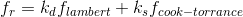

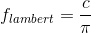

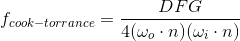

`BRDF` 는 다시 `NDF(Normal distribution function), G(Geometry function), F(Fresnel equation)` 으로 나누어진다.

다음은 `Trowbridge-Reitz GGX` 라고 알려진 NDF 수식이다.

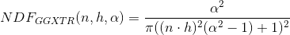

다음은 `Trowbridge-Reitz GGX` 의 구현이다.

```c
float DistributionGGX(vec3 N, vec3 H, float a)
{
    float a2     = a*a;
    float NdotH  = max(dot(N, H), 0.0);
    float NdotH2 = NdotH*NdotH;
	
    float nom    = a2;
    float denom  = (NdotH2 * (a2 - 1.0) + 1.0);
    denom        = PI * denom * denom;
	
    return nom / denom;
}
```

다음은 `Schlick-GGX` 라고 알려진 `Geometry function` 수식이다.

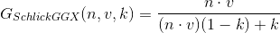

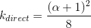

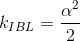

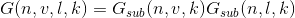

다음은 `Schlick-GGX` 의 구현이다.

```c
float GeometrySchlickGGX(float NdotV, float k)
{
    float nom   = NdotV;
    float denom = NdotV * (1.0 - k) + k;
	
    return nom / denom;
}
  
float GeometrySmith(vec3 N, vec3 V, vec3 L, float k)
{
    float NdotV = max(dot(N, V), 0.0);
    float NdotL = max(dot(N, L), 0.0);
    float ggx1 = GeometrySchlickGGX(NdotV, k);
    float ggx2 = GeometrySchlickGGX(NdotL, k);
	
    return ggx1 * ggx2;
}
```

다음은 `Fresnel-Schlick` 라고 알려진 `Fresnel equation` 수식이다.

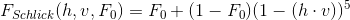

다음은 `` 의 구현이다.

```c
vec3 F0 = vec3(0.04);
F0      = mix(F0, surfaceColor.rgb, metalness);

vec3 fresnelSchlick(float cosTheta, vec3 F0)
{
    return F0 + (1.0 - F0) * pow(1.0 - cosTheta, 5.0);
}
```

앞서 언급한 것들을 조합한 `Cook-Torrance reflectance equation` 은
다음과 같다.

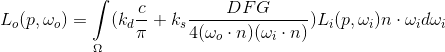

그러나 `k_{s}` 는 이미 `F` 에 포함되므로 생략하고 다음 수식을 사용한다.

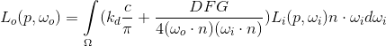
