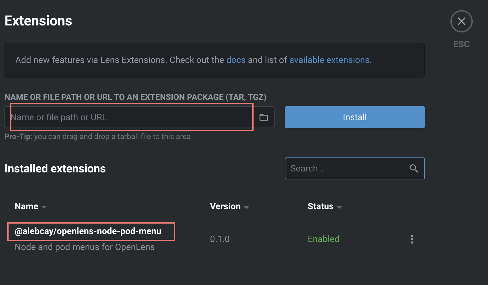

# Abstract

OpenLens 는 k8s GUI application 이다. binary build 는 [OpenLens Build Repo](https://github.com/MuhammedKalkan/OpenLens) 에서 다운받을 수 있다. 그러나 brew install 이 더욱 수월하다. node-shell, pod-shell, pod-log 는 extention 을 설치해야 이용할 수 있다.

# Materials

* [OpenLens Build Repo](https://github.com/MuhammedKalkan/OpenLens)
* [Lens 오픈소스 대체, OpenLens](https://blog.joe-brothers.com/kubernetes-lens-alternative-openlens/)

# Install

```
$ brew install --cask openlens
```

# Extentions

## openlens-node-pod-menu


