- [Abstract](#abstract)
- [Materials](#materials)
- [Computer System Architecture Overview](#computer-system-architecture-overview)
- [Stored Program Concept](#stored-program-concept)
- [Bus Overview](#bus-overview)
- [문자셋의 종류와 특징](#%eb%ac%b8%ec%9e%90%ec%85%8b%ec%9d%98-%ec%a2%85%eb%a5%98%ec%99%80-%ed%8a%b9%ec%a7%95)
- [MBCS, WBCS 동시 지원](#mbcs-wbcs-%eb%8f%99%ec%8b%9c-%ec%a7%80%ec%9b%90)
- [Procedure and Stack](#procedure-and-stack)
- [Process and Thread](#process-and-thread)
- [User Level Thread vs Kernel Level Thread](#user-level-thread-vs-kernel-level-thread)
- [Thread Scheduling](#thread-scheduling)
  - [Thread Status](#thread-status)
- [Thread synchronization](#thread-synchronization)
  - [Critical Section](#critical-section)
  - [Mutex](#mutex)
  - [Semaphore](#semaphore)
  - [Event](#event)
  - [Kernel Object](#kernel-object)
- [Memory Management](#memory-management)
- [Segmentation](#segmentation)
- [Paging](#paging)
- [Page Management](#page-management)
- [Processor Cache Management](#processor-cache-management)
- [Windows Cache Management](#windows-cache-management)
- [Userlevel and Kernellevel](#userlevel-and-kernellevel)
- [Execution file and Loader](#execution-file-and-loader)
- [Quiz](#quiz)

----

# Abstract

운영체제 (Operating System) 에 대해 정리한다. [Computer System Architecture](/csa/README.md) 의 내용을 먼저 이해해야 한다. [osimpl](/osimpl/README.md) 에서 실제로 구현해본다.

# Materials

* [뇌를 자극하는 윈도우즈 시스템 프로그래밍 @ youtube](https://www.youtube.com/playlist?list=PLVsNizTWUw7E2KrfnsyEjTqo-6uKiQoxc)
  * 쉽게 설명하는 동영상 강좌 
* [linux 0.01](https://github.com/zavg/linux-0.01)
  * 토발즈가 릴리즈한 최초 리눅스 커널
  * gcc 1.x 에서 빌드가 된다.
* [linux 0.01 remake](http://draconux.free.fr/os_dev/linux0.01_news.html)
  * gcc 4.x 에서 빌드가 되도록 수정된 fork
  * [src](https://github.com/issamabd/linux-0.01-remake)
* [linux 0.01 commentary](https://www.academia.edu/5267870/The_Linux_Kernel_0.01_Commentary)
* [linux 0.01 running on qemu](https://iamhjoo.tistory.com/11)
* [C++로 나만의 운영체제 만들기](http://www.yes24.com/Product/goods/64574002)
  * [src](https://github.com/pdpdds/SkyOS)
* [Source code listing for the Lions' Commentary in PDF and PostScript](http://v6.cuzuco.com/)
  * 역사가 깊은 유닉스 코드와 주석
  * [src](https://github.com/zrnsm/lions-source)
* [cracking the coding interview](http://www.crackingthecodinginterview.com/)
  * threads and lock quiz 가 볼만함
* [linux-insides](https://0xax.gitbooks.io/linux-insides/content/index.html)
  * [src](https://github.com/0xAX/linux-insides)
  * [번역](https://github.com/junsooo/linux-insides-ko) 
  * 리눅스 커널에 대해 설명한다.
* [밑바닥부터 만드는 컴퓨팅 시스템](https://www.nand2tetris.org/)
  * [번역서](http://www.yes24.com/Product/Goods/71129079?scode=032&OzSrank=1)
  * 블리언로직부터 운영체제까지 제작해보기
* [Windows Internals, Part 1: System architecture, processes, threads, memory management, and more (7th Edition)](https://www.amazon.com/Windows-Internals-Part-architecture-management/dp/0735684189)
  * [번역서](http://www.yes24.com/24/Goods/57905305?Acode=101#contentsConstitution)
  * 윈도우즈 커널 추천 도서
* [Linux Kernel Development (3rd Edition)](https://www.amazon.com/Linux-Kernel-Development-Robert-Love/dp/0672329468)
  * [번역서](http://www.yes24.com/24/Goods/7351874?Acode=101)
  * 리눅스 커널 추천 도서
* [Understanding the Linux Kernel, 3rd Edition](http://shop.oreilly.com/product/9780596005658.do)
  * [번역서](http://www.yes24.com/24/Goods/2157231?Acode=101)
  * 리눅스 커널 추천 도서
* [Understanding the Linux Virtual Memory Manager](https://www.amazon.com/Understanding-Linux-Virtual-Memory-Manager/dp/0131453483)
  * 리눅스 커널 추천 도서
* [Intel 80386 Reference Programmer's Manual](https://pdos.csail.mit.edu/6.828/2005/readings/i386/toc.htm)
* [Paging and Segmentation @ youtube](https://www.youtube.com/watch?v=5ioo7ezWn1U&list=PLWi7UcbOD_0uhZqGfWbpQ_Ym30ehQCeyq)
  *  virtual address to physical address translation 은 설명이 좋다.
* [Memory Management : Segmentation 2](http://anster.egloos.com/2138204)
  * 메모리 관리를 잘 정리한 블로그
* [High Performance Computer Architecture @ udacity](https://www.udacity.com/course/high-performance-computer-architecture--ud007)
  * 체계적인 인강 그러나 virtual address to physical address translation 은 설명이 부족하다.
* [Windows 구조와 원리](http://www.hanbit.co.kr/store/books/look.php?p_code=B6822670083)
  * 오래전에 출간되어 절판되었지만 한글로 된 책들중 최강이다.
* [Write Great Code I](http://www.plantation-productions.com/Webster/www.writegreatcode.com/)
  * 킹왕짱
* [google interview university @ github](https://github.com/jwasham/coding-interview-university)
  * operating system 관련된 링크를 참고하자. 쓸만한 비디오가 잘 정리되어 있다.

# Computer System Architecture Overview

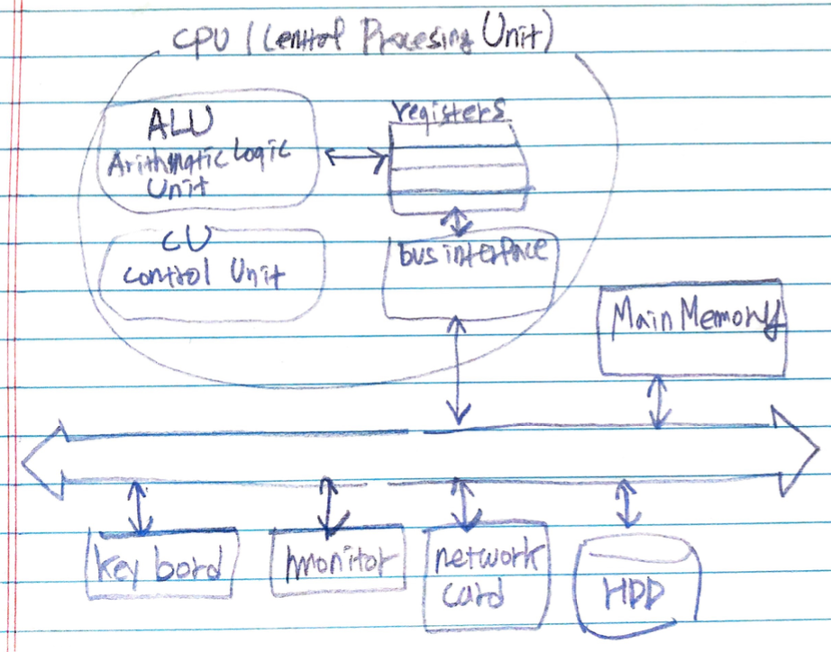

# Stored Program Concept

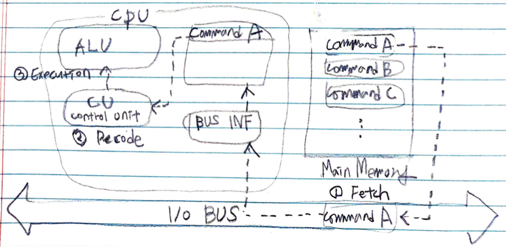

[Von Neumann Architecture](/csa/README.md) 라고도 한다. fetch, decode, execute 과정으로 프로그램을 실행한다.

* fetch
  * CPU 내부로 명령어 이동
* decode
  * 명령어 해석
  * 컨트롤 유닛
* execution
  * 연산을 진행
  * 보통은 ALU 를 생각

# Bus Overview

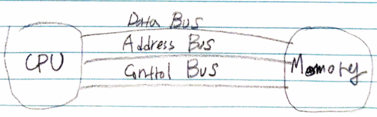

Bus 의 종류는 Data Bus, Address Bus, Control Bus 가 있다.

* Data Bus
  * 데이터 이동
* Address Bus
  * 메모리 주소 이동
* Control Bus
  * 컨트롤 신호 이동   

# 문자셋의 종류와 특징

문자셋은 다음과 같은 종류가 있다.

* SBCS (single byte character set)
  * 문자를 표현하는데 1 바이트 사용
  * 아스키코드
* MBCS (multi byte character set)
  * 한글은 2 바이트, 영문은 1 바이트를 사용
* WBCS (wide byte character set)
  * 문자를 표현하는데 SBCS 의 두배 즉 2 바이트를 사용하겠다. 
  * 유니코드

한글은 MBCS 로 구현하면 `strlen` 이 제대로 동작하지 않는다. WBCS 를 이용하자. WBCS 를 이용하려면 SBCS API 에 대응되는 WBCS API 를 사용한다. (`strlen vs wcslen`)  

application 을 WBCS 로 구현하려면 `int main(int argc, char* argv[])` 대신 `int wmain(int argc, wchar_t* argv[])` 를 사용해야 한다.

# MBCS, WBCS 동시 지원

`char, wchar_t` 를 동시에 지원하기 위해 `windows.h` 에 다음과 같이 정의되어 있다. `UNICODE` 를 선언하면 WBCS 를 구현할 수 있다.

```c
#ifdef UNICODE
  typedef WCHAR   TCHAR;
  typedef LPWSTR  LPTSTR;
  typedef LPCWSTR LPCTSTR;  
#else
  typedef CHAR   TCHAR;
  typedef LPSTR  LPTSTR;
  typedef LPCSTR LPCTSTR;  
#endif
```

* `UNICODE` 가 선언되어 있다면 

```c
TCHAR arr[10] => WCHAR arr[10] => wchar_t arr[10] 
```

* `UNICODE` 가 선언되어 있지 않다면

```c
TCHAR arr[10] => CHAR arr[10] => char arr[10] 
```

또한 `"", L""` 을 동시에 지원하기 위해 `windows.h` 에 다음과 같이 정의되어 있다.

```c
#ifdef _UNICODE
  #define __T(x)  L ## x
#else
  #define __T(x)  x
#endif

#define _T(x)  __T(x)
#define _TEXT(x)  __T(x)
```

따라서 `UNICODE` 가 정의되어 있으면 `_T("A") => __T("A") => L"A"` 이다. 그리고 `UNICODE` 가 정의되어 있지 않으면 `_T("A") => __T("A") => "A"` 이다.

또한 `strlen, wcslen` 과 같은 API 를 동시에 지원하기 위해 `windows.h` 에 다음과 같이 정의도어 있다.

```c
#ifdef _UNICODE
  #define _tmain wmain
  #define _tcslen wcslen
  #define _tprintf wprintf
  #define _tscanf wscanf
#else
  #define _tmain main
  #define _tcslen strlen
  #define _tprintf printf
  #define _tscanf scanf
#endif
```

# Procedure and Stack

쓰레드가 태어나면 Virtual Memory 에 stack 을 위한 공간이 마련된다. 함수가 호출되면 그 함수의 parameter 들이 오른쪽에서 왼쪽으로 stack 에 저장된다. 이후 return address, old EBP 등이 stack 에 저장된다. 


함수가 호출될 때 parameter 들을 어떻게 처리하는지에 대한 규약을 calling convention 이라고 하고 `__cdecl, __stdcall, __fastcall` 등이 있다. `__cdecl` 은 함수를 호출한 쪽에서 parameter 들을 해제한다. `__stdcall` 은 호출된 함수 쪽에서 parameter 들을 해제한다. `__fastcall` 은 두개까지의 parameter 들은 ECX, EDX 레지스터에 저장하고 호출된 함수 쪽에서 parameter 들을 해제한다.

compiler 는 linker 에게 산출물을 전달할 때 함수, 변수 등의 이름을 일정한 규칙을 가지고 변경하게 되는데 이것을 name mangling 혹은 name decoration 이라고 한다. 일반적으로 함수의 이름, 파라미터 타입, calling convention 등을 사용하여 이름을 만들어 낸다. name mangling 은 compiler 마다 다르기 때문에 각 메뉴얼을 참고하자.

# Process and Thread

윈도우즈의 유저레벨 프로세스는 다음과 같이 EPROCESS 구조체로 구현한다. [참고](https://www.nirsoft.net/kernel_struct/vista/EPROCESS.html)

```c	
struct EPROCESS
typedef struct _EPROCESS
{
     KPROCESS Pcb;
     EX_PUSH_LOCK ProcessLock;
     LARGE_INTEGER CreateTime;
     LARGE_INTEGER ExitTime;
     EX_RUNDOWN_REF RundownProtect;
     PVOID UniqueProcessId;
     LIST_ENTRY ActiveProcessLinks;
     ULONG QuotaUsage[3];
     ULONG QuotaPeak[3];
     ULONG CommitCharge;
     ULONG PeakVirtualSize;
     ULONG VirtualSize;
     LIST_ENTRY SessionProcessLinks;
     PVOID DebugPort;
     union
     {
          PVOID ExceptionPortData;
          ULONG ExceptionPortValue;
          ULONG ExceptionPortState: 3;
     };
     PHANDLE_TABLE ObjectTable;
     EX_FAST_REF Token;
     ULONG WorkingSetPage;
     EX_PUSH_LOCK AddressCreationLock;
     PETHREAD RotateInProgress;
     PETHREAD ForkInProgress;
     ULONG HardwareTrigger;
     PMM_AVL_TABLE PhysicalVadRoot;
     PVOID CloneRoot;
     ULONG NumberOfPrivatePages;
     ULONG NumberOfLockedPages;
     PVOID Win32Process;
     PEJOB Job;
     PVOID SectionObject;
     PVOID SectionBaseAddress;
     _EPROCESS_QUOTA_BLOCK * QuotaBlock;
     _PAGEFAULT_HISTORY * WorkingSetWatch;
     PVOID Win32WindowStation;
     PVOID InheritedFromUniqueProcessId;
     PVOID LdtInformation;
     PVOID VadFreeHint;
     PVOID VdmObjects;
     PVOID DeviceMap;
     PVOID EtwDataSource;
     PVOID FreeTebHint;
     union
     {
          HARDWARE_PTE PageDirectoryPte;
          UINT64 Filler;
     };
     PVOID Session;
     UCHAR ImageFileName[16];
     LIST_ENTRY JobLinks;
     PVOID LockedPagesList;
     LIST_ENTRY ThreadListHead;
     PVOID SecurityPort;
     PVOID PaeTop;
     ULONG ActiveThreads;
     ULONG ImagePathHash;
     ULONG DefaultHardErrorProcessing;
     LONG LastThreadExitStatus;
     PPEB Peb;
     EX_FAST_REF PrefetchTrace;
     LARGE_INTEGER ReadOperationCount;
     LARGE_INTEGER WriteOperationCount;
     LARGE_INTEGER OtherOperationCount;
     LARGE_INTEGER ReadTransferCount;
     LARGE_INTEGER WriteTransferCount;
     LARGE_INTEGER OtherTransferCount;
     ULONG CommitChargeLimit;
     ULONG CommitChargePeak;
     PVOID AweInfo;
     SE_AUDIT_PROCESS_CREATION_INFO SeAuditProcessCreationInfo;
     MMSUPPORT Vm;
     LIST_ENTRY MmProcessLinks;
     ULONG ModifiedPageCount;
     ULONG Flags2;
     ULONG JobNotReallyActive: 1;
     ULONG AccountingFolded: 1;
     ULONG NewProcessReported: 1;
     ULONG ExitProcessReported: 1;
     ULONG ReportCommitChanges: 1;
     ULONG LastReportMemory: 1;
     ULONG ReportPhysicalPageChanges: 1;
     ULONG HandleTableRundown: 1;
     ULONG NeedsHandleRundown: 1;
     ULONG RefTraceEnabled: 1;
     ULONG NumaAware: 1;
     ULONG ProtectedProcess: 1;
     ULONG DefaultPagePriority: 3;
     ULONG PrimaryTokenFrozen: 1;
     ULONG ProcessVerifierTarget: 1;
     ULONG StackRandomizationDisabled: 1;
     ULONG Flags;
     ULONG CreateReported: 1;
     ULONG NoDebugInherit: 1;
     ULONG ProcessExiting: 1;
     ULONG ProcessDelete: 1;
     ULONG Wow64SplitPages: 1;
     ULONG VmDeleted: 1;
     ULONG OutswapEnabled: 1;
     ULONG Outswapped: 1;
     ULONG ForkFailed: 1;
     ULONG Wow64VaSpace4Gb: 1;
     ULONG AddressSpaceInitialized: 2;
     ULONG SetTimerResolution: 1;
     ULONG BreakOnTermination: 1;
     ULONG DeprioritizeViews: 1;
     ULONG WriteWatch: 1;
     ULONG ProcessInSession: 1;
     ULONG OverrideAddressSpace: 1;
     ULONG HasAddressSpace: 1;
     ULONG LaunchPrefetched: 1;
     ULONG InjectInpageErrors: 1;
     ULONG VmTopDown: 1;
     ULONG ImageNotifyDone: 1;
     ULONG PdeUpdateNeeded: 1;
     ULONG VdmAllowed: 1;
     ULONG SmapAllowed: 1;
     ULONG ProcessInserted: 1;
     ULONG DefaultIoPriority: 3;
     ULONG SparePsFlags1: 2;
     LONG ExitStatus;
     WORD Spare7;
     union
     {
          struct
          {
               UCHAR SubSystemMinorVersion;
               UCHAR SubSystemMajorVersion;
          };
          WORD SubSystemVersion;
     };
     UCHAR PriorityClass;
     MM_AVL_TABLE VadRoot;
     ULONG Cookie;
     ALPC_PROCESS_CONTEXT AlpcContext;
} EPROCESS, *PEPROCESS;
```

EPROCESS의 중요한 멤버는 다음과 같다.

| member field | description |
|:------------|:-----------|
| DirectoryTableBase | 가상 메모리의 CR3 레지스터값 |
| LdtDescriptor | 16비트 애플리케이션에서 사용되는 LDT 디스크립터 |
| Int21Descriptor | 16비트 애플리케이션에서 인터럽트 21의 디스크립터 |
| IopmOffset | IO 허용 비트의 Offset |
| Iopl | IO 특권레벨 (0일 경우 커널모드만 허용, 3일 경우 유저모드까지 허용 |
| ActiveProcessors | 현재 활성화 되어있는 CPU 개수 |
| KernelTime | 이 프로세스가 커널레벨에서 소비한 시간 단위 개수 |
| UserTime | 이 프로세스가 유저레벨에서 소비한 시간 단위 개수 |
| ReadyListHead | 현재 준비 상태에 있는 쓰레드의 리스트 |
| SwapListEntry | 현재 스와핑이 되고 있는 쓰레드의 리스트 |
| ThreadListHead | 이 프로세스가 가지고 있는 쓰레드 목록 |
| ProcessLock | 이 프로세스가 접근시 사용하는 동기화 객체 |
| Affinity | 멀티 코어 CPU 에서 이 프로세스의 Affinity |
| StackCount | 이 프로세스에서 사용하는 스택 개수 |
| BasePriority | 프로세스 우선순위 (0~15) |
| ThreadQuantum | 이 프로세스에서 생성되는 쓰레드의 기본 퀀텀 값 |
| CreateTime | 이 프로세스의 생성 시간 |
| UniqueProcessId | 이 프로세스의 고유 아이디 |
| ActiveProcessLinks | 모든 프로세스의 목록 |
| CommitCharge | 이 프로세스가 사용하는 물리 메모리 크기 |
| PeakPagefileUsage | 최고 페이지파일 사용 크기 |
| PeakVirtualSize | 최고 가상 메모리 크기 |
| VirtualSize | 가상 메모리 크기 |
| WorkingSetSize | 이 프로세스의 워킹세트 크기 |
| DebugPort | 디버깅 상태일 때 LPC 포트 |
| Token | 프로세스의 토큰 정보 |
| WorkingSetLock | Working Set 조정 시 사용되는 Lock |
| WorkingSetPage | Working Set에 의한 Page 개수 |
| AddressCreationLock | 이 프로세스에서 메모리 생성시 사용되는 Lock |
| VadRoot | 유저 메모리 영역을 설명하는 VAD pointer |
| NumberOfPriatePages | 이 프로세스의 프라이빗 페이지 개수 |
| NumberOfLockedPages | 락 되어진 페이지 개수 |
| Peb | Process Environment Block |
| SectionBaseAddress | 프로세스 세션 베이스 주소, 주로 이미지의 베이스 주소 |
| WorkingSetWatch | 페이지 폴트 발생 시 저장되는 히스토리 |
| Win32WindowStation | 현재 실행되는 프로세스의 Window Station ID |
| InheritedFromUniqueProcessId | 부모 프로세스의 ID |
| LdtInformation | 이 프로세스의 LDT 정보를 지시 |
| VdmObjects | 16비트 프로그램일 때 사용됨 |
| DeviceMap | 이 프로세스에서 사용할 수 있는 DOS의 디바이스 맵 |
| SessionId | 터미널 서비스의 세션 ID |
| ImageFileName | 이 프로세스의 이름 |
| PriorityClass | 이 프로세스의 우선순위 |
| SubSystemMinorVersion | 서브시스템의 마이너 버전 |
| SubSystemMajorVersion | 서브시스템의 메이저 버전 |
| SubSystemVersion | 서브시스템 버전 |
| LockedPageList | 이 페이지에서 락 되어진 페이지의 리스트 |
| ReadOperationCount | I/O Read 개수 |
| WriteOperationCount | I/O Write 개수 |
| CommitChargeLimit | 최대로 사용할 수 있는 물리 메모리 크기 |
| CommitChargePeak | 최대로 사용된 물리 메모리 크기 |

윈도우즈의 커널레벨 프로세스는 다음과 같이 KPROCESS 로 구현한다. [참고](https://www.nirsoft.net/kernel_struct/vista/KPROCESS.html)

```c
typedef struct _KPROCESS
{
     DISPATCHER_HEADER Header;
     LIST_ENTRY ProfileListHead;
     ULONG DirectoryTableBase;
     ULONG Unused0;
     KGDTENTRY LdtDescriptor;
     KIDTENTRY Int21Descriptor;
     WORD IopmOffset;
     UCHAR Iopl;
     UCHAR Unused;
     ULONG ActiveProcessors;
     ULONG KernelTime;
     ULONG UserTime;
     LIST_ENTRY ReadyListHead;
     SINGLE_LIST_ENTRY SwapListEntry;
     PVOID VdmTrapcHandler;
     LIST_ENTRY ThreadListHead;
     ULONG ProcessLock;
     ULONG Affinity;
     union
     {
          ULONG AutoAlignment: 1;
          ULONG DisableBoost: 1;
          ULONG DisableQuantum: 1;
          ULONG ReservedFlags: 29;
          LONG ProcessFlags;
     };
     CHAR BasePriority;
     CHAR QuantumReset;
     UCHAR State;
     UCHAR ThreadSeed;
     UCHAR PowerState;
     UCHAR IdealNode;
     UCHAR Visited;
     union
     {
          KEXECUTE_OPTIONS Flags;
          UCHAR ExecuteOptions;
     };
     ULONG StackCount;
     LIST_ENTRY ProcessListEntry;
     UINT64 CycleTime;
} KPROCESS, *PKPROCESS;
```

윈도우즈의 유저레벨 쓰레드는 다음과 같이 ETHREAD 구조체로 구현한다. [참고](https://www.nirsoft.net/kernel_struct/vista/ETHREAD.html)

```c
typedef struct _ETHREAD
{
     KTHREAD Tcb;
     LARGE_INTEGER CreateTime;
     union
     {
          LARGE_INTEGER ExitTime;
          LIST_ENTRY KeyedWaitChain;
     };
     union
     {
          LONG ExitStatus;
          PVOID OfsChain;
     };
     union
     {
          LIST_ENTRY PostBlockList;
          struct
          {
               PVOID ForwardLinkShadow;
               PVOID StartAddress;
          };
     };
     union
     {
          PTERMINATION_PORT TerminationPort;
          PETHREAD ReaperLink;
          PVOID KeyedWaitValue;
          PVOID Win32StartParameter;
     };
     ULONG ActiveTimerListLock;
     LIST_ENTRY ActiveTimerListHead;
     CLIENT_ID Cid;
     union
     {
          KSEMAPHORE KeyedWaitSemaphore;
          KSEMAPHORE AlpcWaitSemaphore;
     };
     PS_CLIENT_SECURITY_CONTEXT ClientSecurity;
     LIST_ENTRY IrpList;
     ULONG TopLevelIrp;
     PDEVICE_OBJECT DeviceToVerify;
     _PSP_RATE_APC * RateControlApc;
     PVOID Win32StartAddress;
     PVOID SparePtr0;
     LIST_ENTRY ThreadListEntry;
     EX_RUNDOWN_REF RundownProtect;
     EX_PUSH_LOCK ThreadLock;
     ULONG ReadClusterSize;
     LONG MmLockOrdering;
     ULONG CrossThreadFlags;
     ULONG Terminated: 1;
     ULONG ThreadInserted: 1;
     ULONG HideFromDebugger: 1;
     ULONG ActiveImpersonationInfo: 1;
     ULONG SystemThread: 1;
     ULONG HardErrorsAreDisabled: 1;
     ULONG BreakOnTermination: 1;
     ULONG SkipCreationMsg: 1;
     ULONG SkipTerminationMsg: 1;
     ULONG CopyTokenOnOpen: 1;
     ULONG ThreadIoPriority: 3;
     ULONG ThreadPagePriority: 3;
     ULONG RundownFail: 1;
     ULONG SameThreadPassiveFlags;
     ULONG ActiveExWorker: 1;
     ULONG ExWorkerCanWaitUser: 1;
     ULONG MemoryMaker: 1;
     ULONG ClonedThread: 1;
     ULONG KeyedEventInUse: 1;
     ULONG RateApcState: 2;
     ULONG SelfTerminate: 1;
     ULONG SameThreadApcFlags;
     ULONG Spare: 1;
     ULONG StartAddressInvalid: 1;
     ULONG EtwPageFaultCalloutActive: 1;
     ULONG OwnsProcessWorkingSetExclusive: 1;
     ULONG OwnsProcessWorkingSetShared: 1;
     ULONG OwnsSystemWorkingSetExclusive: 1;
     ULONG OwnsSystemWorkingSetShared: 1;
     ULONG OwnsSessionWorkingSetExclusive: 1;
     ULONG OwnsSessionWorkingSetShared: 1;
     ULONG OwnsProcessAddressSpaceExclusive: 1;
     ULONG OwnsProcessAddressSpaceShared: 1;
     ULONG SuppressSymbolLoad: 1;
     ULONG Prefetching: 1;
     ULONG OwnsDynamicMemoryShared: 1;
     ULONG OwnsChangeControlAreaExclusive: 1;
     ULONG OwnsChangeControlAreaShared: 1;
     ULONG PriorityRegionActive: 4;
     UCHAR CacheManagerActive;
     UCHAR DisablePageFaultClustering;
     UCHAR ActiveFaultCount;
     ULONG AlpcMessageId;
     union
     {
          PVOID AlpcMessage;
          ULONG AlpcReceiveAttributeSet;
     };
     LIST_ENTRY AlpcWaitListEntry;
     ULONG CacheManagerCount;
} ETHREAD, *PETHREAD;
```

ETHREAD 의 중요한 멤버는 다음과 같다.

| member field | description |
|:------------|:-----------|
| InitialStack | 커널 스택의 낮은 주소 |
| StackLimit | 커널 스택의 높은 주소 |
| Kernel Stack | 커널 모드에서 현재 스택 포인터 (ESP) |
| DebugActive | 디버깅 중인가? |
| State | 현재 쓰레드 상태 |
| Iopl | IOPL |
| NpxState | Floating Point 상태 정보 |
| Priority | 우선순위 |
| ContextSwitches | 쓰레드 스위칭 횟수 |
| WaitIrql | 현재 Wait 상태에서 IRQL |
| WaitListEntry | 현재 상태가 Wait인 쓰레드 목록 |
| BasePriority | 이 쓰레드의 베이스 우선순위 |
| Quantum | 이 쓰레드의 퀀컴 값 |
| ServiceTable | 서비스 테이블 |
| Affinity | 커널에서의 쓰레드 Affinity |
| Preempted | 선점 여부 |
| KernelStackResident | 쓰레드 커널 스택이 쓰레드 종료 후에도 메모리에 있는가 |
| NextProcessor | 스케줄러에 의해 결정된 다음번 실행시 사용될 CPU |
| TrapFrame | Exception 발생시 사용될 트랩 프레임 포인터 |
| PreviousMode | 이전의 모드가 유저모드인가 커널모드인가, 시스템 함수 호출에서 유효성을 체크하는데 사용되어진다. |
| KernelTime | 커널모드에서 이 쓰레드가 수행된 시간 |
| UserTime | 유저모드에서 이 쓰레드가 수행된 시간 |
| Alertable | Alertable 상태 |
| StackBase | 이 쓰레드의 스택 베이스 주소 |
| ThreadListEntry | 프로세서가 가지고 있는 모든 쓰레드들의 목록 |
| CreateTime | 생성시간 |
| ExitTime | 종료시간 |
| ExitStatus | exit status |
| PostBlockList | 이 쓰레드가 참조하는 모든 Object들의 리스트 |
| ActiveTimerListHead | 이 쓰레드에 활성화된 타이머 리스트 |
| UniqueThread | 이 쓰레드의 고유한 번호 |
| ImpersonationInfo | 임퍼스네이션 정보 |

다음은 커널 쓰레드를 구현한 KTHREAD 이다. [참고](https://www.nirsoft.net/kernel_struct/vista/KTHREAD.html)

```c
typedef struct _KTHREAD
{
     DISPATCHER_HEADER Header;
     UINT64 CycleTime;
     ULONG HighCycleTime;
     UINT64 QuantumTarget;
     PVOID InitialStack;
     PVOID StackLimit;
     PVOID KernelStack;
     ULONG ThreadLock;
     union
     {
          KAPC_STATE ApcState;
          UCHAR ApcStateFill[23];
     };
     CHAR Priority;
     WORD NextProcessor;
     WORD DeferredProcessor;
     ULONG ApcQueueLock;
     ULONG ContextSwitches;
     UCHAR State;
     UCHAR NpxState;
     UCHAR WaitIrql;
     CHAR WaitMode;
     LONG WaitStatus;
     union
     {
          PKWAIT_BLOCK WaitBlockList;
          PKGATE GateObject;
     };
     union
     {
          ULONG KernelStackResident: 1;
          ULONG ReadyTransition: 1;
          ULONG ProcessReadyQueue: 1;
          ULONG WaitNext: 1;
          ULONG SystemAffinityActive: 1;
          ULONG Alertable: 1;
          ULONG GdiFlushActive: 1;
          ULONG Reserved: 25;
          LONG MiscFlags;
     };
     UCHAR WaitReason;
     UCHAR SwapBusy;
     UCHAR Alerted[2];
     union
     {
          LIST_ENTRY WaitListEntry;
          SINGLE_LIST_ENTRY SwapListEntry;
     };
     PKQUEUE Queue;
     ULONG WaitTime;
     union
     {
          struct
          {
               SHORT KernelApcDisable;
               SHORT SpecialApcDisable;
          };
          ULONG CombinedApcDisable;
     };
     PVOID Teb;
     union
     {
          KTIMER Timer;
          UCHAR TimerFill[40];
     };
     union
     {
          ULONG AutoAlignment: 1;
          ULONG DisableBoost: 1;
          ULONG EtwStackTraceApc1Inserted: 1;
          ULONG EtwStackTraceApc2Inserted: 1;
          ULONG CycleChargePending: 1;
          ULONG CalloutActive: 1;
          ULONG ApcQueueable: 1;
          ULONG EnableStackSwap: 1;
          ULONG GuiThread: 1;
          ULONG ReservedFlags: 23;
          LONG ThreadFlags;
     };
     union
     {
          KWAIT_BLOCK WaitBlock[4];
          struct
          {
               UCHAR WaitBlockFill0[23];
               UCHAR IdealProcessor;
          };
          struct
          {
               UCHAR WaitBlockFill1[47];
               CHAR PreviousMode;
          };
          struct
          {
               UCHAR WaitBlockFill2[71];
               UCHAR ResourceIndex;
          };
          UCHAR WaitBlockFill3[95];
     };
     UCHAR LargeStack;
     LIST_ENTRY QueueListEntry;
     PKTRAP_FRAME TrapFrame;
     PVOID FirstArgument;
     union
     {
          PVOID CallbackStack;
          ULONG CallbackDepth;
     };
     PVOID ServiceTable;
     UCHAR ApcStateIndex;
     CHAR BasePriority;
     CHAR PriorityDecrement;
     UCHAR Preempted;
     UCHAR AdjustReason;
     CHAR AdjustIncrement;
     UCHAR Spare01;
     CHAR Saturation;
     ULONG SystemCallNumber;
     ULONG Spare02;
     ULONG UserAffinity;
     PKPROCESS Process;
     ULONG Affinity;
     PKAPC_STATE ApcStatePointer[2];
     union
     {
          KAPC_STATE SavedApcState;
          UCHAR SavedApcStateFill[23];
     };
     CHAR FreezeCount;
     CHAR SuspendCount;
     UCHAR UserIdealProcessor;
     UCHAR Spare03;
     UCHAR Iopl;
     PVOID Win32Thread;
     PVOID StackBase;
     union
     {
          KAPC SuspendApc;
          struct
          {
               UCHAR SuspendApcFill0[1];
               CHAR Spare04;
          };
          struct
          {
               UCHAR SuspendApcFill1[3];
               UCHAR QuantumReset;
          };
          struct
          {
               UCHAR SuspendApcFill2[4];
               ULONG KernelTime;
          };
          struct
          {
               UCHAR SuspendApcFill3[36];
               PKPRCB WaitPrcb;
          };
          struct
          {
               UCHAR SuspendApcFill4[40];
               PVOID LegoData;
          };
          UCHAR SuspendApcFill5[47];
     };
     UCHAR PowerState;
     ULONG UserTime;
     union
     {
          KSEMAPHORE SuspendSemaphore;
          UCHAR SuspendSemaphorefill[20];
     };
     ULONG SListFaultCount;
     LIST_ENTRY ThreadListEntry;
     LIST_ENTRY MutantListHead;
     PVOID SListFaultAddress;
     PVOID MdlForLockedTeb;
} KTHREAD, *PKTHREAD;
```

# User Level Thread vs Kernel Level Thread

* [11장. 커널 레벨 쓰레드와 유저 레벨 쓰레드 @ youtube](https://www.youtube.com/watch?v=sOt80Kw0Ols&list=PLVsNizTWUw7E2KrfnsyEjTqo-6uKiQoxc&index=30)

----

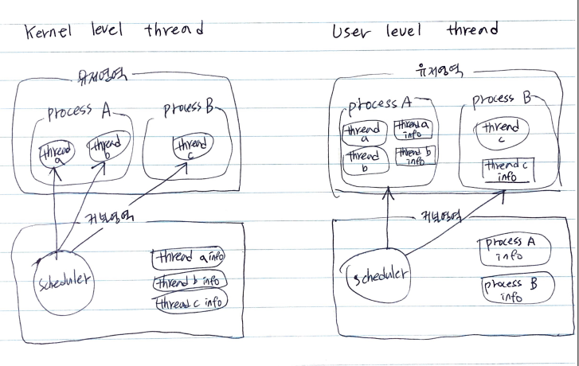

kernel level thread 는 kernel level 에서 scheduling 된다. 따라서 하나의 process 가 두개 이상의 kernel level thread 를 소유하고 있을 때 그 중 하나가 I/O block 되더라도 다른 thread 는 계속 실행할 수 있다. 또한 kernel 에서 직접 제공해주기 때문에 안전성과 기능의 다양성이 장점이다. 그러나 O/S 가 kernel level thread 를 context switching 하기 위해서는 user level 에서 kernel level 로 전환되야 하기 때문에 느리다. 

user level thread 는 user level 에서 scheduling 된다. kernel 은 user level thread 를 포함한 process 단위로 scheduling 한다. kernel 은 user level thread 를 알 수 없다. 따라서 user level thread 중 하나가 I/O 블록이 되면 kernel 은 그 thread 를 소유한 process 의 상태를 running 에서 ready 로 바꾼다. user level thread 는 context switching 될 때 O/S 가 user level 에서 kernel level 로 전환할 필요가 없다. 따라서 user level thread 는 context switching 이 kernel level thread 보다 빠르다.

Linux kernel 은 2.6 이전에 process 단위로 scheduling 되었다. [참고](https://en.wikipedia.org/wiki/Native_POSIX_Thread_Library). pthread 는 NPTL (Native Posix Thread Library) 이다. 따라서 1:1 thread library 이고 `pthread_create` 을 통해서 kernel level thread 를 만들어 낼 수 있다.

# Thread Scheduling

## Thread Status

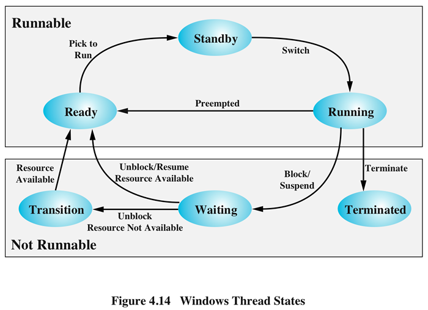

쓰레드가 프로세서를 선점하고 있을 때 다른 쓰레드가 우선순위에 의해 프로세서를 선점하는 스케줄링 방식을 preemptive scheduling 이라고 한다. 쓰레드가 프로세서를 선점하고 있는 동안 다른 쓰레드가 프로세서를 선점하지 못하는 스케줄링 방식을 Nonpreemptive Shceduling 이라고 한다. 윈도우즈는 기본적으로 preemptive shceduling 을 사용한다. 

윈도우즈는 선점형 스케줄링을 구현하기 위하여 타이머 인터럽트를 사용한다. 윈도우즈가 타이머 인터럽트를 받을 때 마다 실행되고 있는 쓰레드의 퀀텀을 감소시키고 이 값이 0 이하로 떨어지면 이 쓰레드의 할당 시간은 만료된 것으로 처리하고 DPC (Defered Procedure Call) 큐에 DPC 를 하나 삽입한다. IRQL (Interrupt Request Level) 이 DPC/dispatch level 이하로 떨어지면 DPC 인터럽트가 발생하고 윈도우즈의 Dispatcher 가 깨어나서 DPC 큐에서 DPC 를 하나 꺼내 실행한다. DPC 가 하나 실행될 때 마다 쓰레드가 실행되겠지?

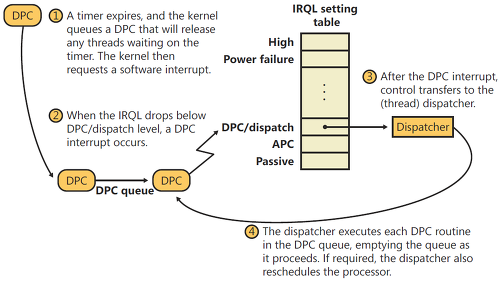

# Thread synchronization

## Critical Section

유저레벨에서 간단히 사용할 수 있는 동기화 방법이다. 커널 객체를 바로 사용하지 않기 때문에 속도가 빠르다. 동일한 프로세스에서 사용 가능하다.

```cpp
// Global variable
CRITICAL_SECTION CriticalSection; 

int main( void )
{
    ...

    // Initialize the critical section one time only.
    if (!InitializeCriticalSectionAndSpinCount(&CriticalSection, 
        0x00000400) ) 
        return;
    ...

    // Release resources used by the critical section object.
    DeleteCriticalSection(&CriticalSection);
}

DWORD WINAPI ThreadProc( LPVOID lpParameter )
{
    ...

    // Request ownership of the critical section.
    EnterCriticalSection(&CriticalSection); 

    // Access the shared resource.

    // Release ownership of the critical section.
    LeaveCriticalSection(&CriticalSection);

    ...
return 1;
}
```

## Mutex

커널객체를 사용하는 동기방법중 하나이다. 동일한 프로세스에서 사용해야 하는 제한이 없다.

```cpp
#include <windows.h>
#include <stdio.h>

#define THREADCOUNT 2

HANDLE ghMutex; 

DWORD WINAPI WriteToDatabase( LPVOID );

int main( void )
{
    HANDLE aThread[THREADCOUNT];
    DWORD ThreadID;
    int i;

    // Create a mutex with no initial owner

    ghMutex = CreateMutex( 
        NULL,              // default security attributes
        FALSE,             // initially not owned
        NULL);             // unnamed mutex

    if (ghMutex == NULL) 
    {
        printf("CreateMutex error: %d\n", GetLastError());
        return 1;
    }

    // Create worker threads

    for( i=0; i < THREADCOUNT; i++ )
    {
        aThread[i] = CreateThread( 
                     NULL,       // default security attributes
                     0,          // default stack size
                     (LPTHREAD_START_ROUTINE) WriteToDatabase, 
                     NULL,       // no thread function arguments
                     0,          // default creation flags
                     &ThreadID); // receive thread identifier

        if( aThread[i] == NULL )
        {
            printf("CreateThread error: %d\n", GetLastError());
            return 1;
        }
    }

    // Wait for all threads to terminate

    WaitForMultipleObjects(THREADCOUNT, aThread, TRUE, INFINITE);

    // Close thread and mutex handles

    for( i=0; i < THREADCOUNT; i++ )
        CloseHandle(aThread[i]);

    CloseHandle(ghMutex);

    return 0;
}

DWORD WINAPI WriteToDatabase( LPVOID lpParam )
{ 
    // lpParam not used in this example
    UNREFERENCED_PARAMETER(lpParam);

    DWORD dwCount=0, dwWaitResult; 

    // Request ownership of mutex.

    while( dwCount < 20 )
    { 
        dwWaitResult = WaitForSingleObject( 
            ghMutex,    // handle to mutex
            INFINITE);  // no time-out interval
 
        switch (dwWaitResult) 
        {
            // The thread got ownership of the mutex
            case WAIT_OBJECT_0: 
                __try { 
                    // TODO: Write to the database
                    printf("Thread %d writing to database...\n", 
                            GetCurrentThreadId());
                    dwCount++;
                } 

                __finally { 
                    // Release ownership of the mutex object
                    if (! ReleaseMutex(ghMutex)) 
                    { 
                        // Handle error.
                    } 
                } 
                break; 

            // The thread got ownership of an abandoned mutex
            // The database is in an indeterminate state
            case WAIT_ABANDONED: 
                return FALSE; 
        }
    }
    return TRUE; 
}
```

## Semaphore

커널객체를 사용하는 동기방법중 하나이다. 동일한 프로세스에서 사용해야 하는 제한이 없다. Mutex 는 한번에 하나의 스레드만이 자원에 접근할 수 있지만 semaphore 는 지정한 개수만큼의 스레드가 자원에 접근할 수 있다.

```cpp
#include <windows.h>
#include <stdio.h>

#define MAX_SEM_COUNT 10
#define THREADCOUNT 12

HANDLE ghSemaphore;

DWORD WINAPI ThreadProc( LPVOID );

int main( void )
{
    HANDLE aThread[THREADCOUNT];
    DWORD ThreadID;
    int i;

    // Create a semaphore with initial and max counts of MAX_SEM_COUNT

    ghSemaphore = CreateSemaphore( 
        NULL,           // default security attributes
        MAX_SEM_COUNT,  // initial count
        MAX_SEM_COUNT,  // maximum count
        NULL);          // unnamed semaphore

    if (ghSemaphore == NULL) 
    {
        printf("CreateSemaphore error: %d\n", GetLastError());
        return 1;
    }

    // Create worker threads

    for( i=0; i < THREADCOUNT; i++ )
    {
        aThread[i] = CreateThread( 
                     NULL,       // default security attributes
                     0,          // default stack size
                     (LPTHREAD_START_ROUTINE) ThreadProc, 
                     NULL,       // no thread function arguments
                     0,          // default creation flags
                     &ThreadID); // receive thread identifier

        if( aThread[i] == NULL )
        {
            printf("CreateThread error: %d\n", GetLastError());
            return 1;
        }
    }

    // Wait for all threads to terminate

    WaitForMultipleObjects(THREADCOUNT, aThread, TRUE, INFINITE);

    // Close thread and semaphore handles

    for( i=0; i < THREADCOUNT; i++ )
        CloseHandle(aThread[i]);

    CloseHandle(ghSemaphore);

    return 0;
}

DWORD WINAPI ThreadProc( LPVOID lpParam )
{

    // lpParam not used in this example
    UNREFERENCED_PARAMETER(lpParam);

    DWORD dwWaitResult; 
    BOOL bContinue=TRUE;

    while(bContinue)
    {
        // Try to enter the semaphore gate.

        dwWaitResult = WaitForSingleObject( 
            ghSemaphore,   // handle to semaphore
            0L);           // zero-second time-out interval

        switch (dwWaitResult) 
        { 
            // The semaphore object was signaled.
            case WAIT_OBJECT_0: 
                // TODO: Perform task
                printf("Thread %d: wait succeeded\n", GetCurrentThreadId());
                bContinue=FALSE;            

                // Simulate thread spending time on task
                Sleep(5);

                // Release the semaphore when task is finished

                if (!ReleaseSemaphore( 
                        ghSemaphore,  // handle to semaphore
                        1,            // increase count by one
                        NULL) )       // not interested in previous count
                {
                    printf("ReleaseSemaphore error: %d\n", GetLastError());
                }
                break; 

            // The semaphore was nonsignaled, so a time-out occurred.
            case WAIT_TIMEOUT: 
                printf("Thread %d: wait timed out\n", GetCurrentThreadId());
                break; 
        }
    }
    return TRUE;
}
```

## Event

커널객체를 사용하는 동기화 방법중 하나이다. 동일한 프로세스에서 사용해야 하는 제한이 없다. 스레드가 시작되는 시점을 이벤트를 통해 제어한다.

```cpp
#include <windows.h>
#include <stdio.h>

#define THREADCOUNT 4 

HANDLE ghWriteEvent; 
HANDLE ghThreads[THREADCOUNT];

DWORD WINAPI ThreadProc(LPVOID);

void CreateEventsAndThreads(void) 
{
    int i; 
    DWORD dwThreadID; 

    // Create a manual-reset event object. The write thread sets this
    // object to the signaled state when it finishes writing to a 
    // shared buffer. 

    ghWriteEvent = CreateEvent( 
        NULL,               // default security attributes
        TRUE,               // manual-reset event
        FALSE,              // initial state is nonsignaled
        TEXT("WriteEvent")  // object name
        ); 

    if (ghWriteEvent == NULL) 
    { 
        printf("CreateEvent failed (%d)\n", GetLastError());
        return;
    }

    // Create multiple threads to read from the buffer.

    for(i = 0; i < THREADCOUNT; i++) 
    {
        // TODO: More complex scenarios may require use of a parameter
        //   to the thread procedure, such as an event per thread to  
        //   be used for synchronization.
        ghThreads[i] = CreateThread(
            NULL,              // default security
            0,                 // default stack size
            ThreadProc,        // name of the thread function
            NULL,              // no thread parameters
            0,                 // default startup flags
            &dwThreadID); 

        if (ghThreads[i] == NULL) 
        {
            printf("CreateThread failed (%d)\n", GetLastError());
            return;
        }
    }
}

void WriteToBuffer(VOID) 
{
    // TODO: Write to the shared buffer.
    
    printf("Main thread writing to the shared buffer...\n");

    // Set ghWriteEvent to signaled

    if (! SetEvent(ghWriteEvent) ) 
    {
        printf("SetEvent failed (%d)\n", GetLastError());
        return;
    }
}

void CloseEvents()
{
    // Close all event handles (currently, only one global handle).
    
    CloseHandle(ghWriteEvent);
}

int main( void )
{
    DWORD dwWaitResult;

    // TODO: Create the shared buffer

    // Create events and THREADCOUNT threads to read from the buffer

    CreateEventsAndThreads();

    // At this point, the reader threads have started and are most
    // likely waiting for the global event to be signaled. However, 
    // it is safe to write to the buffer because the event is a 
    // manual-reset event.
    
    WriteToBuffer();

    printf("Main thread waiting for threads to exit...\n");

    // The handle for each thread is signaled when the thread is
    // terminated.
    dwWaitResult = WaitForMultipleObjects(
        THREADCOUNT,   // number of handles in array
        ghThreads,     // array of thread handles
        TRUE,          // wait until all are signaled
        INFINITE);

    switch (dwWaitResult) 
    {
        // All thread objects were signaled
        case WAIT_OBJECT_0: 
            printf("All threads ended, cleaning up for application exit...\n");
            break;

        // An error occurred
        default: 
            printf("WaitForMultipleObjects failed (%d)\n", GetLastError());
            return 1;
    } 
            
    // Close the events to clean up

    CloseEvents();

    return 0;
}

DWORD WINAPI ThreadProc(LPVOID lpParam) 
{
    // lpParam not used in this example.
    UNREFERENCED_PARAMETER(lpParam);

    DWORD dwWaitResult;

    printf("Thread %d waiting for write event...\n", GetCurrentThreadId());
    
    dwWaitResult = WaitForSingleObject( 
        ghWriteEvent, // event handle
        INFINITE);    // indefinite wait

    switch (dwWaitResult) 
    {
        // Event object was signaled
        case WAIT_OBJECT_0: 
            //
            // TODO: Read from the shared buffer
            //
            printf("Thread %d reading from buffer\n", 
                   GetCurrentThreadId());
            break; 

        // An error occurred
        default: 
            printf("Wait error (%d)\n", GetLastError()); 
            return 0; 
    }

    // Now that we are done reading the buffer, we could use another
    // event to signal that this thread is no longer reading. This
    // example simply uses the thread handle for synchronization (the
    // handle is signaled when the thread terminates.)

    printf("Thread %d exiting\n", GetCurrentThreadId());
    return 1;
}

```

## Kernel Object

다음은 커널 동기화 오브젝트들이다. `KEVENT, KSEMAPHORE, KMUTANT` 모두 `DISPATCHER_HEADER` 를 멤버변수로 가지고 있다. `DISPATCHER_HEADER` 의 `WaitListHead` 를 이용하면 해당 동기화 객체에 대기하고 있는 쓰레드들의 목록을 얻어올 수 있다. `WaitListHead` 는 `KWAIT_BLOCK` 을 가리키고 `KWAIT_BLOCK` 의 `Thread` 는 `KTHREAD` 를 가리킨다.

```cpp
typedef struct _DISPATCHER_HEADER
{
     union
     {
          struct
          {
               UCHAR Type;
               union
               {
                    UCHAR Abandoned;
                    UCHAR Absolute;
                    UCHAR NpxIrql;
                    UCHAR Signalling;
               };
               union
               {
                    UCHAR Size;
                    UCHAR Hand;
               };
               union
               {
                    UCHAR Inserted;
                    UCHAR DebugActive;
                    UCHAR DpcActive;
               };
          };
          LONG Lock;
     };
     LONG SignalState;
     LIST_ENTRY WaitListHead;
} DISPATCHER_HEADER, *PDISPATCHER_HEADER;

typedef struct _KEVENT
{
     DISPATCHER_HEADER Header;
} KEVENT, *PKEVENT;

typedef struct _KSEMAPHORE
{
     DISPATCHER_HEADER Header;
     LONG Limit;
} KSEMAPHORE, *PKSEMAPHORE;

typedef struct _KMUTANT
{
     DISPATCHER_HEADER Header;
     LIST_ENTRY MutantListEntry;
     PKTHREAD OwnerThread;
     UCHAR Abandoned;
     UCHAR ApcDisable;
} KMUTANT, *PKMUTANT;
```

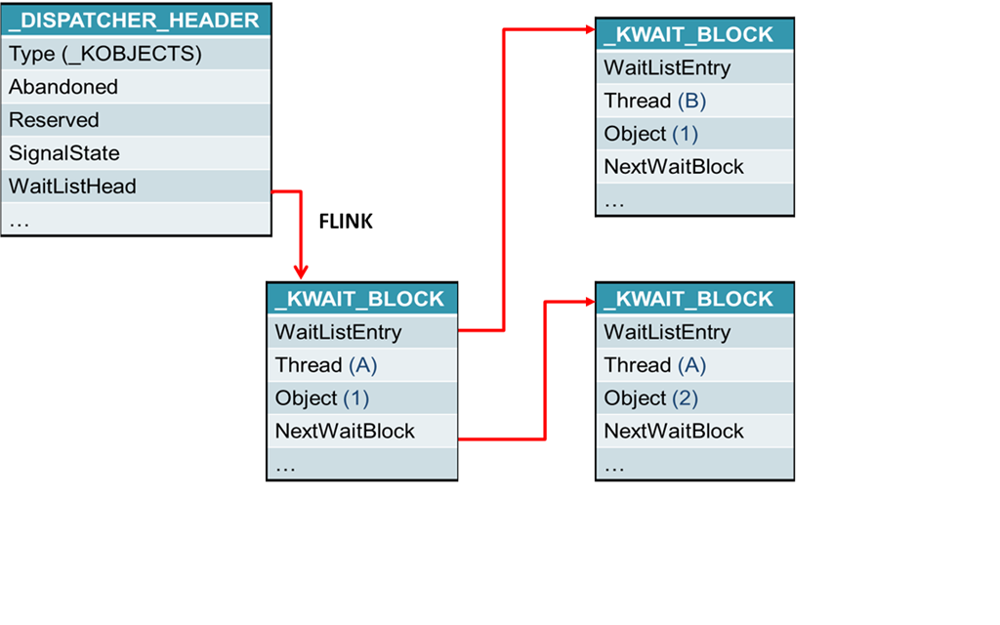

# Memory Management

모든 프로세스들은 자신만의 독립적인 메모리 공간을 갖는다. 이것을 Virtual Memory 라 하고 Virtual Memory Address 에 의해 접근한다. Virtual Memory 는 4KB 단위로 분할하여 물리 메모리로 이동되어야 프로세스가 접근할 수 있다. 4KB 단위를 페이지라고 부른다.

가상 메모리의 페이지들중 물리메모리에 상주하는 것들을 working set 이라고 한다.

페이지는 `Free, Reserved, Commited` 와 같이 총 3가지 상태를 갖는다. 

Logical Address(Virtual Memory Address) 는 세그먼트 레지스터 (CS, DS, ES, SS, FS, GS) 의 visible part 인 segment selector(16bit) 와 offset(32bit) 으로 구성된다.

Logical Address 는 Segementation 을 통해서 Linear Address 로 변환된다. Linear Address 는 다시 Paging 을 통해서 Physical Address 로 변환되야 물리 메모리 접근이 가능하다.


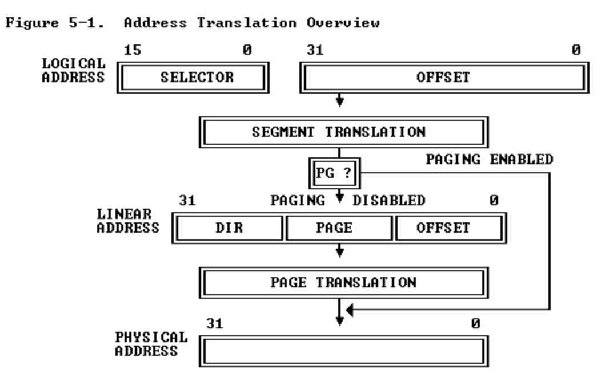

페이징이 도입되기 전에는 Linear Address 가 곧 Physical Address 였다. 페이징은 80386 부터 도입되었다.

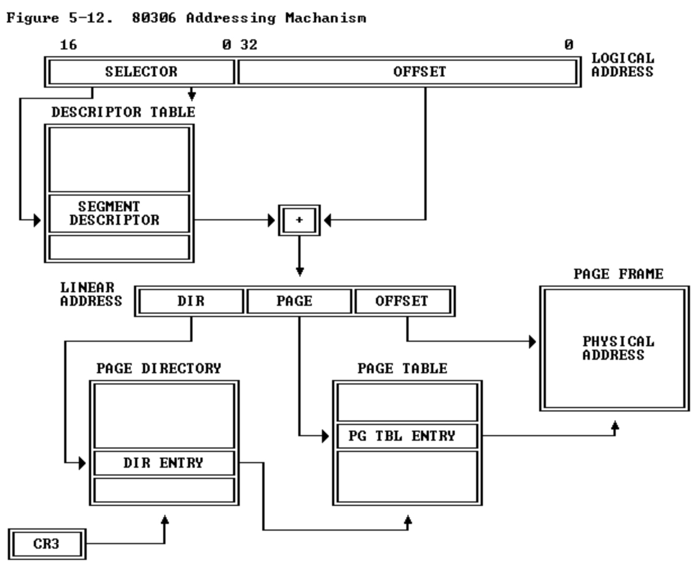

# Segmentation

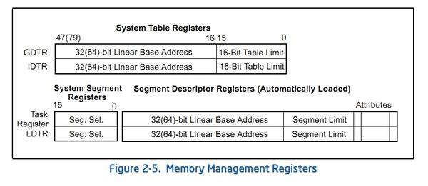

GDT (Global Descriptor Table) 은 8byte 의 Segment Descriptor 들을 가지고 있는 자료구조이다. GDTR (Global Descriptor Table Register) 은 GDT를 가리킨다. 

LDT (Local Descriptor Table) 는 8byte 의 Segment Descriptor 들을 가지고 있는 자료구조이다. LDTR (Local Descriptor Table Register) 은 LDT를 가리킨다.

IDTR, TR (Task Register) 는 어디에 쓰는 걸까?

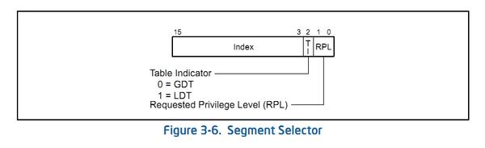

Logical Address 는 16bit 의 Segment Selector 와 32bit 의 offset 으로 구성된다. 아래 그림과 같이 Segment Selector 는 여러 세그먼트 레지스터의 visible part 에 해당한다. hidden part 는 해당 세그먼트 레지스터의 Segment Selector 가 가리키는 Segment Descriptor Table Entry 의 일부값들이 저장된다.

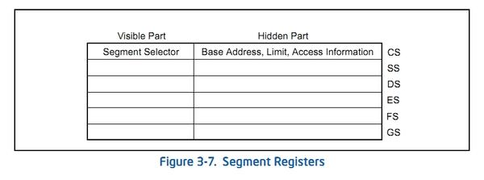

Segment Selector 의 상위 13bit 는 `2^13` 즉 `8192` 와 같다. Segment Selector 의 Index 는 13bit 이고 이것은 TI 가 0혹은 1일 때에 따라서 GDT 혹은 LDT 의 항목의 인덱스를 저장한다. GDTR 의 베이스 어드레스로부터, Segment Selctor 의 인덱스 x 8 만큼의 주소를 더하면 특정 세그먼트 디스크립터에 접근 가능하다.

RPL 은 0부터 3까지 특권레벨을 의미한다. 0은 커널레벨이고 3은 유저레벨이다.

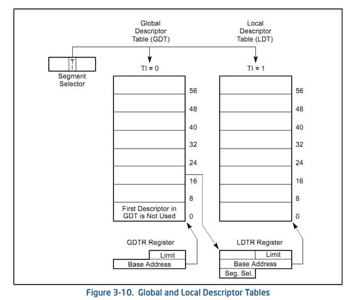

다음은 접근한 세그먼트 디스크립터의 자세한 내용이다.

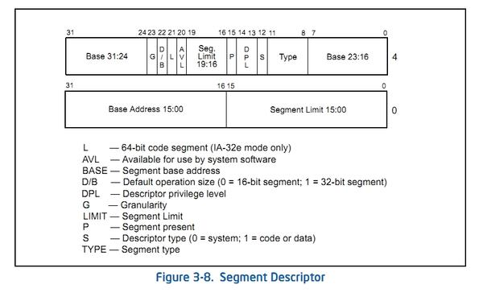

세그먼트 디스크립터의 Base Address(16bit) 와 Logical Address 의 offset(32bit) 을 더하면 Linear Address(32bit) 을 얻을 수 있다. 이렇게 만들어진 Linear Address 에서 어떻게 PDE, PTE, offset 을 얻을 수 있는 걸까? Segment Descriptor 의 Base Address 가 이미 PDE, PTE 를 포함하고 있는 건가?

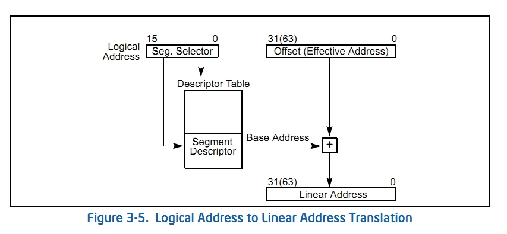

# Paging

Segmentation 과정을 통해서 만들어진 Linear Address 의 형태는 다음과 같다.

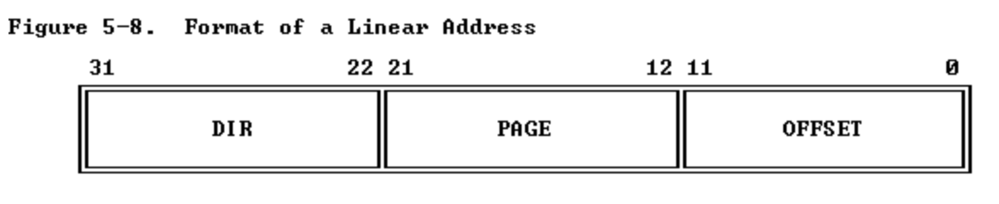

CR3 는 Page Directory 를 가리킨다. Linear Address 의  `DIR` 는 Page Directory Entry 하나를 가리킨다. Page Directory Entry 는 Page Table 을 가리킨다. `PAGE` 는 Page Table Entry 하나를 가리킨다. Page Table Entry 는 Page Frame (4KB) 를 하나 가리킨다. `OFFSET` 은 Page Frame 의 특정 주소를 가리킨다.

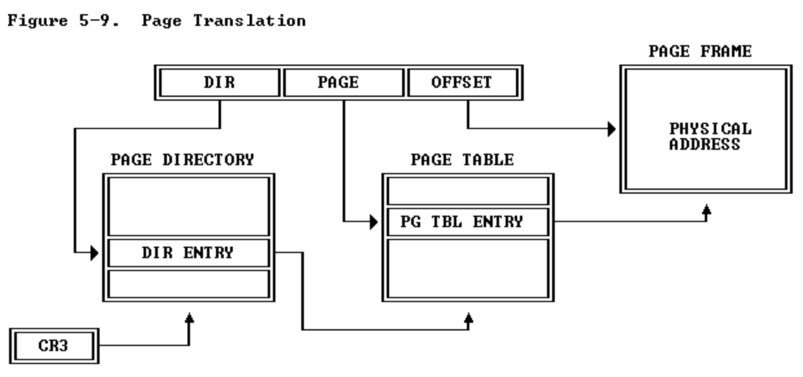

CR3, PDE, PTE 의 비트별 세부내역은 생략한다. 

# Page Management

프로세서가 특정 프로세스 가상메모리의 페이지를 요청했을 때 그 페이지가 물리메모리에 없다면 페이지 폴트 예외가 발생한다. 이후 그 페이지는 디스크에서 물리메모리로 이동하는 데 이것을 페이지인이라고 한다.

대부분의 경우 한번 사용된 Page 의 근처 Page 들을 다시 참조하는 경향이 있는데 이것을 Locality 라고 한다. OS 가 Locality 때문에 특정 페이지를 Page-in 할 때 그 페이지 근처의 다른 페이지들도 함께 Page-in 하는 것을 Prepaging 이라고 한다. 

물리 메모리에 상주하는 페이지들을 Working Set 이라고 한다. 당장 작업할 수 있는 것들의 집합이라는 의미이다.

페이지는 LRU 혹은 FIFO 방식으로 교체한다. LRU 는 가장 최근에 사용한 페이지는 다시 사용할 가능성이 있으므로 덜 Page-Out 하는 방법이다.

프로세스가 잦은 Page fault Exception 때문에 Page-in, Page-out 을 하느라 CPU 이용률은 줄어들고 디스크 I/O 작업을 기다리는데 소비하는 시간이 많아지게 되면 시스템 전체가 성능 저하를 가져온다. 이러한 현상을 Thrashing (스레싱) 이라고 한다.

예를 들어서 한 시스템에 프로세스의 개수가 점점 더 많아진다면 프로세스당 사용할 수 있는 물리 메모리 공간이 줄어들게 되어 Thrashing 이 발생할 테고 대부분의 프로세스는 CPU 이용률이 줄어들고 디스크 Page-In, Page-out 을 하기 위해 DISK I/O 작업 대기 시간이 늘어날 것이다. CPU 이용률이 낮아 지기 때문에 시스템의 성능 저하를 가져온다.

# Processor Cache Management

cache(캐시)는 다음에 사용할 것을 미리 저장하여 저장된 값을 로드하는 시간을 아낄 수 있는 것이다. CPU 는 저장된 것의 성격에 따라 Instruction Cache 와 Data Cache 두 종류를 가지고 있고 Processor 로 부터 접근 거리에 따라 L1 Cache, L2 Cache 등을 가지고 있다. 


cache 가 주소를 매핑하는 방식은 Direct Mapping, Associative Mapping, Set-Associative Mapping 과 같이 3가지 방법이 있다. 주로 Set-Associative Mapping 을 사용한다.


cache 는 주로 LRU(least recently used) 방식을 사용한다.

cache 는 line 단위로 정보를 저장하는데 line 의 크기는 Processor 에 따라 다르다. 주로 32B 이다. cache 의 line 크기를 고려하여 프로그래밍 하면 성능을 개선시킬 수 있다.

cache 의 쓰기정책은 정보를 메모리에 저장하는 방법은 시점에 따라 Write Through, Write Back 과 같이 두가지 종류가 있다. cache 의 정보가 변경될 때마다 메모리에 저장하는 방식이 Write Through 이고 cache 의 정보가 변경될 때마다 표기해 놓고 해당 line 이 cache 에서 제거될 때 메모리에 반영하는 방식이 Write Back 이다.

CR0 의 CD 는 Cache Disable 을 의미한다. 1 이면 cache 를 비활성화 하여 시스템의 성능이 저하된다. 디버깅을 할 때를 제외하고는 권장되지 않는다. NW 는 Non-Cache Write-Through 를 의미한다. 1 이면 Write Back 을 0 이면 Write Through 를 사용한다.


또한 CR3, PDE, PTE 의 비트들을 이용하여 페이지 단위로 cache 를 제어할 수 있다. PCD 는 Page Cache Disable 이다. PWT 는 Page Write Through 이다.


cache 의 속도는 processor 와 거리가 가까울 수록 빠르다.


다음은 space localtity 를 이용하여 최적화를 수행한 예이다.

```cpp
int v[10][10];
void main() {
    int r = 0;
    for (int i = 0; i < 10; ++i) {
        for (int j = 0; j < 10; ++j) {
            r += v[i][j];
            // r += v[j][i]; 
        }
    }
}
```

`r += [i][j]` 대신 `r += [j][i]` 를 사용했다면 연속적으로 저장된 메모리를 사용하는 것이 아니므로 성능이 저하된다.

다음은 미리 cache 에 로딩하여 최적화를 수행한 예이다. `PREFETCH0 [ecx]` 는 인텔 컴파일러만 지원하는 명령어이다.

```cpp
void __fastcall PREFETCH(void * p) {
    // PREFETCH0 [ecx]
    _asm _emit 0x0f;
    _asm _emit 0x18;
    _asm _emit 0x09;
}

int v[1615];
int Sum(int * p) {
    int r = 0;
    for (int i = 0; i < 16; ++i) {
        r += *(p + n);
    }
    return r;
}

void main() {
    int r;
    for (int i = 0; i < 100; ++i) {
        PREFETCH(v + (16 * (i + 1)));
        r = Sum(v + (16 * i));
    }
    r = Sum(v + (16 * 100));
}
```

다음은 데이터이 정렬을 활용하여 최적화를 수행한 예이다.

```cpp
typedef struct _PHONE_BOOK_ENTRY {
    _PHONE_BOOK_ENTRY* pnext;
    char Name[20];
    char Email[10];
    char Phone[16];
    //_PHONE_BOOK_ENTRY* pnext;
} PHONE_BOOK_ENTRY, *PPHONE_BOOK_ENTRY;

PHONE_BOOK_ENTRY SearchName(char* pname) {
    PHONE_BOOK_ENTRY phead;
    ...
    while (phead != NULL) {
        if (stricmp(pname, phead->Name) == 0) 
            return phead;
        phead = phead->Next;
    }
    return NULL;
}
```

만약 위의 코드에서 `pnext` 를 `Phone` 아래에 위치시키면 `if (stricmp(pname, phead->Name) == 0)` 에서 space locality 가 지켜지지 않기 때문에 성능이 저하된다. 즉 `_PHONE_BOOK_ENTRY` 의 `pnext` 와 `Name` 은 가까이 있어야 한다. 

TLB (Translate Lookaside Buffer) 는 virtual memory address 를 physical memory address 로 traslation 할 때 성능을 향상시키위해 존재하는 cache 이다.


# Windows Cache Management

윈도우즈는 하나의 파일을 메모리로 읽어 들일 때 캐시를 활용하여 성능을 향상한다.


file 의 내용은 


# Userlevel and Kernellevel

...

# Execution file and Loader

* [Portable Executable Format](/pef/README.md)
  * 윈도우즈의 실행파일 포맷

* [Elf](/elf/README.md)
  * 리눅스의 실행파일 포맷

# Quiz

* Thread vs. Process
* Context Switch
* Dining Philosophers
* Deadlock-Free Class
* Call In Order
* Synchronized Methods
* FizzBuzz