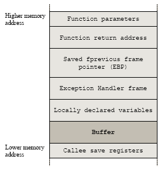

# Abstract

운영체제 (Operating System) 에 대해 정리한다. [Computer System Architecture](../csa/README.md) 의 내용을 먼저 이해해야 한다.

# Materials

* [Windows 구조와 원리](http://www.hanbit.co.kr/store/books/look.php?p_code=B6822670083)
  * 오래전에 출간되어 절판되었지만 한글로 된 책들중 최강이다.
* [Write Great Code I](http://www.plantation-productions.com/Webster/www.writegreatcode.com/)
  * 킹왕짱
* [google interview university @ github](https://github.com/jwasham/coding-interview-university)
  * operating system 관련된 링크를 참고하자. 쓸만한 비디오가 잘 정리되어 있다.

# Procedure and Stack

쓰레드가 태어나면 Virtual Memory 에 stack 을 위한 공간이 마련된다. 함수가 호출되면 그 함수의 parameter 들이 오른쪽에서 왼쪽으로 stack 에 저장된다. 이후 return address, old EBP 등이 stack 에 저장된다. 



함수가 호출될 때 parameter 들을 어떻게 처리하는지에 대한 규약을 calling convention 이라고 하고 `__cdecl, __stdcall, __fastcall` 등이 있다. `__cdecl` 은 함수를 호출한 쪽에서 parameter 들을 해제한다. `__stdcall` 은 호출된 함수 쪽에서 parameter 들을 해제한다. `__fastcall` 은 두개까지의 parameter 들은 ECX, EDX 레지스터에 저장하고 호출된 함수 쪽에서 parameter 들을 해제한다.

compiler 는 linker 에게 산출물을 전달할 때 함수, 변수 등의 이름을 일정한 규칙을 가지고 변경하게 되는데 이것을 name mangling 혹은 name decoration 이라고 한다. 일반적으로 함수의 이름, 파라미터 타입, calling convention 등을 사용하여 이름을 만들어 낸다. name mangling 은 compiler 마다 다르기 때문에 각 메뉴얼을 참고하자.

# Process and Thread

윈도우즈의 유저레벨 프로세스는 다음과 같이 EPROCESS 구조체로 구현한다. [참고](https://www.nirsoft.net/kernel_struct/vista/EPROCESS.html)

```c	
struct EPROCESS
typedef struct _EPROCESS
{
     KPROCESS Pcb;
     EX_PUSH_LOCK ProcessLock;
     LARGE_INTEGER CreateTime;
     LARGE_INTEGER ExitTime;
     EX_RUNDOWN_REF RundownProtect;
     PVOID UniqueProcessId;
     LIST_ENTRY ActiveProcessLinks;
     ULONG QuotaUsage[3];
     ULONG QuotaPeak[3];
     ULONG CommitCharge;
     ULONG PeakVirtualSize;
     ULONG VirtualSize;
     LIST_ENTRY SessionProcessLinks;
     PVOID DebugPort;
     union
     {
          PVOID ExceptionPortData;
          ULONG ExceptionPortValue;
          ULONG ExceptionPortState: 3;
     };
     PHANDLE_TABLE ObjectTable;
     EX_FAST_REF Token;
     ULONG WorkingSetPage;
     EX_PUSH_LOCK AddressCreationLock;
     PETHREAD RotateInProgress;
     PETHREAD ForkInProgress;
     ULONG HardwareTrigger;
     PMM_AVL_TABLE PhysicalVadRoot;
     PVOID CloneRoot;
     ULONG NumberOfPrivatePages;
     ULONG NumberOfLockedPages;
     PVOID Win32Process;
     PEJOB Job;
     PVOID SectionObject;
     PVOID SectionBaseAddress;
     _EPROCESS_QUOTA_BLOCK * QuotaBlock;
     _PAGEFAULT_HISTORY * WorkingSetWatch;
     PVOID Win32WindowStation;
     PVOID InheritedFromUniqueProcessId;
     PVOID LdtInformation;
     PVOID VadFreeHint;
     PVOID VdmObjects;
     PVOID DeviceMap;
     PVOID EtwDataSource;
     PVOID FreeTebHint;
     union
     {
          HARDWARE_PTE PageDirectoryPte;
          UINT64 Filler;
     };
     PVOID Session;
     UCHAR ImageFileName[16];
     LIST_ENTRY JobLinks;
     PVOID LockedPagesList;
     LIST_ENTRY ThreadListHead;
     PVOID SecurityPort;
     PVOID PaeTop;
     ULONG ActiveThreads;
     ULONG ImagePathHash;
     ULONG DefaultHardErrorProcessing;
     LONG LastThreadExitStatus;
     PPEB Peb;
     EX_FAST_REF PrefetchTrace;
     LARGE_INTEGER ReadOperationCount;
     LARGE_INTEGER WriteOperationCount;
     LARGE_INTEGER OtherOperationCount;
     LARGE_INTEGER ReadTransferCount;
     LARGE_INTEGER WriteTransferCount;
     LARGE_INTEGER OtherTransferCount;
     ULONG CommitChargeLimit;
     ULONG CommitChargePeak;
     PVOID AweInfo;
     SE_AUDIT_PROCESS_CREATION_INFO SeAuditProcessCreationInfo;
     MMSUPPORT Vm;
     LIST_ENTRY MmProcessLinks;
     ULONG ModifiedPageCount;
     ULONG Flags2;
     ULONG JobNotReallyActive: 1;
     ULONG AccountingFolded: 1;
     ULONG NewProcessReported: 1;
     ULONG ExitProcessReported: 1;
     ULONG ReportCommitChanges: 1;
     ULONG LastReportMemory: 1;
     ULONG ReportPhysicalPageChanges: 1;
     ULONG HandleTableRundown: 1;
     ULONG NeedsHandleRundown: 1;
     ULONG RefTraceEnabled: 1;
     ULONG NumaAware: 1;
     ULONG ProtectedProcess: 1;
     ULONG DefaultPagePriority: 3;
     ULONG PrimaryTokenFrozen: 1;
     ULONG ProcessVerifierTarget: 1;
     ULONG StackRandomizationDisabled: 1;
     ULONG Flags;
     ULONG CreateReported: 1;
     ULONG NoDebugInherit: 1;
     ULONG ProcessExiting: 1;
     ULONG ProcessDelete: 1;
     ULONG Wow64SplitPages: 1;
     ULONG VmDeleted: 1;
     ULONG OutswapEnabled: 1;
     ULONG Outswapped: 1;
     ULONG ForkFailed: 1;
     ULONG Wow64VaSpace4Gb: 1;
     ULONG AddressSpaceInitialized: 2;
     ULONG SetTimerResolution: 1;
     ULONG BreakOnTermination: 1;
     ULONG DeprioritizeViews: 1;
     ULONG WriteWatch: 1;
     ULONG ProcessInSession: 1;
     ULONG OverrideAddressSpace: 1;
     ULONG HasAddressSpace: 1;
     ULONG LaunchPrefetched: 1;
     ULONG InjectInpageErrors: 1;
     ULONG VmTopDown: 1;
     ULONG ImageNotifyDone: 1;
     ULONG PdeUpdateNeeded: 1;
     ULONG VdmAllowed: 1;
     ULONG SmapAllowed: 1;
     ULONG ProcessInserted: 1;
     ULONG DefaultIoPriority: 3;
     ULONG SparePsFlags1: 2;
     LONG ExitStatus;
     WORD Spare7;
     union
     {
          struct
          {
               UCHAR SubSystemMinorVersion;
               UCHAR SubSystemMajorVersion;
          };
          WORD SubSystemVersion;
     };
     UCHAR PriorityClass;
     MM_AVL_TABLE VadRoot;
     ULONG Cookie;
     ALPC_PROCESS_CONTEXT AlpcContext;
} EPROCESS, *PEPROCESS;
```

EPROCESS의 중요한 멤버는 다음과 같다.

| member field | description |
|:------------:|:-----------:|
| | |

윈도우즈의 커널레벨 프로세스는 다음과 같이 KPROCESS 로 구현한다. [참고](https://www.nirsoft.net/kernel_struct/vista/KPROCESS.html)

```c
typedef struct _KPROCESS
{
     DISPATCHER_HEADER Header;
     LIST_ENTRY ProfileListHead;
     ULONG DirectoryTableBase;
     ULONG Unused0;
     KGDTENTRY LdtDescriptor;
     KIDTENTRY Int21Descriptor;
     WORD IopmOffset;
     UCHAR Iopl;
     UCHAR Unused;
     ULONG ActiveProcessors;
     ULONG KernelTime;
     ULONG UserTime;
     LIST_ENTRY ReadyListHead;
     SINGLE_LIST_ENTRY SwapListEntry;
     PVOID VdmTrapcHandler;
     LIST_ENTRY ThreadListHead;
     ULONG ProcessLock;
     ULONG Affinity;
     union
     {
          ULONG AutoAlignment: 1;
          ULONG DisableBoost: 1;
          ULONG DisableQuantum: 1;
          ULONG ReservedFlags: 29;
          LONG ProcessFlags;
     };
     CHAR BasePriority;
     CHAR QuantumReset;
     UCHAR State;
     UCHAR ThreadSeed;
     UCHAR PowerState;
     UCHAR IdealNode;
     UCHAR Visited;
     union
     {
          KEXECUTE_OPTIONS Flags;
          UCHAR ExecuteOptions;
     };
     ULONG StackCount;
     LIST_ENTRY ProcessListEntry;
     UINT64 CycleTime;
} KPROCESS, *PKPROCESS;
```

윈도우즈의 유저레벨 프로세스는 다음과 같이 ETHREAD 구조체로 구현한다. [참고](https://www.nirsoft.net/kernel_struct/vista/ETHREAD.html)

```c
typedef struct _ETHREAD
{
     KTHREAD Tcb;
     LARGE_INTEGER CreateTime;
     union
     {
          LARGE_INTEGER ExitTime;
          LIST_ENTRY KeyedWaitChain;
     };
     union
     {
          LONG ExitStatus;
          PVOID OfsChain;
     };
     union
     {
          LIST_ENTRY PostBlockList;
          struct
          {
               PVOID ForwardLinkShadow;
               PVOID StartAddress;
          };
     };
     union
     {
          PTERMINATION_PORT TerminationPort;
          PETHREAD ReaperLink;
          PVOID KeyedWaitValue;
          PVOID Win32StartParameter;
     };
     ULONG ActiveTimerListLock;
     LIST_ENTRY ActiveTimerListHead;
     CLIENT_ID Cid;
     union
     {
          KSEMAPHORE KeyedWaitSemaphore;
          KSEMAPHORE AlpcWaitSemaphore;
     };
     PS_CLIENT_SECURITY_CONTEXT ClientSecurity;
     LIST_ENTRY IrpList;
     ULONG TopLevelIrp;
     PDEVICE_OBJECT DeviceToVerify;
     _PSP_RATE_APC * RateControlApc;
     PVOID Win32StartAddress;
     PVOID SparePtr0;
     LIST_ENTRY ThreadListEntry;
     EX_RUNDOWN_REF RundownProtect;
     EX_PUSH_LOCK ThreadLock;
     ULONG ReadClusterSize;
     LONG MmLockOrdering;
     ULONG CrossThreadFlags;
     ULONG Terminated: 1;
     ULONG ThreadInserted: 1;
     ULONG HideFromDebugger: 1;
     ULONG ActiveImpersonationInfo: 1;
     ULONG SystemThread: 1;
     ULONG HardErrorsAreDisabled: 1;
     ULONG BreakOnTermination: 1;
     ULONG SkipCreationMsg: 1;
     ULONG SkipTerminationMsg: 1;
     ULONG CopyTokenOnOpen: 1;
     ULONG ThreadIoPriority: 3;
     ULONG ThreadPagePriority: 3;
     ULONG RundownFail: 1;
     ULONG SameThreadPassiveFlags;
     ULONG ActiveExWorker: 1;
     ULONG ExWorkerCanWaitUser: 1;
     ULONG MemoryMaker: 1;
     ULONG ClonedThread: 1;
     ULONG KeyedEventInUse: 1;
     ULONG RateApcState: 2;
     ULONG SelfTerminate: 1;
     ULONG SameThreadApcFlags;
     ULONG Spare: 1;
     ULONG StartAddressInvalid: 1;
     ULONG EtwPageFaultCalloutActive: 1;
     ULONG OwnsProcessWorkingSetExclusive: 1;
     ULONG OwnsProcessWorkingSetShared: 1;
     ULONG OwnsSystemWorkingSetExclusive: 1;
     ULONG OwnsSystemWorkingSetShared: 1;
     ULONG OwnsSessionWorkingSetExclusive: 1;
     ULONG OwnsSessionWorkingSetShared: 1;
     ULONG OwnsProcessAddressSpaceExclusive: 1;
     ULONG OwnsProcessAddressSpaceShared: 1;
     ULONG SuppressSymbolLoad: 1;
     ULONG Prefetching: 1;
     ULONG OwnsDynamicMemoryShared: 1;
     ULONG OwnsChangeControlAreaExclusive: 1;
     ULONG OwnsChangeControlAreaShared: 1;
     ULONG PriorityRegionActive: 4;
     UCHAR CacheManagerActive;
     UCHAR DisablePageFaultClustering;
     UCHAR ActiveFaultCount;
     ULONG AlpcMessageId;
     union
     {
          PVOID AlpcMessage;
          ULONG AlpcReceiveAttributeSet;
     };
     LIST_ENTRY AlpcWaitListEntry;
     ULONG CacheManagerCount;
} ETHREAD, *PETHREAD;
```

ETHREAD 의 중요한 멤버는 다음과 같다.

| member field | description |
|:------------:|:-----------:|
| | |

다음은 커널 쓰레드를 구현한 KTHREAD 이다. [참고](https://www.nirsoft.net/kernel_struct/vista/KTHREAD.html)

```c
typedef struct _KTHREAD
{
     DISPATCHER_HEADER Header;
     UINT64 CycleTime;
     ULONG HighCycleTime;
     UINT64 QuantumTarget;
     PVOID InitialStack;
     PVOID StackLimit;
     PVOID KernelStack;
     ULONG ThreadLock;
     union
     {
          KAPC_STATE ApcState;
          UCHAR ApcStateFill[23];
     };
     CHAR Priority;
     WORD NextProcessor;
     WORD DeferredProcessor;
     ULONG ApcQueueLock;
     ULONG ContextSwitches;
     UCHAR State;
     UCHAR NpxState;
     UCHAR WaitIrql;
     CHAR WaitMode;
     LONG WaitStatus;
     union
     {
          PKWAIT_BLOCK WaitBlockList;
          PKGATE GateObject;
     };
     union
     {
          ULONG KernelStackResident: 1;
          ULONG ReadyTransition: 1;
          ULONG ProcessReadyQueue: 1;
          ULONG WaitNext: 1;
          ULONG SystemAffinityActive: 1;
          ULONG Alertable: 1;
          ULONG GdiFlushActive: 1;
          ULONG Reserved: 25;
          LONG MiscFlags;
     };
     UCHAR WaitReason;
     UCHAR SwapBusy;
     UCHAR Alerted[2];
     union
     {
          LIST_ENTRY WaitListEntry;
          SINGLE_LIST_ENTRY SwapListEntry;
     };
     PKQUEUE Queue;
     ULONG WaitTime;
     union
     {
          struct
          {
               SHORT KernelApcDisable;
               SHORT SpecialApcDisable;
          };
          ULONG CombinedApcDisable;
     };
     PVOID Teb;
     union
     {
          KTIMER Timer;
          UCHAR TimerFill[40];
     };
     union
     {
          ULONG AutoAlignment: 1;
          ULONG DisableBoost: 1;
          ULONG EtwStackTraceApc1Inserted: 1;
          ULONG EtwStackTraceApc2Inserted: 1;
          ULONG CycleChargePending: 1;
          ULONG CalloutActive: 1;
          ULONG ApcQueueable: 1;
          ULONG EnableStackSwap: 1;
          ULONG GuiThread: 1;
          ULONG ReservedFlags: 23;
          LONG ThreadFlags;
     };
     union
     {
          KWAIT_BLOCK WaitBlock[4];
          struct
          {
               UCHAR WaitBlockFill0[23];
               UCHAR IdealProcessor;
          };
          struct
          {
               UCHAR WaitBlockFill1[47];
               CHAR PreviousMode;
          };
          struct
          {
               UCHAR WaitBlockFill2[71];
               UCHAR ResourceIndex;
          };
          UCHAR WaitBlockFill3[95];
     };
     UCHAR LargeStack;
     LIST_ENTRY QueueListEntry;
     PKTRAP_FRAME TrapFrame;
     PVOID FirstArgument;
     union
     {
          PVOID CallbackStack;
          ULONG CallbackDepth;
     };
     PVOID ServiceTable;
     UCHAR ApcStateIndex;
     CHAR BasePriority;
     CHAR PriorityDecrement;
     UCHAR Preempted;
     UCHAR AdjustReason;
     CHAR AdjustIncrement;
     UCHAR Spare01;
     CHAR Saturation;
     ULONG SystemCallNumber;
     ULONG Spare02;
     ULONG UserAffinity;
     PKPROCESS Process;
     ULONG Affinity;
     PKAPC_STATE ApcStatePointer[2];
     union
     {
          KAPC_STATE SavedApcState;
          UCHAR SavedApcStateFill[23];
     };
     CHAR FreezeCount;
     CHAR SuspendCount;
     UCHAR UserIdealProcessor;
     UCHAR Spare03;
     UCHAR Iopl;
     PVOID Win32Thread;
     PVOID StackBase;
     union
     {
          KAPC SuspendApc;
          struct
          {
               UCHAR SuspendApcFill0[1];
               CHAR Spare04;
          };
          struct
          {
               UCHAR SuspendApcFill1[3];
               UCHAR QuantumReset;
          };
          struct
          {
               UCHAR SuspendApcFill2[4];
               ULONG KernelTime;
          };
          struct
          {
               UCHAR SuspendApcFill3[36];
               PKPRCB WaitPrcb;
          };
          struct
          {
               UCHAR SuspendApcFill4[40];
               PVOID LegoData;
          };
          UCHAR SuspendApcFill5[47];
     };
     UCHAR PowerState;
     ULONG UserTime;
     union
     {
          KSEMAPHORE SuspendSemaphore;
          UCHAR SuspendSemaphorefill[20];
     };
     ULONG SListFaultCount;
     LIST_ENTRY ThreadListEntry;
     LIST_ENTRY MutantListHead;
     PVOID SListFaultAddress;
     PVOID MdlForLockedTeb;
} KTHREAD, *PKTHREAD;
```

# Thread Scheduling


# Thread synchronization

# Memory Management

# Segmentation

# Paging

# Page Management

# Cache Management

# Windows Cache Management

# Userlevel and Kernellevel

# Execution file and Loader

* [Portable Executable Format](/pef/README.md)
  * 윈도우즈의 실행파일 포맷

* [Elf](/elf/README.md)
  * 리눅스의 실행파일 포맷