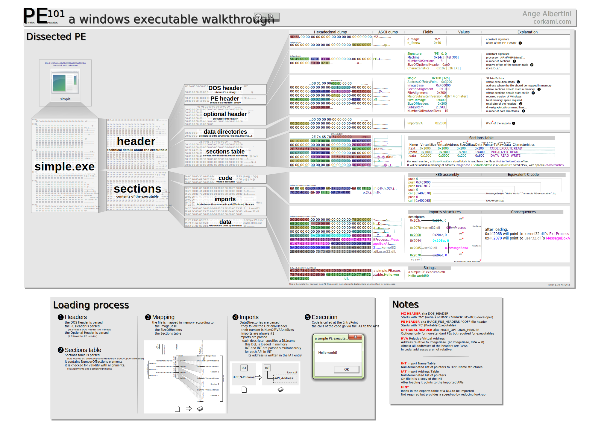

# Abstract

portable executable format 에 대해 적는다.

# Materials

* [PE @ tistory](http://www.reversecore.com/25?category=216978)
  * "리버싱 핵심 기술"의 저자가 설명한 PE.
* [PeViewer.net](https://peviewer.net/)
  * web 으로 pe 를 확인할 수 있다.
* [Advance PE Viewer](http://www.codedebug.com/php/Products/Products_NikPEViewer_12v.php)
  * advance peviewer
* [corkami/pics @ github](https://github.com/corkami/pics/tree/master/binary)
  * pef, elf 등을 한장의 그림으로 표현했다.

# Architect




# notepad.exe


# Overview

* 크게 바라보면 `Dos header, NT headers, Section headers, Sections` 로 나누어 진다. 위의 notepad 예제에서 `Sections` 가 곧 `Section headers` 이다. `NT headers`  는 `NT Signature, File header, Optional header, Data Directories` 를 포함한다. `Data Directories` 는 `IMPORT TABLE, RESOURCE TABLE, BASERELOC TABLE, DEBUG TABLE, LOAD_CONFIG TABLE, UNDEFINED TABLE` 등을 포함한다. `Section headers` 는 `.text, .data, .idata, .rsrc, .reloc` 의 `header` 들을 포함한다. 마지막으로 `Sections` 는 `.text, .data, .idata, .rsrc, .reloc` 등을 포함한다.

# DOS header

`DOS header` 는 `winnt.h` 의 `IMAGE_DOS_HEADER` 로 구현한다.

```
typedef struct _IMAGE_DOS_HEADER {
    WORD  e_magic;      /* 00: MZ Header signature */
    WORD  e_cblp;       /* 02: Bytes on last page of file */
    WORD  e_cp;         /* 04: Pages in file */
    WORD  e_crlc;       /* 06: Relocations */
    WORD  e_cparhdr;    /* 08: Size of header in paragraphs */
    WORD  e_minalloc;   /* 0a: Minimum extra paragraphs needed */
    WORD  e_maxalloc;   /* 0c: Maximum extra paragraphs needed */
    WORD  e_ss;         /* 0e: Initial (relative) SS value */
    WORD  e_sp;         /* 10: Initial SP value */
    WORD  e_csum;       /* 12: Checksum */
    WORD  e_ip;         /* 14: Initial IP value */
    WORD  e_cs;         /* 16: Initial (relative) CS value */
    WORD  e_lfarlc;     /* 18: File address of relocation table */
    WORD  e_ovno;       /* 1a: Overlay number */
    WORD  e_res[4];     /* 1c: Reserved words */
    WORD  e_oemid;      /* 24: OEM identifier (for e_oeminfo) */
    WORD  e_oeminfo;    /* 26: OEM information; e_oemid specific */
    WORD  e_res2[10];   /* 28: Reserved words */
    DWORD e_lfanew;     /* 3c: Offset to extended header */
} IMAGE_DOS_HEADER, *PIMAGE_DOS_HEADER;
```

 중요한 멤버는 다음과 같다.


| member field | description |
|:------------:|:-----------:|
| `e_magic` | 저자를 표현한 코드이다. `MZ` |
| `e_lfanew` | `NT headers` 의 offset |

# NT headers

`NT headers` 는 `winnt.h` 의 `IMAGE_NT_HEADERS32` 으로 구현한다.

```
typedef struct _IMAGE_NT_HEADERS {
  DWORD Signature; /* "PE"\0\0 */	/* 0x00 */
  IMAGE_FILE_HEADER FileHeader;		/* 0x04 */
  IMAGE_OPTIONAL_HEADER32 OptionalHeader;	/* 0x18 */
} IMAGE_NT_HEADERS32, *PIMAGE_NT_HEADERS32;
```

중요한 멤버는 다음과 같다.

| member field | description |
|:------------:|:-----------:|
| `Signature` | PE header를 표현한 코드이다. `PE` |
| `FileHeader` | `File header` |
| `OptionalHeader` | `Optional header` |

# File Header

`File Header` 는 `winnt.h` 의 `IMAGE_FILE_HEADER` 으로 구현한다.

```
typedef struct _IMAGE_FILE_HEADER {
  WORD  Machine;
  WORD  NumberOfSections;
  DWORD TimeDateStamp;
  DWORD PointerToSymbolTable;
  DWORD NumberOfSymbols;
  WORD  SizeOfOptionalHeader;
  WORD  Characteristics;
} IMAGE_FILE_HEADER, *PIMAGE_FILE_HEADER;
```

중요한 멤버는 다음과 같다.

| member field | description |
|:------------:|:-----------:|
| `Machine` | CPU 별 고유값 |
| `NumberOfSections` | 섹션의 개수 |
| `SizeOfOptionalHeader` | `IMAGE_OPTIONAL_HEADER32` 의 크기 |
| `Characteristics` | 파일 속성을 표현한 bitmask |

# Optional Header

`Optional Header` 는 `winnt.h` 의 `IMAGE_OPTIONAL_HEADER` 으로 구현한다.

```
typedef struct _IMAGE_OPTIONAL_HEADER {

  /* Standard fields */

  WORD  Magic; /* 0x10b or 0x107 */	/* 0x00 */
  BYTE  MajorLinkerVersion;
  BYTE  MinorLinkerVersion;
  DWORD SizeOfCode;
  DWORD SizeOfInitializedData;
  DWORD SizeOfUninitializedData;
  DWORD AddressOfEntryPoint;		/* 0x10 */
  DWORD BaseOfCode;
  DWORD BaseOfData;

  /* NT additional fields */

  DWORD ImageBase;
  DWORD SectionAlignment;		/* 0x20 */
  DWORD FileAlignment;
  WORD  MajorOperatingSystemVersion;
  WORD  MinorOperatingSystemVersion;
  WORD  MajorImageVersion;
  WORD  MinorImageVersion;
  WORD  MajorSubsystemVersion;		/* 0x30 */
  WORD  MinorSubsystemVersion;
  DWORD Win32VersionValue;
  DWORD SizeOfImage;
  DWORD SizeOfHeaders;
  DWORD CheckSum;			/* 0x40 */
  WORD  Subsystem;
  WORD  DllCharacteristics;
  DWORD SizeOfStackReserve;
  DWORD SizeOfStackCommit;
  DWORD SizeOfHeapReserve;		/* 0x50 */
  DWORD SizeOfHeapCommit;
  DWORD LoaderFlags;
  DWORD NumberOfRvaAndSizes;
  IMAGE_DATA_DIRECTORY DataDirectory[IMAGE_NUMBEROF_DIRECTORY_ENTRIES]; /* 0x60 */
  /* 0xE0 */
} IMAGE_OPTIONAL_HEADER32, *PIMAGE_OPTIONAL_HEADER32;
```

중요한 멤버는 다음과 같다.

| member field | description |
|:------------:|:-----------:|
| `Magic` | `IMAGE_OPTIONAL_HEADER32` 인 경우 `10Bh` `IMAGE_OPTIONAL_HEADER64` 인 경우 `20Bh` |
| `AddressOfEntryPoint` | EP (Entry Point) 의 RVA (Relative Virtual Address) 값 |
| `ImageBase` | 파일이 로딩되는 VA (Virtual Address) |
| `SectionAlignment` | 파일을 VM (Virtual Memory) 으로 로딩했을 때 섹션의 최소 단위. VM 에서 섹션의 크기는 이것의 배수이어야 한다. |
| `FileAlignment` | 파일에 존재하는 섹션의 최소 단위. 파일에서 섹션의 크기는 이것의 배수이어야 한다. |
| `SizeOfImage` | 파일이 VM (Virtual Memory) 에 로딩되었을 때 크기 |
| `SizeOfHeaders` | `PE header` 의 크기 |
| `Subsystem` | 1: Driver File (*.sys), 2: GUI 파일, 3: CUI (console user interface) 파일 |
| `NumberOfRvaAndSizes` | `DataDirectory` 배열의 개수 |
| `DataDirectory` | `Data Directories` |

# Data Directories

`Data Directories` 는 `winnt.h` 의 `IMAGE_DATA_DIRECTORY` 의 배열로 구현한다. 첫번째는 `EXPORT DIRECTORY` 두번째는 `IMPORT DIRECTORY` 이다.

```
typedef struct _IMAGE_DATA_DIRECTORY {
  DWORD VirtualAddress;
  DWORD Size;
} IMAGE_DATA_DIRECTORY, *PIMAGE_DATA_DIRECTORY;
```

# Section Headers


`Section Headers` 는 `winnt.h` 의 `IMAGE_SECTION_HEADER` 의 배열로 구현한다. 

```
typedef struct _IMAGE_SECTION_HEADER {
  BYTE  Name[IMAGE_SIZEOF_SHORT_NAME];
  union {
    DWORD PhysicalAddress;
    DWORD VirtualSize;
  } Misc;
  DWORD VirtualAddress;
  DWORD SizeOfRawData;
  DWORD PointerToRawData;
  DWORD PointerToRelocations;
  DWORD PointerToLinenumbers;
  WORD  NumberOfRelocations;
  WORD  NumberOfLinenumbers;
  DWORD Characteristics;
} IMAGE_SECTION_HEADER, *PIMAGE_SECTION_HEADER;
```

중요한 멤버는 다음과 같다.

| member field | description |
|:------------:|:-----------:|
| `VirtualSize` | VM 에서 섹션이 차지하는 크기 |
| `VirtualAddress` | VM 에서 섹션이 시작하는 주소. RVA (Relative Virtual Address) |
| `SizeOfRawData` | 파일에서 섹션이 차지하는 크기 |
| `PointerToRawData` | 파일에서 섹션의 시작위치 |
| `Characteristics` | 섹션의 특징을 표현한 bitmask |

# RVA to RAW

VM 의 주소 RVA 를 파일의 주소 RAW 로 표현해 보자.

```
RAW - PointerToRawData = RVA - VirtualAddress
RAW = RVA - VirtualAddress + PointerToRawData
```

# IAT (Import Address Table)


특정 파일을 실행한다고 해보자. 그 실행파일이 특정 DLL (Dynamic Linked Library) 을 사용할 때 실행과 동시에 VM 에 DLL 을 로딩하고 종료와 동시에 언로딩 하도록 제작되었다면 실행 파일은 `Implicit Linking` 되었다고 한다. 만약 필요할 때마다 로딩하고 언로딩 한다면 `Explicit Linking` 되었다고 한다. IAT 는 `Implicit Linking` 을 구현하기 위해 필요하다. 즉 IAT 는 `Implicit Linking` 으로 연결된 모든 함수들의 시작주소를 저장한다.

`IAT` 는 `winnt.h` 의 `IMAGE_IMPORT_DESCRIPTOR` 으로 구현한다. `Data Directories` 의 첫번째 원소가 `IMAGE_IMPORT_DESCRIPTOR` 의 VM 에서 RVA, SIZE 등을 포함한다.

```
typedef struct _IMAGE_IMPORT_DESCRIPTOR {
	union {
		DWORD	Characteristics; /* 0 for terminating null import descriptor  */
		DWORD	OriginalFirstThunk;	/* RVA to original unbound IAT */
	} DUMMYUNIONNAME;
	DWORD	TimeDateStamp;	/* 0 if not bound,
				 * -1 if bound, and real date\time stamp
				 *    in IMAGE_DIRECTORY_ENTRY_BOUND_IMPORT
				 * (new BIND)
				 * otherwise date/time stamp of DLL bound to
				 * (Old BIND)
				 */
	DWORD	ForwarderChain;	/* -1 if no forwarders */
	DWORD	Name;
	/* RVA to IAT (if bound this IAT has actual addresses) */
	DWORD	FirstThunk;
} IMAGE_IMPORT_DESCRIPTOR,*PIMAGE_IMPORT_DESCRIPTOR;

/* Import name entry */
typedef struct _IMAGE_IMPORT_BY_NAME {
	WORD	Hint;
	BYTE	Name[1];
} IMAGE_IMPORT_BY_NAME,*PIMAGE_IMPORT_BY_NAME;
```

중요한 멤버는 다음과 같다.

| member field | description |
|:------------:|:-----------:|
| `OriginalFirstThunk` | INT (Import Name Table) 의 RVA  |
| `Name` | DLL 이름 문자열의 RVA |
| `FirstThunk` | IAT (Import Address Table) 의 RVA |

중요한 사항은 다음과 같다.

* INT 와 IAT 는 4 byte 배열이고 NULL로 끝난다.
* INT 의 각 원소의 값은 IMAGE_IMPORT_BY_NAME 의 주소값을 가지고 있다.
* INT 와 IAT 는 크기가 같다.
* INT 를 이용하여 IAT 를 채운다.

다음은 PE LOADER 가 임포트할 DLL의 함수주소를 IAT 에 입력하는 과정을 나타낸다.

```
```

# EAT (Export Address Table)

# Load Process
