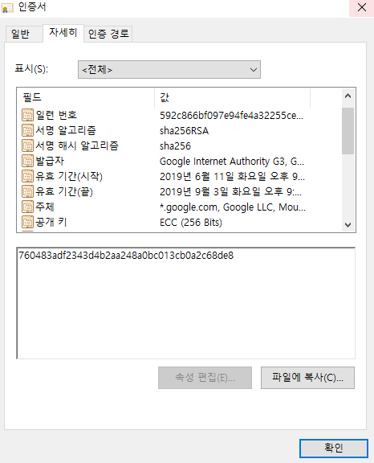
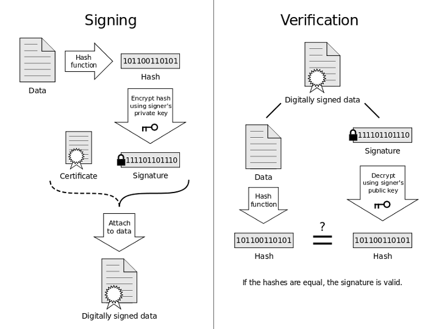

- [Abstract](#abstract)
- [Materials](#materials)
- [Certificate](#certificate)
- [How to Validate Certificate](#how-to-validate-certificate)
- [인증서 병합하기](#인증서-병합하기)

----

# Abstract

PKI (Public Key Infrastructure) 에 대해 적는다.

# Materials

* [PKI, 공개키 기반구조, 인증서 (1) - PKI 의 기본 구조 @ naverblog](https://m.blog.naver.com/nttkak/20130244568)
  * [PKI, 공개키 기반구조, 인증서 (2) - 공개키 인증서 ( Public Key Certificate ) @ naverblog](https://m.blog.naver.com/nttkak/20130244771)
  * [PKI, 공개키 기반구조, 인증서 (3) - 인증서의 인증 구조 @ naverblog](https://m.blog.naver.com/nttkak/20130245218)
  * [PKI, 공개키 기반구조, 인증서 (4) - PKI 컴포넌트 @ naverblog](https://m.blog.naver.com/PostView.nhn?blogId=nttkak&logNo=20130245294&targetKeyword=&targetRecommendationCode=1)
  * [PKI, 공개키 기반구조, 인증서 (5) - PKI 아키텍처 @ naverblog](https://m.blog.naver.com/nttkak/20130245429)
  * [PKI, 공개키 기반구조, 인증서 (6) - X.509 인증서 @ naverblog](https://m.blog.naver.com/nttkak/20130245553)
   
# Certificate

> [154. [Security] SSL과 인증서 구조 이해하기 : CA (Certificate Authority) 를 중심으로 @ naverblog](https://blog.naver.com/alice_k106/221468341565)

> [72. [Docker] Docker Daemon 에 보안 인증서 (TLS) 적용하기 @ naverblog](https://blog.naver.com/alice_k106/220743690397)

> [How do I check my hashing algorithm?](https://www.namecheap.com/support/knowledgebase/article.aspx/9467/38/how-do-i-check-my-hashing-algorithm/)

> [PKI, 공개키 기반구조, 인증서 (6) - X.509 인증서 @ naverblog](https://m.blog.naver.com/nttkak/20130245553)

Certificate 은 [x.509](https://en.wikipedia.org/wiki/X.509) 표준을 따른다. `PEM` 혹은 `DER` 파일로 저장한다. `PEM` 은 Certificate 을 base64 로 encoding 한 것이다. `DER` 은 binary 로 저장한 것이다.

인증서는 인증기관 즉, CA (Certificate Authority) 에서 발행한다. 최상위 인증기관을 RCA (Root Certificate Autority), 중간 인증기관을 ICA (Intermediate Certificate Authority) 라고 한다.

다음은 인증서에 포함된 정보들이다.

* 인증서 소유자의 e-mail 주소
* 소유자의 이름
* 인증서의 용도
* 인증서 유효기간
* 발행 장소
* Distinguished Name (DN)
  * Common Name (CN)
  * 인증서 정보에 대해 서명한 사람의 디지털 ID
* Public Key
* 해쉬(Hash)

해쉬는 상위 인증기관의 비밀키로 암호화한 것이다. 상위 인증기관의 공개키로 복호화 할 수 있다. 상위 인증기관의 공개키는 상위 인증기관의 인증서를 다운로드 받아서 얻을 수 있다. 인증서가 변조되어 있지 않은지 검증하기 위해 다음과 같은 절차를 수행한다.

* 해쉬를 상위 인증기관의 공개키로 복호화해본다. (H1)
* 인증서에 포함된 정보들을 해쉬한다. (H2)
* H1 과 H2 가 같다면 변조되지 않은 것이다.

이와 같은 과정을 상위인증서에도 적용하여 상위인증서의 변조를 검사한다. 이렇게 인증서는 chaining 구조를 가지고 있다. 최상위 인증서는 self signed 되어있다. 더이상의 상위 인증기관이 없기 때문이다. 최상위 인증서는 믿고 써야 한다.

https://wiki.kldp.org/HOWTO/html/SSL-Certificates-HOWTO/x70.html

다음은 크롬브라우저에서 구글에 접속했을 때 사용한 인증서이다.



# How to Validate Certificate



다음은 데이터 B1 을 디지털 서명하는 과정이다. C1 은 디지털 서명된 데이터이다. C1 은 원래의 데이터 B1 과 서명 S 그리고 공개키 KeyD 로 구성된다.

```c
Hash(B1) => H1;                 // B1 을 해쉬한 값을 H1 에 저장한다. H1 을 지문이라 하자.
Encrypt(KeyE, H1) => S;         // H1 을 개인키 KeyE 로 암호화하여 서명 S 를 얻는다.  
C1 = {B1, S, KeyD}              // B1, S, 공개키 KeyD 를 묶어서 디지털 서명된 데이터 C1 생성한다.
```

다음은 디지털 서명된 데이터 C1 을 받아서 검증하는 절차이다.

```c
C1 => B1, S, KeyD;                            // C1 에서 B1, S, KeyD 를 추출한다.  
Decrypt(KeyD, S) => H1;                       // 서명 S 를 공개키 KeyD 로 복호화하여 지문 H1 을 얻는다.  
Hash(B1) => H1;                               // B1 을 해시 해쉬한 값 H1 을 얻는다.  
Because H1 == H1, Execute C1 => Very Good!    // 두 지문이 일치하는지 검증한다.
```

과연 `C1` 의 `S` 는 믿을만 한가?

예를 들어 크래커가 다음과 같이 `C1` 을 조작하면 `C2` 를
배포할 수 있다.

```c
C1 => B1, S, KeyD;                  // 해커는 C1을 획득하여 B1, S, KeyD로 분리  
B1 => B2                            // B1을 B2로 변조  
Hash(B2) => H2;                     // B2를 해시 함수에 입력하여 지문 H2를 얻음  
Encrypt(FKeyE, H2) => S2;           // 지문 H2를 개인키 FKeyE로 암호화하여 서명 S2를 얻음  
C2 = {B2, S2, FKeyD}                // B2, S2, 공개키 FKeyD를 묶어서 코드사인 바이너리 C2 생성  
C1 => C2                            // 해커는 네이버 배포 서버의 C1을 C2로 바꿔치기함  
```

다음은 `C2` 를 받아서 검증하는 절차이다.

```c
C2 => B2, S2, FKeyD;                           // 다운로드한 C2를 B2, S2, FKeyD로 분리  
Decrypt(FKeyD, S2) => H2;                      // 서명 S2를 공개키 FKeyD로 복호화하여 지문 H2을 얻음  
Hash(B2) => H2;                                // B2를 해시 함수에 입력하여 지문 H2를 얻음  
Because H2 == H2, Execute C2 => Oh, my god!    // 두 지문이 일치하는 것을 확인 
```

인증서를 이용하여 `C1 = {B1, S, KeyD}` 대신 `C1 = {B1, S, 인증서}` 형태로 C1 을 제작하면 위의 문제를 해결할 수 있다. `KeyD` 는 인증서에 포함된다.

그럼 다시 인증서를 적용한 `C1` 을 받아서 검증해보자. 

```c
C1 => B1, S, 인증서;                            // C1 에서 B1, S, 인증서를 추출한다. 인증서에서 KeyD 를 추출한다.  
Decrypt(KeyD, S) => H1;                       // 서명 S 를 공개키 KeyD 로 복호화하여 지문 H1 을 얻는다.  
Hash(B1) => H1;                               // B1 을 해시 해쉬한 값 H1 을 얻는다.  
Because H1 == H1, Execute C1 => Very Good!    // 두 지문이 일치하는지 검증한다.
```

여기까지는 앞서 언급한 검증절차와 같다. 이에 더하여 두 단계를 더 진행해 인증서를 검증한다. 여기서 인증서의 주체자는 `iamslash` 라고 하자.

첫 번째로 인증서에 적힌 주체가 `iamslash` 인지 확인한다. 두 번째로 인증서에 기록된 발급자의 서명을 발급자의 공개키로 복호화하여 지문을 얻고, 인증서에 기록된 정보들을 해시 함수에 입력하여 지문을 얻어내서 두 지문의 일치 여부를 확인한다. 이 두 단계를 인증서의 유효성 검증이라고 한다.

다음은 인증서의 구조이다. 

```
A = {일련번호, ..., 발급자(인증기관), 주체자(발급대상), 주체자공개키, ..., 확장}

인증서 = A + Encrypt(발급자개인키, Hash(A))
```

발급자의 공개키는 발급자의 인증서에 기록되어 있다. 발급자의 인증서는 자동 설치되는 건가??? 발급자의 인증서로 `iamslash` 인증서를 검증하듯이, 발급자의 인증서는 한 단계 높은 상위 발급자의 인증서로 검증한다. 이런 과정이 반복되면 최상위의 발급자인 공인 인증 기관을 만나게 된다. 최상위의 공인 인증 기관을 Root 인증 기관 혹은 Root 발급자라고 말하는데, Root 발급자는 자기 자신에 대하여 인증서를 발급하기 때문에 Root 발급자의 인증서에는 주체와 발급자가 동일하다. 이와 같이 인증서들이 연결되어 있는 구조를 **인증서 체인** 이라고 한다. 보통 3 단계로 이루어져 있다.

Root 인증서는 무조건 신뢰할 수 있다는 가정하에 사용된다. Root 발급자로 대표적으로 VeriSign 이나 KISA 등이 있다. Microsoft 는 Root 인증서를 검증한 후 Internet Explorer 나 Windows  시스템에 설치한다.

이제 크래커 입장에서 생각해 보자. `iamslash` 인증서를 발급한 발급자는 인증서의 주체가 `iamslash` 인 인증서를 발급해 주지 않을 것이다. 그렇다면 주체가 `iamslash` 인 인증서를 변조해야 한다. 그러나 발급자의 개인키가 없기 때문에 서명을 제대로 기록할 수 없다.   

그렇다면 크래커가 발급자도 사칭 할 수 있다. 곧, 크래커가 직접 사설 인증 기관을 만든 후에 `iamslash` 를 사칭하여 인증서를 발급하는 것이다. 그러나 인증서 체인 때문에 발급자를 사칭하게 되면 상위 발급자도 사칭을 해야 하며 결국 최상위 기관인 Root 발급자까지 사칭해야만 한다. 그러나 위에서도 말했듯이 Root 인증서는 Microsoft 가 관리하며 이미 시스템 내부에 포함되어 있기 때문에 모든 PC 의 사칭은 불가능하다. 그렇다면 특정 PC 는 가능한 건가???


# 인증서 병합하기

* [SSL 인증서 합치기](https://garyj.tistory.com/8)

----

domain 인증서 `domain.crt` 와 root 인증서 `root_ca.crt` 가 있을 때 
다음과 같은 방법으로 병합한다.

```bash
$ cat domain.crt > my.crt
$ cat root_ca.crt >> my.crt
```

my.crt 의 내용은 domain.crt, root_ca.crt 의 순서대로
합쳐있다. 다음과 같이 검증한다.

```bash
$ openssl verify -verbose -purpose sslserver -CAfile root_ca.crt my.crt
```

다음과 같이 인증서 만료일을 확인할 수 있다.

```bash
$ openssl x509 -in domain.crt -noout -dates
```

인증서 변경이 정상적으로 적용되었는지 확인할 수 있다.

```bash
$ openssl s_client -connect www.iamslash.com:443 | openssl x509 -noout -dates
```
