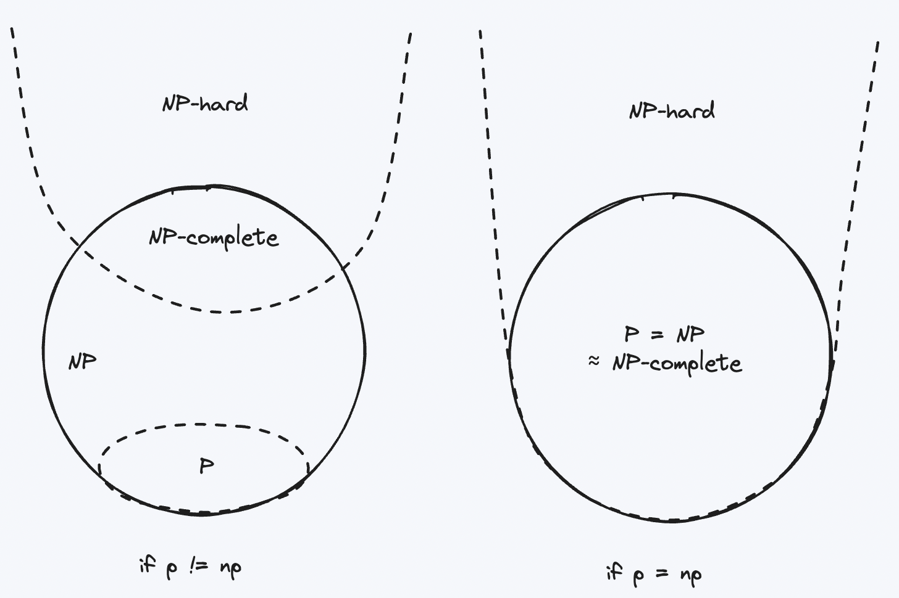

- [Materials](#materials)
- [Install](#install)
- [Basic](#basic)
  - [psql](#psql)
  - [vaccuum](#vaccuum)
- [Level 0: Sky Zone](#level-0-sky-zone)
  - [Data Types](#data-types)
  - [CREATE TABLE](#create-table)
  - [SELECT, INSERT, UPDATE, DELETE](#select-insert-update-delete)
  - [ORDERY BY](#ordery-by)
  - [LIMIT and OFFSET](#limit-and-offset)
  - [GROUP BY](#group-by)
  - [NULL](#null)
  - [Indexes](#indexes)
  - [Multi-Version Concurrency Control (MVCC)](#multi-version-concurrency-control-mvcc)
  - [Spring Optimistic Locking vs PostgreSQL MVCC](#spring-optimistic-locking-vs-postgresql-mvcc)
  - [Serializable Snapshot Isolation (SSI)](#serializable-snapshot-isolation-ssi)
  - [Join](#join)
  - [Forein Keys](#forein-keys)
  - [ORMs](#orms)
- [Level 1: Surface Zone](#level-1-surface-zone)
  - [Transactions](#transactions)
  - [ACID](#acid)
  - [Query plans and EXPLAIN](#query-plans-and-explain)
  - [Inverted Indexes](#inverted-indexes)
  - [Keyset Pagination](#keyset-pagination)
  - [Computed Columns](#computed-columns)
  - [ORDER BY Aggregates](#order-by-aggregates)
  - [Window Functions](#window-functions)
  - [Outer Joins](#outer-joins)
  - [CTEs](#ctes)
  - [Normal Forms](#normal-forms)
- [Level 2: Sunlight Zone](#level-2-sunlight-zone)
  - [Connection Pools](#connection-pools)
  - [The DUAL Table](#the-dual-table)
  - [Laterial Joins](#laterial-joins)
  - [Recursive CTEs](#recursive-ctes)
  - [ORMs Create Bad Queries](#orms-create-bad-queries)
  - [Stored Procedures](#stored-procedures)
  - [Cursors](#cursors)
  - [There are no non-nullable types](#there-are-no-non-nullable-types)
  - [Optimizers don't work without table statistics](#optimizers-dont-work-without-table-statistics)
  - [Plan hints](#plan-hints)
  - [MVCC Garbage Collection](#mvcc-garbage-collection)
- [Twilight Zone](#twilight-zone)
  - [COUNT(\*) vs COUNT(1)](#count-vs-count1)
  - [Isolation Levels and Phantom Reads](#isolation-levels-and-phantom-reads)
  - [Write skew](#write-skew)
  - [Serializable restarts require retry loops on all statements](#serializable-restarts-require-retry-loops-on-all-statements)
  - [Partial Indexes](#partial-indexes)
  - [Generator functions zip when cross joined](#generator-functions-zip-when-cross-joined)
  - [Sharding](#sharding)
  - [ZigZag Join](#zigzag-join)
  - [MERGE](#merge)
  - [Triggers](#triggers)
  - [Grouping sets, Cube, Rollup](#grouping-sets-cube-rollup)
- [Level 4: Midnight Zone](#level-4-midnight-zone)
  - [Denormalization](#denormalization)
  - [NULLs in CHECK constraints are truthy](#nulls-in-check-constraints-are-truthy)
  - [Transaction Contention](#transaction-contention)
  - [SELECT FOR UPDATE](#select-for-update)
  - [timestamptz doesn't store a timezone](#timestamptz-doesnt-store-a-timezone)
  - [Star Schemas](#star-schemas)
  - [Sargability](#sargability)
  - [Ascending Key Problem](#ascending-key-problem)
  - [Ambiguous Network Errors](#ambiguous-network-errors)
  - [utf8mb4](#utf8mb4)
- [Level 5: Abyssal Zone](#level-5-abyssal-zone)
  - [Cost models don't reflect reality](#cost-models-dont-reflect-reality)
  - [null::jsonb IS NULL = false](#nulljsonb-is-null--false)
  - [TPCC requires wait times](#tpcc-requires-wait-times)
  - [DEFERRABLE INITIALLY IMMEDIATE](#deferrable-initially-immediate)
  - [EXPLAIN approximates SELECT COUNT(\*)](#explain-approximates-select-count)
  - [MATCH PARTIAL Foreign Keys](#match-partial-foreign-keys)
  - [Causal Reverse](#causal-reverse)
- [Level 6: Hadal Zone](#level-6-hadal-zone)
  - [Vectorized doesn't mean SIMD](#vectorized-doesnt-mean-simd)
  - [NULLs are equal in DISTINCT but unequal in UNIQUE](#nulls-are-equal-in-distinct-but-unequal-in-unique)
  - [Volcano Model](#volcano-model)
  - [Join ordering is NP Hard](#join-ordering-is-np-hard)
  - [Database Cracking](#database-cracking)
  - [WCOJ](#wcoj)
  - [Learned Indexes](#learned-indexes)
  - [TXID Exhaustion](#txid-exhaustion)
- [Level 7: Pitch Black Zone](#level-7-pitch-black-zone)
  - [The halloween problem](#the-halloween-problem)
  - [Dee and Dum](#dee-and-dum)
  - [SERIAL is non-transactional](#serial-is-non-transactional)
  - [allballs](#allballs)
  - [fsyncgate](#fsyncgate)
  - [Every SQL operator is actually a join](#every-sql-operator-is-actually-a-join)

----

# Materials

* [Explaining The Postgres Meme](https://www.avestura.dev/blog/explaining-the-postgres-meme)
* [crunchdata](https://www.crunchydata.com/developers/tutorials)
  * browser 에서 PostgreSQL 을 띄우고 공부할 수 있다.
* [The Art of PostgreSQL](https://theartofpostgresql.com/)
  * mater piece

# Install

* [[Docker] Docker PostgreSQL 설치 및 실행 | tistory](https://kanoos-stu.tistory.com/23)

----

```bash
$ docker run --rm -p 5432:5432 -e POSTGRES_PASSWORD=1 -e POSTGRES_USER=iamslash -e POSTGRES_DB=basicdb --name my-postgres -d postgres

$ docker exec -it my-postgres bash

$ psql -U iamslash basicdb
# Show databases
\list 
```

# Basic

## psql

```sql
-- Help
\?
-- Help sql
\h
-- Help select
\h select
-- Show databases
\l
-- Show tables
\d
-- Show tables in depth
\d+
-- Show system tables
\dS
-- Show schemas
\dn
-- Show views
\dv
-- Use database
\c postgres
-- Quit 
\q
```

## vaccuum

* [PostgreSQL: 베큠(VACUUM)을 실행해야되는 이유 그리고 성능 향상](https://blog.gaerae.com/2015/09/postgresql-vacuum-fsm.html)

----

FSM (Free Space Map) 에 쌓여진 데이터를 지우는 것. 디스크 조각모으기와 비슷하다.

# Level 0: Sky Zone

## Data Types

> [Chapter 8. Data Types | postgresql](https://www.postgresql.org/docs/current/datatype.html)

| Category          | Name                          | Aliases         | Description                                      |
|-------------------|-------------------------------|-----------------|--------------------------------------------------|
| Numeric           | bigint                        | int8            | signed eight-byte integer                        |
| Numeric           | bigserial                     | serial8         | autoincrementing eight-byte integer              |
| Bit String        | bit [ (n) ]                   |                 | fixed-length bit string                          |
| Bit String        | bit varying [ (n) ]           | varbit [ (n) ]  | variable-length bit string                       |
| Boolean           | boolean                       | bool            | logical Boolean (true/false)                     |
| Geometric         | box                           |                 | rectangular box on a plane                       |
| Binary Data       | bytea                         |                 | binary data (“byte array”)                       |
| Character         | character [ (n) ]             | char [ (n) ]    | fixed-length character string                    |
| Character         | character varying [ (n) ]     | varchar [ (n) ] | variable-length character string                 |
| Network Address   | cidr                          |                 | IPv4 or IPv6 network address                     |
| Geometric         | circle                        |                 | circle on a plane                                |
| Date and Time     | date                          |                 | calendar date (year, month, day)                 |
| Numeric           | double precision              | float8          | double precision floating-point number (8 bytes) |
| Network Address   | inet                          |                 | IPv4 or IPv6 host address                        |
| Numeric           | integer                       | int, int4       | signed four-byte integer                         |
| Date and Time     | interval [ fields ] [ (p) ]   |                 | time span                                        |
| JSON Data Types   | json                          |                 | textual JSON data                                |
| JSON Data Types   | jsonb                         |                 | binary JSON data, decomposed                     |
| Geometric         | line                          |                 | infinite line on a plane                         |
| Geometric         | lseg                          |                 | line segment on a plane                          |
| Network Address   | macaddr                       |                 | MAC (Media Access Control) address               |
| Network Address   | macaddr8                      |                 | MAC (Media Access Control) address (EUI-64 format) |
| Monetary          | money                         |                 | currency amount                                  |
| Numeric           | numeric [ (p, s) ]            | decimal [ (p, s) ] | exact numeric of selectable precision       |
| Geometric         | path                          |                 | geometric path on a plane                         |
| System Data       | pg_lsn                        |                 | PostgreSQL Log Sequence Number                   |
| System Data       | pg_snapshot                   |                 | user-level transaction ID snapshot               |
| Geometric         | point                         |                 | geometric point on a plane                       |
| Geometric         | polygon                       |                 | closed geometric path on a plane                 |
| Numeric           | real                          | float4          | single precision floating-point number (4 bytes) |
| Numeric           | smallint                      | int2            | signed two-byte integer                          |
| Numeric           | smallserial                   | serial2         | autoincrementing two-byte integer                |
| Numeric           | serial                        | serial4         | autoincrementing four-byte integer               |
| Character         | text                          |                 | variable-length character string                 |
| Date and Time     | time [ (p) ] [ without time zone ] |           | time of day (no time zone)                       |
| Date and Time     | time [ (p) ] with time zone   | timetz          | time of day, including time zone                 |
| Date and Time     | timestamp [ (p) ] [ without time zone ] |       | date and time (no time zone)                     |
| Date and Time     | timestamp [ (p) ] with time zone | timestamptz  | date and time, including time zone               |
| Text Search       | tsquery                       |                 | text search query                                |
| Text Search       | tsvector                      |                 | text search document                             |
| System Data       | txid_snapshot                 |                 | user-level transaction ID snapshot (deprecated; see pg_snapshot) |
| UUID              | uuid                          |                 | universally unique identifier                    |
| XML Data          | xml                           |                 | XML data                                         |

## CREATE TABLE

```sql
CREATE TABLE "audit_log" (
	id serial primary key,
	ip inet,
	action text,
	actor text,
	description text,
	created_at timestamp default NOW()
);
```

## SELECT, INSERT, UPDATE, DELETE

```sql
-- Select
SELECT action, actor, description
  FROM "audit_log"
 WHERE ip = '127.0.0.1';
-- Insert
INSERT INTO "audit_log" (ip, action, actor, description) VALUES (
    '127.0.0.1',
    'delete user',
    'admin',
    'admin deleted the user x'
);
-- Update
UPDATE "audit_log"
   SET ip = '192.168.1.1'
 WHERE id = 1;
-- Delete
DELETE FROM "audit_log"
 WHERE id = 1;
```

## ORDERY BY

```sql
-- Order by
SELECT *
FROM "audit_log"
ORDER BY created_at DESC;
-- K-neareset-neighbor Ordering
SELECT "name", "location", "country"
FROM "circuits"
ORDER BY POINT(lng, lat) <-> POINT(2.349014, 48.864716)
LIMIT 10;
```

## LIMIT and OFFSET

[Pagination](/pagination/README.md) for efficient pagination.

```sql
SELECT *
  FROM "audit_log"
OFFSET 100
 LIMIT 10;
```

## GROUP BY

```sql
CREATE TABLE student (
    id SERIAL PRIMARY KEY,
    class_no INTEGER,
    grade INTEGER
);
-- Average grade of each class
SELECT class_no, AVG(grade) AS class_avg
  FROM student
 GROUP BY class_no;
```

## NULL

`NULL` means `undefined value`, or `simply not knowing the value`. That is why
`true = NULL, false = NULL, and NULL = NULL` checks all result in a `NULL`.

```sql
SELECT
    TRUE = NULL AS a,
    FALSE = NULL AS b,
    NULL = NULL AS c;
-- result= a: NULL, b: NULL, c: NULL
```

## Indexes

```sql
create index on student using gist(last_name);
```

These are index methods including gist.

* **B-tree**: This is the default index method and is suitable for most use
  cases. B-tree indexes can be used with any data type that has a total order
  and can handle any query that involves comparisons with equality (`=`), less
  than (`<`), greater than (`>`), less than or equal to (`<=`), and greater than
  or equal to (`>=`) operators.

* **Hash**: This index method is used for equality queries on data types that do
  not have a total order. They are generally not as efficient as B-tree indexes,
  but they can be useful in specific situations where only equality queries are
  performed.

* **GiST (Generalized Search Tree)**: This index method is used for complex data
  types, such as geometric or text data, and supports advanced querying options
  like nearest-neighbor and full-text search. GiST is extensible, which means
  custom data types and query operators can be added.

* **SP-GiST (Space-Partitioned Generalized Search Tree)**: This method is optimized
  for non-overlapping geometric data and partitioning schemes where each
  partition consists of non-overlapping regions. It can be used for complex data
  types, like IP addresses, and provides efficient partitioning and search
  mechanisms.

* **GIN (Generalized Inverted Index)**: GIN is used for complex data types, like
  arrays or full-text search documents, where elements within the data type need
  to be indexed independently. GIN indexes excel at containment queries and are
  useful for full-text search, array operations, and JSONB data.

* **BRIN (Block Range INdex)**: This method is suitable for large tables with a
  natural sort order, such as time-series data. BRIN indexes store summary
  information about block ranges, enabling fast range and min/max queries with
  much smaller index sizes compared to B-tree indexes.

## Multi-Version Concurrency Control (MVCC)

**MVCC** stands for Multi-Version Concurrency Control. It is a technique used in
PostgreSQL to allow multiple transactions to access the same data concurrently
without conflicts, ensuring data consistency and isolation.

In MVCC, each transaction sees a snapshot of the database at a specific point in
time. When a transaction performs a read operation, it only reads the data as it
appeared at the start of the transaction. When a transaction performs a write
operation, it creates a new version of the affected data, rather than
overwriting the existing data. This way, different transactions can work with
different versions of the same record without affecting each other.

**MVCC** ensures the isolation property in the **ACID** (Atomicity, Consistency,
Isolation, and Durability) principles of database systems. It helps prevent
issues like **dirty reads**, **non-repeatable reads**, and **phantom reads**,
thereby increasing the overall performance and consistency of the database
system.

## Spring Optimistic Locking vs PostgreSQL MVCC

PostgreSQL already supports Multi-Version Concurrency Control (MVCC) to handle
concurrent transactions, allowing multiple transactions to access the same data
concurrently without conflicts, ensuring data consistency and isolation. **MVCC** is
a significant advantage when working with databases, as it reduces lock
contention and improves overall performance.

However, **optimistic locking** is a complementary approach at the application
level to handle concurrency control. It can be used in conjunction with
PostgreSQL's MVCC to further optimize the way the application code interacts
with the database. While MVCC handles data consistency within the database,
**optimistic locking** in an application framework like Spring helps manage
conflicts and control transactions across the application logic.

By using Spring's **optimistic locking** feature along with PostgreSQL's
**MVCC**, you can create a more robust, scalable, and performant application
that deals effectively with concurrent transactions. This combination allows you
to leverage both the **database-level concurrency** features and
**application-level concurrency** control mechanisms to suit your specific
needs.

Remember, **optimistic locking** works best for scenarios <U>where conflicts and
contention among transactions are rare or minimal.</U> If you expect significant
contention or frequent conflicts, you may need to evaluate other concurrency
control strategies in addition to MVCC.

## Serializable Snapshot Isolation (SSI)

**SSI**, or Serializable Snapshot Isolation, is an advanced concurrency control
mechanism in PostgreSQL that provides the highest level of transaction
isolation, known as the Serializable isolation level. It is designed to ensure
complete data consistency and prevent several types of anomalies that can occur
in concurrent transactions, such as **dirty reads**, **non-repeatable reads**,
and **phantom reads**.

When using **SSI** in PostgreSQL, transactions appear to be executed serially, one
after the other, even if they are actually executed concurrently. This gives the
illusion of serial execution, which guarantees that the results of a set of
transactions are consistent with a sequential order.

SSI is implemented using a technique called "predicate locking." It detects
conflicts between concurrent transactions that could lead to serialization
anomalies and automatically aborts one of the conflicting transactions to ensure
consistency. When a transaction is aborted, the application or user must retry
it.

To use **SSI** in PostgreSQL, you need to set the transaction isolation level to
Serializable for your transactions. You can do this by issuing the following SQL
command before starting the transaction:

```sql
SET TRANSACTION ISOLATION LEVEL SERIALIZABLE;
```

Keep in mind that while **SSI** provides the highest level of data consistency, it
may come at the cost of reduced concurrency, increased chances of transaction
rollbacks, and potentially lower performance than lower isolation levels like
Read Committed or Repeatable Read. It is essential to choose the appropriate
isolation level based on your application requirements and the nature of your
data and transactions.

## Join

```sql
-- Inner join
select u.username, u.email, r.role_name
  from "user" as u
  join "role" as r
    on u.role_id = r.role_id -- equivalent: using(role_id)
 where u.username = 'admin';
```

* **Inner Joins**: This method retrieves only the rows that meet the specified
  join condition from both involved tables (left and right). Rows without a
  match are excluded from the result.
* **Left/Right/Full Outer Joins**: These types of joins ensure that all records
  from the specified table(s) are included in the result, regardless of whether
  there is a matching value in the other table(s).
  * **Left Outer Join**: Retrieves all records from the left table and matching
    records from the right table. If no match is found, NULL values are
    displayed for the right table columns.
  * **Right Outer Join**: Retrieves all records from the right table and matching
    records from the left table. If no match is found, NULL values are displayed
    for the left table columns.
  * **Full Outer Join**: Retrieves all records from both tables, displaying NULL
    values for columns from the table(s) with no matching value.
* **Cross Join**: This method produces a Cartesian product of the left and right
  tables, generating all possible combinations where each row from the left
  table is joined with each row from the right table.

## Forein Keys

```sql
create table author (
	name text primary key
);
create table book (
	name text primary key,
	author text references author(name)
)

insert into author values ('George Orwell');
insert into book values ('Animal Farm', 'George Orwell'); -- OK
insert into book values ('Anna Karenina', 'Leo Tolstoy'); -- NOT OK
-- ERROR:  insert or update on table "book" violates foreign key constraint "book_author_fkey"
-- DETAIL:  Key (author)=(Leo Tolstoy) is not present in table "author".
```

## ORMs

```java
// Java, Hibernate ORM
@Entity
@Table(name = "Person")
public class Person {
    @Id
    @GeneratedValue(strategy = GenerationType.IDENTITY)
    private Long id;

    private String name;
    private int age;
}

Configuration configuration = new Configuration().configure("hibernate.cfg.xml");
SessionFactory sessionFactory = configuration.buildSessionFactory();

try (Session session = sessionFactory.openSession()) {
	List<Person> persons = session.createQuery("FROM Person", Person.class).list();
} catch (Exception e) {
	e.printStackTrace();
}
```

# Level 1: Surface Zone

## Transactions

```sql
BEGIN;
update accounts set coins = coins - 1 where name = "Player1";
update accounts set coins = coins + 1 where name = "Player2";
COMMIT;
```

## ACID

[ACID](/database/README.md#acid)

## Query plans and EXPLAIN

```sql
-- Explain
> explain select * from audit_log;
                          QUERY PLAN
--------------------------------------------------------------
 Seq Scan on audit_log  (cost=0.00..14.80 rows=480 width=140)
(1 row)

-- Explain analyze
> explain analyze select * from audit_log;
                                               QUERY PLAN
--------------------------------------------------------------------------------------------------------
 Seq Scan on audit_log  (cost=0.00..14.80 rows=480 width=140) (actual time=0.011..0.012 rows=1 loops=1)
 Planning Time: 0.056 ms
 Execution Time: 0.025 ms
(3 rows)
```

## Inverted Indexes

In PostgreSQL, an inverted index, also known as a Generalized Inverted Index
(GIN), is a special type of index designed for complex data types, such as
arrays, text documents, or JSONB data. Inverted indexes are particularly useful
for **containment queries**, **full-text search**, and **searching within container-like structures**.

Unlike traditional indexes (e.g., B-tree) that store a sorted order of keys and
pointers to the corresponding rows in a table, an inverted index works by
maintaining a mapping between the individual elements contained within the
complex data types and the rows in which these elements appear. Essentially, it
"inverts" the relationship between data and the rows containing that data.

For example, consider full-text search using the `tsvector` data type, which
represents a document as a sorted list of unique words (called lexemes) and
their positions within the document. The inverted index (GIN index) would map
each unique word to a list of document IDs where that word appears. This allows
for efficient querying and retrieval of documents containing specific words or
phrases.

To create a GIN index in PostgreSQL, you can use the following SQL command:

```sql
CREATE INDEX index_name ON table_name USING gin(column_name);
```

Remember that while GIN indexes can significantly improve query performance for
complex data types and specific search operations, <U>they may also have increased
maintenance costs (such as slower updates and increased storage size) compared
to other index types.</U> Carefully analyze the requirements of your application and
the nature of your data before choosing to use GIN indexes.

This is an example for applying inverted index to the table `articles`.

```sql
-- First, add a new tsvector column to the table:
ALTER TABLE articles ADD COLUMN content_vector tsvector;
-- Update the content_vector column with the tsvector data
UPDATE articles SET content_vector = to_tsvector('english', content);
-- Now create the GIN index on the content_vector column:
CREATE INDEX articles_content_vector_idx ON articles USING gin(content_vector);
-- With the GIN index in place, you can now perform efficient full-text searches 
-- using the @@ operator:
-- Replace 'search_phrase' with the actual word or phrase you want to search 
-- for in the content column.
SELECT id, content FROM articles WHERE content_vector @@ to_tsquery('english', 'search_phrase');
```

You will want to keep the `content_vector` column updated when changes happen to
the content column. This can be achieved by using triggers and stored
procedures.

## Keyset Pagination

[Cursor Based Pagination](/pagination/README.md#cursor-based)

```sql
select *
  from "audit_log"
 where created_at < ?
 limit 10; -- equivalent standard SQL: fetch first 10 rows only
```

## Computed Columns

View is a good solution.

```sql
-- Create table
CREATE TABLE employees (
    id SERIAL PRIMARY KEY,
    first_name VARCHAR(50),
    last_name VARCHAR(50),
    salary INTEGER
);
-- Create view
CREATE VIEW employees_with_yearly_salary AS
    SELECT id, first_name, last_name, salary,
    salary * 12 AS yearly_salary
    FROM employees;
-- Fetch
SELECT * FROM employees_with_yearly_salary;
```

PostgreSQL supports `GENERATED ALWAYS AS` but you should use it
with `STORED`.

```sql
create table people (
	...,
    height_cm numeric,
    height_in numeric GENERATED ALWAYS AS (height_cm / 2.54) STORED
)
```

A **virtual generated column** is similar to a view, as both provide computed values
based on other columns without physically storing the computed data in the
database. Instead, the values are calculated during query execution, which makes
them more space-efficient but can impact query performance.

On the other hand, a **stored generated column** bears some resemblance to a
materialized view. Both store computed values physically in the database,
ensuring that the values are up-to-date whenever the underlying source columns
change. **Stored generated columns** provide better query performance compared to
**virtual generated columns** and views because the computed values are already
available. However, they also consume additional storage space.

It is worth noting that while **stored generated columns** are part of the same
table as the source columns and are automatically updated, **materialized views**
are separate from their base tables and require manual or scheduled updates
(REFRESH MATERIALIZED VIEW) to ensure that the computed data is synchronized
with the underlying tables.

## ORDER BY Aggregates

```sql
-- Basic aggregates
select avg(temp_lo) as temp_lo_average,
	   avg(temp_hi) as temp_hi_average
  from weather;

-- Order by aggregates
create table player (
	id serial primary key,
	"server" text not null,
	"rank" integer not null default 0 
)
insert into player("server", "rank") 
       values ('europe', 1), ('europe', 5), ('europe', 7),
	          ('asia', 3), ('asia', 2), ('asia', 9), ('asia', 1);
-- percentile_cont(0.5) WITHIN GROUP (ORDER BY rank DESC) AS median_rank: 
-- This part of the query uses the percentile_cont function to calculate the median 
-- (50th percentile) value of the "rank" column for each group of players in the same server. 
-- The 0.5 value is used to specify the 50th percentile (median). 
-- The WITHIN GROUP (ORDER BY rank DESC) part is used to order the rank values 
-- in each group before calculating the percentile, sorting them in descending order in this case. 
-- The resulting median rank is given the alias median_rank.              
SELECT "server",
       percentile_cont(0.5) WITHIN GROUP (ORDER BY rank DESC) AS median_rank
  FROM "player"
 GROUP BY "server"
-- server    median_rank
-- asia      2.5
-- europe    5
```

**Inverse distributions** are not a specific feature of PostgreSQL, but rather a
statistical concept used to find the values of a random variable given a
particular probability distribution and some known probability values
(percentiles or quantiles). While PostgreSQL does not provide direct support for
**inverse distributions**, you can use its statistical functions and
application-level code to calculate the **inverse distributions** based on your
needs.

A common example of using **inverse distributions** in database systems,
including PostgreSQL, is to calculate percentiles (such as median, quartiles,
etc.), which are the values that correspond to specific percentiles of an
ordered data set.

PostgreSQL has several built-in statistical functions that can help you
calculate percentiles and other statistical quantities:

* `percentile_cont` and `percentile_disc`: These functions compute continuous
  and discrete percentiles, respectively, for a given data set and a specific
  percentile value. 
  ```sql
  SELECT percentile_cont(0.5) WITHIN GROUP (ORDER BY salary) AS median_salary
    FROM employees;
  ```
* `cume_dist`: This window function calculates the cumulative distribution
  function (CDF) or percentile rank of each row within a result set.
  ```sql
  SELECT id, salary, cume_dist() OVER (ORDER BY salary) AS rank
    FROM employees;
  ```
* `ntile`: This window function generates integer values to divide the result
  set into a specific number of equal groups based on the order specified.
  ```sql
  SELECT id, salary, ntile(4) OVER (ORDER BY salary) AS quartile
  FROM employees;
  ```

You can use these functions and write additional application-level code to
compute the inverse distributions of your data stored in PostgreSQL.

## Window Functions

[SQL Window Functions](/sql/README.md#window-functions)

```sql
select city,
	   temp_lo,
	   temp_hi,
	   avg(temp_lo) over (partition by city) as temp_lo_average,
	   rank() over (partition by city order by temp_hi) as temp_hi_rank
  from weather
-- city     temp_lo  temp_hi  temp_lo_average  temp_hi_rank
-- Lahijan  10       20       10.33333333      1
-- Lahijan  11       25       10.33333333      1
-- Lahijan  10       20       10.33333333      3
-- Rasht    15       45       15               1
-- Rasht    20       35       15               2
-- Rasht    10       30       15               3

select salary, sum(salary) over () from empsalary;
--  salary |  sum
-- --------+-------
--    5200 | 47100
--    5000 | 47100
--    3500 | 47100
--    4800 | 47100
--    3900 | 47100
--    4200 | 47100
--    4500 | 47100
--    4800 | 47100
--    6000 | 47100
--    5200 | 47100
-- (10 rows)

select salary, sum(salary) over (order by salary) from empsalary;
--  salary |  sum
-- --------+-------
--    3500 |  3500
--    3900 |  7400
--    4200 | 11600
--    4500 | 16100
--    4800 | 25700
--    4800 | 25700
--    5000 | 30700
--    5200 | 41100
--    5200 | 41100
--    6000 | 47100
-- (10 rows)

-- Same with `over (order by salary)`
over (order by salary rows between unbounded preceding and current row)
over (order by salary rows between current row and unbounded following)
over(partition by first_name order by salary nulls last)
```

## Outer Joins

```sql
select *
  from weather left outer join cities ON weather.city = cities.name;
--      city      | temp_lo | temp_hi | prcp |    date    |     name      | location
-- ---------------+---------+---------+------+------------+---------------+-----------
--  Hayward       |      37 |      54 |      | 1994-11-29 |               |
--  San Francisco |      46 |      50 | 0.25 | 1994-11-27 | San Francisco | (-194,53)
--  San Francisco |      43 |      57 |    0 | 1994-11-29 | San Francisco | (-194,53)
-- (3 rows)
```

## CTEs

[CTE](/sql/README.md#common-table-expressions-cte)

```sql
with hottest_weather_of_city as (
	select city, max(temp_hi) as max_temp_hi
	from weather
	group by city
), not_so_hot_cities as ( 
	select city
	from hottest_weather_of_city
	where max_temp_hi < 35
)
select * 
  from weather
 where city in (select city from not_so_hot_cities)
```

## Normal Forms

[Normalization](/normalization/README.md)

# Level 2: Sunlight Zone

## Connection Pools

You can create or debug connection pools with tools like `Amazon RDS Proxy`,
`pgpool`, `pgbouncer`, `pg_crash`, etc.

* **PgBouncer** is a lightweight connection pooler for PostgreSQL that helps in
  efficiently managing database connections. It serves as an intermediate layer
  between client applications and the PostgreSQL database server, concentrating
  multiple connections into a smaller number of actual database connections to
  improve performance and reduce resource usage. 
* **Pgpool-II (often referred to as pgpool)** is a middleware application for
  PostgreSQL that works as a connection pooler, load balancer, and high
  availability manager. It sits between client applications and PostgreSQL
  servers, helping to optimize resource usage, improve performance, and manage
  multiple PostgreSQL instances.

## The DUAL Table

The "dual" table is a concept originally from the Oracle database system – it's
a single-row, single-column table present by default in all Oracle databases. It
is mainly used for selecting a constant, pseudo column, or calling a function
without referring to a specific table. The typical use case is to perform
calculations, conversions, or to retrieve system information that isn't related
to any particular table.

In PostgreSQL, there is no built-in "dual" table like in Oracle. However,
PostgreSQL allows for selecting values or calling functions without referencing
a specific table, as shown below:

```sql
SELECT 1+1;
-- or
SELECT CURRENT_DATE;
```

These queries will work directly without the need for a "dual" table.

However, if you are migrating from Oracle to PostgreSQL and need a "dual" table
for compatibility reasons or to maintain familiar syntax, you can create a
"dual" table in PostgreSQL like this:

```sql
CREATE TABLE dual
(
  dummy CHAR(1) DEFAULT 'X' NOT NULL
);

INSERT INTO dual (dummy) VALUES ('X');

-- Now you can use the "dual" table in your queries as you would in Oracle:
SELECT 1+1 FROM dual;
```

Keep in mind that the "dual" table, in this case, is not a built-in PostgreSQL
feature but a user-created workaround to mimic Oracle behavior.

## Laterial Joins

A **Lateral Join** in PostgreSQL is a powerful querying technique used to apply a
subquery or a set-returning function for each row of the left-hand table in a
join operation. The `LATERAL` keyword allows you to reference columns of preceding
tables in the `FROM` clause, which is not possible with regular subqueries.
**Lateral joins** can be useful in various situations where you need to perform
complex transformations or aggregations based on values from preceding tables.

For example, consider two tables:

```
orders: columns - order_id, customer_id, total_amount
order_line_items: columns - order_id, product_id, quantity
```

Now suppose that we want to retrieve the top 3 products with the highest
quantity for each order. Using a Lateral Join, we can achieve this with the
following query:

```sql
SELECT
  o.order_id,
  o.total_amount,
  li.product_id,
  li.quantity
FROM
  orders o
  LATERAL (
    SELECT
      product_id,
      quantity
    FROM
      order_line_items
    WHERE
      order_id = o.order_id
    ORDER BY
      quantity DESC
    LIMIT 3
  ) AS li;
```

In the above query, we use the `LATERAL` keyword with a subquery to allow
referencing the order_id from the orders table within the subquery. The subquery
retrieves the top 3 products for each order based on their quantity, and the
results are combined with the main query using the `Lateral` Join technique.

Without the `LATERAL` keyword, you would not be able to reference the o.order_id
from the outer query inside the subquery.

## Recursive CTEs

```sql
with recursive fib(a, b) AS (
  values (0, 1)
  union all
    select b, a + b from fib where b < 1000
)
select a from fib;
-- 0
-- 1
-- 1
-- 2
-- 3
-- 5
-- ...
```

## ORMs Create Bad Queries

```sql
-- one query to fetch the posts
select id, title from blog_post;
-- N query in a loop to fetch the comments of each post:
select body from comments where post_id = :post_id;

-- Fix query with join
select c.body, p.title 
  from comments as c 
  join blog_post as p on (c.post_id = p.id)
```

## Stored Procedures

```sql
-- Define stored procedure
create procedure insert_person(id integer, first_name text, last_name text, cash integer)
language sql
as $$
insert into person values (id, first_name, last_name);
insert into cash values (id, cash);
$$;

-- Call stored procedure
call insert_person(1, 'Maryam', 'Mirzakhani', 1000000);
```

In PostgreSQL, both **functions** and **stored procedures** are used to
encapsulate a series of SQL queries or logic into a single, reusable object.
However, there are some key differences between them which affect how they can
be used and their behavior within the database system:

* **Transaction control**: Stored procedures can have transaction control
  statements, such as COMMIT and ROLLBACK, within their code blocks. Functions,
  on the other hand, cannot include transaction control statements, as they run
  within the context of the calling transaction.
* **RETURN statement**: Functions are designed to return a single value, a set of
  rows, or a table, and must therefore have a RETURN statement or use OUT
  parameters to return values. Stored procedures do not necessarily need to
  return a value, and they use the CALL statement to be executed.
* **Volatility**: Functions can be marked with different volatility categories,
  such as VOLATILE, STABLE, and IMMUTABLE, which provide PostgreSQL with
  information on how the function interacts with the database, allowing the
  system to optimize query plans accordingly. Stored procedures are always
  considered volatile by default.
* **Invocation**: Functions can be used and invoked within SQL queries, such as
  SELECT, INSERT, UPDATE, or DELETE statements, as part of an expression or as a
  target for a query. Stored procedures, however, are executed using the CALL
  statement or using the "CALL" SQL function and are not directly used within
  other SQL statements.
* **Language support**: Both functions and stored procedures can be written
  using various procedural languages, like PL/pgSQL, PL/Tcl, and PL/Python, as
  well as using SQL as the language for simpler tasks.

It's important to note that, prior to PostgreSQL version 11, there was no native
support for stored procedures – only functions were available. Stored procedures
were introduced in PostgreSQL 11 to provide better support for transaction
control and to better align with the usage patterns and expectations of users
coming from other database systems like Oracle and SQL Server.

In summary, functions in PostgreSQL are more suitable for tasks that involve
computation or transforming data, and can be embedded within SQL queries. Stored
procedures are better suited for tasks that require transaction management or
don't need to be part of a query, like performing actions with side effects or
batch operations.

## Cursors

A **cursor** in PostgreSQL is a database object used to manipulate and retrieve rows
from a result set one at a time, instead of fetching the entire result set all
at once. **Cursors** are particularly useful when dealing with large result sets, as
they can help reduce memory consumption and control the flow of data processing
more effectively.

```sql
-- you can read more about SCROLL in the collapsible box
declare my_cursor scroll cursor for select * from films; 

-- FORWARD is the direction, PostgreSQL supports many directions.
fetch forward 5 from my_cursor; 
-- Outputs five rows 1, 2, 3, 4, and 5
-- Cursor is now at position 5

fetch prior from my_cursor; -- outputs row number 4, PRIOR is also a direction.

close my_cursor;
```

## There are no non-nullable types

In SQL, 'null' represents an unknown value and is used for managing missing or
unknown data in columns. PostgreSQL allows control over column nullability using
not null check constraints, which provide flexibility when user-defined types
are created with the CREATE TYPE command. Additionally, PostgreSQL enables
specifying default values for custom data types to prevent null values, but
still allows setting column values to null if no not null constraints are
defined. This approach allows for easy data input and management, even when
certain column data is missing or unknown.

```sql
-- Creating a table with nullable columns:
CREATE TABLE customers (
  id SERIAL PRIMARY KEY,
  first_name VARCHAR(255),
  last_name VARCHAR(255),
  email VARCHAR(255) UNIQUE
);

-- Creating a table with not null constraints:
CREATE TABLE customers (
  id SERIAL PRIMARY KEY,
  first_name VARCHAR(255) NOT NULL,
  last_name VARCHAR(255) NOT NULL,
  email VARCHAR(255) UNIQUE NOT NULL
);

-- Creating a user-defined type with a default value:
CREATE TYPE custom_status AS ENUM ('pending', 'active', 'inactive');

CREATE TABLE orders (
  id SERIAL PRIMARY KEY,
  customer_id INT,
  order_date DATE DEFAULT CURRENT_DATE,
  status custom_status DEFAULT 'pending'
);

-- Inserting a row with null and default values:
INSERT INTO customers (first_name, last_name, email)
VALUES ('John', 'Doe', null);  -- Null value allowed for the email column

INSERT INTO orders (customer_id)
VALUES (1); -- Default values ('pending' and current date) used for status and order_date columns
```

## Optimizers don't work without table statistics

[28.2. The Cumulative Statistics System | postgresql](https://www.postgresql.org/docs/current/monitoring-stats.html)

PostgreSQL relies on a well-designed planner/optimizer to generate efficient
execution plans for SQL queries. The query optimization process is complex and
requires data, so PostgreSQL uses a cost-based optimizer that leverages data
statistics instead of static rules. The system estimates the cost for each step
in the plan, selecting the one with the least cost. When the number of joins in
a query exceeds a specific threshold, PostgreSQL switches to the Genetic Query
Optimizer to handle the complexity. Consequently, PostgreSQL employs a
cumulative statistics system to collect and report information on database
server activities, which provides valuable data for the optimizer.

## Plan hints

> **SeqScan**

```sql
/*+ SeqScan(users) */ explain select * from users where id < 10;  

--                      QUERY PLAN                        
-- ------------------------------------------------------  
-- Seq Scan on a  (cost=0.00..1483.00 rows=10 width=47)  
```

`/*+ SeqScan(users) */`: This is an optimizer hint. It's a comment that provides
guidance to the PostgreSQL query planner, instructing it to use a sequential
scan on the "users" table. Often used to influence or improve the planner's
decisions, optimizer hints are not mandatory and not a part of standard
PostgreSQL. This specific hint comes from the `pg_hint_plan` extension, which must
be installed and enabled for the hint to take effect.

> **HashJoin**

Here's an example SQL query using the `HashJoin(weather, city)` optimizer hint
from the `pg_hint_plan` extension:

Assuming you have two tables, weather and city with the following schema:

```
weather: columns - id, city_id, temperature, humidity
city: columns - id, name
```

First, ensure that the `pg_hint_plan` extension is installed and enabled in your
PostgreSQL database.

Now, let's create a query using the HashJoin hint, combining rows from the
`weather` and `city` tables:

```sql
/*+ HashJoin(weather city) */
SELECT
  weather.id AS weather_id,
  weather.temperature,
  weather.humidity,
  city.id AS city_id,
  city.name AS city_name
FROM
  weather
JOIN
  city ON weather.city_id = city.id;
```

In this query, we use a comment with the `HashJoin(weather city)` hint to instruct
the query planner to use a hash join for combining rows from the weather and
city tables. The resulting plan will take this hint into account when generating
the execution plan. The actual query selects columns from both tables, providing
additional information such as the temperature and humidity for each city.

Remember that the effectiveness of the hint might vary depending on the actual
data distribution and table sizes. It is essential to ensure that hints are used
only when they can improve the planner's decision-making process.

## MVCC Garbage Collection

[Google Cloud Blogs: A deep dive into VACUUM FAQs](https://cloud.google.com/blog/products/databases/deep-dive-into-postgresql-vacuum-garbage-collector)

Multiversion Concurrency Control (MVCC) is a mechanism in PostgreSQL that
manages concurrent access to data by providing each statement with its own
consistent snapshot of the database. This prevents read-write conflicts and
ensures efficient data access. PostgreSQL was the first database designed with
this feature in mind.

However, maintaining multiple data versions generates garbage data that occupies
disk space and affects database performance. To overcome this, PostgreSQL uses
the `VACUUM` command to clean up dead tuples, which are not physically removed
from the table when deleted or updated. <U>Periodic vacuuming is essential,
especially for frequently updated tables.</U> PostgreSQL includes an "`autovacuum`"
feature for automated routine vacuum maintenance to optimize database
performance.

# Twilight Zone

## COUNT(*) vs COUNT(1)

`COUNT(*)` is faster than `COUNT(1)`. `COUNT(1)` fetches not null rows.
`COUNT(*)` is special hard-coded syntax with no arguments for the count
aggregate function.

```sql
-- Number of all rows, including nulls and duplicates.
-- Performance Warning: PostgreSQL uses a sequential scan of the entire table,
-- or the entirety of an index that includes all rows.
select count(*) from person; 

-- Number of all rows where `middle_name` is not null
select count(middle_name) from person;

-- Number of all unique and not-null `middle_name`s 
select count(distinct middle_name) from person; 

-- count(*) is faster than count(1)
select count(1) from person;
select count(*) from person;
```

## Isolation Levels and Phantom Reads

> * [Concurrency Problems](/database/README.md#concurrency-problems-in-transactions) 
> * [SSI | postgresqlwiki](https://wiki.postgresql.org/wiki/SSI)
> * [Serializable | postgresqlwiki](https://wiki.postgresql.org/wiki/Serializable)

The phenomena are listed below:

* **dirty read**: A transaction reads data written by a concurrent uncommitted
  transaction.
* **nonrepeatable read**: A transaction re-reads data it has previously read and
  finds that data has been modified by another transaction (that committed since
  the initial read).
* **phantom read**: A transaction re-executes a query returning a set of rows
  that satisfy a search condition and finds that the set of rows satisfying the
  condition has changed due to another recently-committed transaction.
* **serialization anomaly**: The result of successfully committing a group of
  transactions is inconsistent with all possible orderings of running those
  transactions one at a time. Write skew is the simplest form of serialization
  anomaly.

The four isolation levels in databases are:

* Read uncommitted
* Read committed
* Repeatable read (aka Snapshot Isolation, or Anomaly Serializable)
* Serializable (aka Serializable Snapshot Isolation)

| Isolation Level     | Dirty Read               | Nonrepeatable Read      | Phantom Read               | Serialization Anomaly |
|---------------------|--------------------------|-------------------------|----------------------------|-----------------------|
| Read uncommitted    | ⚠️ Possible (✅ not in PG) | ⚠️ Possible           | ⚠️ Possible               | ⚠️ Possible          |
| Read committed      | ✅ Not possible           | ⚠️ Possible           | ⚠️ Possible               | ⚠️ Possible          |
| Repeatable read     | ✅ Not possible           | ✅ Not possible        | ⚠️ Possible (✅ not in PG) | ⚠️ Possible          |
| Serializable        | ✅ Not possible           | ✅ Not possible        | ✅ Not possible            | ✅ Not possible       |

It's important to note that PostgreSQL does not implement the read uncommitted
isolation level.

## Write skew

> * [PostgreSQL's Serializable Snapshot Isolation (SSI) vs plain Snapshot Isolation (SI)](https://wiki.postgresql.org/wiki/SSI)
> * [PostgreSQL's Serializable Wiki](https://wiki.postgresql.org/wiki/Serializable)

**Write skew **is a type of serialization anomaly that can occur when two concurrent
transactions modify shared data based on overlapping data sets. The Serializable
isolation level protects against write skew, whereas the Repeatable Read level
doesn't. An example scenario includes two users trying to update color values in
opposite directions—switching black to white and white to black. If the updates
run serially, all colors end up matching. However, if they run concurrently in
Repeatable Read mode, the values will be switched inconsistently. In
Serializable mode, PostgreSQL's **Serializable Snapshot Isolation (SSI)** detects
the write skew and rolls back one of the transactions, ensuring consistency.

## Serializable restarts require retry loops on all statements

When a Serializable transaction is restarted, it requires retrying all
statements within the transaction instead of just the failed one. Additionally,
if the transaction depends on computed values from external code, those
computations should be re-executed as well to ensure consistency and accuracy.

```ts
// This code snippet is for demonstration-purposes only
let retryCount = 0;

while(retryCount <= 3) {
  try {
    const computedSpecies = computeSpecies("cat")
    const catto = await db.transaction().execute(async (trx) => {
      const armin = await trx.insertInto('person')
        .values({
          first_name: 'Armin'
        })
        .returning('id')
        .executeTakeFirstOrThrow()
    
      return await trx.insertInto('pet')
        .values({
          owner_id: armin.id,
          name: 'Catto',
          species: computedSpecies,
          is_favorite: false,
        })
        .returningAll()
        .executeTakeFirstOrThrow()
    })

    continue;
  
  } catch {
    retryCount++;
    await delay(1000);
  }
}
```

## Partial Indexes

**Partial indexes** are built over a subset of a table, specified using a WHERE
clause. They are useful when column values are unique only under certain
conditions or when you want to exclude common items to prevent frequent updates
from slowing down the index. For instance, if most of your customers share the
same nationality, creating a partial index on that column can improve
performance by reducing index size and update overhead.

```sql
create index nationality_idx on person(nationality)
where nationality not in ('american', 'iranian', 'indian');
```

## Generator functions zip when cross joined

**Generator functions**, also known as **Set Returning Functions (SRF)**, are
special functions in PostgreSQL that can return multiple rows. Unlike other
databases, PostgreSQL allows set-returning functions to appear in SELECT
clauses. A well-known generator function is `generate_series`, which takes `start`,
`stop`, and optional `step` parameters to create a series of values. It supports
various data types, including integer, bigint, numeric, and timestamp.

```sql
select * from generate_series(2,4); -- or `select generate_series(2,4);`

--  generate_series
-- -----------------
--                2
--                3
--                4
-- (3 rows)

select * from generate_series('2008-03-01 00:00'::timestamp,
                              '2008-03-04 12:00', '10 hours');
--    generate_series
-- ---------------------
--  2008-03-01 00:00:00
--  2008-03-01 10:00:00
--  2008-03-01 20:00:00
--  2008-03-02 06:00:00
--  2008-03-02 16:00:00
--  2008-03-03 02:00:00
--  2008-03-03 12:00:00
--  2008-03-03 22:00:00
--  2008-03-04 08:00:00
-- (9 rows)
```

Cross joins vs zips

```sql
select * from table_a cross join table_b; -- with `cross join`
-- or --
select * from table_a, table_b;           -- with comma

select * from generate_series(1, 3); -- with `select * from`
-- or --
select generate_series(1, 3);        -- with `select` only

select * from generate_series(1, 3) as a, generate_series(5, 7) as b; -- cross joins
-- a	b
-- 1	5
-- 1	6
-- 1	7
-- 2	5
-- 2	6
-- 2	7
-- 3	5
-- 3	6
-- 3	7

select generate_series(1, 3) as a, generate_series(5, 7) as b; -- zips
-- a	b
-- 1	5
-- 2	6
-- 3	7
```

## Sharding

**Sharding** in databases refers to the horizontal partitioning of data across
multiple database shards. While normal partitioning divides a table into
multiple tables within the same database, sharding distributes parts of a table
across external servers. PostgreSQL uses the **Foreign Data Wrappers (FDW)**
approach for sharding, though its development is ongoing.

[Citus](https://github.com/citusdata/citus) is an open-source extension for
PostgreSQL that enables it to achieve horizontal scalability through sharding
and replication. A key advantage of Citus is that it's an extension rather than
a fork of PostgreSQL. This allows it to stay up-to-date with the community
release, whereas many PostgreSQL forks often lag behind in updates and features.

## ZigZag Join

This might be wrong.

**Logical joins**, such as **left join**, **right join**, **inner join**,
**cross join**, and **full join**, are the standard join types we use in SQL
queries. In contrast, **physical joins** are the actual join operations
performed by the database when executing the query. Physical joins include
**Nested Loop Join**, **Hash Join**, and **Merge Join**. You can use the EXPLAIN
feature in PostgreSQL to see the physical join type the database uses when
processing your logical join.

A **zigzag join** in PostgreSQL is a specialized indexing technique primarily
designed for range-based queries on multiple columns, which are common in
geospatial databases and multi-dimensional index searches. The zigzag join takes
advantage of the sorted order of these multi-column indexes and minimizes the
I/O cost by traversing index entries using a zigzag pattern. It efficiently
processes range queries on multiple attributes, such as two-dimensional point
data or other multi-dimensional data. Although PostgreSQL does not have a
specific operator called "zigzag join," the concept can be implemented using its
built-in indexing mechanisms.

```sql
CREATE TABLE points (
    id SERIAL PRIMARY KEY,
    x INTEGER NOT NULL,
    y INTEGER NOT NULL,
    description TEXT
);

SELECT * 
  FROM points 
 WHERE x BETWEEN x_min AND x_max AND 
       y BETWEEN y_min AND y_max;

-- To optimize this kind of query using the zigzag join concept, 
-- you can create a multi-column index on the (X, Y) attributes:
CREATE INDEX points_x_y_idx ON points (x, y);
```

PostgreSQL query planner will now use this index for processing your range query
by leveraging index-only scans. This optimization results in lower I/O cost as
compared to full table scans, particularly for large amounts of data.

The zigzag join idea comes into play when PostgreSQL accesses the index entries
for both X and Y columns in a zigzag pattern, matching both X and Y conditions
simultaneously without having to scan the entire index range for each attribute
separately. This efficient traversal strategy significantly reduces the overall
number of index entries that need to be examined, improving the query
performance.

Although PostgreSQL does not employ a specific "zigzag join" algorithm, the
concept is inherently built into its indexing and query processing mechanisms,
taking advantage of sorted multi-column indexes to efficiently handle
range-based queries on multiple attributes.

## MERGE

Merge conditionally inserts, updates, or delete rows of a table using a data
source:

```sql
merge into customer_account  as ca
using recent_transactions as tx
   on tx.customer_id = ca.customer_id
 when matched then
      update set balance = balance + transaction_value
 when not matched then
      insert (customer_id, balance)
      values (t.customer_id, t.transaction_value);
```

## Triggers

a trigger is a set of user-defined rules that are automatically invoked or fired
when an event such as an INSERT, UPDATE, DELETE or TRUNCATE statement occurs on
a specified table or view. Triggers are useful for performing tasks like data
validation, data modification, data consistency enforcement, or other side
effects like logging, auditing, or sending notifications.

Triggers in PostgreSQL are implemented using two components:

* **Trigger function**: A user-defined function written in PL/pgSQL or any other
  supported procedural language that contains the actual logic to be executed
  when the trigger fires.
* **Trigger**: A database object that binds the trigger function to a specific table
  and event(s), such as INSERT, UPDATE, DELETE, or TRUNCATE.

```sql
CREATE TABLE employees (
    id SERIAL PRIMARY KEY,
    name TEXT NOT NULL,
    salary INT NOT NULL,
    last_updated TIMESTAMP NOT NULL
);

-- Create a trigger function that sets the last_updated field 
-- to the current timestamp:
CREATE OR REPLACE FUNCTION update_employee_last_updated() RETURNS TRIGGER AS $$
BEGIN
    NEW.last_updated = NOW();
    RETURN NEW;
END;
$$ LANGUAGE plpgsql;

-- Create the actual trigger that invokes the trigger function 
-- when any salary UPDATE occurs on the employees table:
CREATE TRIGGER trg_update_employee_last_updated
BEFORE UPDATE ON employees
FOR EACH ROW
WHEN (OLD.salary IS DISTINCT FROM NEW.salary)
EXECUTE FUNCTION update_employee_last_updated();

-- The last_updated field will be automatically set to 
-- the current timestamp because the trigger was fired 
-- by the UPDATE statement.
UPDATE employees SET salary = 5000 WHERE id = 1;
```

## Grouping sets, Cube, Rollup

```sql
-- This is painful.
select dept_id, gender, SUM(salary) 
  from employee 
 group by dept_id, gender
 union all
select dept_id, NULL, SUM(salary)   
  from employee 
 group by dept_id
 union all
select NULL, gender, SUM(salary)    
  from employee 
 group by gender
 union all
select NULL, NULL, SUM(salary)      
  from employee;

-- dept_id  gender  sum
--
-- 1        M       1000
-- 1        F       1500
-- 2        M       1700
-- 2        F       1650
-- 2        NULL    3350
-- 1        NULL    2500
-- NULL     M       2700
-- NULL     F       3150
-- NULL     NULL    5850

-- This looks like more efficient.
select dept_id, gender, SUM(salary) 
  from employee 
 group by grouping sets (
            (dept_id, gender),
		    (dept_id),
		    (gender),
	    	()
	      );

-- Rollup syntax
rollup (e1, e2, e3, ...)
-- Same with the above
grouping sets (
    ( e1, e2, e3, ... ),
    ...
    ( e1, e2 ),
    ( e1 ),
    ( )
)

-- Cube syntax
cube ( e1, e2, ... )
-- Same with the above
grouping sets (
    ( a, b, c ),
    ( a, b    ),
    ( a,    c ),
    ( a       ),
    (    b, c ),
    (    b    ),
    (       c ),
    (         )
)
```

# Level 4: Midnight Zone

## Denormalization

**Denormalization** is a database design approach that aims to optimize read
performance by reducing the complexity of highly normalized schemas. While
normalization reduces data redundancy and improves data integrity, it can lead
to performance penalties when dealing with multiple joins and constraints in
complex queries.

To alleviate these performance issues, denormalization involves intentionally
introducing some redundancy and duplication into the database schema to simplify
query operations and improve read performance. However, this comes at the cost
of reduced write performance, as multiple copies of the data may need to be
updated.

PostgreSQL offers built-in support for several denormalized data types, such as
`arrays`, `composite types`, `enums`, `XML`, and `JSON`. `Materialized views`
are another way to achieve faster reads at the expense of slower writes. A
materialized view is a stored view on disk, which can be used to cache a
denormalized version of the data for faster reads, while periodically refreshing
the view with the `REFRESH MATERIALIZED VIEW` command to maintain consistency.

## NULLs in CHECK constraints are truthy

`NULL` means not knowing the value, rather than the absence of a value, 

```sql
select null > 7; 
-- null

create table mature_person(id integer primary key, age integer check(age >= 18));
-- If we try to insert a record whose age is 17, error happens.
ERROR:  new row for relation "mature_person" violates check constraint "mature_person_age_check"
DETAIL:  Failing row contains (1, 15).

-- But this succeeds.
insert into mature_person(id, age) values (1, null)
-- INSERT 0 1
-- Query returned successfully in 80 msec.
```

## Transaction Contention

Transaction contention occurs in SQL databases when multiple transactions
compete for access to a shared resource, such as a row in a table. This can lead
to conflicts, delays, retries, or even deadlocks and livelocks, which require
resolution to maintain data consistency and prevent blocking. PostgreSQL allows
configuring the `deadlock_timeout` to handle these scenarios.

Contention can cause performance degradation, often without leaving obvious
traces for troubleshooting, and the negative impact can amplify in multi-node or
cluster environments. Tools like Postgres-BDR can help diagnose and resolve
contention issues, enabling smoother database operations and improved
performance. In summary, transaction contention is a challenge arising from
concurrent write attempts to shared resources in databases, leading to potential
conflicts and slowdowns that need to be managed effectively.

## SELECT FOR UPDATE

[Select ... For Update](/isolation/README.md#practice-of-select--for-update)

```sql
-- lock strengths are specified
select ... for update
select ... for no key update
select ... for share
select ... for key share

-- the select statement locks the entire selected rows 
-- (not just the columns) against concurrent updates
begin;
select * 
  from users 
 where group_id = 1 for update;
update users 
   set balance = 0.00 
 where group_id = 1;
commit;

begin;
-- rows will remain locked and cause performance degradation
select * 
  from users 
 where group_id = 1 for update; 
-- doing a lot of time consuming calculations
update users 
   set balance = 0.00 
 where group_id = 1;
commit;
```

## timestamptz doesn't store a timezone

`timestamptz`. All it does is that it formats the same value using a different
timezone:

```sql
select typname, typlen
from pg_type
where typname in ('timestamp', 'timestamptz');
-- typname      typlen
-- timestamp    8
-- timestamptz  8

select now()::timestamp
-- "2023-08-31 16:56:54.541131"

select now()::timestamp with time zone
-- "2023-08-31 16:56:58.541131"

set timezone = 'asia/tehran'

select now()::timestamp
-- "2023-08-31 16:56:54.541131"

select now()::timestamp with time zone
-- "2023-08-31 16:56:23.73028+04:30"
```

## Star Schemas

**Star schema** is a database design technique used in relational data
warehouses, where tables are categorized as either dimension or fact tables. The
schema consists of one or more fact tables, each referencing any number of
dimension tables. Fact tables store measurements or metrics related to business
processes, while dimension tables categorize and structure these facts to
facilitate business analysis. Common dimensions include people, products, place,
and time. In summary, star schema is a popular data modeling approach for data
warehouses that enhances query performance and simplifies data analysis by
organizing tables into facts and dimensions.

## Sargability

**Sargability**, a term derived from "Search ARGument ABLE," refers to a query's
ability to take advantage of database indexes for efficient execution.
Sargability is an important concept in SQL query optimization, as it greatly
influences the query performance in relational databases, including PostgreSQL.

**Rules for sargability**

1. Avoid applying functions on columns in predicates, e.g.,:

```sql
-- Non-sargable
SELECT * FROM employees WHERE DATE_TRUNC('day', hire_date) = '2022-01-01';

-- Sargable
SELECT * FROM employees WHERE hire_date >= '2022-01-01' AND hire_date < '2022-01-02';
```

2. Use compatible data types in predicates for indexed columns, as implicit type
   casting can reduce index usage.

3. Avoid applying operators that prevent index utilization, such as LIKE with a
   leading wildcard or NOT IN.

4. When possible, use sargable operators like `BETWEEN`, `IN`, and simple
   comparisons (`=`, `<`, `>`, `<=`, `>=`) instead of non-sargable operators.

## Ascending Key Problem

**The Ascending Key Problem** occurs in time-series databases or tables with
primary keys or indexes that continuously increase over time, causing data to be
added only to the end of the table. This leads to data fragmentation, contention
at the table's end, challenges in distributing and sharding the table, and
slower data retrieval due to a lack of up-to-date statistics for the recently
inserted rows.

One solution to address the Ascending Key Problem in PostgreSQL is to use the
**Block Range INdex (BRIN index)**, which improves performance when data is
naturally ordered when added to the table, such as timestamp columns or
naturally auto-incremented columns. Creating a BRIN index on the ascending key
can help optimize query performance and resolve potential issues resulting from
the continuous addition of new data at the table's end.

```sql
-- As Is
CREATE TABLE events (
  event_time TIMESTAMP WITH TIME ZONE NOT NULL,
  event_data JSONB NOT NULL
);

-- To Be
-- you can create a BRIN index on the event_time column:
CREATE INDEX events_brin_idx ON events USING BRIN (event_time);

-- when you query the table for events within a specific time range, 
-- PostgreSQL can efficiently use the BRIN index to find and 
-- filter the relevant rows:
SELECT * FROM events WHERE event_time BETWEEN '2022-01-01' AND '2022-01-31';
```

In this query, PostgreSQL takes advantage of the BRIN index to quickly identify
the rows with event_time values within the specified range, improving query
performance considerably.

To sum up, creating a `BRIN` index on the ascending key (in this case, the
event_time column) can help optimize the performance of time-series tables in
PostgreSQL and address the issues arising from the Ascending Key Problem.

## Ambiguous Network Errors

Network errors, such as disconnections during transactions, can arise while
working with databases, and it's the user's responsibility to ensure database
interactions are successful. Ambiguous network errors may not offer clear
information about where the interruption occurred or whether a network problem
even exists. In streaming replication scenarios, a young connection in the
`pg_stat_replication` table may indicate potential network issues or reliability
concerns. In summary, when dealing with databases, it is crucial to monitor and
handle network errors and verify the success of database interactions to
maintain data consistency and application reliability.

## utf8mb4

**utf8mb4** is a MySQL character type used for storing Unicode characters,
specifically encompassing "UTF-8 Multibyte 4." It is not related to PostgreSQL
or the SQL standard. Historically, MySQL used utf8 as an alias for utf8mb3,
which only stores Basic Multilingual Plane Unicode characters (3-byte
characters). To store all Unicode characters, users should explicitly use
**utf8mb4**.

Starting with MySQL 8.0.28, **utf8mb3** is exclusively used in the output of
'show' statements and Information Schema tables. In the future, MySQL and
MariaDB are expected to use utf8 as a reference to **utf8mb4**. To avoid
ambiguity, users should explicitly specify utf8mb4 instead of utf8 for character
set references in MySQL and MariaDB.

# Level 5: Abyssal Zone

## Cost models don't reflect reality

When using the `EXPLAIN` command to analyze queries, the "cost" option provides an
estimated statement execution cost, usually measured in cost units that indicate
disk page fetches. The planner leverages table statistics to find the plan with
the lowest cost for execution. However, this computed cost might be inaccurate
since it is an estimate and could be influenced by incorrect statistics or edge
cases like the Ascending Key Problem. In summary, the "cost" option in query
explanation helps in understanding the planner's decision, but it should be
taken as an estimate that may not always perfectly reflect actual execution
performance.

## null::jsonb IS NULL = false

```sql
select 'null'::jsonb is null;
-- false

select '{"name": null}'::jsonb->'name' is null;
-- false, because JSON's null != SQL's null

select '{"name": null}'::jsonb->'last_name' is null;
-- true, because 'last_name' key doesn't exists in JSON, and the result is an SQL null
```

## TPCC requires wait times

TPC-C is an online transaction processing benchmark that measures the
performance of a database system by simulating a mix of five concurrent
transactions. The benchmark includes keying and think times to closely reflect
real-world scenarios. 

In PostgreSQL, `pgbench` command-line tool is used to conduct TPC-C benchmarks,
allowing for customization of various parameters, including wait-time.

## DEFERRABLE INITIALLY IMMEDIATE

Constraints on columns in PostgreSQL can be defined as **deferred** or
**immediate**.

Immediate constraints are checked after each statement, while deferred
constraints are checked at transaction commit. 

There are three constraint characteristics: 
* not deferrable (default, cannot be changed) 
* deferrable initially immediate (checked after each statement, but can be
changed)
* deferrable initially deferred (checked at transaction commit, but can be
changed). 

These characteristics can be altered using the set constraint command.

```sql
create table book (
	name text primary key,
	author text references author(name) 
      on delete cascade deferrable initially immediate;
) 
```

`deferrable initially immediate` is specified while defining the schema of the
table, not on runtime.

## EXPLAIN approximates SELECT COUNT(*)

Getting count from `pg_class` is faster than `COUNT(*)`.

```sql
explain select count(*) from users;

-- pg_class estimate
select reltuples as estimate_count 
  from pg_class 
 where relname = 'table_name';

-- pg_class estimate with exact schema
-- Tables named "table_name" can live in multiple schemas of a database, 
-- in which case you get multiple rows for this query. To overcome ambiguity:
select reltuples::bigint as estimate_count 
  from pg_class 
 where oid = 'schema_name.table_name'::regclass;
```

## MATCH PARTIAL Foreign Keys

**Match full**, **match partial**, **and match simple** are three table column
constraints for foreign keys in PostgreSQL that determine the handling of NULL
values. 

* **Match full** requires all foreign key columns to be NULL for a row to not have a
  match in the referenced table. 
* **Match simple**, the default option, allows any foreign key column to be NULL,
  and if any are NULL, the row doesn't need a match in the referenced table. 
* **Match partial**, not yet implemented in PostgreSQL, requires a match in the
  referenced table if at least one referencing column is not NULL. 

To maintain referential integrity, these constraints help define how NULL values
are treated in foreign key relationships.

## Causal Reverse

The **causal reverse anomaly** is a transaction issue that can occur even with
Serializable isolation levels. To address this, **Strict Serializability** is
needed, which provides a higher level of serializability.

A simple example of the causal reverse anomaly involves the following steps:

* Thomas executes `select * from events`, doesn't get a respond yet.
* Ava executes `insert into events (id, time, content) values (1, '2023-09-01
  02:01:16.679037', 'hello')` and commit.
* Emma executes `insert into events (id, time, content) values (2, '2023-09-01
  02:02:56.819018', 'hi')` and commit.
* Thomas gets the respond of the `select` query from step 1. He gets the Emma's
  row, but not Ava's.

In this anomaly, a later write caused by an earlier write appears in the serial
order before the earlier write, effectively causing "time-travel."

[Correctness Anomalies Under Serializable Isolation](https://dbmsmusings.blogspot.com/2019/06/correctness-anomalies-under.html)

# Level 6: Hadal Zone

## Vectorized doesn't mean SIMD

SIMD stands for "Single Instruction, Multiple Data" and refers to a parallel
processing technique where a single CPU instruction is applied to multiple data
streams simultaneously.

In computer literature, the terms "Vector" and "Vectorized" are often associated
with SIMD. Vector programming, also known as Array programming, involves
applying operations to an entire set of values at once. The extension
instruction set added to the x86 instruction set architecture for performing
SIMD operations is called Advanced Vector Extensions (AVX).

While SIMD is one approach to leveraging vector computations, it is not the only
method. However, PostgreSQL leverages SIMD CPU instructions for vector
operations to improve performance.

## NULLs are equal in DISTINCT but unequal in UNIQUE

```sql
create table unique_items(item text unique);

-- Prevent you to insert duplicate 'hi' values,
insert into unique_items values ('hi');
-- INSERT 0 1
-- Query returned successfully in 89 msec.

insert into unique_items values ('hi');
-- ERROR:   duplicate key value violates unique constraint "unique_items_item_key"
-- DETAIL:  Key (item)=(hi) already exists.

-- However, we can insert as many nulls as we want:
insert into unique_items values (null); -- INSERT 0 1; Query returned successfully
insert into unique_items values (null); -- INSERT 0 1; Query returned successfully
insert into unique_items values (null); -- INSERT 0 1; Query returned successfully

table unique_items;
-- item
--
-- "hi"
-- `null`
-- `null`
-- `null`
```

This means that to SQL, `null` values are not the same, as they are unknown
values.

if we select `distinct` items of the unique_items table, we will get this
result:

```sql
select distinct item from unique_items;

-- item
-- 
-- `null`
-- "hi"
```

All of the `null` values are shown as a single item, as if PostgreSQL grouped all
the unknown values in one value.

## Volcano Model

[Volcano-An Extensible and Parallel Query Evaluation System](https://cs-people.bu.edu/mathan/reading-groups/papers-classics/volcano.pdf)

The Volcano Model, also known as the Volcano iterator model or simply the
Iterator model, refers to the query evaluation system proposed in a research
paper titled "Volcano - An Extensible and Parallel Query Evaluation System" by
Goetz Graefe, published in the IEEE Transactions on Knowledge and Data
Engineering in February 1994.

In this model, each relational-algebraic operator generates a tuple stream, and
a consumer iterates over its input streams. The tuple stream interface consists
of three functions: open, next, and close. All operators provide the same
interface, with an opaque implementation.

Each "next" call generates a new tuple from the stream if one is available. To
obtain the query output, the final relational-algebraic (RA) operator is called
repeatedly with "next," which in turn pulls tuples from its inputs to produce
output tuples. Some "next" calls may take a long time, as numerous calls on
previous operators are needed before they emit any output.

An example is a query like `SELECT max(v) FROM t`, which may require searching
through the entire table 't' to find the maximum value.

Here's a highly simplified pseudocode of the Volcano iteration model:

```c
define volcano_iterator_evaluate(root):
  q = root // operator `q` is the root of the query plan
  open(q)
  t = next(q)
  while t != null:
    emit(t) // send the current row to the application
    t = next(q)
  close(q)
```

## Join ordering is NP Hard

| Problem Class | Verify Solution | Find Solution | Example               |
|---------------|-----------------|---------------|-----------------------|
| P             | 😁 Easy         | 😁 Easy       | Multiply numbers      |
| NP            | 😁 Easy         | 😥 Hard       | 8 Queens              |
| NP-hard       | 😥 Hard         | 😭 Hard       | Best next move in Chess |

[p vs np](/pvsnp/README.md)



## Database Cracking

Database cracking is a technique that shifts the cost of index maintenance from
updates to query processing, allowing for improved access times and
self-organized behavior. It is an approach for data indexing and index
maintenance in a self-organized manner.

When a query requests all elements satisfying a certain condition (c), the
system not only returns the result but also reorders the physical database so
that all elements satisfying c are stored in a contiguous memory space. As a
result, the physical database is divided into multiple parts (cracked).

By utilizing this mechanism, the database reorganizes itself in the most
favorable way according to the workload it receives, effectively enhancing its
performance in response to the specific demands placed upon it.

[Database Cracking by David Werner](https://db.in.tum.de/teaching/ws1718/seminarHauptspeicherdbs/paper/werner.pdf)

## WCOJ

Traditional binary join algorithms, such as hash join, operate on two relations
at a time `(r1 join r2)`, executing joins between more than two relations by
repeatedly applying binary joins `(r1 join (r2 join r3))`.

**WCOJ (Worst-Case Optimal Join)** is an advanced join algorithm with a
worst-case optimal runtime for all natural join queries. It is asymptotically
faster in such worst-case scenarios compared to any join algorithm based on
iterated binary joins. This improved performance makes WCOJ a more efficient
option for complex join operations involving multiple relations.

## Learned Indexes

Learned Indexes are advanced indexing techniques that leverage artificial
intelligence and deep-learning models to improve upon traditional
cache-optimized B-Trees, reducing memory usage. Developed by Google and MIT
engineers, these models learn the sort order or structure of lookup keys to
accurately predict record positions or existence, resulting in more efficient
data retrieval and management.

[The Case for Learned Index Structures](https://arxiv.org/pdf/1712.01208.pdf)

## TXID Exhaustion

**Transaction ID Exhaustion**, or the "Wraparound Problem," occurs in PostgreSQL
due to the limited number of transaction IDs available and the lack of regular
database maintenance, known as vacuuming. 

As transaction IDs have a 32-bit size, once over 4 billion transactions are
executed, the XID counter wraps around, causing past transactions to appear as
future ones and resulting in their outputs becoming invisible. This leads to
catastrophic data loss. To prevent this issue, it is essential to vacuum every
table in every database at least once every two billion transactions.

[Routine Vacuuming: Preventing Transaction ID Wraparound Failures](https://www.postgresql.org/docs/current/routine-vacuuming.html#VACUUM-FOR-WRAPAROUND)

# Level 7: Pitch Black Zone

## The halloween problem

The Halloween Problem is a phenomenon observed in database systems, specifically
during update operations. It occurs when a query designed to update a specific
set of rows ends up processing the same rows multiple times or skips some rows
unintentionally, leading to incorrect results. This problem is named after the
day it was discovered, which was October 31 (Halloween).

The Halloween Problem often arises in scenarios where the query updates an index
column that affects the order of the records being processed. For example,
consider a query that aims to give a 10% raise to the lowest-paid employees.
Suppose the query fetches and processes the employees in ascending order of
salary, and the index is on the salary column. When a low-paid employee gets a
raise, their record may be moved past the current processing position due to the
update in the index, causing the query to re-process that same record, thereby
giving them multiple raises in a single execution.

To handle the Halloween Problem, database systems typically use techniques such
as separating and materializing the set of rows to be updated before applying
the changes or using locking mechanisms to prevent updates from affecting the
processing order of the records.

PostgreSQL does NOT have this problem. Halloween Problem is an error in database
design, and any database with such a problem is not reliable.

## Dee and Dum

In PostgreSQL, **DEE** and **DUM** are two special relations that represent
truth and falsehood. They are part of relational algebra, serving as constant
relations used to represent universal and empty sets.

* DEE (for "denumerable"), also referred to as **TABLE_DEE** or **TRUE**,
represents a relation with no attributes and exactly one tuple. It behaves as an
identity element for join operations. When a relation is joined with DEE, the
result is essentially the same relation.

```sql
-- Assume we have a table called "employees" with columns "id" and "name":
| id | name   |
|----|--------|
| 1  | Alice  |
| 2  | Bob    |
| 3  | Carol  |

-- To join the "employees" table with a DEE relation, 
-- we can use a query like this:
    SELECT * 
      FROM employees
CROSS JOIN (SELECT 1 AS dee) AS d;

-- The resulting output will be effectively the same as 
-- the original "employees" table:
| id | name   | dee |
|----|--------|-----|
| 1  | Alice  | 1   |
| 2  | Bob    | 1   |
| 3  | Carol  | 1   |
```

* DUM (for "dummy"), also known as **TABLE_DUM** or **FALSE**, represents a
relation with no attributes and no tuples. It behaves as an identity element for
union operations. When a relation is unioned with DUM, the resulting relation is
the same as the original relation.

```sql
-- We can create an empty relation using the "employees" 
-- table schema (no rows) with the following query:
SELECT id, 
       name 
  FROM employees
 WHERE FALSE;

-- we can perform a UNION operation with the "employees" 
-- table and the empty relation (DUM):
SELECT id, 
       name 
  FROM employees
 UNION ALL (SELECT id, name FROM employees WHERE FALSE);
-- The result of this query will be the same as the original "employees" table:
| id | name   |
|----|--------|
| 1  | Alice  |
| 2  | Bob    |
| 3  | Carol  |
```

These examples demonstrate how DEE and DUM relations can be used in SQL queries.
Although not commonly used directly in real-world applications, understanding
their behavior can be helpful for grasping relational algebra concepts and
working with complex SQL expressions.

[Creating Tables Dum and Dee in PostgreSQL by Lukas Eder](https://blog.jooq.org/creating-tables-dum-and-dee-in-postgresql/)

## SERIAL is non-transactional

Serial types in PostgreSQL are utilized to create auto-incrementing columns.
These data types, which include `smallserial`, `serial`, and `bigserial`, are
not true types themselves, but rather a convenient shorthand for generating
unique identifier columns in a more efficient and user-friendly manner.

```sql
create table tablename (
    colname serial
);

-- Same with the above
create sequence tablename_colname_seq as integer;
create table tablename (
    colname integer not null default nextval('tablename_colname_seq')
);
alter sequence tablename_colname_seq owned by tablename.colname;
```

The `serial` types are implemented using sequences.

```sql
create table counter(c serial primary key);
-- CREATE TABLE; Query returned successfully.

insert into counter values (default);
-- INSERT 0 1; Query returned successfully. <- uses id 1

insert into counter values (default);
-- INSERT 0 1; Query returned successfully. <- uses id 2

begin;
insert into counter values (default);
abort;
-- ROLLBACK; Query returned successfully. <- uses id 3, rollback doesn't give it back

insert into counter values (default);
-- INSERT 0 1; Query returned successfully. <- uses id 4

table counter;
-- c
--
-- 1
-- 2
-- 4 <- the number 3 is missing
```

## allballs

The term 'allballs' is a slang expression for 'all zeros,' which was
historically used in military communications. When converting the string
'allballs' into a time format in PostgreSQL, it will represent midnight
(00:00:00), as it conveys the concept of having all zeros in the hour, minute,
and second fields.

```sql
select 'allballs'::time;

-- time
--
-- 00:00:00
```

[PostgreSQL mailing list: Why is 'allballs' accepted as a literal for time?](https://www.postgresql.org/message-id/6EE64EF3AB31D5448D0007DD34EEB3412A75D9%40Herge.rcsinc.local)

## fsyncgate

Fsync is an operating system call in Linux that synchronizes a file's in-core
state with its storage device. Essentially, this system call ensures that any
data written to a file is successfully transferred and persisted on the disk or
other permanent storage device by flushing all modified in-core data.

The term "fsyncgate 2018" refers to the scandal and controversy surrounding the
reliability issues of the fsync system call in PostgreSQL, as discussed on the
PostgreSQL mailing list and other forums. It highlights how PostgreSQL had been
using fsync incorrectly for 20 years.

The issue was brought to light by Craig Ringer, who raised concerns about the
proper implementation and functioning of the fsync call within the PostgreSQL
system. This sparked discussions and scrutiny among the community to address and
rectify the problem.

[PostgreSQL mailing list: PostgreSQL's handling of fsync() errors is unsafe and risks data loss at least on XFS](https://www.postgresql.org/message-id/flat/CAMsr%2BYHh%2B5Oq4xziwwoEfhoTZgr07vdGG%2Bhu%3D1adXx59aTeaoQ%40mail.gmail.com)

## Every SQL operator is actually a join

Every SQL operator can be conceptually represented as a join operation. Joins
primarily function to "look stuff up" in a relation and associate different
tables based on specific conditions.

For example, consider the following SQL query:

```sql
select age, age * age as age_squared from person;
```

In this query, instead of computing age * age explicitly, we could represent the
same calculation as a join with a hypothetical "squares" function table (having
columns x and xx). The modified query would look like this:

```sql
select age, xx as age_squared from person join squares on age = x;
```

In this alternative representation, we look up the correct squared value from
the "squares" table instead of directly calculating it, showcasing how SQL
operations can be reimagined as joins.

[JOIN: The Ultimate Projection](https://justinjaffray.com/join-the-ultimate-projection)
